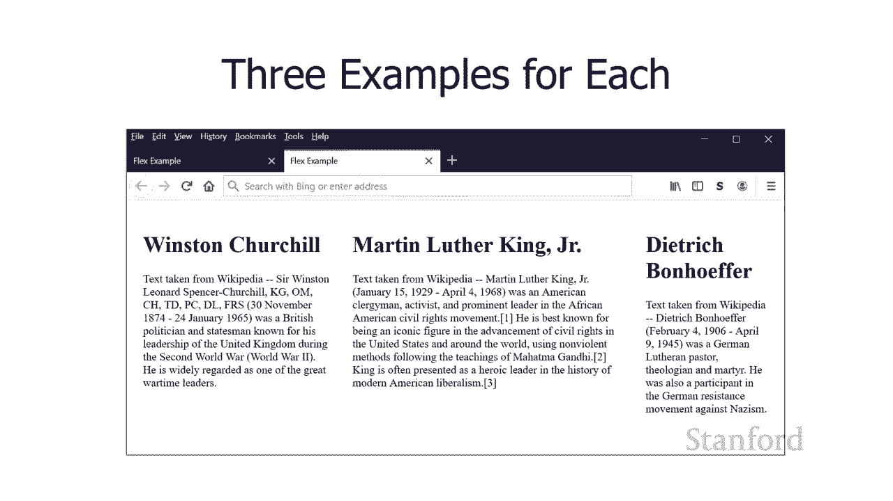
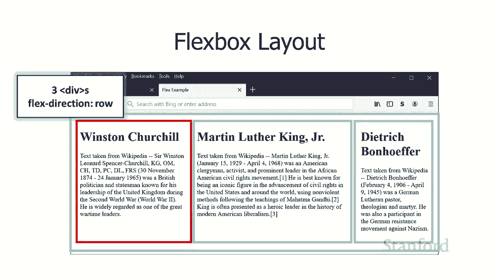
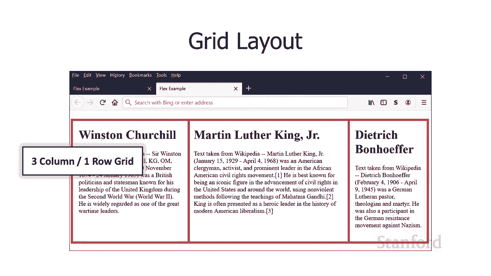

# 【双语字幕+资料下载】斯坦福CS105 ｜ 计算机科学导论(2021最新·完整版) - P37：L11.1- 网页布局：布局技术概述 - ShowMeAI - BV1eh411W72E

undefined，欢迎探索，欢迎探索，今天的计算视频 网页布局，今天的计算视频 网页布局，布局技术概述 所以在这个，布局技术概述 所以在这个，视频中，我们将看看四种，视频中，我们将看看四种。

不同的网页布局方式 其中，不同的网页布局方式 其中，两种目前正在广泛，两种目前正在广泛，使用，因此其中一种，使用，因此其中一种，是显而易见的原因 并与，undefined，undefined。

我们的第四种方法进行比较，并，我们的第四种方法进行比较，并，重点介绍第四种方法的真正优点，undefined，undefined，然后第四种方法，然后第四种方法，是网页布局的未来，是网页布局的未来。

但可能还没有，但可能还没有，像我实际使用的中间两种技术那样广泛使用，像我实际使用的中间两种技术那样广泛使用，建议您使用，建议您使用，第四种技术，除非您有，第四种技术，除非您有，充分的理由不。

充分的理由不，这样做，所以让我们来看看这些，所以，这样做，所以让我们来看看这些，所以，第一种，第一种，技术是基于表格的布局，这，技术是基于表格的布局，这，不再使用，但正如我，不再使用，但正如我。

通过将基于表格的布局与我们的，通过将基于表格的布局与我们的，第四种，第四种，方法 基于网格的布局 您将，方法 基于网格的布局 您将，真正了解使用，真正了解使用，级联样式表的优势是什么以及为什么。

级联样式表的优势是什么以及为什么，基于网格的布局是一种很好的方式，基于网格的布局是一种很好的方式，我们将要讨论的第二种技术，我们将要讨论的第二种技术，是浮动 基于布局，是浮动 基于布局，这是多年来使用。

这是多年来使用，最广泛的技术，最广泛的技术，我只是做了一个快速的抽查，我只是做了一个快速的抽查，例如华盛顿邮报，例如华盛顿邮报，现在正在使用基于浮动的布局，现在正在使用基于浮动的布局。

我们的第三种技术 flexbox 布局，我们的第三种技术 flexbox 布局，已经，已经，在 在过去的大约三年左右的时间里，在 在过去的大约三年左右的时间里，我认为这不是一个很好的选择。

我认为这不是一个很好的选择，了解它是很好的，并且，了解它是很好的，并且，flexbox 中使用的技术，flexbox 中使用的技术，将用于各种目的，将用于各种目的，但我真的不认为您应该将。

但我真的不认为您应该将，其用作您的 主要的布局技术，其用作您的 主要的布局技术，最初开发时并不是有意的，undefined，undefined，人们已经将它用作，人们已经将它用作。

黑客我认为它不是最好的，黑客我认为它不是最好的，我真的认为这最后一个，我真的认为这最后一个，基于网格的布局绝对是要走的路，undefined，undefined，嗯，但你知道现在最常用的两种，嗯。

但你知道现在最常用的两种，技术是，技术是，基于浮动的布局和 flexbox 布局，所以，基于浮动的布局和 flexbox 布局，所以，如果你访问一个现有的 uh 网页，如果你访问一个现有的 uh 网页。

undefined，undefined，这两种技术你最，这两种技术你最，有，有，可能遇到另一件事 是，undefined，undefined，基于网格的布局即使它，基于网格的布局即使它。

真的很棒也没有被广泛使用的原因之一，真的很棒也没有被广泛使用的原因之一，undefined，undefined，是直到，是直到，最近所有网络浏览器都支持，最近所有网络浏览器都支持，它并且此时。

它并且此时，大约有 95 个网络浏览器被淘汰，大约有 95 个网络浏览器被淘汰，那里支持它，那里支持它，所以你可能仍然会遇到一些，undefined，undefined，无法使用它的 Web 浏览器。

嗯，flexbox 布局，无法使用它的 Web 浏览器，嗯，flexbox 布局，有大约 97 种支持，然后，有大约 97 种支持，然后，基于浮动布局和基于表格的大声，基于浮动布局和基于表格的大声。

每个人都可以使用，每个人都可以使用，但不要使用基于表格的布局，但不要使用基于表格的布局，好吧我们' 我将，好吧我们' 我将，针对这四种，针对这四种，技术中的每一种进行三个示例，以便。

技术中的每一种进行三个示例，以便，让我们有机会了解它们是如何工作的，让我们有机会了解它们是如何工作的，我实际上不会在此特定视频中向您展示，我实际上不会在此特定视频中向您展示，任何 html 或 css。

任何 html 或 css，但我们，但我们，将进行广泛的研究，将进行广泛的研究，在下一个视频中的网格布局，然后，在下一个视频中的网格布局，然后，对于 cs105 学生，我们将，对于 cs105 学生。

我们将，有一个完整的讲座，我们将在其中查看，有一个完整的讲座，我们将在其中查看，一堆不同的示例，一堆不同的示例，然后我使用网格重新创建，然后我使用网格重新创建，纽约时报网站的部分内容和。

纽约时报网站的部分内容和。

华盛顿邮报网站的部分内容 -基于 ，华盛顿邮报网站的部分内容 -基于 ，布局，这样你就可以很好地，布局，这样你就可以很好地，了解它是如何工作的，了解它是如何工作的。

所以我们的第一个例子将是，所以我们的第一个例子将是，这个简单的三列网页，这个简单的三列网页，undefined，undefined，然后我们将看看，然后我们将看看，这个网页，它混合了，这个网页。

它混合了，不同的列格式，所以我们将，不同的列格式，所以我们将，在顶部有三列，在底部有两，在顶部有三列，在底部有两，列，列，最后是我们的最后一个例子，你，最后是我们的最后一个例子，你，可以，可以。

在这里有这种相当混合的布局，你知道，在这里有这种相当混合的布局，你知道，它不像，它不像，顶部有两列和三列 在，顶部有两列和三列 在，底部，底部，它真的有点混乱，所以，它真的有点混乱，所以。

我们将看到每种不同的，我们将看到每种不同的，布局技术如何，布局技术如何。

处理这三种情况中的每一种，所以，处理这三种情况中的每一种，所以，基于表格的布局基于，基于表格的布局基于，表格的概念，因此，表格的概念，因此，表格从 开始，表格从 开始，我们之前讨论过，我们之前讨论过。

html 是如何从欧洲的欧洲，html 是如何从欧洲的欧洲，核子研究中心物理联盟的物理学中产生的，核子研究中心物理联盟的物理学中产生的，呃你知道他们正在，呃你知道他们正在，尝试交换物理论文。

尝试交换物理论文，你需要物理的东西之一，你需要物理的东西之一，就是表格，所以我们，就是表格，所以我们，从一开始就有表格 所以，从一开始就有表格 所以，基本上有一段时间我们使用这些。

基本上有一段时间我们使用这些，表格来，表格来。

布置我们的网页 我稍后会，布置我们的网页 我稍后会，讨论为什么这不是最好的，讨论为什么这不是最好的，方法但是，方法但是，嗯所以假设我已经有了这些呃我想，嗯所以假设我已经有了这些呃我想。

继续 并复制我的三，继续 并复制我的三，列，列，网站，如果您，网站，如果您，考虑一下，我怎么能做得好这个三列网站，undefined，undefined，只是一个表格，其中有一行和，只是一个表格。

其中有一行和，三列，所以实际上非常，三列，所以实际上非常。

简单，呃，简单，呃，使用基于表格的布局重新创建它，使用基于表格的布局重新创建它，然后我们已经 我们的，然后我们已经 我们的，桌子在这里有不同的顶部和底部，桌子在这里有不同的顶部和底部。

undefined，undefined，所以有几种方法可以做到，所以有几种方法可以做到，这，这，一点，所以你可以做的一件事就是，一点，所以你可以做的一件事就是，嵌套你的桌子，所以我们有，嵌套你的桌子。

所以我们有，一个表格，它由两行的单列组成，undefined，undefined，然后在里面 第一个，然后在里面 第一个，表你有另一个表，它是，表你有另一个表，它是，一个，一个，三列单行表，然后。

三列单行表，然后，在底部你有一个，在底部你有一个，两列，两列，单行表，或者你可以有一个单表，其中，单行表，或者你可以有一个单表，其中，有四列和两行，有四列和两行，然后你可以利用 的，然后你可以利用 的。

column span，column span，uh 属性让你的一些，uh 属性让你的一些。

元素跨越多个列，元素跨越多个列，所以这些，所以这些，方法中的每一种都可以正常工作，方法中的每一种都可以正常工作，最后我们在这里有这种混合布局，最后我们在这里有这种混合布局。

所以我认为考虑这个的最简单方法，所以我认为考虑这个的最简单方法，是考虑嵌套，是考虑嵌套，和 所以，和 所以，所有这些技术都会发生的一件事是你，所有这些技术都会发生的一件事是你，可以使用，可以使用，嵌套。

所以你可以说哦，我要，嵌套，所以你可以说哦，我要，继续把它，继续把它，当作一个布局，我在左边有一列，在右边有一列，undefined，undefined，然后你可以进入并，然后你可以进入并。

在右边的那一，undefined，undefined，undefined，undefined，栏中说得好，undefined，undefined，整个事情，因为，整个事情，因为，我有一个两列单行表。

我有一个两列单行表，然后在右列我可以说，然后在右列我可以说，在那个表里面我实际上有，在那个表里面我实际上有，另一个表，另一个表，那个表是两行一列，那个表是两行一列，然后你可以把它更进一步。

然后你可以把它更进一步，你可以 说和第二行，你可以 说和第二行，行为 ually 包含另一个表格，它，行为 ually 包含另一个表格，它，是一行中的两列，是一行中的两列，这一切都有效，但这实际上。

这一切都有效，但这实际上，是，是，我们不再真正进行表格布局的原因之一，我们不再真正进行表格布局的原因之一，那就是当您开始，那就是当您开始，嵌套表格时，嵌套表格时，它变得越来越计算，它变得越来越计算。

昂贵并且 布局较慢，昂贵并且 布局较慢，所以通常三层，所以通常三层，表就可以了，但是一旦你，表就可以了，但是一旦你，开始得到四层或五层或，开始得到四层或五层或，六层表，它开始变得，六层表，它开始变得。

有点混乱，有点混乱，网络浏览器，网络浏览器，对它不太满意还有其他原因，呃，对它不太满意还有其他原因，呃，这不是 不是最好的方法，尽管，这不是 不是最好的方法，尽管，其中一些问题也会，其中一些问题也会。

在接下来的两种技术中出现也，在接下来的两种技术中出现也，可以，所以不要将其视为，可以，所以不要将其视为，表格内的表格嵌套内的表格嵌套，表格内的表格嵌套内的表格嵌套，您也可以将其，您也可以将其。

视为三列两行 表，视为三列两行 表，然后使用行跨度和调用跨度，然后使用行跨度和调用跨度，这也可以工作，这也可以工作，您知道这取决于您，您知道这取决于您，尝试执行的操作，尝试执行的操作。

其中一个或另一个可能会，其中一个或另一个可能会，更好，更好。

但我们不会担心 ut，但我们不会担心 ut，在这个视频中，这些技术中的任何一种，在这个视频中，这些技术中的任何一种，都可以工作，都可以工作，所以基于表格的布局有什么问题，所以基于表格的布局有什么问题。

最大的问题之一，最大的问题之一，是表格在我们的 html 中，所以，是表格在我们的 html 中，所以，当我们创建我们的 html 时，我们正在定义，当我们创建我们的 html 时，我们正在定义。

我们的布局，我们的布局，在 html，所以我们真的，在 html，所以我们真的，把自己锁定在，把自己锁定在，一个特定的布局中，如果我们想，一个特定的布局中，如果我们想，在以后更改布局，在以后更改布局。

假设我想更改，假设我想更改，undefined，undefined，我网站上所有网页的布局，我，我网站上所有网页的布局，我，需要进入并修改，需要进入并修改，每个 html 文件，因为 html。

每个 html 文件，因为 html，文件的布局，文件的布局，编码在这些 html 文件的表格中，编码在这些 html 文件的表格中，而不是，而不是，从我们的级联样式表中分离出来。

从我们的级联样式表中分离出来，请记住，这就是我们所说的，我们真的，请记住，这就是我们所说的，我们真的，希望，希望，在级联样式表上拥有演示信息，在级联样式表上拥有演示信息，所以我 可以修改级联样式。

所以我 可以修改级联样式，表，它会立即更改，表，它会立即更改，我们网站上的所有网页，我们网站上的所有网页，这不适用于，这不适用于，表格，实际上我们将，表格，实际上我们将，发现它不适用于接下来的。

发现它不适用于接下来的，两种技术，两种技术。

然后就像我提到的那样，嵌套，然后就像我提到的那样，嵌套，表可能会变得计算，表可能会变得计算，成本高，成本高，所以我们使用基于表的，所以我们使用基于表的，布局很多年了，布局很多年了，但是当我们开始使用。

但是当我们开始使用，级联样式表时，另一种技术，级联样式表时，另一种技术，出现在，出现在，uh 之前，这就是这种基于浮动的，uh 之前，这就是这种基于浮动的，布局，布局，和 基于浮动的布局仍然使用。

和 基于浮动的布局仍然使用，得相当多，得相当多，你会遇到，你会遇到，许多使用基于浮动的布局的网站，那么基于，许多使用基于浮动的布局的网站，那么基于，浮动的布局如何运作良好，浮动的布局如何运作良好。

首先要提醒自己的是，首先要提醒自己的是，浮动的概念是什么，所以我们已经，浮动的概念是什么，所以我们已经，讨论过了 关于浮动 之前在这门课上，讨论过了 关于浮动 之前在这门课上，我们讨论过浮动图像。

我们讨论过浮动图像，所以在左边我有一张威尼斯的图像，所以在左边我有一张威尼斯的图像，我向左浮动然后，我向左浮动然后，我，我，在右边有文字然后，在右边有文字然后，我们做了这个例子，我们有图像。

我们做了这个例子，我们有图像，在它下面有标题，在它下面有标题，在这种情况下，我实际上并没有，在这种情况下，我实际上并没有，浮动图像我实际上，浮动图像我实际上，浮动了一些 div，浮动了一些 div。

其中 div 包含图像，其中 div 包含图像。

和它下面的标题，但，和它下面的标题，但，我们再次浮动 那些从左到右，我们再次浮动 那些从左到右，undefined，undefined，正如我在谈论浮动时非常简短地提到的，undefined。

undefined，你可以浮动任何块级元素，你可以浮动任何块级元素，所以在这里我有一个块引用，所以在这里我有一个块引用，我已经，我已经，将块引用浮动到左边，将块引用浮动到左边，你可以 看到它正在做与。

你可以 看到它正在做与，我们将图像，我们将图像，从左向右浮动时所做的完全相同的事情，从左向右浮动时所做的完全相同的事情，因此我们实际上可以浮动，因此我们实际上可以浮动，多个图像，并且。

undefined，undefined，如果我将两个图像，如果我将两个图像，向左浮动并且您知道，这实际上会将图像堆叠在一起 假设它们合适，向左浮动并且您知道，这实际上会将图像堆叠在一起 假设它们合适。

它们最终会彼此，它们最终会彼此，相邻，我可以在这里，相邻，我可以在这里，用这些块引用做同样的事情，所以我在，用这些块引用做同样的事情，所以我在，这里所做的是我添加了第二个块。

这里所做的是我添加了第二个块，引用，引用，我已经告诉了两个块任务，我已经告诉了两个块任务，浮动到左边，浮动到左边，它们最后彼此紧挨着，它们最后彼此紧挨着，就像我们原来的一样，就像我们原来的一样。

他们有一个单块引用，我们把它，他们有一个单块引用，我们把它，浮动到左边，现在我们有两个，浮动到左边，现在我们有两个，块引用，我们把它们都浮动，块引用，我们把它们都浮动，到左边，到左边，嗯。

如果你喜欢 想想，嗯，如果你喜欢 想想，这两个块引号在这里做什么，这两个块引号在这里做什么，向左浮动，向左浮动，这些基本上是列，这些基本上是列，所以，所以，我可以去掉两个块引号以外的文本。

undefined，undefined，这就是我所拥有的，所以我有，这就是我所拥有的，所以我有，两列，两列，你知道如果你看过任何网页，你知道如果你看过任何网页，它们都 由不同的列组成。

它们都 由不同的列组成，所以这确实是，所以这确实是，使用浮动布局网页的关键，我们，使用浮动布局网页的关键，我们，继续创建这些不同的，继续创建这些不同的，列，我们将它们浮动，列，我们将它们浮动，到左侧。

到左侧，所以我使用的是块引号，我可以，所以我使用的是块引号，我可以，用 div 替换块代码，用 div 替换块代码，并且您基本上可以将任何可渲染，并且您基本上可以将任何可渲染，元素放在 div 中。

因此，元素放在 div 中，因此，这里我有两个 div 都浮动，这里我有两个 div 都浮动，到左侧，到左侧，因此如果我们转到我们的三个示例，因此如果我们转到我们的三个示例，如果我想布局我的三列，我。

如果我想布局我的三列，我，只需继续创建三个 div，只需继续创建三个 div，然后我将每个 div，然后我将每个 div，向左浮动，可以混合，向左浮动，可以混合，向左浮动和向右浮动，向左浮动和向右浮动。

但在某些情况下会变得混乱，但在某些，但在某些情况下会变得混乱，但在某些，情况下它也很有用，情况下它也很有用，但是如果您只是将，但是如果您只是将，所有内容都，所有内容都。

向左浮动 基本上可以cr 吃任何，向左浮动 基本上可以cr 吃任何，由不同列组成的网页，undefined，undefined，好吧，那么我们的示例中，好吧，那么我们的示例中，undefined。

undefined，顶部有三列，底部有两列，undefined，undefined，我将如何处理这个问题，我将如何处理这个问题，你要做的是你是第一个，你要做的是你是第一个，要将网页，要将网页。

分成两个 div，这些只是，分成两个 div，这些只是，标准 div，标准 div，undefined，undefined，一个 div 后跟另一个 div 的标准行为是。

一个 div 后跟另一个 div 的标准行为是，将两个 div 堆叠在一起，将两个 div 堆叠在一起，然后我们要做的是，然后我们要做的是，将一堆 div 放在，将一堆 div 放在。

其中一个标准 div 中，而，其中一个标准 div 中，而，不是仅使用标准行为，不是仅使用标准行为，div，我们将，div，我们将，像之前所做的那样将它们向左浮动，像之前所做的那样将它们向左浮动。

然后我们将做同样的事情，然后我们将做同样的事情，底部 我们将在底部创建两个差异，底部 我们将在底部创建两个差异，它也会将它们都浮动到，undefined，undefined，左侧 我们实际上会得到。

左侧 我们实际上会得到，我们在这里期待的东西，undefined，undefined，undefined，我将在，我将在，这次讨论中完全忽略，这次讨论中完全忽略，混乱，你知道吗 您确实想使用，混乱。

你知道吗 您确实想使用，基于浮动的布局，基于浮动的布局，嗯，使用基于浮动的，嗯，使用基于浮动的，布局的好处是它可以在 100，布局的好处是它可以在 100，种 Web 浏览器中工作，而。

种 Web 浏览器中工作，而，我们接下来的两种技术，嗯，您会记得，我们接下来的两种技术，嗯，您会记得，下一种技术适用于 97，下一种技术适用于 97，种 Web 浏览器和最终，种 Web 浏览器和最终。

技术仅适用于 95 个，技术仅适用于 95 个，基于浮动的 Web 浏览器将适用于所有浏览器，基于浮动的 Web 浏览器将适用于所有浏览器，undefined，undefined。

嗯 好的 那么我们在这里的混合示例，嗯 好的 那么我们在这里的混合示例，undefined，undefined，又如何呢 我们想要做的是我们，又如何呢 我们想要做的是我们，想要考虑嵌套 所以我 我将。

想要考虑嵌套 所以我 我将，在这里有两个 div，在这里有两个 div，我要把两个 div 都向左浮动，我要把两个 div 都向左浮动，这会给我，这会给我，两列的概念，两列的概念，所以我有一个列。

我有红色的，所以我有一个列，我有红色的，列，然后我有 浅蓝色，列，然后我有 浅蓝色，列，列，然后在浅蓝色列中，我，然后在浅蓝色列中，我，将创建两个 div，将创建两个 div。

并记住如果您有 div 并且，并记住如果您有 div 并且，您没有浮动将 div 堆叠在一起的 div，您没有浮动将 div 堆叠在一起的 div，所以，所以，我有这两个 div 堆叠在。

我有这两个 div 堆叠在，彼此的顶部，彼此的顶部，然后底部 div 我要，然后底部 div 我要。

再放两个 div 我要把，再放两个 div 我要把，它们都浮动到左边，这就是我如何，它们都浮动到左边，这就是我如何，让这一切正常工作，让这一切正常工作，所以基于浮动的布局的问题。

所以基于浮动的布局的问题，是它仍然与 html 密切相关，是它仍然与 html 密切相关，所以为了让这些列浮动，所以为了让这些列浮动，到左边，到左边，我需要创建 div 以完全。

我需要创建 div 以完全，正确的方式，所以我可以，正确的方式，所以我可以，以特定的方式移动元素，以特定的方式移动元素，使它们彼此堆叠在一起，undefined，undefined，所以结果证明。

所以结果证明，我的 html 仍然与布局非常紧密地联系在一起，undefined，undefined，你不能只是改变 css 并，你不能只是改变 css 并，拥有一个全新的网页，您可以。

拥有一个全新的网页，您可以，进行一些更改，但在大多数情况，进行一些更改，但在大多数情况，下，您选择的 html 和 div，下，您选择的 html 和 div，以及放置 div 的。

以及放置 div 的，方式将真正推动网页，undefined，undefined，在网络浏览器中的显示方式，还有 为了让所有这些差异正常工作，在网络浏览器中的显示方式，还有 为了让所有这些差异正常工作。

我在这里完全忽略了一些混乱的问题，undefined，undefined，undefined，undefined，当然可以处理它们或，当然可以处理它们或，处理它们的技术，但它并不，undefined。

undefined，像我可能让您，像我可能让您，undefined，undefined，相信我们在这里的讨论那么干净，但是 尽管如此，相信我们在这里的讨论那么干净，但是 尽管如此。

这个 te  chnique um，这个 te  chnique um，使用非常广泛，并且，使用非常广泛，并且，作为网页上使用的主要技术已经有，undefined，undefined，一段时间了。

一段时间了，嗯，下一个技术使用一种，嗯，下一个技术使用一种，叫做 flexbox 的东西，所以让，叫做 flexbox 的东西，所以让，我们先谈谈，我们先谈谈，flexbox 是什么。

flexbox 是什么，所以 flexbox 被设计成 取一堆，undefined，undefined，包含在父，包含在父，div 中的 div 并有点控制，div 中的 div 并有点控制。

那些内部 div 的样子，所以，undefined，undefined，你可以，你可以，用这些，用这些，内部子 div 做的关键事情之一是你可以控制，内部子 div 做的关键事情之一是你可以控制。

是否 它们出现在一行或一，是否 它们出现在一行或一，列中，列中，所以嗯，我有一行 div，所以嗯，我有一行 div，然后我，然后我，可以通过更改一个样式表属性轻松地将其更改为倾角列，undefined。

undefined，并且您也可以做一些花哨的事情，并且您也可以做一些花哨的事情，所以我嗯，所以我嗯，你知道，所以在这里我实际上是在，你知道，所以在这里我实际上是在，显示父 div，所以我有。

显示父 div，所以我有，abc 和 d 包含一个明显的 div，abc 和 d 包含一个明显的 div，所以 abc 和 d 是 div，所以 abc 和 d 是 div，它们包含在父 div 中。

它们包含在父 div 中，所以你可以看到我可以移动 div，所以你可以看到我可以移动 div，向左我可以将它们向右移动我，向左我可以将它们向右移动我，可以 移到中间，我可以将它们，可以 移到中间。

我可以将它们，展开，展开，因此这些都是不同的事情，因此这些都是不同的事情，您可以通过，您可以通过，更改样式表属性轻松完成这些事情，undefined，undefined，undefined。

undefined，可以说，如果它们不合适，我希望，可以说，如果它们不合适，我希望，你喜欢把它们挤在那里，你喜欢把它们挤在那里，嗯，所以，嗯，所以，你可以用，你可以用，uh 子 div 做不同的事情。

你可以选择某些，uh 子 div 做不同的事情，你可以选择某些，子 div 并说嘿，如果我们有，子 div 并说嘿，如果我们有，额外的 空间我希望它扩大以，额外的 空间我希望它扩大以，占用，占用。

最大的可用空间，最大的可用空间，你可以玩对齐，你可以玩对齐，嗯所以，嗯所以，如果你想想我们，如果你想想我们，到目前为止看到的，到目前为止看到的，你可能想知道，你可能想知道，你怎么知道这看起来。

你怎么知道这看起来，很有用 但这似乎并没有真正，很有用 但这似乎并没有真正，布置网页，这，布置网页，这，当然是最初的意图，当然是最初的意图，意图是，意图是。

flexbox 布局并不是为了实际布置网页而设计的，undefined，undefined，我认为发生的事情是人们，我认为发生的事情是人们，真的厌倦了基于浮动的布局，真的厌倦了基于浮动的布局。

它 很乱而你 里面有，它 很乱而你 里面有，你的 html 和 flexbox 布局中的所有这些额外的东西，undefined，undefined，都出现了，人们都很棒，都出现了，人们都很棒。

我只是要使用它，我只是要使用它，你知道也许这不是，你知道也许这不是，最初的 10 或 4 但我要使用，undefined，undefined，无论如何，什么是 flexbox 布局实际上，无论如何。

什么是 flexbox 布局实际上。

是，是，为 flexbox 和基于网格的布局而设计的，为 flexbox 和基于网格的布局而设计的，这将是我们最后的，这将是我们最后的，技术 flexbox 和 grid。

技术 flexbox 和 grid，几乎是同时定义的，这个想法是，几乎是同时定义的，这个想法是，undefined，undefined，你要混合使用网格，你要混合使用网格。

布局 和 flexbox 布局来布局你的，undefined，undefined，网页 网格布局将，网页 网格布局将，用于主要组件，用于主要组件，并弄清楚所有，并弄清楚所有，整体如何组合在一起，你。

整体如何组合在一起，你，可以将 flexbox 用于，可以将 flexbox 用于，较小的组件，所以，undefined，undefined，我在这里的意思是 有华盛顿帖子的截图，undefined。

undefined，你可以在网页的右侧看到，你可以在网页的右侧看到，我有，我有，很多不同的意见，所以，很多不同的意见，所以，可以使用 flexbox 来布置这些意见。

可以使用 flexbox 来布置这些意见，undefined，undefined，并且网页的整体外观，并且网页的整体外观。

将被布置 出去  使用网格，将被布置 出去  使用网格，然后这里是另一个示例，然后这里是另一个示例，我们将这个中心部分，我们将这个中心部分，称为您在家的时间，并且，称为您在家的时间，并且。

整个网页可以用，整个网页可以用，网格布局，然后，网格布局，然后，在家中的四年时间可能有点，undefined，undefined，灵活 flexbox 就在那里，所以我们。

灵活 flexbox 就在那里，所以我们，还没有真正谈论过它，还没有真正谈论过它，但除此之外，flexbox 还可以，但除此之外，flexbox 还可以，用来设置不同的元素顺序，用来设置不同的元素顺序。

所以，所以，你知道，呃，你知道，呃，假设他们知道你真的，假设他们知道你真的，很喜欢巧克力，很喜欢巧克力，还有很多食谱和，还有很多食谱和，其中一个是巧克力，他们可以，undefined。

undefined，使用 uh javascript uh 调整样式表，使用 uh javascript uh 调整样式表，undefined，undefined，并将巧克力食谱放在。

并将巧克力食谱放在，顶部，所以这是一种，顶部，所以这是一种，你可以用 flexbox 做的事情，你可以用 flexbox 做的事情，所以 flexbox 很有用，所以 flexbox 很有用。

我当然不会，我当然不会，建议你，建议你，如果你打算去创建，如果你打算去创建，你不应该知道 flexbox 是如何工作的网页，undefined，undefined，但就 flexbox 用于。

但就 flexbox 用于。

整个网页布局而言，整个网页布局而言，我认为这不是理想的选择，我认为这不是理想的选择，好吧，所以让我们 看看 flexbox 是如何，好吧，所以让我们 看看 flexbox 是如何，用于布局的。

所以我们在这里得到，用于布局的，所以我们在这里得到，了三列，了三列，所以这很简单，嗯，我，所以这很简单，嗯，我，需要一个外部 div，因为 flexbox 总是，需要一个外部 div。

因为 flexbox 总是，undefined，undefined，使用父 div，然后，使用父 div，然后，一堆孩子这样做，所以我 继续，一堆孩子这样做，所以我 继续，创建父 div。

创建父 div，然后在父 div 中我要，然后在父 div 中我要，继续放置三个孩子，继续放置三个孩子，嗯三个是孩子的 div 然后，嗯三个是孩子的 div 然后，我要告诉它使用 flexbox。

我要告诉它使用 flexbox，行，所以说那三个，行，所以说那三个，孩子们应该排成一排，孩子们应该排成一排。

而不是排在列之外，而不是排在列之外，所以这绝对适用于我们，所以这绝对适用于我们，这里更混乱的技术，这里更混乱的技术，呃上下嗯，呃上下嗯，第三列和第二列它会变得，第三列和第二列它会变得，有点混乱，所以。

有点混乱，所以，我要开始了 说，我要开始了 说，好的整个事情，好的整个事情，嗯那是一个 div 你知道我们以前，嗯那是一个 div 你知道我们以前，见过这个它有这个，见过这个它有这个，有用的属性。

我们可以用它来，有用的属性，我们可以用它来，居中所有东西，居中所有东西，然后在那个 div 里面我有两个，然后在那个 div 里面我有两个，孩子，孩子，这些孩子将被安放，这些孩子将被安放，在列中。

在列中，然后每个 这些孩子中的一个也，然后每个 这些孩子中的一个也，将包含，将包含，他们自己的孩子，他们，他们自己的孩子，他们。

将按行排列，将按行排列，因此我可以在顶部和底部执行此操作，因此我可以在顶部和底部执行此操作，这样就可以了，这样就可以了，然后对于我们这里的混合示例，然后对于我们这里的混合示例，我将继续使用这个。

我将继续使用这个，嵌套的想法，所以我有外部 div，嵌套的想法，所以我有外部 div，它有两个孩子，这些孩子被，它有两个孩子，这些孩子被，布置为行，布置为行，然后第二个孩子有，然后第二个孩子有。

两个 div，这些孩子被布置为，两个 div，这些孩子被布置为，列，然后第二个，列，然后第二个，孩子第二个孩子有两个 更多的 div，孩子第二个孩子有两个 更多的 div。

和那些排列成行的，所以这，和那些排列成行的，所以这，确实有效，确实有效，嗯，这里涉及的问题是因为我们，嗯，这里涉及的问题是因为我们，仍然，仍然，与 html 密切相关，我们可以做。

与 html 密切相关，我们可以做，undefined，undefined，一些你知道 html 已经设置的事情，一些你知道 html 已经设置的事情，undefined，undefined。

我们可以改变方向 这，我们可以改变方向 这，实际上，实际上，可以很好地为您，可以很好地为您，考虑，如果我有一台台式，考虑，如果我有一台台式，显示器，也许我想把东西，显示器，也许我想把东西，排成一排。

但如果，排成一排，但如果，它要放在非常窄的手机上，它要放在非常窄的手机上，所以我希望，所以我希望，它们 出现在列中，它们 出现在列中，所以你可以用它做一些事情，所以你可以用它做一些事情。

但 变化非常有限，我们，但 变化非常有限，我们，仍然，仍然，受到某些，受到某些，元素包含在某些，元素包含在某些，其他元素中的想法的限制，这将，其他元素中的想法的限制，这将，真正，真正。

决定我们可以用我们的，决定我们可以用我们的，级联样式表做什么，所以我们可以，级联样式表做什么，所以我们可以，用级联样式表做一些事情，用级联样式表做一些事情，但，但。

总的来说很多 它仍然受到 html 中指定内容的限制，undefined，undefined，所以我们在网格布局中获得了我们的最后一项技术，undefined，undefined，网格布局我们将。

网格布局我们将，网页分解成一个网格，然后我们将，网页分解成一个网格，然后我们将，元素，元素，放在网格中的任何方块上，你，放在网格中的任何方块上，你，也可以这样做 列跨度上的行跨度。

也可以这样做 列跨度上的行跨度，如果你想变得更漂亮，所以，如果你想变得更漂亮，所以，你知道如果你想说哦，我想让，你知道如果你想说哦，我想让，那个元素，那个元素，穿过呃这两个网格元素。

穿过呃这两个网格元素，如果你想说，如果你想说，一个煎蛋卷穿过多个行，一个煎蛋卷穿过多个行，元素，这完全没问题，元素，这完全没问题，这也很好，在下一个，这也很好，在下一个，视频中，我们实际上将向您。

视频中，我们实际上将向您，展示这一切是如何工作的，因为，展示这一切是如何工作的，因为，这是一种技术，我将，这是一种技术，我将，建议您使用，建议您使用，OK 所以网格布局 嗯，我们的第一个。

OK 所以网格布局 嗯，我们的第一个，e 例如，e 例如。

这只是一个三列一行的，这只是一个三列一行的，网格，网格，然后对于我们的下一个示例，然后对于我们的下一个示例，您可以使用一，您可以使用一，列两行网格，列两行网格，然后两个内部网格进行嵌套，或者。

然后两个内部网格进行嵌套，或者，您可以创建一个四列两行，您可以创建一个四列两行。

网格，网格，然后是我们的最后一个示例 可以，然后是我们的最后一个示例 可以，再次做内部，再次做内部，呃你知道用一个外部网格然后，呃你知道用一个外部网格然后，一堆内部网格，一堆内部网格。

或者你可以做三列两，或者你可以做三列两，行，行，网格如果你一直在关注，网格如果你一直在关注，呃你记得我在说，呃你记得我在说，什么 之前关于表格是如何，什么 之前关于表格是如何，工作的，工作的。

您可能会认为这看起来，您可能会认为这看起来，与表格完全一样，与表格完全一样，实际上我对这部分图纸感到非常高兴，实际上我对这部分图纸感到非常高兴，因为我不必，因为我不必，undefined。

undefined，为基于网格的布局重新绘制任何内容，我，为基于网格的布局重新绘制任何内容，我，只是采用了基于表格的布局，只是采用了基于表格的布局，图纸 我用网格替换了单词，图纸 我用网格替换了单词。

表，所以一列两行的，表，所以一列两行的，表变成了，表变成了，一列两行的网格，所以，一列两行的网格，所以，我们从表格布局开始，嗯，undefined，undefined，我们回到了与我们。

我们回到了与我们，开始时，开始时，一样的事情，这里是 基于表格的，一样的事情，这里是 基于表格的，undefined，undefined，布局表格在 html 中，布局表格在 html 中。

它不在级联样式表中，所以，它不在级联样式表中，所以，如果我们想更改布局，如果我们想更改布局，我们需要进入并修改 html 中的表格，undefined，undefined，同样如果你看到浮动，你。

同样如果你看到浮动，你，知道有一堆 浮动的东西，知道有一堆 浮动的东西，这，这，或多或少与 html 相关，您可以，或多或少与 html 相关，您可以，进行一些更改，也许，进行一些更改，也许。

您可以将某些内容向右浮动，您可以将某些内容向右浮动，而不是向左浮动，但实际上您，而不是向左浮动，但实际上您，将在很大程度上受限，将在很大程度上受限，于 html 的编写方式和 再次使用。

于 html 的编写方式和 再次使用，undefined，undefined，flexbox，您将，flexbox，您将，受到您在 html 中编写的内容的极大限制。

受到您在 html 中编写的内容的极大限制，undefined，undefined，基于网格的布局并非如此，基于网格的布局并非如此，undefined，undefined。

因此如果我想要一个用于台式计算机的网格，我可以定义网格和，因此如果我想要一个用于台式计算机的网格，我可以定义网格和，级联样式表，undefined，undefined，大屏幕，大屏幕。

平板电脑的不同网格 手机的第三个，平板电脑的不同网格 手机的第三个，网格，网格，完全没问题 我可以，完全没问题 我可以，定义，定义，任意数量的网格 cs105 学生 我们将。

任意数量的网格 cs105 学生 我们将，在下周讨论响应式，在下周讨论响应式，网页设计，网页设计，cs106e 学生时讨论这个问题 哦，伙计们，你们会，cs106e 学生时讨论这个问题 哦，伙计们。

你们会，错过 呃，但，错过 呃，但，如果你们中的任何人对此感兴趣，我会提供 105 个讲座，如果你们中的任何人对此感兴趣，我会提供 105 个讲座，undefined，undefined。

所以你知道我们可以，undefined，undefined，undefined，在我们的级联样式表中为各种不同的用途定义各种网格，然后，在我们的级联样式表中为各种不同的用途定义各种网格，然后，我们可以。

我们可以，在这个网格上的任何地方放置任何我们想要的元素，我们，在这个网格上的任何地方放置任何我们想要的元素，我们，完全，完全，不受 html 的限制，不受 html 的限制。

只要我的 html 中有一堆，undefined，undefined，div 或者任何其他块元素，div 或者任何其他块元素，我给它们 id，我给它们 id，我可以选择其中的任何一个 我。

我可以选择其中的任何一个 我，给了他们一个 id 的元素，我可以将它们放置，给了他们一个 id 的元素，我可以将它们放置，在级联样式表中的任何网格中，在级联样式表中的任何网格中，这样我们就可以完全。

这样我们就可以完全，灵活，灵活，地使用级联样式表重新排序、重新设计，地使用级联样式表重新排序、重新设计，和修改，和修改，而根本不更改 html，而根本不更改 html，所以，所以，undefined。

undefined，只是认为这种技术，只是认为这种技术，很棒呃，很棒呃，我绝对认为这是未来 嗯，我绝对认为这是未来 嗯，真的唯一的缺点而且这，真的唯一的缺点而且这，越来越不是一个问题。

越来越不是一个问题，5％的网络，5％的网络，浏览器将无法 到 现在使用它，浏览器将无法 到 现在使用它，我会说当我第一次看到这种，我会说当我第一次看到这种，技术时，我认为它，技术时，我认为它，真的很棒。

我开始，真的很棒，我开始，在我的 193c，在我的 193c，课上教它，这是一门，课上教它，这是一门，专业的网络开发课程，专业的网络开发课程，我教了它我教了几年，我教了它我教了几年，undefined。

undefined，它仍然 基本上不受，它仍然 基本上不受，任何网络浏览器的支持 这，任何网络浏览器的支持 这，是 Internet Explorer，是 Internet Explorer。

chrome 的东西 有一个版本，chrome 的东西 有一个版本，可以工作一段，可以工作一段，时间 只是看起来不像，时间 只是看起来不像，会发生什么 但，会发生什么 但，它终于发生了 你知道 95。

它终于发生了 你知道 95，个网络 浏览器现在支持，个网络 浏览器现在支持，这个技术很棒它给了你，这个技术很棒它给了你，很大的灵活性，很大的灵活性，它比浮动更容易理解，它比浮动更容易理解。

我认为它更容易理解，我认为它更容易理解，flexbox 就像，flexbox 就像，是的你无法理解，是的你无法理解，flexbox 在单个部分规模上做什么，flexbox 在单个部分规模上做什么。

但是然后当你尝试 并，但是然后当你尝试 并，使用 flexbox 布置整个网页，使用 flexbox 布置整个网页，它只是变得有点讨厌，它只是变得有点讨厌，网格布局太棒了，我只是一个，网格布局太棒了。

我只是一个，超级粉丝，所以这是，超级粉丝，所以这是，我要向大家推荐的技术，我要向大家推荐的技术，唯一的缺点，唯一的缺点，如果您现在正在尝试创建一个网站，undefined，undefined。

请考虑您的受众是谁，并，请考虑您的受众是谁，并，考虑他们是否拥有，考虑他们是否拥有，现代网络浏览器，以便，现代网络浏览器，以便，您知道您是否正在做一些，undefined，undefined。

您的受众可能没有现代网络的事情，您的受众可能没有现代网络的事情，浏览器，那么，浏览器，那么，也许这不是您想要使用的技术，也许这不是您想要使用的技术，但否则，但否则，我认为这绝对是可行的方法。

我认为这绝对是可行的方法，这是一项很棒的技术，所以，这是一项很棒的技术，所以，在下一讲中我们将，在下一讲中我们将，实际向您展示这种技术是如何，实际向您展示这种技术是如何，工作的，工作的。

呃我们' 将教你如何，呃我们' 将教你如何。

为它创建 css 以及如何，为它创建 css 以及如何，在网页上放置元素，到时。

