# 【双语字幕+资料下载】斯坦福CS105 ｜ 计算机科学导论(2021最新·完整版) - P38：L11.2- 网页布局：基于网格的布局 - ShowMeAI - BV1eh411W72E

undefined，欢迎探索，欢迎探索，今天的计算视频是网页布局，今天的计算视频是网页布局，基于网格的布局，正如我在，基于网格的布局，正如我在，上一个视频中所建议的，上一个视频中所建议的，我认为您应该。

我认为您应该，用于布局网页的技术，用于布局网页的技术，是基于网格的布局，您可以，是基于网格的布局，您可以，继续使用，继续使用，flexbox 网站，但，flexbox 网站，但，您网站的整体布局。

您网站的整体布局，应该使用基于网格的布局来完成，应该使用基于网格的布局来完成，undefined，undefined。

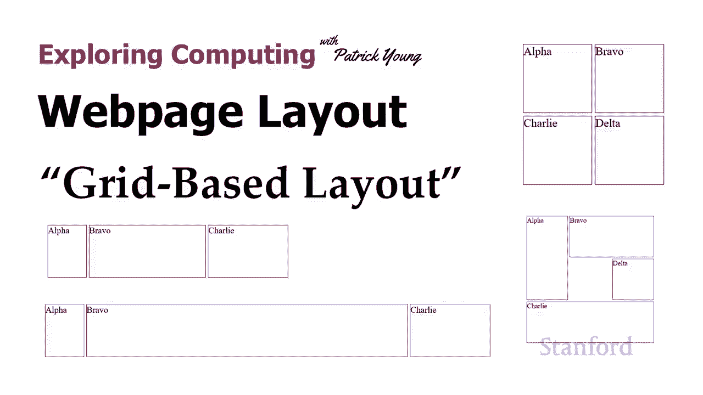

因此在本视频中，我们将向您，因此在本视频中，我们将向您，展示如何实际做到这一点，展示如何实际做到这一点，现在，现在，为了获得基于网格的布局，您需要了解几件事，为了获得基于网格的布局，您需要了解几件事。

第一个是如何，第一个是如何，定义网格，事实证明有，定义网格，事实证明有，很多不同的方法来定义，很多不同的方法来定义，网格，网格，所以我们将向您展示其中的，所以我们将向您展示其中的，一些技术。

但如果您真的，一些技术，但如果您真的，想进入它，那么有很多，想进入它，那么有很多，比我，比我，将在此视频中向您展示的技术更多可用的技术，将在此视频中向您展示的技术更多可用的技术，您需要知道的第二件事是。

undefined，undefined，如果您正在做一些非常简单的简单事情，如果您正在做一些非常简单的简单事情，并且如果您是，并且如果您是，d 做一些花哨的事情，它确实变得，d 做一些花哨的事情。

它确实变得，有点复杂，所以我们也会，undefined，undefined，看看你的一些选项，看看你的一些选项，undefined，undefined，所以这就是我们的第一个例子。

所以这就是我们的第一个例子，我们有一个基本，我们有一个基本，的二乘二正方形，的二乘二正方形，所以这就是我们的 html 的样子，所以这就是我们的 html 的样子，我们只有四个 div 并且记住。

undefined，undefined，基于网格的布局的好处之一是我们并没有真正，基于网格的布局的好处之一是我们并没有真正，在我们的 html 中做任何特别的，在我们的 html 中做任何特别的。

事情来让我们的布局，事情来让我们的布局，按照我们想要的方式工作 我们，按照我们想要的方式工作 我们，在 html 中只有一堆元素，在 html 中只有一堆元素。

我们可以通过使用这种基于网格的布局将这些元素放在，我们可以通过使用这种基于网格的布局将这些元素放在，html 中我们网站上任何我们想要的位置，html 中我们网站上任何我们想要的位置，所以，所以。

正如我提到的，我们确实需要定义，正如我提到的，我们确实需要定义，网格，网格，我们应该定义一个，undefined，undefined，如果您想使用整个网页，那么现在包含网格的父级，如果您想使用整个网页。

那么现在包含网格的父级，是网格，这就是我们在，是网格，这就是我们在，这里所做的，然后继续使用，这里所做的，然后继续使用，主体，主体，作为网格的父级，所以我，作为网格的父级，所以我，说整个主体应该是。

说整个主体应该是，undefined，undefined，如果您想要像 y 这样更高级的东西，则显示为网格 你，如果您想要像 y 这样更高级的东西，则显示为网格 你，有网格嵌套在网格内。

有网格嵌套在网格内，那么你将不得不，那么你将不得不，决定合适的父级是什么，但如果你，决定合适的父级是什么，但如果你，想再次将整个网页，想再次将整个网页，设置为单个网格，只需继续，设置为单个网格。

只需继续，并在正文上使用它，那就是，并在正文上使用它，那就是，我将在这里为这些示例做些什么，我将在这里为这些示例做些什么，所以身体，所以身体，显示类型是网格，然后我，显示类型是网格，然后我，将继续。

undefined，undefined，使用网格模板列和网格，使用网格模板列和网格，模板行定义列数和行数，所以我有，模板行定义列数和行数，所以我有，两列每列 100 像素我有两。

两列每列 100 像素我有两，行每行 100 像素，行每行 100 像素，然后嗯我让它，然后嗯我让它，实际显示，实际显示，该边框的方式所以很明显，该边框的方式所以很明显，发生了什么，发生了什么。

我在这里设置了边框，我在这里设置了边框。

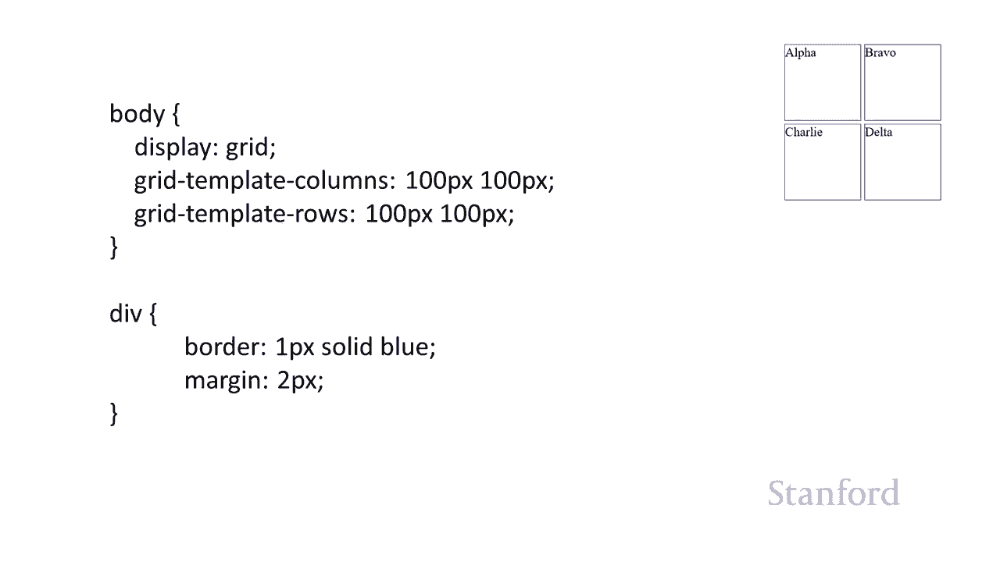

边框一个像素看到蓝色 有两个，边框一个像素看到蓝色 有两个，像素的，像素的，边距可以，然后我只是将元素，边距可以，然后我只是将元素，放在网格上，放在网格上，因此有许多不同的，因此有许多不同的。

样式属性可以，样式属性可以，执行此操作我将保持简单，执行此操作我将保持简单，我将继续使用网格，我将继续使用网格，列开始和网格 行开始这，列开始和网格 行开始这，将，将，允许我们放置 网格上的元素。

允许我们放置 网格上的元素，仅使用两个不同的属性 grid，仅使用两个不同的属性 grid，column start，column start。

grid column 和 grid row start 和 grid，grid column 和 grid row start 和 grid，row，row，稍后我们将讨论结束元素。

undefined，undefined，如果您继续并放置一个，如果您继续并放置一个，开始元素，它将只是 继续，开始元素，它将只是 继续，把它放在那个，把它放在那个，特定的网格元素中，你。

特定的网格元素中，你，不必担心结束只有，不必担心结束只有，当我们在做，当我们在做，一些奇特的事情时才需要结束，一些奇特的事情时才需要结束，所以我把，所以我把，带有 ida 的元素放在一个。

带有 ida 的元素放在一个，元素 b 中 和两个一 c 一个二和两个，元素 b 中 和两个一 c 一个二和两个，d，d，和两个两个 记住因为，和两个两个 记住因为，这是基于网格的布局。

undefined，undefined，如果我们想，如果我们想，将它们以相反的顺序放置 如果我们想，将它们以相反的顺序放置 如果我们想，放置它们，则不会受到 html 外观的限制 你知道，放置它们。

则不会受到 html 外观的限制 你知道，我们想把它们放在哪里，我们可以，我们想把它们放在哪里，我们可以，继续把它们放在那里，继续把它们放在那里，你也可以把这些东西叠，你也可以把这些东西叠，在一起，但。

在一起，但，不要这样做，你实际上会，undefined，undefined，看到文字在每个上面乱七八糟 其他，看到文字在每个上面乱七八糟 其他，那可能不是你想做的，那可能不是你想做的，呃。

如果你想要一个 o  f 元素，呃，如果你想要一个 o  f 元素，由于某种原因不显示，比如，由于某种原因不显示，比如，undefined，undefined，可能你已经设置好了它。

可能你已经设置好了它，在台式电脑上看起来很棒，但它，在台式电脑上看起来很棒，但它，正在平板电脑上显示，正在平板电脑上显示，你知道你只是没有空间放，你知道你只是没有空间放，所有东西，而你 不想，所有东西。

而你 不想，做一些滚动，做一些滚动，记住你可以在，记住你可以在，这些元素之一上使用 display none 并且它会，这些元素之一上使用 display none 并且它会。

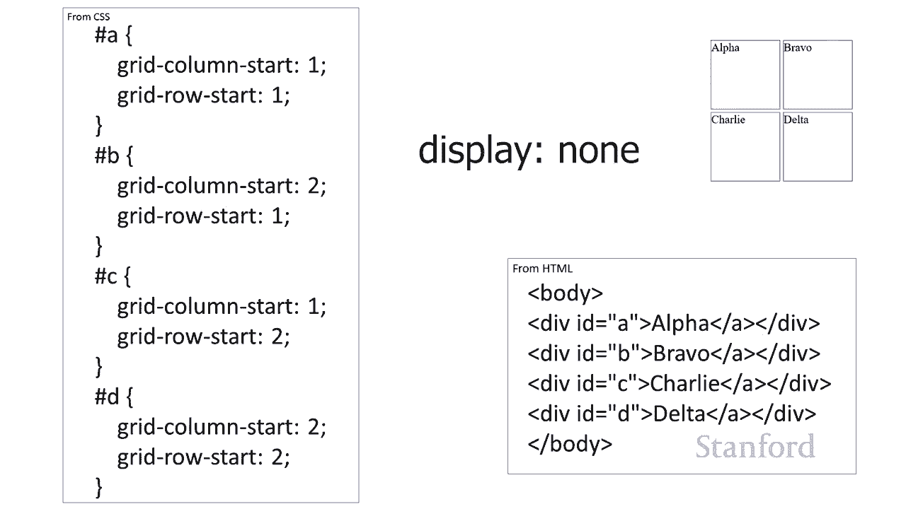

完全消失，完全消失，所以正如我提到的，有，所以正如我提到的，有，不同的布局，不同的布局，网格的选项，网格的选项，所以在这里你看到了 我们有，所以在这里你看到了 我们有，不同的，不同的。

测量类型 其中一个有趣的，测量类型 其中一个有趣的，测量类型是百分比，测量类型是百分比，所以你可以看到，嗯，我，所以你可以看到，嗯，我，undefined，undefined。

在第一列中布置了 30 个网格，第二列中布置了 50%，undefined，undefined，第三列和行中布置了 20 个网格 我，第三列和行中布置了 20 个网格 我，实际上使用的，实际上使用的。

是英寸厘米和毫米的设定测量值，undefined，undefined。

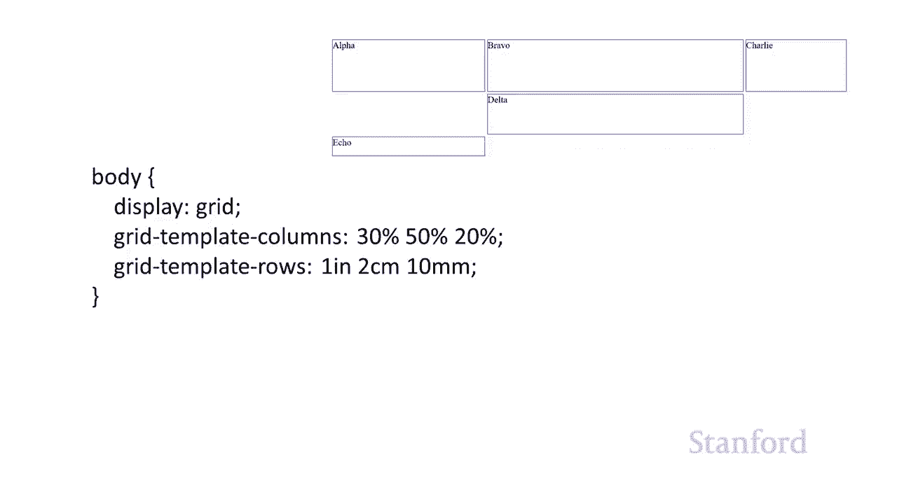

所以重点是你有，所以重点是你有，一堆可以使用的不同测量类型，一堆可以使用的不同测量类型，实际上你，实际上你，可以在这里做一些混合以及，可以在这里做一些混合以及，一个有趣的测量，一个有趣的测量。

提供的类型是 fr 测量类型，提供的类型是 fr 测量类型，fr 代表分数，fr 代表分数，它基本上提供了使用固定测量后剩余空间量的一小部分，undefined，undefined，所以，所以。

这里我有，这里我有，三列，第一列是 75 个像素，三列，第一列是 75 个像素，最后一列是 150 个像素，最后一列是 150 个像素，所以它占用了 225 像素，并且，所以它占用了 225 像素。

并且，取决于 Web 浏览器窗口的宽度，undefined，undefined，我们可能会有很多剩余空间，我们可能会有很多剩余空间，或者我们可能只有一点，或者我们可能只有一点，剩余空间，剩余空间，即我。

即我，标记为 1fr，标记为 1fr，的第二列 剩下的空间，所以你知道，的第二列 剩下的空间，所以你知道，如果我有一个非常宽的窗户，那么，如果我有一个非常宽的窗户，那么，一个 fr 是一个很大的空间。

我有，一个 fr 是一个很大的空间，我有，一个狭窄的窗户，那么也许一个 fr 是，一个狭窄的窗户，那么也许一个 fr 是，它的空间很大，但它是，它的空间很大，但它是，在 之后剩下的空间量 75。

在 之后剩下的空间量 75。

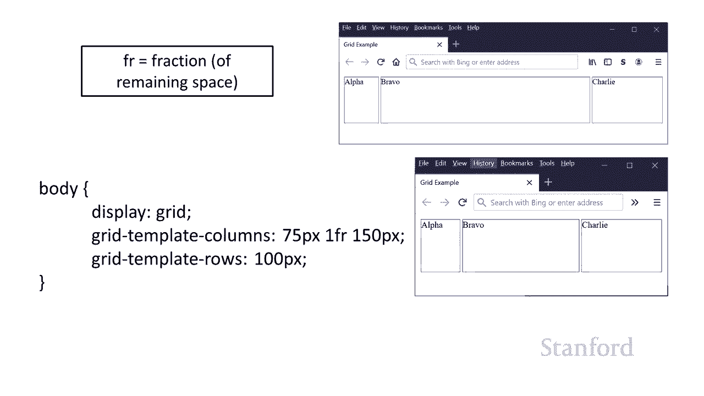

像素固定量和 150 像素，像素固定量和 150 像素，固定量已被使用，固定量已被使用，fr 将是现在剩下的任何东西，undefined，undefined，undefined，undefined。

undefined，第二个 列是 1fr，第二个 列是 1fr，第三列是 2fr，所以，第三列是 2fr，所以，这意味着，这意味着，我们再次取固定数量，我们再次取固定数量。

即我们从窗口的总宽度中减去的 75 个像素，即我们从窗口的总宽度中减去的 75 个像素，undefined，undefined，undefined，剩下的空间将，剩下的空间将，在所有 fr 段之间划分。

在所有 fr 段之间划分，因为现在 我们说一个，因为现在 我们说一个，第二列 1 fr，第二列 1 fr，和第三列 2fr 这，和第三列 2fr 这，意味着第三列将，意味着第三列将，是第二列的两倍。

是第二列的两倍，所以你可以在这里看到第二列，所以你可以在这里看到第二列，是剩余空间的，是剩余空间的，三分之一，第三列是二 -，三分之一，第三列是二 -，剩余空间的三分之一以及它的工作方式。

剩余空间的三分之一以及它的工作方式，是您只需计算 frs 的数量并将其，是您只需计算 frs 的数量并将其，分开，分开，这样您就知道我是否有一个，这样您就知道我是否有一个，有五个 frs 的列。

其中一个，有五个 frs 的列，其中一个，成本是两个 frs，第三列是，成本是两个 frs，第三列是，一个 fr 我会将五加二，一个 fr 我会将五加二，加到一个中，我会说哦，加到一个中，我会说哦。

每个 fr 是剩余空间量的八分之一，undefined，undefined，所以您知道只需，所以您知道只需。

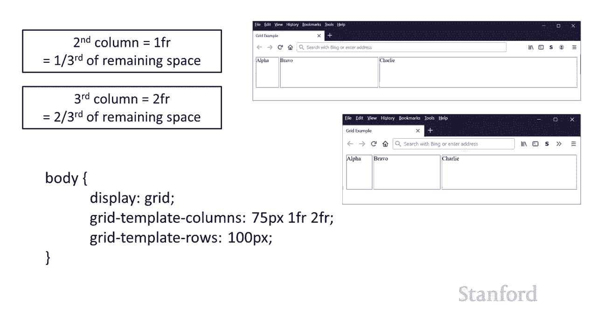

根据，根据，您在每个人中放入的 frs 数量将其除以 frs，您在每个人中放入的 frs 数量将其除以 frs，列，列，可以，以便 做下一个例子，我们，可以，以便 做下一个例子，我们，需要，需要。

有一个列跨度的行跨度，所以，有一个列跨度的行跨度，所以，你可以看到 bravo 跨越两，你可以看到 bravo 跨越两，列，alpha 跨越两，列，alpha 跨越两，行，查理现在跨越三列，行。

查理现在跨越三列，正如我提到的，有多种，正如我提到的，有多种，不同的方法可以做到这一点，不同的方法可以做到这一点，还有一些 其中一些在讲义中有所描述，还有一些 其中一些在讲义中有所描述，但我要在。

但我要在，这里谈论的，这里谈论的，是呃我们只是继续前进，是呃我们只是继续前进，并开始，并开始，和结束好吧所以这里的身体，和结束好吧所以这里的身体，呃你知道看起来和以前完全一样。

呃你知道看起来和以前完全一样，undefined，undefined，我只有四个不同的 div，我只有四个不同的 div，然后这里，然后这里，是我的身体样式规则，说，是我的身体样式规则，说。

我有一个网格，我有一个网格，有三列和，有三列和，三行，每个都是 100 像素，三行，每个都是 100 像素，然后这里是，然后这里是，a 的设置 呃 alpha 有 ida。

a 的设置 呃 alpha 有 ida，bravo 有 idb，bravo 有 idb，这有点乱，undefined，undefined，undefined，undefined，提供开始，提供开始。

如果我想穿越，我只会提供结束，如果我想穿越，我只会提供结束，r 多，r 多，列或多行 所以在这种情况下，列或多行 所以在这种情况下，a 或 alpha 跨越两行 所以我。

a 或 alpha 跨越两行 所以我，需要一个，需要一个，开始和一个结束，undefined，undefined，undefined，知道他们为什么这样做，知道他们为什么这样做，但结尾不是。

undefined，undefined，元素中的最后一行或最后一列，它实际上，元素中的最后一行或最后一列，它实际上，undefined，undefined，是最后一个元素之后的行或列，所以在这里。

是最后一个元素之后的行或列，所以在这里，我希望 alpha 跨越第一行和第二行，我希望 alpha 跨越第一行和第二行，undefined，undefined，所以我将行结尾列为，所以我将行结尾列为。

第三行 所以我再次覆盖第一行和第二行，第三行 所以我再次覆盖第一行和第二行，undefined，undefined，我的 n 行将被列为，我的 n 行将被列为，三行，它超出，三行，它超出。

了 bravo 元素的末尾，了 bravo 元素的末尾，其中包含 idb 我要跨越，其中包含 idb 我要跨越，几列，所以第一列，几列，所以第一列，开始列，开始列，是 第二列我也将穿过。

undefined，undefined，第三列，然后我的 n 列将被，第三列，然后我的 n 列将被，列为，列为，4，它甚至不存在这里，但，4，它甚至不存在这里，但，再次列出，再次列出。

元素所在位置之外的列或行，所以我，元素所在位置之外的列或行，所以我，undefined，undefined，从两个到四个，其中包括两个，从两个到四个，其中包括两个，而实际上排除了四个。

而实际上排除了四个，所以两个 t  o 四，所以两个 t  o 四，我实际上再次覆盖了两个三，我实际上再次覆盖了两个三，undefined，undefined，我认为这很令人困惑我不。

我认为这很令人困惑我不，知道他们为什么决定这样做，但这就是他们决定这样做的方式，undefined，undefined，然后这里是 ac 和 d，然后这里是 ac 和 d，你可以看到那个查理 覆盖。

你可以看到那个查理 覆盖，第一二三栏，所以它从第一栏开始，第一二三栏，所以它从第一栏开始，在第四栏结束，在第四栏结束，因为它再次超过，因为它再次超过，了任何封面的结尾，我们正在覆盖，了任何封面的结尾。

我们正在覆盖，一二和三，一二和三，所以结束是四嗯，然后是，所以结束是四嗯，然后是，undefined，undefined，呃它只是 覆盖单个常见的，呃它只是 覆盖单个常见的。

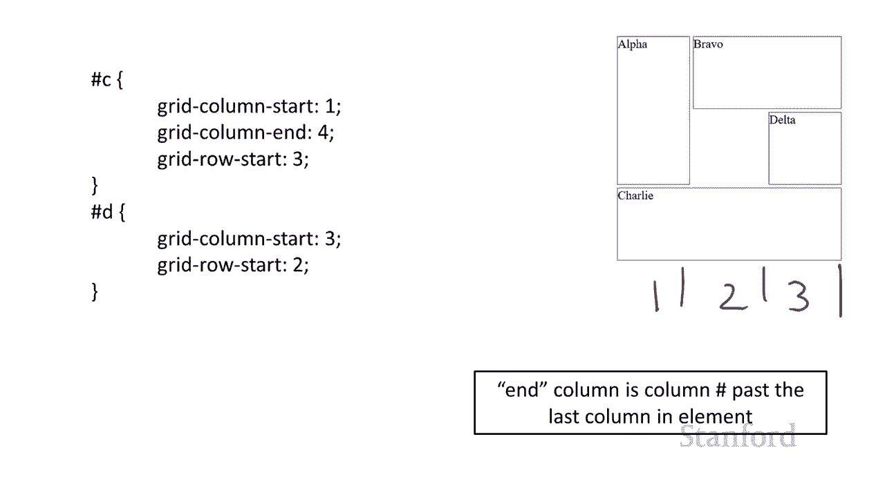

单行，所以我不需要，单行，所以我不需要，提供列末端或行末端，提供列末端或行末端，好吧 之前出现的问题之一，好吧 之前出现的问题之一，我已经，我已经，预设了高度和宽度，预设了高度和宽度。

我确保文本非常适合，我确保文本非常适合，如果，如果，我有很长的文本，我有很长的文本，或者我不知道该文本有多长，或者我不知道该文本有多长，或者，或者，我将高度设置为特定，我将高度设置为特定，值但它不适合。

那么会发生什么，这就是，值但它不适合，那么会发生什么，这就是，我们的情况” 再看看，我们的情况” 再看看，让我们首先说你知道我，让我们首先说你知道我，认为最常见的情况，认为最常见的情况。

我们不知道文本要多长时间，我们不知道文本要多长时间，但无论多长，我们都希望它。

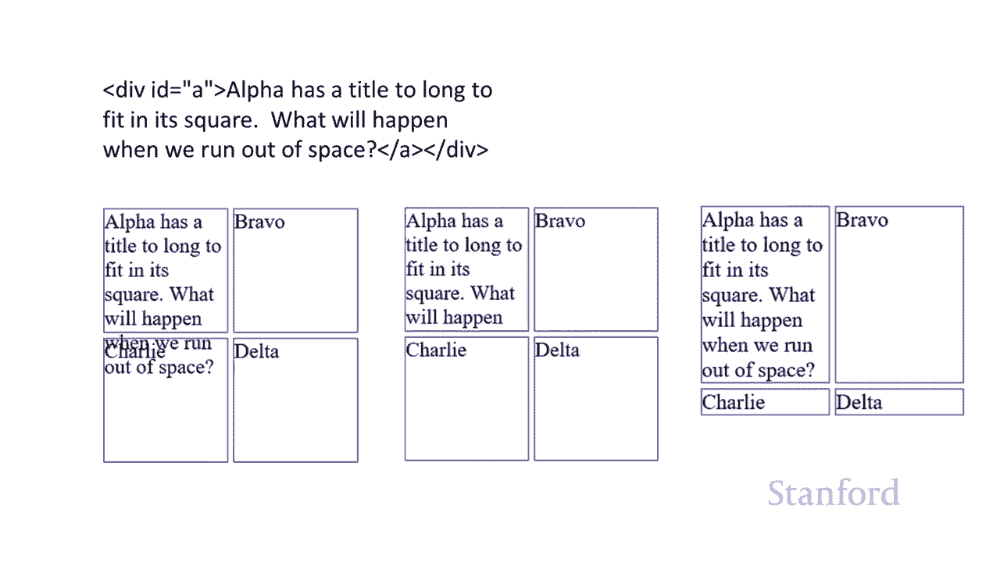

undefined，undefined，适合所有内容，所以我们在这里有几个选择，适合所有内容，所以我们在这里有几个选择，呃，如果，呃，如果，我们的所有元素都是如此，我们，我们的所有元素都是如此，我们。

就，就，无法指定 一个高度，因此，无法指定 一个高度，因此，您通常要指定宽度，您通常要指定宽度，但如果，但如果，您不指定高度，undefined，undefined，undefined。

则不必指定高度 文本，则不必指定高度 文本，可用，所以你可以在这里看到，可用，所以你可以在这里看到，alpha 真的很长，所以 alpha 有一个，alpha 真的很长，所以 alpha 有一个，标题。

它太长了，不适合等等等等，标题，它太长了，不适合等等等等，等等等等，等等等等，所以发生的事情是正方形，所以发生的事情是正方形，只是整行只是扩展以，只是整行只是扩展以，占据最长或需要多少空间。

占据最长或需要多少空间，最高的项目，最高的项目，然后是 charlie 和 delta 的第二行，undefined，undefined，它们根本不占用太多空间，它们根本不占用太多空间，所以它们非常短。

所以它们非常短，所以你知道不要，所以你知道不要，为行提供任何设置，为行提供任何设置，你可能会得到你想要的行为，你可能会得到你想要的行为，undefined，undefined，或者你可以明确地。

或者你可以明确地，将行标记为自动，将行标记为自动，所以基本上我们 '这里说的，所以基本上我们 '这里说的，是默认行为是自动，是默认行为是自动，行为，自动行为的简称是，行为，自动行为的简称是。

undefined，undefined，自动提供尽可能多的空间，自动提供尽可能多的空间，好吧，好吧，为什么我们要使用这个自动，当，为什么我们要使用这个自动，当，这是默认行为时，我们，这是默认行为时。

我们，可能想使用自动我们 实际上有，可能想使用自动我们 实际上有，一个混合，其中，一个混合，其中，一些行我们想要自动，一些行我们想要自动，而其中一些我们不需要，所以在这种，而其中一些我们不需要。

所以在这种，情况下，情况下，我希望第一行是自动的，但，我希望第一行是自动的，但，第二行我，第二行我。

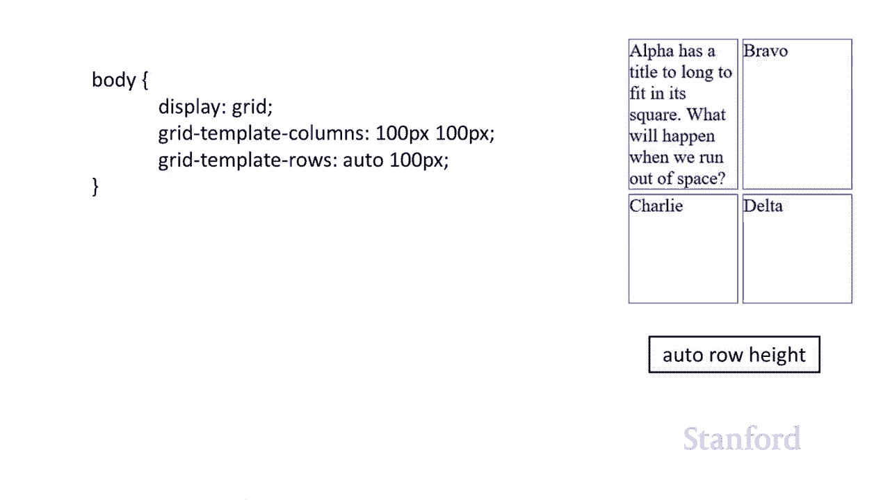

只想设置为 100 像素，只想设置为 100 像素，这样就可以了 完全没问题，这样就可以了 完全没问题，现在让我们回到之前的案例，现在让我们回到之前的案例，我说，我说，嘿，如果有一个固定的高度并且它。

嘿，如果有一个固定的高度并且它，实际上不适合它，实际上不适合它，怎么办所以在左边你可以看到，怎么办所以在左边你可以看到，undefined，undefined，呃 alpha 不适合它的。

呃 alpha 不适合它的，正方形 只是继续跑过去，你，正方形 只是继续跑过去，你，实际上可以看到 charlie，实际上可以看到 charlie，和那里的文本，然后，和那里的文本，然后。

第二个情况它刚刚被切断，第二个情况它刚刚被切断，所以这里会发生什么，所以这里会发生什么，是默认行为是，是默认行为是，如果它不适合行，如果它不适合行，它只是去 继续前进，如果，它只是去 继续前进，如果。

其他事情发生了 如果你明确地放置而不是使用我们之前谈到的自动，其他事情发生了 如果你明确地放置而不是使用我们之前谈到的自动，那么它就会继续并被，那么它就会继续并被，放置，如果你想的话。

undefined，undefined，undefined，它们只会出现在彼此的顶部，它们只会出现在彼此的顶部，undefined，undefined，如果你，如果你，明确地，明确地。

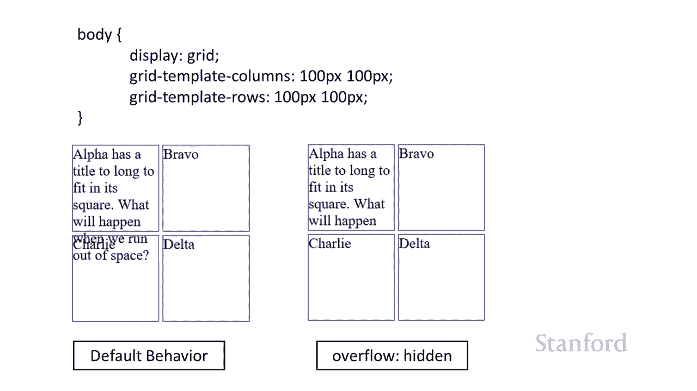

想要通过将溢出设置为隐藏来切断它，想要通过将溢出设置为隐藏来切断它，所以这是第一个示例，所以这是第一个示例，我们没有将溢出设置为，我们没有将溢出设置为，隐藏，只是继续运行，隐藏，只是继续运行。

你可以看到我没有，你可以看到我没有，设置 alpha 呃那是 id 对于，设置 alpha 呃那是 id 对于，alpha 方块，alpha 方块，除了设置列开始，除了设置列开始，和行开始，和行开始。

然后在第二个示例中，我将溢出设置为，然后在第二个示例中，我将溢出设置为，隐藏，您可以看到它只是，隐藏，您可以看到它只是，被，被，砍掉了，所以，砍掉了，所以，我无法想象你可能，我无法想象你可能。

undefined，undefined，很少 在您实际上希望，很少 在您实际上希望，文本溢出并与其他内容重叠的情况下，undefined，undefined。

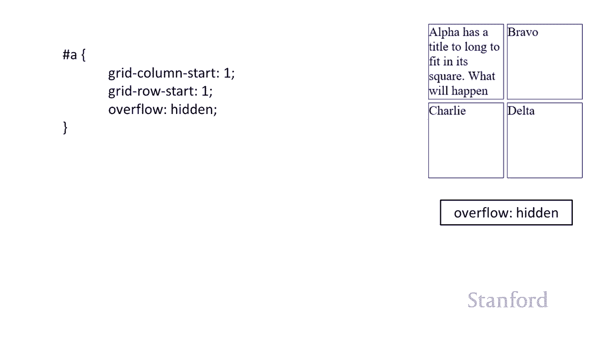

通常您要么希望将其，通常您要么希望将其，设置为自动，要么希望，设置为自动，要么希望，undefined，undefined，好最后一件事我想通过，好最后一件事我想通过，更，更。

现实的例子所以我们 我从之前的视频中得到了我们的，现实的例子所以我们 我从之前的视频中得到了我们的，复杂示例，undefined，undefined，当然有几种方法可以做到，当然有几种方法可以做到。

这一点，我们可以进行一些嵌套，这一点，我们可以进行一些嵌套，但我们不会这样做，我们，但我们不会这样做，我们，只是继续在这里创建一个网格，只是继续在这里创建一个网格，undefined。

undefined。

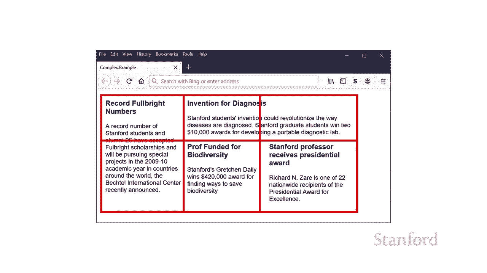

将创建一个三列两，将创建一个三列两，行，行，网格，然后这是我的 html，网格，然后这是我的 html，我要将所有内容都放在一个，我要将所有内容都放在一个，id 为，id 为，main 的 div 中。

然后它可以用于，undefined，undefined，居中之类的事情，就像我们之前看到的，居中之类的事情，就像我们之前看到的，放入，放入，推杆一样 整个页面内容周围的边框。

推杆一样 整个页面内容周围的边框，嗯，嗯，我们可能想要这样做的原因有很多，我们可能想要这样做的原因有很多，但我只想把新，但我只想把新，故事和 div 一样放在那里，故事和 div 一样放在那里。

呃在 diff 内部等于主要，呃在 diff 内部等于主要，所以又是好处 与，所以又是好处 与，我们，我们，在上一个视频中讨论的任何其他技术相反，在上一个视频中讨论的任何其他技术相反。

我可以移动这些技术，我可以移动这些技术，我的 html 中没有任何内容，我的 html 中没有任何内容，将我锁定在特定布局中，因此，将我锁定在特定布局中，因此，您知道我是否想，您知道我是否想。

通过记录开始 富布赖特数字，通过记录开始 富布赖特数字，是主要故事 ho，undefined，undefined，如果在其他时候我想说，如果在其他时候我想说，的是，的是，要谈论的关键是，要谈论的关键是。

gretchen daly 教授，gretchen daly 教授，在生物多样性方面获得资助，我可以，在生物多样性方面获得资助，我可以，将它移到左侧，将它移到左侧，我可以将这些元素中的任何一个移到。

我可以将这些元素中的任何一个移到，我想要的这些方块中的任何一个我可以，我想要的这些方块中的任何一个我可以，在以后确定，在以后确定，这些故事中的哪些应该，这些故事中的哪些应该，跨越多行或多列。

跨越多行或多列，没有一个被锁定到我的 html 我的，没有一个被锁定到我的 html 我的，html 没有指定，html 没有指定，任何这些信息它只是说，任何这些信息它只是说，这里是一堆故事。

这里是一堆故事，好吧，我在这里定义我的网格，好吧，我在这里定义我的网格，呃我要把它放在，呃我要把它放在，我们一分钟前看到的主 div 上而不是，我们一分钟前看到的主 div 上而不是，放在身体上。

放在身体上，所以你可以看到我在这里设置了三，所以你可以看到我在这里设置了三，列，我不是 费心，列，我不是 费心，设置任何行，我只是要使用，设置任何行，我只是要使用，行的自动设置，行的自动设置。

然后我继续，undefined，undefined，在某些情况下放下元素，例如记录的富布赖特，在某些情况下放下元素，例如记录的富布赖特，数字，呃，数字，呃，它将跨越多行，它将跨越多行，所以我必须。

所以我必须，从第一行开始，我想覆盖第，从第一行开始，我想覆盖第，t 行 我和我必须记住，t 行 我和我必须记住，烦人的第 n 行是一个，烦人的第 n 行是一个，柔和的行，嗯，我实际上正在使用，所以。

柔和的行，嗯，我实际上正在使用，所以，我使用的是第一行和第二行，所以 n 行，我使用的是第一行和第二行，所以 n 行，是第三行，是第三行，嗯，同样适用，嗯，同样适用，于从 com2 开始的诊断发明。

于从 com2 开始的诊断发明，它会覆盖第二列和第三列，它会覆盖第二列和第三列，所以最后一列是第四列，所以最后一列是第四列，嗯，这里没有很多其他的事情，嗯，这里没有很多其他的事情，除了你会注意到。

除了你会注意到，我在这里放了一些边距来获得，我在这里放了一些边距来获得，一些间距，一些间距，有很多方法可以做到，有很多方法可以做到，间距，间距，我真的不想教你们，我真的不想教你们，额外的，额外的。

样式属性，所以有一些，样式属性，所以有一些，网格特定的方法可以做到这一点，但，网格特定的方法可以做到这一点，但，根据你已经知道的，你，根据你已经知道的，你，可以继续使用边距，可以继续使用边距。

这样就可以给你一个好的开始，这样就可以给你一个好的开始，关于，关于，如何使用基于网格的布局来为，如何使用基于网格的布局来为，cs105 学生创建一些有趣的布局，cs105 学生创建一些有趣的布局。

下节课我们，下节课我们，将，将，深入挖掘，正如我之前提到的，深入挖掘，正如我之前提到的，我们实际上将重新创建，我们实际上将重新创建，纽约时代的部分内容和，纽约时代的部分内容和，华盛顿邮报的部分内容。

华盛顿邮报的部分内容。

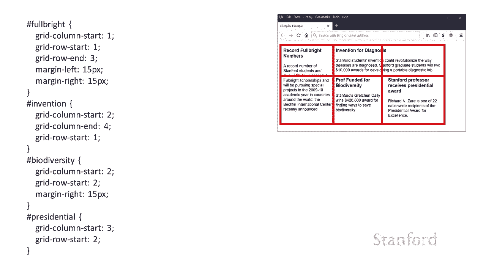

使用 g 基于网格的布局我很快就会和你们谈谈。

undefined。