# 【双语字幕+资料下载】斯坦福CS105 ｜ 计算机科学导论(2021最新·完整版) - P39：L12- 网页重现：《纽约时报》 - ShowMeAI - BV1eh411W72E

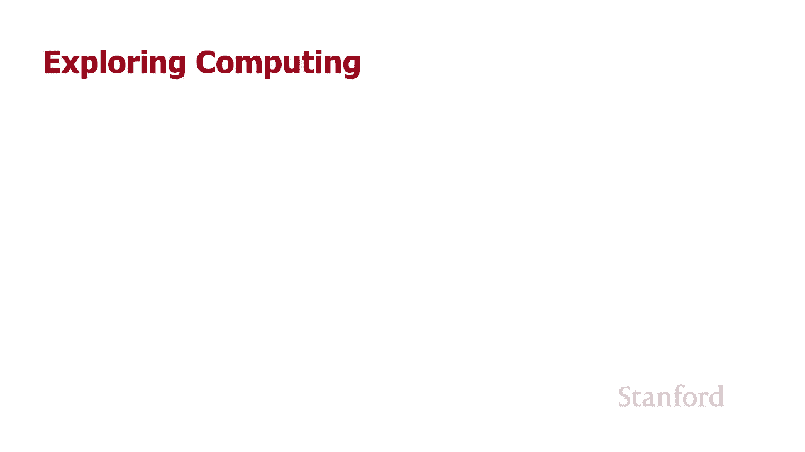

undefined，欢迎探索，欢迎探索，今天的计算视频是网页，今天的计算视频是网页，复制纽约时报所以在这个视频中，复制纽约时报所以在这个视频中，我们将，undefined，undefined。

使用基于网格的布局从头开始复制纽约时报首页，使用基于网格的布局从头开始复制纽约时报首页，所以我们在这个视频中的主要目的之一，undefined，undefined，是向您展示 使用基于网格的。

是向您展示 使用基于网格的，布局实际上可以创建一些非常，布局实际上可以创建一些非常，复杂的网站，复杂的网站，而不会遇到太多麻烦 我们将，undefined，undefined。

在复制此网页时看到一些细微差别 但在，在复制此网页时看到一些细微差别 但在，大多数情况下它实际上非常，大多数情况下它实际上非常，简单，简单，我当然不会尝试这样做，我当然不会尝试这样做。

使用基于浮动的布局或，使用基于浮动的布局或，flexbox 布局，flexbox 布局，因此转向基于网格的布局，因此转向基于网格的布局，确实为人们打开了很多大门，让，确实为人们打开了很多大门，让。

undefined，undefined。

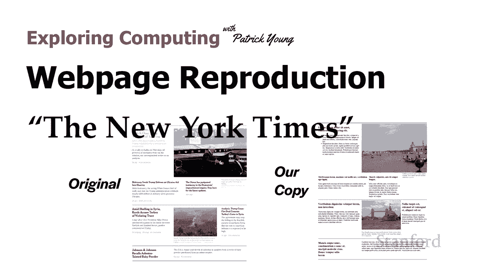

他们能够轻松创建，他们能够轻松创建，相对复杂的网站，undefined，undefined，所以让我们开始吧，这就是 uh，所以让我们开始吧，这就是 uh，副本 在我们将要使用的纽约时报中。

副本 在我们将要使用的纽约时报中，有几个，有几个，不同的事情需要注意这个，不同的事情需要注意这个，网站，网站。

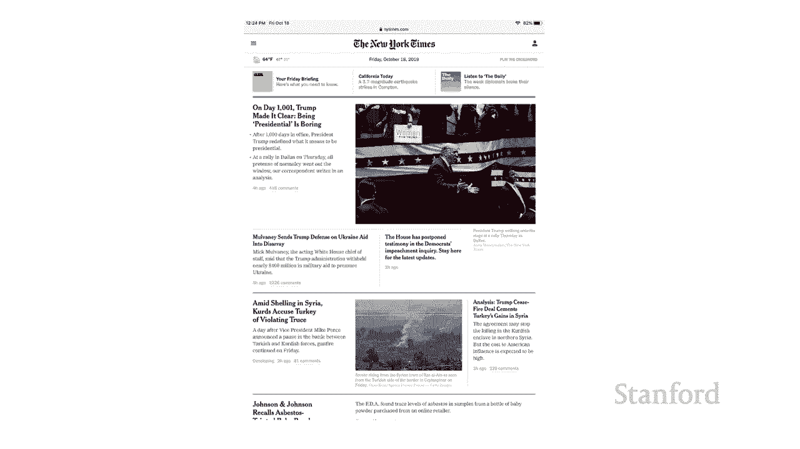

首先你会注意到，首先你会注意到，有三个主要的 列，有三个主要的 列，嗯，如图所示，嗯，如图所示。

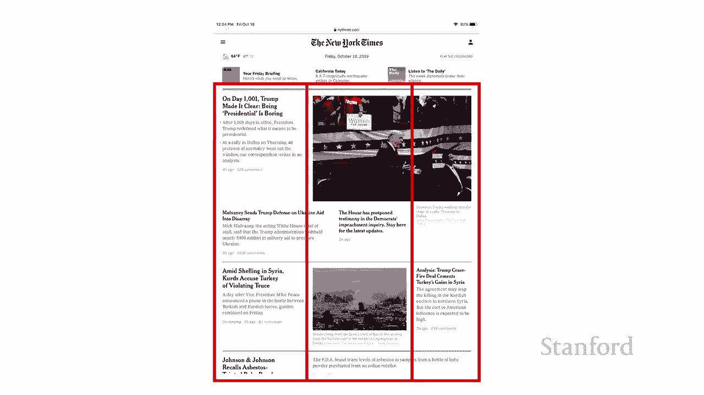

嗯，有一些区域并不，嗯，有一些区域并不，真正遵循列规则，所以，真正遵循列规则，所以，我们在底部附近查看这一部分，我们在底部附近查看这一部分，你可以看到它实际上，你可以看到它实际上，跨越了两列。

所以这基本上是，跨越了两列，所以这基本上是，列跨度，列跨度，然后如果我们 看看顶部的照片，然后如果我们 看看顶部的照片，它也，它也，跨越多列，然后，undefined，undefined，中间那一行。

中间那一行，有点违反了另一部分的规则，undefined，undefined，我暂时先忽略它，我暂时先忽略它，然后我们会回到它，然后我们会回到它，在此视频结束之前修复它，但现在，在此视频结束之前修复它。

但现在，我们只是假设该，我们只是假设该，部分不存在，并且，部分不存在，并且，所有内容要么遵循这主要，所有内容要么遵循这主要。

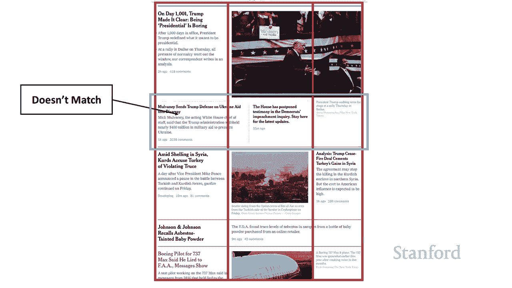

三行，三行，要么在这主要三行上是一个平静的跨度，要么在这主要三行上是一个平静的跨度，undefined，undefined，现在您所拥有的内容已开启 我们的左边，undefined，undefined。

是我们，是我们，将从头开始创建的纽约时代的副本，将从头开始创建的纽约时代的副本，右边，右边，是实际纽约时代的屏幕截图所以，是实际纽约时代的屏幕截图所以，你知道它非常接近我错过了。

你知道它非常接近我错过了，一些我没有的东西，一些我没有的东西，浅灰色评论说多久，浅灰色评论说多久，以前创建了一篇特定的文章或，以前创建了一篇特定的文章或，那里有多少评论，那里有多少评论。

您会注意到我再次使用了，您会注意到我再次使用了，lorem ipsum，lorem ipsum，呃，作为提醒，lorem，呃，作为提醒，lorem，ipsum，ipsum。

是来自 cicero 的随机拉丁文本，是来自 cicero 的随机拉丁文本，它，undefined，undefined，在示例文本中非常常用，并且 类型设置，在示例文本中非常常用，并且 类型设置，情况。

所以我们将继续，情况，所以我们将继续，遵循，遵循，我们的警报 ipsum 我认为，undefined，undefined，undefined，比当时我拍摄这张呃照片，比当时我拍摄这张呃照片。

并在去年重新创建这张照片时的头条新闻，undefined，undefined，更令人振奋，当然更令人振奋 比现在发生，更令人振奋，当然更令人振奋 比现在发生，的事情当然我正在，的事情当然我正在。

更换照片，更换照片，我也更喜欢我的照片 好吧，我也更喜欢我的照片 好吧，undefined，undefined，让我们先快速浏览，让我们先快速浏览，一下原始 html，一下原始 html，嗯 所以这是。

嗯 所以这是，正文中的 html 你可以看到我 这里有，正文中的 html 你可以看到我 这里有，许多部分，我，许多部分，我，基本上创建了许多 div，基本上创建了许多 div，我将把它们标记为。

我将把它们标记为，a1 表示与第一行关联的 div，undefined，undefined，因此第一行有 a1 和 a2，因此第一行有 a1 和 a2，b1 b2 和 b3 表示秒 第一行，然后。

b1 b2 和 b3 表示秒 第一行，然后，是第三行的 c1 和 c2，是第三行的 c1 和 c2，但我想强调的是，因为，但我想强调的是，因为，这，这，是一个基于网格的布局，是一个基于网格的布局。

我不受这些在 html 中出现的顺序的限制，undefined，undefined，我将它们放在 html 中，我将它们放在 html 中，并给了它们标签 呃，这，并给了它们标签 呃，这，适合，适合。

我们计划做的布局，但，我们计划做的布局，但，实际上我们可以按照我们想要的任何顺序重新排列这些，undefined，undefined，没有问题，undefined，undefined。

如果我们正在做基于浮动的布局或，如果我们正在做基于浮动的布局或，弹性盒布局，这是基于网格的布局的巨大好处之一 我们绝对不能，弹性盒布局，这是基于网格的布局的巨大好处之一 我们绝对不能，这样做，所以。

这样做，所以，你知道很多灵活性和，你知道很多灵活性和，另外一点灵活性，我们，另外一点灵活性，我们，今天不会谈论，但，今天不会谈论，但，绝对非常重要的是，绝对非常重要的是，我们不仅可以，我们不仅可以。

在当前布局的任何地方移动它们，而且我们，在当前布局的任何地方移动它们，而且我们，可以为不同的设备创建一个完全不同的网格，可以为不同的设备创建一个完全不同的网格，所以，所以，一个用于大型桌面的网格监控。

一个用于大型桌面的网格监控，另一个用于平板电脑的网格，然后是，另一个用于平板电脑的网格，然后是，用于手机的第三个网格，用于手机的第三个网格，我可以将任何元素移动到，我可以将任何元素移动到。

任何这些网格上的任何位置，任何这些网格上的任何位置，ds，ds，基于网格布局的巨大胜利加上我，基于网格布局的巨大胜利加上我，之前提到的它确实，之前提到的它确实，更容易你知道，因为我说过我，更容易你知道。

因为我说过我，绝对不会，绝对不会，尝试使用，尝试使用，基于浮动布局或 flexbox 布局，基于浮动布局或 flexbox 布局，来重现这个页面，所以现在我们要去，来重现这个页面，所以现在我们要去。

继续把我们的网格放在身体里，继续把我们的网格放在身体里，我们稍后会回到这个决定，我们稍后会回到这个决定，谈谈你知道，谈谈你知道，替代方案，但现在我只是，替代方案，但现在我只是。

继续把我需要告诉的身体放在身体里，继续把我需要告诉的身体放在身体里，网页浏览器，网页的，网页浏览器，网页的，主体是一个网格，主体是一个网格，并且有 400，并且有 400。

像素、360 像素和 240 像素的三列，像素、360 像素和 240 像素的三列，我基本上是通过，我基本上是通过，进入 uh photoshop 并，进入 uh photoshop 并。

在原始纽约时报上进行一些测量来选择这些的，在原始纽约时报上进行一些测量来选择这些的，所以，所以，呃 所以我们可以准确地，呃 所以我们可以准确地，比较他们所，比较他们所，使用的行，你会注意到，使用的行。

你会注意到，undefined，undefined，在每个部分之间都有这些线，undefined，undefined。

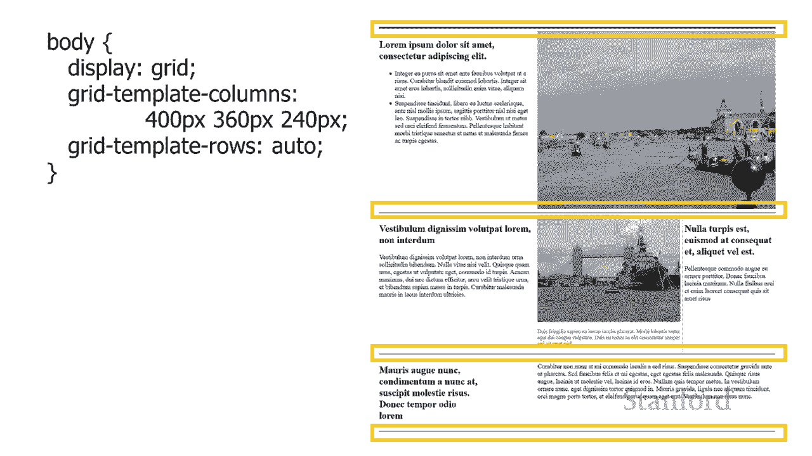

现在有几种不同的方法来，现在有几种不同的方法来，创建这些线，创建这些线，一种可能性是放在顶部，一种可能性是放在顶部，每个 t 的边界 他的元素，每个 t 的边界 他的元素，但结果证明会引起一些。

但结果证明会引起一些，问题，问题，嗯，所以我在这里向您展示的，undefined，undefined，是呃，undefined，undefined，如果我在每个元素上使用它们，其中一条线会是什么样。

如果我在每个元素上使用它们，其中一条线会是什么样，子，如果你 仔细观察，您会，子，如果你 仔细观察，您会，注意到该行中有中断，注意到该行中有中断，undefined，undefined。

因此这些中断来自，因此这些中断来自，边距，边距，或者我们还没有讨论过，或者我们还没有讨论过，这一点，但是有一种，这一点，但是有一种，特殊的方法可以，特殊的方法可以，undefined。

undefined，在基于网格的布局中创建边距的偶合，称为 间隙，因此，在基于网格的布局中创建边距的偶合，称为 间隙，因此，无论您是使用边距还是使用，无论您是使用边距还是使用，间隙，您都会在，间隙。

您都会在。

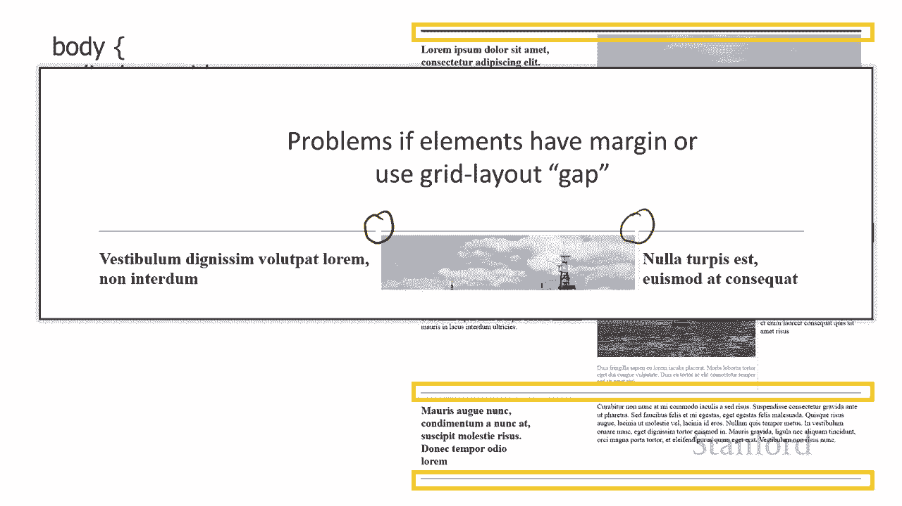

顶部，顶部，顶部边框中出现中断，因此顶部边框，顶部边框中出现中断，因此顶部边框，不能很好地工作，不能很好地工作，所以我所做的是我要继续，undefined，undefined。

为这些中的每一个创建 div，我，为这些中的每一个创建 div，我，将给它们不同的类，因为，将给它们不同的类，因为，纽约时代的顶线实际上，纽约时代的顶线实际上，undefined，undefined。

比其他的要厚，所以我，比其他的要厚，所以我，将继续，将继续，为这些中的每一个创建不同的 div 我 我，为这些中的每一个创建不同的 div 我 我，要继续给他们上课，要继续给他们上课。

了 o 我想在 html 文件中放置 div 的地方，了 o 我想在 html 文件中放置 div 的地方，它们确实需要是，它们确实需要是，body 的子项，因为 body 是，body 的子项。

因为 body 是，网格所在的位置，但除此之外，网格所在的位置，但除此之外，我可以将它们直接放在，我可以将它们直接放在，表示不同，表示不同，uh 文章和图像的 div 上方，我可以放置 它们。

uh 文章和图像的 div 上方，我可以放置 它们，在底部，在底部，呃，我可以将它们放在，呃，我可以将它们放在，每一行不同的行之间，每一行不同的行之间，这并不重要，我可以，这并不重要，我可以。

继续取任何属于 body 的子级的 div，继续取任何属于 body 的子级的 div，undefined，undefined，并将其放置在为 body 设置的网格中。

并将其放置在为 body 设置的网格中，这样 这些 div 的确切位置，这样 这些 div 的确切位置，实际上是个人选择的问题，undefined，undefined，undefined。

undefined，undefined，undefined，顶部那个双宽线，顶部那个双宽线，的 div 在 a 部分的 div 之前，的 div 在 a 部分的 div 之前，undefined。

undefined，然后我在 b 部分的 a 部分之间有一个 div，undefined，undefined，然后我在 b 部分之间有一个，然后我在 b 部分之间有一个，下降 c 部分然后我。

下降 c 部分然后我，在底部有一个 div 但，在底部有一个 div 但，你 真的可以把它们放在你，你 真的可以把它们放在你，想要的任何，想要的任何，地方，所以这里是我，地方，所以这里是我。

用来实际创建，用来实际创建，你可以看到的线条的规则我正在，你可以看到的线条的规则我正在，这些实际上没有任何内容的 div 顶部创建一个边框，undefined，undefined，我正在设置一个。

我正在设置一个，undefined，undefined，的边距，右侧和左侧的边距为零，的边距，右侧和左侧的边距为零，因此请记住，因此请记住，如果您为边距或填充列出了两个不同的值。

如果您为边距或填充列出了两个不同的值，undefined，undefined，undefined，那么第一个列出的值，那么第一个列出的值，与顶部和底部相关联 并且，与顶部和底部相关联 并且。

列出的第二个与右侧和左侧相关联，undefined，undefined，您还应该，您还应该，为，为，每个测量值放置测量类型，例如，每个测量值放置测量类型，例如，5px 表示像素，5px 表示像素。

除非值为 0。如果您使用，除非值为 0。如果您使用，零，则它是否为零英寸都没有关系，零，则它是否为零英寸都没有关系，零毫米，零毫米，零像素零只是零，零像素零只是零，你可能还想知道你知道我。

undefined，undefined，在一分钟前谈到你如何不能使用边框，在一分钟前谈到你如何不能使用边框，因为你会在边框上有中断，因为你会在边框上有中断，undefined，undefined。

为什么我现在使用边框不是这个，为什么我现在使用边框不是这个，我只是告诉 d 你几分钟，我只是告诉 d 你几分钟，前不会，前不会，工作，这里的区别是这些，工作，这里的区别是这些，div 一直贯穿整个网页。

div 一直贯穿整个网页，中断的问题是，如果，中断的问题是，如果，你有许多不同的列，你有许多不同的列，并且，并且，你的元素沿着这些列中断，你的元素沿着这些列中断，undefined，undefined。

并且 你需要把它们的边距放在这些特定的 div，并且 你需要把它们的边距放在这些特定的 div，会发生中断的地方，会发生中断的地方，这些特定的 div 穿过所有，这些特定的 div 穿过所有，的列。

所以让我们，的列，所以让我们，看看接下来的内容，这里是我，看看接下来的内容，这里是我，实际放置，实际放置，这些 div 的地方，所以你可以看到，这些 div 的地方，所以你可以看到，我把一个放在第一排。

我把一个放在第一排，然后第二排是实际内容，然后第二排是实际内容，呃包括威尼斯的照片，呃包括威尼斯的照片，然后我把一个放在，然后我把一个放在，第三排然后第四排呃那是，第三排然后第四排呃那是，有，有。

伦敦桥的那排然后我正在，伦敦桥的那排然后我正在，放置 其中一个在第 5 行，放置 其中一个在第 5 行，然后是第 6 行，这是文本的最后一部分，然后是第 6 行，这是文本的最后一部分。

然后我在第 7 行放置一个，然后我在第 7 行放置一个，所以，所以，每隔一行都会有一个，每隔一行都会有一个，这些 div，这些 div，然后这些 div 如何，然后这些 div 如何。

放置这些 div 开始 在第一列，放置这些 div 开始 在第一列，中 你穿过第二列和第三列，中 你穿过第二列和第三列，然后，然后，记住实际上超出，记住实际上超出。

了我们真正想要这些去的地方的末尾的 n 行，了我们真正想要这些去的地方的末尾的 n 行，所以有一个不存在的第四行，所以有一个不存在的第四行，那是这些，那是这些，元素的终点，元素的终点。

你知道我我 '我要强调的是，你知道我我 '我要强调的是，这些跨越，这些跨越，元素一二和三，元素一二和三，如果我们把边界，如果我们把边界，放在各个元素上，问题是第一，undefined。

undefined，行和第二行或第二行和，行和第二行或第二行和，第三行之间可能会有中断，因为这些跨越所有，第三行之间可能会有中断，因为这些跨越所有，那些行我不需要担心，那些行我不需要担心，那些间隙。

那些间隙，就行而言看起来没问题，就行而言看起来没问题，嗯我已经将列设置为，嗯我已经将列设置为，400 像素 360 像素和 240 像素，400 像素 360 像素和 240 像素，就行而言，就行而言。

我将把它留在 auto 所以这，我将把它留在 auto 所以这，意味着，意味着，行的高度将，行的高度将，根据，根据，放置在行中，undefined，undefined，的实际内容，undefined。

undefined，而增加或减少，而增加或减少，有 af 出现的新问题没问题，有 af 出现的新问题没问题，所以我要继续并放置，所以我要继续并放置，我的 a1 部分，它是，我的 a1 部分，它是。

实际的原始 lorem ipsum，实际的原始 lorem ipsum，位于左上角，位于左上角，注意，呃，这里面有一个 h2，注意，呃，这里面有一个 h2，它有，它有，一个荣誉列表。

上面有一堆 列出项目，一个荣誉列表，上面有一堆 列出项目，这里的重点是你知道这是一个，这里的重点是你知道这是一个，div 你可以把，div 你可以把，任何可渲染的元素放在一个 div 里面。

任何可渲染的元素放在一个 div 里面，你可以放照片你可以放，你可以放照片你可以放，表格你可以放段落你可以，表格你可以放段落你可以，放标题，放标题，任何东西都可以放在 div 中所以。

任何东西都可以放在 div 中所以，基本上任何一个，基本上任何一个，在，在，我们为主体定义的网格中的这些正方形中，我们为主体定义的网格中的这些正方形中，这些网格元素中的任何一个都可以包含。

这些网格元素中的任何一个都可以包含，我们想要的，undefined，undefined，undefined，任何 html 粗线在顶部，任何 html 粗线在顶部，所以我要继续将其放在。

所以我要继续将其放在，第 1 列的第 2 行。第 1 列的第 2 行。我不需要列出结束列，我不需要列出结束列，因为，因为，这只是填充了网格上的一个正方形，这只是填充了网格上的一个正方形。

然后我是 继续在，然后我是 继续在，这里设置边距，这样，这里设置边距，这样，你就会看到边距出现在，你就会看到边距出现在，variou  s 点嗯，variou  s 点嗯，在我的网格位置，这只是为了。

在我的网格位置，这只是为了，尝试获得一点额外的空间，尝试获得一点额外的空间，我不得不承认我并没有，我不得不承认我并没有，太注意使它与纽约时报使用，太注意使它与纽约时报使用，的空间量完全匹配。

undefined，undefined，但是 我确实想要一点空间，但是 我确实想要一点空间，如果我没有把那个边距放在右边，如果我没有把那个边距放在右边，八次选择，八次选择，那威尼斯的图像会。

那威尼斯的图像会，撞到那里的呃，撞到那里的呃，文字，那看起来，文字，那看起来，有点奇怪，有点奇怪，好吧，所以这是图像本身，嗯，好吧，所以这是图像本身，嗯，你可以看到我把它，你可以看到我把它。

放在第二行和它左边的警报 ipsum 一样，undefined，undefined，它从第二列到第四列，它从第二列到第四列，所以这意味着它再次穿过第二，所以这意味着它再次穿过第二，列和第三列。

列和第三列，结束是我们实际所在的一次传递，结束是我们实际所在的一次传递，覆盖，覆盖，所以这是第四列嗯所以这是一个，所以这是第四列嗯所以这是一个，跨列的图像，跨列的图像，呃你可以看到我已经给了一个。

呃你可以看到我已经给了一个，特定的，特定的，宽度为 600 像素现在这部分，宽度为 600 像素现在这部分，实际上很重要，实际上很重要，图像的宽度将，图像的宽度将，根据我们想要放置它的位置而有所不同。

根据我们想要放置它的位置而有所不同，显然，如果我想把它 在，显然，如果我想把它 在，单个列中，而不是像我们这里那样，单个列中，而不是像我们这里那样，具有列跨度的多列，这，具有列跨度的多列，这，会使。

会使，它更短，它更短，但您知道即使我们要移动它，但您知道即使我们要移动它，如果我们将它从，如果我们将它从，右上角的位置向上移动到，右上角的位置向上移动到，左侧，左侧，我实际上需要增加，我实际上需要增加。

宽度，因此，宽度，因此，覆盖第二列和第三列是 600，覆盖第二列和第三列是 600，像素，着色，像素，着色，覆盖第一列或第二列实际上是，覆盖第一列或第二列实际上是，760 像素，您可以，760 像素。

您可以，通过查看该列的宽度来解决，通过查看该列的宽度来解决，这个问题，所以，这个问题，所以，我们可以看到 左列是 400，我们可以看到 左列是 400，像素，这意味着右两列，像素，这意味着右两列。

是 600 像素，是 600 像素，呃，如果我们把它移到左边的两，呃，如果我们把它移到左边的两，列，即 400 像素加上，列，即 400 像素加上，360 像素，那么我们得到 760 像素。

360 像素，那么我们得到 760 像素，这取决于你想如何，这取决于你想如何，放置 您确实需要增加或减少宽度的图像，undefined，undefined，所以现在我们要，所以现在我们要，向下一行。

向下一行，记住第 3 行实际上是，记住第 3 行实际上是，uh a 部分和 b 部分之间的边界，uh a 部分和 b 部分之间的边界，所以现在我们在 b，所以现在我们在 b。

部分中 b 部分正在放置 编辑在，部分中 b 部分正在放置 编辑在，第四行，第四行，嗯，你可以再次看到我在，嗯，你可以再次看到我在，那里放了一点边距，那里放了一点边距，现在下一个更，现在下一个更。

有趣 这，有趣 这，包括图像以及，包括图像以及，图像下方的标题，图像下方的标题，嗯，我再次提到这只是一个，嗯，我再次提到这只是一个，一分钟前但，一分钟前但。

你知道 b2 只是一个 div 并且在 div 里面，你知道 b2 只是一个 div 并且在 div 里面，你可以放任何你想要的，你可以放任何你想要的，所以我，所以我。

把一个图像和一个段落都放进去当然没问题，把一个图像和一个段落都放进去当然没问题，嗯，就像威尼斯的图像一样，我们，嗯，就像威尼斯的图像一样，我们，确实需要设置一个 宽度在这个。

确实需要设置一个 宽度在这个，或者我想你可以设置，或者我想你可以设置，一个高度我认为宽度，一个高度我认为宽度，在这里更有意义虽然，在这里更有意义虽然，很容易计算我们知道，很容易计算我们知道。

列有多宽我们不知，列有多宽我们不知，道行，道行，有多高嗯 所以我，有多高嗯 所以我，要继续设置一个宽度，要继续设置一个宽度，然后我还要，然后我还要，呃让我们改变底部标题的颜色。

呃让我们改变底部标题的颜色，我，我，确实想把文字缩小一点，呃，确实想把文字缩小一点，呃，以匹配更多或更少 纽约，undefined，undefined，时报为他们的标题做了什么 他们的。

时报为他们的标题做了什么 他们的，undefined，undefined，然后在最右边，嗯，然后在最右边，嗯，我要，我要，继续把我的最后一个元素放在 b，继续把我的最后一个元素放在 b，部分。

如果我们仔细观察，部分，如果我们仔细观察，纽约时报的原件，你会，纽约时报的原件，你会，看到那里是，看到那里是，浅灰色的，浅灰色的，在左边的图像和，在左边的图像和，右边的新闻文章之间垂直运行的线，所以我。

右边的新闻文章之间垂直运行的线，所以我，继续并试图重现，继续并试图重现，我的看起来我真的应该，我的看起来我真的应该，增加该图像，增加该图像，和边框之间的边距它有点难以，和边框之间的边距它有点难以。

看到 边框，看到 边框，但是你知道有一个单像素看到，但是你知道有一个单像素看到，浅灰色边框你可以在那里看到，浅灰色边框你可以在那里看到，undefined，undefined，它在纽约，它在纽约。

时代更加突出这意味着，时代更加突出这意味着，我在那里搞砸了我的设计，我在那里搞砸了我的设计，呃但是是的所以继续并放一个 一点，undefined，undefined，边距和填充，然后将，边距和填充。

然后将，浅灰色边框，浅灰色边框，用于重现他们在那里所做的事情，用于重现他们在那里所做的事情，然后最后我在，然后最后我在，这里，这里，有剖腹产，剖腹产有点，有剖腹产，剖腹产有点，有趣，因为如果您查看。

有趣，因为如果您查看，原件，原件，您可以 硒 e 这里是 johnson 和 johnson，您可以 硒 e 这里是 johnson 和 johnson，回忆，如果您查看，回忆，如果您查看。

johnson 和 johnson 之间的空间量，johnson 和 johnson 之间的空间量，以及右侧的文本，您就会，以及右侧的文本，您就会，知道单词，知道单词，回忆完全适合该空间，如果他们。

回忆完全适合该空间，如果他们，想要它，想要它，类似的污点，呃，类似的污点，呃，可能适合 在石棉和，可能适合 在石棉和，下一列之间，所以他们，下一列之间，所以他们，实际上推了那个，实际上推了那个，标题。

他们使它比，标题，他们使它比，列上的实际空间更短，列上的实际空间更短，所以这就是我在，所以这就是我在，这里所做的，我已经将，这里所做的，我已经将，这个特定元素的宽度设置为 只有。

这个特定元素的宽度设置为 只有，250 像素，250 像素，所以该列比这里的文本占用更多的空间，所以该列比这里的文本占用更多的空间，我强迫文本的，undefined，undefined，宽度更短。

呃尝试让它，宽度更短，呃尝试让它，与纽约时代发生的事情相匹配，undefined，undefined，然后找到最后一个 元素，然后找到最后一个 元素，undefined，undefined，所以关于。

所以关于，最后一个元素的主要事情是它正在做一个列，最后一个元素的主要事情是它正在做一个列，跨度，所以它从第二，跨度，所以它从第二，列开始，然后穿过第二，列开始，然后穿过第二，列和第三列，列和第三列。

然后我们将结尾列为，然后我们将结尾列为，第三列之后，所以我，第三列之后，所以我，列出了 到第四列，列出了 到第四列，就可以了，所以我们一直在查看，undefined，undefined，网页内容的截图。

undefined，undefined，undefined，现在得到，现在得到。

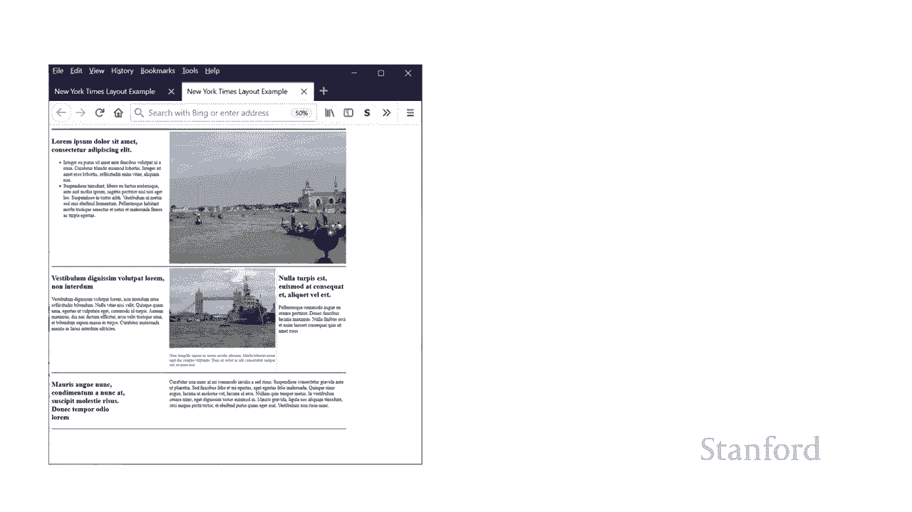

了左边这张图片 这就是，了左边这张图片 这就是，这个网页现在在网络，这个网页现在在网络，浏览器中的样子，浏览器中的样子，可能我们想要的，可能我们想要的，更像是我们在右边看到的，更像是我们在右边看到的。

这是纽约时报的，这是纽约时报的，实际运作方式，所以区别，实际运作方式，所以区别，这是，这是，左侧的图像，您可以看到，左侧的图像，您可以看到，undefined，undefined。

当网络浏览器窗口变宽时，当网络浏览器窗口变宽时，我的网页，我的网页，卡在，卡在，网页的左上角，我可以增加窗口的宽度，undefined，undefined，我将 获得越来越宽的，我将 获得越来越宽的。

右边距，但左边距，右边距，但左边距，仍然固定为零，因此在，仍然固定为零，因此在，右侧我们可以看到，右侧我们可以看到，网页停留在，网页停留在，浏览器窗口的中间，并且随着我们增加，浏览器窗口的中间。

并且随着我们增加，浏览器窗口，浏览器窗口，空间的宽度 在左侧，空间的宽度 在左侧，和右侧增加和 所以我们之前已经看到过这种，和右侧增加和 所以我们之前已经看到过这种，效果，效果。

你会记得解决这个问题的方法，你会记得解决这个问题的方法，是将网页的全部内容，是将网页的全部内容，undefined，undefined，放到一个 div 中，我已经给了那个 div。

放到一个 div 中，我已经给了那个 div，的 id，的 id，main，所以在这里你可以看到我 '我，main，所以在这里你可以看到我 '我，已经完成了，已经完成了。

以前在 body 中的所有内容现在都，以前在 body 中的所有内容现在都，在这个，在这个，div 中，id 等于 main 现在，div 中，id 等于 main 现在，至于我如何实际计算出。

至于我如何实际计算出，边距 ii 不得不承认，边距 ii 不得不承认，undefined，undefined，就全部执行而言，这可能有点矫枉过正，就全部执行而言，这可能有点矫枉过正，在基于网格的布局中。

在基于网格的布局中，我使用网格进行布局，嗯，它确实，我使用网格进行布局，嗯，它确实，让您有，让您有，机会了解网格是如何工作的，但 ii 可以，机会了解网格是如何工作的，但 ii 可以。

只在 id main 上放置左右边距，只在 id main 上放置左右边距，这可能是一个，这可能是一个，更好的举措，但，更好的举措，但，让我们 继续看看我，让我们 继续看看我，是怎么做到的，好吧。

所以我说，是怎么做到的，好吧，所以我说，主体也是网，主体也是网，格，主体中的网格有三，格，主体中的网格有三，列，列，其中一列设置为 1fr，中间，其中一列设置为 1fr，中间，列设置为 1000 像素。

列设置为 1000 像素，最后一列 设置为 1fr，最后一列 设置为 1fr，因此您还记得我们之前，因此您还记得我们之前，关于 fr 是什么意思的讨论 fr，关于 fr 是什么意思的讨论 fr。

是小数的缩写，所以，是小数的缩写，所以，小数 frs 将，undefined，undefined，占用固定元素未使用的额外空间，因此我们有，占用固定元素未使用的额外空间，因此我们有，一个千像素固定元素。

一个千像素固定元素，然后在 Web 浏览器窗口中的任何额外空间，undefined，undefined，用于在这种情况下的宽度，用于在这种情况下的宽度，我们正在处理，我们正在处理。

将在我们的两个 frs 之间划分的列，undefined，undefined，因此这将分割，因此这将分割，左边距和右边距之间的额外空间，undefined，undefined，或者在这种情况下，左列和。

或者在这种情况下，左列和，右，右，列是空的，然后尽可能远 正如，列是空的，然后尽可能远 正如，主要的那样，现在我需要继续，主要的那样，现在我需要继续，把它，把它，放在，放在，身体有的网格中。

所以身体有一个网格，身体有的网格中，所以身体有一个网格，所以这将出现在第 1 行，所以这将出现在第 1 行，然后它将出现在第 2，然后它将出现在第 2，列中，因为第 1 列，列中，因为第 1 列。

是 左边的空白 1 fr 然后第，是 左边的空白 1 fr 然后第，3 列是右边的空白 fr，3 列是右边的空白 fr，所以我想继续，所以我想继续，将网页的实际主要内容，将网页的实际主要内容。

放入第二列，然后，放入第二列，然后，因为我想将 div 放在，undefined，undefined，现在将主 div 放到网页上，现在将主 div 放到网页上，这将进入主元素中的网格。

这将进入主元素中的网格，所以我确实需要定义该，所以我确实需要定义该，网格，所以，网格，所以，这个网格在 id main 这，这个网格在 id main 这，是曾经在 uh 身体上的网格。

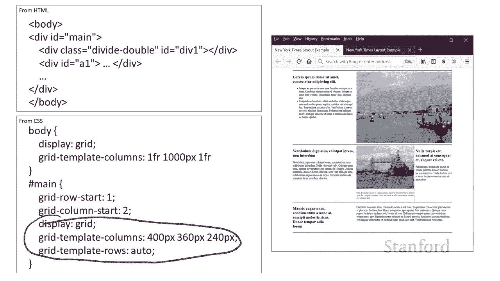

undefined，undefined，好吧，让我们回到，好吧，让我们回到，我的那个部分 说我，我的那个部分 说我，忽略了呃，所以这，忽略了呃，所以这，是不遵循，是不遵循。

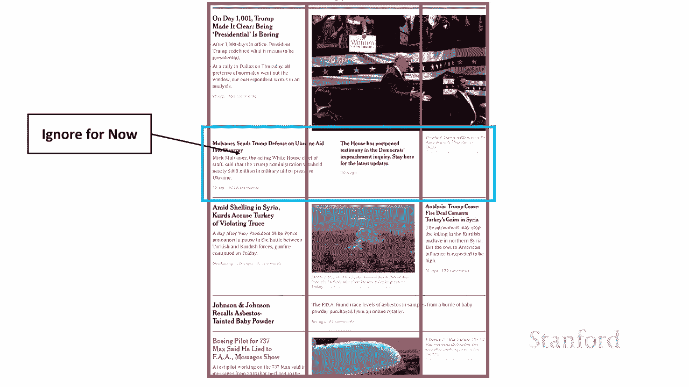

网格其他部分规则的部分，网格其他部分规则的部分，所以我们要用，所以我们要用，这口井做什么，这是它的特写，这口井做什么，这是它的特写，你可以看到有一个数字，undefined，undefined，除了它。

除了它，不跟随，不跟随，网页其余部分的列之外，undefined，undefined，undefined，这里还包含不同元素，这里还包含不同元素，在所有三列中一直运行，就像在，undefined。

undefined，之前的所有情况下一样，之前的所有情况下一样，它只运行在，它只运行在，两列中，您还会，两列中，您还会，undefined，undefined，注意到最右侧的最后一个元素。

注意到最右侧的最后一个元素，实际上是，实际上是，为其顶部的图像加上标题，为其顶部的图像加上标题，和 所以那里没有边框，和 所以那里没有边框，它确实使用了那种浅灰色，它确实使用了那种浅灰色，嘿一直用于。

嘿一直用于，字幕，然后你还会注意到，undefined，undefined，undefined，左边的两个故事之间有另一条线，左边的两个故事之间有另一条线，所以这些都是不同的东西。

所以这些都是不同的东西，我们希望确保我们的解决方案能够处理，undefined，undefined，等等 顶部是，等等 顶部是，纽约时代的原件，纽约时代的原件，底部是我们的，底部是我们的，复制品。

所以让，复制品，所以让。

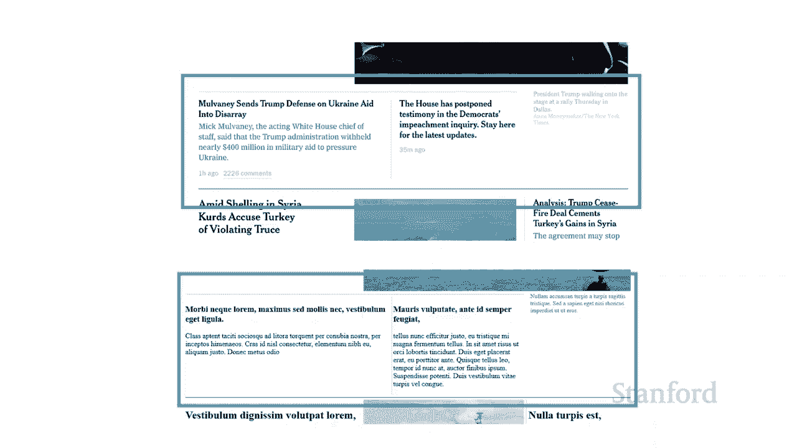

我们看看我们如何复制，我们看看我们如何复制，它，所以我们可以做的一件事是我们，它，所以我们可以做的一件事是我们，可以添加一个额外的列，可以添加一个额外的列，所以这里我有四个 列而不是。

所以这里我有四个 列而不是，三列，三列，这里的主要问题只是呃，这里的主要问题只是呃，我们必须在几乎所有元素上设置平静的跨度，我们必须在几乎所有元素上设置平静的跨度，因为，因为，呃除了这一行之外。

呃除了这一行之外，其他人都不遵守这些，其他人都不遵守这些，规则，所以，规则，所以，他们会去 另一方面，必须有列，他们会去 另一方面，必须有列，跨度才能摆脱这个，跨度才能摆脱这个，额外的行，额外的行，呃。

如果我们要在我们的网页上，呃，如果我们要在我们的网页上，使用这组特定的分区和，使用这组特定的分区和，其他位置，其他位置，这可能是正确的方法，所以，这可能是正确的方法，所以，你 知道我们是否大部分时间。

你 知道我们是否大部分时间，都在使用 ng 原来的三列，都在使用 ng 原来的三列，但有几个地方我们，但有几个地方我们，有这种替代性的，有这种替代性的，使用列，它一次，使用列，它一次。

又一次地出现在我们网页的不同位置，又一次地出现在我们网页的不同位置，然后确保，然后确保，继续添加第四列，继续添加第四列，然后，然后，你知道使用一列 跨越，undefined，undefined。

以前刚占据第二，以前刚占据第二，列的所有元素，嗯，列的所有元素，嗯，这些元素现在将跨越第二，这些元素现在将跨越第二，列和第三列，列和第三列，所以你知道这绝对是可行，所以你知道这绝对是可行，的替代方法。

这，的替代方法，这，是我实际使用的方法，是我实际使用的方法，我要去 并且有一个，我要去 并且有一个，元素，元素，跨越原来的两列，跨越原来的两列，然后，然后，它会有自己的内部，它会有自己的内部。

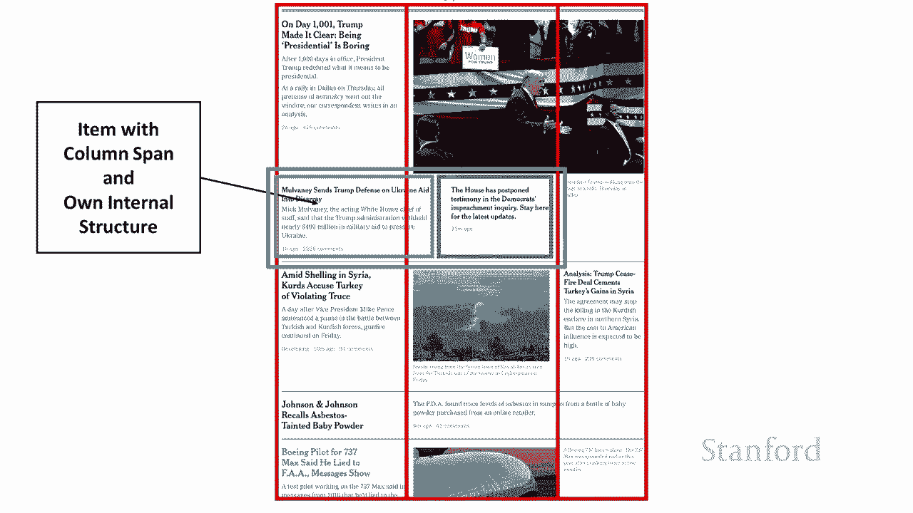

结构，结构，所以这就是我选择的方式，所以这就是我选择的方式，所以让我们继续看看，所以让我们继续看看，这里的源，这里的源，你可以看到这里是，你可以看到这里是，我 有一个 div，我给定了 id x1。

我 有一个 div，我给定了 id x1，它将跨越，它将跨越，undefined，undefined，原始设置中的这两列，原始设置中的这两列，它将包含，它将包含，两个内部 div，一个 div 我给了。

两个内部 div，一个 div 我给了，id，id，xy1，另一个 div 我给了 这 id，xy1，另一个 div 我给了 这 id，xy2 和这些都，xy2 和这些都，在 div，在 div。

idx1 内，然后，idx1 内，然后，我也有 id x2，这是，我也有 id x2，这是，最右边的标题，最右边的标题，注意它不在，注意它不在，uh div，uh div，x1 内，它与它分开，它不是。

x1 内，它与它分开，它不是，一部分 那个其他结构，一部分 那个其他结构，好的，所以让我们继续将 x1，好的，所以让我们继续将 x1，结构，结构，放在这里，它就在这里 嗯，这里要注意的关键事项。

undefined，undefined，嗯，这又包含 xy 一和 xy，嗯，这又包含 xy 一和 xy，2，它们是其中的两个故事，2，它们是其中的两个故事，undefined，undefined。

嗯注意这确实跨越了两个，嗯注意这确实跨越了两个，列所以，列所以，从呃开始这显然是，从呃开始这显然是，第三行，第三行，呃从第一列，undefined，undefined，开始穿过第三列的第二列嗯。

开始穿过第三列的第二列嗯，它有自己的边界记住我们，它有自己的边界记住我们，的边界只穿过这两，的边界只穿过这两，undefined，undefined，列但不穿过第三，列但不穿过第三。

列 所以我继续在它上面放了一个边框，undefined，undefined，我在那里放了一个上边距和，我在那里放了一个上边距和，一点填充，一点填充，最后因为这个元素，最后因为这个元素。

有它自己的内部项目和它，有它自己的内部项目和它，自己的内部结构，我需要，自己的内部结构，我需要，继续定义它和，继续定义它和，在这种情况下呃因为我们都是，在这种情况下呃因为我们都是，关于网格，关于网格。

呃我继续在这里定义了一个网格，呃我继续在这里定义了一个网格，显然还有，显然还有，其他方法可以做到这一点，其他方法可以做到这一点，呃事实上这是你知道这，呃事实上这是你知道这，将是一个合理的地方来使用你的。

将是一个合理的地方来使用你的，flexbox，flexbox，嗯，好的，所以我继续在这个元素内定义了一个，嗯，好的，所以我继续在这个元素内定义了一个，网格，网格，我说，我说。

有两列 460 像素和 300，有两列 460 像素和 300，像素，像素，我要将行大小设置为，我要将行大小设置为，自动，我只需要继续，自动，我只需要继续，放置这些单独的元素，放置这些单独的元素。

所以左边的那个是 xy one，所以左边的那个是 xy one，继续放置第一，继续放置第一，行第一列然后 xy 2，行第一列然后 xy 2，uh 第一列第二，uh 第一列第二。

然后我在这里添加的主要内容，然后我在这里添加的主要内容，是我确实在这些之间有那个浅灰色的小，是我确实在这些之间有那个浅灰色的小，边框 又是两个，边框 又是两个，元素，undefined。

undefined，我没有像我应该的那样密切关注纽约时代，我没有像我应该的那样密切关注纽约时代，我想我想我需要，undefined，undefined，多一点填充，那里看起来，undefined。

undefined，不太像原版，但，不太像原版，但，你可以告诉你 知道相同的基本想法，你可以告诉你 知道相同的基本想法，会很容易 y 对此进行修复，会很容易 y 对此进行修复，然后最终 x2 这。

然后最终 x2 这，不在该 div 内，因此这是，不在该 div 内，因此这是，原始结构的一部分，原始结构的一部分，因此您知道这，因此您知道这，是主 div 的子级，并且，是主 div 的子级，并且。

它使用我们正在使用的原始网格放置，它使用我们正在使用的原始网格放置，用于，用于，网页上的所有其他元素，网页上的所有其他元素，嗯我确实使用了类标题，嗯我确实使用了类标题，呃我们以前用过这个呃。

undefined，undefined，伦敦桥图像下面的标题我们得到，undefined，undefined，了纽约时报正在使用的那种浅灰色外观。

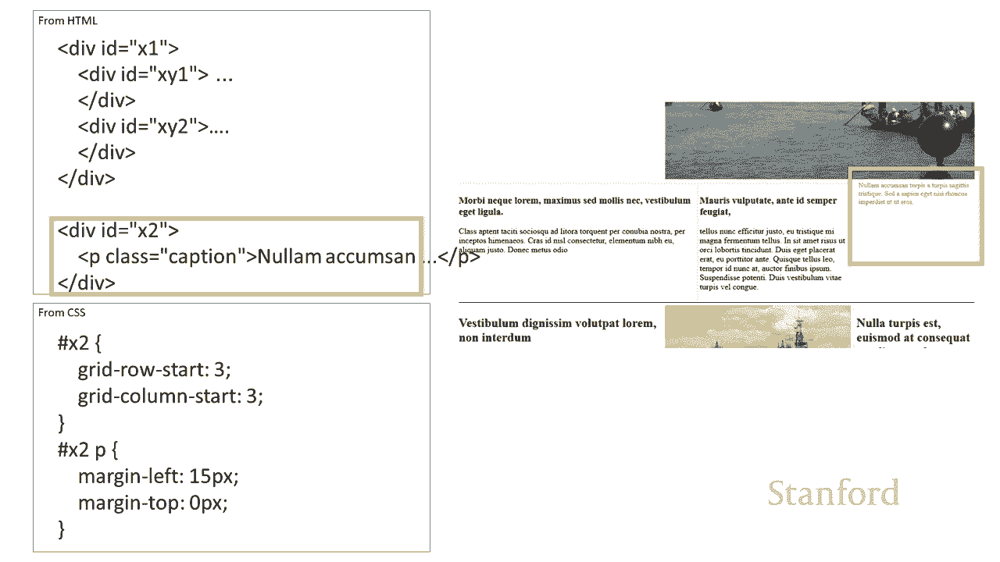

undefined，undefined，好的所以呃这里是原来的，好的所以呃这里是原来的，呃纽约时间在右边呃，呃纽约时间在右边呃，然后在左边我们有，然后在左边我们有，复制纽约时间，复制纽约时间。

希望你会同意我这，希望你会同意我这，是你知道这，是你知道这，不完全匹配呃可能有，不完全匹配呃可能有，在其中一些边距上做得更好一些，在其中一些边距上做得更好一些，undefined，undefined。

特别是对于那些灰色，特别是对于那些灰色，垂直条而不是水平，垂直条而不是水平，条，但，条，但，我的意思是基本上这是相同的想法，我的意思是基本上这是相同的想法，如果您愿意，可以轻松进入并调整它，如果您愿意。

可以轻松进入并调整它，所以，所以，undefined，undefined，我想使用这个网格 基于布局，我想使用这个网格 基于布局，可以，可以，很容易地做一些非常复杂的，很容易地做一些非常复杂的，事情。

事情，希望你知道观看这个，希望你知道观看这个，视频已经相当长了，但希望，视频已经相当长了，但希望，所有内容都很容易理解，所有内容都很容易理解，你可以说嘿，你可以说嘿，你知道使用我学到的知识 在。

你知道使用我学到的知识 在，这门课上，我确实看到了如何，这门课上，我确实看到了如何，重新创建像纽约时报这样的复杂网页，重新创建像纽约时报这样的复杂网页，现在我实际上还有其中一个。

现在我实际上还有其中一个，我有华盛顿邮报的复制品，我有华盛顿邮报的复制品，undefined，undefined，但是嗯已经记录了整个，但是嗯已经记录了整个，纽约时报部分，纽约时报部分。

嗯和思考 关于你们，undefined，undefined，在纽约时代听这个相对较长的复制，在纽约时代听这个相对较长的复制，我认为我们应该把它留到，我认为我们应该把它留到，另一天，另一天。

所以我们会看看呃，所以我们会看看呃，复制华盛顿邮报的一部分我认为，复制华盛顿邮报的一部分我认为，还有一些其他有趣的教训，还有一些其他有趣的教训，undefined，undefined，关于那个娱乐但是。

undefined，undefined，呃今天的娱乐就。

