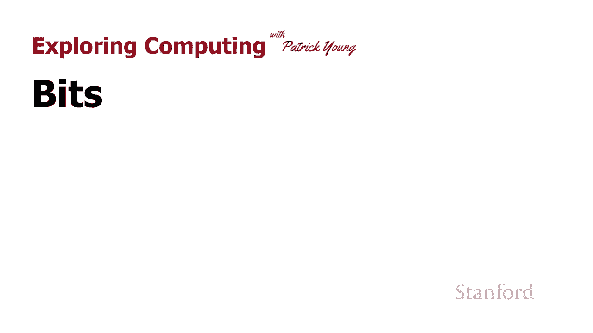
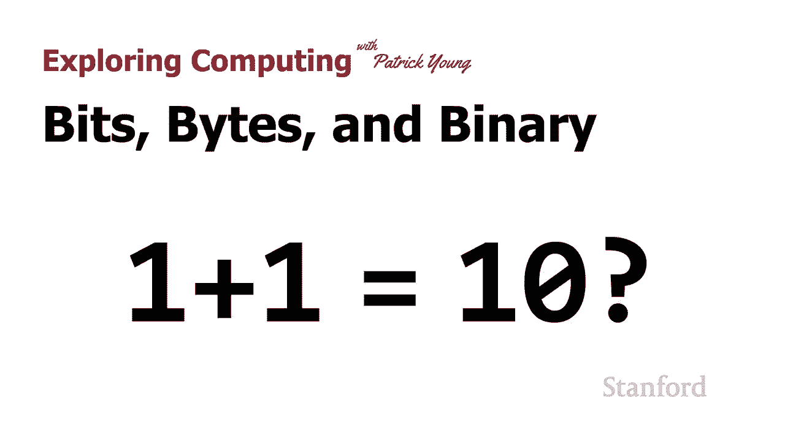
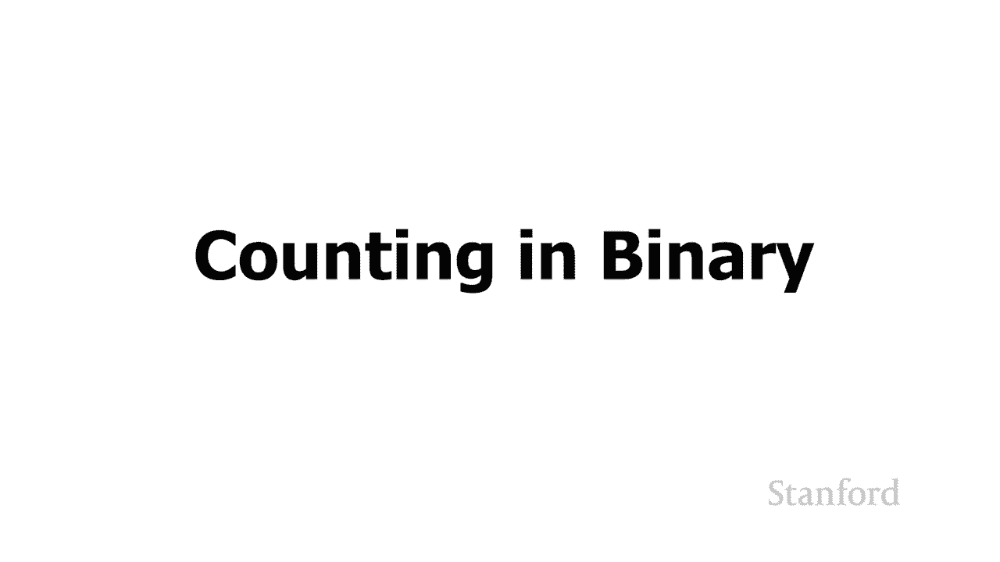
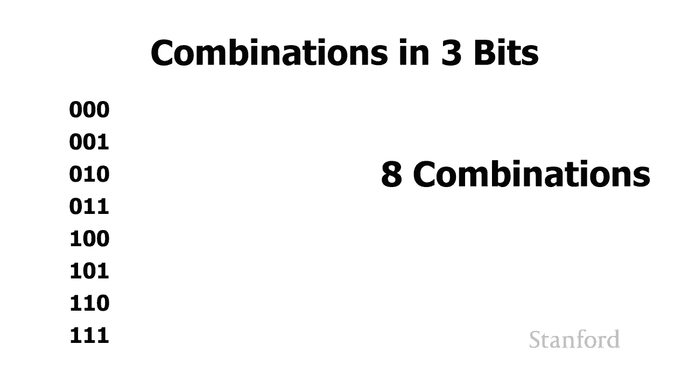

# 【双语字幕+资料下载】斯坦福CS105 ｜ 计算机科学导论(2021最新·完整版) - P3：L1.2- 比特、字节与二进制：1 + 1 = 10？ - ShowMeAI - BV1eh411W72E

undefined，欢迎探索，欢迎探索。

今天的视频是位字节和二进制，今天的视频是位字节和二进制。

部分二或一加一等于一，部分二或一加一等于一，零 所以在上一课中我们，零 所以在上一课中我们，看了二进制数，看了二进制数，以及为什么计算机在本课中使用二进制数，以及为什么计算机在本课中使用二进制数，系统。

undefined，undefined，仔细看看现在二进制数的，仔细看看现在二进制数的，实际工作原理，实际工作原理，我想首先说，我想首先说，我们将，我们将，在这个特定的视频中研究一些数学。

在这个特定的视频中研究一些数学，我不希望人们认为，我不希望人们认为，这是大部分 这门课，这是大部分 这门课，看起来像，看起来像，这主要是，这主要是，我们将要研究数学的唯一视频，但我。

我们将要研究数学的唯一视频，但我，确实，确实，认为了解这些二进制数是如何，认为了解这些二进制数是如何，真正工作的，并，真正工作的，并，了解何时看到，了解何时看到，二进制数 随着事情的发展，它实际。

二进制数 随着事情的发展，它实际，可能代表的内容将非常，可能代表的内容将非常，有用，有用，我们将看到二进制，我们将看到二进制，数字系统遍及计算机，数字系统遍及计算机，并且在许多，并且在许多，地方，地方。

undefined，undefined，计算机中数据的底层表示 使用这些，计算机中数据的底层表示 使用这些。

二进制，二进制，数会泄漏到现实世界中，数会泄漏到现实世界中，让我们继续看看这个，让我们继续看看这个，所以让我们从学习如何，所以让我们从学习如何，计数开始 现在我知道这似乎是，undefined。

undefined，在斯坦福大学开始演讲的一个奇怪的地方但是，在斯坦福大学开始演讲的一个奇怪的地方但是，请耐心，请耐心，等待，我们将回顾如何计算，等待，我们将回顾如何计算。

十进制数，十进制数，当我们试图了解，undefined，undefined，二进制计数的工作原理时，这将很有用，所以我将从，二进制计数的工作原理时，这将很有用，所以我将从，0 开始，然后我将 加。

0 开始，然后我将 加，1，当然这会给我们，1，当然这会给我们，1。1。我们将加 1 到 1，这，我们将加 1 到 1，这，将给我们两个我们将加二加一，将给我们两个我们将加二加一，这将给我们三个。

这将给我们三个，依此类推，然后我们' 会继续，依此类推，然后我们' 会继续，我们会得到八，我们会得到八，我们会加一到八 得到，我们会加一到八 得到，九 我们会加一到，九 我们会加一到。

九 这就是事情变得有点，九 这就是事情变得有点，冒险的地方 因为记住我们在，undefined，undefined，那里使用十进制数字系统 只有十位数字，那里使用十进制数字系统 只有十位数字。

从零开始一直到九，从零开始一直到九，所以当我们尝试将一加九时会发生什么，所以当我们尝试将一加九时会发生什么，是没有第十一位 数字，是没有第十一位 数字，所以发生的事情是，所以发生的事情是。

我们携带一并将我们的一，我们携带一并将我们的一，重置为零，我们最终得到一个，重置为零，我们最终得到一个，零或者当然是十现在我们，零或者当然是十现在我们，可以继续所以，可以继续所以，十加一是十一十一加。

十加一是十一十一加，一是十二等等，一是十二等等，现在当 我们得到了 19 加 1，现在当 我们得到了 19 加 1，undefined，undefined，这与 9 加 1 发生的情况类似。

这与 9 加 1 发生的情况类似，我们知道我们不能，我们知道我们不能，达到，达到，1 大于 9 的某个数字，因为，1 大于 9 的某个数字，因为，只有 0 到 9 的 10 位数字。

只有 0 到 9 的 10 位数字，undefined，undefined，所以我们再次将一个带过，所以我们再次将一个带过，我们最终得到 20。我们最终得到 20。这将继续下去 我们得到 98 加一。

这将继续下去 我们得到 98 加一，等于 99，等于 99，我们得到 99 加一 我们再次遇到，我们得到 99 加一 我们再次遇到，这种情况，这种情况，十位数和个位数都不，十位数和个位数都不，能再高。

能再高，我们只有十位数 所以我们进位，我们只有十位数 所以我们进位，undefined，undefined，从十位到十位，从十位，从十位到十位，从十位，到下一个数字，这将是，到下一个数字，这将是，百位。

百位。

，所以我们最终得到一百位 好吧，undefined，undefined，现在让我们来看看它在二进制中是如何工作的，undefined，undefined，所以在二进制中我们将继续。

所以在二进制中我们将继续，就像我们在 d 中所做的那样再次从零加一开始，undefined，undefined，二进制中的十进制零加一等于一，二进制中的十进制零加一等于一，就像零加一，就像零加一。

和十进制等于一一样，但是，和十进制等于一一样，但是，一旦我们进入下一步，一旦我们进入下一步，我们就会遇到一个问题，二进制中的一加一等于什么，undefined，undefined，这类似于，这类似于。

我们之前遇到的情况，当我们尝试，undefined，undefined，在十进制数系统中将 1 加到 9，在十进制数系统中将 1 加到 9，十进制数系统时，我们，十进制数系统时，我们。

在二进制数系统中有 10 个单独的数字，在二进制数系统中有 10 个单独的数字，我们只有两个数字 0，我们只有两个数字 0，和 1。所以当我们将 1 加到 1 时 没有，和 1。

所以当我们将 1 加到 1 时 没有，第三个数字，只有 0 和 1，所以，第三个数字，只有 0 和 1，所以，我们需要继续将 1 移过来，我们需要继续将 1 移过来，这样实际上会给我们 1。

这样实际上会给我们 1，0。我们可以继续将，0。我们可以继续将，1 加到 1 0 上，当我们尝试时，这将给我们 1 1，1 加到 1 0 上，当我们尝试时，这将给我们 1 1，将，将。

1 加到 1 1 这类似于，1 加到 1 1 这类似于，我们尝试将 1 加到 99 的情况，我们尝试将 1 加到 99 的情况，我们需要将 1 带过来，所以我们，我们需要将 1 带过来，所以我们。

将得到 1 0，将得到 1 0，0。我们可以继续这样做，所以，0。我们可以继续这样做，所以，1 0 0 加 1 等于 101 我们可以，1 0 0 加 1 等于 101 我们可以，undefined。

undefined，继续前进，所以我在这里写，undefined，undefined，的是二进制数系统的前八个数字，的是二进制数系统的前八个数字，m 实际上是前，m 实际上是前，九个，你认为零是，九个。

你认为零是，二进制数系统中的第一个数字，所以 0，二进制数系统中的第一个数字，所以 0，1 1 0 1 1 1 0 0 101，1 1 0 1 1 1 0 0 101。

1 1 0 1 1 1 最后是 1 0 0，1 1 0 1 1 1 最后是 1 0 0，0。所以这里是前 16 个数字，0。所以这里是前 16 个数字，在二进制数字系统中，您可以，在二进制数字系统中。

您可以，看到它们是，看到它们是，相当于十进制数 0，相当于十进制数 0，到 15 的灰尘。您还会注意到我在，到 15 的灰尘。您还会注意到我在，每个数字旁边都有这些小下标，undefined。

undefined，因此这些下标有时，因此这些下标有时，用于 当不清楚，undefined，undefined。

一个数字使用的是什么特定的数字系统时消除歧义，所以在这个，一个数字使用的是什么特定的数字系统时消除歧义，所以在这个，例子中，我在左边有数字 6，例子中，我在左边有数字 6，但我想强调，但我想强调。

它是一个十进制数字，所以，它是一个十进制数字，所以，6 后面的下标 10 代表那个，6 后面的下标 10 代表那个，undefined，undefined，6 左边是基数 10，6 左边是基数 10。

右边的下标 2，undefined，undefined，表示右边的数字，表示右边的数字，是基数 2。是基数 2。现在没有它没有那个下标，现在没有它没有那个下标，10 没有那个范围下标 2 你。

10 没有那个范围下标 2 你，可能会猜到这个数字，可能会猜到这个数字，左边是基数 10，因为，左边是基数 10，因为，它' 显然不是二进制它，它' 显然不是二进制它，有一个数字 6，有一个数字 6。

在二进制数字系统中不存在尽管，在二进制数字系统中不存在尽管，还有其他一些数字系统，例如，undefined，undefined，偶尔在计算机，偶尔在计算机，科学中使用的基数 8 数字系统。

科学中使用的基数 8 数字系统，然后有一个基数为 16 的数字系统，然后有一个基数为 16 的数字系统，称为 十六，称为 十六，进制在计算机科学中确实得到了相当多的使用。

进制在计算机科学中确实得到了相当多的使用，我们将在另一堂课中看到它，我们将在另一堂课中看到它，因此左侧的 6，因此左侧的 6，可以是这些数字系统之一，可以是这些数字系统之一，因此将 10 放在。

因此将 10 放在，底部强调这是在 事实上，底部强调这是在 事实上，一个十进制数和右边的 1 1 0，一个十进制数和右边的 1 1 0，这可以代表，这可以代表，以 10 为基数的 110。

所以那里的小下标，以 10 为基数的 110，所以那里的小下标，也，也，告诉我们，这不是 110 这，告诉我们，这不是 110 这，实际上是 1，实际上是 1，1 0。这确实让我们进入，1 0。

这确实让我们进入，下一个，下一个，问题 这就是我们如何，问题 这就是我们如何，计算这些不同数字的等价性，计算这些不同数字的等价性，所以让我们，所以让我们，简短地看一下这个，简短地看一下这个。

我不会要求你们，我不会要求你们，能够进行从，能够进行从，二进制到十进制的转换，你知道，二进制到十进制的转换，你知道，在本季度的任何，在本季度的任何，时候，这就是我，时候，这就是我，通常会说我们不会让。

通常会说我们不会让，你在考试中做的点，但是，你在考试中做的点，但是，嘿，因为我们处于隔离状态，嘿，因为我们处于隔离状态，所以没有考试，所以，所以没有考试，所以，去冠状病毒，我猜，但我做 希望。

undefined，undefined，您了解它是如何工作的 所以，您了解它是如何工作的 所以，我们再次从十进制，我们再次从十进制，数开始 因为这是一个我们已经，数开始 因为这是一个我们已经。

习惯的系统 通过提醒，习惯的系统 通过提醒，自己系统的实际工作方式将，undefined，undefined，在我们尝试时帮助我们 将它转换为二进制，所以，在我们尝试时帮助我们 将它转换为二进制，所以。

这里我得到了数字，这里我得到了数字，1891。现在如果你考虑，1891。现在如果你考虑，1891 实际上代表什么，1891 实际上代表什么，我们有四个不同的数字，我们有四个不同的数字，最右边的一位。

最右边的一位，代表 10 的零次方，这，代表 10 的零次方，这，就是，就是，我们的 num  9 上的第二个数字，undefined，undefined，代表我们的 2 的第一个幂或。

代表我们的 2 的第一个幂或，我们的，我们的，十个 8 代表 10 的第二个，十个 8 代表 10 的第二个，幂或数百，幂或数百，第四个数字代表，第四个数字代表，我们的第三个幂，我们的第三个幂。

是 10 的第三个幂，即一千，是 10 的第三个幂，即一千，所以如果我正在寻找 在 1891 年，所以如果我正在寻找 在 1891 年，我知道我有 1 10 的 0 次方 i。

我知道我有 1 10 的 0 次方 i，有，有，9 10 的第一次幂 8 10 的，9 10 的第一次幂 8 10 的，第二次幂，第二次幂，和 1 10 的三次幂 所以我有 1。

和 1 10 的三次幂 所以我有 1，加 90 加上 800 加上 1000 加一千，这，加 90 加上 800 加上 1000 加一千，这，给了我们 1891。给了我们 1891。

让我们继续看看它是，让我们继续看看它是，如何处理二进制数的，如何处理二进制数的，所以在这里我得到了二进制数 1 1 0，所以在这里我得到了二进制数 1 1 0，1。

在第零位最右边的这个井的十进制等价物是多少，undefined，undefined，undefined，我有我的两个到零所以这些，我有我的两个到零所以这些，这些是一个因为两个到，这些是一个因为两个到。

零的幂是，零的幂是，一个下一个地方代表我的，一个下一个地方代表我的，两个到第一个权力所以那些，两个到第一个权力所以那些，代表我们，代表我们，在左边的两个权力我有我们的，在左边的两个权力我有我们的。

两个到第二个权力代表，两个到第二个权力代表。

四，四，然后一步我有，然后一步我有，我们的两个到第三个权力，我们的两个到第三个权力，undefined，undefined，在这种特殊情况下是 8 我有一个，在这种特殊情况下是 8 我有一个。

2 的零次方，2 的零次方，我没有 2 的第一个幂，我没有 2 的第一个幂，我有 1 2 的第二次，我有 1 2 的第二次，幂 我有 1 2 的第三次幂 所以我，幂 我有 1 2 的第三次幂 所以我。

有，有，1 加 0 加 4 加，1 加 0 加 4 加。

8 意味着这，8 意味着这，相当于十进制的 13。相当于十进制的 13。所以有一件事会变成，所以有一件事会变成，当我们表示信息时，对我们来说重要的是我们，当我们表示信息时，对我们来说重要的是我们。

undefined。

undefined，undefined，可以在给定数量的位中存储多少种不同的组合，所以，可以在给定数量的位中存储多少种不同的组合，所以，undefined，undefined，让我们从一位开始。

undefined，undefined，我们可以用一位很好地表示什么我们可以表示零或一，我们可以用一位很好地表示什么我们可以表示零或一，undefined，undefined，什么 对于，什么 对于。

我们可以，我们可以，使用零或一来表示的最常见的，使用零或一来表示的最常见的，事情来说，这实际上是对的还是错的，事情来说，这实际上是对的还是错的，所以我们是否能够很好地，所以我们是否能够很好地。

回到斯坦福，回到斯坦福，参加夏季会议，如果那一点令人，参加夏季会议，如果那一点令人，兴奋 1，兴奋 1，那么答案是肯定的，如果那位，那么答案是肯定的，如果那位，存储是 0 那么答案是没有。

存储是 0 那么答案是没有，多少不同的组合可以，多少不同的组合可以，存储在两位中，存储在两位中，这里是不同的组合，这里是不同的组合，两位，你可以看到有，两位，你可以看到有，四种可能的组合。

四种可能的组合，怎么样 这里三位的组合是三位，怎么样 这里三位的组合是三位，的不同组合。

undefined，undefined，最后这里，最后这里，是四位的组合，是四位的组合，所以考虑这些的方式是你，所以考虑这些的方式是你，可以把它们想成，可以把它们想成，哦。

那些是二进制 nu  mbers，我们在，哦，那些是二进制 nu  mbers，我们在，一分钟前看到了如何将它们转换为十进制，一分钟前看到了如何将它们转换为十进制，undefined。

undefined，所以你知道我们有这 16 种可能的，所以你知道我们有这 16 种可能的，组合，组合，它们可以表示，它们可以表示，0 到 15 之间的十进制数，0 到 15 之间的十进制数。

但它们可能用于，但它们可能用于，表示其他东西，例如，undefined，undefined，我可以使用这些 16 种组合，我可以使用这些 16 种组合。

代表加拿大的十个省，所以，代表加拿大的十个省，所以，如果我们是加拿大的一所学校，如果我们是加拿大的一所学校，我们想知道，我们想知道，某人住在哪个省，某人住在哪个省，我可以有零零零零，我可以有零零零零。

例如代表，例如代表，爱德华王子岛和，爱德华王子岛和，undefined，undefined，零零零一新斯科舍省 0010 代表新，零零零一新斯科舍省 0010 代表新，不伦瑞克等，不伦瑞克等。

我们能代表关于我们的，我们能代表关于我们的，州和我们的四个出价的信息吗 不，州和我们的四个出价的信息吗 不，我们不能有 50 个不同的州，我们不能有 50 个不同的州，我们只能，我们只能。

在我们的四位中存储多达 16 种不同的组合，undefined，undefined，所以我们的加拿大省份适合，所以我们的加拿大省份适合，四位，事实上 我们也可以，四位，事实上 我们也可以。

轻松地添加三个，轻松地添加三个，加拿大领土，我们只是，加拿大领土，我们只是，没有足够的四位空间来，没有足够的四位空间来，存储美国，存储美国，各州，事实上，如果我们有五个双 ts，各州，事实上。

如果我们有五个双 ts，我们仍然无法存储它我们，我们仍然无法存储它我们，将看到我们实际上需要，将看到我们实际上需要。

六个位来存储联合的所有状态，六个位来存储联合的所有状态，undefined，undefined，所以我们已经看到在一位中我们可以，所以我们已经看到在一位中我们可以，表示两种组合，两位，表示两种组合。

两位，我们可以表示，我们可以表示，四三八 四，四三八 四，十六 事实证明这里有一个简单的，十六 事实证明这里有一个简单的，公式 如果我们有 n，公式 如果我们有 n，位 我们可以表示 2 到 n 的。

位 我们可以表示 2 到 n 的，组合 所以在这里你可以看到，组合 所以在这里你可以看到，我们可以，我们可以，拥有一二，拥有一二，三四五六七八九和十的常见组合数，三四五六七八九和十的常见组合数。

undefined，undefined，现在当你在看这些，现在当你在看这些，不同的组合时请记住，不同的组合时请记住，这些单独的位可以代表，这些单独的位可以代表，数字，可以代表正数和，数字。

可以代表正数和，负数，负数，可以代表不同的东西，比如，可以代表不同的东西，比如，我们的加拿大省份，我们的加拿大省份，我们可以使用特定的位序列，我们可以使用特定的位序列，来代表，来代表。

斯坦福大学的宿舍 因此，斯坦福大学的宿舍 因此，程序员，程序员，必须决定做的一件事，必须决定做的一件事，是，是，当我们设计一个我们需要定义的程序时，他们想对各个位，当我们设计一个我们需要定义的程序时。

他们想对各个位，undefined，undefined，做什么 说明，做什么 说明，要为特定数量留出多少位，要为特定数量留出多少位，undefined，undefined，以及我们将如何。

以及我们将如何，用位和字节表示事物，用位和字节表示事物，这是我们将，这是我们将，在本讲座后面和，在本讲座后面和，本周剩余时间里更多探索的，本周剩余时间里更多探索的，事情 现在另一件事 您可能会注意到。

事情 现在另一件事 您可能会注意到，如果我们在这里查看这些数字，如果我们在这里查看这些数字，248163264282565112，undefined，undefined，undefined。

undefined，如果您已经购买了一个新的说法，这些数字对您来说可能看起来有点熟悉，如果您已经购买了一个新的说法，这些数字对您来说可能看起来有点熟悉，iphone 最近你买多少内存。

iphone 最近你买多少内存，在 iphone 你能买，在 iphone 你能买，100 MB 你能买 250，100 MB 你能买 250，MB，MB，不你买 128 或 256 或 512。

不你买 128 或 256 或 512，为什么因为它们是 2 的幂并且，为什么因为它们是 2 的幂并且。

因为现在我们的计算机内部，因为现在我们的计算机内部，使用二进制数字系统，使用二进制数字系统，' 我只解决了一半的谜团，' 我只解决了一半的谜团，尽管现在我们明白为什么，尽管现在我们明白为什么。

我们购买 64 128 或 256 的 iphone，我们购买 64 128 或 256 的 iphone，但为什么我们购买它们的单位是兆字节，但为什么我们购买它们的单位是兆字节。

或千兆字节而不是数百万和数，undefined，undefined，十亿 ns，十亿 ns，十亿，这些，十亿，这些，都是 10 的幂，都是 10 的幂，而且在内部我们使用的是，而且在内部我们使用的是。

二进制数系统，二进制数系统，而不是十进制数系统，因此，而不是十进制数系统，因此，千字节、兆字节、千兆字节和，千字节、兆字节、千兆字节和，太字节是基数的两个等价物，太字节是基数的两个等价物。

您可以从此处的表中，您可以从此处的表中，看到二到十分之一，看到二到十分之一，大约是一千，但它实际上，大约是一千，但它实际上，有点大，有点大，2 到 20 是一兆字节，2 到 20 是一兆字节。

大约是一百万，但它实际上，大约是一百万，但它实际上，有点大，有点大，千兆字节和太字节，千兆字节和太字节，也是如此，所以这里的想法是我们要给出，也是如此，所以这里的想法是我们要给出，你，你，和十亿、一。

和十亿、一，百万，百万，或一千大致相同，但我们想用 2 的幂来做，undefined，undefined，你可以在这里看到一些更高阶的，你可以在这里看到一些更高阶的，数字，你可能，数字，你可能。

有一天会遇到 peta exa zeta 和 yoda，有一天会遇到 peta exa zeta 和 yoda，我应该提到那里，undefined，undefined，选举工程师和计算机。

选举工程师和计算机，科学家在我们是否，科学家在我们是否，应该使用 2 的幂的问题上，应该使用 2 的幂的问题上，存在一些分歧，所以有些地方当我们，存在一些分歧，所以有些地方当我们，与电气工程师合作时。

他们，与电气工程师合作时，他们，会 使用，会 使用，kila mega 或 giga，它们，kila mega 或 giga，它们，实际上是指以 10，实际上是指以 10，为基数的数以百万计和数十亿。

undefined，undefined，undefined，undefined，undefined，10。 好的，在下一讲中我们，10。 好的，在下一讲中我们，将看看，将看看。

undefined。