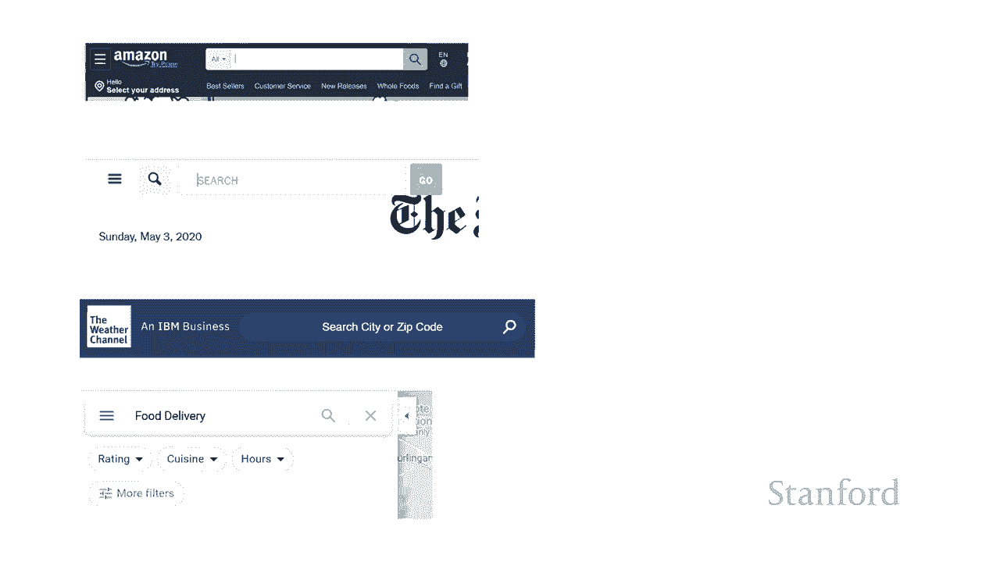
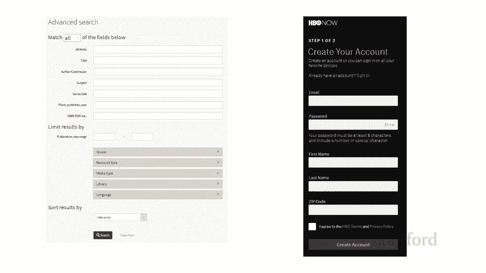

# 【双语字幕+资料下载】斯坦福CS105 ｜ 计算机科学导论(2021最新·完整版) - P40：L13.1- 创建网页：输入表单 - ShowMeAI - BV1eh411W72E

undefined，欢迎探索计算，欢迎探索计算，今天的视频正在，今天的视频正在，为输入创建网页表单，为输入创建网页表单，到目前为止，我们一直在研究如何，到目前为止，我们一直在研究如何，在网页上呈现信息。

在网页上呈现信息，但网站所做的不仅仅是允许，但网站所做的不仅仅是允许，呈现，呈现，信息，它们实际上允许，undefined，undefined，查看者和网站之间进行交互 因此。

查看者和网站之间进行交互 因此，为了做到这一点，为了做到这一点，我们需要使用表格，因此，我们需要使用表格，因此，在本视频中，我们将向您展示，在本视频中，我们将向您展示。

如何创建表格的基础知识，如何创建表格的基础知识，因此这里有许多不同的表格，因此这里有许多不同的表格，最上面的，最上面的，表格是亚马逊搜索，表格是亚马逊搜索，然后我们 有纽约时报，然后我们 有纽约时报。

搜索文章，搜索文章，我们有天气频道，我们有天气频道，寻找天气然后我们有，寻找天气然后我们有，谷歌地图要求，谷歌地图要求，外卖这个，外卖这个，比其他的有点复杂因为，比其他的有点复杂因为，你可以看到。

你可以看到，我们可以选择一些拉- 这里的向下菜单，我们可以选择一些拉- 这里的向下菜单，undefined，undefined，通过他们的美食或营业时间来限制我们的选择。

通过他们的美食或营业时间来限制我们的选择，或者其他一些选项，或者其他一些选项。

以及，以及，农场可能会变得更加复杂，所以，农场可能会变得更加复杂，所以，在左边我们有，在左边我们有，b 的高级搜索表单 看看斯坦福，b 的高级搜索表单 看看斯坦福，图书馆，你会看到我们，图书馆。

你会看到我们，有各种各样的东西可以检查，有各种各样的东西可以检查，然后在右边我们，然后在右边我们，在 hbo 创建了一个新帐户 所以，在 hbo 创建了一个新帐户 所以，这就是，这就是。

我们正在谈论的事情 现在在本课程中讨论如何，我们正在谈论的事情 现在在本课程中讨论如何，允许用户在网页上输入信息，允许用户在网页上输入信息，并将其提交到 Web 服务器，并将其提交到 Web 服务器。

我们将，我们将，重点关注，重点关注，如何实际创建网页，如何实际创建网页，以提交信息，而，以提交信息，而，不是，不是，如何 服务器本身将，如何 服务器本身将，响应该信息 呃，响应该信息 呃。

cs106e 学生 我们将，cs106e 学生 我们将，仔细看看，undefined，undefined，一旦该信息被提交到服务器，一旦该信息被提交到服务器，呃 cs105 学生会发生什么 我会。

呃 cs105 学生会发生什么 我会，继续前进 这些讲座，继续前进 这些讲座，在本季度晚些时候的某个时候开始，在本季度晚些时候的某个时候开始，如果你们有一点，如果你们有一点。

编程经验，编程经验，如果你想看看那些，如果你想看看那些，那么这里是我们的示例表格，嗯，那么这里是我们的示例表格，嗯，我们，我们，允许人们提供，允许人们提供，有关旅行的信息 那滑雪俱乐部 b。

有关旅行的信息 那滑雪俱乐部 b，正在进行中，您可以看到有，正在进行中，您可以看到有，各种不同的，各种不同的，元素允许用户，元素允许用户，输入信息，输入信息，在 html 术语中，这些元素被。

在 html 术语中，这些元素被，称为表单，称为表单，元素，因此，元素，因此，允许用户提交信息的整个项目被，允许用户提交信息的整个项目被，称为 表单，称为 表单，然后是，然后是，用户，用户。

在文本中输入信息类型的实际元素 单击，在文本中输入信息类型的实际元素 单击，按钮这些被称为，按钮这些被称为，表单元素 这是一个 html 唯一，表单元素 这是一个 html 唯一，术语 一般而言。

这些类型的项目，术语 一般而言，这些类型的项目，在计算机科学中被称为，在计算机科学中被称为，控件，控件，您可能还会听到术语小部件 所以，您可能还会听到术语小部件 所以。

一个 html 表单元素本质上是一个，一个 html 表单元素本质上是一个，undefined，undefined，出现在网页上的控件，出现在网页上的控件，所以我们将把我们所有的。

所以我们将把我们所有的，控件或我们的表单元素放在，控件或我们的表单元素放在，一个，一个，表单标签中，现在我只想，表单标签中，现在我只想，放一个，放一个，id 只是为了我们可以识别它我们。

id 只是为了我们可以识别它我们，可以做一些样式信息，可以做一些样式信息，或者你知道我们是否想以，或者你知道我们是否想以，某种方式使用它我需要一种方法来解决这个问题。

某种方式使用它我需要一种方法来解决这个问题，所以我可以继续使用，所以我可以继续使用，它的，它的，id 实际上并不是必需的，id 实际上并不是必需的，这里可能会出现一堆其他属性，undefined。

undefined，例如，如果用户要，例如，如果用户要，在表单中输入信息并将其，在表单中输入信息并将其，提交给 Web，提交给 Web，服务器，Web 服务器需要知道，服务器，Web 服务器需要知道。

响应它的程序将去哪里，响应它的程序将去哪里，以及 所以还有各种各样的其他，以及 所以还有各种各样的其他，属性会以 uh 的形式出现，这，属性会以 uh 的形式出现，这，undefined。

undefined，取决于，取决于，你现在打算如何使用它，我们将，你现在打算如何使用它，我们将，专注于，专注于，现在我们，现在我们，将专注于，将专注于，拥有 表单标签本身，拥有 表单标签本身。

和出现在其中的元素，和出现在其中的元素，undefined，undefined，我们可以讨论，undefined，undefined，undefined，在另一个时间点可能出现在，undefined。

undefined，undefined，表单，表单，中的不同属性值 使用，undefined，undefined，input 标签创建，我们将，input 标签创建，我们将。

看到 input 标签实际上是一个，看到 input 标签实际上是一个，多用途标签，它创建了一堆，多用途标签，它创建了一堆，我们在这个网页上看到的不同元素，undefined，undefined。

以及一个 bu，以及一个 bu，一个根本没有出现在这个表单上的，一个根本没有出现在这个表单上的，其他元素，其他元素，以及输入元素的工作方式是，以及输入元素的工作方式是，我们通过查看，我们通过查看。

它的类型来确定输入元素的确切用途，它的类型来确定输入元素的确切用途，因此在，因此在，这种情况下，类型等于文本，这种情况下，类型等于文本，等等 这意味着表单将，等等 这意味着表单将，undefined。

undefined，允许用户将文本输入到，允许用户将文本输入到，undefined，undefined，单行文本字段中，您会注意到这里有，单行文本字段中，您会注意到这里有，一个结束斜杠，这。

一个结束斜杠，这，表明有一个标签，表明有一个标签，而不是一对带有开始和结束，而不是一对带有开始和结束，标签的标签，标签的标签，和 我想继续给它一个，和 我想继续给它一个，名字 我在这里有多个文本字段。

名字 我在这里有多个文本字段，当这些信息被发送到，当这些信息被发送到，网络服务器时，网络服务器需要知道，网络服务器时，网络服务器需要知道，如何识别，如何识别，哪些信息与什么相关，哪些信息与什么相关。

因此名称决定了如何，undefined，undefined，undefined，当用户，当用户，在，在，表单中输入信息并，表单中输入信息并，单击提交按钮，单击提交按钮，时，除了名称之外，还发送信息时。

这将由服务器识别，将会有一个值，即，时，除了名称之外，还发送信息时，这将由服务器识别，将会有一个值，即，用户输入的任何内容我 在，用户输入的任何内容我 在，表单中，表单中，将会发生的事情是服务器将。

将会发生的事情是服务器将，接收名称，接收名称，和值作为对，所以如果，和值作为对，所以如果，我在此处输入“无”一词，那么，我在此处输入“无”一词，那么，将提交给服务器的是，将提交给服务器的是，由，由。

该文本上的名称确定的信用字段，该文本上的名称确定的信用字段，字段服务器将，字段服务器将，收到信用字段，收到信用字段，具有值 none，具有值 none，现在的信息 到目前为止我们的文本字段已经开始为。

现在的信息 到目前为止我们的文本字段已经开始为，空，空，uh 您可以使用预先存在的值从文本字段开始，uh 您可以使用预先存在的值从文本字段开始，因此，因此，您可能知道是否有信用字段，undefined。

undefined，卡片正确答案不是没有，所以我们，卡片正确答案不是没有，所以我们，可能想从一个值开始，这样，可能想从一个值开始，这样，我们就可以从值，我们就可以从值，一二三四一二三四。

一二三四一二三四，一二三四一二三四，一二三四一二三四，嗯开始，所以用户将能够，嗯开始，所以用户将能够，要么提交初始值，要么提交初始值，一二三四一二三四，一二三四一二三四，一二三四一二三四，要么。

一二三四一二三四，要么，他们可以编辑，他们可以编辑，它另外还有另一个属性，它另外还有另一个属性，值对，您可以将其，值对，您可以将其，放入名为 placeho 的输入标签中。

放入名为 placeho 的输入标签中，lder 占位符给出了，lder 占位符给出了，预期内容的提示，预期内容的提示，因此在这种情况下，我们的提示是输入，因此在这种情况下，我们的提示是输入，信用卡号。

信用卡号，您可能想知道，您可能想知道，提供值与，提供值与，提供占位符之间的区别，提供占位符之间的区别，是什么，本质上该值是，是什么，本质上该值是，将提交给 Web 服务器的内容 如果。

将提交给 Web 服务器的内容 如果，用户没有，用户没有，在该字段中输入任何内容，并且他们，在该字段中输入任何内容，并且他们，确实点击了该字段，则，确实点击了该字段，则，该值将是，该值将是，他们可以。

他们可以，在对比占位符中编辑的初始值，您会，在对比占位符中编辑的初始值，您会，注意到它是浅灰色的，注意到它是浅灰色的，如果用户实际上是，如果用户实际上是，单击占位符文本，单击占位符文本。

它会立即消失 它不是，它会立即消失 它不是，实际的实际初始值，实际的实际初始值，它只是作为提示，它只是作为提示，存在 另一件，存在 另一件，需要注意的重要事项是，如果我在这里有输入标签。

需要注意的重要事项是，如果我在这里有输入标签，我会给它一个名字，记住 name，我会给它一个名字，记住 name，标识何时将其提交，标识何时将其提交，到服务器 该名称标识，到服务器 该名称标识。

正在提交哪个特定文本字段，正在提交哪个特定文本字段，但没有向用户显示的实际标签，undefined，undefined，所以如果我想要一个 la  bel 出现在这里所以。

所以如果我想要一个 la  bel 出现在这里所以，假设我想说，假设我想说，除了输入标签之外的信用卡，undefined，undefined，所以你需要包含输入标签，所以你需要包含输入标签，然后，然后。

你想要做的任何格式以及，你想要做的任何格式以及，你想要的任何标签，你想要的任何标签，再次，再次，与输入元素分开 输入元素，与输入元素分开 输入元素，只是要创建那个空白的空，只是要创建那个空白的空，框。

框，您也可以将它运行到密码，您也可以将它运行到密码，输入，输入，类型，这看起来和工作方式，undefined，undefined，与文本类型非常相似，嗯，不同之处在于，与文本类型非常相似，嗯。

不同之处在于，如果有人开始，如果有人开始，输入密码，您将获得这些，输入密码，您将获得这些，圆圈，否则您会得到，圆圈，否则您会得到，星号或其他指示符，星号或其他指示符，表明您，表明您。

在密码字段中输入了内容，但现在，在密码字段中输入了内容，但现在，实际上看不到文本，实际上看不到文本，我应该提醒您，此密码，我应该提醒您，此密码，undefined，undefined，字段的安全性比您。

字段的安全性比您，想象的要低 在，想象的要低 在，你的肩膀上看着你正在，你的肩膀上看着你正在，输入的东西，但它实际上并不能保护，输入的东西，但它实际上并不能保护，信息的传输，信息的传输。

因为文本被发送到互联网所以如果，因为文本被发送到互联网所以如果，你真的，你真的，想要哟 你的密码保护，想要哟 你的密码保护，当然你需要使用http协议的https。

当然你需要使用http协议的https，安全，安全，变体不要只是，变体不要只是，将，将，输入类型设置为密码并，输入类型设置为密码并，期望这足够了，这，期望这足够了，这，绝对不够，绝对不够，好。

所以正如我之前提到的那样，好，所以正如我之前提到的那样，一堆不同，一堆不同，类型的输入元素，所以我们的下，类型的输入元素，所以我们的下，一种输入元素是复选框，一种输入元素是复选框，我们滑雪俱乐部。

我们滑雪俱乐部，网页上的例子，网页上的例子，是我们将为来访的人们提供一堆，是我们将为来访的人们提供一堆，晚餐，undefined，undefined，在滑雪俱乐部旅行中，在滑雪俱乐部旅行中。

人们可以表明，人们可以表明，他们是否想，他们是否想，与这个，与这个，极客俱乐部共进晚餐，所以有一堆，极客俱乐部共进晚餐，所以有一堆，复选框，他们可以继续点击，undefined，undefined。

他们计划的尽可能多或尽可能少的饭菜 现在再次和这个极客，他们计划的尽可能多或尽可能少的饭菜 现在再次和这个极客，俱乐部，俱乐部，一起度过，输入，一起度过，输入，类型等于文本，类型等于文本，没有提供标签。

所以如果你，没有提供标签，所以如果你，undefined，undefined，想知道有一个名称星期五晚餐，想知道有一个名称星期五晚餐，但，但，输入名称中的星期五晚餐等于实际的星期五晚餐。

undefined，undefined，undefined，undefined，如果你真的想要在网页上有一个实际的标签，undefined，undefined，告诉他们他们应该点击的这个小方块是什么。

undefined，undefined，你实际上需要手动标记它，你实际上需要手动标记它，如果你现在 希望复选框以选中状态，如果你现在 希望复选框以选中状态，开始，您可以通过，开始，您可以通过，将，将。

选中的属性添加到输入标签来实现此目的，选中的属性添加到输入标签来实现此目的，您还可能会看到人们从该值开始，您还可能会看到人们从该值开始，undefined，undefined，要么只是将该属性。

要么只是将该属性，检查放在那里，检查放在那里，要么将属性值对，要么将属性值对，选中等于检查，选中等于检查，正在发生的事情 在那里我提到，正在发生的事情 在那里我提到，了几次，了几次。

我通常使用一种称为 xhtml 的 html 变体，我通常使用一种称为 xhtml 的 html 变体，它具有稍微严格的，它具有稍微严格的，语法规则，因此有一堆，语法规则，因此有一堆，不同的语法角色。

呃，不同的语法角色，呃，标签和属性需要全部使用，标签和属性需要全部使用，小写，小写，呃，如果你正在使用，呃，如果你正在使用，你知道的标准规则 你可以，你知道的标准规则 你可以。

输入 ch 输入大写 i 嗯你可以，输入 ch 输入大写 i 嗯你可以，输入大写 i 和大写，输入大写 i 和大写，uh 你可以在属性名称上混合大小写，uh 你可以在属性名称上混合大小写。

你可以获得相当 一团糟，你可以获得相当 一团糟，它仍然是合法，它仍然是合法，的 index。html 规则之一是，如果，的 index。html 规则之一是，如果，你有，你有，一个属性，你必须有一个值。

所以，一个属性，你必须有一个值，所以，如果我们遵循严格的 xhtml 规则，如果我们遵循严格的 xhtml 规则，你只是说，你只是说，类型等于复选框，然后，类型等于复选框，然后，你就说 检查。

你就说 检查，了没有值的属性名称，了没有值的属性名称，这在 xhtml 上实际上是非法的，这在 xhtml 上实际上是非法的，所以，所以，如果我们有一个属性并且我们，如果我们有一个属性并且我们。

实际上没有一个特定的值，我们，实际上没有一个特定的值，我们，想要将它设置，想要将它设置，为约定是您将它设置，为约定是您将它设置，为 属性所以你可能会看到，undefined，undefined。

在这种情况下检查等于检查我只是违反，在这种情况下检查等于检查我只是违反，了，了，xhtml 规则，只是恢复到标准的，xhtml 规则，只是恢复到标准的，html 角色，然后把检查这个词放在。

html 角色，然后把检查这个词放在，那里我认为，那里我认为，学生们发现有点不那么，学生们发现有点不那么，令人困惑，所以那些是 复选框，令人困惑，所以那些是 复选框，您经常会遇到的另一种类型的元素。

您经常会遇到的另一种类型的元素，称为，称为，单选按钮 这里，单选按钮 这里，是我在此网页上的单选按钮，是我在此网页上的单选按钮，我允许人们确定，我允许人们确定，他们是否打算，他们是否打算。

自己开车去滑雪小屋，自己开车去滑雪小屋，如果他们想和滑雪队的其他成员一起乘坐公共汽车，如果他们想和滑雪队的其他成员一起乘坐公共汽车，或者，或者，如果他们有很多额外的现金如果。

如果他们有很多额外的现金如果，他们想飞到那里，他们想飞到那里，所以用户需要选择，所以用户需要选择，这些不同的选项之一，此外，这些不同的选项之一，此外，他们可以 确定他们是想要，他们可以 确定他们是想要。

自己的房间还是现在想要双人，自己的房间还是现在想要双人，房，房，需要注意的重要一件事，需要注意的重要一件事，是，是，复选框和单选按钮之间的区别，所以在，复选框和单选按钮之间的区别，所以在。

左边我有我的复选框，左边我有我的复选框，在右边我有 得到了我的单选按钮，在右边我有 得到了我的单选按钮，这里的不同之处在于我可以根据需要检查，这里的不同之处在于我可以根据需要检查。

尽可能多或尽可能少的复选框，尽可能多或尽可能少的复选框，而这些单选按钮，而这些单选按钮，是相互排斥的，是相互排斥的，选择，我，选择，我，说是的，我想继续滑雪是没有意义的 旅行，说是的。

我想继续滑雪是没有意义的 旅行，但，但，我想要一个单人房和一个双人房，我想要一个单人房和一个双人房，你需要选择一个，你需要选择一个，或另一个对比，或另一个对比，就餐而言，就餐而言，你知道，你知道。

我说我想要周六的晚餐和，我说我想要周六的晚餐和，周日的晚餐是完全有道理的，或者，周日的晚餐是完全有道理的，或者，你知道我 不想要任何晚餐，你知道我 不想要任何晚餐，或者我想要所有的迪 nners。

或者我想要所有的迪 nners，所以这些复选框都是，所以这些复选框都是，相互独立的，而，相互独立的，而，单选按钮是相互排斥的，单选按钮是相互排斥的，你确实想确保，undefined，undefined。

为了正确的目的使用正确类型的元素，为了正确的目的使用正确类型的元素，我肯定见过一堆，我肯定见过一堆，业余网页，其中 有人喜欢，业余网页，其中 有人喜欢，嘿，我认为那些圆形按钮看起来，嘿。

我认为那些圆形按钮看起来，真的很酷，所以让我继续使用，真的很酷，所以让我继续使用，它们，即使这不是一个相互，它们，即使这不是一个相互，排斥的选择，排斥的选择，而且实际上是一个它，而且实际上是一个它。

让用户感到困惑但，让用户感到困惑但，两个它也会导致大问题，两个它也会导致大问题，因为单选按钮不是'  t 旨在，因为单选按钮不是'  t 旨在，正常取消选中，正常取消选中，所以不要这样做，使用方形。

所以不要这样做，使用方形，复选框进行选择，用户，复选框进行选择，用户，可以，可以，选择任意数量或任意数量，选择任意数量或任意数量。

，然后，然后，在您有一组互斥的选择时使用圆形单选按钮，undefined，undefined，这些是 被称为单选按钮，因为，这些是 被称为单选按钮，因为，它们类似于，它们类似于，汽车收音机上的按钮。

所以假设我在，汽车收音机上的按钮，所以假设我在，这里有这个汽车收音机，这里有这个汽车收音机，站 1 设置为摇滚站 2，站 1 设置为摇滚站 2，设置为环绕，站 3 设置为 t  o，设置为环绕。

站 3 设置为 t  o，undefined，undefined，country 比方说我正在听一些说唱，country 比方说我正在听一些说唱，我决定我不喜欢这首歌，然后，我决定我不喜欢这首歌，然后。

我按下了国家按钮，我按下了国家按钮，undefined，undefined，如果我继续同时听说唱和，如果我继续同时听说唱和，听国家，那么他们，听国家，那么他们，都在广播中播放会发生什么 同时。

都在广播中播放会发生什么 同时，undefined，undefined，不，如果那会很奇怪，undefined，undefined，undefined，无论我单击摇滚按钮还是，undefined。

undefined，取消选择环绕电台并，取消选择环绕电台并，选择，选择，我的新电台的国家/地区按钮，单击其他按钮之一都会发生什么，这就是，我的新电台的国家/地区按钮，单击其他按钮之一都会发生什么。

这就是。

这些单选按钮的工作方式，这些单选按钮的工作方式，当您选择其中一个选项时，当您选择其中一个选项时，无论以前的选择是什么，无论以前的选择是什么，都会自动取消，都会自动取消，选择，现在您有了新的选择 出现的。

选择，现在您有了新的选择 出现的，另一个问题是，另一个问题是，您可能有多组，您可能有多组，互斥的选择，所以，互斥的选择，所以，我可以选择旅行，我可以选择旅行，安排，我 有房间的选择，安排。

我 有房间的选择，undefined，undefined，所以这些都是，所以这些都是，不同的选择，它们彼此独立，不同的选择，它们彼此独立，你知道我不，你知道我不，希望用户说哦，希望用户说哦。

我要去我需要选择 tw  o，我要去我需要选择 tw  o，其中，我将选择，其中，我将选择，巴士和飞机，巴士和飞机，undefined，undefined，不选中没有意义的房间选择，所以。

不选中没有意义的房间选择，所以，不知何故我需要告诉网络浏览，不知何故我需要告诉网络浏览，器，器，无巴士和飞机都，无巴士和飞机都，彼此关联，彼此关联，并且单个和 double，并且单个和 double。

相互关联，所以我在，相互关联，所以我在，undefined，undefined，这里使用名称来做到这一点，所以如果你，这里使用名称来做到这一点，所以如果你，看顶部的向上，看顶部的向上，我有三个输入元素。

我有三个输入元素，类型为等于无线电的旅行，类型为等于无线电的旅行，安排，在底部我，安排，在底部我，有，有，呃房间的两个选择，请注意，呃房间的两个选择，请注意，顶部的三个名字都等于，顶部的三个名字都等于。

旅行，底部的两个，旅行，底部的两个，名字，名字，等于房间，所以这实际上，等于房间，所以这实际上，是网络浏览器如何，是网络浏览器如何，确定我可以同时选择，确定我可以同时选择，哪些和哪些 是相互排斥的。

哪些和哪些 是相互排斥的，你还会注意到我有这些值，你还会注意到我有这些值，undefined，undefined，正如我之前在，正如我之前在，谈论文本字段时，谈论文本字段时，提到的，这里将发生的事情是。

提到的，这里将发生的事情是，用户将在这里选择一堆不同的，用户将在这里选择一堆不同的，选项，选项，然后他们将把，然后他们将把，信息提交给网络服务器，信息提交给网络服务器，所以我们，所以我们。

一分钟前刚刚谈论的名称，一分钟前刚刚谈论的名称，不仅告诉网络浏览器，嘿，不仅告诉网络浏览器，嘿，undefined，undefined，这些单选按钮组，这些单选按钮组，都作为一组音乐独家使用。

都作为一组音乐独家使用，选择，选择，这也是发送到网络服务器的名称，undefined，undefined，告诉它这是，告诉它这是，我发送给您的特定选择，我发送给您的特定选择，然后值是，然后值是。

与该名称，与该名称，匹配的值，因此在这种情况下，当前，匹配的值，因此在这种情况下，当前，选择，选择，是什么 网络服务器将获得它，是什么 网络服务器将获得它，是否会获得，是否会获得。

旅行设置为播出并且该房间，旅行设置为播出并且该房间，设置为双倍的信息，设置为双倍的信息，我还应该提到我认为这是，我还应该提到我认为这是，一种奇怪的选择但是，一种奇怪的选择但是，如果您，如果您。

使用我的方法创建此处显示的按钮 到目前为止我已经向你展示了，使用我的方法创建此处显示的按钮 到目前为止我已经向你展示了，实际上没有一个按钮，实际上没有一个按钮，会开始检查所以你知道我。

会开始检查所以你知道我，说它是相互排斥的，说它是相互排斥的，你不能同时选择单和双当然是真的，你不能同时选择单和双当然是真的，但事实证明你可以，但事实证明你可以，选择没有o 如果以上。

选择没有o 如果以上，以及我们现在设置网页的方式，以及我们现在设置网页的方式，初始值都不，初始值都不，是，是，因此很可能您希望其中，因此很可能您希望其中，一个开始被，一个开始被，选中。

所以我们要这样做的，选中，所以我们要这样做的，方式是 我们将，方式是 我们将，使用选中的这个属性，使用选中的这个属性，这与我们在复选框中看到的相同，undefined，undefined。

因此如果您继续创建一个，因此如果您继续创建一个，单选按钮并添加选中的额外，单选按钮并添加选中的额外，属性，属性，那么它最初将从，那么它最初将从，那个，那个，变暗的中心开始 表明这。

变暗的中心开始 表明这，是最初的选择，是最初的选择，我还想指出，我还想指出，与复选框和，与复选框和，文本字段一样，没有，文本字段一样，没有，与，与，这些输入元素相关联的标签，所以你知道。

这些输入元素相关联的标签，所以你知道，我有，我有，房间选择和单人八十美元，房间选择和单人八十美元，和双人 等于 40 美元，这是，和双人 等于 40 美元，这是，额外的我必须补充一点。

额外的我必须补充一点，除了输入元素之外，您，除了输入元素之外，您，还会注意到我在那里创建了一个换行符，还会注意到我在那里创建了一个换行符，以便将房间选择，以便将房间选择。

放在与我的两个单选按钮不同的行上，undefined，undefined，另一个元素是 展示 在，另一个元素是 展示 在，我们的网页上，我们的网页上，通常称为按钮 这个，通常称为按钮 这个。

特定的网页有两个按钮，特定的网页有两个按钮，它有一个提交按钮和一个重置，它有一个提交按钮和一个重置，按钮，按钮，以及当用户单击提交按钮时，以及当用户单击提交按钮时，的提交按钮，的提交按钮。

表单中的所有信息都被，表单中的所有信息都被，收集，收集，所有这些名称和值都被发送，所有这些名称和值都被发送，到 Web，到 Web，服务器当您单击重置按钮时会发生什么。

服务器当您单击重置按钮时会发生什么，是，是，用户输入的所有信息都将，用户输入的所有信息都将，被丢弃，被丢弃，并且所有内容都将返回其，并且所有内容都将返回其，初始值因此这意味着，初始值因此这意味着。

如果您有 一个带有初始值的文本字段，如果您有 一个带有初始值的文本字段，undefined，undefined，并且用户已经替换了该初始，并且用户已经替换了该初始，值，值，如果您有一个复选框或单选按钮。

您可以通过选中该复选框或单选按钮，如果您有一个复选框或单选按钮，您可以通过选中该复选框或单选按钮，来启动它，来启动它，并且用户已经更改了这些，并且用户已经更改了这些，设置，设置。

那么初始值将被重置 返回到，那么初始值将被重置 返回到，初始值所以这就是重置，初始值所以这就是重置，你会注意到我有类型等于，你会注意到我有类型等于，提交和类型等于重置但，提交和类型等于重置但，我也。

我也，有值等于提交值等于，有值等于提交值等于，重置 w 这是这里发生，重置 w 这是这里发生，的事情 事实证明，网络浏览器，的事情 事实证明，网络浏览器，制造商并没有真正同意，制造商并没有真正同意。

这些按钮所说的内容，这些按钮所说的内容，他们可以说很多不同的，他们可以说很多不同的，事情，以及，事情，以及，提交或重置按钮的价值是什么，提交或重置按钮的价值是什么，实际上是出现在按钮本身上的文本。

undefined，undefined，所以你可以在 Firefox 中看到这里，所以你可以在 Firefox 中看到这里，undefined，undefined，如果我没有这些值，如果我没有这些值。

而不是说提交，它实际上是，而不是说提交，它实际上是，说提交查询，而 chrome，说提交查询，而 chrome，说提交，Safari ios 说提交，说提交，Safari ios 说提交，所以，所以。

你知道如果你想，你知道如果你想，确保这些按钮上的文本，确保这些按钮上的文本，以你想要的方式出现并，以你想要的方式出现并，添加一个值，添加一个值，除了有提交和，除了有提交和，重置类型，重置类型。

你还可以创建一个通用按钮，你还可以创建一个通用按钮，这不会做，这不会做，使用 Web 服务器时是有意义的，但，使用 Web 服务器时是有意义的，但，事实证明，有时您在，事实证明，有时您在。

没有 Web 服务器的情况下工作，没有 Web 服务器的情况下工作，只有 106e 学生，undefined，undefined，如果您正在做称为，如果您正在做称为，客户端处理的事情。

我们将在另一堂课中讨论这个问题，您实际上可以 你，客户端处理的事情，我们将在另一堂课中讨论这个问题，您实际上可以 你，在 web，在 web，浏览器中执行一些脚本而不将信息发送。

浏览器中执行一些脚本而不将信息发送，到 web 服务器，你可以，到 web 服务器，你可以，通过创建一个按钮，通过创建一个按钮，和输入类型等于按钮来做到这一点，和输入类型等于按钮来做到这一点。

然后你会再次给它一个值，然后你会再次给它一个值，来说明什么应该实际出现，来说明什么应该实际出现，在 网页，在 网页，所以这些对用户来说都是一样的，所以这些对用户来说都是一样的，但，但。

它们确实有不同的用途，它们确实有不同的用途，提交表单中的信息，提交表单中的信息，到服务器 重置 重置信息，到服务器 重置 重置信息，和通用类型等于按钮，和通用类型等于按钮，将用于客户端，将用于客户端。

脚本 好的，脚本 好的，另一个元素 在我们的滑雪俱乐部，另一个元素 在我们的滑雪俱乐部，undefined，undefined，网页上是一个选择，所以，网页上是一个选择，所以，我允许用户选择他们。

我允许用户选择他们，是否想要租赁套餐，是否想要租赁套餐，他们可能不想要租赁套餐 他们，他们可能不想要租赁套餐 他们，可能想要滑雪套餐 他们可能，可能想要滑雪套餐 他们可能，想要滑雪套餐，想要滑雪套餐。

您可以告诉我们多长时间 自从，您可以告诉我们多长时间 自从，我滑雪以来一直是因为这些价格，我滑雪以来一直是因为这些价格，显然是，显然是，解决这个想法的方式，我，解决这个想法的方式，我，点击某个东西。

点击某个东西，然后菜单出现它有，然后菜单出现它有，一堆不同的名字你可以听到，一堆不同的名字你可以听到，这个 可能被称为下拉，这个 可能被称为下拉，列表或下拉菜单或下拉，列表或下拉菜单或下拉，菜单，菜单。

但在 html 中它只是被，但在 html 中它只是被，称为选择，称为选择，这是我实际创建它的方式，因此，这是我实际创建它的方式，因此，您可以看到有一个选择，您可以看到有一个选择，标签。

有一个开始和结束 标签，然后，标签，有一个开始和结束 标签，然后，有一堆不同的选项，有一堆不同的选项，其中选项是它们自己的，其中选项是它们自己的，单独元素，单独元素，我们要继续并为，我们要继续并为。

选择命名，因为，选择命名，因为，这些信息正在提交，这些信息正在提交，到网络服务器，我们需要确定，到网络服务器，我们需要确定，哪些信息是什么，哪些信息是什么，发送到服务器，发送到服务器，然后将发送。

然后将发送，到服务器，到服务器，的值实际上是出现，的值实际上是出现，在选项开始标记和，在选项开始标记和，选项结束标记之间的文本，选项结束标记之间的文本，因此这里服务器将，因此这里服务器将。

收到的是租赁包，收到的是租赁包，undefined，undefined，只是这个 可能会导致一些问题，因为，只是这个 可能会导致一些问题，因为，这对任何人都没有问题，这对任何人都没有问题。

但是如果我切换到滑雪包，但是如果我切换到滑雪包，25，事实证明这实际上，25，事实证明这实际上，会转换为这个，会转换为这个，滑雪加包加上括号，滑雪加包加上括号，百分比 24。25，百分比 24。25。

what t 他见鬼的是，这里发生的事情，what t 他见鬼的是，这里发生的事情，是我们，是我们，不能通过 http 协议正常传输美元符号，不能通过 http 协议正常传输美元符号，所以它，所以它。

需要转换，结果，需要转换，结果，24 是十六进制代码，24 是十六进制代码，对应于 ascii 美元符号，所以，对应于 ascii 美元符号，所以，它得到 转换，因为，它得到 转换，因为。

在服务器上使用有点混乱，在服务器上使用有点混乱，所以我们可以在这里做的，所以我们可以在这里做的，是我们可以为每个选项添加值，是我们可以为每个选项添加值，undefined，undefined。

所以现在我有 value none valueski 和，所以现在我有 value none valueski 和，value board，value board，并且将设置的是 就像租赁。

并且将设置的是 就像租赁，套餐与以前不同，套餐与以前不同，但不是关键加套餐加上，但不是关键加套餐加上，百分比 24，百分比 24，25 呃实际发送的，25 呃实际发送的。

只是租赁套餐滑雪因为我将值设置为，只是租赁套餐滑雪因为我将值设置为，等于滑雪所以你可以，等于滑雪所以你可以，看到这会更容易处理，看到这会更容易处理，undefined，undefined，好的。

按照我现在设置的方式，undefined，undefined，出现的初始值，出现的初始值，将是 none 因为这，将是 none 因为这，是我的选项列表中的第一件事，是我的选项列表中的第一件事。

如果您想更改它，您可以，如果您想更改它，您可以，说我，说我，想要租赁套餐 从，想要租赁套餐 从，s 开始 ki 打包我要这样做的方式，s 开始 ki 打包我要这样做的方式。

是有一个 selected 属性，如果我，是有一个 selected 属性，如果我，有一个，有一个，选项并且我向它添加了一个 selected 属性，选项并且我向它添加了一个 selected 属性。

它将是，它将是，网页上显示的初始元素，您，网页上显示的初始元素，您，还可以，还可以，在选择上设置大小 这会将，在选择上设置大小 这会将，它从下拉菜单，它从下拉菜单，转换为称为列表框的内容。

转换为称为列表框的内容，因此您可以在这里看到我将大小设置，因此您可以在这里看到我将大小设置，为 3，为 3，并且所有三个元素都出现，并且所有三个元素都出现，而不是出现单个元素，而不是出现单个元素。

undefined，undefined，并且用户必须单击，并且用户必须单击，为了查看，为了查看，列表框的选项是什么，您再次通过设置大小创建列表框，undefined，undefined。

如果您设置的大小，如果您设置的大小，小于选项数量，小于选项数量，您实际上会在那里看到一个小滚动，您实际上会在那里看到一个小滚动，条，用户可以向上滚动，条，用户可以向上滚动，向下查看选项，向下查看选项。

还有另一个属性，我，还有另一个属性，我，不会向您展示，不会向您展示，它实际上，它实际上，允许用户同时选择多个，允许用户同时选择多个，undefined，undefined，需要使用列表框完成的项目。

需要使用列表框完成的项目，我认为这有点令人困惑，因为，undefined，undefined，网络，网络，浏览器之间对于您如何实际选择，浏览器之间对于您如何实际选择，多个项目并没有很强的共识。

多个项目并没有很强的共识，例如您单击一个项目然后您，例如您单击一个项目然后您，想选择第二个，想选择第二个，您是否按住 shift 键是否，您是否按住 shift 键是否，按住 control 键。

按住 control 键，它真的很友好 一团糟，我真的不，它真的很友好 一团糟，我真的不，推荐多个，但您可能会，推荐多个，但您可能会，在网页上遇到这种情况，在网页上遇到这种情况。

所以如果您确实看到一个界面，您，所以如果您确实看到一个界面，您，确实，确实，看到了多个项目，并且，看到了多个项目，并且，允许用户，允许用户，收集其中一个以上的选择，收集其中一个以上的选择，标签 多个。

标签 多个，好的 我们几乎已经完成了我们的元素，好的 我们几乎已经完成了我们的元素，这里，这里，有我们的表单元素 这里还有，有我们的表单元素 这里还有，一个 这是一个文本区域，一个 这是一个文本区域。

文本区域和，文本区域和，文本字段之间的区别在于文本区域允许，文本字段之间的区别在于文本区域允许，多行文本而文本，多行文本而文本，字段只允许 一行，字段只允许 一行，文本 文本区域有点奇怪。

文本 文本区域有点奇怪，因为它有一个开始标签，因为它有一个开始标签，如果你，如果你，只拥有开始标签，那么它必须有一个结束标签，然后尝试，只拥有开始标签，那么它必须有一个结束标签，然后尝试。

undefined，undefined，用一个结束斜杠来结束它，用一个结束斜杠来结束它，实际上是  一个错误，因此，实际上是  一个错误，因此，会引发这样的问题，例如，会引发这样的问题，例如。

文本区域开始，文本区域开始，标记与文本区域和标记之间的内容，标记与文本区域和标记之间的内容，因此这里的想法是如果您，因此这里的想法是如果您，想添加将显示为您不会使用的，想添加将显示为您不会使用的。

初始值的文本，初始值的文本，value，value，属性值对我不太确定，属性值对我不太确定，为什么不，因为，为什么不，因为，根据我们已经看到的内容，这似乎是合乎逻辑的，根据我们已经看到的内容。

这似乎是合乎逻辑的，但，但，实际上，undefined，undefined，如果您想将一些初始文本，如果您想将一些初始文本，放入文本中，那实际上不起作用并且是非法的 area 你实际上必须，放入文本中。

那实际上不起作用并且是非法的 area 你实际上必须，把它放在文本区域开始标签，把它放在文本区域开始标签，和文本区域结束标签之间，和文本区域结束标签之间，还有多种不同的方法，还有多种不同的方法，来，来。

设置文本区域的初始大小，设置文本区域的初始大小，我将推荐如果你，我将推荐如果你，想设置一个初始大小 对于，想设置一个初始大小 对于，您在级联样式表中所做的文本区域，您在级联样式表中所做的文本区域。

还有一种 html 方法，还有一种 html 方法，我，我，在文本区域标签本身中使用了一堆属性值对，在文本区域标签本身中使用了一堆属性值对，所以这，所以这，就是我们将要讨论的元素 我确实想。

就是我们将要讨论的元素 我确实想，提一下，有一个，提一下，有一个，bu 你可以遇到的其他元素，bu 你可以遇到的其他元素，所以，所以，你看到它们被显示在这里，你看到它们被显示在这里，有一个数字。

有一个数字，显示一个数字，你可以看到，显示一个数字，你可以看到，有向上向下的箭头，你，有向上向下的箭头，你，有时证明它是一个微调器，你，有时证明它是一个微调器，你，可以增加和减少 数字。

可以增加和减少 数字，undefined，undefined，有一个范围 uh 输入类型它，有一个范围 uh 输入类型它，创建滑块 有一个日期，创建滑块 有一个日期，有一个，有一个。

时间 有一个颜色 如果你，时间 有一个颜色 如果你，点击它会打开某种，点击它会打开某种，颜色对话框，比如我在这里显示的颜色对话框。

undefined，undefined，现在我很快就会和大家谈谈。

undefined。