# 【双语字幕+资料下载】斯坦福CS105 ｜ 计算机科学导论(2021最新·完整版) - P41：L13.2- 网页重现：华盛顿邮报 - ShowMeAI - BV1eh411W72E

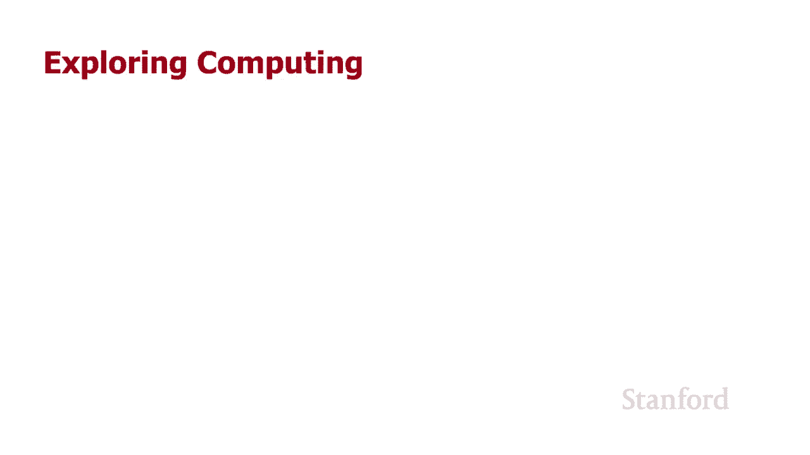

undefined，欢迎探索，欢迎探索，今天的计算视频是网页，今天的计算视频是网页，复制华盛顿邮报所以在这个视频中，复制华盛顿邮报所以在这个视频中。

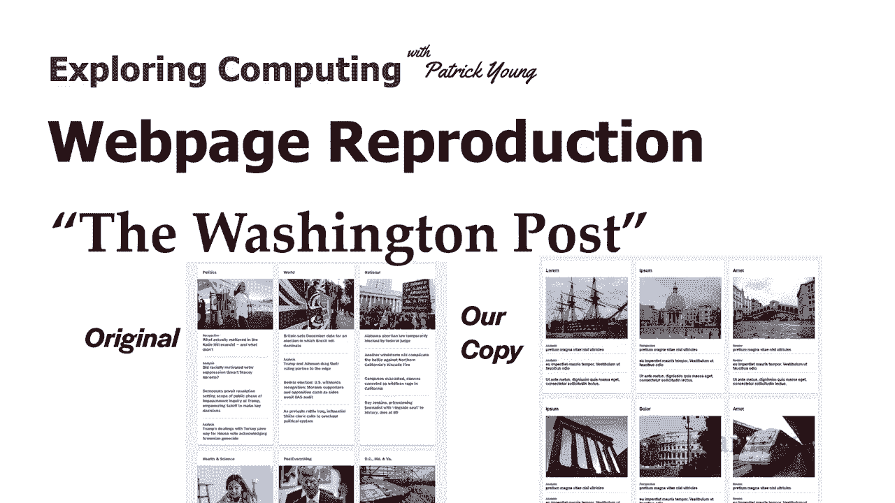

我们将看看如何，我们将看看如何，复制华盛顿邮报的一部分，复制华盛顿邮报的一部分，所以我在左边的是，所以我在左边的是，整个华盛顿邮报，整个华盛顿邮报，嗯，你可以看到它实际上，嗯，你可以看到它实际上，很长。

很长，然后底部的红色部分，然后底部的红色部分，实际上是我们，实际上是我们，要复制的部分，要复制的部分，可悲的是他们最终剪掉了这个所以，可悲的是他们最终剪掉了这个所以，嗯我去年春天复制了这个，呃。

嗯我去年春天复制了这个，呃，它不再，它不再，存在了 但是，存在了 但是，嘿，这是专业网页的一部分，嘿，这是专业网页的一部分，即使它不再属于我们，即使它不再属于我们，所以这将提供一些，所以这将提供一些。

有趣的，有趣的，点，特别是在边框，点，特别是在边框，和一些微妙之处，和一些微妙之处，使您的元素看起来，使您的元素看起来，更有趣，更有趣，undefined，undefined，然后另外它会。

然后另外它会，像我一直在做的，像我一直在做的，这个想法一样强调你想，这个想法一样强调你想，使用你的级联样式表来设置，使用你的级联样式表来设置，你的演示文稿，你的演示文稿，和 th 特别是在基于网格的。

和 th 特别是在基于网格的，布局中，您可以，布局中，您可以，通过，通过，将演示信息，将演示信息，放在级联样式表中，放在级联样式表中，并具有语义信息（，并具有语义信息（，例如标题），undefined。

undefined，来获得很大的，来获得很大的，灵活性 案例 哪个部分，灵活性 案例 哪个部分，是政治部分 哪个部分是，是政治部分 哪个部分是，世界部分 哪个部分是，世界部分 哪个部分是，国家部分。

undefined，undefined，undefined。

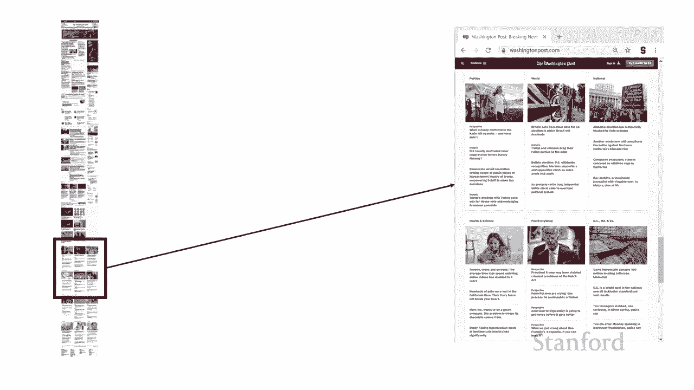

undefined，undefined，undefined，可能会，可能会，注意到这里有一个，注意到这里有一个，横穿网页的黑条，横穿网页的黑条，您可以，您可以，在顶部的超小型版本中看到它。

在顶部的超小型版本中看到它，然后在这里我看到，然后在这里我看到，了网页的顶部，然后我有，了网页的顶部，然后我有，一个 我正在，一个 我正在，复制，复制，该栏的部分的视图将保持，该栏的部分的视图将保持。

固定，无论您使用的是网页的哪个部分，undefined，undefined，我都不会去 o 今天讨论这个，我都不会去 o 今天讨论这个。

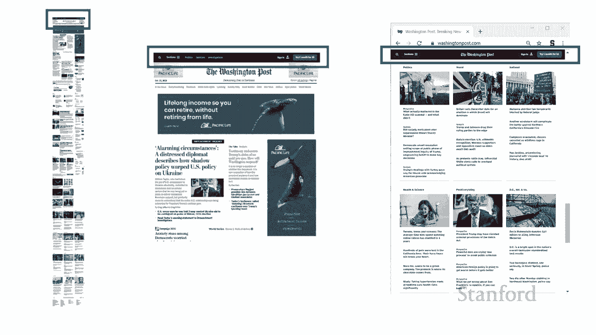

但我们将在另一堂课中看到，但我们将在另一堂课中看到，你如何实际设置，你如何实际设置，它，所以我们在左边是，它，所以我们在左边是，我复制的部分，我复制的部分，然后在右边我们有实际的。

然后在右边我们有实际的，网页，网页，再次我 正在使用，再次我 正在使用，我们之前，我们之前，在其他一些讲座中看到的警报 ipsum，所以我，在其他一些讲座中看到的警报 ipsum，所以我。

没有使用他们的实际标题，没有使用他们的实际标题，我也没有使用他们的实际图像，我也没有使用他们的实际图像，或者，或者，那些是我左边的图像，好吧，那些是我左边的图像，好吧，这是 html，这是 html。

你可以看到，基本上我已经，你可以看到，基本上我已经，把东西分成了，把东西分成了，abcde和f部分，abcde和f部分，呃你知道那些显然与，undefined，undefined。

网页上显示的不同部分相匹配，网页上显示的不同部分相匹配，我将按照我的顺序进行 我，我将按照我的顺序进行 我，期待它们被显示，期待它们被显示，但请记住，但请记住，无论它们，无论它们。

在 html 中出现的顺序，在 html 中出现的顺序，如何，也无论我给它们的名字如何，我都，如何，也无论我给它们的名字如何，我都，可以完全将它们打乱，可以完全将它们打乱，这没问题，只要我是。

undefined，undefined，如果我在使用，请将它们与网格布局一起放置 g float 或，如果我在使用，请将它们与网格布局一起放置 g float 或，flexbox 呃它变得更。

flexbox 呃它变得更，混乱了 flexbox 你实际上可以重新排序，混乱了 flexbox 你实际上可以重新排序，元素，所以你知道我认为你可以，元素，所以你知道我认为你可以。

但你可能可以用 flexbox 将它们按，但你可能可以用 flexbox 将它们按，不同的顺序放置，不同的顺序放置，但是使用 float 你几乎会被，但是使用 float 你几乎会被，你创建的顺序卡住。

你创建的顺序卡住，他们，他们，然后你也知道我不仅可以，然后你也知道我不仅可以，改变，改变，不同元素的位置，不同元素的位置，undefined，undefined，我可以创建其他类型的网格所以。

我可以创建其他类型的网格所以，在这里我在右侧显示的，在这里我在右侧显示的，是，是，嘿也许如果我在手机上显示，嘿也许如果我在手机上显示，它 我想要，它 我想要，一列而不是三，一列而不是三，列两行。

这样你就，undefined，undefined。

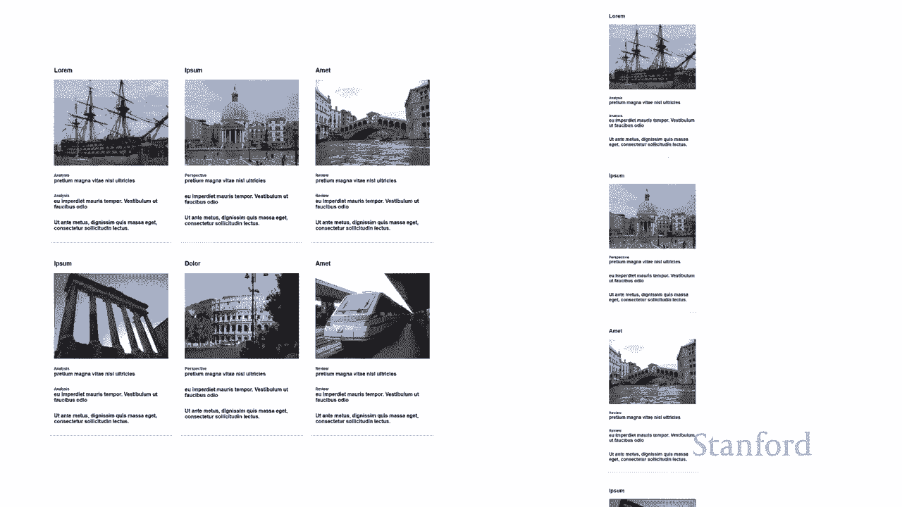

知道通过使用网格有很大的灵活性，知道通过使用网格有很大的灵活性，所以让我们来看看实际的，所以让我们来看看实际的，css，css，所以首先你可以看到，所以首先你可以看到，如果你看 仔细在右侧的图像。

如果你看 仔细在右侧的图像，中，右侧的屏幕截图，中，右侧的屏幕截图，您可以，您可以，看到实际部分具有白色，看到实际部分具有白色，背景，背景，并且围绕它们的部分就像，并且围绕它们的部分就像，浅灰色背景。

因此我将，浅灰色背景，因此我将，继续将主体颜色设置为，继续将主体颜色设置为，呃 f7 f7 f7 所以记住那些是，呃 f7 f7 f7 所以记住那些是，十六进制数字，十六进制数字。

呃第一个 f7 是红色的，第二个 f7，呃第一个 f7 是红色的，第二个 f7，是绿色的，第三个 f7 是，是绿色的，第三个 f7 是，蓝色的，蓝色的，因为红色绿色和，因为红色绿色和。

蓝色的数量是一样的，蓝色的数量是一样的，我们有一个阴影 灰色，我们，我们有一个阴影 灰色，我们，将看到整个，将看到整个，华盛顿邮报是围绕，华盛顿邮报是围绕，不同深浅度的灰色设计的，所以。

不同深浅度的灰色设计的，所以，你知道任何时候你看到那些梨，你知道任何时候你看到那些梨，重复那些对十六进制，重复那些对十六进制，数字重复它是灰色的，数字重复它是灰色的，不同深浅但都是灰色的。

不同深浅但都是灰色的，此外我已经 将字体系列设置，此外我已经 将字体系列设置，为 sans-serif，为 sans-serif，我没有尝试弄清楚，我没有尝试弄清楚，他们使用的是什么字体我只。

他们使用的是什么字体我只，知道他们使用的是 sansa 或，知道他们使用的是 sansa 或，font 再次我们将在另一堂课中讨论字体，font 再次我们将在另一堂课中讨论字体，undefined。

undefined，所以我们看到的一切，所以我们看到的一切，这是在一个叫做下部分的 div 里面，这是在一个叫做下部分的 div 里面，undefined，undefined，它代表，它代表。

华盛顿邮报的这个底部，华盛顿邮报的这个底部，我们试图在这里复制它，我们试图在这里复制它，你可以看到我已经，你可以看到我已经，说过，下半部分的所有，说过，下半部分的所有，内容都将用，内容都将用，网格。

网格，我已经有了 列设置为 1fr 1fr1，我已经有了 列设置为 1fr 1fr1，我没有设置默认为 auto 的行，我没有设置默认为 auto 的行，这意味着行将，这意味着行将，根据，根据。

我放置在其中的元素来增加或减少大小，我放置在其中的元素来增加或减少大小，undefined，undefined，所以你可能记得 fr，所以你可能记得 fr，代表小数，代表小数。

等等 one fr one fr one fr 的，等等 one fr one fr one fr 的，意思是我们有，意思是我们有，三列，三列，网络浏览器的可用空间将，网络浏览器的可用空间将。

在这三列之间平均分配，在这三列之间平均分配，所以无论我们有一个你知道的，所以无论我们有一个你知道的，相对，相对，谦虚的网络浏览器窗口还是我们，谦虚的网络浏览器窗口还是我们。

有一个非常宽的 Web 浏览器窗口，有一个非常宽的 Web 浏览器窗口，您知道我们仍然有这三，您知道我们仍然有这三，列，并且会，列，并且会，根据需要扩展或收缩，根据需要扩展或收缩，您可能会注意到。

您可能会注意到，右侧的图像实际上，右侧的图像实际上，比左侧的图像更宽更高，比左侧的图像更宽更高，并且 所以这是我们实际上，并且 所以这是我们实际上，要考虑的事情，要考虑的事情，如果图像是固定大小但。

如果图像是固定大小但，列能够增加或，列能够增加或，减少宽度，减少宽度，我们会得到一些奇怪的效果，我们不，我们会得到一些奇怪的效果，我们不，希望这种情况发生，所以我们，希望这种情况发生，所以我们，随着。

随着，Web 浏览器窗口的增加和 frs，Web 浏览器窗口的增加和 frs，增加每一列的空间，确实需要，增加每一列的空间，确实需要，undefined，undefined，undefined，让这些。

让这些，图像变宽 已经将，图像变宽 已经将，所有内容都设置为 san serif，所有内容都设置为 san serif，并且我们设置了我们的栏目 接下来，并且我们设置了我们的栏目 接下来。

我们要做的是我们将查看，我们要做的是我们将查看，这些单独的部分中的每一个，这些单独的部分中的每一个，例如 a 部分 b 部分 c，例如 a 部分 b 部分 c，一直到 f 部分，一直到 f 部分，这是。

这是，我为每个部分设置的样式属性我正在设置，undefined，undefined，填充和边距所以请，填充和边距所以请，记住填充是，记住填充是，内部元素和边框之间的空间，内部元素和边框之间的空间。

而边距是，而边距是，边框外的空间所以，undefined，undefined，如果我不设置任何填充，我需要控制这两个边界，边界，如果我不设置任何填充，我需要控制这两个边界，边界，将，将。

被挤在那里的每个文本项，被挤在那里的每个文本项，上，如果我不，上，如果我不。

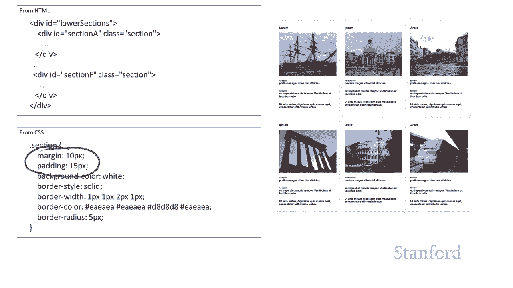

控制边距，我的所有元素都将，控制边距，我的所有元素都将，undefined，undefined，相互紧贴 然后，相互紧贴 然后，我有许多不同的颜色，因为，我有许多不同的颜色，因为，我 提到我们已经讨论。

我 提到我们已经讨论，过网页背景是浅，过网页背景是浅，灰色的，灰色的，而这些部分本身有白色，而这些部分本身有白色，背景，结果，undefined，undefined，华盛顿邮报使用了其他几种颜色，我。

华盛顿邮报使用了其他几种颜色，我，实际上是，实际上是，用他们的小吸管进入了 photoshop，用他们的小吸管进入了 photoshop，工具，所以我在，工具，所以我在，这里使用它们的确切颜色，呃。

如果你，这里使用它们的确切颜色，呃，如果你，仔细观察，你会发现，仔细观察，你会发现，每个部分的左上角和右上角，每个部分的左上角和右上角，看起来有点像那里可能，看起来有点像那里可能。

有轻微的边缘或可能有一点点 3d 外观，有轻微的边缘或可能有一点点 3d 外观，undefined，undefined，那是因为 页面，undefined，undefined。

的背景颜色和页面的背景颜色，的背景颜色和页面的背景颜色，实际上，实际上，与边框的背景颜色不同，因此，与边框的背景颜色不同，因此，那里略有不同，那里略有不同，然后如果您仔细，然后如果您仔细，观察。

您会发现底部，观察，您会发现底部，边框实际上更厚了一点，边框实际上更厚了一点，undefined，undefined，我们确实需要把它们弄下来，我们确实需要把它们弄下来，结果发现底部边框的。

结果发现底部边框的，颜色略有不同，颜色略有不同，我们来看看我是如何，我们来看看我是如何，设置的 稍后您，设置的 稍后您，还会注意到，还会注意到，每个单独的项目之间都有几条线分隔开来，undefined。

undefined，我想这是，我想这是，使用 lorem ipsum 的缺点，我不知道如何，使用 lorem ipsum 的缺点，我不知道如何，发音，但是，发音，但是。

如果您查看 pretium magna，如果您查看 pretium magna，然后有一个 在它下面有一条线，然后有一个 在它下面有一条线，然后是经期饮食中的欧盟，然后是经期饮食中的欧盟。

然后在它下面有一条线，然后在它下面有一条线，依此类推，undefined，undefined，如果你看看所有这些不同的颜色，现在这条线实际上也是不同的，如果你看看所有这些不同的颜色。

现在这条线实际上也是不同的，颜色，我有我们有 得到了 f7 f7 f7，颜色，我有我们有 得到了 f7 f7 f7，我们得到了白色这是你知道如果我们，我们得到了白色这是你知道如果我们，真的想，真的想。

用实际的十六进制数来指定，用实际的十六进制数来指定，那个 ffff，那个 ffff，把所有的红色、所有的绿色、所有的，把所有的红色、所有的绿色、所有的，蓝色都变成最大，蓝色都变成最大。

然后你有 ea aea d8  d5 d5 d5，然后你有 ea aea d8  d5 d5 d5，所以记住我之前说过的，所以记住我之前说过的，undefined，undefined。

当你看到这些重复的，当你看到这些重复的，十六进制数字时，这意味着，十六进制数字时，这意味着，红色绿色和蓝色的，红色绿色和蓝色的，数量完全相同，所以你，数量完全相同，所以你，真正在做的是你没有。

真正在做的是你没有，试图混合 你实际上只是的颜色，试图混合 你实际上只是的颜色，增加或减少，增加或减少。

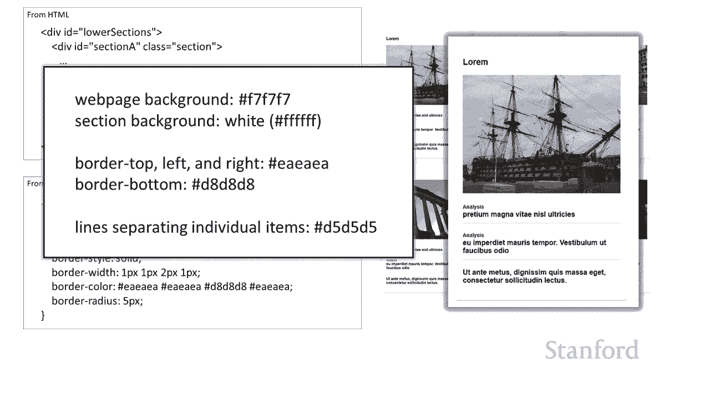

强度，所以这些会创建，强度，所以这些会创建，不同的灰色阴影，不同的灰色阴影，所以这些呃部分的背景颜色，所以这些呃部分的背景颜色，是白色的，是白色的，然后我们在这里有了我们的边框。

然后我们在这里有了我们的边框，所以，所以，不要忘记我们需要将该边框，不要忘记我们需要将该边框，样式设置为纯色，如果 你没有设置，样式设置为纯色，如果 你没有设置，边框样式 你设置了边框宽度。

边框样式 你设置了边框宽度，和边框颜色，和边框颜色。

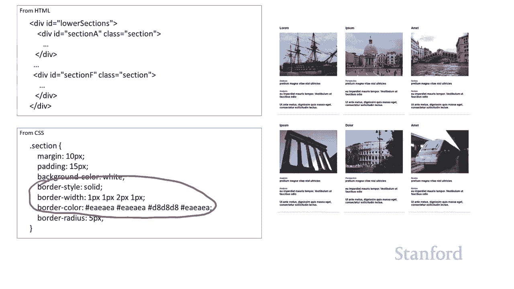

并且你没有设置边框样式 你，并且你没有设置边框样式 你，什么都没有，所以让我们仔细，什么都没有，所以让我们仔细，看看这些边框，看看这些边框，呃记住有几种不同的，呃记住有几种不同的。

方式我们可以指定 边界，方式我们可以指定 边界，呃我们可以明确地说边界边界，呃我们可以明确地说边界边界，与左边界与右边界，与左边界与右边界，与顶部边界与底部 um 我们可以。

与顶部边界与底部 um 我们可以，undefined，undefined，使用单个值为所有它们设置边框宽度，使用单个值为所有它们设置边框宽度，我们可以将两个值一个，我们可以将两个值一个。

用于顶部和底部一个用于左右，用于顶部和底部一个用于左右，undefined，undefined，或 我们可以指定四个，你可以看到，或 我们可以指定四个，你可以看到，这就是我们在这里实际做的所以。

这就是我们在这里实际做的所以，记住，记住，右上角左下角所以我们有一个，右上角左下角所以我们有一个，像素一个像素然后正如我所说，像素一个像素然后正如我所说，如果你看底部边框，它，如果你看底部边框，它。

实际上有点，实际上有点，厚 呃，实际上是两个像素，厚 呃，实际上是两个像素，而不是一个像素，而不是一个像素，然后同样的事情发生在这些，然后同样的事情发生在这些，颜色上，所以我指定了四种颜色，颜色上。

所以我指定了四种颜色，呃，三种颜色相同的，呃，三种颜色相同的，是右上角和左上角，然后，是右上角和左上角，然后，底部实际上是，底部实际上是，um 有点暗，也可以，um 有点暗，也可以，呃，如果你仔细看。

你会，呃，如果你仔细看，你会，注意到拐角处有一条轻微的，注意到拐角处有一条轻微的。

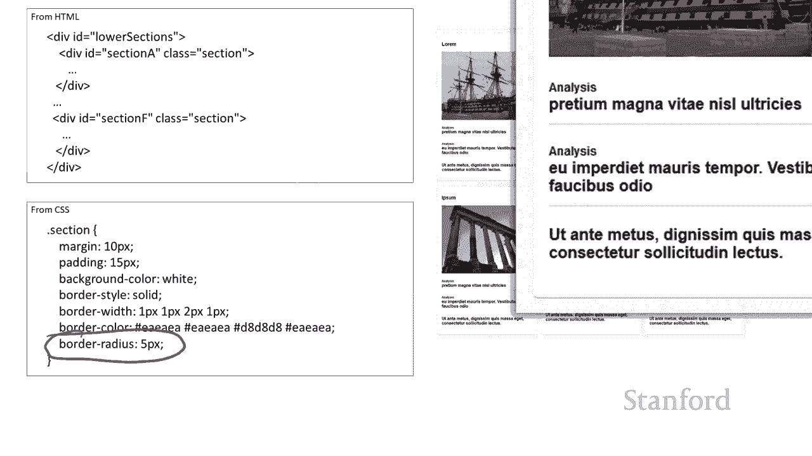

曲线，这是，曲线，这是，由边界半径决定的，我在这里，由边界半径决定的，我在这里，设置了三个不同的边界半径，设置了三个不同的边界半径，第一个根本没有半径，第一个根本没有半径，你得到那个方角，然后。

你得到那个方角，然后，我 已经，我 已经，使用了我正在使用的边框半径 5 像素，undefined，undefined，然后我将一个设置为 15 像素，然后我将一个设置为 15 像素，只是为了强调。

只是为了强调，边框半径的作用，如果您在这里仍然没有，边框半径的作用，如果您在这里仍然没有，看到它，看到它，它们会在较低的位置突出显示，它们会在较低的位置突出显示，左手角，你可以看到，左手角，你可以看到。

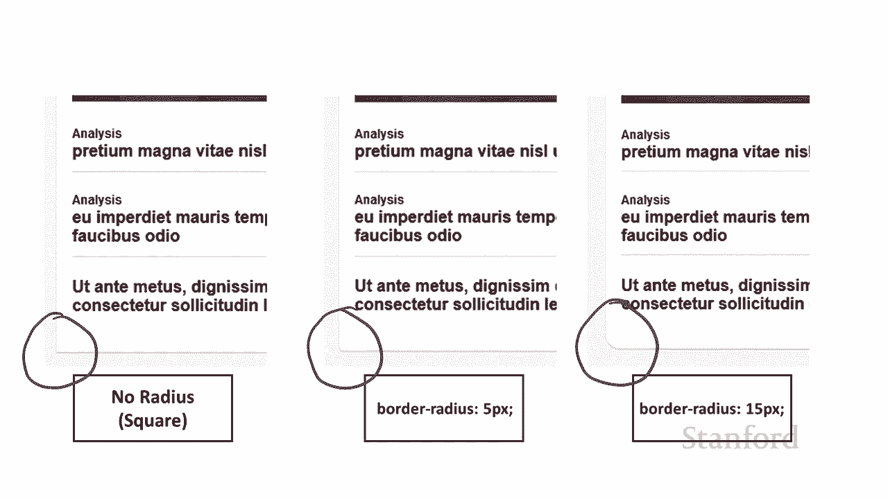

呃，你可以看到这一切是如何运作的，嗯，呃，你可以看到这一切是如何运作的，嗯，你也可能听到，你也可能听到，麦迪从她的水盘里喝水，麦迪从她的水盘里喝水，undefined，undefined。

她实际上一直在，她实际上一直在，客厅里闲逛，我正在录制这种声音，客厅里闲逛，我正在录制这种声音，的 看着我就像让我们玩游戏我，的 看着我就像让我们玩游戏我，真的很想玩为什么你要谈论，undefined。

undefined，你知道为什么，你知道为什么，你一直在电脑上工作以，你一直在电脑上工作以，正确处理这些图形现在，正确处理这些图形现在，你在谈论，你在谈论，你应该注意的事情 对我来说，我。

你应该注意的事情 对我来说，我，超级可爱，超级可爱，好吧，然后我，好吧，然后我，继续将所有元素放在，继续将所有元素放在，各个网格元素中，这非常，各个网格元素中，这非常，简单，你知道，简单，你知道，嘿。

一个在第一列第一，嘿，一个在第一列第一，行，一个在第二行列 一个等等，undefined，undefined。

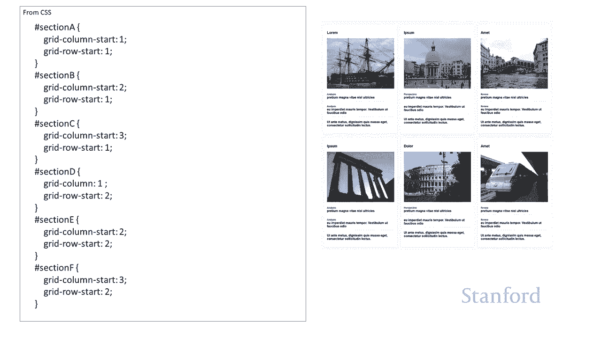

非常简单好所以现在我们，非常简单好所以现在我们，要看看各个，要看看各个，部分，部分，呃这里有几个关键点所以，呃这里有几个关键点所以，你可以看到，你可以看到，这是其中一个部分它有，这是其中一个部分它有。

许多不同的组件，许多不同的组件，首先有 一个，首先有 一个，h3 提供了部分，h3 提供了部分，标题，标题，在这种情况下是 lorem，我，在这种情况下是 lorem，我。

实际上没有 h1 或 h2 在这里，实际上没有 h1 或 h2 在这里，但，但，我的假设是你，我的假设是你，肯定希望整个网页，肯定希望整个网页，顶部的主标题有一个 h1，顶部的主标题有一个 h1。

吨 他华盛顿邮报，吨 他华盛顿邮报，很，很，可能还有其他一些更重要的，可能还有其他一些更重要的，标题，你可能想，标题，你可能想，在 h2 中使用，所以，在 h2 中使用，所以，我在这一点上假设我们。

我在这一点上假设我们，相对进入标题的中间，相对进入标题的中间，undefined，undefined，所以我继续了 并，所以我继续了 并，使用 h3s4，使用 h3s4，作为这些部分的标题嗯，你会。

undefined，undefined，注意到在左下角我说没有样式，注意到在左下角我说没有样式，我实际上最终没有，我实际上最终没有，对 h3 做任何 stein，对 h3 做任何 stein。

与 h3s 本身或，与 h3s 本身或，这个类，这个类，部分标题它看起来正确 我，部分标题它看起来正确 我，只是继续并留下，只是继续并留下，它具有默认大小，它具有默认大小，默认重量和默认标记顶部和。

默认重量和默认标记顶部和，底部边距我没有做任何事情，undefined，undefined，还好然后我们有图像所以这，还好然后我们有图像所以这，是一张图像，是一张图像，它是 hms 胜利的照片。

它是 hms 胜利的照片，那是呃，那是呃，纳尔逊海军上将在特拉法加海战，纳尔逊海军上将在特拉法加海战，中的旗舰，中的旗舰，我继续给我们上课，我继续给我们上课，你会注意到，你会注意到，我，我。

在这部分所做的几乎所有事情都被标记为一个，在这部分所做的几乎所有事情都被标记为一个，类别，各个部分都有 id bec 因为，类别，各个部分都有 id bec 因为，我想把它们，我想把它们。

放在特定的位置，但就，放在特定的位置，但就，图像和标题，图像和标题，和部分而言，它们都被标记，和部分而言，它们都被标记，为类而不是 id，因为，为类而不是 id，因为，它们具有相同的特征，我。

它们具有相同的特征，我，将在所有它们上使用，所以请记住，将在所有它们上使用，所以请记住，使用，使用，id 如果你有一个特定的项目，id 如果你有一个特定的项目，你想要，你想要，一套非常具体的规则，在。

一套非常具体的规则，在，这种情况下放置在网格上，这种情况下放置在网格上，你知道这似乎很明显我们，你知道这似乎很明显我们，不想将几个项目放在，不想将几个项目放在，网格上的相同位置，网格上的相同位置。

有道理，所以那些使用 ids 但，有道理，所以那些使用 ids 但，其他一切都使用一个类，因为，其他一切都使用一个类，因为，我将在所有不同的元素上使用通用样式，我将在所有不同的元素上使用通用样式。

您也可以使用，您也可以使用，类型选择器我，类型选择器我，有几个地方我使用类型，有几个地方我使用类型，选择器，所以在这种情况下，选择器，所以在这种情况下，我是 给这个图像一个类一个部分。

我是 给这个图像一个类一个部分，图像，图像，我将继续将，我将继续将，样式设置为 100% 宽度样式，样式设置为 100% 宽度样式，所以这将要做，所以这将要做，的是将，的是将，undefined。

undefined，图像宽度的大小增加到多少空间 可以通过任何方式，图像宽度的大小增加到多少空间 可以通过任何方式，获得它，获得它，r 元素，它包含，r 元素，它包含，在其中，我将，在其中，我将。

宽度设置为 100% 的原因是记住，宽度设置为 100% 的原因是记住，我们将列设置为每列一个 fr，我们将列设置为每列一个 fr，随着网页变宽，随着网页变宽，fr 增加宽度，所以，fr 增加宽度。

所以，我希望这些图像增加或，我希望这些图像增加或，减少 大小取决于，减少 大小取决于，它们所在的列有多宽，它们所在的列有多宽，因此如果该列，因此如果该列，变宽，则将图像宽度设置为 100%，变宽。

则将图像宽度设置为 100%，图像变宽，图像变宽，undefined，undefined，因为我不是说高度，所以，因为我不是说高度，所以，高度和宽度将按，高度和宽度将按，比例增加，比例增加。

基于原始图像的适当比例，基于原始图像的适当比例，好吧，然后我有一些子，好吧，然后我有一些子，部分，这些是 div，部分，这些是 div，它们可能包含多个元素，它们可能包含多个元素，所以，所以。

在第一个中你可以看到我已经把，在第一个中你可以看到我已经把，这个词放在了顶级，这个词放在了顶级，分析上，然后是实际，分析上，然后是实际，那里的标题，那里的标题，所以这实际上来自，所以这实际上来自。

原始的华盛顿邮报，他们，原始的华盛顿邮报，他们，在这里的一些小主题只是标，在这里的一些小主题只是标，有主题名称，但其中，有主题名称，但其中，一些被标记为分析，其中一些，一些被标记为分析，其中一些。

被标记为评论和 其中一些，被标记为评论和 其中一些，被标记为透视图，被标记为透视图，我们使用稍微小一点的字体，我们使用稍微小一点的字体，我们将在一分钟内，我们将在一分钟内，看到，它们出现，看到。

它们出现，在标题名称的正上方，在标题名称的正上方，所以我将所有这些组合成一个，所以我将所有这些组合成一个，div，div，所以你可以看到这个 div 包含一个，所以你可以看到这个 div 包含一个。

带有该分析词的辅助 div，带有该分析词的辅助 div，然后它也有一个 h4，然后它也有一个 h4，下一个也有该分析，下一个也有该分析，上面有一个 h4 的小 div，上面有一个 h4 的小 div。

最后一个，最后一个，只有 div 本身，所以，只有 div 本身，所以，你可以看到 我在这里所做的是，你可以看到 我在这里所做的是，整个 div 外部 div，整个 div 外部 div。

小节标题 div，其中包括，小节标题 div，其中包括，分析以及，分析以及，undefined，undefined，具有 10 像素边距和 10 像素填充的文章的图块。

具有 10 像素边距和 10 像素填充的文章的图块，undefined，undefined，因此在 10 像素边距和，因此在 10 像素边距和，填充中包含了，填充中包含了，单词分析以及，单词分析以及。

它下面的任何内容，所以这不是，它下面的任何内容，所以这不是，分析之间，分析之间，的，的，10 个像素，而是分析和 pratium 之外的 10 个像素，10 个像素。

而是分析和 pratium 之外的 10 个像素，undefined，undefined，所以你会注意到这里的，所以你会注意到这里的，每个元素之间都有线，每个元素之间都有线，undefined。

undefined，等等 在 需要编写一个规则，等等 在 需要编写一个规则，来解决这个问题，所以我，来解决这个问题，所以我，已经通过将，已经通过将，边框底部设置为一个像素固体。

边框底部设置为一个像素固体，然后再次设置 d5 d5 d5，然后再次设置 d5 d5 d5，这是一种灰色阴影，这是一种灰色阴影，现在我只想要它们 要低于，现在我只想要它们 要低于，前两个，前两个，元素。

我不希望它低于，元素，我不希望它低于，最后一个元素，最后一个元素，所以我要这样做的方式是我将，undefined，undefined，使用这个伪类 last child 覆盖最后一个元素的行为。

使用这个伪类 last child 覆盖最后一个元素的行为，所以，所以，因为最后一个，因为最后一个，元素 ut ante metas，元素 ut ante metas，是最后一个小节标题。

是最后一个小节标题，它是其父级的最后一个子级，它是其父级的最后一个子级，我将覆盖边框底部，我将覆盖边框底部，并将其设置为 0 像素，因此，并将其设置为 0 像素，因此，所有元素都将具有。

所有元素都将具有，底部边框，除了 对于最后一个，底部边框，除了 对于最后一个，没有底部边框的孩子，没有底部边框的孩子，这就是我将继续，这就是我将继续，在每个元素之间创建线条，在每个元素之间创建线条。

undefined，undefined，undefined，undefined，然后最后这是我，然后最后这是我，实际设置，实际设置，字体大小和 呃，字体大小和 呃，每个呃分析，每个呃分析。

以及呃的权重 单词分析下面的措辞，undefined，undefined，嗯，这个词在前两个元素中都使用了分析，嗯，这个词在前两个元素中都使用了分析，还有，还有，其他地方我使用了不同的。

其他地方我使用了不同的，我使用视角和评论，我使用视角和评论，就像原来的华盛顿邮报，就像原来的华盛顿邮报，在这个特定的例子中并没有在，在这个特定的例子中并没有在，这里，这里。

等等 你可以看到我设置了 h4，等等 你可以看到我设置了 h4，它是每个小节标题的主要文本，它是每个小节标题的主要文本，我已经将它设置为，我已经将它设置为，边距 0 填充 0 和字体大小。

边距 0 填充 0 和字体大小，12 磅，所以这实际上值得，12 磅，所以这实际上值得，一提，一提，所以网页上有很多不同的元素，undefined，undefined，确实有预设边距，特别是顶部。

确实有预设边距，特别是顶部，和底部边距，和底部边距，所有标题都有预设的顶部和，所有标题都有预设的顶部和，底部边距，底部边距，你可能想摆脱它，你可能想摆脱它，所以这就是我在这里所做的我。

所以这就是我在这里所做的我，明确地说，明确地说，是的，我知道已经设置了一个边距，是的，我知道已经设置了一个边距，对于 h，对于 h，力，但我们不要使用那个，undefined，undefined。

undefined，undefined，undefined，undefined，边距 ing 和 border 没有，边距 ing 和 border 没有，预设边框，但我确实想，预设边框，但我确实想。

去掉边距和填充我将，去掉边距和填充我将，继续并设置为 0 像素，继续并设置为 0 像素，特别是因为我希望单词，特别是因为我希望单词，分析，分析，正好与它在 华盛顿邮报的，正好与它在 华盛顿邮报的，例子。

所以我要继续并，例子，所以我要继续并，摆脱那个，摆脱那个，我将字体大小设置为 12，我将字体大小设置为 12，点，结果，点，结果，h4 上的默认行为将继续并将其，h4 上的默认行为将继续并将其。

设置为粗体，设置为粗体，所以我得到 我正在寻找的外观，所以我得到 我正在寻找的外观，然后是，然后是，分析或透视，分析或透视，或，或，评论的小节类型，它只是一个 div，所以我确实需要，评论的小节类型。

它只是一个 div，所以我确实需要，提供呃，提供呃，任何我想要的样式，所以我，任何我想要的样式，所以我，要继续设置 字体大小，要继续设置 字体大小，为九点，我将，为九点，我将。

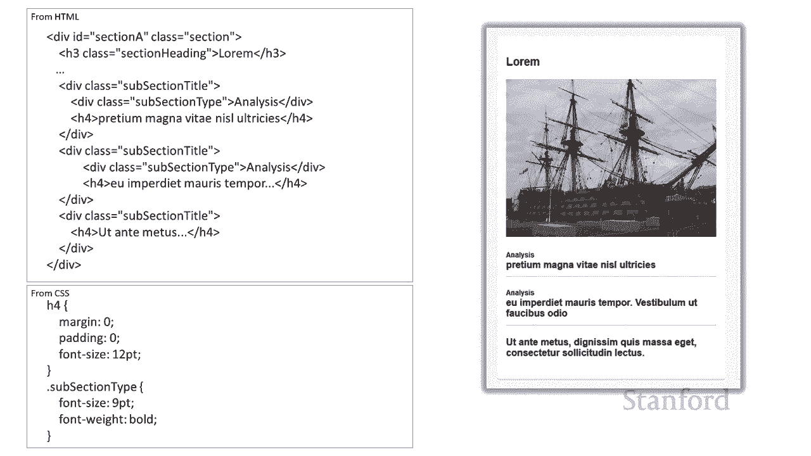

字体粗细设置为粗体，字体粗细设置为粗体，这样这是我们，这样这是我们，对华盛顿邮报底部部分的小复制，对华盛顿邮报底部部分的小复制，嗯，你又知道了，嗯，你又知道了，希望是主要的第一，希望是主要的第一，外卖。

我希望你们从中得到，外卖，我希望你们从中得到，undefined，undefined，嘿，我可以这样做吗？这是一个，嘿，我可以这样做吗？这是一个，专业的网页，专业的网页，我可以制作 一个看起来。

我可以制作 一个看起来，和这个专业网页一样好的网页，undefined，undefined，你知道吗，用我们向你展示的技术，你知道吗，用我们向你展示的技术，这真的不难，你需要一些时间，这真的不难。

你需要一些时间，来做分析，你需要一些，来做分析，你需要一些，时间 做一些调整以使，时间 做一些调整以使，尺寸正确，间距是您想要的方式，尺寸正确，间距是您想要的方式，undefined。

undefined，但您绝对可以复制这些，但您绝对可以复制这些，东西，东西，并假设您，并假设您，具有我不一定拥有的艺术技能，具有我不一定拥有的艺术技能，但，但，如果您具有艺术和图形。

如果您具有艺术和图形，设计技能，您知道您可以去 提前，设计技能，您知道您可以去 提前，并自己提出其中一个，并自己提出其中一个，然后您可以继续，然后您可以继续，使用，使用。

我们一直在教您的级联样式表将您的愿景变为现实，undefined。

