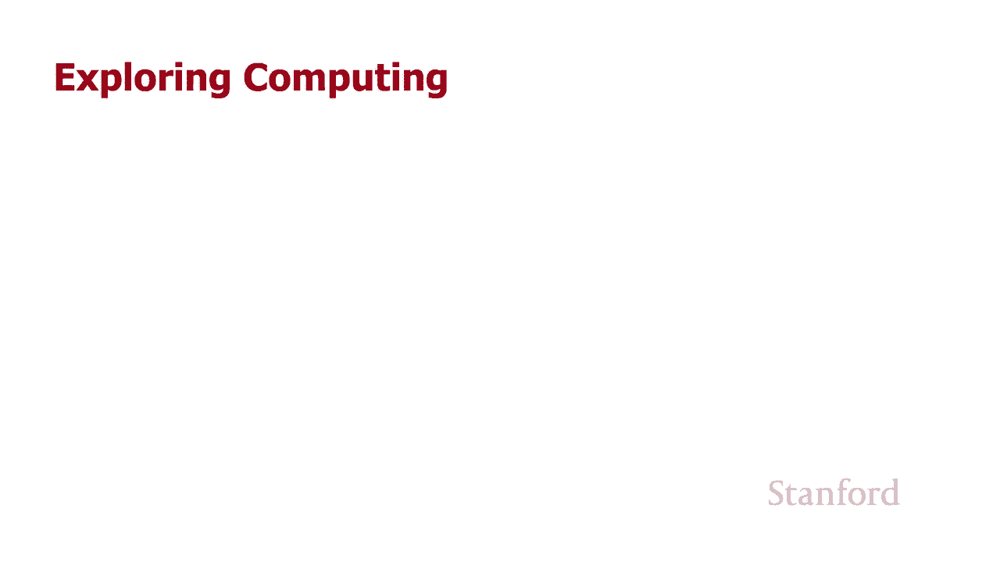
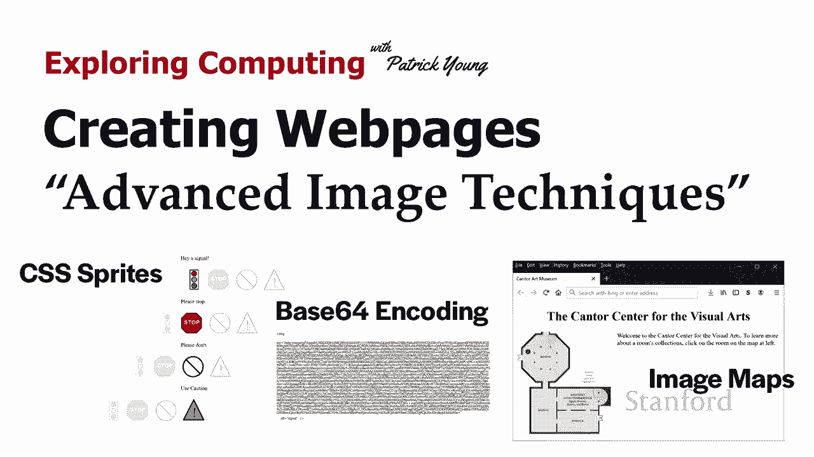
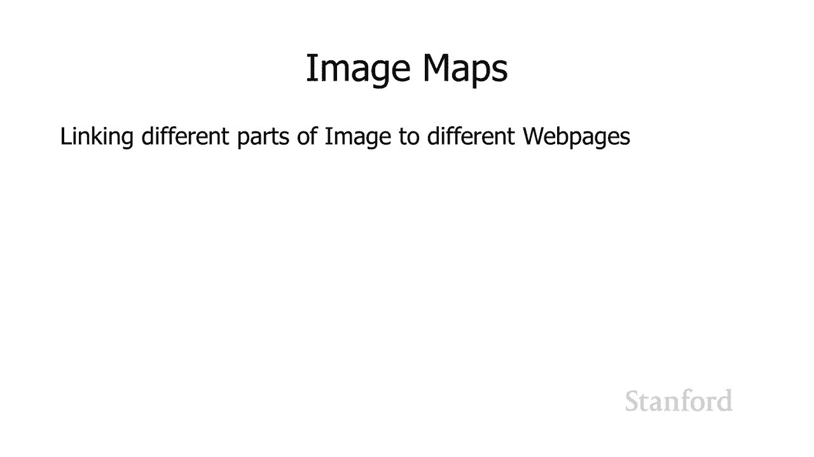
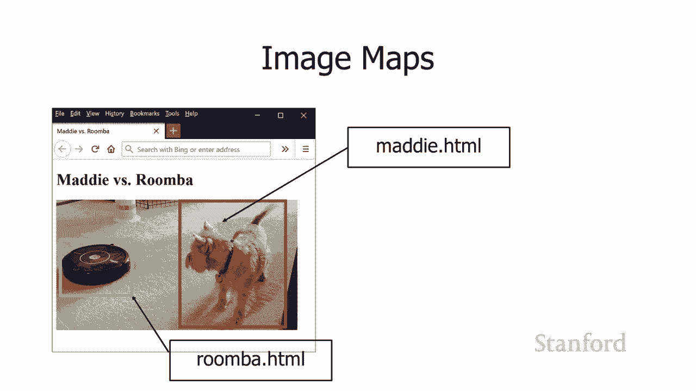
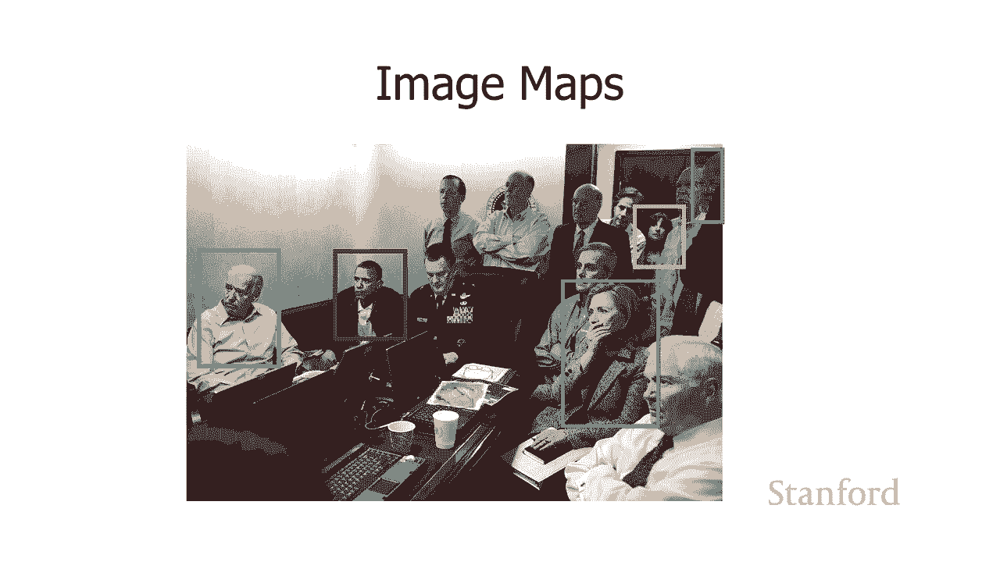
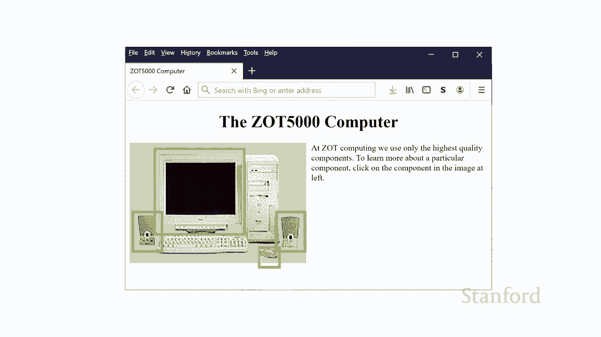
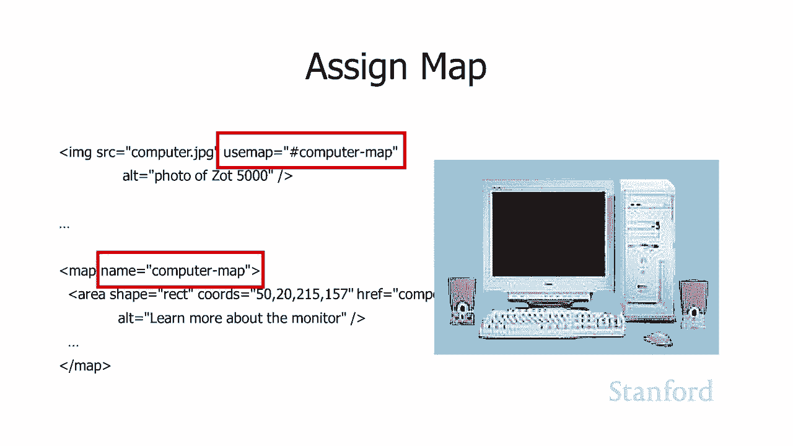
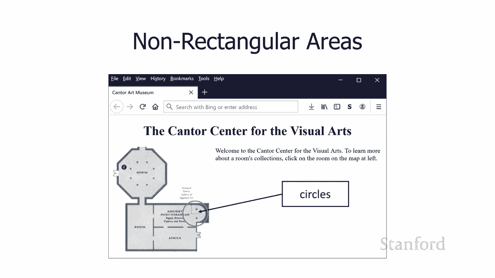
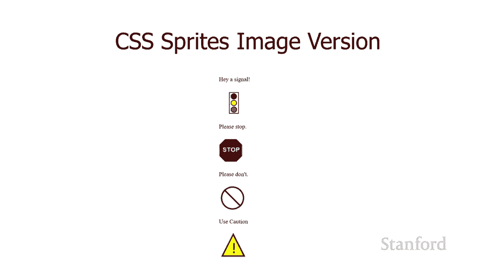
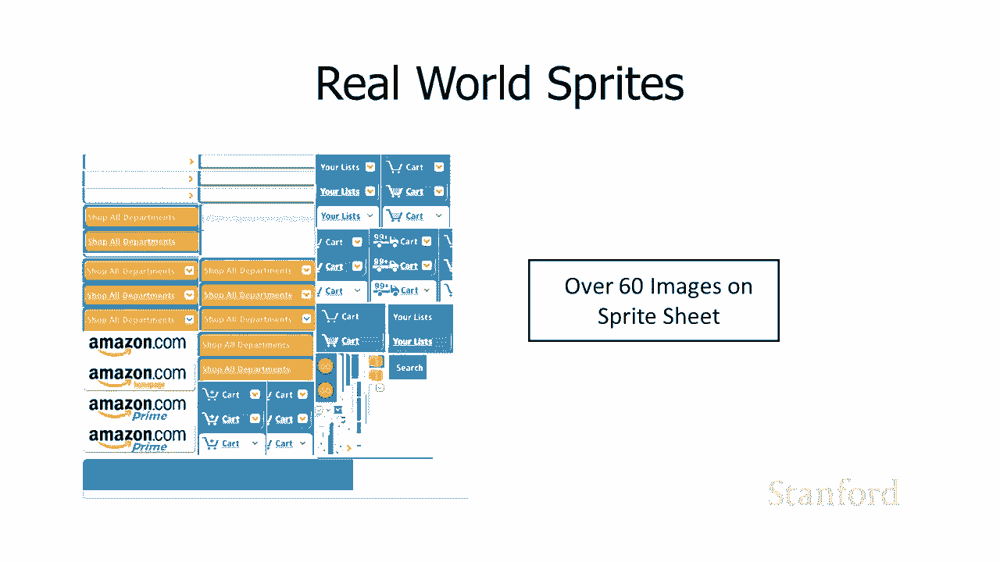

# 【双语字幕+资料下载】斯坦福CS105 ｜ 计算机科学导论(2021最新·完整版) - P42：L14.1- 高级图像技术 - ShowMeAI - BV1eh411W72E

undefined，欢迎探索计算，欢迎探索计算，今天的视频是创建网页，今天的视频是创建网页，高级图像技术 所以在这个，高级图像技术 所以在这个，视频中，我们将看看，视频中，我们将看看。

你可以用图像做的一些更有趣的事情，你可以用图像做的一些更有趣的事情，undefined，undefined。

我想从谈论，我想从谈论，图像映射开始，图像映射开始，背后的基本思想 图像映射是，背后的基本思想 图像映射是，呃假设我想将。

undefined，undefined，图像的不同部分链接到不同的网页，而，undefined，undefined，maddie 现在已经不在了，因为，maddie 现在已经不在了，因为。

她是我们的第一个例子，她是我们的第一个例子，所以这里的 maddie 与，所以这里的 maddie 与，roomba 对峙，roomba 对峙，假设我们想要链接 将此图像，假设我们想要链接 将此图像。

放到网页上 很容易 我们，放到网页上 很容易 我们，已经知道该怎么做 我们只需，undefined，undefined，继续并拥有图像标签，undefined，undefined，undefined。

undefined，他们将，他们将，去那个位置的图像，但，去那个位置的图像，但，你知道假设我们不太确定，你知道假设我们不太确定，我们是否想要去网页，我们是否想要去网页，many。

html 如果有人点击 madi，many。html 如果有人点击 madi，和 roomba 的，和 roomba 的，照片，或者我们想要去，照片，或者我们想要去，罗 omba。html 网页。

罗 omba。html 网页，如果我们实际上可以，如果我们实际上可以，根据用户点击图片的位置转到不同的网页，根据用户点击图片的位置转到不同的网页，那么用户点击图片，那么用户点击图片。

中 maddie 的部分，中 maddie 的部分，我们会转到 maddie。html，如果我们点击 roomba，那就，我们会转到 maddie。html，如果我们点击 roomba，那就。

太好了 我们转到roomba。html 的图像的一部分。

undefined，undefined，结果证明这种技术，结果证明这种技术，实际上，实际上，在很多地方都很有用，例如，这是，在很多地方都很有用，例如，这是，我从，我从，斯坦福档案馆获得的斯坦福航空照片。

斯坦福档案馆获得的斯坦福航空照片，您可以看到呃，您知道我们可能，您可以看到呃，您知道我们可能，想要，想要，突出显示校园的不同部分，如果，突出显示校园的不同部分，如果，人们点击校园的不同部分。

人们点击校园的不同部分，我们将，我们将，undefined，undefined，根据，根据，他们点击的照片的特定部分前往不同的位置，他们点击的照片的特定部分前往不同的位置，或者假设您是，或者假设您是。

组织的一部分，组织的一部分，并且您知道自己有一张照片 照片中，undefined，undefined，全是你们组织的一群成员，undefined，undefined，我使用这张特殊的图片是因为。

我使用这张特殊的图片是因为，我想要一张有很多人的图片，undefined，undefined，我知道不会有，我知道不会有，版权问题，所以 这是一张美国，版权问题，所以 这是一张美国，政府的照片，好吧。

所以呃，政府的照片，好吧，所以呃，我们，我们，在这张照片中有不同的人呃，在这张照片中有不同的人呃，我们有一群人每个人都，我们有一群人每个人都，知道我们有呃，知道我们有呃，在后面我们有我们的反恐。

在后面我们有我们的反恐，专家，专家，呃我们有呃我应该，呃我们有呃我应该，事先查一下这个 我相信，事先查一下这个 我相信，呃詹姆斯克拉珀和他的努力是对的呃，呃詹姆斯克拉珀和他的努力是对的呃。

相信他是呃国家，相信他是呃国家，情报局局长所以，情报局局长所以，这张照片，这张照片，上有很多不同的人，如果我们点击，上有很多不同的人，如果我们点击，这张照片中的不同人，我们想要去，这张照片中的不同人。

我们想要去，不同的，不同的，网页 基于我们点击，网页 基于我们点击，照片的位置，照片的位置，这就是图像映射背后的整个想法，这就是图像映射背后的整个想法，它们实际上非常，它们实际上非常，简单，简单。

它们有些专业化，你知道，它们有些专业化，你知道，这些情况不会一直出现，这些情况不会一直出现。

但它们肯定会出现，所以，但它们肯定会出现，所以，这是一个，这是一个，你的工具箱里有一个方便的工具，所以我们，你的工具箱里有一个方便的工具，所以我们，将有一个，将有一个，简单的例子开始，所以。

简单的例子开始，所以，我们在这里有一台计算机的图像，这台计算机，我们在这里有一台计算机的图像，这台计算机，有不同的部分，有不同的部分，所以假设 我们正在销售这些，所以假设 我们正在销售这些，计算机。

我们希望人们，计算机，我们希望人们，能够访问，能够访问，不同的位置，呃不同的，不同的位置，呃不同的，网页，undefined，undefined，如果他们点击扬声器，我们，如果他们点击扬声器，我们。

将把他们带到一个网页，了解计算机的不同组件，将把他们带到一个网页，了解计算机的不同组件，我们谈论扬声器，我们谈论扬声器，如果我们点击显示器，我们，如果我们点击显示器，我们，将把它们带到一个不同的网页。

将把它们带到一个不同的网页，专门关于显示器等等，专门关于显示器等等，我说的是将，我说的是将，网页，网页，从一个位置移动到另一个位置，你，从一个位置移动到另一个位置，你。

实际上可以 还可以做一些其他的事情，你，实际上可以 还可以做一些其他的事情，你，可以，可以，根据用户移动鼠标的位置触发一些 javascript，undefined，undefined，所以这不仅限于。

所以这不仅限于。

创建链接，创建链接，所以我们需要在这里做的是，所以我们需要在这里做的是，我们需要采取一些我们需要的步骤，我们需要采取一些我们需要的步骤，定义一个地图，所以这是，定义一个地图，所以这是，我们，我们。

计算机图像的地图，有几，计算机图像的地图，有几，件事需要注意，所以我们有一个地图开始，件事需要注意，所以我们有一个地图开始，标签和地图结束标签，我们已经，标签和地图结束标签，我们已经。

undefined，undefined，给地图命名了地图开始标签有一个名称，给地图命名了地图开始标签有一个名称，属性 价值对就这样了 最终，属性 价值对就这样了 最终，很重要的，很重要的，是，我们需要。

是，我们需要，知道那个名字是什么，以便将这张，知道那个名字是什么，以便将这张，地图链接到特定图像，地图链接到特定图像，然后我们，然后我们，在这里有一大堆不同的区域，在这里有一大堆不同的区域。

在这种特殊情况下，这些区域中的每一个都有一个形状，在这种特殊情况下，这些区域中的每一个都有一个形状，它们都只是，它们都只是，形状等于矩形 然后我们有，形状等于矩形 然后我们有，一组坐标，一组坐标。

然后我们有一个 href 等于，然后我们有一个 href 等于，这就是我们将带，这就是我们将带，用户进入下一个网页，用户进入下一个网页，的地方 如果他们将带用户，的地方 如果他们将带用户。

在这个特定区域内单击，然后，在这个特定区域内单击，然后，你应该也有一个，你应该也有一个，alt 好的，所以让我们仔细看看，alt 好的，所以让我们仔细看看，这里的第一个，这里的第一个。

区域形状矩形坐标 50，区域形状矩形坐标 50，20 215 157 那些是什么，20 215 157 那些是什么，所以这是让用户，所以这是让用户，了解有关计算机的信息 display。

了解有关计算机的信息 display，或计算机显示器，或计算机显示器，display 和 monitor 或多或少，display 和 monitor 或多或少，是同义词，是同义词。

所以 50 20 实际上，undefined，undefined，undefined，是 uh 显示器左上角的坐标 215 157 实际上，是 uh 显示器左上角的坐标 215 157 实际上。

undefined，undefined，是矩形的右下角，是矩形的右下角，如果我们用户点击 在那个矩形内，如果我们用户点击 在那个矩形内，我们希望它们，我们希望它们，转到组件 monitor。html。

转到组件 monitor。html，以及您将在哪里获得，以及您将在哪里获得，这些坐标 大多数，这些坐标 大多数，图像处理程序，图像处理程序，将能够为您提供这些坐标，将能够为您提供这些坐标。

您可能需要在网上查找 uh 才能，您可能需要在网上查找 uh 才能，找到 确切地知道这些坐标，找到 确切地知道这些坐标，显示的位置，显示的位置，因为你知道我在 Windows 上，所以 Windows。

因为你知道我在 Windows 上，所以 Windows，带有一个，带有一个，名为 Paint Paint 的免费程序，undefined，undefined，undefined，如果你想使用。

如果你想使用，像 adobe photoshop 这样的花哨的东西，你肯定，像 adobe photoshop 这样的花哨的东西，你肯定，可以使用这些坐标。 所以，可以使用这些坐标。 所以，你只需要将。

你只需要将，你的图像加载到这些，你的图像加载到这些，图像处理，图像处理，软件之一中，然后实际上，软件之一中，然后实际上，只需移动鼠标即可，只需移动鼠标即可，获得，获得，你想要处理的，你想要处理的。

各个矩形的坐标，所以我们已经得到了所有，各个矩形的坐标，所以我们已经得到了所有，我们地图的不同部分定义，我们地图的不同部分定义，了我们，了我们，希望将用户带到不同，希望将用户带到不同，位置的。

undefined，undefined，所有不同矩形 步骤，所有不同矩形 步骤，是实际将图像映射与，是实际将图像映射与，undefined，undefined，实际图像相关联，所以这里我有。

实际图像相关联，所以这里我有，img 标签，我用它来实际，img 标签，我用它来实际，将此图像放在网页上，将此图像放在网页上，然后我有我们刚刚，然后我有我们刚刚，查看的地图 一分钟前，所以。

查看的地图 一分钟前，所以，这里的关键点是 img 标签现在，这里的关键点是 img 标签现在，有这个使用地图，有这个使用地图，属性值对，使用地图，属性值对，使用地图，属性值对应该有它的。

属性值对应该有它的，值，值，一个数字符号后跟，一个数字符号后跟，地图名称，地图名称，嗯我们提到的地图名称 a，嗯我们提到的地图名称 a，一分钟前，这里是你如何，一分钟前，这里是你如何，将两者连接在一起。

将两者连接在一起，所以我认为这个技术非常，所以我认为这个技术非常，简单，简单，你需要知道它存在，所以现在你，你需要知道它存在，所以现在你，知道它存在，知道它存在，然后你知道什么时候你有。

然后你知道什么时候你有。

这种情况，这，这种情况，这，将是有用的，将是有用的，undefined，undefined，现在使用还不错，我一直在向您展示，现在使用还不错，我一直在向您展示，矩形，但这实际上也适用于，矩形。

但这实际上也适用于，非矩形区域，所以在这里，非矩形区域，所以在这里，我有康托尔视觉艺术中心的一部分，我有康托尔视觉艺术中心的一部分，这是斯坦福的艺术，这是斯坦福的艺术，博物馆，博物馆。

你可以看到 我们在 t 中有那个八角形，你可以看到 我们在 t 中有那个八角形，左上角实际上，左上角实际上，是思考者所在的位置，是思考者所在的位置，因此可以定义多边形，因此可以定义多边形。

区域和矩形区域，区域和矩形区域，然后我们在右下角有一个小，然后我们在右下角有一个小。

半圆，半圆，您可以继续将其定义为，您可以继续将其定义为，圆形，圆形，区域 所以这是另一种技术，区域 所以这是另一种技术，如果你，undefined，undefined，有一个包含很多非常小的图像的网页。

它实际上非常有用，有一个包含很多非常小的图像的网页，它实际上非常有用，所以这被称为 css sprites 或 css，所以这被称为 css sprites 或 css，image sprites。

image sprites，这里的基本思想是如果你的网络上有，这里的基本思想是如果你的网络上有，很多图像，很多图像，页面 下载需要很长时间，页面 下载需要很长时间，请记住，这些图像中的每一个都需要。

请记住，这些图像中的每一个都需要，单独下载，单独下载，Web 浏览器可以，Web 浏览器可以，同时从 Web 服务器下载多个不同的文件，同时从 Web 服务器下载多个不同的文件，但在某些时候。

但在某些时候，它会达到最大值，因此您无法，它会达到最大值，因此您无法，下载 15，下载 15，从网络服务器同时下载图像，这不会，从网络服务器同时下载图像，这不会，发生，它将开始，发生，它将开始。

按顺序下载它们，这确实，按顺序下载它们，这确实，会，会，减慢您的网页外观，减慢您的网页外观，因此有几种不同的，因此有几种不同的，你可以用来解决这个问题，你可以用来解决这个问题。

的技术第一个是 css sprites，然后，的技术第一个是 css sprites，然后，我会在几分钟内向你展示另一种，我会在几分钟内向你展示另一种，技术，所以，技术，所以，我这里有两个不同。

我这里有两个不同，的网页，左边的网页是 sprites，的网页，左边的网页是 sprites，版本的 页面和，版本的 页面和，右侧的版本是页面的无精灵，右侧的版本是页面的无精灵，版本，否则，版本，否则。

如果，如果，您仔细观察，undefined，undefined，undefined，它们看起来，它们看起来，几乎相同 项目，几乎相同 项目，在页面的两个版本上正确对齐，在页面的两个版本上正确对齐。

好的 现在这是有点花哨的东西，好的 现在这是有点花哨的东西，所以结果证明，所以结果证明，页面的左侧版本，页面的左侧版本，只有整个网页的一个图像，只有整个网页的一个图像，而网页的右侧版本。

而网页的右侧版本，有，有，四个图像 对于网页，这怎么可能，undefined，undefined，好，让我们从网页的无精灵，好，让我们从网页的无精灵，版本开始，这是，undefined。

undefined，你们现在都可以创建的版本，你们现在都可以创建的版本，所以你知道在正文中我有，所以你知道在正文中我有，一堆 img 标签 我有四个，一堆 img 标签 我有四个，不同的 img 标签。

我在服务器上有四个，不同的 img 标签，我在服务器上有四个，不同的，不同的，图像，所以我得到了，图像，所以我得到了，警告，警告，没有信号和停止，这些，没有信号和停止，这些，都是独立的图像文件。

都是独立的图像文件，它们都被这四个，它们都被这四个，不同的 img 加载，不同的 img 加载，这里的标签是 html 的 sprites 版本的，这里的标签是 html 的 sprites 版本的。

样子，样子，你可以看到我们有四个，你可以看到我们有四个，不同的 div，不同的 div，但我实际上根本没有任何图像，undefined，undefined，undefined，undefined。

“实际上我要处理，“实际上我要处理，来自，来自，html 文件的 css 部分的图像，html 文件的 css 部分的图像，所以不是将信息，所以不是将信息，放在正文中，我将继续将，放在正文中。

我将继续将，它放在样式表中，它放在样式表中，无论是内部样式表还是，无论是内部样式表还是，外部样式表 工作表，外部样式表 工作表，所以我在这里得到的是，undefined，undefined，如果我为。

如果我为，这四个，这四个，undefined，undefined，undefined，div 打开边框，则网页会是什么样 它，但我只想，undefined，undefined，让你知道什么' 在这里。

让你知道什么' 在这里，进行的就是那些边框所在，进行的就是那些边框所在，的空间 那就是我，的空间 那就是我，为这四个 div 留出的空间 我将继续，undefined，undefined。

通过在样式表中给它们一个高度和一个宽度来做到这一点，undefined，undefined，然后我将有一个，然后我将有一个，图像，我将要，图像，我将要，为这个网页下载一个图像，这里是。

为这个网页下载一个图像，这里是，combine。gif 你可以，undefined，undefined，看到我想要出现在我的，看到我想要出现在我的，网页上的所有四个符号都被组合到了 这个单一的。

网页上的所有四个符号都被组合到了 这个单一的，gif，gif，现在我要做的是在样式，现在我要做的是在样式，表中，undefined，undefined，undefined，undefined。

undefined，我继续给它一个高度和，我继续给它一个高度和，宽度，然后我利用这个，宽度，然后我利用这个，背景图像，背景图像，样式属性，所以，样式属性，所以，背景图像样式属性的作用是。

背景图像样式属性的作用是，它说，它说，你可以在网页上获取任何元素，你可以在网页上获取任何元素，你可以在后面填充背景图像，你可以在后面填充背景图像，它，在这种特殊情况下，它，在这种特殊情况下。

我将填充我们的 combine。gi  f，我将填充我们的 combine。gi  f，作为背景图像，作为背景图像，如果该背景，如果该背景，图像实际上不适合，图像实际上不适合，特定项目的背景，嗯。

undefined，undefined，您可以控制和，您可以控制和，玩弄很多东西，但，玩弄很多东西，但，这里的基本设置就是它 被，这里的基本设置就是它 被，切断了，所以你知道整个，切断了。

所以你知道整个，图像在我们的 div 后面，呃，图像在我们的 div 后面，呃，但，但，实际上只有呃交通灯才会，实际上只有呃交通灯才会，出现，出现，undefined，undefined。

undefined，undefined，回到那里，但，回到那里，但，实际上只有交通灯会，实际上只有交通灯会，出现在网页上，出现在网页上，然后我继续，然后我继续，为下一个 div 做同样的事情，所以对于。

为下一个 div 做同样的事情，所以对于，sprite 2，这是我们第二个 div 的 id，sprite 2，这是我们第二个 div 的 id，undefined，undefined。

我继续做同样的事情 但是，我继续做同样的事情 但是，除了使用背景，除了使用背景，图像样式属性之外，我还使用了，图像样式属性之外，我还使用了，与背景图像相关联的第二个样式属性。

与背景图像相关联的第二个样式属性，即，即，背景位置我稍微移动了，背景位置我稍微移动了，该背景，该背景，图像，以便交通，图像，以便交通，灯不再是 s  Howing 直接在。

灯不再是 s  Howing 直接在，这个 div 后面而不是停止标志，这个 div 后面而不是停止标志，显示在它后面，显示在它后面，然后一切都会被，然后一切都会被，切断，除了 div 后面的实际内容。

切断，除了 div 后面的实际内容，所以你知道，所以你知道，我在那里展示了那个完整的礼物，我在那里展示了那个完整的礼物，有红绿灯，有红绿灯，和停止，呃 取消，和停止，呃 取消，和警告，但，和警告，但。

实际上唯一会出现，实际上唯一会出现，在网页上的是直接，在网页上的是直接，在这个 div 后面的部分，这是一个停止标志，在这个 div 后面的部分，这是一个停止标志，然后当然我只是，然后当然我只是。

undefined，undefined，最终出现什么 当我有四个不同的 img 标签时，网页上的内容与，最终出现什么 当我有四个不同的 img 标签时，网页上的内容与，网页上显示的内容。

网页上显示的内容，完全相同，undefined，undefined，因此，因此，您再次知道，您再次知道，undefined，undefined，如果您只有几张图片，您可能不会看到巨大的节省。

如果您只有几张图片，您可能不会看到巨大的节省，嗯，嗯，我相信 uh 网络浏览器会 现在，我相信 uh 网络浏览器会 现在，最多同时下载五个文件，最多同时下载五个文件，我可能是错的，我可能是错的。

但过去实际上只有两个文件，但过去实际上只有两个文件，同时下载，而且他们已经慢慢，同时下载，而且他们已经慢慢，增加了数量，增加了数量，但是你知道，但是你知道，你尝试的东西越多 g 从。

你尝试的东西越多 g 从。

服务器下载你的网页会显示得越慢，undefined，undefined，所以这是一个真实，所以这是一个真实，世界的精灵的例子，世界的精灵的例子，这是一个旧的精灵页面，你，这是一个旧的精灵页面，你。

可以告诉 amazon。com，可以告诉 amazon。com，如果你要计算这些，undefined，undefined，图像的一小部分可能有超过，图像的一小部分可能有超过，60 张图像，60 张图像。

因此如果亚马逊需要单独下载，因此如果亚马逊需要单独下载，这些图像，这将花费，这些图像，这将花费，很长时间，这会，很长时间，这会，真正使他们的连接陷入困境，这会，undefined，undefined。

减慢他们的网页显示速度，减慢他们的网页显示速度，客户，他们不希望，客户，他们不希望，这种情况发生，所以，这种情况发生，所以，他们下载了一个图像，他们下载了一个图像，文件，文件，然后他们使用 css。

然后他们使用 css，sprites 技术，sprites 技术，来实际将，来实际将。

undefined，undefined，所以之前我们已经看到，所以之前我们已经看到，我们 可以拍摄没有精灵的，我们 可以拍摄没有精灵的，图像并在网页上有四张图像我们，图像并在网页上有四张图像我们。

可以拍摄，可以拍摄，带有精灵的图像，带有精灵的图像，并在网页上有一张图像我现在要减少，undefined，undefined，与网页相关的呃图像文件的数量，与网页相关的呃图像文件的数量，零 我将简化它。

零 我将简化它，并且只使用单个图像，并且只使用单个图像，主要是因为这，主要是因为这，会占用屏幕上的大量空间，会占用屏幕上的大量空间，但，但，您可以从我将，您可以从我将。

要向您展示的内容进行推断并实际替换，要向您展示的内容进行推断并实际替换，所有这四个图像都在我们的，所有这四个图像都在我们的，精灵上，没有，精灵上，没有，undefined，undefined。

使用这种新技术的网页的精灵版本，使用这种新技术的网页的精灵版本，完全摆脱任何图像文件，完全摆脱任何图像文件，所以这被称为 base64，所以这被称为 base64，这里的想法是我们，这里的想法是我们。

在第一周谈到的一点点或一点点 这个，在第一周谈到的一点点或一点点 这个，类的，类的，所以事实证明你可以把，所以事实证明你可以把，位粘贴到你的 html 文件中，位粘贴到你的 html 文件中，嗯。

html 文件会期望，嗯，html 文件会期望，看起来像文本，没关系，看起来像文本，没关系，我们可以继续将图像，我们可以继续将图像，文件转换，文件转换，为一堆位，然后我们可以问，为一堆位。

然后我们可以问，计算机如果这些位，计算机如果这些位，被表示为 uh 作为文本，被表示为 uh 作为文本，uh 这会是，uh 这会是，什么 这些 ascii，什么 这些 ascii，uh 字符会是什么样。

undefined，undefined，undefined，实际 盟友，实际 盟友，将采用，将采用，零图像文件，这就是，undefined，undefined，现在我们得到了 img 的样子，然后在。

现在我们得到了 img 的样子，然后在，最底部你可以看到我，最底部你可以看到我，用 alt equal 信号关闭了 img 标签，用 alt equal 信号关闭了 img 标签，undefined。

undefined，然后我得到了这个大旧的 源代码，然后我得到了这个大旧的 源代码，是，是，什么这到底是什么，所以这是，什么这到底是什么，所以这是，undefined，undefined。

组成呃信号的实际位，组成呃信号的实际位，嗯，所以呃，我已经继续并，嗯，所以呃，我已经继续并，采取了这些位并说嘿，如果我，采取了这些位并说嘿，如果我，要将这些位表示，要将这些位表示，为文本。

呃 它们会是什么样子，为文本，呃 它们会是什么样子，我已经继续并转换了这些，我已经继续并转换了这些，位，位，将它们视为文本将其粘贴到，undefined，undefined。

我的 html 文件的文本编辑器中，但是当 Web，我的 html 文件的文本编辑器中，但是当 Web，浏览器访问它时，浏览器访问它时，它会查看这个并说哦，我，它会查看这个并说哦，我。

看到了 这被标记为，看到了 这被标记为，src 等于数据图像 gif base64，我，src 等于数据图像 gif base64，我，将，将，重新处理这个大长文本字符串，重新处理这个大长文本字符串。

实际上，实际上，将其视为一堆位，将其视为一堆位，最终我将其，最终我将其，视为图像，此技术绝对可以，视为图像，此技术绝对可以，提高速度 你的，提高速度 你的，网页将，网页将。

下载它是一个多一点的工作它是一个，下载它是一个多一点的工作它是一个，有点不愿意使用，有点不愿意使用，但它肯定在那里并且，但它肯定在那里并且，现在普遍支持的东西，现在普遍支持的东西。

所以你可能想知道我是否想使用，所以你可能想知道我是否想使用，这种技术，这种技术，我如何将我的图像转换为，我如何将我的图像转换为，那些文本字符串基本上有，那些文本字符串基本上有，一大堆网站，一大堆网站。

可以做 对你来说，可以做 对你来说，只是谷歌 base64 图像编码器，只是谷歌 base64 图像编码器，你可以找到不同的网站，你可以找到不同的网站，将你的图像转换为，将你的图像转换为，字符串。

然后你可以将这些，字符串，然后你可以将这些，字符串粘贴到你的 html，字符串粘贴到你的 html，文件中。

