# 【双语字幕+资料下载】斯坦福CS105 ｜ 计算机科学导论(2021最新·完整版) - P43：L14.2- 表单：get与post - ShowMeAI - BV1eh411W72E

undefined，欢迎探索计算，欢迎探索计算，今天的视频是创建网页，今天的视频是创建网页，表单获取与发布，表单获取与发布，所以如果您看过表单视频，我们已经，所以如果您看过表单视频，我们已经。

讨论过如何在网页上创建表单，讨论过如何在网页上创建表单，并使用它来，并使用它来，创建一些允许，创建一些允许。

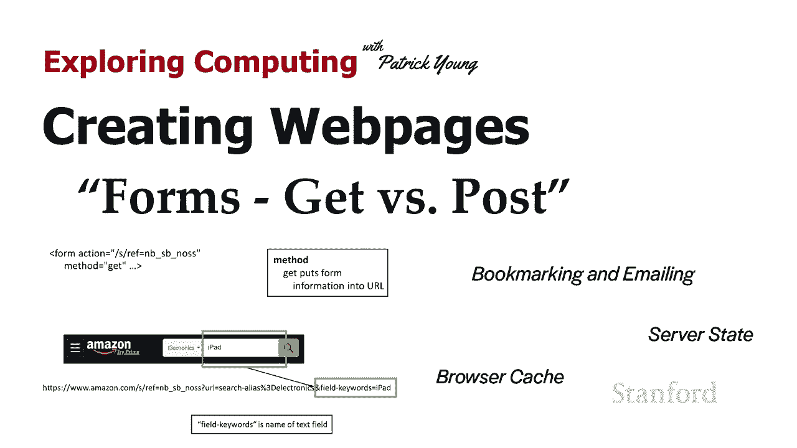

用户输入的元素 信息进入网页，用户输入的元素 信息进入网页，并将其提交到网络服务器，并将其提交到网络服务器，我提到有许多，我提到有许多，不同的属性值对，不同的属性值对，可以放在表单上，可以放在表单上。

其中之一是动作，其中之一是动作，动作将确定服务器上实际，动作将确定服务器上实际，发生的事情，发生的事情，用户提交，用户提交，信息，因此通常这，信息，因此通常这，将是，将是，程序位置的 url。

程序位置的 url，当用户提交表单中的信息时，它将响应，undefined，undefined，因此在这种特殊情况下，我使用的是，因此在这种特殊情况下，我使用的是，相对参考，相对参考，example。

php 等 这意味着服务器，example。php 等 这意味着服务器，上有一个 php 程序，undefined，undefined，该 php 程序的名称是，该 php 程序的名称是。

example。php 并且它位于，example。php 并且它位于，与此处具有此表单的 html 文件完全相同的位置，undefined，undefined，如果您不是 ac 真正。

如果您不是 ac 真正，使用服务器上的程序，使用服务器上的程序，您实际上确实有一些选择，因此您，您实际上确实有一些选择，因此您，可以，可以，使用mailto url，如果用户将。

使用mailto url，如果用户将，其网络浏览器设置为，其网络浏览器设置为，与他们的电子邮件系统进行交互，与他们的电子邮件系统进行交互，这实际上也会将，这实际上也会将。

表单中的信息通过电子邮件发送给您，表单中的信息通过电子邮件发送给您，有他们自己的特殊，有他们自己的特殊，设置，可以让你，设置，可以让你，从一个表单集中获取信息，从一个表单集中获取信息。

而无需你自己实际进行任何，而无需你自己实际进行任何，编程，编程，但现在我们将看看，但现在我们将看看，当我们使用表单时实际发生了什么，当我们使用表单时实际发生了什么，嗯 并且，嗯 并且。

用户实际上是在向服务器提交信息，用户实际上是在向服务器提交信息，这是最常见的，这是最常见的，情况，情况，所以这就是操作，但，所以这就是操作，但，这里也列出了此方法，这里也列出了此方法，结果证明。

结果证明，这非常重要，这非常重要，当您实际，当您实际，尝试设置表单时，这两者都很重要 对于，尝试设置表单时，这两者都很重要 对于，与真实 Web 服务器的实际交互，undefined。

undefined，正确设置此设置非常重要，正确设置此设置非常重要，它也有很多含义，呃，它也有很多含义，呃，就，就，用户何时与表单交互而言，用户何时与表单交互而言，我认为您，我认为您。

会 我发现当我们谈论这个时，会 我发现当我们谈论这个时，你以前遇到过这些情况，你以前遇到过这些情况，也许想知道，也许想知道，为什么计算机，为什么计算机，在某些情况下用表格做某些事情，而。

在某些情况下用表格做某些事情，而，在其他情况下用格式做一些事情，结果，在其他情况下用格式做一些事情，结果，证明这个设置有，证明这个设置有。

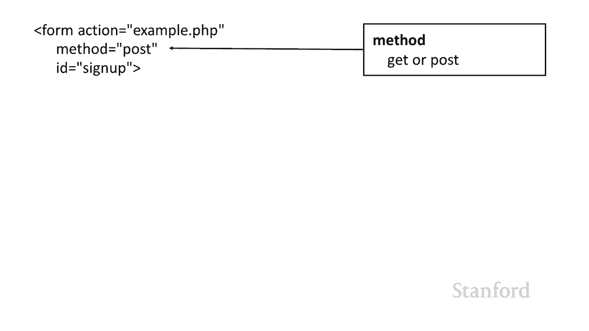

一些非常明显的影响 网页的用户，undefined，undefined，基本上该方法控制的是，基本上该方法控制的是，如何将信息发送到网络，如何将信息发送到网络，服务器，服务器，这对于，这对于。

网页书签和通过电子邮件发送具有重要意义，网页书签和通过电子邮件发送具有重要意义，因此如果您曾经尝试通过电子邮件，因此如果您曾经尝试通过电子邮件，undefined，undefined。

将搜索结果发送给朋友，并且他们没有 '，将搜索结果发送给朋友，并且他们没有 '，无法实际获得这些结果 发生，无法实际获得这些结果 发生，的事情，的事情，是 post 与 get here。

是 post 与 get here，并且它也有，undefined，undefined，关于服务器状态是否因提交表单而改变的，关于服务器状态是否因提交表单而改变的，影响，所以让我们，影响，所以让我们。

继续看一看 在第一部分，继续看一看 在第一部分，信息是如何发送到，信息是如何发送到，服务器的，以及，服务器的，以及。

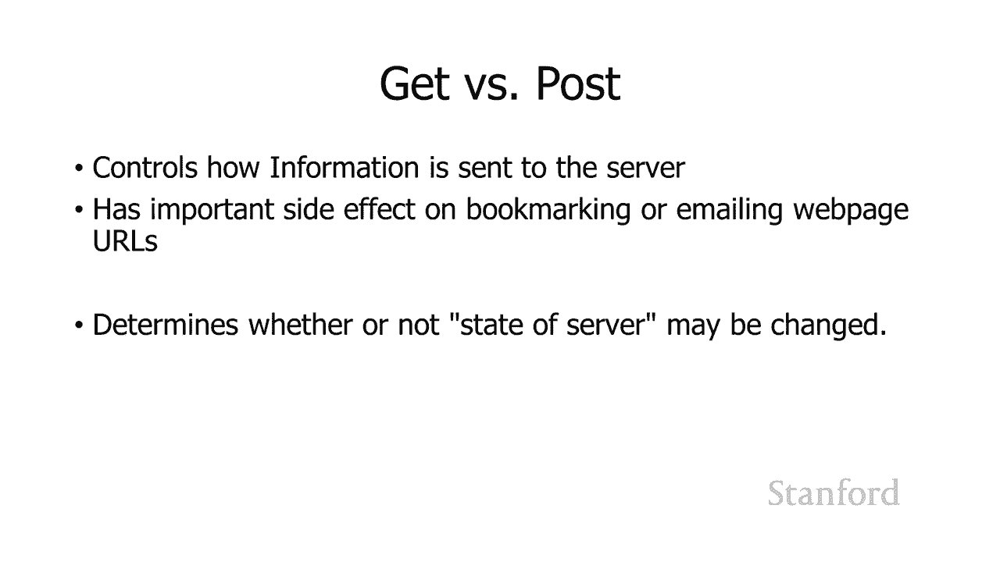

网页网址中的书签或电子邮件的副作用，网页网址中的书签或电子邮件的副作用，所以这里是 amazon。com 上的一个实际表格，所以这里是 amazon。com 上的一个实际表格，undefined。

undefined，我已经采取了 呃，我已经采取了 呃，这里的表单标签的一部分，这里的表单标签的一部分，所以这里是实际操作和，所以这里是实际操作和，方法实际上是 get，方法实际上是 get。

如果我们向下看底部你可以，如果我们向下看底部你可以，看到当，看到当，有人点击这里的提交按钮时生成的 url，有人点击这里的提交按钮时生成的 url，或者额外的一点 那里搜索栏。

或者额外的一点 那里搜索栏，最右侧的小搜索图标，undefined，undefined，我们可以看到那里的操作，我们可以看到那里的操作，slash s slash，slash s slash。

ref 等于 nb underscore sb underscore，ref 等于 nb underscore sb underscore，nos 这是我们的相对参考，nos 这是我们的相对参考，呃。

如果你看看这个呃图片底部的实际 url，undefined，undefined，在这里你可以看到它被添加，在这里你可以看到它被添加，到 www。amazon。com 这是，到 www。amazon。

com 这是，你期望的相对参考，你期望的相对参考，所以，所以，当有人点击，当有人点击，这里的小搜索图标提交表单，这里的小搜索图标提交表单，信息时它，信息时它，会说嘿，会说嘿，位置，位置。

由 amazon。com 服务器上的操作指定，undefined，undefined，但如果您查看，但如果您查看，nb underscore sb underscore nos，您会。

nb underscore sb underscore nos，您会，看到这里有一些附加，看到这里有一些附加，信息，信息，而附加信息，而附加信息，实际上是，实际上是，d 由，d 由。

用户在该选择标签上的选择以及，用户在该选择标签上的选择以及，用户在文本字段中输入的任何内容决定，用户在文本字段中输入的任何内容决定，所以呃我们这里的第一件事，所以呃我们这里的第一件事。

是 url 等于搜索，是 url 等于搜索，别名，所以结果，别名，所以结果，证明我们是那个电子产品 看看，证明我们是那个电子产品 看看，那里，它实际上是 select 标签的一部分，那里。

它实际上是 select 标签的一部分，undefined，undefined，select 标签的名称是 url，select 标签的名称是 url，当信息从 uh web 浏览器发送到服务器时。

您可能会从表单视频中回忆起来，undefined，undefined，undefined，我们，我们，有一堆元素 在我们的网页上，有一堆元素 在我们的网页上，它，它，以元素名称的形式发送，然后是元素。

以元素名称的形式发送，然后是元素，的元素当前值的值，的元素当前值的值，因此在这种特殊情况下，因此在这种特殊情况下，元素的名称是 url 并且，元素的名称是 url 并且，搜索破折号别名等于电子。

搜索破折号别名等于电子，是选项的值，是选项的值，用户在此处选择的电子选项，用户在此处选择的电子选项，所以，所以，这里发生的事情是，这里发生的事情是，关于用户当前，关于用户当前，选择，选择。

的信息被发送到网络服务器，并，undefined，undefined，通过将其附加到 url 本身进行设置，如果，通过将其附加到 url 本身进行设置，如果，您想知道 那个百分比，您想知道 那个百分比。

3d 实际上是那个等号的编码，undefined，undefined，你知道我之前提到过，你，你知道我之前提到过，你，要非常小心，undefined，undefined，undefined。

你在文件名中放入什么样的标点符号，你在文件名中放入什么样的标点符号，就像我在我推荐之前推荐的那样，就像我在我推荐之前推荐的那样，你坚持使用小写，你坚持使用小写，字母数字 0 到 9。

字母数字 0 到 9，和破折号之类的东西，或者在这种，和破折号之类的东西，或者在这种，情况下等号，情况下等号，无法传输，但它确实，无法传输，但它确实，使用这种，使用这种，url 编码进行了转换。

因此在这种特殊情况下，url 编码进行了转换，因此在这种特殊情况下，3d，3d，是 ascii 等号的十六进制，是 ascii 等号的十六进制，编码 所以，编码 所以，你得到一个百分比 3d 设置。

你得到一个百分比 3d 设置，uh 代替实际的等号，uh 代替实际的等号，当它进入服务器，当它进入服务器，然后是我，然后是我，在 ipad 中输入，在 ipad 中输入，的文本字段。

该文本字段的名称是字段，的文本字段，该文本字段的名称是字段，关键字，关键字，然后当然是值 我，然后当然是值 我，在那里输入的是 ipen，所以你可以在，在那里输入的是 ipen，所以你可以在。

url 的末尾看到，url 的末尾看到，它表明我正在，undefined，undefined，使用 uh 和等于 ipad 的字段关键字的值将此信息提交给服务器，undefined，undefined。

因此基本 这里的想法是，因此基本 这里的想法是，这里的 url 包括，这里的 url 包括。

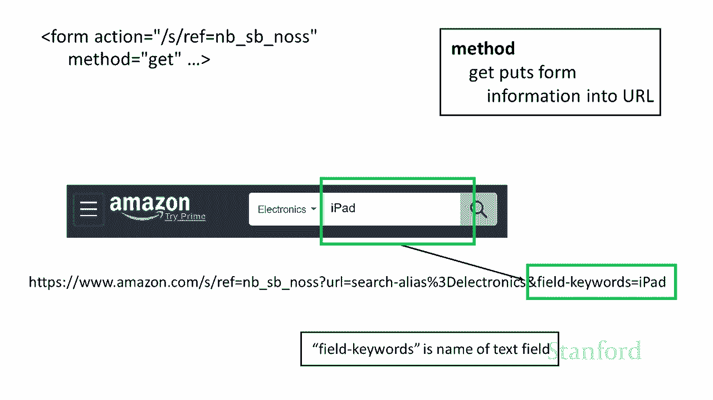

我，我，在表单中输入的信息，所以，undefined，undefined，如果我要为这个网页添加书签，这会有很多，如果我要为这个网页添加书签，这会有很多，含义 将要添加书签的，含义 将要添加书签的。

是这个 url，这个 url 包括，是这个 url，这个 url 包括，我输入的信息 进入表格，所以，我输入的信息 进入表格，所以，如果我继续并为此网页添加书签，如果我继续并为此网页添加书签，然后我。

然后我，在一两天内返回该书签，我将获得，在一两天内返回该书签，我将获得，原始搜索的结果，它，原始搜索的结果，它，会知道我正在搜索，会知道我正在搜索，的电子部分 亚马逊，的电子部分 亚马逊。

和我正在寻找类似的 ipad，和我正在寻找类似的 ipad，如果我要通过电子邮件将此 URL 发送，如果我要通过电子邮件将此 URL 发送，给朋友，给朋友，并且他们要单击该链接，并且。

并且他们要单击该链接，并且，在他们的电子邮件系统中，在他们的电子邮件系统中，它会，它会，包含我输入的表单中的信息，因此他们要走了，包含我输入的表单中的信息，因此他们要走了。

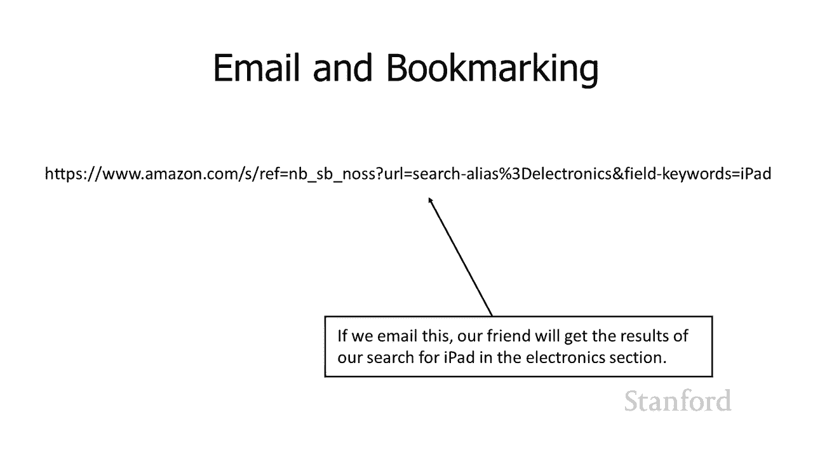

要查看与他们，要查看与他们，在此表单中输入此信息完全相同的结果，在此表单中输入此信息完全相同的结果，undefined，undefined，假设我们继续，undefined，undefined。

将此处表单上的方法从 get 更改为 post，将此处表单上的方法从 get 更改为 post，我确实想强调 amazon，我确实想强调 amazon，使用 get here，使用 get here。

但如果您是 继续并将其，但如果您是 继续并将其。

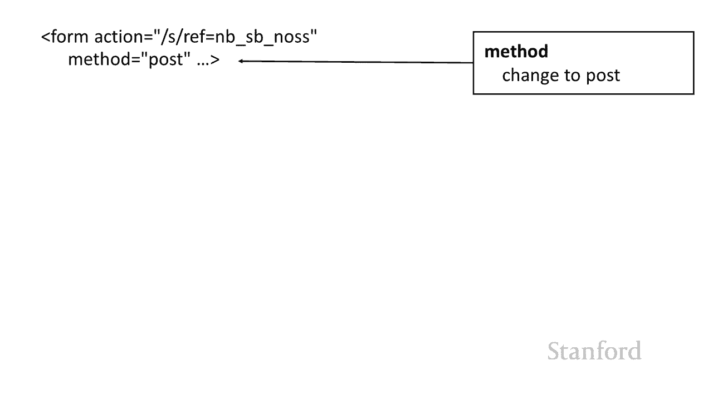

切换为 post 我们将在这里得到一些，切换为 post 我们将在这里得到一些，不同的结果，不同的结果，post 发生的情况是，post 发生的情况是，信息以不同的形式发送到 Web 服务器。

信息以不同的形式发送到 Web 服务器，它不包含，它不包含，在 url 中，在 url 中，它实际上存储在，它实际上存储在，http 请求内部和，http 请求内部和，仅通过查看 url。

仅通过查看 url，并不能直接看到它，因此带有 post 请求的 url 在，并不能直接看到它，因此带有 post 请求的 url 在，这里，这里，我想再次强调，我想再次强调，这是我所做的更改，这。

这是我所做的更改，这，实际上并不是在亚马逊网站上发生的事情，实际上并不是在亚马逊网站上发生的事情，亚马逊网站使用 get，亚马逊网站使用 get，但是 如果我们要使用此帖子请求。

但是 如果我们要使用此帖子请求，请注意，请注意，页面底部的 url 不，页面底部的 url 不，包含任何表明我，包含任何表明我，正在电子部分搜索或，正在电子部分搜索或，输入 ipad，输入 ipad。

作为我正在搜索的关键字的指示，作为我正在搜索的关键字的指示，它只是，它只是，将那里的操作隐藏在，将那里的操作隐藏在。

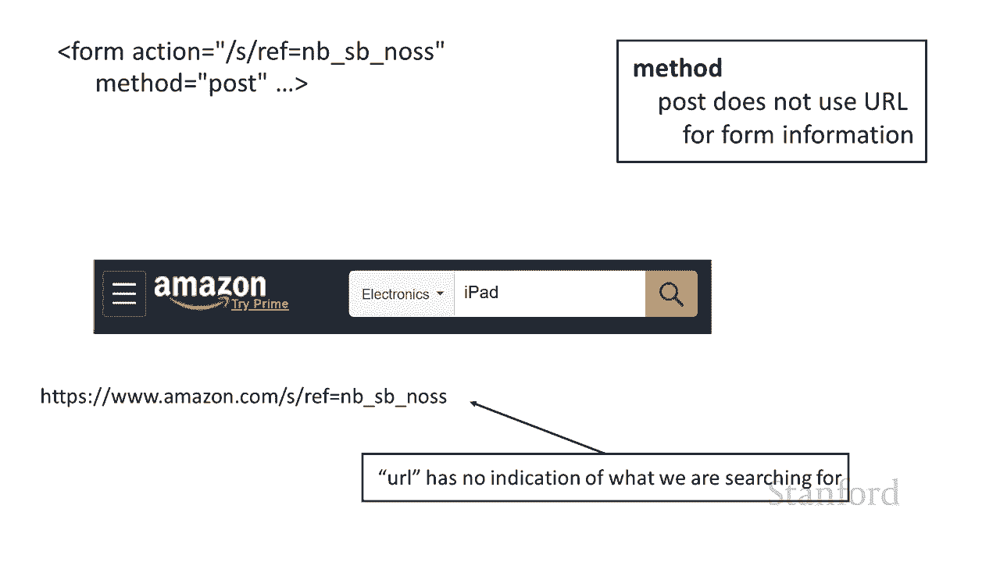

服务器名称的末尾，服务器名称的末尾，并且 url 上没有其他信息，undefined，undefined，所以这里的含义是，如果我，所以这里的含义是，如果我，要继续并为此特定，要继续并为此特定。

网页添加书签，网页添加书签，我会去 回到那个书签，它，我会去 回到那个书签，它，不，不，知道我在电子，知道我在电子，部分寻找，也不知道我在，部分寻找，也不知道我在，寻找 ipad，寻找 ipad。

它只知道我已经，它只知道我已经，向亚马逊提交了搜索请求，但，向亚马逊提交了搜索请求，但，它，它，没有关于什么的信息 那个搜索是，没有关于什么的信息 那个搜索是，所以我不会看到那个搜索的结果。

undefined，undefined，所以如果我在我的表单中，所以如果我在我的表单中，使用 post 请求而不是 get 请求，使用 post 请求而不是 get 请求，并且有人试图为。

并且有人试图为，结果添加书签，结果添加书签，他们将无法类似地，他们将无法类似地，为结果添加书签，为结果添加书签，如果我继续将这个，如果我继续将这个，url 带到这里，url 带到这里。

并通过电子邮件将其发送给朋友而不是，并通过电子邮件将其发送给朋友而不是，他们看到我，他们看到我，在电子部分寻找 ipad 的结果，在电子部分寻找 ipad 的结果，他们只是会看到一些。

他们只是会看到一些，迹象表明，迹象表明，你知道我已经执行了 在，你知道我已经执行了 在，亚马逊上搜索，否则他们甚至可能会收到，亚马逊上搜索，否则他们甚至可能会收到，来自亚马逊的错误消息，说。

来自亚马逊的错误消息，说，嘿，我看到您正在尝试进行搜索，但，嘿，我看到您正在尝试进行搜索，但，我不明白您要，我不明白您要，搜索的内容，搜索的内容，那是因为，那是因为，书签和我们何时使用 url 我们。

书签和我们何时使用 url 我们，通过电子邮件将其发送给人们，undefined，undefined，Web 浏览器为书签存储，Web 浏览器为书签存储，的唯一信息是 url，当然。

的唯一信息是 url，当然，我们朋友获得的唯一信息是，我们朋友获得的唯一信息是，我通过电子邮件发送给他们的 url，所以当，我通过电子邮件发送给他们的 url，所以当，信息被编码，信息被编码。

到 url 时，get 请求，到 url 时，get 请求，非常，非常，好 人们可以准确地看到我在，好 人们可以准确地看到我在，寻找什么以及我，寻找什么以及我，在表单中输入的信息，在表单中输入的信息。

但是如果我们使用 post 请求，该，但是如果我们使用 post 请求，该，信息未包含在 url 中，信息未包含在 url 中，因此，因此，我们不会得到任何，我们不会得到任何，url 不包含的结果。

url 不包含的结果，关于我在表单中输入的任何信息，关于我在表单中输入的任何信息，undefined，undefined，它只知道我尝试输入了一些，它只知道我尝试输入了一些，信息，但实际上并不，信息。

但实际上并不。

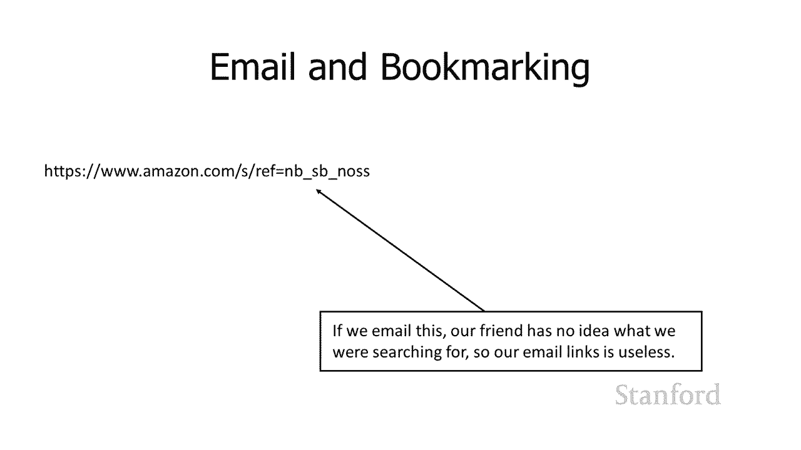

知道与之相关的，undefined，undefined，undefined，undefined，内容 信息被发送，内容 信息被发送，到服务器，到服务器，或者信息被编码，或者信息被编码，到 url 中。

或者它，到 url 中，或者它，包含在，包含在，这些实际的 http 请求中，它不，这些实际的 http 请求中，它不，作为 url 的一部分包含在内，作为 url 的一部分包含在内，因此，因此。

我可以添加书签或通过电子邮件发送给你 ls，我可以添加书签或通过电子邮件发送给你 ls，使用 get 请求，人们将，使用 get 请求，人们将，获得我期望的实际结果，获得我期望的实际结果。

而如果使用 post 请求提交表单，则，undefined，undefined，该信息不包含在，该信息不包含在，url 中，因此，url 中，因此，它丢失了 嗯，它丢失了 嗯。

get 与 post 的第二个含义，get 与 post 的第二个含义，可以说是，可以说是，更重要的是，这是用户通常不会看到的东西，undefined，undefined，但对于，但对于，正确，正确。

设置服务器，设置服务器。

和网页以及，和网页以及，设置 get 与 post，设置 get 与 post，是否状态而言非常重要 服务器的，是否状态而言非常重要 服务器的，可能会改变，可能会改变，所以获取请求是我们所说的。

所以获取请求是我们所说的，项目有效，项目有效，什么项目有效意味着它们，什么项目有效意味着它们，不会改变服务器的状态，不会改变服务器的状态，所以这里的想法是如果我发出一个获取。

所以这里的想法是如果我发出一个获取，请求，请求，我再发出一个获取请求 你知道，我再发出一个获取请求 你知道，一两个小时后，一两个小时后，get 请求应该得到，get 请求应该得到，完全相同的结果，所以。

完全相同的结果，所以，如果我继续在亚马逊上提出一个 get 请求，如果我继续在亚马逊上提出一个 get 请求，寻找 ipad，然后我在，寻找 ipad，然后我在，undefined，undefined。

15 分钟后提出另一个请求，我应该 和，undefined，undefined，使用 get 请求的含义相同的结果，使用 get 请求的含义相同的结果，事实上，欢迎 Web 浏览器，事实上。

欢迎 Web 浏览器，将结果缓存在浏览器，将结果缓存在浏览器，缓存中，缓存中，这意味着它将存储 http，这意味着它将存储 http，um 和任何相关文件，如 css，um 和任何相关文件，如 css。

文件或图像文件，文件或图像文件，um 来自 原始请求，它，um 来自 原始请求，它，能够查看该请求，能够查看该请求，并且您知道该请求可能存在某种，并且您知道该请求可能存在某种，到期日期，到期日期。

但它能够查看该请求并说哦，但它能够查看该请求并说哦，您 15 分钟前提出了此请求，您 15 分钟前提出了此请求，我仍然有，我仍然有，他们上次请求的结果，他们上次请求的结果，还没有过期所以我只是继续。

undefined，undefined。

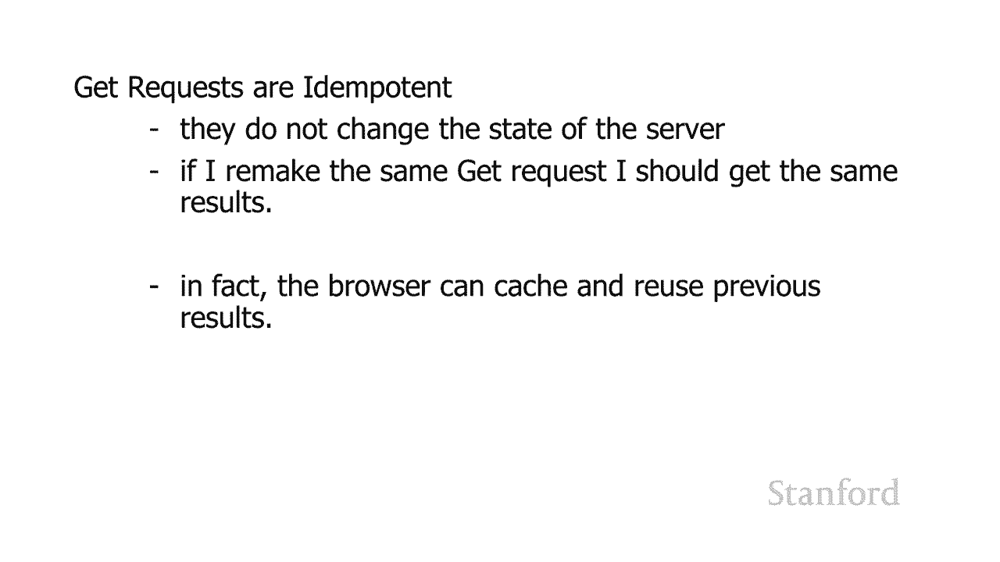

undefined，undefined，post 请求和对比度不是项，post 请求和对比度不是项，有效的这意味着它们可以改变，有效的这意味着它们可以改变，服务器的状态，服务器的状态，所以让我们来看看。

所以让我们来看看，表单的一些使用场景，表单的一些使用场景，以及是否 不是我们希望，以及是否 不是我们希望，结果是否有效，结果是否有效，所以假设我在字典或维基百科上查找一个词，undefined。

undefined，我希望结果会改变得很好，我希望结果会改变得很好，希望不是我的意思是字典确实，希望不是我的意思是字典确实，改变了语言确实改变了bu 它，改变了语言确实改变了bu 它，不会经常改变。

所以，不会经常改变，所以，你知道如果我向 dictionary。com 提出请求，你知道如果我向 dictionary。com 提出请求，查看特定的，查看特定的，词，然后我在，词，然后我在。

12 小时后提出请求，我应该得到完全相同的，12 小时后提出请求，我应该得到完全相同的，结果，状态应该没有，结果，状态应该没有，变化 服务器，当然，变化 服务器，当然，我的请求不会改变服务器的状态。

undefined，undefined，所以这是一个重要的点，所以这是一个重要的点，不是服务器的状态，不是服务器的状态，不能改变，而是，不能改变，而是，我在这里提交的内容没有改变。

我在这里提交的内容没有改变，服务器的状态，服务器的状态，所以你知道也许在 年末，所以你知道也许在 年末，字典。com 决定嘿，字典。com 决定嘿，这个词被以不同的方式使用，这个词被以不同的方式使用。

所以他们继续改变，所以他们继续改变，他们在服务器上的信息，但这，他们在服务器上的信息，但这，不像我提交的新信息，不像我提交的新信息，会改变服务器的状态，会改变服务器的状态，类似于维基百科假设我。

类似于维基百科假设我，正在查找，正在查找，呃你知道这将是，呃你知道这将是，有效的项目，有效的项目，你知道如果我查找有关，你知道如果我查找有关，斯坦福大学的信息 我，斯坦福大学的信息 我。

稍后再查找该信息，稍后再查找该信息，如果我是这样，结果现在应该是一样的，undefined，undefined，作为一名维基百科编辑器，我实际上会，undefined，undefined。

很好地修改那个网页，这是一个不同的请求，所以，很好地修改那个网页，这是一个不同的请求，所以，这种工作方式的 id 是，这种工作方式的 id 是，当我在维基百科上查找信息时，当我在维基百科上查找信息时。

需要，需要，在我改变时获取请求，在我改变时获取请求，维基百科，维基百科，上的信息实际上需要作为发布请求，上的信息实际上需要作为发布请求，因为它正在服务器上进行更改，因为它正在服务器上进行更改。

undefined，undefined，假设我从亚马逊订购了，假设我从亚马逊订购了，一些需要作为发布请求的东西，因为，一些需要作为发布请求的东西，因为，我正在更改，我正在更改。

服务器数据库所在的服务器状态 修改为，服务器数据库所在的服务器状态 修改为，包含有关此新订单的信息，包含有关此新订单的信息，因此如果我输入获取请求而，因此如果我输入获取请求而，不是发布请求。

不是发布请求，如果我在电子公告板上发布内容，则会导致类似的问题，undefined，undefined，undefined，我希望其他人看到它，这，我希望其他人看到它，这。

意味着 如果您在 twitter 或 facebook 或任何类似的地方发帖，服务器上需要进行更改，意味着 如果您在 twitter 或 facebook 或任何类似的地方发帖，服务器上需要进行更改。

以便人们，以便人们。

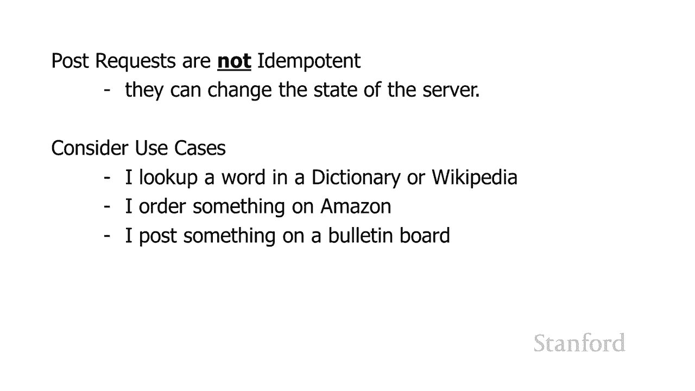

看到我在那里发布的相同，undefined，undefined，内容。undefined，undefined，请求是，请求是，呃，如果你重新加载一个有，呃，如果你重新加载一个有，发布请求的网页。

发布请求的网页，你可能会得到这个，呃这个对话框，你可能会得到这个，呃这个对话框，说，说，你想重新提交这个，你想重新提交这个，信息这是，信息这是，因为发布请求正在，因为发布请求正在，改变服务器的状态或。

改变服务器的状态或，至少可能改变 服务器的状态，undefined，undefined，所以你知道我是否，所以你知道我是否，在亚马逊订购了 ipad 然后，在亚马逊订购了 ipad 然后。

我重新加载了网页它说的，我重新加载了网页它说的，是嘿当你第一次，是嘿当你第一次，点击那个链接你从亚马逊订购了一个，点击那个链接你从亚马逊订购了一个，新的 ipad，新的 ipad，嗯你正在尝试。

嗯你正在尝试，如果我告诉亚马逊你想，如果我告诉亚马逊你想，订购第二个 ipad 来重新加载网页，订购第二个 ipad 来重新加载网页，这与获取请求的获取请求发生的情况相反。

这与获取请求的获取请求发生的情况相反，我只是，我只是，从服务器获取信息，从服务器获取信息，服务器状态没有变化，服务器状态没有变化，所以 如果我使用 get 请求重新加载网页。

所以 如果我使用 get 请求重新加载网页，undefined，undefined，则 Web 浏览器就像这样，一切都很好，则 Web 浏览器就像这样，一切都很好，我可以为您提供相同的结果。

我可以为您提供相同的结果，事实上，我可能将结果保存，事实上，我可能将结果保存，在缓存中，在缓存中，因此当您看到是否要，因此当您看到是否要，重新提交时，重新提交时，您 知道 您可能会注意到。

您 知道 您可能会注意到，有时您知道是否要，有时您知道是否要，重新提交，重新提交，对话，有时您不想重新提交，您，对话，有时您不想重新提交，您，可能想知道有什么区别，可能想知道有什么区别，区别在于。

区别在于，该表单标记为方法，该表单标记为方法，等于 get 或方法等于 post 并，等于 get 或方法等于 post 并，取决于，取决于，正在使用哪些设置，您，undefined。

undefined，要么网络浏览器要么就像，要么网络浏览器要么就像，一切都很好，我可以重新显示，一切都很好，我可以重新显示，结果，结果，要么说嘿这实际上改变，要么说嘿这实际上改变。

了我们已经做过的服务器的状态，了我们已经做过的服务器的状态。

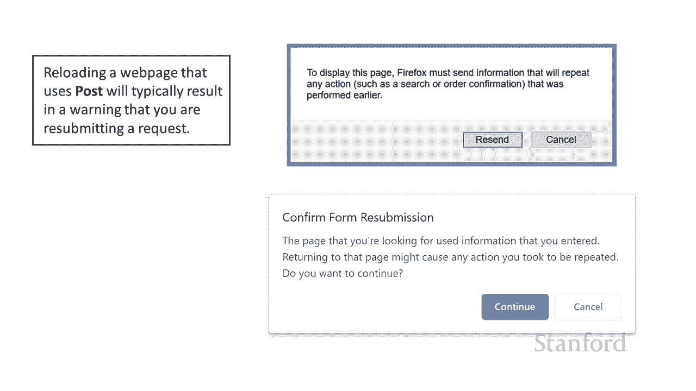

，一旦你想让，一旦你想让，我改变 服务器再次处于状态，我改变 服务器再次处于状态，undefined，undefined，重要的是您使用，重要的是您使用，正确的，正确的，方法类型来正确使用 um。

方法类型来正确使用 um，使用 get 请求，当您，使用 get 请求，当您，实际上想要使用 post 请求时，实际上想要使用 post 请求时，会导致问题，如果，会导致问题，如果。

一个获取请求的结果仍然在，一个获取请求的结果仍然在，我们之前提到的 Web 浏览器缓存中，我们之前提到的 Web 浏览器缓存中，第二个获取请求可能不会，第二个获取请求可能不会，被 Web，被 Web。

服务器接收到，所以这里的想法是呃，服务器接收到，所以这里的想法是呃，如果你真的想要 th 的状态，如果你真的想要 th 的状态，要更改的服务器，要更改的服务器，如果，如果。

有人从我的在线商店订购了一些东西，undefined，undefined，并且我们使用了 get 请求，则您需要使用 post 请求，我可以，并且我们使用了 get 请求，则您需要使用 post 请求。

我可以，忽略 get 请求，忽略 get 请求，应该是幂等的这一事实，我可以，应该是幂等的这一事实，我可以，继续获取，继续获取，该信息 服务器和我可以，该信息 服务器和我可以，更新我的订单数据库。

更新我的订单数据库，但是如果他们要发出第二个，但是如果他们要发出第二个，get 请求来订购该商品的第二个版本，get 请求来订购该商品的第二个版本，则 Web 浏览器将完全，则 Web 浏览器将完全。

正确地运行，如果它说，正确地运行，如果它说，嘿，嘿，您昨天已经提出了这个 get，您昨天已经提出了这个 get，请求，我仍然 将，请求，我仍然 将，结果保存在网络浏览器缓存，结果保存在网络浏览器缓存。

中，据我所知它仍然有效，中，据我所知它仍然有效，我只是要重新显示我，我只是要重新显示我，什至不会费心联系，什至不会费心联系，服务器告诉服务器，服务器告诉服务器，你知道你正在重新提交 这个。

你知道你正在重新提交 这个，获取请求是因为，获取请求是因为，获取请求的含义是我只，获取请求的含义是我只，返回信息我实际上，返回信息我实际上，并没有更改服务器上的任何内容，因此。

并没有更改服务器上的任何内容，因此，您知道是否想要或需要，您知道是否想要或需要，更改服务器上的信息，请，更改服务器上的信息，请。

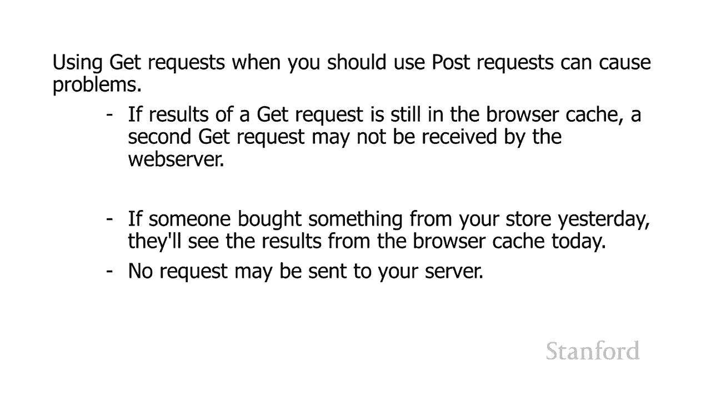

确保您，确保您，在你的表单上设置一个 post 方法，而不是你的表单上的 get 方法，undefined，undefined，可以，所以结论可以使用 get 请求，可以。

所以结论可以使用 get 请求，这对用户来说更方便，这对用户来说更方便，呃在 url 中包含该信息，undefined，undefined，并且能够将其添加为书签 并通过电子邮件发送。

并且能够将其添加为书签 并通过电子邮件发送，给人们和类似的东西，给人们和类似的东西，当您必须时使用 post 请求，所以，当您必须时使用 post 请求，所以，如果表单的提交需要，如果表单的提交需要。

更改，更改，服务器状态上的某些内容，服务器状态上的某些内容，您绝对不希望，您绝对不希望，在 get 请求中发生这种情况，因为，在 get 请求中发生这种情况，因为，作为 我们看到这可能会导致问题。

作为 我们看到这可能会导致问题。

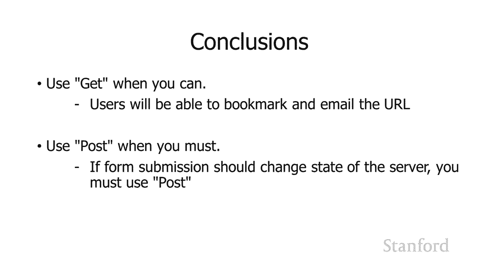

所以这就是表格，我很快就会和。

