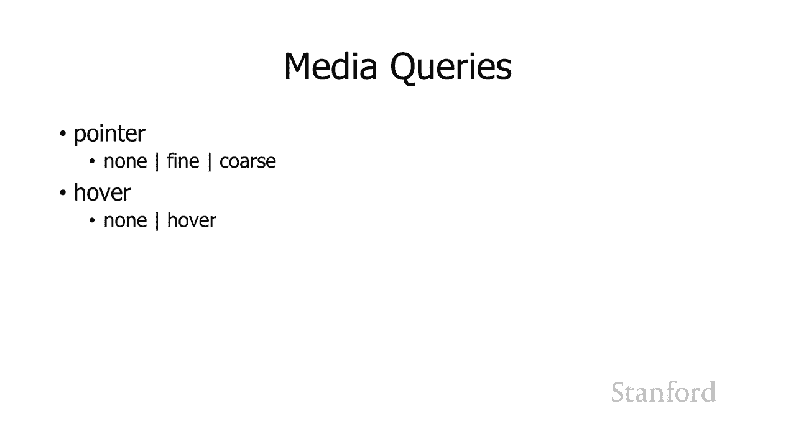

# 【双语字幕+资料下载】斯坦福CS105 ｜ 计算机科学导论(2021最新·完整版) - P44：L14.3- 响应式网页设计 - ShowMeAI - BV1eh411W72E

undefined，欢迎探索，欢迎探索，今天的计算视频正在创建网页，今天的计算视频正在创建网页，响应式网页设计所以我，响应式网页设计所以我，之前提到过，之前提到过，undefined。

undefined，使用网页与，使用网页与，使用印刷页面之间的主要区别之一以及，undefined，undefined，您不能只说一句话的原因之一，您不能只说一句话的原因之一。

像 microsoft word 这样的处理器并从中生成一个网页，undefined，undefined，我的意思是从技术上讲你可以但它，我的意思是从技术上讲你可以但它，不会给你一个很好的网页。

不会给你一个很好的网页，是，是，undefined，undefined，我们在处理网页时无法控制输出设备，我们在处理网页时无法控制输出设备，和，和，当我们使用 microsoft word 时。

我们正在使用打印的页面，当我们使用 microsoft word 时，我们正在使用打印的页面，我们可以说，我们可以说，哦，我要在，哦，我要在，8 张半 x 11 张，8 张半 x 11 张。

纸上打印出来，或者我要在 17 张纸上打印出来，纸上打印出来，或者我要在 17 张纸上打印出来，通过，通过，使用网络浏览器的 11 张纸我们没有，使用网络浏览器的 11 张纸我们没有。

那种控制我们的网站，那种控制我们的网站，说嘿这可能会在一个，说嘿这可能会在一个，小手机上提供这可能会，小手机上提供这可能会，在一个大平板电脑上提供，在一个大平板电脑上提供，这可能会在一个巨大的。

这可能会在一个巨大的，桌面上提供 计算机可能会在，桌面上提供 计算机可能会在，某人的高清设备上提供服务 elevision 所以我们无法，某人的高清设备上提供服务 elevision 所以我们无法。

控制输出设备，控制输出设备，所以我们需要做的是我们，所以我们需要做的是我们，需要创建适用于，需要创建适用于，所有这些不同设备的网页，所有这些不同设备的网页，这是一个问题，因为，这是一个问题，因为。

网页设计的吸引力，网页设计的吸引力，和实用性 会，和实用性 会，因设备尺寸而异，因此，因设备尺寸而异，因此，在手机上看起来很棒的，在手机上看起来很棒的，东西，东西，在高清电视上，undefined。

undefined，undefined，看起来会很愚蠢 不会，看起来会很愚蠢 不会，很好地工作，很好地工作，此外还有各种用户，此外还有各种用户，界面或 ui，界面或 ui，元素在某些设备上运行良好。

但在其他设备上运行良好，undefined，undefined，因此其中一个例子是工具，因此其中一个例子是工具，undefined，undefined，提示 许多程序使用工具提示。

提示 许多程序使用工具提示，人们开始使用，人们开始使用，网站的工具提示 你将鼠标移到，网站的工具提示 你将鼠标移到，某物上面 你让它在那里停留一，某物上面 你让它在那里停留一，分钟，分钟。

你会得到一些关于那个，你会得到一些关于那个，元素的信息 手机无法使用，元素的信息 手机无法使用，因为，因为，你不能将手指悬停在，你不能将手指悬停在，特定的 元素，特定的 元素，并让手机意识到你正在。

并让手机意识到你正在，这样做是为了调出一个工具，这样做是为了调出一个工具，提示，提示，同样你知道当你在，同样你知道当你在，使用手机时你的，使用手机时你的，手指与指向的那种相比非常大和胖。

undefined，undefined，如果你，如果你，有一个鼠标，你可以得到一个，有一个鼠标，你可以得到一个，很好的细小，很好的细小，指针，或者如果你正在使用，undefined，undefined。

铅笔设备，比如，铅笔设备，比如，当你在手机上工作时说苹果铅笔，那么你就可以，当你在手机上工作时说苹果铅笔，那么你就可以，得到 在一种情况下，得到 在一种情况下，使用铅笔或鼠标指针，使用铅笔或鼠标指针。

您可以获得非常精细的控制，您，您可以获得非常精细的控制，您，可以小心地，可以小心地，点击屏幕上的小元素并，点击屏幕上的小元素并，使其正确，undefined，undefined，undefined。

元素，它会更难，元素，它会更难，达到这些不同的目标，所以，达到这些不同的目标，所以，你知道取决于，你知道取决于，我们正在使用的实际设备，我们正在使用的实际设备，有些设计会很好地工作，而。

有些设计会很好地工作，而，有些设计会很糟糕，有些设计会很糟糕，所以问题是我们，所以问题是我们，将如何回应 吨 o，将如何回应 吨 o，这是一种可能性，这就是，这是一种可能性，这就是。

很多年以来事情的基本运作方式，undefined，undefined，是网站设计者只会，是网站设计者只会，设置一个最小标准大小和目标，设置一个最小标准大小和目标，所以你知道我一直在网上工作。

所以你知道我一直在网上工作，因为，因为，我猜周围 97 当我来到，我猜周围 97 当我来到，stanford 时，stanford 时，网络实际上，网络实际上，比那年长一点，基本上我正在，比那年长一点。

基本上我正在，攻读博士学位，我在过去一两年完成了我的博士学位，攻读博士学位，我在过去一两年完成了我的博士学位，我的 php 人就像，我的 php 人就像，嘿，有一个很酷的东西叫做，嘿。

有一个很酷的东西叫做，网络，你应该 检查一下，我，网络，你应该 检查一下，我，就像不，我正忙着，就像不，我正忙着，在这里完成我的呃论文，我，在这里完成我的呃论文，我，在工业界工作了几年。

在工业界工作了几年，然后我来到了斯坦福大学，然后我来到了斯坦福大学，呃，当我接手 cs 105 时，我决定我们，呃，当我接手 cs 105 时，我决定我们，应该教网络，应该教网络，东西。

所以就是这样 当我，东西，所以就是这样 当我，开始研究 Web 技术时，开始研究 Web 技术时，无论如何都放慢了速度，undefined，undefined，undefined，undefined。

undefined，undefined，人们，人们，会访问他们的网站，所以有一段，会访问他们的网站，所以有一段，时间，时间，网站是为宽度，网站是为宽度，为 640 像素，为 640 像素。

或更小的设备设计的，然后他们被设计出来，或更小的设备设计的，然后他们被设计出来，他们，他们，有点提高它并说好的我们，有点提高它并说好的我们，认为人们现在，认为人们现在，实际上有更大的显示器。

实际上有更大的显示器，所以让我们 继续，所以让我们 继续，为至少有 800，为至少有 800，像素设备的人，像素设备的人，设计我们的网站，然后他们为 10，设计我们的网站，然后他们为 10。

24 像素设备重新设计，事实上，24 像素设备重新设计，事实上，你知道每隔几年主要，你知道每隔几年主要，网站都会重新设计，他们重新设计，网站都会重新设计，他们重新设计，的原因，的原因，是 因为。

是 因为，他们认为人们，他们认为人们，访问网站的显示器，访问网站的显示器，稍大，所以，稍大，所以，他们会重新设计他们的网站以获得，他们会重新设计他们的网站以获得，稍大的尺寸，稍大的尺寸。

而你来访问他们的网站时，而你来访问他们的网站时，你有一个较小的显示器，你有一个较小的显示器，你必须把它竖起来 带有呃，你必须把它竖起来 带有呃，水平滚动条，因为该，水平滚动条，因为该。

网站实际上并不适合，网站实际上并不适合，您拥有的空间量，并且，您拥有的空间量，并且，如果您带着更大的监视器来访问该网站，如果您带着更大的监视器来访问该网站，或者，或者，那太糟糕了它仍然你知道。

那太糟糕了它仍然你知道，卡在一个特定的尺寸上所以嗯，卡在一个特定的尺寸上所以嗯，这是人们为不同设备签署网站的原始方式，undefined，undefined，基本上他们不，基本上他们不。

同意另一种方法获得了很大，同意另一种方法获得了很大，的吸引力并且仍然，的吸引力并且仍然，存在 考虑到您实际上，存在 考虑到您实际上，为不同的设备拥有不同的网站，为不同的设备拥有不同的网站。

最显着的是通常有桌面，最显着的是通常有桌面，版本，版本，与移动版本，我们可以得到，与移动版本，我们可以得到，这一点，因为，这一点，因为，当您向网站发出 http 请求时。

当您向网站发出 http 请求时，undefined，undefined，Web 浏览器实际上会，undefined，undefined，在用户代理上发送一些信息 所以网络。

在用户代理上发送一些信息 所以网络，服务器可以做的是它可以，服务器可以做的是它可以，查看该用户代理并说哦我，查看该用户代理并说哦我，认为，认为，这个特定的用户代理应该，这个特定的用户代理应该。

发送到桌面版本或者这个，发送到桌面版本或者这个，特定的用户代理应该发送到，特定的用户代理应该发送到，undefined，undefined，网站的移动版本这也，网站的移动版本这也，效果不佳，效果不佳。

您必须保留，您必须保留，所有不同用户代理的更新列表，所有不同用户代理的更新列表，undefined，undefined，以及它们应该发送到的位置，两个，以及它们应该发送到的位置，两个。

这意味着您要维护不同的，这意味着您要维护不同的，多 ple 网站，一个用于桌面，多 ple 网站，一个用于桌面，一个用于移动，一个用于移动，还有其他一些还有其他一些，还有其他一些还有其他一些，问题。

例如，问题，例如，我花了很多时间在我的 ipad 上，我花了很多时间在我的 ipad 上，结果发现 ipad 经常被，结果发现 ipad 经常被，转移到移动网站，转移到移动网站。

这可能是非常有问题的 如果，这可能是非常有问题的 如果，移动网站是为小手机设计的，移动网站是为小手机设计的，而且你有这么漂亮的大，而且你有这么漂亮的大，屏幕，而且你就像这些家伙一样，屏幕。

而且你就像这些家伙一样，undefined，undefined，我可以利用我的呃 11 或 13，我可以利用我的呃 11 或 13，英寸屏幕，他们就像不，英寸屏幕，他们就像不，你在 移动网站你。

你在 移动网站你，有点卡住了所以这些都是，有点卡住了所以这些都是，不令人满意的解决方案他们都，不令人满意的解决方案他们都，已经完成了他们已经专业完成，已经完成了他们已经专业完成，undefined。

undefined，了那里有很多移动网站，了那里有很多移动网站，你知道，你知道，一方面我，一方面我，在某些情况下可能有意义，但另一方面，undefined，undefined，你知道我认为我们正在模糊。

你知道我认为我们正在模糊，什么是移动设备之间的界限，什么是移动设备之间的界限，手机有多大什么是小，手机有多大什么是小，尺寸平板电脑什么是台式电脑上的大尺寸标签，undefined，undefined。

所以实际上有 更好的应用程序 oach，所以实际上有 更好的应用程序 oach，和更好的方法是，和更好的方法是，所谓的响应式网页设计，所以，所谓的响应式网页设计，所以，响应式网页设计要做的是。

undefined，undefined，获取有关用户正在使用的实际设备的信息，获取有关用户正在使用的实际设备的信息，它会询问，它会询问，该设备的特征是什么，该设备的特征是什么，然后它会继续。

然后它会继续，在该设备的基础上有不同的样式规则，在该设备的基础上有不同的样式规则，所以，所以，你知道这，你知道这，与级联样式表一起工作，与级联样式表一起工作，以便为不同的设备使用不同的级联。

以便为不同的设备使用不同的级联，样式表规则，样式表规则，正如我之前提到的，正如我之前提到的，undefined，undefined，这对网格很好用 -基于，这对网格很好用 -基于，布局，我建议你们。

布局，我建议你们，好好学习，好好学习，所以让我们看看，所以让我们看看，这可能如何工作，这可能如何工作，嗯，我将首先给出，嗯，我将首先给出，一个概述示例，这，一个概述示例，这。

实际上是我另一个人的家庭作业，undefined，undefined，事实上，这部分就在这里你们都，事实上，这部分就在这里你们都，应该认识，因为这是，应该认识，因为这是，你们家庭作业的一部分。

你们家庭作业的一部分，嗯，所以你知道你们都在这里完成了这个，嗯，所以你知道你们都在这里完成了这个，特定的作业，特定的作业，但我做了什么 对于我的 cs193c 课程，这。

但我做了什么 对于我的 cs193c 课程，这，是，是，我在暑假期间教的专业的网络开发课程，undefined，undefined，我让他们根据访问网页的设备的类型特征来更改网页设计。

undefined，undefined，undefined，undefined，undefined，因此除了你们之外，因此除了你们之外，当网页在某些时候变得越来越窄时必须这样做，undefined。

undefined，将那个计数器放在右侧实际上没有意义，undefined，undefined，您可以这样做，但是将会发生，您可以这样做，但是将会发生，的是，的是，新闻文章将变得更小并且。

新闻文章将变得更小并且，更小，更小，所以我们要做的是将日历移动到，所以我们要做的是将日历移动到，undefined，undefined，新闻文章下方，然后如果它，新闻文章下方，然后如果它，变得更窄。

变得更窄，我们不再将图像浮动在一侧，我们不再将图像浮动在一侧，而是让图像占据，而是让图像占据，网络浏览器窗口宽度的 100%，网络浏览器窗口宽度的 100%，然后我们把文章的文本放在。

然后我们把文章的文本放在，它下面，它下面，然后我们把日历放在它下面，所以，然后我们把日历放在它下面，所以，这，这，是一个三阶段的设计，你可以有任意，是一个三阶段的设计，你可以有任意，多的阶段，多的阶段。

我不会向你展示这个的来源，我不会向你展示这个的来源，因为它 是家庭作业 cs193c，undefined，undefined，的解决方案，我不希望解决方案，的解决方案，我不希望解决方案，四处飘荡。

四处飘荡，嗯，好吧，这是示例，这是，嗯，好吧，这是示例，这是，我们将仔细研究的几个示例之一，undefined，undefined，undefined，undefined，在左边，在左边，我有一个。

我有一个，所有斯坦福宿舍的列表，所有斯坦福宿舍的列表，所以我们要在这里做的是我们，所以我们要在这里做的是我们，将从一些非常，将从一些非常，简单的事情开始我们要做的是，简单的事情开始我们要做的是。

随着网络浏览器窗口的出现 更窄，随着网络浏览器窗口的出现 更窄，我们将继续并，我们将继续并，完全，完全，摆脱宿舍列表，摆脱宿舍列表，嗯好吧，那么我们将如何做到这，嗯好吧，那么我们将如何做到这。

一点实际上非常简单，一点实际上非常简单，基本上我将，基本上我将，介绍媒体查询的这个概念，介绍媒体查询的这个概念，我们 “我将讨论，我们 “我将讨论，一下您的选择，一下您的选择，您实际上，您实际上。

不必在任何家庭作业中都这样做，但我，不必在任何家庭作业中都这样做，但我，确实想让您了解这是，确实想让您了解这是，如何工作的，如何工作的，这绝对是如果，这绝对是如果，你们中的任何人出去创建一个实际的。

你们中的任何人出去创建一个实际的，网站，这是de 有限的事情你，网站，这是de 有限的事情你，应该考虑，应该考虑，好吧，所以嗯，左边的宿舍列表，好吧，所以嗯，左边的宿舍列表，位于导航元素内。

位于导航元素内，这是新的 html5，这是新的 html5，特殊语义元素，特殊语义元素，和文章之一，我之前已经，和文章之一，我之前已经，提到过数字和无花果，提到过数字和无花果，标题 有一个 nav。

标题 有一个 nav，元素，所以宿舍列表，元素，所以宿舍列表，在 nav 元素中，稍后我们将看到，在 nav 元素中，稍后我们将看到，另一个示例，另一个示例，我们实际上可以查看，我们实际上可以查看。

html，html，但现在只需意识到，undefined，undefined，宿舍列表是 在该元素中，宿舍列表是 在该元素中，通常情况下，导航元素浮动，通常情况下，导航元素浮动，到左侧，这就是，到左侧。

这就是，我们在左侧屏幕截图中看到的内容，但，我们在左侧屏幕截图中看到的内容，但，我所做的是我有这个媒体查询，我所做的是我有这个媒体查询，如果屏幕的最大宽度为 480 像素，我会说嘿，undefined。

undefined，换句话说，如果屏幕是 480，换句话说，如果屏幕是 480，像素或更少，像素或更少，那么只要去掉那个导航元素，那么只要去掉那个导航元素，就根本不显示它，就根本不显示它。

所以这就是我们，所以这就是我们，正确的做法，所以它确实有效，正确的做法，所以它确实有效，但你知道在大多数情况下你 别 ，但你知道在大多数情况下你 别 ，只想，只想，摆脱你想要移动它们的导航元素。

摆脱你想要移动它们的导航元素，这就是我们下一个，这就是我们下一个，例子要做的，例子要做的，而不是完全摆脱，而不是完全摆脱，导航元素，我实际上，导航元素，我实际上，要把它们放在屏幕顶部。

要把它们放在屏幕顶部，undefined，undefined，当 窗口变得非常狭窄，所以，当 窗口变得非常狭窄，所以，这就是我再次这样做的方式我，这就是我再次这样做的方式我，将导航向左浮动。

将导航向左浮动，我有一个特定宽度的媒体查询，我有一个特定宽度的媒体查询，所以在这里你可以看到，所以在这里你可以看到，你实际上可以有多个样式，undefined，undefined，规则 媒体查询部分。

所以如果，规则 媒体查询部分，所以如果，最大宽度为 600 像素或更小，最大宽度为 600 像素或更小，那么我有两个不同的，那么我有两个不同的，规则将首先应用我，规则将首先应用我。

将摆脱导航元素上的浮动，将摆脱导航元素上的浮动，undefined，undefined，然后我将 将所有列表，然后我将 将所有列表，项，项，从他们的标准（显示，从他们的标准（显示，块）转为内联显示。

块）转为内联显示，因此在右侧您可以看到，因此在右侧您可以看到，这是实际的 html，因此您可以看到，这是实际的 html，因此您可以看到，我有那个导航，我有那个导航，元素我有一个无序列表。

元素我有一个无序列表，有一堆列表项，有一堆列表项，所以列表项通常是 b 锁定，所以列表项通常是 b 锁定，级别元素，级别元素，它们创建类似于 div 的文本块，它们创建类似于 div 的文本块。

undefined，undefined，所以我正在做的是我实际上，所以我正在做的是我实际上，能够改变，能够改变，它们的行为并说我，它们的行为并说我，不想将它们视为博客级别元素。

不想将它们视为博客级别元素，我想将它们视为记住 我们，我想将它们视为记住 我们，所说的内联或，所说的内联或，文本级元素，这些是，undefined，undefined，用于例如我们将用于粗体。

用于例如我们将用于粗体，标签或斜体标签的，标签或斜体标签的，那些内联或文本级元素，那些内联或文本级元素，我是说，我是说，嘿，我知道 列表项通常，嘿，我知道 列表项通常，是一个块，但不要再把它当作一个块。

undefined，undefined，把它当作一个基本上跨度的，把它当作一个基本上跨度的，标签，标签，所以你可以看到 呃效果，所以你可以看到 呃效果，是列表不再从上到下，是列表不再从上到下。

而不是列表去，而不是列表去，undefined，undefined，好吧，所以在这里我这样做是通过，好吧，所以在这里我这样做是通过，将媒体查询直接，将媒体查询直接，放入样式表，放入样式表，实际上可以做。

实际上可以做，一些类似的事情，一些类似的事情，您只需使用，您只需使用，与以前相同的媒体查询，但实际上您有，与以前相同的媒体查询，但实际上您有，不同的级联样式表 文件，不同的级联样式表 文件。

所以我只是想要 提到这是，所以我只是想要 提到这是，不可能的，您可以在此处查看语法，不可能的，您可以在此处查看语法，并且有几种不同的方法，并且有几种不同的方法，可以执行此操作，您可以，可以执行此操作。

您可以，在样式标签本身中使用 at 导入，或者您可以，undefined，undefined，为不同的级联样式表，为不同的级联样式表，文件，文件，创建多个链接标签，所以最后一件事我 想要。

创建多个链接标签，所以最后一件事我 想要，提及的只是让您，提及的只是让您，了解我们可以询问什么样的事情，所以，了解我们可以询问什么样的事情，所以，这里有一些您，这里有一些您，可能会，可能会，询问的事情。

以便确定使用哪，询问的事情，以便确定使用哪，组样式表，组样式表，或哪些样式规则，嗯和，undefined，undefined，除了这些，还有其他一些，但我认为，除了这些，还有其他一些，但我认为。

这些可能是最重要的，因此，这些可能是最重要的，因此，您可以确定用户设备的宽度和，您可以确定用户设备的宽度和，undefined，undefined，高度，高度，或者他们的窗口的外观，您。

或者他们的窗口的外观，您，可以确定，可以确定，他们的设备是否处于横向模式 或者，他们的设备是否处于横向模式 或者，纵向模式，纵向模式，所以基本上如果你不，所以基本上如果你不，熟悉这些术语，这意味着这个。

熟悉这些术语，这意味着这个，人的手机是，人的手机是，横向旋转还是纵向旋转，你，横向旋转还是纵向旋转，你，可以确定纵横比 您是否，可以确定纵横比 您是否，可以确定有关，可以确定有关。

它们能够显示多少种颜色的信息，它们能够显示多少种颜色的信息，您可以获得，您可以获得，有关屏幕分辨率的信息，即，有关屏幕分辨率的信息，即，每英寸有多少，每英寸有多少，点，因此这些都将，点，因此这些都将。

确定，确定，您的网页应该具有什么样的外观，您的网页应该具有什么样的外观，undefined，undefined，以及 你的网页设计应该是，以及 你的网页设计应该是，什么样子，什么样子。

还有一些我认为真的很，还有一些我认为真的很，有趣 嗯，有趣 嗯，也许这说明了我，也许这说明了我，觉得有趣的事情 说一些，觉得有趣的事情 说一些，关于我的事情 但，关于我的事情 但。

呃呃是的 我之前提到过这个想法，呃呃是的 我之前提到过这个想法，undefined，undefined，取决于你是否 重新使用，取决于你是否 重新使用，手指选择网页上的项目，或者，手指选择网页上的项目。

或者，您有更细粒度的，您有更细粒度的，指针，如鼠标或，指针，如鼠标或，触敏笔或铅笔，触敏笔或铅笔，您可能有不同的网页设计，您可能有不同的网页设计，因此您实际上可以找到，因此您实际上可以找到。

可以询问的信息，可以询问的信息，您可以使用 一个媒体查询，您可以使用 一个媒体查询，如果我有一个细粒度的指针，我想，如果我有一个细粒度的指针，我想，使用我的网页的以下元素，使用我的网页的以下元素。

或者我希望我的元素有，或者我希望我的元素有，这样那样的大小，这样那样的大小，但如果有人在浏览我的网页，但如果有人在浏览我的网页，用他们的手指，我意识到他们无法，undefined，undefined。

像你知道，像你知道，的那样细粒度地点击这些东西，所以也许我会，的那样细粒度地点击这些东西，所以也许我会，增加我的导航元素的大小，增加我的导航元素的大小，undefined，undefined。

然后悬停是你知道的部分，然后悬停是你知道的部分，仍然非常喜欢工具提示，仍然非常喜欢工具提示，但，但，我当然承认它，我当然承认它，在有人试图用手指导航时根本不适用于手机。

在有人试图用手指导航时根本不适用于手机，所以，所以，你可以问我们说用户是否，你可以问我们说用户是否，有能力悬停，有能力悬停，如果他们使用鼠标，那么，如果他们使用鼠标，那么，答案是肯定的，但是如果他们。

答案是肯定的，但是如果他们，在手机上使用手指，那么，在手机上使用手指，那么，答案是否定的，因此无论如何您都可以，答案是否定的，因此无论如何您都可以，在此基础上更改您的设计，在此基础上更改您的设计。

因此整个想法是响应，因此整个想法是响应，undefined，undefined，有关用户设备的信息并，有关用户设备的信息并，使用您的级联样式表进行，使用您的级联样式表进行，更改 网页的显示方式您。

更改 网页的显示方式您，知道，知道，如果您打算进行，如果您打算进行，专业设计，这真的非常重要，专业设计，这真的非常重要，如果您正在做 假设您最终，如果您正在做 假设您最终，在做一个非盈利组织或其他事情。

在做一个非盈利组织或其他事情，并且，并且，您需要创建一个网页，因为，您需要创建一个网页，因为，没有人  其他非营利组织知道，没有人  其他非营利组织知道，如何创建一个网页，如何创建一个网页。

你仍然可以做一些基本的网络查询，你仍然可以做一些基本的网络查询，你知道如果你回到第一个，你知道如果你回到第一个，例子 我开始时这，例子 我开始时这，是 cs193c 中的家庭作业 这。

是 cs193c 中的家庭作业 这，实际上相当简单 说，实际上相当简单 说，嘿我有一个，嘿我有一个，undefined，undefined，如果此人的显示器为 1200，如果此人的显示器为 1200。

像素或更多，请稍作休息 如果此，像素或更多，请稍作休息 如果此，人的显示器为 800 像素或更多，人的显示器为 800 像素或更多，让我们执行此操作，undefined。

undefined，undefined。

