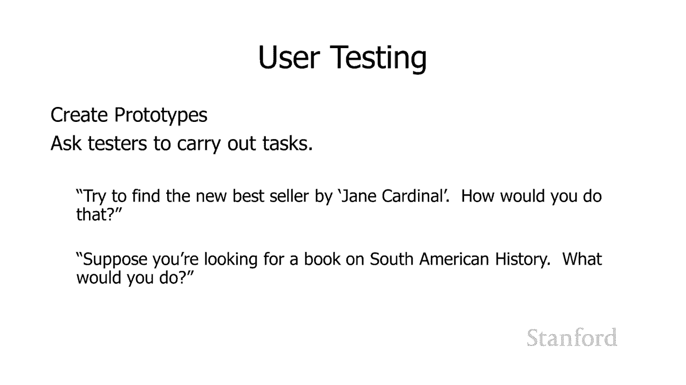

# 【双语字幕+资料下载】斯坦福CS105 ｜ 计算机科学导论(2021最新·完整版) - P45：L15.1- 人机交互 - ShowMeAI - BV1eh411W72E

undefined，欢迎探索，欢迎探索，今天的计算视频是人机，今天的计算视频是人机，交互，交互，人机交互或 hci 是，人机交互或 hci 是，计算机，计算机，科学中的一个重要研究领域。

科学中的一个重要研究领域，它专注于如何改善，它专注于如何改善，人与计算机之间的交互以及，人与计算机之间的交互以及，undefined，undefined，您今天正在使用的计算机，undefined。

undefined，是一个好兆头，是一个好兆头，hci 的成功是因为 hci 负责，hci 的成功是因为 hci 负责，诸如我们都在使用的 windows 图标鼠标和。

诸如我们都在使用的 windows 图标鼠标和，指针或 wimp 界面之类的东西，指针或 wimp 界面之类的东西，undefined，undefined，以及事实上你们都在使用。

以及事实上你们都在使用，图形用户界面而不是，图形用户界面而不是，命令行界面，我们在其中，命令行界面，我们在其中，键入计算机，键入计算机，显示 hci 研究人员对我们的世界产生了。

显示 hci 研究人员对我们的世界产生了，巨大影响，undefined，undefined，目前 ati 的热门话题包括虚拟和，目前 ati 的热门话题包括虚拟和，增强现实，增强现实，语音命令手势。

您可以，语音命令手势，您可以，用手，用手，与计算机进行交互，hci，与计算机进行交互，hci，研究人员甚至正在研究，研究人员甚至正在研究，脑机接口 我，脑机接口 我，一直喜欢的一件事 指出当我。

一直喜欢的一件事 指出当我，教我的课是因为我教了，教我的课是因为我教了，很多，很多，非计算机科学的学生 是，非计算机科学的学生 是，有很多不同的领域，有很多不同的领域，实际上，实际上。

对 hci 工作非常重要，对 hci 工作非常重要，你们中的一些人现在可能正在研究这些领域，你们中的一些人现在可能正在研究这些领域，undefined，undefined，所以其中之一是心理学，我。

所以其中之一是心理学，我，undefined，undefined，心理学在许多不同的方面与 hci 直接相关，undefined，undefined，更好地，更好地，理解人类认知的一件事可以。

理解人类认知的一件事可以，带来更好的应用，因此，带来更好的应用，因此，诸如人类如何感知，诸如人类如何感知，颜色，颜色，或人类记忆的局限性，或人类记忆的局限性，应该推动，应该推动，我们的应用，此外。

我们的应用，此外，心理学研究，心理学研究，与计算机，与计算机，科学，科学，用户界面研究有很多相似之处 所以在，用户界面研究有很多相似之处 所以在，心理学大楼的地下室里，心理学大楼的地下室里，有一堆房间。

我们在那里，有一堆房间，我们在那里，undefined，undefined，介绍心理学学生，呃要求，介绍心理学学生，呃要求，他们执行任务，他们执行任务，在单向玻璃镜子的另一边，在单向玻璃镜子的另一边。

undefined，undefined，呃我们有心理学研究生 正在，呃我们有心理学研究生 正在，观察他们如何执行这些任务，观察他们如何执行这些任务，hci 研究人员，hci 研究人员。

在大型计算机科学公司做完全相同的事情所以，在大型计算机科学公司做完全相同的事情所以，我们有相同的房间机智 h 单向，我们有相同的房间机智 h 单向，玻璃 我们在那里安装了一台计算机。

玻璃 我们在那里安装了一台计算机，我们带来了一些测试对象 我们，我们带来了一些测试对象 我们，要求他们，要求他们，在我们的计算机上执行任务 我们看看他们，在我们的计算机上执行任务 我们看看他们。

实际上如何与计算机交互，实际上如何与计算机交互，他们是否能够，他们是否能够，以我们期望的方式使用计算机，以我们期望的方式使用计算机，通常对于大，通常对于大，公司，我们实际上会有，公司，我们实际上会有。

心理学家，心理学家，他们了解如何正确运行，他们了解如何正确运行，这些实验，这些实验，另一个重要的相关领域是，另一个重要的相关领域是，平面设计，平面设计，呃，你知道当我在工业界工作时，呃。

你知道当我在工业界工作时，我们有一个 一群，我们有一个 一群，来自艺术学校的人，来自艺术学校的人，undefined，undefined，专门为 hci 工作而工作，嗯，专门为 hci 工作而工作，嗯。

显然人体工程学非常重要，显然人体工程学非常重要，然后社会学和民族志以及，然后社会学和民族志以及，其他相关领域，其他相关领域，对 hci 也非常重要，我认为，对 hci 也非常重要，我认为，特别是现在。

特别是现在，有这么多的应用程序 是，有这么多的应用程序 是，为多人使用而设计的，以及，为多人使用而设计的，以及，undefined，undefined，如何帮助群体互动，如何帮助群体互动。

社会学家的重要性当然是，社会学家的重要性当然是，显而易见的，但，显而易见的，但，另一种方式是 ciologists 和，另一种方式是 ciologists 和，ethnographers。

ethnographers，真的很重要是如果我们被要求，真的很重要是如果我们被要求，进入并帮助，进入并帮助，改善特定的工作场所，改善特定的工作场所，我们需要社会学家和，我们需要社会学家和。

ethnographers 进入并研究该工作场所并，undefined，undefined，undefined，在我们可以帮助自动化之前很好地了解该工作场所发生的事情 并将。

在我们可以帮助自动化之前很好地了解该工作场所发生的事情 并将，工作场所计算机化，工作场所计算机化，让我们快速浏览，让我们快速浏览，一下用户界面，一下用户界面，专家在尝试设计新用户界面时。

undefined，undefined，所做的一些事情 您应该做的第一件事是，所做的一些事情 您应该做的第一件事是，找到一些需求 我们要，找到一些需求 我们要，确定用户的实际需求是什么。

确定用户的实际需求是什么，以及 所以我们将花一些时间，以及 所以我们将花一些时间，观察工作场所呃研究，观察工作场所呃研究，当前流程，当前流程，并采访潜在用户，并采访潜在用户，然后我们将，然后我们将。

确定，确定，该工作场所中的不同角色以及该工作场所，该工作场所中的不同角色以及该工作场所，中定期执行的不同任务，undefined，undefined，以及 然后我们将进行一些，以及 然后我们将进行一些。

原型设计 我们，原型设计 我们，将对这些原型进行一些测试 然后，将对这些原型进行一些测试 然后，我们将迭代这最后一部分是，我们将迭代这最后一部分是，非常重要，因为事实证明，非常重要，因为事实证明。

我们并不是特别擅长，我们并不是特别擅长，undefined，undefined，提出对工作场所真正有帮助的计划，undefined，undefined，因此非常重要的是，我们不仅要，因此非常重要的是。

我们不仅要，采访人们，采访人们，并根据他们的反馈提出想法，undefined，undefined，在采访中给我们的只是，在采访中给我们的只是，我们测试它们并再次尝试它们，我们测试它们并再次尝试它们。

实际上并不，实际上并不，少见用户认为他们，少见用户认为他们，想要，想要，一个程序然后当他们实际，一个程序然后当他们实际，尝试该程序时意识到，尝试该程序时意识到，哦这并不像我想象的那么有用 我。

哦这并不像我想象的那么有用 我，想也许我们真正想要的是，想也许我们真正想要的是，另一件事，另一件事，所以，所以，undefined，undefined，你与潜在，你与潜在，用户，用户。

一起尝试不同的东西并，一起尝试不同的东西并，最终真正确定他们，最终真正确定他们，真正需要什么而不是他们，真正需要什么而不是他们，最初感知的，最初感知的，担忧是超级的迭代过程 重要的是。

担忧是超级的迭代过程 重要的是，您可以构建的原型，您可以构建的原型，质量范围从低保真到，质量范围从低保真到，高保真，或者有时会，高保真，或者有时会，提到，提到，低保真到高保真，因此示例，低保真到高保真。

因此示例，包括，包括，一张非常低保真度的纸草图，一张非常低保真度的纸草图，您现在只需，您现在只需，在一张纸上绘制图表，在一张纸上绘制图表，这些草图仍可用于用户，这些草图仍可用于用户，界面实验。

因此您可以，界面实验，因此您可以，与人们讨论，与人们讨论，他们从，他们从，一个显示特定窗口的呃图表开始的过程，一个显示特定窗口的呃图表开始的过程，而您 知道，而您 知道，嘿 你会在哪里 你会在哪里。

嘿 你会在哪里 你会在哪里，点击这个窗口，点击这个窗口，呃你知道你认为，呃你知道你认为，你应该使用哪些按钮，你应该使用哪些按钮，嗯 两个线框 这是在计算机上完成的，undefined。

undefined，但我们不关心，但我们不关心，undefined，undefined，我们将在实际应用程序中的呃细节，我们将在实际应用程序中的呃细节，例如颜色和字体，例如颜色和字体，但线框仍然让我们。

但线框仍然让我们，很好地了解该屏幕上可能有什么样的信息，undefined，undefined，我们可以制作一个更高，我们可以制作一个更高，质量的模型，质量的模型，其中包含字体和颜色以及其他。

其中包含字体和颜色以及其他，实际有效的东西，实际有效的东西，然后我们可以拥有更高保真度的，然后我们可以拥有更高保真度的，原型，原型，用户可以在其中实际与他们交互，用户可以在其中实际与他们交互。

并按下某些按钮，因此，并按下某些按钮，因此，这可能起作用的方式是假设我们，这可能起作用的方式是假设我们，undefined，undefined，在网上书店工作一个，在网上书店工作一个。

例子 我们将在一分钟内更详细地使用，例子 我们将在一分钟内更详细地使用，undefined，undefined，我们可以告诉某人嘿继续在，undefined，undefined。

这里与我们的高保真模型交互并查找一，这里与我们的高保真模型交互并查找一，本关于，本关于，南美历史的书，因此，南美历史的书，因此，用户，用户，希望找到正确的文本字段以，希望找到正确的文本字段以。

输入 他们的搜索词组并输入，输入 他们的搜索词组并输入，南美洲历史，然后他们会按，南美洲历史，然后他们会按，undefined，undefined，回车键，我们将移至另一个，回车键，我们将移至另一个。

屏幕，显示查找南美洲历史的结果，undefined，undefined，但这里发生的关键，但这里发生的关键，是您输入的内容并不重要，undefined，undefined，当您单击搜索按钮时，文本字段。

当您单击搜索按钮时，文本字段，只会转到南美，只会转到南美，历史的结果，因为，历史的结果，因为，这是我们唯一将其，这是我们唯一将其，硬连线的内容，因此在这里您有一个，硬连线的内容，因此在这里您有一个。

原型，它看起来真实并且有，原型，它看起来真实并且有，一些交互，但，一些交互，但，并不相同 作为一个真正的程序，它，并不相同 作为一个真正的程序，它，要简化得多，要简化得多，所以这些更高保真度的原型可以。

所以这些更高保真度的原型可以，提供更好的结果，但，提供更好的结果，但，它们有些问题，因为，它们有些问题，因为，事实证明，团队投入的时间和精力越多，事实证明，团队投入的时间和精力越多，o 创建，o 创建。

呃这些原型，他们越难，undefined，undefined，得到结果，得到结果，undefined，undefined，表明他们花费了所有时间的高保真原型，表明他们花费了所有时间的高保真原型。

实际上是错误的方法，实际上是错误的方法，呃，呃，如果你唯一做过的事情就更难放弃它 在一张纸上画了一些，如果你唯一做过的事情就更难放弃它 在一张纸上画了一些，图表，图表，然后你开始，然后你开始。

与用户互动，然后，与用户互动，然后，发现你的想法是，发现你的想法是，错误的，undefined，undefined，undefined，undefined，undefined，制作纸质图表的成本。

制作纸质图表的成本，花费了呃这么多时间 呃为这些讲座制作了，花费了呃这么多时间 呃为这些讲座制作了，一些图表，一些图表，他们实际上，他们实际上，相当耗时但是，相当耗时但是。

呃然而呃 拿出这些图表花费的时间要少得多，呃然而呃 拿出这些图表花费的时间要少得多，无论它们是在纸上完成的 或者在，无论它们是在纸上完成的 或者在，undefined，undefined。

计算机上实际拥有交互式，计算机上实际拥有交互式，原型，原型，我提到过我们将讨论，我提到过我们将讨论，一下书店所以我想做一个，一下书店所以我想做一个，小，小，案例研究来帮助您了解 呃。

案例研究来帮助您了解 呃，undefined，undefined，如果我们正在设计一个新程序，我们应该考虑一些事情，如果我们正在设计一个新程序，我们应该考虑一些事情，所以在这种特殊情况下，我想。

所以在这种特殊情况下，我想，我和 tas 聚在一起，我和 tas 聚在一起，undefined，undefined，我们决定要做一个新的创业公司，我们，我们决定要做一个新的创业公司，我们。

认为最好的主意是，认为最好的主意是，一个新的创业公司是创建一个，一个新的创业公司是创建一个，看起来是个好主意的在线书店，看起来是个好主意的在线书店，我认为没有人做，我认为没有人做，对了，对了。

所以让我们看看我们如何，所以让我们看看我们如何，完成创建这个在线书店的过程，undefined，undefined，所以我们需要考虑，所以我们需要考虑，我们的用户是谁，我们的用户是谁。

记住我之前说过的话，我们，记住我之前说过的话，我们，想考虑角色，想考虑角色，和任务，和任务，对于这个特定的视频，我，对于这个特定的视频，我，将专注于我们与客户的互动，将专注于我们与客户的互动，但，但。

如果我们真的要这样做，如果我们真的要这样做，就会有 成为，就会有 成为，与书店员工有关的另一组任务，与书店员工有关的另一组任务，undefined，undefined，但我们将只关注，但我们将只关注。

客户，因此我们想考虑，客户，因此我们想考虑，undefined，undefined，我们的网站访问者是谁，我们的网站访问者是谁，为什么他们访问该网站，为什么他们访问该网站，他们的级别 l 技术专长是。

他们的级别 l 技术专长是，他们拥有什么样的设备以及，他们拥有什么样的设备以及，他们的，他们的，互联网连接看起来有多，互联网连接看起来有多，快他们有多可靠他们，快他们有多可靠他们，像这样的事情。

像这样的事情，然后我们想考虑，undefined，undefined，他们可能想要与我们的网站进行交互的不同任务，undefined，undefined，显而易见的是，我正在寻找一本，显而易见的是。

我正在寻找一本，特定的书，特定的书，但这并不是，但这并不是，某人访问网站的唯一原因，某人访问网站的唯一原因，他们可能对特定，他们可能对特定，主题感兴趣但对，主题感兴趣但对，特定书籍，特定书籍。

不感兴趣或对特定书籍没有概念，不感兴趣或对特定书籍没有概念，与该主题相关，这，与该主题相关，这，确实是一个关键区别，确实是一个关键区别，我认为斯坦福图书馆，我认为斯坦福图书馆，在这方面做得更好。

但是很长一段，在这方面做得更好，但是很长一段，时间内，时间内，当您寻找特定书籍时，他们有一个很棒的界面，当您寻找特定书籍时，他们有一个很棒的界面，它会，它会，告诉您，告诉您。

呃嘿这是这本书嗯 这是它所在的，呃嘿这是这本书嗯 这是它所在的，图书馆 这是，图书馆 这是，我们有多少副本 呃这是，我们有多少副本 呃这是，该副本签出的时间，该副本签出的时间，这是它，这是它。

接下来将可用的内容，接下来将可用的内容，嗯 所以这是超级有用的 ul 但是当，嗯 所以这是超级有用的 ul 但是当，谈到，谈到，我有一个我感兴趣的主题但我，我有一个我感兴趣的主题但我，不知道，不知道。

该主题的特定书籍这是一个可怕的可怕，该主题的特定书籍这是一个可怕的可怕，undefined，undefined，界面因此您需要仔细考虑，界面因此您需要仔细考虑，您，您，知道所有原因 为什么有人可能会。

知道所有原因 为什么有人可能会，来我们这里的小书店，来我们这里的小书店，你想仔细考虑，你想仔细考虑，如何满足这些需求，如何满足这些需求，然后这是底部的第三个需求，然后这是底部的第三个需求。

你知道他们可能，你知道他们可能，坐在课堂上，坐在课堂上，他们可能很无聊，你知道，undefined，undefined，他们每次参加探索性，他们每次参加探索性，计算机课程时都想访问我们的网站。

计算机课程时都想访问我们的网站，我们很乐意让他们这样做 我们，我们很乐意让他们这样做 我们，希望找到新的和有趣的内容，希望找到新的和有趣的内容，来向他们展示他们每天，来向他们展示他们每天。

对他们感兴趣的事物类型有所了解，对他们感兴趣的事物类型有所了解，在里面，在里面，你知道找到向他们展示这些书的漂亮的有光泽的方式，你知道找到向他们展示这些书的漂亮的有光泽的方式，undefined。

undefined，这样他们就会经常来，这样他们就会经常来，undefined，undefined，并希望对，并希望对，我们展示给他们的东西感到兴奋，并最终，我们展示给他们的东西感到兴奋，并最终。

购买它们，购买它们，所以这些是有人迁移的三个非常不同的，所以这些是有人迁移的三个非常不同的，呃原因 ht 访问我们的，呃原因 ht 访问我们的，网站，网站，我们可能需要，我们可能需要。

在我们的网站上做的事情来，在我们的网站上做的事情来，满足这三个不同的任务中的每一个，满足这三个不同的任务中的每一个，实际上是完全不同的，所以你需要，实际上是完全不同的，所以你需要，仔细思考，仔细思考。

为什么人们在这里，而不仅仅是你知道，为什么人们在这里，而不仅仅是你知道，什么是最低限度的事情，什么是最低限度的事情，有人可能需要来访问，有人可能需要来访问，我们的网站，但尝试，我们的网站，但尝试。

尽可能广泛，这将为，尽可能广泛，这将为，您提供更，您提供更，广泛的受众范围，这，广泛的受众范围，这，将为您提供一个整体更好的网站，将为您提供一个整体更好的网站，然后我们可能想要做的就是。

然后我们可能想要做的就是，来，来，获取有关潜在客户的信息，并，获取有关潜在客户的信息，并，记住有很多，记住有很多，不同的人访问我们的网站，不同的人访问我们的网站，他们都有不同的，他们都有不同的，特征。

所以，特征，所以，经常使用的一种策略实际上，经常使用的一种策略实际上，是针对用户角色的，所以这里有，是针对用户角色的，所以这里有，一些，一些，潜在的客户 客户 nikki 是一位年轻的。

潜在的客户 客户 nikki 是一位年轻的，专业人士 她用手机访问网站 她的，专业人士 她用手机访问网站 她的，手机，手机，网速适中，undefined，undefined，但她经常在回家的路上访问。

undefined，undefined，在我们乘坐巴士回家时，工作和互联网连接通常，在我们乘坐巴士回家时，工作和互联网连接通常，有点不稳定，有点不稳定，帕特里克是一名老年人，他的技术专长较低。

undefined，undefined，并且使用 Windows 95 笔记本电脑访问网站，并且使用 Windows 95 笔记本电脑访问网站，undefined，undefined。

所以您知道我们是否愿意为他提供支持，所以您知道我们是否愿意为他提供支持，他的网络浏览器可能是 很，他的网络浏览器可能是 很，老了，老了，他可能有一些安全问题，他可能有一些安全问题，undefined。

undefined，因为微软不再支持 Windows 95，因为微软不再支持 Windows 95，undefined，undefined，这实际上是一个好点，所以，这实际上是一个好点，所以。

你需要考虑，你需要考虑，你知道你要支持的人范围，undefined，undefined，因为你支持的人越多，嗯，因为你支持的人越多，嗯，你 知道我们已经，你 知道我们已经。

对 html 和 css 进行，对 html 和 css 进行，了一些讨论，您在，了一些讨论，您在，他们的网络浏览器中遇到问题的可能性越大，他们的网络浏览器的兼容性就越低，undefined。

undefined，您将能够使用的酷 css 内容就越少，您将能够使用的酷 css 内容就越少，要做的是，要做的是，我要回到这里的 patrick 我们的老年人，undefined，undefined。

所以他有一台非常旧的笔记本电脑，但他，所以他有一台非常旧的笔记本电脑，但他，确实有良好的互联网连接，确实有良好的互联网连接，然后 maddie 是一名初中生，然后 maddie 是一名初中生。

她有中等技术 l，她有中等技术 l，技能，技能，她有一台低端平板电脑，呃，但她，她有一台低端平板电脑，呃，但她，确实有良好的互联网连接，确实有良好的互联网连接，所以这里的想法是我们可以考虑。

所以这里的想法是我们可以考虑，呃，呃，我们确定客户可能，我们确定客户可能，在网站上做的不同任务，在网站上做的不同任务，然后在我们，然后在我们，讨论 设计我们实际上可以，讨论 设计我们实际上可以。

提出这些角色，所以我们可以说，提出这些角色，所以我们可以说，好吧，这似乎是一个有趣的，好吧，这似乎是一个有趣的，设计，设计，我可以看到 nikki 将，我可以看到 nikki 将，如何弄清楚如何使用它。

但是，如何弄清楚如何使用它，但是，帕特里克如何，帕特里克如何，才能弄清楚这一点，才能弄清楚这一点，或者你知道 如果我们正在考虑，undefined，undefined，我们网站上显示的各种信息。

您可能会问，我们网站上显示的各种信息，您可能会问，nikki 是否能够，nikki 是否能够，在她上下班途中很好地看到网站的这一部分，在她上下班途中很好地看到网站的这一部分，如果我们占用了太多。

如果我们占用了太多，带宽，她无法这样做，带宽，她无法这样做，我们如何 将为她提供，我们如何 将为她提供，替代方案，因此创建这些不同的，替代方案，因此创建这些不同的，角色并为他们命名，让。

角色并为他们命名，让，我们可以在开会时谈论这些，我们可以在开会时谈论这些，类型的用户，类型的用户，undefined，undefined，然后我们想要进行用户测试和，然后我们想要进行用户测试和。

就像我们之前讨论过的那样，就像我们之前讨论过的那样，您将拥有，您将拥有，不同质量的不同原型，不同质量的不同原型，并且您可能，并且您可能，想要从低保真，想要从低保真，原型开始，原型开始。

因为高保真原型需要花费，因为高保真原型需要花费，大量时间和精力，大量时间和精力，进入所以你知道花一些时间在，进入所以你知道花一些时间在，低保真原型上，如果看起来，低保真原型上，如果看起来。

你在正确的方向上，你可以，你在正确的方向上，你可以，继续改进它们并提出，继续改进它们并提出，越来越多的更高质量的原型，越来越多的更高质量的原型，你需要得到一个，你需要得到一个。

一群没有直接参与项目的用户，undefined，undefined，事实上你可能想尝试，事实上你可能想尝试，获得与你的角色匹配的用户，获得与你的角色匹配的用户，这样你就知道我们是否认为我们会让。

undefined，undefined，undefined，使用 Windows 95 笔记本电脑的老年人访问我们的网站，使用 Windows 95 笔记本电脑的老年人访问我们的网站，找一些可能。

找一些可能，没有很多技术专长的老用户，没有很多技术专长的老用户，把他们带到，undefined，undefined，你的原型前，无论，你的原型前，无论，你在做什么级别的原型制作。

你在做什么级别的原型制作，然后问他们如何执行特定的，然后问他们如何执行特定的，任务，任务，假设你说好 ' 呈现 w 这里有一个屏幕，假设你说好 ' 呈现 w 这里有一个屏幕。

试图找到 jane Cardinal 的新畅销书，试图找到 jane Cardinal 的新畅销书，undefined，undefined，你认为你会如何用，你认为你会如何用，这个屏幕来做这件事。

所以你知道，这个屏幕来做这件事，所以你知道，他们是否看到了纸质原型，他们是否看到了纸质原型，希望，希望，如果它是一幅好画，他们可以，如果它是一幅好画，他们可以，看看它 说，看看它 说，哦。

我看到这将如何转化为一个，哦，我看到这将如何转化为一个，真正的计算机程序，真正的计算机程序，我想你知道他们可以点击这，我想你知道他们可以点击这，张纸，然后说，张纸，然后说，哦，我想我会呃我会，哦。

我想我会呃我会，在这个文本字段中输入一些东西，或者如果，在这个文本字段中输入一些东西，或者如果，它是一个，它是一个，高保真原型 他们，高保真原型 他们，实际上可以与它互动 他们看到。

实际上可以与它互动 他们看到，那里的文本字段，那里的文本字段，他们可以在上面单击鼠标 然后，他们可以在上面单击鼠标 然后，他们可以继续在，他们可以继续在，那里输入信息，那里输入信息。

我们可以问他们 假设，我们可以问他们 假设，你正在寻找一本关于南美历史的书，undefined，undefined，你会怎么做 这样做，他们可以，你会怎么做 这样做，他们可以，看看你的，看看你的，原型。

并确切地弄清楚，原型，并确切地弄清楚，他们将如何与它交互，他们将如何与它交互，所以 aci 就像我说的那样是计算机科学中一个非常重要的，所以 aci 就像我说的那样是计算机科学中一个非常重要的，领域。

领域，对于可能没有 st 的人来说，这是一个很好的地方，undefined，undefined，荣计算机科学背景，荣计算机科学背景。

参与帮助您开发。

