# 【双语字幕+资料下载】斯坦福CS105 ｜ 计算机科学导论(2021最新·完整版) - P46：L15.2- 网站设计 - ShowMeAI - BV1eh411W72E

undefined，欢迎探索，欢迎探索，今天的计算视频是网站设计，今天的计算视频是网站设计，所以在这个视频中我们将讨论，所以在这个视频中我们将讨论，一下网站，一下网站，设计我想主要关注品牌。

设计我想主要关注品牌，和品牌背后的想法是，和品牌背后的想法是，你想让你的网站独一无二且，你想让你的网站独一无二且，清晰可，清晰可，辨 这里的想法是，如果您的网站，辨 这里的想法是，如果您的网站。

看起来像其他人的网站，看起来像其他人的网站，人们不会注意到它，人们不会注意到它，假设有人通过电子邮件，假设有人通过电子邮件，将您网站的链接发送给他们的一位，将您网站的链接发送给他们的一位，朋友，朋友。

该朋友访问该页面说哦，该朋友访问该页面说哦，这很酷，这很酷，然后第二天 其他人，然后第二天 其他人，将，将，您网站上另一个页面的链接发送，您网站上另一个页面的链接发送，给同一个人，给同一个人。

您希望发生的是当，您希望发生的是当，他们点击该链接时，您希望他们，他们点击该链接时，您希望他们，说等一下，我想我，说等一下，我想我，在意识到这一点之前已经访问过这个网站。

在意识到这一点之前已经访问过这个网站，网站这是一个，网站这是一个，不同的页面，不同的页面，但是是的这是我昨天访问的同一个网站，但是是的这是我昨天访问的同一个网站，这个，这个，网站似乎有一些非常酷的。

网站似乎有一些非常酷的，东西我应该注意，东西我应该注意，这个，这个，网站所以在这个视频中我们 ' 将，网站所以在这个视频中我们 ' 将，讨论一些，讨论一些，可以帮助您使您的网站，可以帮助您使您的网站。

具有独特可识别性，具有独特可识别性，和趣味性的事情 所以这里是，和趣味性的事情 所以这里是，我们今天将要讨论的品牌塑造的四个要素 我们将，undefined，undefined，undefined。

简要地讨论徽标 呃，简要地讨论徽标 呃，排版，特别是字体选择，排版，特别是字体选择，和配色方案，然后我会，和配色方案，然后我会，谈谈整体布局以及，谈谈整体布局以及，您应该在导航方面考虑什么。

您应该在导航方面考虑什么，undefined，undefined，所以我，所以我，想说的关于您的徽标的主要内容是，想说的关于您的徽标的主要内容是，您需要确保 确保您的徽标，您需要确保 确保您的徽标。

清晰可辨，并出现，清晰可辨，并出现，在您的所有网页或至少某些，在您的所有网页或至少某些，版本上，您可以，版本上，您可以，在内页上使用简化版本，然后，在内页上使用简化版本，然后，在主页面上使用精美版本。

undefined，undefined，这里要记住的是，这里要记住的是，如果 你有一个成功的网站，如果 你有一个成功的网站，人们会做所谓的，人们会做所谓的，深度链接，这意味着，深度链接，这意味着。

人们将链接到，人们将链接到，你网站深处的单个页面，你网站深处的单个页面，undefined，undefined，我认为很多业余爱好者都会做一件事 rs，我认为很多业余爱好者都会做一件事 rs，经常。

经常，认为哦，我只是要专注，认为哦，我只是要专注，于主页上的品牌，因为，于主页上的品牌，因为，每个人都会，每个人都会，通过主页访问，通过主页访问，如果，如果，您考虑，您考虑，已发送的网页链接。

您就知道这不是真的 给，已发送的网页链接，您就知道这不是真的 给，你知道的朋友，你可能有，你知道的朋友，你可能有，很多次这样的感觉哦，很多次这样的感觉哦，这是一个特定的产品，这是一个特定的产品，呃。

它是一个更大网站的一部分，我，呃，它是一个更大网站的一部分，我，想继续发送这样的人，或者，undefined，undefined，这是你知道的电影评论，这是一个内页 在，这是你知道的电影评论。

这是一个内页 在，更大的网站上，更大的网站上，所以这是深层链接，所以请，所以这是深层链接，所以请，始终牢记，始终牢记，我们将再次讨论这个问题，undefined，undefined，undefined。

undefined，undefined，undefined，可以从，可以从，undefined，undefined，出来，所以，出来，所以，您要，您要，为网站做出的关键设计选择之一是。

为网站做出的关键设计选择之一是，字体的使用，字体的使用，我们将讨论，我们将讨论，三种基本字体选择，三种基本字体选择，它们是 你可以使用 sans-serif，它们是 你可以使用 sans-serif。

字体、serif 字体或 monospace 字体，字体、serif 字体或 monospace 字体，正如我们在查看真实网页时会看到的，undefined，undefined。

真实网页经常使用这些的混合，真实网页经常使用这些的混合，但你知道它们，但你知道它们，中的大多数主要是 sansef 或 serif，中的大多数主要是 sansef 或 serif。

monospace 用于特殊目的，monospace 用于特殊目的，我们稍后会讨论，我们稍后会讨论，undefined，undefined，所以让我们确保每个人都，所以让我们确保每个人都，了解这些。

了解这些，serif 是什么以及 sans serif 是什么 所以在左边我有，serif 是什么以及 sans serif 是什么 所以在左边我有，一个 sans serif 字体，在 是的，我。

一个 sans serif 字体，在 是的，我，有一个衬线字体，有一个衬线字体，和那些小刻度线，和那些小刻度线，呃在 f 的末端，呃在 f 的末端，undefined，undefined。

所以这里是设计人员会，所以这里是设计人员会，告诉你的关于衬线字体与无衬线，告诉你的关于衬线字体与无衬线，字体的内容，字体的内容，衬线字体是正式和权威的，衬线字体是正式和权威的，尽管 这种观点是。

尽管 这种观点是，衬线字体是，衬线字体是，老式的和陈旧的，而无，老式的和陈旧的，而无，衬线字体是乐观和，衬线字体是乐观和，现代的，所以你需要考虑，现代的，所以你需要考虑，你网站的目的是什么。

你网站的目的是什么，以及，以及，在选择字体时你更喜欢现代还是权威，在选择字体时你更喜欢现代还是权威，所以让我们 看看一些实际的，所以让我们 看看一些实际的，网站，看看他们正在选择这些字体中的哪一种。

undefined，undefined，所以你认为你，所以你认为你，认为纽约时报想要，认为纽约时报想要，乐观和现代还是你认为，乐观和现代还是你认为，他们想要权威，他们想要权威，所以这里是 纽约时报嗯。

我们，undefined，undefined，抬头看看他们的实际标题，那里，抬头看看他们的实际标题，那里，看起来很seraphi，看起来很seraphi，如果你看这里的新闻报道，如果你看这里的新闻报道。

你会看到他们也有衬线字体，undefined，undefined，整个右侧有一些无衬线字体，整个右侧有一些无衬线字体，侧边栏，侧边栏，主要是无衬线字体，并且，主要是无衬线字体，并且。

位于纽约时报名称下方的右上角，位于纽约时报名称下方的右上角，如果您看一下世界，美国，如果您看一下世界，美国，政治纽约商业也都是，政治纽约商业也都是，无衬线字体，无衬线字体，因此我们，因此我们。

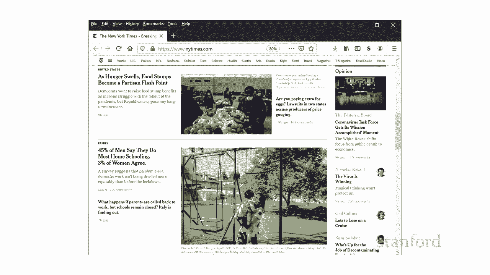

将网站向下滚动一点，您会注意到 这个，将网站向下滚动一点，您会注意到 这个，网页主要是衬线字体，网页主要是衬线字体，而新闻文章本身也是，而新闻文章本身也是，衬线字体，所以，衬线字体，所以。

如果你考虑一下，如果你考虑一下，纽约时报可能试图在这里描绘的事情，纽约时报可能试图在这里描绘的事情，他们试图描绘它们是，他们试图描绘它们是，正式的，那么这是有道理的 和权威，正式的。

那么这是有道理的 和权威，undefined，undefined，所以华盛顿邮报，所以华盛顿邮报，在这里也有很多衬线，嗯，虽然，在这里也有很多衬线，嗯，虽然，再次和纽约时报一样，如果你。

再次和纽约时报一样，如果你，看下面，看下面，这个标题，那个栏，这个标题，那个栏，undefined，undefined，在新闻冠状病毒新闻的顶部 dc，在新闻冠状病毒新闻的顶部 dc。

爆发等等 sans serif，爆发等等 sans serif，嗯你可以看到其他一些地方，嗯你可以看到其他一些地方，他们使用 sans serif，他们使用 sans serif，文章的作者这些名字。

文章的作者这些名字，是，是，sans serif 如果你看看这里文章的实际，sans serif 如果你看看这里文章的实际，文本，文本，如果你看，如果你看，那个 中美洲的计时病毒分歧。

那个 中美洲的计时病毒分歧，你看看，你看看，那里的文字，那里的文字，这个国家是否应该继续，这个国家是否应该继续，呆在，呆在，undefined，undefined。

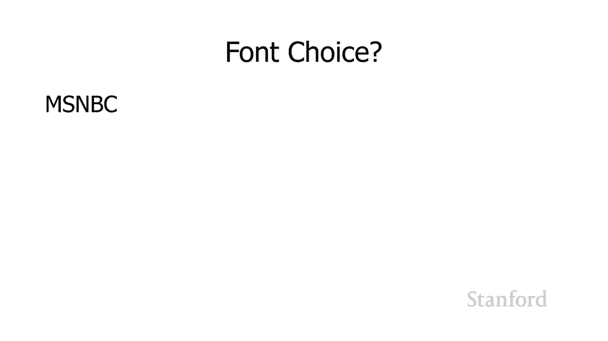

好吧，msnbc 怎么样，好吧，msnbc 怎么样，所以他们试图变得更，所以他们试图变得更。

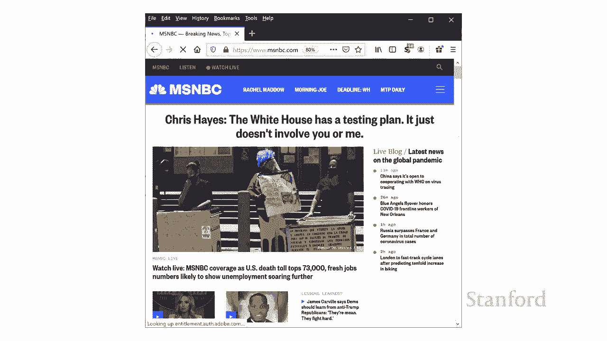

现代，呃，我暂时没有看到，现代，呃，我暂时没有看到，任何 这个网页上根本没有衬线字体，任何 这个网页上根本没有衬线字体，所以这让我思考，就像，所以这让我思考，就像，我认为 msnbc 的呃相当左翼一样。

我认为 msnbc 的呃相当左翼一样，所以，所以，左翼机构和右翼，左翼机构和右翼，机构的描绘方式之间有区别吗？ 你自己，所以，机构的描绘方式之间有区别吗？ 你自己，所以。

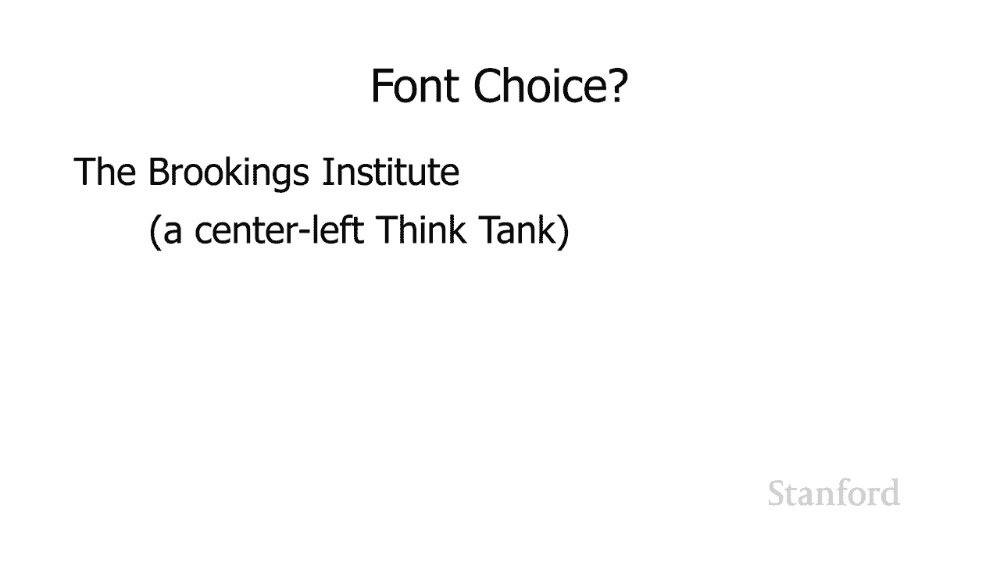

我想我们现在应该看看这里的几个，我想我们现在应该看看这里的几个，智囊团 布鲁金斯，智囊团 布鲁金斯，研究所，研究所，是中间的左智囊团，是中间的左智囊团，你可以看到，你可以看到，他们的名字布鲁金斯在。

他们的名字布鲁金斯在，左上角有纱丽，左上角有纱丽，但实际上他们的网站主要是 除了，但实际上他们的网站主要是 除了，他们的名字，他们的名字，呃你知道哪个可能，呃你知道哪个可能。

是那个字体可能是很久以前选择，是那个字体可能是很久以前选择。

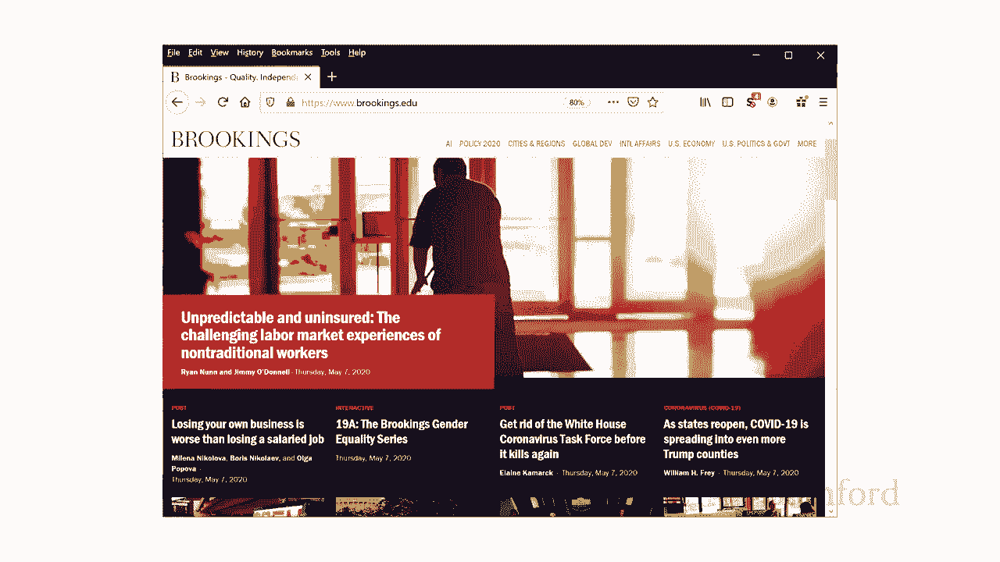

的，的，现在网站的其余部分根本没有，现在网站的其余部分根本没有，衬线，衬线。

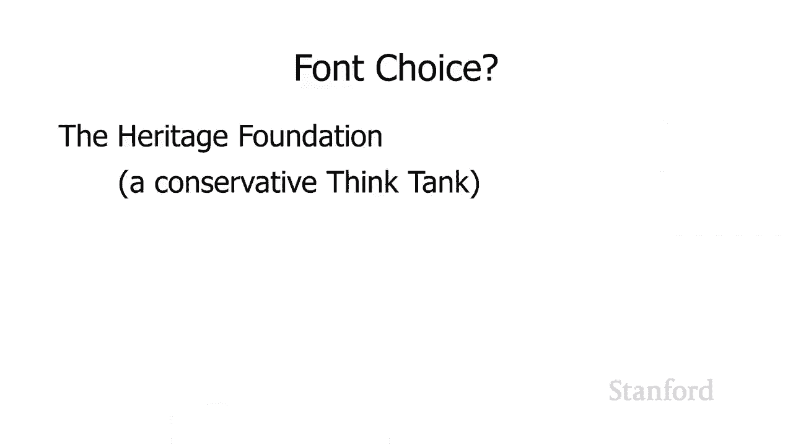

，然后，然后，是一个保守的智囊团的遗产基金会，是一个保守的智囊团的遗产基金会，你可以看到这个 主要是一个衬线，你可以看到这个 主要是一个衬线，网站，网站，有一些无衬线部分，所以，有一些无衬线部分，所以。

在顶部运行关于，在顶部运行关于，遗产事件更新捐赠新闻和，遗产事件更新捐赠新闻和，联系，联系，那些是无衬线但他们的标志，那些是无衬线但他们的标志，undefined，undefined。

本身遗产基金会左上角和，本身遗产基金会左上角和，他们的主要文章在这里，他们的主要文章在这里。

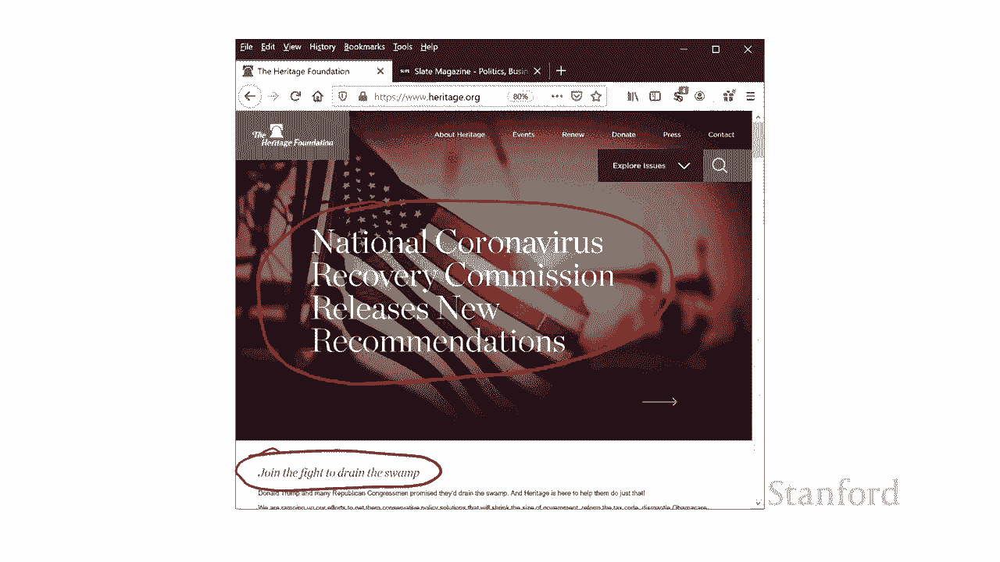

这些都有衬线，这些都有衬线，可以 所以根据我们对呃，可以 所以根据我们对呃，字体选择的了解，字体选择的了解，你认为苹果，你认为苹果。

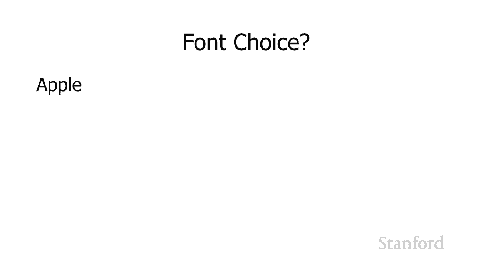

undefined，undefined。

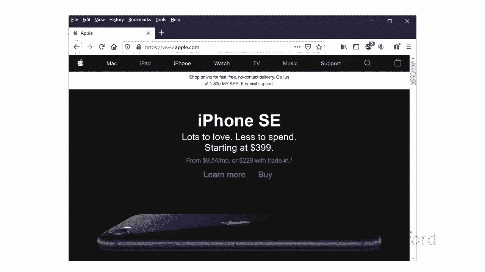

，我们开始吧，我们开始吧，苹果页面顶部没有衬线， 如果，苹果页面顶部没有衬线， 如果，我们进一步向下滚动，你会看到，我们进一步向下滚动，你会看到，是，是，的，苹果根本没有系列，的，苹果根本没有系列。

他们想要当代乐观的外观，他们想要当代乐观的外观，他们对成为，他们对成为，老派的，老派的。

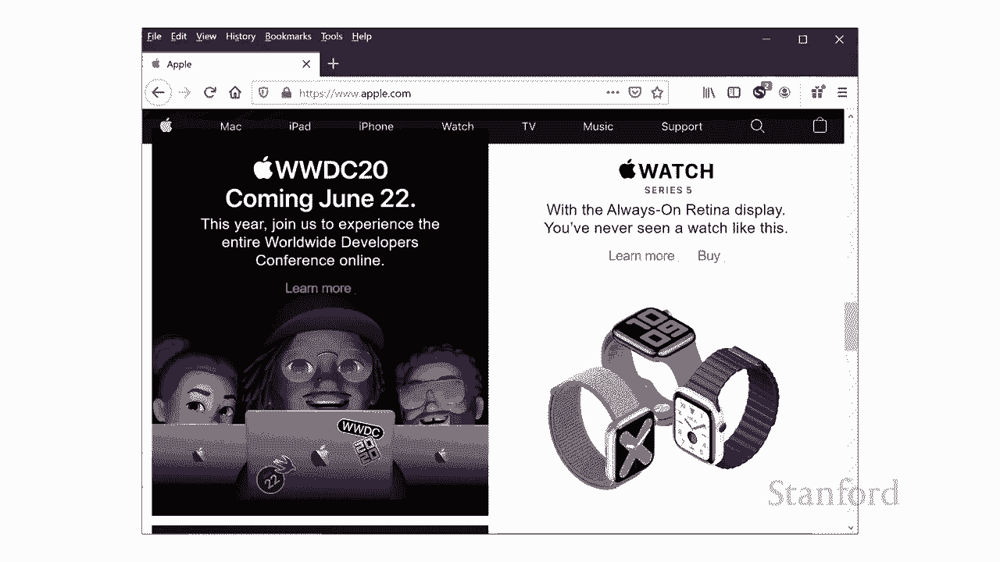

权威正式不感兴趣，不是苹果，权威正式不感兴趣，不是苹果，好吧，这里还有一个，普通话，好吧，这里还有一个，普通话，东方纽约，这是一个 纽约的五星级，东方纽约，这是一个 纽约的五星级，undefined。

undefined，酒店你认为他们会选择什么样的字体。

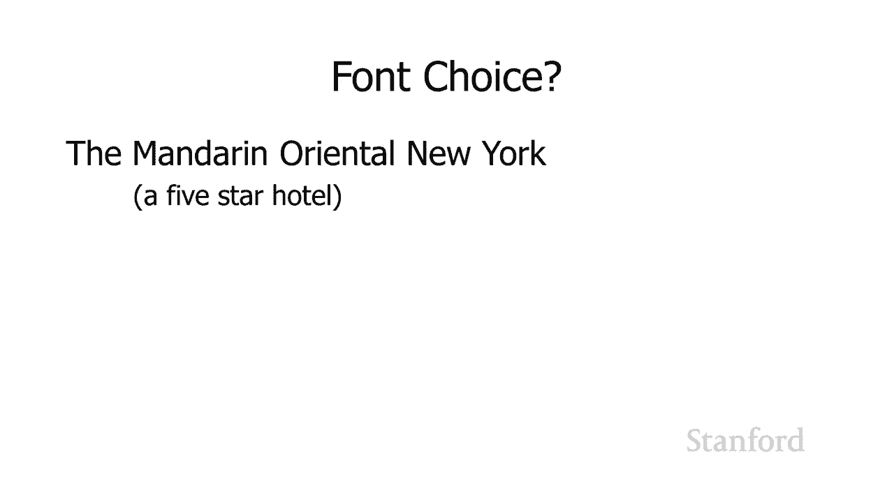

undefined，undefined，所以你去吧，这，所以你去吧，这，主要是，主要是，衬线字体，有一些无衬线字体，所以，衬线字体，有一些无衬线字体，所以，如果你从顶部看，如果你从顶部看，嗯。

他们的顶部酒吧确实有无，嗯，他们的顶部酒吧确实有无，衬线 - 衬线字体，事实上，如果您要单击也有无衬线字体，衬线 - 衬线字体，事实上，如果您要单击也有无衬线字体，的菜单，的菜单，但，但，纽约，纽约。

以及网站的其余部分，以及网站的其余部分。

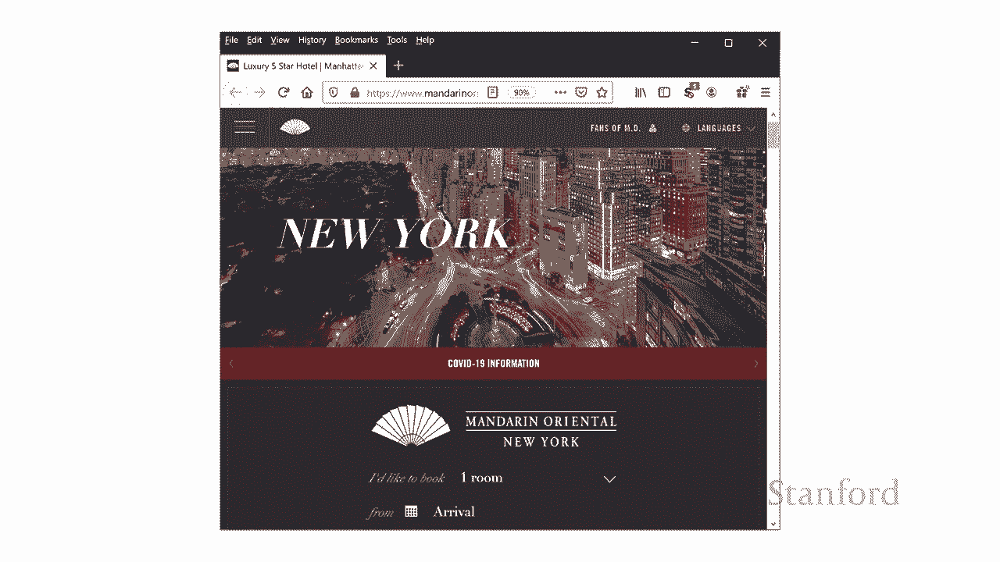

都有衬线字体，都有衬线字体，我提到了等宽字体，所以让我们，我提到了等宽字体，所以让我们，谈谈等宽字体，谈谈等宽字体，因此您的主要选择 是 serif 或，因此您的主要选择 是 serif 或。

sans-serif，sans-serif，还有另一种字体等宽字体，还有另一种字体等宽字体，实际上模型空间字体可以有，实际上模型空间字体可以有，衬线，或者它们可以是 monospace 字体中的无衬线。

衬线，或者它们可以是 monospace 字体中的无衬线，所有字符，所有字符，的宽度都相同，的宽度都相同，所以这里我有一个非等宽字体 字体，所以这里我有一个非等宽字体 字体，并注意，并注意。

miwim 注意，miwim 注意，眼睛比 m 窄得多，眼睛比 m 窄得多，你知道这正是你所，你知道这正是你所，期望的，所以这种字体，期望的，所以这种字体，其中 ms 和 i 的大小不同。

其中 ms 和 i 的大小不同，这被称为可变宽度，这被称为可变宽度，或比例字体，或比例字体，[音乐，[音乐，] 相比之下，这是一个等宽字体，我，] 相比之下，这是一个等宽字体，我，undefined。

undefined，在底部有 miwim，在底部有 miwim，如果你看起来有点难以，如果你看起来有点难以，确定，但你可以看到，确定，但你可以看到，那里的眼睛，那里的眼睛，比我们的，比我们的。

非等宽字体要宽得多 字体所以 um，非等宽字体要宽得多 字体所以 um，miwim，miwim，看起来在底部字体上，那些，看起来在底部字体上，那些，眼睛比，眼睛比，非等宽字体宽得多，事实上。

非等宽字体宽得多，事实上，如果我们在这里反转字母，我们肯定可以看到这一点，如果我们在这里反转字母，我们肯定可以看到这一点，所以这是我们的变量，字体，所以这是我们的变量，字体，miwim，miwim。

后跟 imiwi，后跟 imiwi，这两个引用，这两个引用，每个单词有五个字母，你，每个单词有五个字母，你，可以看到第二个，可以看到第二个，因为它有很多，因为它有很多，超窄的眼睛比上面的要短得多。

undefined，undefined，现在我们切换到等宽字体，现在我们切换到等宽字体，你可以看到这些 实际上，你可以看到这些 实际上，都是相同的宽度，所以这就是，都是相同的宽度，所以这就是。

等宽字体背后的基本思想 一个，等宽字体背后的基本思想 一个，所有字符的宽度都，所有字符的宽度都，相同 空格字体的数量通常，相同 空格字体的数量通常，undefined，undefined。

用于表示程序代码或，用于表示程序代码或，计算机输出，所以，计算机输出，所以，如果我们有我们的 html 源，我，如果我们有我们的 html 源，我，实际上有 没有在，实际上有 没有在。

undefined，undefined，我们所有的代码中使用等宽字体，主要是因为等宽，我们所有的代码中使用等宽字体，主要是因为等宽，字体占用了大量空间，字体占用了大量空间。

但在计算机代码中使用等宽字体是很常见的，但在计算机代码中使用等宽字体是很常见的，事实上，undefined，undefined，例如，如果您查看编辑器，那么这里是，例如，如果您查看编辑器，那么这里是。

Visual Studio 代码和默认值，Visual Studio 代码和默认值，undefined，undefined，在这些专为程序员使用而设计的编辑器中的任何一个上设置 uh。

在这些专为程序员使用而设计的编辑器中的任何一个上设置 uh，将使用，将使用，某种单空间字体，某种单空间字体，它只会更容易让，它只会更容易让，所有内容都排列，所有内容都排列。

整齐所以我们的下一个主题是选择，整齐所以我们的下一个主题是选择，配色方案，配色方案，并了解如何 要，并了解如何 要，选择配色方案，选择配色方案，我们实际上需要，我们实际上需要，更多地了解色彩理论。

因此我们一直在，更多地了解色彩理论，因此我们一直在，使用红色绿色和蓝色 rgb，而 rgb，使用红色绿色和蓝色 rgb，而 rgb，是计算机显示器实际，是计算机显示器实际，创建颜色的方式，但。

创建颜色的方式，但，t 这是，t 这是，考虑颜色的其他方法，其中之一，考虑颜色的其他方法，其中之一，是巨大的饱和度亮度或 hsb，是巨大的饱和度亮度或 hsb，方案，这就是我们将要使用的方案。

undefined，undefined，所以 hsb 的第一部分是，所以 hsb 的第一部分是，色调，因此您可以选择 将，色调，因此您可以选择 将，色调视为彩虹，色调视为彩虹，的颜色，即色谱的颜色。

的颜色，即色谱的颜色，undefined，undefined，除了选择色调之外，我，除了选择色调之外，我，还可以改变饱和度，还可以改变饱和度，所以我们在这里看到的是，所以我们在这里看到的是。

左边我有完全饱和度，我正在，左边我有完全饱和度，我正在，降低最右边的饱和度，降低最右边的饱和度，我几乎没有饱和度，我几乎没有饱和度，如果我把饱和度降低得足够多，如果我把饱和度降低得足够多。

除了控制饱和度，除了控制饱和度，我最终会得到白色，我还可以控制 亮度，所以，我最终会得到白色，我还可以控制 亮度，所以，这就是我们在最左边看到的，这就是我们在最左边看到的，我有最大亮度，我有最大亮度。

我的光线越来越少，然后，我的光线越来越少，然后，在最右边我没有亮度，在最右边我没有亮度，undefined，undefined，所以我建议 rgb 这，所以我建议 rgb 这。

就是 电脑显示器实际上是 ates，就是 电脑显示器实际上是 ates，colors 和 hsb，colors 和 hsb，呃是人们经常用来，呃是人们经常用来，选择，选择。

确定他们的配色方案应该是什么的方案，确定他们的配色方案应该是什么的方案，所以，所以，你可能想，undefined，undefined，知道我们现在向你展示的 rgb 和 hsb 之间的关系是什么。

知道我们现在向你展示的 rgb 和 hsb 之间的关系是什么，老实说它只是一个，老实说它只是一个，从一个，从一个，到另一个的简单数学公式 所以你知道，到另一个的简单数学公式 所以你知道。

我们不是在谈论创造，我们不是在谈论创造，不同的颜色 我们只是在，不同的颜色 我们只是在，谈论一种不同的方式来，谈论一种不同的方式来，思考颜色，思考颜色，所以基于我们目前所知的一种。

所以基于我们目前所知的一种，可能的配色方案，可能的配色方案，是 只需选择一种色调，然后，是 只需选择一种色调，然后，通过，通过，降低饱和度或增加或，降低饱和度或增加或，降低亮度来改变颜色，因此这将被。

降低亮度来改变颜色，因此这将被，称为单色配色方案，称为单色配色方案，这当然有效，这当然有效，它看起来不会很糟糕，但，它看起来不会很糟糕，但，也可能看起来不那么令人兴奋，也可能看起来不那么令人兴奋。

你知道这可能不是你，你知道这可能不是你，想要，想要，的我们其他配色方案的方式呃我们想，的我们其他配色方案的方式呃我们想，undefined，undefined，了解一下如何选择，了解一下如何选择，色调。

色调，通常我们会选择我们自己的，通常我们会选择我们自己的，色调 所谓的色轮，色调 所谓的色轮，让我们开始创建一个色轮，让我们开始创建一个色轮，我将从我们的三，我将从我们的三，基色开始 记住。

基色开始 记住，在计算机上我们使用的是加，在计算机上我们使用的是加，色 所以我们在计算机上的三基色，色 所以我们在计算机上的三基色，是红绿蓝，是红绿蓝，然后我要做的是，然后我要做的是，混合颜色 我要把。

混合颜色 我要把，undefined，undefined，每种颜色和旁边的颜色，每种颜色和旁边的颜色，混合 所以我要把，混合 所以我要把，红色和蓝色混合得到某种形式的，红色和蓝色混合得到某种形式的。

紫色，紫色，我 我将绿色，我 我将绿色，与红色混合，这将使我变成黄色，与红色混合，这将使我变成黄色，我将，我将，绿色与蓝色混合，这，绿色与蓝色混合，这，实际上会给我青色，实际上会给我青色。

并将三种颜色中的每一种，并将三种颜色中的每一种，与其最近的邻居混合，与其最近的邻居混合，从而为我们提供六种颜色 轮，从而为我们提供六种颜色 轮，这就是我们在这里看到的，这就是我们在这里看到的。

然后我可以再做一次，这将使，然后我可以再做一次，这将使，我获得 12 色色轮，然后，我获得 12 色色轮，然后，我可以根据需要继续进行多次，我可以根据需要继续进行多次，事实上，事实上。

如果你要看看 adobe，如果你要看看 adobe，photoshop，photoshop，和许多其他绘画程序，和许多其他绘画程序，它们内置了色轮，它们内置了色轮，呃这里的外环我们看到的。

呃这里的外环我们看到的，是，是，呃我们看到，undefined，undefined，了一遍又一遍地将，了一遍又一遍地将，颜色与其最近的邻居混合产生的色轮，直到，颜色与其最近的邻居混合产生的色轮，直到。

我们在这里得到连续的颜色范围，我们在这里得到连续的颜色范围，然后是中间的三角形，然后是中间的三角形，这实际上，这实际上，是饱和度和亮度，是饱和度和亮度，所以左下角没有亮度，所以左下角没有亮度。

然后左上角没有饱和度，然后左上角没有饱和度，所以你可以玩弄，undefined，undefined，你想要多少，你想要多少，饱和度和亮度，那么我们将如何使用这种，饱和度和亮度，那么我们将如何使用这种。

颜色 色轮可以很好地创建配色方案，undefined，undefined，可以，可以，使用色轮创建多种不同的配色方案 一种配色方案，使用色轮创建多种不同的配色方案 一种配色方案。

选择 最简单的配色方案选择，选择 最简单的配色方案选择，互补色中的互补，互补色中的互补，色，色，我们在色轮的一侧取一种颜色，我们在色轮的一侧取一种颜色，然后我们选择一种 颜色，然后我们选择一种 颜色。

在色轮的正对面，在色轮的正对面，所以，所以，这里我们有蓝色和黄色，这里我们有蓝色和黄色，如果你有任何朋友或者你有一个，如果你有任何朋友或者你有一个，兄弟或姐妹，兄弟或姐妹，在你的一个 加州大学。

在你的一个 加州大学，学校的，学校的，大部分加州大学，大部分加州大学，学校都有这种，学校都有这种，蓝色和黄色配色方案的一些变化，所以，蓝色和黄色配色方案的一些变化，所以，加州大学有深蓝色和金色。

加州大学有深蓝色和金色，我们在这里展示的颜色非常，我们在这里展示的颜色非常，接近加州大学欧文分校的颜色，接近加州大学欧文分校的颜色，我认为加州大学有更多 粉，我认为加州大学有更多 粉，蓝色和，蓝色和。

黄色或金色，嗯，所以，黄色或金色，嗯，所以，undefined，undefined，另一方面，如果你，undefined，undefined，看看这东西应该与我们的，看看这东西应该与我们的，红衣主教。

红衣主教，很好地匹配，据我所知，这，很好地匹配，据我所知，这，表明我们应该有一些，表明我们应该有一些，青色的变化，青色的变化，呃我个人认为这，呃我个人认为这，看起来很糟糕所以，看起来很糟糕所以。

哦好吧但无论如何这是你，哦好吧但无论如何这是你，创建互补配色方案的，创建互补配色方案的，另一件事如果你，另一件事如果你，想要两种以上的颜色你可以使用，想要两种以上的颜色你可以使用，拆分互补方案。

拆分互补方案，等等 发生在这里是我，等等 发生在这里是我，在色轮的一侧取了一种颜色，我在色轮的另一侧选择了，在色轮的一侧取了一种颜色，我在色轮的另一侧选择了，两种颜色，两种颜色，你可以在，你可以在。

相反，相反，的两种颜色之间玩转，的两种颜色之间玩转，色轮的一侧以获得一些，色轮的一侧以获得一些，undefined，undefined，或者您可以使用三色配色方案，或者您可以使用三色配色方案。

其中所有三种颜色，其中所有三种颜色，在色轮上的距离相等，在色轮上的距离相等，或者您可以使用类似的配色，或者您可以使用类似的配色，方案，其中您选择的，方案，其中您选择的，颜色接近 彼此在色轮上。

颜色接近 彼此在色轮上，我的意思是你可以用那个角度再玩一次，undefined，undefined，我只有 12 种颜色所以，我只有 12 种颜色所以，你不能用这个角度做很多但是。

你不能用这个角度做很多但是，你知道你是否要使用那个，你知道你是否要使用那个，更细的颗粒，更细的颗粒，photoshop 色轮具有，photoshop 色轮具有，多种色调，多种色调，您可以随意调整角度并。

您可以随意调整角度并，undefined，undefined，好吧，我想提到的最后一件事，好吧，我想提到的最后一件事，是，是，布局和导航问题，因此，布局和导航问题，因此。

您知道在创建 Web 时尽量确保，undefined，undefined，呃你对人们将如何浏览你的网站有一个清晰的想法的，undefined，undefined，页面在任何一个页面上提供一个。

页面在任何一个页面上提供一个，undefined，undefined，关于网站上其他可用内容的清晰感，关于网站上其他可用内容的清晰感，undefined，undefined，正如我之前提到的。

正如我之前提到的，如果你有一个 一个成功的，如果你有一个 一个成功的，网站，你会让人们深度，网站，你会让人们深度，链接到你的网页，链接到你的网页，所以你的任何一个网页都应该，所以你的任何一个网页都应该。

让访问那个特定页面的人清楚，undefined，undefined，你的网站上还有很多其他可用的东西，你的网站上还有很多其他可用的东西，你应该让它非常 清楚如何，你应该让它非常 清楚如何。

进入主页并有一些想法让，进入主页并有一些想法让，他们了解，他们了解，您网站的其他部分，您网站的其他部分，提供了一致的导航方案，提供了一致的导航方案，因此，因此，他们不必每次，他们不必每次。

从一个页面转到下一个页面时都像，从一个页面转到下一个页面时都像，天哪 我不明白我，天哪 我不明白我，应该点击什么去下一个地方，应该点击什么去下一个地方，undefined，undefined。

而且我没有任何死胡同，而且我没有任何死胡同，没有出路，这是，没有出路，这是，你知道的，你知道的，undefined，undefined，我在这里的时间里已经对很多业余网站进行了评分 在斯坦福，这。

我在这里的时间里已经对很多业余网站进行了评分 在斯坦福，这，是我经常看到的事情之一，我，是我经常看到的事情之一，我，undefined，undefined，经常看到人们有网页，经常看到人们有网页，但。

但，不清楚如何访问该网页，嗯，不清楚如何访问该网页，嗯，如果我们没有，如果我们没有，在我们实际计算文件时 重新尝试给他们的，在我们实际计算文件时 重新尝试给他们的，项目打分，就像，项目打分，就像。

他一样 你我看过网站上的另一个网页，他一样 你我看过网站上的另一个网页，看看他们在这里有这个额外的，看看他们在这里有这个额外的，html 文件，我想知道我，html 文件，我想知道我。

应该如何获得这个文件，应该如何获得这个文件，如果不是因为，如果不是因为，我们实际上查看了 html 文件，我们实际上查看了 html 文件，我们不会你知道我们只是完全，我们不会你知道我们只是完全。

错过它我们从主页开始，错过它我们从主页开始，我们访问所有有，我们访问所有有，明确链接的页面，明确链接的页面，然后还有这个额外的页面你，然后还有这个额外的页面你，知道没有人知道如何到达。

知道没有人知道如何到达，所以呃不要这样做，undefined，undefined，人们不清楚如何到达的页面是非常，人们不清楚如何到达的页面是非常，无用的，同样，无用的，同样，你不希望有人，你不希望有人。

点击页面的页面，离开该页面的唯一方法，点击页面的页面，离开该页面的唯一方法，undefined，undefined，是点击后退，是点击后退，按钮，因为，按钮，因为，你 知道呃，如果有人最终，你 知道呃。

如果有人最终，链接到该页面，他们将无法，undefined，undefined，离开该页面，离开该页面，将无法找到通往您网站其余部分的方法，将无法找到通往您网站其余部分的方法，所以，所以。

undefined，undefined，好的，这就是我们。

