# 【双语字幕+资料下载】斯坦福CS105 ｜ 计算机科学导论(2021最新·完整版) - P48：L16.2- Python 介绍：我们的第一个 Python程序 - ShowMeAI - BV1eh411W72E

undefined，欢迎探索计算，欢迎探索计算，今天的视频介绍了，今天的视频介绍了，我们的第一个 Python 程序 python，因此在上一个，我们的第一个 Python 程序 python。

因此在上一个，视频中，我们看到了，视频中，我们看到了，如何将 python shell 用作，如何将 python shell 用作。

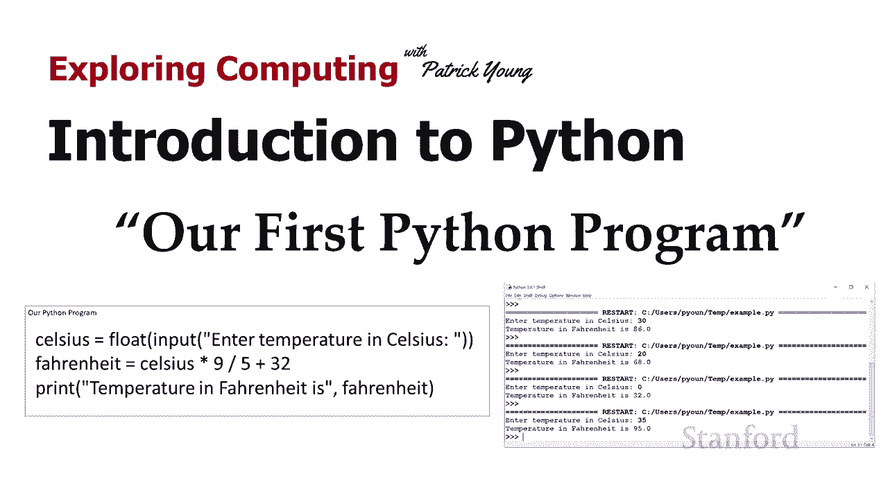

基本的超级计算器，基本的超级计算器，并且我们玩弄了一堆，并且我们玩弄了一堆，不同的公式，例如摄氏度乘以 9，不同的公式，例如摄氏度乘以 9，除以 5 加上 32，除以 5 加上 32，是公里乘以 0。

621，是公里乘以 0。621，但是我们上次这样做的方式，但是我们上次这样做的方式，有一点问题因为，有一点问题因为，我们每次想要使用它们时都需要重新输入这些公式，undefined，undefined。

所以你知道我建议你最后，所以你知道我建议你最后，一次，一次，可以 使用 python shell 作为，可以 使用 python shell 作为，基本的超级计算器，基本的超级计算器。

但这并没有真正创建一个程序，但这并没有真正创建一个程序，以便将它们转换成程序，以便将它们转换成程序。

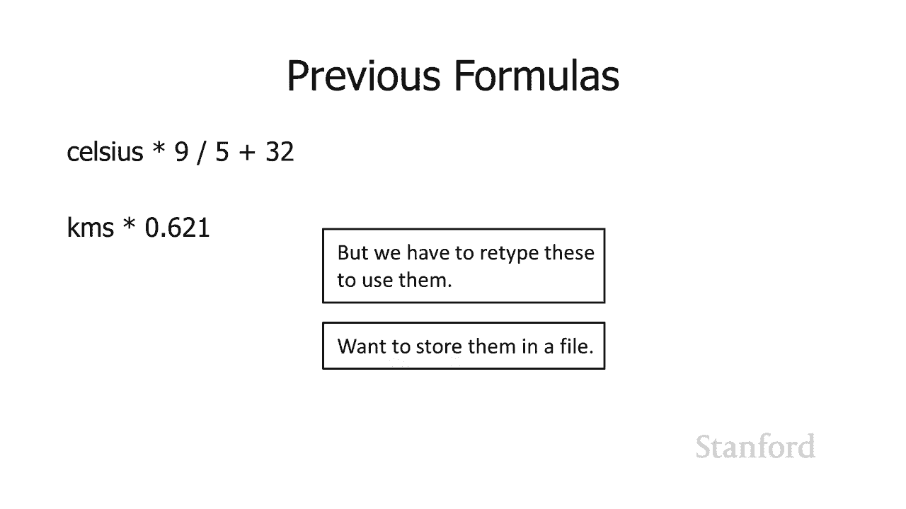

我们需要将它们存储到一个文件中，并，我们需要将它们存储到一个文件中，并，能够在我们需要的时候重用它们，能够在我们需要的时候重用它们，所以结果证明 idle 有一个内置的- 在。

所以结果证明 idle 有一个内置的- 在，文件编辑器中，正如我建议的，文件编辑器中，正如我建议的，最后一个视频，因此，如果您正在，最后一个视频，因此，如果您正在，运行空闲，运行空闲，um。

请参阅上一个视频，um，请参阅上一个视频，了解如何运行空闲，了解如何运行空闲，um 的说明，因此，如果您转到文件菜单，则有，um 的说明，因此，如果您转到文件菜单，则有，一个选项可以创建新文件 因此。

一个选项可以创建新文件 因此，如果您继续这样做，如果您继续这样做，编辑器将启动，您将，编辑器将启动，您将，看到现在底部显示的内容，看到现在底部显示的内容，undefined，undefined。

undefined，undefined。

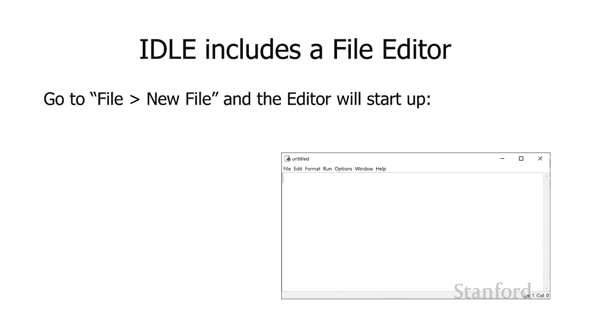

undefined，undefined，基本上只是，基本上只是，将一堆数字加，将一堆数字加，在一起，所以说我说，在一起，所以说我说，3 加 2 然后继续将其，3 加 2 然后继续将其。

放入我们的编辑器中，放入我们的编辑器中，当我们尝试通过转到，undefined，undefined，编辑器中的运行菜单并说运行模块来运行它时，编辑器中的运行菜单并说运行模块来运行它时。

它会 询问我们是否要保存，它会 询问我们是否要保存，文件，我将继续并将，文件，我将继续并将，文件保存为，文件保存为，example。py python，example。py python。

文件以扩展名 py 存储，文件以扩展名 py 存储。

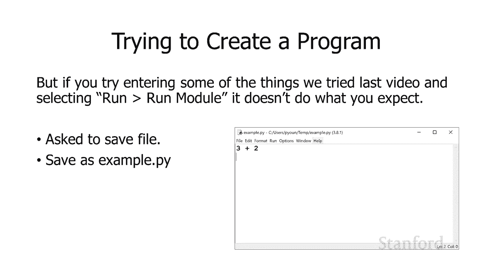

，然后如果我继续并通过，然后如果我继续并通过，再次选择运行，再次选择运行，运行模块来运行它，它不会执行什么操作 我希望，运行模块来运行它，它不会执行什么操作 我希望，这是实际会显示的内容。

这是实际会显示的内容，因此如果您查看该行并，因此如果您查看该行并，在那里重新启动，在那里重新启动，您会看到它正在尝试运行，您会看到它正在尝试运行，我的 example。py，我的 example。py。

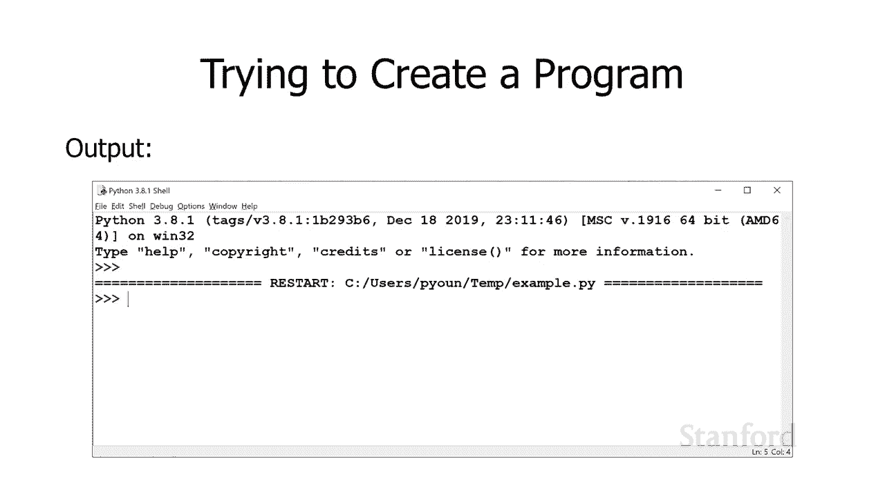

文件，但没有输出，undefined，undefined，我们需要的 Python 程序中发生的情况，我们需要的 Python 程序中发生的情况，明确告诉，明确告诉，python 我们想输出到我们的。

python 我们想输出到我们的，shell 解释器，所以，shell 解释器，所以，我可以用所谓的打印函数来做到这一点，我可以用所谓的打印函数来做到这一点，所以，所以，在这里它就在这里我。

在这里它就在这里我，要说打印然后我有一对，要说打印然后我有一对，括号，在括号之间，括号，在括号之间，我说什么 我希望它在这种，我说什么 我希望它在这种，情况下打印我希望它打印三加二。

情况下打印我希望它打印三加二。

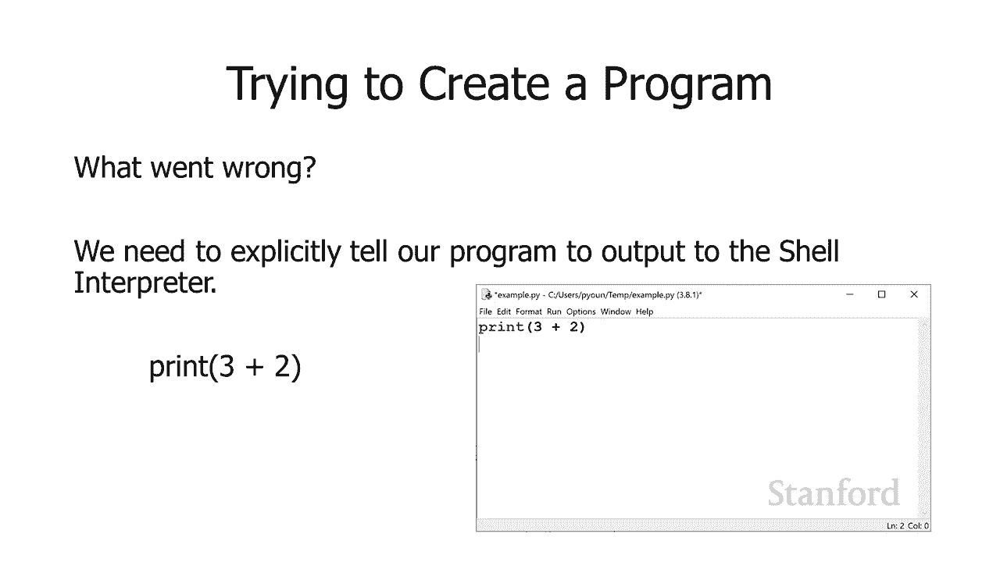

所以我说打印括号三加，所以我说打印括号三加，undefined，undefined，二 现在如果我运行它如果你，二 现在如果我运行它如果你，第二次向下看我，第二次向下看我，运行它，运行它。

你可以看到 它正在打印一个 5，你可以看到 它正在打印一个 5，所以这就是我们现在想要做的事情，所以这就是我们现在想要做的事情，我正在打印，我正在打印。

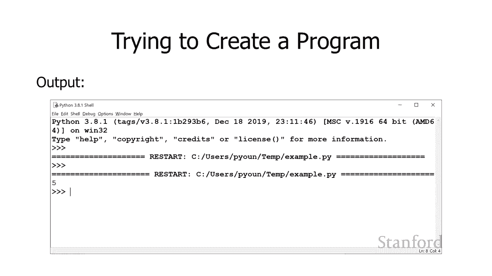

进行数学方程的结果，进行数学方程的结果，我可以输出其他东西 记得上一，我可以输出其他东西 记得上一，堂课我们谈到，堂课我们谈到，了 Python 与整数，了 Python 与整数。

一起工作的事实 浮点数它，一起工作的事实 浮点数它，也适用于，也适用于，允许操作文本的字符串，所以，允许操作文本的字符串，所以，我在底部得到的内容，我在底部得到的内容。

print quote go stanford quote 请记住，print quote go stanford quote 请记住，这些引号表明，这些引号表明，我有一串字符 go space。

我有一串字符 go space，undefined，undefined，sta 和 for 和 d 而不是，sta 和 for 和 d 而不是，我有  一些名为 go 的变量和一个。

我有  一些名为 go 的变量和一个，名为 stanford 的变量，名为 stanford 的变量，所以如果我继续说 print 并，所以如果我继续说 print 并，告诉它打印，告诉它打印。

字符串 go stanford 实际上这，字符串 go stanford 实际上这。

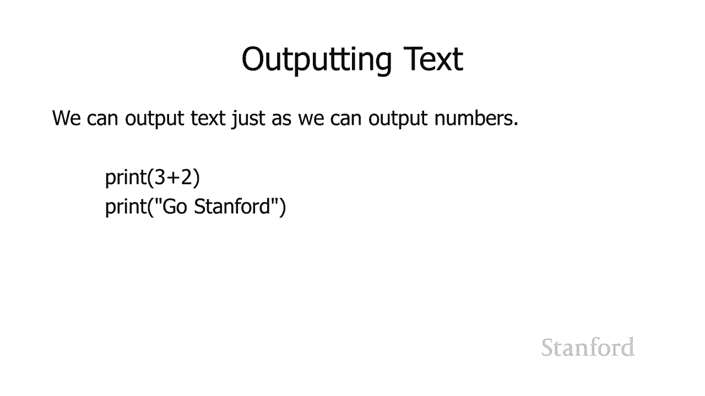

正是它会做的，所以我，正是它会做的，所以我，打印了三加二，我打印了 go，打印了三加二，我打印了 go。

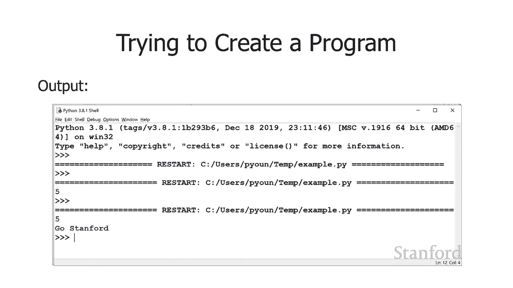

stanford 如果我们向下看，stanford 如果我们向下看，底部，您可以看到它打印了这两个都，底部，您可以看到它打印了这两个都，undefined，undefined，可以，所以上一课我们。

可以，所以上一课我们，将摄氏度转换为华氏度，所以让我们，将摄氏度转换为华氏度，所以让我们，创建一个小程序来，创建一个小程序来，为我们进行这种转换，这是我，为我们进行这种转换，这是我，第一次尝试这样做。

第一次尝试这样做，好吧，我继续 创建一个，好吧，我继续 创建一个，名为 celsius 的变量我在其中存储 30，名为 celsius 的变量我在其中存储 30，嗯我在那里进行我的小计算。

嗯我在那里进行我的小计算，undefined，undefined，并将结果存储在变量，并将结果存储在变量，fahrenheit 然后，fahrenheit 然后，我有一个更高级，我有一个更高级，的，的。

打印语句的更高级版本这里引用温度，打印语句的更高级版本这里引用温度，和华氏度是，和华氏度是，结束引号逗号 然后是，结束引号逗号 然后是，变量 fahrenheit 的名称，它实际上。

变量 fahrenheit 的名称，它实际上，将打印这两个项目，将打印这两个项目，它将打印字符串，它将打印字符串。

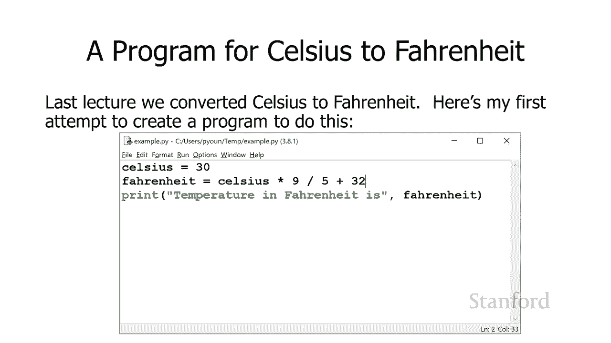

temperature 和 fahrenheit，然后，temperature 和 fahrenheit，然后，它会继续打印，它会继续打印，fahr  enheit，fahr  enheit。

如果我们继续进入，如果我们继续进入，undefined，undefined，编辑器中的运行菜单，我们选择运行模块，编辑器中的运行菜单，我们选择运行模块，这确实有效，它说，这确实有效，它说。

温度是华氏度是 86，温度是华氏度是 86，度，所以可以使用，度，所以可以使用，但是这里有一点，但是这里有一点。

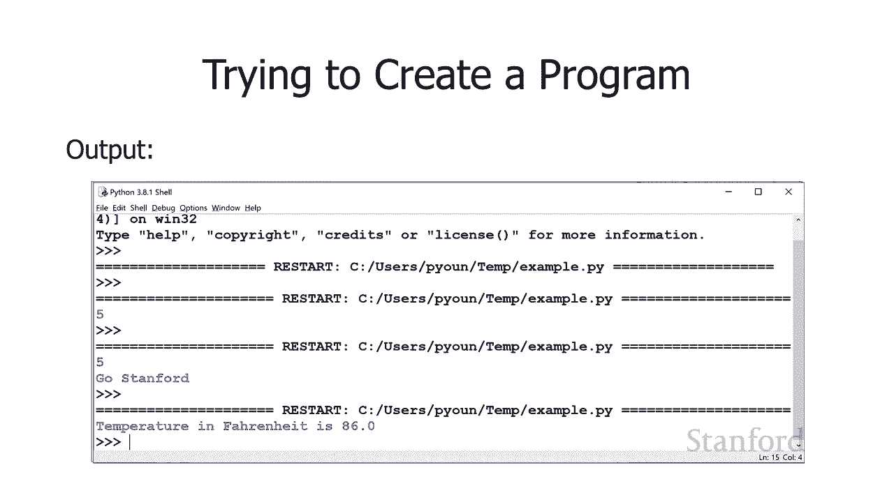

问题，问题，这就是我的程序 包括，这就是我的程序 包括，将 celsius 变量设置为 30。将 celsius 变量设置为 30。所以如果它总是 30 度，这个，所以如果它总是 30 度，这个。

程序就可以工作，程序就可以工作，但你知道如果它总是 30 度，但你知道如果它总是 30 度，undefined，undefined，那无论如何都不是很有用，因为如果它是 30 度。

那无论如何都不是很有用，因为如果它是 30 度，我可能很快就会发现这是 86，undefined，undefined，华氏度 每天，华氏度 每天，undefined，undefined。

我希望改变这一点，这样我就不会，我希望改变这一点，这样我就不会，总是在 celsius 等于 30 的情况下运行，而是，undefined，undefined。

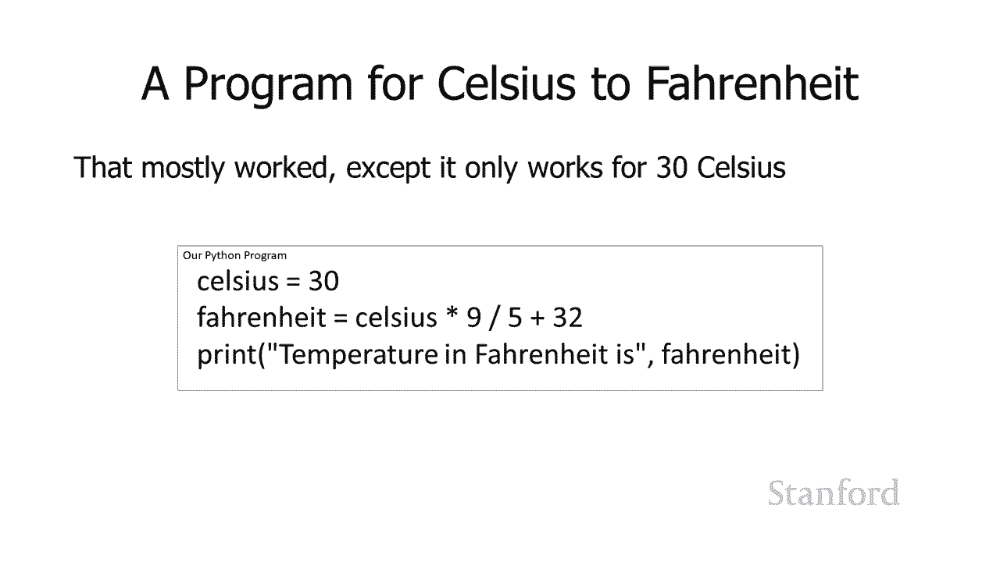

在 celsius 的不同温度下运行，为了，在 celsius 的不同温度下运行，为了，做到这一点，我需要，做到这一点，我需要，从用户那里获得输入，这是，从用户那里获得输入，这是，我们，我们。

获取输入的下一步 用户 我要在，获取输入的下一步 用户 我要在，这里使用这个新的输入函数 我，这里使用这个新的输入函数 我，要说输入，要说输入，我有一对括号，我有一对括号，在这对括号内我。

在这对括号内我，要在那里放一个字符串，要在那里放一个字符串，来提示用户，来提示用户，对于 t 我们想要的信息，所以在我们的，对于 t 我们想要的信息，所以在我们的，小例子中，我告诉用户，小例子中。

我告诉用户，我想要他们的信息，但，我想要他们的信息，但，我想让他们知道我想要的信息，我想让他们知道我想要的信息，是他们的名字，是他们的名字，当我继续执行这个，当我继续执行这个，输入函数时。

它是 将返回一个，输入函数时，它是 将返回一个，值给我，我可以将它存储到一个，值给我，我可以将它存储到一个，变量中，所以，变量中，所以，你知道我通常想说输入，你知道我通常想说输入。

输入你的名字我实际上会做，输入你的名字我实际上会做，我，我，在底部这里得到的我会说用户，在底部这里得到的我会说用户，下划线名字记住你可以，下划线名字记住你可以，在变量中使用下划线，在变量中使用下划线。

uh 用户下划线名称等于输入，uh 用户下划线名称等于输入，输入你的名字，输入你的名字，所以这里的代码会，所以这里的代码会，提示用户，提示用户，它会告诉用户我们想要，它会告诉用户我们想要。

他们的名字 他们会输入他们的名字，他们的名字 他们会输入他们的名字，以及他们输入的任何结果，以及他们输入的任何结果，将存储在变量 username，将存储在变量 username，中。

我可以将其用于其他目的，undefined，undefined，undefined，undefined，undefined，以摄氏度为单位输入，以摄氏度为单位输入，温度，所以，温度，所以。

你会注意到我这里有两行，呃，你会注意到我这里有两行，呃，为什么我有两，为什么我有两，行，问题是该输入，行，问题是该输入，函数旨在返回，函数旨在返回，字符串数据类型，所以如果用户输入，字符串数据类型。

所以如果用户输入，undefined，undefined，30 我不会得到数字 30，30 我不会得到数字 30，我实际上会得到，我实际上会得到，由 3 后跟一个 0 组成的字符串。

由 3 后跟一个 0 组成的字符串，我不能直接使用字符串，我不能直接使用字符串，输入数学公式，所以我，输入数学公式，所以我，需要将字符串，需要将字符串，三个零转换为 数字三个零。

三个零转换为 数字三个零，所以，所以，这就是这里的第二行，这就是这里的第二行，undefined，undefined，浮点数将在括号内取一些东西，浮点数将在括号内取一些东西，这就是我们，这就是我们。

所说的参数，所说的参数，它将取其参数并将其，它将取其参数并将其，转换为浮点数，因此，转换为浮点数，因此，在这种情况下，在这种情况下，它会将用户输入的，它会将用户输入的，任何字符串，任何字符串，作为输入。

并将其转换，作为输入，并将其转换，为实际数字，并将，为实际数字，并将，该值存储到 celsius 变量中，该值存储到 celsius 变量中，如果我们愿意，我们实际上可以，undefined。

undefined，摆脱中间变量 her  e temp 我，摆脱中间变量 her  e temp 我，可以将所有这些放在一行中 我可以说，可以将所有这些放在一行中 我可以说。

celsius 等于请求用户，celsius 等于请求用户，以摄氏度为单位输入温度，因此用户将以摄氏度为单位，以摄氏度为单位输入温度，因此用户将以摄氏度为单位，输入温度，输入温度，然后将返回。

然后将返回，用户已，用户已，返回的结果，例如字符串 3 0 将，返回的结果，例如字符串 3 0 将，立即传递，立即传递，给 float 并且 float，给 float 并且 float。

会将其从字符串引用，会将其从字符串引用。

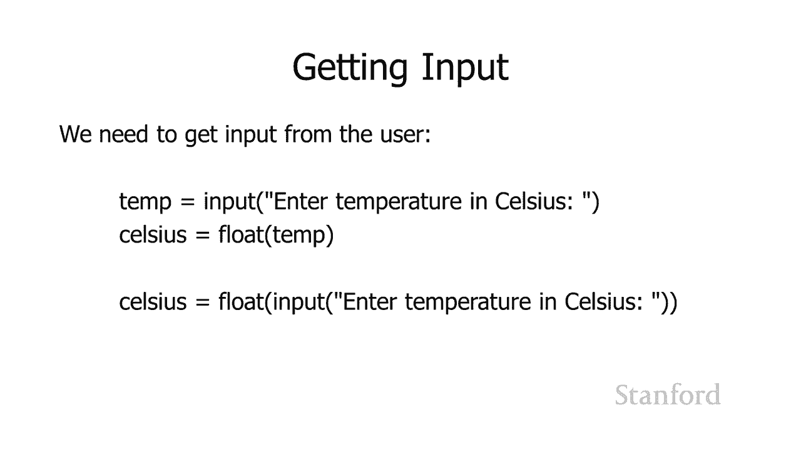

3 0 转换为数字 3 0 ，我们可以，3 0 转换为数字 3 0 ，我们可以，在数学公式中使用，所以，在数学公式中使用，所以，这是我们的程序，这是我们的程序，所以我将继续并要求，所以我将继续并要求。

用户输入 摄氏温度，用户输入 摄氏温度，我将转换为，我将转换为，浮点数 我将把它存储在一个，浮点数 我将把它存储在一个，叫做 celsius 的变量或存储位置，叫做 celsius 的变量或存储位置。

undefined，undefined，中 我将检索存储，中 我将检索存储，位置 celsius 我将把，位置 celsius 我将把，它乘以 9 除 到 5 并加上 32。

它乘以 9 除 到 5 并加上 32，我将把结果以，我将把结果以，华氏度存储，我将继续，华氏度存储，我将继续，undefined，undefined。

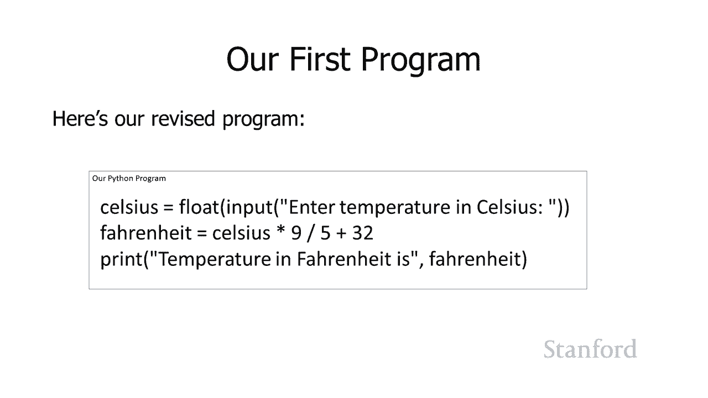

以华氏度为单位打印温度，然后，以华氏度为单位打印温度，然后，呃无论变量华氏度中的结果现在是什么，undefined，undefined，如果你看一下讲义我，如果你看一下讲义我，实际上已经 进一步。

实际上已经 进一步，走出这个嗯，所以你可以摆脱，走出这个嗯，所以你可以摆脱，这里的变量华氏度，这里的变量华氏度，只需将摄氏度乘以 9，只需将摄氏度乘以 9，除以 5 加 32 放在打印。

除以 5 加 32 放在打印，语句中，语句中，我们甚至可以更进一步，我们甚至可以更进一步，我们可以把 这一切都在一行中，我，我们可以把 这一切都在一行中，我，undefined，undefined。

打印温度和华氏度是，打印温度和华氏度是，然后浮动输入，然后浮动输入，以摄氏度，以摄氏度，乘以 9 除以 5 加 32 输入温度，乘以 9 除以 5 加 32 输入温度，我还没有这样做，实际上。

我还没有这样做，实际上，这是这个版本，这是这个版本，比 中的版本稍长的原因之一 讲义，比 中的版本稍长的原因之一 讲义，是因为，是因为，用于这些视频的字体要，用于这些视频的字体要。

大得多，而且它，undefined，undefined，在视频中的一行中不太适合，所以您知道一般我，在视频中的一行中不太适合，所以您知道一般我，建议您将其分解为，建议您将其分解为，更小的步骤。

这样更易于阅读，更小的步骤，这样更易于阅读。

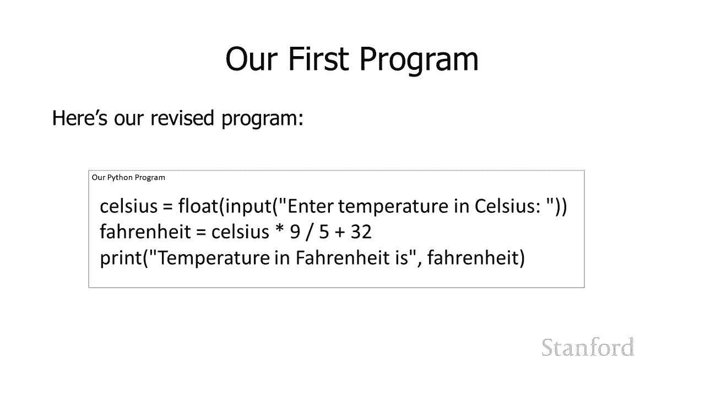

和 如果你，和 如果你，把这一切都塞进一行，就更难犯错误了，在，把这一切都塞进一行，就更难犯错误了，在，技术上可以，技术上可以，用一行代码编写整个程序，用一行代码编写整个程序，但人们很难，但人们很难。

弄清楚你在做什么，这，弄清楚你在做什么，这，将是 你很容易，将是 你很容易，不小心犯错，不小心犯错，而且，而且。

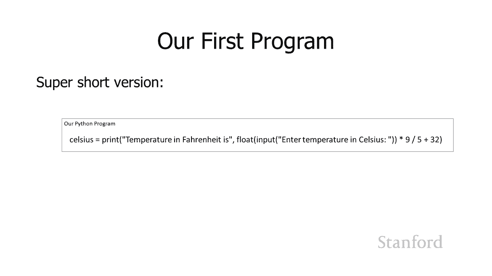

你要追查你的错误会有点困难，所以我真的不，你要追查你的错误会有点困难，所以我真的不，建议这样做，建议这样做，好吧，让我们继续运行这个，好吧，让我们继续运行这个，程序很多次，你可以 看到，程序很多次。

你可以 看到，呃每次它要求，呃每次它要求，我们输入摄氏度的温度，我们输入摄氏度的温度，所以在顶部我说它是 30，所以在顶部我说它是 30，度，它说太好了，度，它说太好了，这意味着华氏温度。

这意味着华氏温度，是 86。然后我重新运行它并说，是 86。然后我重新运行它并说，输入 摄氏温度 我将它设置为 20，输入 摄氏温度 我将它设置为 20，度，度，说好的很好，华氏 68 度的温度。

说好的很好，华氏 68 度的温度，你知道，你知道，如果天堂禁止，如果天堂禁止，摄氏温度为零，摄氏温度为零，这意味着华氏温度，这意味着华氏温度，是 32 度等等，是 32 度等等。

所以我们已经创建了我们的第一个程序，所以我们已经创建了我们的第一个程序，你可以看到，你可以看到，一旦我们编写了它，一旦我们编写了它，它就非常容易使用，而且比，它就非常容易使用，而且比。

一遍又一遍地重新键入公式要容易得多，undefined，undefined，当然，如果公式，当然，如果公式，更广泛，更广泛，它会为我们节省更多时间，所以这个，它会为我们节省更多时间，所以这个。

是什么 计算机真的，是什么 计算机真的，很擅长，很擅长，而且事实证明，python，undefined，undefined，在整个校园的科学实验室中得到了广泛的使用。

在整个校园的科学实验室中得到了广泛的使用，事实上，事实上，不同的部门，不同的部门，例如化学系，生物，例如化学系，生物，系，系，已经向计算机科学系强调过，已经向计算机科学系强调过，他们，他们。

真的会 喜欢我们教 Python，真的会 喜欢我们教 Python，这就是我们将，这就是我们将，cs106a 切换到 Python，cs106a 切换到 Python，的原因之一。

这是我们的第一个 Python，的原因之一，这是我们的第一个 Python，程序，程序，嗯，下一节课我们将扩展我们的，嗯，下一节课我们将扩展我们的，编程能力以做，编程能力以做，更多有趣的事情，但我认为。

更多有趣的事情，但我认为，这对今天来说已经足够了 这让，这对今天来说已经足够了 这让，你，你，了解编程是什么样子以及，了解编程是什么样子以及。

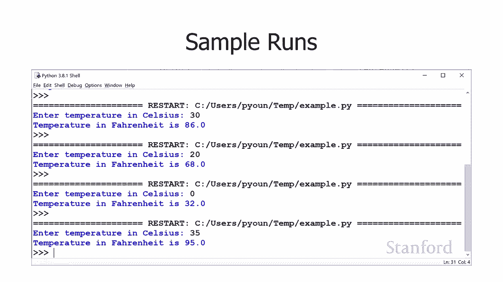

编程语言是如何工作的。

