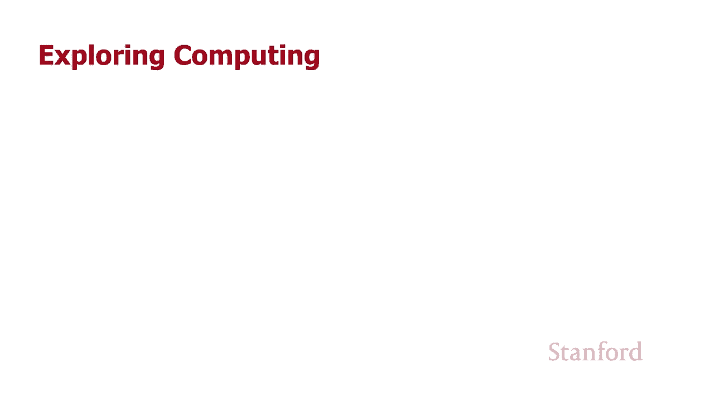
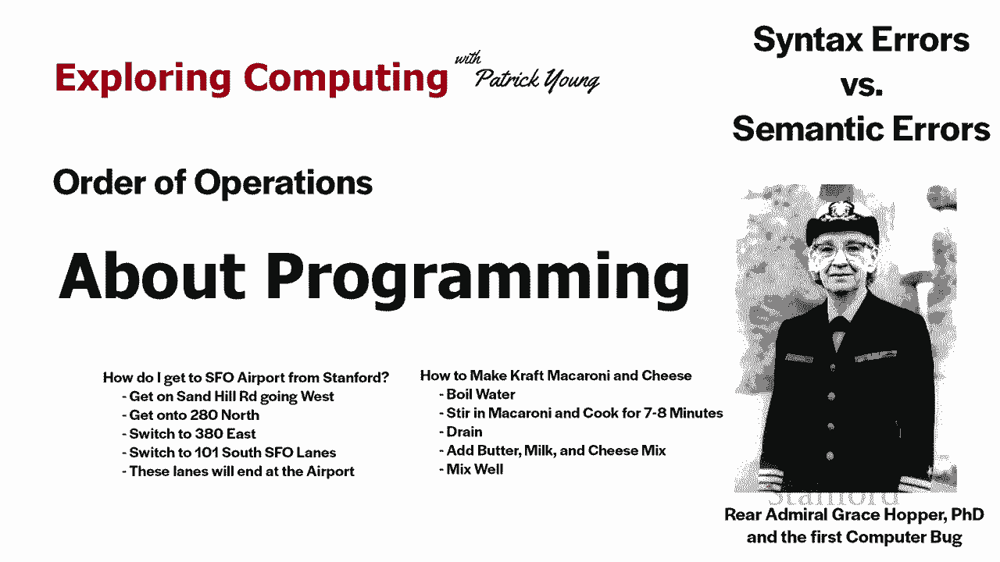
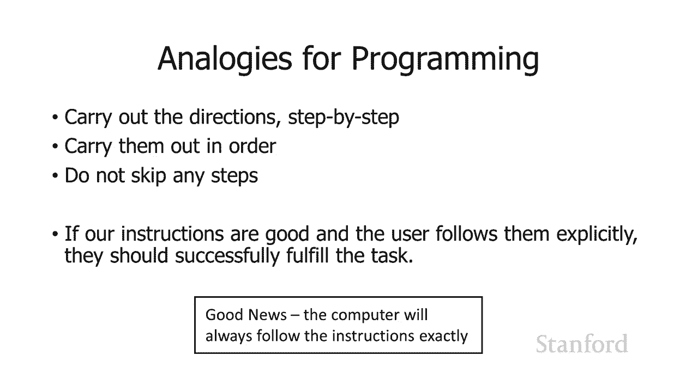
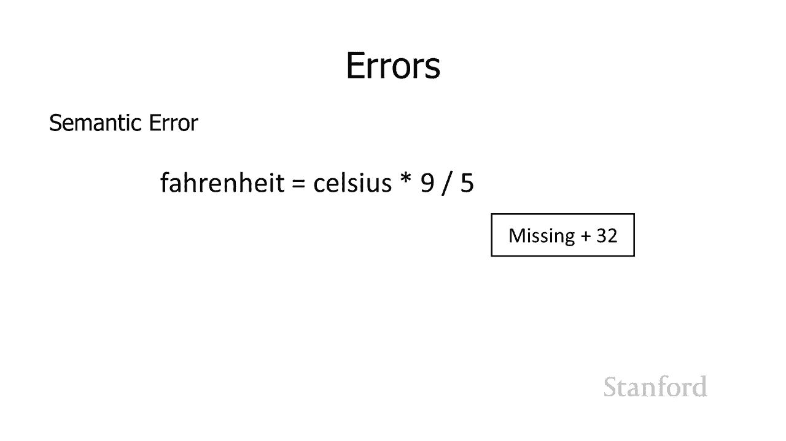
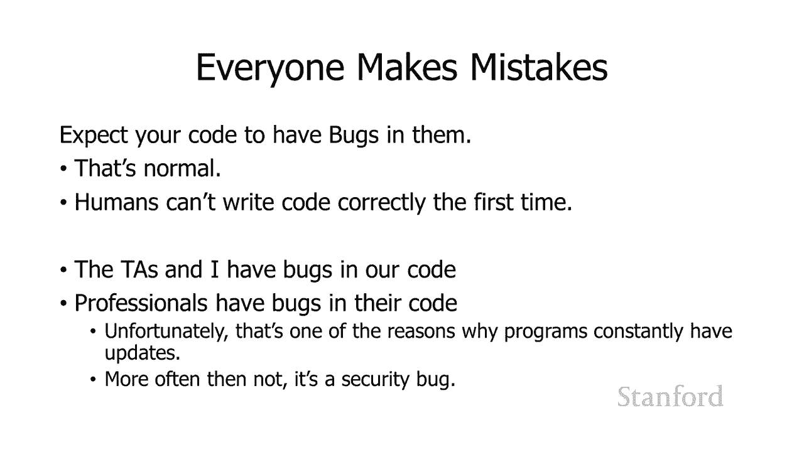

# 【双语字幕+资料下载】斯坦福CS105 ｜ 计算机科学导论(2021最新·完整版) - P49：L17.1- 关于编程 - ShowMeAI - BV1eh411W72E

undefined，欢迎探索计算，欢迎探索计算，今天的视频是关于编程的，今天的视频是关于编程的，所以除非你在整个编程过程之前编程，否则，所以除非你在整个编程过程之前编程，否则，整个编程过程看起来很。

整个编程过程看起来很，神秘、很奇怪、很不，神秘、很奇怪、很不，自然，自然，但，但，实际上我们做的许多不同的活动，实际上我们做的许多不同的活动，在很多方面都与编程非常相似，在很多方面都与编程非常相似。

所以我 我将从，所以我 我将从，谈论其中的几个开始，谈论其中的几个开始，所以，undefined，undefined，如果有人问我，如果有人问我，如何从斯坦福到，如何从斯坦福到，旧金山国际机场。

旧金山国际机场，undefined，undefined，我会说上沙山路向东旅行，我会说上沙山路向东旅行，undefined，undefined，直到你 上高速公路 上 280。

直到你 上高速公路 上 280，北，北，转 380 东转 101 南，转 380 东转 101 南，在 sfo 车道，你应该到达，在 sfo 车道，你应该到达，机场，机场，所以我已经给出了一系列指示。

所以我已经给出了一系列指示，如果我给出，如果我给出，指示的人遵循指示，指示的人遵循指示，正确地他们应该最终在，正确地他们应该最终在，sfo 另一个例子是，sfo 另一个例子是，烹饪所以这里是。

烹饪所以这里是，制作工艺通心粉和奶酪的说明，制作工艺通心粉和奶酪的说明，你把水煮沸哟 你加入，你把水煮沸哟 你加入，通心粉，煮 7 到 8，通心粉，煮 7 到 8，分钟，分钟，沥干水分。

加入黄油牛奶和奶酪，沥干水分，加入黄油牛奶和奶酪，混合物，混合物，然后再搅拌均匀，undefined，undefined，undefined，undefined，那边，那边，呃，对于这两项任务。

我们已经给出了，呃，对于这两项任务，我们已经给出了，一些，一些，应该逐步执行的指示，应该逐步执行的指示，并且它们，并且它们，将按照它们列出的顺序执行，将按照它们列出的顺序执行，这很重要，这很重要。

并且不要跳过任何一个，并且不要跳过任何一个，实际证明的步骤也很，实际证明的步骤也很，重要，重要，所以如果我们的指令很好，所以如果我们的指令很好，并且用户明确地遵循它们，并且用户明确地遵循它们。

他们应该成功地完成，他们应该成功地完成，undefined，undefined，我们给出的指令的任务，所以，我们给出的指令的任务，所以，这里的好消息是计算机将，这里的好消息是计算机将，始终遵循指令。

始终遵循指令，事实证明，事实证明，人类并非总是如此，人类并非总是如此，只是举一个相当，只是举一个相当，尴尬的例子，尴尬的例子，我记得我尝试做的第一件事，我记得我尝试做的第一件事，就是制作通心粉和奶酪。

就是制作通心粉和奶酪，我跳过了其中的一个 步骤，我跳过了其中的一个 步骤，是排水步骤，是排水步骤，最后我吃了卡夫通心粉和，最后我吃了卡夫通心粉和，奶酪汤，奶酪汤，这很恶心，这很恶心，如果我当时像五岁。

这将是一个有趣的故事，如果我当时像五岁，这将是一个有趣的故事，但我实际上在上，但我实际上在上，大学，所以，大学，所以，好吧，这不会，好吧，这不会，发生 电脑如果你告诉电脑，发生 电脑如果你告诉电脑。

排干通心粉，排干通心粉，undefined，undefined，所以呃另一件要记住的事情，所以呃另一件要记住的事情，是，是，我们有所以我在这里有我的小程序，我们有所以我在这里有我的小程序。

所以我说的计算机会，所以我说的计算机会，执行指令 按照列出的顺序，执行指令 按照列出的顺序，undefined，undefined，它会按照列出的顺序执行它们，undefined，undefined。

实际上最后一部分，实际上最后一部分，很重要，这，很重要，这，是我发现，是我发现，许多新程序员并没有付出太多意图的事情，undefined，undefined，因此，您列出，因此，您列出，计算机指令。

计算机指令，的顺序通常非常重要，因此，如果我们在，的顺序通常非常重要，因此，如果我们在，这里查看我们的小程序，这里查看我们的小程序，我会要求计算机，我会要求计算机，向用户询问摄氏温度。

向用户询问摄氏温度，我将小摄氏温度设为，我将小摄氏温度设为，华氏度 它转换然后我，华氏度 它转换然后我，继续打印，继续打印，出华氏温度，出华氏温度，如果我颠倒，如果我颠倒，这些语句中的任何一个的顺序。

我们，这些语句中的任何一个的顺序，我们，必须按照这个顺序发生，所以在下面的例子中，必须按照这个顺序发生，所以在下面的例子中，我问用户温度是多少，我问用户温度是多少，是摄氏度，是摄氏度，我用华氏温度打印。

undefined，undefined，然后我计算，然后我计算，出没有意义的华氏温度，所以，出没有意义的华氏温度，所以，在这种情况下，在这种情况下，如果我重新排序这些，排序非常重要，如果我重新排序这些。

排序非常重要，它不会起作用，我经常，它不会起作用，我经常，看到学生，看到学生，只是随机 重新排列他们的，只是随机 重新排列他们的，语句，因为它不起作用 他们，语句，因为它不起作用 他们。

认为如果他们只是重新排列它们，认为如果他们只是重新排列它们，也许会解决问题，也许会解决问题，您需要仔细考虑，您需要仔细考虑，顺序是什么以及为什么语句，顺序是什么以及为什么语句，按该顺序排列。

并在逻辑上将它们，按该顺序排列，并在逻辑上将它们，按正确的顺序排列，按正确的顺序排列，所以在这个特定的 例如，所以在这个特定的 例如，我们将总分钟数转换，undefined，undefined。

为小时数和分钟数，实际上在，为小时数和分钟数，实际上在，这种特殊情况下，这种特殊情况下，前两个语句的顺序，前两个语句的顺序，是 n 如果我，是 n 如果我，先计算小时数，先计算小时数，然后计算分钟数。

或者如果我，然后计算分钟数，或者如果我，按，按，undefined，undefined，实际可以按任一顺序实际进行的小时数计算分钟数，那么这很重要，实际可以按任一顺序实际进行的小时数计算分钟数。

那么这很重要，而最后一条，而最后一条，语句确实必须，语句确实必须，在前两个语句发生之后发生打印语句，所以，在前两个语句发生之后发生打印语句，所以，排序，排序，通常很重要，但并不总是很，通常很重要。

但并不总是很，重要 解决这个问题的最佳方法是，重要 解决这个问题的最佳方法是，从逻辑上思考，从逻辑上思考，这些语句中的每一个所做的事情，这些语句中的每一个所做的事情，是这个语句和下一个语句之间的顺序。

是这个语句和下一个语句之间的顺序，或者前一个语句中的这个，或者前一个语句中的这个，语句是那么重要，语句是那么重要，或 这不重要，或 这不重要，吗，正如我在上一堂课中所建议的，有一个，undefined。

undefined，编辑调试周期，我在其中编写或编辑，编辑调试周期，我在其中编写或编辑，我的代码，我的代码，我尝试一下，看看它是否有效，我尝试一下，看看它是否有效，如果它不起作用，我将返回编写。

如果它不起作用，我将返回编写，或编辑代码，或编辑代码，然后 我再试一次，只要有必要，我就会，然后 我再试一次，只要有必要，我就会，继续重复这个过程，继续重复这个过程，undefined。

undefined，这与我们为 html 和 css 所做的过程非常相似，undefined，undefined，这是我们将使用的过程 r，这是我们将使用的过程 r，python 或任何其他编程。

python 或任何其他编程，语言，语言，我，我，认为不是这个过程，认为不是这个过程，分崩离析的一个领域它仍然是相同的过程，但，undefined，undefined，编程，编程。

过程比使用 html 和 css 的过程更难的一个领域，过程比使用 html 和 css 的过程更难的一个领域，是在 html 中 和 css 结果，是在 html 中 和 css 结果，总是可见的。

这，总是可见的，这，就是为什么我喜欢，就是为什么我喜欢，教 html css 首先你，教 html css 首先你，在网页上加载它的原因之一，你可以看到出了什么，在网页上加载它的原因之一。

你可以看到出了什么，问题，问题，哦，我以为我只是让你，哦，我以为我只是让你，知道标题加粗，但我看到了 整个，知道标题加粗，但我看到了 整个，网页都是粗体，网页都是粗体，我开始考虑什么可能。

我开始考虑什么可能，使整个网页变粗 也许我忘，使整个网页变粗 也许我忘，了结束我的粗体标签，了结束我的粗体标签，所以在 html 和 css 中，结果，所以在 html 和 css 中，结果，总是可以。

总是可以，通过编程看到有时结果，通过编程看到有时结果，是不可见的，尤其是，是不可见的，尤其是，中间结果通常是 不可见，中间结果通常是 不可见，因为，因为，您还记得我们之前的讨论，您还记得我们之前的讨论。

我们有这些存储位置，我们有这些存储位置，它们仅用于变量，它们仅用于变量，我们将中间结果存储，我们将中间结果存储，在这些，在这些，我们不知道的变量中 变量被设置为什么。

我们不知道的变量中 变量被设置为什么，undefined，undefined，呃，为了弄清楚你是否，undefined，undefined，知道我们是否启动了一个程序并且它运行。

知道我们是否启动了一个程序并且它运行，良好，良好，但是如果我们启动一个程序并且它，但是如果我们启动一个程序并且它，不起作用，问题是为什么它不起作用，undefined，undefined。

 很多时候它不起作用的原因， 很多时候它不起作用的原因，是我们的中间结果，是我们的中间结果，是错误的，是错误的，所以我将如何，所以我将如何，弄清楚中间结果是什么，因为，弄清楚中间结果是什么，因为。

它们作为专业程序员是不可见的，它们作为专业程序员是不可见的，我们可以应用各种不同的工具，我们可以应用各种不同的工具，使不可见的，使不可见的，结果，结果，可见，但对于，可见，但对于，刚开始的人来说。

最简单的事情就是，刚开始的人来说，最简单的事情就是，使用打印语句，所以，使用打印语句，所以，你记得如果我使用打印语句，它，你记得如果我使用打印语句，它，只是，只是，将打印语句中的任何内容的值打印。

将打印语句中的任何内容的值打印，undefined，undefined，到 python，到 python，解释器或 python shell，所以，解释器或 python shell，所以。

在这里假设我有这个变量，在这里假设我有这个变量，xi 不知道 x 在做什么 它似乎不起作用，undefined，undefined，我猜 x 是错误的，但，我猜 x 是错误的，但。

我不确定因为 我实际上看不到，我不确定因为 我实际上看不到，我，我，它是不可见的，我所做的是将这个 print，它是不可见的，我所做的是将这个 print，undefined，undefined。

x 语句添加到我的代码中，然后您再次，x 语句添加到我的代码中，然后您再次，考虑将，考虑将，代码放在哪里，这取决于，代码放在哪里，这取决于，您关注代码的哪一部分，您关注代码的哪一部分。

但您知道我放在哪里 在，但您知道我放在哪里 在，print x 中，print x 中，会发生什么是 python，会发生什么是 python，shell 将在那里打印 x 的值。

shell 将在那里打印 x 的值，我要么就像，我要么就像，哦，它实际上看起来像，哦，它实际上看起来像，我期望的那样，我期望的那样，所以也许问题出在另一个，所以也许问题出在另一个，变量 um。

变量 um，或者它打印出 x 的值，或者它打印出 x 的值，我觉得这是不对的，我认为它应该，我觉得这是不对的，我认为它应该，是另一个值，然后我开始，是另一个值，然后我开始，深入研究代码，试图。

深入研究代码，试图，undefined，undefined，找出为什么 x 的值是，找出为什么 x 的值是，python 解释器所认为的，python 解释器所认为的，与我认为应该是的相反。

与我认为应该是的相反，实际上有一个更高级的版本，实际上有一个更高级的版本，这里是一个更高级的版本，这里是一个更高级的版本，print quote x，print quote x。

end quote 逗号 x 好吧，所以这，end quote 逗号 x 好吧，所以这，要做，要做，的是第一个 x，的是第一个 x，用冒号后加引号 它记得，用冒号后加引号 它记得，那是一个字符串。

那是一个字符串，所以记住 r 如果周围有引号，计算机将，所以记住 r 如果周围有引号，计算机将，区分字符串和变量，区分字符串和变量，名称，并，名称，并，记住我们，记住我们，需要使用这些标准的直。

需要使用这些标准的直，引号而不是角引号，引号而不是角引号，如果它们出现在我的幻灯片上，那是，如果它们出现在我的幻灯片上，那是，因为 powerpoint 喜欢将它们。

因为 powerpoint 喜欢将它们，转换为角引号，转换为角引号，有一种方法可以将其关闭，但是，有一种方法可以将其关闭，但是，当您，当您，输入实际英语并且角度，输入实际英语并且角度，引号看起来不错时。

无论如何您都不会得到，引号看起来不错时，无论如何您都不会得到，这些，这些，因此，因此，如果，如果，您正在使用 Visual Studio 代码，您正在使用 Visual Studio 代码。

请使用常规的直引号，如果您正在使用 呃，如果你使用的是，请使用常规的直引号，如果您正在使用 呃，如果你使用的是，python，python，编辑器内置编辑器，它应该只，编辑器内置编辑器，它应该只。

给你标准引号，无论如何都不应该，给你标准引号，无论如何都不应该，给你角引号，给你角引号，所以，所以，那些标识，那些标识，字符序列的直引号是一串，字符序列的直引号是一串，字符，所以，字符，所以。

我说 按原样打印以下字符串，undefined，undefined，正如我给你的那样，正如我给你的那样，它会，它会，按冒号打印 ax 文件，然后逗号后的第二个 x，按冒号打印 ax 文件。

然后逗号后的第二个 x，表示，表示，你知道这不在引号，你知道这不在引号，内 实际上是一个变量名，所以它，内 实际上是一个变量名，所以它，会继续检索 x 的值，会继续检索 x 的值，undefined。

undefined，所以假设 x 的值当前是，所以假设 x 的值当前是，3 这个打印语句将打印，3 这个打印语句将打印，undefined，undefined，的是 x 冒号 3，所以。

的是 x 冒号 3，所以，如果你打印出，如果你打印出，一堆不同变量的值，一堆不同变量的值，它会识别你知道我是否，它会识别你知道我是否，在另一个地方我有打印，在另一个地方我有打印。

引号 y 冒号结束引号逗号 y，引号 y 冒号结束引号逗号 y，嗯我会在一个地方看到 x 是 12 y 是，嗯我会在一个地方看到 x 是 12 y 是，15 所以它很有用 继续并。

15 所以它很有用 继续并，添加，添加，额外的标签，额外的标签，当我，当我，试图弄清楚不同的，试图弄清楚不同的，变量被设置为，变量被设置为，可以时，将打印出来的另一件事要注意的是，可以时。

将打印出来的另一件事要注意的是，实际上有几种不同类型，实际上有几种不同类型，的错误可以，的错误可以，当我们在编程时会，当我们在编程时会，发生语法错误，发生语法错误，和语义错误当语法中。

和语义错误当语法中，有错误时会发生，有错误时会发生，语法错误，语法错误，所以在这里我试图取，所以在这里我试图取，摄氏度然后你看到我得到了，摄氏度然后你看到我得到了，乘以，乘以，除以 5 和 没有意义。

除以 5 和 没有意义，因为你不能，因为你不能，mul 小费一些东西然后把它分开，mul 小费一些东西然后把它分开，而不告诉我你，而不告诉我你，乘以这个只是这是，乘以这个只是这是，胡言乱语所以这。

胡言乱语所以这，相当于，相当于，试图用，试图用，一种人类语言的语言而，一种人类语言的语言而，不是遵循正确的语法规则来理解一个句子，不是遵循正确的语法规则来理解一个句子，所以呃，所以呃。

你知道人类有时可以，你知道人类有时可以，弄清楚你，弄清楚你，想说什么但是如果，想说什么但是如果，你不遵守语法规则如果，你不遵守语法规则如果，你不遵守语法规则，你不遵守语法规则，记住语法和语法。

记住语法和语法，基本上是同义词，基本上是同义词，呃当 我们在，呃当 我们在，这里谈论计算机语言，这里谈论计算机语言，如果你不遵循语法，如果你不遵循语法，或语法规则，计算机，或语法规则，计算机，就会像。

就会像，帕特里克一样我不知道你，帕特里克一样我不知道你，想告诉我什么，想告诉我什么，所以我会忽略它 所以这，所以我会忽略它 所以这，是第一个错误来源，是第一个错误来源，通常，通常，当你，当你。

在 python 编辑器中编辑你的程序时你会确定你是否有语法错误，在 python 编辑器中编辑你的程序时你会确定你是否有语法错误，你告诉它运行，你告诉它运行，它会立即告诉你嘿，我，它会立即告诉你嘿。

我，浏览了这个程序 你，浏览了这个程序 你，告诉我运行，告诉我运行，在 python 中有一堆完全非法的东西，在 python 中有一堆完全非法的东西，这些是，这些是，不允许的，不允许的。

这些是你的语法错误，这些是你的语法错误，另一个错误来源，另一个错误来源，是语义错误，是语义错误，当你有一个完全合法的程序时会发生语义错误，当你有一个完全合法的程序时会发生语义错误，但，但。

它不是 实际上是正确的，所以在这种，它不是 实际上是正确的，所以在这种，情况下，我将华氏度转换为，情况下，我将华氏度转换为，摄氏度，摄氏度，我乘以 9，然后除以，我乘以 9，然后除以，5。

结果我也应该加上 32，5。结果我也应该加上 32，但我，但我，没有，所以这个程序会运行它 是，没有，所以这个程序会运行它 是，完全，完全，合法的语法正确，合法的语法正确。

语法正确的 python 但它，语法正确的 python 但它，会给我错误的答案，会给我错误的答案，因此与 python 将发现的语法错误形成对比，undefined，undefined。

一旦我告诉它运行它，一旦我告诉它运行它，会列出嘿这里是你做的一堆事情，会列出嘿这里是你做的一堆事情，错误 这些是非法，错误 这些是非法，的 语义上不正确的程序是，的 语义上不正确的程序是。

合法的 它会运行 它只是不会，合法的 它会运行 它只是不会，给你正确的，给你正确的，结果 所以当发生这种情况时你知道，结果 所以当发生这种情况时你知道，它是否是一个短程序 你只需要。

它是否是一个短程序 你只需要，查看程序和 tr，查看程序和 tr，你知道，你知道，为什么我会得到这个数字，而当你有一个稍长的程序时，我认为，为什么我会得到这个数字，而当你有一个稍长的程序时，我认为。

我应该得到另一个数字，我应该得到另一个数字，然后你必须回到，然后你必须回到，我几分钟前所说的关于，我几分钟前所说的关于，试图计算的内容 找出那些，试图计算的内容 找出那些，不可见的中间结果是什么。

不可见的中间结果是什么。

以及这些结果出了什么问题，所以，以及这些结果出了什么问题，所以，添加一些打印语句，添加一些打印语句，来弄清楚出了什么，来弄清楚出了什么，问题我想告诉你的最后一件事，问题我想告诉你的最后一件事。

是你知道我的，是你知道我的，编程可能非常令人沮丧，编程可能非常令人沮丧，而且很多时候 你刚，而且很多时候 你刚，开始是一名程序员，你认为，开始是一名程序员，你认为，undefined。

undefined，我的程序中有所有这些错误，我的程序中有所有这些错误，这一定是我的错，这一定是我的错，我一定不是很擅长这个，我一定不是很擅长这个，这，这，实际上不是真的，所以结果证明，实际上不是真的。

所以结果证明，如果你的程序中有错误 代码 你的代码中有，如果你的程序中有错误 代码 你的代码中有，错误或错误，错误或错误，undefined，undefined，实际上有一个关于为什么将。

实际上有一个关于为什么将，它们称为错误的故事 完全不清楚，它们称为错误的故事 完全不清楚，undefined，undefined，这是杜撰的 虽然显然，这是杜撰的 虽然显然。

这个故事确实发生过 尚不清楚，这个故事确实发生过 尚不清楚，这是 为什么他们被称为错误，这是 为什么他们被称为错误，但故事是当我们有，但故事是当我们有，机电机器时，机电机器时，程序无法运行，当。

程序无法运行，当，他们试图找出，他们试图找出，程序无法运行的原因时，程序无法运行的原因时，有一只飞蛾卡，有一只飞蛾卡，在其中一个电磁开关中，在其中一个电磁开关中，因此 他们说这是一个错误。

因此 他们说这是一个错误，所以这个故事的一部分实际上是，所以这个故事的一部分实际上是，真的，发现这个错误的人，真的，发现这个错误的人，是格蕾丝·霍特海军少将 如果你，是格蕾丝·霍特海军少将 如果你。

有计算机科学的朋友，有计算机科学的朋友，那里有一个计算机科学领域的女性大型会议，那里有一个计算机科学领域的女性大型会议，以她的名字命名，以她的名字命名，她创造了一个 当时使用最广泛的。

她创造了一个 当时使用最广泛的，编程语言之一，编程语言之一，叫做 Cobalt，叫做 Cobalt，海军实际上有，海军实际上有，一张 bug 的照片，她发现，一张 bug 的照片，她发现，不太清楚的是。

这，不太清楚的是，这，实际上是名称 bug 的来源，实际上是名称 bug 的来源，但这是一个有趣的故事，所以我，但这是一个有趣的故事，所以我，想我 d 无论如何都要将它传递给你们所有人。

想我 d 无论如何都要将它传递给你们所有人，所以错误 你的，所以错误 你的，代码，代码，中有错误 你的代码中有错误 因为你，中有错误 你的代码中有错误 因为你，是一个人，是一个人，而人类通常不会。

而人类通常不会，在第一次正确地编写代码，在第一次正确地编写代码，' 正常情况下，这意味着，' 正常情况下，这意味着，您不是某种机器人，您不是某种机器人，所以这主要是为了您，所以这主要是为了您。

了解 tas 并且我，了解 tas 并且我，的代码中有错误，所以如果，的代码中有错误，所以如果，您的代码中，您的代码中，有错误，恭喜我们在我们的代码中有错误，有错误，恭喜我们在我们的代码中有错误。

很多次我，很多次我，和我的电脑坐在那里，想把，和我的电脑坐在那里，想把，电脑扔出窗外，电脑扔出窗外，因为，因为，我非常确定我写的代码是，我非常确定我写的代码是，正确的，但它仍然是错误的，正确的。

但它仍然是错误的，你知道试图找出答案是非常令人沮丧的，你知道试图找出答案是非常令人沮丧的，你做错了什么，你做错了什么，你真的确定，你真的确定，你搞砸了事实上发生的，你搞砸了事实上发生的。

非常罕见的情况之一，非常罕见的情况之一，是，是，大约五六年前我，大约五六年前我，刚刚接管了108，刚刚接管了108，每年我都会呃当我第一次，每年我都会呃当我第一次，接管，接管，cs108 我会。

cs108 我会，在，在，学生做之前自己重写家庭作业，以提醒，学生做之前自己重写家庭作业，以提醒，自己，自己，学生将要努力解决的问题，我，学生将要努力解决的问题，我，记得，记得，我写的一个程序。

它实际上是第，我写的一个程序，它实际上是第，一次运行，一次运行，令人震惊 这，令人震惊 这，是有史以来最好的感觉 我，是有史以来最好的感觉 我，提到了这一点，提到了这一点。

因为那是非常不寻常的 从未发生过，undefined，undefined，undefined，undefined，不擅长，不擅长，编程，这是因为它，编程，这是因为它，是编程经验的一部分。

是编程经验的一部分，事实上，专业人士，事实上，专业人士，的代码中有错误，而且他们的代码中经常有很多错误，undefined，undefined，这就是程序不断更新的原因之一。

这就是程序不断更新的原因之一，所以你，所以你，知道如果你看到，知道如果你看到，操作系统正在更新，操作系统正在更新，就像 Windows 一样不断更新，就像 Windows 一样不断更新。

你的应用程序也在不断，你的应用程序也在不断，更新，有时它会添加新，更新，有时它会添加新，功能，但通常是，功能，但通常是，因为他们发现了代码中的错误，或者他们的代码，因为他们发现了代码中的错误。

或者他们的代码，中可能存在，中可能存在，安全漏洞，因为 他们，安全漏洞，因为 他们，没有仔细考虑事情，没有仔细考虑事情，所以呃在你的代码中有错误，所以呃在你的代码中有错误，是体验中完全正常的一部分。

是体验中完全正常的一部分，我认为我们这些人 对，我认为我们这些人 对，程序员来说，这只是，程序员来说，这只是，实际创建一个正在运行的，实际创建一个正在运行的，程序并，程序并。

看到我们在脑海中想到的东西的乐趣，看到我们在脑海中想到的东西的乐趣，我们实际上已经创建了它并且它，我们实际上已经创建了它并且它，正在运行，正在运行，最终让它全部，最终让它全部，运行的乐趣是值得的。

运行的乐趣是值得的，呃拥有的挫败感 我们的代码存在问题，直到，呃拥有的挫败感 我们的代码存在问题，直到，我们对它们全部进行调试，我们对它们全部进行调试，但嗯，您知道不要，但嗯，您知道不要。

觉得有什么问题，因为，觉得有什么问题，因为，您的代码中有错误，这，您的代码中有错误，这，是再次成为人类的一部分，是再次成为人类的一部分，这是每个，这是每个，程序员都会经历的事情，程序员都会经历的事情。

包括 tas 和我自己以及所有，包括 tas 和我自己以及所有，专业程序员，专业程序员，在下一个视频中我们将，在下一个视频中我们将，通过添加一些新结构来扩展您的编程能力。

通过添加一些新结构来扩展您的编程能力，这些结构实际上将，这些结构实际上将。

大大增强您使用，大大增强您使用，程序的能力。

