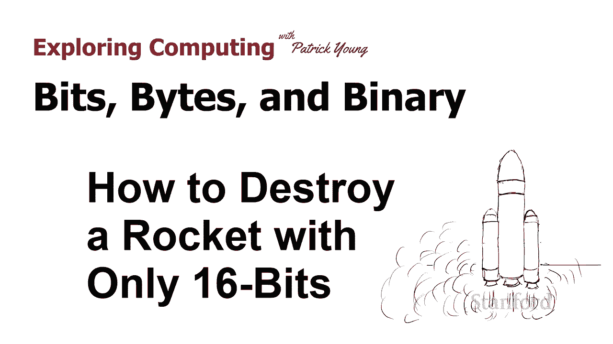
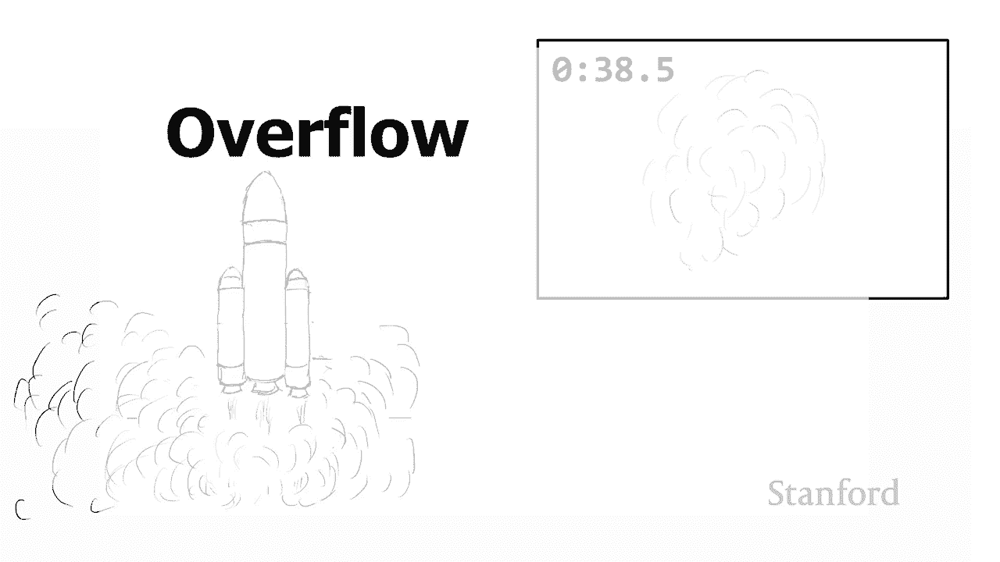
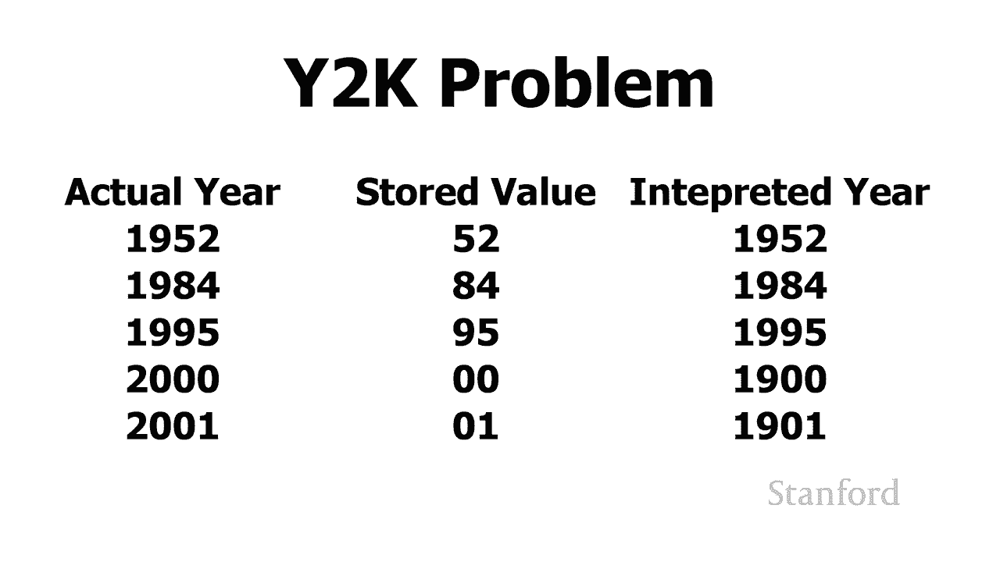
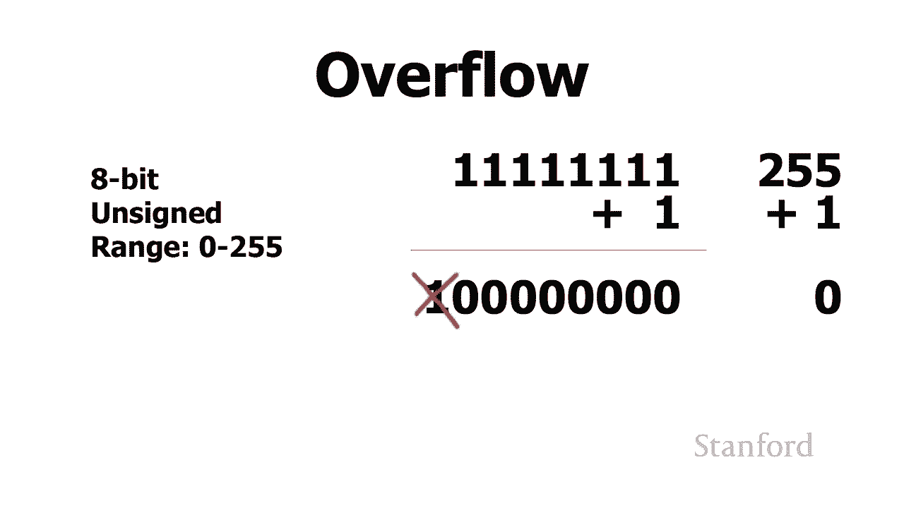
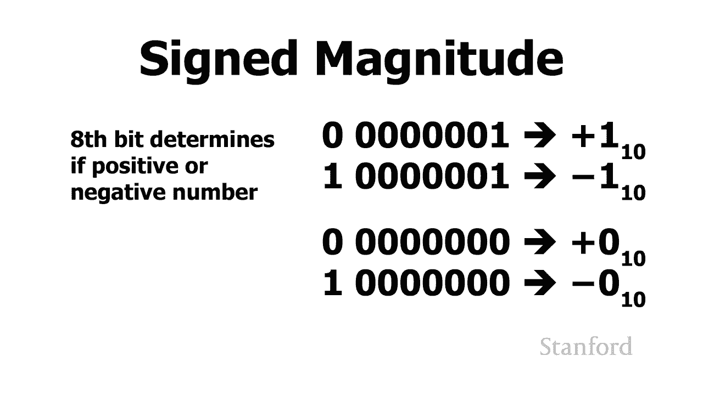
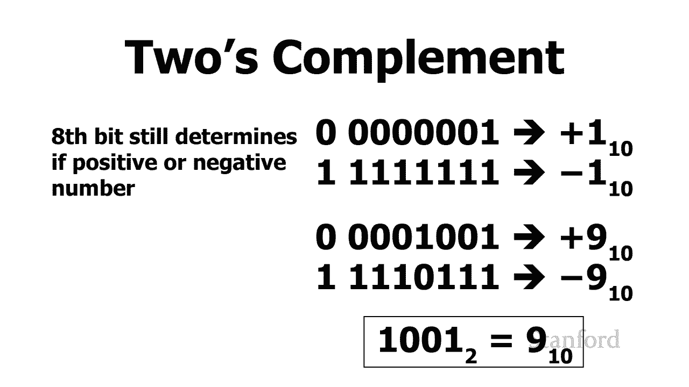
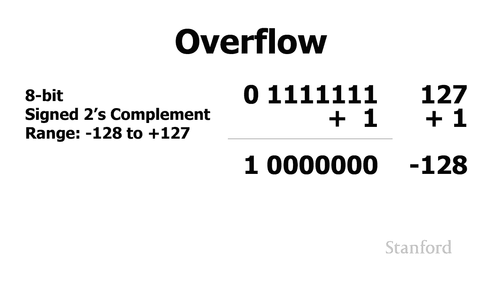
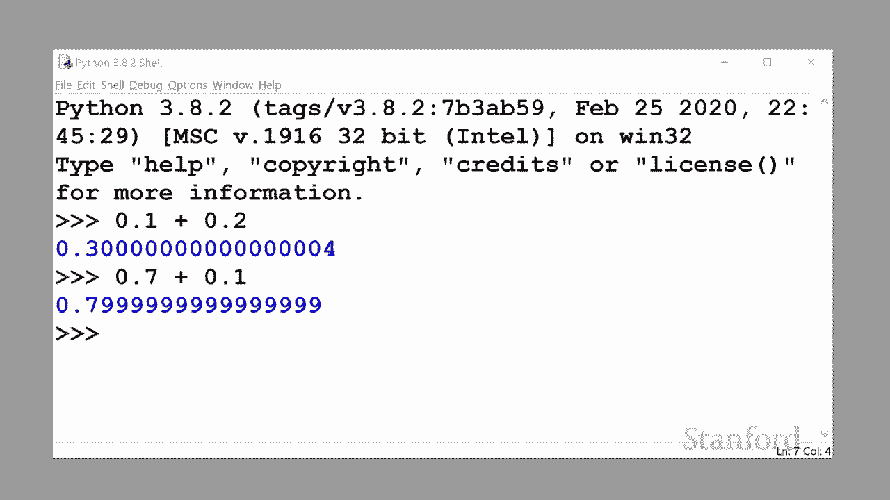
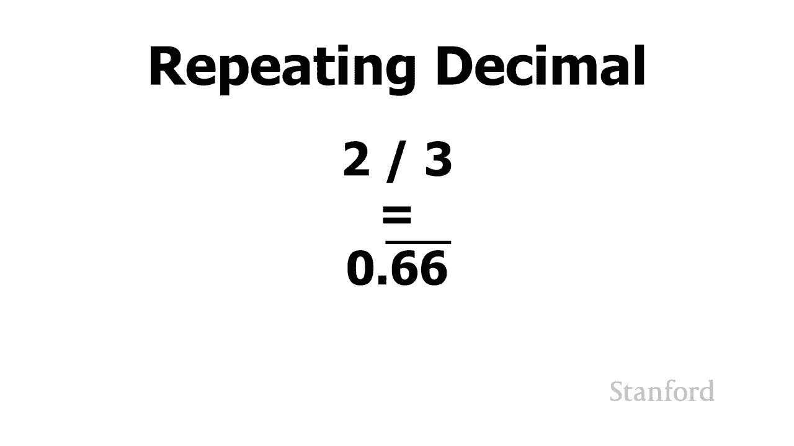
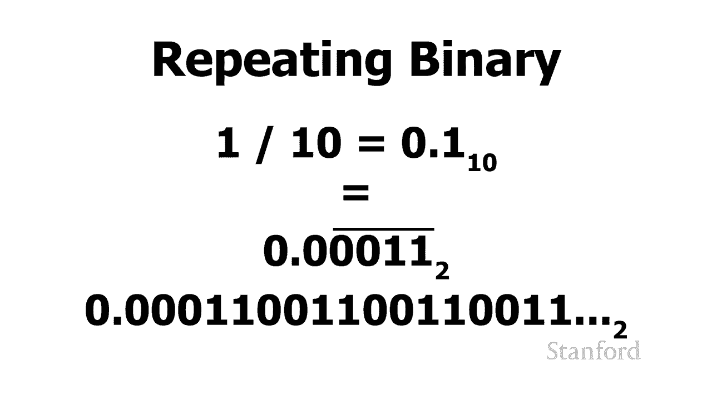

# 【双语字幕+资料下载】斯坦福CS105 ｜ 计算机科学导论(2021最新·完整版) - P4：L1.3- 比特、字节与二进制：一场由16bits引发的火箭事故 - ShowMeAI - BV1eh411W72E

undefined，欢迎探索，欢迎探索。

今天的计算视频是位字节和二进制，今天的计算视频是位字节和二进制，第 3 部分或如何摧毁，第 3 部分或如何摧毁，只有 16 位的火箭，只有 16 位的火箭，所以在这个视频中，我们将，所以在这个视频中。

我们将，看看出现问题时会发生什么，看看出现问题时会发生什么，undefined，undefined，我将开始 一个，我将开始 一个，关于一个相当昂贵的，关于一个相当昂贵的，错误的故事，其中错误的根源。

错误的故事，其中错误的根源。

是程序员选择了错误，是程序员选择了错误，的位数，的位数，我们将要追溯到 1996，我们将要追溯到 1996，年欧洲航天局有一个新的，年欧洲航天局有一个新的，火箭阿丽亚娜，火箭阿丽亚娜。

5 你可能会猜到 亚利安 4 号的后续产品。undefined，undefined，在这个新的亚利安 5 号火箭上有，在这个新的亚利安 5 号火箭上有，四颗，四颗，价值 3。7 亿美元，价值 3。

7 亿美元，的卫星 火箭发射三颗二合一发射，undefined，undefined，看起来进展顺利，看起来进展顺利，然后在飞行 37 秒后，然后在飞行 37 秒后，火箭开始疯狂转向 当然。

火箭开始疯狂转向 当然，它开始分崩离析，最终，它开始分崩离析，最终，它必须被摧毁，它必须被摧毁，出了什么问题 出问题的是，出了什么问题 出问题的是，在一个地方 控制火箭的程序。

在一个地方 控制火箭的程序，试图以 16 位存储信息，试图以 16 位存储信息，undefined，undefined，正如您可能记得的 16 位，我们可以，正如您可能记得的 16 位，我们可以。

存储 n 数字大到，存储 n 数字大到，2 到 16，这意味着我们可以存储，2 到 16，这意味着我们可以存储，0 到 65 535 之间的数字，0 到 65 535 之间的数字，虽然这个数字。

虽然这个数字，对于 aryan 4，对于 aryan 4，是空中的前身和 5 来说足够大，但，是空中的前身和 5 来说足够大，但，aryan 5，aryan 5，的性能特征，的性能特征，使其运行得更快。

使其运行得更快，并且它试图将其，并且它试图将其，粘贴到 16 位，粘贴到 16 位，存储位置的值不适合，当它，存储位置的值不适合，当它，尝试将值放入 16 位时，尝试将值放入 16 位时。

最终发生的情况是我们有，最终发生的情况是我们有，一个称为溢出，一个称为溢出，的情况，溢出时可能发生的情况是我们，的情况，溢出时可能发生的情况是我们，可以有一个非常大的数字，然后，可以有一个非常大的数字。

然后，给它加一，最后得到零，给它加一，最后得到零，或者我们可以给一个大的正数，或者我们可以给一个大的正数，加一，实际上最后得到一个，加一，实际上最后得到一个。

大的负数，大的负数，所以我们要看看这个，所以我们要看看这个，现象 一分钟，这种，现象 一分钟，这种，现象还与，现象还与，另一个著名的问题有关，即 y2k，另一个著名的问题有关，即 y2k，问题我知道这。

问题我知道这，比你的时间早一点，所以，比你的时间早一点，所以，你可能，你可能，会想，是的，我的父母可能，会想，是的，我的父母可能，对这个讲座感兴趣，对这个讲座感兴趣，但是 y2k 问题发生了什么。

但是 y2k 问题发生了什么，lem 是，lem 是，50 年代开始的程序员，50 年代开始的程序员，试图，试图，在他们的计算机程序中节省空间，所以当，在他们的计算机程序中节省空间，所以当。

他们试图存储年份时，他们试图存储年份时，他们没有用所有四位数字存储全年，undefined，undefined，而是只存储两位数字，而是只存储两位数字，所以这里有一个小表格 例如。

所以这里有一个小表格 例如，假设程序员，假设程序员，对存储 1952 年感兴趣，对存储 1952 年感兴趣，他们只会从 52 开始，然后，他们只会从 52 开始，然后。

当 52 从计算机内存中变为红色时，当 52 从计算机内存中变为红色时，undefined，undefined，计算机就会知道哦，我需要，计算机就会知道哦，我需要，向它添加一个 1 9。

向它添加一个 1 9，所以这会继续 1984 扭曲 84，所以这会继续 1984 扭曲 84，95 星 95 但问题是你可以，95 星 95 但问题是你可以，在这里看到，在这里看到，当我们开始越来越。

当我们开始越来越，接近 2000 年时，接近 2000 年时，程序员意识到，undefined，undefined，如果他们只存储零而他们不修复他们的程序，他们就会遇到一些。

如果他们只存储零而他们不修复他们的程序，他们就会遇到一些，问题 程序，问题 程序，会认为 0，会认为 0，0 年代表 1900 年而不是，0 年代表 1900 年而不是，2000 年。

所以这就是 y2k 问题，2000 年，所以这就是 y2k 问题，最终发生的事情是我们，最终发生的事情是我们，不得不花费，不得不花费，数百万美元，数百万美元，重写计算机程序，所以，重写计算机程序，所以。

当 2000 年出现时，计算机，当 2000 年出现时，计算机，并不认为我们回到了 1900 年代，并不认为我们回到了 1900 年代，所以让我们看看，所以让我们看看，溢出实际上是如何工作的。

我将在第一个版本中，溢出实际上是如何工作的，我将在第一个版本中，向您展示两种不同版本的，向您展示两种不同版本的，溢出，溢出，再看看当我们存储正整数时会发生什么，undefined，undefined。

所以我将坚持，所以我将坚持，使用 8 位，使用 8 位，尽管通常这些数字，尽管通常这些数字。

会大得多，但更容易，会大得多，但更容易，理解我们只使用 8 位，所以在 8，理解我们只使用 8 位，所以在 8，如果我，如果我，只存储正数，我们可以，只存储正数，我们可以。

存储从 0 到 255 的数字，存储从 0 到 255 的数字，所以假设我们将数字 255，所以假设我们将数字 255，存储在一个特定的存储位置，存储在一个特定的存储位置，所以在这里你可以看到。

所以在这里你可以看到，你知道我已经把我所有的位都放在，你知道我已经把我所有的位都放在，了 我可以存储，了 我可以存储，在 8 位中的最大可能数字，在 8 位中的最大可能数字，然后我尝试向它添加一个。

然后我尝试向它添加一个，undefined，undefined，如果你记得我们，如果你记得我们，上一个关于，上一个关于，如何在二进制中添加 uh 的视频，那么自然而然的事情，谁能。

如何在二进制中添加 uh 的视频，那么自然而然的事情，谁能，忘记那个视频，忘记那个视频，嗯发生了什么是 uh 当我们添加，嗯发生了什么是 uh 当我们添加，一个时，一个时，我们有那个结转。

我们h 广告要，我们有那个结转，我们h 广告要，结转，我们不得不结转，结转，我们不得不结转，我们有结转，最后，我们有结转，最后，结转到最，结转到最，左边，你可以看到会发生什么是，左边。

你可以看到会发生什么是，第九，第九，位被翻转为一，但猜猜，位被翻转为一，但猜猜，我们没有九位，我们没有九位，我们只有 有八位，因为这个，我们只有 有八位，因为这个，特定的值只开始，特定的值只开始，八位。

所以发生的事情，八位，所以发生的事情，是第九位被丢弃，没有，是第九位被丢弃，没有，空间，空间，发生的事情是我们，发生的事情是我们，由所有的非常大的值组成的，undefined，undefined。

非常低的值由 全零，非常低的值由 全零，所以就十进制发生的情况而言，所以就十进制发生的情况而言，undefined，undefined，我们有一个 255，这相当于，undefined。

undefined，将特定字节中的所有位都切换，将特定字节中的所有位都切换，为 1，为 1，我们有 255 我们已经将 1 添加到 255 并且，我们有 255 我们已经将 1 添加到 255 并且。

我们实际上最终得到了零，我们实际上最终得到了零，所以 这是溢出，因此对于我们的下一个，所以 这是溢出，因此对于我们的下一个，示例，我们将，示例，我们将，看看当，看看当，我们有一个很大的正数时会发生什么。

我们有一个很大的正数时会发生什么，但是我们将存储在，但是我们将存储在，允许存储正数和，允许存储正数和，负数的空间中，负数的空间中，因此再次在这种特殊情况下 我是，因此再次在这种特殊情况下 我是。

只是要将，只是要将，我们所有的数据存储在一个字节中，这，我们所有的数据存储在一个字节中，这，允许我们存储，允许我们存储。

正 127 和负 128 之间的数字。正 127 和负 128 之间的数字。现在有许多不同的方法，现在有许多不同的方法，可以在，可以在，计算机，计算机，上存储，上存储，负数 计算机是一种。

负数 计算机是一种，称为内部正弦幅度表示，称为内部正弦幅度表示，和幅度表示的东西，和幅度表示的东西，我们要做的是，我们要做的是，我们将采用高端位，我们将采用高端位，我们将继续说如果它。

我们将继续说如果它，是 0 我们有一个正数 如果，是 0 我们有一个正数 如果，它是 1 我们有一个负数，它是 1 我们有一个负数，所以在我们的单字节的情况下，所以在我们的单字节的情况下，它的工作方式。

它的工作方式，是七个低端位将，是七个低端位将，继续代表我们的数字，继续代表我们的数字，然后第八位将，然后第八位将，代表我们是正数还是，代表我们是正数还是，负数 number，负数 number。

事实证明这有很多，事实证明这有很多，问题，但最值得注意的是，问题，但最值得注意的是，它给了我们一个正零和一个，它给了我们一个正零和一个，负零，负零，所以如果所有位都是零，那就是一个。

所以如果所有位都是零，那就是一个，常规的零，如果所有位都，常规的零，如果所有位都，为零，除了 lef 最高位，为零，除了 lef 最高位，是一个负零，所以这是，是一个负零，所以这是，一个问题，一个问题。

所以还有其他几种方案使用，所以还有其他几种方案使用，但最常见的是一种叫做，但最常见的是一种叫做，undefined，undefined，二进制补码的东西我不，二进制补码的东西我不。

打算详细介绍二进制补码我想，打算详细介绍二进制补码我想，我们花了足够的时间 今天的数学，我们花了足够的时间 今天的数学，但，但，所有这些方案的关键点是，所有这些方案的关键点是，最左边的位将代表。

最左边的位将代表，我们是否有正数或，我们是否有正数或。

负数，负数，所以我们现在要做的是我们，所以我们现在要做的是我们，将继续进行 我们，将继续进行 我们，最大的正数，最大的正数，最左边的位也是 0，最左边的位也是 0，代表我们有一个正，代表我们有一个正。

数，所有其他七位都是，数，所有其他七位都是，1，1，这代表正 127。这代表正 127。我们将继续向它加一，我们将继续向它加一，你可以看到这里发生了什么，你可以看到这里发生了什么，是大多数位翻转为 1。

是大多数位翻转为 1，这意味着我们有一个，这意味着我们有一个，负数实际上使用这个，负数实际上使用这个，标准的二进制补码表示，标准的二进制补码表示，这实际上是一个负 128 所以。

这实际上是一个负 128 所以，发生的事情是，发生的事情是，我们有一个非常大的正数，我们有一个非常大的正数，127 我们加了一个 到它我们有 128。127 我们加了一个 到它我们有 128。所以。

所以，这又是一个溢出的例子，这又是一个溢出的例子，所以当你使用计算机，所以当你使用计算机，程序或使用，程序或使用，某种应用程序时，某种应用程序时，你认为一切都很好，你认为一切都很好，突然，突然。

你的银行帐户被重置为 零或，你的银行帐户被重置为 零或，您的银行帐户的一百万，您的银行帐户的一百万，美元被设置为，美元被设置为，负一百万，负一百万，这里可能发生的事情是，这里可能发生的事情是。

溢出这可能意味着，溢出这可能意味着。

编写该程序的人没有做得很好，编写该程序的人没有做得很好，undefined，undefined，好吧我还有一种我想要的错误，好吧我还有一种我想要的错误，向您介绍，向您介绍，这是我想这实际上不是。

这是我想这实际上不是，技术上的错误，技术上的错误，我们在这里将看到的是，我们在这里将看到的是，当我们处理，当我们处理，二进制数时，我们对，二进制数时，我们对，应该出现什么结果的直觉。

应该出现什么结果的直觉，不一定正确，不一定正确，所以我的意思是 我们是否，所以我的意思是 我们是否，要将一些数字加在一起，要将一些数字加在一起，结果在使用十进制时，结果在使用十进制时。

对我们来说应该非常明显，对我们来说应该非常明显，但是我们会，但是我们会，看到计算机，看到计算机，undefined，undefined。

对答案应该是什么有一些不同的想法所以我正在，对答案应该是什么有一些不同的想法所以我正在，运行，运行，这是 python 解释器 这是，这是 python 解释器 这是，一种我可以，一种我可以。

用 python 编程语言交互式输入命令的方法，undefined，undefined，这是，这是，cs105 学生将，cs105 学生将，在本季度晚些时候使用的编程语言。

在本季度晚些时候使用的编程语言，所以我将要做什么 我，所以我将要做什么 我，要在这里添加一些数字吗，让我们，要在这里添加一些数字吗，让我们，让 python 解释器取 0。1。

让 python 解释器取 0。1，并将其添加到 0。2，什么是 0。1 加，并将其添加到 0。2，什么是 0。1 加，0。2 自然是 0。3 让我们，0。2 自然是 0。3 让我们。

看看 python 解释器是否同意我们，看看 python 解释器是否同意我们，的意见 尝试另一个，的意见 尝试另一个，undefined，undefined，让我们要求 python 解释器将 0。

7 添加，让我们要求 python 解释器将 0。7 添加，undefined，undefined，到 0。1 看很清楚这应该，到 0。1 看很清楚这应该，是 0。8 正确的，是 0。8 正确的。

python 解释器让我们看看，python 解释器让我们看看，你得到了，你得到了，什么 好的 所以这里发生的事情是，什么 好的 所以这里发生的事情是，这台计算机现在完全搞砸了。

这台计算机现在完全搞砸了，现在实际上是什么 在这里，现在实际上是什么 在这里，undefined，undefined，我们可以，我们可以，用一组小数位数，用一组小数位数。

表示的数字与基数 10 和基数 2 不同。表示的数字与基数 10 和基数 2 不同。所以您可能还记得，有些，所以您可能还记得，有些。

数字我们无法表示 以，数字我们无法表示 以，固定的小数位数表示，所以假设，固定的小数位数表示，所以假设，undefined，undefined，我告诉你写三分之二的十进制，我告诉你写三分之二的十进制。

等价物，等价物，什么是三分之二的十进制，什么是三分之二的十进制，数，数，你可能会，你可能会，说它是 0。67 但这，说它是 0。67 但这，实际上并不准确，我可以说，实际上并不准确，我可以说，没有。

没有，0。66667 是一个更准确的，0。66667 是一个更准确的，表示，表示，实际上正确的表示是这个，实际上正确的表示是这个，0。6 重复，0。6 重复，其中 6 以上的这个条代表一个。

其中 6 以上的这个条代表一个，重复的小数，重复的小数，其中 6 永远重复，永远，undefined，undefined，如此，所以我们在这里遇到的问题，如此，所以我们在这里遇到的问题，是结果，是结果。

二进制数具有，二进制数具有，与十进制数系统不同的重复数。

undefined，undefined，尤其是数字 0。1 和以 10 为基数的数字，尤其是数字 0。1 和以 10 为基数的数字，您显然知道它是非常有限的 0。1，您显然知道它是非常有限的 0。1。

所以答案是，所以答案是，它在二进制中没有有限值，它在二进制中没有有限值，二进制它是 0。0，然后，二进制它是 0。0，然后，零零一一重复 所以，零零一一重复 所以，例如零点零零零，例如零点零零零。

一一零零一一零零一一，一一零零一一零零一一，零零一一等等，零零一一等等，并且没有设定数量的 t 这里，undefined，undefined，的小数点后没有有限的位数，所以，的小数点后没有有限的位数。

所以，这里发生的事情是，这里发生的事情是，我们正在取这些数字，我们，我们正在取这些数字，我们，确定有一组，确定有一组，小数位，例如，小数位，例如，0。7 加 1。1，0。7 加 1。1。

并且我们得到一个没有自然数的数字，并且我们得到一个没有自然数的数字，端点，所以这就是，端点，所以这就是，为什么这些数字略微，为什么这些数字略微，偏离的原因，因为这个程序员被，偏离的原因。

因为这个程序员被，警告，警告，在表示货币时不要使用浮点数，undefined，undefined，因为您会得到这些细微的，因为您会得到这些细微的，变化，这将导致您的客户，undefined。

undefined，等待这里发生的，等待这里发生的，一切 是的，所以显然还有，一切 是的，所以显然还有，很多计算可能会出错，很多计算可能会出错，事实上我们会在本季度晚些时候看到其中的一些。

undefined，undefined，但现在就是对我们处理二进制数时可能会出错的地方进行一些，但现在就是对我们处理二进制数时可能会出错的地方进行一些。

