# 【双语字幕+资料下载】斯坦福CS105 ｜ 计算机科学导论(2021最新·完整版) - P50：L17.2- 控制结构：条件流程 - ShowMeAI - BV1eh411W72E

undefined，欢迎来探索计算，欢迎来探索计算。

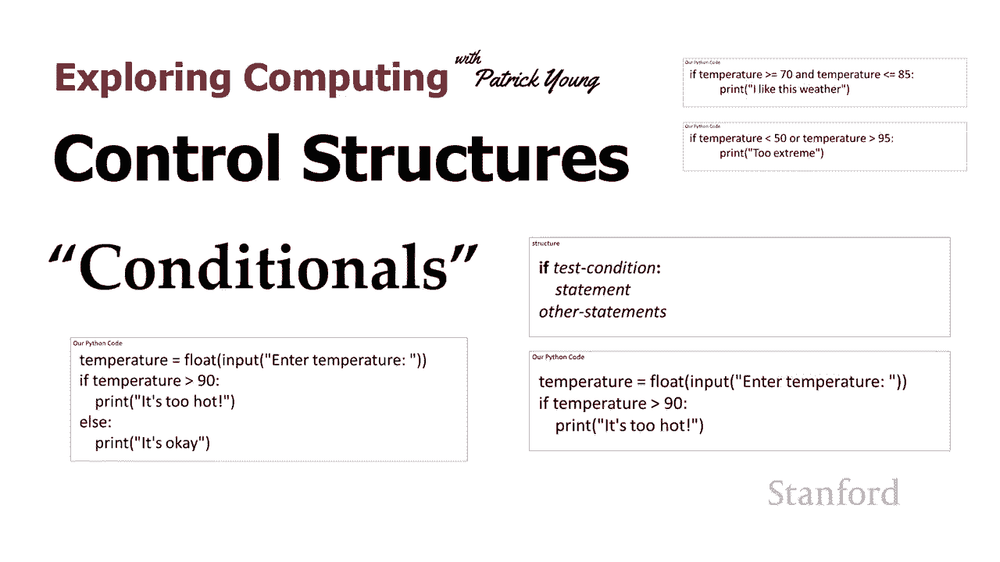

今天的视频是控制结构，今天的视频是控制结构，条件，条件，所以在上一课中我们，所以在上一课中我们，讨论了，讨论了，当我们有一个程序时，我们有许多，当我们有一个程序时，我们有许多，我们已经编写的语句。

我们已经编写的语句，计算机将按照我们的指示，计算机将按照我们的指示，执行这些语句，执行这些语句，它们列出的顺序，它们列出的顺序，这就是我们通常希望，这就是我们通常希望，在更简单的程序中发生的事情。

在更简单的程序中发生的事情。

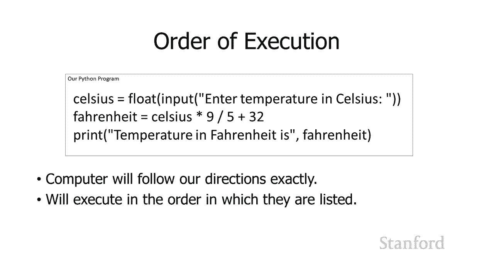

但，但，有时我们希望对执行，有时我们希望对执行，哪些语句有更多的控制，哪些语句有更多的控制，undefined，undefined，我们可以使用称为控制结构的东西来做到这一点，undefined。

undefined，结构决定了执行的顺序，结构决定了执行的顺序，因此，因此，有许多不同类型的，有许多不同类型的，控制结构，根据控制结构，控制结构，根据控制结构，的特定类型，的特定类型，控制结构可能会。

控制结构可能会，在某些情况下执行语句，但在其他情况下，undefined，undefined，可能会导致计算机执行，可能会导致计算机执行，给定的语句，给定的语句，它可能导致，它可能导致。

一遍又一遍地执行语句的次数，直到，一遍又一遍地执行语句的次数，直到，特定条件 n 发生，特定条件 n 发生。

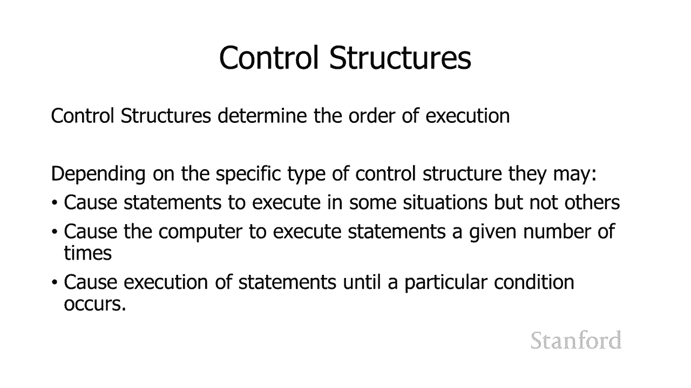

，我们将研究几种，我们将研究几种，不同类型的控制，不同类型的控制，结构 我们，结构 我们，今天要讨论的控制结构属于一类称为，今天要讨论的控制结构属于一类称为，条件控制结构，条件控制结构。

最简单的条件控制，最简单的条件控制，结构 如果特定条件为真则执行代码，undefined，undefined，否则它们 不要做任何，否则它们 不要做任何，更高级的版本，我们，更高级的版本，我们。

今天也将讨论，今天也将讨论，执行特定条件的代码，执行特定条件的代码，为真，为真，如果条件为假则执行一些其他不同的代码，如果条件为假则执行一些其他不同的代码，然后最后，然后最后，有一些条件控制。

有一些条件控制，结构将执行不同的，结构将执行不同的，代码，代码，取决于特定变量的值，取决于特定变量的值，例如，如果一个变量，例如，如果一个变量，当前设置为一个，当前设置为一个，一组代码将在。

一组代码将在，该变量设置为两个时，该变量设置为两个时，执行，另一组代码将在，执行，另一组代码将在，设置为三个的变量中执行第三，设置为三个的变量中执行第三，组 如果您，组 如果您，实际查看最后一个。

实际查看最后一个，uh 示例，代码将被执行，您可能会意识到我们，uh 示例，代码将被执行，您可能会意识到我们，可以，可以，通过使用 on 来做到这一点 前两组，通过使用 on 来做到这一点 前两组。

控制结构中的 e，控制结构中的 e，这实际上，这实际上，在计算机科学中经常发生，在计算机科学中经常发生，其中有更原始的，其中有更原始的，机制可用于，机制可用于，实现更复杂的机制，但，实现更复杂的机制。

但，我通常使用更复杂，我通常使用更复杂，的机制，的机制，让人们更容易理解正在，让人们更容易理解正在。

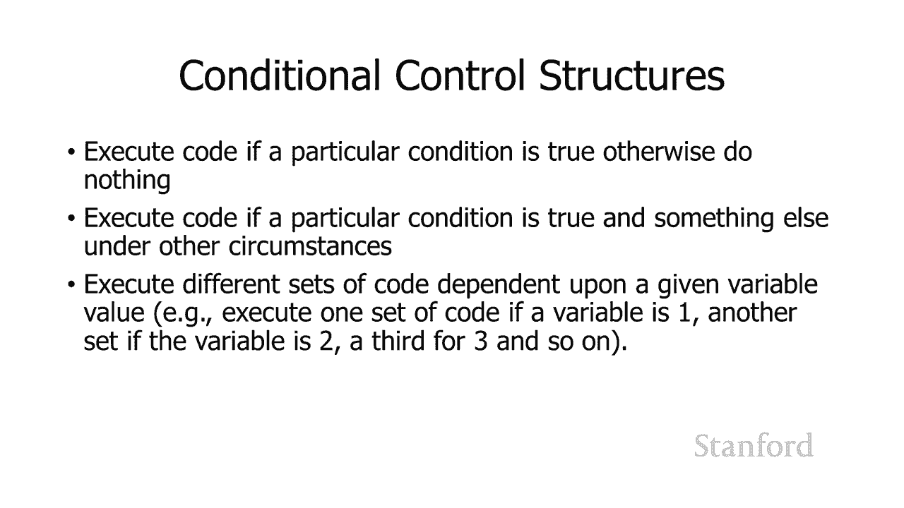

发生的事情并且更容易阅读，发生的事情并且更容易阅读，所以让我们看一下我们的第一个，所以让我们看一下我们的第一个，控制结构，控制结构，它是 if 语句，所以，它是 if 语句，所以。

这里有一些带有 if 语句的代码，这里有一些带有 if 语句的代码，我将使用温度，我将使用温度，示例 今天的讲座，示例 今天的讲座，所以我要继续，所以我要继续，从用户那里获取温度，从用户那里获取温度。

然后我要让，然后我要让，计算机就它对这个温度的看法给出它的意见，undefined，undefined，所以这段代码几乎你，所以这段代码几乎你，可以看看这段代码 并，可以看看这段代码 并。

弄清楚它在做什么，弄清楚它在做什么，以便，以便，使用输入语句从用户那里检索温度，然后，使用输入语句从用户那里检索温度，然后，您会记得我们需要转换它，您会记得我们需要转换它，因为通常输入 语句。

因为通常输入 语句，将返回一个字符串，该字符串将被，将返回一个字符串，该字符串将被，视为文本，视为文本，在这种情况下，我们希望将其视为，在这种情况下，我们希望将其视为，一个数字，因此我们要将，一个数字。

因此我们要将，其转换为浮点数，其转换为浮点数，然后我们将比较该，然后我们将比较该，浮点数 我们，浮点数 我们，存储在变量中的数字，存储在变量中的数字，或我们命名为，或我们命名为，温度的存储位置。

如果该温度，温度的存储位置，如果该温度，大于 90 度，我们将，大于 90 度，我们将，打印，打印，它太热了，所以让我们看看，它太热了，所以让我们看看，这个 if 语句的语法，这个 if 语句的语法。

这样你就可以 看这里 我有这个，这样你就可以 看这里 我有这个，词 如果，词 如果，这有时被，这有时被，称为关键字 它是一个在 python 中具有特定含义的词，undefined，undefined。

它有时也被称为，它有时也被称为，保留字 因为，保留字 因为，如果你要命名的话，你不能命名一个变量，如果你要命名的话，你不能命名一个变量，命名一个变量，如果计算机，命名一个变量，如果计算机。

会变得非常困惑，会变得非常困惑，如果你熟悉旧的呃喜剧，如果你熟悉旧的呃喜剧，套路，套路，喜剧套路谁是第一个，喜剧套路谁是第一个，你会遇到的那种情况，你会遇到的那种情况，所以我们要写下这个。

所以我们要写下这个，词如果，词如果，然后我们 去 有某种，然后我们 去 有某种，测试条件，稍后我将看看，测试条件，稍后我将看看，undefined，undefined，我们可以拥有的各种测试条件。

我们可以拥有的各种测试条件，我们将在冒号后面跟着，我们将在冒号后面跟着，它，它，然后我们将有一个，然后我们将有一个，缩进的，缩进的，语句或一组 语句，语句或一组 语句，然后在我们完成，然后在我们完成。

缩进语句之后，我们将有，缩进语句之后，我们将有，一些额外的语句，或者在那之后，一些额外的语句，或者在那之后，我们可能会有一些额外的语句，undefined，undefined，所以这种工作方式是。

所以这种工作方式是，测试条件，测试条件，应该给我们一个真假值，应该给我们一个真假值，我们将再次采取措施，我们将，我们将再次采取措施，我们将，在一分钟内仔细研究，所以，在一分钟内仔细研究，所以。

我们的测试条件是，如果，我们的测试条件是，如果，温度大于 90，并且，温度大于 90，并且，您认为温度大于，您认为温度大于，90，那么温度要么，90，那么温度要么，大于 90 或者它小于或等于。

大于 90 或者它小于或等于，90。所以这是一个真假值，90。所以这是一个真假值，所以要么一个条件为真，要么，所以要么一个条件为真，要么，另一个条件为真，这就是，另一个条件为真，这就是。

我们想要的测试条件，我们想要的测试条件，如果该测试条件为真，实际上，如果该测试条件为真，实际上，undefined，undefined，温度很大 r than 90 那么。

温度很大 r than 90 那么，我们要做的是，我们要做的是，执行下面缩进的语句，执行下面缩进的语句，如果，如果，在我们的例子中测试条件它将执行打印，在我们的例子中测试条件它将执行打印，语句它太热了。

语句它太热了，然后如果我们有额外的，然后如果我们有额外的，语句，我们 想要总是，语句，我们 想要总是，执行那些会在其他语句之后执行的，执行那些会在其他语句之后执行的。

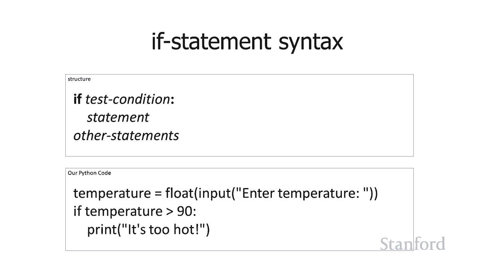

让我们，让我们，undefined，undefined，好吧，所以在这种情况下，我有一些，undefined，undefined，总是被执行的语句，所以本质，总是被执行的语句，所以本质，上要注意的。

上要注意的，是在 python 中 语句的缩进，是在 python 中 语句的缩进，undefined，undefined，决定了哪些语句，决定了哪些语句，从属于其他语句，所以，从属于其他语句，所以。

我知道温度等于浮点，我知道温度等于浮点，输入输入温度总是，输入输入温度总是，undefined，undefined，发生打印计算机对热，发生打印计算机对热，敏感总是，敏感总是，发生如果温度大于。

发生如果温度大于，90 总是发生，如果我们，90 总是发生，如果我们，一直到底部，一直到底部，打印对您的计算机很好，这也，打印对您的计算机很好，这也，总是发生，总是发生，但是有两个中间，但是有两个中间。

语句打印太热，语句打印太热，和 打印您的计算机不会感到高兴，undefined，undefined，如果温度大于 90 的 if 语句中的测试条件，undefined，undefined。

undefined，为真 如果温度小于，为真 如果温度小于，或等于 90，或等于 90，那么这两个，那么这两个，缩进的打印语句 太热了，你的，缩进的打印语句 太热了，你的，电脑会不高兴，电脑会不高兴。

这些不会被打印出来，所以这，这些不会被打印出来，所以这。

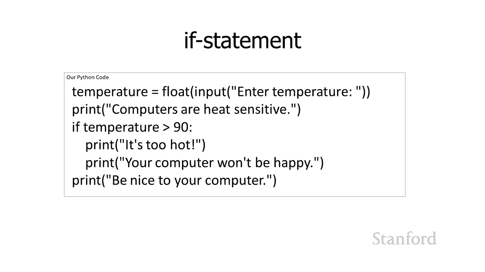

undefined，undefined，正如我之前所建议的那样，正如我之前所建议的那样，有时有时我们会想要在条件为真时，有时有时我们会想要在条件为真时，执行一组语句，执行一组语句。

然后执行第二组语句 of，然后执行第二组语句 of，statements，statements，if the condition is false 所以这。

if the condition is false 所以这，就是 if 语句的 if else，就是 if 语句的 if else，变体给我们的，变体给我们的，所以你可能会再次查看这个。

所以你可能会再次查看这个，并弄清楚它在做什么，并弄清楚它在做什么，我们将再次，我们将再次，从用户那里获取温度和 如果，从用户那里获取温度和 如果，温度大于 90 度，温度大于 90 度，我会说它太热了。

我会说它太热了，否则我要打印它没关系，否则我要打印它没关系，我应该在这里提一下，我稍早，我应该在这里提一下，我稍早，稍微提到了这一点，稍微提到了这一点，但，但，让我们谈谈它 明确注意。

让我们谈谈它 明确注意，当您进行这样的比较时，当您进行这样的比较时，您需要考虑，您需要考虑，某事是否大于某事，某事是否大于某事，您还需要将其视为小，您还需要将其视为小，于某事您还需要考虑。

于某事您还需要考虑，如果它等于某事会发生，如果它等于某事会发生，什么，所以，什么，所以，在这种情况下 如果温度，在这种情况下 如果温度，正好是 90 度，正好是 90 度。

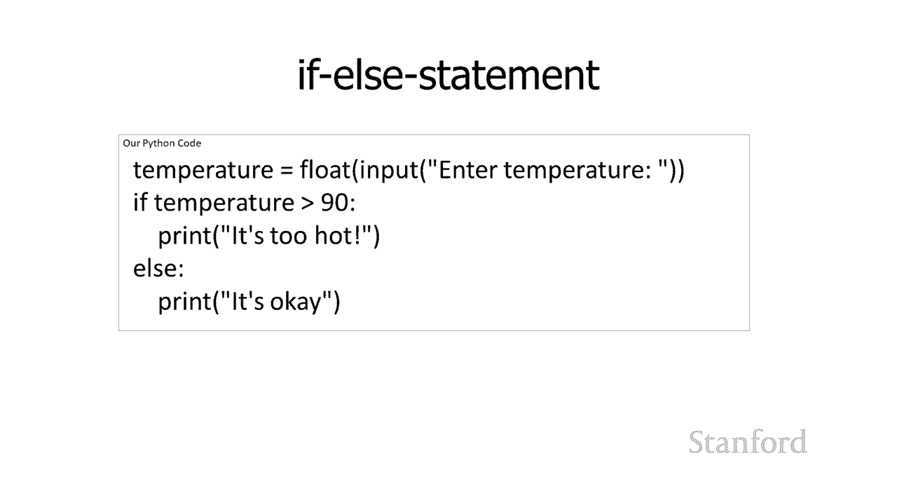

我要打印它没关系，我要打印它没关系，这里是，这里是，我们的 if-else 语句的语法 所以我有 if，我们的 if-else 语句的语法 所以我有 if，后跟测试条件，后跟测试条件。

后跟冒号 不要忘记，后跟冒号 不要忘记，冒号 冒号是非常重要的，如果，冒号 冒号是非常重要的，如果，你 跳过冒号，你 跳过冒号，嗯，python 对你真的很不满意，嗯，python 对你真的很不满意。

你有一个语法错误，undefined，undefined，如果测试条件冒号，它不会运行正常，然后我，如果测试条件冒号，它不会运行正常，然后我，有那个，有那个，缩进，然后我有一个或，缩进，然后我有一个或。

多个，多个，我想执行的语句 如果测试，我想执行的语句 如果测试，条件为真，那么你知道如果条件为真，条件为真，那么你知道如果条件为真，python 如何知道，python 如何知道，要执行哪些语句。

undefined，undefined，它是 if 语句之后缩进的任何语句，undefined，undefined，然后是 else，然后是 else，还有一个冒号，不要忘记，还有一个冒号，不要忘记。

冒号，冒号，然后我在 else 后面缩进了一个或多个，undefined，undefined，undefined，语句，语句，如果测试条件为假，则这些语句都将被执行，然后，如果测试条件为假。

则这些语句都将被执行，然后。

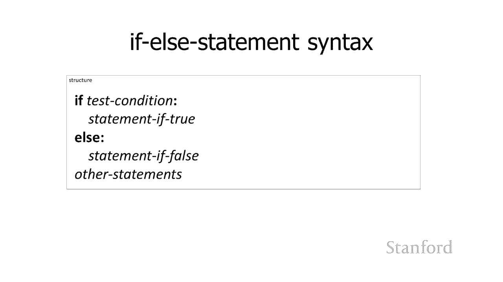

如果我有其他语句，如果我有其他语句，不是 缩进的那些总是会，不是 缩进的那些总是会，被执行，被执行，我也可以将我的 if 语句链接，我也可以将我的 if 语句链接，在一起，undefined。

undefined，undefined，undefined，undefined，如果计算机对热，如果计算机对热，敏感，则打印我正在，敏感，则打印我正在，检查温度是否大于，检查温度是否大于，90。

我们之前已经看到过，90，我们之前已经看到过，然后如果温度，然后如果温度，大于 80，大于 80，l 如果温度大于 65 则，l 如果温度大于 65 则，打印它很冷计算机就像它又好。

打印它很冷计算机就像它又好，又冷，又冷，好的，所以这里的，好的，所以这里的，想法是尝试执行，想法是尝试执行，温度大于 90 的，温度大于 90 的，比较，如果温度，比较，如果温度，大于 90。

大于 90，它将继续打印它，它将继续打印它，太热而您的计算机不会 很高兴，太热而您的计算机不会 很高兴，然后它将一直跳到，undefined，undefined，那里的打印语句，因此，那里的打印语句。

因此，如果，如果，第一个测试条件温度，第一个测试条件温度，大于 90，则 ls lf else 都将被忽略，大于 90，则 ls lf else 都将被忽略，如果温度小于或，如果温度小于或，等于 90。

等于 90，则它将被忽略，undefined，undefined，如果温度大于 80，则在第一个 l 中执行测试条件。如果，如果温度大于 80，则在第一个 l 中执行测试条件。如果，该测试条件为真。

该测试条件为真，它将打印它是温暖的，然后，它将打印它是温暖的，然后，在完成打印后它是温暖的，在完成打印后它是温暖的，它将忽略它下面的 lf，它将忽略它下面的 lf。

它将忽略其他 如果温度小于或等于 80 度，则，它将忽略其他 如果温度小于或等于 80 度，则，一直向下，一直向下，打印 对您的计算机很友好，undefined，undefined，它将，它将。

执行下一个测试条件，它将，执行下一个测试条件，它将，检查温度是否，检查温度是否，大于 65 度，大于 65 度，如果该测试 条件为真它会，如果该测试 条件为真它会，打印很好你的电脑，打印很好你的电脑。

很好然后它会跳过else，很好然后它会跳过else，语句它会直接去，语句它会直接去，打印另一方面如果温度小于或等于你的电脑对你的电脑，undefined，undefined，很好 o 65。

很好 o 65，它会打印冷的电脑，就像，它会打印冷的电脑，就像，它又好又冷，然后它，它又好又冷，然后它，会一直打印到你的电脑上，会一直打印到你的电脑上，所以可以在不，所以可以在不。

将它们链接在一起的情况下做到这一点，将它们链接在一起的情况下做到这一点，但它会变得更加混乱，但它会变得更加混乱，因为如果，因为如果，我想打印它，我想打印它，没有 lf 的温暖我将。

没有 lf 的温暖我将，不得不同时，不得不同时，检查温度是否，检查温度是否，大于 80 但我还必须，大于 80 但我还必须，检查，检查，温度实际上是否小于或等于 90 因为。

温度实际上是否小于或等于 90 因为，否则它将同时打印 它，否则它将同时打印 它，太热太热了，太热太热了，所以，所以。

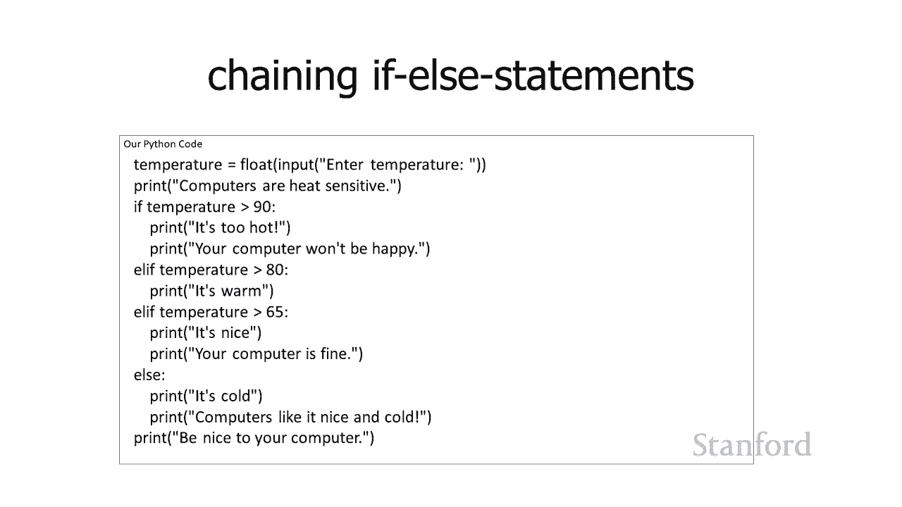

这些提升实际上非常方便，这些提升实际上非常方便，尽管这种语法结构，尽管这种语法结构，看起来很混乱，看起来很混乱，所以这里是我们的链式 elsif 的一般语法。

所以这里是我们的链式 elsif 的一般语法，结构，结构，if 测试条件，if 测试条件，冒号，然后是一堆语句，如果，冒号，然后是一堆语句，如果，它是真的，它是真的，然后 呃，如果该测试条件为。

然后 呃，如果该测试条件为，真，它会，真，它会，在 if 之后一直跳到最后，在 if 之后一直跳到最后，在这种情况下我没有 else 但如果它，在这种情况下我没有 else 但如果它。

以 else 结尾，它将，以 else 结尾，它将，在 else 之后，它会去 一路，在 else 之后，它会去 一路，d，d，如果测试条件为假，则属于其他语句，如果测试条件为假，它会。

如果测试条件为假，则属于其他语句，如果测试条件为假，它会，转到，转到，lf 并且它有第二个测试条件，undefined，undefined，undefined，undefined，undefined。

将检查第四个测试条件，将检查第四个测试条件，然后您可以以 lf 结束，然后您可以以 lf 结束，如果最后一个测试条件，如果最后一个测试条件，仍然为假，则不执行任何语句，仍然为假，则不执行任何语句。

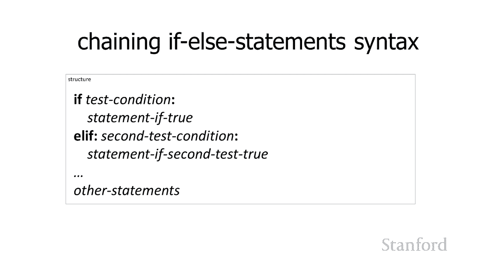

或者您可以使用 else 结束此测试，或者您可以使用 else 结束此测试，任何一个都可以正常工作，任何一个都可以正常工作，让我们来看看那些，让我们来看看那些，我之前提到的测试条件。

我之前提到的测试条件，所以基本上我们想要的测试，所以基本上我们想要的测试，条件是返回，undefined，undefined，真值或假值的东西，因此温度，真值或假值的东西，因此温度，大于 90 这。

大于 90 这，就是我们所说，就是我们所说，的比较或大于，的比较或大于，比较或比较运算符 um，比较或比较运算符 um，它导致，它导致，真假值计算机科学中的真假值，真假值计算机科学中的真假值。

通常被称为布尔值，通常被称为布尔值，这实际上是以一个人的名字命名的，这实际上是以一个人的名字命名的，有一位名叫乔治的数学家，有一位名叫乔治的数学家，公牛提出了一，公牛提出了一，组基于真假，组基于真假。

值的数学，当时它并不被认为，值的数学，当时它并不被认为，非常重要，非常重要，但呃，这是在我们拥有计算机之前，但呃，这是在我们拥有计算机之前。

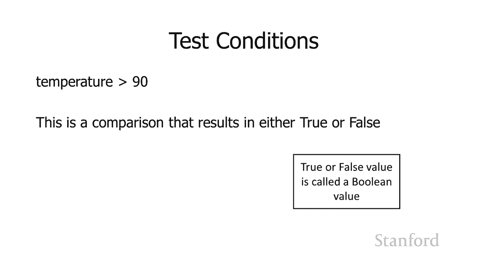

，现在它是计算的基础，所以，现在它是计算的基础，所以，嗯，嗯，去乔治布尔呃这里有一些测试，去乔治布尔呃这里有一些测试，你可以使用的条件，你可以使用的条件，比，比，我提到的要大，你需要考虑，我提到的要大。

你需要考虑，当某物相等时会发生什么，所以，当某物相等时会发生什么，所以，你可以说嘿，这只有，你可以说嘿，这只有，在温度大于 90 时才成立，在温度大于 90 时才成立，或者你可以像，或者你可以像，嘿。

我认为 90 的温度也，嘿，我认为 90 的温度也，很糟糕，所以，很糟糕，所以，我仍在使用大于 表示，我仍在使用大于 表示，你知道温度是 90，你知道温度是 90，不算在内的，只有当它，不算在内的。

只有当它，大于 90 或者你现在可以使用大于，大于 90 或者你现在可以使用大于，或等于，或等于，如果你已经 从数学上看，如果你已经 从数学上看，有一个大于，有一个大于，或等于下划线下划线。

或等于下划线下划线，我们不使用计算机，我们不使用计算机，科学，科学，而是我们使用大于号，而是我们使用大于号，后跟等号因为它，后跟等号因为它，更容易输入，更容易输入，um 大于或 等于 呃。

um 大于或 等于 呃，没有办法在标准键盘上输入它，没有办法在标准键盘上输入它，你必须做一些，你必须做一些，特殊的事情才能得到，特殊的事情才能得到，它 小于 小于或，它 小于 小于或，等于 有。

等于 有，两个等号，这意味着这两个，两个等号，这意味着这两个，值彼此相同，值彼此相同，这等于单个等于 符号将是一个，这等于单个等于 符号将是一个，变量赋值，我们不想这样，变量赋值，我们不想这样，做，做。

然后有一个不等于，它是，然后有一个不等于，它是，通过使用感叹号，通过使用感叹号，由等于号创建的，这就像，由等于号创建的，这就像，嘿，我喜欢任何温度，除了，嘿，我喜欢任何温度，除了，80 度。

如果它是 81 度，那就是，80 度，如果它是 81 度，那就是，很好，如果它是，很好，如果它是，79 度，那很好，但如果它，79 度，那很好，但如果它，等于 80，那是一个问题，所以我会，等于 80。

那是一个问题，所以我会。

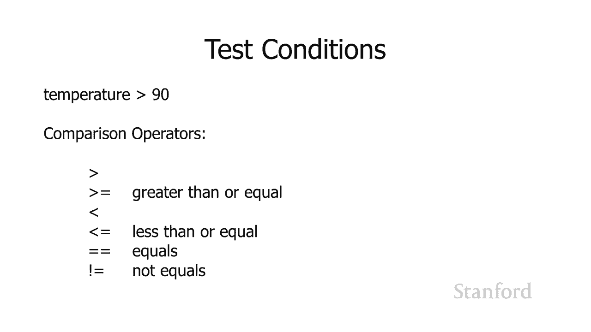

使用不等于，使用不等于，来表示，来表示，可以，所以这里有一个例子，这里是一个不同的，可以，所以这里有一个例子，这里是一个不同的，例子，这里使用其他比较运算符之一，例子，这里使用其他比较运算符之一。

所以如果，所以如果，年龄更大 大于或等于 18 然后，年龄更大 大于或等于 18 然后，打印，打印。

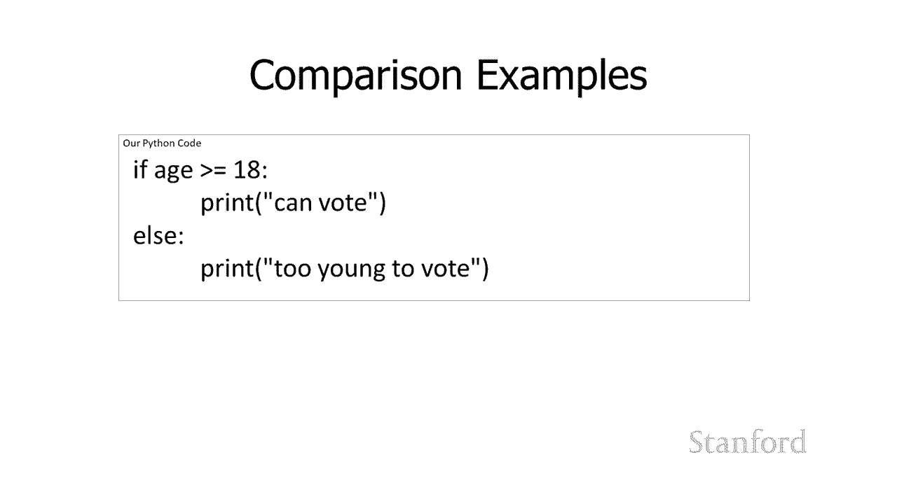

你可以投票 否则打印你太，你可以投票 否则打印你太，年轻不能投票，年轻不能投票，现在我们可以将这些组合在一起 这，现在我们可以将这些组合在一起 这，确实有点混乱所以，确实有点混乱所以。

当你使用这些时你需要小心，当你使用这些时你需要小心，但是 th 他们可以很方便，但是 th 他们可以很方便，所以如果我想检查，所以如果我想检查，温度是否在 70，温度是否在 70，和 85 之间。

我可以，和 85 之间，我可以，通过结合两个比较来做到这一点，我可以，通过结合两个比较来做到这一点，我可以，比较温度并确保，比较温度并确保，它大于或等于 70，它大于或等于 70，我也可以比较 温度。

我也可以比较 温度，并确保它小于或等于，并确保它小于或等于，85，所以我将这些与一个组合在一起，undefined，undefined，这只会是真实的，这只会是真实的，这张打印我喜欢这种天气。

undefined，undefined，只有在温度大于，只有在温度大于，或等于时才会被打印 到 70 并且，或等于时才会被打印 到 70 并且，它也小于或等于 85。它也小于或等于 85。

这就是所谓的布尔，这就是所谓的布尔，运算符，因为它，运算符，因为它，结合了两个布尔值记住我们的，结合了两个布尔值记住我们的，真假值，真假值。

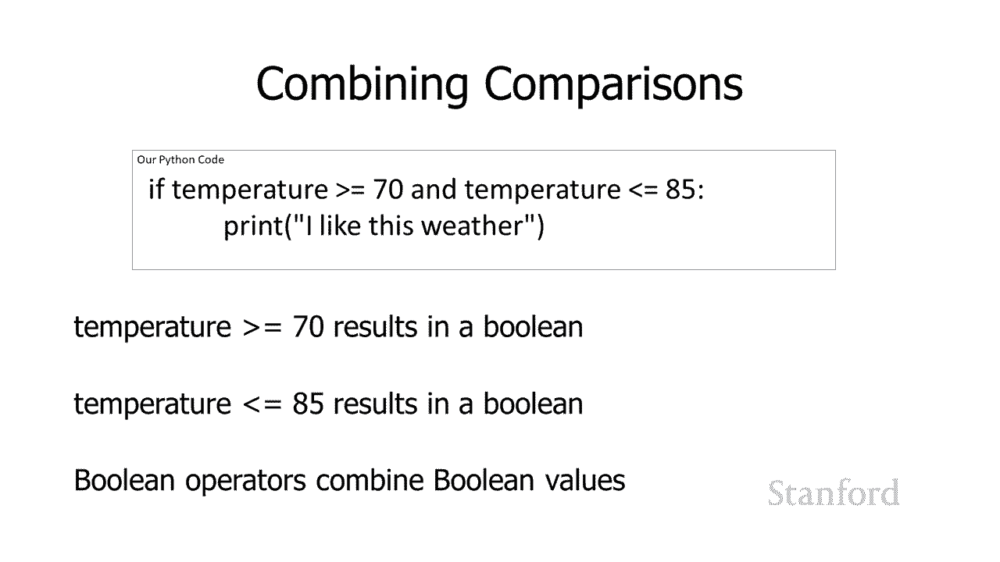

是导致真假值的东西，是导致真假值的东西，它们被称为布尔值，它们被称为布尔值，嗯还有 or 操作员所以呃，嗯还有 or 操作员所以呃，在第二个例子中我有一个 or 我，在第二个例子中我有一个 or 我。

说如果温度小于 50，说如果温度小于 50，或者如果温度大于 95，或者如果温度大于 95，然后，然后，打印两个极端所以我的 or 操作员，打印两个极端所以我的 or 操作员，将工作，如果其中任何。

将工作，如果其中任何，一个 测试条件为真，所以，一个 测试条件为真，所以，undefined，undefined，要么温度小于 50 度，要么温度小于 50 度，要么温度大于 95 度。

要么温度大于 95 度，那么整个事情都是真实的，我们会，那么整个事情都是真实的，我们会。

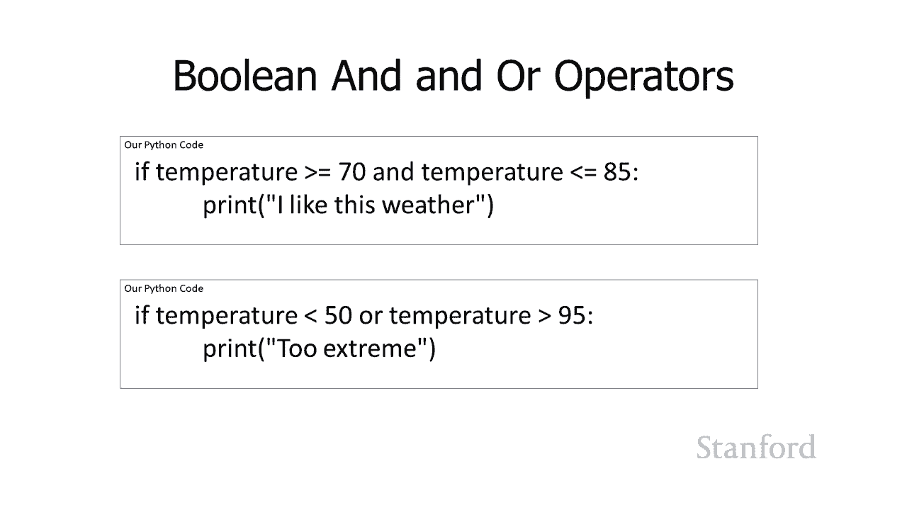

打印太极端，打印太极端，也没有操作符，也没有操作符，它可能使用，它可能使用，频率较低，频率较低，它是 可能有点难以理解，它是 可能有点难以理解，但，但，基本上它需要它之后的任何。

基本上它需要它之后的任何，内容并将其反转，所以，内容并将其反转，所以，在我们之前，如果年龄，在我们之前，如果年龄，大于或等于 18，大于或等于 18，人可以投票，也许人们，人可以投票，也许人们。

正在查看我们，正在查看我们，上次呃选举的结果并认为，上次呃选举的结果并认为，嘿，我不认为我们对，嘿，我不认为我们对，那些在 18 岁投票中表现出色的人做得很好，所以。

那些在 18 岁投票中表现出色的人做得很好，所以，也许我们只是要颠倒一下，所以，也许我们只是要颠倒一下，所以，我们会说，我们会说，如果年龄不大于 18 岁，那么，如果年龄不大于 18 岁，那么。

我们将有三个- 岁投票，我们将有三个- 岁投票，所以如果我这样做，如果我没有年龄，所以如果我这样做，如果我没有年龄，大于等于 18，大于等于 18，这基本上意味着如果年龄，这基本上意味着如果年龄。

是 18 或，是 18 或，以上，那么比较年龄大于，以上，那么比较年龄大于，等于 18 是正确的，但实际上并没有，等于 18 是正确的，但实际上并没有，逆转，所以，逆转，所以，基本上如果 有人是 17。

9，基本上如果 有人是 17。9，如果人，如果人，是 16 岁他们可以投票 如果，是 16 岁他们可以投票 如果，他们是三岁他们可以，他们是三岁他们可以，投票，投票。

但如果他们是 18 19 20 50，但如果他们是 18 19 20 50。

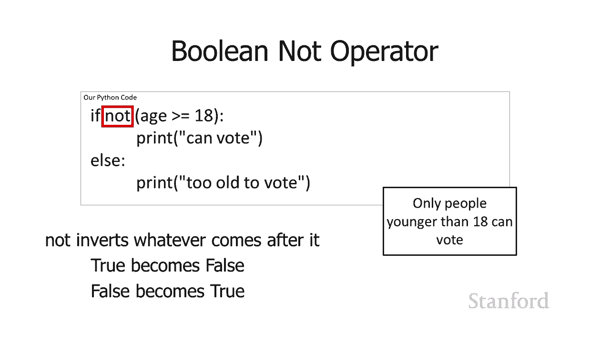

70 他们不能投票，70 他们不能投票，也可以 一个布尔，也可以 一个布尔，值直接在那里，值直接在那里，所以我们可以在 python 中将布尔值写为 true。

所以我们可以在 python 中将布尔值写为 true，和 false，和 false，这些用大写字母 t 写，这些用大写字母 t 写，所以如果，所以如果，true 打印我喜欢这种天气这。

true 打印我喜欢这种天气这，实际上总是打印我喜欢这种，实际上总是打印我喜欢这种，天气，天气，你不会在 if 中使用它 声明，你不会在 if 中使用它 声明，但是还有一些其他的控制。

但是还有一些其他的控制，结构，有些人确实，结构，有些人确实，喜欢使用这种特殊的 uh 方法，喜欢使用这种特殊的 uh 方法，undefined，undefined，总是在那里放置一个真正的值，我。

总是在那里放置一个真正的值，我，个人认为这有点奇怪，个人认为这有点奇怪，我知道他们这样做是有原因的，我知道他们这样做是有原因的，但是 uh 但是你会看到 提供，但是 uh 但是你会看到 提供，代码。

你不会用 if 语句看到它，代码，你不会用 if 语句看到它，undefined，undefined，所以我再次直接在那里写了一个布尔，所以我再次直接在那里写了一个布尔，值，值，所以这总是正确的。

所以这总是正确的，所以它总是会打印我喜欢，所以它总是会打印我喜欢，这种天气，这种天气，你也可以接受这些 布尔，你也可以接受这些 布尔，值，值，并将它们直接存储到变量中，并将它们直接存储到变量中，所以。

所以，您知道我们之前已经讨论过，您知道我们之前已经讨论过，整，整，数值是浮点值，数值是浮点值，还是字符串，结果布尔，还是字符串，结果布尔，值是另一种，值是另一种，我们可以存储在变量中的值 变量。

我们可以存储在变量中的值 变量，我们可以分配给变量，我们可以分配给变量，我们有运算符可以，我们有运算符可以，对它们进行操作，就像，对它们进行操作，就像，undefined，undefined。

我们可以将整数存储到变量中一样，我们可以，我们可以将整数存储到变量中一样，我们可以，使用运算符，我们可以，使用运算符，我们可以，对它们进行加减运算等等，对它们进行加减运算等等。

因此我们将看到更多 这些在，因此我们将看到更多 这些在，下一节课中，下一节课中，今天。

