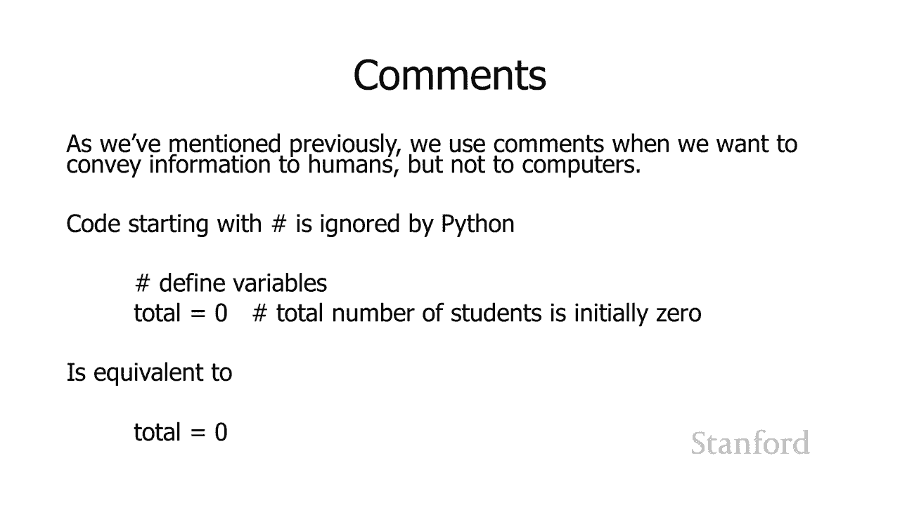

# 【双语字幕+资料下载】斯坦福CS105 ｜ 计算机科学导论(2021最新·完整版) - P51：L18.1- Python 语言附加功能 - ShowMeAI - BV1eh411W72E

undefined，欢迎探索计算，欢迎探索计算，今天的视频是额外的 Python，今天的视频是额外的 Python，功能，功能，因此在本视频中，我们将，因此在本视频中，我们将，看看其他一些。

看看其他一些，Python 语言功能，您可能会，undefined，undefined，在某些情况下发现这些功能很方便，所以我想谈论的第一个，在某些情况下发现这些功能很方便，所以我想谈论的第一个。

是如何做 一个，是如何做 一个，多行语句，多行语句，所以有时你有一行，所以有时你有一行，代码太长，不能，代码太长，不能，舒适地放在一行中，在某些，舒适地放在一行中，在某些，语言中，你可以继续并，语言中。

你可以继续并，跨行拆分，跨行拆分，你可以说哦，这，你可以说哦，这，不适合 行，不适合 行，我将继续并，我将继续并，在中间放置一个字符，在中间放置一个字符，呃语言解释器应该，呃语言解释器应该。

弄清楚这一点，结果这，弄清楚这一点，结果这，在python中不起作用所以，在python中不起作用所以，如果你做我在这里所做的事情，我，如果你做我在这里所做的事情，我，已经取名了 等于。

我在那里输入了一个，已经取名了 等于，我在那里输入了一个，字符项，然后我，字符项，然后我，在下一行输入了，在下一行输入了，这实际上会，这实际上会，在您尝试加载它时导致错误，所以。

在您尝试加载它时导致错误，所以，这不好所以有几个，这不好所以有几个，解决方案，解决方案，嗯，这是普遍存在的，嗯，这是普遍存在的，undefined，undefined，要做 能够是你可以继续并。

要做 能够是你可以继续并，在你未完成的行的末尾加上一个反斜杠，在你未完成的行的末尾加上一个反斜杠，所以如果我说名字等于，所以如果我说名字等于，然后我有那个反斜杠不要使用，然后我有那个反斜杠不要使用。

正斜杠必须是反斜杠得到，正斜杠必须是反斜杠得到，那个反斜杠，那个反斜杠，告诉python我不是真的，告诉python我不是真的，完成这一行，完成这一行，uh 转到下一行，这实际上，uh 转到下一行。

这实际上，是当前行的延续，是当前行的延续，另外你可以使用括号，所以，另外你可以使用括号，所以，uh 如果你已经有了括号，uh 如果你已经有了括号，你就有了那个输入语句，你就有了那个输入语句。

我可以继续使用，我可以继续使用，括号 对于输入语句，括号 对于输入语句，你也可以在很多情况下，你也可以在很多情况下，比如如果你有一个数学格式，比如如果你有一个数学格式，你可以把括号放在。

你可以把括号放在，你想要的任何地方，你想要的任何地方，但是如果你有一个，但是如果你有一个，像这里这样的开放括号，我有那个输入，像这里这样的开放括号，我有那个输入，然后 开括号 python。

然后 开括号 python，立即意识到，立即意识到，它在当前行上没有看到右括号，它在当前行上没有看到右括号，所以，所以，我必须将我的语句扩展到，我必须将我的语句扩展到，多行，它会，多行，它会。

继续处理后续，继续处理后续，行，就好像它们我们一样 重新成为，行，就好像它们我们一样 重新成为，原始行的一部分，直到它看到右，原始行的一部分，直到它看到右，括号，括号，你可以用方括号做同样的事情。

你可以用方括号做同样的事情，所以如果你有一个，所以如果你有一个，项目列表，就像，项目列表，就像，你在这里一样，undefined，undefined，它会看到左方括号它会看到一堆 我们团队。

它会看到左方括号它会看到一堆 我们团队，成员列表上的人没有看到，成员列表上的人没有看到，方括号它说哦，方括号它说哦，你一定希望我继续，你一定希望我继续，处理下一行和下一，处理下一行和下一，行。

直到我看到右方，undefined，undefined，括号好，另一个有时，括号好，另一个有时，会出现的问题是 如何，会出现的问题是 如何，做所谓的连接字符串，做所谓的连接字符串，和计算机科学连接。

和计算机科学连接，字符串意味着将两个字符串组合，字符串意味着将两个字符串组合，成一个字符串，成一个字符串，并且有多种不同的方法，并且有多种不同的方法，可以做到这一点，具体取决于，undefined。

undefined，Python 中的编程语言，您只需按空格分隔字符串，undefined，undefined，它就会自动放置它们 在一起，它就会自动放置它们 在一起，所以我说你好，所以我说你好。

空间每个人它会将，空间每个人它会将，它组合成一个字符串你好，它组合成一个字符串你好，每个人都注意到它实际上并没有，每个人都注意到它实际上并没有，在你好中添加一个空格，在你好中添加一个空格，yone。

yone，so hello大家所以如果你想要一个，so hello大家所以如果你想要一个，空格，你好字符串需要，空格，你好字符串需要，以空格结尾，或者每个人，以空格结尾，或者每个人。

字符串需要以空格开头，或者，字符串需要以空格开头，或者，你需要，你需要，在中间的三分之一处放一个引号，一个空格和，在中间的三分之一处放一个引号，一个空格和，一个结尾，一个结尾，在你好和每个人之间引用。

在你好和每个人之间引用，这将结合起来给你你好，这将结合起来给你你好，undefined，undefined，当我们有一个很长的字符串时这可能很有用，当我们有一个很长的字符串时这可能很有用，所以，所以。

在这里我使用邮票作为座右铭我，在这里我使用邮票作为座右铭我，不会尝试阅读它我 完全不懂，undefined，undefined，德语 stanford 座右铭 blah blah blah。

德语 stanford 座右铭 blah blah blah，翻译为自由之风吹来，翻译为自由之风吹来，所以也许这有点，所以也许这有点，太长而无法放在一条线上，我，太长而无法放在一条线上，我。

想把它放在多条线上，想把它放在多条线上，我打算这样做 通过将其，我打算这样做 通过将其，分解为单独的字符串，请，分解为单独的字符串，请，注意这些字符串中的每一个，注意这些字符串中的每一个，至少前。

至少前，三个字符串以空格结尾，因此，三个字符串以空格结尾，因此，将其转换为，将其转换为，空格，代表座右铭空格，空格，代表座右铭空格，破折号空格 因为请记住，当这些字符串时，我们是否不。

破折号空格 因为请记住，当这些字符串时，我们是否不，将这些空格放在那里，将这些空格放在那里，得到结合，得到结合，ba 一起，呃，ba 一起，呃，我们不会有空格，所以不要，我们不会有空格，所以不要。

忘记你的空格，忘记你的空格，你可能还会注意到我，undefined，undefined，在每一行的末尾都没有结束呃反斜杠，在每一行的末尾都没有结束呃反斜杠，那是因为我有那个，那是因为我有那个。

打印语句所以 我有打印，打印语句所以 我有打印，括号，所以它立即，括号，所以它立即，告诉，告诉，python 它应该继续，python 它应该继续，处理以下每一行，处理以下每一行。

就好像它们在同一行上一样，就好像它们在同一行上一样，undefined，undefined，你也可以使用三引号，你也可以使用三引号，所以如果你已经 有一个，所以如果你已经 有一个，很长的字符串，您。

很长的字符串，您，不想费心，不想费心，在所有字符串周围加上引号，并且希望它，在所有字符串周围加上引号，并且希望它，跨越多行，跨越多行，嗯，您可以，嗯，您可以，在开头加上一个三重引号。

然后在最后加上一个三重引号，在开头加上一个三重引号，然后在最后加上一个三重引号，undefined，undefined，这也将，这也将，我想，我想。

在关于 Python 附加功能的简短视频中提到的最后一件事，在关于 Python 附加功能的简短视频中提到的最后一件事，是，是，如何在 Python 中编写评论，因此，如何在 Python 中编写评论。

因此，您会记得，您会记得，当我们想向，当我们想向，正在阅读我们的其他人的其他人传达信息时使用评论，正在阅读我们的其他人的其他人传达信息时使用评论，代码，但，代码，但，我们 希望它被计算机忽略。

我们 希望它被计算机忽略，所以这里，所以这里，的数字符号由 python 使用，的数字符号由 python 使用，当，当，用于注释时，当 python 看到，用于注释时，当 python 看到。

数字符号时，数字符号时，它会忽略数字符号后面的所有内容，它会忽略数字符号后面的所有内容，直到行尾，直到行尾，这被认为是 python 认为的注释，这被认为是 python 认为的注释。

哦 这是人类的东西，哦 这是人类的东西，我不是人类所以，我不是人类所以，我将继续并忽略它，我将继续并忽略它，这里我们有一个数字符号定义的，这里我们有一个数字符号定义的，变量，变量，所以整行它以。

所以整行它以，数字符号开头所以整行就行，数字符号开头所以整行就行，要完全被计算机忽略，要完全被计算机忽略，计算机就会，计算机就会，像，像，哦，这一定是 patrick，哦，这一定是 patrick。

想让其他阅读代码，想让其他阅读代码，的人知道的事情，但，的人知道的事情，但，我不是一个人，我是一台计算机，我不是一个人，我是一台计算机，我比一个人更好 我是一台计算机，我比一个人更好 我是一台计算机。

所以我将忽略该行，因此，所以我将忽略该行，因此，它完全忽略第一行，它完全忽略第一行，然后下一行，然后下一行，总数等于 0 数字符号，总数等于 0 数字符号，学生总数最初为零，学生总数最初为零。

它将处理总数，它将处理总数，等于零，这不在后面 umber 符号，等于零，这不在后面 umber 符号，但是一旦它看到那个数字，但是一旦它看到那个数字，科学说，科学说，呃这条线的其余部分是为。

呃这条线的其余部分是为，人类我将忽略它所以这，人类我将忽略它所以这，整个事情，整个事情，数字符号定义的变量总数，数字符号定义的变量总数，等于零数字符号，等于零数字符号，学生总数最初，学生总数最初。

为零 将被，为零 将被，计算机视为，计算机视为，总数等于 0 好吧，总数等于 0 好吧。

今天就是这样我们还有一堂关于，今天就是这样我们还有一堂关于。

undefined。