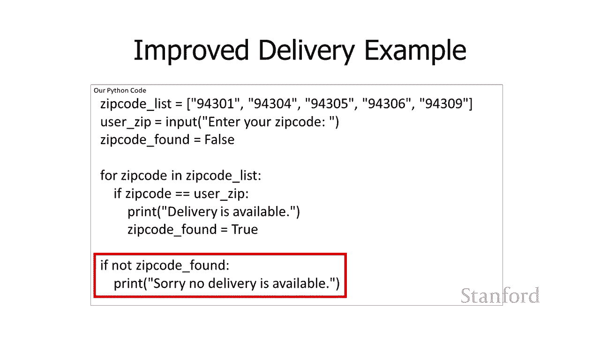

# 【双语字幕+资料下载】斯坦福CS105 ｜ 计算机科学导论(2021最新·完整版) - P52：L18.2- 列表和循环 - ShowMeAI - BV1eh411W72E

undefined，欢迎探索计算，欢迎探索计算，今天的视频是极乐和循环，今天的视频是极乐和循环，所以计算机真正，所以计算机真正，擅长的一件事是处理，擅长的一件事是处理，信息列表，这两者都是因为。

信息列表，这两者都是因为，我们并不真正喜欢处理，我们并不真正喜欢处理，大量信息，假设我们需要，大量信息，假设我们需要，对一个信息进行计算 单身斯坦福，对一个信息进行计算 单身斯坦福。

学生 就像也许我们正在，学生 就像也许我们正在，对单个斯坦福学生进行毕业检查，对单个斯坦福学生进行毕业检查，这听起来还不错，这听起来还不错，但是我们一切顺利，我们希望您，但是我们一切顺利，我们希望您。

对 12 000 名斯坦福学生进行毕业检查，对 12 000 名斯坦福学生进行毕业检查，这，这，听起来不是很有趣，所以，听起来不是很有趣，所以，另一方面，计算机不关心，另一方面，计算机不关心。

有多少项目，有多少项目，它们真的很擅长，它们真的很擅长，对，undefined，undefined，列表中的每个不同的人或列表中的每个，列表中的每个不同的人或列表中的每个，不同银行账户，不同银行账户。

或每个人进行完全相同的计算，或每个人进行完全相同的计算。

列表中的任何内容都不同，因此列表在计算机上，列表中的任何内容都不同，因此列表在计算机上，处理信息时非常常见，处理信息时非常常见，而且计算机，而且计算机，非常擅长处理大量信息，非常擅长处理大量信息，所以。

所以，在这里我们创建了几个 不同，在这里我们创建了几个 不同，的信息列表，的信息列表，我有一个年龄列表 我有一个，undefined，undefined，团队成员列表 你可以在每种情况下看到。

undefined，undefined，undefined，undefined，用逗号分隔的项目数，后跟一个，用逗号分隔的项目数，后跟一个，结束方括号，这将，结束方括号，这将，继续创建我的列表，我可以。

继续创建我的列表，我可以，继续将列表存储在变量中，继续将列表存储在变量中，因此我将我的年龄列表存储到年龄，因此我将我的年龄列表存储到年龄，变量中我存储我的列表 团队成员变量中的名称，undefined。

undefined，因此您可能会遇到的另一件事，因此您可能会遇到的另一件事，是空，是空，列表，空列表是一个没有项目的列表，列表，空列表是一个没有项目的列表，呃，这是，呃，这是，一个空列表，我要开始我的。

一个空列表，我要开始我的，课程列表，我不” 它还没有，课程列表，我不” 它还没有，注册任何课程，注册任何课程，所以我有一个开放的方括号，所以我有一个开放的方括号，后跟一个封闭的方括号。

后跟一个封闭的方括号，这表明我确实有一个列表，这表明我确实有一个列表，该列表可供，该列表可供。

我上课，但我没有 其中有任何，我上课，但我没有 其中有任何，类，但，类，但，我们可以使用另一个方形 br 访问列表中的单个项目，undefined，undefined，acket 表示法，如果我。

acket 表示法，如果我，有一个列表的名称，有一个列表的名称，后跟方括号，后跟，undefined，undefined，我想要访问的列表中项目的特定索引号，我想要访问的列表中项目的特定索引号。

这将允许我访问，这将允许我访问，列表中的一个项目，列表中的一个项目，所以在这种情况下我是 现在访问，所以在这种情况下我是 现在访问，我的团队成员列表中的第二项，我的团队成员列表中的第二项。

您可能认为这会很，您可能认为这会很，困难，但实际上并不是因为，困难，但实际上并不是因为，事实证明，事实证明，python 和许多其他编程，python 和许多其他编程，语言，但事实证明并非所有，语言。

但事实证明并非所有，编程语言都感谢大家，编程语言都感谢大家，开始编号列表 零所以在，开始编号列表 零所以在，这种情况下，这种情况下，kc 将是项目零 hank 将是项目。

kc 将是项目零 hank 将是项目，一，一，而 tammy 将是项目二 所以这将，而 tammy 将是项目二 所以这将。

实际打印字符串 tammy，实际打印字符串 tammy，我们也可以使用这种格式呃这个，我们也可以使用这种格式呃这个，方括号格式来，方括号格式来，更改列表中的项目所以如果我 说。

更改列表中的项目所以如果我 说，团队成员，团队成员，再次括号 呃我们有凯西的，再次括号 呃我们有凯西的，项目零汉克的第一所以，项目零汉克的第一所以，现在我实际上在做的是我，现在我实际上在做的是我。

分配到团队成员，分配到团队成员，获胜所以我分配，获胜所以我分配，到汉克目前占据的位置，到汉克目前占据的位置，他实际上没有，他实际上没有，插入这个新的团队成员 这，插入这个新的团队成员 这。

实际上替换了这个当前的团队，实际上替换了这个当前的团队，成员 所以，成员 所以。

hank 将被 joe 替换 在这里，hank 将被 joe 替换 在这里，可以使用 append 将项目添加到，可以使用 append 将项目添加到，现有列表的末尾，现有列表的末尾。

这使用了与我们略有不同的语法，这使用了与我们略有不同的语法，以前看到过，所以在这里我得到，以前看到过，所以在这里我得到，了课程列表，其中，了课程列表，其中，包含我们几分钟前出售该示例的原始空列表。

undefined，undefined，然后我使用课程列表点附加，因此，然后我使用课程列表点附加，因此，undefined，undefined，我采用了存储列表的变量的名称。

我采用了存储列表的变量的名称，我遵循它，我遵循它，句点或点，句点或点，后跟 append ，所以，后跟 append ，所以，这里的含义是，这里的含义是，我要附加，我要附加，列表，我要附加的，列表。

我要附加的，列表是预先看到该句点的列表，所以在，列表是预先看到该句点的列表，所以在，这种情况下，我是，这种情况下，我是，添加到课程列表中，所以它看起来，undefined，undefined。

与我们之前看到的有点不同，与我们之前看到的有点不同，undefined，undefined，因为你会在一分钟内发现它们，因为你会在一分钟内发现它们，有点混淆，有点混淆，呃何时使用这种格式并想要。

undefined，undefined，使用我们以前的格式 一直在用我，使用我们以前的格式 一直在用我，觉得有点混乱 b，觉得有点混乱 b，这就是python定义的方式它。

这就是python定义的方式它，看起来没问题所以课程下划线列表，看起来没问题所以课程下划线列表，点附加意味着我要附加到，点附加意味着我要附加到，课程列表，课程列表，然后我继续附加cs105我。

然后我继续附加cs105我，可以附加ihem 6a我可以附加，可以附加ihem 6a我可以附加，econ 1a所以运行后的最终结果，econ 1a所以运行后的最终结果，这四行代码将是，这四行代码将是。

我有一个包含三个类的列表，我有一个包含三个类的列表，tis 105，tis 105，i ham 6a and econ 1a，i ham 6a and econ 1a，[Music，[Music。

] append 只允许您添加到，] append 只允许您添加到，列表的末尾有一个更高级的，列表的末尾有一个更高级的，插入，您可以使用如果 您想，插入，您可以使用如果 您想。

将项目放在中间列表中，但，将项目放在中间列表中，但，我们的课程不需要它，所以我现在，我们的课程不需要它，所以我现在，undefined，undefined，有时您会想，有时您会想，知道列表有多长。

所以您可以，知道列表有多长，所以您可以，通过取长度来确定列表有多长，undefined，undefined，所以我将把长度取短，所以我将把长度取短，undefined，undefined。

我将有一对括号，我将有一对括号，我将传入列表，我将传入列表，传入一个存储列表的变量，传入一个存储列表的变量，和 它将返回一个数字，因此在这种，和 它将返回一个数字，因此在这种，特殊情况下，特殊情况下。

因为我的列表中有三门课程，因为我的列表中有三门课程，这将是公关 我正在学习，这将是公关 我正在学习。

三个类，三个类，我们想要对列表做的最常见的事情之一，我们想要对列表做的最常见的事情之一。

是处理列表中的项目，是处理列表中的项目，undefined，undefined，我们将使用 for，我们将使用 for，循环控制结构来做到这一点，作为，循环控制结构来做到这一点，作为，提醒，提醒。

控制结构允许我们控制，控制结构允许我们控制，语句何时被执行，语句何时被执行，有时它们被执行多少次，undefined，undefined，我们在上一课看到的条件控制结构，我们在上一课看到的条件控制结构。

在条件为真时执行一些语句，当，在条件为真时执行一些语句，当，条件为真时，条件为真时，它也可能会执行另一组，它也可能会执行另一组，语句 false，语句 false，所以我们看了一下 if。

所以我们看了一下 if。

语句 if else 语句和链接的 if，语句 if else 语句和链接的 if，else 语句，else 语句，上一课 循环控制结构，上一课 循环控制结构，将允许我们一遍又一遍地执行相同的代码。

undefined，undefined，这个最简单的有几个不同的版本，这个最简单的有几个不同的版本，对列表，对列表，中的所有项目一遍又一遍地执行代码，中的所有项目一遍又一遍地执行代码。

undefined，undefined，您也可以一遍，您也可以一遍，又一遍地执行相同的代码一定次数，又一遍地执行相同的代码一定次数，您也可以 一遍又一遍地执行相同的代码。

您也可以 一遍又一遍地执行相同的代码，直到某个特定，直到某个特定，条件为真，条件为真，我们只看第一个，我们只看第一个，它是最直接的它，它是最直接的它，很容易使用，很容易使用。

而且非常有用所以，而且非常有用所以，这是我们的第一个例子 循环，这是我们的第一个例子 循环，嗯，我将打印，嗯，我将打印，出我正在学习的每个类，出我正在学习的每个类，所以它，所以它，的工作方式是我。

的工作方式是我，在 for 循环中创建一个新变量，在这种情况，在 for 循环中创建一个新变量，在这种情况，下，变量的课程，下，变量的课程，以及这里将要发生的事情是，以及这里将要发生的事情是，课程将。

课程将，对于，undefined，undefined，我之前设置的第二个变量here course list中的每个值设置为一个不同的值。

我之前设置的第二个变量here course list中的每个值设置为一个不同的值，我们早一点看到这，我们早一点看到这，是我附加，是我附加，了一堆，了一堆，不同项目的列表，所以，不同项目的列表，所以。

会发生什么是中的语句，undefined，undefined，在这种情况下，我，在这种情况下，我，正在学习的 for 循环，正在学习的 for 循环。

将针对课程列表的每个不同值一次执行一个，undefined，undefined，undefined，undefined，undefined，以前我，以前我，向它添加了所有项目，或者，向它添加了所有项目。

或者，这次我们只是，这次我们只是，假设它已经初始预定义，假设它已经初始预定义，所以，所以，这里有我的课程列表，呃这里是我，这里有我的课程列表，呃这里是我，的小循环，的小循环，我们要做的是，我们要做的是。

将执行，将执行，不同，不同，的循环迭代，因此，的循环迭代，因此，循环迭代意味着，循环迭代意味着，我们将返回，我们将返回，并一遍又一遍地执行 for 循环中的语句。

并一遍又一遍地执行 for 循环中的语句，因此每个，因此每个，循环都是不同的迭代，因此在第一个，循环都是不同的迭代，因此在第一个，迭代，迭代，呃这里将要发生的是，undefined，undefined。

在 for 循环中设置的 course 变量，在 for 循环中设置的 course 变量，最初将设置为 cs105，最初将设置为 cs105，然后我将打印我正在使用，然后我将打印我正在使用。

cs105，cs105，然后是循环的第二次迭代。然后是循环的第二次迭代。将返回，将返回，我将把 course 变量的值重置，undefined，undefined，为 ihum 6a。

为 ihum 6a，然后我将执行，然后我将执行，语句打印，语句打印，在这种情况下它将执行，在这种情况下它将执行，相当于我正在打印的打印，相当于我正在打印的打印，然后呃 它将检索变量。

然后呃 它将检索变量，的值 所以就好像我在 ihon6a 那里有，的值 所以就好像我在 ihon6a 那里有，那个，那个，字符串，它会，字符串，它会，打印出我正在接受，打印出我正在接受。

我是 6a 然后呃我们还有一次，我是 6a 然后呃我们还有一次，迭代第三次迭代，迭代第三次迭代，呃课程将被设置为 econ，呃课程将被设置为 econ，1a，1a，呃这将打印我正在接受 econ。

呃这将打印我正在接受 econ，1a，1a，并且有我的输出所以它完全，并且有我的输出所以它完全。

符合我们，符合我们，现在的预期你可以认为这个，现在的预期你可以认为这个，循环相当于，循环相当于，呃非循环版本打印我正在接受，呃非循环版本打印我正在接受，cs105 打印我是 使用 im 6a。

cs105 打印我是 使用 im 6a，打印我正在使用 econ 1a 但是，打印我正在使用 econ 1a 但是，因为我们在 for 循环中执行此操作，所以，因为我们在 for 循环中执行此操作。

所以，我们有更大的灵活性，我们可以，我们有更大的灵活性，我们可以，更改列表中的所有项目，更改列表中的所有项目，它会自动更改，它会自动更改，打印的次数，打印的次数。

因此循环是 当我们处理项目列表时，它非常有用且非常，因此循环是 当我们处理项目列表时，它非常有用且非常，重要，undefined，undefined，所以让我们快速浏览一下循环的语法。

所以让我们快速浏览一下循环的语法，这样我们就得到了那个词 for 并且我们得到，这样我们就得到了那个词 for 并且我们得到，了 in，了 in，和 uh 然后我们得到了，和 uh 然后我们得到了。

那些冒号在第一行末尾的冒号，那些冒号在第一行末尾的冒号，所以这些都是，所以这些都是，必需的，这些都是 o 最后，undefined，undefined，复制四个，你会记得那些，复制四个，你会记得那些。

是我们所说的保留字或，是我们所说的保留字或，关键字，关键字，嗯，这个想法是，嗯，这个想法是，为 python 语言保留的，我，为 python 语言保留的，我，不能命名一个变量四我 不能。

不能命名一个变量四我 不能，在其中命名变量会使 get python，在其中命名变量会使 get python，非常困惑所以不要这样做，非常困惑所以不要这样做，然后我得到了循环变量。

然后我得到了循环变量，所以这将是，所以这将是，第一次提到循环变量，第一次提到循环变量，它将是，它将是，在循环内部使用来，在循环内部使用来，表示，表示，下一个变量中的不同值，该变量是一个列表变量。

下一个变量中的不同值，该变量是一个列表变量，我应该提到的是，如果您希望实际上可以放置一个列表，则，我应该提到的是，如果您希望实际上可以放置一个列表，则，实际上不必，实际上不必。

在结束后的第二个位置中有一个变量，undefined，undefined，直接在那里，直接在那里，它通常作为一个变量不太常见，它通常作为一个变量不太常见，但它是可能的，但它是可能的。

所以在这里我已经替换了我们之前的代码，我，所以在这里我已经替换了我们之前的代码，我，在，在，那里引用了课程下划线，那里引用了课程下划线，列表变量，我，列表变量，我，undefined。

undefined，刚刚在列表中替换了它 就在那里，刚刚在列表中替换了它 就在那里，这是可行的，这是可行的，好的，然后我们有了我们的语句，好的，然后我们有了我们的语句，这些语句将，这些语句将。

undefined，undefined，针对循环变量的每个值一遍又一遍地执行，undefined，undefined，嗯，我想提一下，嗯，我想提一下，可能，可能，有多个语句，所以在这里我，有多个语句。

所以在这里我，我正在打印两个语句我正在，我正在打印两个语句我正在，打印我正在学习，打印我正在学习，然后我打印课程名称我，然后我打印课程名称我，也在，也在。

打印课程很有趣它也，打印课程很有趣它也，可以，可以，undefined，undefined，在 for 循环之前和之后都有语句 嗯，所以如果你，在 for 循环之前和之后都有语句 嗯，所以如果你。

在 for 循环之前有语句，在 for 循环之前有语句，呃，那些将在我们进入循环之前完成一次，呃，那些将在我们进入循环之前完成一次，如果你，如果你，在 for 循环之后有语句，那些将。

undefined，undefined，在我们完成 for 循环后完成一次，所以 python 的，在我们完成 for 循环后完成一次，所以 python 的，方式，方式，是 要，是 要。

确定实际上一遍又一遍重复的内容，确定实际上一遍又一遍重复的内容，是通过缩进，所以在，是通过缩进，所以在，这种情况下，这里，这种情况下，这里，的打印我的日程安排是只有在打印我一次。

的打印我的日程安排是只有在打印我一次，又一次地重复发生的，又一次地重复发生的，过程中才会，过程中才会，发生，发生，然后他们打印我 可能会增加更多 后来，然后他们打印我 可能会增加更多 后来。

这一切都将发生一次，这一切都将发生一次，python 可以区分每门课程，undefined，undefined，一遍又一遍地发生的打印语句与只发生一次的打印语句之间的区别，undefined。

undefined，undefined，undefined，是缩进，因为我，是缩进，因为我，正在学习的打印语句，正在学习的打印语句，是 缩进 嗯，这是，是 缩进 嗯，这是，undefined。

undefined，从属于 for 循环的那个，它，从属于 for 循环的那个，它，会一遍又一遍地打印出来，undefined，undefined，我们可以添加，我们可以添加。

我们想要一遍又一遍地执行的附加语句，我们想要一遍又一遍地执行的附加语句，但它们，但它们。

需要是 缩进，需要是 缩进，与我们已经到达的那个级别相同，undefined，undefined，好吧让我们来，好吧让我们来，看看更复杂的东西 所以这是一个，看看更复杂的东西 所以这是一个，例子。

我试图确定，例子，我试图确定，披萨交付是否适用，披萨交付是否适用，于特定邮政编码等等，于特定邮政编码等等，我将继续并提出一个，我将继续并提出一个，邮政编码列表，邮政编码列表，然后我将询问用户。

然后我将询问用户，他们的邮政编码是什么，他们的邮政编码是什么，所以我们在 for 循环中获得了我们的变量，undefined，undefined，邮政编码变量，那就是 ，邮政编码变量，那就是 。

将更改其值的，将更改其值的，那个将是，那个将是，94301 开始然后它将是，94301 开始然后它将是，94304，94304，94305 依此类推然后，94305 依此类推然后，for 循环中的语句。

for 循环中的语句，缩进那些将被，缩进那些将被，一遍又一遍地执行和 再次查看，一遍又一遍地执行和 再次查看，undefined，undefined，undefined，undefined。

如果您仔细查看，您可能会注意到的一件事，如果您仔细查看，您可能会注意到的一件事，是，是，如果我们在列表中遇到，如果我们在列表中遇到，与用户输入的邮政编码相同的邮政编码。

与用户输入的邮政编码相同的邮政编码，让我们 假设用户，让我们 假设用户，输入 94305，输入 94305，然后我们将打印可用的交付，然后我们将打印可用的交付，但您可能会注意到，如果我们输入一个。

但您可能会注意到，如果我们输入一个，不存在的邮政编码，不存在的邮政编码，例如 uh 90210，例如 uh 90210，um，um，根本没有打印语句发生，根本没有打印语句发生。

基本上用户不会看到任何输出，基本上用户不会看到任何输出，他们会想知道发生了什么，他们会想知道发生了什么，所以我们稍后会解决，所以我们稍后会解决，它实际上有点复杂，它实际上有点复杂。

所以这将是我们这次讲座的最后一件事，所以这将是我们这次讲座的最后一件事，undefined，undefined。

但我确实想提一下，但我确实想提一下，我们要做什么 现在要做的是我们要，我们要做什么 现在要做的是我们要，看看更多的例子 o  f for，看看更多的例子 o  f for，循环，循环。

在第一个示例中起作用，我们将添加，在第一个示例中起作用，我们将添加，列表中的所有值，因此我有一个，列表中的所有值，因此我有一个，包含 100 200 150，包含 100 200 150。

400 的列表，我想知道，400 的列表，我想知道，所有这些值的总和是多少，所以，所有这些值的总和是多少，所以，我们 有一点 for 循环我们，undefined，undefined。

在我的列表中的 for loop4 数字中有我们的变量数字，在我的列表中的 for loop4 数字中有我们的变量数字，正如您所知，正如您所知，数字将依次设置为，数字将依次设置为。

我们列表中的每个不同值 100 200 150，我们列表中的每个不同值 100 200 150，和 400，和 400，然后我们 已经得到了那个缩进，然后我们 已经得到了那个缩进，的语句，它将，的语句。

它将，对每个数字执行一次，一次为，对每个数字执行一次，一次为，100，一次为 200，一次为 450，一次为，100，一次为 200，一次为 450，一次为，400。400。现在那里的语句总数等于。

现在那里的语句总数等于，总数加上，总数加上，数字，很多学生发现这有点，数字，很多学生发现这有点，令人困惑，因为，令人困惑，因为，你知道 如果你这么想的话，你知道 如果你这么想的话，好像我在说。

好像我在说，一等于一加，一等于一加，一，就像总和加上，一，就像总和加上，别的东西，除非数字为零，所以，别的东西，除非数字为零，所以，这不是，这不是，思考它，思考它，的正确方式正确的思考方式 关于那个。

的正确方式正确的思考方式 关于那个，等号不是因为左边的东西，等号不是因为左边的东西，是 t 他和右边的事情一样，是 t 他和右边的事情一样，思考它的方式是，思考它的方式是，我将执行，undefined。

undefined，等号右侧的动作，我，等号右侧的动作，我，将存储这些动作产生的结果，undefined，undefined，以及 我将把它存储到等号，以及 我将把它存储到等号，左侧的变量中。

左侧的变量中，所以，所以，当我们开始运行它时，并不是说两者相等，undefined，undefined，它说的是我，它说的是我，在右边有一个计算，我要去，在右边有一个计算，我要去，继续执行该计算。

继续执行该计算，无论结果如何，无论结果如何，您都知道右侧的计算是否，您都知道右侧的计算是否，包括 total 的当前，包括 total 的当前，值，值，我真的不在乎，undefined。

undefined，我要存储的结果是什么 作为total的新，我要存储的结果是什么 作为total的新，值所以在这种特殊情况下，值所以在这种特殊情况下。

total等于total plus number意味着现在，total等于total plus number意味着现在，检索total变量，undefined，undefined。

的值添加一个新的将number变量的值添加，的值添加一个新的将number变量的值添加，undefined，undefined，到total变量的当前值，到total变量的当前值，取结果，取结果。

值 他们两个加在一起，值 他们两个加在一起，并将其作为新结果存储，并将其作为新结果存储，到 total 中，所以这不是说，到 total 中，所以这不是说，total 最初等于 total plus。

total 最初等于 total plus，number，number，而是说在，而是说在，执行 total plus number 之后取，执行 total plus number 之后取。

该计算的结果，然后，该计算的结果，然后，将其存储，将其存储，回 total 所以你知道我们 确实，回 total 所以你知道我们 确实，使用等号，但，使用等号，但，如果你被它弄糊涂了，你。

如果你被它弄糊涂了，你，可能不想把，可能不想把，它看作一个等号，而是把它看作一个，它看作一个等号，而是把它看作一个，运算符，它说赋值，运算符，它说赋值，给左边的变量所以赋值，给左边的变量所以赋值，为。

为，total ，无论执行的值是什么，total ，无论执行的值是什么，计算总数加上，计算总数加上，数字是可以的，所以让我们实际，数字是可以的，所以让我们实际，走一遍这个，走一遍这个，嗯。

所以我们要经历我们的，嗯，所以我们要经历我们的，迭代记住呃迭代，迭代记住呃迭代，是我们给，是我们给，我们的for循环中语句的每个执行的名称，我们的for循环中语句的每个执行的名称，undefined。

undefined，所以在第一次迭代中总 最初是，所以在第一次迭代中总 最初是，零，因为，零，因为，我在开始，我在开始，for 循环之前将，undefined，undefined，undefined。

undefined，total 设置为零 总加数，total 设置为零 总加数，并取当前，并取当前，值为零，值为零，的当前值取当前值数，即，的当前值取当前值数，即，100 所以总加数。

100 所以总加数，是一百，所以在我执行这，是一百，所以在我执行这，整个语句后，整个语句后，总的新值将是一百，总的新值将是一百，次迭代两次总计是一百 这，次迭代两次总计是一百 这，就是，就是。

迭代第一次的结果，迭代第一次的结果，数字现在转移到下一个，数字现在转移到下一个，数字或列表，即 200，数字或列表，即 200，所以总数等于总数加数字 呃，所以总数等于总数加数字 呃，总数，总数。

最初是 100 数字是 200，所以 100 加，最初是 100 数字是 200，所以 100 加，200 是 300，200 是 300，所以这将是什么 它，所以这将是什么 它。

会计算 300 然后它，会计算 300 然后它，会继续并存储 300 作为，会继续并存储 300 作为，新值，新值，总可以 迭代三，总可以 迭代三，现在总共是 300 从迭代二。

现在总共是 300 从迭代二，呃数字现在 150 因为我们已经，呃数字现在 150 因为我们已经，转移到列表中的下一项，转移到列表中的下一项，um total 等于 total 加上数字。

um total 等于 total 加上数字，得到 450，得到 450，um 300 加上 150，um 300 加上 150，所以 total 的新值将是 450。

所以 total 的新值将是 450。然后最后 uh 从迭代 3，然后最后 uh 从迭代 3，undefined，undefined，开始的总数现在是 450，所以当迭代 4 开始时。

开始的总数现在是 450，所以当迭代 4 开始时，总数是 450。总数是 450。我们把它加到 数字是 400，所以如果，我们把它加到 数字是 400，所以如果，我将 450 迭代的总数的初始值。

我将 450 迭代的总数的初始值，undefined，undefined，加上数字的新，加上数字的新，值 400，我，值 400，我，得到 850，所以新的总数是 850，这，得到 850。

所以新的总数是 850，这，就是存储回总数的内容，就是存储回总数的内容，所以当我们问它时 要打印总计，它会，所以当我们问它时 要打印总计，它会，打印 850。打印 850。好吧。

我们可以继续进行求平均值，好吧，我们可以继续进行求平均值，这是我们，这是我们，可能想要对列表中的项目执行的另一种常见操作，可能想要对列表中的项目执行的另一种常见操作，因此您可以看到我要这样做的方式。

因此您可以看到我要这样做的方式，是，undefined，undefined，undefined，undefined，undefined，undefined，undefined，我要去参加总我要去进取。

创造总正如我在过去的例子一样通过输入列表并添加它们全部纳入共设置初始值总设置为零，那么同样的 继续，我要去参加总我要去进取。

创造总正如我在过去的例子一样通过输入列表并添加它们全部纳入共设置初始值总设置为零，那么同样的 继续，将列表中的每个单独的项目添加到总数中，将列表中的每个单独的项目添加到总数中。

这将使我得到我们之前看到的 850，undefined，undefined，我们要做的是，我们要做的是，获取列表的长度，获取列表的长度，记住 len，记住 len，函数 接受一个列表作为参数。

函数 接受一个列表作为参数，呃它返回该列表在这个列表中的长度，呃它返回该列表在这个列表中的长度，特殊情况，特殊情况，呃，我的列表是四个，里面有四个项目，所以，呃，我的列表是四个，里面有四个项目，所以。

undefined，undefined，我的列表长度会返回，我的列表长度会返回，4 我要用 850，4 我要用 850，除以 4，然后打印，除以 4，然后打印。

undefined，undefined，undefined，undefined，我们的交付示例的问题是，我们的交付示例的问题是，如果没有找到邮政编码，基本，如果没有找到邮政编码，基本。

版本根本不会做任何事情，所以，版本根本不会做任何事情，所以，基本上如果有人，基本上如果有人，在我们的邮政编码范围内，它会打印出来，在我们的邮政编码范围内，它会打印出来，嘿，我们可以交付给您，嘿。

我们可以交付给您，和 没关系，但是如果有人，和 没关系，但是如果有人，不在我们的邮政编码范围内，它，不在我们的邮政编码范围内，它，不会做任何事情，他们会，不会做任何事情，他们会，认为我们的，认为我们的。

程序破坏了它，所以这，程序破坏了它，所以这，不好，不好，所以我们想要做的是我们，所以我们想要做的是我们，想要确定是否 或者，想要确定是否 或者，打印交付是否可用，打印交付是否可用，实际上发生了。

所以要么，实际上发生了，所以要么，那个语句发生了，我们打印了，那个语句发生了，我们打印了，它，它，要么它没有发生，所以这是一个，要么它没有发生，所以这是一个，真假值，所以任何时候你有一个，真假值。

所以任何时候你有一个，真假值，真假值，你应该考虑布尔值，你应该考虑布尔值，记住 布尔变量 e，记住 布尔变量 e。

undefined，undefined，好吧，所以这是我第一次尝试修复，好吧，所以这是我第一次尝试修复，它，它，我要做的是继续添加一个，我要做的是继续添加一个，语句，并注意该，语句，并注意该。

语句与 打印，语句与 打印，交付可用，交付可用，我要说找到的邮政编码，我要说找到的邮政编码，等于真，所以这将要做的，等于真，所以这将要做的，是，如果我们碰巧运行，是，如果我们碰巧运行。

了列表中的邮政编码，了列表中的邮政编码，我们将打印该交付，我们将打印该交付，可用，我们 ' 还将在，可用，我们 ' 还将在，此处将，此处将，发现的邮政编码设置为 true。

发现的邮政编码设置为 true，这样大部分情况下都可以使用，这样大部分情况下都可以使用，但有一个，但有一个，问题，嗯，问题，嗯，如果邮政编码实际上不在打印语句中，则打印语句不运行。

如果邮政编码实际上不在打印语句中，则打印语句不运行，list，list，zip code found 永远不会设置 um 所以，zip code found 永远不会设置 um 所以。

我们真正想要做的是如果我们没有找到它，我们希望，我们真正想要做的是如果我们没有找到它，我们希望，它被设置为 false，它被设置为 false。

如果我们找到它，我们希望它被设置为 true，如果我们找到它，我们希望它被设置为 true，所以我们要这样做，undefined，undefined，undefined，在我们开始我们的 for。

在我们开始我们的 for，循环之前，我们是否要继续将 zip code found 设置为 false  for 循环，循环之前。

我们是否要继续将 zip code found 设置为 false  for 循环，如果我们碰巧在邮政编码中运行，如果我们碰巧在邮政编码中运行，那很好，那很好，我们将继续并打印，我们将继续并打印。

交付可用，交付可用，同时我们将重置发现的，同时我们将重置发现的，变量，变量，邮政编码，该邮政编码最初是错误的，邮政编码，该邮政编码最初是错误的，我们会说好的，将设置 之前是假的，我们会说好的。

将设置 之前是假的。

，但现在是真的，因为，但现在是真的，因为，我们发现您的邮政编码还可以，所以，我们发现您的邮政编码还可以，所以，我们要做的最后一件事，我们要做的最后一件事，就是在此基础上实际做一些事情。

就是在此基础上实际做一些事情，因此在我们，因此在我们，完成此循环后，找到的邮政编码，完成此循环后，找到的邮政编码，undefined，undefined，仍处于初始状态 值为，仍处于初始状态 值为。

false 这意味着我们没有遇到，false 这意味着我们没有遇到，邮政编码，或者，邮政编码，或者，我们已经浏览了列表，我们，我们已经浏览了列表，我们，找到了邮政编码，我们重置了，找到了邮政编码。

我们重置了，从 false 找到的邮政编码，现在设置为，从 false 找到的邮政编码，现在设置为，true，true，然后是我们需要的 要做的只是，然后是我们需要的 要做的只是，检查该值，并在此。

检查该值，并在此，基础上，基础上，您知道打印抱歉没有，您知道打印抱歉没有，可用的交付或不做任何事情因为，可用的交付或不做任何事情因为，我们已经打印了交付，我们已经打印了交付，可用，可用。

所以你可以看到我要找到邮政编码，undefined，undefined，然后你 可以看到我正在反转，然后你 可以看到我正在反转，结果所以我，结果所以我，在上一课中谈到了如何不，在上一课中谈到了如何不。

获取结果并翻转它，所以在这种，获取结果并翻转它，所以在这种，特殊情况下，特殊情况下，我们并不真正关心是否，我们并不真正关心是否，找到了邮政编码我们真正想知道的如果，找到了邮政编码我们真正想知道的如果。

没有，没有，找到邮政编码，所以不要把它放进去，找到邮政编码，所以不要把它放进去，找到的邮政编码前面实际上将其反转，因此，找到的邮政编码前面实际上将其反转，因此，如果找到的邮政编码为真，则未。

如果找到的邮政编码为真，则未，找到的邮政编码为假，我什么都不做，找到的邮政编码为假，我什么都不做，找到的邮政编码为假，因为它最初，找到的邮政编码为假，因为它最初，undefined，undefined。

不是邮政编码，发现假的实际上为，不是邮政编码，发现假的实际上为，真，因为再次没有 进行，真，因为再次没有 进行，反转，所以它打印，反转，所以它打印，对不起没有可用的交付所以它。

对不起没有可用的交付所以它，比我们开始的要复杂一些，比我们开始的要复杂一些，但是呃这确实让我们得到，但是呃这确实让我们得到，了我们想要的结果，了我们想要的结果，这就是本次讲座，这就是本次讲座。

我们接下来有一个，我们接下来有一个，简短的小视频，简短的小视频，谈论一些，谈论一些。

你可能会觉得很方便的额外的 Python 语言特性。

