# 【双语字幕+资料下载】斯坦福CS105 ｜ 计算机科学导论(2021最新·完整版) - P53：L19.1- 字符串 - ShowMeAI - BV1eh411W72E

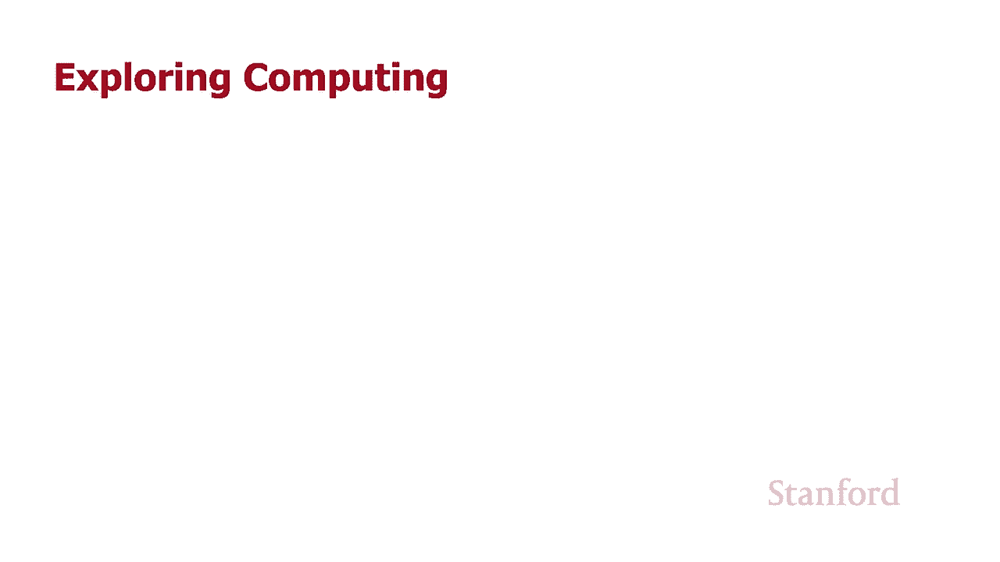

undefined，欢迎探索计算，欢迎探索计算，今天的视频是字符串，今天的视频是字符串，所以在这个视频中，我们将，所以在这个视频中，我们将。

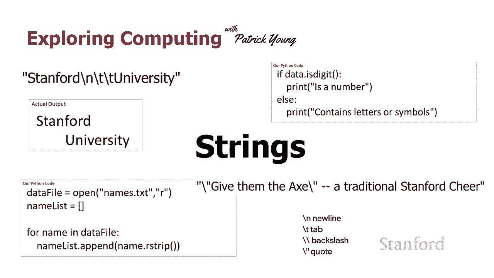

仔细看看字符串是如何，仔细看看字符串是如何，工作的，工作的，我想从，我想从，我们在上一个视频中遇到的这个问题开始，我们在上一个视频中遇到的这个问题开始，所以你记得，所以你记得，我是 写入文件，我有两个。

我是 写入文件，我有两个，写语句，我写了 go stanford，写语句，我写了 go stanford，然后我写了 go cardinal，而不是，然后我写了 go cardinal，而不是。

undefined，undefined，在一行中以 go stanford 而在另一行中以，在一行中以 go stanford 而在另一行中以，go cardinal 结束，当。

go cardinal 结束，当，我们实际打开文件时，我们，我们实际打开文件时，我们，发现，发现，go stanford 并转到基数最终，go stanford 并转到基数最终，在同一条线上，所以。

在同一条线上，所以。

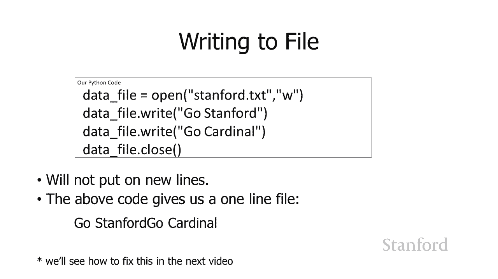

我将如何解决这个问题，我将如何解决这个问题，所以在顶部这里我们有我们，所以在顶部这里我们有我们，最终得到的和在底部我们有，最终得到的和在底部我们有，我们想要的，我们想要的，所以如果我们将这些表示为。

所以如果我们将这些表示为，字符串，字符串，这就是我们在这里会得到的所以，这就是我们在这里会得到的所以，在顶部引用 go stanford go cardinal。

在顶部引用 go stanford go cardinal，这就是我们最终得到的，这就是我们最终得到的，然后第二个，然后第二个，go stanford and go cardinal。

go stanford and go cardinal，这个斜杠 n 是什么，斜杠 n，undefined，undefined，就是我们所说的 一个转义，就是我们所说的 一个转义，序列。

在这个 p 特殊，序列，在这个 p 特殊，情况 斜线 n 代表，情况 斜线 n 代表，插入字符的新行，插入字符的新行，现在我们在，现在我们在，本季度的第一讲，本季度的第一讲，中谈到了计算机。

中谈到了计算机，用于表示行尾，用于表示行尾，的不同方式，这取决于，的不同方式，这取决于，我们是否使用 unix 机器或者，我们是否使用 unix 机器或者，我们正在使用 Windows 机器。

我们正在使用 Windows 机器，我们有一个非常老旧的旧 Mac，我们有一个非常老旧的旧 Mac，它们代表了不同的方式，它们代表了不同的方式，和 python，python 解释器，和 python。

python 解释器，实际上会，实际上会，知道您的特定计算机的正确表示，知道您的特定计算机的正确表示，它会将，它会将，斜线 anna 翻译成确切的，undefined，undefined。

undefined，undefined，您正在使用的特定计算机所必需的 ascii 字符或 unicode 字符序列，您正在使用的特定计算机所必需的 ascii 字符或 unicode 字符序列。

但我们有一种通用方法，但我们有一种通用方法，可以为 Python 设计用于使用的任何类型的计算机执行此操作，可以为 Python 设计用于使用的任何类型的计算机执行此操作，我们，我们，只是要表示。

只是要表示，它 带有斜杠 n 这被称为，它 带有斜杠 n 这被称为，转义序列，因为，转义序列，因为，那里的反斜杠，那里的反斜杠，向 python 表明它看到的下一个字符，undefined。

undefined，不被处理 通常我，不被处理 通常我，应该逃避处理字符的正常序列，应该逃避处理字符的正常序列，undefined，undefined，undefined。

并对下一个字符做一些特殊的事情，并对下一个字符做一些特殊的事情，所以不要把斜杠后面的 n，所以不要把斜杠后面的 n，当作一个常规的结尾，我，undefined，undefined。

在输出上打印出一个 n，这是什么，在输出上打印出一个 n，这是什么，如果你看到一个 n，你通常会这样做，它，如果你看到一个 n，你通常会这样做，它，说不，这是不同的，说不，这是不同的，呃。

有一个特殊的转义序列表，在，呃，有一个特殊的转义序列表，在，转义序列，转义序列，表中查找它，表中查找它，然后按照它说的，然后按照它说的，去做，然后在表中查找它 是哦，去做，然后在表中查找它 是哦。

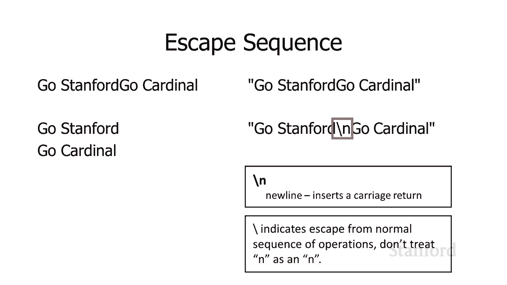

，斜线 n 不是一个常规的，斜线 n 不是一个常规的，n，它实际上是一个回车，n，它实际上是一个回车，所以有几个这样的，呃，所以有几个这样的，呃，可能是最常见的，你会，可能是最常见的，你会，遇到斜线。

遇到斜线，结尾，斜线 t 的斜线 n，结尾，斜线 t 的斜线 n，代表换行或回车，代表换行或回车，斜线 t 代表一个制表符，所以这里，斜线 t 代表一个制表符，所以这里。

我有字符串 stanford slash，我有字符串 stanford slash，ntt university ，所以它实际上，ntt university ，所以它实际上，代表，代表。

stanford 后跟一个新行，stanford 后跟一个新行，后跟两个制表符，后跟两个制表符，如果我们要实际查看，如果我们要实际查看，输出，这就是我们将看到的，输出，这就是我们将看到的。

应该在一行中看到斯坦福，应该在一行中看到斯坦福，大学在下一行，但，大学在下一行，但，在行首看不到大学，在行首看不到大学，因为有那两个斜杠 t，因为有那两个斜杠 t，代表制表符，所以大学用制表符标记。

代表制表符，所以大学用制表符标记，了一下，了一下，这里还有几个转义序列，这里还有几个转义序列，你可能会，你可能会，遇到一个问题是如何 你代表，遇到一个问题是如何 你代表，一个反斜杠，一个反斜杠。

你不能只在那里放一个反斜杠，你不能只在那里放一个反斜杠，因为这会启动转义序列，因为这会启动转义序列，所以如果你真的想要一个不常见的反斜杠，所以如果你真的想要一个不常见的反斜杠，但如果你真的想要。

但如果你真的想要，一个反斜杠，你必须连续放两个，一个反斜杠，你必须连续放两个，反斜杠，反斜杠，第一个反斜杠 说那是转义，第一个反斜杠 说那是转义，字符脱离正常序列，字符脱离正常序列，下一个反斜杠说哦。

呃这个，下一个反斜杠说哦，呃这个，特定的序列是反斜杠，特定的序列是反斜杠，反斜杠，它代表一个，反斜杠，它代表一个，反斜杠，反斜杠，好吧，我们也需要一个来，好吧，我们也需要一个来，表示引号，所以。

表示引号，所以，如果我想要一个引号，我会，如果我想要一个引号，我会，用 反斜杠，用 反斜杠，引用为什么我要做得那么好，引用为什么我要做得那么好，假设我实际上想要，假设我实际上想要。

在输出中引用所以假设我想要输出，在输出中引用所以假设我想要输出，引用给他们 ax end qu 请注意，引用给他们 ax end qu 请注意，传统的斯坦福欢呼，传统的斯坦福欢呼。

如果我只是将它放在一个字符串中，如果我只是将它放在一个字符串中，这就是字符串的样子，这就是字符串的样子，您可以通过我最后的小不符号或，您可以通过我最后的小不符号或，取消符号看到，取消符号看到。

不要这样做这里会发生什么是，undefined，undefined，我 用引号开始字符串，我 用引号开始字符串，我在欢呼之后用最右边的引号结束字符串，undefined，undefined。

然后我将双引号放在，然后我将双引号放在，中间，中间，所以这实际上将，所以这实际上将，被python解释的，被python解释的，方式它会看到 第一，方式它会看到 第一，对双引号 最初的双。

对双引号 最初的双，引号，引号，然后是双引号，用于给，然后是双引号，用于给，他们斧头，我会说哦，他们斧头，我会说哦，那是一个小字符串，那是一个小字符串，你可能还记得上一课我们，你可能还记得上一课我们。

有一个字符串，其中没有，有一个字符串，其中没有，字符 这是完全合法的，字符 这是完全合法的，嗯，这就是我们所说的，嗯，这就是我们所说的，空字符串，空字符串，然后它会在单词动作之后看到引号。

undefined，undefined，然后是破折号，然后是传统的斯坦福，然后是破折号，然后是传统的斯坦福，加油声，然后是引号，undefined，undefined，undefined。

是吗' 在这里混合成对的双，是吗' 在这里混合成对的双，引号，引号，这会说但是你在这里有这些，这会说但是你在这里有这些，词给他们，词给他们，斧头我不知道那是什么帕特里克我。

斧头我不知道那是什么帕特里克我，认为这是非法的我认为你，认为这是非法的我认为你，需要修复你的python代码，需要修复你的python代码，所以 这行不通 这行不通，所以 这行不通 这行不通。

undefined，undefined，undefined，undefined，因为它们是成对的 我无法将，因为它们是成对的 我无法将，实际的双引号，实际的双引号，放入我正在尝试创建的字符串中。

放入我正在尝试创建的字符串中，所以我解决这个问题的方法是，所以我解决这个问题的方法是，通过斜杠引号，通过斜杠引号，所以我说引用斜杠引号，所以我说引用斜杠引号，或反斜杠引号给他们 x。

或反斜杠引号给他们 x，反斜杠引号，反斜杠引号，一个传统的斯坦福欢呼，一个传统的斯坦福欢呼，会发生的事情是它将，会发生的事情是它将，看到第一个，看到第一个，双引号，它将看到，双引号，它将看到。

斜杠双引号，斜杠双引号，它将看到 先斜线，然后，它将看到 先斜线，然后，它会说好的，所以下一个字符我，它会说好的，所以下一个字符我，看到哪个，看到哪个，绝对双引号不只是把，绝对双引号不只是把。

它当作双引号，所以不要把，它当作双引号，所以不要把，它当作，它当作，你知道它与原始，你知道它与原始，双引号匹配，不，那是一个特殊，双引号匹配，不，那是一个特殊，字符，字符，也就是说它不应该被视为。

也就是说它不应该被视为，双 q  uote，双 q  uote，uh 字符，它将，uh 字符，它将，用我们的空字符串终止字符串，用我们的空字符串终止字符串，那实际上是哦，我想，那实际上是哦，我想。

在实际输出中加双引号，而，在实际输出中加双引号，而，不是作为分隔字符来，不是作为分隔字符来，描述字符串何时开始和，描述字符串何时开始和，字符串何时，字符串何时，结束，所以如果您碰巧需要双，结束。

所以如果您碰巧需要双。

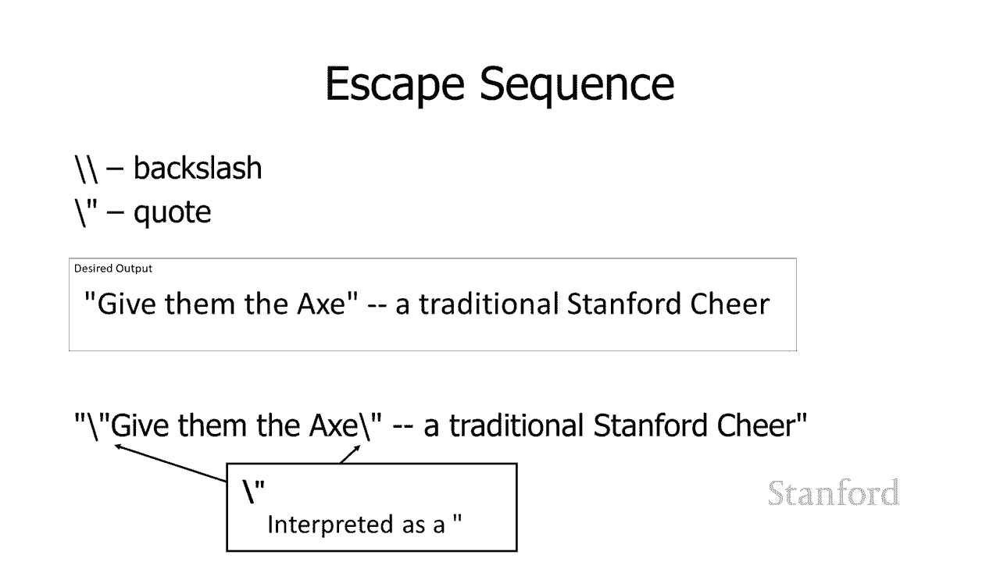

引号，undefined，undefined，如果你想开始用字符串做一些更，如果你想开始用字符串做一些更，有趣的事情，你会怎么做，有趣的事情，你会怎么做，需要注意的一件事是，需要注意的一件事是。

优势实际上，优势实际上，与列表非常相似，所以，与列表非常相似，所以，列表和字符串都充当序列，列表和字符串都充当序列，并且有 你，并且有 你，可以，可以，用 python 中的序列做的某些事情。

正如我们之前看到，用 python 中的序列做的某些事情，正如我们之前看到，的为了访问，的为了访问，列表中的单个元素，我们有方括号，列表中的单个元素，我们有方括号，表示法，所以，表示法，所以。

在这种情况下，我们有一个团队，在这种情况下，我们有一个团队，成员列表，我说我想，成员列表，我说我想，打印第二个 团队成员，但你会，打印第二个 团队成员，但你会，记得它实际上从零开始编号。

记得它实际上从零开始编号，所以凯西将是零 hank 将是一个，所以凯西将是零 hank 将是一个，tammy 将是两个，所以这，tammy 将是两个，所以这，实际上会打印单词 tammy。

实际上会打印单词 tammy，和这里 我有一个名称，和这里 我有一个名称，它是一个字符串 stanford，我告诉，它是一个字符串 stanford，我告诉，它打印，它打印，名称括号零，所以这。

名称括号零，所以这，将做的，将做的，是我可以访问，是我可以访问，字符串中的每个单个字符，所以，字符串中的每个单个字符，所以，字符串所以名称 0 将是，字符串所以名称 0 将是。

名称 1 将 是 t name 2 将是，名称 1 将 是 t name 2 将是，name 3 将是 n 等等，所以在这种，name 3 将是 n 等等，所以在这种，情况下，如果我说实际，情况下。

如果我说实际，undefined，undefined，打印 si 的 print name 0 应该提醒您，尽管，打印 si 的 print name 0 应该提醒您，尽管，与，与，列表中的元素相反。

我可以在其中，列表中的元素相反，我可以在其中，访问单个元素，访问单个元素，列表，不仅可以访问并，undefined，undefined，使用列表获取信息我实际上可以将，使用列表获取信息我实际上可以将。

元素放入列表中，我们实际上无法，元素放入列表中，我们实际上无法，使用字符串执行此操作，使用字符串执行此操作，因此，如果我尝试将 s，因此，如果我尝试将 s，替换为其他一些实际上，替换为其他一些实际上。

不会出现的字母 为了正常，不会出现的字母 为了正常，工作，我们之前也看到我们，工作，我们之前也看到我们，可以获得，可以获得，项目列表的长度，所以在这里我，项目列表的长度，所以在这里我。

取的是课程列表的长度，取的是课程列表的长度，班级数量，班级数量，所以这就像我认为我们的，所以这就像我认为我们的，例子有三个班级，所以这，例子有三个班级，所以这，会，会，我正在上三节课，我们 可以。

我正在上三节课，我们 可以，用强度做同样的事情，所以如果我，用强度做同样的事情，所以如果我，说，说，长度名称，其中名称，长度名称，其中名称，undefined，undefined，是实际打印数字。

是实际打印数字，8 的强度 stanford 因为，8 的强度 stanford 因为。

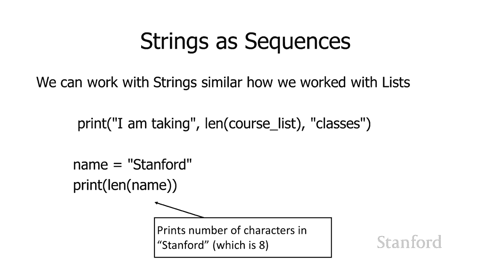

undefined，undefined，当我一直在谈论利用时，您可能已经注意到一件事，undefined，undefined，undefined，undefined。

Python 中内置的一些功能您可能已经，Python 中内置的一些功能您可能已经，undefined，undefined，注意到我们访问这些功能的不同方式之间存在差异。

注意到我们访问这些功能的不同方式之间存在差异，所以您知道我已经告诉过您，嘿，所以您知道我已经告诉过您，嘿，您知道您可以继续获取，您知道您可以继续获取，某些内容的长度并，某些内容的长度并。

打印一些内容 你可以继续，打印一些内容 你可以继续，关闭文件，你可以继续并，关闭文件，你可以继续并，附加一个文件，附加一个文件，实际上，实际上，它们的访问方式，它们的访问方式，有所不同。

其中一些我只是有呃的名称，有所不同，其中一些我只是有呃的名称，它被称为，它被称为，函数，函数，然后是 一对括号，然后是 一对括号，后跟我们需要的任何信息，后跟我们需要的任何信息，长度后跟存储序列的变量。

undefined，undefined，最初是一个项目列表，现在我们，最初是一个项目列表，现在我们，可以看到，可以看到，你可以传入一些东西 ng，你可以传入一些东西 ng，指的是一个项目列表。

或者你可以，指的是一个项目列表，或者你可以，传入一些东西来引用字符串，传入一些东西来引用字符串，我们将继续打印，我们将继续打印，出字符串中的项目数，出字符串中的项目数。

我们肯定已经用 print 语句这样做了，我们肯定已经用 print 语句这样做了，我们可以打印，比如 print 和 然后传入，我们可以打印，比如 print 和 然后传入，一个字符串，一个字符串。

或一个数字，它会继续，或一个数字，它会继续，打印出来，事实上我们看到你，打印出来，事实上我们看到你，undefined，undefined，实际上可以要求它，实际上可以要求它，在同一行中打印一堆东西。

所以这些，在同一行中打印一堆东西，所以这些，就是我们所说的带有，就是我们所说的带有，函数的函数 你只是有，函数的函数 你只是有，我告诉你的名字，我告诉你使用如此，我告诉你的名字，我告诉你使用如此。

长度或打印或任何，长度或打印或任何，后跟括号的东西，后跟括号的东西，相比之下，另一种做事方式，undefined，undefined，是一种方法，我们有一个，是一种方法，我们有一个，现有的变量。

现有的变量，那是指一个项目，后跟，那是指一个项目，后跟，一个点，一个点，然后是你的名字，然后是你的名字，我告诉过你使用这个方法，后跟，我告诉过你使用这个方法，后跟，一对括号，所以，一对括号，所以。

在关闭文件时，我有，在关闭文件时，我有，一个变量的名称，它指的是文件，一个变量的名称，它指的是文件，后跟一个点，后跟 cl  ose，后跟一个点，后跟 cl  ose，由成对括号提交，由成对括号提交。

我们也用钢笔看到了这个，所以，我们也用钢笔看到了这个，所以，用钢笔我有，用钢笔我有，一个变量的名称，它指，一个变量的名称，它指，的是一个列表，的是一个列表，后跟点，然后是一支笔，后跟点，然后是一支笔。

然后是我想，然后是我想，附加到该列表的项目，附加到该列表的项目，所以 我不想在这里过多地讨论，所以 我不想在这里过多地讨论，技术细节，但我确实想，技术细节，但我确实想，承认，承认，是的，有两件事看起来。

是的，有两件事看起来，像是在做同样的，像是在做同样的，事情，但它们有不同的语法，事情，但它们有不同的语法，规则，规则，所以最重要的是 我们的目的是，所以最重要的是 我们的目的是，它们有，它们有。

完全不同的访问方式，完全不同的访问方式，我不是，我不是，说完全不同但它们有，说完全不同但它们有，不同的明显不同的，不同的明显不同的，方式来访问它们所以，方式来访问它们所以，你确实需要知道你是。

你确实需要知道你是，在使用函数还是方法，在使用函数还是方法，以及在 为什么它们，以及在 为什么它们，在某些情况下不同，你可以做一个或，在某些情况下不同，你可以做一个或，另一个，另一个。

但真正发生的事情是，undefined，undefined，undefined，undefined，当你编写复杂的程序时，函数和方法用于组织程序的方式有所不同，当你编写复杂的程序时。

函数和方法用于组织程序的方式有所不同，无论是 你使用一个或，无论是 你使用一个或，另一个它会对，另一个它会对，你的整体程序的组织方式产生影响，你的整体程序的组织方式产生影响，并且在，并且在。

它们的实现方式方面肯定存在差异，undefined，undefined，为了，为了，理解这些方法实际上是如何工作的，你更容易自己编写函数，理解这些方法实际上是如何工作的，你更容易自己编写函数，相当混乱。

你需要，相当混乱，你需要，对 python 如何工作的细节有相当多的了解，对 python 如何工作的细节有相当多的了解，才能正确使用，才能正确使用。

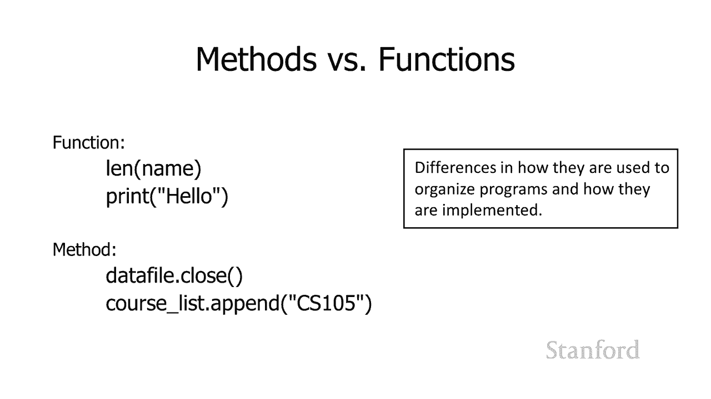

undefined，undefined，所以通过这个小小的讨论，所以通过这个小小的讨论，我有很多方法我想，undefined，undefined，谈谈，我们将要讨论 需要呃其中，谈谈。

我们将要讨论 需要呃其中，一些来处理文件，所以，一些来处理文件，所以，在这里请耐心等待，我们不需要将第一，在这里请耐心等待，我们不需要将第一，对用于文件，但呃，对用于文件，但呃，它们非常简单，所以我。

它们非常简单，所以我，想从这些开始，想从这些开始，所以 is digit 方法返回 true，所以 is digit 方法返回 true，如果字符串仅由数字组成，如果字符串仅由数字组成，那么，那么。

假设您知道我一直在，假设您知道我一直在，阅读文件，并且我一直在，阅读文件，并且我一直在，通过，通过，调用 int 或 float 并转换为数字来转换，调用 int 或 float 并转换为数字来转换。

数字，数字，也许我们有一个包含一堆的文件，也许我们有一个包含一堆的文件，混合数字 在一堆，混合数字 在一堆，名字中，我只想转换，名字中，我只想转换，那些实际上是，那些实际上是，数字的，我怎么知道哪个是。

数字的，我怎么知道哪个是，数字，哪个，数字，哪个，不好，所以你可以这样做的一种方法是，不好，所以你可以这样做的一种方法是，有一个 is，有一个 is，数字适用于字符串和 它，数字适用于字符串和 它。

返回真或假，返回真或假，你可以在这里看到我们的小例子，你可以在这里看到我们的小例子，如果数据点是数字，如果数据点是数字，那么这是我们的方法调用，我们，那么这是我们的方法调用，我们，在一分钟前看到。

在一分钟前看到，一个变量的名称，引用字符串，一个变量的名称，引用字符串，后跟一个点，后跟一个点，后跟方法的名称，后跟方法的名称，这种情况是一对括号的数字下降，这种情况是一对括号的数字下降。

undefined，undefined，呃那对，呃那对，括号是否为空取决于，括号是否为空取决于，我们使用的特定方法，我们使用的特定方法，嗯 好的 所以如果数据是数字 打印。

嗯 好的 所以如果数据是数字 打印，是一个数字 其他包含字母或，是一个数字 其他包含字母或，符号，符号，所以如果数据 是一个存储字符串的变量，所以如果数据 是一个存储字符串的变量，1 2，1 2。

3 4 数据点是数字会说是的，3 4 数据点是数字会说是的。

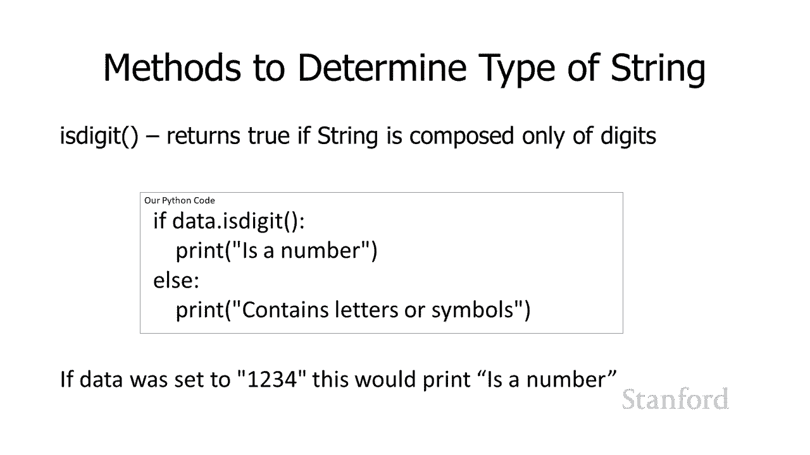

这完全由数字组成所以，这完全由数字组成所以，它会继续打印为数字，它会继续打印为数字，好的是阿尔法是相反，好的是阿尔法是相反，的阿尔法说这将返回，的阿尔法说这将返回，真，真，如果圣 环仅由字母组成。

undefined，undefined，因此如果数据点是 alpha，则，因此如果数据点是 alpha，则，打印所有字母，否则打印包含，打印所有字母，否则打印包含，数字或符号，数字或符号。

因此如果数据设置为引用 z24，因此如果数据设置为引用 z24，这将打印包含数字或，这将打印包含数字或。

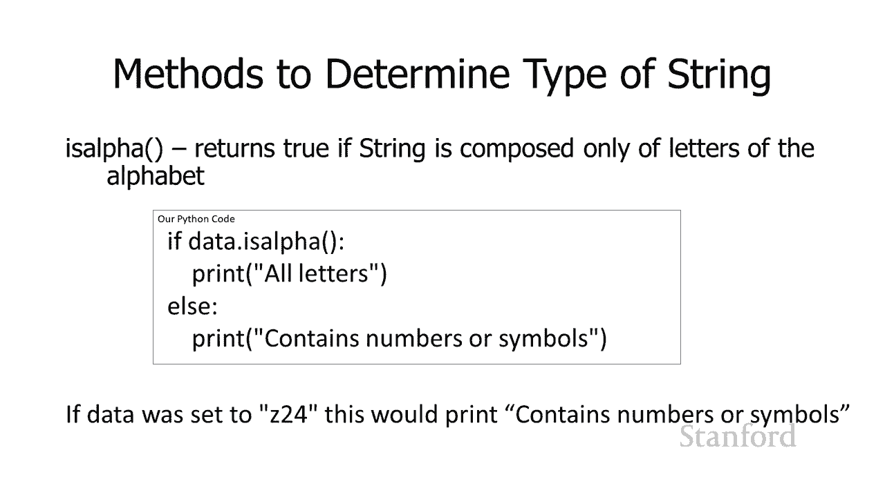

符号，因为那里有两个四，符号，因为那里有两个四，所以 这是我们真正需要的那些，undefined，undefined，所以我，所以我，在，在，空白指的是任何，空白指的是任何。

在屏幕上创建空白的字符之前提到了空白的概念，在屏幕上创建空白的字符之前提到了空白的概念，所以这几乎就是你知道的空间，所以这几乎就是你知道的空间，如果你有一大堆，如果你有一大堆。

显然会去的空格 在文档中生成，显然会去的空格 在文档中生成，一堆空格，一堆空格，如果您有，如果您有，一堆制表符，一堆制表符，在文档中的文档空白处生成一堆空白，在文档中的文档空白处生成一堆空白。

回车 如果，回车 如果，您有一堆字符则，您有一堆字符则，您正在创建一个 一堆空白行，您正在创建一个 一堆空白行，因此这将，因此这将，在文档中创建大量空白，因此再次，在文档中创建大量空白，因此再次。

创建这些，创建这些，空白的字符，我们将它们，空白的字符，我们将它们，组合在一起，然后说，组合在一起，然后说，哦 ose 是产生，哦 ose 是产生，空白的字符，空白的字符，因此这些是删除。

因此这些是删除，空白的方法 l strip，空白的方法 l strip，删除字符串左侧的，undefined，undefined，空白 我们的 Strip 删除，空白 我们的 Strip 删除。

字符串右侧的空白，字符串右侧的空白。

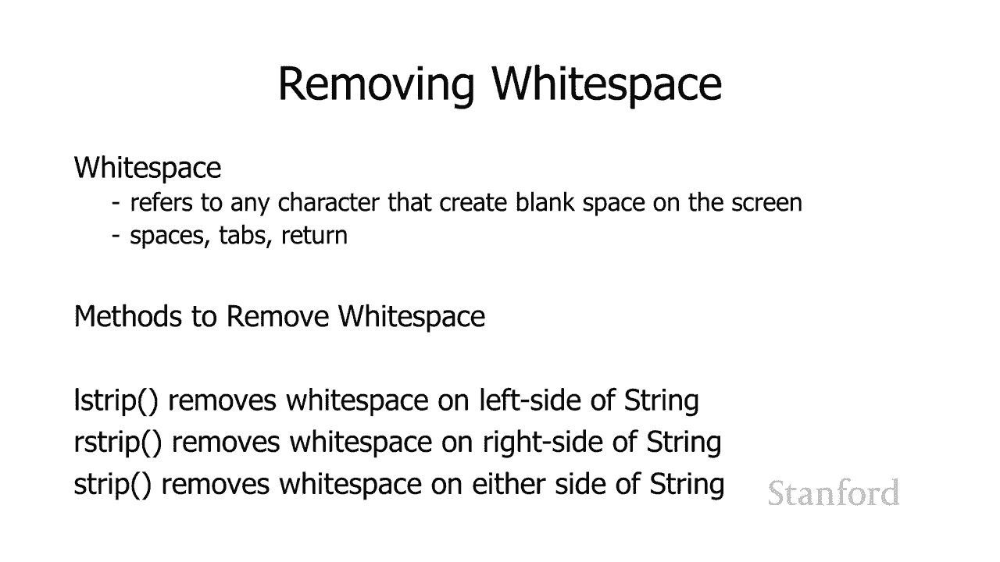

，然后 strip 删除，然后 strip 删除，两侧的空白 的字符串，所以让我们，两侧的空白 的字符串，所以让我们，看看这些如何正常工作，看看这些如何正常工作，假设我们将这个 uh。

假设我们将这个 uh，字符串存储在变量 original，字符串存储在变量 original，中，我们有一堆空格，中，我们有一堆空格，然后是 stanford，然后是 stanford。

被斜线 n 和斜线 t 破坏 那个，被斜线 n 和斜线 t 破坏 那个，斜杠 n 是我，斜杠 n 是我，的换行符 斜杠 t，的换行符 斜杠 t，是制表符，是制表符，所以空格和斜杠，所以空格和斜杠。

以及斜杠 t，以及斜杠 t，上都是空白，所以如果我，上都是空白，所以如果我，创建一个名为 data 的新变量，我，创建一个名为 data 的新变量，我，说我想在 data 中存储什么。

说我想在 data 中存储什么，是原始字符串，然后，是原始字符串，然后，undefined，undefined，在其上调用消息条，它将，在其上调用消息条，它将，undefined，undefined。

删除两侧，删除两侧，的空格，的空格，因此它将删除字符串开头的空格它将删除字符串末尾的斜杠，因此它将删除字符串开头的空格它将删除字符串末尾的斜杠，和 t，和 t，因此，当我们完成此操作后，因此。

当我们完成此操作后，变量 data 将存储字符串，变量 data 将存储字符串，quote stanford end quote ，没有，quote stanford end quote ，没有，空格。

空格，没有斜线和斜线，没有斜线和斜线。

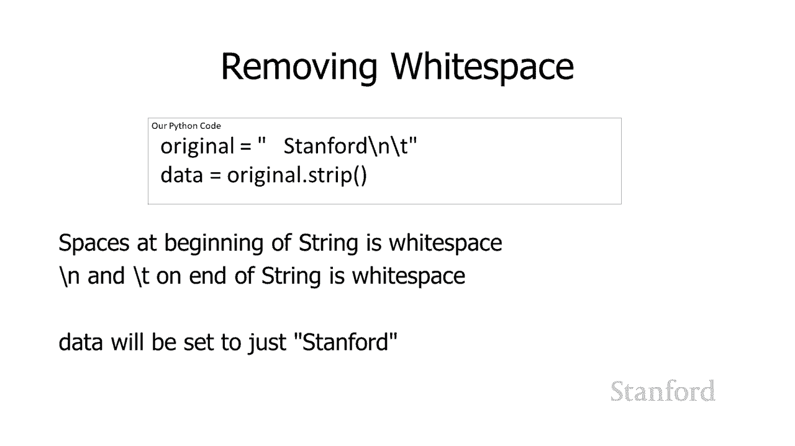

undefined，undefined，呃，如果你愿意，我认为需要这样做的情况不太，呃，如果你愿意，我认为需要这样做的情况不太，常见，常见，仅从一侧剥离空白，仅从一侧剥离空白，但如果您，但如果您。

想这样做，想这样做，例如 r 剥离这将剥离，例如 r 剥离这将剥离，字符串右侧的空白，字符串右侧的空白，在这种情况下是斜线和，在这种情况下是斜线和，斜线 t，斜线 t，但它会留下，但它会留下。

字符串左侧的空格，因此在这种，字符串左侧的空格，因此在这种，特殊情况下，特殊情况下，数据将被设置为引用空格空格，数据将被设置为引用空格空格，stanford，因为，undefined。

undefined。

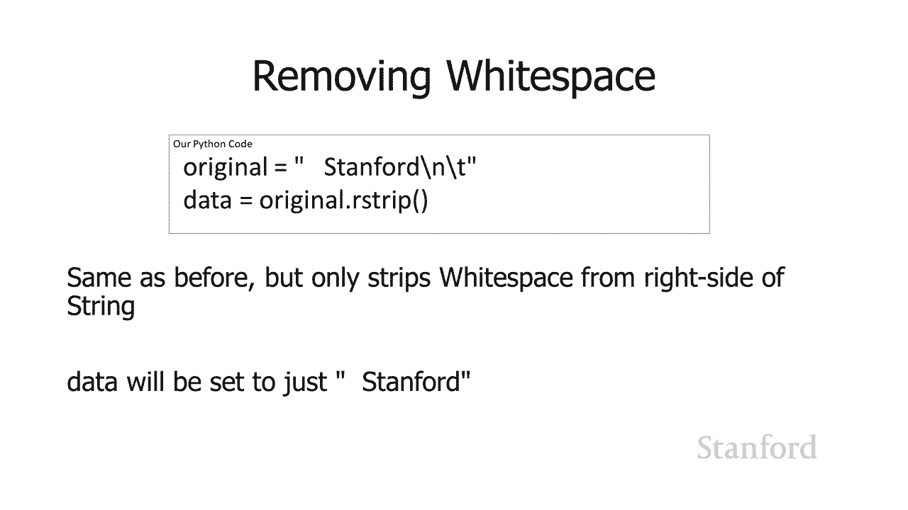

字符串左侧的空格是左边的，只有，字符串左侧的空格是左边的，只有，字符串右侧的空格被，字符串右侧的空格被，删除，删除，好吧，呃，为什么我要这样做，好吧，呃，为什么我要这样做，为什么我关心这个。

undefined，undefined，undefined，undefined，undefined，呢 我很早就提到了这，呢 我很早就提到了这，一点 呃，一点 呃，所以在这里我正在从文件中读取一堆名称。

undefined，undefined，undefined，undefined，如果我的列表包含以下名称，如果我的列表包含以下名称，patrick molly craig tammy 和 chloe。

patrick molly craig tammy 和 chloe，我将要结束的实际列表说，undefined，undefined，引用 patrick slash n 引用。

引用 patrick slash n 引用，molly slash n slash craig slash n 等等，undefined，undefined，嗯，你知道我们之前已经讨论过。

undefined，undefined，该行的末尾实际上，该行的末尾实际上，是如何由一个，是如何由一个，你知道的实际位序列来表示的，嗯，无论我们，你知道的实际位序列来表示的，嗯，无论我们。

使用的是 ascii 还是 unicode 或 无论我们的，使用的是 ascii 还是 unicode 或 无论我们的，字符编码是什么，字符编码是什么，都有一个与行尾相关联的位序列。

都有一个与行尾相关联的位序列，所以我们在，所以我们在，这里看到的是，这里看到的是，python 正在继续前进，只是将，python 正在继续前进，只是将，它们复制过来并说嘿，它们复制过来并说嘿。

在行尾有一个字符，我只是，在行尾有一个字符，我只是，继续并把它放在你的呃，继续并把它放在你的呃，你知道当你阅读这行时我，你知道当你阅读这行时我，要继续不仅，要继续不仅，包括可见的字符我还将。

包括可见的字符我还将，包括，包括，不可见的行尾字符，不可见的行尾字符，你可能还会注意到这个，你可能还会注意到这个，在底部列出 python 有，在底部列出 python 有，gi  ven us。

gi  ven us，用单引号而不是双引号标记它的字符串，undefined，undefined，所以事实证明，在 python 中，你，所以事实证明，在 python 中，你，可以用单引号表示字符串。

可以用单引号表示字符串，也可以用双，也可以用双，引号表示我一直在使用双引号，引号表示我一直在使用双引号，因为大多数编程语言都，因为大多数编程语言都，使用双引号，所以 如果您要，使用双引号。

所以 如果您要，继续学习计算机科学，继续学习计算机科学，并且您习惯于对字符串使用单，并且您习惯于对字符串使用单，引号，引号，那将是一个坏习惯，那将是一个坏习惯，但是，undefined。

undefined，当我们编写，当我们编写，代码或当您编写代码时，python 非常乐意接受双引号 '实际上正在，代码或当您编写代码时，python 非常乐意接受双引号 '实际上正在，与 python。

与 python，shell 交互，当它向你吐出字符串时，shell 交互，当它向你吐出字符串时，它总是使用单引号，它总是使用单引号，我不太确定他们为什么这样做，但，我不太确定他们为什么这样做，但。

无论如何，所以当你使用时你会看到那些单，无论如何，所以当你使用时你会看到那些单，引号字符串，引号字符串，python，python，shell 嗯，shell 嗯，你知道如果你愿意，你可以使用单引号。

你知道如果你愿意，你可以使用单引号，字符串，但我认为，字符串，但我认为，这是一个坏习惯，因为，这是一个坏习惯，因为，大多数语言都要求你使用，大多数语言都要求你使用，双引号，所以，双引号，所以。

你 知道我可能不希望所有这些，你 知道我可能不希望所有这些，斜线结尾都出现在每个这些名字的末尾，斜线结尾都出现在每个这些名字的末尾，这似乎很，这似乎很，烦人，我不了解你，但如果我，烦人，我不了解你。

但如果我，有一个孩子，我不会，有一个孩子，我不会，用斜线命名它，并在结尾处，用斜线命名它，并在结尾处，他们的名字 maddie，他们的名字 maddie，在她名字的末尾没有斜线 n。

在她名字的末尾没有斜线 n。

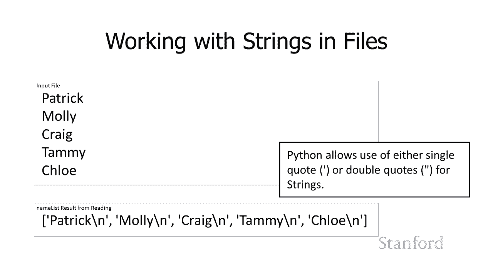

嗯好吧，所以我将如何摆脱，嗯好吧，所以我将如何摆脱，undefined，undefined，它这是一个新版本的，它这是一个新版本的，代码，它将读取它将从中，代码，它将读取它将从中，读取名称 我们的文件。

读取名称 我们的文件，你可以看到我在这里所做的是，你可以看到我在这里所做的是，我刚刚添加了名称 dot r strip 所以，我刚刚添加了名称 dot r strip 所以，这将要做的是这将。

这将要做的是这将，在各个名称中读取它所以，在各个名称中读取它所以，我有一些 for 循环，我有一些 for 循环，名称 和数据文件，因此名称，名称 和数据文件，因此名称，将被设置为，将被设置为。

来自我们这里的数据文件或，来自我们这里的数据文件或，我们的名称文件的每一行文本，我们的名称文件的每一行文本，我们要做的是，我们要做的是，去除，去除，任何额外的空白，任何额外的空白。

在我开始进入我的名单之前的右侧，在我开始进入我的名单之前的右侧，然后我将它附加到，然后我将它附加到，我的名单的末尾，我的名单的末尾，所以在这种情况下，那些，所以在这种情况下，那些。

出现在末尾的斜线结束 每一，出现在末尾的斜线结束 每一，行都将，行都将，被 r 条剥离，所以你可以看到我，被 r 条剥离，所以你可以看到我，最终得到一个我想要的列表，它是，最终得到一个我想要的列表。

它是，文件中没有斜杠的名称列表，undefined，undefined，结尾是这样的。

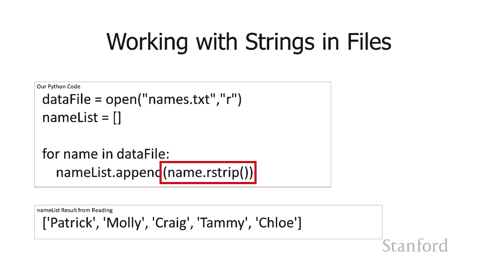

