# 【双语字幕+资料下载】斯坦福CS105 ｜ 计算机科学导论(2021最新·完整版) - P54：L19.2- Python文件操作 - ShowMeAI - BV1eh411W72E

undefined，欢迎探索计算，欢迎探索计算，今天的视频正在处理文件，今天的视频正在处理文件，因此在本视频中，我们将，因此在本视频中，我们将，讨论如何从文件中读取，讨论如何从文件中读取，和写入文件。

这，和写入文件，这，将大大，将大大，提高您创建有用的，提高您创建有用的。

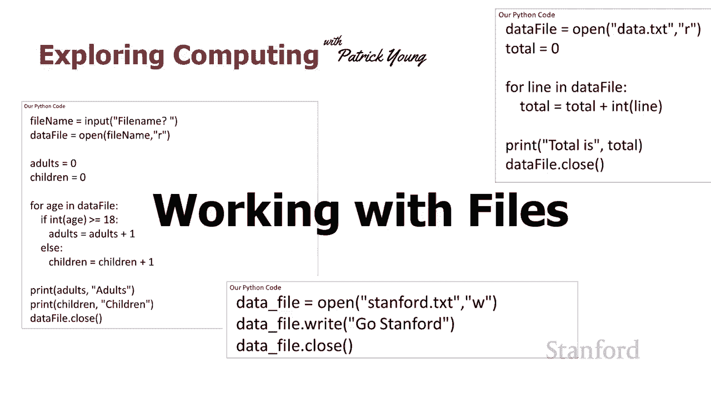

Python 程序的能力，所以让我们继续 并，Python 程序的能力，所以让我们继续 并，从，从，查看如何打开文件开始，所以这真的，查看如何打开文件开始，所以这真的，很简单，我们，很简单，我们。

继续说打开，继续说打开，我们传入我们要使用的文件的名称，undefined，undefined，该文件将位于，该文件将位于，与您的 python 相同的位置，与您的 python 相同的位置，文件。

所以无论你在哪里保存你的，文件，所以无论你在哪里保存你的，python 文件，python 文件，如果你正在创建一个新的，如果你正在创建一个新的，数据文件，你可以期待数据文件，数据文件。

你可以期待数据文件，出现的地方，或者，出现的地方，或者，如果你打算从文件中读取数据文件应该放在那里，如果你打算从文件中读取数据文件应该放在那里，所以打开 uh 文件名请，所以打开 uh 文件名请，注意。

注意，这是一个字符串，后跟第二个，这是一个字符串，后跟第二个，字符串，这将告诉，字符串，这将告诉，python 我们是否要从文件中读取，如果我们要直接从文件中读取，请。

python 我们是否要从文件中读取，如果我们要直接从文件中读取，请，使用，使用，其中只有一个 r 字符的字符串，其中只有一个 r 字符的字符串，阅读和只是 一个，阅读和只是 一个，带有 aw。

带有 aw，字符的字符串，如果我们要写入，字符的字符串，如果我们要写入，那么整个 open 将返回一个值，那么整个 open 将返回一个值。

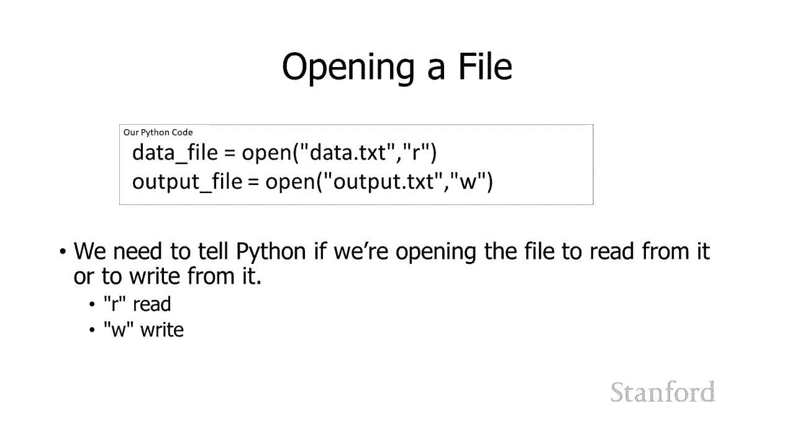

，undefined，undefined，如果我们尝试从不存在的文件中读取，我们现在可以使用它来访问文件，如果我们尝试从不存在的文件中读取，我们现在可以使用它来访问文件，python 是 实际上。

python 是 实际上，当我们，当我们，尝试运行它时，尝试运行它时，如果我们尝试写入不存在的文件，实际上会给我们一条错误消息，如果我们尝试写入不存在的文件，实际上会给我们一条错误消息。

python 将创建一个新，python 将创建一个新，文件，如果我们写入已经，文件，如果我们写入已经，存在且已经存在的文件，存在且已经存在的文件，python 将覆盖它 所以要小心。

python 将覆盖它 所以要小心，你不要，你不要，写入你关心内容的文件，写入你关心内容的文件，undefined，undefined，因为如果你，因为如果你，告诉，告诉。

python 在你完成文件后写入它，它会被覆盖，python 在你完成文件后写入它，它会被覆盖，你应该，你应该，明确地关闭它，所以你这样做，明确地关闭它，所以你这样做，使用引用文件的变量的名称。

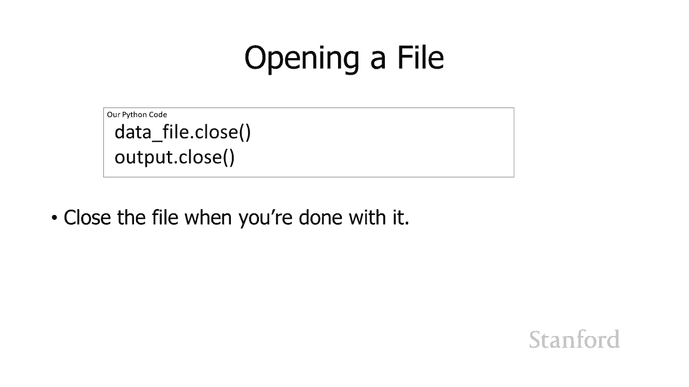

undefined，undefined，后跟一个点或句点，然后是，后跟一个点或句点，然后是，close，close，从文件中读取的最简单方法可能，从文件中读取的最简单方法可能。

是使用我们在上一课中看到的 for 循环，undefined，undefined，因此在第一个示例中我们将，因此在第一个示例中我们将，采用 看看如何从文件中读取，采用 看看如何从文件中读取，并，并。

添加 在文件中找到的一系列数字，undefined，undefined，这将证明与，undefined，undefined，我们在上一课中看到的程序非常相似，我们在上一课中看到的程序非常相似。

我们将列表，我们将列表，中的所有数字相加，中的所有数字相加，但这里有一点额外的，但这里有一点额外的，混乱，混乱，所以 你可以在顶部看到我，所以 你可以在顶部看到我，首先打开文件，首先打开文件。

嗯在这种情况下我总是打开，嗯在这种情况下我总是打开，文件名，文件名，data。txt 我正在打开文件读取，data。txt 我正在打开文件读取，我不会从文件中写入，我不会从文件中写入，并且 然后在底部。

我继续，并且 然后在底部，我继续，关闭文件，关闭文件，现在中间的部分看起来，现在中间的部分看起来，与，与，我们在上一课中看到的非常相似，我们，undefined，undefined，undefined。

在列表中循环遍历 a 中的所有项目并将它们全部添加在一起，在列表中循环遍历 a 中的所有项目并将它们全部添加在一起，我们实际上要开始了，我们实际上要开始了，在一秒钟内看一下直接比较。

在一秒钟内看一下直接比较，但这里有一个区别，但这里有一个区别，那就是我们需要将，那就是我们需要将，undefined，undefined，我们从文件中读取的任何内容显式，我们从文件中读取的任何内容显式。

转换为整数，如果我们愿意，我们也可以转换为，转换为整数，如果我们愿意，我们也可以转换为，浮点数，浮点数，这是因为当我们 从，这是因为当我们 从，文件中读取，文件中读取。

python 总是将我们从文件中读取的任何内容都，python 总是将我们从文件中读取的任何内容都。

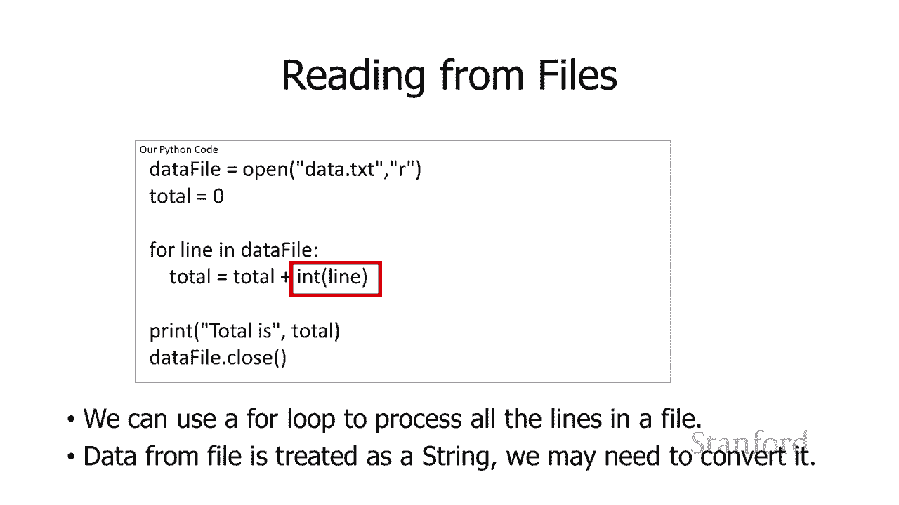

undefined，undefined，undefined，undefined，undefined，undefined，在左边，在左边，所以它的工作方式是，所以它的工作方式是，呃我们，呃我们。

在数据文件中的行有一个小循环，行，在数据文件中的行有一个小循环，行，最初将被设置为 100 然后，最初将被设置为 100 然后，它将被设置为 200，它将被设置为 200，然后它会 设置为 150。

然后它会 设置为 150，然后将设置为 400，然后将设置为 400，除此之外，这将，除此之外，这将，与前面，与前面，的 um 示例完全相同，如果您无法，的 um 示例完全相同，如果您无法，理解您应该。

理解您应该，查看之前，查看之前，的 for 循环视频，那么当这个，的 for 循环视频，那么当这个，都完成了，都完成了。

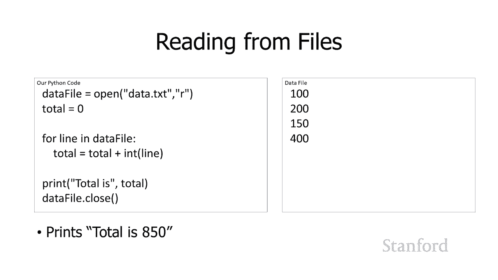

这将打印出 850 这是，undefined，undefined，我们上一堂课和，我们上一堂课和，今天讲座中的示例之间的直接比较，您可以，今天讲座中的示例之间的直接比较，您可以，看到代码几乎完全相同。

看到代码几乎完全相同，很明显，很明显，在我们今天的代码中，我们正在，在我们今天的代码中，我们正在，打开文件并 我们正在关闭它，打开文件并 我们正在关闭它，我将不得不 承认我更改了。

我将不得不 承认我更改了，打印语句，因此其中一个打印，打印语句，因此其中一个打印，total is 而另一个只，total is 而另一个只，打印总，undefined，undefined。

undefined，undefined，undefined，文件，文件，python将把它当作一个字符串，python将把它当作一个字符串，而不是一个数字，所以我确实需要做这个，而不是一个数字。

所以我确实需要做这个。

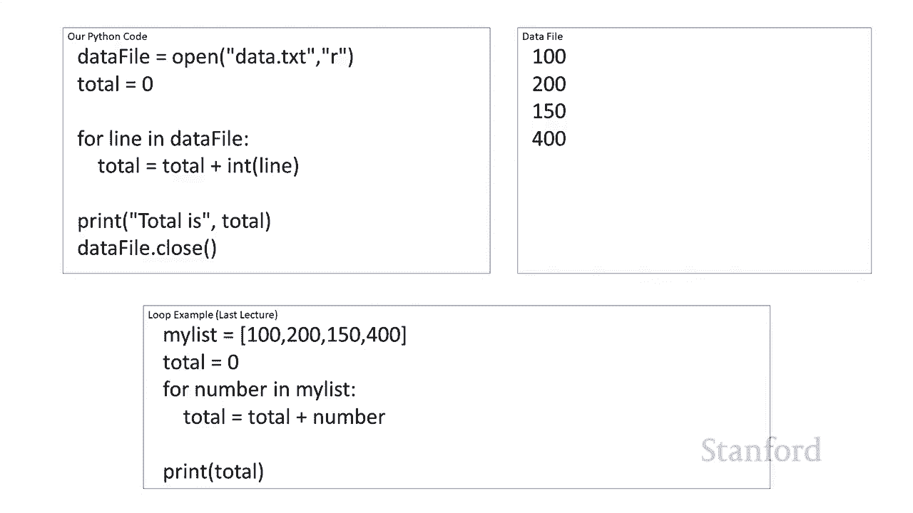

转换，转换，所以可以，所以可以，从循环外的文件中读取，从循环外的文件中读取，嗯这会变得，嗯这会变得，有点混乱，有点混乱，但这绝对可以 在某些情况下很有用，undefined，undefined。

所以你可以在这里看到我，所以你可以在这里看到我，像以前一样打开数据文件，像以前一样打开数据文件，然后有这个数据，然后有这个数据，datafile。readline 它将读取，datafile。

readline 它将读取，文件中的当前行，文件中的当前行，它将以字符串形式返回它，它将以字符串形式返回它，我们可以 在这种特殊情况下用它做一些事情，我们可以 在这种特殊情况下用它做一些事情。

我将它转换为，我将它转换为，浮点数因为，浮点数因为，通常会再次被视为一个，通常会再次被视为一个，字符串当然你可能想将，字符串当然你可能想将，它视为一个字符串，它视为一个字符串，嗯我们实际上将在下一个。

嗯我们实际上将在下一个，讲座中讨论 发行，undefined，undefined，在我们读取文件的最后一行后，将其视为纵梁，在我们读取文件的最后一行后，将其视为纵梁，我们尝试读取的下一。

我们尝试读取的下一，行将不会再有下一行，因为我们已经，行将不会再有下一行，因为我们已经，到达文件的末尾，到达文件的末尾，您实际上会从，您实际上会从，读取中得到什么 line 是所谓的。

读取中得到什么 line 是所谓的，空字符串，这是一个没有字符的字符串，undefined，undefined，您可能想知道如果，您可能想知道如果，文件中稍早一点的文件中有一个空行会发生什么。

undefined，undefined，所以也许我有，所以也许我有，三行人名 在里面我有，三行人名 在里面我有，两个空行然后我还有几行人，两个空行然后我还有几行人，的名字，的名字。

当你从 python 中读取一行时它实际上会变成，undefined，undefined，空白，而且它是空白的你实际上，空白，而且它是空白的你实际上，会得到那个回车 字符，会得到那个回车 字符，记得。

记得，当我们谈到 ascii 时，我们谈到，当我们谈到 ascii 时，我们谈到，了实际上是，了实际上是，如何谈论如何用，如何谈论如何用，几种不同的方式，几种不同的方式，用新的回车符对行尾进行编码。

用新的回车符对行尾进行编码，我的意思是你实际上会，我的意思是你实际上会，得到那个字符返回的字符，得到那个字符返回的字符，嗯读 从你回来 从文件中，嗯读 从你回来 从文件中，我们将再次，我们将再次。

讨论下一节课这意味着什么它，讨论下一节课这意味着什么它。

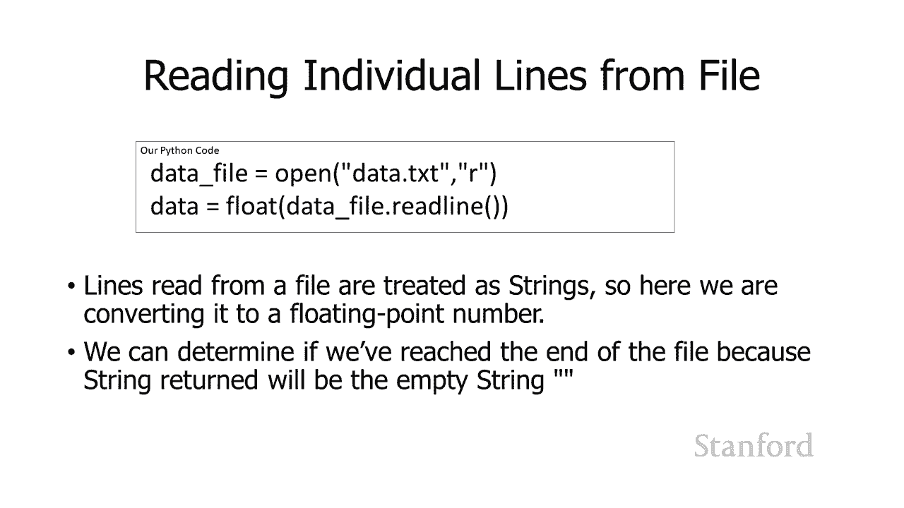

看起来像什么以及如何处理它，看起来像什么以及如何处理它，那么写入文件怎么样所以，那么写入文件怎么样所以，写入文件非常简单，写入文件非常简单，我们可以继续打开文件进行，我们可以继续打开文件进行。

写入 我们可以说，写入 我们可以说，datafile。right 或任何，datafile。right 或任何，存储对 file。right 的引用的变量的名称，undefined，undefined。

然后是任何你想写入的字符串，undefined，undefined，如果你忘记了，你应该在完成后关闭它，如果你忘记了，你应该在完成后关闭它，在某些系统上关闭它，在某些系统上关闭它。

您实际上不会在文件中获得任何输出，您实际上不会在文件中获得任何输出，可能发生的情况，可能发生的情况，是计算机可以保存，是计算机可以保存，您正在写入文件的所有内容，您正在写入文件的所有内容。

并且在您明确之前不会将其实际写入文件，并且在您明确之前不会将其实际写入文件，关闭文件，关闭文件，因此请确保您明确，因此请确保您明确，关闭文件，关闭文件，作为提醒，如果文件，作为提醒，如果文件，不存在。

不存在，打开文件进行写入将创建，打开文件进行写入将创建，它，而打开，它，而打开，不存在的文件进行读取将给，不存在的文件进行读取将给，您一条错误消息，您一条错误消息，如果 文件不exi  st 并打开它。

如果 文件不exi  st 并打开它，进行写入，进行写入，你将覆盖该文件的当前，你将覆盖该文件的当前。

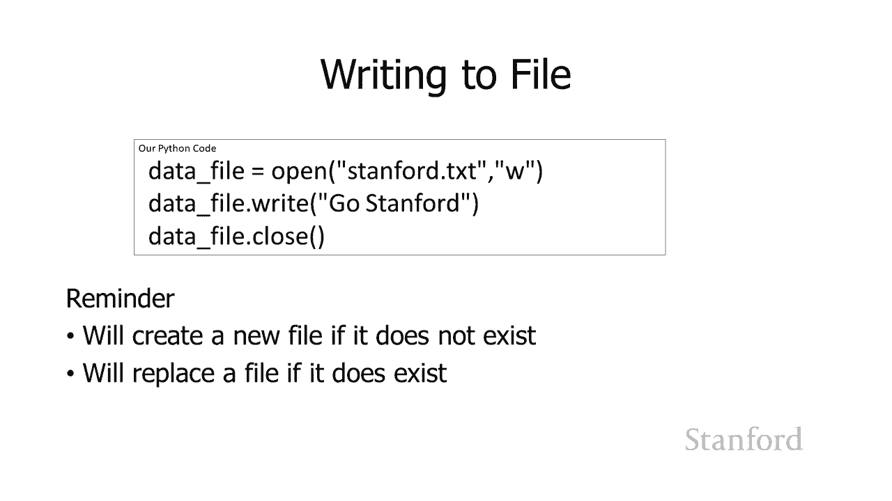

内容，undefined，undefined，如果你开始写入文件，你将运行它的另一个小问题，undefined，undefined，所以在这里我打开了文件，所以在这里我打开了文件，stanford。

st。  txt 用于写入，stanford。st。  txt 用于写入，我已经写入文件两次我已经，我已经写入文件两次我已经，写了 go stanford 和 go。

写了 go stanford 和 go，cardinal，如果我们真的要，cardinal，如果我们真的要，打开文件，我们将看到的是 go，打开文件，我们将看到的是 go。

stanford go cardinal 都在同一行上，stanford go cardinal 都在同一行上，undefined，undefined，我们会看到 如何在下一堂课中解决这个问题。

我们会看到 如何在下一堂课中解决这个问题，但我只是想在，但我只是想在，这里提一下，如果您要继续并尝试，这里提一下，如果您要继续并尝试，在这里做正确的事情，在这里做正确的事情。

那么让我们看一下在第一种情况，那么让我们看一下在第一种情况。

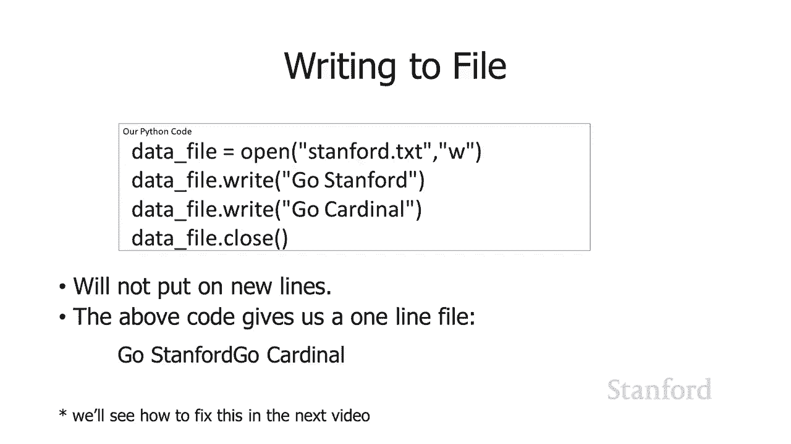

下增加复杂性的更多示例，下增加复杂性的更多示例，我将要这样做 继续，我将要这样做 继续，并，并，平均文件中的数字这，平均文件中的数字这，将类似于我们在，将类似于我们在，上一堂课中看到的内容。

但同样有一些，上一堂课中看到的内容，但同样有一些，我们需要处理的复杂性，我们需要处理的复杂性，undefined，undefined，因此在最后一个示例中，我们总是，undefined。

undefined，在此打开名为 data。txt 的文件 我们要做的就是，在此打开名为 data。txt 的文件 我们要做的就是，继续前进 并询问用户，继续前进 并询问用户。

他们希望我们打开的文件的名称是什么，undefined，undefined，然后我将继续调用，然后我将继续调用，该特定文件名，该特定文件名，的 open 中心部分在这里我继续。

的 open 中心部分在这里我继续，并将总数设置为零，并将总数设置为零，然后我继续进行迭代 通过，undefined，undefined，文件中的所有行，这基本上与，文件中的所有行，这基本上与。

我们一分钟前所做的，我们一分钟前所做的，非常相似，但，非常相似，但，在这种情况下，这里的小问题是，在这种情况下，这里的小问题是，最后一次我们确定，最后一次我们确定，列表中数字的平均值时。

列表中数字的平均值时，我们需要确定，我们需要确定，列表中有多少项目 并且有一个长度，列表中有多少项目 并且有一个长度，函数，函数，它在列表本身上被称为长度，它在列表本身上被称为长度。

它会告诉我们它有多长，它会告诉我们它有多长，undefined，undefined，如果我，如果我，想知道文件中有多少行，我，想知道文件中有多少行，我，将不得不确定文件中的情况并非如此 这是我自己的。

将不得不确定文件中的情况并非如此 这是我自己的，所以这是我要怎么做，所以这是我要怎么做，我将，我将，使用一个名为 number 的变量 我，使用一个名为 number 的变量 我，要将初始值设置为。

要将初始值设置为，number 为零 所以最初我们还没有看到任何，number 为零 所以最初我们还没有看到任何，数字，数字，然后在 我的 for 循环，然后在 我的 for 循环，通知中间有缩进。

所以这是，通知中间有缩进，所以这是，一些 文件中每一行都会发生的事情，undefined，undefined，我要给数字加一，所以，我要给数字加一，所以，当我们看到第一行时，最初数字将为零。

当我们看到第一行时，最初数字将为零，我会说数字，我会说数字，等于数字加一，等于数字加一，所以数字将变为一，所以数字将变为一，下次我运行它时，数字将是一，我加，下次我运行它时，数字将是一，我加，一。

它会是二，一，它会是二，加一，它会是三等等，加一，它会是三等等，当我们都完成后，数字应该，当我们都完成后，数字应该，是我们实际阅读的行数，是我们实际阅读的行数，从文件，从文件，中然后我们可以继续取。

中然后我们可以继续取。

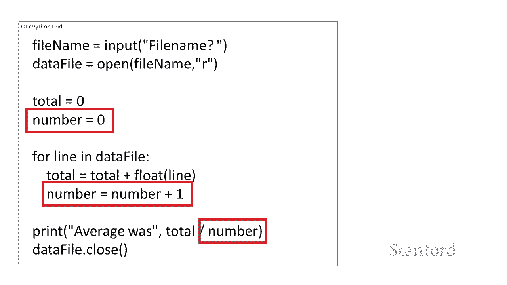

我们的总数并将其除以数字，我们的总数并将其除以数字，好吧让我们看一个，好吧让我们看一个，更复杂的例子，更复杂的例子，嗯所以这将确定，嗯所以这将确定，我们有多少成年人以及我们有多少。

我们有多少成年人以及我们有多少，孩子 有，孩子 有，如果我们有 17 岁的人，我很，如果我们有 17 岁的人，我很，抱歉，undefined，undefined，为了这个节目的目的。

我们会把你算作一个孩子，为了这个节目的目的，我们会把你算作一个孩子，呃，但你知道如果这是一家，呃，但你知道如果这是一家，电影院，希望你能买到，电影院，希望你能买到，便宜一点的票，便宜一点的票。

所以我打开了文件 一，所以我打开了文件 一，开始，开始，我问用户他们想使用什么文件名，我问用户他们想使用什么文件名，所以再次，所以再次，这比，这比，我们之前看到的稍微复杂一点，我。

我们之前看到的稍微复杂一点，我，总是打开相同的文件名，总是打开相同的文件名，然后当我们完成后，我们需要，然后当我们完成后，我们需要，记住在打开文件后在顶部关闭它，记住在打开文件后在顶部关闭它。

我走了 提前，我走了 提前，并初始化我的变量，这是，并初始化我的变量，这是，非常常见的我们，非常常见的我们，在前几个例子中已经看到了，在前几个例子中已经看到了，这是非常常见的技术所以我们正在。

这是非常常见的技术所以我们正在，处理列表中的单个项目，处理列表中的单个项目，我们试图，我们试图，获取有关列表中这些单个项目的数据，获取有关列表中这些单个项目的数据，和，和，我需要将结果存储在一些。

我需要将结果存储在一些，变量中，并且在，变量中，并且在，开始循环之前，在开始处理，undefined，undefined，列表中的每一行或文件中的每一行之前，列表中的每一行或文件中的每一行之前。

undefined，undefined，我需要初始化这些值，因此在，我需要初始化这些值，因此在，这种情况下，我会跟踪，这种情况下，我会跟踪，成年人的数量我正在跟踪，成年人的数量我正在跟踪，孩子的数量。

孩子的数量，在我处理任何这些行之前，在我处理任何这些行之前，每个行的总数将为零，每个行的总数将为零，然后您可以看到我在这里做什么，然后您可以看到我在这里做什么，我正在查看每个行，我正在查看每个行。

数据文件中的个人年龄，数据文件中的个人年龄，呃如果那个 年龄大于或，呃如果那个 年龄大于或，等于 18 岁，那么我是说嘿，在处理数据文件的这一特定行之前，我比我之前见过，等于 18 岁，那么我是说嘿。

在处理数据文件的这一特定行之前，我比我之前见过，的许多成年人多一个成年人，undefined，undefined，undefined，undefined，如果呃年龄小于 18 岁。

如果呃年龄小于 18 岁，那么呃但是 到目前为止，我见过的很多孩子，那么呃但是 到目前为止，我见过的很多孩子，我还有一个孩子，我还有一个孩子，嗯，所以你可以，嗯，所以你可以，认为，在所有这些结束时。

认为，在所有这些结束时，你可以看到成人变量，你可以看到成人变量，应该存储，应该存储，我们已经看到的年龄数，呃 18，我们已经看到的年龄数，呃 18，18 岁或以上 我总是要记住。

18 岁或以上 我总是要记住，在这种情况下，无论这是否大于或，在这种情况下，无论这是否大于或，等于或大于，等于或大于，它都大于或等于所以，它都大于或等于所以，如果今天是您的 18 岁生日。

如果今天是您的 18 岁生日，恭喜您算作成年人，我们，恭喜您算作成年人，我们，将向您收取更多费用 进入我们的，将向您收取更多费用 进入我们的，剧院，剧院，然后我们知道最后我们有多少孩子。

然后我们知道最后我们有多少孩子，所以我们继续将这两个打印，所以我们继续将这两个打印，出来，出来，好的，这就是我们对文件的讨论，好的，这就是我们对文件的讨论，你们将，undefined。

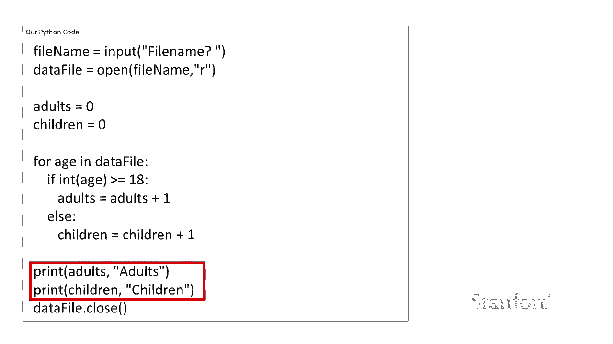

