# 【双语字幕+资料下载】斯坦福CS105 ｜ 计算机科学导论(2021最新·完整版) - P55：L20.1- 计算机安全：介绍 - ShowMeAI - BV1eh411W72E

欢迎探索计算。

今天的视频是计算机，所以我想先，一些安全问题。我承认，我们将在几个讲座中讨论，所以，这一点。

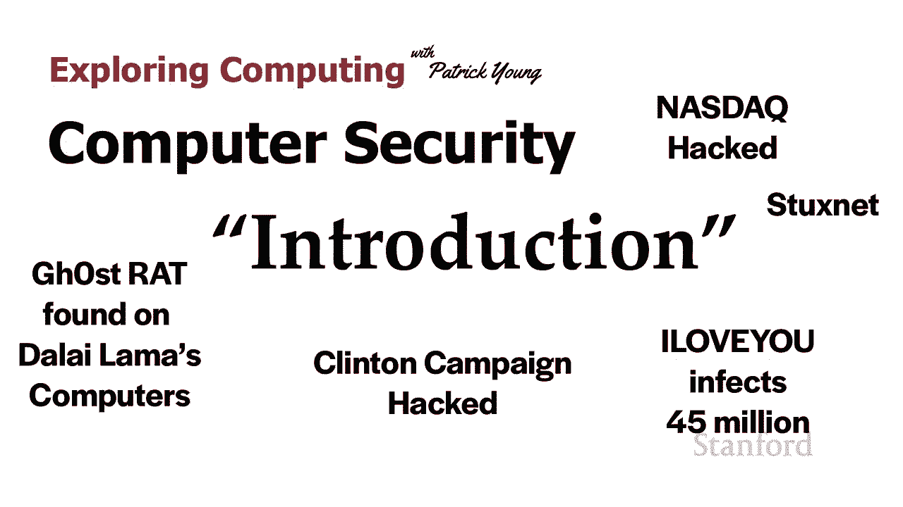

好的，所以我们的第一个，和使用名为 GhostNet 的网络进行的攻击，2009 年，达赖喇嘛的，他办公室的计算机上安装了一个名为，GhOst RAT（RAT 代表，）的程序，RAT 工具提供远程。

计算机上的文件——，从计算机传输到，完全，最终，感染，大多数计算机都在，大使馆和非政府。

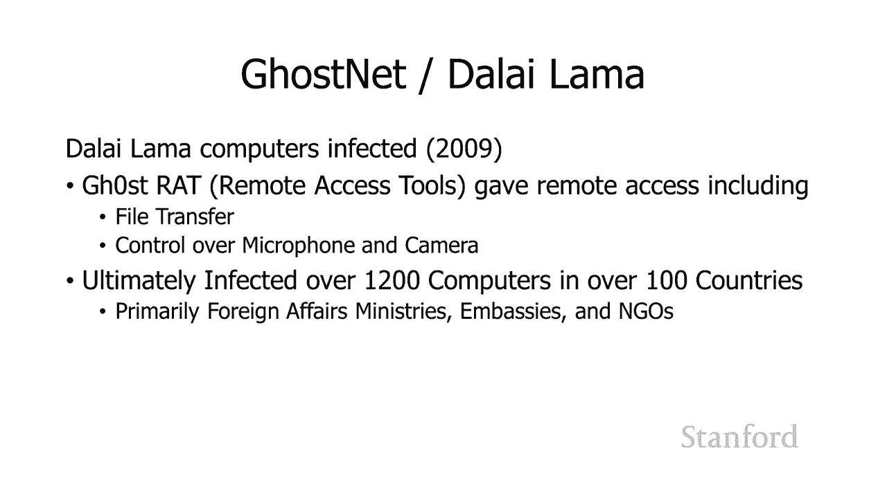

在达赖喇嘛的，一封来自电子邮件地址，附有一份 Word，行动自由翻译，好吧，我们，谁攻击了，进行了为期一年的调查，追踪了 GhOst，回中国海南岛的位置，那里，情报部门的所在地。所以很可能。

考虑到谁可能，并且考虑到。

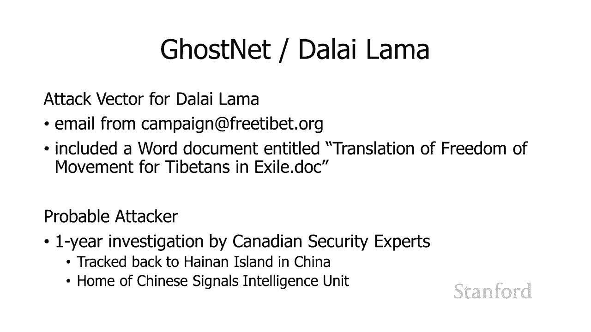

这些工具是如何工作的，好吧，这是另一个故事。2010 年，FBI，检测，计算机的异常情况。当他们进去时，其中包括破坏性代码。他们，破坏性，但它包括两个，这是一个，在许多其他地方的主题。零日漏洞。

所以有人发现这，没有人知道。因此，如果您有一个，一般来说，这被认为，您会希望，并且仅在您，因为基本上，它，有一个，没有人可以，所以为了给你一个，我们将在本系列讲座的后面更详细地，但是几年前发生了一次。

英国，这不是零日漏洞利用。如果有人更新了，他们就不容易感染，所以这是一个已知问题。同样，不是零日漏洞利用。零日漏洞利用，而且几乎可以，您使用它的任何计算机上都可以使用。因此，在这种特殊，了两个零日。

 用于攻击纳斯达克，的软件上的签名，与俄罗斯 FSB 相符。俄罗斯联邦安全局是，嗯，它，还有一个，基本上和，你可以，她真的想让我，因此，这很可能，但也，从 FSB 窃取了代码。事实。

美国国家安全局曾经用来，的代码被盗，或者放错地方并，所以这可能，不是 FSB 使用他们的代码。其他人可能。

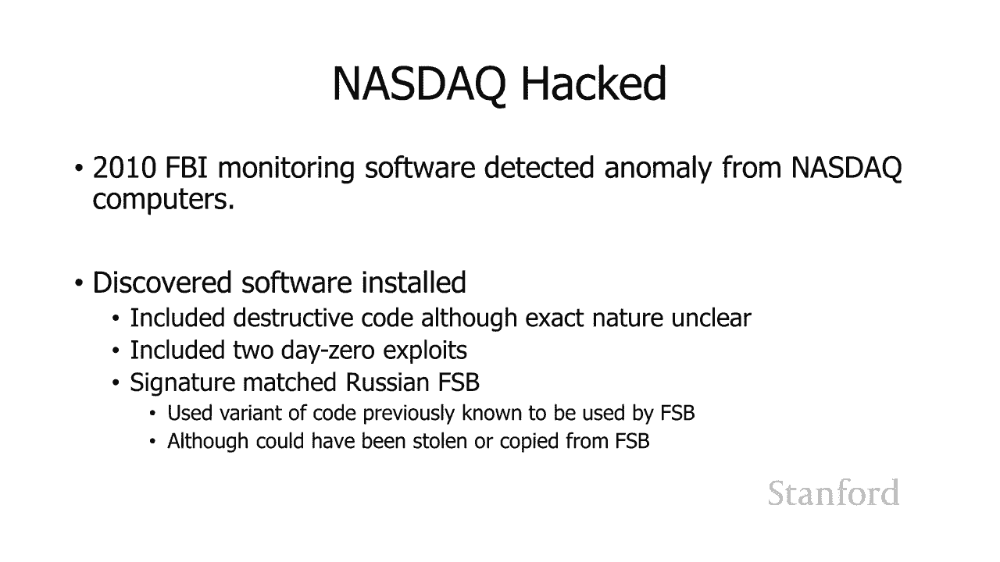

最终，我们不知道是，有些人，但最有可能是俄罗斯。大约，俄罗斯正在，因此，纳斯达克的人可能实际上是，以及用于俄罗斯证券交易所。

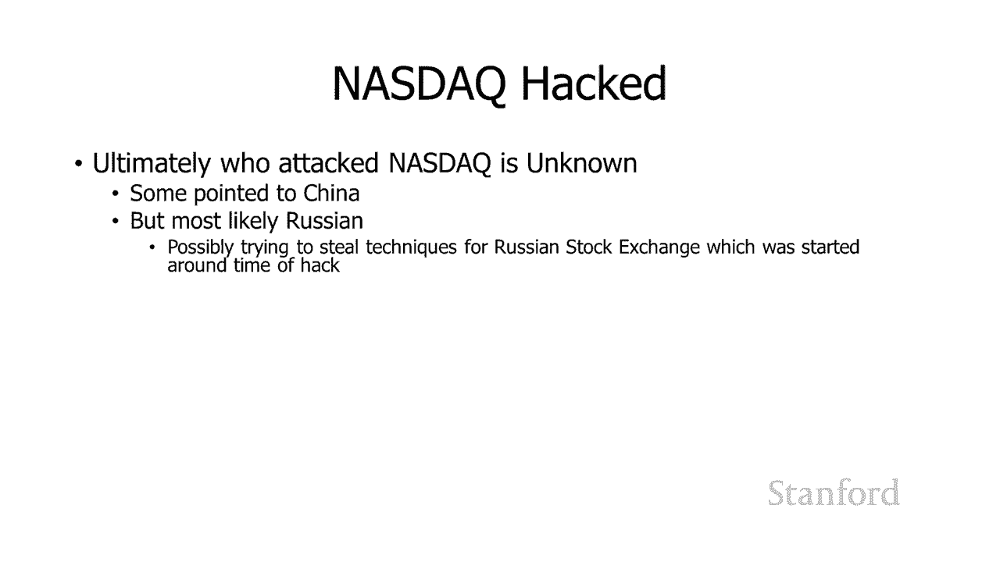

然而，FBI 还发现其他，在纳斯达克上。这有点可怕。他们，包括犯罪，他们还，管理——那是，他们的网站已经，工具包，基本上任何，他们试图支付账单。

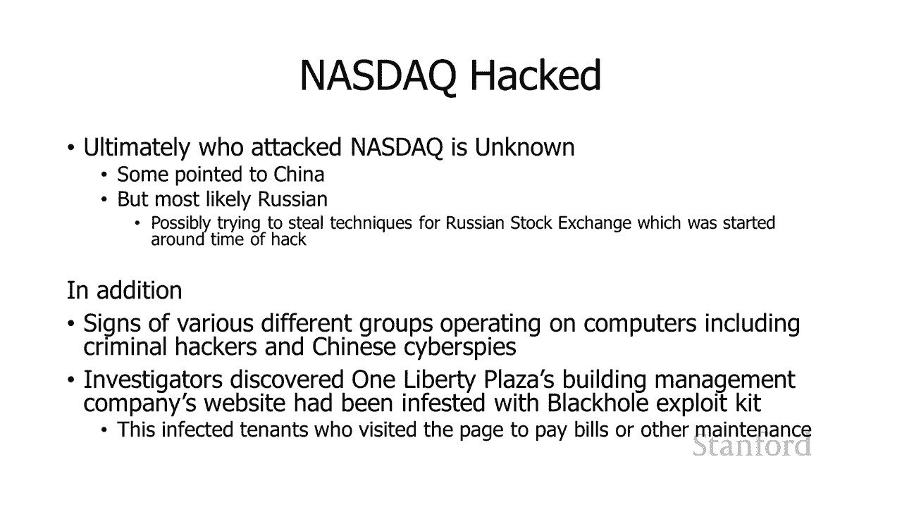

他们都会被感染。2000 年 5 月 5 日，一封，它包含一种病毒，可以，最终，4500 万，它使用了一个 Visual，该文件将自身复制到其他，它向，因此，如果您使用的是 Outlook，地址，它。

重复的副本，这会影响，它会覆盖多媒体，它向。

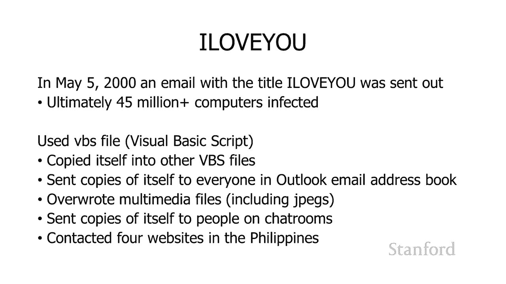

并联系，肇事者已被，没有计算机犯罪法，因此他们。

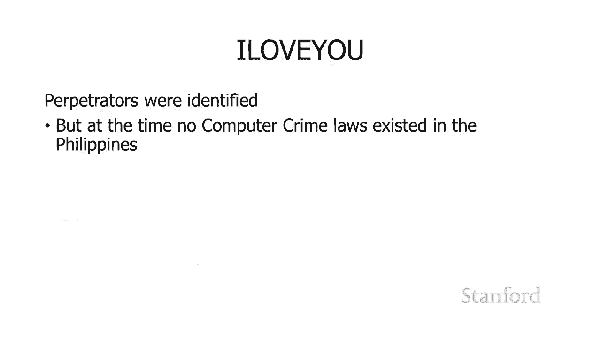

2016 年，2016 年总统竞选主席约翰·波德斯塔 (John Podesta)，声称是谷歌安全警报的电子邮件。他点击了链接，信息。当然，这不是谷歌。维基解密公布，的克林顿竞选，通过他的原始。

安全专家，是由名为 Fancy Bear 的黑客组织完成的，该组织与。

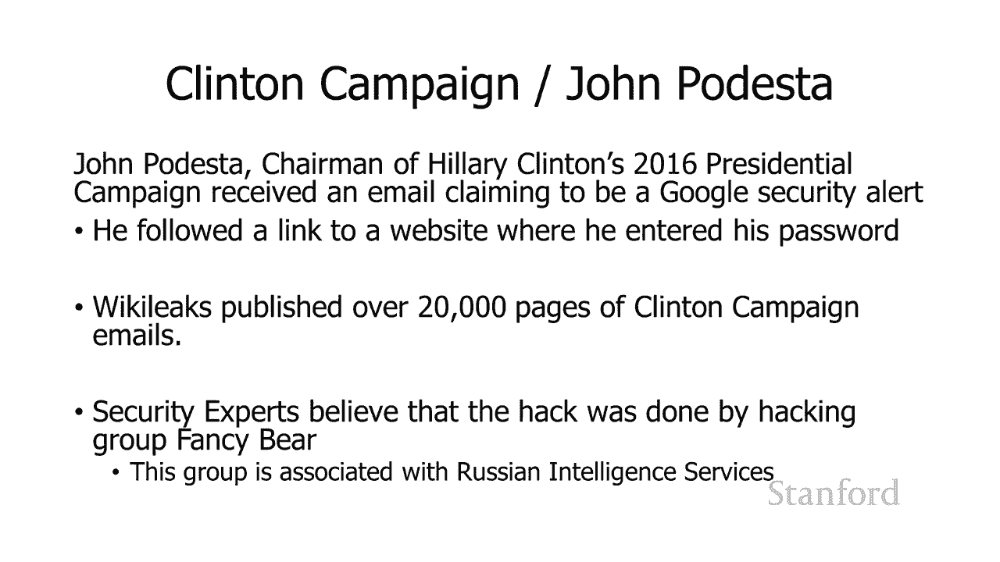

Stuxnet 是一个，旨在攻击西门子设备的程序。最终，认为是伊朗的核，计划使用的是西门子设备。尤其是，它，它基本上是在推迟，旨在，用于提炼铀的离心机。Stuxnet 旨在，它，并寻找基于西门子。

在那里攻击可编程，它包括四个，记得我们谈到了，这让每个人，是由一个民族，机构推出的。它曾经有一个，在 USB 记忆棒上传播。这被，因为伊朗的核，可能不在互联网上。所以不知何故，你，进入他们的内部网络。

因此，这很可能，可能，通过实际让，我们将，将 USB 驱动器，事实证明这并不难。它利用，在网络上传播，并且一旦它进入特定计算机，它就会使用两个，来获得适当的。

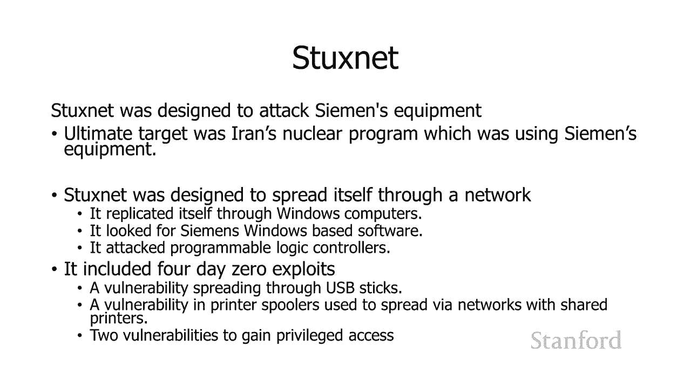

好的，所以我们将，的安全讲座。今天讲座的其余部分，将重点关注安全机制——，保护您的计算机的不同方式。下一讲，计算机受到，然后第三讲将，保护计算机免受攻击。在今天的讲座中，我，不同的安全问题——。

机密性、身份验证、，保密性，我和别人谈话时，我，怎么知道，所以我将使用 -，对于大多数这些，将使用 Alice、Bob 和 Mallory。这些是，所以如果您的名字是，这不是我的错。有 20 多个。

不同角色的不同名字，将使用 Alice 和 Bob，他们，然后 Mallory，有各种不同的，Eve 是在那里，在那里做恶意的事情。正如我所说，有，但我们将仅使用，作为大多数示例。

所以爱丽丝正在给鲍勃发送一条消息，你想见面吃午饭吗？保密性，可以阅读该消息。如果像 Mallory 这样的第三方，那就意味着我们，身份验证意味着，我们与之通信，就是他们所说的人。所以在这种情况下。

通过互联网进行通信，她，但是我们怎么知道，也许她在和马洛里说话。那么身份验证，证明鲍勃真的是鲍勃？爱丽丝怎么能，而不是马洛里。完整性与 -，有人可以，因此，您可能，该消息或，而实际上，所以这。

和身份验证相互关联，但就恶意人员可以做什么，这不一定，也不一定，好的，所以 Alice，消息与 Bob 共进午餐，Mallory 无法实际，但他可以，所以他说，在 Coho 见面吃午饭，Alice 在。

知道 Bob 为何没有出现。另一种可能性，能够实际看到，的消息，抓取消息，然后，在稍后的时间点发送相同的消息。并且鲍勃可能没有，看到了以前看到过的消息，因此，如果系统，他会知道它是，有一些安全。

但是如果 Mallory 能够，包括安全凭证，然后，鲍勃会认为他，而爱丽丝不会在那里，是几天前发送的消息的重复，好吧，不可否认。所以假设我发送，说没有期末考试。通常，我会，开个玩笑，但。

所以我并不是说这，但是嘿，事实证明本，所以耶。好的，所以假设我发送了，你们都知道了。然后我声称，我，有什么方法可以，这就是。

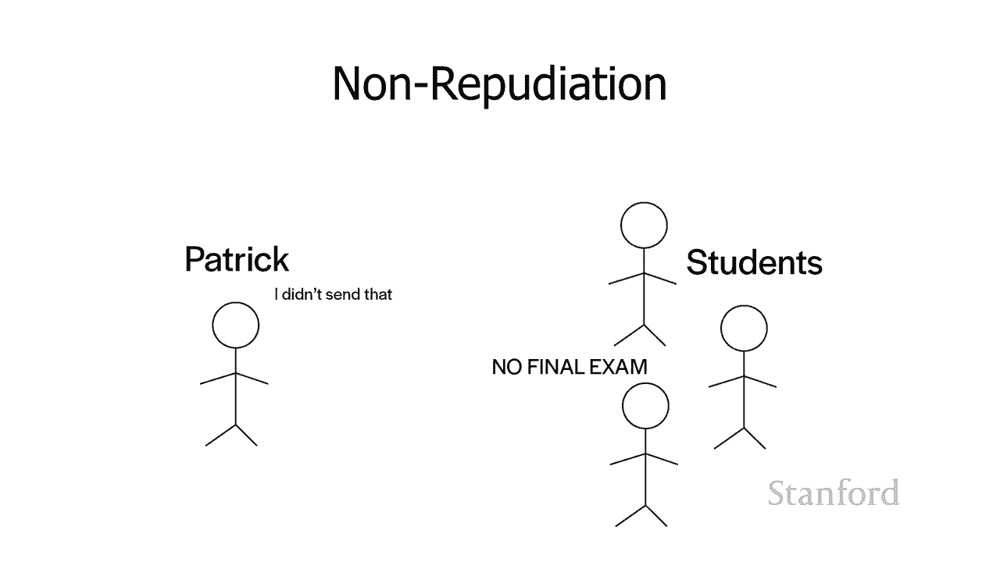

好的，所以这只是，这个讲座，事实上，我们，但它将是开卷的，——开卷。这，您将有充足，压力非常低。好的，回到你。

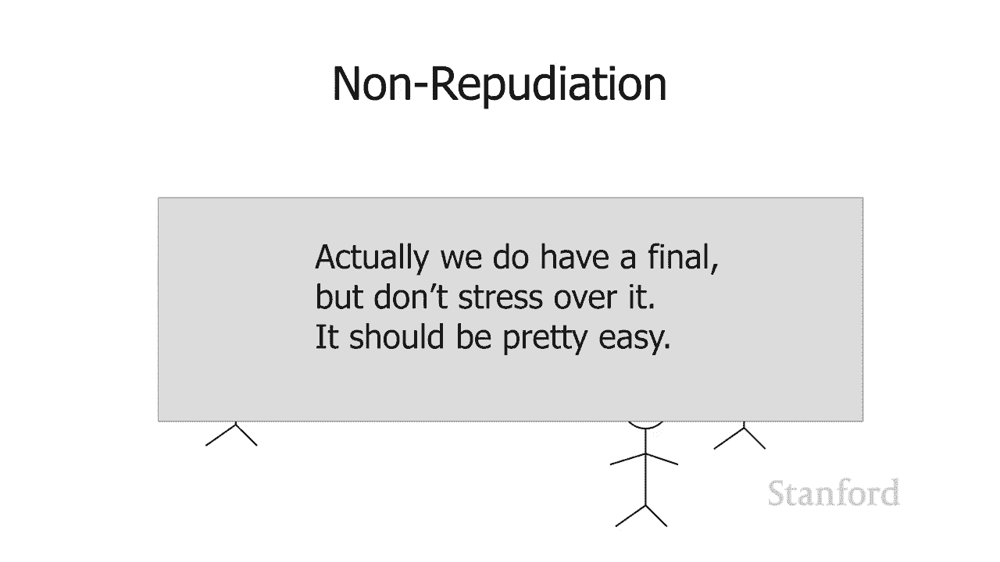

好的，将讨论，我们用于，以及如何使用它们。

