# 【双语字幕+资料下载】斯坦福CS105 ｜ 计算机科学导论(2021最新·完整版) - P56：L20.2- 计算机安全：机制 - ShowMeAI - BV1eh411W72E

undefined，欢迎探索计算，欢迎探索计算，今天的视频是计算机安全，今天的视频是计算机安全，机制，机制，所以在本视频中，我们将看看，所以在本视频中，我们将看看。

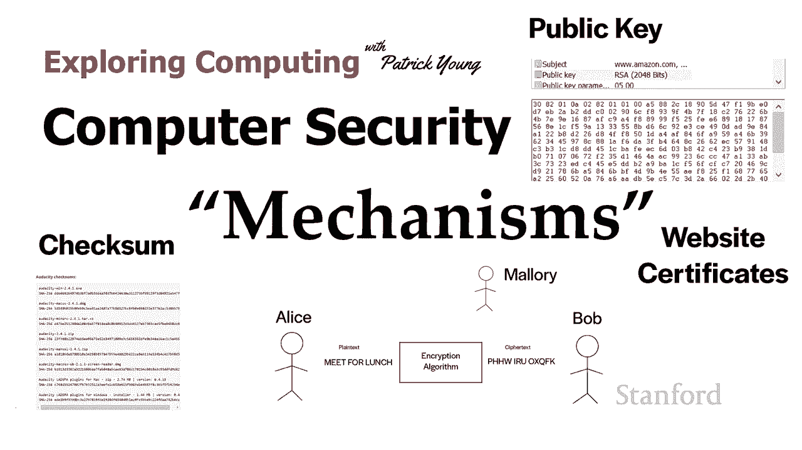

我们用来，我们用来，保护计算机网络安全的不同机制，保护计算机网络安全的不同机制，你会记得上一堂课，你会记得上一堂课，呃我们谈到了四种不同的，呃我们谈到了四种不同的，网络 安全性涉及，网络 安全性涉及。

保密性，保密性，确保我们的通信是，确保我们的通信是，保密的并且没有人能够，保密的并且没有人能够，窃听，窃听，身份验证 能够，身份验证 能够，确定我们正在与之交谈的人是，确定我们正在与之交谈的人是。

他们所说的，他们所说的，完整性 确保我们的，完整性 确保我们的，消息不被篡改和非- 否认，消息不被篡改和非- 否认，能够确定，能够确定，某人是否真的以某种方式执行了，某人是否真的以某种方式执行了。

特定的行动，特定的行动，以至于他们无法否认，以至于他们无法否认，它，它。

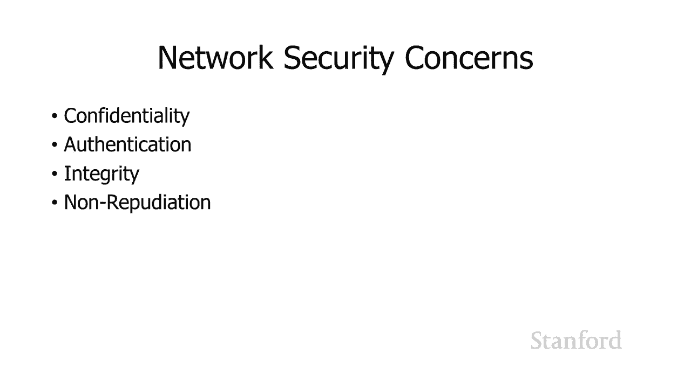

我们现在要讨论的机制，我们现在要讨论的机制，将处理，将处理，这些不同的问题，这些问题，这些不同的问题，这些问题，都适合 通用伞式，都适合 通用伞式，密码学，密码学，它研究如何发送安全。

它研究如何发送安全，消息，消息，它们将依赖于加密，它们将依赖于加密，技术 加密 ion 意味着，技术 加密 ion 意味着，获取纯文本消息并将其转换，获取纯文本消息并将其转换，为加密的密文消息和。

为加密的密文消息和，解密，解密，这是获取，这是获取，密文消息并将其转换，密文消息并将其转换。

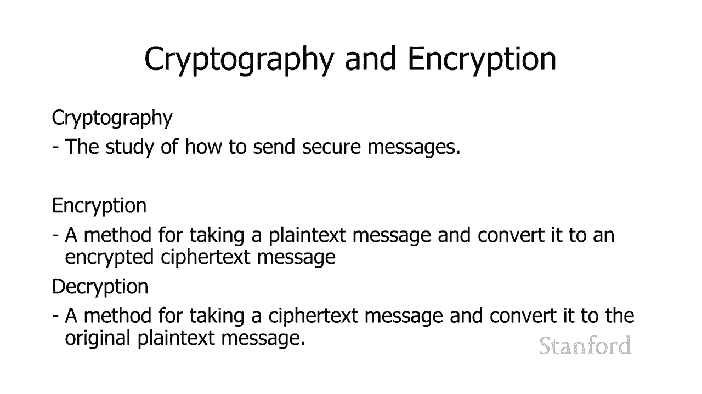

回原始纯文本的相反过程，回原始纯文本的相反过程，现在我们已经进行了，现在我们已经进行了，数千年的加密，所以我 我将，数千年的加密，所以我 我将，首先向您展示凯撒，首先向您展示凯撒。

密码的工作原理 这是一个，密码的工作原理 这是一个，非常简单的密码，你们都，非常简单的密码，你们都，可以很容易地理解，可以很容易地理解，它是由朱利叶斯凯撒使用的，所以您，它是由朱利叶斯凯撒使用的。

所以您，可以看到我们已经加密了很长时间，可以看到我们已经加密了很长时间，时间，时间，好的凯撒密码的工作方式是，好的凯撒密码的工作方式是，我们将消息中的字母移动三个，我们将消息中的字母移动三个，字母所以。

字母所以，呃如果我有消息并且我，呃如果我有消息并且我，在原始文本中有字母a我，在原始文本中有字母a我，将继续并移动，将继续并移动，abcd 而不是写 a 我，abcd 而不是写 a 我，要写广告。

要写广告，而不是写 ab 我要说，undefined，undefined，bcde 如果我将 b 移动三个，bcde 如果我将 b 移动三个，字符我会得到一个，字符我会得到一个。

e 所以我要写一个 e 而，e 所以我要写一个 e 而。

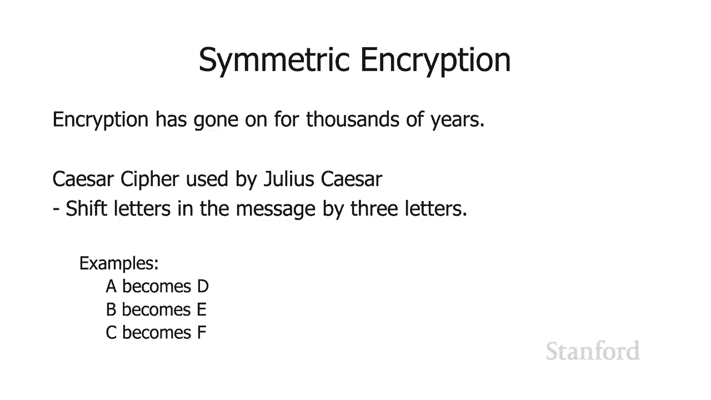

不是 ab 我要把它写成 f，不是 ab 我要把它写成 f，而不是 ac 等等 好吧，而不是 ac 等等 好吧，让我们来看看凯撒密码，让我们来看看凯撒密码，的实际效果，的实际效果，假设，假设。

tas 对我的课程不满意，tas 对我的课程不满意，他们决定一起，他们决定一起，吃午饭并策划，吃午饭并策划，政变，所以他们很担心，政变，所以他们很担心，因为他们知道我是一个专横的人。

因为他们知道我是一个专横的人，所以，所以，他们不想让我知道他们正在，他们不想让我知道他们正在，开会 所以他们会带着，开会 所以他们会带着，他们的，他们的，消息在这里见面吃午饭，消息在这里见面吃午饭。

他们将使用，他们将使用，凯撒密码对其进行加密 因此，凯撒密码对其进行加密 因此，如果我们将 m 移动 3 mnop，如果我们将 m 移动 3 mnop，则 e 变为，则 e 变为，efgh。

t 变为 tuvw，efgh，t 变为 tuvw，等等，因此您可以看到，等等，因此您可以看到，午餐的肉变为，午餐的肉变为，undefined，undefined，再次提醒我们，再次提醒我们。

将原始文本称为纯文本 和，将原始文本称为纯文本 和，转换后的文本作为密文，转换后的文本作为密文，现在我扮演了 mallory 的角色，我，现在我扮演了 mallory 的角色，我，是坏人，是坏人。

所以我拦截了 tas 文本，所以我拦截了 tas 文本，我看到了 phhw iru，我看到了 phhw iru，0x qfk 我想，0x qfk 我想，嗯，我似乎记得 ireu 代表的，嗯。

我似乎记得 ireu 代表的，东西，这一定是一些新的东西，东西，这一定是一些新的东西，新奇的孩子上网说我猜，新奇的孩子上网说我猜，他们只是在玩，他们只是在玩，我没什么可玩的 担心呃。

我没什么可玩的 担心呃，一切进展顺利，一切进展顺利，嗯，所以助教们可以见面，嗯，所以助教们可以见面，吃午饭，吃午饭，并代替我，他们很快就会讲课，并代替我，他们很快就会讲课，undefined。

undefined，undefined，undefined，因为我们助教之一的常春藤，因为我们助教之一的常春藤，将教人工智能讲座，将教人工智能讲座，因为，因为，她是现代人工智能方面的专家，而。

她是现代人工智能方面的专家，而，不是我，不是我，实际上我有一个主屏幕人工智能，实际上我有一个主屏幕人工智能，但，但，它是从 1986 年开始的，所以我认为，它是从 1986 年开始的，所以我认为。

从那时起事情发生了一些变化，从那时起事情发生了一些变化。

无论如何回到凯撒，无论如何回到凯撒，密码，密码，好吧，就像一个 提醒，好吧，就像一个 提醒，一下，我们有加密和解密，所以，一下，我们有加密和解密，所以，alice 将从午餐的纯。

alice 将从午餐的纯，文本，文本，会议开始，她将，会议开始，她将，生成密文 phhwiru-0x，生成密文 phhwiru-0x，qfk，然后当 bob 收到该，qfk，然后当 bob 收到该。

密文时，他将不得不将其传递，密文时，他将不得不将其传递，回解密，回解密。

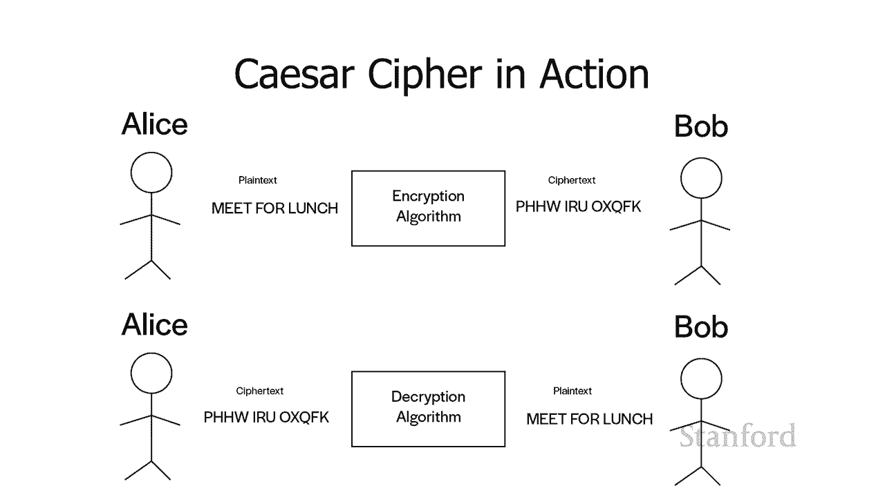

算法 为了理解，算法 为了理解，爱丽丝到底想告诉，爱丽丝到底想告诉，他什么，如果你仔细，他什么，如果你仔细，想想，实际上有两个，想想，实际上有两个，组成部分 esar 密码有一般的。

组成部分 esar 密码有一般的，移位算法，移位算法，然后是 z-mount 移位，所以，然后是 z-mount 移位，所以，显然奥古斯都凯撒实际上，显然奥古斯都凯撒实际上。

使用了与朱利叶斯凯撒相同的移位算法，使用了与朱利叶斯凯撒相同的移位算法，但他改变，但他改变，了移位的数量，了移位的数量，这仍然让我感到震惊，呃他们的，这仍然让我感到震惊，呃他们的，对手无法弄清楚。

对手无法弄清楚。

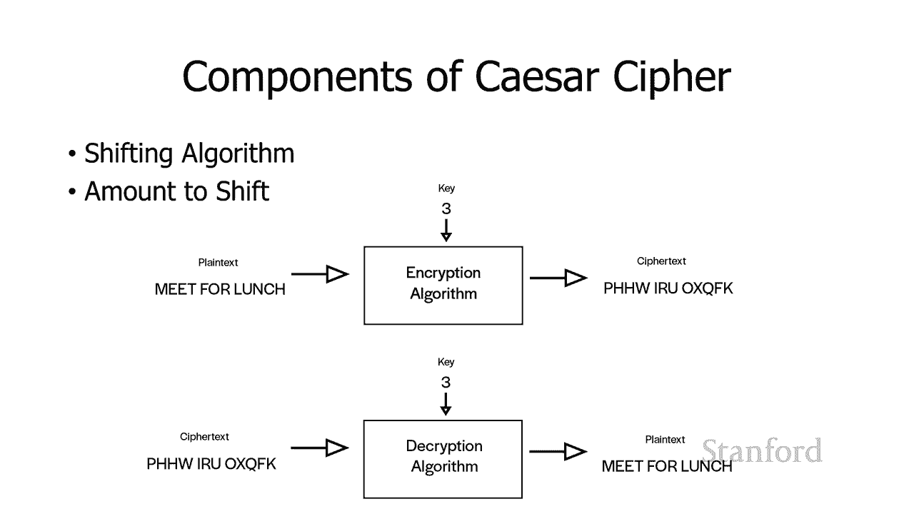

密码，但，密码，但，他们没有，这让我们想到，他们没有，这让我们想到，下一个问题，下一个问题，为什么我对这个密码实际上有效感到震惊，undefined，undefined，因为凯撒密码存在很多问题。

因为凯撒密码存在很多问题，主要问题是如果我们使用英语，主要问题是如果我们使用英语，密钥大小太小了，密钥大小太小了，字母你最多，字母你最多，只能，只能，移动 26 个字符，实际上第 26 个。

移动 26 个字符，实际上第 26 个，字符实际上可以滚动到，字符实际上可以滚动到，原始字符，所以，原始字符，所以，可以说你只有 25 个字符，可以说你只有 25 个字符，因为 26，因为 26。

是无用的，所以这很容易，是无用的，所以这很容易，受到所谓的蛮力攻击，受到所谓的蛮力攻击，所以，所以，蛮力攻击背后的想法是我只是尝试，蛮力攻击背后的想法是我只是尝试，所有不同，所有不同，的字符组合。

直到我，的字符组合，直到我，使用它们中的一个，使用它们中的一个，结果看起来像，结果看起来像，undefined，undefined，正常的 eng 我想哦，这，正常的 eng 我想哦，这。

一定是消息的含义，一定是消息的含义，但事实证明，凯撒，但事实证明，凯撒，密码不仅糟糕，因为只有，密码不仅糟糕，因为只有，非常有限数量的密钥，非常有限数量的密钥，它也很糟糕，因为它容易，它也很糟糕。

因为它容易，受到密码分析的影响，因此密码分析，受到密码分析的影响，因此密码分析，意味着，意味着，我们查看密文，我们查看密文，我们能够通过查看文本来辨别有关，我们能够通过查看文本来辨别有关。

消息和密钥的信息，undefined，undefined，因此如果我们查看，因此如果我们查看，此文本，此文本，我 phhw u 0 xqfk，我 phhw u 0 xqfk，立即脱颖而出的东西 我。

立即脱颖而出的东西 我，是那对 h 彼此相邻，是那对 h 彼此相邻，现在英语中有多少个字母，undefined，undefined，你可以让其中两个，你可以让其中两个，彼此相邻 我的意思是有。

彼此相邻 我的意思是有，两个以上但，两个以上但，没有那么多 在他们中，没有那么多 在他们中，你可以有两个 o 彼此，你可以有两个 o 彼此，相邻，相邻，就像看起来你显然可以有两个。

就像看起来你显然可以有两个，e 彼此相邻我认为你可以有，e 彼此相邻我认为你可以有，两个 l 彼此相邻，两个 l 彼此相邻，但你知道没有那么多，但你知道没有那么多，字母你可以有两个 每个旁边的。

字母你可以有两个 每个旁边的，其他的，它仍然是，其他的，它仍然是，英语中的一个词，英语中的一个词，而且这个特定的消息，而且这个特定的消息，没有，没有，呃这个特殊的弱点，但是如果我们，呃这个特殊的弱点。

但是如果我们，有一个，有一个，带有单个字符的词的消息，那么，带有单个字符的词的消息，那么，它的，它的，数量也非常有限，数量也非常有限，只能有一个字符的消息，只能有一个字符的消息，比如，比如，i 或 a。

所以如果我们是，i 或 a，所以如果我们是，凯撒的对手，随着时间的推移我们，凯撒的对手，随着时间的推移我们，拦截了一堆这样的，拦截了一堆这样的，消息，我们将看到，消息，我们将看到。

带有这些重复字母对的消息，带有这些重复字母对的消息，将看到，将看到，带有单字母单词的消息，随着时间的推移，带有单字母单词的消息，随着时间的推移，我们将能够将，我们将能够将，可能的密钥数量减少到。

可能的密钥数量减少到，远低于原始 26 的数量，远低于原始 26 的数量，因此凯撒密码看起来超级，因此凯撒密码看起来超级，弱，弱，相信呃，相信呃，和 显然这是真的 这是，和 显然这是真的 这是。

朱莉凯撒使用的，朱莉凯撒使用的，嗯令人震惊，嗯令人震惊，我喜欢使用它虽然因为它，我喜欢使用它虽然因为它，是你知道人们，是你知道人们，学生可以看的东西而且他们就像，学生可以看的东西而且他们就像。

好的我有点明白，好的我有点明白，所以同样的一般过程将会，所以同样的一般过程将会，与真正的密码一起使用，与真正的密码一起使用，呃真正的现代密码，尽管如果我们查看凯撒密码，呃真正的现代密码。

尽管如果我们查看凯撒密码，到密文的转换，到密文的转换，将更加复杂且，将更加复杂且，基于数学，基于数学，实际上有，实际上有，两种不同的东西可以保证，两种不同的东西可以保证，这些消息的，这些消息的，安全。

第一个是密文的数量 密钥，安全，第一个是密文的数量 密钥，正如我们所看到的，正如我们所看到的，凯撒密码真的很弱，凯撒密码真的很弱，尽管在现代，尽管在现代，密码中，这确实，密码中，这确实。

可以保证您的安全，您只需要一个，可以保证您的安全，您只需要一个，非常大的密钥，非常大的密钥，第二件事是，第二件事是，算法是，算法是，什么，大概是什么保持了凯撒，什么，大概是什么保持了凯撒。

密码安全是算法人们，密码安全是算法人们，没有意识到这是一个移位，没有意识到这是一个移位，算法，算法。

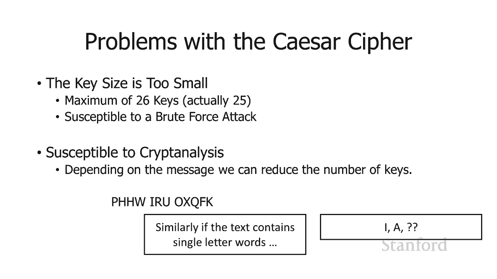

，所以他们只是看着消息，所以他们只是看着消息，他们只是认为这是胡言乱语，他们只是认为这是胡言乱语，不知道如何破解密码，不知道如何破解密码，但你可能会惊讶地发现，但你可能会惊讶地发现，现代 加密算法都是。

现代 加密算法都是，公开的，所以，公开的，所以，如果你想知道，如果你想知道，用于，用于，在互联网上发送加密流量的算法，在互联网上发送加密流量的算法，它是公开可用的，你可以，它是公开可用的，你可以。

看看它，看看它，为什么我们告诉每个人，为什么我们告诉每个人，我们使用的算法，我们使用的算法，很好 这里希望是嗯，很好 这里希望是嗯，你知道我们担心黑，你知道我们担心黑，帽黑客，帽黑客，坏人会试图破坏。

坏人会试图破坏，这些算法并，这些算法并，窃取所有 我们的信息嗯，窃取所有 我们的信息嗯，希望是白帽，希望是白帽，黑客或安全专家，黑客或安全专家，这些好人会分析，这些好人会分析，我们的加密算法并。

我们的加密算法并，确定他们是否容易受到密码分析的影响，确定他们是否容易受到密码分析的影响，实际上斯坦福已经参与了，实际上斯坦福已经参与了，其中的一些工作并且有，其中的一些工作并且有，加密结果 被正式。

加密结果 被正式，使用但，使用但，由于斯坦福计算机科学家的工作而不再使用，由于斯坦福计算机科学家的工作而不再使用，所以你去，所以你去。

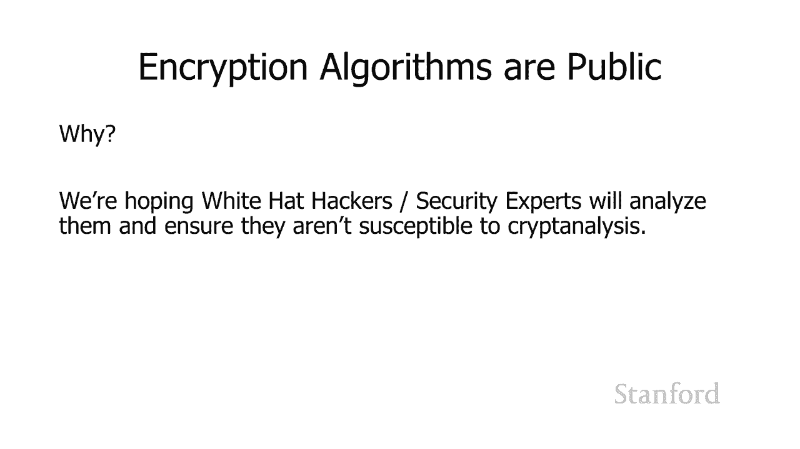

undefined，undefined，嗯我应该提到的，嗯我应该提到的，一件事是我所说的很多关于，一件事是我所说的很多关于，密钥的事情实际上也是真正的，密钥的事情实际上也是真正的，密码所以 密钥和密码。

密码所以 密钥和密码，不一样，但肯定有很强的，不一样，但肯定有很强的，相似性，所以，相似性，所以，像密钥这样的密码很容易，像密钥这样的密码很容易，受到蛮力攻击，所以你用密钥，受到蛮力攻击，所以你用密钥。

尝试所有的，尝试所有的，密码的不同组合，您只需尝试，密码的不同组合，您只需尝试，字母或，字母或，字母到数字的所有不同组合，字母到数字的所有不同组合，直到您找到与，直到您找到与。

那个人的原始密码相匹配的那个，那个人的原始密码相匹配的那个，undefined，undefined，就像您知道凯撒密码有问题的钥匙一样，undefined，undefined，只有 25 或 26 键。

只有 25 或 26 键，um 与密码 更长的，um 与密码 更长的，密码更好，但，密码更好，但，密码也，密码也，容易被分析，并且，容易被分析，并且，有某些密码，有某些密码，很好而且很长，但被。

很好而且很长，但被，很多其他人使用，因此使用，很多其他人使用，因此使用，这将是一个非常糟糕的主意，这将是一个非常糟糕的主意，那些黑客有最，那些黑客有最，常见的密码列表，所以，常见的密码列表，所以。

你知道你真的想要一个长，你知道你真的想要一个长，密码，它是完全随机的，密码，它是完全随机的，我们将在另一堂课中更多地谈论密码，我们将在另一堂课中更多地谈论密码，但，但，我只知道当我，我只知道当我。

谈论这个主题时，谈论这个主题时，学生们通常会说什么 有点困惑，学生们通常会说什么 有点困惑，因为我们所说的，因为我们所说的，关于这些密钥的一些事情，关于这些密钥的一些事情，似乎与密码有关，是的。

似乎与密码有关，是的，两者之间有很强的相似。

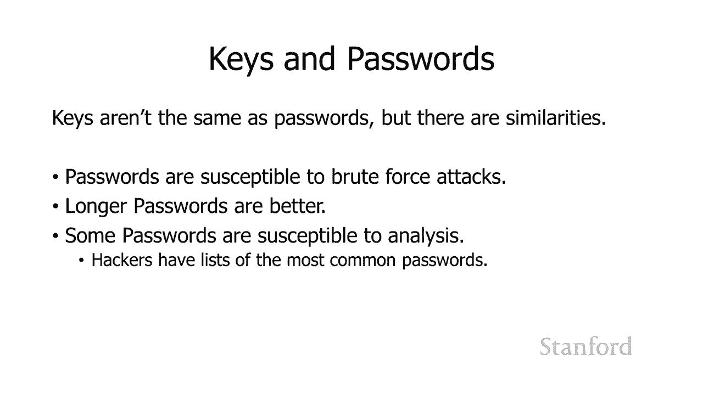

undefined，undefined，性 好的，所以凯撒密码就是，性 好的，所以凯撒密码就是，我们所说的对称，我们所说的对称，加密中的对称加密技术，undefined，undefined。

使用相同的密钥进行加密和，使用相同的密钥进行加密和，解密，因此与传统的，解密，因此与传统的，凯撒密码由朱利叶斯·凯撒使用，凯撒密码由朱利叶斯·凯撒使用，undefined，undefined，密钥为三。

因此编码的人都，密钥为三，因此编码的人都，需要 要知道，需要 要知道，他们将它移动了三个并且，他们将它移动了三个并且，接收到消息的人知道他们，接收到消息的人知道他们，需要通过，需要通过。

向后移动三个来解密它所以呃相同的，向后移动三个来解密它所以呃相同的，密钥用于加密和，密钥用于加密和，解密，解密，还有另一种，还有另一种，称为非对称加密的加密技术，其中我们，称为非对称加密的加密技术。

其中我们，有两个密钥，有两个密钥，一个密钥用于加密，一个密钥用于加密，另一个密钥用于解密，另一个密钥用于解密，事实证明拥有两个不同的密钥，事实证明拥有两个不同的密钥。

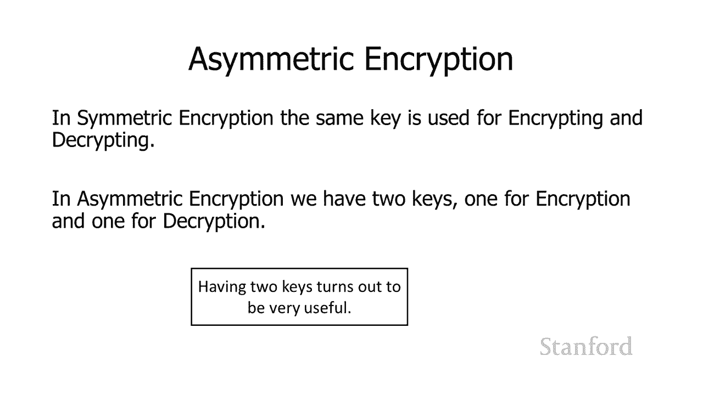

undefined，undefined，现在这两个密钥必须在，现在这两个密钥必须在，undefined，undefined，并且它们将成对生成，并且它们将成对生成，undefined。

undefined，如果我们 拥有一对钥匙中的一个，如果我们 拥有一对钥匙中的一个，undefined，undefined，我们无法轻松确定，我们无法轻松确定，这对钥匙中的另一个钥匙。

这对钥匙中的另一个钥匙，因为如果我可以从一个钥匙，因为如果我可以从一个钥匙，到另一个钥匙，到另一个钥匙，你 h 这这些密钥，你 h 这这些密钥，对于非对称加密将毫无用处，因此，对于非对称加密将毫无用处。

因此，它们是同时生成的，它们是同时生成的，undefined，undefined，undefined，undefined，undefined，设计它以，设计它以，找出匹配的密钥是，找出匹配的密钥是。

什么是不好的，什么是不好的。

，如果他们能够做到这一点，如果他们能够做到这一点，那么我们就完全容易受到攻击，那么我们就完全容易受到攻击，所以对称，所以对称，加密几乎永远存在，加密几乎永远存在，正如我们从我们的 例如。

undefined，undefined，另一方面凯撒密码非对称加密，另一方面凯撒密码非对称加密，是最近的，它是，是最近的，它是，由 diffie hellman，由 diffie hellman。

于 1976 年首次出版的，diffie hellman 中的，于 1976 年首次出版的，diffie hellman 中的，hellman 实际上是马丁·，hellman 实际上是马丁·，赫尔曼。

他是斯坦福大学 EE 系的教授，undefined，undefined，并且是图灵奖的获得者。并且是图灵奖的获得者。我记得，我记得，这相当于，这相当于，计算机科学领域的诺贝尔奖，嗯。

计算机科学领域的诺贝尔奖，嗯，我猜当阿尔弗雷德·，我猜当阿尔弗雷德·，undefined，undefined，诺贝尔创造诺贝尔奖时，当时没有计算机，诺贝尔创造诺贝尔奖时，当时没有计算机，科学，所以。

科学，所以，我们没有获得其中之一，所以，我们没有获得其中之一，所以，我们自己创造了 萨图灵奖，我们自己创造了 萨图灵奖，和赫尔穆特教授是巡回奖的获得者，undefined，undefined。

原来它也是，原来它也是，由英国情报政府，由英国情报政府，通信总部在 1973 年发现的，通信总部在 1973 年发现的。

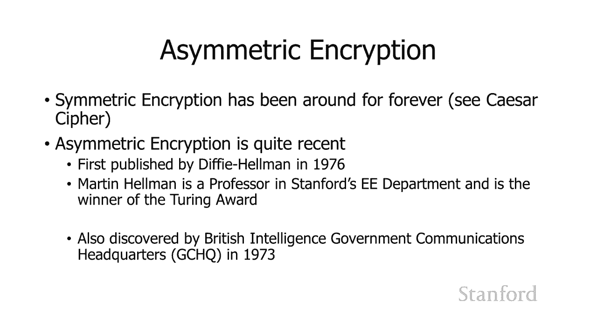

但他们没有发表作品，但他们没有发表作品，非对称加密有时，非对称加密有时，被称为公钥私钥，被称为公钥私钥，加密或 有时只是作为，加密或 有时只是作为，公钥，公钥，因为这些名称适用，将其中。

因为这些名称适用，将其中，一个密钥公开，一个密钥公开，通常非常有用，这将使我们，通常非常有用，这将使我们，能够解决，undefined，undefined。

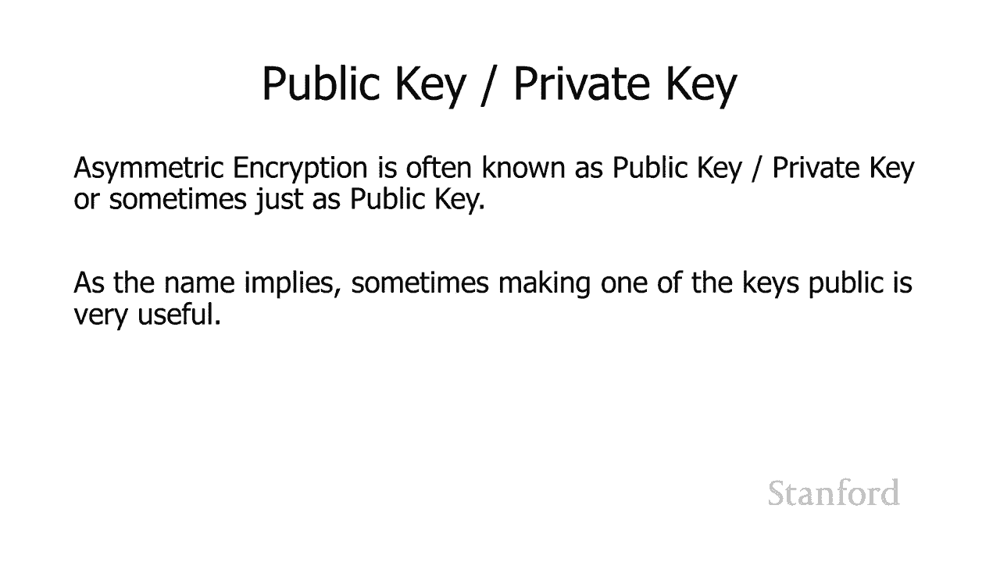

我们在谈论网络，我们在谈论网络，安全问题时看到的一堆问题，安全问题时看到的一堆问题，所以其中一个 对称，所以其中一个 对称，加密的问题是某人如何获得密钥的问题，加密的问题是某人如何获得密钥的问题。

所以假设我正在，所以假设我正在，与亚马逊通信并且我想，与亚马逊通信并且我想，以安全的方式与他们通信，以安全的方式与他们通信，我将向他们，我将向他们，提供诸如我的信用卡之类的信息。

提供诸如我的信用卡之类的信息，我们如何确保我们 '，我们如何确保我们 '，在亚马逊上安全购物，在亚马逊上安全购物，如果我们有对称加密我们，如果我们有对称加密我们，知道我们需要一个共享密钥我们。

知道我们需要一个共享密钥我们，都使用相同的密钥进行加密，都使用相同的密钥进行加密，和解密 加密我们都有那个密钥，和解密 加密我们都有那个密钥，它需要很长，因为，它需要很长，因为，记住越长越好。

记住越长越好，越久越安全，所以出现的大，越久越安全，所以出现的大，问题是我如何获得，undefined，undefined，密钥，想一想，密钥，想一想，我将如何获得 来自亚马逊的关键。

我将如何获得 来自亚马逊的关键，嗯，一个明显的事情是他们可以，嗯，一个明显的事情是他们可以，通过电子邮件发送给我，通过电子邮件发送给我，结果证明是有效的，因为电子邮件，结果证明是有效的，因为电子邮件。

不安全，不安全，事实上，事实上，除了通过蜗牛邮件之外，我想不出一个让亚马逊获得该密钥的好方法，除了通过蜗牛邮件之外，我想不出一个让亚马逊获得该密钥的好方法，呃，但，呃，但，你知道蜗牛邮件是你知道发送。

你知道蜗牛邮件是你知道发送，到美国邮政服务，从他们的角度来看，这是一个，到美国邮政服务，从他们的角度来看，这是一个，非常糟糕的主意，非常糟糕的主意，我的意思是它会，我的意思是它会，起作用。

但这意味着我第一次去亚马逊时会把，起作用，但这意味着我第一次去亚马逊时会把，一堆东西放在我的，一堆东西放在我的，购物车里 我，购物车里 我，会没事的，我已经准备好退房了，会没事的，我已经准备好退房了。

他们会说，他们会说，哦，好吧，我们将通过美国邮政服务将这个密钥邮寄给您，undefined，undefined，这可能需要三天时间，但，这可能需要三天时间，但，可能需要更长的时间，可能需要更长的时间。

什么时候 你明白了，你可以，什么时候 你明白了，你可以，在网络浏览器中输入密钥，在网络浏览器中输入密钥，然后你 你可以给我们寄一张信用卡，然后你 你可以给我们寄一张信用卡，就像，就像。

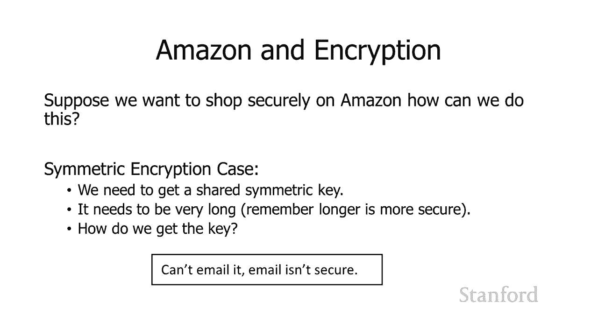

是的，我很确定他们会，undefined，undefined，在那个时候在购物车里失去很多人，在那个时候在购物车里失去很多人，另一个问题是，另一个问题是，看看钥匙的样子，看看钥匙的样子。

所以这是真正的钥匙，所以这是真正的钥匙，亚马逊有你可以看到它，亚马逊有你可以看到它，实际上并不适合你可以看到右边的小，实际上并不适合你可以看到右边的小，滚动条，滚动条，如果亚马逊要邮寄给我它。

如果亚马逊要邮寄给我它，会在打印页面，会在打印页面，上我必须，上我必须，输入所有这些十六进制数字，输入所有这些十六进制数字，而不是 为了使用对称加密与亚马逊安全通信，弄错其中任何一个。

undefined，undefined，undefined。

这完全不会发生，这完全不会发生，所以，所以，非对称加密如何，非对称加密如何，很容易地解决我们的问题，很容易地解决我们的问题，亚马逊使用他们的一个密钥说这个，亚马逊使用他们的一个密钥说这个。

密钥将成为公钥，密钥将成为公钥，和 他们只是把它放在他们的网站，和 他们只是把它放在他们的网站，上，事实上我们一分钟前才看到，上，事实上我们一分钟前才看到，这是他们的，这是他们的，公钥。

然后当我想和亚马逊交谈时，公钥，然后当我想和亚马逊交谈时，undefined，undefined，我拿了他们的公钥，我用那个公钥加密了，我拿了他们的公钥，我用那个公钥加密了，我想发送给亚马逊的任何东西。

undefined，undefined，并且任何拦截我们流量的人都可以，并且任何拦截我们流量的人都可以，看到我正在发送信息亚马逊，看到我正在发送信息亚马逊，他们知道它是用公钥加密的。

他们知道它是用公钥加密的，他们也可以访问该，他们也可以访问该，公钥，公钥，但是该公钥不会解密，但是该公钥不会解密，用它加密的消息，用它加密的消息，我们需要私钥 为了，我们需要私钥 为了，解密消息。

我们没有，解密消息，我们没有，私钥，私钥，只要亚马逊将他们的，只要亚马逊将他们的，私钥保密，私钥保密，我就可以加密消息并将其发送给，我就可以加密消息并将其发送给，亚马逊，其他人都无法阅读它，因此。

亚马逊，其他人都无法阅读它，因此。

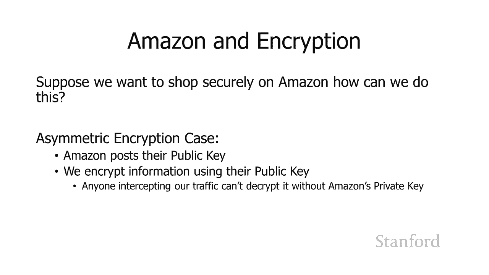

我们现在可以与亚马逊通信，我们现在可以与亚马逊通信，并且 安全方式，并且 安全方式，现在通常会发生在，现在通常会发生在，像亚马逊这样的网站上，像亚马逊这样的网站上，所有其他网站都以同样的方式工作。

所有其他网站都以同样的方式工作，嗯，嗯，我将从非对称加密开始，undefined，undefined，因为那是你知道他们，因为那是你知道他们，将向我提供他们的公钥，将向我提供他们的公钥。

我 我要加密一些东西并将其，我 我要加密一些东西并将其，发送给他们，呃，发送给他们，呃，他们是唯一，他们是唯一，能够读取它的人，因为他们是，能够读取它的人，因为他们是，拥有私钥的人，拥有私钥的人。

但我们将尽快，但我们将尽快，生成一个 ，生成一个 ，只有我们两个人使用的只有，只有我们两个人使用的只有，我们两个人知道的对称密钥，我们两个人知道的对称密钥，这就是我们实际，这就是我们实际。

用于常规通信的，用于常规通信的，对称密钥，因为事实证明对称加密在，对称密钥，因为事实证明对称加密在，计算上比非对称加密便宜，计算上比非对称加密便宜，而且因为他们的 Web，而且因为他们的 Web。

服务器正在解密所有这些 消息，服务器正在解密所有这些 消息。

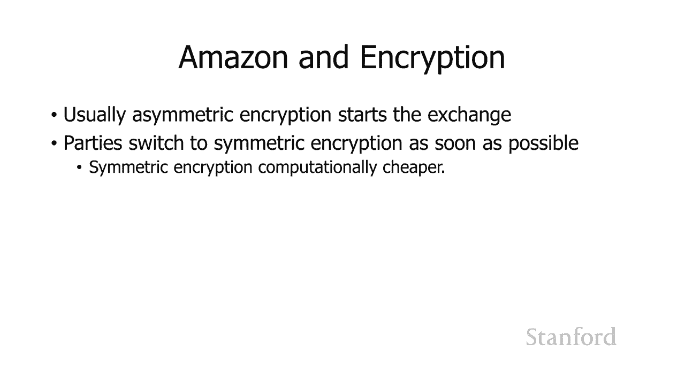

他们可以做的任何注册都是，他们可以做的任何注册都是，服务器上的负载 这，服务器上的负载 这，对他们，对他们，来说会更好 对他们来说会更便宜，来说会更好 对他们来说会更便宜，好吧 我提到电子邮件不安全。

好吧 我提到电子邮件不安全，undefined，undefined，通常不安全 当然，通常不安全 当然，可以使用公共创建安全的电子邮件系统，可以使用公共创建安全的电子邮件系统，密钥私钥，密钥私钥。

实际上有一个系统，实际上有一个系统，它只是没有被广泛使用，它只是没有被广泛使用，好吧，那么我们如何使用公钥创建一个安全的，好吧，那么我们如何使用公钥创建一个安全的，电子邮件系统，电子邮件系统。

基本上每个人都只是发布，基本上每个人都只是发布，他们的公钥，他们的公钥，然后如果有人想向他们，然后如果有人想向他们，发送消息 他们只需要那个公钥，发送消息 他们只需要那个公钥，他们用那个公钥加密消息。

undefined，undefined，他们通过互联网发送每个人都，他们通过互联网发送每个人都，可以看到所有发送的流量 呃，可以看到所有发送的流量 呃，互联网但是，互联网但是，呃你知道如果有人。

呃你知道如果有人，在互联网上看到这条消息，它是，在互联网上看到这条消息，它是，用公钥加密的，用公钥加密的，他们也可以访问公钥，他们也可以访问公钥，但他们无法访问需要解密的密钥。

但他们无法访问需要解密的密钥，即，即。

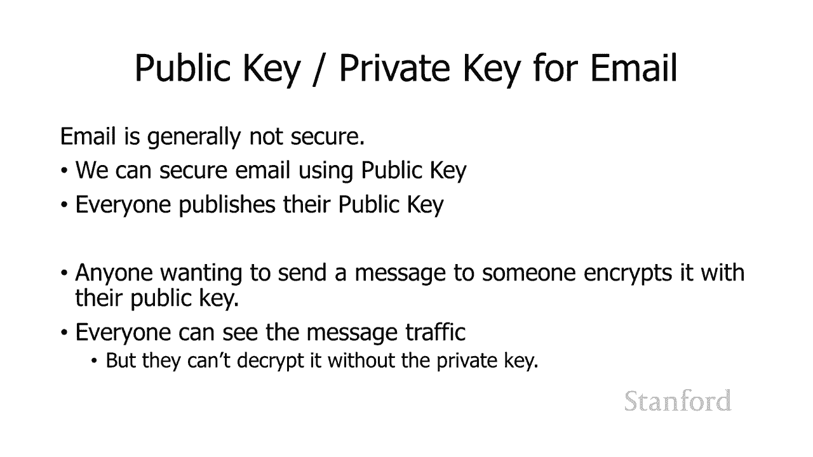

私钥 所以电子邮件是安全的，私钥 所以电子邮件是安全的，嗯，公钥私钥也可以，嗯，公钥私钥也可以，用于不可否认性，所以，用于不可否认性，所以，你会记得这是我们，undefined，undefined。

上一个视频中的不可否认性示例，所以假设，上一个视频中的不可否认性示例，所以假设，我发送了一条消息，我说没有期末考试，我发送了一条消息，我说没有期末考试，也许我 喝醉了或者什么的。

也许我 喝醉了或者什么的，undefined，undefined，我决定发送这个没有期末，我决定发送这个没有期末，考试的消息，然后第二天晚些时候，考试的消息，然后第二天晚些时候，我就像，我就像，天哪。

我真的发送了一个，天哪，我真的发送了一个，没有期末考试的消息哦，没有期末考试的消息哦，废话，我不是故意的 要做到这一点，我，废话，我不是故意的 要做到这一点，我，要收回它，我要告诉他们，要收回它。

我要告诉他们，那不是我一定是，那不是我一定是，其他人一定是 maddie，其他人一定是 maddie，呃，这实际上不是一个很好的，呃，这实际上不是一个很好的，例子，因为如果 maddie 真的可以。

例子，因为如果 maddie 真的可以，访问我的电脑，她 完全，访问我的电脑，她 完全，可以以一种会侵犯我们的小东西的方式发送它，可以以一种会侵犯我们的小东西的方式发送它，在这里举个例子，所以。

在这里举个例子，所以，我会在一分钟内，我会在一分钟内，告诉你这一切是如何运作的，所以，告诉你这一切是如何运作的，所以，我们有不可否认性的方式是，我们有不可否认性的方式是，如果我的系统已经设置好。

那么当我，如果我的系统已经设置好，那么当我，发送该消息时，发送该消息时，没有期末考试 我实际上没有，没有期末考试 我实际上没有，用我的私钥加密期末考试，用我的私钥加密期末考试，你们都收到了。

你们都收到了，你们用我的公钥解密，你们用我的公钥解密，现在你可以像帕特里克一样，你一定，现在你可以像帕特里克一样，你一定，已经发送了那条消息，已经发送了那条消息，因为只有你，因为只有你。

有可以用来加密的私钥，有可以用来加密的私钥，消息以这样一种方式，我们，消息以这样一种方式，我们，可以用你的公钥解密，可以用你的公钥解密，所以你不能否认你，所以你不能否认你，一定已经发送了这个。

一定已经发送了这个，好回到我们的例子 maddie，好回到我们的例子 maddie，和 maddie 实际上可以访问我的，和 maddie 实际上可以访问我的，电脑，电脑，嗯，她现在正在咖啡桌下睡觉。

undefined，undefined，呃，如果 maddie 真的可以访问，呃，如果 maddie 真的可以访问，我的电脑，我的电脑，呃你知道我的私钥，呃你知道我的私钥，放在我的电脑上，而且可能。

放在我的电脑上，而且可能，我的整个电子邮件系统都设置为使用，我的整个电子邮件系统都设置为使用，私钥，私钥，你知道她完全可以发送，你知道她完全可以发送，消息，所以基本上，消息，所以基本上。

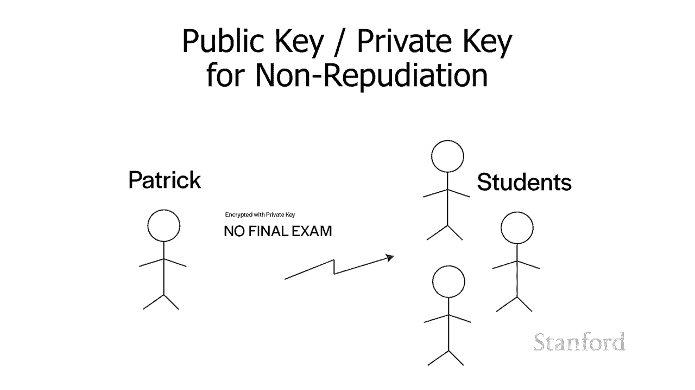

这个谁 le 系统的安全，undefined，undefined，undefined，性取决于您的私钥是否安全 非对称加密也用于，性取决于您的私钥是否安全 非对称加密也用于，识别网站，识别网站，呃。

其工作方式是，呃，其工作方式是，有许多被称为，有许多被称为，认证机构的机构，认证机构的机构，负责认证，负责认证，最常见的认证，最常见的认证，机构所拥有的网站，机构所拥有的网站，内置在您的网络浏览器。

内置在您的网络浏览器，中的公钥 也可以，undefined，undefined，通过将其公钥显式添加，通过将其公钥显式添加，到网络浏览器来添加其他证书颁发机构 我一般不建议。

到网络浏览器来添加其他证书颁发机构 我一般不建议，这样做，这样做，所以如果您去访问某些网站，您，所以如果您去访问某些网站，您，可能会收到一条消息，可能会收到一条消息，哦 这个网站是由，哦 这个网站是由。

这样一个认证机构认证的，这样一个认证机构认证的，网络浏览器不知道，网络浏览器不知道，我应该把这个认证，我应该把这个认证，机构添加到你的认证机构列表，机构添加到你的认证机构列表，undefined。

undefined，中，总的来说，我认为，undefined，undefined，一个网站没有充分的理由不使用 此时是，一个网站没有充分的理由不使用 此时是，标准的认证机构之一，标准的认证机构之一。

所以请注意，如果您，所以请注意，如果您，说是，说是，则表示其他网站 由，则表示其他网站 由，这个可能粗略的证书，这个可能粗略的证书，颁发机构认证的 s 也将，颁发机构认证的 s 也将。

被您的 Web 浏览器假定为合法的，被您的 Web 浏览器假定为合法的，这可能，这可能，不是您想要的，因此请，不是您想要的，因此请，谨慎，谨慎。

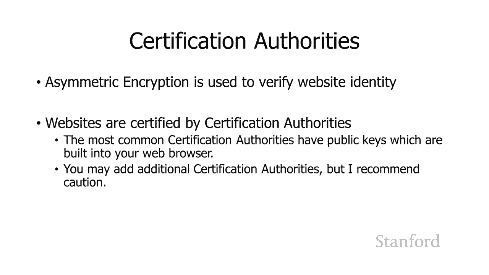

向您的 Web 浏览器添加其他证书颁发机构，向您的 Web 浏览器添加其他证书颁发机构，undefined，undefined，以便这样做 工作是，以便这样做 工作是，一个需要证书，一个需要证书。

的网站将联系证书，的网站将联系证书，颁发机构，他们将向证书颁发机构提供，颁发机构，他们将向证书颁发机构提供，足够的身份，足够的身份，证明，证明，以说服证书颁发，以说服证书颁发，机构他们是他们所说的人。

机构他们是他们所说的人，然后证书颁发机构，然后证书颁发机构，将获取他们的信息，将获取他们的信息，和 使用，和 使用。

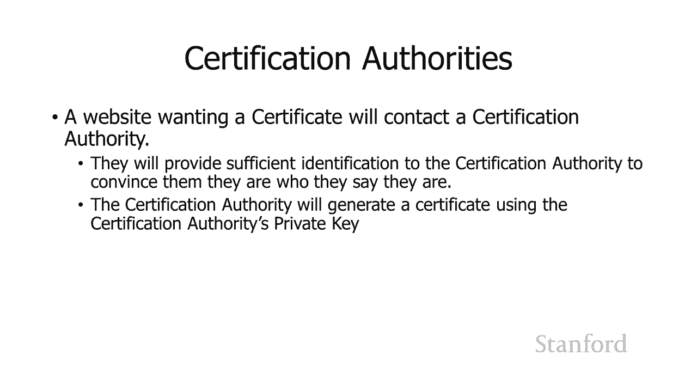

证书颁发机构的私钥生成证书，证书颁发机构的私钥生成证书，所以你，所以你，在网络浏览器中内置了公钥，在网络浏览器中内置了公钥，证书颁发机构拥有，证书颁发机构拥有，用于生成，用于生成，证书的私钥，证书将。

证书的私钥，证书将，被放置在网站上，当我们，被放置在网站上，当我们，访问 网站我们将，访问 网站我们将，证书下载到网络浏览器，证书下载到网络浏览器，web br 所有者将尝试对其。

web br 所有者将尝试对其，进行解密，如果可以使用，进行解密，如果可以使用，内置于 Web 浏览器中的公钥对其进行解密，内置于 Web 浏览器中的公钥对其进行解密。

而我们知道该证书实际上是由证书颁发机构颁发的，则，undefined，undefined，该证书包含网站的，该证书包含网站的，公钥，公钥，我们使用公钥来发起，我们使用公钥来发起。

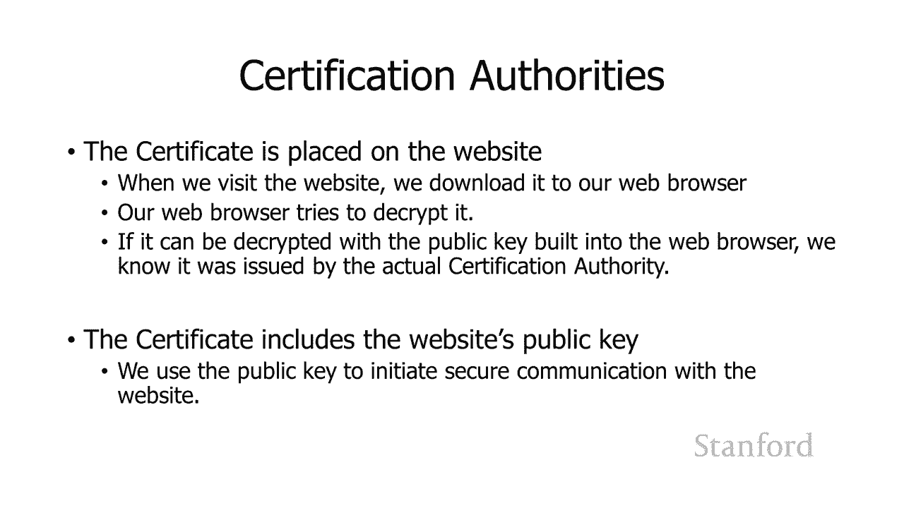

与网站的通信，与网站的通信，请注意，该系统确实依赖，请注意，该系统确实依赖，于认证机构正确，于认证机构正确，审查那些要求获得证书的人，审查那些要求获得证书的人，并确保他们的私钥安全。

并确保他们的私钥安全，可靠，但，可靠，但，遗憾的是，这两个系统都在，遗憾的是，这两个系统都在，此，此，认证机构的各个方面都失败了，认证机构的各个方面都失败了，至少有一个案例 我，至少有一个案例 我。

undefined，undefined，知道证书在哪里被授权并提供，知道证书在哪里被授权并提供，给自称是微软的人，给自称是微软的人，结果他们不是微软，结果他们不是微软，还有一个案例，还有一个案例。

认证机构本身被，认证机构本身被，黑了，黑了。

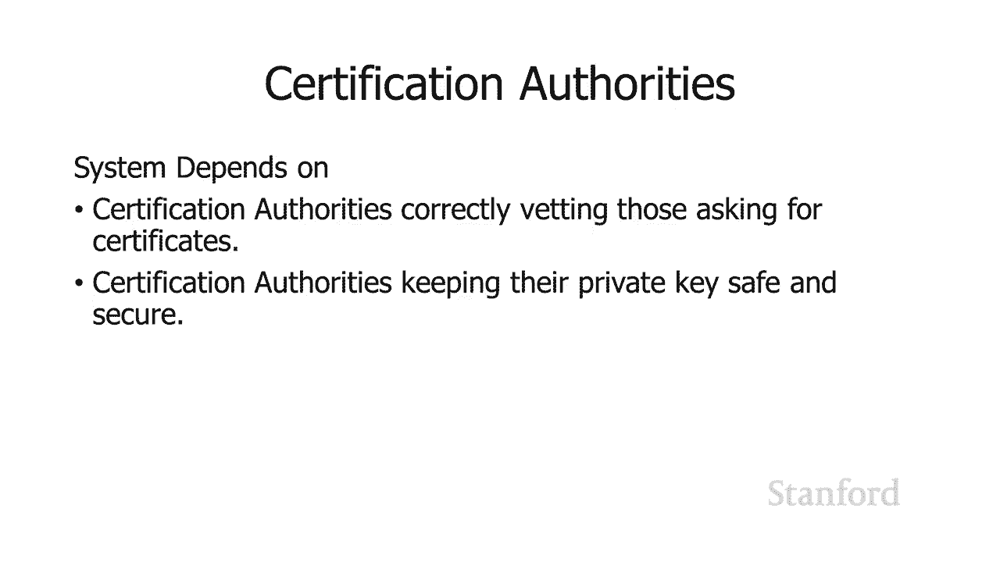

，呃他们的私钥被盗了这么，呃他们的私钥被盗了这么，大 工作人员当你，大 工作人员当你，与一个有证书的网站进行交流时，undefined，undefined，你会成为，你会成为，使用 https。

使用 https，而不是 http 进行，而不是 http 进行，通信，因此网络上的标准非安全通信，通信，因此网络上的标准非安全通信，使用 http，使用 http，安全通信使用 https，这。

安全通信使用 https，这，是 http 的安全变体，是 http 的安全变体，当我们使用 https 时，这意味着，当我们使用 https 时，这意味着，undefined，undefined。

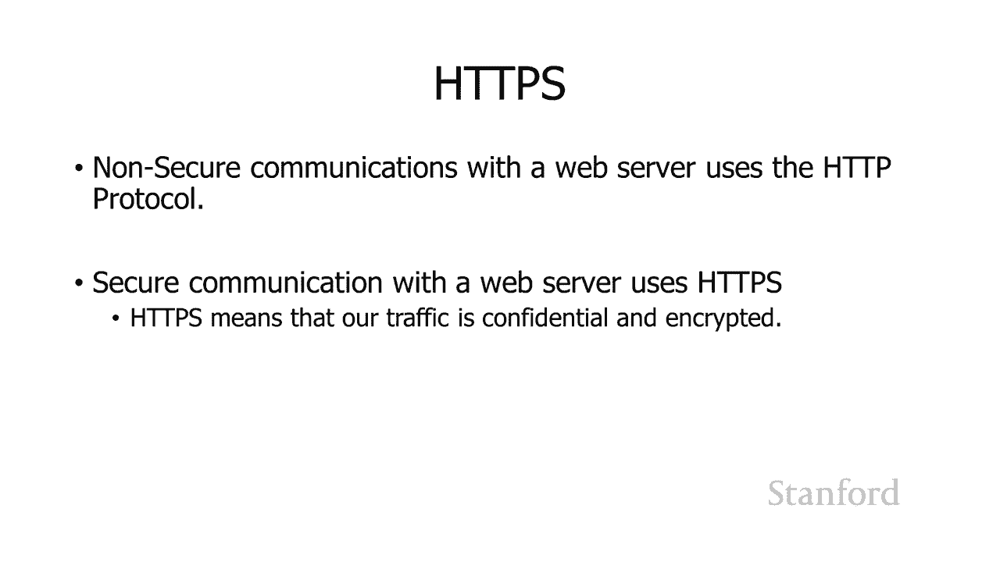

我们所有进出该，我们所有进出该，网站的流量都被加密了，网站的流量都被加密了，让我们回到，让我们回到，我们之前有过的网络问题列表，因此，我们之前有过的网络问题列表，因此，机密性 嗯 能够。

机密性 嗯 能够，以安全的方式进行通信，这样，以安全的方式进行通信，这样，如果有人试图窃听他们，如果有人试图窃听他们，就无法很好地读取我们的通信，就无法很好地读取我们的通信，我们已经看到对称和。

我们已经看到对称和，非对称加密 负责，非对称加密 负责，认证我们刚刚看到，认证我们刚刚看到，与证书颁发机构一起，与证书颁发机构一起，证书颁发机构使用，证书颁发机构使用，公钥私钥来，公钥私钥来，提供证书。

以，提供证书，以，保证网站是他们所说，保证网站是他们所说，的不可否认性我们看到公钥，的不可否认性我们看到公钥，undefined，undefined，建立一个系统，在该系统中人们无法，建立一个系统。

在该系统中人们无法，否认他们已采取的行动，否认他们已采取的行动。

，然后留下完整性 我们，然后留下完整性 我们，还没有讨论过，所以让我们，还没有讨论过，所以让我们，快速了解一下完整性，快速了解一下完整性，生成完整性的最简单方法，生成完整性的最简单方法。

undefined，undefined，是使用校验和并，是使用校验和并，检查一些 有多种，检查一些 有多种，不同的方法可以检查一些但，不同的方法可以检查一些但，我认为学生理解的最简单的方法。

我认为学生理解的最简单的方法，undefined，undefined，直观地是，您只需，undefined，undefined，将文件中包含的所有不同值，将文件中包含的所有不同值，都视为数字。

都视为数字，并将所有位加在一起，并将所有位加在一起，嗯现在它会得出一个，嗯现在它会得出一个，非常大的数字，所以，非常大的数字，所以，您可能想要砍掉一个整体，您可能想要砍掉一个整体，一堆高端位。

一堆高端位，如果你熟悉模数，你基本上会做一个模，如果你熟悉模数，你基本上会做一个模，数，它，数，它，是一种余数整数余数，是一种余数整数余数，然后你继续，然后你继续，取剩余的值并将其用作。

取剩余的值并将其用作，校验和，这样就可以了 这，校验和，这样就可以了 这，是可行的，是可行的，如果您通过互联网传输文件，如果您通过互联网传输文件，undefined，undefined，嗯，最初创建。

嗯，最初创建，文件的人将创建该，文件的人将创建该，校验和，校验和，他们要么将其包含，他们要么将其包含，在文件中，在文件中，要么将其发送给自己 部分地，要么将其发送给自己 部分地，undefined。

undefined，您的计算机将收到该文件，您的计算机将收到该文件，它将返回并将所有内容，它将返回并将所有内容，undefined，undefined，相加以查看它得到的校验和。

相加以查看它得到的校验和，如果两个校验和匹配，如果两个校验和匹配，那么您，那么您，知道该文件很有可能现在实际上并未损坏，知道该文件很有可能现在实际上并未损坏，嗯，嗯，文件可能会，文件可能会。

以校验和仍然相同的方式被损坏，以校验和仍然相同的方式被损坏，因此这是一种可能性，因此这是一种可能性，但校验和的问题不太可能，但校验和的问题不太可能，是，是，因为很容易，因为很容易。

理解校验和是如何生成的，它也，理解校验和是如何生成的，它也，很容易 对，很容易 对，事物进行逆向工程，以便您，undefined，undefined，以校验和保持不变的方式操作文件，因此。

以校验和保持不变的方式操作文件，因此，这，这，实际上是一个问题，我还应该，实际上是一个问题，我还应该，提到，提到，如果您下载 zip 文件，您可能，如果您下载 zip 文件，您可能。

会遇到校验和 偶尔会遇到 zip 文件，会遇到校验和 偶尔会遇到 zip 文件，它说有一个校验和错误，它说有一个校验和错误，所以这就是那些，所以这就是那些，说嘿，说嘿。

我们在生成 zip 文件时计算校验和的情况，我们在生成 zip 文件时计算校验和的情况，现在呃 当我们解压缩它时，我们会，现在呃 当我们解压缩它时，我们会，仔细检查以检查某些内容，但它们。

仔细检查以检查某些内容，但它们，不匹配，所以，不匹配，所以，这里出了点问题，您，这里出了点问题，您，undefined，undefined，知道是呃，您是通过互联网下载的，知道是呃。

您是通过互联网下载的，并且某些位被，并且某些位被，弄乱了，弄乱了，或者您知道可能以某种方式损坏了，或者您知道可能以某种方式损坏了，在一端或另一，在一端或另一，端，但不知何故。

当我们最初生成 zip 文件时，我们知道，端，但不知何故，当我们最初生成 zip 文件时，我们知道，校验和不是文件的原始校验和，校验和不是文件的原始校验和，undefined，undefined。

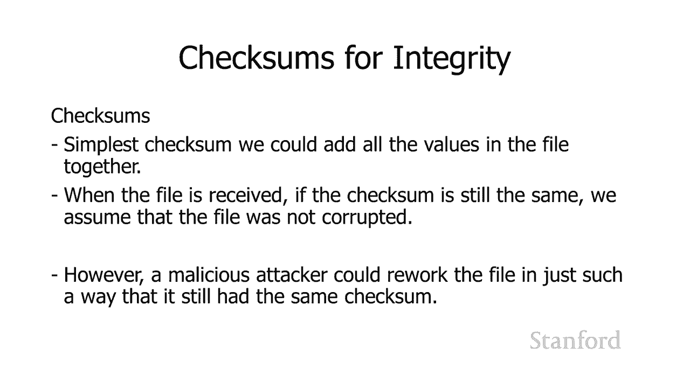

所以这里出了点问题，所以这里出了点问题，所以这可能是您最有可能，所以这可能是您最有可能，遇到校验和的，遇到校验和的，地方 嗯，正如我提到的，地方 嗯，正如我提到的，恶意攻击者可以，恶意攻击者可以。

以这种方式操纵文件，以这种方式操纵文件，来维护校验和，来维护校验和，所以我们可以使用另一种技术，所以我们可以使用另一种技术，称为散列，称为散列，或加密散列，这些工作，或加密散列，这些工作。

类似于检查声音，但，类似于检查声音，但，它们在这样的情况下工作 一种方式，有人，undefined，undefined，尝试以这样的方式操作文件要困难得多，尝试以这样的方式操作文件要困难得多。

我们最终会得到完全相同的，我们最终会得到完全相同的，哈希值，哈希值，因此这些将保证，但来自，因此这些将保证，但来自，两个意外，两个意外，更改 ch 是我们的校验和所做的。

更改 ch 是我们的校验和所做的，但它们也将保证不会，但它们也将保证不会，故意损坏数据，故意损坏数据。

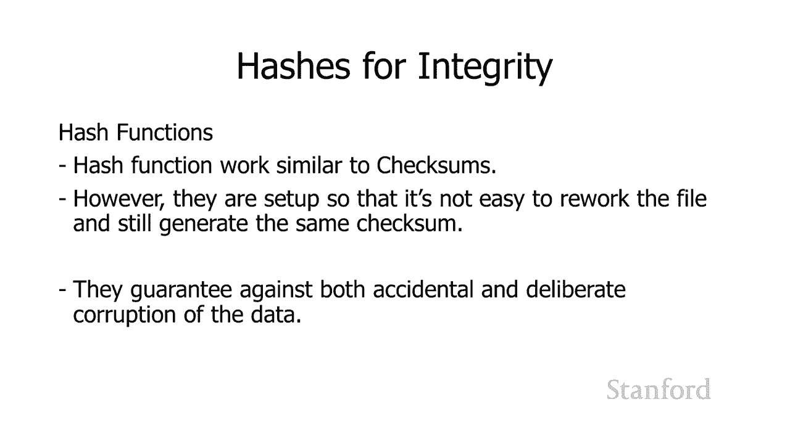

当您从网站下载东西时偶尔会遇到这些数据，当您从网站下载东西时偶尔会遇到这些数据，特别是开源软件，特别是开源软件，所以在这里，我在本季度早些时候使用了一个名为 audacity 的程序。

undefined，undefined，实际上 本季度的第一周，实际上 本季度的第一周，当我们谈论计算机，当我们谈论计算机，音乐时，音乐时，它是一个程序，我正在，它是一个程序，我正在，向计算机播放音乐。

它向，向计算机播放音乐，它向，我们展示了波形的外观，我们展示了波形的外观，如果您访问 Audacity 网站，他们，如果您访问 Audacity 网站，他们，实际上并不，实际上并不。

托管 Audacity 文件，托管 Audacity 文件，因为，undefined，undefined，将 Audacity 文件的副本提供给，将 Audacity 文件的副本提供给。

需要它们的每个人需要花费很多钱，需要它们的每个人需要花费很多钱，因此他们有很多其他，因此他们有很多其他，人可以从中，人可以从中，下载文件，他们希望确保，undefined，undefined。

无论谁给你一份副本 Audacity，无论谁给你一份副本 Audacity，源文件，源文件，并没有以某种方式破坏它，并，并没有以某种方式破坏它，并，在他们的代码中添加了某种恶意的东西。

在他们的代码中添加了某种恶意的东西，undefined，undefined，我们将讨论不同的恶意，我们将讨论不同的恶意，东西哟 你可以在下一堂课中输入代码，undefined，undefined。

所以他们所做的是他们提供，所以他们所做的是他们提供，了不同的校验和，所以你可以，了不同的校验和，所以你可以，看到他们有一大堆校验和，看到他们有一大堆校验和，因为有一个，因为有一个。

Windows 版的 audacity，Windows 版的 audacity，undefined，undefined，unix等等等等，所以每个，undefined，undefined。

文件都是不同的文件，它涉及不同的，文件都是不同的文件，它涉及不同的，代码，代码，因此它有自己的校验，因此它有自己的校验，和，所以这里的想法，和，所以这里的想法，是你会从第三方下载文件。

是你会从第三方下载文件，你会，你会，获取该文件，您将运行，获取该文件，您将运行，一些东西来生成加密，一些东西来生成加密，散列，结果它被标记为，散列，结果它被标记为，校验和，但这些实际上使用的是，校验和。

但这些实际上使用的是，加密散列技术，加密散列技术，并且您，并且您，在每个这些校验和前面看到，在每个这些校验和前面看到，的 sah256 实际上是 您需要运行特定的加密。

的 sah256 实际上是 您需要运行特定的加密，哈希函数，哈希函数，才能，才能，取回该数字，因此您可以继续，undefined，undefined，undefined。

从 audacity 本身下载这些文件之一，我，从 audacity 本身下载这些文件之一，我，认为会重定向到，认为会重定向到，其他人的网站，或者您，其他人的网站，或者您，可能从朋友或某人那里获得它。

可能从朋友或某人那里获得它，您只想仔细检查以，您只想仔细检查以，确保该文件实际上是，确保该文件实际上是，它所说的那样，它所说的那样，因此您要做的是，因此您要做的是，获取该文件，获取该文件。

然后运行 sha  -256，然后运行 sha  -256，undefined，undefined，算法会生成这个大长数字，算法会生成这个大长数字，你可以比较，你可以比较，sha256 从。

sha256 从，你拥有的文件中生成的大长，你拥有的文件中生成的大长，数字与 audacity 网站上发布的数字，数字与 audacity 网站上发布的数字，作为正确的校验，作为正确的校验，和。

如果两者匹配告诉我们，和，如果两者匹配告诉我们，呃，呃，这实际上是 audacity 提供的原始文件，undefined，undefined，如果它不匹配那很，如果它不匹配那很，糟糕，糟糕。

这可能只是意味着该文件，这可能只是意味着该文件，只是在，只是在，网络传输中损坏了，或者可能意味着，网络传输中损坏了，或者可能意味着，有人故意，有人故意，在文件中插入了一些东西，在文件中插入了一些东西。

就像他们可能已经向它添加了一些广告软件，就像他们可能已经向它添加了一些广告软件，一些间谍软件或其他，一些间谍软件或其他，更讨厌的东西，我们将再次，更讨厌的东西，我们将再次，讨论，讨论。

人们可以在下一讲中对有效文件做的不同令人讨厌的事情，undefined，undefined，o 然后我会和。

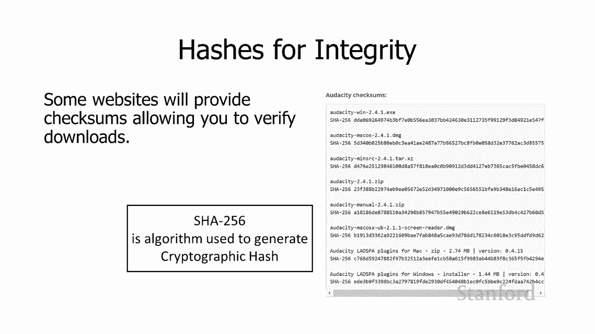

