# 【双语字幕+资料下载】斯坦福CS105 ｜ 计算机科学导论(2021最新·完整版) - P57：L21.1- 计算机安全（攻击）：恶意软件 - ShowMeAI - BV1eh411W72E

undefined，欢迎探索计算，欢迎探索计算，今天的视频是计算机安全，今天的视频是计算机安全，恶意软件，恶意软件，所以我们将继续，所以我们将继续，讨论计算机安全，讨论计算机安全，今天的视频将重点关注。

今天的视频将重点关注，您可能受到攻击的方式，您可能受到攻击的方式，以及可以，以及可以。

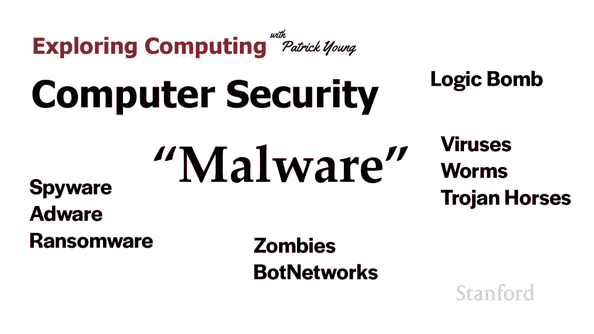

对您采取的措施，下一场讲座将重点关注，对您采取的措施，下一场讲座将重点关注，关于您可以保护自己的方法，关于您可以保护自己的方法，所以我想首先讨论，所以我想首先讨论，undefined。

undefined，undefined，undefined，undefined，undefined，undefined，undefined，恶意软件 勒索软件 广告软件，恶意软件 勒索软件 广告软件。

如何将您的计算机变成，如何将您的计算机变成，僵尸计算机并放入僵尸网络，僵尸计算机并放入僵尸网络。

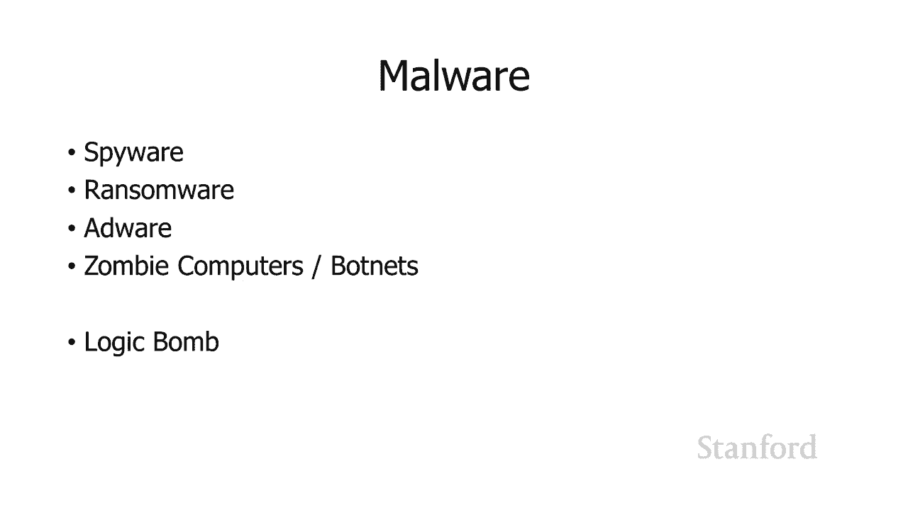

然后我还将讨论逻辑，undefined，undefined，undefined，undefined，undefined，炸弹 你，炸弹 你，所以我们，所以我们，在上一堂课中的达赖喇嘛例子中看到了这一点。

在上一堂课中的达赖喇嘛例子中看到了这一点，呃办公室里的电脑，呃办公室里的电脑，被一种叫做鬼鼠的东西感染了，被一种叫做鬼鼠的东西感染了，r 远程访问工具，r 远程访问工具，并连接到鬼网，并连接到鬼网。

我认为间谍软件，我认为间谍软件，undefined，undefined，在现代计算机和移动设备上特别成问题，在现代计算机和移动设备上特别成问题，因为，因为，我们的计算机，我们的计算机，或移动，或移动。

设备的特定功能一直很成问题，但我，设备的特定功能一直很成问题，但我，认为，认为，现在比以往任何时候都更真的是一个问题，现在比以往任何时候都更真的是一个问题，好的，所以间谍软件可以很好地使用什么样的东西。

好的，所以间谍软件可以很好地使用什么样的东西，undefined，undefined，第一件事是它，第一件事是它，可以用于键盘记录，可以用于键盘记录，所以这意味着它会，所以这意味着它会。

跟踪你所有的击键，所以如果你，跟踪你所有的击键，所以如果你，去你的银行，例如它会，去你的银行，例如它会，undefined，undefined，保留 在您输入时跟踪您的用户名。

保留 在您输入时跟踪您的用户名，然后它会在，然后它会在，您输入时跟踪您的密码，undefined，undefined，这些信息将，这些信息将，通过网络，通过网络，发送给攻击者，发送给攻击者，嗯。

间谍软件也可以复制文件，嗯，间谍软件也可以复制文件，例如 你在你的电脑上有，例如 你在你的电脑上有，关于财务信息的信息，关于财务信息的信息，你可以继续，你可以继续。

拿这些文件并将它们发送到远程的某个地方，拿这些文件并将它们发送到远程的某个地方，undefined，undefined，嗯现在这是它可以，嗯现在这是它可以，在现代 com 上做的事情之一 推杆或现代。

在现代 com 上做的事情之一 推杆或现代，移动设备，他们过去，移动设备，他们过去，无法做到的是，我们都有麦克风，无法做到的是，我们都有麦克风，和摄像头，所以，和摄像头，所以，它可以用来打开麦克风。

它可以用来打开麦克风，听你，听你，在房间里说的话，它可以打开，在房间里说的话，它可以打开，摄像头，摄像头，也是因为现代移动设备会，也是因为现代移动设备会，跟踪您的活动，跟踪您的活动。

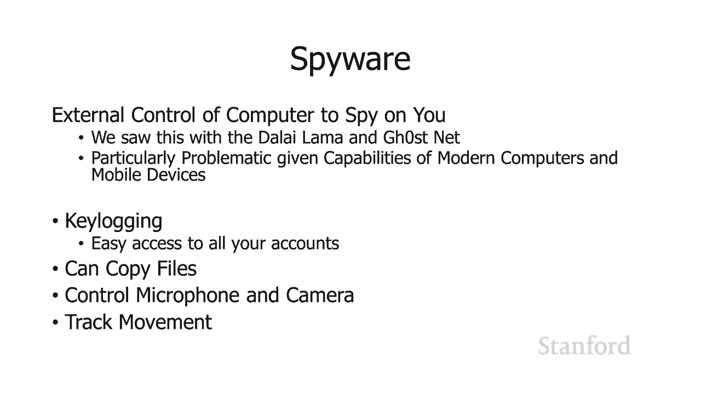

呃间谍软件可用于跟踪您，呃间谍软件可用于跟踪您，当勒索软件进入，当勒索软件进入，您的计算机时，它的作用是，您的计算机时，它的作用是，加密您的整个，加密您的整个，固态驱动器或整个硬盘。

固态驱动器或整个硬盘，驱动器并要求付款 解密，驱动器并要求付款 解密，你的，你的，呃信息所以基本上会锁定你的，呃信息所以基本上会锁定你的，信息，信息，它通常需要用，它通常需要用，比特币支付才能解锁。

比特币支付才能解锁，你的设备嗯 所以，你的设备嗯 所以，勒索软件的一个例子是wannacry 所以这是，勒索软件的一个例子是wannacry 所以这是，一个勒索软件，呃是在 2017 年发布的。

一个勒索软件，呃是在 2017 年发布的，它感染了超过 200 000，它感染了超过 200 000，台计算机 在 150，台计算机 在 150，多个国家，它要求比特币，多个国家，它要求比特币，支付从。

支付从，300 到 600 不等，这取决于你，300 到 600 不等，这取决于你，多久付清，多久付清，我取消了，我取消了，英国国家卫生服务的，英国国家卫生服务的，大部分，这造成了如此大的混乱 向。

大部分，这造成了如此大的混乱 向，英国国家卫生局，英国国家卫生局，表示，英国卫生局被迫，表示，英国卫生局被迫，拒绝患者，除非在，拒绝患者，除非在，危急情况下，危急情况下，该特定软件使用。

undefined，undefined，了 microsoft windows 中已知的漏洞，了 microsoft windows 中已知的漏洞，因此更新了他们的，因此更新了他们的。

microsoft windows 副本的人受到保护，microsoft windows 副本的人受到保护，那些没有，那些没有，受到这种攻击的人，受到这种攻击的人，据信是，据信是。

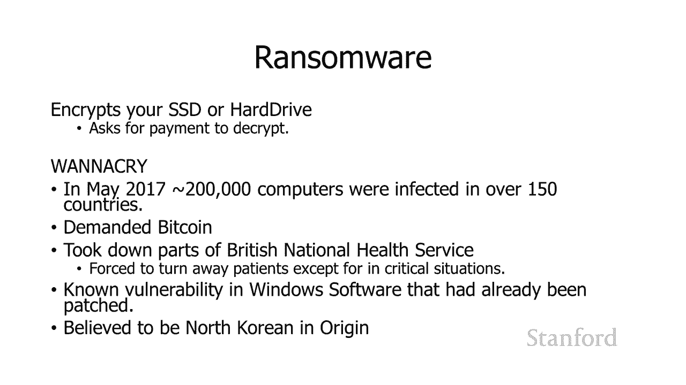

朝鲜人，尽管不确定，undefined，undefined，嗯实际上这个词有多种用法，undefined，undefined，有些人用它来指代，有些人用它来指代，任何显示，任何显示，广告的程序 例如。

广告的程序 例如，我的移动设备上有镜像 webster 应用程序，我的移动设备上有镜像 webster 应用程序，当您运行它时，您可以，当您运行它时，您可以，免费查找单词，它会免费为您朗读单词。

免费查找单词，它会免费为您朗读单词，我认为这是一个光荣的功能，我认为这是一个光荣的功能，特别是对于，特别是对于，拥有，拥有，会说话的词典的学习外语的人 Word to 是惊人的。

会说话的词典的学习外语的人 Word to 是惊人的，我会说我确实发现它在，我会说我确实发现它在，英语中也很有用，英语中也很有用，您可以免费使用 merriam-webster 应用程序。

undefined，undefined，bec 因为它，bec 因为它，类似地显示广告我，类似地显示广告我，在我的移动设备上有天气频道应用程序，undefined，undefined。

而且你不必为此付费它，而且你不必为此付费它，在应用程序底部显示小广告，在应用程序底部显示小广告，所以有些人确实认为这些，所以有些人确实认为这些，广告软件，广告软件，我不认为但你 当然可以看到。

我不认为但你 当然可以看到，该术语的来源，该术语的来源，我将使用术语 adword 来，我将使用术语 adword 来，指代，指代，恶意安装在您的，恶意安装在您的，计算机上，计算机上，或秘密安装在您的。

或秘密安装在您的，计算机上的软件，这些软件会显示您不，计算机上的软件，这些软件会显示您不，知道广告来自何处的广告，知道广告来自何处的广告，undefined，undefined，等等 您正在运行计算机。

等等 您正在运行计算机，您会看到随机广告 有时这，您会看到随机广告 有时这，将是您浏览网页时出现在网络浏览器上的随机广告，将是您浏览网页时出现在网络浏览器上的随机广告，它们，它们，与，与，您正在访问。

您正在访问，的网站无关 访问不是，的网站无关 访问不是，从 Adwords 显示的广告中获得收益，undefined，undefined，有时这些只能显示广告，有时这些只能显示广告，无论您是否在网上。

无论您是否在网上，嗯，无论您是否在网上，嗯，无论您是否在网上，所以，所以，嗯，您知道这显然是一个，嗯，您知道这显然是一个，替代品，undefined，undefined。

与我之前谈到的字典和天气应用程序等广告支持的应用程序不同的级别，undefined，undefined，很明显，很明显，当您运行该特定应用程序时，您只会看到广告，当您运行该特定应用程序时。

您只会看到广告，并且这些广告用于，并且这些广告用于，支付免费服务的费用 您，支付免费服务的费用 您，收到的情况并非广告软件 广告软件，收到的情况并非广告软件 广告软件，的，的，安装通常未经您的。

安装通常未经您的，许可 有时它已安装，许可 有时它已安装，我们稍后会讨论这个问题，我们稍后会讨论这个问题，但它是在您的许可下安装的，但它是在您的许可下安装的，因为有一个，因为有一个，很长的协议条款。

您只需，很长的协议条款，您只需，单击即可，单击即可，说是啊是啊好吧这，说是啊是啊好吧这，一切看起来都很好，一切看起来都很好，事实证明其中一个条款是，事实证明其中一个条款是。

我们将在您的计算机上安装一些令人讨厌的东西，undefined，undefined，undefined，undefined，嗯那是广告软件嗯，嗯那是广告软件嗯，我通常使用该术语，我通常使用该术语。

仅代表恶意版本，仅代表恶意版本，尽管有些人，尽管有些人，确实将广告软件称为，确实将广告软件称为。

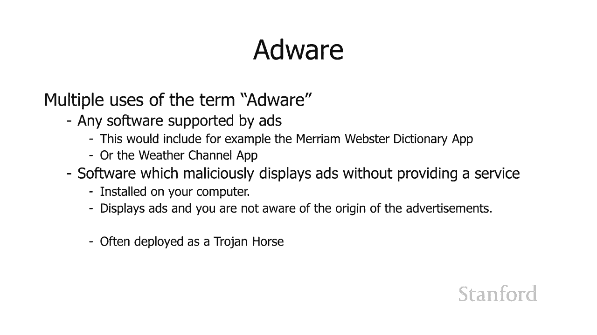

显示，显示，广告或使用广告为自己付费的任何，广告或使用广告为自己付费的任何，undefined，undefined，东西 最近出现的与广告相关的问题，undefined，undefined，是。

如您所知，当，是，如您所知，当，您的计算机访问不同的网站时，您的计算机访问不同的网站时，计算机可以运行，计算机可以运行，与该网站相关的软件，与该网站相关的软件，特别是如果它们正在运行。

特别是如果它们正在运行，客户端 javascript，客户端 javascript，结果表明某些网站现在正在，结果表明某些网站现在正在，挖掘加密货币 当，挖掘加密货币 当，您访问他们的网站时，这是。

您访问他们的网站时，这是，呃，呃，目前尚不清楚这是否符合道德或，目前尚不清楚这是否符合道德或，合法性，undefined，undefined，undefined，undefined，当，当。

他们访问您的网站并，他们访问您的网站并，在您离开后立即停止时，我想人们可以，undefined，undefined，合理地证明这，合理地证明这，不是非法或不道德的，但是有，不是非法或不道德的，但是有。

报道称，报道称，呃网站会做这种事情，呃网站会做这种事情，呃有一些，呃有一些，它由广告网络提供服务的问题，或者，它由广告网络提供服务的问题，或者，它会锁定您的计算机，它会锁定您的计算机。

因此无论如何潜在的问题，因此无论如何潜在的问题，是需要注意的，是需要注意的。

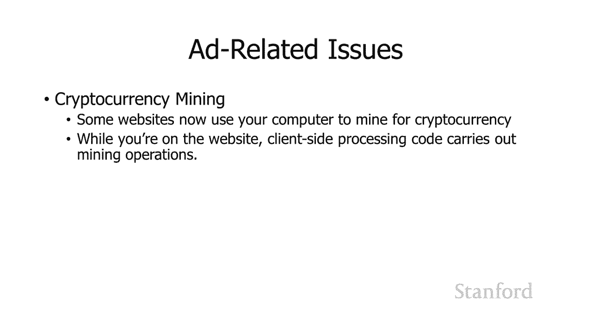

undefined，undefined，好吧 z  ombie 计算机 这是另一，好吧 z  ombie 计算机 这是另一，件可以，undefined，undefined，在您的计算机。

undefined，undefined，上安装恶意软件时，undefined，undefined，完成的事情，undefined，undefined，或 bots，或 bots。

和僵尸计算机或 bots，和僵尸计算机或 bots，通常被分组，因为，通常被分组，因为，它们，它们，在一组计算机中最有用，而不是单个，在一组计算机中最有用，而不是单个，僵尸计算机，僵尸计算机。

而这组计算机组合，而这组计算机组合，在一起就是我们所说的 bot，在一起就是我们所说的 bot，网络，网络，我确实想提到那里，我确实想提到那里，bot 这个词有几种不同的用法。

bot 这个词有几种不同的用法，大多数用法都不是恶意的，大多数用法都不是恶意的，所以，所以，如果你听到这个词，但不要，如果你听到这个词，但不要，立即认为这一定是，立即认为这一定是，件坏事，所以，件坏事。

所以，bot 一词的一些用法是，bot 一词的一些用法是，独立的程序，它们，独立的程序，它们，在互联网上爬行 例如，在互联网上爬行 例如，这将是谷歌机器人，这将是谷歌机器人，它是谷歌用来，它是谷歌用来。

请求不同网页的程序，它，请求不同网页的程序，它，就是它使用的 o 形成，就是它使用的 o 形成，谷歌给你的索引信息，谷歌给你的索引信息，术语 bot，术语 bot，也可以用来指代任何。

也可以用来指代任何，独立代表某人行事的程序，undefined，undefined，它有点来自术语机器人，它有点来自术语机器人，无论如何我只是想再次提一下，无论如何我只是想再次提一下。

undefined，undefined，即使买了 这种特殊，即使买了 这种特殊，情况，情况，在特别是与机器人网络一起使用时，在特别是与机器人网络一起使用时，是一件坏事，是一件坏事，嗯。

如果您确实听到有人提到，嗯，如果您确实听到有人提到，计算机并使用术语机器人，这，undefined，undefined。

本身不一定是一个负面术语，本身不一定是一个负面术语，那么什么是机器人网络用于机器人的，那么什么是机器人网络用于机器人的，一个常见用途 网络是，一个常见用途 网络是，发送垃圾邮件，所以，发送垃圾邮件。

所以，我们都会收到不需要的电子邮件，我们都会收到不需要的电子邮件，有时它们是诈骗电子邮件，所以一个，有时它们是诈骗电子邮件，所以一个，问题可能是，问题可能是，为什么允许这样做为什么我不能。

为什么允许这样做为什么我不能，阻止垃圾邮件，阻止垃圾邮件，等等垃圾邮件的问题之一，等等垃圾邮件的问题之一，是如果所有垃圾邮件，是如果所有垃圾邮件，来自同一台计算机是同一，来自同一台计算机是同一。

对几台计算机，对几台计算机，那么我们都可以阻止它们，因此，那么我们都可以阻止它们，因此，使用这些机器人网络的一件事，使用这些机器人网络的一件事，就是从许多，就是从许多。

不同的计算机发送垃圾邮件 来自世界各地，不同的计算机发送垃圾邮件 来自世界各地，undefined，undefined，的让他们更难阻止，的让他们更难阻止，其他用途的人是分布式拒绝。

其他用途的人是分布式拒绝，服务攻击，所以，服务攻击，所以，拒绝服务攻击是当你，拒绝服务攻击是当你，试图，试图，undefined，undefined，通过对计算机发出许多请求来故意压倒计算机时，所以。

通过对计算机发出许多请求来故意压倒计算机时，所以，我总是使用这个例子，假设，我总是使用这个例子，假设，斯坦福 学生们想，undefined，undefined。

在大型比赛期间关闭 cal 计算机 不要这样做，因为，在大型比赛期间关闭 cal 计算机 不要这样做，因为，这，这，违反了 stanford，违反了 stanford。

对您使用 stamford 计算机的服务条款，对您使用 stamford 计算机的服务条款，和 stanford 网络 所以不要这样做，和 stanford 网络 所以不要这样做。

但假设我们都决定 我们，但假设我们都决定 我们，打算，undefined，undefined，undefined，在大型比赛周期间突然关闭 cal 计算机 呃我们能做的。

在大型比赛周期间突然关闭 cal 计算机 呃我们能做的，是斯坦福校区的每个人都，是斯坦福校区的每个人都，可以反复访问 cal 计算机，可以反复访问 cal 计算机，并且在某些时候 cal 计算机的。

并且在某些时候 cal 计算机的，负载将被超过 合法，负载将被超过 合法，用户试图 访问 cal 网络，用户试图 访问 cal 网络，计算机将无法访问它，计算机将无法访问它，所以这里发生的事情很好。

所以这里发生的事情很好，cal 看起来，cal 看起来，呃他们就像我们似乎收到了，呃他们就像我们似乎收到了，大量的请求 我们的电脑，大量的请求 我们的电脑，变得不堪重负，变得不堪重负，发生了什么事哦。

看，所有的请求，发生了什么事哦，看，所有的请求，都来自斯坦福大学，都来自斯坦福大学，你们现在都知道，因为，你们现在都知道，因为，你一直在上我的课 呃所有的，你一直在上我的课 呃所有的。

斯坦福电脑都有相同，斯坦福电脑都有相同，或非常相似的 IP 号码，所以前，或非常相似的 IP 号码，所以前，几位数字 在 ip 号中是，几位数字 在 ip 号中是，相同的，相同的。

所以加州理工学院的支持人员说很好，所以加州理工学院的支持人员说很好，我们只是阻止来自斯坦福 ip 号的任何对 cal 的请求，undefined，undefined，所以这是，所以这是。

标准的拒绝服务攻击，标准的拒绝服务攻击，显然它们很烦人，而且需要做很多，显然它们很烦人，而且需要做很多，工作，工作，技术人员来处理，但他们可以被，技术人员来处理，但他们可以被，阻止，因为他们来自，阻止。

因为他们来自，特定计算机的特定范围的，特定计算机的特定范围的，计算机，计算机，所以分布式拒绝服务，所以分布式拒绝服务，攻击的作用是它说，攻击的作用是它说，好吧我们不希望我们的，好吧我们不希望我们的。

请求被拒绝，因为他们来了，请求被拒绝，因为他们来了，从一个特定的 ip 范围，从一个特定的 ip 范围，我们要做的是让这个机器人，我们要做的是让这个机器人，网络由世界各地的僵尸计算机组成。

网络由世界各地的僵尸计算机组成，我们将指示，我们将指示，我们机器人网络中的所有机器人，我们机器人网络中的所有机器人，攻击 cal 计算机，攻击 cal 计算机，顺便说一句，现在我们进入了，顺便说一句。

现在我们进入了，非常非法的领域，所以，非常非法的领域，所以，不要这样做，不要这样做，因此在那时 cal 无法真正做，因此在那时 cal 无法真正做，任何事情，因为，任何事情，因为。

他们看到许多不同的 IP 号码，他们看到许多不同的 IP 号码，并且没有特定范围的，并且没有特定范围的，计算机 他们可以继续禁止，计算机 他们可以继续禁止，所以嗯，所以嗯，好吧，这是分布式，好吧。

这是分布式，拒绝服务攻击，为了进行，拒绝服务攻击，为了进行，分布式拒绝服务攻击，您，分布式拒绝服务攻击，您，确实需要类似机器人网络的东西，确实需要类似机器人网络的东西，其中包含许多，其中包含许多。

地理上分散的计算机，可以另一种，地理上分散的计算机，可以另一种，使用机器人 网络就是点击欺诈，所以点击欺诈，使用机器人 网络就是点击欺诈，所以点击欺诈，有两种变体，有两种变体，嗯。

所以点击欺诈的一种变体，嗯，所以点击欺诈的一种变体，你有一个展示广告的网站，你有一个展示广告的网站，你想增加，你想增加，undefined，undefined，呃广告收入，所以你所做的就是，呃广告收入。

所以你所做的就是，你有，你有，呃基本上是假的广告点击，呃基本上是假的广告点击，哪里，哪里，嗯，你知道通常你会为，嗯，你知道通常你会为，你，你，在网站上展示的广告获得报酬，特别是根据，undefined。

undefined，实际点击该广告，实际点击该广告，的人数和 d 看看那个，的人数和 d 看看那个，广告是，广告是，广告的网站，所以你可以做的是，广告的网站，所以你可以做的是，你可以，你可以。

使用机器人网络让，使用机器人网络让，来自世界各地的不同计算机，来自世界各地的不同计算机，访问你的网站并点击，访问你的网站并点击，你网站上的广告，这将，你网站上的广告，这将，增加你的广告，增加你的广告。

收入 同样也是高度非法的，收入 同样也是高度非法的，或者你可以做的是你可以，或者你可以做的是你可以，说嘿，说嘿，我的竞争对手正在进行这个大型广告活动，undefined，undefined。

我们要做的是我们，我们要做的是我们，将故意访问显示，将故意访问显示，undefined，undefined，我们竞争对手广告的网站，我们竞争对手广告的网站，我们的机器人将要 点击这些广告。

我们的机器人将要 点击这些广告，没有人参与，所以，没有人参与，所以，你知道实际上没有人会看到，你知道实际上没有人会看到，这些广告或点击，这些广告或点击，并查看他们的实际，并查看他们的实际。

网站或他们正在销售的产品，网站或他们正在销售的产品，但它看起来像他们，但它看起来像他们，所以，所以，基本上是我们竞争对手的广告 钱将，基本上是我们竞争对手的广告 钱将，全部，全部。

用于支付广告网络的广告费用，这些广告，用于支付广告网络的广告费用，这些广告。

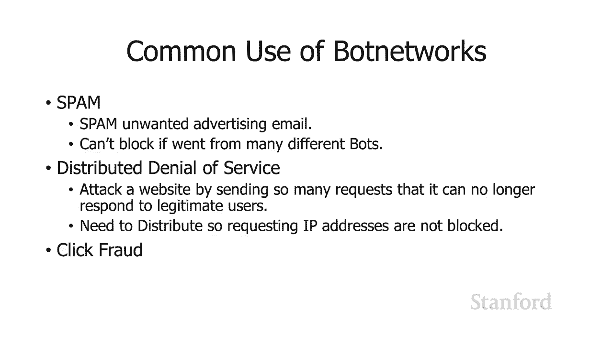

只有我们的机器人实际，只有我们的机器人实际，点击，而没有真实的人，点击，而没有真实的人，实际看到，实际看到，所以这是点击欺诈 嗯，只是提供，所以这是点击欺诈 嗯，只是提供，一个实际机器人网络的例子。

一个实际机器人网络的例子，呃，墨西哥卷实验室，呃，墨西哥卷实验室，蠕虫斜线病毒，呃，我们，蠕虫斜线病毒，呃，我们，暂时谈谈蠕虫和病毒，暂时谈谈蠕虫和病毒，我感染了超过 3000 万台计算机。

我感染了超过 3000 万台计算机，它，它，以每月大约 300 万台计算机的速度感染了，以每月大约 300 万台计算机的速度感染了，undefined，undefined。

什么 这东西做得很好 它窃取了，什么 这东西做得很好 它窃取了，财务信息 我记得我们之前，财务信息 我记得我们之前，谈到过间谍软件复制文件，谈到过间谍软件复制文件，undefined。

undefined，它发送了数十亿封电子邮件，其中包括，它发送了数十亿封电子邮件，其中包括，被自身感染的电子邮件，被自身感染的电子邮件，试图进一步，试图进一步，扩展 呃这里的墨西哥卷饼网络。

扩展 呃这里的墨西哥卷饼网络，它包括一个键盘记录器来，它包括一个键盘记录器来，跟踪任何事情 人们打字以，跟踪任何事情 人们打字以，获取他们的密码和其他信息，获取他们的密码和其他信息，但它也占用了所有。

但它也占用了所有，受影响的计算机并创建了一个机器人，受影响的计算机并创建了一个机器人，网络，网络，第三方可以以每月 139 000 的价格租用该网络，第三方可以以每月 139 000 的价格租用该网络。

undefined，undefined，嗯，这里有文章的链接，嗯，这里有文章的链接，谢谢 maddie 够，谢谢 maddie 够，了，了。

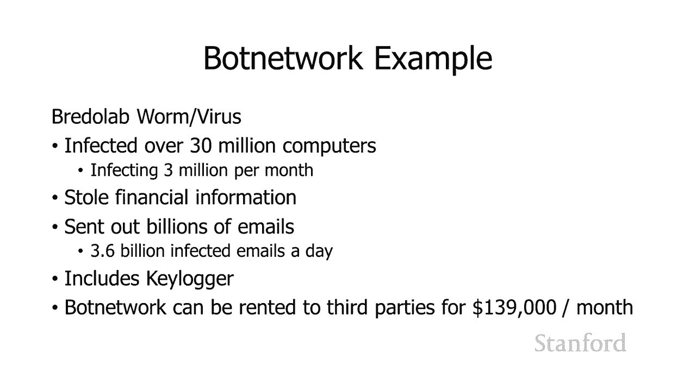

undefined，undefined，课堂笔记，undefined，undefined，中有一个讨论，中有一个讨论，这个网络的文章的链接 一个有点不同，这个网络的文章的链接 一个有点不同，因为嗯。

undefined，undefined，undefined，这不是安装在您计算机上的恶意软件，它，这不是安装在您计算机上的恶意软件，它，实际上是，实际上是，一个程序，其中包含，一个程序，其中包含。

程序中的恶意内容，程序中的恶意内容，通常由原始程序员添加到那里，通常由原始程序员添加到那里，undefined，undefined，因此这被称为逻辑炸弹，因此这被称为逻辑炸弹。

本质上是一个 逻辑炸弹是软件中的某种东西，本质上是一个 逻辑炸弹是软件中的某种东西，它，它，会在特定情况下触发，会在特定情况下触发，所以你可能，所以你可能，在电影中看到过逻辑炸弹的例子。

在电影中看到过逻辑炸弹的例子，所以你知道电影中有很多，所以你知道电影中有很多，事情似乎是完全，事情似乎是完全，错误的，错误的，但逻辑炸弹是 实际上是可行的，因此，但逻辑炸弹是 实际上是可行的，因此。

当例如有人读取特定文件时会发生逻辑炸弹，undefined，undefined，您可以根据嘿，您可以根据嘿，这个文件变红，这个文件变红，或呃当有人试图修改，或呃当有人试图修改。

文件时触发一些操作所以这个想法，文件时触发一些操作所以这个想法，是添加到程序中，是添加到程序中，或，或，呃不属于其预期用途的操作系统，呃不属于其预期用途的操作系统，程序员已将其，程序员已将其。

放入该程序中，如果发生特定，放入该程序中，如果发生特定，操作，操作，它将关闭并执行 有些，它将关闭并执行 有些，东西可能只是，东西可能只是，发送电子邮件，因为有时只是，发送电子邮件，因为有时只是。

知道有人正在阅读文件，知道有人正在阅读文件，可能是有用的信息，可能是有用的信息，或者它可能是更，或者它可能是更，恶意的东西我在维基百科上看到了一个例子，恶意的东西我在维基百科上看到了一个例子，我更。

我更，喜欢被解雇的程序员可以设置，喜欢被解雇的程序员可以设置，一个逻辑炸弹，一个逻辑炸弹，如果他们从工资单中删除或，如果他们从工资单中删除或，以某种方式将他们标记为被解雇，它。

以某种方式将他们标记为被解雇，它，可能会，可能会，做一些恶意的事情，例如，做一些恶意的事情，例如，删除文件或类似的东西，所以，删除文件或类似的东西，所以，你知道我认为这，你知道我认为这。

是逻辑炸弹的一个很好的例子，是逻辑炸弹的一个很好的例子，但你知道我认为 这是，undefined，undefined，电影中发生的事情的少数几个例子之一，你就像，电影中发生的事情的少数几个例子之一。

你就像。

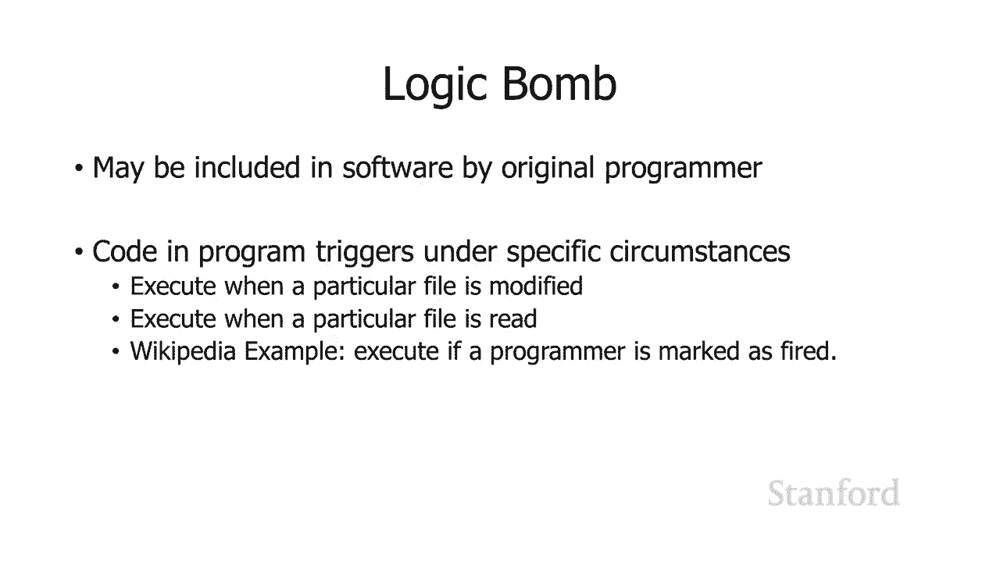

是的，好吧，是的，好吧，这实际上与一种，这实际上与一种，实际技术有关，呃，可以，实际技术有关，呃，可以。

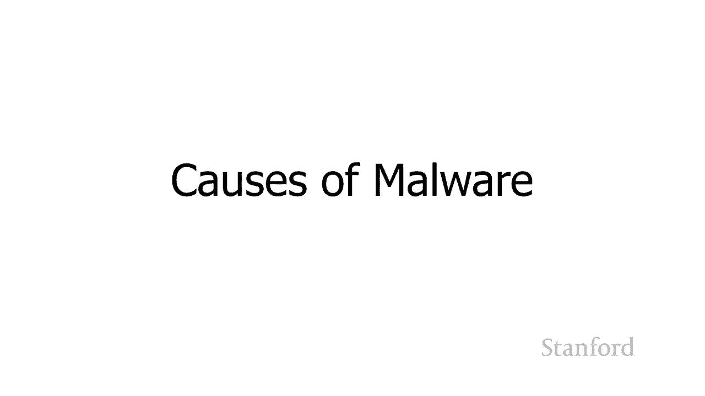

undefined，undefined，所以呃这个恶意软件如何进入，所以呃这个恶意软件如何进入，你的计算机，你的计算机，有许多不同的，有许多不同的，恶意软件的原因 所以我们将讨论。

恶意软件的原因 所以我们将讨论，其中的一大堆 我们谈论的是，其中的一大堆 我们谈论的是，病毒，病毒，蠕虫和特洛伊木马 我，蠕虫和特洛伊木马 我，之前也提到过零日漏洞利用，之前也提到过零日漏洞利用。

我们会仔细研究一下，我们会仔细研究一下，我应该提到，我应该提到，这些之间存在重叠，所以，这些之间存在重叠，所以，你知道我们实际上在一分钟前看到了这个，你知道我们实际上在一分钟前看到了这个，呃。

墨西哥卷饼实验室好吧，呃，墨西哥卷饼实验室好吧，实际上有病毒或蠕虫，所以，实际上有病毒或蠕虫，所以，嗯，有一些软件 可以，嗯，有一些软件 可以，涵盖，涵盖，其中的一个以上 事实上，有。

其中的一个以上 事实上，有，一些软件可以涵盖所有这，一些软件可以涵盖所有这，三种病毒蠕虫和特洛伊木马，三种病毒蠕虫和特洛伊木马，我想这四种病毒都是，我想这四种病毒都是。

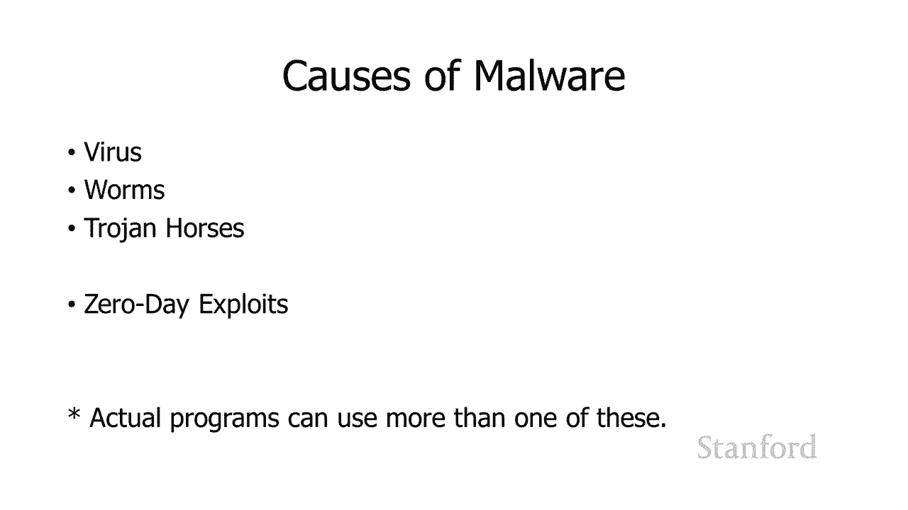

因为它可能基于，因为它可能基于，零日漏洞利用，零日漏洞利用，所以什么是病毒？ 是一个，undefined，undefined，将自身附加到其他程序的计算机程序，将自身附加到其他程序的计算机程序。

所以这里的想法是，所以这里的想法是，你的计算机上有一堆程序，你的计算机上有一堆程序，所以病毒，所以病毒，会做的是当它运行时它会在你的计算机上，会做的是当它运行时它会在你的计算机上，寻找其他可执行程序。

寻找其他可执行程序，计算机，计算机，它将添加到，它将添加到，该程序副本中的指令中，因此，该程序副本中的指令中，因此，下次您运行该其他程序时，下次您运行该其他程序时，病毒代码将运行，病毒会以。

病毒代码将运行，病毒会以，不同的方式确定，不同的方式确定，将自己附加到哪些程序，将自己附加到哪些程序，它旨在附加，它旨在附加，特定程序，有时它会寻找，特定程序，有时它会寻找，正在运行的程序并尝试。

正在运行的程序并尝试，将自身附加到这些程序上，但这里的基本思想，将自身附加到这些程序上，但这里的基本思想，是，是，病毒通过将自身附加到，病毒通过将自身附加到，不同的程序来自我复制，不同的程序来自我复制。

任何可以，任何可以，执行的东西都可能被，执行的东西都可能被，感染，这经常发生 包括，感染，这经常发生 包括，您通常不认为是，您通常不认为是，可执行，可执行，文件的文件，因此 zip 文件，例如，有。

文件的文件，因此 zip 文件，例如，有，一些 zip 文件版本，其中包含可执行，一些 zip 文件版本，其中包含可执行，代码，代码，当有人试图，当有人试图，打开 zip 文件时，这些代码将运行，这。

打开 zip 文件时，这些代码将运行，这，实际上就是为什么 stanford 的计算机，实际上就是为什么 stanford 的计算机，uh stanford 的电子邮件计算机没有 不再。

uh stanford 的电子邮件计算机没有 不再，允许您发送 zip 文件，您可能，允许您发送 zip 文件，您可能，会收到该警告，他们就像，会收到该警告，他们就像，不希望人们发送或。

不希望人们发送或，接收 zip 文件，因为他们，接收 zip 文件，因为他们，可能被感染，可能被感染，microsoft office 文档可以包含，microsoft office 文档可以包含。

脚本信息，脚本信息，等因为脚本是 本质上是一个，等因为脚本是 本质上是一个，程序，程序，它们可以包含病毒，因此病毒可以，它们可以包含病毒，因此病毒可以，将自己添加到，将自己添加到，微软文档中。

微软文档中，实际上你 现在可能会注意到，嗯，实际上你 现在可能会注意到，嗯，这是最近添加的，这是最近添加的，我想可能是在过去五年，我想可能是在过去五年，中。

当您从某人那里获得一份 Word 文档或 Excel 文档的副本时，undefined，undefined，undefined，undefined，它会开始，而您将，它会开始，而您将，无法 编辑它。

无法 编辑它，就像你确定，就像你确定，要进入编辑模式一样，要进入编辑模式一样，所以这又是为了防止，所以这又是为了防止，这种情况，这种情况，它基本上正在运行它允许你，它基本上正在运行它允许你。

以一种更保护的模式查看该文档的内容，undefined，undefined，万一，万一，该文档中存在恶意内容，该文档中存在恶意内容，然后只有当你喜欢时，然后只有当你喜欢时，我确定我知道是谁发送给我的。

我确定我知道是谁发送给我的，嗯，这是提取的，我很，嗯，这是提取的，我很，确定他们，确定他们，希望练习安全计算，所以，希望练习安全计算，所以，是的，我们走吧 提前打开它，这样我，是的。

我们走吧 提前打开它，这样我，就可以继续编辑它，就可以继续编辑它，这就是那里发生的事情，它，这就是那里发生的事情，它。

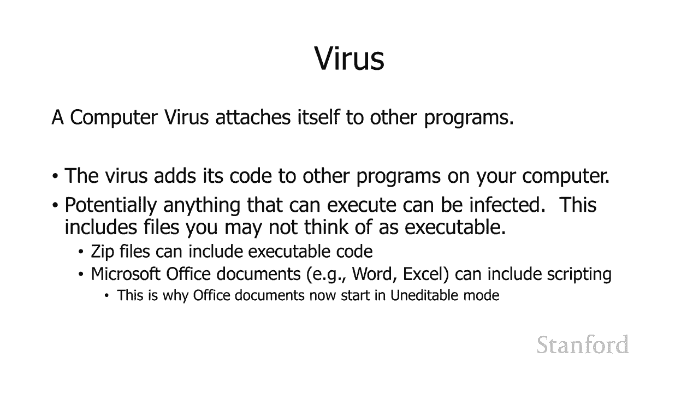

试图保护您免受，试图保护您免受，附加到文档的病毒的侵害，附加到文档的病毒的侵害，好吧蠕虫是一种，undefined，undefined，在网络上传播自身副本的程序，所以我们看到了。

在网络上传播自身副本的程序，所以我们看到了，前，前，上一堂课，当我谈到我爱，上一堂课，当我谈到我爱，你时，这是，你时，这是，undefined，undefined，它实际上是几个东西的组合。

它实际上是几个东西的组合，它是你收到的一封电子邮件，上面，它是你收到的一封电子邮件，上面，undefined，undefined，写着我爱你，然后上面有，写着我爱你，然后上面有，一个附件，一个附件。

如果你打开 在附件中，它，如果你打开 在附件中，它，实际上是，实际上是，一个可视化的基本脚本，它运行，一个可视化的基本脚本，它运行，在 Microsoft Outlook 上，这是他们的。

在 Microsoft Outlook 上，这是他们的，电子邮件程序，电子邮件程序，它查看 Outlook 电子邮件簿中的所有地址，它查看 Outlook 电子邮件簿中的所有地址，并将其副本发送。

并将其副本发送，给，给，undefined，undefined，从某种意义上说，这是一种蠕虫，从某种意义上说，这是一种蠕虫，它正在制作自己的副本并，它正在制作自己的副本并。

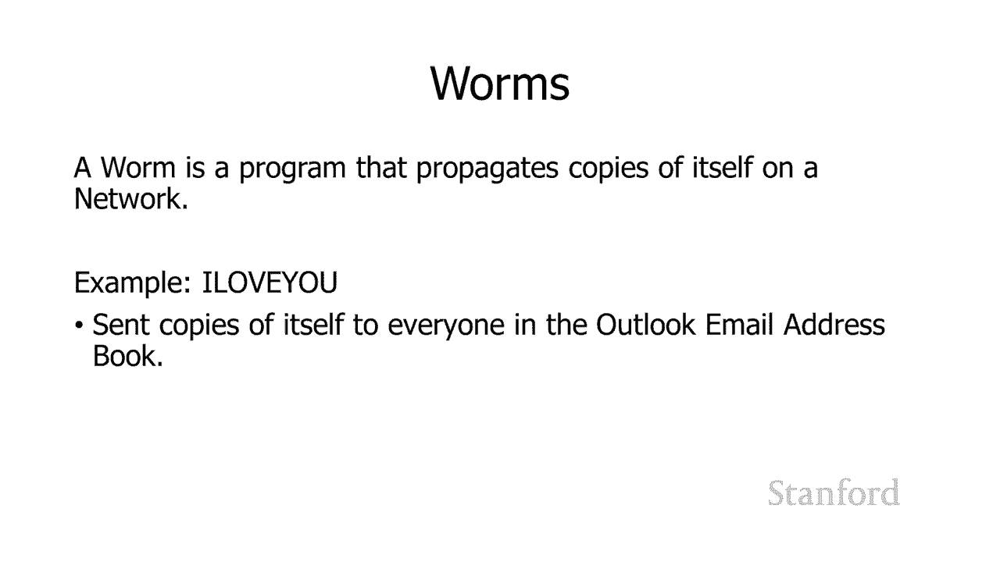

undefined，undefined，好吧，特洛伊木马是一种程序，它，好吧，特洛伊木马是一种程序，它，要么做它声称要做的事情以外的事情，要么做它声称要做的事情以外的事情，要么，要么，可能做它声称。

可能做它声称，要做的事情，但还，要做的事情，但还，包括一个恶意负载，包括一个恶意负载，undefined，undefined，所以只是举几个例子，我们，所以只是举几个例子，我们，之前谈到了达赖喇嘛如何。

之前谈到了达赖喇嘛如何，undefined，undefined，undefined，undefined，通过打开一个名为，通过打开一个名为，“自由行动翻译”的文件，受到幽灵间谍软件程序的。

“自由行动翻译”的文件，受到幽灵间谍软件程序的，攻击 exile。doc 中的 ibetans 所以你知道它，攻击 exile。doc 中的 ibetans 所以你知道它，看起来是合法的。

看起来是合法的，但实际上它并不是那个，但实际上它并不是那个，文件，文件，或者可能是那个文件，但，或者可能是那个文件，但，除了该文件外，文件还附有恶意，除了该文件外，文件还附有恶意，播放加载，播放加载。

嗯，我当然爱你，嗯，你 知道，嗯，我当然爱你，嗯，你 知道，我猜人们就像嘿有人，我猜人们就像嘿有人，爱我他们给我发了附件我，爱我他们给我发了附件我，应该打开它看看它是什么，应该打开它看看它是什么。

嗯是的他们不爱你，嗯是的他们不爱你，对不起然后呃还有一堆，undefined，undefined，有趣的报价有趣的应用程序像呃，有趣的报价有趣的应用程序像呃，天气程序 嗯，你安装，天气程序 嗯，你安装。

了天气程序，了天气程序，你知道我之前提到过，如果，你知道我之前提到过，如果，你通读服务条款，你通读服务条款，就像，就像，哦，我要，哦，我要，在你的电脑上安装这个讨厌的东西。

在你的电脑上安装这个讨厌的东西，还有另一个例子，还有另一个例子，基本上是一个卡通，基本上是一个卡通，人物 它会出现在你的，人物 它会出现在你的，桌面上，桌面上，人们喜欢哦，听起来很有趣，人们喜欢哦。

听起来很有趣，我应该继续安装它，我应该继续安装它，它安装了那个程序，但在后台做了，它安装了那个程序，但在后台做了，一些其他恶意的事情，一些其他恶意的事情，所以，所以，t 这些是特洛伊木马的例子。

t 这些是特洛伊木马的例子，它们要么，undefined，undefined，是完全恶意的东西，就像，是完全恶意的东西，就像，我爱你一样，要么它们，我爱你一样，要么它们，可能会做一件事，但它们。

可能会做一件事，但它们，会在后台做一些其他的事情，会在后台做一些其他的事情，比如天气，比如天气，应用程序实际上确实显示了，应用程序实际上确实显示了，天气，但它们也，天气，但它们也，安装，安装。

即使在您停止使用该程序后仍会继续显示广告的广告软件，undefined，undefined，或者在伙伴程序的情况下，您，或者在伙伴程序的情况下，您，知道它们会，知道它们会，显示熊伙伴，但除了。

显示熊伙伴，但除了。

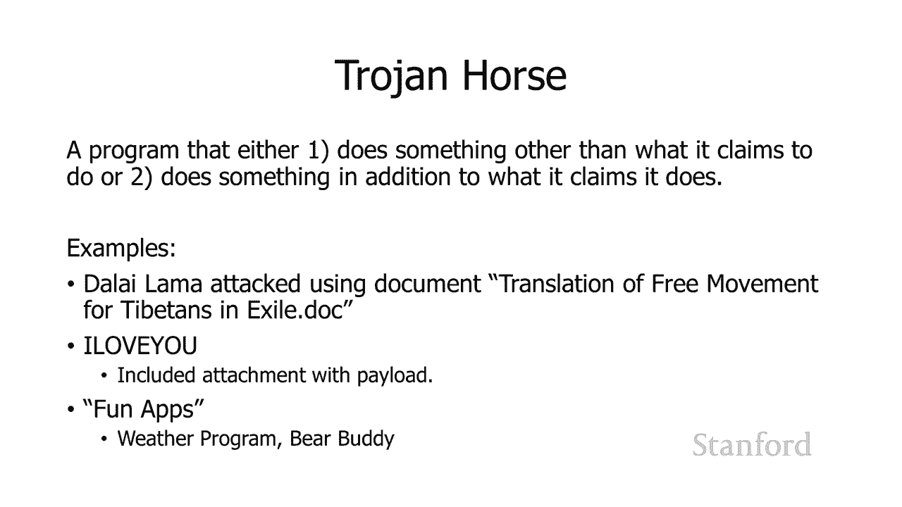

熊伙伴之外，他们，熊伙伴之外，他们，还在您的计算机上安装了一些东西，所以，还在您的计算机上安装了一些东西，所以，这些都是特洛伊木马 好的，这些都是特洛伊木马 好的，在您可能还记得上次讲座之前。

我提到了零日漏洞利用，undefined，undefined，我们讨论的是，我们讨论的是，震网病毒，该，震网病毒，该，程序旨在攻击，程序旨在攻击，伊朗，伊朗，核离心机，核离心机。

我们讨论了如何与该程序相关的四种，我们讨论了如何与该程序相关的四种，不同的零日漏洞利用，不同的零日漏洞利用，所以，所以，基本上 一个，基本上 一个，使用零日漏洞的程序正在使用，undefined。

undefined，呃安全研究人员不知道的弱点，呃安全研究人员不知道的弱点，所以这个想法 这是您的计算机，所以这个想法 这是您的计算机，没有受到零日漏洞保护，没有受到零日漏洞保护，这是没有，这是没有。

人知道的，除了，人知道的，除了，拥有零日漏洞的人，这是，undefined，undefined，您知道的国家安全，您知道的国家安全，机构，机构，（例如国家安全局）的全部内容 嘿。

（例如国家安全局）的全部内容 嘿，我们能找到一个漏洞，然后，我们能找到一个漏洞，然后，问题，问题，是我们是否要告诉微软，是我们是否要告诉微软，这个漏洞我们是否要把它放在，这个漏洞我们是否要把它放在。

我们的后兜里，这样我们就可以用它来，我们的后兜里，这样我们就可以用它来，攻击其他国家，攻击其他国家，这样你就不能直接，这样你就不能直接，防御零日漏洞 漏洞利用，防御零日漏洞 漏洞利用。

是因为你不知道它是什么，是因为你不知道它是什么，呃制作你的，呃制作你的，软件的人不知道它是什么，软件的人不知道它是什么，但是你仍然可以练习安全，但是你仍然可以练习安全，计算我们将讨论呃。

计算我们将讨论呃，你可以在下一课做的事情，你可以在下一课做的事情，undefined，undefined，希望让，希望让，拥有零日漏洞利用工具的人更难将其，拥有零日漏洞利用工具的人更难将其。

实际安装到您的计算机上，实际安装到您的计算机上，并运行，并运行，并利用，并利用，您软件，您软件，中的弱点，另一方面，与，中的弱点，另一方面，与，软件相反的软件 使用零数据，软件相反的软件 使用零数据。

漏洞会，漏洞会，发生许多不同的攻击，发生许多不同的攻击，这些攻击只是，这些攻击只是，预先存在的攻击的变体，所以，预先存在的攻击的变体，所以，你知道可以用来，你知道可以用来，攻击计算机的软件只是。

攻击计算机的软件只是，在互联网上，在互联网上，漂浮，黑客可以继续并，漂浮，黑客可以继续并，抓住它，抓住它，你知道要么直接使用它，要么对它，你知道要么直接使用它，要么对它，进行一些调整并使用。

进行一些调整并使用，它，它，一些安全专家指的是，一些安全专家指的是，undefined，undefined，那些只是利用这些预先存在的，那些只是利用这些预先存在的，程序并用它们来攻击人们。

程序并用它们来攻击人们，作为，作为，脚本小猫的人，所以这有点，脚本小猫的人，所以这有点，贬义，贬义，那些专家在提到，那些专家在提到，这些黑客时使用的术语，这些黑客可能，这些黑客时使用的术语。

这些黑客可能，并不那么老练，并不那么老练，实际上无法想出他们自己的，实际上无法想出他们自己的，呃攻击计算机的方法，所以你，呃攻击计算机的方法，所以你，知道，知道，已经有很多东西了，已经有很多东西了。

现在关于这些东西的事情 这，现在关于这些东西的事情 这，已经存在了，因为，已经存在了，因为，我们确实知道它存在，呃你的，我们确实知道它存在，呃你的，操作系统制造商知道，操作系统制造商知道。

它存在你的网络浏览器制造商，它存在你的网络浏览器制造商，知道它存在这些不是，知道它存在这些不是，零日前 阴谋，所以当，零日前 阴谋，所以当，这些，这些，东西从前被发现，东西从前被发现，时。

它们是零日漏洞利用，时，它们是零日漏洞利用，现在被发现这是众所周知的事情，现在被发现这是众所周知的事情，他们会继续修补他们的软件，他们会继续修补他们的软件，以防止，以防止，这些工具能够攻击。

这些工具能够攻击，您的计算机等等 这就是为什么你，您的计算机等等 这就是为什么你。

undefined。