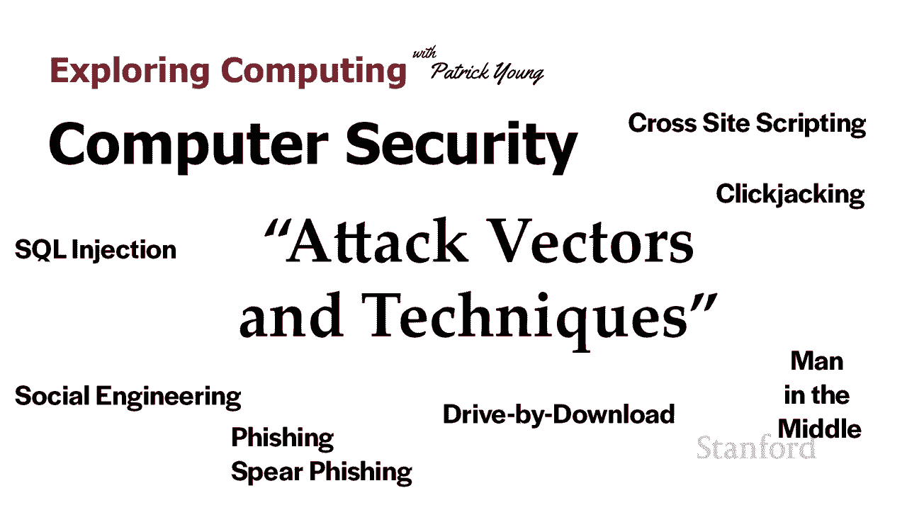
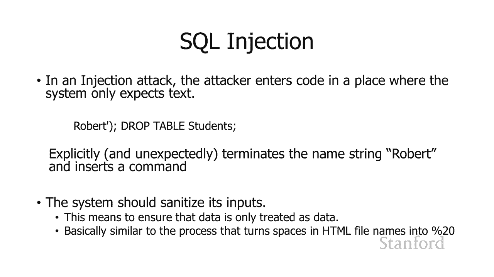
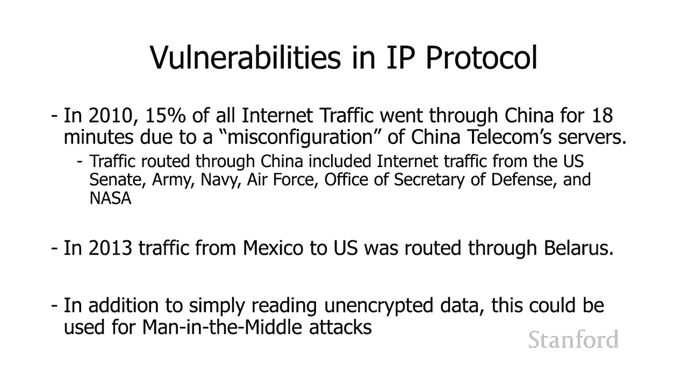

# 【双语字幕+资料下载】斯坦福CS105 ｜ 计算机科学导论(2021最新·完整版) - P58：L21.2- 计算机安全：攻击向量／技术 - ShowMeAI - BV1eh411W72E

undefined，欢迎探索计算，欢迎探索计算，今天的视频是计算机安全，今天的视频是计算机安全，攻击媒介和技术，攻击媒介和技术，因此我们将讨论，因此我们将讨论，可，可，用于危害，用于危害。

计算机安全的特定攻击媒介，特别是社会，计算机安全的特定攻击媒介，特别是社会，工程学，然后在我们，工程学，然后在我们，讨论社会工程学之后，我们，讨论社会工程学之后，我们。

将讨论 查看各种类型的计算机系统攻击，将讨论 查看各种类型的计算机系统攻击，所涉及的各种技术问题。

undefined，undefined，社会工程学是危害某人计算机安全的最简单，社会工程学是危害某人计算机安全的最简单，方法，undefined，undefined，undefined，之一。

这也是您作为，之一，这也是您作为，非程序员可以，非程序员可以，在保护，在保护，您的计算机安全方面发挥巨大作用的一个领域 计算机安全基本上在，您的计算机安全方面发挥巨大作用的一个领域 计算机安全基本上在。

社会工程中，攻击者，社会工程中，攻击者，将忽略，将忽略，安全系统的技术方面，安全系统的技术方面，undefined，undefined。

，而是去寻找最薄弱的环节，而是去寻找最薄弱的环节，即参与该，即参与该，过程的人，过程的人，例如在过去，例如在过去，有人会打电话给技术支持，有人会打电话给技术支持，人员 公司并说，人员 公司并说。

嘿我是比尔盖茨首席执行官呃，嘿我是比尔盖茨首席执行官呃，我忘记了我的密码你可以，我忘记了我的密码你可以，继续重置我的 密码，继续重置我的 密码，虽然这在 microsoft 可能没有发生，但。

undefined，undefined，undefined，在这一点上，这在其他公司肯定发生过，当然，整个，在这一点上，这在其他公司肯定发生过，当然，整个，过程更加自动化，但，过程更加自动化，但。

尽管如此，这些事情，尽管如此，这些事情，仍在继续发生，仍在继续发生，所以如果有人试图闯入，所以如果有人试图闯入，他们调用的特定帐户 技术，他们调用的特定帐户 技术，支持假装是您，支持假装是您。

他们可能无法在，他们可能无法在，第一时间通过，但他们，第一时间通过，但他们，通过与不同的技术支持人员交谈来慢慢收集越来越多的信息，通过与不同的技术支持人员交谈来慢慢收集越来越多的信息。

undefined，undefined，我们的客户支持，我们的客户支持，人员有关该人的信息，人员有关该人的信息，随着时间的推移，他们能够获得足够的，随着时间的推移，他们能够获得足够的，信息 关于这个人。

信息 关于这个人，他们试图闯入其帐户，他们试图闯入其帐户，以假冒技术支持，以假冒技术支持，人员或，人员或，客户支持人员认为，客户支持人员认为，他们确实是他们所说的，undefined。

undefined，人，这对于已经拥有大量，人，这对于已经拥有大量，信息的名人来说尤其成问题 关于他们，信息的名人来说尤其成问题 关于他们，嗯，你可能需要你可能记得，嗯，你可能需要你可能记得。

不久前有一系列不同的黑客 nt，不久前有一系列不同的黑客 nt，女演员的照片被盗，女演员的照片被盗，据信这是他们所谓的，据信这是他们所谓的，技术支持所使用的技术，技术支持所使用的技术，他们假装是。

他们假装是，那个特定的女演员，那个特定的女演员，他们足以说服，他们足以说服，技术支持人员愿意帮助，技术支持人员愿意帮助，他们，他们，并重置密码或类似的东西，并重置密码或类似的东西，undefined。

undefined。

然后他们就能够以，然后他们就能够以，undefined，undefined，可能最著名的，可能最著名的，社会工程攻击示例是网络钓鱼 网络，社会工程攻击示例是网络钓鱼 网络，钓鱼是指您收到。

钓鱼是指您收到，据称来自公司的电子邮件或短信，据称来自公司的电子邮件或短信，并且，并且，该攻击试图让您，该攻击试图让您，输入帐户信息和密码，输入帐户信息和密码，或以其他方式发送，或以其他方式发送。

攻击者不应访问的安全数据，undefined，undefined，所以根据，所以根据，您现在，您现在，从本课程中了解到的信息，要记住的一件事是，从本课程中了解到的信息，要记住的一件事是。

重现网页非常容易，重现网页非常容易，我需要做什么才能 使，我需要做什么才能 使，网页看起来与，网页看起来与，原始网页完全一样 我复制了，原始网页完全一样 我复制了，html 文件 我复制了 css。

html 文件 我复制了 css，我可能会复制图像和一些真的，我可能会复制图像和一些真的，厚颜无耻的，厚颜无耻的，攻击你甚至不费心，攻击你甚至不费心，复制图像你只使用，复制图像你只使用。

真实网站上的真实图像，你只有，真实网站上的真实图像，你只有，自己的html和css，自己的html和css，嗯，所以你知道，嗯，所以你知道，完美地完全复制一个网页真的很容易。

完美地完全复制一个网页真的很容易，所以它看起来就像 原来的，所以它看起来就像 原来的，那么你打算怎么做才能，那么你打算怎么做才能，很好地防止这些类型的攻击，undefined，undefined。

如果你收到一条消息说，如果你收到一条消息说，你的帐户有问题，请，你的帐户有问题，请，不要点击电子邮件中的链接 不要点击链接，而是，不要点击电子邮件中的链接 不要点击链接，而是，转到 那家公司。

转到 那家公司，的主要网站 我说主要网站的意思，的主要网站 我说主要网站的意思，也不要只看，也不要只看，电子邮件中提供的 url 并尝试输入，电子邮件中提供的 url 并尝试输入，单词，单词。

你知道字母的字母 嗯你知道，你知道字母的字母 嗯你知道，www，www，dash 技术支持 dash 你知道不 这样，dash 技术支持 dash 你知道不 这样，做只需转到主网站，做只需转到主网站。

自己在网络浏览器中键入它 嗯，自己在网络浏览器中键入它 嗯，或者 呃 或者，或者 呃 或者，直接使用电话号码致电公司，undefined，undefined，从电子邮件消息以外的其他地方获取电话号码。

undefined，undefined，假设它声称是您的，假设它声称是您的，信用 t 卡 翻转您实际，信用 t 卡 翻转您实际，实体信用卡的背面 查看那里的号码，实体信用卡的背面 查看那里的号码。

undefined，undefined，拨打该号码 不要拨打，拨打该号码 不要拨打，电子邮件中提供的任何号码，电子邮件中提供的任何号码，它拨打的是您卡背面的号码，它拨打的是您卡背面的号码，并说嘿。

我收到了这封电子邮件，并说嘿，我收到了这封电子邮件，我不知道 不知道，我不知道 不知道，这是欺诈还是真实交易 你能，这是欺诈还是真实交易 你能，告诉我发生了什么吗所以，告诉我发生了什么吗所以。

你知道点击，你知道点击，undefined，undefined，undefined，undefined，记住电子邮件非常不安全，记住电子邮件非常不安全，发件人很容易被，发件人很容易被。

伪造 回复 字段可以被操纵，伪造 回复 字段可以被操纵，因此您要，因此您要，回复的电子邮件不会发送给原始，回复的电子邮件不会发送给原始，发件人，而是发送给其他人，发件人，而是发送给其他人。

嗯 smtp 服务器这些是，嗯 smtp 服务器这些是，用于发送电子邮件的服务器，用于发送电子邮件的服务器，而不是用于接收的服务器，而不是用于接收的服务器，并阅读我们的电子邮件，并阅读我们的电子邮件。

最初是，最初是，为开放访问而设计的，我认为它们，为开放访问而设计的，我认为它们，越来越需要，越来越需要，人们使用帐户，但尽管如此，人们使用帐户，但尽管如此，原始，原始，架构是任何人都可以使用任何。

架构是任何人都可以使用任何，电子邮件中继来发送他们的邮件 essages，电子邮件中继来发送他们的邮件 essages，所以整个系统完全是为了不安全而设计，undefined，undefined，的。

另外传统上，的，另外传统上，电子邮件本身，电子邮件本身，没有被加密，改变，没有被加密，改变，的是许多，的是许多，主要的电子邮件站点已经切换到，主要的电子邮件站点已经切换到，需要 https 并且只要。

需要 https 并且只要，你与 服务器使用，你与 服务器使用，https，https，到该网站的任何流量都使用，到该网站的任何流量都使用，https 因此，例如，如果您要使用 https。

https 因此，例如，如果您要使用 https，访问 www。gmail。com，undefined，undefined，人们将无法具体看到该，人们将无法具体看到该，流量，流量，但请记住。

整个电子邮件，但请记住，整个电子邮件，系统再次，系统再次，非常 从安全角度来看，设计很糟糕，非常 从安全角度来看，设计很糟糕，其中很多，其中很多，完全不安全，完全不安全。

，而且在电子邮件中伪造发件人非常容易，undefined，undefined，所以我认为最可怕，所以我认为最可怕，的攻击类型之一是鱼叉式网络钓鱼，的攻击类型之一是鱼叉式网络钓鱼，攻击，攻击。

而一般的网络钓鱼电子邮件我的意思是，而一般的网络钓鱼电子邮件我的意思是，我们 可能所有人都收到了，我们 可能所有人都收到了，事实上我知道你收到了，因为，事实上我知道你收到了，因为，你是斯坦福大学的学生。

而，你是斯坦福大学的学生，而，斯坦福大学受到了攻击，所以我们收到了，斯坦福大学受到了攻击，所以我们收到了，据称来自 stan 的消息 福特，据称来自 stan 的消息 福特，安全，安全。

告诉我们登录到一个特定的，告诉我们登录到一个特定的，undefined，undefined，希望它们很明显，希望它们很明显，尽管你知道我相信，尽管你知道我相信，很容易不小心点击，很容易不小心点击。

消息并，消息并，最终成为你记得，最终成为你记得，点击过的约翰波德斯塔 他认为是来自，点击过的约翰波德斯塔 他认为是来自，谷歌的消息并重置了他的密码，谷歌的消息并重置了他的密码，因此所有希拉里克林顿。

因此所有希拉里克林顿，竞选电子邮件都，竞选电子邮件都，被释放了 嗯，undefined，undefined，鱼叉式钓鱼虽然更难防止鱼叉式网络钓鱼攻击中发生的事情。

鱼叉式钓鱼虽然更难防止鱼叉式网络钓鱼攻击中发生的事情，是攻击者想要攻击，是攻击者想要攻击，攻击者要去的一个非常具体的人，攻击者要去的一个非常具体的人，为了研究他们的目标，为了研究他们的目标，他们将了解。

他们将了解，目标的工作 目标定期执行哪些类型的，目标的工作 目标定期执行哪些类型的，事情，undefined，undefined，目标可能希望收到哪些类型的电子邮件，目标可能希望收到哪些类型的电子邮件。

undefined，undefined，目标的同事是谁 他们担任什么，目标的同事是谁 他们担任什么，样的，样的，职位 携带，职位 携带，他们可能，他们可能，期望向目标发送的消息类型，然后。

期望向目标发送的消息类型，然后，他们所做的是创建精心，他们所做的是创建精心，制作的电子邮件类型，制作的电子邮件类型，目标通常会收到，目标通常会收到，看起来来自同事的电子邮件，undefined。

undefined，实际上他们可以，实际上他们可以，在电子邮件中添加额外的信息，在电子邮件中添加额外的信息，具体取决于他们想要研究的彻底程度，具体取决于他们想要研究的彻底程度，你知道，你知道，嘿。

在那里唱歌很棒，嘿，在那里唱歌很棒，上周五的聚会，我们在那里看到了，上周五的聚会，我们在那里看到了，莎拉和约翰，所以它看起来，莎拉和约翰，所以它看起来，就像来自你的同事一样，就像来自你的同事一样。

所以你继续点击，所以你继续点击，链接，链接，或者打开附件或其他任何，或者打开附件或其他任何，东西，所以我又不知道一个伟大的 防止，undefined，undefined，这种攻击的方法，而不仅仅是变得。

这种攻击的方法，而不仅仅是变得，超级偏执，超级偏执，嗯，我会说，当我，嗯，我会说，当我，收到来自学生的带有附件的邮件时，收到来自学生的带有附件的邮件时，我更有可能，我更有可能。

尝试在 ipad 上打开这些附件，而不是在 PC 上打开这些附件，undefined，undefined，因为，因为，ipad 更像是一个有围墙的花园，在那里，ipad 更像是一个有围墙的花园，在那里。

攻击者很难，攻击者很难，突破邮箱并，突破邮箱并，undefined，undefined，攻击我的电脑，所以你显然知道，攻击我的电脑，所以你显然知道，在很多情况下我，在很多情况下我。

必须打开学生邮件的附件，必须打开学生邮件的附件，而我不需要 知道学生是谁，而我不需要 知道学生是谁，所以，所以，你知道这是一个你，undefined，undefined。

再次超级脆弱的领域我不知道有什么特别，再次超级脆弱的领域我不知道有什么特别，好的方法来防止它但，好的方法来防止它但，我确实认为我在 ipad 上打开电子邮件，undefined，undefined，比。

比，在我的上打开它们更好 我的电脑 电脑更容易受到，在我的上打开它们更好 我的电脑 电脑更容易受到，攻击，攻击，而且很可能任何不，而且很可能任何不。

听这个视频的人，听这个视频的人，都会发送攻击，都会发送攻击，假设我会在，假设我会在，undefined，undefined，电脑上打开它也可以将，电脑上打开它也可以将，社会工程与更多技术。

社会工程与更多技术，攻击混合使用 所以呃你知道我，攻击混合使用 所以呃你知道我，之前提到，之前提到，上次演讲时我们谈到，上次演讲时我们谈到，震网是如何设计来攻击，震网是如何设计来攻击，伊朗核，伊朗核。

精炼设施的，可能，精炼设施的，可能，伊朗核精炼设施，伊朗核精炼设施，有一个气隙，也就是说，有一个气隙，也就是说，它们没有直接连接到，它们没有直接连接到，互联网，互联网，为了，为了，进入内部网络。

不要连接，进入内部网络，不要连接，互联网，互联网，呃攻击这些计算机的人，呃攻击这些计算机的人，一定有办法进入那个，一定有办法进入那个，非连接网络，所以一种方法，非连接网络，所以一种方法。

这样做是使用 USB 驱动器，所以他们，这样做是使用 USB 驱动器，所以他们，可以发送一个实际的物理，可以发送一个实际的物理，代理并将 USB 驱动器，代理并将 USB 驱动器，插入其中一台计算机。

但事实，插入其中一台计算机，但事实，证明，使用社会工程学，证明，使用社会工程学，实际上可以让人们将，实际上可以让人们将，东西插入他们自己的 USB 驱动器，而无需，东西插入他们自己的 USB 驱动器。

而无需，呃，呃，你必须真的在那里，你必须真的在那里，所以国土安全部做，所以国土安全部做，了一个测试，他们去了，了一个测试，他们去了，政府设施之外，他们掉了，政府设施之外，他们掉了，一堆 USB。

一堆 USB，驱动器，实际上 USB，驱动器，实际上 USB，驱动器上的东西是，驱动器上的东西是，呃，一个会，呃，一个会，联系国土部的程序，联系国土部的程序，安全并说嘿，安全并说嘿。

呃某某 USB 驱动器已插入，呃某某 USB 驱动器已插入，undefined，undefined，嗯这里是计算机已插入，嗯这里是计算机已插入，呃，呃，你知道然后国土安全部，你知道然后国土安全部。

会跟进并说嘿，会跟进并说嘿，我们将这个虚拟攻击者 USB，我们将这个虚拟攻击者 USB，驱动器从停车场扔出有人，驱动器从停车场扔出有人，undefined，undefined，但该驱动器也可能不是。

但该驱动器也可能不是，来自国土安全，来自国土安全，部，不是测试练习的一部分，而是，部，不是测试练习的一部分，而是，实际上包含某种，实际上包含某种，马里，马里，他们发现的有效负载是，他们发现的有效负载是。

他们丢弃到停车场的 60 个驱动器，他们丢弃到停车场的 60 个驱动器，被捡起并插入，被捡起并插入，计算机，计算机，但如果他们真的在 USB 驱动器上添加了一个标志，undefined。

undefined，呃，其中 90 个已插入，所以就像，呃，其中 90 个已插入，所以就像，undefined，undefined，地质调查局前面，你在驱动器上放了一个美国地质勘探局的，地质调查局前面。

你在驱动器上放了一个美国地质勘探局的，undefined，undefined，标志，你把它放在，标志，你把它放在，停车场，这大大增加了，停车场，这大大增加了。

有人拿走它并将，有人拿走它并将，它插入其中一台计算机的机会，它插入其中一台计算机的机会，嗯，在最近的美国带来另一个例子，嗯，在最近的美国带来另一个例子，undefined，undefined。

朝鲜会议 嗯，一些，朝鲜会议 嗯，一些，公司分发了一堆，公司分发了一堆，USB 供电的风扇，人们喜欢，USB 供电的风扇，人们喜欢，它在外面真的很热 这，它在外面真的很热 这，真的很好。

undefined，undefined，undefined，undefined，我需要做的，我需要做的，就是将它插入我的，就是将它插入我的，计算机 USB 端口以提供电源。

计算机 USB 端口以提供电源，然后我就会有一个不错的风扇，然后我就会有一个不错的风扇，安全专家就像呃，安全专家就像呃，这是一个非常糟糕的主意，这是一个非常糟糕的主意，他们确实研究了他们的。

他们确实研究了他们的，能力 发现它们都没有，能力 发现它们都没有，有效载荷，有效载荷，但你知道你可以很容易地想象，但你知道你可以很容易地想象，有人像哦这是一个可爱的，有人像哦这是一个可爱的。

噱头哦我明白我需要，噱头哦我明白我需要，插入我的电脑提供，插入我的电脑提供，非常正常的电源让我们，非常正常的电源让我们，继续这样做，继续这样做，事实上它包括 某种，事实上它包括 某种。

攻击您计算机的有效负载，攻击您计算机的有效负载，所以不要将任何东西插入您的任何，所以不要将任何东西插入您的任何。

计算机端口，计算机端口，除非它来自可信赖的，除非它来自可信赖的，来源，来源，好吧，所以再次我真的想，好吧，所以再次我真的想，强调社会工程，因为，强调社会工程，因为，这是您的一个，这是您的一个。

攻击区域 一切都可以产生，攻击区域 一切都可以产生，最大的不同，最大的不同，所以你知道再次注意，所以你知道再次注意，网络钓鱼攻击永远永远，网络钓鱼攻击永远永远，永远不要点击，永远不要点击。

电子邮件中的链接假设它，电子邮件中的链接假设它，会让你处于邪恶的地方，会让你处于邪恶的地方，即使它看起来是合法的，所以，即使它看起来是合法的，所以，人们可以使用各种技术，人们可以使用各种技术。

来制作 地址看起来合法，来制作 地址看起来合法，即使它们不是，即使它们不是，所以你知道可能正常的点，所以你知道可能正常的点，被破折号代替，被破折号代替，所以你知道只是超级，所以你知道只是超级，小心。

小心，不要点击th 再次提供链接，不要点击th 再次提供链接，只需，只需，打开网络浏览器，您就知道，打开网络浏览器，您就知道，公司的名称，公司的名称。

您知道他们的常规网址，您知道他们的常规网址，是什么 转到该常规网址并，是什么 转到该常规网址并，以这种方式登录或再次通过电话呼叫他们，以这种方式登录或再次通过电话呼叫他们，好的，现在我们要走了 看一下。

undefined，undefined，攻击可能发生的更多技术方式，我想谈论的第一个，攻击可能发生的更多技术方式，我想谈论的第一个，是称为 sql，是称为 sql，注入的东西，注入的东西。

所以我真的很喜欢，所以我真的很喜欢，xkcd 的这幅漫画，xkcd 的这幅漫画，感谢 xkcd 允许，感谢 xkcd 允许，非营利组织使用他们的漫画，非营利组织使用他们的漫画，呃。

有一个链接 到下面的卡通，呃，有一个链接 到下面的卡通，嗯，嗯，我认为这真的很好地说明了 sql，我认为这真的很好地说明了 sql，注入，所以，注入，所以，这是一个小卡通，这是一个小卡通。

你可以看到有人打电话给，你可以看到有人打电话给，这位妈妈，这位妈妈，他们说嗨，这是你儿子的，他们说嗨，这是你儿子的，学校，我们遇到了一些计算机，学校，我们遇到了一些计算机，问题，问题，她说 哦，亲爱的。

他有没有打破，她说 哦，亲爱的，他有没有打破，什么东西，他们在某种程度上，什么东西，他们在某种程度上，说你真的给你的学生命名了吗，你，说你真的给你的学生命名了吗，你，真的给你儿子取名，真的给你儿子取名。

robert 引用括号，robert 引用括号，分号删除表学生分号，分号删除表学生分号，哦，是的，我们的小鲍比表，哦，是的，我们的小鲍比表，好吧，我们已经丢失了今年的学生，好吧。

我们已经丢失了今年的学生，记录我希望你开心，记录我希望你开心。

，我希望你学会清理你的，我希望你学会清理你的，数据库输入，数据库输入，所以这里发生了什么 这是，所以这里发生了什么 这是，注入攻击中的注入，注入攻击中的注入，攻击 攻击者，攻击 攻击者。

在一个地方输入代码 系统只，在一个地方输入代码 系统只，需要文本，需要文本，所以这里的想法是这里是学生的名字，undefined，undefined，um robert quotepren。

um robert quotepren，并且，undefined，undefined，从谁，从谁，从这个，从这个，文本字段中获取这个字符串并将其粘贴到，文本字段中获取这个字符串并将其粘贴到。

sql 的一部分的角度来看，名字后面的引号 robert 终止了该字符串 命令，所以他们，sql 的一部分的角度来看，名字后面的引号 robert 终止了该字符串 命令，所以他们，基本上只是把。

基本上只是把，呃文本插入，呃文本插入，到 pre sql 命令中，将，到 pre sql 命令中，将，这个文本字符串拍到，这个文本字符串拍到，他们已经提供的一些文本的末尾，他们已经提供的一些文本的末尾。

所以这里的效果是，所以这里的效果是，在 robert 终止字符串之后的结束引号，在 robert 终止字符串之后的结束引号，和 然后这些东西的其余部分，和 然后这些东西的其余部分，作为实际命令直接插入。

在，作为实际命令直接插入，在，这种情况下，计算机将使用 sql 数据库实际执行该命令，undefined，undefined，undefined，结果是，结果是，undefined，undefined。

所以解决这个问题的方法是你需要，所以解决这个问题的方法是你需要，做所谓的，做所谓的，清理你的输入，所以这里的想法，清理你的输入，所以这里的想法，是，是，你需要以这样一种方式设置你的代码。

你需要以这样一种方式设置你的代码，即用户提供的任何内容都，即用户提供的任何内容都，被严格视为文本，并且不会，被严格视为文本，并且不会，被意外地解释为 一个，被意外地解释为 一个，如此真正的，如此真正的。

sql 注入攻击或任何注入，sql 注入攻击或任何注入，攻击的命令，攻击的命令，是程序员草率，是程序员草率，undefined，undefined，和编写代码的结果，这些代码，和编写代码的结果。

这些代码，对他们来说既快速又容易编写，对他们来说既快速又容易编写，而无需经过额外的步骤，而无需经过额外的步骤，说我将接受这个，说我将接受这个，输入 用户输入，我不只是，输入 用户输入，我不只是。

将它附加到，将它附加到，一些预先存在的命令的末尾，我实际上，一些预先存在的命令的末尾，我实际上，要将整个内容，要将整个内容，显式转换为不能被，显式转换为不能被，视为命令的内容，视为命令的内容。

这就是我将要使用的 作为一个，这就是我将要使用的 作为一个，字符串，字符串，我们在本季度早些时候讨论过，undefined，undefined，当你有一个 html 文件的名称时，我。

当你有一个 html 文件的名称时，我，建议你只使用，建议你只使用，字母数字和破折号，字母数字和破折号，如果你使用额外的，如果你使用额外的，字符，比如空格字符，字符，比如空格字符。

th 他们实际上是用特殊的，th 他们实际上是用特殊的，url 编码编码的，所以，url 编码编码的，所以，一个空格例如你可能，一个空格例如你可能，偶尔在实际网站上看到这个，偶尔在实际网站上看到这个。

空格实际上被转换为，空格实际上被转换为，20 的百分比，20 的百分比，它最终成为空格的 ascii 代码，它最终成为空格的 ascii 代码，所以这是编码的一个例子，所以这是编码的一个例子，所以。

所以，那里发生的事情是编码，那里发生的事情是编码，过程说，过程说，我不想把它当作一个，undefined，undefined，在，在，我可能使用字符串的地方有实际语法意义的空格所以我。

我可能使用字符串的地方有实际语法意义的空格所以我，要把它转换成字符序列，要把它转换成字符序列，百分比，百分比，零不能被误解为，undefined，undefined，语法字符的一部分。

无论出于何种目的我，语法字符的一部分，无论出于何种目的我，可能会使用这个特定的字符串，可能会使用这个特定的字符串，所以你需要做同样的事情，或者，所以你需要做同样的事情，或者。

程序员需要在他们这边做同样的事情，程序员需要在他们这边做同样的事情，他们需要采取，他们需要采取，任何用户的 输入，任何用户的 输入，并使用某种编码，并使用某种编码，将删除，将删除，任何可能，任何可能。

在特定语言，undefined，undefined。

undefined，undefined，都可以 跨站点脚本 嗯与此相反，都可以 跨站点脚本 嗯与此相反，undefined，undefined，这个特定文本技术的名称，这个特定文本技术的名称。

这是另一种类型的，这是另一种类型的，注入攻击，注入攻击，在这种情况下，尽管我们实际上将，undefined，undefined，脚本注入其他人的网页，脚本注入其他人的网页，因此假设一个例子。

因此假设一个例子，我们有一个，我们有一个，显示用户名或，显示用户名或，用户评论的网站，比如它可能是一个，用户评论的网站，比如它可能是一个，公告板，公告板，或者它是一个运行，或者它是一个运行，自己评论。

自己评论，部分的报纸，他们所做的就是允许，部分的报纸，他们所做的就是允许，人们输入，例如他们的，人们输入，例如他们的，名字，他们允许他们输入 一个评论，名字，他们允许他们输入 一个评论，呃。

他们把这些信息，呃，他们把这些信息，存入数据库，然后，存入数据库，然后，当其他人访问该，当其他人访问该，网站时，他们会使用该名称，网站时，他们会使用该名称，和评论，然后将其贴，和评论，然后将其贴。

回到网页上，回到网页上，这样您就可以在这种，这样您就可以在这种，特定类型的 攻击不是，特定类型的 攻击不是，输入用户名，或者也许不是，输入用户名，或者也许不是，输入该评论，输入该评论。

您实际上将坚持使用，您实际上将坚持使用，包含脚本标记的 javascript 代码，包含脚本标记的 javascript 代码，并且如果服务器没有对其进行消毒 s，并且如果服务器没有对其进行消毒 s。

输入它只是，输入它只是，获取用户在文本，获取用户在文本，字段或文本区域中输入的信息，字段或文本区域中输入的信息，它将将该脚本标签粘贴，它将将该脚本标签粘贴，回来，并将，回来，并将。

您注入的 javascript 发送，您注入的 javascript 发送，到，到，访问该网站的任何人的网页上，访问该网站的任何人的网页上，这是克里斯站点脚本攻击的功劳，这是克里斯站点脚本攻击的功劳。

undefined，undefined，防止跨站点，防止跨站点，脚本攻击的目的在于，脚本攻击的目的在于，您知道清理您的输入，确保，您知道清理您的输入，确保，undefined，undefined。

无论用户输入什么，都不会将其，无论用户输入什么，都不会将其，视为，视为，实际的 html，实际的 html，而是将其视为文本，而是将其视为文本，因此您可能知道 你可以去掉，因此您可能知道 你可以去掉。

那个小于符号，那个小于符号，或者你可以专门寻找标签，因为，或者你可以专门寻找标签，因为，你说不允许标签，你说不允许标签，去掉任何小于符号，去掉任何小于符号。

大于符号或类似的东西，大于符号或类似的东西，好的 click jacking 点击 jacking 攻击，好的 click jacking 点击 jacking 攻击，导致用户无意中点击。

undefined，undefined，这可以用于许多，这可以用于许多，不同的，不同的，目的，例如可以用于增加，目的，例如可以用于增加，广告数量，广告数量，或者可以用于导致用户，或者可以用于导致用户。

无意中购买 通过，无意中购买 通过，亚马逊的一键购买链接获得一些东西，亚马逊的一键购买链接获得一些东西。

好的，让我们带您了解点击，好的，让我们带您了解点击，插孔攻击的工作原理，插孔攻击的工作原理，这需要了解一堆，这需要了解一堆，不同的，不同的，html 标签和 css 属性。

html 标签和 css 属性，因此第一个是 iframe，iframe，因此第一个是 iframe，iframe，标签允许用户或创建者，标签允许用户或创建者，网页，网页。

在主 html 页面中放置一个不同的 html 页面，undefined，undefined，所以在这种特殊情况下，我使用，所以在这种特殊情况下，我使用，iframe 标签，iframe 标签。

你知道我确信我们有猫迷，undefined，undefined，对我所有的狗示例不满意，对我所有的狗示例不满意。

那又怎样 我们要做的就是，那又怎样 我们要做的就是，在我的狗的例子中间放一个猫的例子，undefined，undefined，所以你可以看到右下角的猫，所以你可以看到右下角的猫，部分，部分。

它实际上是一个不同的 html，它实际上是一个不同的 html，文件，它已经 使用，文件，它已经 使用，此 iframe 插入，因此您可以看到 iframe，此 iframe 插入。

因此您可以看到 iframe，引用，引用，源cats。html，因此我们实际上，源cats。html，因此我们实际上，要加载cats。html 文件，要加载cats。html 文件。

因此cat 文件有自己的部分，因此cat 文件有自己的部分，该部分显示在，该部分显示在。

Web 浏览器中 我的狗，Web 浏览器中 我的狗，undefined，undefined，第二步你 我需要知道，第二步你 我需要知道，一些叫做级联样式的东西 教，一些叫做级联样式的东西 教。

定位 级联样式表，定位 级联样式表，定位允许我，定位允许我，在网页周围移动元素，在网页周围移动元素，并将它们放置在我想要的任何位置 所以在这种，并将它们放置在我想要的任何位置 所以在这种。

特殊情况下我已经，特殊情况下我已经，从右下角移动了猫的 iframe 并且，从右下角移动了猫的 iframe 并且，我实际上是 把它放在左上角，undefined，undefined。

当你绝对放置一些东西时，当你绝对放置一些东西时，它实际上覆盖了它下面的任何东西，undefined，undefined。

所以猫的 iframe 现在在，所以猫的 iframe 现在在，关于狗的信息之上，关于狗的信息之上，现在我要做的是我，现在我要做的是我，要改变 该 iframe 的不，要改变 该 iframe 的不。

透明度我已将不透明度降低，透明度我已将不透明度降低，到 25，到 25，因此我们实际上可以看到它，但是在真正的，因此我们实际上可以看到它，但是在真正的，点击劫持攻击中，您可以，点击劫持攻击中，您可以。

使其完全不可见，所以，使其完全不可见，所以，我们得到的是我们已经获得，我们得到的是我们已经获得，了我们网络的一部分 在这种特殊情况，了我们网络的一部分 在这种特殊情况，下实际上是不同网站。

下实际上是不同网站，或不同网页的页面，或不同网页的页面，是不同的网页，是不同的网页，cat。html 和 dog。html，cat。html 和 dog。html，位于同一，位于同一，网站上。

但这也很容易，网站上，但这也很容易，成为不同的网站 例如，成为不同的网站 例如，亚马逊，它是完全，亚马逊，它是完全。

不可见的，所以它，不可见的，所以它，在网页上，但用户，在网页上，但用户，实际上看不到它，实际上看不到它，然后我们做的最后一件事是我们，然后我们做的最后一件事是我们，在网页上有一些，在网页上有一些。

我们认为用户会点击的东西 呃，所以，我们认为用户会点击的东西 呃，所以，你知道那里可能有一个链接，或者，你知道那里可能有一个链接，或者，有一个按钮声称它做了，有一个按钮声称它做了，一些事情，一些事情。

所以用户点击了，所以用户点击了，我们网页上的特定位置，我们网页上的特定位置，但他们实际上点击的是，但他们实际上点击的是，他们点击的是不可见的，他们点击的是不可见的，iframe 实际上是一个不同的网站。

iframe 实际上是一个不同的网站，例如亚马逊的隐形副本，例如亚马逊的隐形副本，undefined，undefined，准确定位，以便一键，准确定位，以便一键，购买，购买，按钮位于，按钮位于。

我们让用户认为如果他们，我们让用户认为如果他们，点击该位置的确切位置，点击该位置的确切位置，会发生不同的事情，所以，会发生不同的事情，所以，他们去 他们点击我们的网站，你，他们去 他们点击我们的网站。

你，知道他们认为是，知道他们认为是，一回事，但他们实际上是，一回事，但他们实际上是，点击一个不可见的 iframe，点击一个不可见的 iframe，显示我们正试图让，显示我们正试图让，他们，他们。

直接在 loca 上的一键式按钮购买的东西，直接在 loca 上的一键式按钮购买的东西。

他们点击的地方，他们点击的地方，没问题，所以我们如何防止点击，没问题，所以我们如何防止点击，劫持，劫持，攻击，这真的取决于那些，攻击，这真的取决于那些，不希望 cervitech 发生在。

不希望 cervitech 发生在，他们或他们的客户身上的网站，所以，undefined，undefined，如果你是亚马逊，你可以做什么 您可以，如果你是亚马逊，你可以做什么 您可以。

确保您的网页不会显示，确保您的网页不会显示，在 iframe 中，在 iframe 中，有几种不同的技术可以，有几种不同的技术可以，做到这一点 嗯，您可以，做到这一点 嗯，您可以。

在 http 标头中包含信息，呃，您会，在 http 标头中包含信息，呃，您会，记得，其中包括，记得，其中包括，诸如 嗯 嘿，这是，诸如 嗯 嘿，这是，该网页的长度 这样做的好处是当。

该网页的长度 这样做的好处是当，它过期或者这是，它过期或者这是，我们获得的特定编码时，我们获得的特定编码时，您还可以在那些标题中发送信息，这些，您还可以在那些标题中发送信息，这些，标题说，标题说。

Web 浏览器不要将我放在，Web 浏览器不要将我放在，iframe 中，iframe 中，嗯，您还可以使用 javascript 强制，嗯，您还可以使用 javascript 强制。

您的网页 框架层次结构的顶部，您的网页 框架层次结构的顶部，因此，因此，有很多不同的方法可以，有很多不同的方法可以，防止点击劫持，但这确实取决于，防止点击劫持，但这确实取决于，undefined。

undefined，网站的创建者意识到，网站的创建者意识到，点击劫持是一回事，点击劫持是一回事，并确保，并确保。

他们的网站不能，他们的网站不能，undefined，undefined，某些程序所依赖的一件事，某些程序所依赖的一件事，尤其是特定的 Web 浏览器所，尤其是特定的 Web 浏览器所。

依赖的是一种称为沙箱，依赖的是一种称为沙箱，安全性的东西，安全性的东西，因此沙箱安全性背后的想法，因此沙箱安全性背后的想法，是，是，在 Web 浏览器中运行的客户端程序员。

在 Web 浏览器中运行的客户端程序员，可以执行一定数量，可以执行一定数量，undefined，undefined，的交互操作 使用计算机，的交互操作 使用计算机，例如，他们可以控制，例如。

他们可以控制，undefined，undefined，Web 浏览器窗口中显示的内容，因此，undefined，undefined，网站可以执行的操作会，网站可以执行的操作会，在沙，在沙，箱中考虑。

而网站无法执行的操作，箱中考虑，而网站无法执行的操作，则在沙箱之外考虑，则在沙箱之外考虑，例如 访问，例如 访问，用户计算机上的文件，它位于，用户计算机上的文件，它位于，沙箱之外，因此 Web 浏览器。

沙箱之外，因此 Web 浏览器，将不允许网站直接，将不允许网站直接，访问文件系统，访问文件系统，访问摄像头和麦克风的文件系统，访问摄像头和麦克风的文件系统，通常位于沙箱之外，通常位于沙箱之外，尽管。

尽管，我认为您可能会越来越多地看到，我认为您可能会越来越多地看到，这包括在内，这包括在内，在沙箱中但需要特殊，在沙箱中但需要特殊，权限但这里的基本思想是，权限但这里的基本思想是。

呃程序在这种情况下是网络，呃程序在这种情况下是网络，浏览，浏览，器说嘿，为了，器说嘿，为了，让人们创建很酷和，让人们创建很酷和，有趣的网站，我们希望他们，有趣的网站，我们希望他们。

能够访问沙箱中的一大堆，能够访问沙箱中的一大堆，不同的功能，不同的功能，但随后我们需要清楚地，但随后我们需要清楚地，描述在沙箱之外的东西 沙盒和，描述在沙箱之外的东西 沙盒和，他们无法访问的东西，所以。

他们无法访问的东西，所以，你知道，如果你想知道呃，你知道，如果你想知道呃，可能会吓坏这个，但这，可能会吓坏这个，但这，是因为，是因为，你可以把你的孩子放在沙盒里，你可以把你的孩子放在沙盒里。

孩子可以玩他们的玩具，孩子可以玩他们的玩具，呃和 只要他们呆在那个，呃和 只要他们呆在那个，沙箱里，他们就在一个安全的环境中，沙箱里，他们就在一个安全的环境中，但我们不希望他们，但我们不希望他们。

离开沙箱，离开沙箱，你知道也许游泳池就在附近，我们，你知道也许游泳池就在附近，我们，不想去我们不去的游泳池 不，不想去我们不去的游泳池 不，希望他们，希望他们，真正进入狗公园的狗，真正进入狗公园的狗。

undefined，undefined，所以这就是沙盒安全背后的想法，所以这就是沙盒安全背后的想法，undefined，undefined，现在需要注意的一件事是，现在需要注意的一件事是。

有各种不同的方法，有各种不同的方法，可以脱离沙盒，可以脱离沙盒，特别是经常使用插件或扩展，特别是经常使用插件或扩展，可以访问外部 沙箱，可以访问外部 沙箱，所以你应该非常谨慎地，所以你应该非常谨慎地。

安装插件或扩展，安装插件或扩展，我认为网络浏览器，我认为网络浏览器，在明确告诉，在明确告诉，你该网络浏览器插件想要，你该网络浏览器插件想要，访问的内容方面已经变得更好了，访问的内容方面已经变得更好了。

但请注意，如果你，但请注意，如果你，坚持使用该插件的插件 -  in 可能可以，坚持使用该插件的插件 -  in 可能可以，访问绝对所有内容，访问绝对所有内容，因此如果您访问网站并且该。

因此如果您访问网站并且该，网站就像嘿嘿，网站就像嘿嘿，您需要下载此插件，您需要下载此插件，才能正确使用，才能正确使用，此网页查看此网页您知道，此网页查看此网页您知道，除非您，除非您。

确定您信任该网站并且您，确定您信任该网站并且您，相信制作该插件的人，相信制作该插件的人，说不 不值得，说不 不值得，在三个维度上随机查看某些内容，在三个维度上随机查看某些内容，并冒着危及整个网络。

并冒着危及整个网络，浏览器安全性的风险，包括您的所有，浏览器安全性的风险，包括您的所有，银行信息 所以你知道，银行信息 所以你知道，说不，除非有充分的理由，说不，除非有充分的理由。

说是，除非你真的相信这一点，说是，除非你真的相信这一点，undefined，undefined，好的，呃，在一个有点相关的注释上，好的，呃，在一个有点相关的注释上，有一种叫做逐个，有一种叫做逐个，下载。

下载，和逐个下载的东西试图让，和逐个下载的东西试图让，你安装恶意软件，所以我们，你安装恶意软件，所以我们，的网络浏览器插件示例，的网络浏览器插件示例，这可能是下载驱动的一个例子。

这可能是下载驱动的一个例子，undefined，undefined，我们如何让用户很好地安装，我们如何让用户很好地安装，软件我们可能会做的一件事是，软件我们可能会做的一件事是。

我们可能依赖于用户的易受骗，我们可能依赖于用户的易受骗，性，所以他们访问我们的网站，性，所以他们访问我们的网站，你知道我们声称有一个插件，你知道我们声称有一个插件，他们 需要下载，他们 需要下载。

或者呃你知道我们启动一个下载，或者呃你知道我们启动一个下载，消息就像嘿我们认为你，消息就像嘿我们认为你，有病毒点击这里我们会为你清理它，undefined，undefined，或者网络浏览器。

或者网络浏览器，有时，有时，会有安全漏洞，会有安全漏洞，允许网站下载某些内容 直接访问，允许网站下载某些内容 直接访问，计算机，计算机，因此可以识别计算机或 Web 浏览器。

因此可以识别计算机或 Web 浏览器，漏洞，漏洞，如果您访问，如果您访问，该网站，它会强制下载，该网站，它会强制下载。

或安装一些，或安装一些，好的东西 中间人攻击呃，好的东西 中间人攻击呃，在中间人攻击中我们所做的是，在中间人攻击中我们所做的是，我们，我们，在受害者的计算机和，在受害者的计算机和。

他们试图与之通信的计算机之间插入一台恶意计算机，他们试图与之通信的计算机之间插入一台恶意计算机，中间人攻击背后的想法，中间人攻击背后的想法，是我们想让它对，是我们想让它对。

受害者不可见 我认为他们实际上正在，受害者不可见 我认为他们实际上正在，受到攻击，受到攻击，所以假设我正在尝试，所以假设我正在尝试，与我的银行通信，并且在我和我的银行之间有一台恶意，与我的银行通信。

并且在我和我的银行之间有一台恶意，计算机，计算机，当我输入我的姓名和密码时，我，当我输入我的姓名和密码时，我，认为我正在与我的银行通信，认为我正在与我的银行通信，但实际发生的是，但实际发生的是。

我正在将我的姓名和密码传递，我正在将我的姓名和密码传递，给恶意计算机，给恶意计算机，恶意计算机正在获取该，恶意计算机正在获取该，信息并将其传递给我的，信息并将其传递给我的，undefined。

undefined，银行银行将信息发送，银行银行将信息发送，回恶意计算机认为是我，回恶意计算机认为是我，恶意计算机将，恶意计算机将，信息传递给我，信息传递给我，就我而言，就我而言，看起来我实际上正在。

看起来我实际上正在，与我的银行正确沟通，与我的银行正确沟通，但实际上我们之间有一个黑客，但实际上我们之间有一个黑客，undefined，undefined，这可以用来绕过，undefined。

undefined，呃双因素身份验证，呃双因素身份验证，我尝试和 登录我的银行，但我的，我尝试和 登录我的银行，但我的，帐户设置了双因素，帐户设置了双因素，身份验证，这是一件非常好的，身份验证。

这是一件非常好的，事情，我们将在下一堂课中详细讨论，事情，我们将在下一堂课中详细讨论，undefined，undefined，银行可能会向我发送一条，银行可能会向我发送一条，短信。

其中包含 umber 并且它说好的，短信，其中包含 umber 并且它说好的，patrick um 我看到你正在尝试登录，patrick um 我看到你正在尝试登录，呃，呃，你似乎是从这个。

你似乎是从这个，随机位置登录我不知道所以，随机位置登录我不知道所以，我给你发了一条带有，我给你发了一条带有，识别号，识别号，的消息所以可能发生的事情是我 将我的，的消息所以可能发生的事情是我 将我的。

姓名和密码，姓名和密码，输入中间的人 中间的计算机，输入中间的人 中间的计算机，恶意计算机，恶意计算机，它将我的登录，它将我的登录，信息传递到我的银行，信息传递到我的银行。

计算机 银行计算机看到这来自一个，计算机 银行计算机看到这来自一个，新位置，新位置，undefined，undefined，并说输入，并说输入，我刚刚发送给您的 ID 号或唯一代码，undefined。

undefined，中间的人将，中间的人将，请求传递给我，undefined，undefined，undefined，undefined，undefined。

黑客现在进入，黑客现在进入，undefined，undefined，好吧，如果安全性正常工作，好吧，如果安全性正常工作，并且您正在使用安全，并且您正在使用安全，性中间人攻击不应该，性中间人攻击不应该。

起作用所以有一些事情，起作用所以有一些事情，运行中间人，运行中间人，攻击的人需要，攻击的人需要，为了得到 这些事情首先要起作用，为了得到 这些事情首先要起作用，的是中间的人，的是中间的人。

undefined，undefined，要求计算机在中间，所以，要求计算机在中间，所以，你知道这不一定像，你知道这不一定像，我和我的银行之间那么容易，undefined，undefined。

但有一些方法可以做到，但有一些方法可以做到，特别是如果它是，特别是如果它是，美国国家安全局或联邦调查局，他们真的，美国国家安全局或联邦调查局，他们真的，很想攻击我，很想攻击我，你知道他们可以得到呃某种。

你知道他们可以得到呃某种，法庭命令，实际上，法庭命令，实际上，在说我和互联网的其他人之间坚持一些东西，在说我和互联网的其他人之间坚持一些东西，所以是的，所以是的，这是可行的，呃但总的来说，这是可行的。

呃但总的来说，需要发生一些事情，这，需要发生一些事情，这，将允许攻击者，将允许攻击者，在，在，呃我和他们想要模拟的计算机之间插入他们的计算机，呃我和他们想要模拟的计算机之间插入他们的计算机。

他们还需要一种方法来，他们还需要一种方法来，克服，undefined，undefined，网站和我的网络浏览器使用的身份保护和加密，网站和我的网络浏览器使用的身份保护和加密，undefined。

undefined，假设我 '实际上是在使用它们，如果我，假设我 '实际上是在使用它们，如果我，不是，如果我正在，不是，如果我正在，使用 http，使用 http，这是网络协议的非安全版本。

这是网络协议的非安全版本，而不是 https（这，而不是 https（这，是一个安全版本）与某些东西进行通信，是一个安全版本）与某些东西进行通信，那么所有的赌注都将关闭 这，那么所有的赌注都将关闭 这。

太容易了，然后他们只需要，太容易了，然后他们只需要，在我和网站之间进行交流，在我和网站之间进行交流，好吧，他们怎么能，好吧，他们怎么能，很好地解决这些问题，很好地解决这些问题，嗯，你知道你可能听过人们。

嗯，你知道你可能听过人们，说，说，不要连接到随机的 uh，不要连接到随机的 uh，wi-fi 点或小心 网吧，wi-fi 点或小心 网吧，和其他你知道，和其他你知道，你坐在星巴克的地方。

你坐在星巴克的地方，哦这里有一个看起来像星巴克的 Wi-Fi 路由器，哦这里有一个看起来像星巴克的 Wi-Fi 路由器，肯定让我继续，undefined，undefined，连接那里因为这是一个。

连接那里因为这是一个，你可以在金属中插入一个男人的地方 攻击，你可以在金属中插入一个男人的地方 攻击，所以你知道我认为我正在，所以你知道我认为我正在，与星巴克 wi-fi 通信，但实际上。

与星巴克 wi-fi 通信，但实际上，我正在与黑客 wi-fi 通信，我正在与黑客 wi-fi 通信，黑客现在在我，黑客现在在我，和互联网的其余部分之间，他们，和互联网的其余部分之间，他们。

undefined，undefined，怎么办 你解决了这个认证，怎么办 你解决了这个认证，加密问题，一件事，加密问题，一件事，是你可以假设用户只会，是你可以假设用户只会，接受证书，接受证书。

所以如果你登录 stanford unix，所以如果你登录 stanford unix，机器，嗯，他们会向你发送这个，机器，嗯，他们会向你发送这个，长长的，长长的，识别字符串，说嘿这是，识别字符串。

说嘿这是，我的安全身份，我的安全身份，您可以仔细检查并确保，您可以仔细检查并确保，这确实是它所说的斯坦福计算机，这确实是它所说的斯坦福计算机，undefined，undefined，而关于斯坦福。

而关于斯坦福，unix 计算机的事情是有几十个，unix 计算机的事情是有几十个，所以有几十个，所以有几十个，这样的，这样的，uh 识别字符串，uh 识别字符串，除非等等基本上每个 当。

除非等等基本上每个 当，您登录其中一台计算机时，您，您登录其中一台计算机时，您，实际上，实际上，可能正在登录另一台计算机，因此您，可能正在登录另一台计算机，因此您，知道我可能第一次，知道我可能第一次。

登录 Rice。stanford。iu，undefined，undefined，下次实际上可能是 Rice12 下次可能是 Rice5 下次。

下次实际上可能是 Rice12 下次可能是 Rice5 下次，可能是权利 3 那么它可能是大米，可能是权利 3 那么它可能是大米，0，0，所以这些都有不同的非常，所以这些都有不同的非常，长的唯一识别。

长的唯一识别，字符串，所以如果我开始变得懒惰，字符串，所以如果我开始变得懒惰，我不会费心查找这些，我不会费心查找这些，识别强度并说哦，识别强度并说哦，是的，这真的是大米 12。是的，这真的是大米 12。

我只是接受它 会允许，我只是接受它 会允许，中间的人，中间的人，假装是这些计算机中的一台，而，假装是这些计算机中的一台，而，我没有，我没有，意识到它实际上是黑客的计算机，意识到它实际上是黑客的计算机。

另一种可能性是获得真正的，另一种可能性是获得真正的，假证书，假证书，举个，举个，例子，荷兰认证机构，例子，荷兰认证机构，denoter 被黑了，denoter 被黑了，它的私钥被盗用，它的私钥被盗用。

所以无论谁黑了他们并，所以无论谁黑了他们并，掌握了他们的私钥，掌握了他们的私钥，都能够生成，都能够生成，声称来自 diginotar 的新证书，这被，声称来自 diginotar 的新证书，这被。

认为是一个合理的认证，认为是一个合理的认证，机构，机构，当时 Web 浏览器已被修复，当时 Web 浏览器已被修复，为不允许，为不允许，使用 diginotar 证书，使用 diginotar 证书。

并且公司已经破产了，并且公司已经破产了，我们也谈到过我想我之前，我们也谈到过我想我之前，谈到过，谈到过，当我们谈到认证，当我们谈到认证，机构时，有人获得了其中一个，机构时，有人获得了其中一个。

认证机构 向，认证机构 向，他们颁发声称为 microsoft 的证书，而，他们颁发声称为 microsoft 的证书，而，实际上他们不是 microsoft，实际上他们不是 microsoft。

也可以让用户，也可以让用户，安装新的证书颁发机构，以便，安装新的证书颁发机构，以便，您访问该网站，您访问该网站，并收到一条消息，说嘿，并收到一条消息，说嘿，该网站正在使用我不使用的证书。

该网站正在使用我不使用的证书，承认认证，承认认证，机构，机构，你想添加黑客 r 我们作为，你想添加黑客 r 我们作为，uh 作为受信任的认证 auth  ority。

uh 作为受信任的认证 auth  ority，并，并，希望用户愚蠢到可以说“，希望用户愚蠢到可以说“，是” 这就是为什么，是” 这就是为什么，再次非常谨慎地向您的 Web 浏览器添加新的。

再次非常谨慎地向您的 Web 浏览器添加新的，证书颁发机构，证书颁发机构，在这一点上没有充分，在这一点上没有充分，的理由，的理由，让某人使用，让某人使用，非标准的证书颁发机构，非标准的证书颁发机构。

呃 证书已经，呃 证书已经，undefined，undefined，从合理的认证，从合理的认证，机构那里变得足够便宜了，这应该不再是一个，机构那里变得足够便宜了，这应该不再是一个，问题，问题。

但是呃你知道用户访问该，但是呃你知道用户访问该，网站，网站，呃他们认为这是他们的银行而不是，呃他们认为这是他们的银行而不是，他们的银行因为他们已经被，他们的银行因为他们已经被，中间的人重定向了。

中间的人重定向了，收到一条消息说嘿你的银行，收到一条消息说嘿你的银行，说，说，呃它有证书但你，呃它有证书但你，需要证明这个特定的证书，需要证明这个特定的证书，颁发机构，颁发机构。

呃不是你可以很容易地看到一个 iv，呃不是你可以很容易地看到一个 iv，用户像好的我不，用户像好的我不，知道这是什么我想这很好我，知道这是什么我想这很好我，我会继续点击是，我会继续点击是。

所以他们认为他们现在正在，所以他们认为他们现在正在，与他们的银行沟通，与他们的银行沟通，我们也遇到过这真的很可怕但，我们也遇到过这真的很可怕但，我们，我们，在其中一个无线网络中也有弱点 我。

在其中一个无线网络中也有弱点 我，的 wpa2，的 wpa2，协议实际上允许特定类型，协议实际上允许特定类型，的攻击来，的攻击来，undefined，undefined，这是我们希望首先由。

这是我们希望首先由，白帽黑客发现的，白帽黑客发现的，所以呃这些都是好人，所以呃这些都是好人，所以他们基本上说嘿，如果我这样，所以他们基本上说嘿，如果我这样，做，做。

我可以 实际上绕过了 wpa2 的安全性，undefined，undefined，所以他们通知所有人 wpa2，所以他们通知所有人 wpa2，不安全，不安全，嗯，我们不知道有谁，undefined。

undefined，在通知每个人之前发现了这个，但，在通知每个人之前发现了这个，但，肯定有可能其他人，undefined，undefined，提前发现了这一点，并正在使用它，提前发现了这一点。

并正在使用它。

以便 在标签中间执行 man，以便 在标签中间执行 man，undefined，undefined，好的另一个会出现的问题，好的另一个会出现的问题，特别是如果您正在开发，特别是如果您正在开发。

网站或正在，网站或正在，编写软件，编写软件，如果您，如果您，在您的网站上使用其他人的软件，或者您正在使用，在您的网站上使用其他人的软件，或者您正在使用，开源，开源。

代码作为其中的一部分 你正在做的一个项目，代码作为其中的一部分 你正在做的一个项目，undefined，undefined，继承了那个软件的漏洞，继承了那个软件的漏洞，undefined。

undefined，所以举个例子，嗯，所以举个例子，嗯，我认识一群，我认识一群，在做这个游戏项目的人，在做这个游戏项目的人，我访问了他们的网站， 我，我访问了他们的网站， 我，一再被，一再被。

带到第三个网站，带到第三个网站，该网站显然，该网站显然，与原始网站无关，你们，与原始网站无关，你们，可能在访问网站之前都看过这个，可能在访问网站之前都看过这个，嗯，嗯，你知道你会立即被。

你知道你会立即被，随机，随机，下载这个游戏，或者你知道，下载这个游戏，或者你知道，其他一些事情 这显然，其他一些事情 这显然，与原始网站没有任何关系，与原始网站没有任何关系，所以我通知了，所以我通知了。

他们，他们，他们告诉我，他们告诉我，他们没有意识到发生了这种情况，他们没有意识到发生了这种情况，因为他们从未使用 ios 网络浏览器访问过他们的网站，undefined，undefined。

他们总是在他们的网站上访问 pcs，他们总是在他们的网站上访问 pcs，但他们做了一些研究，结果，但他们做了一些研究，结果，发现他们在他们的网站上使用了一个插件，发现他们在他们的网站上使用了一个插件。

一个，一个，wordpress 插件，那个 wordpress，wordpress 插件，那个 wordpress，插件已经被破坏，插件已经被破坏，了，那个插件的新版本，了，那个插件的新版本。

避免了这个问题，避免了这个问题，但是嗯，但是是的 基本上是因为他们使用了，但是嗯，但是是的 基本上是因为他们使用了，这个，undefined，undefined。

由其他人编写的 wordpress 插件并且那个 wordpress，由其他人编写的 wordpress 插件并且那个 wordpress，插件被，插件被，黑了呃他们的网站，黑了呃他们的网站。

undefined，undefined，undefined，o 虽然编写该，o 虽然编写该，插件的，插件的，人并不打算呃，人并不打算呃，你知道会引起问题，但他们并不，你知道会引起问题，但他们并不。

打算将它作为一个普通的好，打算将它作为一个普通的好，插件，人们可以，插件，人们可以，undefined，undefined，在某些情况下将其放入他们的 wordpress 网站。

在某些情况下将其放入他们的 wordpress 网站，undefined，undefined，您依赖的插件或其他开源项目，undefined，undefined，实际上最终可能会恶意更改。

实际上最终可能会恶意更改，他们的代码，因此有几种，他们的代码，因此有几种，情况可能会发生这种情况，其中，情况可能会发生这种情况，其中，一种是您使用的是，一种是您使用的是，开源代码 开源代码意味着。

开源代码 开源代码意味着，任何人都可以继续 并进入并，任何人都可以继续 并进入并，修改代码，修改代码，因此最好的预防方法是，因此最好的预防方法是，确保，确保，您正在使用，您正在使用，广泛使用的开源代码。

它使用得越广泛，undefined，undefined，就越有可能有很多人，就越有可能有很多人，在查看此代码，在查看此代码，并确保 如果有人，并确保 如果有人，在代码中插入了一些东西，它会被。

在代码中插入了一些东西，它会被，注意到，注意到，并且会被关闭，如果你正在使用，并且会被关闭，如果你正在使用，一些，一些，只有你知道的开源项目，只有你知道的开源项目，就像十几个人，就像十几个人。

是那十几个人的安全专家，是那十几个人的安全专家，他们是否，他们是否，关注该代码发生了，关注该代码发生了，什么，所以，什么，所以，将恶意代码插入到，将恶意代码插入到，这类项目中相对容易，所以。

这类项目中相对容易，所以，使用，使用，未，未，undefined，undefined，的开源代码时要非常小心，此外，还有发生过的，的开源代码时要非常小心，此外，还有发生过的，事件 有人创建了。

事件 有人创建了，某种免费项目，某种免费项目，它开始受到关注，呃，他们，它开始受到关注，呃，他们，决定，决定，嘿，也许我厌倦了支持这个，嘿，也许我厌倦了支持这个，东西，东西，因为老实说，不断。

因为老实说，不断，支持正在发生变化的代码是一种痛苦，支持正在发生变化的代码是一种痛苦，呃，所以他们想要退出，呃，所以他们想要退出，其他人为他们提供了，其他人为他们提供了，一大笔钱并说，一大笔钱并说。

嘿我们想接管你的代码呃，嘿我们想接管你的代码呃，这里有很多现金，这里有很多现金，而且他们很棒我出去，而且他们很棒我出去，了你现在控制代码我会让，了你现在控制代码我会让，我的用户知道你现在控制。

我的用户知道你现在控制，代码，代码，然后发生的事情，然后发生的事情，是现在控制代码的那家公司，是现在控制代码的那家公司，你知道也许他们，你知道也许他们，在代码中插入了一些东西呃。

在代码中插入了一些东西呃，因为它不再是一个免费的项目，因为它不再是一个免费的项目，也许他们添加了一些间谍，也许他们添加了一些间谍，软件 cking 软件呃或者你知道可能有。

软件 cking 软件呃或者你知道可能有，更恶意的东西，更恶意的东西，呃所以你知道，呃所以你知道，这可能是一个问题所以是，这可能是一个问题所以是，的有很多免费软件，的有很多免费软件，很棒，很棒。

呃你知道我不想让，呃你知道我不想让，人们太偏执，人们太偏执，但呃要注意，但呃要注意，如果您使用的免费软件，如果您使用的免费软件，易手或被出售给另一，易手或被出售给另一，家公司 呃你需要。

家公司 呃你需要。

知道现在谁拥有该软件，如果，知道现在谁拥有该软件，如果，undefined，undefined，好的 嗯这是另一种呃，好的 嗯这是另一种呃，攻击技术 我遇到了这个，攻击技术 我遇到了这个，有点可怕。

有点可怕，这是漏洞 在原始，这是漏洞 在原始，ip 协议中，ip 协议中，因此您可能还记得 ip，因此您可能还记得 ip，数据包，数据包，在互联网上反弹，并且它们可以，undefined。

undefined，根据互联网流量的，undefined，undefined，情况在不同的方向重新路由，因此在这种类型的攻击中会发生什么，undefined，undefined，是攻击者开始发送信息。

是攻击者开始发送信息，了解互联网流量的运行情况，了解互联网流量的运行情况，undefined，undefined，并强制互联网数据包通过，并强制互联网数据包通过，他们的特定计算机，他们的特定计算机。

以 2010 年为例，以 2010 年为例，所有互联网流量中有 15 个通过了，所有互联网流量中有 15 个通过了，中国 18 分钟，由于，中国 18 分钟，由于，中国电信服务器的引用错误配置。

中国电信服务器的引用错误配置，因此通过中国的 reddit，因此通过中国的 reddit，流量包括来自美国参议院的互联网流量，undefined，undefined，海军，空军。

国防部长办公室和美国国家航空，undefined，undefined，航天局 所以基本上这里发生的事情是，航天局 所以基本上这里发生的事情是，中国声称这一点 是偶然的但是，中国声称这一点 是偶然的但是。

发生的事情是，发生的事情是，中国的电信公司，中国的电信公司，嗯基本上告诉互联网的其余部分，嗯基本上告诉互联网的其余部分，嘿你应该通过我们路由你的，嘿你应该通过我们路由你的，流量，流量。

我们是到达目的地的最快方式，我们是到达目的地的最快方式，undefined，undefined，所以你知道如果你，所以你知道如果你，从五角大楼发送信息，从五角大楼发送信息，到 白宫，如果，到 白宫。

如果，你通过中国路由它会更快，你通过中国路由它会更快，互联网也很高兴地，互联网也很高兴地，跟着它发送，跟着它发送，所有的 ip 数据包通过中国 呃在，所有的 ip 数据包通过中国 呃在，不同的事件中。

不同的事件中，20 2013 年从墨西哥，20 2013 年从墨西哥，到美国的互联网流量被评为，到美国的互联网流量被评为，通过白俄罗斯路由 嗯，出于类似的，通过白俄罗斯路由 嗯，出于类似的，原因，原因。

你知道，你知道，如果它从墨西哥的天线开始为美国服务，那么交通真的没有理由通过白俄罗斯，undefined，undefined，undefined，嗯，嗯，所以，所以，如果有任何，如果有任何。

未加密的任何未加密的数据包通过任何未加密的数据包，未加密的任何未加密的数据包通过任何未加密的数据包，那么这可以用于一件事，那么这可以用于一件事，呃那些可以被读取，这也是，呃那些可以被读取，这也是。

你知道的，我们在一分钟前讨论过，你知道的，我们在一分钟前讨论过，你需要如何在中间攻击中的人，undefined，undefined，在人和计算机之间，嗯，他们正在，undefined。

undefined，使用这样的技术进行良好的沟通，你现在，使用这样的技术进行良好的沟通，你现在，处于，处于，那个人和，那个人和，他们正在与之沟通的社区计算机之间，他们正在与之沟通的社区计算机之间。

的中间，所以嗯，的中间，所以嗯，[音乐]，[音乐]，这让你对，这让你对，计算机受到，计算机受到，攻击的各种不同方式 当然，还有许多其他，攻击的各种不同方式 当然，还有许多其他，方式计算机可以受到攻击。

方式计算机可以受到攻击，但是你知道我希望这能让你了解，undefined，undefined，再次攻击计算机可能发生的各种事情，再次攻击计算机可能发生的各种事情，undefined，undefined。

让我强调社会，让我强调社会，工程学 因为还有网络钓鱼，工程学 因为还有网络钓鱼，攻击和鱼叉式网络钓鱼，因为，undefined，undefined，undefined，undefined。

如果你现在完全吓坏了，那是你个人最有能力防范的一种，如果你现在完全吓坏了，那是你个人最有能力防范的一种，ittle吓坏了自己，ittle吓坏了自己，嗯，但在下一节课中，我们将讨论，undefined。

undefined，如何保护自己和防御，如何保护自己和防御，undefined，undefined。

各种类型的攻击，我期待着，各种类型的攻击，我期待着，undefined。

