# 【双语字幕+资料下载】斯坦福CS105 ｜ 计算机科学导论(2021最新·完整版) - P59：L22.1- 计算机安全：防御技术 - ShowMeAI - BV1eh411W72E

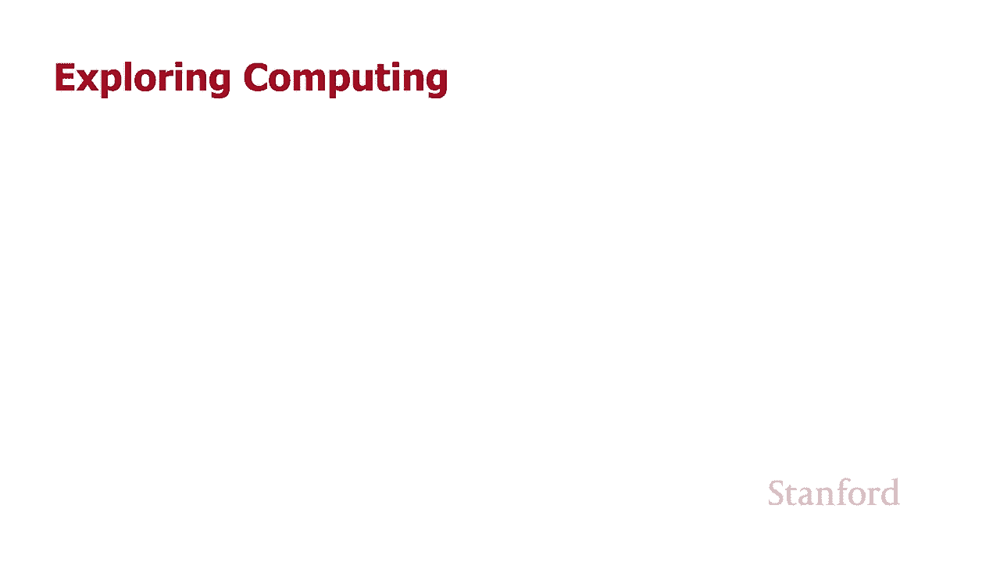

undefined，欢迎来到，欢迎来到，今天的视频探索计算机安全，今天的视频探索计算机安全，防御技术，防御技术，所以在上一个视频中我们看到了很多方法，所以在上一个视频中我们看到了很多方法。

您的计算机可能会受到攻击，您的计算机可能会受到攻击。

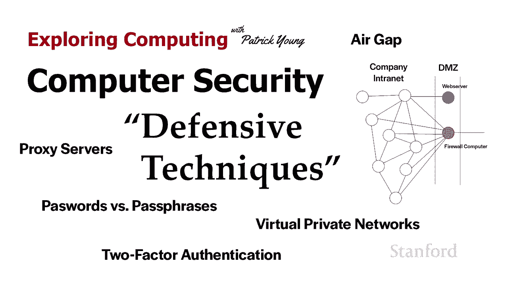

我们可以做些什么来保护，我们可以做些什么来保护，自己，自己，所以这就是这个视频的全部内容，所以这就是这个视频的全部内容，所以我想要的第一件事 要讨论的，所以我想要的第一件事 要讨论的，是防火墙。

是防火墙，我们将首先讨论企业防火墙，我们将首先讨论企业防火墙，然后再讨论个人，然后再讨论个人，防火墙，防火墙，因此首先让我们考虑一下，因此首先让我们考虑一下，如果我们的公司没有，如果我们的公司没有。

防火墙，防火墙，那么我们有一个公司内部的，那么我们有一个公司内部的，Intranet，Intranet，和每个 互联网上的计算机可以，和每个 互联网上的计算机可以，访问互联网，访问互联网。

这意味着我们所有的计算机，这意味着我们所有的计算机，都容易受到来自外部的攻击，都容易受到来自外部的攻击，这也意味着，这也意味着，您可能知道我们有人想要在，undefined，undefined。

内部做某事 就像也许我们，内部做某事 就像也许我们，有人在监视他们可以，有人在监视他们可以，发送 来自，发送 来自，公司的信息根本没有控制，所以，公司的信息根本没有控制，所以，这显然是一个糟糕的情况。

这显然是一个糟糕的情况，所以防火墙计算机是什么，它是一，所以防火墙计算机是什么，它是一，台介于两者之间的计算机，台介于两者之间的计算机，公司内部网，公司内部网，和更广泛的互联网，因此它可以。

和更广泛的互联网，因此它可以，防止恶意，防止恶意，流量进入公司，流量进入公司，它还可以防止恶意，它还可以防止恶意，信息流出公司，undefined，undefined，防火墙可以做很多不同的事情。

防火墙可以做很多不同的事情，所以它可以做的一件事就是它 可以阻止，所以它可以做的一件事就是它 可以阻止，特定的应用程序，特定的应用程序，或者它也可以将某些应用程序列入白名单，undefined。

undefined，所以基本上它会查看，所以基本上它会查看，所有进入的流量，假设，所有进入的流量，假设，有人试图，有人试图，在我们的一台计算机上像 ftp 一样访问它。

在我们的一台计算机上像 ftp 一样访问它，就像嘿那台计算机不，就像嘿那台计算机不，应该 正在做文件传输我不知道，应该 正在做文件传输我不知道，你为什么，你为什么，在尝试访问那，在尝试访问那。

台计算机并尝试从它传输文件，台计算机并尝试从它传输文件，undefined，undefined，或者它可能是嗯我们稍后会讨论，undefined，undefined，呃哪些计算机是 实际上。

呃哪些计算机是 实际上，允许访问互联网但，允许访问互联网但，呃你知道它可能会说哦那，呃你知道它可能会说哦那，不是访问文件的正确计算机，不是访问文件的正确计算机，所以这看起来有点可疑。

所以这看起来有点可疑，嗯它可以阻止某些IP，嗯它可以阻止某些IP，号码或白名单某些 IP 号码，号码或白名单某些 IP 号码，undefined，undefined，所以你知道我们可以限制。

所以你知道我们可以限制，员工可以访问的计算机，或者我们可以，员工可以访问的计算机，或者我们可以，限制我们的哪些计算机外部人员，限制我们的哪些计算机外部人员，可以访问，可以访问，它也可以扫描。

它也可以扫描，传入或传出，传入或传出，流量中的信息，所以我实际上为一个，流量中的信息，所以我实际上为一个，公司 我实际上是，公司 我实际上是，ibm 联邦系统的访问研究员，ibm 联邦系统的访问研究员。

我们不允许将我们的，我们不允许将我们的，计算机包括我们的电子邮件用于，计算机包括我们的电子邮件用于，私人目的，私人目的，我被告知他们实际上会，我被告知他们实际上会，扫描电子邮件以查找诸如。

扫描电子邮件以查找诸如，足球和电子邮件之类的词，因为，足球和电子邮件之类的词，因为，这是一个标志 你把你的，这是一个标志 你把你的，电子邮件用于个人目的，电子邮件用于个人目的，这只是在普通的。

这只是在普通的，非计算机科学家开始，非计算机科学家开始，使用电子邮件的风口浪尖上，我实际上告诉他们，使用电子邮件的风口浪尖上，我实际上告诉他们，我不认为这个政策会在，undefined。

undefined，下一代毕业生中奏效，但是呃，下一代毕业生中奏效，但是呃，他们说他们签订的政府合同，undefined，undefined，不允许使用现场，不允许使用现场，计算机发送个人电子邮件。

计算机发送个人电子邮件，好吧，就像我提到的那样 以前，好吧，就像我提到的那样 以前，如果你想变得更漂亮，如果你想变得更漂亮，你可以做的是让，你可以做的是让，所有内部计算机，所有内部计算机。

通过防火墙计算机发送所有流量，通过防火墙计算机发送所有流量，防火墙计算机既可以保护外部影响，也可以保护，undefined，undefined，内部人员做他们不应该做的事情。

内部人员做他们不应该做的事情，undefined，undefined，并将该信息发送到 Intranet 之外，undefined，undefined，但您还有一系列，但您还有一系列，额外的计算机。

例如，额外的计算机，例如，可以直接访问 Internet 的 Web 服务器或文件服务器，undefined，undefined，因此假设，因此假设，我们有一个产品，我们有，我们有一个产品，我们有。

有一些，有一些，你知道，也许是一些更新或补丁，你知道，也许是一些更新或补丁，呃，我们有一个文件服务器，呃，我们有一个文件服务器，人们可以，人们可以，继续从你那里下载那些，继续从你那里下载那些。

你知道这些显然是，你知道这些显然是，undefined，undefined，我们公司外部的人，我们公司外部的人，应该能够访问类似的，应该能够访问类似的，网络的东西 服务器显然是。

网络的东西 服务器显然是，人们应该能够访问的东西，人们应该能够访问的东西，所以更复杂的艺术，所以更复杂的艺术，架构说我们有这些，架构说我们有这些，undefined，undefined。

特殊的计算机或较小的子，特殊的计算机或较小的子，网络 被称为 dmz um，网络 被称为 dmz um，这是非军事区的缩写，这是非军事区的缩写，呃，这是一个通用术语，但它，呃，这是一个通用术语，但它。

可能最，可能最，广为人知的是南北朝鲜之间的 dmz，广为人知的是南北朝鲜之间的 dmz，所以这个想法是，所以这个想法是，你知道我们有呃我想我们是，你知道我们有呃我想我们是，韩国 在这种情况下。

韩国 在这种情况下，嗯，我们有那个，undefined，undefined，受到严密保护的非军事区，然后，受到严密保护的非军事区，然后，外面是狂野的西部，可以，外面是狂野的西部，可以。

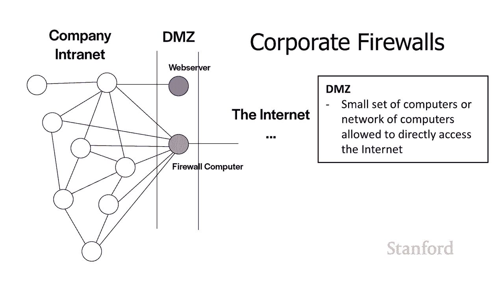

上网，上网，现代计算机也，现代计算机也，有个人防火墙，所以，有个人防火墙，所以，即使你知道你们中的一些人会，即使你知道你们中的一些人会，工作 对于，工作 对于，有防火墙但你们都有，有防火墙但你们都有。

电脑的公司，电脑的公司，嗯，嗯，你们很多，你们很多，人都，undefined，undefined，undefined，undefined，很好 操作系统，很好 操作系统，在这一点上，在这一点上。

所以个人防火墙的，所以个人防火墙的，行为类似于我们一分钟，行为类似于我们一分钟，前看到的企业防火墙，所以，前看到的企业防火墙，所以，首先让我们看一下，首先让我们看一下，情况 没有防火墙也。

情况 没有防火墙也，没有防火墙 你的所有程序都，没有防火墙 你的所有程序都，只是直接，只是直接，undefined，undefined，与互联网通信，互联网直接，与互联网通信，互联网直接。

与你的程序通信，与你的程序通信，个人防火墙所做的，个人防火墙所做的，又是典型的操作系统的一部分，又是典型的操作系统的一部分，undefined，undefined，这将充当，这将充当，所有，所有。

流量来自的中介 您计算机上的程序，流量来自的中介 您计算机上的程序，需要通过个人防火墙，需要通过个人防火墙，个人防火墙会，个人防火墙会，说，说，是的，您有权发送此，是的，您有权发送此，信息，或者，信息。

或者，我不知道您在做什么，您，我不知道您在做什么，您，不允许发送信息，并且，不允许发送信息，并且，所以这里的想法，所以这里的想法，是让我们说在，是让我们说在，你的计算机上安装了一些分流的东西，比如。

你的计算机上安装了一些分流的东西，比如，你跑了一匹宝马或者什么，你跑了一匹宝马或者什么，现在你有了这个程序，它是一个，现在你有了这个程序，它是一个，键盘记录器，键盘记录器，呃希望个人防火墙会。

呃希望个人防火墙会，阻止那个键盘记录器发送，阻止那个键盘记录器发送，向黑客，向黑客，发送信息，嗯，你知道它会尝试，发送信息，嗯，你知道它会尝试，在互联网上发送信息，在互联网上发送信息，希望个人防火墙会。

希望个人防火墙会，像，像，嗯，你不是 你不被允许从计算机发送，嗯，你不是 你不被允许从计算机发送，信息，信息，所以我不知道，所以我不知道，你在做什么，但我，你在做什么，但我，不会让你这样做类似的。

不会让你这样做类似的，人们一直试图，人们一直试图，进入计算机，进入计算机，特别是如果你有，特别是如果你有，一个每天 24 小时运行的服务器，一个每天 24 小时运行的服务器，我，我，在宿舍里与。

在宿舍里与，负责计算机和宿舍的，undefined，undefined，undefined，不同学生交谈过，不同学生交谈过，试图继续，试图继续，所以个人防火墙，所以个人防火墙，在相反方向上的作用是。

在相反方向上的作用是，它只允许数据包通过，它只允许数据包通过，那些你当前使用的服务，那些你当前使用的服务，所以你知道我的电脑，所以你知道我的电脑，不使用，不使用，ftp，它们不充当 ftp 服务器。

所以，ftp，它们不充当 ftp 服务器，所以，如果有人，如果有人，尝试使用，尝试使用，安全的 ftp 协议访问，安全的 ftp 协议访问，我的计算机，我的防火墙应该说，我的计算机，我的防火墙应该说。

我们不是一个安全的 uh ftp，我们不是一个安全的 uh ftp，服务器我不知道你为什么认为你正在，服务器我不知道你为什么认为你正在，访问它但很明显，访问它但很明显，你的流量是不需要的你是最。

你的流量是不需要的你是最，可能运行我 对于，可能运行我 对于，您过去必须，您过去必须，明确打开这些功能的个人防火墙，但，明确打开这些功能的个人防火墙，但，此时我认为所有，此时我认为所有，操作系统都在。

操作系统都在，默认情况下运行它们，默认情况下运行它们，undefined，undefined，当您安装新程序时，您最有可能遇到防火墙，当您安装新程序时，您最有可能遇到防火墙，undefined。

undefined，因此通常会发生什么 如果，因此通常会发生什么 如果，你正在安装一个，你正在安装一个，需要使用互联网的程序，比如，需要使用互联网的程序，比如，我听到这个很酷的新游戏。

我听到这个很酷的新游戏，呃你知道我的朋友想让我，呃你知道我的朋友想让我，和他们一起玩，所以我继续安装在，和他们一起玩，所以我继续安装在，我的电脑，我的电脑，上，以便 我，上，以便 我。

和我的朋友一起玩这个游戏，和我的朋友一起玩这个游戏，嗯它需要从，嗯它需要从，我的计算机发送信息所以，我的计算机发送信息所以，防火墙软件会说好的，防火墙软件会说好的，帕特里克，帕特里克。

你正在尝试运行这个游戏而且，你正在尝试运行这个游戏而且，它询问它是否可以，它询问它是否可以，将信息发送到互联网，将信息发送到互联网，应该我 继续并，应该我 继续并，批准此特定程序的互联网访问权限。

批准此特定程序的互联网访问权限，然后您可以说，然后您可以说，是的，undefined，undefined，undefined，undefined，undefined，到互联网，到互联网，进行更新，这。

进行更新，这，通常是一件好事，但它并不，通常是一件好事，但它并不，总是很清楚，总是很清楚，所以嗯，是的，我没有任何好的，所以嗯，是的，我没有任何好的，建议，建议，但当然，如果您有，但当然，如果您有。

要求访问互联网，要求访问互联网，的东西，并且您认为这不是您，的东西，并且您认为这不是您，安装，安装，的东西 至少你应该继续，的东西 至少你应该继续，谷歌它有时它会，谷歌它有时它会。

是一个预先存在的程序的一部分所以例如，是一个预先存在的程序的一部分所以例如，undefined，undefined，嗯我运行adobe产品这就是我，嗯我运行adobe产品这就是我。

现在制作这个视频的方式，现在制作这个视频的方式，嗯你正在看的这个图表，嗯你正在看的这个图表，是创建的 photoshop，是创建的 photoshop，你现在正在听的这个视频，你现在正在听的这个视频。

是用 adobe Premiere 完成，undefined，undefined，undefined，undefined，undefined，undefined，的 它不会关闭，因为这些。

的 它不会关闭，因为这些，adobe 的东西不会停止，adobe 的东西不会停止，运行，我就像我不知道，运行，我就像我不知道，这些东西是什么，这些东西是什么，它们不是，它们不是，应用程序的名称。

结果它们，应用程序的名称，结果它们，就像，就像，adobe 的帮助程序 已安装，adobe 的帮助程序 已安装，undefined，undefined，所以肯定有可能，所以肯定有可能。

在您的计算机上安装某些东西，在您的计算机上安装某些东西，并要求访问互联网并且，并要求访问互联网并且，实际上是合法的，实际上是合法的，但如果您，但如果您，不确定它是什么，您肯定不记得，不确定它是什么。

您肯定不记得，最近安装了一些超级东西，最近安装了一些超级东西，即使您这样做了，也可以使用谷歌搜索 这不是，即使您这样做了，也可以使用谷歌搜索 这不是，要求访问互联网的内容，无论如何你应该。

要求访问互联网的内容，无论如何你应该，仔细检查它，仔细检查它。

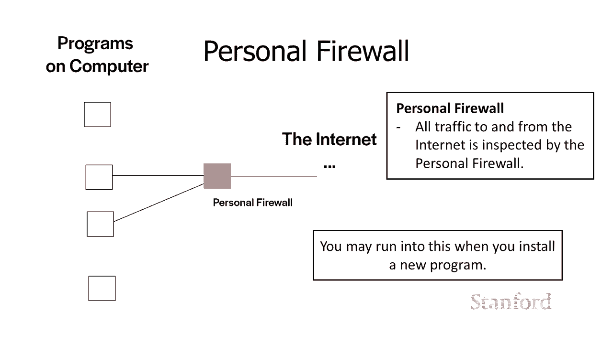

，所以这是个人，所以这是个人，防火墙，防火墙，好的，我们的下一个主题是代理服务器，好的，我们的下一个主题是代理服务器，undefined，undefined，允许，允许，试图访问资源的人，而他们不是。

undefined，undefined，无论如何都能够直接访问该资源，所以，无论如何都能够直接访问该资源，所以，我将使用一个示例来，我将使用一个示例来，尝试访问，尝试访问。

我们通常可以从斯坦福访问的内容，我们通常可以从斯坦福访问的内容，但还有其他几种，但还有其他几种，情况可以使用它，我将，情况可以使用它，我将，讨论 一分钟，讨论 一分钟，后就可以了所以呃让我们。

后就可以了所以呃让我们，说斯坦福支付的资源有限，说斯坦福支付的资源有限，例如，例如，如果您正在寻找有关计算机，如果您正在寻找有关计算机，科学的书籍，那么您正在尝试学习新的，科学的书籍。

那么您正在尝试学习新的，程序 amming 语言你想了解，程序 amming 语言你想了解，更多关于 html 和 css，更多关于 html 和 css，作为斯坦福的附属你可以。

作为斯坦福的附属你可以，访问 safari 在线它提供，访问 safari 在线它提供，了大量关于，了大量关于，计算机相关主题的大量书籍它实际上是一个，计算机相关主题的大量书籍它实际上是一个。

非常好的资源，非常好的资源，所以如果我尝试访问 safari 在线，所以如果我尝试访问 safari 在线，我在校园里 safari，我在校园里 safari，online，online。

可以查看谁在尝试访问它，可以查看谁在尝试访问它，我可以说哦，这是一台斯坦福，我可以说哦，这是一台斯坦福，计算机，斯坦福，计算机，斯坦福，undefined，undefined，我们的资源，所以我将继续。

我们的资源，所以我将继续，并让该请求通过，并让该请求通过，所以这很好用，然后，所以这很好用，然后，校园里的其他人试图访问，校园里的其他人试图访问，它，它，同样的东西，所以它真正做，同样的东西。

所以它真正做，的是查看ip号码，正如，的是查看ip号码，正如，我们现在都知道的，我们现在都知道的，斯坦福计算机的ip号码，斯坦福计算机的ip号码，都有相同的，都有相同的，初始前缀号码和 所以。

初始前缀号码和 所以，很容易让，很容易让，像 safari 在线服务器这样的计算机，像 safari 在线服务器这样的计算机，告诉，告诉，哦，这是一台标准计算机，现在，哦，这是一台标准计算机，现在。

假设我不再，假设我不再，在校园里，我在家里，在校园里，我在家里，undefined，undefined，如果你住在校园里，现在会发生什么 你，如果你住在校园里，现在会发生什么 你，仍然是金子。

但如果你不住在，仍然是金子，但如果你不住在，校园里，那就有点问题了，校园里，那就有点问题了，所以斯坦福，所以斯坦福，为我们这些不住在校园里的人提供的支持，为我们这些不住在校园里的人提供的支持。

是他们运行所谓的代理服务器，是他们运行所谓的代理服务器，以及代理服务器的运行方式 去，以及代理服务器的运行方式 去，undefined，undefined，我没有使用代理服务器，我。

我没有使用代理服务器，我，试图，试图，从我的电脑访问这个资源，这是在 comcast，从我的电脑访问这个资源，这是在 comcast，发生的事情是我，发生的事情是我，直接，直接，从家里的电脑访问该资源。

从家里的电脑访问该资源，资源，资源，说 safari online 说 我不知道，说 safari online 说 我不知道，你是谁我不认识你的 IP，你是谁我不认识你的 IP，号码，号码。

你的信用卡号码是什么所以这，你的信用卡号码是什么所以这，不起作用，不起作用，除非你显然购买了一个个人帐户，除非你显然购买了一个个人帐户，如果你，如果你，创建一个个人 uh safari 在线。

创建一个个人 uh safari 在线，帐户并用你，帐户并用你，自己的付款 信用卡，他们很乐意这样，自己的付款 信用卡，他们很乐意这样，做，但您不能使用，做，但您不能使用。

stanford access，因为您不是，stanford access，因为您不是，stanford 计算机，所以我们在，stanford 计算机，所以我们在，这里要做的，这里要做的。

不是直接访问我们的受限，不是直接访问我们的受限，资源，资源，而是我们要去 通过访问它，而是我们要去 通过访问它，代理服务器，所以我们将我们的，代理服务器，所以我们将我们的，请求发送到代理。

请求发送到代理，服务器代理服务器将请求发送，服务器代理服务器将请求发送，到受限，到受限，资源受限资源将查看请求来自的，资源受限资源将查看请求来自的，iep 编号，iep 编号，它会说哦它，它会说哦它。

来自我们的代理，来自我们的代理，它 不一定知道它是，它 不一定知道它是，处理器，但它说，处理器，但它说，哦，它来自一个 stanford ip 号码，哦，它来自一个 stanford ip 号码。

因为代理服务器是一个，因为代理服务器是一个，stanford ip 号码。undefined，undefined，undefined，undefined，代理服务器和代理服务器，代理服务器和代理服务器。

将继续将数据发送，将继续将数据发送，回给我，所以 um，回给我，所以 um，stanford 确实运行了一个代理服务器，stanford 确实运行了一个代理服务器，这就是您可以，这就是您可以。

访问各种不同资源的方式，嗯，访问各种不同资源的方式，嗯，代理服务器还有哪些其他用途，代理服务器还有哪些其他用途，我提到过 早些时候，我提到过 早些时候，关于为一家不希望，关于为一家不希望。

我们将计算机用于，我们将计算机用于，个人目的的公司工作，个人目的的公司工作，防火墙可以做的另一件事是它可以阻止，防火墙可以做的另一件事是它可以阻止，访问诸如体育插图，访问诸如体育插图。

或让 假设有斯坦福大学的，或让 假设有斯坦福大学的，比赛正在进行，你被困在，比赛正在进行，你被困在，工作中，你在周末工作，工作中，你在周末工作，你就像我觉得我应该能够，undefined。

undefined，很好地访问这个你可以做什么并且要非常，很好地访问这个你可以做什么并且要非常，小心 这是因为，小心 这是因为，嗯，它真的会被激怒，嗯，它真的会被激怒，你的公司也会被激怒。

你的公司也会被激怒，所以，所以，不要这样做，除非你确定，不要这样做，除非你确定，你的老板没问题，你的老板没问题，呃你知道如果你，呃你知道如果你，周末工作他们可能会，周末工作他们可能会。

undefined，undefined，无论如何都没关系，所以你可以做的是你，无论如何都没关系，所以你可以做的是你，可以使用代理服务器并发送您的，可以使用代理服务器并发送您的，请求以，请求以。

通过代理服务器观看比赛并让，通过代理服务器观看比赛并让，代理服务器将您的请求转发到，代理服务器将您的请求转发到，espn然后，espn然后，绕过限制，绕过限制，能够以这种方式直接访问 espn。

能够以这种方式直接访问 espn，嗯，这也曾经被用来，嗯，这也曾经被用来，绕过中国的伟大防火墙，绕过中国的伟大防火墙，所以这个想法是中国基本上阻止，所以这个想法是中国基本上阻止，访问，访问，任何让。

任何让，政府看起来很糟糕的东西，政府看起来很糟糕的东西，所以他们不希望你能够，所以他们不希望你能够，阅读纽约时报，阅读纽约时报，和 我希望你能够阅读，和 我希望你能够阅读，华盛顿邮报，例如，华盛顿邮报。

例如，如果你在中国，你过去，如果你在中国，你过去，可以通过发送到达纽约时报的请求而不是直接发送来解决这个问题，undefined，undefined，因为你直接发送，因为你直接发送，了控制访问的计算机。

了控制访问的计算机，在中国境内外会查看并说，在中国境内外会查看并说，您不允许访问，您不允许访问，纽约时报，纽约时报，因此您会做的，因此您会做的，是您将访问代理服务器并，是您将访问代理服务器并，说，说。

代理服务器可以向，代理服务器可以向，纽约时报发送请求，纽约时报发送请求，然后代理服务器会，然后代理服务器会，访问纽约时报纽约时报会将文章发送，undefined，undefined，到代理服务器。

代理服务器，到代理服务器，代理服务器，会将其发回，只要，会将其发回，只要，undefined，undefined，中国的防火墙不，中国的防火墙不，知道，知道，该特定代理服务器就不会。

该特定代理服务器就不会，注意到 ip 号码，注意到 ip 号码，是一个问题，而如果它看到，是一个问题，而如果它看到，纽约时代的 ip 地址，我会，纽约时代的 ip 地址，我会，认为，认为，这是不允许的。

但不幸的是，这是不允许的，但不幸的是，中国伟大的防火墙变得，中国伟大的防火墙变得，越来越复杂，越来越复杂，所以这是基因 集会不再，所以这是基因 集会不再，工作了，代理，工作了，代理，undefined。

undefined，服务器的另一个问题是流量没有，服务器的另一个问题是流量没有，加密，所以，加密，所以，无论你是试图绕过中国的，无论你是试图绕过中国的，伟大防火墙，还是，伟大防火墙，还是。

因为你正在工作而试图访问 espn，因为你正在工作而试图访问 espn，周末，你想，undefined，undefined，在这两种情况下收听比赛大比赛，在这两种情况下收听比赛大比赛，请求将以。

请求将以，所谓的明文形式进行，所谓的明文形式进行，所以如果防火墙足够聪明，它，所以如果防火墙足够聪明，它，可以继续说，嘿，可以继续说，嘿，我看到你了。 将这个发送到这个，我看到你了。 将这个发送到这个。

ip 号码我不知道那不是，ip 号码我不知道那不是，espn。com 但如果我，espn。com 但如果我，扫描你的请求的文本我可以，扫描你的请求的文本我可以，看到这里有对 espn。com 的引用。

undefined，undefined，无论如何这是怎么回事所以这是一个潜在的借口，无论如何这是怎么回事所以这是一个潜在的借口，使用代理服务器，但，使用代理服务器，但，您知道访问，您知道访问。

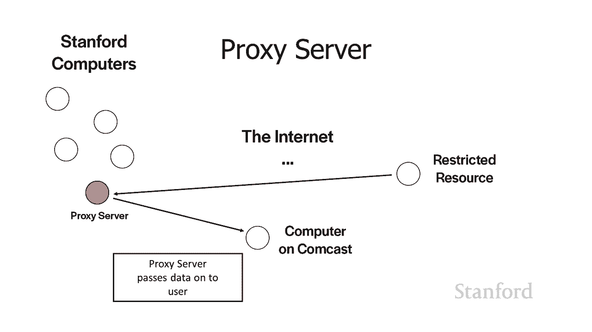

斯坦福大学支付的资源之类的事情，当，斯坦福大学支付的资源之类的事情，当，您在校外时代理服务器工作得，您在校外时代理服务器工作得，很好，很好，嗯，嗯，虚拟专用网络会发生更复杂的情况，呃。

虚拟专用网络会发生更复杂的情况，呃，vpns 可用于，vpns 可用于，某些与以下相同的事情 代理 服务器，某些与以下相同的事情 代理 服务器，但它们也可以用于其他一些，但它们也可以用于其他一些，目的。

所以，目的，所以，嗯，假设我们有一家公司，嗯，假设我们有一家公司，它拥有公司内部网，嗯，基本上是公司内部网，它拥有公司内部网，嗯，基本上是公司内部网，中的所有流量，中的所有流量，undefined。

undefined，记住，记住，内部网是使用互联网协议的内部网络，undefined，undefined，公司互联网中的所有流量，公司互联网中的所有流量，都是呃，都是呃，我们并不担心流量。

我们并不担心流量，我们假设，我们假设，公司内部没有人在，公司内部没有人在，做他们回避的事情，做他们回避的事情，试图窃取我们的数据 我们的信息，试图窃取我们的数据 我们的信息，但我们担心所有这些。

但我们担心所有这些，外面的信息，这就是为什么我们现在，外面的信息，这就是为什么我们现在，有防火墙计算机的原因，有防火墙计算机的原因，假设嗯我们，假设嗯我们，在不同的位置设立了一个不同的办公室。

在不同的位置设立了一个不同的办公室，嗯通常我使用香港作为我的，嗯通常我使用香港作为我的，位置但考虑，位置但考虑，到香港目前的情况他们，到香港目前的情况他们，可能不是 最好的例子，但是。

可能不是 最好的例子，但是，嗯，好吧，假设我们使用，嗯，好吧，假设我们使用，东京，假设我们在东京设立了一个办公室，东京，假设我们在东京设立了一个办公室，undefined，undefined。

那么现在的问题是我们有一个，那么现在的问题是我们有一个，帕洛阿尔托办公室，我们有 我们，帕洛阿尔托办公室，我们有 我们，在帕洛阿尔托的企业互联网，在帕洛阿尔托的企业互联网。

然后我们在东京有一个企业互联网，undefined，undefined，我们如何将两者连接，我们如何将两者连接，在一起以及当数据，在一起以及当数据，从一个办公室发送到下一个，从一个办公室发送到下一个。

办公室时会发生什么 如果我们是我们可以做的最安全的事情，办公室时会发生什么 如果我们是我们可以做的最安全的事情，真正关心安全的是，真正关心安全的是，undefined，undefined，有人可以。

有人可以，在我们的谈话中，在我们的谈话中，实际窃听的唯一方法是现在，实际窃听的唯一方法是现在，明确地接入线路，这在技术上是，明确地接入线路，这在技术上是，可行的，但实际，可行的，但实际，接入线路取决于。

接入线路取决于，我们的攻击者的复杂程度，我们的攻击者的复杂程度，但是，是的，这将需要，但是，是的，这将需要，大量的工作，大量的工作，否则如果我们不这样做，否则如果我们不这样做，这里将发生的事情是。

这里将发生的事情是，当，当，我们从帕洛阿尔托办公室和东京，我们从帕洛阿尔托办公室和东京，办公室发送信息时，办公室发送信息时，我们将只使用互联网，我们将只使用互联网，发送信息，因为，发送信息，因为。

这是迄今为止，这是迄今为止，租用我们自己的线路最便宜的事情，或者，租用我们自己的线路最便宜的事情，或者，更糟的是，铺设我们自己的线路，更糟的是，铺设我们自己的线路，会非常昂贵，会非常昂贵。

所以我们只是去你 看到互联网，所以我们只是去你 看到互联网，但事情是这样的，假设我们有，但事情是这样的，假设我们有，两台计算机，两台计算机，通过互联网发送信息，通过互联网发送信息。

一台在我们的帕洛阿尔托办公室，另一台，一台在我们的帕洛阿尔托办公室，另一台，在我们的东京办公室，在我们的东京办公室，那么，那么，当流量发送良好时，我们公司以外的人会做，undefined。

undefined，什么？ 一切都是因为它都是，什么？ 一切都是因为它都是，通过 ip 数据包发送的，如果，通过 ip 数据包发送的，如果，有人，有人，在我们的计算机和，在我们的计算机和。

我们将其发送给的计算机之间，我们将其发送给的计算机之间，他们必须在，undefined，undefined，我们的 iep 数据包通过他们发送的那条链或计算机序列。

我们的 iep 数据包通过他们发送的那条链或计算机序列，上，上，他们将看到的所有内容都将看到发件人是谁，他们将看到的所有内容都将看到发件人是谁，他们将看到收件，他们将看到收件，人是谁 除非内容被。

人是谁 除非内容被，明确加密 他们现在也将，明确加密 他们现在也将，能够看到内容，能够看到内容，你可以做的一件事就是你可以，你可以做的一件事就是你可以，只是加密所有信息，只是加密所有信息，但嗯。

可能只是知道，但嗯，可能只是知道，谁的计算机正在向谁的计算机发送信息，undefined，undefined，他们可能能够获得大量，他们可能能够获得大量，信息，例如，他们，信息，例如，他们，知道公司。

知道公司，正在发送信息 很多呃数据包，正在发送信息 很多呃数据包，到计算机呃，到计算机呃，由收购主管拥有他们可能，由收购主管拥有他们可能，就像哦那家公司即将进行，就像哦那家公司即将进行。

收购让我们看看我们如何，收购让我们看看我们如何，利用这一点，利用这一点，所以你真正想做的是你，所以你真正想做的是你，想要确保 人们无法，想要确保 人们无法，识别哪些特定计算机正在。

识别哪些特定计算机正在，向哪些其他特定计算机发送数据，向哪些其他特定计算机发送数据，undefined，undefined，然后另外两台您希望，然后另外两台您希望，数据始终加密，数据始终加密。

而不必让人们，而不必让人们，明确加密他们的数据，因此，明确加密他们的数据，因此，虚拟专用网络将，虚拟专用网络将，实际处理 当我将信息从网络一部分的计算机发送到网络另一部分的计算机时，这两种方法。

实际处理 当我将信息从网络一部分的计算机发送到网络另一部分的计算机时，这两种方法，以及这种方法的工作方式都是，以及这种方法的工作方式都是，使用虚拟专用网络，使用虚拟专用网络，undefined。

undefined，undefined，undefined，我的信息将，我的信息将，通过计算机 dmz 和那台，通过计算机 dmz 和那台，计算机将，计算机将，加密所有信息，它，加密所有信息，它。

不仅会加密，不仅会加密，我发送的实际数据，我发送的实际数据，还会加密，还会加密，sen 的 IP 号码 der 和，sen 的 IP 号码 der 和，收件人，收件人，的 ip 号 它将。

的 ip 号 它将，用自身，用自身，替换发件人的 ip 号，并将，替换发件人的 ip 号，并将，用另一侧的等效 dmz 计算机替换收件人的 ip 号，undefined，undefined。

然后我们将要做什么，然后我们将要做什么，它会继续，它会继续，undefined，undefined，将该数据包发送到东京办公室的另一台 dmz 计算机吗？undefined，undefined。

东京办公室的 dmz 计算机，东京办公室的 dmz 计算机，将解密所有信息，将解密所有信息，从而揭示原始发件人，从而揭示原始发件人，和原始收件人，和原始收件人，然后解密信息 在，然后解密信息 在。

数据包中，数据包中，然后它会被传递到，然后它会被传递到，undefined，undefined，只要互联网上的，只要互联网上的，人能够看到他们会看到两台，人能够看到他们会看到两台。

dmz 计算机正在通信，所以，dmz 计算机正在通信，所以，他们会看到东京办公室，他们会看到东京办公室，和帕洛阿尔托办公室正在，和帕洛阿尔托办公室正在，通信，但他们不知道哪些，通信，但他们不知道哪些。

特定的计算机正在通信，特定的计算机正在通信，他们将无法识别，他们将无法识别，正在发生的通信类型，正在发生的通信类型，这是另一回事，呃，这是另一回事，呃，可能人们可以，可能人们可以，undefined。

undefined，在没有 vpn 的情况下与另一个人看到另一个人，这就像这是，在没有 vpn 的情况下与另一个人看到另一个人，这就像这是，一种什么样的通信，一种什么样的通信，他们根本无法看到。

他们根本无法看到，内容所以呃大赢，内容所以呃大赢，嗯所以除了允许我们，嗯所以除了允许我们，连接两个不同的办公室作为 如果我们，连接两个不同的办公室作为 如果我们，有一个大，有一个大，网络，而不必担心。

网络，而不必担心，信息通过互联网传输时会发生什么，信息通过互联网传输时会发生什么，而，而，不必担心那里的安全性，不必担心那里的安全性，这也可以通过，这也可以通过，单独的计算机来完成，这样。

单独的计算机来完成，这样，你就知道我是在家工作还是，你就知道我是在家工作还是，呃，呃，我在路上，我在，我在路上，我在，我的，我的，酒店工作，这种工作方式是我的电脑，酒店工作，这种工作方式是我的电脑，将。

将，所有东西打包并加密，所有东西打包并加密，然后将其发送到，然后将其发送到，dmz 办公室的电脑，然后在，dmz 办公室的电脑，然后在。

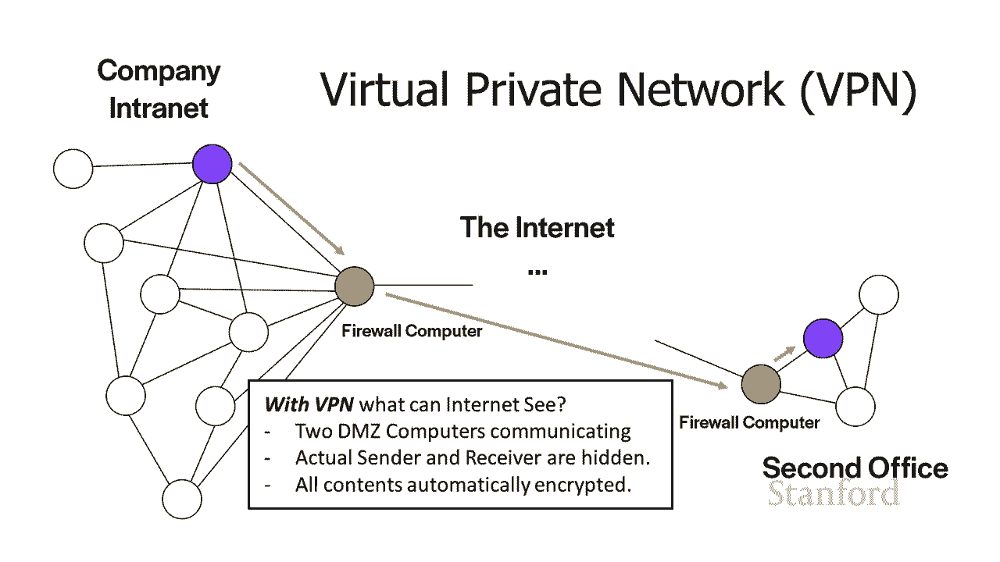

那里解密，那里解密，你也可以 听说私人 vpn，你也可以 听说私人 vpn，这是目前一个相对热门的，这是目前一个相对热门的，话题嗯，所以为什么有人想要，话题嗯，所以为什么有人想要，undefined。

undefined，个人 vpn 或者，个人 vpn 或者，我认为，我认为，人们获得这些的主要原因可能是，人们获得这些的主要原因可能是，它隐藏了你的互联网活动，它隐藏了你的互联网活动。

互联网服务提供商或，互联网服务提供商或，任何其他邪恶的政党，任何其他邪恶的政党，嗯，所以，嗯，所以，这里的想法是，这里的想法是，你可能想要这样做的原因之一是，你可能想要这样做的原因之一是，事实，事实。

证明特朗普政府已经改变了，证明特朗普政府已经改变了，规则，所以，规则，所以，我们的互联网服务提供商喜欢 康卡斯特现在可以将，我们的互联网服务提供商喜欢 康卡斯特现在可以将，我们的网络浏览信息出售给任何。

我们的网络浏览信息出售给任何，想要付费的人，现在大多数，想要付费的人，现在大多数，主要的互联网服务提供商都承诺他们不会这样做，主要的互联网服务提供商都承诺他们不会这样做，尽管实际上我想我。

尽管实际上我想我，会说，尽管，会说，尽管，鉴于目前的情况他们，鉴于目前的情况他们，可能做得不好 在财务上，他们可能会，可能做得不好 在财务上，他们可能会，改变主意，改变主意，这总是有可能的。

这总是有可能的，尽管，尽管，我会认为在当前，我会认为在当前，情况下，互联网服务提供商，情况下，互联网服务提供商，undefined，undefined，可能做得很好，我的意思是您，可能做得很好。

我的意思是您，必须选择，必须选择，一家企业从事支持业务，undefined，undefined，undefined，无论如何，在家工作的人可能是一项不错的业务，所以呃底线是，无论如何。

在家工作的人可能是一项不错的业务，所以呃底线是，他们现在可以出售，他们现在可以出售，有关您所有互联网习惯的信息，有关您所有互联网习惯的信息，嗯大部分 主要的互联网服务，嗯大部分 主要的互联网服务。

提供商已经承诺他们不会那样做，提供商已经承诺他们不会那样做，但是现在法律允许他们，但是现在法律允许他们，这样做，所以也许您不希望这种，这样做，所以也许您不希望这种，情况发生，情况发生。

所以如果您与 vpn 签约，所以如果您与 vpn 签约，那么就 comcast 而言会发生什么，那么就 comcast 而言会发生什么，看到或您知道，看到或您知道，att 或您的提供商是谁。

att 或您的提供商是谁，他们只会看到您正在，他们只会看到您正在，与 vpn 通信，与 vpn 通信，您想与之交谈的最终服务器是，undefined，undefined，对他们隐藏的 他们只会看到。

对他们隐藏的 他们只会看到，从您发送到您的，从您发送到您的，undefined，undefined，个人 vpn 的加密数据包 也可以用来，个人 vpn 的加密数据包 也可以用来，模拟在不同的国家。

所以，模拟在不同的国家，所以，如果 vpn 在不同的国家有连接，如果 vpn 在不同的国家有连接，你可以说，你可以说，哦，我想连接到 vpn 并，哦，我想连接到 vpn 并，假装我在，假装我在，东京。

或者我想假装我在，东京，或者我想假装我在，澳大利亚，澳大利亚，嗯和 所以会发生什么是，嗯和 所以会发生什么是，你的信息会被捆绑，但，你的信息会被捆绑，但，我们会被发送，我们会被发送。

到 vpn 并且 vpn 将，到 vpn 并且 vpn 将，在澳大利亚，在澳大利亚，或东京或任何地方有一个服务器，或东京或任何地方有一个服务器，你为什么要做好，你为什么要做好，这件事。

它可以用于 在某些，这件事，它可以用于 在某些，情况下，情况下，您可以访问，您可以访问，区域记录的编队，区域记录的编队，所以呃这并不适用于每个人，所以呃这并不适用于每个人，嗯，嗯。

所以你应该四处看看并做你的，所以你应该四处看看并做你的，研究，研究，呃以确保，呃以确保，你正在寻找的资源，你正在寻找的资源，将允许 vpns 访问我的，将允许 vpns 访问我的。

印象是一些 vpns 做一点，印象是一些 vpns 做一点，比其他 vpns 好，但现在，比其他 vpns 好，但现在，可能，可能，有一个电视节目你真的，有一个电视节目你真的，想看，它在欧洲可用，想看。

它在欧洲可用，但在美国不可用，如果，但在美国不可用，如果，你尝试直接从美国访问，你尝试直接从美国访问，他们说嘿，他们说嘿，这是一个美国的 ip 号码，我们不是'  t 授权，这是一个美国的 ip 号码。

我们不是'  t 授权，给呃，给呃，向美国的人展示这个，向美国的人展示这个，undefined，undefined，呃所以如果你的 vpn 允许你假装，undefined，undefined。

说你在意大利然后你，说你在意大利然后你，就连接到 vpn，就连接到 vpn，只要服务提供商看到，只要服务提供商看到，你来 从意大利开始就好了，你来 从意大利开始就好了，我可以继续向，我可以继续向。

您展示这个节目，您展示这个节目，与 vpns 的问题是相关的，与 vpns 的问题是相关的，或者 vpns 可能被各种，或者 vpns 可能被各种，网站或各种流媒体，网站或各种流媒体，服务阻止，因此。

服务阻止，因此，流媒体服务可能会像这样，流媒体服务可能会像这样，副总裁，副总裁，嗯，这似乎有点粗略，嗯，这似乎有点粗略，我想知道您是否试图绕过，我想知道您是否试图绕过，我们的区域锁定，我不会向。

我们的区域锁定，我不会向，您展示任何视频还有一些金融，您展示任何视频还有一些金融，网站会阻止您，网站会阻止您，这基本上是因为他们知道，undefined，undefined。

vpns 隐藏了信息的来源 来自，vpns 隐藏了信息的来源 来自，他们就像你可能是一名黑客，他们就像你可能是一名黑客，这看起来有点草图，undefined，undefined，如果你来自，如果你来自。

我认为通常合法的服务提供商，我才会让你进入，我认为通常合法的服务提供商，我才会让你进入，就像，就像，undefined，undefined，另一个问题，另一个问题，vpns 是您，vpns 是您。

遇到那些烦人的，遇到那些烦人的，验证码的可能性更大，您必须在其中输入单词，验证码的可能性更大，您必须在其中输入单词，或必须单击，或必须单击，您知道单击人行横道的东西，您知道单击人行横道的东西，嗯。

这又是因为，嗯，这又是因为，undefined，undefined，网站就像您一样 来自，网站就像您一样 来自，vpn 这可能比，vpn 这可能比，您来自常规服务，您来自常规服务。

提供商的情况要粗略得多，提供商的情况要粗略得多，我想确保您是一个，我想确保您是一个，真正的人，而不是，真正的人，而不是，试图入侵网站的计算机或计算机 g，试图入侵网站的计算机或计算机 g。

undefined，undefined，执行分布式拒绝服务，执行分布式拒绝服务，攻击，所以，攻击，所以，你知道向我证明你是，你知道向我证明你是，undefined，undefined。

虽然 vpns 确实有一些优势，虽然 vpns 确实有一些优势。

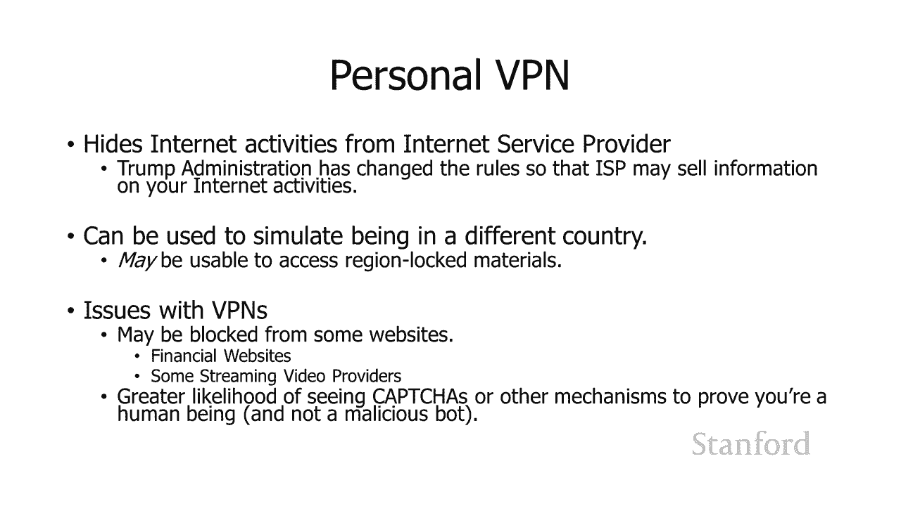

个人 vpns 确实有一些优势，个人 vpns 确实有一些优势，undefined，undefined，问题 如果你能做些什么，问题 如果你能做些什么，想要，想要，为您的计算系统提供最大的安全性。

您应该，为您的计算系统提供最大的安全性，您应该，只使用气隙，只使用气隙，气隙是我们在，气隙是我们在，计算机与网络完全断开连接时使用的术语，计算机与网络完全断开连接时使用的术语，因此有一个物理井。

因此有一个物理井，在有 Wi-Fi 之前效果更好，在有 Wi-Fi 之前效果更好，有物理间隙 在你的，有物理间隙 在你的，电脑和互联网之间，电脑和互联网之间，呃，这也意味着你不应该，呃。

这也意味着你不应该，有 wi-fi 或蓝牙或任何，有 wi-fi 或蓝牙或任何，其他允许你远程访问它的东西，其他允许你远程访问它的东西，所以只提供一个例子，假设，所以只提供一个例子，假设，斯坦福非常。

斯坦福非常，关心，关心，保护斯坦福的成绩他们能做什么 做得，保护斯坦福的成绩他们能做什么 做得，很好，他们知道，很好，他们知道，在斯坦福大学有各种各样的人，在斯坦福大学有各种各样的人。

各种各样的斯坦福学生，他们可能是，各种各样的斯坦福学生，他们可能是，非常优秀的黑客，所以，非常优秀的黑客，所以，他们就像我们要阻止访问一样，undefined，undefined。

从互联网上的任何地方转到成绩数据库，它只是，从互联网上的任何地方转到成绩数据库，它只是，将完全分离，也许，将完全分离，也许，它有自己的小型，它有自己的小型，内部 Intranet。

但该 Intranet，undefined，undefined，与更广泛的 Internet 完全分离，没有办法，与更广泛的 Internet 完全分离，没有办法，跨越这个差距，跨越这个差距。

而无需亲自露面，然后，而无需亲自露面，然后，呢 我们要做的是，呢 我们要做的是，在周围放置看门狗 假设我们将，在周围放置看门狗 假设我们将，在地下室放置一个旧工会 旧，在地下室放置一个旧工会 旧。

工会我们将拥有看门狗，工会我们将拥有看门狗，你知道在那里寻找卑鄙的人，undefined，undefined，你知道所以我们将阻止，你知道所以我们将阻止，undefined，undefined。

以及您可以访问这台出色计算机的唯一方法，以及您可以访问这台出色计算机的唯一方法，是，如果您出现，是，如果您出现，请向，请向，undefined，undefined，undefined。

警卫出示您的身份证，undefined，undefined，可能很好，因为你，可能很好，因为你，可能听到她的吠叫声相当多，可能听到她的吠叫声相当多，所以这提供了很好的，所以这提供了很好的，安全性。

安全性，因为你知道有人需要亲自到场，undefined，undefined，再次强调你不能使用，再次强调你不能使用，wi-fi 对，wi-fi 对，啊，如果你允许 wi-fi 访问，啊。

如果你允许 wi-fi 访问，有人只是，有人只是，在靠近建筑物的 uh 附近驾驶他们的面包车，在靠近建筑物的 uh 附近驾驶他们的面包车，他们有一群黑客，他们有一群黑客，带着笔记本电脑。

他们访问 wi-fi，带着笔记本电脑，他们访问 wi-fi，网络，所以没有 wi-fi 所有，网络，所以没有 wi-fi 所有，这件事的另一面是什么另一，这件事的另一面是什么另一。

面是完成任何事情真的很痛苦，面是完成任何事情真的很痛苦，所以，所以，回到过去，回到过去，当我提交每个人的成绩时，我们，当我提交每个人的成绩时，我们，真的有这些像扫描仪表一样的。

真的有这些像扫描仪表一样的，气泡，我们必须填写所有，气泡，我们必须填写所有，扫描仪 详细信息，然后我们，扫描仪 详细信息，然后我们，会将它们交给部门管理员，会将它们交给部门管理员，呃，呃。

他或她会把它带到主，他或她会把它带到主，行政大楼，他们会，行政大楼，他们会，阅读它，所以，阅读它，所以，你知道空气间隙给了我最大的，你知道空气间隙给了我最大的，保护，保护，也提供了最大的。

也提供了最大的。

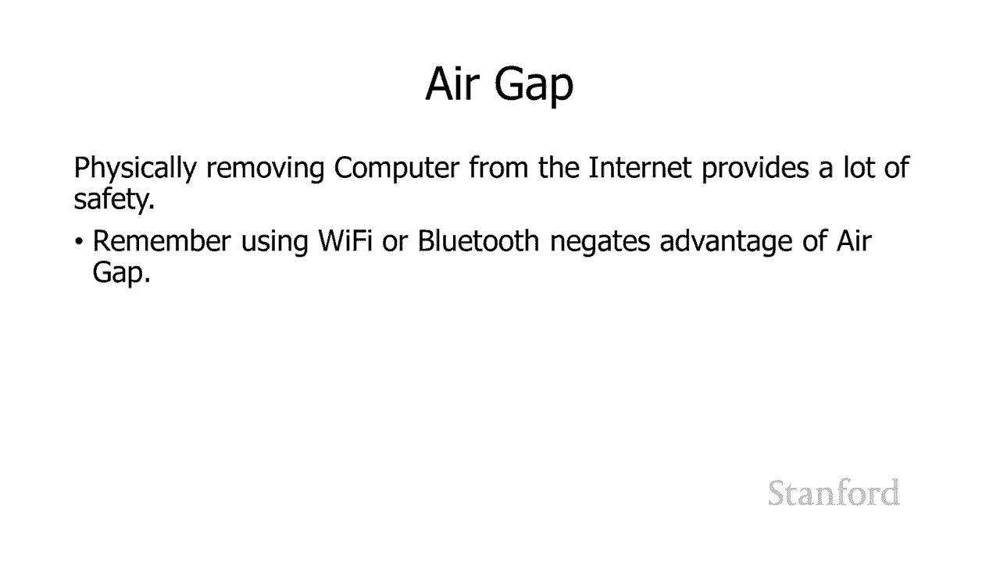

undefined，undefined，好吧 我们讨论了电子邮件的问题，好吧 我们讨论了电子邮件的问题，undefined，undefined，并且有许多安全的电子邮件，并且有许多安全的电子邮件，系统。

但这，系统，但这，不是大多数人使用的，不是大多数人使用的，当，当，您查看安全电子邮件系统，您查看安全电子邮件系统，时要记住的一件事是 安全电子邮件系统的各种，时要记住的一件事是 安全电子邮件系统的各种。

潜在竞争，潜在竞争，目标所以，目标所以，我们想要的一件事是机密性我，我们想要的一件事是机密性我，认为几乎所有人都想要，认为几乎所有人都想要，机密性这意味着，机密性这意味着，呃你，呃你。

知道在更广泛的互联网上的人们实际上无法，知道在更广泛的互联网上的人们实际上无法，看到电子邮件，看到电子邮件，被加密 它是，被加密 它是，通过互联网购物，但，通过互联网购物，但，呃，有些系统需要，呃。

有些系统需要，身份验证，所以，身份验证，所以，我们想确定另一方面，谁发送了这封，我们想确定另一方面，谁发送了这封，特定的电子邮件，特定的电子邮件，嗯，这似乎是，嗯，这似乎是，一件非常明显的事情，当然。

一件非常明显的事情，当然，并不是所有的系统都希望如此，并不是所有的系统都希望如此，不一定是因为，不一定是因为，您可能想要一个，您可能想要一个，安全的电子邮件系统的原因之一是。

安全的电子邮件系统的原因之一是，您知道自己是否是人权，您知道自己是否是人权，活动家，或者，活动家，或者，您知道您的举报人或，您知道您的举报人或，类似的人，类似的人，您希望能够，您希望能够。

安全地向某人发送电子邮件，安全地向某人发送电子邮件，但您不知道 不一定希望它很，但您不知道 不一定希望它很，容易识别你是谁，容易识别你是谁，所以在某些情况下你真的想要，所以在某些情况下你真的想要。

身份验证，身份验证，在其他情况下你真的想要，在其他情况下你真的想要，匿名和隐私，匿名和隐私，在 事实上，一些安全的电子邮件，在 事实上，一些安全的电子邮件，系统确实告诉他们，他们，系统确实告诉他们。

他们，没有记录发送信息的人的 IP 地址，undefined，undefined，嗯，所以再次取决于你在，嗯，所以再次取决于你在，做什么，你可能真的希望这个 IP，做什么，你可能真的希望这个 IP。

地址来验证这个人，地址来验证这个人，真的是 他们说他们是谁，或者你，真的是 他们说他们是谁，或者你，可能想要一个，可能想要一个，不知道你是否是告密者的系统，不知道你是否是告密者的系统。

继续给我发一封电子邮件，就像我，undefined，undefined，在华盛顿邮报工作一样，我想要一个，在华盛顿邮报工作一样，我想要一个，人们可以继续前进并感到自由，人们可以继续前进并感到自由。

的系统 可以向我发送信息，的系统 可以向我发送信息，这将是完全保密的，这将是完全保密的，一个问题是谁有，一个问题是谁有，能力解密信息，能力解密信息，是服务器上的信息解密，是服务器上的信息解密。

服务器是否可以访问密钥，服务器是否可以访问密钥，所以这些都是特别可能出现的问题，所以这些都是特别可能出现的问题，undefined，undefined，在您知道的情况下，您可能，在您知道的情况下。

您可能，身处一个您担心的国家/地区，身处一个您担心的国家/地区，您正在发送，您正在发送，undefined，undefined，有关不应该发生的事情，有关不应该发生的事情，或侵犯人权的信息。

或侵犯人权的信息，并且您担心 政府，并且您担心 政府，会查明你是谁，会查明你是谁，然后对你下手，所以，undefined，undefined，你可能会担心这些不同的事情，你可能会。

你可能会担心这些不同的事情，你可能会，担心，比如，担心，比如，如果这些信息在服务器上并且，如果这些信息在服务器上并且，他们，他们，undefined，undefined，人们将能够，人们将能够。

解密消息或者是，解密消息或者是。

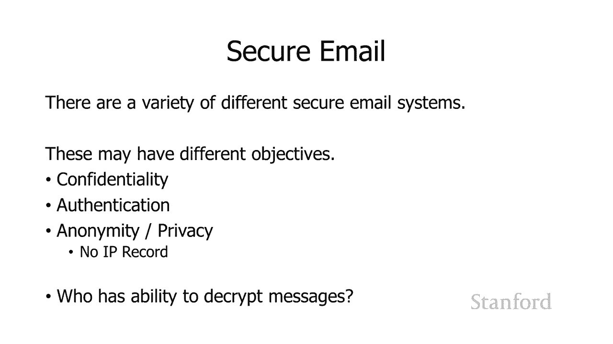

完全安全的，因为他们甚至，完全安全的，因为他们甚至，undefined，undefined，存储数据的公司也没有，存储数据的公司也没有，undefined，undefined，好吧，我之前提到过几次。

好吧，我之前提到过几次，但是，但是，你知道有http，你知道有http，这是http的标准版本，这是http的标准版本，然后是 https，它是一个安全，然后是 https，它是一个安全，版本，版本。

带有标准的常规 http 数据，undefined，undefined，进出网络服务器，以所谓的明文形式发送，undefined，undefined，这意味着它没有使用，这意味着它没有使用。

undefined，undefined，进出服务器的 https 流量，进出服务器的 https 流量，undefined，undefined，某些网络服务器不加密 '不加密所有。

某些网络服务器不加密 '不加密所有，相关数据，相关数据，所以大多数情况下，我认为，所以大多数情况下，我认为，图像可能未加密，图像可能未加密，有时 css，有时 css，可能未加密，这可能会，可能未加密。

这可能会，触发您的警告 网络浏览器，触发您的警告 网络浏览器，因此您的网络浏览器可能会说，因此您的网络浏览器可能会说，嘿，您有一个 https 连接，但请，嘿，您有一个 https 连接，但请，注意。

并非，注意，并非，所有内容都已加密，因此通常，所有内容都已加密，因此通常，这意味着有，这意味着有，一些与网页相关联的其他项目，一些与网页相关联的其他项目，可能未对其进行，可能未对其进行，加密 也可能。

加密 也可能，undefined，undefined，iframe 我们在上一堂课中谈到了 iframe，iframe 我们在上一堂课中谈到了 iframe，你知道我的意思，你知道我的意思。

所以我的意思是有各种不同的，所以我的意思是有各种不同的，情况所以理想情况下你你不，情况所以理想情况下你你不，希望这种情况发生你希望所有东西，希望这种情况发生你希望所有东西，都被，都被，加密，等等 同样。

加密，等等 同样，一些网站同时支持 http 和，一些网站同时支持 http 和，https 但他们不使用 https，https 但他们不使用 https，因为它很昂贵，因为它很昂贵。

基本上加密很昂贵 它需要，基本上加密很昂贵 它需要，处理能力 所以，处理能力 所以，undefined，undefined，我不知道这意味着什么，我不知道这意味着什么，有趣的，有趣的，是。

我刚才所说的触发了 siri，是，我刚才所说的触发了 siri，um 所以，um 所以，加密非常昂贵，它，加密非常昂贵，它，需要处理能力来实际，需要处理能力来实际，加密事物，因此增加了，加密事物。

因此增加了，他们的成本，因为这意味着他们需要，他们的成本，因为这意味着他们需要，更多的 c 计算能力，更多的 c 计算能力，所以呃，这就是为什么，所以呃，这就是为什么，他们不一定加密，他们不一定加密。

所有，所有，东西的原因之一，你可能想要得到的一件事是，东西的原因之一，你可能想要得到的一件事是，有一个来自 eff 基金会的插件，有一个来自 eff 基金会的插件，称为 https 无处不在。

称为 https 无处不在，这个插件将强制使用 https 当，这个插件将强制使用 https 当，它可用时，所以，它可用时，所以，它 '基本上不会，我真的想要，它 '基本上不会，我真的想要。

https，https。

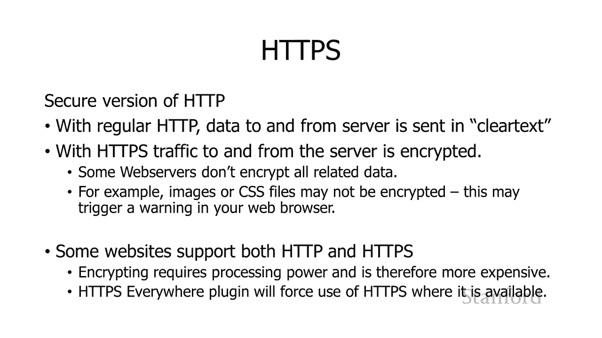

，只要服务器上有 https 可用，只要服务器上有 https 可用，所有信息都将，所有信息都将，undefined，undefined，您可能想做的另一件事是，您可能想做的另一件事是。

禁用 javascript 事实证明，嗯，禁用 javascript 事实证明，嗯，所以有一段时间我有安全性，所以有一段时间我有安全性，博士生是，博士生是，我的 cs105 助教，这是他。

我的 cs105 助教，这是他，最大的建议之一，他说你知道，最大的建议之一，他说你知道，如果你想在互联网上安全计算，如果你想在互联网上安全计算，undefined，undefined。

你能做的最重要的事情就是，你能做的最重要的事情就是，你可以禁用 javascript，你可以禁用 javascript，所以这里的问题是客户端 -  side，所以这里的问题是客户端 -  side。

javascript 可以以各种，javascript 可以以各种，不同的恶意方式，不同的恶意方式，使用，就像我们讨论过，使用，就像我们讨论过，undefined，undefined。

的经常由 javascript 触发的偷渡式下载一样，的经常由 javascript 触发的偷渡式下载一样，undefined，undefined，有时，有时，网络浏览器安全中存在呃漏洞 y。

网络浏览器安全中存在呃漏洞 y，javascript 可能，javascript 可能，涉及操作，因此基本上，涉及操作，因此基本上，禁用 javascript 将大大。

禁用 javascript 将大大，提高您的安全，提高您的安全，性，另一方面它也可能使生活，undefined，undefined，变得非常烦人它使事情变得烦人，因为许多，变得非常烦人它使事情变得烦人。

因为许多，网页需要 javascript 才能实际，网页需要 javascript 才能实际，使用，使用，所以我将向您展示 只是一，所以我将向您展示 只是一，秒钟，但一堆这些工具将，秒钟。

但一堆这些工具将，允许您将某些网站列入白名单，允许您将某些网站列入白名单，这样您就可以在我在纽约时报时说得好，undefined，undefined，我相信纽约时报不会做，我相信纽约时报不会做。

任何他们分流的事情，任何他们分流的事情，所以我要继续 把它，所以我要继续 把它，放在白名单上，嗯，放在白名单上，嗯，我肯定会说，如果你去任何，我肯定会说，如果你去任何，粗略的网站，粗略的网站，呃。

你应该关闭 javascript，呃，你应该关闭 javascript，即使你不打算去粗略的，即使你不打算去粗略的，网站，结果，网站，结果，有时标准的广告，有时标准的广告，网络会，网络会。

以某种方式允许某人把，以某种方式允许某人把，在标准广告网络上将东西作为广告，在标准广告网络上将东西作为广告，投放，投放，呃使用 javascript 来做一些吸引人的。

呃使用 javascript 来做一些吸引人的，东西，所以这是，东西，所以这是，有问题的，有问题的，所以我，所以我，实际上禁用了 java 用于，实际上禁用了 java 用于，网页浏览的脚本。

但这又有点，网页浏览的脚本，但这又有点，痛苦，痛苦，但你知道那，但你知道那，是我的安全专家的第一个建议。

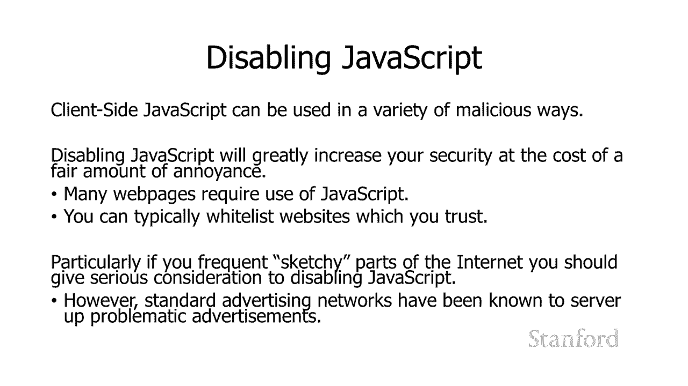

undefined，undefined，所以好吧，你实际上是如何做到，所以好吧，你实际上是如何做到，这一点的，有一堆，这一点的，有一堆，插件 Firefox 插件 是 noscript。

插件 Firefox 插件 是 noscript，我相信 safescript 是 chrome 的插件，我相信 safescript 是 chrome 的插件，它的工作方式是，它的工作方式是。

当您访问特定网页时，当您访问特定网页时，如果该网页具有，如果该网页具有，与之关联的 javascript，则 javascript，与之关联的 javascript，则 javascript。

有时不会运行，这最终只会，有时不会运行，这最终只会，undefined，undefined，最值得注意的是，我认为，undefined，undefined，如果你正在编写 javascript。

福布斯将不允许甚至不会显示任何内容，如果你正在编写 javascript，福布斯将不允许甚至不会显示任何内容，因为无论如何他们都在使用 javascript。

因为无论如何他们都在使用 javascript，undefined，undefined，你需要做的是，你需要做的是，会有一个小指标告诉你 那个，会有一个小指标告诉你 那个。

javascript 被阻止了，javascript 被阻止了，所以你可以看看那个，所以你可以看看那个，小图标，看看有多少，小图标，看看有多少，与网页相关的 javascript 被。

与网页相关的 javascript 被，阻止，阻止。

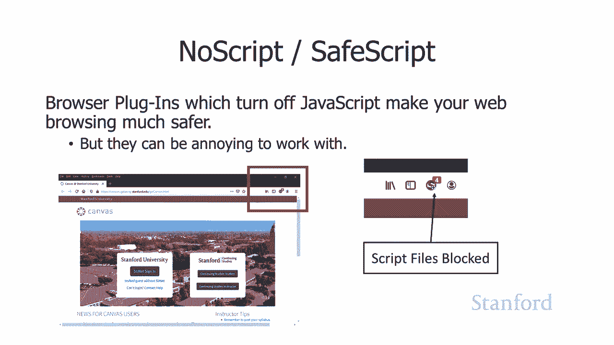

，然后你可以做的是，如果你，然后你可以做的是，如果你，点击它，它会提供一个列表，点击它，它会提供一个列表，该网页试图访问的实际 javascript 文件，undefined，undefined。

您可以关闭其中一些文件并，您可以关闭其中一些文件并，打开其中一些文件，因此，打开其中一些文件，因此，您会很清楚我需要，您会很清楚我需要，允许，允许，画布访问 javascript 但。

画布访问 javascript 但，我看到有这个广告网络，我看到有这个广告网络，你知道我确实知道，你知道我确实知道，有时广告网络确实会，有时广告网络确实会，发送一些粗略的东西 呃另一个。

发送一些粗略的东西 呃另一个，建议，建议，是有些人不使用广告，是有些人不使用广告，但我对此感到不舒服因为，但我对此感到不舒服因为，undefined，undefined，我确实意识到有很多这样的。

我确实意识到有很多这样的，独立网站，独立网站，他们支付账单的唯一方式，他们支付账单的唯一方式，所以我留下了广告，所以我留下了广告，但如果广告使用的 javascript。

但如果广告使用的 javascript，变得有点粗略，嗯，变得有点粗略，嗯，无论如何，嗯，所以这是没有，无论如何，嗯，所以这是没有，脚本或安全脚本工作的方式，基本上，脚本或安全脚本工作的方式，基本上。

你可以将 a 列入白名单 一堆这些，你可以将 a 列入白名单 一堆这些，你可以说哦，你可以说哦，嗯，来自，嗯，来自，这样一个网站的脚本总是很好，这样一个网站的脚本总是很好，但，但，否则我想让你问我。

否则我想让你问我，推荐它，推荐它，但这有点痛苦，所以一个人可能，但这有点痛苦，所以一个人可能，像我一样，像我一样，两个网络浏览器，就像我有一个网络，两个网络浏览器，就像我有一个网络，浏览器。

我只用它来访问，浏览器，我只用它来访问，我的银行呃和，我的银行呃和，我的电子邮件，就是这样，然后，我的电子邮件，就是这样，然后，我要么，我要么，在我的 ipad 上进行任何其他网络浏览。

undefined，undefined，担心 ipad，因为它更像是一个有，担心 ipad，因为它更像是一个有，围墙的花园，围墙的花园，嗯，人们很难摆脱，undefined，undefined。

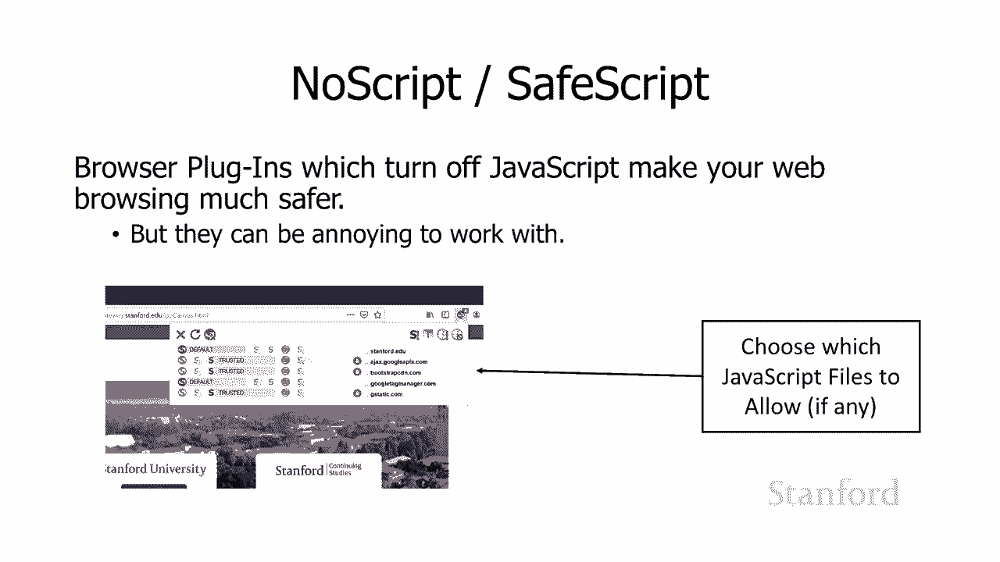

它，或者我从没有脚本的网络浏览器访问它，undefined，undefined，好吧，另一个问题是，好吧，另一个问题是，多因素身份验证，多因素身份验证，嗯多的想法 - 因素，嗯多的想法 - 因素。

身份验证是当您，身份验证是当您，登录网站，登录网站，时，除了知道您的姓名和密码之外，时，除了知道您的姓名和密码之外，您还应该有，您还应该有，一些其他因素，那么，一些其他因素，那么，这些不同的。

这些不同的，因素是什么？undefined，undefined，因素是，因素是，您拥有的东西，例如手机，您拥有的东西，例如手机，或某种安全令牌，或某种安全令牌，另一个可能的因素是您的身份。

undefined，undefined，这是您或您自己，但就像您，这是您或您自己，但就像您，undefined，undefined，有指纹一样，您有自己的身份 tinal，有指纹一样。

您有自己的身份 tinal，pattern，pattern，所以你的独特之处在于，所以你的独特之处在于，你是谁，你是谁，所以这个想法是你应该，所以这个想法是你应该，至少有两个这样的才能访问。

至少有两个这样的才能访问，一个网站或者你知道一个远程，一个网站或者你知道一个远程，资源，资源，这里的想法是如果你的密码，这里的想法是如果你的密码，泄漏，泄漏，有人知道你的名字和，有人知道你的名字和。

密码，除非他们，密码，除非他们，在这里有这个额外的因素，否则他们将，在这里有这个额外的因素，否则他们将，无法访问，无法访问，你的信息或你的银行或，你的信息或你的银行或，银行账户或其他任何东西，所以。

银行账户或其他任何东西，所以，我强烈建议你在任何网站上，我强烈建议你在任何网站上，打开多 -因素，打开多 -因素，身份验证，身份验证，尤其是电子邮件 请记住，尤其是电子邮件 请记住，如果有人，如果有人。

最终访问您的电子邮件帐户，最终访问您的电子邮件帐户，则您的电子邮件是您一切的关键，这意味着他们也可以，则您的电子邮件是您一切的关键，这意味着他们也可以，访问，访问，您的财务信息，因为您的，您的财务信息。

因为您的，财务信息可能，财务信息可能，与您的电子邮件帐户相关联，与您的电子邮件帐户相关联，我可以继续重置 密码，我可以继续重置 密码，然后砰的一声，然后砰的一声，它会将新密码信息，它会将新密码信息。

undefined，undefined，发送到您的电子邮件中，因此您的电子邮件是，发送到您的电子邮件中，因此您的电子邮件是，一切，一切。

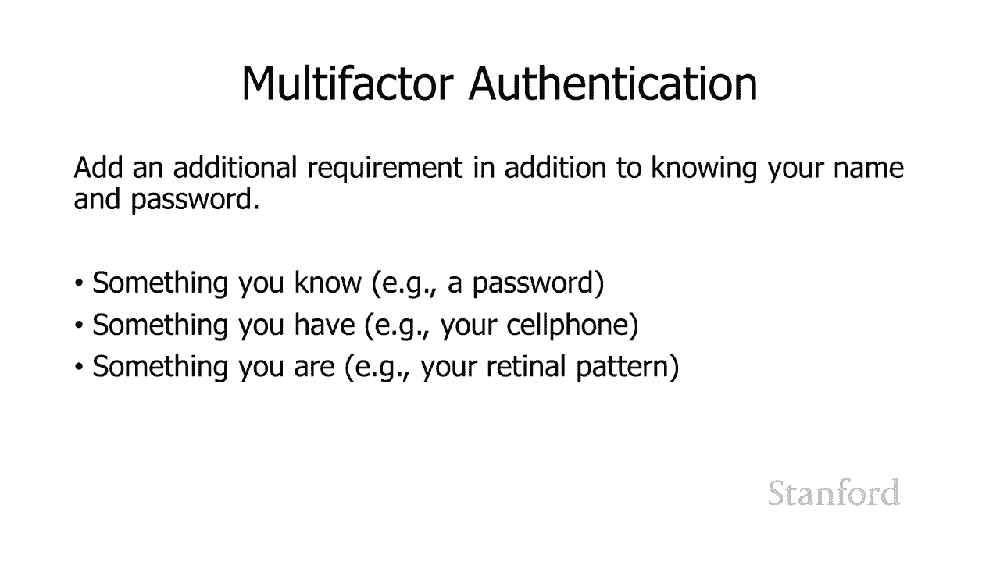

保持超级安全的关键，并且 那么，保持超级安全的关键，并且 那么，当然是金融，当然是金融，网站嗯，所以通常电子邮件，网站嗯，所以通常电子邮件，和金融网站将允许您，和金融网站将允许您，打开双因素身份验证我。

打开双因素身份验证我，强烈建议您这样，强烈建议您这样，做最常见的双因素，做最常见的双因素，身份验证，身份验证，是向您的手机发送短信，是向您的手机发送短信，因此请返回 在你知道一些东西之前我们说的。

因此请返回 在你知道一些东西之前我们说的，东西你知道你的，东西你知道你的，密码但是另外一些东西，密码但是另外一些东西，你有你的手机，你有你的手机，呃所以这不是黑客因为，呃所以这不是黑客因为。

他们没有你的手机，他们没有你的手机，嗯他们可能能够以某种方式获得你的，嗯他们可能能够以某种方式获得你的，密码，密码，但是他们赢了 现在没有你的手机，但是他们赢了 现在没有你的手机，这，这，有点问题。

因为，有点问题，因为，事实证明短信系统不安全，事实证明短信系统不安全，这是，这是，短信标准短信系统苹果，短信标准短信系统苹果，内部消息，内部消息，比标准，比标准，手机短信系统安全得多。

手机短信系统安全得多，流量未加密，流量未加密，并且有可能欺骗系统，并且有可能欺骗系统，并假装成为您，并假装成为您，不是，不是，的东西，因此这除了黑客之外还有问题，的东西，因此这除了黑客之外还有问题。

骗子已经，骗子已经，开始窃取人们的电话，开始窃取人们的电话，号码，号码，所以基本上他们声称是你，所以基本上他们声称是你，然后拿到一部新手机，然后将手机，然后拿到一部新手机，然后将手机，定向，定向。

并将手机短信，并将手机短信，实际上发送到新手机，实际上发送到新手机，而不是你的手机，所以这，而不是你的手机，所以这，一切都非常成问题，一切都非常成问题，嗯另一方面，您知道如果，嗯另一方面，您知道如果。

这不是确定的攻击或试图，这不是确定的攻击或试图，专门攻击您，这是，undefined，undefined，从，从，某个地方获得一大堆密码列表的人，嗯，这可能仍然，某个地方获得一大堆密码列表的人，嗯。

这可能仍然，非常好，所以您，非常好，所以您，知道您是否 选择是进行，知道您是否 选择是进行，基于短信的双因素，基于短信的双因素，身份验证还是，身份验证还是，根本不进行双因素身份验证 进行。

根本不进行双因素身份验证 进行，基于文本的双因素身份，基于文本的双因素身份。

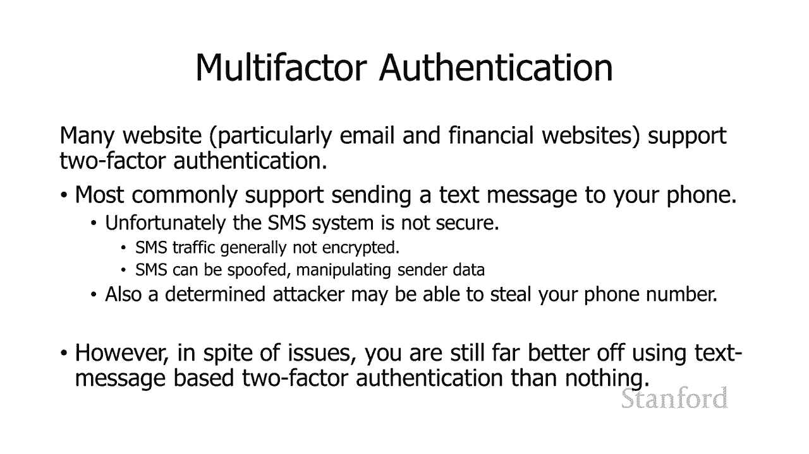

验证比没有，验证比没有，双因素身份验证要好得多，双因素身份验证要好得多，所以有什么替代方法 一些，所以有什么替代方法 一些，网站支持，网站支持，其他替代方法，其他替代方法。

使用称为身份验证器的东西进行多因素身份，使用称为身份验证器的东西进行多因素身份，验证，验证，现在这可以是一个物理设备，现在这可以是一个物理设备，在其，在其，上随机显示数字 也可能是。

上随机显示数字 也可能是，手机应用程序，手机应用程序，它们基本上都做同样的事情，它们基本上都做同样的事情，因此，因此，它们正在创建所谓，它们正在创建所谓，的伪随机数，因此，的伪随机数，因此。

它们看起来像是随机数，但，它们看起来像是随机数，但，实际上并不是随机数，实际上并不是随机数，呃它们是什么 实际上是它们是，undefined，undefined，基于种子编号生成的一系列数字。

基于种子编号生成的一系列数字，因此只要您从该，因此只要您从该，州的相同种子编号开始，州的相同种子编号开始，您就会，您就会，在初始种子之后收到相同的伪随机数序列，在初始种子之后收到相同的伪随机数序列。

undefined，undefined，因此这里的想法是如果，因此这里的想法是如果，undefined，undefined，细胞 电话应用程序或您的，细胞 电话应用程序或您的，物理身份验证设备以。

物理身份验证设备以，与，与，您尝试与之通信的网络服务器相同的种子编号，您尝试与之通信的网络服务器相同的种子编号，开头，开头，您将能够生成，您将能够生成，相同的数字序列，这些数字，相同的数字序列。

这些数字，看起来是随机的，但，看起来是随机的，但，实际上是伪数字 -random 并且它们将，实际上是伪数字 -random 并且它们将，完全匹配，完全匹配，嗯 现在事实证明，呃，嗯 现在事实证明，呃。

这些网站实际上使用了一种稍微，这些网站实际上使用了一种稍微，不同的技术，将，不同的技术，将，伪随机数的这种想法，伪随机数的这种想法，与当前时间相结合，与当前时间相结合，但是我 基本上和。

但是我 基本上和，你从种子开始的想法是一样的，你从种子开始的想法是一样的，有一个序列 它把，有一个序列 它把，undefined，undefined，种子作为序列和当前时间，种子作为序列和当前时间。

考虑在内 并，考虑在内 并，基于此它可以生成一个，基于此它可以生成一个，数字 它将是与其他人完全相同的数字，数字 它将是与其他人完全相同的数字，从，从，相同的种子开始，相同的种子开始。

知道当前时间是什么，知道当前时间是什么，所以这就是这些工作的方式，所以这就是这些工作的方式，想法是，想法是，只有你有那个种子，网络，只有你有那个种子，网络，服务器有那个种子，如果某个黑客。

服务器有那个种子，如果某个黑客，有你的帐户，即使他们，有你的帐户，即使他们，偷了 你的电话号码，但，偷了 你的电话号码，但，undefined，undefined，然后呃你知道那些号码。

然后呃你知道那些号码，将唯一，将唯一，匹配，其他，匹配，其他，人不可能不知道，人不可能不知道。

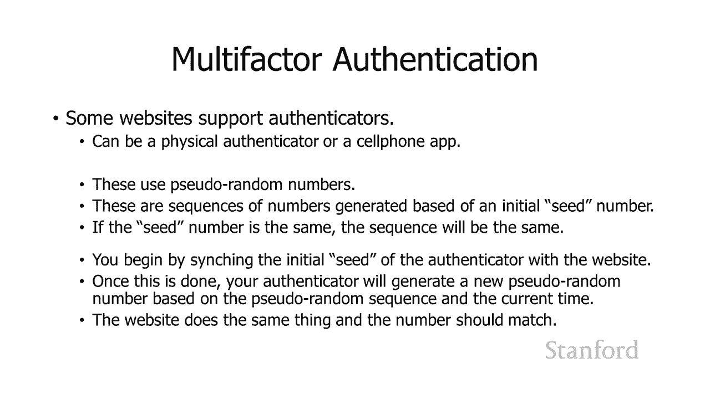

初始随机种子是什么随机数，呃将，初始随机种子是什么随机数，呃将，undefined，undefined，嗯它也可以使用 生物识别，嗯它也可以使用 生物识别，嗯，这是，嗯，这是，我们，我们。

通过可能的因素看到的东西，所以你，通过可能的因素看到的东西，所以你，知道，知道，你拥有的东西或者你是什么东西，你拥有的东西或者你是什么东西，undefined，undefined，所以这可能就像指纹或。

所以这可能就像指纹或，视网膜眼图一样，视网膜眼图一样，安全专家似乎，安全专家似乎，不太喜欢这个想法，不太喜欢这个想法，我听说有些人说得好，如果，我听说有些人说得好，如果，这是一个额外的因素。

这是一个额外的因素，那很好，但它不应该是，那很好，但它不应该是，唯一的因素，唯一的因素，所以问题之一是你，所以问题之一是你，不能，不能，像这样改变它 一旦你的视网膜眼，像这样改变它 一旦你的视网膜眼。

图出现了，它就会出现在那里，图出现了，它就会出现在那里，一旦有人知道你的指纹是什么，一旦有人知道你的指纹是什么，样子，样子，他们就知道你的指纹是什么，他们就知道你的指纹是什么，样子，你知道，样子。

你知道，如果，如果，你知道指纹是什么样子，就有可能伪造这些系统，你知道指纹是什么样子，就有可能伪造这些系统，所以呃只是 举个例子，所以呃只是 举个例子，说明你的指纹如何，说明你的指纹如何。

很好地传播出去 美国个人管理办公室，undefined，undefined，这是负责，这是负责，安全检查的局，安全检查的局，被黑了，超过 2100 万人的，被黑了，超过 2100 万人的，指纹被盗。

指纹被盗，如此之大，我知道我有指纹，undefined，undefined，在加利福尼亚州注册，因为我，在加利福尼亚州注册，因为我，在夏天教高中生，在夏天教高中生，所以，所以，每个教暑期学校的人都。

每个教暑期学校的人都，需要得到你的fi 指纹注册了，需要得到你的fi 指纹注册了，嗯，所以你知道我信任，嗯，所以你知道我信任，呃我不知道他们被存储在哪里，呃我不知道他们被存储在哪里。

我不知道他们的存储是谁的回应，我不知道他们的存储是谁的回应，但是我相信他们不会，但是我相信他们不会，被黑客入侵，被黑客入侵，我相信他们不会被黑客入侵吗，我相信他们不会被黑客入侵吗。

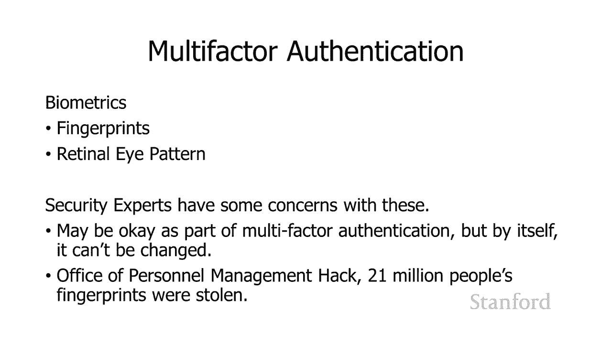

将我的银行账户信任给他们，将我的银行账户信任给他们，所以呃，这是，所以呃，这是，undefined，undefined，问题，就您的密码而言，需要考虑一些事情，问题，就您的密码而言，需要考虑一些事情。

密码，密码，可能存在许多问题，可能存在许多问题，第一个是，第一个是，密码可能是蛮力，所以这，密码可能是蛮力，所以这，意味着尝试所有 可能的，意味着尝试所有 可能的，组合，组合，而且很有趣，因为。

而且很有趣，因为，人们会喜欢 哦，人们会喜欢 哦，8 个字符长的密码很好，8 个字符长的密码很好，现在您需要 9 个字符长的，现在您需要 9 个字符长的，密码，基本上，密码，基本上。

这里发生的事情是越来越，这里发生的事情是越来越，快的计算机获得，快的计算机获得，的时间越来越少。的时间越来越少。对于某人来说，呃，对于某人来说，呃，尝试所有不同的组合，尝试所有不同的组合。

反正长密码比短密码更好，undefined，undefined，因为每个额外的字符都，因为每个额外的字符都，需要，需要，你知道大量的额外密码 呃，你知道大量的额外密码 呃，可能性，所以，可能性，所以。

如果他们进行蛮力，如果他们进行蛮力，攻击，攻击，他们需要尝试更多，如果您，他们需要尝试更多，如果您，再次使用大写和小写字母，undefined，undefined，undefined。

如果您包含数字和标点符号，则会增加可能的组合数量，如果您包含数字和标点符号，则会增加可能的组合数量，并非所有网站都允许您 使用，并非所有网站都允许您 使用，标点符号有点烦人，标点符号有点烦人。

但如果你使用数字和标点符号，但如果你使用数字和标点符号，这将，这将，大大增加组合的数量，大大增加组合的数量，所以，所以，你想通过暴力尝试所有不同的可能组合来最大限度地提高。

你想通过暴力尝试所有不同的可能组合来最大限度地提高，别人猜你密码的难度，undefined，undefined，undefined，呃使用大写字母 小写，呃使用大写字母 小写，字母数字和标点符号。

字母数字和标点符号，嗯你也知道我说过主要的，嗯你也知道我说过主要的，undefined，undefined，是密码的长度但是攻击者，是密码的长度但是攻击者，也有一个，也有一个，最常用密码的列表所以。

最常用密码的列表所以，不要想出一些非常，不要想出一些非常，可爱的东西，就像，可爱的东西，就像，其他人也使用的一样 因为这，其他人也使用的一样 因为这，可能在最常见的密码列表中，可能在最常见的密码列表中。

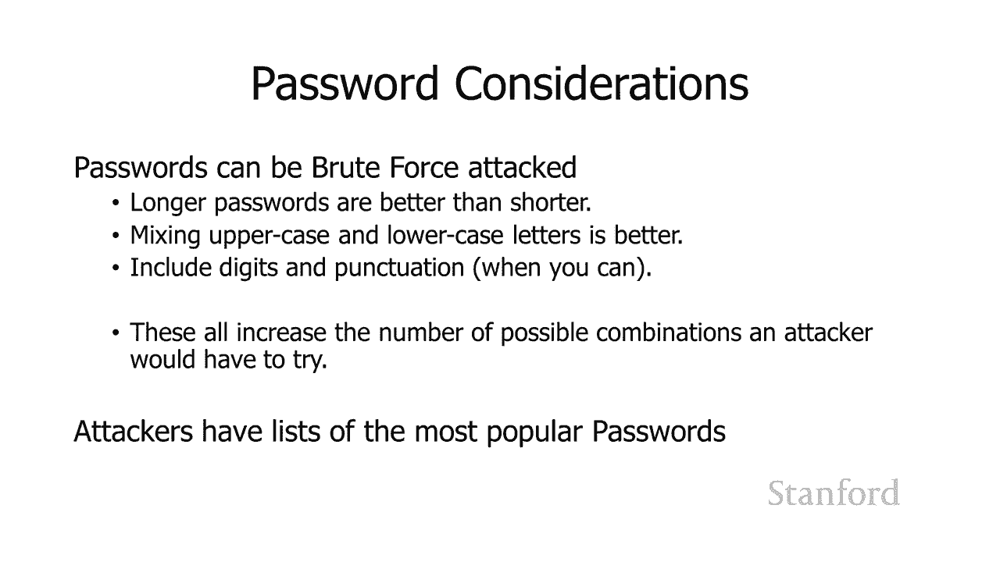

undefined，undefined，而这些是攻击者，而这些是攻击者，undefined，undefined，对不同的网站使用不同的密码，undefined，undefined。

为什么第一件事就像如果你，为什么第一件事就像如果你，有一堆随机的爱好，有一堆随机的爱好，网站 你知道谁拥有那个网站，网站 你知道谁拥有那个网站，你相信两个温泉网站，你相信两个温泉网站。

你相信他们一个不是黑客，你相信他们一个不是黑客，但还有，但还有，两个你相信他们的计算机安全，两个你相信他们的计算机安全，他们是否会保持他们的计算机，他们是否会保持他们的计算机，安全更新，所以只是给。

安全更新，所以只是给，你一个例子，你一个例子，嗯，我的一个密码，嗯，我的一个密码，在野外有一些列表，在野外有一些列表，你可以用来检查，你可以用来检查，你的 密码就在那里，你的 密码就在那里。

结果证明它是从一个，结果证明它是从一个，名为titanquest。net 的网站上被盗的。titan，名为titanquest。net 的网站上被盗的。titan，quest 是，quest 是。

一个视频游戏，类似于你们中的一些人可能，一个视频游戏，类似于你们中的一些人可能，已经，已经，看过暗黑破坏神或玩暗黑破坏神它有点，看过暗黑破坏神或玩暗黑破坏神它有点，像暗黑破坏神，除了，像暗黑破坏神。

除了，更经典的希腊语，更经典的希腊语，呃，希腊主题，呃，希腊主题，嗯，是的，所以我在那个网站上创建了一个帐户，嗯，是的，所以我在那个网站上创建了一个帐户，他们被黑了，那个，他们被黑了，那个，密码在野外。

密码在野外，甚至专业网站也被，甚至专业网站也被，黑了一段时间，例如 playstation，黑了一段时间，例如 playstation，网络 回来被黑，网络 回来被黑，了 已经有很多其他。

了 已经有很多其他，人被黑了，人被黑了，所以理想情况下，如果他们知道自己在，所以理想情况下，如果他们知道自己在，做什么，做什么，如果他们被黑了，希望您的，如果他们被黑了，希望您的，密码仍应受到。

密码仍应受到，保护，因为它指的，保护，因为它指的，是所谓的，是所谓的，um 散列但呃，um 散列但呃，但你知道 他们并不总是这样做并不，但你知道 他们并不总是这样做并不，总是遵循良好的，总是遵循良好的。

安全竞争实践，所以如果他们得到，安全竞争实践，所以如果他们得到，可能会增加他们，可能会增加他们，被黑客入侵的机会，如果他们已经，被黑客入侵的机会，如果他们已经，呃不提供安全的竞争，呃不提供安全的竞争。

实践然后他们被黑客入侵，实践然后他们被黑客入侵，并且密码是现在，并且密码是现在，事实上，stanford 说你不应该，事实上，stanford 说你不应该，在任何其他网站上使用 stanford 密码。

在任何其他网站上使用 stanford 密码，但你肯定想要，但你肯定想要，不同的密码，比如不要在随机网站上使用你的，不同的密码，比如不要在随机网站上使用你的，财务密码，财务密码，一个非常糟糕的主意。

一个非常糟糕的主意，再次提醒，再次提醒，你的电子邮件帐户是关键，你的电子邮件帐户是关键。

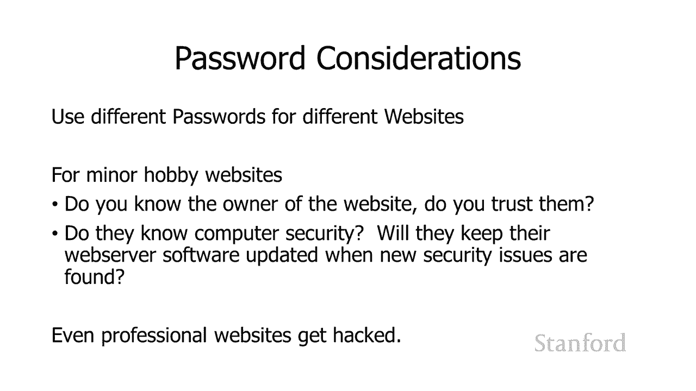

王国所以你知道，王国所以你知道，不要使用那个密码或其他任何东西，不要使用那个密码或其他任何东西，undefined，undefined，一些专家建议使用密码，一些专家建议使用密码，而不是密码。

而不是密码，所以密码本质上是，所以密码本质上是，一堆 单词串在一起，一堆 单词串在一起，嗯 所以呃这里的想法，嗯 所以呃这里的想法，是过去的短语很容易，是过去的短语很容易，记住，记住。

所以就像如果你喜欢呃我不知道，所以就像如果你喜欢呃我不知道，红衣主教计算机，红衣主教计算机，弗洛莫希望你能记住，弗洛莫希望你能记住，因为弗洛玛是校园里最好的宿舍，因为弗洛玛是校园里最好的宿舍。

显然是红衣主教的 真的很棒，显然是红衣主教的 真的很棒，我已经忘记了我的中间词，我已经忘记了我的中间词，是什么，但它比，是什么，但它比，12 个，12 个，大写小写数字标点符号的随机序列更容易。

大写小写数字标点符号的随机序列更容易，这里的想法是，这里的想法是，您可以使用密码短语，您可以使用密码短语，来使密码短语，来使密码短语，更长，更长，所以你知道 如果你有 12 个随机。

所以你知道 如果你有 12 个随机，字符，字符，而你有一个由 4 个单词组成的序列，而你有一个由 4 个单词组成的序列，它们，它们，最终是 25 个字符，那么 25 个，最终是 25 个字符。

那么 25 个，字符是很多随机，字符是很多随机，组合，组合，因为英语中有超过 50 000 个，因为英语中有超过 50 000 个，单词 如果他们，单词 如果他们，知道有四个单词，知道有四个单词，那么。

undefined，undefined，不幸的是，研究表明，不幸的是，研究表明，过去的短语并不像它们应该的那样随机，undefined，undefined。

这是 fr  om bonaire 和 chatova ii，这是 fr  om bonaire 和 chatova ii，提到了 bonane shatova 因为。

提到了 bonane shatova 因为，乔博内特呃是一个以前的学生，我，乔博内特呃是一个以前的学生，我，写了一封破坏研究生院之神的信，写了一封破坏研究生院之神的信，我遇到了，我遇到了。

呃我正在阅读我的密码，我，呃我正在阅读我的密码，我，遇到了他的研究，我就像去，遇到了他的研究，我就像去，乔 无论如何，乔 无论如何，基本上他们发现的是，呃，基本上他们发现的是，呃，人们不会想出随机的。

人们不会想出随机的，密码短语 他们想出了符合，密码短语 他们想出了符合，特定规则的短语 他们是，特定规则的短语 他们是，语法规则 他们是你知道，语法规则 他们是你知道，的 所以这里的想法是。

的 所以这里的想法是，如果过去的短语是 实际上并不，如果过去的短语是 实际上并不，完全，完全，是四个完全随机的词的序列，是四个完全随机的词的序列，那么你并没有充分，那么你并没有充分，利用，利用。

过去的短语更长，过去的短语更长，但它们更安全的想法，但它们更安全的想法，事实上它大大降低，事实上它大大降低，了密码的安全性，了密码的安全性，我认为它们仍然被普遍，我认为它们仍然被普遍。

认为是 如果你有四个不是，认为是 如果你有四个不是，完全随机的词，完全随机的词，嗯我的意思是如果你用一个常用，嗯我的意思是如果你用一个常用，短语你就搞砸了但是，短语你就搞砸了但是，一般来说如果有四个半。

一般来说如果有四个半，随机词嗯，随机词嗯，你仍然应该有很好的，你仍然应该有很好的，安全性 但请注意，你，安全性 但请注意，你，真的想选择，真的想选择，完全随机的东西，你不想像，完全随机的东西，你不想像。

undefined，undefined，哦，这是一组很酷的词，哦，这是一组很酷的词，完全合乎情理，完全合乎情理。

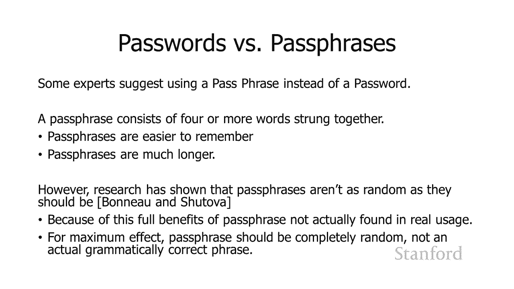

，其他人也可能，其他人也可能，想出这是一个非常糟糕的主意，想出这是一个非常糟糕的主意，好吧现在 可能是密码，好吧现在 可能是密码，管理器，管理器，所以密码管理器将，所以密码管理器将，跟踪您的所有密码。

跟踪您的所有密码，呃它会为您提供新密码，呃它会为您提供新密码，这些密码是完全随机的，这些密码是完全随机的，长度很好，嗯，这里的基本思想，长度很好，嗯，这里的基本思想，是您有一个主密码，是您有一个主密码。

undefined，undefined，进入密码管理器，然后一旦，进入密码管理器，然后一旦，你，你，完成，你就不需要记住，完成，你就不需要记住，任何其他密码，任何其他密码，嗯密码管理器也。

嗯密码管理器也，非常好，因为它们可以保护你，非常好，因为它们可以保护你，免受网络钓鱼攻击你，免受网络钓鱼攻击你，记得你知道网络钓鱼攻击是当，记得你知道网络钓鱼攻击是当，你得到 就像一封。

你得到 就像一封，声称是给您的银行的电子邮件，您点击，声称是给您的银行的电子邮件，您点击，它，您的网站看起来，它，您的网站看起来，与您的银行完全一样，与您的银行完全一样，密码管理器要做的。

密码管理器要做的，是它可能就像，是它可能就像，uh yo 你的银行是美国银行，uh yo 你的银行是美国银行，这是银行或美国 它看起来非常，这是银行或美国 它看起来非常，接近但它是一个不同的名称。

接近但它是一个不同的名称，我不会在这里输入您的密码，我不会在这里输入您的密码，信息 现在您需要做的，信息 现在您需要做的，是如果首先不要点击，undefined，undefined。

无论您是否运行密码管理器，这些链接仍然是正确的，无论您是否运行密码管理器，这些链接仍然是正确的，但，但，就像，就像，嗯，您知道如果您访问一个，嗯，您知道如果您访问一个，您认为，您认为。

您在密码管理器中有密码的网站并且它，您在密码管理器中有密码的网站并且它，不会自动填写，不会自动填写，您 应该仔细检查一下，嗯，您 应该仔细检查一下，嗯，我想知道为什么我的密码管理器不。

undefined，undefined，喜欢这个，因为我拼错了它，这，喜欢这个，因为我拼错了它，这，是一个黑客的网站，是一个黑客的网站，或者像这里发生的事情，所以我确实，或者像这里发生的事情。

所以我确实，认为，认为，这是一个很大的优势使用，这是一个很大的优势使用，密码管理器，密码管理器，他们应该帮助防止网络钓鱼，他们应该帮助防止网络钓鱼，有人试图将其伪装成一个，有人试图将其伪装成一个。

undefined，undefined，您知道的网站，以便获取您的，您知道的网站，以便获取您的，登录信息，因为密码，登录信息，因为密码，管理器会像，管理器会像，那不是正确的网站一样，我有。

那不是正确的网站一样，我有，真实的密码 网站，真实的密码 网站，那不是真正的网站，我，那不是真正的网站，我，不会自动填写信息，不会自动填写信息，如果您浏览该网站，如果您浏览该网站。

您可能会觉得它看起来像我的，您可能会觉得它看起来像我的，真实网站，我想我会，真实网站，我想我会，继续输入 我在，继续输入 我在，密码管理器中的信息不会这样做，密码管理器中的信息不会这样做。

一个潜在的缺点是，一个潜在的缺点是，密码管理器有一些密码管理器，密码管理器有一些密码管理器，发生了许多安全，发生了许多安全，事件，事件，其中一个，其中一个，被完全黑了所以，被完全黑了所以。

我不知道是否有任何好处，我不知道是否有任何好处，解决方案但是嗯，解决方案但是嗯，但是安全专家似乎确实，但是安全专家似乎确实，认为密码管理器，认为密码管理器，总体上是一个好主意所以。

总体上是一个好主意所以，呃你知道我倾向于听，呃你知道我倾向于听，专家在这，专家在这，方面的意见嗯所以最后一，方面的意见嗯所以最后一，堂关于安全的讲座将是，堂关于安全的讲座将是，超级 简而言之。

这只是对个人安全建议，超级 简而言之，这只是对个人安全建议，的快速总结，undefined，undefined。

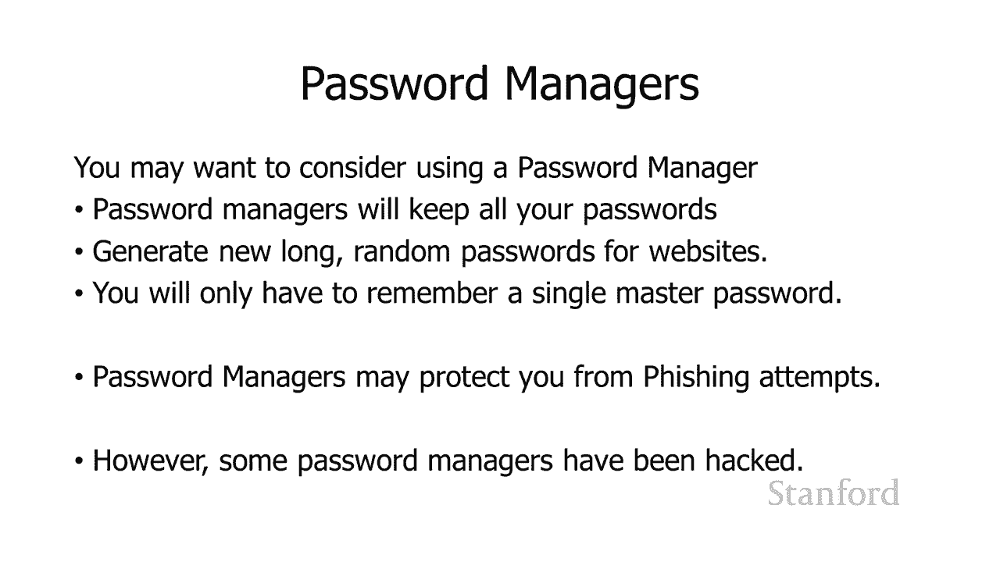

包括我们刚刚，包括我们刚刚，在此处介绍的一些关于密码的建议。

