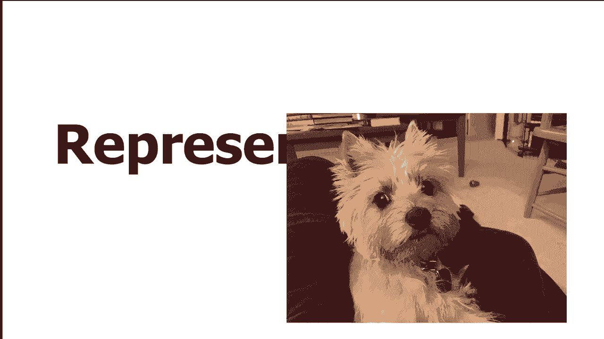
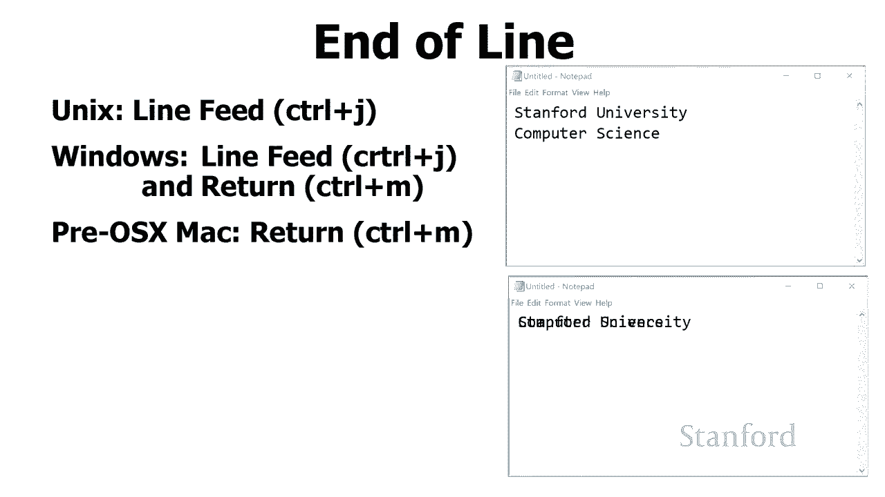
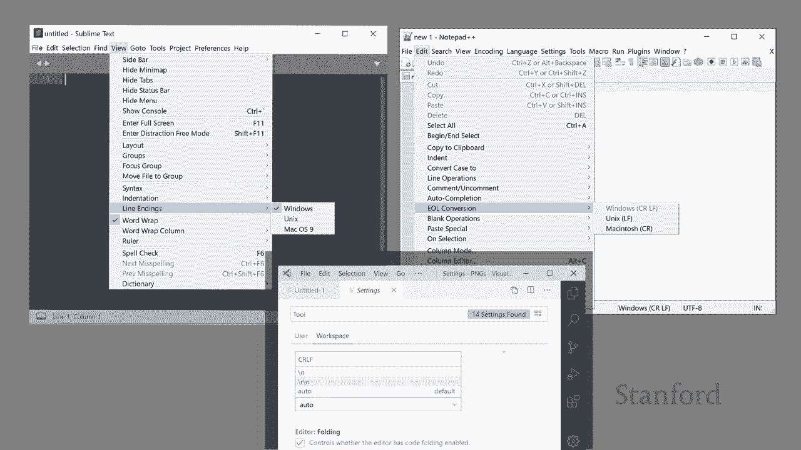
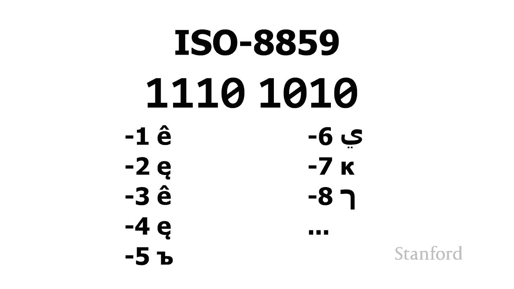
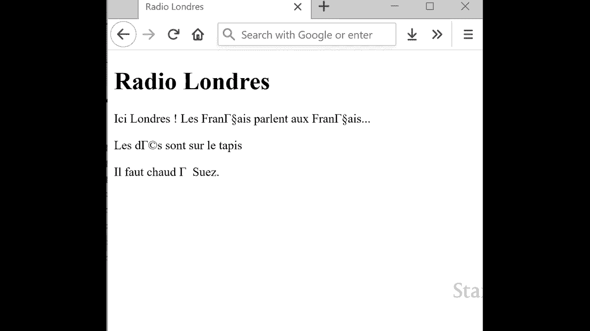
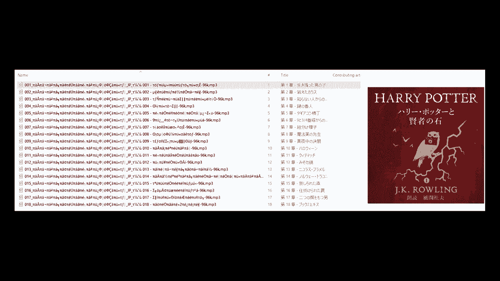

# 【双语字幕+资料下载】斯坦福CS105 ｜ 计算机科学导论(2021最新·完整版) - P5：L1.4- 比特、字节与二进制：计算机中的象形文字表示 - ShowMeAI - BV1eh411W72E

undefined，欢迎探索，欢迎探索，今天的视频是位字节和二进制的，今天的视频是位字节和二进制的，第四部分，我们在其中学习了如何，第四部分，我们在其中学习了如何，在计算机上表示埃及象形文字。

在计算机上表示埃及象形文字，undefined，undefined，到目前为止，我们一直专注于如何，到目前为止，我们一直专注于如何，undefined，undefined，在计算机上表示数字，但。

在计算机上表示数字，但，收听，收听，此视频的许多人可能 人们花在，undefined，undefined，打字和写作上的时间多于，打字和写作上的时间多于，计算的时间，所以，计算的时间，所以。

我喜欢在这里换个档次，我喜欢在这里换个档次，谈谈我们如何，谈谈我们如何，在计算机上表示文本我们在，在计算机上表示文本我们在，几个视频前简要讨论了如何使用，几个视频前简要讨论了如何使用，不同的位组合。

不同的位组合，代表，代表，不同的事物，例如，不同的事物，例如，某人可能居住的州或省，某人可能居住的州或省，或某人可能居住的宿舍，或某人可能居住的宿舍，因此，因此，一种自然的思考方式是。

一种自然的思考方式是，我们可以，我们可以，使用不同的字符组合来表示文本，使用不同的字符组合来表示文本，undefined，undefined，顺便说一句，如果您听到一些，顺便说一句，如果您听到一些。

抱怨 背景是我的狗，抱怨 背景是我的狗，maddy，她很兴奋，很兴奋，maddy，她很兴奋，很兴奋。

想知道我为什么不和她一起玩，想知道我为什么不和她一起玩，接下来我要向你展示什么，接下来我要向你展示什么，一种叫做 ascii 表的东西，一种叫做 ascii 表的东西，这是 ascii 表 你可以。

这是 ascii 表 你可以，看到我们在这里看到的是不同，看到我们在这里看到的是不同，undefined，undefined，的位组合可以用来表示，的位组合可以用来表示，不同的，不同的。

特定字母或数字甚至，特定字母或数字甚至，计算机上的标点符号 让我们，计算机上的标点符号 让我们，仔细看看 这是，仔细看看 这是，如何在 ascii 表的右上角完成的。

如何在 ascii 表的右上角完成的，我们可以，我们可以，在这里看到我们有，undefined，undefined，abcde 和 f 的大写和小写表示，abcde 和 f 的大写和小写表示。

undefined，undefined，假设计算机要看到位，假设计算机要看到位，组合一，组合一，零零零零一，零零零零一，或 off off off off on。

或 off off off off on，我们可以看到这实际上，我们可以看到这实际上，代表了大写字母，代表了大写字母，a 相反，如果它看到这个，a 相反，如果它看到这个，特定的位序列，特定的位序列。

一一零一零一或，一一零一零一或，on off off on off on，on off off on off on，它实际上代表小写字母，它实际上代表小写字母，字母 e，字母 e，现在我应该提醒你。

现在我应该提醒你，这些位，这些位，模式的这些特定解释仅适用于，模式的这些特定解释仅适用于，旨在处理文本的计算机程序，旨在处理文本的计算机程序，undefined，undefined。

记住特定序列 位的数量，记住特定序列 位的数量，可以代表不同的东西，这，可以代表不同的东西，这，取决于查看这些位的特定程序，取决于查看这些位的特定程序，的设计目的，undefined。

undefined，undefined，undefined，undefined，undefined，'正在使用一个，'正在使用一个，处理文本的程序，例如文字处理器，处理文本的程序，例如文字处理器。

这将被解释为字母 a，这将被解释为字母 a，但是，如果我们正在使用，但是，如果我们正在使用，不同的，不同的，程序，比如一个设计用于处理数字的程序，程序，比如一个设计用于处理数字的程序，这实际上可以。

这实际上可以，解释为数字 65。解释为数字 65。为什么好吧让我们快速看一下，为什么好吧让我们快速看一下，这里的数学，这里的数学，所以我们有我们的八位，所以我们有我们的八位，从右边开始，从右边开始。

我们的零位这代表二的，我们的零位这代表二的，零次方，零次方，即一，然后接下来我们，即一，然后接下来我们，有我们的二到 第一个，有我们的二到 第一个，幂是 2 或 2 到第二个 4。

幂是 2 或 2 到第二个 4，或 2 到第三个 8 的幂。或 2 到第三个 8 的幂。我们有 16 32 和 64。所以，我们有 16 32 和 64。所以，如果我们看这个，我们有 1 2 的。

如果我们看这个，我们有 1 2 的，0 次幂，即 1，0 次幂，即 1，和 1  2 到 64 的六次方，和 1  2 到 64 的六次方，所以我们总共有 65。所以我们总共有 65。

我认为当我们查看这些位时，重要的是，我认为当我们查看这些位时，重要的是，要记住，要记住，在一个层面上，就计算机，在一个层面上，就计算机，而言，位，而言，位，只是位，决定如何解释这些位，只是位。

决定如何解释这些位，的是，的是，与它们一起工作的程序，与它们一起工作的程序，只要，只要，处理这些特定位，处理这些特定位，的程序将它们视为 ascii，那么，的程序将它们视为 ascii，那么。

它将被解释的，它将被解释的，是字母 a 还有其他可能的，是字母 a 还有其他可能的，解释，解释，它可能是一个数字它可能是一个声音，它可能是一个数字它可能是一个声音，它可能是一个 图片。

它可能是一个 图片，但在这种特殊情况下，我们，但在这种特殊情况下，我们，将假设我们的程序知道，将假设我们的程序知道，这是一个 ascii，这是一个 ascii，字符，因此它会在，字符，因此它会在。

ascii 表中查找并将其，ascii 表中查找并将其，显示为 a 让我们再看看，显示为 a 让我们再看看，这里的 ascii 表，这里的 ascii 表，我想 现在关注左侧栏，我想 现在关注左侧栏。

如果您查看左侧，如果您查看左侧，栏，您会注意到左侧，栏，您会注意到左侧，栏实际上有，栏实际上有，标点符号和数字 0，标点符号和数字 0，到 9，当它们表示，到 9，当它们表示，为文本文档的一部分时。

为文本文档的一部分时，我们现在 重点 在，undefined，undefined，这张表的左上角，你会注意到，undefined，undefined，这里的数字有点奇怪，如果你仔细看。

这里的数字有点奇怪，如果你仔细看，你会注意到，你会注意到，我们的左上角不是，我们的左上角不是，从数字零开始的，从数字零开始的，您可以看到它，您可以看到它，以零一，以零一，零零零零零开头，零零零零零开头。

如果我们继续将其，如果我们继续将其，切换，切换，为十进制，这将更加明显，您可以在此处看到，为十进制，这将更加明显，您可以在此处看到，代表 ascii 字符的代码，代表 ascii 字符的代码。

以数字 32 开头，以数字 32 开头，并继续 高达 127。 为什么它，并继续 高达 127。 为什么它，以 32 开始，以 32 开始，数字 32 以下发生了什么，数字 32 以下发生了什么。

事实证明还有，事实证明还有，另一组代码从 0 到，另一组代码从 0 到，31 代表所谓的，31 代表所谓的，控制代码，控制代码，如果你看一下 键盘，如果你看一下 键盘，尤其是 windows 键盘。

尤其是 windows 键盘，或 unix 键盘，您会看到，或 unix 键盘，您会看到，有一个控制键，通过，有一个控制键，通过，按住该控制键并键入，按住该控制键并键入，不同的字符，不同的字符。

我们会创建不同的控制字符，我们会创建不同的控制字符，下表显示了一些，下表显示了一些，undefined，undefined，更有趣的控制字符，因此，更有趣的控制字符，因此，您可以看到，您可以看到，例如。

控制 h 字符，例如，控制 h 字符，表示退格，表示退格，控制 m 表示回车，控制 m 表示回车，undefined，undefined，您可以看到其中一些，您可以看到其中一些，最初用于回到。

最初用于回到，我们拥有，我们拥有，基本上是打字机的电传打字机的那一天 那，基本上是打字机的电传打字机的那一天 那，是连接到计算机的，是连接到计算机的，在这种特殊情况下，在这种特殊情况下，我一直很喜欢的。

我一直很喜欢的，control g 实际上会响铃，并且在，control g 实际上会响铃，并且在，相当长的一段时间内，如果您在，相当长的一段时间内，如果您在，文本编辑器中工作。

您会按下 control g，文本编辑器中工作，您会按下 control g，您的计算机会 实际上，您的计算机会 实际上，响铃实际上有点酷，但恐怕，响铃实际上有点酷，但恐怕，我最近没有遇到任何。

我最近没有遇到任何，这样做的文本编辑器，这样做的文本编辑器，但这里的基本思想是这些，但这里的基本思想是这些，不同的控制字符，不同的控制字符，允许我们，允许我们。

使用相同的 ascii 字符集传输控制信息，undefined，undefined，您有时会遇到的控制字符的其他方面，您有时会遇到的控制字符的其他方面，undefined，undefined。

是计算机制造商，是计算机制造商，未就正确的，未就正确的，字符使用达成一致 行尾是 unix，字符使用达成一致 行尾是 unix，计算机，计算机，microsoft windows 和 pre os x。

microsoft windows 和 pre os x，macintoshes 都使用不同的字符，macintoshes 都使用不同的字符，来表示行尾 这里涉及的主要两个。

来表示行尾 这里涉及的主要两个，字符是 ctrl，字符是 ctrl，m 代表字符转向和，m 代表字符转向和，控制 j 历史上是，控制 j 历史上是，换行控制 j，换行控制 j，换行将，换行将。

获取当前在电传打字机中的一张纸，获取当前在电传打字机中的一张纸，并将该电传打字机向上，并将该电传打字机向上，移动一行，移动一行，控制，控制，m 将从，m 将从，当前在线的任何位置返回打印墨盒。

当前在线的任何位置返回打印墨盒，并将其返回到行的开头，undefined，undefined，microsoft windows 假设您，microsoft windows 假设您。

需要执行两个操作 您需要，需要执行两个操作 您需要，执行 control j 操作以，执行 control j 操作以，向下移动到下一行，向下移动到下一行，您需要执行 control m 以。

您需要执行 control m 以，移动到当前行的开头，移动到当前行的开头，unix 只是使用换行符而已，unix 只是使用换行符而已，使用控件 j，使用控件 j。

和 pre-osx macintosh 只使用，和 pre-osx macintosh 只使用，字符术语或控件 m，字符术语或控件 m，这可能导致奇怪的情况，所以我，这可能导致奇怪的情况，所以我。

见过编辑器在，见过编辑器在，一个标准文本文件上写，一个标准文本文件上写，操作系统，操作系统，你在不同的操作系统上打开，你在不同的操作系统上打开，它看起来很垃圾 让我们，它看起来很垃圾 让我们。

来看看它是，来看看它是，如何在顶部工作的 我们，如何在顶部工作的 我们，有一个在 macintosh 上创建的文本文件，有一个在 macintosh 上创建的文本文件。

当在 macintosh 上查看时，当在 macintosh 上查看时，undefined，undefined，我们得到了这条线 斯坦福大学，我们得到了这条线 斯坦福大学，后面是 control-m。

后面是 control-m，它是行尾的 pre-osx macintosh，它是行尾的 pre-osx macintosh，版本，版本，后面是计算机科学，在，后面是计算机科学，在，底部我们看到的。

底部我们看到的，是它在 PC 文本编辑器上的显示方式，是它在 PC 文本编辑器上的显示方式，所以我们得到的是 我们像以前一样得到，所以我们得到的是 我们像以前一样得到，了斯坦福大学，了斯坦福大学。

然后我们得到了控制 m，这，然后我们得到了控制 m，这，是一个字符转弯，在，是一个字符转弯，在，刚返回，刚返回，到行首的 pc 上它不会，到行首的 pc 上它不会，向下移动一行，所以我们，向下移动一行。

所以我们，实际上这里是，实际上这里是，我们有斯坦福大学和，undefined，undefined，计算机科学 幸运的是，大多数现代，计算机科学 幸运的是，大多数现代，编辑，编辑。

对结束一行的各种可能方式都足够熟悉，对结束一行的各种可能方式都足够熟悉，undefined，undefined，他们会为我们翻译，undefined，undefined，大多数高端文本编辑器 特别是。

大多数高端文本编辑器 特别是，那些为程序员设计的将，那些为程序员设计的将，允许我们设置，允许我们设置，我们想要使用的约定，所以，我们想要使用的约定，所以，这里的这张图片显示，这里的这张图片显示。

了左上角记事本中 sublime 的设置，了左上角记事本中 sublime 的设置，加上右边的加号和，加上右边的加号和，底部的 Visual Studio 代码，你可以看到这些。

底部的 Visual Studio 代码，你可以看到这些，都有选项 为了决定我们，都有选项 为了决定我们，是否要，是否要，使用 unix 约定、windows pc。

使用 unix 约定、windows pc。

约定以及在某些情况下，约定以及在某些情况下，的 pre-osx macintosh 约定，的 pre-osx macintosh 约定，另一个地方，另一个地方，undefined，undefined。

我们将如何，我们将如何，表示这些不同操作系统的行尾的区别，表示这些不同操作系统的行尾的区别，是，是，什么时候 我们现在正在使用文件传输程序，什么时候 我们现在正在使用文件传输程序，文件传输程序。

文件传输程序，区分文本文件，区分文本文件，和二进制文件 所以问题之一是，和二进制文件 所以问题之一是，为什么我们有这种区别 所以，为什么我们有这种区别 所以，我们在这里看到这是安全的 ftp。

我们在这里看到这是安全的 ftp，这是斯坦福推荐的程序，undefined，undefined，为 Windows 计算机传输文件，例如，为 Windows 计算机传输文件，例如，stanford。

stanford，unix 机器，您可以看到，unix 机器，您可以看到，安全 fx 询问，安全 fx 询问，我是否要将特定文件，我是否要将特定文件，视为 ext 文件或二进制文件。

视为 ext 文件或二进制文件，为什么它需要知道这两者之间的区别，为什么它需要知道这两者之间的区别，我们不只是传输，我们不只是传输，每个单独的位和，每个单独的位和，字节然后我们的文件传输完成。

字节然后我们的文件传输完成，但它实际上在这里问的是，但它实际上在这里问的是，它说这是否是一个 文本文件，它说这是否是一个 文本文件，它将遍历文本文件，它将遍历文本文件，并查找这些行尾序列中的每一个。

并查找这些行尾序列中的每一个，undefined，undefined，并且它将从，并且它将从，它在文件中看到的任何内容进行转换，它在文件中看到的任何内容进行转换，例如，如果它会说哦，我，例如。

如果它会说哦，我，看到您正在使用 Windows，看到您正在使用 Windows，约定或者我看到你正在，约定或者我看到你正在，使用 Macintosh 约定，使用 Macintosh 约定，它会查看。

它会查看，我正在传输的计算机，说哦，你正在，我正在传输的计算机，说哦，你正在，传输到一台 unix 计算机，所以，传输到一台 unix 计算机，所以，我要做的是我要 采用，undefined。

undefined，您正在传输的计算机正在使用的约定，您正在传输的计算机正在使用的约定，我将，我将，undefined，undefined，这些行尾字符转换，undefined，undefined。

为您正在传输，为您正在传输，的计算机的正确序列，如果您，的计算机的正确序列，如果您，仔细查看 ascii 表，仔细查看 ascii 表，y 您可能会意识到一些事情，y 您可能会意识到一些事情。

您可能会注意到的第一，您可能会注意到的第一，件事是我们的每个字符只有 7 位，undefined，undefined，正如您所知，计算机通常，正如您所知，计算机通常，使用 8 位，使用 8 位。

或一个字节的集合，因此这实际上意味着，或一个字节的集合，因此这实际上意味着，有一大堆，有一大堆，我们没有利用的组合，我们没有利用的组合，我们只利用了 2 个，我们只利用了 2 个，到第。

undefined，undefined，undefined，undefined，undefined，非常以英语为中心的表格，非常以英语为中心的表格，在这里，在这里，你知道即使只看欧洲。

你知道即使只看欧洲，也有很多不同的，也有很多不同的，字符我们需要欧洲，字符我们需要欧洲，语言没有在那里列出显然，语言没有在那里列出显然，undefined，undefined，还有一大堆其他。

还有一大堆其他，不是欧洲的语言他们没有，不是欧洲的语言他们没有，根本没有，根本没有，列出字符，所以我们将如何，列出字符，所以我们将如何，处理这个，处理这个，问题 我们可以做的一件事是。

问题 我们可以做的一件事是，我们可以利用，我们可以利用，我们，我们，在一个字节，在一个字节，w 中有 256 种组合的事实 可以说，其中 128 个，w 中有 256 种组合的事实 可以说。

其中 128 个，留作英文字符，留作英文字符，剩下的 28 个我们可以，剩下的 28 个我们可以，用于不同的目的，所以这，用于不同的目的，所以这，就是一个叫做 iso 8859 的标准。

就是一个叫做 iso 8859 的标准，有许多相关的 iso 8859，有许多相关的 iso 8859，标准，所以你可以在这里看到我 有一个，标准，所以你可以在这里看到我 有一个，列表，其中，列表。

其中，iso 88591 代表西欧，iso 88591 代表西欧，字符，你看到，字符，你看到，undefined，undefined，undefined，undefined，undefined。

undefined，了 一大堆这些，了 一大堆这些，其他集，这些都适用于，其他集，这些都适用于，语言，我们可以，语言，我们可以，在 256 个字符中包含语言所需的所有字母。

在 256 个字符中包含语言所需的所有字母，undefined，undefined，这个特定标准的工作，这个特定标准的工作，方式是我们必须告诉计算机，方式是我们必须告诉计算机，程序，程序。

这些字符集中的哪一个是我们，这些字符集中的哪一个是我们，使用我们使用阿拉伯字符，使用我们使用阿拉伯字符，undefined，undefined，集我们使用希伯来字符集我们，集我们使用希伯来字符集我们。

使用西里尔字符集，使用西里尔字符集，我们使用其中一个，我们使用其中一个，我们需要做的下一件事是我们需要，我们需要做的下一件事是我们需要，在这里查看我们的八位，在这里查看我们的八位。

和 你可以看到我有我有，和 你可以看到我有我有，七个低端位是一一零，七个低端位是一一零，一零一零，一零一零，然后如果高端位是零，然后如果高端位是零，这意味着我正在使用标准的 ascii。

这意味着我正在使用标准的 ascii，表，这实际上是 aj，表，这实际上是 aj，如果高端字符是 1，这，如果高端字符是 1，这，意味着我使用的是 iso 8859，意味着我使用的是 iso 8859。

那么特定的字符，那么特定的字符，将取决于我是否，将取决于我是否，使用的是 iso 88591，使用的是 iso 88591，2 3 等等，所以这里有，2 3 等等，所以这里有，一些可能的，一些可能的。

解释 这个特定的位序列意味着，解释 这个特定的位序列意味着，基于我现在使用的特定 iso 字符，基于我现在使用的特定 iso 字符。

集，集，我们确实需要，我们确实需要，正确设置 iso 字符，正确设置 iso 字符，所以我在这里得到的是我有一个，所以我在这里得到的是我有一个，我用法语写的网页，我用法语写的网页，你 可以看到我更改了。

你 可以看到我更改了，正在使用的字符集，正在使用的字符集，例如，如果我没有正确，例如，如果我没有正确，告诉 Web 浏览器要使用哪个字符集，告诉 Web 浏览器要使用哪个字符集，并且，并且。

它认为这是西里尔文，它认为这是西里尔文，或阿拉伯文或希腊文，或阿拉伯文或希腊文，您可以看到该网页，您可以看到该网页。

将出现不同和错误的，将出现不同和错误的，现在非西方语言呢，现在非西方语言呢，好吧，这些也有许多不同的，好吧，这些也有许多不同的，标准，标准，其中大多数使用 16 位，其中大多数使用 16 位。

因此在 16 位中，我们可以表示 2，因此在 16 位中，我们可以表示 2，到 16 个不同的字符，到 16 个不同的字符，我们称之为 65 536，我们称之为 65 536，这足以，这足以。

表示大多数 的字符，表示大多数 的字符，例如说中文，尽管，例如说中文，尽管，可能会有一些，可能会有一些，古老且不常用的，undefined，undefined，字符不适合我们的 65 536。

字符不适合我们的 65 536，所以这些将用于，所以这些将用于，不同的语言，不同的语言，嗯，不 适合 2 到 8 种，嗯，不 适合 2 到 8 种，组合，组合，我们需要有一个程序来。

我们需要有一个程序来，理解它们，理解它们，我们需要程序来理解正在使用，我们需要程序来理解正在使用，的特定角色 这，undefined，undefined，undefined。

是我从波特莫尔网站上获得的哈利波特和魔法石的副本，是我从波特莫尔网站上获得的哈利波特和魔法石的副本，我正在学习日语，我正在学习日语，在最右边我们可以看到这些，在最右边我们可以看到这些，是日语章节的名称。

是日语章节的名称，我们在左边的内容，我们在左边的内容，很好，我们基本上得到了垃圾，很好，我们基本上得到了垃圾，这里发生的事情是，这里发生的事情是，当我从 pottermore 得到这些文件后，我。

当我从 pottermore 得到这些文件后，我，将它们下载到我的电脑上，它，将它们下载到我的电脑上，它，期望，期望，字符只有 8 位，字符只有 8 位，长，长。

而 pottermore 文件使用的字符，而 pottermore 文件使用的字符，是 16，我的电脑不，是 16，我的电脑不，知道如何处理它们，所以，知道如何处理它们，所以，它基本上改变了名称 的。

它基本上改变了名称 的，文件变成垃圾，文件变成垃圾，所以我们在这里看到的问题是，所以我们在这里看到的问题是，不同的，不同的，位组合代表不同的，位组合代表不同的，东西，这取决于特定的，东西。

这取决于特定的，编码，编码，所以我们可以有一个字符，所以我们可以有一个字符，组合来代表，组合来代表，英语中的 e，而相同的字符，英语中的 e，而相同的字符，组合，组合，可能代表 tsu 中的。

可能代表 tsu 中的，日语所以我们需要的是我们需要一个，日语所以我们需要的是我们需要一个。

更，更，统一的系统，事实证明，统一的系统，事实证明，实际上有一个更统一的系统，实际上有一个更统一的系统，unicode 每个字符使用 1 到 4 个字节。

unicode 每个字符使用 1 到 4 个字节，如果你计算，如果你计算，2 到 32 种可能的组合，2 到 32 种可能的组合，因为有 32 个不同的位，因为有 32 个不同的位，在四个字节中允许有。

在四个字节中允许有，42949967296 个，undefined，undefined，undefined，组合，组合，所以 这是一大堆，所以 这是一大堆，组合，组合，unicode 不仅允许我们存储。

unicode 不仅允许我们存储，我们已经见过的所有不同的语言，我们已经见过的所有不同的语言，undefined，undefined，它还具有一些组合，这，它还具有一些组合，这，将使我们能够表示。

将使我们能够表示，古语言，如埃及，古语言，如埃及，象形文字、苏美尔楔形文字，象形文字、苏美尔楔形文字，甚至迈锡尼线性 b 我们，甚至迈锡尼线性 b 我们，已经看到但我们实际上并不知道。

已经看到但我们实际上并不知道，如何阅读，如何阅读，它也包括诸如音乐杀死，它也包括诸如音乐杀死，字符和表情符号之类的东西，字符和表情符号之类的东西，所以我们要做的是我们，所以我们要做的是我们。

将快速了解您如何使用，将快速了解您如何使用，此，此，Unicode 例如一个历史文件，所以，Unicode 例如一个历史文件，所以，假设我正在写一篇，假设我正在写一篇，历史论文，我需要，历史论文。

我需要，在我的历史剧本中使用埃及象形文字，在我的历史剧本中使用埃及象形文字，我需要做的第一件事是我需要，我需要做的第一件事是我需要，掌握一种，掌握一种，可以显示埃及象形文字的字体，所以。

可以显示埃及象形文字的字体，所以，请记住，请记住，unicode 只指定特定的，unicode 只指定特定的，位序列来表示这些，它，位序列来表示这些，它，保证，保证，有一个独特的位序列，对于。

有一个独特的位序列，对于，我的埃及象形文字，不能，我的埃及象形文字，不能，与说，与说，中文字符或韩文 ha 混淆 ngul，中文字符或韩文 ha 混淆 ngul，或英文字母，因此，undefined。

undefined，人类为了表示语言而制作的这些不同标记中的每一个，undefined，undefined，都有一个独特的位，都有一个独特的位，组合，并且它们不能相互混淆，undefined。

undefined，据说这并不意味着，据说这并不意味着，每种，每种，字体都有 这，字体都有 这，40 亿个组合中的一个可能已经计算出来，所以，40 亿个组合中的一个可能已经计算出来，所以。

它知道如何绘制它，例如，它知道如何绘制它，例如，如果您使用了 Times，如果您使用了 Times，new roman Times new roman 是为英语。

new roman Times new roman 是为英语，和欧洲语言，和欧洲语言，设计的，它不是为了显示，设计的，它不是为了显示，迈锡尼线性 b 所以你知道我们，迈锡尼线性 b 所以你知道我们，是。

undefined，undefined，在时代新罗马时代，在时代新罗马时代，神经元中看到 Massinian 线性 b 字符的位组合就像我不知道。

神经元中看到 Massinian 线性 b 字符的位组合就像我不知道，那是什么所以，那是什么所以，我只是要画一个块所以你，我只是要画一个块所以你，经常会看到，经常会看到，有问题的块或小菱形。

有问题的块或小菱形，它们中的标记，它们中的标记，这些是不同的迹象，这些是不同的迹象，表明您使用的字体，表明您使用的字体，知道存在这种独特的位，知道存在这种独特的位，模式，但它实际上，模式，但它实际上。

没有能力显示这种独特的床，没有能力显示这种独特的床，型，因此，型，因此，如果我们想在，如果我们想在，这里用埃及象形文字写我们的论文，我们需要做的第一件事是，这里用埃及象形文字写我们的论文。

我们需要做的第一件事是，我们需要继续找到一种，我们需要继续找到一种，支持埃及象形文字的字体，这样，支持埃及象形文字的字体，这样，你就知道你可以去谷歌谷，你就知道你可以去谷歌谷，歌埃及，歌埃及。

象形文字 unicode 字体，你会，象形文字 unicode 字体，你会，得到一个 一堆不同的热门，得到一个 一堆不同的热门，我选择了一个受，我选择了一个受，开放字体许可证支持的热门，所以我可以。

开放字体许可证支持的热门，所以我可以，继续将它用于我们的班级，继续将它用于我们的班级，如果，如果，你只是将它用于个人用途，你只是将它用于个人用途，那么还有更多的选择 嗯，事实证明谷歌实际上有。

那么还有更多的选择 嗯，事实证明谷歌实际上有，一堆用于，一堆用于，诸如埃及象形文字或，诸如埃及象形文字或，苏美尔，苏美尔，楔形文字或机器线性 b 之类的字体，所以，楔形文字或机器线性 b 之类的字体。

所以，这些实际上是我，这些实际上是我，在本次讲座中使用的，在本次讲座中使用的，字体，字体，计算机，计算机，及其过程将，及其过程将，根据您拥有的计算机类型而有所不同，undefined。

undefined，我们接下来要做的就是，我们接下来要做的就是，找出我们想要用于，找出我们想要用于，特定位模式的特定位模式，undefined，undefined，我们想，我们想。

在我们的论文中重现的 r 字符，这样，在我们的论文中重现的 r 字符，这样，我们就可以查找表格，呃，事实证明，我们就可以查找表格，呃，事实证明，维基百科有，维基百科有，许多，许多。

unicode 支持的不同语言的表格，所以这是，undefined，undefined，维基百科上关于埃及象形文字，维基百科上关于埃及象形文字，unicode 的表格，unicode 的表格。

以及我要做什么 这是我，以及我要做什么 这是我，要查看左侧的列，要查看左侧的列，undefined，undefined，我将查看左侧的行，我将查看顶部的，undefined，undefined，列。

然后，列，然后，将这两个列结合起来 现在为了，将这两个列结合起来 现在为了，形成一个唯一的数字，这些，形成一个唯一的数字，这些，实际上是，实际上是，十六进制的 这是一个，十六进制的 这是一个。

与二进制非常密切相关的编号系统，与二进制非常密切相关的编号系统，您可以将其视为一种非常紧凑，您可以将其视为一种非常紧凑，的二进制形式，的二进制形式，我们将更详细地仔细研究这个。

我们将更详细地仔细研究这个，呃另一个 一周，呃另一个 一周，我想你知道一周的一个编号系统，我想你知道一周的一个编号系统，就足够了，所以我们将在，undefined，undefined。

本周坚持使用我们的二进制，但，本周坚持使用我们的二进制，但，另一周我们将仔细研究，另一周我们将仔细研究，十六进制，但这里是十六进制，十六进制，但这里是十六进制，所以我要 找出，所以我要 找出。

十六进制数是什么 是表，十六进制数是什么 是表，然后我要继续去，然后我要继续去，微软 word 我要设置字体，微软 word 我要设置字体，因为再次记住如果我使用，因为再次记住如果我使用，像，像。

ariel 或 helvetica 这样的标准字体之一，他们实际上，ariel 或 helvetica 这样的标准字体之一，他们实际上，没有埃及字符的图纸，没有埃及字符的图纸，所以我需要切换到我的。

所以我需要切换到我的，字体，里面有埃及字符，字体，里面有埃及字符，然后我要插入，然后我要插入，符号，这就是微软 word，符号，这就是微软 word，允许你，允许你。

插入任何 unicode 字符的方式，所以切换，插入任何 unicode 字符的方式，所以切换，到插入选项卡，到插入选项卡，在最右边有插入，在最右边有插入，符号 然后一直，符号 然后一直，点击到底部。

它会显示，点击到底部，它会显示，更多符号，然后，更多符号，然后，会弹出一个对话框，会弹出一个对话框，我将继续输入，undefined，undefined，维基百科表格中的 unicode 代码。

我是 继续将，维基百科表格中的 unicode 代码，我是 继续将，其输入到，其输入到，对话框中，然后，对话框中，然后，继续将我的，继续将我的，埃及字符插入到我的文档中，埃及字符插入到我的文档中。

这样你就可以了，我已经准备好了我现在知道，这样你就可以了，我已经准备好了我现在知道，如何，如何，在计算机上输入埃及象形文字了，在计算机上输入埃及象形文字了，所以现在 我们已经，所以现在 我们已经。

看过 计算机如何表示一些，看过 计算机如何表示一些，基本数据类型，基本数据类型，在接下来的几节课中 我们将，在接下来的几节课中 我们将，转向一些更复杂的，转向一些更复杂的，数据类型 我们将。

数据类型 我们将，首先看看计算机如何表示，首先看看计算机如何表示，图像 本课将，图像 本课将，很有用 您打算购买一台，很有用 您打算购买一台，新电脑或，新电脑或，一台新电视，我们将讨论，一台新电视。

我们将讨论，底层技术和，底层技术和，术语，术语，如果，如果，您打算创建，您打算创建，任何类型的数字图像并且，任何类型的数字图像并且，需要知道什么，这也将非常有用 正确的工具以及，需要知道什么。

这也将非常有用 正确的工具以及，存储文件的正确，存储文件的正确，undefined，undefined，格式之后我们将，格式之后我们将，研究计算机如何表示音乐，研究计算机如何表示音乐，和声音，和声音。

以及数字图像和，以及数字图像和，声音讲座之间我们，声音讲座之间我们，将仔细研究 对数字和模拟之间，将仔细研究 对数字和模拟之间，差异的批判性理解中的关键，差异的批判性理解中的关键，undefined。

undefined，差异，差异，我期待很快再次与大家交谈。

undefined。