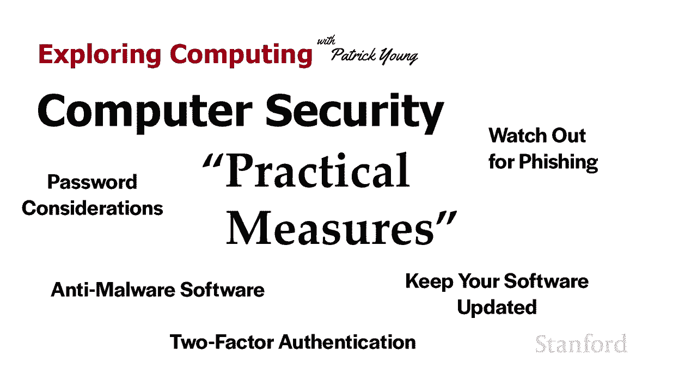
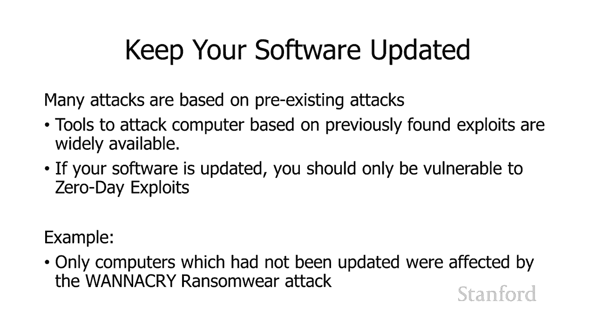
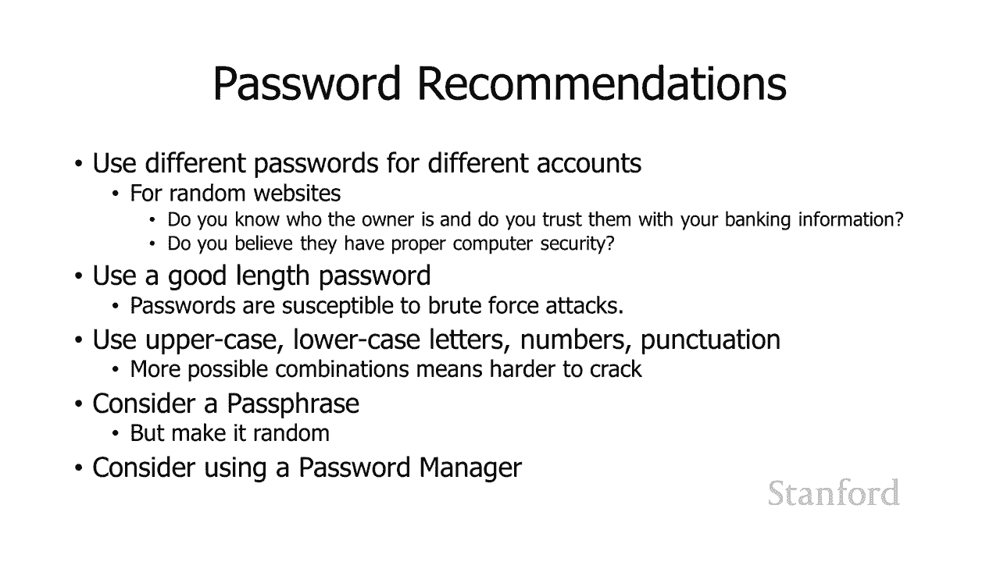
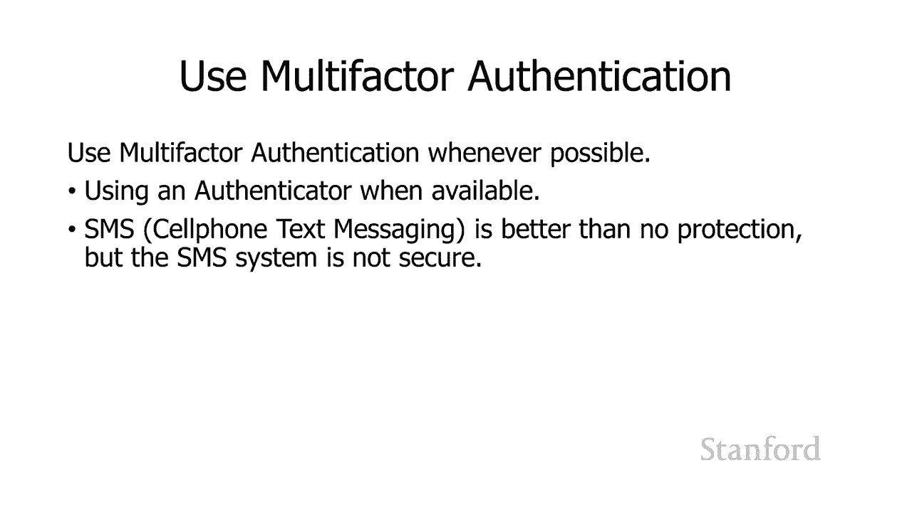
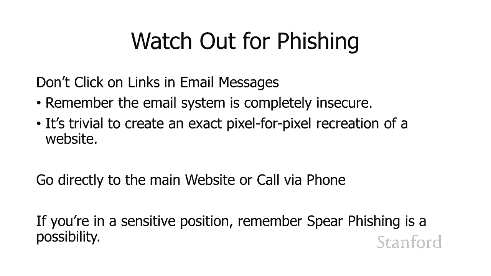

# 【双语字幕+资料下载】斯坦福CS105 ｜ 计算机科学导论(2021最新·完整版) - P60：L22.2- 计算机安全：实际措施 - ShowMeAI - BV1eh411W72E

undefined，欢迎来到，欢迎来到，今天的视频探索计算机安全，今天的视频探索计算机安全，实用措施，实用措施，因此在此视频中我们将，因此在此视频中我们将，讨论您可以，讨论您可以。

专门做的一些事情来确保自己在线安全，专门做的一些事情来确保自己在线安全，undefined，undefined，undefined，此视频中将与之前的视频有一些重叠，此视频中将与之前的视频有一些重叠。

视频，但我确实想将所有，视频，但我确实想将所有，实用建议都放在一个地方，实用建议都放在一个地方，我将很快完成此过程，我将很快完成此过程，因此您知道如果您有，因此您知道如果您有，问题，请务必返回并查看。

undefined，undefined，我们对这些不同机制的更广泛讨论，undefined，undefined，在本季度早些时候，我们已经，在本季度早些时候，我们已经，看到，看到。

了一系列非常可怕的方式，我们的，了一系列非常可怕的方式，我们的，计算机可能会受到攻击，计算机可能会受到攻击，所以我们可以做些什么来保护，所以我们可以做些什么来保护。

自己，自己，所以最重要的事情肯定是，所以最重要的事情肯定是，undefined，undefined，保持您的软件更新它非常，保持您的软件更新它非常，简单，简单，非常直接，并且 请记住，非常直接。

并且 请记住，许多攻击，许多攻击，都是基于预先存在的，都是基于预先存在的，攻击计算机的方式，因此，攻击计算机的方式，因此，有许多不同的工具，有许多不同的工具，可供人们使用，可供人们使用。

e 架子并用它来，e 架子并用它来，攻击计算机，因此，攻击计算机，因此，如果您的软件更新，您将受到，如果您的软件更新，您将受到，保护，免受，保护，免受，除零日漏洞之外的所有攻击，undefined。

undefined，undefined，undefined，undefined，我们不知道的事情，我们不知道的事情。

好吧 嗯，好吧 嗯，一定，一定，要在创建密码时考虑这些密码建议，要在创建密码时考虑这些密码建议，首先，首先，为不同的帐户使用不同的密码，为不同的帐户使用不同的密码，请记住，请记住，如果您只是在。

如果您只是在，不知道的随机网站上创建帐户 那个人是谁，undefined，undefined，第二，即使那个人是，呃，你，第二，即使那个人是，呃，你，认识，认识，一个好心的人，他们可能没有。

一个好心的人，他们可能没有，良好的安全措施，你的，良好的安全措施，你的，密码信息可能会泄露，所以，密码信息可能会泄露，所以，undefined，undefined，不同帐户的密码肯定不同。

不同帐户的密码肯定不同，要非常小心你的，要非常小心你的，电子邮件密码，当然要输入你的，电子邮件密码，当然要输入你的，金融，金融，密码 嗯，使用长度合适的密码，密码 嗯，使用长度合适的密码，密码越长越。

密码越长越，难破解 使用，难破解 使用，大写字母 lo  wercase 字母，大写字母 lo  wercase 字母，数字和标点符号，数字和标点符号，嗯考虑使用密码短语而，嗯考虑使用密码短语而。

不是密码，不是密码，但请记住，为了获得最大效果，但请记住，为了获得最大效果，密码短语只需要，密码短语只需要，包含随机的单词序列，而不是，包含随机的单词序列，而不是，某种短语，某种短语。

而不是某种运动队的欢呼声，而不是某种运动队的欢呼声，最好甚至不会使，最好甚至不会使，在英语中只是，在英语中只是，一堆随机单词塞在一起，一堆随机单词塞在一起。

也考虑使用密码管理器 如果可能，也考虑使用密码管理器 如果可能，请使用多因素身份验证，请使用多因素身份验证，undefined，undefined，选择身份验证器，选择身份验证器，undefined。

undefined，选项 手机应用程序或物理，选项 手机应用程序或物理，身份验证器中的，身份验证器中的，任何一个都比接收短信更可取，undefined，undefined，短信系统不安全。

短信系统不安全，但是，但是，使用基于短信的双因素，使用基于短信的双因素。

身份验证仍然比，身份验证仍然比，没有双因素身份验证要好，没有双因素身份验证要好，小心网络钓鱼 不要点击，小心网络钓鱼 不要点击，链接和电子邮件，链接和电子邮件，记住电子邮件系统是完全。

记住电子邮件系统是完全，不安全，不安全，的 创建网站的，的 创建网站的，逐像素，逐像素，精确再现非常容易 所以仅仅，精确再现非常容易 所以仅仅，因为它看起来和你，因为它看起来和你。

银行的网站一模一样并不意味着它是你，银行的网站一模一样并不意味着它是你，银行的网站，银行的网站，而且很容易欺骗，而且很容易欺骗，电子邮件系统并假装成，电子邮件系统并假装成，undefined。

undefined，你不是的人，而不是，你不是的人，而不是，点击链接直接转到，点击链接直接转到，主要网站，主要网站，呃，自己输入 不要，呃，自己输入 不要，从电子邮件中复制，从电子邮件中复制。

不要从电子邮件中复制任何内容，undefined，undefined，undefined，如果您处于敏感职位并且，如果您处于敏感职位并且，特别担心安全性，特别担心安全性。

请直接通过电话致电公司 不要忘记 鱼叉式网络钓鱼，请直接通过电话致电公司 不要忘记 鱼叉式网络钓鱼，是一种网络钓鱼，是一种网络钓鱼，攻击者研究您的身份并，攻击者研究您的身份并。

弄清楚您应该收到什么样的电子邮件，弄清楚您应该收到什么样的电子邮件，然后精心设计了一封，然后精心设计了一封。

专门设计用于让您打开，专门设计用于让您打开，它的，它的，电子邮件，使用反恶意软件，电子邮件，使用反恶意软件，操作系统已经获得，操作系统已经获得，内置良好的，内置良好的，反恶意软件软件会更好一些，因此。

反恶意软件软件会更好一些，因此，Windows Defender 实际上被认为，Windows Defender 实际上被认为，相当不错，相当不错，但是，但是，如果您去 ess。

您可以从 stanford 获得免费的反恶意软件，如果您去 ess，您可以从 stanford 获得免费的反恶意软件，  stanford，  stanford。

是必不可少的 stanford 软件的缩写，是必不可少的 stanford 软件的缩写，undefined，undefined，您可以在那里获得免费软件，您可以在那里获得免费软件。

以获得最大的安全性 您可以考虑，以获得最大的安全性 您可以考虑，阻止 javascript，阻止 javascript，这将使浏览网页，这将使浏览网页，更烦人，但，更烦人，但，它会增强您的安全。

undefined。

