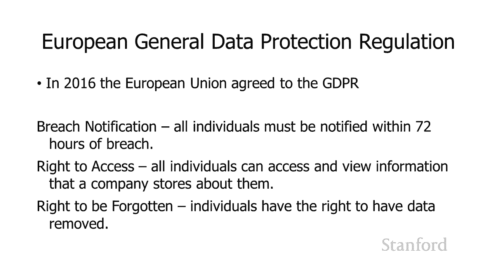
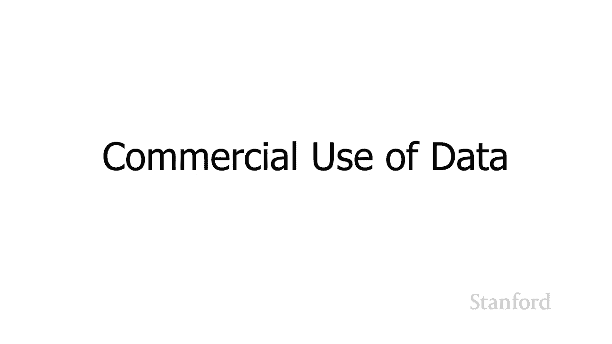
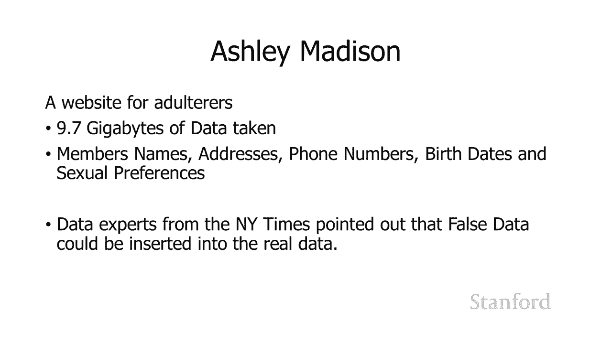
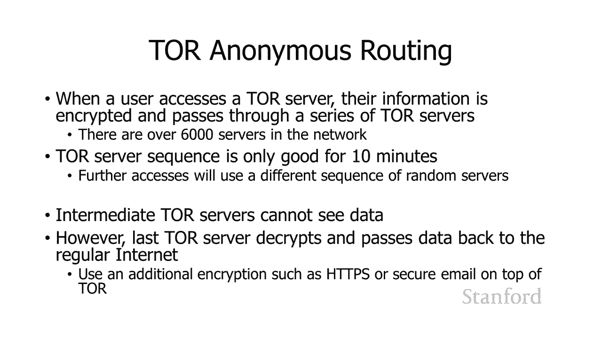
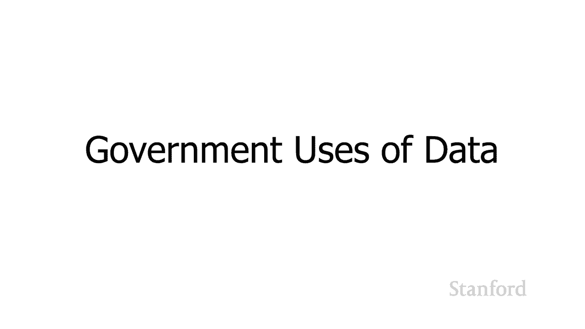

# 【双语字幕+资料下载】斯坦福CS105 ｜ 计算机科学导论(2021最新·完整版) - P61：L23.1- 隐私与大数据：隐私 - ShowMeAI - BV1eh411W72E

undefined，欢迎探索计算，欢迎探索计算，今天的视频是隐私，今天的视频是隐私，所以我认为我们应该谈论的第一件事，所以我认为我们应该谈论的第一件事，是为什么隐私，是为什么隐私，在数字时代有所不同是。

在数字时代有所不同是，什么使隐私，什么使隐私，在网络数字世界中变得独特有趣，在网络数字世界中变得独特有趣，所以我认为最近发生了许多变化，undefined，undefined，呃严重影响隐私。

呃严重影响隐私。

，所以让我们谈谈其中的一些，所以让我们谈谈其中的一些，有更多的信息可，有更多的信息可，用于跟踪，所以，用于跟踪，所以，你知道现在几乎每个人都有，你知道现在几乎每个人都有，手机，手机可以，手机，手机可以。

跟踪我们的运动，跟踪我们的运动，很明显，很明显，当你移动时，你知道，当你移动时，你知道，当你在城市里开车时，当你在城市里开车时，你的手机正在联系，你的手机正在联系，不同的手机信号塔，不同的手机信号塔。

这可以用来跟踪你的，这可以用来跟踪你的，动作，动作，但事实证明，在许多情况下，你有，undefined，undefined，比手机信号塔更精细的跟踪，就像你的手机，undefined。

undefined，一样 手机在周围移动，当你在一个区域移动时，一样 手机在周围移动，当你在一个区域移动时，它也会联系不同的 Wi-Fi，它也会联系不同的 Wi-Fi，网络，网络。

和不同的 Wi-Fi 路由器，和不同的 Wi-Fi 路由器，undefined，undefined，事实证明，这些也，事实证明，这些也，可用于跟踪您的活动，可用于跟踪您的活动，因此仅举个例子。

nordstrom，因此仅举个例子，nordstrom，说，undefined，undefined，undefined，通过观察手机在商店中移动时，通过观察手机在商店中移动时，尝试连接不同网络的位置。

可以尝试跟踪客户，尝试连接不同网络的位置，可以尝试跟踪客户，如何从商店的一个部分移动到另一个部分，undefined，undefined，undefined，现在也到处都是闭路电视摄像机，它们也。

现在也到处都是闭路电视摄像机，它们也，可以用来跟踪我们，可以用来跟踪我们，去哪里了 英国估计每 10 到 15 人就有，去哪里了 英国估计每 10 到 15 人就有，一台闭路电视，undefined。

undefined，亚马逊的，亚马逊的，带摄像头的门铃等技术也可以使用，带摄像头的门铃等技术也可以使用，跟踪运动，跟踪运动，特别是一旦你，特别是一旦你，在一个区域有相对大量的这些。

在一个区域有相对大量的这些，那么你可以将，那么你可以将，来自每个，来自每个，不同门把手，不同门把手，的视频放在一起，以跟踪运动，稍后，的视频放在一起，以跟踪运动，稍后，我们将讨论如何，我们将讨论如何。

使用瓷器 在，使用瓷器 在。

undefined，undefined，以及我们将媒体消费转移，以及我们将媒体消费转移，到数字设备上，到数字设备上，这使得追踪变得非常，这使得追踪变得非常，简单 k 我们的媒体消费习惯，因此。

简单 k 我们的媒体消费习惯，因此，您了解，您了解，数字报纸和杂志 数字，数字报纸和杂志 数字，图书，图书，数字电视节目和电影，数字电视节目和电影，只要您不使用物理，只要您不使用物理，媒体。

而是使用数字，媒体，而是使用数字，媒体，媒体，跟踪，跟踪，您正在查看的所有内容非常简单 您正在，您正在查看的所有内容非常简单 您正在，阅读的所有内容，阅读的所有内容，你看到的一切都可以。

你看到的一切都可以，undefined，undefined，被政府用来确定你的，被政府用来确定你的，可靠性，事实上，可靠性，事实上，稍后我会看到一个例子，稍后我会看到一个例子，说明中国，说明中国。

如何将它用于他们的社会，如何将它用于他们的社会，信用体系，呃，信用体系，呃，被用来确定，被用来确定。

他们的可靠性 公民并，他们的可靠性 公民并，在此基础上给予他们奖励或惩罚，在此基础上给予他们奖励或惩罚，我认为，undefined，undefined，随着我们转向具有，随着我们转向具有。

一些智能技术的智能汽车，情况可能会变得更糟而不是更好，然后，一些智能技术的智能汽车，情况可能会变得更糟而不是更好，然后，我们转向自动驾驶汽车，这，我们转向自动驾驶汽车，这，将非常 轻松跟踪您的活动。

将非常 轻松跟踪您的活动，智能家居可以向可以，智能家居可以向可以，访问您的，访问您的，活动和家庭的任何人提供信息，活动和家庭的任何人提供信息，实际上智能电视几乎是，实际上智能电视几乎是，mos 您。

mos 您，现在购买的具有某种，现在购买的具有某种，AI 功能的电视，假设我可以调用一个操作系统，AI 功能的电视，假设我可以调用一个操作系统，我认为其中许多是基于，我认为其中许多是基于。

android 的，android 的，内置于它们中，允许您，内置于它们中，允许您，选择将不同的应用程序放在，选择将不同的应用程序放在，上面并选择不同的电影，上面并选择不同的电影，和观看 不同的电影。

其中一些，和观看 不同的电影，其中一些，公司实际上在出售，公司实际上在出售。

有关您的观看习惯的信息，有关您的观看习惯的信息，因此除了，因此除了，拥有所有这些信息之外，我们现在还有，拥有所有这些信息之外，我们现在还有，足够的，足够的，处理能力来真正，处理能力来真正，利用它。

利用它，这还可以与，undefined，undefined，存储大量信息的能力相结合， 然后，存储大量信息的能力相结合， 然后，在事实发生后运行处理，在事实发生后运行处理，这使我们能够剥离。

这使我们能够剥离，传统上被认为是私人的东西，undefined，undefined，所以以前假设我们，所以以前假设我们，试图跟踪整个城市的特定车辆，试图跟踪整个城市的特定车辆，也许有人被，也许有人被。

绑架了，绑架了，我们有某种 人质，我们有某种 人质，情况 警方可以使用，undefined，undefined，某些街道上提供的闭路电视摄像机，某些街道上提供的闭路电视摄像机，机架查看交通模式，他们。

机架查看交通模式，他们，可能会说，哦，我们要继续，可能会说，哦，我们要继续，观察人质，呃，观察人质，呃，车辆，车辆，穿越城市，所以这，穿越城市，所以这，是他们以前可以做的事情，是他们以前可以做的事情。

但我们现在可以做或，但我们现在可以做或，undefined，undefined，随着存储变得越来越便宜，我们前进的方向，undefined，undefined，是存储来自，是存储来自。

所有交通摄像头的所有信息，所有交通摄像头的所有信息，并在一段时间内开始，因此，并在一段时间内开始，因此，我们能够节省的确切时间，我们能够节省的确切时间，将取决于 取决于我们的，将取决于 取决于我们的。

存储容量以及存储的便宜程度，存储容量以及存储的便宜程度，但您当然可以想象这样一种，但您当然可以想象这样一种，undefined，undefined，您可以存储几天的，您可以存储几天的，流量，或者，流量。

或者，您知道在某个时候您，您知道在某个时候您，可以开始几个月的流量，可以开始几个月的流量，然后再进行处理，以便您知道，然后再进行处理，以便您知道，也许，也许，现在什么都没有发生，现在什么都没有发生。

但是你就像，但是你就像，嘿嘿嘿嘿嘿，嗯，你知道我认为，嘿嘿嘿嘿嘿，嗯，你知道我认为，某某有丑闻，让我们继续吧，某某有丑闻，让我们继续吧，嗯，嗯，把三个月前的录音带挖出来，把三个月前的录音带挖出来，嗯。

这是他的车牌，嗯，这是他的车牌，嗯，我们走吧 看看我们是否可以，undefined，undefined，从所有交通模式中搜索所有数据，从所有交通模式中搜索所有数据，看看我们是否可以找到他的车牌。

看看我们是否可以找到他的车牌，号码，号码，然后看看他在做什么，所以你，然后看看他在做什么，所以你，知道我认为，知道我认为，我们前进的方向，我们前进的方向，可能会令人担忧 隐私，可能会令人担忧 隐私。

观点，观点，以及这种存储，以及这种存储，大量数据，大量数据，然后能够处理它的组合，然后能够处理它的组合，这就是有时被称为，这就是有时被称为，大数据的东西，它，大数据的东西，它，可供商业，可供商业。

用户和政府用户使用，也是，用户和政府用户使用，也是，我们可能想要考虑，我们可能想要考虑，的东西，的东西，我们想要规范这个我们想要什么样的，我们想要规范这个我们想要什么样的，社会，社会，我们稍后会。

我们稍后会，在讲座中讨论这个问题 当我们讨论，在讲座中讨论这个问题 当我们讨论。

隐私的商业问题，隐私的商业问题，和政府的隐私问题时，和政府的隐私问题时，好吧，就我们的法律而言，好吧，就我们的法律而言，所以事实证明，所以事实证明，我们法律提供的一些保护，我们法律提供的一些保护。

正在被我们的计算能力侵蚀，正在被我们的计算能力侵蚀，undefined，undefined，例如最高法院，例如最高法院，裁定个人有权，裁定个人有权，实践 实际，实践 实际，默默无闻。

因此这种情况的发生方式或，默默无闻，因此这种情况的发生方式或，如何发生的一个例子是，如何发生的一个例子是，使用信息自由法的联邦调查局 rap 表的请求，使用信息自由法的联邦调查局 rap 表的请求。

被拒绝，被拒绝，了，了，这是基于实际隐蔽性的需要，这是基于实际隐蔽性的需要，undefined，undefined，虽然该信息是公开，虽然该信息是公开，可用的 想法是，可用的 想法是，有人必须浏览并。

有人必须浏览并，收集所有公开可用的，收集所有公开可用的，信息，这是一件，信息，这是一件，耗时的事情，因此由于难以追踪所有信息，因此，耗时的事情，因此由于难以追踪所有信息，因此，列出的那些实际上默默无闻。

列出的那些实际上默默无闻，但当然，但当然，现在追踪信息非常容易，现在追踪信息非常容易，事实上，事实上，公司会收集这些信息，您，公司会收集这些信息，您，可能已经在网络上看到了他们的广告商。

可能已经在网络上看到了他们的广告商，例如，例如，您想查看您，您想查看您，高中的另一半在做什么，高中的另一半在做什么，查看他们现在住的地方，查看他们现在住的地方，了解他们的收入，了解他们的收入。

已经结婚了，所以，已经结婚了，所以，实际的默默无闻在，实际的默默无闻在。

很大程度上已经消失了，因为，很大程度上已经消失了，因为，undefined，undefined，欧洲社区可能正在做，欧洲社区可能正在做，的计算能力，的计算能力，积极保护，积极保护，公民隐私的最重要工作。

公民隐私的最重要工作，嗯，他们做了几件事，嗯，他们做了几件事，他们做过的一，他们做过的一，件事是 2014 年欧洲法院，件事是 2014 年欧洲法院，undefined，undefined，裁定。

在某些情况下，其，裁定，在某些情况下，其，公民有权 被遗忘，公民有权 被遗忘，根据这项裁决，搜索引擎，根据这项裁决，搜索引擎，必须删除，必须删除，某些搜索结果，因此如果一家报纸，某些搜索结果。

因此如果一家报纸，有，有，一篇他们以前写过的文章，一篇他们以前写过的文章，他们仍然可以将其留在，他们仍然可以将其留在，他们的，他们的，网站上，但搜索引擎无法，网站上，但搜索引擎无法，直接链接到这些文章。

直接链接到这些文章，中的那些文章。 法院，中的那些文章。 法院，undefined，undefined，关于被遗忘权的裁决半年 谷歌，关于被遗忘权的裁决半年 谷歌，收到了超过 120。

收到了超过 120。

000 项删除信息的请求，000 项删除信息的请求，欧洲共同体采取的另一项举措，undefined，undefined，是欧洲通用数据保护，是欧洲通用数据保护，条例，条例。

这个 uh 于 2016 年达成一致，这个 uh 于 2016 年达成一致，并实施 两年后，并实施 两年后，您最会注意到这一点，因为，您最会注意到这一点，因为，undefined，undefined。

您每次访问网站时都会不断收到烦人的弹出窗口，undefined，undefined，说 g你还好吗明星，说 g你还好吗明星，信息我的意思是事实证明，信息我的意思是事实证明。

加利福尼亚州最近也采取了类似的行动，加利福尼亚州最近也采取了类似的行动，所以，所以，你可能会，你可能会，因为加利福尼亚州的新法律而获得一些额外的弹出窗口。

因为加利福尼亚州的新法律而获得一些额外的弹出窗口，所以一般数据保护，所以一般数据保护，法规实际上做得，法规实际上做得，很好这里是，很好这里是，gdpr，gdpr，要求的关键事项 嗯，如果一家公司存储。

要求的关键事项 嗯，如果一家公司存储，某人的信息被，某人的信息被，泄露 必须在泄露后 72 小时内通知个人，undefined，undefined，没有这项法律这，没有这项法律这，并不罕见 公司。

并不罕见 公司，甚至不告诉人们他们的数据，甚至不告诉人们他们的数据，在那里或，undefined，undefined，尽管人们知道他们的数据在，尽管人们知道他们的数据在，外面，但尽可能长时间等待，外面。

但尽可能长时间等待，对于这些人来说，保护自己可能是一件重要的事情，undefined，undefined，gdpr 要求所有，gdpr 要求所有，信息已，信息已，泄露的个人在 72 小时内得到通知。

泄露的个人在 72 小时内得到通知，个人也有 访问，undefined，undefined，公司存储的有关他们的信息，公司存储的有关他们的信息。

的权利 他们有权删除，的权利 他们有权删除，有关他们，有关他们，和公司的数据 提醒他们，他们，和公司的数据 提醒他们，他们，应该，应该，从一开始就在他们的产品中设计隐私。

从一开始就在他们的产品中设计隐私，此外，此外，符合某些特征的公司必须有，符合某些特征的公司必须有，数据保护官，这些数据，数据保护官，这些数据，保护官必须向，保护官必须向，最高管理层报告，最高管理层报告。

他们有责任确保，他们有责任确保，数据受到适当保护，数据受到适当保护，违反 GDPR 确实有一些问题，违反 GDPR 确实有一些问题，undefined，undefined，他们可能需要，他们可能需要。

高达公司全球收入 4% 的罚款，高达公司全球收入 4% 的罚款。

undefined，undefined，让我们来看看，让我们来看看。

数据的商业用途，数据的商业用途，所以隐私倡导者，所以隐私倡导者，有时会谈论一件事，有时会谈论一件事，这个概念是你是，这个概念是你是，客户还是产品，客户还是产品，所以这基本上是说，undefined。

undefined，如果你正在使用产品并且你，如果你正在使用产品并且你，没有，没有，为它付费并且你没有，为它付费并且你没有，undefined，undefined，从非- 利润，从非- 利润，或者政府。

那么，undefined，undefined，undefined，undefined，如果你付钱的话，你从中获得服务的公司需要以某种方式赚钱 ng，如果你付钱的话。

你从中获得服务的公司需要以某种方式赚钱 ng，很好，这就是他们，很好，这就是他们，赚钱的方式，赚钱的方式，如果你不付钱，那么，如果你不付钱，那么，undefined，undefined。

他们可能是通过出售，他们可能是通过出售，对你的访问权或有关你的信息来赚钱的，对你的访问权或有关你的信息来赚钱的，所以你知道他们要么直接，所以你知道他们要么直接，获取有关信息 您，获取有关信息 您。

并直接销售，或者，并直接销售，或者，他们正在向您展示有针对性的广告，undefined，undefined，不幸的是，不幸的是，您现在既可以成为客户，您现在既可以成为客户，又可以成为产品，因此。

又可以成为产品，因此，undefined，undefined，作为 2017 年的示例，互联网服务提供商，作为 2017 年的示例，互联网服务提供商，现在可以，现在可以。

在您的网页浏览中出售信息 对他人的习惯，在您的网页浏览中出售信息 对他人的习惯，即使你实际上是，即使你实际上是。

undefined，undefined，所以我们应该担心所以你知道，所以我们应该担心所以你知道，要考虑的一件事是嘿，要考虑的一件事是嘿，我使用谷歌或我使用 bing，我使用谷歌或我使用 bing。

或我使用呃我猜duckduckgo我，或我使用呃我猜duckduckgo我，想不出任何 其他服务，想不出任何 其他服务，作为我的搜索引擎，显然他们，作为我的搜索引擎，显然他们，必须支付账单，所以。

必须支付账单，所以，看到有针对性的广告，看到有针对性的广告，undefined，undefined，因为我可以免费使用谷歌，这，因为我可以免费使用谷歌，这，似乎是一件合理的事情，似乎是一件合理的事情。

但是事情 需要担心，但是事情 需要担心，的是这条线在哪里，这条线是，的是这条线在哪里，这条线是，由习俗强制执行的，还是由法律强制执行的，由习俗强制执行的，还是由法律强制执行的，并为您提供一种。

并为您提供一种，隐私倡导者已经，隐私倡导者已经，提出的经典场景，如果我，提出的经典场景，如果我，正在搜索，正在搜索，有关癌症的网站，也许 我有一个朋友，有关癌症的网站，也许 我有一个朋友，患有癌症。

患有癌症，或者父母患有癌症，或者我患有癌症，或者父母患有癌症，或者我患有癌症，他们无法知道，但是，他们无法知道，但是，搜索引擎是否可以，搜索引擎是否可以，获取我正在，获取我正在，搜索癌症的信息，然后。

搜索癌症的信息，然后，将这些信息出售给我的保险公司，将这些信息出售给我的保险公司，undefined，undefined，和 让我的保险公司根据，和 让我的保险公司根据。

我实际上可能患有癌症的理论来提高我的费率，我实际上可能患有癌症的理论来提高我的费率，我们，undefined，undefined，对此是否满意，如果我们对此不满意，对此是否满意，如果我们对此不满意。

那如何执行呢？那如何执行呢？另一件你应该做的事情，另一件你应该做的事情，当您在网站上，当您在网站上，输入您认为，输入您认为，是私人，是私人，的信息或将其提供给，的信息或将其提供给，公司，公司，时。

您是否知道这两者，时，您是否知道这两者，是否合法，但，是否合法，但，他们与他人共享是，他们与他人共享是，合法的 那么是否有人，合法的 那么是否有人，可能非法，可能非法，获取这些信息，所以你。

获取这些信息，所以你，知道除了思考，知道除了思考，我认为这家公司有良好的，我认为这家公司有良好的，意图，意图，你还应该考虑我是否相信，你还应该考虑我是否相信，这家公司有足够的安全性。

这家公司有足够的安全性，这些信息不会被泄露，这些信息不会被泄露，实际上泄露，实际上泄露，了他们不会被黑客攻击，了他们不会被黑客攻击，尽管他们可能有任何好意，undefined，undefined。

所以让我们看几个，所以让我们看几个，undefined，undefined。

也许人们不应该信任，也许人们不应该信任，这些公司的我们的信息，这些公司的我们的信息，所以其中一个是 equifax，所以其中一个是 equifax，所以 equifax 是一家信用。

所以 equifax 是一家信用，机构，它是那些，机构，它是那些，跟踪，跟踪，我们在金融世界中的财务和信用卡所做的事情的，我们在金融世界中的财务和信用卡所做的事情的，公司之一，公司之一，以及我们是否。

undefined，undefined，值得信用担忧，所以他们被，值得信用担忧，所以他们被，破坏了 许多人的姓名、，破坏了 许多人的姓名、，社会安全号码、，社会安全号码、，出生日期和地址。

出生日期和地址，在这次违规行为中被盗，在这次违规行为中被盗，此外还有一些人，此外还有一些人，的驾照号码，的驾照号码，被盗 事实证明，如果你有，被盗 事实证明，如果你有，一个社会安全号码和一个。

一个社会安全号码和一个，驾照，驾照，你就可以创建假身份并，你就可以创建假身份并，为人们创建信用卡账户，为人们创建信用卡账户，这样组合就非常，这样组合就非常，危险，嗯，危险，嗯。

只是为了给那些信息被泄露的人踢一些额外的沙子，undefined，undefined，破坏了，破坏了，um 有人创建了一个虚假的帮助网站，um 有人创建了一个虚假的帮助网站，并且有一个真正的帮助网站。

并且有一个真正的帮助网站，名为，名为，equifaxsecurity2017。com 有人创建了，equifaxsecurity2017。com 有人创建了。

一个名为 securityequifax2017。com 的网站，一个名为 securityequifax2017。com 的网站，它足够接近，equifax，它足够接近，equifax，不，不。

小心在他们的推特帐户上发布了错误的网站，undefined，undefined，但好消息是 在这种情况下，但好消息是 在这种情况下，假网站是由安全专家创建的，目的是，假网站是由安全专家创建的，目的是。

为了，为了，说明这，说明这，一点 关于 equifax 漏洞的另一件事有点奇怪，一点 关于 equifax 漏洞的另一件事有点奇怪，undefined，undefined。

我们都不是 equifax 的客户，我们，我们都不是 equifax 的客户，我们，真的不同意将我们的，真的不同意将我们的，信息放在那里，信息放在那里，嗯，我的意思是，我们注册的信用卡上可能有一些，嗯。

我的意思是，我们注册的信用卡上可能有一些，细则，细则，或者，或者，我们工作的银行说他们是，我们工作的银行说他们是，能够传递有关 equifax 的信息，但，能够传递有关 equifax 的信息，但。

我们都不是，我们都不是，equifax 的直接客户，但他们拥有所有这些，equifax 的直接客户，但他们拥有所有这些。

信息，而这些信息都，信息，而这些信息都，丢失了，丢失了，这是另一个著名的例子，这是另一个著名的例子，ashley madison，undefined，undefined，undefined。

ashley madison 是一个供通奸者使用的约会网站，ashley madison 是一个供通奸者使用的约会网站，undefined，undefined，他们被黑客入侵，窃取了 9。7 GB 的。

他们被黑客入侵，窃取了 9。7 GB 的，数据，包括会员姓名，数据，包括会员姓名，地址电话号码出生日期和，地址电话号码出生日期和，性取向，性取向，嗯纽约时报指出的一件事，嗯纽约时报指出的一件事，是，是。

当呃这个信息被发布，当呃这个信息被发布，时 黑客完全有可能在其中，时 黑客完全有可能在其中，插入一些虚假数据，插入一些虚假数据，所以是的，所以是的，无论如何，人们相信阿什利·麦迪逊，无论如何。

人们相信阿什利·麦迪逊，的信息，的信息，他们不应该拥有也许阿什利·，他们不应该拥有也许阿什利·。

麦迪逊的意图是好的，麦迪逊的意图是好的，但他们没有良好的计算机，但他们没有良好的计算机，安全性，安全性，所以我们的下一个例子，所以我们的下一个例子，facebook 上有超过 5000 万份个人资料。

facebook 上有超过 5000 万份个人资料，被盗用并出售给，被盗用并出售给，剑桥分析公司的，剑桥分析公司的，用户吗？ 一位癌症，用户吗？ 一位癌症，教授告诉他们，他们的数据只会，教授告诉他们。

他们的数据只会，用于学术目的，用于学术目的，嗯，不仅是，嗯，不仅是，那些认为它，那些认为它，只会用于学术目的的人的数据被，只会用于学术目的的人的数据被，拿走了，拿走了，而且事实证明，所，而且事实证明。

所，涉及的教授能够 访问，涉及的教授能够 访问，他们朋友的信息，他们朋友的信息，所以，所以，这与之前的例子有点不同，这与之前的例子有点不同，因为，因为，这不是公司被黑客入侵，这不是公司被黑客入侵。

而是他们正在，而是他们正在，与某人合作，某人，与某人合作，某人，违反了协议条款并做了，违反了协议条款并做了，一些事情 那是不诚实的，一些事情 那是不诚实的，但呃你知道，尽管如此，所，但呃你知道。

尽管如此，所，涉及的人的信息，涉及的人的信息，被盗取并出售给第三方，被盗取并出售给第三方，facebook 并没有在技术上被黑客入侵，但，facebook 并没有在技术上被黑客入侵，但，人们有点被结果。

人们有点被结果，证明是，证明是，一种骗局，呃那个人，一种骗局，呃那个人，有意做一些不值得信赖的事情，有意做一些不值得信赖的事情，您可能会争辩说这可以说，您可能会争辩说这可以说，是社会工程的一个案例。

是社会工程的一个案例，此外 facebook 有，此外 facebook 有，几次 你不得不解雇，几次 你不得不解雇，员工，因为这些员工是，undefined，undefined。

利用他们在 Facebook 的职位，利用他们在 Facebook 的职位，进行网络跟踪的人，进行网络跟踪的人，所以这些都提醒你，如果你，所以这些都提醒你，如果你，把信息放在那里，把信息放在那里。

即使公司有良好的意图，即使公司有良好的意图，不以某种方式分享这些信息，不以某种方式分享这些信息，undefined，undefined，呃你知道你可能不希望它被，呃你知道你可能不希望它被，共享，共享。

有可能会发生不好的事情，有可能会发生不好的事情，并且信息，并且信息。

无论如何，无论如何，都会泄漏 好吧 我们最后一个例子，都会泄漏 好吧 我们最后一个例子，是人事，是人事，管理办公室 人事管理办公室充当，undefined，undefined。

联邦的人力资源部门 政府和其他，联邦的人力资源部门 政府和其他，事情，它处理安全许可，事情，它处理安全许可，他们被黑客入侵 信息访问，他们被黑客入侵 信息访问，包括，包括，带有姓名地址出生日期和。

带有姓名地址出生日期和，社会安全号码的人事档案，社会安全号码的人事档案，可能更麻烦呃它包括，可能更麻烦呃它包括，安全许可的背景调查，安全许可的背景调查，其中包括诸如，其中包括诸如。

您知道您是否吸毒之类的事情，您知道您是否吸毒之类的事情，你知道，你知道，你做过的事情可能会导致你 你，你做过的事情可能会导致你 你，被勒索了，被勒索了，所以这些都是，所以这些都是，可能进入背景。

可能进入背景，调查的各种事情，它会被，调查的各种事情，它会被，存储在他们的电脑上，这些电脑，存储在他们的电脑上，这些电脑，被黑了，好人，此外，undefined，undefined。

政府雇员的指纹数字图像现在也被盗，政府雇员的指纹数字图像现在也被盗，了，至于是谁干的 黑客，了，至于是谁干的 黑客，可能是中国 使用，可能是中国 使用，的工具 呃与，的工具 呃与，中国黑客有关。

中国黑客有关，事实上，一名中国人被，事实上，一名中国人被，指控与，指控与，undefined，undefined，人事管理办公室使用。

undefined，undefined，的工具之一相关，的工具之一相关，与隐私有关，与隐私有关。

因此一种用于，因此一种用于，破坏隐私的技术称为网络，破坏隐私的技术称为网络，信标或网络错误，信标或网络错误，因此它们用于跟踪互联网上的用户，undefined，undefined。

你们可以弄清楚这些是如何工作的，你们可以弄清楚这些是如何工作的，因为您知道 html 是如何工作的，并且您，因为您知道 html 是如何工作的，并且您，知道 http 现在的工作原理。

知道 http 现在的工作原理，本质上，网络错误或网络信标，本质上，网络错误或网络信标，是什么，它是一张，是什么，它是一张，一张的图像，一张的图像，显示在网页上 它是，显示在网页上 它是，透明的。

因此人们实际上并不，透明的，因此人们实际上并不，请注意它就在那里，请注意它就在那里，这有时被称为，这有时被称为，跟踪像素，跟踪像素，这里的想法是这个跟踪像素，这里的想法是这个跟踪像素。

有一个唯一的 ID 号，有一个唯一的 ID 号，它标识了，它标识了。

这个网页已被提供给的特定个人，这个网页已被提供给的特定个人，这可以用于几个，这可以用于几个，不同的 目的，不同的 目的，因此它可以用于电子邮件，因此它可以用于电子邮件，跟踪。

因此如果您在 html 邮件文件上有一个不可见的，跟踪，因此如果您在 html 邮件文件上有一个不可见的，图像，图像，那么当有人，那么当有人，打开该，打开该，邮件文件时。

html 文件的 img src，邮件文件时，html 文件的 img src，等于它的名称有一个，等于它的名称有一个，undefined，undefined，此特定电子邮件的唯一 ID 号，当。

此特定电子邮件的唯一 ID 号，当，服务器收到，服务器收到，对该隐形跟踪像素图像的请求时，对该隐形跟踪像素图像的请求时，它说哦，拥有，它说哦，拥有，该 ID 号的人，该 ID 号的人。

刚刚打开了电子邮件消息，这就是，刚刚打开了电子邮件消息，这就是，为什么，为什么，我收到该特定跟踪请求的原因，undefined，undefined，跟踪图像 嗯，企业可以使用它，跟踪图像 嗯。

企业可以使用它，来查看某人是否阅读了，来查看某人是否阅读了，特定的电子邮件，特定的电子邮件，垃圾邮件发送者也可以使用它来，垃圾邮件发送者也可以使用它来，查看该电子邮件地址是否处于活动状态。

查看该电子邮件地址是否处于活动状态，因此垃圾邮件发送者会发送一堆，因此垃圾邮件发送者会发送一堆，html 中的电子邮件和所有电子邮件都，html 中的电子邮件和所有电子邮件都，完全相同，完全相同。

除了跟踪信标，所以，除了跟踪信标，所以，会有 img，会有 img，src 等于，然后会有，src 等于，然后会有，一个唯一的 id 号，一个唯一的 id 号。

dot jpeg 或唯一的 id 号 dot png，dot jpeg 或唯一的 id 号 dot png，现在会发生什么 当，现在会发生什么 当，您继续接收该电子邮件时，您继续接收该电子邮件时。

如果您的电子邮件设置为显示，如果您的电子邮件设置为显示，undefined，undefined，您的网络浏览器将要显示的图像，或者您的，您的网络浏览器将要显示的图像，或者您的，电子邮件程序将向。

电子邮件程序将向，跟踪信标来自的任何地方发送 htc 请求，undefined，undefined，并且它将发送请求，undefined，undefined。

具有只有您在电子邮件中收到的唯一 ID 号的特定图像文件，undefined，undefined，然后另一端的服务器，然后另一端的服务器，将看到，undefined，undefined。

请求了该特定 ID 号，请求了该特定 ID 号，并且能够将其，并且能够将其，与原始电子邮件匹配，与原始电子邮件匹配，已发送的消息，您可能已经，已发送的消息，您可能已经，注意到，许多电子邮件程序，注意到。

许多电子邮件程序，都有不显示图像的选项，都有不显示图像的选项，直到，直到，您明确说哦，我相信，您明确说哦，我相信，发件人，发件人，现在继续显示图像，现在继续显示图像。

这是主要的 他们这样做的原因是，这是主要的 他们这样做的原因是，为了防止，为了防止，undefined，undefined，嗯，这些也可以用来跟踪，嗯，这些也可以用来跟踪，人们在互联网上的活动。

人们在互联网上的活动，undefined，undefined，使用第三方 cookie，所以当，使用第三方 cookie，所以当，我们谈论第三方时，我们谈论第三方时，我们谈论的，我们谈论的。

是前两个 派对是你和，是前两个 派对是你和，你正在访问的网站，所以有，你正在访问的网站，所以有，undefined，undefined，一个是第一方，第二方和，一个是第一方，第二方和，第三方是其他方。

第三方是其他方，所以这里的想法是网站，所以这里的想法是网站，可以允许第三方（，可以允许第三方（，例如广告网络），例如广告网络），跟踪用户的，跟踪用户的，跨多个网站的操作，这可以，跨多个网站的操作。

这可以，通过这些跟踪像素来完成，这些跟踪，通过这些跟踪像素来完成，这些跟踪，像素我们刚刚在，像素我们刚刚在，这些，这些，不可见的像素图像之前讨论过，不可见的像素图像之前讨论过。

或者它们实际上可能是通过可见的广告来完成的，undefined，undefined，但是这里发生的是当您，但是这里发生的是当您，访问网页时，访问网页时，使用 cookie 参与此。

使用 cookie 参与此，第三方网络的，第三方网络的，情况是，情况是，除了该网页的常规内容之外，除了该网页的常规内容之外，您，您，还将 html 文件也将引用，还将 html 文件也将引用。

其中之一 t 跟踪像素呃，其中之一 t 跟踪像素呃，网络信标图像，或者它将，网络信标图像，或者它将，引用显示在网页上的实际广告，undefined，undefined，无论是请求该网络信标。

无论是请求该网络信标，还是该图像文件，不是来自他们的，还是该图像文件，不是来自他们的，服务器，而是来自第三方服务器，undefined，undefined，第三方服务器发生的情况。

第三方服务器发生的情况，是第三方向您发送该图像，是第三方向您发送该图像，无论它是跟踪信标还是，无论它是跟踪信标还是，实际广告，实际广告，此外它还，此外它还，在您的网络浏览器上放置一个 cookie。

因此 cookie 存储，在您的网络浏览器上放置一个 cookie，因此 cookie 存储，是一种用于存储，是一种用于存储，少量信息，少量信息，的技术 你的网络浏览器可以在。

的技术 你的网络浏览器可以在，你下次访问它时设置回网站，你下次访问它时设置回网站，所以假设你去亚马逊 呃，所以假设你去亚马逊 呃，亚马逊会，亚马逊会，undefined，undefined。

在你的网络浏览器中放一些信息，这样，在你的网络浏览器中放一些信息，这样，你下次访问亚马逊时，你下次访问亚马逊时，你的网络浏览器 将把该，你的网络浏览器 将把该，信息发送回亚马逊，这，信息发送回亚马逊。

这，就是亚马逊在您下次访问时实际上知道您是谁的，undefined，undefined，方式，类似地，您知道您是否，方式，类似地，您知道您是否，订阅了一些东西，所以 就像你知道，订阅了一些东西。

所以 就像你知道，我订阅了纽约时报，我订阅了纽约时报，纽约时报，纽约时报，通过把这个小 cookie 放在我的网络，通过把这个小 cookie 放在我的网络，浏览器上来跟踪我，下次我，浏览器上来跟踪我。

下次我，访问纽约时报时，访问纽约时报时，我的网络浏览器将那个 cookie 发送，我的网络浏览器将那个 cookie 发送，回纽约时报 我访问并说哦，回纽约时报 我访问并说哦，那是帕特里克。

那是帕特里克，他有纽约时报的学术访问权限，他有纽约时报的学术访问权限，所以，所以，嗯，他很好，所以这里的想法是，嗯，他很好，所以这里的想法是，这些第三方网络，因为，这些第三方网络，因为。

html 文件引用，html 文件引用，了来自这些，了来自这些，第三方服务器的呃图像，第三方服务器的呃图像，服务器现在能够向您发送，服务器现在能够向您发送，跟踪信息并将此 cookie。

跟踪信息并将此 cookie，信息，信息，放入您的网络浏览器，当您移动，放入您的网络浏览器，当您移动，到另一个网站时，到另一个网站时，如果该网站也，如果该网站也，再次提供图像，无论它们是，再次提供图像。

无论它们是，这些不可见的网络信标还是它们的，这些不可见的网络信标还是它们的，可见广告，可见广告，向第三方请求，向第三方请求，广告，广告，服务器出现他们之前放入的第三方 cookie，undefined。

undefined，也将发送给他们，所以，也将发送给他们，所以，他们会像哦，这是同一个用户，他们会像哦，这是同一个用户，我 在另一个网站上看到了这个用户，我 在另一个网站上看到了这个用户。

我现在在这个网站上看到了他们，只要您访问该跟踪网络上的不同网站，我现在在这个网站上看到了他们，只要您访问该跟踪网络上的不同网站，他们就可以建立，他们就可以建立，您访问的所有不同类型网站的图片。

您访问的所有不同类型网站的图片，undefined，undefined，undefined，undefined，建立，建立，有关，有关，您的所有网络浏览习惯的所有信息，您的所有网络浏览习惯的所有信息。

并，并，根据他们想要做什么来为您创建个人资料，undefined，undefined，undefined，undefined，undefined，显示，显示，在商店网页上，或者商店可能，在商店网页上。

或者商店可能，与，与，广告，广告，网络合作，即使商店实际上并未，网络合作，即使商店实际上并未，显示图像，显示图像，我输入了我的姓名和电话号码，我输入了我的姓名和电话号码，以及其他信息，以及其他信息。

这些信息可以与广告网络，这些信息可以与广告网络，结合使用 广告，结合使用 广告，网络 如果该网站选择，网络 如果该网站选择，将该信息传递给广告，将该信息传递给广告，网络，网络，则广告网络不仅可以。

则广告网络不仅可以，了解我的网络浏览习惯 是，了解我的网络浏览习惯 是，但他们可能有我的姓名，但他们可能有我的姓名，地址和电话号码，地址和电话号码，以及我输入的任何其他信息，以及我输入的任何其他信息。

呃，undefined，undefined，与跟踪网站，与跟踪网站，一起工作的主网站没问题所以这听起来不太，一起工作的主网站没问题所以这听起来不太，好，好，我们可以做些什么来保护我们的隐私。

我们可以做些什么来保护我们的隐私，undefined，undefined，上一课我们讨论了一些，上一课我们讨论了一些，关于 vpns 虚拟专用网络的内容，以及，关于 vpns 虚拟专用网络的内容，以及。

undefined，undefined，它们如何提供一些隐私，如果你，它们如何提供一些隐私，如果你，想，想，更进一步的话，有一种叫做 Tor Tor 的东西，更进一步的话。

有一种叫做 Tor Tor 的东西，是一种特殊的路由系统，是一种特殊的路由系统，旨在让用户，旨在让用户，在互联网上保持匿名，在互联网上保持匿名，你可以善良 把它想象成一个具有更多保护的超级。

你可以善良 把它想象成一个具有更多保护的超级，强大的 vpn，强大的 vpn，但，但，它的速度要慢得多 tor 实际上，它的速度要慢得多 tor 实际上，代表洋葱路由器，它指的是，代表洋葱路由器。

它指的是，undefined，undefined。

当用户访问被撕裂的服务器时它使用的网络的多层性质，undefined，undefined，他们的信息被加密，他们的信息被加密，并通过 一系列，并通过 一系列，Tor 服务器，网络中有 6 000 多。

Tor 服务器，网络中有 6 000 多，台服务器，台服务器，因此当您继续并，因此当您继续并，通过 Tor 访问某些内容时，会发生什么，通过 Tor 访问某些内容时，会发生什么，发生的情况是。

发生的情况是，您将通过 Tor 网络获得一个特殊的序列，您将通过 Tor 网络获得一个特殊的序列，您的，您的，信息将从，信息将从，一个 Tors 服务器传递到另一个 Tor 服务器，然后。

一个 Tors 服务器传递到另一个 Tor 服务器，然后，再传递到另一个我们的服务器，再传递到另一个我们的服务器，当信息返回时，它，当信息返回时，它，应该遵循与信息相同的，应该遵循与信息相同的。

路径 该路由，路径 该路由，信息仅适用于 10 分钟，信息仅适用于 10 分钟，如果您在 10 分钟后再次访问，如果您在 10 分钟后再次访问，您将获得不同，您将获得不同，序列的随机，序列的随机。

服务器，中间 Tor 服务器无法，服务器，中间 Tor 服务器无法，看到数据是什么，看到数据是什么，但最终是为了让您，但最终是为了让您，访问常规服务器 Internet。

访问常规服务器 Internet，嗯最终在远端，嗯最终在远端，信息将必须被，信息将必须被，解密，并且，解密，并且，需要发现您请求的目的地，undefined，undefined。

因此最后一个 Tor 服务器将能够，undefined，undefined，对您设置的信息有所了解，undefined，undefined，并且 因此，如果您希望您的信息，并且 因此。

如果您希望您的信息，完全隐藏，完全隐藏，在 Tor 服务器之外，您需要，在 Tor 服务器之外，您需要，在仅使用 Tor 的基础上使用加密，在仅使用 Tor 的基础上使用加密。

这样您就可以使用 https，这样您就可以使用 https，或 安全电子邮件 请注意，或 安全电子邮件 请注意，通过使用 Tor 本身，通过使用 Tor 本身。

你并没有完全加密你的数据，你并没有完全加密你的数据，好吧，让我们谈谈政府，好吧，让我们谈谈政府，对数据的使用以及，对数据的使用以及，政府对隐私的担忧，所以，政府对隐私的担忧，所以。

我经常在课堂上开玩笑的一件事是，undefined，undefined，我真的不 不在乎国家安全局是否可以阅读，我真的不 不在乎国家安全局是否可以阅读，我的电子邮件，所以，我的电子邮件，所以。

你知道这里的基本思想是我确实，你知道这里的基本思想是我确实，想保护自己免受随机黑客的攻击，想保护自己免受随机黑客的攻击，undefined，undefined，但是如果国家安全局想闯入我的。

但是如果国家安全局想闯入我的，帐户，帐户，我并没有声称国家安全局拥有如此良好，我并没有声称国家安全局拥有如此良好，的安全性，的安全性，无法破坏我的东西，无法破坏我的东西，并阅读我发送给我。

并阅读我发送给我，学生，学生，的电子邮件，所以请注意我，的电子邮件，所以请注意我。

发送给您的电子邮件以及您发送给我的电子邮件，undefined，undefined，我们应该这样做，我们应该这样做，对此我是否应该，对此我是否应该，担心美国政府，担心美国政府。

也许国家安全局实际上可以很好地闯入我的，也许国家安全局实际上可以很好地闯入我的，帐户这是在线思考的一些事情，undefined，undefined，匿名可以保护，匿名可以保护，毒贩和恐怖组织。

毒贩和恐怖组织，并允许在线骚扰我 很多，并允许在线骚扰我 很多，人往往没有，人往往没有，追索权，另一方面，追索权，另一方面，匿名也保护了女性权利，匿名也保护了女性权利，同性恋权利，同性恋权利。

和人权活动家在，undefined，undefined，他们可能面临政府骚扰或更糟，他们可能面临政府骚扰或更糟，的国家开展业务，所以，的国家开展业务，所以，我认为这是一把，我认为这是一把。

双刃剑 一方面，双刃剑 一方面，隐私可以用于非常糟糕的，隐私可以用于非常糟糕的，事情，另一方面，事情，另一方面，隐私可以用于非常好的，隐私可以用于非常好的，事情，事情，所以不清楚这个问题是否有直接。

所以不清楚这个问题是否有直接，答案，答案，但最终如果你想看看，但最终如果你想看看，政府可以做，政府可以做，什么 想要完全跟踪它的，什么 想要完全跟踪它的，所有公民，所有公民。

你可以看看中国正在发生的事情，你可以看看中国正在发生的事情，所以，undefined，undefined，中国正在做一些与，中国正在做一些与，隐私问题相关的不同事情，并，隐私问题相关的不同事情，并。

利用现代计算的所有功能，利用现代计算的所有功能，undefined，undefined，所以他们正在做的事情之一，undefined，undefined，undefined，据华盛顿邮报报道。

据华盛顿邮报报道，共产党希望，共产党希望，在和谐中建立真诚的文化。undefined，undefined，保持信任是光荣的社会主义社会，保持信任是光荣的社会主义社会，目标是在一个地方收集。

undefined，undefined，有关中国公司和，有关中国公司和，公民的所有在线可用信息，公民的所有在线可用信息，然后，undefined，undefined，根据他们的政治商业。

根据他们的政治商业。

社会和法律，社会和法律，信用为每个人打分 大西洋将该系统描述，信用为每个人打分 大西洋将该系统描述，为，为，该系统为大棒和胡萝卜提供了大量，undefined，undefined，的颠覆性政治会议或。

的颠覆性政治会议或，宗教服务，例如，宗教服务，例如，或频繁的已知出没的建议是，或频繁的已知出没的建议是，在，在，与未注册的非正式，与未注册的非正式，企业的桌面业务下到期的，其想法是。

企业的桌面业务下到期的，其想法是，网络将了解它并，网络将了解它并，通过减少，通过减少，国家希望其公民相信，国家希望其公民相信，根据 bbc 的说法，根据 bbc 的说法，试图逃避，试图逃避。

此类行为的发现毫无意义，此类行为的发现毫无意义，八家中国，八家中国，公司，公司，正在试验国家资助的，正在试验国家资助的，社会信用试点项目，社会信用试点项目，其中一个项目社会信用评分。

其中一个项目社会信用评分，被，被，使用 尽管在，使用 尽管在，大学四年级上过中文 rter 恐怕，大学四年级上过中文 rter 恐怕，undefined，undefined，我不会说中文。

所以我要说再见，我不会说中文，所以我要说再见，嘿，但这可能是完全错误的，嘿，但这可能是完全错误的，对不起，中国最大的，对不起，中国最大的，婚介服务，所以这里的想法是，婚介服务，所以这里的想法是。

他们正在使用社会信用评分，他们正在使用社会信用评分，进行婚介，进行婚介，嗯，一次又一次 引用，嗯，一次又一次 引用，华盛顿邮报的前一篇，undefined，undefined，文章，文章。

根据华盛顿邮报，根据华盛顿邮报，在瑞典县的一个节目中，在课堂笔记中提供了所有这些文章的链接。 公民被，在瑞典县的一个节目中，在课堂笔记中提供了所有这些文章的链接。 公民被，评为 a 到 d。

评为 a 到 d，公民被分为四个，公民被分为四个，级别，级别，a 级合格，a 级合格，创业时的政府支持，undefined，undefined，申请入党，申请入党，政府或军队或申请，政府或军队或申请。

晋升时的优惠待遇，晋升时的优惠待遇，广告级别的人被排除在，广告级别的人被排除在，官方支持或就业之外，官方支持或就业之外，所以基本上中国政府正在，所以基本上中国政府正在，获取我们，获取我们。

开始的所有信息 讲课时说，开始的所有信息 讲课时说，嘿，因为我们现在处于数字，嘿，因为我们现在处于数字，世界中，跟踪您的，世界中，跟踪您的，undefined，undefined，动作非常容易。

非常容易看到，动作非常容易，非常容易看到，你在读什么样的书，你在看什么样的，你在读什么样的书，你在看什么样的，电影，电影，他们可以分辨出你在和谁交谈，他们可以分辨出你在和谁交谈。

中国政府正在综合所有这些，中国政府正在综合所有这些，信息，信息，并决定他们认为你是一个多么优秀的公民，并决定他们认为你是一个多么优秀的公民，以及你的亲密程度，以及你的亲密程度，正在遵循告诉党的路线。

正在遵循告诉党的路线，在此基础上他们将控制，在此基础上他们将控制。

您对不同资源的访问，您对不同资源的访问，或者如果您越界，他们将尝试惩罚您，undefined，undefined，嗯他们正在做的另一件事，嗯他们正在做的另一件事，是 他们正在使用闭路电视。

undefined，undefined，摄像机 纽约时报报道说，摄像机 纽约时报报道说，中国政府使用面部，中国政府使用面部，识别技术来跟踪和，识别技术来跟踪和，控制维吾尔人，控制维吾尔人。

这是一个主要是穆斯林的少数民族，所以如果你，这是一个主要是穆斯林的少数民族，所以如果你，不熟悉，维吾尔人，不熟悉，维吾尔人，undefined，undefined，实际上就是被关进营地的群体。

实际上就是被关进营地的群体，再教育，再教育，营根据他们的种族，营根据他们的种族，和宗教信仰 该系统，和宗教信仰 该系统，undefined，undefined，专门根据他们的外表寻找维吾尔人。

专门根据他们的外表寻找维吾尔人，并记录他们的出入记录以，undefined，undefined，供灼烧 ch 和审查，供灼烧 ch 和审查，此外，中国，此外，中国，undefined。

undefined，政府正在向其他有，政府正在向其他有，兴趣控制，兴趣控制。

人口的政府出口这项技术，人口的政府出口这项技术，所以我发现这两个相当，所以我发现这两个相当，undefined，undefined，令人不安，中国政府，令人不安，中国政府，也在手机上开发间谍软件。

也在手机上开发间谍软件，所以有一个，所以有一个，应用，应用，程序，嗯 被中国政府推动，程序，嗯 被中国政府推动，undefined，undefined，呃一些研究人员，呃一些研究人员。

进去基本上试图研究这个，进去基本上试图研究这个，应用程序实际上在做什么，他们，应用程序实际上在做什么，他们，发现，发现，该应用程序包含一个后门，让，该应用程序包含一个后门，让，外部用户完全。

外部用户完全，超级用户访问手机，超级用户访问手机，超级用户本质上是，超级用户本质上是，操作系统有不同级别的，操作系统有不同级别的，保护，保护，允许不同的用户不同的，允许不同的用户不同的。

能力访问不同的东西，能力访问不同的东西，超级用户基本上意味着，超级用户基本上意味着，顶级用户可以做任何，顶级用户可以做任何，他们想做的事情，他们想做的事情，这个级别的访问允许他们。

这个级别的访问允许他们，访问照片和视频，访问照片和视频，录音 电话，录音 电话，访问用户的联系人，访问用户的联系人，和互联网活动以及 此外，和互联网活动以及 此外，它还能够从，它还能够从。

包括购物旅游和消息平台在内的 960 个其他应用程序中检索信息，undefined，undefined，该应用程序每天收集并发送详细的日志，该应用程序每天收集并发送详细的日志，报告，其中包含大量，报告。

其中包含大量，用户数据，用户数据，和应用程序活动，并且所有，和应用程序活动，并且所有，共产党成员也被指示，共产党成员也被指示，下载该应用程序 因为，下载该应用程序 因为，其他公司和组织，其他公司和组织。

也在推动他们的成员，也在推动他们的成员，下载这个应用程序所以底线，下载这个应用程序所以底线，我，我，认为可能会发生很多不好的事情，认为可能会发生很多不好的事情，因为呃发生了什么以及。

因为呃发生了什么以及，我们如何转移到数字世界，我们如何转移到数字世界，我认为它 作为公民，我们所有人都，我认为它 作为公民，我们所有人都，应该跟踪正在发生的事情，应该跟踪正在发生的事情。

并试图推动我们的，并试图推动我们的，政府限制政府本身，政府限制政府本身，和公司可以做的事情，因为，和公司可以做的事情，因为，最终当你，最终当你，看到极权政府可以，看到极权政府可以。

用所有这些信息做些什么时，用所有这些信息做些什么时。

