# 【双语字幕+资料下载】斯坦福CS105 ｜ 计算机科学导论(2021最新·完整版) - P62：L23.2- 隐私与大数据：大数据 - ShowMeAI - BV1eh411W72E

undefined，欢迎探索计算，欢迎探索计算，今天的视频是大数据，今天的视频是大数据，所以我之前，所以我之前。

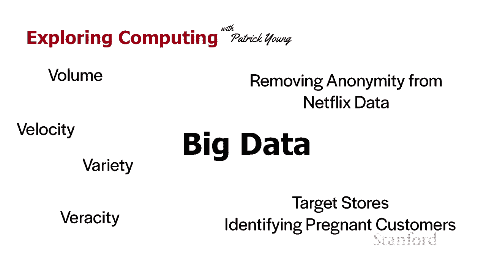

在上一个视频，在上一个视频，中提到了大数据，大数据背后的基本思想是我们，中提到了大数据，大数据背后的基本思想是我们，可以利用，可以利用，处理能力，处理能力，从海量数据中提取有用的信息。

从海量数据中提取有用的信息，并作为存储成本，并作为存储成本，随着，undefined，undefined，处理能力的提高，处理能力的提高，我们能够收集越来越多的数据 我们能够更轻松地处理它。

我们能够收集越来越多的数据 我们能够更轻松地处理它，事实证明，事实证明，人工智能领域的新技术，特别是，人工智能领域的新技术，特别是，机器，机器，学习，为我们提供了处理大数据的新方法，学习。

为我们提供了处理大数据的新方法，数据量，数据量，所以大数据是指这种，所以大数据是指这种，undefined，undefined。

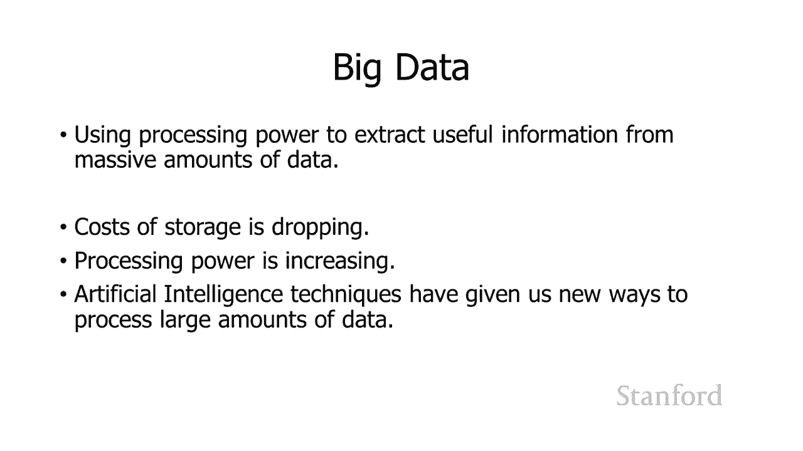

处理大量数据的能力，处理大量数据的能力，undefined，undefined，没有研究大数据的人有时，没有研究大数据的人有时，指大数据的三个v，指大数据的三个v，第一个v是信息量，第一个v是信息量。

多少 我们是否，多少 我们是否，拥有第二个 v 是速度，拥有第二个 v 是速度，数据到达的速度，数据到达的速度，如果数据没有那么快到达，如果数据没有那么快到达，我们通常，我们通常，可以实时处理它。

因为它很，可以实时处理它，因为它很，紧张，紧张，然而，如果，然而，如果，我们需要处理太多信息，我们需要处理太多信息，我们将需要大型存储，我们将需要大型存储，设施来存储该，设施来存储该，信息，然后，信息。

然后，在稍后的某个时间点对信息进行批处理，undefined，undefined，第三个 v 是多种多样的，有多少，第三个 v 是多种多样的，有多少，不同类型的数据，不同类型的数据，我们是在处理嗯。

一般来说，我们可以，我们是在处理嗯，一般来说，我们可以，将数据分为两种类型的，将数据分为两种类型的，结构化，结构化，数据，这是一种易于，数据，这是一种易于，计算机处理的数据，因此类似于。

计算机处理的数据，因此类似于，信息表之类的内容，信息表之类的内容，例如过去的乘客清单列表，例如过去的乘客清单列表，计算机非常容易处理，计算机非常容易处理，处理它已经，处理它已经，是计算机可以理解。

是计算机可以理解，的格式 相比之下，非结构化数据，的格式 相比之下，非结构化数据，对于计算机来说更难，对于计算机来说更难，处理，这可能，处理，这可能，类似于视频，所以，类似于视频，所以。

假设我们有一个人们，假设我们有一个人们，到达和，到达和，离开客运大楼的视频，离开客运大楼的视频。

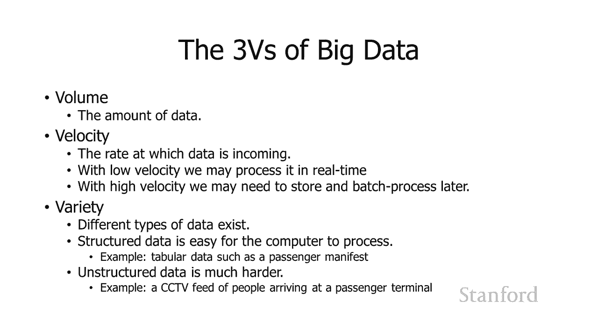

显然正在去 为了，显然正在去 为了，在我们的第一个处理它并从中获取一些，在我们的第一个处理它并从中获取一些，有用的，有用的，信息上花费大量的工作，一些研究人员在 previ 上增加了。

信息上花费大量的工作，一些研究人员在 previ 上增加了，第四笔，第四笔，费用 ous 三个 v，这就是，费用 ous 三个 v，这就是，数据的真实性，不幸的是，我认为，数据的真实性，不幸的是。

我认为，我们当前，我们当前，的环境很有意义，的环境很有意义，所以我们正在使用的信息有多准确，undefined，undefined，我们拥有数据源的确定性如何，所以，我们拥有数据源的确定性如何，所以。

我特别认为像这样的事情，我特别认为像这样的事情，深造假，深造假，和呃像俄罗斯机器人，和呃像俄罗斯机器人，账户这样的糟糕演员在 Twitter 上说，undefined，undefined。

考虑我们的数据源在哪里，考虑我们的数据源在哪里，undefined，undefined，以及这些数据源可以告诉我们什么，以及这些数据源可以告诉我们什么，现在变得越来越重要，undefined。

undefined，undefined，实际上，实际上，使用大数据技术研究俄罗斯机器人帐户本身，undefined，undefined，也可以为您提供一些信息，但您，也可以为您提供一些信息，但您，确实。

确实，需要知道仔细考虑您，需要知道仔细考虑您，的数据来源，的数据来源。

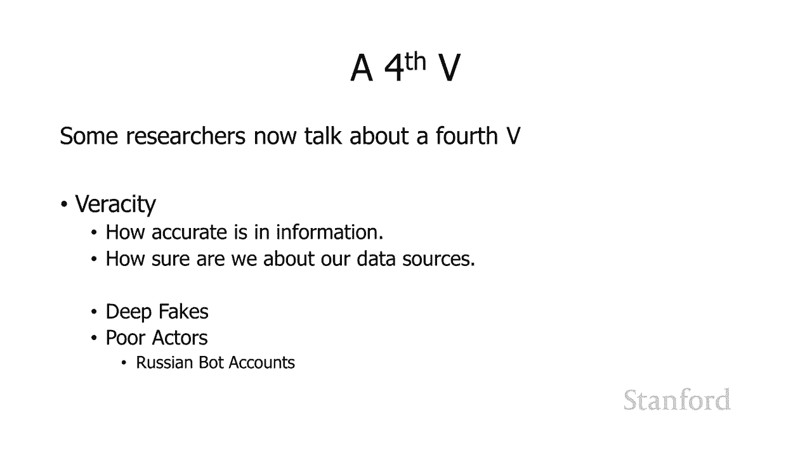

undefined，undefined，呃大数据可以用来，呃大数据可以用来，做的一件事是消除匿名 关于，做的一件事是消除匿名 关于，被认为是匿名的数据，因此，被认为是匿名的数据，因此，在一个示例中。

在一个示例中，netflix 发布了一组删除名称的数据，netflix 发布了一组删除名称的数据，并，并，允许不同的数据研究，允许不同的数据研究，人员使用 那个数据，人员使用 那个数据，并从中学习。

结果，并从中学习，结果，是德克萨斯大学，是德克萨斯大学，奥斯汀分校的一个，奥斯汀分校的一个，小组能够删除数据的匿名性，小组能够删除数据的匿名性，undefined，undefined，他们所做的是。

他们所做的是，将 Netflix 提供的数据，将 Netflix 提供的数据，与诸如不同的，与诸如不同的，人观看的数据进行比较 netflix 已经看过了。

人观看的数据进行比较 netflix 已经看过了，嗯，当时我们曾经能够，嗯，当时我们曾经能够，给电影评分，而，给电影评分，而，不仅仅是对，不仅仅是对，netflix 点赞，netflix 点赞，和点赞。

他们所做的是，和点赞，他们所做的是，将匿名数据中提供的评分，将匿名数据中提供的评分，与，与，各种用户在 imdb 上提供的评分进行比较，各种用户在 imdb 上提供的评分进行比较，undefined。

undefined，即使有人，即使有人，在 imdb 上只有几个评分，他们也，在 imdb 上只有几个评分，他们也，能够将 imdb 帐户与 netflix 帐户相匹配。

能够将 imdb 帐户与 netflix 帐户相匹配，undefined，undefined，并在此基础上他们能够，并在此基础上他们能够，找出，找出，imdb 中哪些不同的用户实际观看了。

imdb 中哪些不同的用户实际观看了，undefined，undefined，netflix，即使 imdb，netflix，即使 imdb，用户没有 打算在 netflix 上发布他们的。

用户没有 打算在 netflix 上发布他们的。

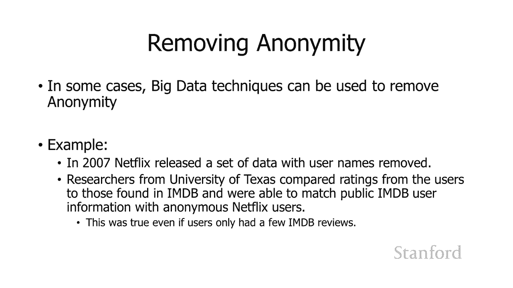

undefined，undefined，大数据的一个著名用途是目标，大数据的一个著名用途是目标，商店的怀孕检测，商店的怀孕检测，故事 所以这是来自新的一篇，故事 所以这是来自新的一篇，文章 约克时代。

文章 约克时代，我在你的课堂笔记中包含了这篇文章的链接，undefined，undefined，所以这个故事的背景，所以这个故事的背景，通常是呃，通常是呃，这个呃背景来自，这个呃背景来自。

加州大学洛杉矶分校的一些研究，加州大学洛杉矶分校的一些研究，通常客户会养成习惯并，通常客户会养成习惯并，在同一家商店购买平凡的物品，所以，在同一家商店购买平凡的物品，所以，如果您购买，如果您购买。

您知道我们都必须定期购买肥皂，您知道我们都必须定期购买肥皂，牙膏垃圾袋，牙膏垃圾袋，和其他物品，和其他物品，通常我们只会一遍又一遍地，通常我们只会一遍又一遍地，一遍又一遍地在完全相同的商店购买它们。

undefined，undefined，但是那些 购买习惯可能会，但是那些 购买习惯可能会，在重大的生活事件中发生变化，在重大的生活事件中发生变化，例如我们结婚或购买新，例如我们结婚或购买新。

房子或类似的事情，而，房子或类似的事情，而，事实证明，其中一件，事实证明，其中一件，大事当然是生孩子，所以，大事当然是生孩子，所以，当有人生孩子时，当有人生孩子时，这是一个很大的机会 让商店。

这是一个很大的机会 让商店，介入并尝试改变，介入并尝试改变。

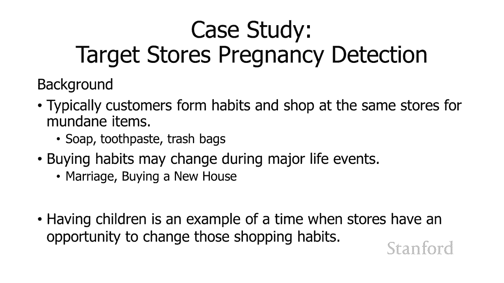

undefined，undefined，不同人的购买习惯，此外，undefined，undefined，从开始的角度来看，怀孕的另一个好处，从开始的角度来看，怀孕的另一个好处，是新的意外父母可以。

是新的意外父母可以，预期会购买很多东西 我，预期会购买很多东西 我，还可以指出，同样的事情，还可以指出，同样的事情，也发生在人们买了房子，也发生在人们买了房子，你买了新房子，突然你的，你买了新房子。

突然你的，开支增加了一段时间，因为，开支增加了一段时间，因为，你意识到你已经拥有了你从未想过，你意识到你已经拥有了你从未想过，的房子所需的所有东西，undefined，undefined，到目前为止。

就怀孕和，到目前为止，就怀孕和，分娩而言，有，分娩而言，有，官方的公共出生记录，但，官方的公共出生记录，但，每个人都可以访问它们，每个人都可以访问它们，因此如果您等待公共出生，因此如果您等待公共出生。

记录出来，记录出来，您将在广告轰炸这些，您将在广告轰炸这些，父母，父母，与其他，与其他，人用信息轰炸他们完全相同的时间，所以，人用信息轰炸他们完全相同的时间，所以，目标想要一种方法来了解。

目标想要一种方法来了解，他们的竞争对手，他们的竞争对手，并，并，在他们的竞争对手现在能够，在他们的竞争对手现在能够。

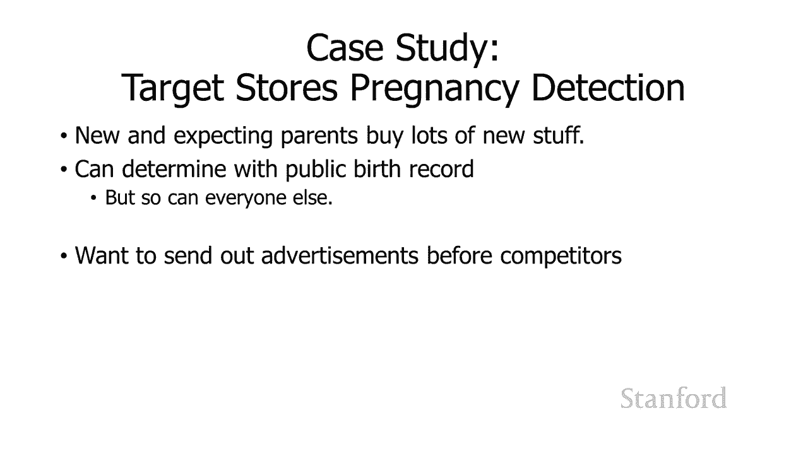

undefined，undefined，中发现人们怀孕之前，以便做到这一点 目标实际上，中发现人们怀孕之前，以便做到这一点 目标实际上，有，有，一堆关键数据集，这些数据集真正，一堆关键数据集。

这些数据集真正，帮助了他们，第一件事是，帮助了他们，第一件事是，undefined，undefined，如果您有折扣卡，他们会了解一些客户的购买习惯，如果您有折扣卡，他们会了解一些客户的购买习惯。

对于不同的商店，对于不同的商店，这些折扣卡用于跟踪，这些折扣卡用于跟踪，您的信息，您的信息，因此讨价还价是您将获得，因此讨价还价是您将获得，购买折扣，但作为，购买折扣，但作为，回报，商店将能够，回报。

商店将能够，识别您的特定购买，识别您的特定购买，模式，此外他们还有，模式，此外他们还有，其他信息 例如，他们可能，其他信息 例如，他们可能，知道您的年龄、，知道您的年龄、。

您的婚姻状况、您拥有的孩子数量，您的婚姻状况、您拥有的孩子数量，以及在目标的情况下，他们，以及在目标的情况下，他们，知道，知道，您离最近的目标，您离最近的目标，商店有多远，并估计了工资，商店有多远。

并估计了工资，因此这是一个目标数据集，因此这是一个目标数据集，然后 目标拥有的第二个数据集是，然后 目标拥有的第二个数据集是，undefined，undefined，注册了目标，注册了目标。

婴儿洗澡登记处的人，因此他们有一，婴儿洗澡登记处的人，因此他们有一，组关于购买习惯的信息，组关于购买习惯的信息，他们能够具体确定，他们能够具体确定，其中一些人何时怀孕，其中一些人何时怀孕。

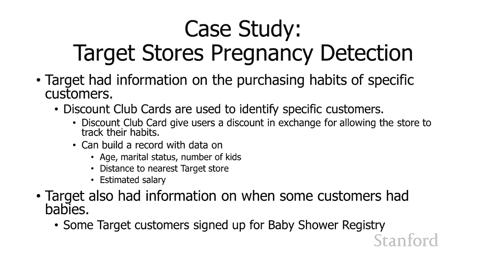

并对那里的时间有一些了解，并对那里的时间有一些了解，所以他们所做的是获取，所以他们所做的是获取，所有信息并使用大，所有信息并使用大，数据技术 他们能够，数据技术 他们能够，发现孕妇，发现孕妇。

购买了大量未寄出的，购买了大量未寄出的，乳液 在第二个三个月开始时，乳液 在第二个三个月开始时，undefined，undefined，他们，undefined，undefined。

购买了前 20 周的钙镁和锌补充剂，他们，购买了前 20 周的钙镁和锌补充剂，他们，购买了无味肥皂和特大，undefined，undefined，袋棉球，总共目标，袋棉球，总共目标，能够识别，能够识别。

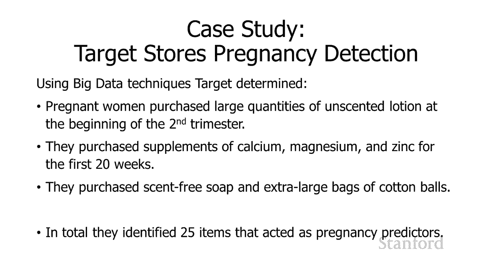

25 种不同的项目，作为，undefined，undefined，他们的怀孕指标。 还学到了一些关于，他们的怀孕指标。 还学到了一些关于，广告的教训，广告的教训，基本上他们了解到，如果你向。

基本上他们了解到，如果你向，人们发送装满，人们发送装满，婴儿用品的广告，他们会发现那种令人毛骨悚然的东西，婴儿用品的广告，他们会发现那种令人毛骨悚然的东西，所以，所以，他们决定最好混合。

他们决定最好混合，呃混合广告，呃混合广告，所以从文章中引用他们，所以从文章中引用他们，基本上混合了所有这些广告 对于，基本上混合了所有这些广告 对于，我们知道孕妇，我们知道孕妇，永远不会购买的东西。

所以婴儿广告看起来很，永远不会购买的东西，所以婴儿广告看起来很，随意，随意，我们会在尿布旁边放一个割草机的广告，我们会在尿布旁边放一个割草机的广告，只要孕妇，只要孕妇，认为她没有被监视她就会。

认为她没有被监视她就会。

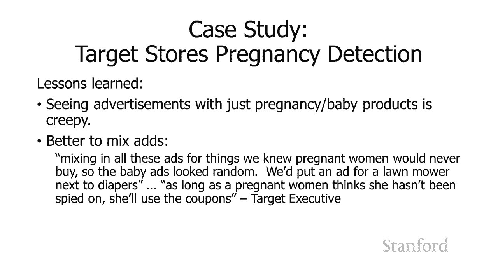

undefined，undefined，undefined，这个故事还有一个有趣的，这个故事还有一个有趣的，轶事，一个人走进，轶事，一个人走进，明尼阿波利斯郊外的目标，要求，明尼阿波利斯郊外的目标。

要求，见他抓着你的经理，undefined，undefined，据一位参与对话的员工说，他很生气，undefined，undefined，我女儿在邮件中收到了这个，他说，我女儿在邮件中收到了这个，他说。

她还在上高中，你，她还在上高中，你，要给她寄，要给她寄。

婴儿衣服和婴儿床的优惠券，婴儿衣服和婴儿床的优惠券，你试试看 为了鼓励她，你试试看 为了鼓励她，undefined，undefined，怀孕，经理不知道，怀孕，经理不知道，这个男人在说什么。

这个男人在说什么，他看了看邮件，他看了看邮件，果然是写给这个男人的女儿的，果然是写给这个男人的女儿的，里面，里面，有孕妇装，有孕妇装，育儿家具的广告和，育儿家具的广告和，微笑婴儿，微笑婴儿，的照片。

经理 道歉，然后，的照片，经理 道歉，然后，几天后再次打电话道歉，几天后再次打电话道歉，虽然父亲，虽然父亲，有点害羞，但，有点害羞，但，我不得不和我女儿谈谈，undefined，undefined。

undefined，undefined，八月，八月，我欠你一个道歉所以，我欠你一个道歉所以，另一个关于计算可以做什么的好故事。

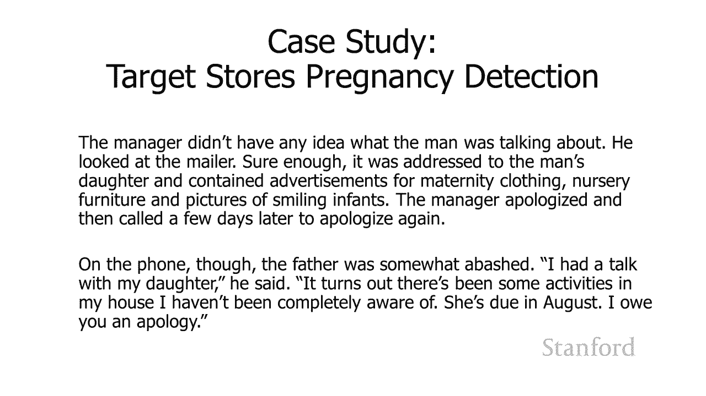

undefined。

