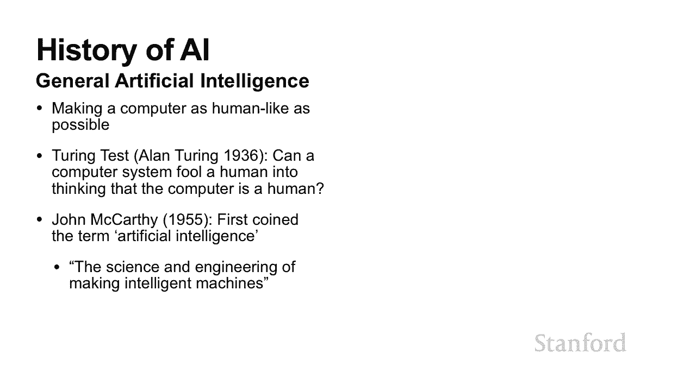
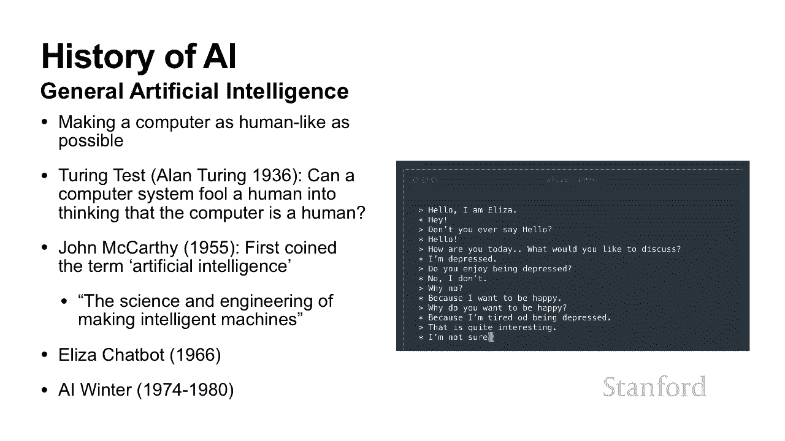

# 【双语字幕+资料下载】斯坦福CS105 ｜ 计算机科学导论(2021最新·完整版) - P63：L24.1- 人工智能：什么是人工智能 - ShowMeAI - BV1eh411W72E

欢迎来到探索计算。今天的主题是，你可能已经注意到，听起来有点不同。那是因为，我是艾薇，我是这门课程的助教。我将在，我首先想简要，在接下来的几个视频中做什么。所以在这第一个视频，将讨论什么是人工智能。

我将回顾人工智能的，历史，以了解为什么人工智能，第二个视频将介绍，我们经常听到，机器学习、监督，网络等术语。我们都有一个，与人工智能有关，但我们真的不知道如何。所以我将，以及它们实际上是，最后，在。

我将详细，介绍一个简单的机器学习，除此之外，讨论如何构建更复杂的系统，因此，让我们从回顾，通常，当我，我会问学生，你在日常生活中看到了哪些人工智能的例子？我强烈恳求，试着回答这个问题。拿出一张，写下。

我希望你，现在让我们将，所以，是诸如，驾驶，特斯拉这样的自动驾驶汽车——游戏玩家——所以，经过训练来玩游戏的人工智能。例如，过 Deep Blue，它是，赢得国际象棋，冠军的计算机国际象棋系统，它是第。

它也可以，是您玩的视频游戏中的计算机。另一个例子是语音，所以你说话的东西，说什么，图像，是你，它能够告诉你，等等，还有，所以 Siri、Google Assistant、，这些都是很好的答案。

它们都是完全，但也有，人们通常不会，它们值得讨论，表明人工智能实际上无处不在。一个例子是自动，这是，用来，在适当的时间自动买卖股票的工具。一个非常有名的例子，它实际上导致，所以发生的事情是。

并且运作良好，以至于，开始使用它。一旦它，不会表现得如此好，股票，然后触发，导致它抛售更多股票。它有点创造，了股市崩盘的自我实现预言。另一个例子，所以当你在，上买，它告诉你，嘿，想买其他东西。

一个令人毛骨悚然的好主意，这也，它观察，历史和您过去的，它的，另一个例子，您的身体活动进行分类。它只是根据，您采取的步数来实现的。它可以判断，还要确定，——因此，当您服用某种，具有非常特定，通常。

才能确定，因此，计算机科学家，医生联手，确定，应该基于，机器翻译，单词、句子、段落，谷歌翻译——，垃圾邮件过滤器，可以，自动将文本分类，还有诸如声音过滤之类的东西，即当您有一堆不同声音的录音时，您。

识别不同，该特定来源？这很，因为如果您是，并且，那么您实际上会，所以你会注意到，你可以，但是当，就好像激活了另一个，而且你只能，的声音，而不能听到周围，所以这样做的方式，是他们实际上在整个房间里放置了。

所以如果你，你实际上会注意到，他们将使用这些麦克风，他们将使用 AI 将，以隔离不同，最后，我们有，建议之类的东西，当，你认识这个人，结果，他们是正确的。因此，我们之前列出的示例中可以看出，AI。

它似乎包含，那么究竟什么是人工智能？定义是什么？好吧，事实证明，也是它，但这有点没有，所以让我们，来看看什么是人工智能的一些潜在的好定义。 我们将研究，的第一个潜在，系统执行通常，让我们谈谈这个定义的。

缺点。所以它很好，因为，它是人造的，因为，它是智能的，需要人类智能的任务。这个定义，它似乎涵盖，了我们之前，但是，是它有点太，都属于这个定义。例如，您计算机上，可以计算 1 加 1。这也需要人类。

它也是，但我们通常不会，所以让我们看一个，让我们考虑这样一个，一个计算机系统，它，没有明确，现在，这也是，它还，了第一个，然而，这个定义的问题，是它现在有点，模糊。它有点过于。

更多结构化的 AI 子领域，用于进行，所以它更符合，而不是一般的人工智能。它也有点，某些东西是否明确地，中没有明确的界限。归根结底，所有，他们被明确地，也许这个，的是程序员，逐行说，如果，但具体。

该边界应该画在什么地方有点不清楚。因此，虽然这两个，希望我们，您更好地了解，所以现在你，为什么没有，而且我认为诚实的答案，想出一个好的答案。事实证明，这个，它一直在迅速发展。那么让我们来，以及它。

当人们第一次，谈论人工智能的概念时，他们主要谈论的，所说的通用，即让计算机尽可能像，所以，所以使用的一个黄金标准，这是Alan，基本上可以概括，愚弄人，实现是人类测试人员，所以他们会，在对话结束时。

测试，是人工智能还是人。如果他们，那么他们正在测试的实体，虽然我们有时，称为黄金标准，但这，例如，在 2014 年，名为 Eugene Goostman 的计算机模拟，并且确实通过了图灵测试。然而。

他的年龄，的母语不是，限制，了可以进行的对话范围。因此，即使我们，了可以通过，并不意味着我们已经，的实现，并且我们已经，现在，人工智能这个，术语直到，他实际上是，他将人工智能领域描述。

为制造智能机器的科学和工程，这也绝不是，我们可以对这个定义应用与之前相同的，但他是第，从 50，人们。

然而，人们并没有，例如，在 1966 年，我们，右边的照片显示，并随意花一，阅读互动。但如果它，它基本上是一个对话。看起来她，正确的句子说话。所以她会说这样的话，你想讨论什么？而且她还能够，然而。

有一种，例如，如果，她，您喜欢沮丧吗？你为什么想要快乐？所以她显然不是人类。不幸的是，70 年代初左右趋于平稳。 资助，他们的政府研究人员，变得相当气馁。这被，从 1974 年到 1980 年。

得到资助或完成。日本政府，该项目基于，能够，但它完全失败了。

人工智能领域，但对这个领域，如果你一直，那么你就会看到，在过去几年里卷土重来。其中很大，于从，狭义的人工智能，可以理解为，在特定任务上实现人类表现，而不是，这符合计算机科学，中模块化和抽象，提醒一下。

我们，在软件，这基本上，分解为离散的、可管理的，称为模块。在这种情况下，我们，将尝试模拟人类，因此，我们没有，可以欺骗人，而是将整个，事实证明，所以这些较小的任务，我们可以，或者我们可以让机器。

我们并不是，成一个，而是我们只，对我们有用的特定任务。但也有其他，改进真正引领，这些改进，更大的内存、GPU，算法和更多的数据。所以基本上，我们训练人工智能，是我们，并使用这些数据来，我们拥有的模型。

这些模型，人工智能的行为。这通常是通过，线性代数中的各种运算来完成的，在以后的讲座中详细介绍。但是我们想，在，因此，更快的，和 GPU 优化使，这些操作，这，训练我们 AI 的迭代速度。

它还允许我们处理，我们拥有的大量数据。同样，更好的，允许我们使用更少的迭代。因此，这也提高，但最重要的是，如果，我们拥有的大量数据，这些都没有帮助。因此，为了，一下图表，该图表，与我们正在训练，因此。

如果我们看一下，它在我们必须训练的数据量方面的表现，所以你可以看到它首先会，然后，但即使在这里，它仍在，对于稍微，例如小型神经，可能看起来像这样。如果我们有一个，模型，例如大型，它的学习曲线，现在。

我知道我们，和传统，但是现在，只需将这种，算法视为一个，而小型神经，复杂，而，一个比以上所有模型都复杂的模型，因此，我们拥有，都，属于拥有更好算法的类别。但，如果我们只有，那么假设我们。

那么传统学习算法，将在附近，更多 复杂的学习，而且两者的差别，但是如果我们有，那么，就会下降，算法的，而且这种差异，所以我们可以看到，可能有更好的算法，在我们，来训练它们之前并不会真正发挥作用。

而这一事实确实塑造，您可能听说过 Google，通过销售广告赚了大钱。这是完全正确的。他们之所以，是因为他们能够，从，因此，通过，电子邮件内容等数据，它能够，趋势。它能够确定哪些，历史或电子邮件。

在向您展示广告时更容易购买。因此，通过结合，那里收集的大量数据，它能够非常，将广告定位到您。您还可以，因为他们了解您拥有的，以及 Cambridge Analytica 如何使用它，来定位政治广告。

最后，我们有，它似乎是，制造自动驾驶汽车的领先公司之一。能够，是因为他们，驾驶汽车的人那里收集的大量数据。因此，与 Waymo 等其他公司相比，它们具有很大的，因为它们能够，你可能已经看到。

在帕洛阿尔托附近行驶，一堆传感器。每个人，以更好地训练这些模型。但是，您会，汽车都需要，而特斯拉能够，仅从购买特斯拉的用户那里获取其所有数据，所以对于每，你会在路上看到更多的，因此，获取有价值的训练。

因此，总而言之，我希望，理解我们谈论 AI 时的意思，并，AI 的历史以及。

