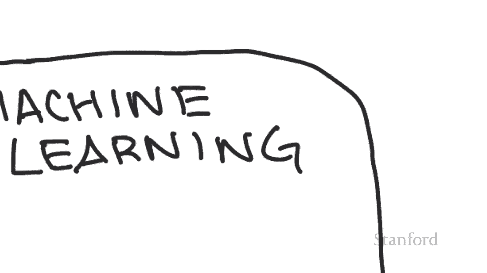
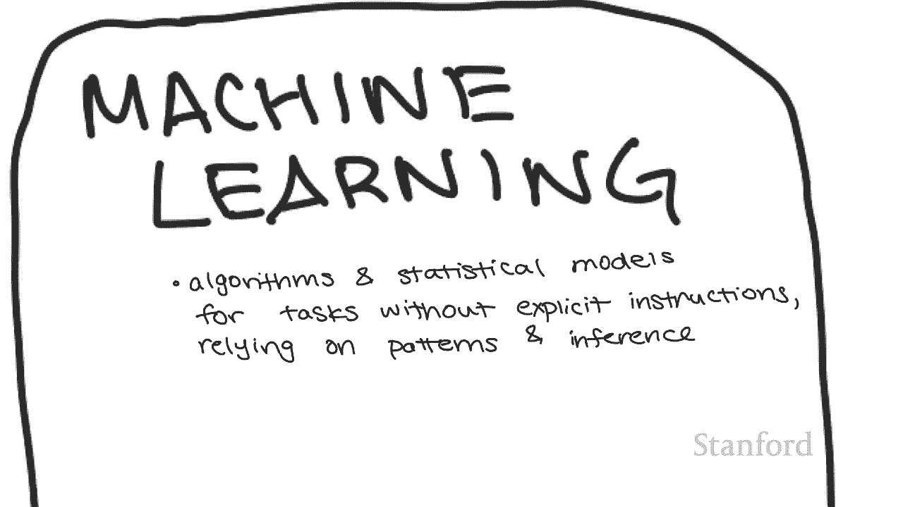
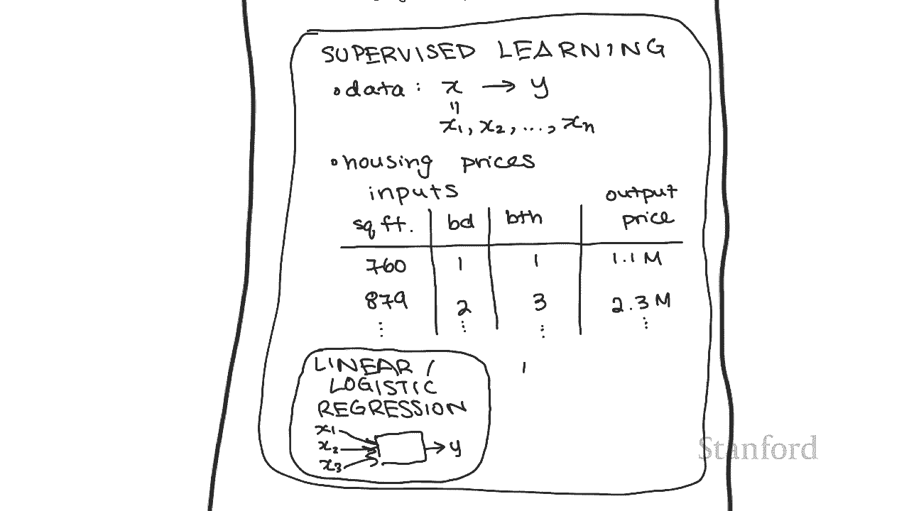
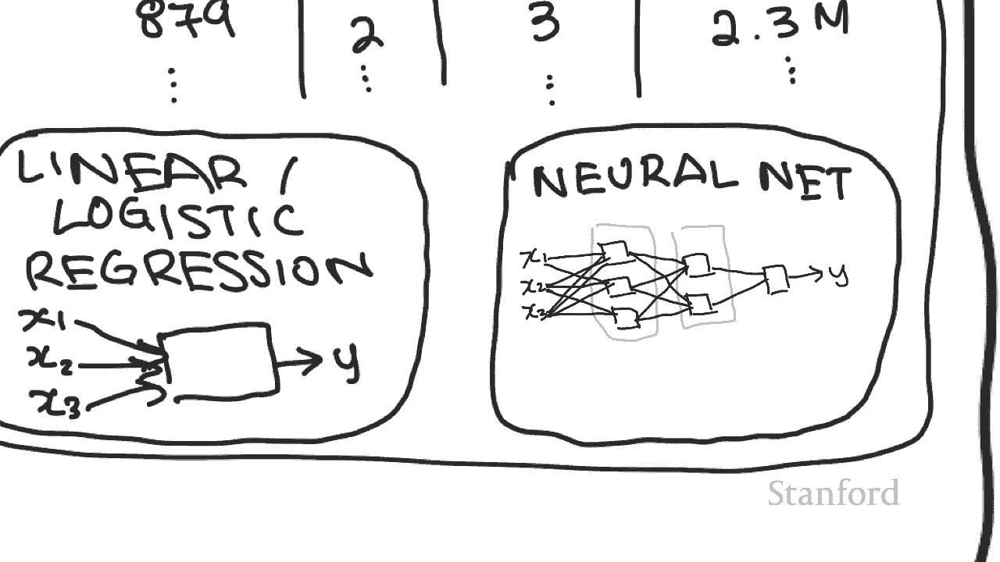
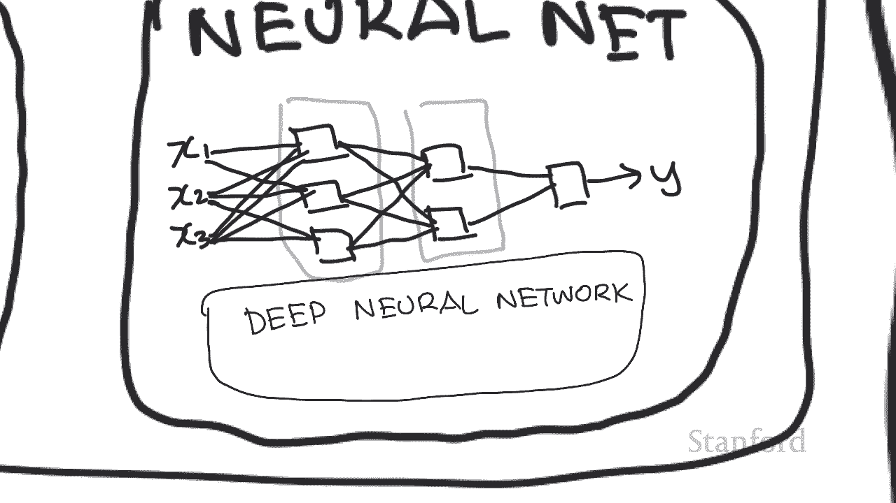
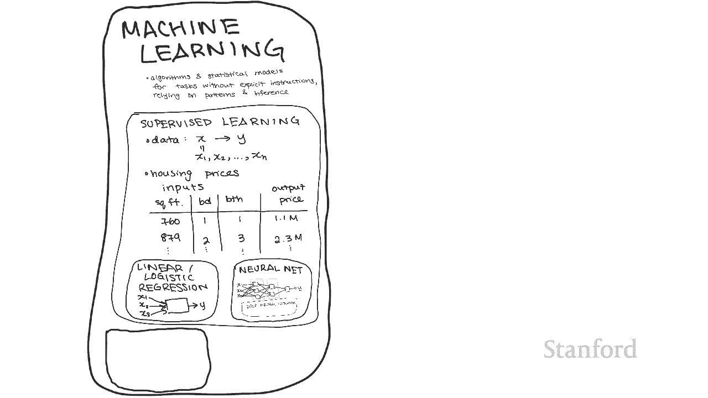
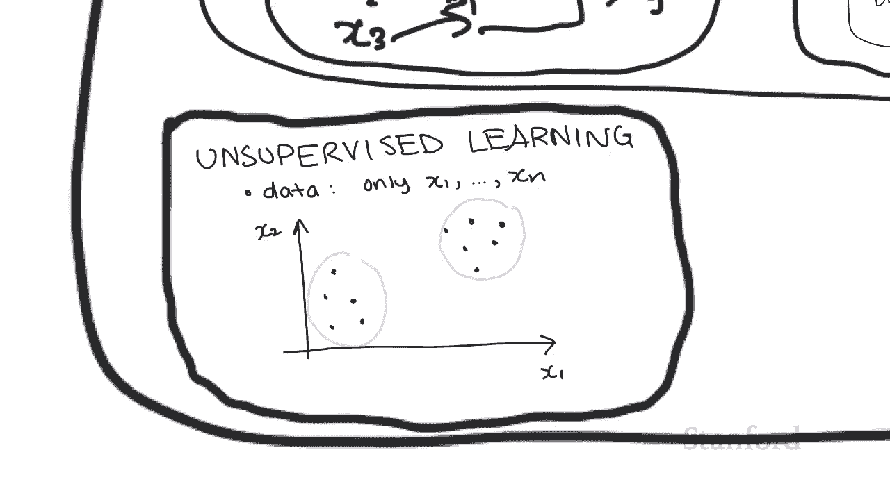
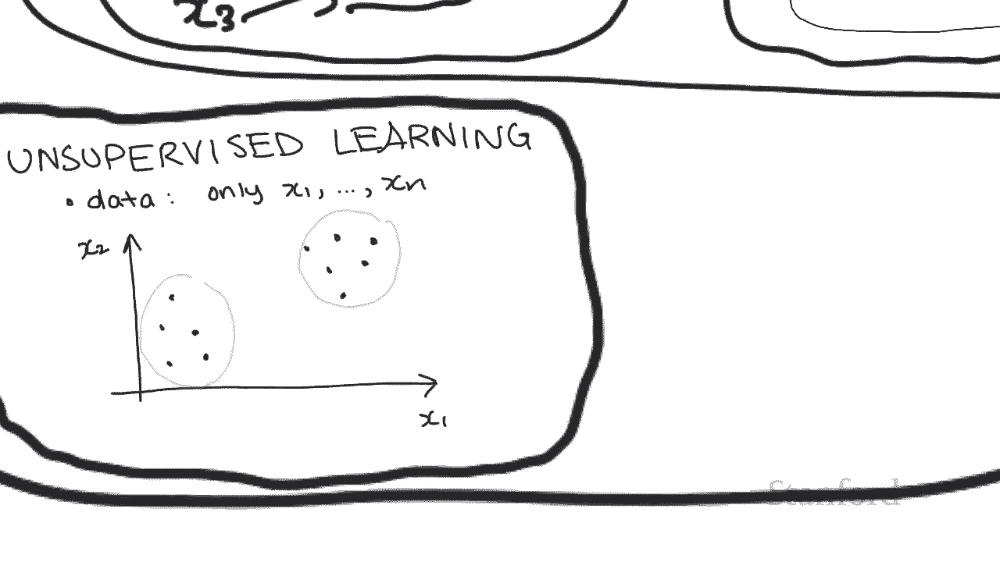
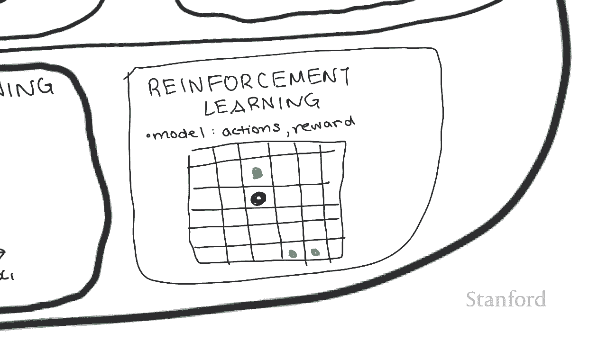
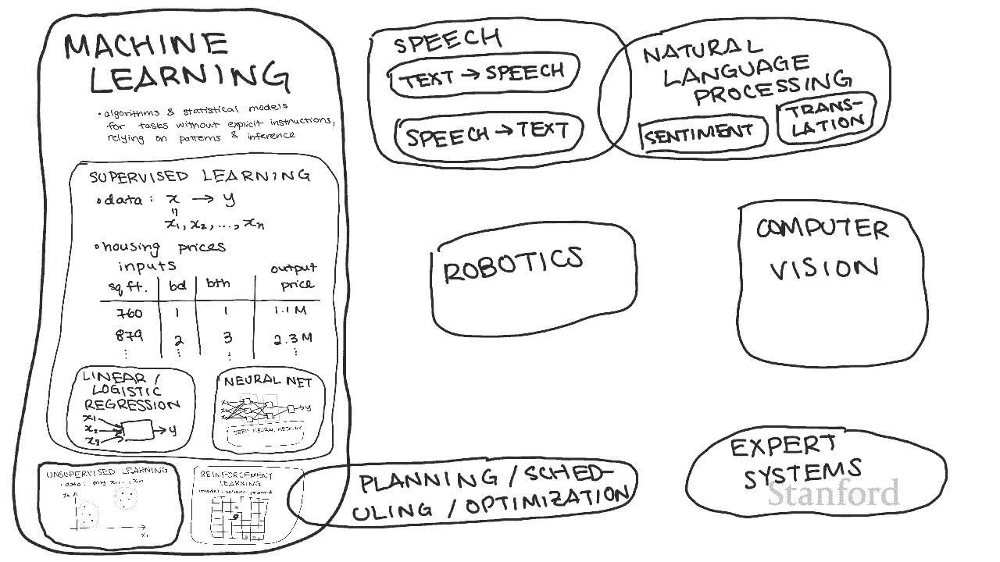

# 【双语字幕+资料下载】斯坦福CS105 ｜ 计算机科学导论(2021最新·完整版) - P64：L24.2- 人工智能：人工智能的子领域 - ShowMeAI - BV1eh411W72E

undefined，undefined，undefined，计算 本次讲座的主题，计算 本次讲座的主题，是人工智能的各个子领域，是人工智能的各个子领域，我之所以想谈论这个，我之所以想谈论这个。

是因为我们经常听到，是因为我们经常听到，机器学习和神经网络以及，机器学习和神经网络以及，深度学习，深度学习，和强化学习，和强化学习，等术语，但实际上并没有 知道它们的，等术语。

但实际上并没有 知道它们的，实际含义，实际含义，并且通常它们更多地被用作，并且通常它们更多地被用作，流行语而不是其他任何东西，流行语而不是其他任何东西，现在这不会是一个全面的列表。

现在这不会是一个全面的列表，但目标是，但目标是，对这些常用的人工智能术语在哪些方面有一个大致的了解。undefined，undefined，undefined，如果整个屏幕是人工智能的整个世界。

如果整个屏幕是人工智能的整个世界，那么它们的真正含义至少是目前最大的子领域是，那么它们的真正含义至少是目前最大的子领域是，机器学习，机器学习。

机器学习可以理解，机器学习可以理解，为对，为对，undefined，undefined，计算机系统用来有效，计算机系统用来有效，执行任务的算法和统计模型的研究，执行任务的算法和统计模型的研究，不使用。

不使用，依赖模式和推理的显式指令的特定任务，依赖模式和推理的显式指令的特定任务，现在是一大堆，现在是一大堆，单词，单词。

但它会更清楚 我们进入，但它会更清楚 我们进入，机器学习的子领域，机器学习的子领域。

undefined，undefined，监督学习是指当我们有，监督学习是指当我们有，模型，模型，的训练数据由其，的训练数据由其，undefined，undefined，输入和预期输出组成时。

输入和预期输出组成时，它被称为监督，因为我们，它被称为监督，因为我们，知道正确答案是什么，所以我们，知道正确答案是什么，所以我们，告诉它，告诉它，如果给定 x 你应该给我们 y。

如果给定 x 你应该给我们 y，现在请注意输入 x 可以，现在请注意输入 x 可以，由多个输入组成，由多个输入组成，所以很多时候我们实际上将 x 写为，所以很多时候我们实际上将 x 写为，x1，x1。

x2 依此类推直到 xn，x2 依此类推直到 xn，所以在这种情况下有 将是 n 个，所以在这种情况下有 将是 n 个，不同的输入，不同的输入，它会给我们一个特定的输出 y。

它会给我们一个特定的输出 y，所以一个例子是，所以一个例子是，预测房价，预测房价，其中输入可能是，其中输入可能是，平方英尺，卧室数量，浴室数量，平方英尺，卧室数量，浴室数量，undefined。

undefined，输出将是价格，输出将是价格，等等 训练这个模型，等等 训练这个模型，的将是这个，的将是这个，表格，所以在这种情况下，表格，所以在这种情况下，x1 是平方英尺 x2。

x1 是平方英尺 x2，是床位数量，是床位数量，x3 是浴室数量，x3 是浴室数量，y 是价格，y 是价格，所以一旦这个模型是 使用，所以一旦这个模型是 使用，我们拥有的所有数据进行训练。

我们拥有的所有数据进行训练，我们将能够，我们将能够，根据我们输入的平方英尺，根据我们输入的平方英尺，、床位数量、浴室数量进行，、床位数量、浴室数量进行，预测，并且该模型将预测，预测，并且该模型将预测。

该物业，该物业，现在应该在此框架内的价格 在，现在应该在此框架内的价格 在，许多问题中，可以应用许多不同的算法，undefined，undefined，但也许最，但也许最，广为人知的算法是。

广为人知的算法是，线性或逻辑回归，线性或逻辑回归，您可能在某些数学或统计学课程中看到过这种方法，undefined，undefined，但基本上您想要考虑的，但基本上您想要考虑的，是最佳拟合线。

是最佳拟合线，因此您有一个 一堆点，你，因此您有一个 一堆点，你，试图拟合最适合的线，试图拟合最适合的线，所以在上面的这个例子中，我们有，所以在上面的这个例子中，我们有，一堆点，一堆点。

我们试图拟合的线是，我们试图拟合的线是，这里的这些值，所以最终，这里的这些值，所以最终，一旦你得到这条线，一旦你得到这条线，你可以插入你自己的观点并，你可以插入你自己的观点并，找出它落在线上的位置。

找出它落在线上的位置，我将在下一个视频中更详细地介绍这，undefined，undefined，一点 我们可以表示这个模型的一种方式，一点 我们可以表示这个模型的一种方式，是画一张图片，是画一张图片。

这样我们就有了一堆输入 x1 x2，这样我们就有了一堆输入 x1 x2，x3 并且我们想将它们全部传递到一个，x3 并且我们想将它们全部传递到一个，函数中，函数中，undefined。

undefined，该函数，该函数应表示，该函数，该函数应表示，由非线性函数组成的最佳拟合线，由非线性函数组成的最佳拟合线，undefined，undefined，最后该函数将输出 ay。

最后该函数将输出 ay，或者我们可以使用另一种，或者我们可以使用另一种，方法 成为，方法 成为。

神经网络 神经网络背后的想法，神经网络 神经网络背后的想法，undefined，undefined，是，我们不仅拥有这些功能中的一个，是，我们不仅拥有这些功能中的一个，而是将，而是将，它们链接在一起。

它们链接在一起，我们称它们为神经网络的原因是，我们称它们为神经网络的原因是，因为我们，因为我们，使用认知科学中关于，使用认知科学中关于，我们拥有的神经元的想法，我们拥有的神经元的想法。

如果你上过关于人脑的生物课，undefined，undefined，你就会知道它是由，你就会知道它是由，一堆相互连接的神经元组成的，undefined，undefined，一个神经元接收。

一个神经元接收，其他几个神经元，其他几个神经元，的输出，并给出自己的输出 如果，的输出，并给出自己的输出 如果，你看这里的这张图片，你看这里的这张图片，这种想法就抓住了这个想法 所以。

这种想法就抓住了这个想法 所以，这里它接受，这里它接受，多个输入并给出一个输出，多个输入并给出一个输出，所以，所以，如果我们将这些输入作为，如果我们将这些输入作为，其他神经元或其他功能的输出。

其他神经元或其他功能的输出，那么这将是 大脑的一个很好的，那么这将是 大脑的一个很好的，近似，近似，因此神经网络将接收一些，因此神经网络将接收一些，输入，输入，并将它们传递给多个函数。

并将它们传递给多个函数，现在请，现在请，原谅混乱，但基本上，原谅混乱，但基本上，这些盒子中的每一个都，这些盒子中的每一个都，代表一个函数，每个函数，代表一个函数，每个函数，接收，接收，所有可能的输入。

我们可以，所有可能的输入，我们可以，进一步将更多的函数链接在一起，进一步将更多的函数链接在一起，undefined，undefined，undefined，这些函数接收先前函数，这些函数接收先前函数。

的输出，我们拥有的每一层都称为一层，的输出，我们拥有的每一层都称为一层，每一层内部都可以有任意数量的，每一层内部都可以有任意数量的，神经元，所以它是一个非常灵活的，神经元，所以它是一个非常灵活的，结构。

所以当然可以使事情，结构，所以当然可以使事情，变得均匀 更复杂，变得均匀 更复杂，的是有一堆不同类型的，的是有一堆不同类型的，神经网络，也许最常，神经网络，也许最常，undefined。

undefined。

提到的是深度神经网络，提到的是深度神经网络，为了理解深度神经网络，为了理解深度神经网络，它基本上是一个神经网络，它基本上是一个神经网络，它有一堆相互连接的层，undefined，undefined。

 现在我们已经深入了解， 现在我们已经深入了解。

了双关语，所以让我们回溯一点，了双关语，所以让我们回溯一点，undefined，undefined，因此在机器学习领域，因此在机器学习领域，我们有超级建议 d 学习，我们有超级建议 d 学习。

因此与此相反，在我放大并填写框之前，我们现在也，因此与此相反，在我放大并填写框之前，我们现在也，有无监督学习，undefined，undefined，undefined，回想一下我们之所以称。

回想一下我们之所以称，监督学习为监督，监督学习为监督，是因为它接收，是因为它接收，和训练的数据，和训练的数据，由 x 组成，由 x 组成，undefined，undefined，输入以及 y 是。

输入以及 y 是，undefined，undefined。

现在无监督学习的预期输出，我们将不再，undefined，undefined，拥有 y 算法集，undefined，undefined，对于当我们甚至不知道，对于当我们甚至不知道。

答案应该是什么时非常有用，答案应该是什么时非常有用，而我们 只是试图找到，而我们 只是试图找到，我们拥有的数据中的趋势，我们拥有的数据中的趋势，因此有许多不同的，因此有许多不同的，算法属于这一类别。

算法属于这一类别，但是可以解决的一个示例问题，但是可以解决的一个示例问题，undefined，undefined，是，假设我们有一堆，是，假设我们有一堆，undefined，undefined。

只有两个特征 x1 和 x2 的，只有两个特征 x1 和 x2 的，点，因为每个点 将有，点，因为每个点 将有，不同的 x1 和 x2，不同的 x1 和 x2，我们可以在这个图表上绘制它。

我们可以在这个图表上绘制它，虽然我们可以，虽然我们可以，直观地看到人类有两个，直观地看到人类有两个，不同的组，不同的组，无监督学习算法，无监督学习算法，允许计算机将其视为 嗯，允许计算机将其视为 嗯。

这对人类也非常有用，这对人类也非常有用，因为，因为，我们并不总是能够看到，我们并不总是能够看到，不同的数据组，不同的数据组，注意在这种情况下只有两个，注意在这种情况下只有两个，不同的，不同的。

输入 x1 和 x2 现在想象一下是否，输入 x1 和 x2 现在想象一下是否，有 17 个不同的可能输入，有 17 个不同的可能输入，甚至一个 数千种不同的输入，甚至一个 数千种不同的输入。

你如何将所有这些点，你如何将所有这些点，组合在一起，无监督学习，组合在一起，无监督学习，算法将能够非常有效地告诉我们，undefined，undefined，从应用程序的角度来看，从应用程序的角度来看。

像这样的东西可以，像这样的东西可以，用来找出消费者趋势并，用来找出消费者趋势并，更具体地针对人群定位广告，更具体地针对人群定位广告，所以我们” 我从隐私和，所以我们” 我从隐私和，安全讲座，安全讲座。

中看到，有一位女性，中看到，有一位女性，undefined，undefined，是怀孕相关广告的目标，是怀孕相关广告的目标，所以最有可能发生的是他们，所以最有可能发生的是他们，注意到她有，注意到她有。

特定的购物趋势，所以，特定的购物趋势，所以，像 x1 和 x2 这样的特征可能，像 x1 和 x2 这样的特征可能，是不同类型的，是不同类型的，她买的东西，他们把她，她买的东西，他们把她。

放在一个主要由孕妇组成的小组里，undefined，undefined，所以他们才知道她是有，所以他们才知道她是有，潜力的 盟友怀孕了，现在开始给，潜力的 盟友怀孕了，现在开始给，她的怀孕广告。

她的怀孕广告。

除了，除了，监督学习和无监督学习，还有，监督学习和无监督学习，还有。

undefined，undefined，这，这，与前两个有点不同，因为我们，与前两个有点不同，因为我们，没有大量数据，没有大量数据，我们根本没有任何数据 并且，undefined，undefined。

我们已经有一个预先存在的模型，而不是尝试学习模型，我们已经有一个预先存在的模型，而不是尝试学习模型，并且该模型具有的，undefined，undefined，是代理可以在每个步骤中采取的不同行动。

是代理可以在每个步骤中采取的不同行动，以及与，undefined，undefined，在特定时间采取行动相关的奖励有一些，在特定时间采取行动相关的奖励有一些，其他事情也是如此，其他事情也是如此。

但现在只需将其视为，但现在只需将其视为，有动作和奖励，有动作和奖励，并且该模型的奖励方面，并且该模型的奖励方面，是强化，是强化，的地方 算法的目标是最大化，undefined，undefined。

它可以随着时间的推移获得的整体奖励，它可以随着时间的推移获得的整体奖励，因此从 一个，因此从 一个，应用，应用，的实际观点是弄清楚当一个 roomba 在吸尘时。

的实际观点是弄清楚当一个 roomba 在吸尘时，应该如何穿过房间，应该如何穿过房间，所以假设，所以假设，我们有一个在房间里的 roomba，我们有一个在房间里的 roomba。

并且 房间可以表示为一个，并且 房间可以表示为一个，网格，网格，所以假设 roomba 在这里，所以假设 roomba 在这里，这里有垃圾，这里有垃圾，然后这里和这里，所以在，然后这里和这里，所以在。

这种情况下，这种情况下，这个模型将有一个，这个模型将有一个，与其中有垃圾的方块相关的正奖励，undefined，undefined，和一个中性奖励 在没有垃圾的方块中，undefined。

undefined，我们还可以指定具有，我们还可以指定具有，负奖励的网格，负奖励的网格，空间来表示我们想要，空间来表示我们想要，避免的空间，因此强化，避免的空间，因此强化，学习算法的，学习算法的。

目标是找出，目标是找出，roomba 应该走哪条路，roomba 应该走哪条路，以便 最大化它的奖励，所以，以便 最大化它的奖励，所以，在这种情况下，现在，在这种情况下，现在，的动作要么是。

的动作要么是，右上要么左，undefined，undefined，undefined，undefined，喜欢，喜欢，时尚，时尚，并收集所有垃圾碎片，并收集所有垃圾碎片，这将是完全有效的。

这将是完全有效的，但是如果模型设置为使，但是如果模型设置为使，奖励更有价值，奖励更有价值，如果它们更早获得，那么，如果它们更早获得，那么，也许是最好的方法，也许是最好的方法。

动作是让 roomba 首先，动作是让 roomba 首先，向上移动然后向右移动，向上移动然后向右移动，然后向下然后向右移动，然后向下然后向右移动，我们还可以指定，我们还可以指定，强化学习模型来考虑。

undefined，undefined，roomba 还剩下多少功率，roomba 还剩下多少功率，所以假设只有 roomba 还剩，所以假设只有 roomba 还剩，五步，五步，所以在这种情况下。

所以在这种情况下，与其向上移动来收集一个奖励，与其向上移动来收集一个奖励，不如让 roomba，不如让 roomba，向下移动，向下移动，一二三步，然后向右移动，一二三步，然后向右移动，两步。

这样它会得到，两步，这样它会得到，两个奖励。两个奖励。而不是只有一个奖励并且，而不是只有一个奖励并且，无法达到其他两个，无法达到其他两个，因此一般而言，强化学习，因此一般而言，强化学习。

undefined，undefined，算法能够通过采取最佳行动来随着时间的推移最大化奖励量，undefined，undefined，undefined，因此我们讨论过的所有示例和子领域。

因此我们讨论过的所有示例和子领域，到目前为止，到目前为止，都属于机器学习的范畴，都属于机器学习的范畴。

所以现在让我们看看一些，所以现在让我们看看一些，非机器学习的子领域，非机器学习的子领域，现在这里变得有点，现在这里变得有点，复杂，因为有很多使用梳子的人工智能，复杂，因为有很多使用梳子的人工智能，技术。

技术，机器，机器，学习和非机器学习，学习和非机器学习，技术的结合，技术的结合，所以我要列出的，所以我要列出的，所有内容很可能，所有内容很可能，与机器学习有很大的重叠，与机器学习有很大的重叠。

一个例子是人工语音，一个例子是人工语音，这包括文本到，这包括文本到，语音，语音，和语音到文本等技术目标，和语音到文本等技术目标，人工语音，人工语音，是从音频翻译成文本，是从音频翻译成文本，反之亦然。

反之亦然，在这两种情况下，语音都侧重于，在这两种情况下，语音都侧重于，所说的话，所说的话，而不是意义；另一方面，我们，而不是意义；另一方面，我们，也有，也有，自然语言处理，自然语言处理。

这通常被称为 nlp，这通常被称为 nlp，它，它，侧重于 所讲单词背后的含义，undefined，undefined，因此 nlp 的示例包括，因此 nlp 的示例包括，情感分析，即找出，情感分析。

即找出，句子背后的情感，句子背后的情感，以及机器翻译，因此，以及机器翻译，因此，在单词或句子甚至段落之间进行翻译时请，undefined，undefined，注意，有时两者之间的区别，注意。

有时两者之间的区别，是模糊的，那是，是模糊的，那是，因为，因为，存在 有很多系统实际上同时，存在 有很多系统实际上同时，使用，使用，两者，例如当你告诉 alexa，两者，例如当你告诉 alexa。

打开你的 Lights，打开你的 Lights，它通过，它通过，将您的语音转换为文本来使用语音识别，将您的语音转换为文本来使用语音识别，和一些情感分析来，和一些情感分析来，弄清楚您，弄清楚您。

实际上试图让 alexa 做什么，实际上试图让 alexa 做什么，为什么这两者不被，为什么这两者不被，严格视为机器学习，严格视为机器学习，的原因是因为我们经常会明确，的原因是因为我们经常会明确。

编程 这些系统的一些附加信息，undefined，undefined，这意味着我们违反了机器学习的，这意味着我们违反了机器学习的，无明确指令，无明确指令，定义，我们可能，定义，我们可能，会给 nlp。

会给 nlp，系统一个内置字典，因为我们，系统一个内置字典，因为我们，已经很容易获得这些信息，已经很容易获得这些信息，并且不需要重复，并且不需要重复，大量的工作或，大量的工作或，我们可能会在。

我们可能会在，我们语言的语法结构中明确编程，我们语言的语法结构中明确编程，以更好地帮助语音到文本的，以更好地帮助语音到文本的，翻译，翻译，但是除了这些明确的指令之外，但是除了这些明确的指令之外。

undefined，undefined，这些系统还经常使用额外的，这些系统还经常使用额外的，机器学习技术（，机器学习技术（，例如深度神经网络）来，例如深度神经网络）来，完成其任务，完成其任务。

顺便说一句，我们还 将，顺便说一句，我们还 将，深度神经网络称为深度学习，所以，深度神经网络称为深度学习，所以，如果您听说过 深度学习这个术语，如果您听说过 深度学习这个术语，所指的，所指的。

另一个子领域是计划，另一个子领域是计划，undefined，undefined，并且与强化学习有很大的重叠，undefined，undefined，因为 roomba 问题也属于。

因为 roomba 问题也属于，计划调度和优化，计划调度和优化，因为它试图，因为它试图，找出最佳任务序列应该是什么 另一个，undefined，undefined，属于此类问题，属于此类问题。

的任务示例是如何在，undefined，undefined，时间和房间限制的情况下最佳安排教室我们还有，时间和房间限制的情况下最佳安排教室我们还有，计算机视觉，它接收视频，计算机视觉，它接收视频。

和照片并尝试确定，undefined，undefined，这些媒体的主题，还有一个，这些媒体的主题，还有一个，这个领域和神经网络之间有巨大的重叠，这个领域和神经网络之间有巨大的重叠，undefined。

undefined，但我们也添加了硬编码的东西，但我们也添加了硬编码的东西，比如面部，比如面部，特征等等，我们，特征等等，我们，还有专家系统的子领域，还有专家系统的子领域，这些系统具有，这些系统具有。

用于逻辑推论的硬编码规则，用于逻辑推论的硬编码规则，所以它包含 一个知识库，它是，所以它包含 一个知识库，它是，一组已知为真的事实，一组已知为真的事实，也是一个推理引擎和 它，也是一个推理引擎和 它。

使用推理引擎，使用推理引擎，从已知事实中提取新事实，从已知事实中提取新事实，例如，例如，如果我们已经知道如果下雨那么，如果我们已经知道如果下雨那么，人们会使用雨伞，人们会使用雨伞。

并且我们也知道正在下雨，并且我们也知道正在下雨，那么推理引擎可以用来，那么推理引擎可以用来，推断人们正在使用雨伞，推断人们正在使用雨伞，最后我们还有机器人领域，最后我们还有机器人领域。

undefined，undefined，也许这个领域与许多其他领域重叠，undefined，undefined，因为它太广泛了，例如我们，因为它太广泛了，例如我们，有像roombas。

有像roombas，这样的东西，它可以利用规划，这样的东西，它可以利用规划，调度和优化，调度和优化，以及强化学习，以及强化学习，和计算机 视觉，和计算机 视觉，我们也有东西，但我们也，我们也有东西。

但我们也，有机器人，其主要任务是尝试，有机器人，其主要任务是尝试，模仿人类走路的方式，模仿人类走路的方式，这是一个机器学习问题，这是一个机器学习问题，我们试图弄清楚如何，我们试图弄清楚如何。

在走路时保持平衡，在走路时保持平衡，最后我们也 有自动化机器人之类的东西，undefined，undefined，所以这可能是一个关于，所以这可能是一个关于，如何以最佳方式自动化任务的人工智能问题。

如何以最佳方式自动化任务的人工智能问题，这可能属于，这可能属于，这个优化类别，这个优化类别，最终，人工智能领域是，最终，人工智能领域是，非常跨学科的，非常跨学科的，所以我认为人工智能的子领域也。

所以我认为人工智能的子领域也，遵循这一趋势，遵循这一趋势，这就是为什么我们今天看到，这就是为什么我们今天看到，的人工智能的各个子领域之间有如此多的重叠，undefined，undefined。

请注意 这些框都不是真的，请注意 这些框都不是真的，按比例绘制，按比例绘制，的，真的没有办法测量，的，真的没有办法测量，每个子域的大小，每个子域的大小，而且所有这些边缘都应该，而且所有这些边缘都应该。

变得非常模糊，因为，变得非常模糊，因为，各个子域之间有太多重叠，各个子域之间有太多重叠，但我希望在绘制过程中，但我希望在绘制过程中，走出这些框，走出这些框，并，并。

在对每个子领域进行分类之间进行思考过程，在对每个子领域进行分类之间进行思考过程。

我已经让您更好地了解，我已经让您更好地了解，这些子领域可能如何，这些子领域可能如何，相互关联。

