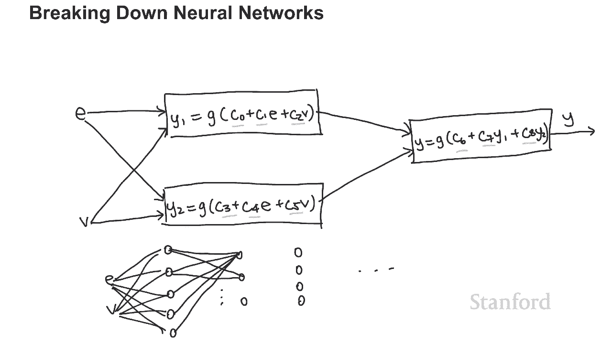
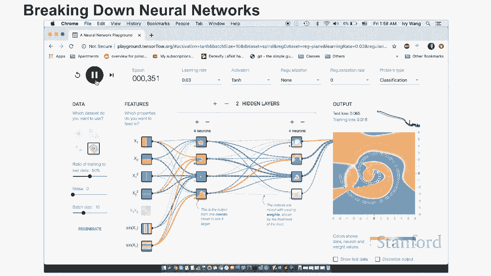

# 【双语字幕+资料下载】斯坦福CS105 ｜ 计算机科学导论(2021最新·完整版) - P65：L25- 人工智能：它是如何完成的 - ShowMeAI - BV1eh411W72E

undefined，undefined，undefined，本视频的主题是 AI 是如何，本视频的主题是 AI 是如何，实际完成，实际完成，的 这里的目标是通过，的 这里的目标是通过。

给你一个具体的例子来揭开 AI 的神秘面纱，给你一个具体的例子来揭开 AI 的神秘面纱，undefined，undefined，我将首先向你展示，我将首先向你展示，一个 AI 垃圾邮件分类器的例子。

一个 AI 垃圾邮件分类器的例子，和 训练分类器所需的数据，和 训练分类器所需的数据，然后我将，然后我将，undefined，undefined，通过分解逻辑回归背后的理论，undefined。

undefined，并将其概括，并将其概括，为神经网络的解释来讨论它的工作原理，为神经网络的解释来讨论它的工作原理，最后我将讨论人工智能工程师的角色，最后我将讨论人工智能工程师的角色。

undefined，undefined，所以让我们看看垃圾邮件分类器，我，所以让我们看看垃圾邮件分类器，我，之前提到过电子邮件垃圾邮件，之前提到过电子邮件垃圾邮件，分类器，分类器。

但我们今天要分解的垃圾邮件分类，但我们今天要分解的垃圾邮件分类，器将用于短信，器将用于短信，回想一下垃圾邮件，回想一下垃圾邮件，分类器的目标是接收邮件，分类器的目标是接收邮件。

并确定它是否是垃圾邮件分类器 垃圾邮件或非，并确定它是否是垃圾邮件分类器 垃圾邮件或非，垃圾邮件，垃圾邮件，我们现在在这里，我们现在在这里，看到的是 AI 将在其上，看到的是 AI 将在其上，接受训练。

接受训练，的数据由许多文本消息，的数据由许多文本消息，以及它们，以及它们，是否是垃圾邮件组成，是否是垃圾邮件组成，这里列举的每个项目，这里列举的每个项目，都是一个 训练样本，都是一个 训练样本。

包含文本消息，包含文本消息，以及，undefined，undefined，在这种情况下是垃圾邮件还是火腿的分类，在这种情况下，火腿意味着它不是，在这种情况下是垃圾邮件还是火腿的分类，在这种情况下。

火腿意味着它不是，垃圾邮件，垃圾邮件，例如我们收到的第 10 条，undefined，undefined，消息，您的手机使用了 11 个月或更长时间等等，undefined，undefined。

它是 被归类为垃圾邮件，因为它，它是 被归类为垃圾邮件，因为它，不是来自您的朋友，它只是来自，undefined，undefined，试图向您出售某些，试图向您出售某些，东西的某人或某个公司 另一方面。

我们在这里有一个例子，东西的某人或某个公司 另一方面，我们在这里有一个例子，它说，它说，我一直在寻找合适的词，我一直在寻找合适的词，来感谢您的喘息 我保证，来感谢您的喘息 我保证。

我不会把你的帮助视为理所当然等等，undefined，undefined，这被归类为火腿，因为，这被归类为火腿，因为，这是来自，这是来自，你现在可能认识的人的合法短信，你现在可能认识的人的合法短信。

这只是训练数据，这，这只是训练数据，这，就是为什么我们有正确的答案，比如，就是为什么我们有正确的答案，比如，火腿或垃圾邮件，火腿或垃圾邮件，已经到位，但目标，已经到位，但目标。

是我们将使用这些数据来训练，是我们将使用这些数据来训练，人工智能，人工智能，最终我们将能够，最终我们将能够，undefined，undefined，只输入短信，人工智能会告诉我们，只输入短信。

人工智能会告诉我们，它是否认为它“  s ham 或垃圾邮件，它是否认为它“  s ham 或垃圾邮件，AI 不仅应该能够，AI 不仅应该能够，针对它已经看到的消息执行此操作，而且还。

针对它已经看到的消息执行此操作，而且还，可以，可以，针对任何消息执行此操作，因此为了，针对任何消息执行此操作，因此为了，成功训练 AI，它需要查看，成功训练 AI，它需要查看，大量样本，大量样本。

因此只是给您一个想法，因此只是给您一个想法，需要多少数据的范围 让我们向下，需要多少数据的范围 让我们向下，滚动，滚动，看看所有这些，看看所有这些，都被标记的，都被标记的，所有数据，所有这些都是消息。

你会，所有数据，所有这些都是消息，你会，看到大约有 5000 个，看到大约有 5000 个，这可能看起来很多 数据，但，这可能看起来很多 数据，但，老实说它被认为是一个相对，老实说它被认为是一个相对。

较小的数据集，较小的数据集，我们可以使用相对较小的数据的原因，undefined，undefined，是因为这是一个非常简单的，是因为这是一个非常简单的，问题 更复杂的人工智能问题。

问题 更复杂的人工智能问题，例如面部识别，例如面部识别，它接收视频并，它接收视频并，确定它是否正确 人与否，确定它是否正确 人与否，需要，需要，数十万甚至数百万，数十万甚至数百万，个训练样本的训练数据。

个训练样本的训练数据，因为我们拥有，因为我们拥有，的消息既包含消息，的消息既包含消息，又包含正确的分类，我们，又包含正确的分类，我们，可以将其建模，可以将其建模，为 在这种情况，为 在这种情况。

undefined，undefined，下，x 将是消息，下，x 将是消息，y 将，y 将，是垃圾邮件还是火腿，所以我只是，是垃圾邮件还是火腿，所以我只是，构建了一个非常简单的逻辑。

构建了一个非常简单的逻辑，回归分类器，然后我，回归分类器，然后我，对数据进行了训练，对数据进行了训练，所以让我们现在看看它的实际效果，所以让我们现在看看它的实际效果，首先我需要，首先我需要。

加载我刚刚通过导入垃圾邮件训练的模型，undefined，undefined，然后我输入我想要，然后我输入我想要，分类的内容，所以我只使用我写的模型来，分类的内容，所以我只使用我写的模型来。

undefined，undefined，写垃圾邮件，我会写分类，然后，写垃圾邮件，我会写分类，然后，我输入一条消息，我 几天前刚寄给，我输入一条消息，我 几天前刚寄给，我的室友，我的室友。

所以我说我还做了一些椰子，所以我说我还做了一些椰子，布丁，可以随意拿一个放在，布丁，可以随意拿一个放在，玻璃酸奶容器，玻璃酸奶容器，中的，模型应该告诉我，一旦我点击进入，中的，模型应该告诉我。

一旦我点击进入，它是否认为它是垃圾邮件，它是否认为它是垃圾邮件， 正如你所看到的，它， 正如你所看到的，它，认为它现在不是垃圾邮件，认为它现在不是垃圾邮件，我会对我室友回复我的消息做同样的。

我会对我室友回复我的消息做同样的，事情，她，事情，她，写了哦谢谢你，写了哦谢谢你，正如你所看到的，模型认为它，正如你所看到的，模型认为它，不是垃圾邮件，现在让我们，不是垃圾邮件，现在让我们。

在文本上测试这个模型 垃圾邮件，所以，在文本上测试这个模型 垃圾邮件，所以，我收到了 这条，我收到了 这条，undefined，undefined，来自 bobo 商店的消息，正如您所看到的。

来自 bobo 商店的消息，正如您所看到的，它是一条垃圾邮件，它不是来自，它是一条垃圾邮件，它不是来自，我真正认识的人，我真正认识的人，正如您所看到的，该消息，正如您所看到的，该消息。

将其归类为垃圾邮件，这正是我们所，将其归类为垃圾邮件，这正是我们所，期望，期望，的，当然这个模型不是 不完美它，的，当然这个模型不是 不完美它，有时也会出错，有时也会出错，但它实际上工作得很好，所以。

但它实际上工作得很好，所以，让我们分解一下这件事的实际，让我们分解一下这件事的实际，工作原理，我们将从，工作原理，我们将从，一个非常简单的，一个非常简单的，例子开始，我保证它会很容易概括。

undefined，undefined，假设你正在为它工作 一家汽车，假设你正在为它工作 一家汽车，保险公司，保险公司，并且您想为申请保险的驾驶员分配一个良好的驾驶员。

并且您想为申请保险的驾驶员分配一个良好的驾驶员，分数奖金，分数奖金，您想，undefined，undefined，根据驾驶，根据驾驶，经验的年数以及，经验的年数以及，undefined。

undefined，一个人发生的事故数量来计算分数，因此输入，一个人发生的事故数量来计算分数，因此输入，这个模型，这个模型，将是我们称之为 e 的驾驶经验年数，将是我们称之为 e 的驾驶经验年数。

undefined，undefined，以及我们称之为，以及我们称之为，undefined，undefined，a 的一个人发生过的事故数量，undefined，undefined。

我们希望我们的模型预测一个好的，我们希望我们的模型预测一个好的，司机得分，司机得分，w  e 将表示为 y 并注意，undefined，undefined，如果司机是好司机，这应该是正数。

如果司机是坏司机，如果司机是好司机，这应该是正数，如果司机是坏司机，这应该是负数，这应该是负数，undefined，undefined，我们拥有的数据将，我们拥有的数据将，undefined。

undefined，是之前如何根据输入分配分数的通过记录，undefined，undefined，和 这可能看起来像这样，和 这可能看起来像这样，所以横轴对应于 e，所以横轴对应于 e。

即驾驶员的经验年数，undefined，undefined，纵轴对应于 a，纵轴对应于 a，即事故数量，因此，即事故数量，因此，例如这里的这一点可能，例如这里的这一点可能，对应于有，对应于有。

10 年经验的人 经验和只有一次，10 年经验的人 经验和只有一次，事故，事故，而这里的这一点可能，而这里的这一点可能，对应于，对应于，具有一年驾驶经验并，具有一年驾驶经验并，发生过，发生过。

10 次事故的人，对于这些点中的每一个，10 次事故的人，对于这些点中的每一个，undefined，undefined，我们都对它们进行了颜色编码和标记，我们都对它们进行了颜色编码和标记。

以便它们对应于他们的驾驶员得分，以便它们对应于他们的驾驶员得分，已经，已经，收到了例如这个已经，收到了例如这个已经，驾驶 10，驾驶 10，年只发生一次事故的人是一个好司机。

年只发生一次事故的人是一个好司机，这就是为什么他们获得了正，这就是为什么他们获得了正，分，分，并且它是红色的，而这个，并且它是红色的，而这个，只驾驶，只驾驶，一年但发生 10 次事故的人一定。

一年但发生 10 次事故的人一定，是个糟糕的司机，是个糟糕的司机，所以他也得到了负，所以他也得到了负，分，这就是为什么现在它被标记为，分，这就是为什么现在它被标记为，蓝色，蓝色，学习算法的目标。

学习算法的目标，是根据所有，是根据所有，这些来计算 数据和过去的经验，这些来计算 数据和过去的经验，例如，如果它在这里得到一个分数，例如，如果它在这里得到一个分数，这可能对应于，这可能对应于。

一个已经驾驶九年并，一个已经驾驶九年并，发生两次事故的人，发生两次事故的人，无论它应该是正，无论它应该是正，分还是负分，分还是负分，作为人类我们能够善良 立即告诉，undefined。

undefined，我们这应该是一个正分，但，我们这应该是一个正分，但，我们希望计算机现在也能够，我们希望计算机现在也能够，弄清楚这一点，弄清楚这一点，因为您可以从本页的标题，因为您可以从本页的标题。

中，中，看出我们将使用的技术，看出我们将使用的技术，称为线性斜杠，称为线性斜杠，逻辑回归，逻辑回归，线性和逻辑之间的区别不是非常，线性和逻辑之间的区别不是非常，重要，重要，但只要知道我们。

但只要知道我们，称其为线性回归的原因，称其为线性回归的原因，是因为它是线性的，这意味着，是因为它是线性的，这意味着，我们可以在所有 poi 之间画一条线，我们可以在所有 poi 之间画一条线。

nts 我们试图分开，nts 我们试图分开，所以在这种情况下，我们可以看到这条线，所以在这种情况下，我们可以看到这条线，看起来，看起来，像那样，并且，像那样，并且，有一个点落在，有一个点落在。

了这条线的错误一侧，了这条线的错误一侧，但没关系，我们训练的模型，但没关系，我们训练的模型，并不总是完美的，并不总是完美的，也许即使是分配，也许即使是分配，该分数的人也可能搞砸了。

该分数的人也可能搞砸了，这并不重要，因为无论如何我们的模型，这并不重要，因为无论如何我们的模型，大部分时间都在工作，大部分时间都在工作，现在让我们快速复习，现在让我们快速复习，一些您可能很久没有考虑。

一些您可能很久没有考虑，过的数学，undefined，undefined，记得很久以前你曾经被，记得很久以前你曾经被，教导线，教导线，undefined，undefined，我们被告知 m 表示。

我们被告知 m 表示，线的斜率，b 等于，线的斜率，b 等于，线的 y 截距，所以，线的 y 截距，所以，你会怎么做 用这个方程做的是，你会怎么做 用这个方程做的是，你会插入一个，你会插入一个。

x 并且你会很好地得到 y 现在我们，x 并且你会很好地得到 y 现在我们，想要找到一个类似的，想要找到一个类似的，方程，除了现在而不是仅仅，方程，除了现在而不是仅仅，插入，插入。

一个 x 我们实际上有两个东西，一个 x 我们实际上有两个东西，可以输入，可以输入，一个 e 和一个 a 所以，一个 e 和一个 a 所以，我们想做的是 w 我想修改，我们想做的是 w 我想修改。

这个方程，使它可以接受，这个方程，使它可以接受，两个不同的东西，所以在这种情况下，m，两个不同的东西，所以在这种情况下，m，和 b 是常数，所以仅仅因为，和 b 是常数，所以仅仅因为。

我们将添加更多的常数，我们将添加更多的常数，undefined，undefined，和 c1，这样，和 c1，这样，我们就可以将这个 y 重写为 y，我们就可以将这个 y 重写为 y，等于 c0 加上。

等于 c0 加上，c1 乘以，c1 乘以，xi 在这两个项之间切换顺序，xi 在这两个项之间切换顺序，这个，这个，mx 现在是 c1x 我移到了，mx 现在是 c1x 我移到了，第二个，第二个。

而这个 b 现在是 c0 我，而这个 b 现在是 c0 我，移到了第一个，移到了第一个，但也注意到没有，但也注意到没有，变量 这将，变量 这将，输入实际上称为 x 对我们，输入实际上称为 x 对我们。

只有 e，只有 e，和 a 所以让我们将这个 x，和 a 所以让我们将这个 x，undefined，undefined，除了我们的公式还，除了我们的公式还，需要考虑，需要考虑。

a 所以我们只需将它添加到，a 所以我们只需将它添加到，等式，等式，中给它一个，中给它一个，我们将称为 c2，我们将称为 c2，的附加常数乘以 a，的附加常数乘以 a，因此线性回归的目标。

因此线性回归的目标，是找出，是找出，这些常数 c0、c1，这些常数 c0、c1，和 c2 应该是什么，以便，和 c2 应该是什么，以便，undefined，undefined，并且首先完成的方法是。

并且首先完成的方法是，通过随机选择，通过随机选择，值 o  f c0 c1，值 o  f c0 c1，c2 然后稍微改变它们，c2 然后稍微改变它们，并检查它是否做得更好，并检查它是否做得更好。

如果它做得更好，那么你继续，如果它做得更好，那么你继续，在那个方向改变它，在那个方向改变它，如果它变得更糟，那么你，如果它变得更糟，那么你，在另一个方向改变它，在另一个方向改变它，例如如果 我们首先。

undefined，undefined，猜测 c0 应该是 200，猜测 c0 应该是 200，c1 应该是 100，c2 是，c1 应该是 100，c2 是，零，然后你会插入所有，零。

然后你会插入所有，你已经必须测试的数据点，你已经必须测试的数据点，如果它运行良好，如果它，如果它运行良好，如果它，不运行，那么你 可能会调整它，不运行，那么你 可能会调整它，以便 c0 现在是 201。

以便 c0 现在是 201，c1 现在可能是 101，c2 可能是，c1 现在可能是 101，c2 可能是，1 而不是 0。并且你可以，undefined，undefined，undefined。

通过一次一点改变它们来反复尝试 c0 c1 和 c2 的不同组合，通过一次一点改变它们来反复尝试 c0 c1 和 c2 的不同组合，直到你得到，直到你得到，一个 漂亮的线条看起来像。

一个 漂亮的线条看起来像，这样，这样，它可以很好地将您已经从，它可以很好地将您已经从，数据中获得的所有点分开，数据中获得的所有点分开，并且因为计算机速度如此之快，您，并且因为计算机速度如此之快，您。

可以尝试一系列不同，可以尝试一系列不同，的 c0，的 c0，c1 和 c2 组合，因此最终您' 将，c1 和 c2 组合，因此最终您' 将，能够找到一些非常好的东西，能够找到一些非常好的东西。

所以在这个 在这种情况下，计算机可能，undefined，undefined，为 c0 选择了 0 为 c1 选择了 50，为 c0 选择了 0 为 c1 选择了 50，为 c2 选择了负 100。

为 c2 选择了负 100，作为最适合我们拥有的数据的方法，undefined，undefined，因此结果方程将是，因此结果方程将是，y 等于 0，y 等于 0，加 50 e 减去 100。

加 50 e 减去 100，a 所以让我们 检查这个模型，a 所以让我们 检查这个模型，与我们训练它的数据的拟合程度，与我们训练它的数据的拟合程度，让我们看看这里的这一点，让我们看看这里的这一点。

它对应于，它对应于，一个有 10 年经验的司机，一个有 10 年经验的司机，和一次事故，所以 e 是 10，和一次事故，所以 e 是 10，a 是 1，a 是 1，所以将其插入 我们拥有的公式。

undefined，undefined，将得到零加，将得到零加，五十乘以十，五十乘以十，减一百乘以一等于零，减一百乘以一等于零，undefined，undefined，加五百减，加五百减。

一百等于 400，这符合我们的，一百等于 400，这符合我们的，模型，模型，因为 400 是正数，而这一点，因为 400 是正数，而这一点，也是正数，也是正数，所以让我们用一个不太好的。

所以让我们用一个不太好的，驱动程序尝试一下 所以记住，驱动程序尝试一下 所以记住，这里 e 是 1 和 a 是 100 的这一点 让我们看看它。

这里 e 是 1 和 a 是 100 的这一点 让我们看看它，如何适合模型，如何适合模型，所以将这些数字代入，所以将这些数字代入，方程 我们有，方程 我们有，0 加 50 乘以 1。

0 加 50 乘以 1，减去 100 乘以 10，减去 100 乘以 10，这是 eq  ual 到 0 加 50，这是 eq  ual 到 0 加 50，减去一千，这等于，减去一千，这等于。

负 950，这也与我们的模型匹配，负 950，这也与我们的模型匹配，因为负 950，因为负 950，是负的，这正是这个，是负的，这正是这个，点应该是的，点应该是的，现在我们可以将此模型应用于。

现在我们可以将此模型应用于，甚至不是的点 在我们的数据中，甚至不是的点 在我们的数据中，开始，开始，所以你记得这里的这一点，所以你记得这里的这一点，它不在我们的数据中，我们，它不在我们的数据中，我们。

只是想知道它应该是什么，只是想知道它应该是什么，现在我们可以将它插入我们的模型，现在我们可以将它插入我们的模型，所以这对应于 e，所以这对应于 e，是 9 和 a 是 2  。

是 9 和 a 是 2  。所以让我们把它插入我们的模型，看看，所以让我们把它插入我们的模型，看看，会发生什么，会发生什么，所以等式将是 0 加，所以等式将是 0 加，50 乘以 9 减去。

50 乘以 9 减去，100 乘以 2 等于 0，100 乘以 2 等于 0，加上 450 减去，加上 450 减去，200 等于 250，200 等于 250，这个数字是正的，这，这个数字是正的，这。

意味着这应该 正数和，意味着这应该 正数和，免责声明一样，免责声明一样，这些数字 0 50 和负数 100，这些数字 0 50 和负数 100，实际上可能不是最佳，实际上可能不是最佳，数字，数字。

但逻辑线性，但逻辑线性，回归的目标是找出这些数字，回归的目标是找出这些数字，实际上应该是什么，只是，实际上应该是什么，只是，为了这个例子，为了这个例子，这些数字有效 非常好，所以这就是。

这些数字有效 非常好，所以这就是，为什么我只是假设这是，为什么我只是假设这是，线性或逻辑回归会发现的，线性或逻辑回归会发现的，但它们可以真正微调，但它们可以真正微调，甚至可以找到像你知道的 0。

002 和 52。1 这样的数字，undefined，undefined，这可能会提供更好的拟合，这可能会提供更好的拟合，所以我实际上非常高度 建议，undefined，undefined。

在这里修改这些数字，在这里修改这些数字，只是为了看看它实际上如何影响，只是为了看看它实际上如何影响，这里的这条线，这里的这条线，但作为一个总结，线性，但作为一个总结，线性，回归所做的基本上。

回归所做的基本上，是在这里调整这些常数，是在这里调整这些常数，直到你得到一条适合你的数据的好线，直到你得到一条适合你的数据的好线，undefined，undefined，因为 计算机是如此快速和。

因为 计算机是如此快速和，强大，它能够尝试，强大，它能够尝试，一大堆值，一大堆值，这样你得到的值现在是，这样你得到的值现在是，非常理想的，非常理想的，在前面的例子中，我们只有，在前面的例子中，我们只有。

两个变量，两个变量，a 和 e，所以那些本来是，a 和 e，所以那些本来是，x 的，x 的，但是 你刚刚学到的模型，但是 你刚刚学到的模型，实际上可以推广到任意数量，实际上可以推广到任意数量，的变量。

所以假设我们有，的变量，所以假设我们有，变量，变量，x1 x2 x3，x1 x2 x3，等等 xn 那么线性，等等 xn 那么线性，回归模型，回归模型，将基本 ly 找到，将基本 ly 找到。

所有这些变量的常数，所有这些变量的常数，所以结果模型看起来，所以结果模型看起来，像 y，像 y，等于 z0 加上 c1 乘以，等于 z0 加上 c1 乘以，x1 加上 c2 乘以 x2。

x1 加上 c2 乘以 x2，加上 c3 乘以 x3 依此类推，加上 c3 乘以 x3 依此类推，加上 cn 乘以 xn，加上 cn 乘以 xn，和模型的目标 将是，和模型的目标 将是，找到 c 0。

找到 c 0，c 1 c 2 c 3 c 4 依此类推，c 1 c 2 c 3 c 4 依此类推，直到 cn 是最佳的，直到 cn 是最佳的，因此您可以看出，因此您可以看出，模型越复杂，模型越复杂。

您必须找到的 c 或常数越多，undefined，undefined，通常一个更复杂的模型，通常一个更复杂的模型，需要更多的，需要更多的，数据，因为需要找到更多的常量，undefined。

undefined，最后要注意的是，最后要注意的是，逻辑回归，逻辑回归，实际上添加了一个称为 sigmoid 函数的附加组件，undefined，undefined，因此我们不是直接使用这个。

因此我们不是直接使用这个，值 已经获得，值 已经获得，我们实际上通过，我们实际上通过，我们所谓，我们所谓，的 sigmoid 函数传递，的 sigmoid 函数传递，这个值 我们将，这个值 我们将。

在此处称为 g 的 sigmoid 函数，在此处称为 g 的 sigmoid 函数，由公式 1 over，由公式 1 over，1 加上 e 的负 x，1 加上 e 的负 x，幂给出。

其中 e 是欧拉数 大约是，幂给出，其中 e 是欧拉数 大约是，2。718，2。718，因此对于逻辑回归，因此对于逻辑回归，您所做的预测实际上是，您所做的预测实际上是，由公式 y 给出的。

由公式 y 给出的，它等于 g，它等于 g，和我们在此处传入的值，和我们在此处传入的值，因此它是 g，因此它是 g，和 c c0 加 c1，和 c c0 加 c1，x1 加 c2 x2。

x1 加 c2 x2，加 依此类推，加 依此类推，这，这，等于 1 over 1，等于 1 over 1，plus e 到负，plus e 到负，c 0 plus c 1 x 1。

c 0 plus c 1 x 1，plus 等等，plus 等等，关于 sigmoid 函数的重要知识，关于 sigmoid 函数的重要知识，是它看起来，是它看起来，undefined。

undefined，像这样，如果 我们要把它画出来，像这样，如果 我们要把它画出来，这是，这是，x，这是 sigmoid 函数，x，这是 sigmoid 函数，那么，那么，对于非常小的值。

对于非常小的值，非常负数，它实际上会减少到零，非常负数，它实际上会减少到零，undefined，undefined，对于非常大的值，它会逐渐增加到 1，对于非常大的值，它会逐渐增加到 1。

undefined，undefined，所以让我们画一下 这条渐近，所以让我们画一下 这条渐近，线，线，这将是 1。因此，例如，这将是 1。因此，例如，如果这里的总和是一个非常大的。

如果这里的总和是一个非常大的，数字，例如，数字，例如，5000，那么它可能，5000，那么它可能，类似于 0。999，类似于 0。999，它非常接近 1，而如果，它非常接近 1，而如果，这里的总和。

这里的总和，变得非常高 巨无霸 像，undefined，undefined，负 200 000 这样的负数那么它会非常，负 200 000 这样的负数那么它会非常，非常接近于零，非常接近于零。

我们之所以想要，我们之所以想要，使用 sigmoid 函数是因为它，使用 sigmoid 函数是因为它，限制了一切，限制了一切，都在 0 和 1 之间，都在 0 和 1 之间，这在我们谈论。

这在我们谈论，概率，概率，和 因此，如果问题是类似于，和 因此，如果问题是类似于，此消息是垃圾邮件的可能性有多大，此消息是垃圾邮件的可能性有多大，undefined，undefined。

那么我们将能够使用 sigmoid，那么我们将能够使用 sigmoid，undefined，undefined，函数获得一个介于 0 和 1 之间的数字，函数获得一个介于 0 和 1 之间的数字。

undefined，undefined，表示该消息是垃圾邮件的可能性，表示该消息是垃圾邮件的可能性，因此线性回归和，因此线性回归和，逻辑回归很酷 似乎允许，逻辑回归很酷 似乎允许。

我们接受任意数量的输入并提供，我们接受任意数量的输入并提供，似乎很合适的输出，似乎很合适的输出，所以我们为什么需要神经，所以我们为什么需要神经，网络，网络，我鼓励你暂停这个视频，我鼓励你暂停这个视频。

几秒钟，几秒钟，并猜测我希望你有机会，undefined，undefined，做得好答案有时是线性，做得好答案有时是线性，回归不起作用，回归不起作用，例如如果我们不能，undefined。

undefined，在正负分数之间画一条直线或一条直线，undefined，undefined，所以让我们考虑 t 他的以下，所以让我们考虑 t 他的以下，问题与之前的问题类似，我们。

问题与之前的问题类似，我们，仍在尝试找出司机的好，仍在尝试找出司机的好，成绩，成绩，我们还想考虑，我们还想考虑，司机的多年经验，我们，司机的多年经验，我们，称之为，称之为，e，但现在而不是司机，e。

但现在而不是司机，发生的事故，发生的事故，数量 我们一直在，数量 我们一直在，考虑我们调用的车辆的年龄，考虑我们调用的车辆的年龄，v 这是，v 这是，我们正在处理的数据，它看起来，我们正在处理的数据。

它看起来，与之前的有点不同，与之前的有点不同，因为我们希望有，因为我们希望有，经验的驾驶员使用，经验的驾驶员使用，较新的汽车获得负分，因为较新 汽车，较新的汽车获得负分，因为较新 汽车，很贵。

而残骸更贵，很贵，而残骸更贵，但我们也希望对，但我们也希望对，旧车的新司机负分，旧车的新司机负分，因为旧车的安全功能较少，因为旧车的安全功能较少，undefined，undefined。

所以你会看到我们，所以你会看到我们，在这里有很多正分，但我们有，在这里有很多正分，但我们有，这，这，两组 负分，所以，两组 负分，所以，你会注意到，无论你如何，你会注意到，无论你如何，画线，画线。

不管是这样的还是这样的，不管是这样的还是这样的，还是这样的，你都不能干净地，还是这样的，你都不能干净地，将这两组点分开，将这两组点分开，所以让我们回溯一下 记住，所以让我们回溯一下 记住。

undefined，undefined，我们如何能够表达逻辑，我们如何能够表达逻辑，回归模型，回归模型，因为公式 y，因为公式 y，等于 sigmoid 函数，其中，等于 sigmoid 函数，其中。

c 0 加 c 1，c 0 加 c 1，e 加 c 2 v 传入，e 加 c 2 v 传入，其中我们将 e 和 v 作为输入，其中我们将 e 和 v 作为输入，y 作为输出，如果 你还记得。

y 作为输出，如果 你还记得，在之前的视频中，在之前的视频中，我们实际上也可以将这个模型表示，我们实际上也可以将这个模型表示，为图片，为图片，因此我们将输入 e，因此我们将输入 e。

和 v 并将其传递到，和 v 并将其传递到，我们将其表示为正方形的函数中，我们将其表示为正方形的函数中，undefined，undefined，它会输出 y 和该，它会输出 y 和该，函数 这里。

函数 这里，正好是，正好是，gc 0 加 c 1 e，gc 0 加 c 1 e，加 c 2 v，加 c 2 v，我们还讨论了这里的这个单元如何，我们还讨论了这里的这个单元如何，看起来像一个神经元。

看起来像一个神经元，其中这部分是，其中这部分是，接收，接收，其他神经元输出的树突，其他神经元输出的树突，这部分对应于轴突，这部分对应于轴突，将整个神经元的输出传递，将整个神经元的输出传递。

undefined，undefined，给其他神经元，因此，给其他神经元，因此，我们可以使用这个想法将一堆，我们可以使用这个想法将一堆，这些单元链接，这些单元链接，在一起，因此我们可以将它们，在一起。

因此我们可以将它们，链接在一起的一种，链接在一起的一种，方式看起来像这样我们将三个，方式看起来像这样我们将三个，相似的单元链接在一起，相似的单元链接在一起，然后 第一层中的 e 单元。

然后 第一层中的 e 单元，看起来都非常相似，看起来都非常相似，因为它们都接收 e，因为它们都接收 e，和 v 而这个也接收 e 和 v，和 v 而这个也接收 e 和 v，但这个有点不同。

但这个有点不同，因为它在第二层，因为它在第二层，所以而不是接收 e 或 v，所以而不是接收 e 或 v，它接收，它接收，这个和这个的输出，这个和这个的输出，然后通过一个，然后通过一个。

类似的逻辑函数传入，这个逻辑函数看起来，类似的逻辑函数传入，这个逻辑函数看起来，像这样，像这样，然后输出我们的最终答案，然后输出我们的最终答案，所以稍微放大图片，所以稍微放大图片，我们有，我们有。

三个神经元，一二三，三个神经元，一二三，undefined，undefined，每个神经元，每个神经元，都有输入，都有输入，undefined，undefined，它们每个都有自己的逻辑。

它们每个都有自己的逻辑，函数，所以这里我们有 sigmoid，函数，所以这里我们有 sigmoid，函数，函数，其中 c0 加上 c1e 加上 c2v，其中 c0 加上 c1e 加上 c2v。

传入 它和这里我们有一个，传入 它和这里我们有一个，不同的，不同的，逻辑函数，其中 sigmoid，逻辑函数，其中 sigmoid，函数有，函数有，c3 加 c4e 加 c5v 传入。

c3 加 c4e 加 c5v 传入，注意这些常量是不同的，注意这些常量是不同的，这里是 c0，这里是 c0，c1 c2 这里是 c3 c4 c5，c1 c2 这里是 c3 c4 c5。

然后在第二层我们有，然后在第二层我们有，它 自己的逻辑函数，但现在，undefined，undefined，我们有 y1 和 y2，而不是 e 和 v，我们有 y1 和 y2，而不是 e 和 v。

这是传递到这里的，这是传递到这里的，第二层的东西，第二层的东西，在这个逻辑函数中，我们，在这个逻辑函数中，我们，有常数 c6、，有常数 c6、，c7 和 c8，所以神经网络所做的，c7 和 c8。

所以神经网络所做的，是他们做 与我们之前提到的相同的调整，是他们做 与我们之前提到的相同的调整，它会，它会，改变所有常量的值，改变所有常量的值，直到找到最佳值，直到找到最佳值。

但它比之前需要做的要多得多，undefined，undefined，它需要弄清楚 c0 c1，它需要弄清楚 c0 c1，c2 c3 c4 c5  c6，c2 c3 c4 c5  c6。

c7 和 c8 因此，c7 和 c8 因此，我们需要更多的训练数据来，我们需要更多的训练数据来，计算所有这些常数，计算所有这些常数，因此使用神经网络的优点是，因此使用神经网络的优点是，它允许您将多个。

它允许您将多个，逻辑功能链接在一起，因此通过这样做，逻辑功能链接在一起，因此通过这样做，您实际上可以获得 足够的灵活性，您实际上可以获得 足够的灵活性，您的模型不再需要只是，您的模型不再需要只是。

跨越所有数据的一条直线，跨越所有数据的一条直线，这非常强大，但，这非常强大，但，与之相反的是，您实际上需要，与之相反的是，您实际上需要，更多的数据来训练一些，更多的数据来训练一些，有点慢的东西 很复杂。

有点慢的东西 很复杂，最后我们之前提到过，最后我们之前提到过，每个后勤单元，每个后勤单元，实际上可以接受任意数量的，实际上可以接受任意数量的，输入，我们能够接受，输入，我们能够接受。

你知道 x1 x2 一直到 xn，其中 n，你知道 x1 x2 一直到 xn，其中 n，是任意数字，是任意数字，所以这意味着我们，所以这意味着我们，实际上可以链接，实际上可以链接，undefined。

undefined，以我们想要的任何方式将所有这些东西放在一起，所以假设我们，以我们想要的任何方式将所有这些东西放在一起，所以假设我们，有两个输入，有两个输入，e 和 v，它们与以前相同，但。

e 和 v，它们与以前相同，但，假设我们，假设我们，想要在第一层有五个不同的神经元，undefined，undefined，所以我们可以轻松地做到这一点，所以我们可以轻松地做到这一点。

其中每个 其中一个圆圈，其中每个 其中一个圆圈，代表一个逻辑函数，我们，代表一个逻辑函数，我们，只是将它传递，只是将它传递，给每一个函数，假设，给每一个函数，假设，在第二层我们想要三个。

在第二层我们想要三个，那么我们会将前一层的五个输出传递，undefined，undefined，给三个，给三个，神经元中的每一个 下一层，我，神经元中的每一个 下一层，我，只做点点点，因为那是很多。

只做点点点，因为那是很多，线，线，我们可以知道回到四，我们可以知道回到四，等等，等等，等，所以这实际上是一个非常，等，所以这实际上是一个非常，灵活的结构，灵活的结构。

，这就是为什么它如此之大，这就是为什么它如此之大，交易，交易，o 要查看运行中的神经网络，o 要查看运行中的神经网络，我强烈建议您查看，我强烈建议您查看，网站 playground。

tensorflow。org，网站 playground。tensorflow。org，tensorflow 是一个允许，tensorflow 是一个允许，您实现神经网络的库，您实现神经网络的库。

此页面允许您，此页面允许您，可视化神经网络的，可视化神经网络的。

工作方式，因此，工作方式，因此，您将看到 在这里，我们有一个有两层的神经，您将看到 在这里，我们有一个有两层的神经，网络，网络，所以在这种情况下，第一，所以在这种情况下，第一，层有四个神经元。

层有四个神经元，第二层有两个神经元，第二层有两个神经元，这是它正在接受训练的数据，这是它正在接受训练的数据，因为它还没有接受过训练，因为它还没有接受过训练，这里的背景 很模糊，因为，这里的背景 很模糊。

因为，它不知道正确的答案，它不知道正确的答案，应该是什么，应该是什么，在这里我们有不同的数据，在这里我们有不同的数据，集，你可以用它来，集，你可以用它来，训练你的神经网络，训练你的神经网络。

让我们从这个开始，因为它，让我们从这个开始，因为它，与我们之前的最相似，undefined，undefined，让我们从可视化逻辑回归开始，让我们从可视化逻辑回归开始，undefined。

undefined，记住逻辑回归，记住逻辑回归，如何表示为，如何表示为，只有一个隐藏层，只有一个隐藏层，undefined，undefined，所以一旦我们开始玩这个游戏 按钮它。

所以一旦我们开始玩这个游戏 按钮它，开始训练它，开始训练它，正如你所看到的，它训练得非常，正如你所看到的，它训练得非常，快，因为，快，因为，右边的这个图停止了，右边的这个图停止了，同样多的变化，而且。

同样多的变化，而且，这里的这个训练图非常，这里的这个训练图非常，低，它停止了变化，低，它停止了变化，所以你会在这里看到，所以你会在这里看到，这里的这些点集群，这里的这些点集群。

是我们训练模型的原始数据集，undefined，undefined，这个阴影背景，这个阴影背景，是模型现在学习的内容，所以在这种，是模型现在学习的内容，所以在这种，情况下，情况下，这里所有阴影。

这里所有阴影，橙色的区域，橙色的区域，都将被模型预测为橙色，undefined，undefined，而这里的一切都将被，而这里的一切都将被，预测为蓝色，预测为蓝色，所以你可以在这里看到，它。

所以你可以在这里看到，它，实际上完美地预测了，实际上完美地预测了，所有这些橙色点都应该是，所有这些橙色点都应该是，橙色，它完美地预测了，橙色，它完美地预测了，所有这些，所有这些，蓝色点都应该是蓝色。

它适用，蓝色点都应该是蓝色，它适用，于你 还没有看到太，于你 还没有看到太，正确，例如，如果你看到一个点，正确，例如，如果你看到一个点，就像那边的某个地方，它，就像那边的某个地方，它。

也会被认为是橙色的，也会被认为是橙色的，但现在让我们看看如果我们，但现在让我们看看如果我们，在更多的地方尝试这个会发生什么，在更多的地方尝试这个会发生什么，复杂的数据集，所以让我们重置，复杂的数据集。

所以让我们重置，模型，你会，模型，你会，undefined，undefined，它基本上停止了改进，它基本上停止了改进，这意味着它已经完成了训练，这意味着它已经完成了训练，但是你会看到，但是你会看到。

正在显示的这个模型并没有准确地预测，正在显示的这个模型并没有准确地预测，这个数据 请注意，此，这个数据 请注意，此，数据与，数据与，我向您展示的第二个示例非常相似，因此，我向您展示的第二个示例非常相似。

因此，现在所有该区域的模型，现在所有该区域的模型，都会以较高的可信度预测橙色，都会以较高的可信度预测橙色，因为它是更亮的，因为它是更亮的，橙色，橙色，而在这里它会，而在这里它会，以较低的可信度预测蓝色。

以较低的可信度预测蓝色，所以这个模型，所以这个模型，在这些点上的表现都不是很好，因为它会，在这些点上的表现都不是很好，因为它会，在它应该，在它应该，预测，预测，橙色的时候预测蓝色，所以正如我们在前面的。

橙色的时候预测蓝色，所以正如我们在前面的，讲座中提到，讲座中提到，的，为了解决这个问题，我们可以使用，的，为了解决这个问题，我们可以使用，神经，神经，网络 使这更复杂，所以，网络 使这更复杂，所以。

我们将增加第一个隐藏层中的神经元数量，undefined，undefined，这与我之前解释的模型并不完全相同，undefined，undefined，因为该模型实际上具有 一个。

因为该模型实际上具有 一个，额外的层，额外的层，但我们可以看到当我们，但我们可以看到当我们，只有一个，只有一个，带有两个神经元的隐藏层时会发生什么，你会，带有两个神经元的隐藏层时会发生什么，你会。

看到它已经收敛，在这个模型中，看到它已经收敛，在这个模型中，它会预测所有这些点，它会预测所有这些点，都是橙色的，所有这些点都是 是，都是橙色的，所有这些点都是 是，橙色的，橙色的，中间的所有这些点。

中间的所有这些点，都是蓝色的，它表现得很好，都是蓝色的，它表现得很好，除了这里的这些小区域，除了这里的这些小区域，它实际上表现得非常好，它实际上表现得非常好，但是很酷的是你可以将，但是很酷的是你可以将。

鼠标悬停在这些点上，鼠标悬停在这些点上，你可以看到每个点 这些，你可以看到每个点 这些，神经元正在做什么，神经元正在做什么，以及它们如何有助于，以及它们如何有助于，理解整个模型，理解整个模型。

所以你会看到第一个，所以你会看到第一个，帮助确定，帮助确定，点是否在这里，点是否在这里，第二个帮助，第二个帮助，确定点是否在这里，确定点是否在这里，因此，将两者结合起来，因此，将两者结合起来。

一旦我们看到这两个神经元，一旦我们看到这两个神经元，实际上在做，实际上在做，什么，我们就得到了我们现在想要的模型 人工智能工程师可能认为没问题，什么。

我们就得到了我们现在想要的模型 人工智能工程师可能认为没问题，所以，所以，他们试图找出，他们试图找出，每组的哪个角，每组的哪个角，所以可能，所以可能，有意义的是实际使用，有意义的是实际使用，四个神经元。

这样每个角落都可以被，四个神经元，这样每个角落都可以被，覆盖，覆盖，这就是我现在要做的，这就是我现在要做的，增加神经元的数量，重置，增加神经元的数量，重置，模型，模型，一旦我开始训练它，你就会看到。

一旦我开始训练它，你就会看到，undefined，undefined，它完全按照我们的意愿去做，它完全按照我们的意愿去做，每个神经元都试图确定，每个神经元都试图确定，undefined。

undefined，数据点在哪个角上，这很好，数据点在哪个角上，这很好，但我们会看到，在，但我们会看到，在，一些更复杂的数据集上，一些更复杂的数据集上，这根本不够，所以现在，这根本不够，所以现在。

让我们 玩，让我们 玩，一个更复杂的数据集，一个更复杂的数据集，undefined，undefined，一旦我们开始训练，你会发现，一旦我们开始训练，你会发现，它不起作用，它不起作用，我们甚至可以增加。

我们甚至可以增加，神经元和层的数量，神经元和层的数量，但它仍然不能很好地工作，但它仍然不能很好地工作，以及原因 为什么会发生这种情况，以及原因 为什么会发生这种情况，是因为模型根本没有。

是因为模型根本没有，足够的信息，足够的信息，来弄清楚该怎么做，来弄清楚该怎么做，所以无论您有多聪明，所以无论您有多聪明，仅使用 x1 和 x2 的这两个输入，仅使用 x1 和 x2 的这两个输入。

都不够，所以我们可以做一件事，都不够，所以我们可以做一件事，做实际上是，做实际上是，增加 e 我们通常拥有的输入数量，undefined，undefined，所以他们在这里称之为特征，但。

所以他们在这里称之为特征，但，基本上它们是不同的，基本上它们是不同的，输入，输入，如果你给它更多的，如果你给它更多的，信息，例如，信息，例如，x1 平方 x2 平方以及，undefined。

undefined，你的数据的正弦变换 将能够，你的数据的正弦变换 将能够，undefined，undefined，做得更好，因为这要复杂，做得更好，因为这要复杂，得多，所以训练需要更长的时间，正如。

得多，所以训练需要更长的时间，正如，你在这里看到的，你在这里看到的，它仍然在做很多变化，它仍然在做很多变化，而且变化有点缓慢，而且变化有点缓慢，但你有点看到它正在，但你有点看到它正在。

形成 那边的小螺旋，形成 那边的小螺旋，现在更加突出，现在更加突出，最终它，最终它，在弄清楚要点应该是什么方面做得相当不错，undefined，undefined，我强烈建议您，undefined。

undefined，在页面顶部查看这个网站，它说，在页面顶部查看这个网站，它说，在这里修补神经网络，在这里修补神经网络，在您的浏览器中，在您的浏览器中，请不要担心您无法破坏它，undefined。

undefined，undefined，undefined，undefined，早些时候，早些时候，它所做的是使用逻辑，它所做的是使用逻辑，回归，回归，输入基本上，输入基本上，是出现在消息中的单词。

是出现在消息中的单词，及其频率，因此，及其频率，因此，对于训练数据中出现的每个单词，undefined，undefined，它将对应于特定的，它将对应于特定的，x，例如，如果我们有，x，例如。

如果我们有，句子 goodnight room good night，句子 goodnight room good night，moon，moon，和单词 goodnight 对应于。

和单词 goodnight 对应于，x2，x2，单词 room 对应于 x4，单词 room 对应于 x4，并且单词 Moon 对应于 x1，并且单词 Moon 对应于 x1，那么输入看起来像。

那么输入看起来像，这样，这样，其他一切都，其他一切都，为零模型不考虑含义，为零模型不考虑含义，单词或它们出现的顺序，单词或它们出现的顺序，等等，输出将，等等，输出将，是现在某些东西是垃圾邮件的概率。

是现在某些东西是垃圾邮件的概率，正如我之前提到的，模型，正如我之前提到的，模型，并不完美，并不完美，所以人工智能工程师的角色，所以人工智能工程师的角色，是完善这个模型，是完善这个模型。

所以有些事情 他们，所以有些事情 他们，可能会改进模型，可能会改进模型，可能会对输入进行预处理，可能会对输入进行预处理，以便同义词将映射到，以便同义词将映射到，相同的，相同的，输入值。

因此我们可以通过 incorp 实现这，输入值，因此我们可以通过 incorp 实现这，一点 将同义词表放入，一点 将同义词表放入，我们拥有的模型中，或者我们可以使用，我们拥有的模型中。

或者我们可以使用，情感分类，情感分类，首先将单词映射到它们的含义，我们，首先将单词映射到它们的含义，我们，也可以，也可以，更改输入，以便它考虑，更改输入，以便它考虑，单词组而不是单独，单词组而不是单独。

的单词，因此单词，的单词，因此单词，不错 考虑一个，不错 考虑一个，积极的短语而不是，积极的短语而不是，两个消极的词，或者我们，两个消极的词，或者我们，也可以使用更复杂的，也可以使用更复杂的，模型。

所以这些，模型，所以这些，是人工智能工程师考虑的事情，是人工智能工程师考虑的事情，他们考虑特征 所以，他们考虑特征 所以，输入我们有什么特征 我们，输入我们有什么特征 我们，应该如何修改它们。

应该如何修改它们，我们应该添加，我们应该添加，哪些功能 哪些功能有用 哪些不是，哪些功能 哪些功能有用 哪些不是，如何缩放功能，如何缩放功能，以便平等或不平等地，以便平等或不平等地，考虑它们，考虑它们。

以及如果功能没有，以及如果功能没有，给出正确的结果该怎么办，我们，undefined，undefined，在前面看到了很多 我们必须转换 x 的示例，undefined，undefined。

以便我们得到 x1 的平方 x2 的平方，以便我们得到 x1 的平方 x2 的平方，以及它们的正弦，以及它们的正弦，变换 他们也经常，变换 他们也经常，查看数据，所以他们如何收集数据，查看数据。

所以他们如何收集数据，他们收集，他们收集，他们需要多少数据是否与，他们需要多少数据是否与，他们的实际用例相匹配，他们的实际用例相匹配，例如垃圾邮件分类器，例如垃圾邮件分类器，不能完美工作，不能完美工作。

因为它，因为它，在通常涉及的，在通常涉及的，约会网站上训练的垃圾邮件，约会网站上训练的垃圾邮件，而我收到的垃圾邮件非常不同，因为，而我收到的垃圾邮件非常不同，因为，我 “不是你，我 “不是你。

附近约会单身当地女性，附近约会单身当地女性，的目标受众，的目标受众，最后还有一些问题，比如，最后还有一些问题，比如，我们使用什么模型，我们使用什么模型，等等，所以总而言之，我真的，等等，所以总而言之。

我真的，希望最后几场，希望最后几场，讲座很有趣，并且他们，讲座很有趣，并且他们，真的帮助揭开了神秘面纱的神秘面纱，真的帮助揭开了神秘面纱的神秘面纱，ai 的感觉我真的不喜欢，ai 的感觉我真的不喜欢。

ai 这个词现在变成了一个流行词，ai 这个词现在变成了一个流行词，每个人都认为这是一个非常复杂的东西，undefined，undefined，但在过去的 40 分钟里，我，但在过去的 40 分钟里。

我，能够，能够，准确地向你解释它是如何工作的，现在你，准确地向你解释它是如何工作的，现在你，理解了这个理论 在它后面也，理解了这个理论 在它后面也，再次感谢您的观看，我希望您。

