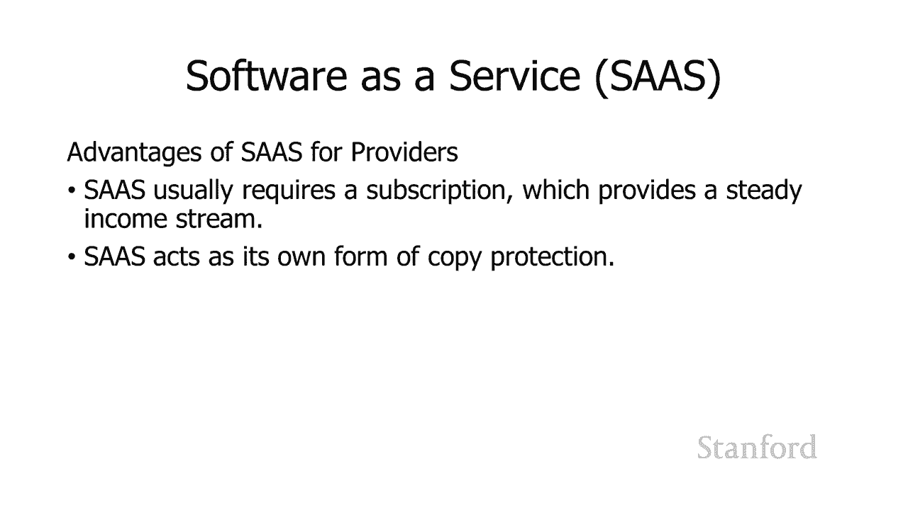

# 【双语字幕+资料下载】斯坦福CS105 ｜ 计算机科学导论(2021最新·完整版) - P66：L26.1- 云计算 - ShowMeAI - BV1eh411W72E

undefined，欢迎探索计算，欢迎探索计算，今天的视频是云计算，今天的视频是云计算，因此术语云计算有多种用法，因此术语云计算有多种用法，因此您需要，因此您需要，小心一点，小心一点。

考虑一下您在与谁交谈，考虑一下您在与谁交谈。

以及他们在谈论云时可能意味着什么，undefined，undefined，云计算或云计算在其基本用途中仅指，undefined，undefined，网络上的任何内容，因此我，网络上的任何内容，因此我。

可能指的是文件，可能指的是文件，服务器、邮件服务器或媒体服务器，因此如果我，服务器、邮件服务器或媒体服务器，因此如果我，说诸如在我的 iphone 上拍照时这样的话，undefined。

undefined，照片被存储或上传到，照片被存储或上传到，完全准确的云端，完全准确的云端，它会在互联网上的某个地方上传，它会在互联网上的某个地方上传，或者，或者，如果我说我，如果我说我。

通过将它们存储在 Dropbox 上将我的关键文档备份到云端，通过将它们存储在 Dropbox 上将我的关键文档备份到云端，这也是，这也是，完全准确的，但是当我，完全准确的，但是当我，谈论云时。

谈论云时，在商业环境中进行计算，特别是如果，在商业环境中进行计算，特别是如果，我在谈论一家科技公司，我在谈论一家科技公司，并且我们正在谈论使用云，并且我们正在谈论使用云，这通常意味着我们正在更换。

这通常意味着我们正在更换，以前，以前，物理上公关的计算机，物理上公关的计算机。

在公司站点使用远程，在公司站点使用远程，计算机，这些计算机部分或，计算机，这些计算机部分或，完全由其他人管理，完全由其他人管理，因此在传统模式下，我们，undefined，undefined。

在自己的场所管理和存储我们自己的计算机，在自己的场所管理和存储我们自己的计算机，我们负责安全，我们负责安全，我们负责为，我们负责为，它们供电 我们 负责控制，undefined，undefined。

这些计算机内的网络 呃，这些计算机内的网络 呃，将这些计算机互连并将，将这些计算机互连并将，我们连接到更广泛的，我们连接到更广泛的，互联网 再次在传统模式下如果，互联网 再次在传统模式下如果。

我们需要更多计算机，我们需要更多计算机，我们订购这些计算机 嗯他们需要，我们订购这些计算机 嗯他们需要，一段时间才能到达，一段时间才能到达，他们到达他们是 交付到我们的，他们到达他们是 交付到我们的。

网站 我们需要设置它们，网站 我们需要设置它们，我们需要将它们连接到网络 如果有针对软件或我们计算机的操作系统发布的更新或安全补丁，我们。

我们需要将它们连接到网络 如果有针对软件或我们计算机的操作系统发布的更新或安全补丁，我们，需要确保一切正常，需要确保一切正常，undefined，undefined，并再次在传统模型下。

undefined，undefined，undefined，运行，运行，使用，使用，我们需要确保这一点得到，我们需要确保这一点得到，照顾，我们现在负责所有的，照顾，我们现在负责所有的。

安全性，安全性，以便理解，以便理解，传统模型，传统模型，与云计算有何不同 我将，与云计算有何不同 我将，看一下，看一下，两个非常密切相关，两个非常密切相关，的关于云计算，的关于云计算。

可能如何工作的早期模型，因此，可能如何工作的早期模型，因此，您可以将其视为，您可以将其视为，对未来发展方向的愿景，对未来发展方向的愿景，和，和，我们将在这些模型中看到的大多数但不是全部的东西。

我们将在这些模型中看到的大多数但不是全部的东西，现在都可用，所以两个不同的，现在都可用，所以两个不同的，两个再次密切相关的，两个再次密切相关的，云计算，云计算，模型，人们提出的是，模型，人们提出的是。

效用计算，效用计算，和网格计算，所以术语，和网格计算，所以术语，效用计算 来自，效用计算 来自，公共事业的概念，例如水或，公共事业的概念，例如水或，电，电，和网格计算，undefined。

undefined，如果您考虑供水系统的，如果您考虑供水系统的，工作方式或电力网络的，工作方式或电力网络的，工作方式，那么名称网格来自电网的概念 我在某些预期范围内有某些相互作用，工作方式。

那么名称网格来自电网的概念 我在某些预期范围内有某些相互作用，关于，关于，当我，当我，使用该实用程序时我需要做什么以及我不需要使用该实用程序做什么。

undefined，undefined，所以让我们以电气为例来，undefined，undefined，看看 假设现在是冬天，看看 假设现在是冬天，天气开始变冷，天气开始变冷，你知道什么时候开始变冷。

你知道什么时候开始变冷，会因一年而异，但，会因一年而异，但，我的房子周围有一堆电加热器，我的房子周围有一堆电加热器，当它开始变冷时，我将，当它开始变冷时，我将，电加热器插入 墙，电加热器插入 墙。

我把它们启动起来，我把它们启动起来，当我需要更多电力时，我不会通知电力公司，当我需要更多电力时，我不会通知电力公司，电力公司，电力公司，只有一大堆电力，只有一大堆电力，希望它不会耗尽，正如。

希望它不会耗尽，正如，我们所看到的那样偶尔会发生，但，我们所看到的那样偶尔会发生，但，一般来说有，一般来说有，那里有很多电 我只是把我的，那里有很多电 我只是把我的，设备插到墙上 我把我的加热器。

设备插到墙上 我把我的加热器，插到墙上 然后我开始使用它们 我，插到墙上 然后我开始使用它们 我，没有提前打电话给电力公司，没有提前打电话给电力公司，我说，我说，嘿 你知道 嗯它开始。

嘿 你知道 嗯它开始，变冷了，变冷了，我 想从下周四开始，我，我 想从下周四开始，我，需要更多的电，需要更多的电，你能不能，你能不能，在我的账单上多加一点电，在我的账单上多加一点电，然后如果我用得很好。

如果我用得，然后如果我用得很好，如果我用得，不好，我想我得付钱，不好，我想我得付钱，了，因为 我告诉过你增加 我的，了，因为 我告诉过你增加 我的，电，电，呃输出你知道这不会，呃输出你知道这不会。

发生你只要，发生你只要，把你的加热器你把它插到，把你的加热器你把它插到，undefined，undefined，而且我绝对不必去，而且我绝对不必去，undefined，undefined。

商店增加我的电容量我，商店增加我的电容量我，不去 商店，不去 商店，我不认为嘿现在是冬天 我，我不认为嘿现在是冬天 我，听说今年冬天会很冷，听说今年冬天会很冷，undefined，undefined。

我需要买一大堆，我需要买一大堆，发电机 我要去商店，发电机 我要去商店，买那些发电机 或者我会告诉，买那些发电机 或者我会告诉，亚马逊寄给我 一些发电机让，亚马逊寄给我 一些发电机让，它们设置好。

它们设置好，你知道设置我的整个呃小房子，你知道设置我的整个呃小房子，电网你知道我不做任何，电网你知道我不做任何，undefined，undefined，这些都是为我照顾我只是，这些都是为我照顾我只是。

把东西插到墙上，把东西插到墙上，东西就在我身边，东西就在我身边，当它在喷洒时再次开始升温时，当它在喷洒时再次开始升温时，我不再需要我的呃，我不再需要我的呃，加热器我不再打电话给，加热器我不再打电话给。

电力公司说，电力公司说，嘿我认为我不再需要加热器，嘿我认为我不再需要加热器，所以请减少我的账单，所以请减少我的账单，嗯我不需要 那些再然后，嗯我不需要 那些再然后，呃，呃。

这是夏天同样的事情你知道所以我的，这是夏天同样的事情你知道所以我的，使用量，使用量，上下浮动 在这个季节，嗯，我没有，上下浮动 在这个季节，嗯，我没有，通知电力公司，我，通知电力公司，我。

不需要做任何特殊的，不需要做任何特殊的，动作，动作。

当我需要的时候，当我需要的时候，电力就在墙上，所以这就是效用计算和网格计算背后的全部想法，电力就在墙上，所以这就是效用计算和网格计算背后的全部想法，这个，这个，想法是，想法是，就像我需要的时候电就在。

就像我需要的时候电就在，那里 就像我打开水龙头时就有水一样，undefined，undefined，这只是一种广泛，这只是一种广泛，可用的，可用的，商品，由这家外部，商品，由这家外部，公用事业公司管理。

公用事业公司管理，网格计算或公用事业计算背后的想法，网格计算或公用事业计算背后的想法，是完全相同，是完全相同，的，除了，的，除了，对于计算能力 有计算，对于计算能力 有计算，能力 按需提供。

能力 按需提供，我可以按我的需要按比例放大或缩小，undefined，undefined，undefined，undefined，undefined，通知任何人我们需要更多的，通知任何人我们需要更多的。

计算能力我们只是你知道，计算能力我们只是你知道，插入墙并且计算能力，插入墙并且计算能力，就在我们身边，就在我们身边，嗯我不需要提前确定我的需求，嗯我不需要提前确定我的需求，我可以根据需要扩大和缩小。

undefined，undefined，我们正在 完成这些模拟，我们正在 完成这些模拟，现在是 2 月，假设我们在 3 月中旬，现在是 2 月，假设我们在 3 月中旬，完成了这些模拟，完成了这些模拟。

我们不再需要那么多的计算能力，我们不再需要那么多的计算能力，我们不会告诉任何人我们只是，我们不会告诉任何人我们只是，停止使用它，停止使用它，我们停止以同样的方式支付它，我们停止以同样的方式支付它。

当我 停止运行我的空间，当我 停止运行我的空间，加热器，加热器，我停止支付电费 所以，我停止支付电费 所以，你知道这是，你知道这是，公用事业或网格计算背后的想法 这是。

公用事业或网格计算背后的想法 这是。

我们真正要拍摄的，我们真正要拍摄的，所以让我们比较这两个，所以让我们比较这两个，模型，模型，你知道的一大好处，你知道的一大好处，拥有公用事业或，拥有公用事业或，网格模型是它为企业提供了。

网格模型是它为企业提供了，巨大的灵活性和，巨大的灵活性和，敏捷性，敏捷性，因为，因为，在传统模型下，在传统模型下，我需要提前确定我的需求，我需要提前确定我的需求，我需要，我需要，与供应商签订合同。

供应商将为，与供应商签订合同，供应商将为，我提供实际的计算设备，我提供实际的计算设备，我需要等待它们交付，我需要等待它们交付，我需要安装它们，我需要安装它们，你知道这一切都需要，你知道这一切都需要。

从公用事业，从公用事业，或电网模型中进行高级预测 我不担心，或电网模型中进行高级预测 我不担心，我们需要什么 dvance 它就在那里，我们需要什么 dvance 它就在那里，可供我使用，可供我使用。

在传统模型上，如果我们，在传统模型上，如果我们，高估了，我们已经，高估了，我们已经，支付了一大堆服务器，支付了一大堆服务器，我们花了所有时间安装和，我们花了所有时间安装和，设置，但我们不需要它们，设置。

但我们不需要它们，因为，因为，我们没有 在公用事业，undefined，undefined，或电网模型，或电网模型，下，对我们产品的需求没有我们想要，undefined，undefined，的那么。

的那么，多，多，只得到我们需要的，只得到我们需要的，东西 我们只为实际，东西 我们只为实际，使用的东西付费 如果我们，使用的东西付费 如果我们，在传统模式下低估了，在传统模式下低估了。

undefined，undefined，我们将不得不拒绝我们的，我们将不得不拒绝我们的，客户 我们会，客户 我们会，说好的 嗯，你想使用我们的，说好的 嗯，你想使用我们的，服务，服务。

我们要订购更多的服务器 呃，我们要订购更多的服务器 呃，我们可能会在几天内有更多的容量，我们可能会在几天内有更多的容量，undefined，undefined，你必须等到那时在，你必须等到那时在。

公用事业或电网模式，公用事业或电网模式，下如果，下如果，我们需要更多的电力，我们需要更多的电力，我们就可以使用更多的电力，我们就可以使用更多的电力。

[音乐]，[音乐]，没事了，没事了，网格或实用模型的另一大优势是计算机，网格或实用模型的另一大优势是计算机，实际上并不位于我的，实际上并不位于我的，公司，所以在传统模型中，如果我，公司。

所以在传统模型中，如果我，有，有，一些东西，你知道，一些东西，你知道，重要的是我们，重要的是我们，为它提供适当的安全性我有责任，undefined，undefined，根据 公用电网模型云。

根据 公用电网模型云，计算公司提供，计算公司提供，传统模型下的安全性如果我，传统模型下的安全性如果我，undefined，undefined，担心我需要良好的正常运行时间我。

担心我需要良好的正常运行时间我，需要有，需要有，备用电源，以便如果，备用电源，以便如果，停电，停电，我的发电机在，我的发电机在，公用电网模型下启动 这，公用电网模型下启动 这，是云计算公司的责任，在。

是云计算公司的责任，在，undefined，undefined，传统模式下，如果我，传统模式下，如果我，担心，担心，呃你知道有多个地理位置，呃你知道有多个地理位置，因为，因为，天堂禁止如果。

天堂禁止如果，加利福尼亚州停电并且有人试图，加利福尼亚州停电并且有人试图，在我们加利福尼亚州的计算机中访问它，在我们加利福尼亚州的计算机中访问它，我们' 那里有点问题，我们' 那里有点问题。

或者如果加利福尼亚的网络，或者如果加利福尼亚的网络，有问题，有问题，我们就有问题，所以你知道我们，我们就有问题，所以你知道我们，可能想要 将，可能想要 将，我们的计算机设备部署在多个。

我们的计算机设备部署在多个，地理位置，在传统模式下，undefined，undefined，我将不得不，我将不得不，在多个地理位置租用这些建筑物，在多个地理位置租用这些建筑物，我将不得不，我将不得不。

undefined，undefined，在这些不同位置派驻人员来，在这些不同位置派驻人员来，跟踪和支持这些，跟踪和支持这些，计算机 公用电网模型 云，计算机 公用电网模型 云，计算公司有很多。

计算公司有很多，不同的地点，不同的地点，嗯，你知道这很棒，嗯，你知道这很棒，而且它不仅支持，而且它不仅支持，呃这个想法，如果其中一个，呃这个想法，如果其中一个，中心，中心，出现问题，如果某处停电。

出现问题，如果某处停电，undefined，undefined，我' 我有多个位置，所以我的，我' 我有多个位置，所以我的，客户可以继续访问，客户可以继续访问，它，它还提供更低的延迟，因为，它。

它还提供更低的延迟，因为，你知道我在华盛顿，你知道我在华盛顿，州的亚马逊服务，州的亚马逊服务，中是否，中是否，有呃东西，如果有人，有呃东西，如果有人，试图访问我的东西，我也在弗吉尼亚州提供 在东。

试图访问我的东西，我也在弗吉尼亚州提供 在东，海岸，我们可以将它们路由，海岸，我们可以将它们路由，到弗吉尼亚服务器，它们的，到弗吉尼亚服务器，它们的，延迟会少得多，延迟会少得多。

而且它们会更快地取回数据，而且它们会更快地取回数据，因为 你是他们的位置更近，因为 你是他们的位置更近，当我们谈论，当我们谈论，我们有国际客户的情况时，这甚至更进一步，我们有国际客户的情况时。

这甚至更进一步。

我在澳大利亚有一台服务器，呃，我在澳大利亚有一台服务器，呃，有人实际上来自澳大利亚，有人实际上来自澳大利亚，这将使他们更快地，这将使他们更快地，访问，所以正如我所建议的 早些时候，访问。

所以正如我所建议的 早些时候，当我们开始这个，当我们开始这个，现代云计算时，还没有，undefined，undefined，我们希望的，我们希望的。

公用事业或网格计算的所有东西，但我们已经，公用事业或网格计算的所有东西，但我们已经，非常接近了，非常接近了，我们将把四种，我们将把四种，不同的云计算模型，不同的云计算模型，基础设施作为一个 服务有时。

基础设施作为一个 服务有时，被称为，被称为，平台 商店被称为，平台 商店被称为，无服务器，然后软件即，无服务器，然后软件即。

undefined，undefined，在基础设施下称为 sas 作为服务，在基础设施下称为 sas 作为服务，提供商将，提供商将，提供基本的计算机，提供基本的计算机，基础设施，基础设施。

而我是我将要组织的客户，而我是我将要组织的客户，需要的基础设施，所以，需要的基础设施，所以，这是一个例子，亚马逊网络，这是一个例子，亚马逊网络，服务有虚拟私有云，服务有虚拟私有云，顺便说一下。

顺便说一下，我应该提到亚马逊网络服务，我应该提到亚马逊网络服务，本身 是，本身 是，一家拥有非常广泛的产品选择的大公司，一家拥有非常广泛的产品选择的大公司，所以如果有人告诉你，所以如果有人告诉你。

他们正在使用亚马逊网络服务 aws，他们正在使用亚马逊网络服务 aws，但并没有真正告诉你，但并没有真正告诉你，他们在做什么，他们在做什么，你需要知道，你需要知道，他们在 aws 上使用的特定服务。

他们在 aws 上使用的特定服务，因此，虚拟私有云服务 vpc，因此，虚拟私有云服务 vpc，的工作方式是我们公司，的工作方式是我们公司，将为给定数量的亚马逊 ec2 实例签订合同，undefined。

undefined，这些是弹性云实例，这些是弹性云实例，因此这些基本上是虚拟，因此这些基本上是虚拟，机，机，我们的 IT 专业人员会，我们的 IT 专业人员会，使用任何操作系统设置这些 ec2 实例。

使用任何操作系统设置这些 ec2 实例，我们想要它们，我们想要它们，我们会，我们会，在这些 ec2 实例之间建立我们的网络结构我们，在这些 ec2 实例之间建立我们的网络结构我们。

可以设置一些 ec2 实例，可以设置一些 ec2 实例，是，是，我们自己的虚拟私有云内部的，我们自己的虚拟私有云内部的，外部人员无法直接访问，外部人员无法直接访问，它们，然后我们可以设置 一些，它们。

然后我们可以设置 一些，ec2 实例，ec2 实例，作为外部可见的公共，作为外部可见的公共，事物，不同的人可以，事物，不同的人可以，访问，所以我们在这里看到的，访问，所以我们在这里看到的。

是我们有一堆计算机，是我们有一堆计算机，重新在云上，但，重新在云上，但。

我们需要自己进行设置，我们需要自己进行设置，所以我们得到的是，所以我们得到的是，它类似于拥有自己的，它类似于拥有自己的，计算机，除了根据需要，计算机，除了根据需要，添加和删除实例要容易得多。

添加和删除实例要容易得多，所以你知道，正如我，所以你知道，正如我，之前提到的，如果我们 遵循，之前提到的，如果我们 遵循，传统模式 如果我们需要更多，传统模式 如果我们需要更多。

计算机 我们需要订购这些，计算机 我们需要订购这些，计算机 这些计算机需要，计算机 这些计算机需要，物理交付，物理交付，到我们的场所 我们需要设置，到我们的场所 我们需要设置。

它们 如果我们需要更多实例，它们 如果我们需要更多实例，我们需要通过基础设施即服务安装所有东西，我们需要通过基础设施即服务安装所有东西，我们只，我们只，需要访问我们在 amazon aws 上的小网页。

需要访问我们在 amazon aws 上的小网页，然后我就增加了我们需要的实例数量，然后我就增加了我们需要的实例数量，然后，然后，我立即拥有了更多的，我立即拥有了更多的，实例，实例，嗯，嗯，不仅更好。

因为我可以，不仅更好，因为我可以，根据需要进行扩展和缩减，只需一个，根据需要进行扩展和缩减，只需一个，单击一个按钮，但正如我们之前讨论过的，单击一个按钮，但正如我们之前讨论过的，那样，那样。

亚马逊可能会比我们自己拥有更好的，亚马逊可能会比我们自己拥有更好的，安全性，安全性，除非您，除非您，知道我的意思是我是一家真正的大，知道我的意思是我是一家真正的大，公司，公司。

还是我支持的政府 假设我可以获得，还是我支持的政府 假设我可以获得，非常好的安全性，但你知道，如果，非常好的安全性，但你知道，如果，你是一家，你是一家，小型公司或中型公司，小型公司或中型公司。

亚马逊将拥有更好的安全性，亚马逊将拥有更好的安全性，它可能会有更好的，它可能会有更好的，网络访问，它会有，网络访问，它会有，更好的电力系统可靠性，更好的电力系统可靠性，他们有中心 在世界各地。

他们有中心 在世界各地，所以，所以，我们不仅可以很容易地扩展和缩减，我们不仅可以很容易地扩展和缩减，而且，而且，还有很多，还有很多，确保一切正常的细节 我们有，确保一切正常的细节 我们有。

良好的正常运行时间，良好的正常运行时间，我们有一个安全的系统 呃这一切都得到了，我们有一个安全的系统 呃这一切都得到了，完全的照顾 所以这就是 太好了，完全的照顾 所以这就是 太好了。

这对我们来说是一个很大的负担，但，这对我们来说是一个很大的负担，但，与此同时，与此同时，我仍然需要大量，我仍然需要大量，训练有素的 IT，训练有素的 IT，人员，我们正在维护和，人员，我们正在维护和。

更新我们自己的服务器，更新我们自己的服务器，就好像它们在本地场所一样，就好像它们在本地场所一样，即使它们实际上是在，即使它们实际上是在，云上，所以 我们正在处理所有，云上，所以 我们正在处理所有。

维护以处理所有更新，维护以处理所有更新，我们正在做所有设置 我们正在做，我们正在做所有设置 我们正在做，所有正常的事情，所有正常的事情，最大的区别是它们不是，最大的区别是它们不是，在物理前提下，而是在。

在物理前提下，而是在，云上 我们可以，undefined，undefined，很容易，undefined，undefined，undefined，undefined，地添加和删除它们。

undefined，undefined，undefined，undefined，很容易增加或减少，很容易增加或减少，实例，但你可以看到，实例，但你可以看到，呃，我管理了很多，我有一个 IT 工作，呃。

我管理了很多，我有一个 IT 工作，undefined，undefined，人员处理很多事情，人员处理很多事情，所以使用它有一些，所以使用它有一些，非常明显的好处，那就是，undefined。

undefined，在物理前提下的优势 但，在物理前提下的优势 但，此外，此外，嗯，你知道你可能很喜欢，嗯，你知道你可能很喜欢，为什么你想让自己的 IT，为什么你想让自己的 IT，员工做得很好，我可以。

员工做得很好，我可以，按照我想要的任何方式设置这些计算机，所以，按照我想要的任何方式设置这些计算机，所以，现在我得到了一些主要，现在我得到了一些主要，好处 在云，好处 在云，上能够扩大和缩小关于。

上能够扩大和缩小关于，不需要提前太多，不需要提前太多，undefined，undefined，关于不需要提供安全，关于不需要提供安全，等的预测，等的预测。

但我仍然拥有完全的，但我仍然拥有完全的，灵活性，就好像这些是我自己的，灵活性，就好像这些是我自己的，电脑，电脑，一样 平台即服务所以，undefined，undefined。

平台即服务为我提供计算平台我的，平台即服务为我提供计算平台我的，公司只负责，公司只负责，在该平台上运行的应用软件，在该平台上运行的应用软件，undefined，undefined。

所以heroku和亚马逊弹性豆茎，所以heroku和亚马逊弹性豆茎，是pass的例子，是pass的例子，所以这是另一个aws服务亚马逊，所以这是另一个aws服务亚马逊。

弹性豆，弹性豆，嗯 所以你知道，嗯 所以你知道，undefined，undefined，过去不同的模型之间会有差异，过去不同的模型之间会有差异，但假设我们正在使用 heroku。

但假设我们正在使用 heroku，所以我将继续使用 heroku 支持，所以我将继续使用 heroku 支持，的一种语言编写我的应用程序，undefined，undefined。

所以也许我使用 javascript node。js，所以也许我使用 javascript node。js，或者我可能使用 ruby 或 php，或者我可能使用 ruby 或 php。

你知道他们有很多不同的，你知道他们有很多不同的，语言支持，语言支持，我使用 git 存储我的代码，这是一个，我使用 git 存储我的代码，这是一个，版本控制系统，版本控制系统，当我准备好时。

我告诉 git 将我的，当我准备好时，我告诉 git 将我的，代码发送到 heroku，代码发送到 heroku。

，我的代码是 现在生活在互联网上，我的代码是 现在生活在互联网上，所以，所以，你知道使用 heroku 我没有建立，你知道使用 heroku 我没有建立，自己的网络，自己的网络，我主要没有配置我自己的。

我主要没有配置我自己的，计算机，计算机，这就是我们所看到的，这就是我们所看到的，我无法访问很多，我无法访问很多，方面 操作系统的 s，方面 操作系统的 s，所以你知道我没有，所以你知道我没有，在一堆。

在一堆，ec2 实例之间建立互连所以很多东西都，ec2 实例之间建立互连所以很多东西都，得到了照顾，得到了照顾，我能够更多地关注，我能够更多地关注，我的应用程序正在做什么，我的应用程序正在做什么。

这给了我更少的灵活性，但它，这给了我更少的灵活性，但它，让我更容易，让我更容易，处理事情，处理事情，嗯，我可以选择添加一些额外的，嗯，我可以选择添加一些额外的，实例，所以你知道，实例，所以你知道。

如果我决定我需要更多的力量，我可以，如果我决定我需要更多的力量，我可以，继续这样做，还有一些，继续这样做，还有一些，我可以配置的选项，所以它，我可以配置的选项，所以它，不像根本没有配置。

不像根本没有配置，我可以决定我是否想要数据库呃，我可以决定我是否想要数据库呃，还有一堆其他附加包，还有一堆其他附加包，我可以支付额外的钱，我可以支付额外的钱，但在大多数情况下，但在大多数情况下。

与基础设施相比，这非常简单 作为一种，与基础设施相比，这非常简单 作为一种，服务，我，服务，我，在这些虚拟机上安装操作系统，在这些虚拟机上安装操作系统，我，我，在虚拟私有云中获得所有虚拟实例，我将。

在虚拟私有云中获得所有虚拟实例，我将，它们全部配置为这样，它们全部配置为这样，因此对平台即服务的工作人员的需求要少得多，因此对平台即服务的工作人员的需求要少得多，主要是我只是把我的应用程序。

主要是我只是把我的应用程序。

在实例上，heroku，在实例上，heroku，负责其余的工作，负责其余的工作，我们的下一个模型是无服务器的，我们的下一个模型是无服务器的，这，这，更接近于实用程序和网格计算。

更接近于实用程序和网格计算，undefined，undefined，的意图，基本上我没有任何，的意图，基本上我没有任何，虚拟计算实例，虚拟计算实例，而是我只有嘿这里有一个，而是我只有嘿这里有一个。

函数 我想运行，函数 我想运行，所以最好的例子是，所以最好的例子是，amazon lambda，这是另一个 aws，amazon lambda，这是另一个 aws，服务，所以再次有，服务，所以再次有。

很多 amazon web 服务类型的，很多 amazon web 服务类型的，服务，所以，服务，所以，如果有人说我们正在，如果有人说我们正在，使用 aws，使用 aws，你需要确切知道哪些。

你需要确切知道哪些，aws 的许多服务都，aws 的许多服务都，在 amazon lambda 中使用，所以我写了一个，在 amazon lambda 中使用，所以我写了一个，我想远程调用。

我想远程调用，的函数 我上传了函数代码 amazon，的函数 我上传了函数代码 amazon，然后我根据需要远程调用该函数，然后我根据需要远程调用该函数，undefined，undefined。

我只需支付有人调用它，我只需支付有人调用它，使用的许多计算资源，使用的许多计算资源，整个，整个，月都在运作，他们只是在月底把账单寄给我，月都在运作，他们只是在月底把账单寄给我，所以，所以，嗯，非常，嗯。

非常，像原始的网格计算模型，嗯，你，像原始的网格计算模型，嗯，你，知道，我不，知道，我不，配置任何东西，我不配置 需要，配置任何东西，我不配置 需要，确定我想要多少个实例，确定我想要多少个实例。

嗯我当然不知道你知道，嗯我当然不知道你知道，什么操作系统我想，什么操作系统我想，处理操作系统补丁我就像，处理操作系统补丁我就像，undefined，undefined，嘿这里有一堆代码每当我。

嘿这里有一堆代码每当我。

调用这个代码就继续运行，调用这个代码就继续运行，对我来说，这实际上很酷，对我来说，这实际上很酷，好吧，我们的最后一个模型是软件，好吧，我们的最后一个模型是软件，即服务，即服务，这个有点不同，它。

这个有点不同，它，并不真正适合其他，并不真正适合其他，模型，因为，模型，因为，在以前的模型中，您肯定，在以前的模型中，您肯定，不会有最终，不会有最终，客户 知道，但如果我是 joe，客户 知道。

但如果我是 joe，客户，我不会注册，客户，我不会注册，基础设施即服务我，基础设施即服务我，不会注册平台即，不会注册平台即，服务，服务，我不会注册，我不会注册，无服务器，无服务器。

但我当然可能会注册 支持，但我当然可能会注册 支持，软件即服务，事实上，软件即服务，事实上，我们大多数人在，我们大多数人在，某个时间点或其他，某个时间点或其他，时候使用软件即服务，因此软件即服务意味着。

时候使用软件即服务，因此软件即服务意味着，公司将软件作为服务提供给其他人，undefined，undefined，通常该软件将主要，通常该软件将主要，在提供商的计算机上运行  尽管。

在提供商的计算机上运行  尽管，正如我们在讨论，正如我们在讨论，客户端与服务器端，客户端与服务器端，处理，处理，的大多数情况下看到的那样，在大多数情况下都会有一个，的大多数情况下看到的那样。

在大多数情况下都会有一个，客户端组件，所以，客户端组件，所以，当我们去的时候，这通常，当我们去的时候，这通常，会是，会是，这通常会，这通常会，与 网络和我们，与 网络和我们，当我们访问该网站时，它会。

当我们访问该网站时，它会，继续向我们发送一个客户端，继续向我们发送一个客户端，程序，因此从，程序，因此从，技术上讲，某些软件即，技术上讲，某些软件即，服务将在，服务将在，客户端，客户端，计算机上运行。

但这通常，计算机上运行，但这通常，被认为是，被认为是，这样 由呃处理，这样 由呃处理，提供软件，提供软件，服务的公司由他们的计算机运行，服务的公司由他们的计算机运行，所以软件即服务的例子是。

所以软件即服务的例子是，谷歌文档所以，谷歌文档所以，谷歌正在网络上提供软件，谷歌正在网络上提供软件，人们正在，人们正在，访问谷歌网站并，访问谷歌网站并，利用它，利用它。

google docs，google docs，软件即服务的，软件即服务的，优势 嗯，它，优势 嗯，它，部门不需要处理，部门不需要处理，任何事情，所以如果你的公司里有一大群，任何事情。

所以如果你的公司里有一大群，人，人，你认识的很多人都是 不是技术人员，你认识的很多人都是 不是技术人员，他们可能没有，他们可能没有，在他们的计算机上安装随机游戏，他们可能没有行使最好的安全性。

undefined，undefined，嗯，你知道这是一个问题，嗯，你知道这是一个问题，所以你需要一个技术部门来，所以你需要一个技术部门来，undefined，undefined，跟踪所有事情。

跟踪所有事情，以确保他们，以确保他们，的 Microsoft Word 版本 或者任何，的 Microsoft Word 版本 或者任何，没有被感染的东西，没有被感染的东西，或者任何软件即服务的东西。

所有的东西，或者任何软件即服务的东西，所有的东西，都，都，在提供，在提供，者的服务器上的提供者的网站上，undefined，undefined，如果，如果，有更新，如果谷歌文档得到更新。

你的 IT 公司不必处理它 例如，有更新，如果谷歌文档得到更新，你的 IT 公司不必处理它 例如，undefined，undefined，我去访问 google docs 网站。

我去访问 google docs 网站，我使用的是最新版本的，我使用的是最新版本的，软件，软件，嗯，如果他们更改了客户端，嗯，如果他们更改了客户端，代码，代码，当我访问该网站时，该代码将自动更新。

当我访问该网站时，该代码将自动更新，它将从服务器发送，它将从服务器发送，到 我的网络浏览器和我将始终，到 我的网络浏览器和我将始终，运行最新版本的代码，运行最新版本的代码，另一个优点是该软件。

另一个优点是该软件，通常是为网络而设计的，通常是为网络而设计的，因为它始终被设计为 e，因为它始终被设计为 e，总是在网络上运行，所以，总是在网络上运行，所以，这些软件，这些软件。

通常比传统软件具有更多的，通常比传统软件具有更多的，内置协作功能，内置协作功能，所以，所以，你可以通过 google docs 看到这一点，你可以通过 google docs 看到这一点，它有很多。

它有很多，不错的功能，团队中的不同，不错的功能，团队中的不同，人可以工作，人可以工作，undefined，undefined，嗯，微软正试图在其中添加这些，嗯，微软正试图在其中添加这些，功能，但，功能。

但，你知道传统上微软的 word 或，你知道传统上微软的 word 或，excel 并不是为了让，excel 并不是为了让，多人同时访问它，多人同时访问它，而设计的，而谷歌文档，而设计的，而谷歌文档。

一直牢记这是在互联网上运行的，一直牢记这是在互联网上运行的，所以，所以，这是一种 他们，这是一种 他们，在最初设计软件时可以做出的设计选择。

undefined，undefined，嗯，就提供这项服务的人而言，嗯，就提供这项服务的人而言，还有许多很大的，还有许多很大的，好处，好处，因此，因此，软件即服务的好处之一是它通常。

软件即服务的好处之一是它通常，需要订阅，这意味着您，需要订阅，这意味着您，有 稳定的收入来源，这，有 稳定的收入来源，这，总是很好，总是很好，此外，如果您正在运行，此外，如果您正在运行。

具有软件即服务的东西，那么您就是，具有软件即服务的东西，那么您就是，mu  ch 不太关心复制保护，mu  ch 不太关心复制保护，因为，因为，人们不会自己运行它，他们，人们不会自己运行它，他们。

通过访问您的服务器来运行它，因此，通过访问您的服务器来运行它，因此，您可以跟踪，您可以跟踪，人们的登录，如果他们，人们的登录，如果他们，想登录服务器，您可以检查，想登录服务器，您可以检查。

他们是否付费客户 与否，而，他们是否付费客户 与否，而，使用传统软件，有人可以，undefined，undefined，在另一台计算机上制作重复副本安装在一大群，undefined，undefined。

人的计算机上，即使他们，人的计算机上，即使他们，没有为此付费，所以软件即，没有为此付费，所以软件即，服务，服务，作为客户的，作为客户的，优势 知道你的 IT 部门，优势 知道你的 IT 部门，不必担心。

不必担心，让所有东西保持更新和，让所有东西保持更新和，最新并安装在每个人的，最新并安装在每个人的，计算机上，然后它对，计算机上，然后它对。

undefined，undefined，所以我们一直在谈论云，所以我们一直在谈论云，计算，计算，嗯，实际上还有另一组，嗯，实际上还有另一组，模型 与，模型 与，在网络上运行但，在网络上运行但。

与云分离的计算相关联，因此有，与云分离的计算相关联，因此有，许多不同的术语，许多不同的术语，这些术语都有些相互关联，因此，这些术语都有些相互关联，因此，边缘计算，边缘计算，雾 计算或网状计算。

雾 计算或网状计算，因此破坏，因此破坏，边缘雾和网状计算与云计算的对比，边缘雾和网状计算与云计算的对比，通常是我们将，通常是我们将，云视为，云视为，互联网上遥远的某个地方，互联网上遥远的某个地方。

但对于某些应用程序架构中的某些类型的应用程序，undefined，undefined，我们可能希望区分不同的，我们可能希望区分不同的，事物 远离互联网，事物 远离互联网，意味着云计算与，意味着云计算与。

附近，附近，但不在我们设备上的东西，所以，但不在我们设备上的东西，所以，在附近网络或我们当前网络附近的某个地方，undefined，undefined，与我们自己设备上的东西。

undefined，undefined，所以这是，所以这是，边缘雾和网格计算之间的细微差别 边缘，边缘雾和网格计算之间的细微差别 边缘，计算是指，计算是指，互联网和我们自己的设备之间的边缘。

互联网和我们自己的设备之间的边缘，所以它就像附近的雾计算，所以它就像附近的雾计算，是相似，是相似，的，主要术语雾计算的意思，的，主要术语雾计算的意思，是与云计算形成对比，在云计算，是与云计算形成对比。

在云计算，中，云在互联网上被认为是遥远，中，云在互联网上被认为是遥远，的，的，然后是网格计算 专注于，然后是网格计算 专注于，拥有，拥有，undefined，undefined。

可能以临时方式形成的更分散的网络，并，可能以临时方式形成的更分散的网络，并，提供更多 强大的网络，提供更多 强大的网络。

我们将在几分钟内讨论这个问题，undefined，undefined，为什么你可能想要这个，所以，undefined，undefined，边缘雾或网状计算与云计算相比有什么。

边缘雾或网状计算与云计算相比有什么，undefined，undefined，好处考虑在远程环境中工作，好处考虑在远程环境中工作，undefined，undefined，以便提供一个例子，我发现了这些。

以便提供一个例子，我发现了这些，例子 在 ge digital 我认为这，例子 在 ge digital 我认为这，是一个很好的例子，是一个很好的例子，呃你有一个海上平台所以，呃你有一个海上平台所以。

你有一个你知道你正在，undefined，undefined，海湾中间钻探石油嗯是的，海湾中间钻探石油嗯是的，也许你确实有联系 到，也许你确实有联系 到，互联网，但您与互联网的连接有限，互联网。

但您与互联网的连接有限，可能较慢，但，可能较慢，但，带宽也有限，带宽也有限，所以边缘或雾计算有点，所以边缘或雾计算有点，关注这个想法，关注这个想法，嘿，你知道我们可以，嘿，你知道我们可以。

在我们的网络内部处理一些事情，在我们的网络内部处理一些事情，呃在我们的离岸平台上，呃在我们的离岸平台上，然后我们还可以，然后我们还可以，根据我们正在做的事情与云交谈，根据我们正在做的事情与云交谈。

所以我们是否想区分，所以我们是否想区分，我们在离岸平台，我们在离岸平台，上的互联网上本地处理的内容，上的互联网上本地处理的内容，与，与，h 更远一些然后呃你，h 更远一些然后呃你，知道，知道。

希望很快我们会，希望很快我们会，在太空中，在太空中，遇到类似的问题你知道也许你有一群，遇到类似的问题你知道也许你有一群，人在月球上嗯他们仍然，人在月球上嗯他们仍然，可以与地球通信但，可以与地球通信但。

你知道他们的带宽有限而且，你知道他们的带宽有限而且，他们肯定有 尝试与地球通信时会有巨大的延迟，undefined，undefined，然后当然火星会遇到，然后当然火星会遇到，更大的问题，所以。

更大的问题，所以，这里的想法是我们离设备越近，这里的想法是我们离设备越近，嗯你知道我们，嗯你知道我们，在本地，在本地，更近的网络中发生了事情，呃要么 本地，更近的网络中发生了事情，呃要么 本地。

网络或者，网络或者，你知道我们可能有我们自己的小，你知道我们可能有我们自己的小，内部网络嗯，内部网络嗯，你可以想象在火星上我们有我们，你可以想象在火星上我们有我们，自己的小内部网络我们有。

自己的小内部网络我们有，一堆网络一个网络，一堆网络一个网络，网络，网络，但是然后呃我们在很大程度上是我们，但是然后呃我们在很大程度上是我们，与地球上的互联网分开，与地球上的互联网分开，好吧。

所以呃我们将减少，好吧，所以呃我们将减少，对整个互联网的带宽要求，对整个互联网的带宽要求，所以我们有一些本地的东西，所以我们有一些本地的东西，呃，呃，我们的较小的网络它确实，我们的较小的网络它确实。

与更大的互联网通信，与更大的互联网通信，但我们已经变红了 uced 带宽，但我们已经变红了 uced 带宽，要求 我们正在努力将，要求 我们正在努力将，需要发送，需要发送，到更大，到更大。

互联网的带宽量保持在最低水平 我们再次减少了延迟，互联网的带宽量保持在最低水平 我们再次减少了延迟，undefined，undefined，呃你知道这取决于我们，呃你知道这取决于我们。

所在的位置以及我们，所在的位置以及我们，与更大互联网的通信看起来，undefined，undefined，就像我们将信息发送到，就像我们将信息发送到，更大的互联网和我们得到，更大的互联网和我们得到。

结果之间可能会有相当大的延迟，所以这实际上是，undefined，undefined，一些人正在考虑使用，undefined，undefined，手机的原因之一，欧洲电信，手机的原因之一，欧洲电信。

标准是 从事边缘计算，标准是 从事边缘计算，这里的想法是他们，这里的想法是他们，希望减少，希望减少，通过手机信号塔的流量，因此如果，通过手机信号塔的流量，因此如果，他们可以，他们可以，在，在。

手机信号塔本身处理一些处理，他们就不必，手机信号塔本身处理一些处理，他们就不必，发送数据 进一步，发送数据 进一步。

，这是边缘或雾或网格计算的另一种潜在用途，undefined，undefined，其中一些类型的计算，其中一些类型的计算，专注于，专注于，尝试提供更强大的模型，尝试提供更强大的模型，所以，所以。

呃这是一个部分 专注于网状，呃这是一个部分 专注于网状，计算，计算，你想要的是你想要一个，你想要的是你想要一个，没有，没有，单点故障的分布式计算机模型所以记得一段，undefined。

undefined，时间前，大概大约三四个星期前，时间前，大概大约三四个星期前，当我们谈论，当我们谈论，网络如何工作时，网络如何工作时，我提到了其中一个，我提到了其中一个，星型网络的问题是你有一个中心。

星型网络的问题是你有一个中心，故障点，故障点，所以我们都使用的星型网络的例子，undefined，undefined，是 Wi-Fi 网络，如果 Wi-Fi 路由器，是 Wi-Fi 网络。

如果 Wi-Fi 路由器，出现故障，出现故障，我们都是主机，所以背后的想法，我们都是主机，所以背后的想法，网状网络是，网状网络是，您想要拥有一个更健壮的模型，您想要拥有一个更健壮的模型。

如果其中一个节点出现故障，您可以，如果其中一个节点出现故障，您可以，继续工作，继续工作，因此如果某些节点丢失，那么自我修复网络，undefined，undefined，嗯，正如您想象的那样，这些类型。

嗯，正如您想象的那样，这些类型，的设计特别重要，的设计特别重要，用于军事应用，所以，用于军事应用，所以，你知道如果你有那个指挥，你知道如果你有那个指挥，车，它是故障的中心点，车，它是故障的中心点。

它发生了一些事情，它发生了一些事情，呃你不希望整个，呃你不希望整个，网络瘫痪你仍然希望人们，网络瘫痪你仍然希望人们，能够与每个人进行通信，能够与每个人进行通信，其他并且仍然保持网络。

其他并且仍然保持网络，连接，所以，连接，所以，对于在这个领域工作的一些人来说，对于在这个领域工作的一些人来说，这是一个关键的关键问题，他们正，这是一个关键的关键问题，他们正，试图研究，试图研究。

并尝试创建强大的，并尝试创建强大的，网格计算，网格计算，我想提到的一件事是，我想提到的一件事是，这并不能取代 云计算是，这并不能取代 云计算是，必然的，并且，必然的，并且，它通常可以与，它通常可以与。

传统的云计算一起完成，因此，传统的云计算一起完成，因此，在边缘处理一些请求，在边缘处理一些请求，然后，然后，将额外的请求传递到云上，将额外的请求传递到云上，这通常还，这通常还，涉及传统计算机以外的设备。

涉及传统计算机以外的设备，这将我们带到了物联网，这将我们带到了物联网，这实际上是我们下一个视频，这实际上是我们下一个视频，将要讨论的内容，将要讨论的内容。

所以我很快就会与您讨论。

