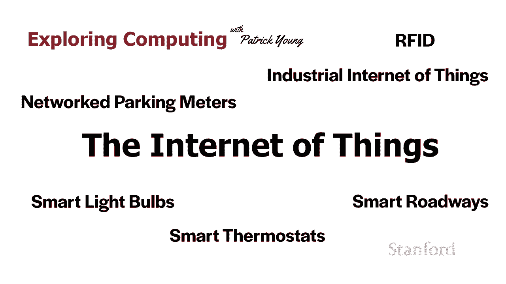
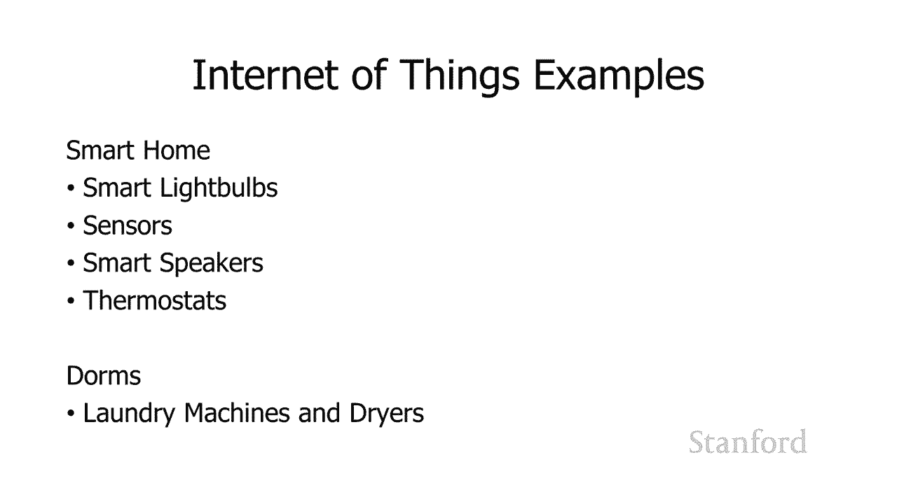
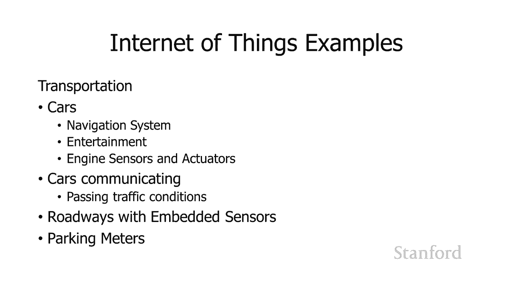
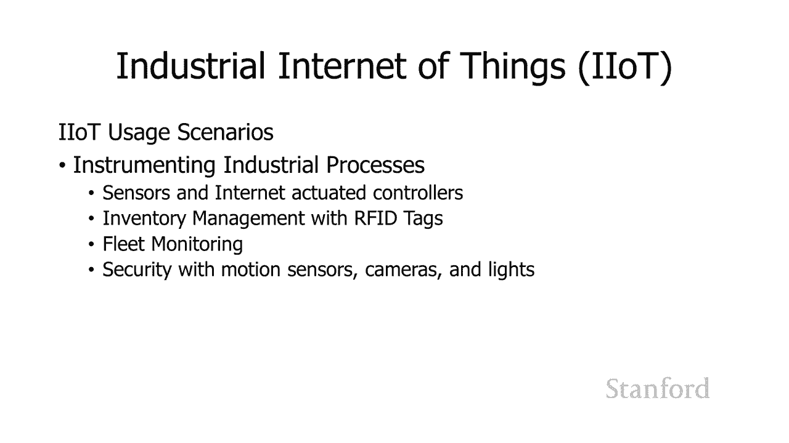
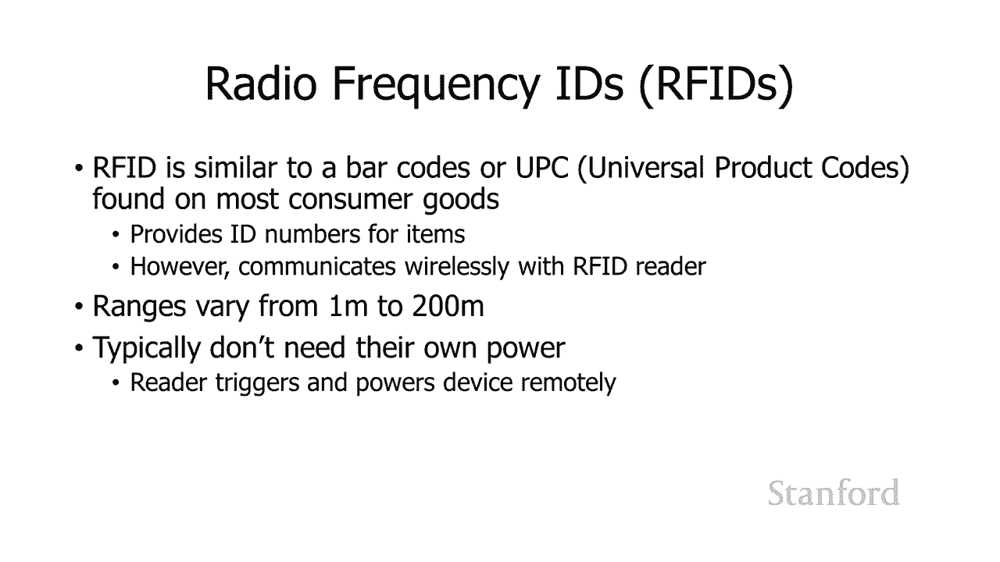
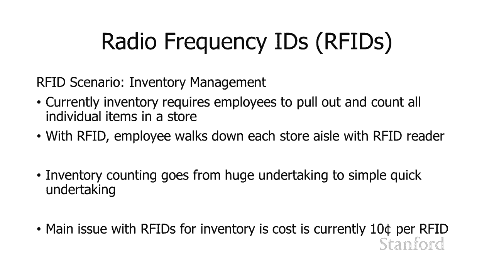
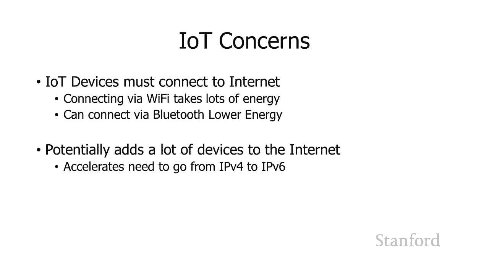
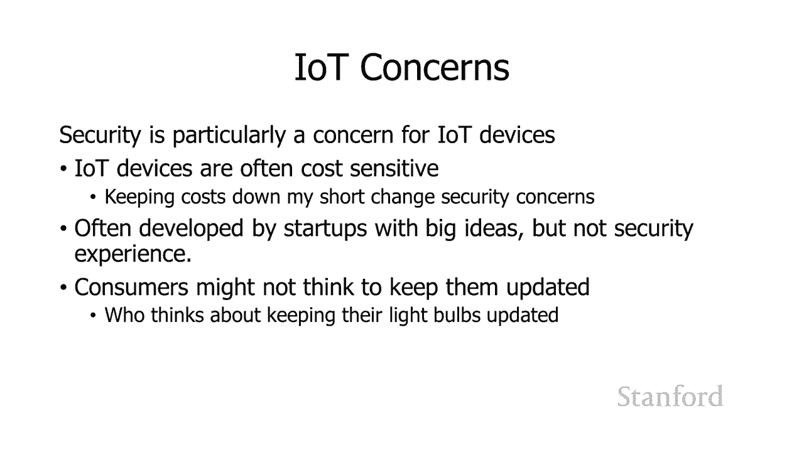
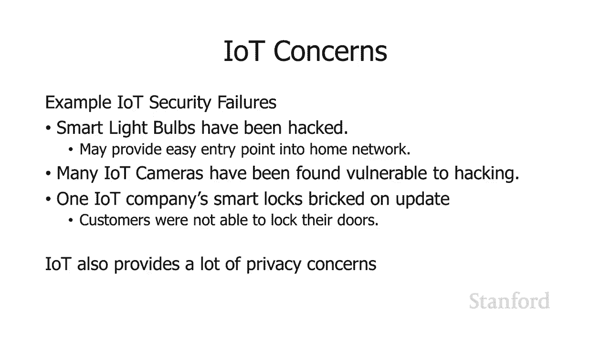

# 【双语字幕+资料下载】斯坦福CS105 ｜ 计算机科学导论(2021最新·完整版) - P67：L26.2- 物联网 - ShowMeAI - BV1eh411W72E

undefined，欢迎探索计算，欢迎探索计算，今天的视频是物联网，今天的视频是物联网，所以正如我在上一个视频结尾处提到的，所以正如我在上一个视频结尾处提到的，当我们谈论，当我们谈论。

网状边缘和雾计算时，越来越，网状边缘和雾计算时，越来越，多的不被认为是，多的不被认为是，传统计算设备的设备被，传统计算设备的设备被，放到了物联网上 互联网，放到了物联网上 互联网，和这个由，和这个由。

非传统计算设备组成，非传统计算设备组成。

的网络有时被称为，的网络有时被称为，物联网，物联网，所以让我们快速浏览，所以让我们快速浏览，一些适合物联网的设备示例，一些适合物联网的设备示例，以便您更好，以便您更好，地了解我到底是什么 谈论。

地了解我到底是什么 谈论，我认为作为消费者，我认为作为消费者，您可能最有可能遇到，您可能最有可能遇到，undefined，undefined，此类设备的地方是智能家居的概念，undefined。

undefined，所以如果您有一个智能灯泡，所以如果您有一个智能灯泡，例如，例如，它会被视为，它会被视为，物联网，为什么，undefined，undefined，如果你有智能灯泡。

你会想要一个智能灯泡吗，你可以，如果你有智能灯泡，你会想要一个智能灯泡吗，你可以，控制，控制，它们的颜色，所以你知道如果你曾经，它们的颜色，所以你知道如果你曾经，购买过灯泡，购买过灯泡。

你想要明亮的白色，你想要明亮的白色，吗？  o 你想要柔和的白色 你，吗？  o 你想要柔和的白色 你，想要暖，想要暖，白色吗 如果你有一个智能灯泡，白色吗 如果你有一个智能灯泡，你可以在飞行中改变。

你可以在飞行中改变，评级 你会像哦我，评级 你会像哦我，有一些朋友过来，有一些朋友过来，我想要 稍微暖和一点，或者，我想要 稍微暖和一点，或者，你知道我想在桌子上做一些艺术品。

你知道我想在桌子上做一些艺术品，undefined，undefined，我想要，我想要，纯白光，所以我确切地知道，纯白光，所以我确切地知道，它是什么我画得很好，我会继续，它是什么我画得很好，我会继续。

把它调高，把它调高，你 还可以控制，你 还可以控制，灯泡 呃，灯泡 呃，你知道如果你在远程 呃你，你知道如果你在远程 呃你，不在那里 你想让它，不在那里 你想让它，看起来像你在那里 你可以知道。

看起来像你在那里 你可以知道，远程控制那些，远程控制那些，所以有很多，所以有很多，潜力 您可能想要，潜力 您可能想要，拥有智能灯泡，拥有智能灯泡，的原因 是否值得，的原因 是否值得。

拥有智能灯泡以及哪些安全，拥有智能灯泡以及哪些安全，风险，风险，由您决定 我们将在本讲座，由您决定 我们将在本讲座，稍后部分讨论安全风险，undefined，undefined。

嗯 您可以将传感器连接到，嗯 您可以将传感器连接到，互联网，互联网，这些传感器可以与智能，这些传感器可以与智能，扬声器结合使用 例如，扬声器结合使用 例如，如果您有一栋带有智能，如果您有一栋带有智能。

扬声器和传感器的房子，当您从，扬声器和传感器的房子，当您从，一个房间移动到另一个房间时，它可以，一个房间移动到另一个房间时，它可以，打开和关闭扬声器，打开和关闭扬声器，并且您正在播放的音乐可以跟随。

并且您正在播放的音乐可以跟随，您从一个房间到另一个房间，您从一个房间到另一个房间，恒温器可以 连接到，恒温器可以 连接到，互联网，互联网，在那里你可以远程处理数据并，在那里你可以远程处理数据并。

再次控制它，再次控制它，你知道对它做一些分析，所以，你知道对它做一些分析，所以，有各种不同的，undefined，undefined，设备连接到互联网，我，设备连接到互联网，我，怀疑，怀疑。

这种趋势会持续下去，而且会更多，这种趋势会持续下去，而且会更多，更多的，更多的，设备看起来很自然，设备看起来很自然，您的孩子可能会认为这是，您的孩子可能会认为这是，完全正常的，而我仍然，完全正常的。

而我仍然，有点奇怪我们有智能，有点奇怪我们有智能，灯泡，灯泡，好吧，好吧，这是另一个物联网示例，这可能是，这是另一个物联网示例，这可能是，我见过的最好的用途之一，我见过的最好的用途之一。

当我作为常驻人员住在斯坦福宿舍时，当我作为常驻人员住在斯坦福宿舍时，他们实际上将，他们实际上将，洗衣机和烘干机放到了互联网上，洗衣机和烘干机放到了互联网上，所以这实际上，所以这实际上，非常方便。

因为这意味着，非常方便，因为这意味着，通常洗衣机烘干机是，通常洗衣机烘干机是，他们都在地下室，他们在，他们都在地下室，他们在，我们大楼的一楼，但，我们大楼的一楼，但，你知道如果你在你的房间里。

你知道如果你在你的房间里，你想知道你是否可以，你想知道你是否可以，洗衣服，洗衣服，你只需查看互联网页面，你只需查看互联网页面，就像嘿，就像嘿，烘干机一样 有四个可用，烘干机一样 有四个可用，非常棒。

你去拿你的，非常棒，你去拿你的，衣服，把它拖到楼下，你，衣服，把它拖到楼下，你，知道那里有一个可用的洗衣机，知道那里有一个可用的洗衣机，而且它也很方便，可以，而且它也很方便，可以，看到你什么。

看到你什么，时候完成你的负载，这样，时候完成你的负载，这样，你就可以登记和，你就可以登记和，说它会说哦，你知道你把，说它会说哦，你知道你把，衣服放在四号洗衣机里，衣服放在四号洗衣机里。

华盛顿四号洗衣机还剩 15 分钟，undefined，undefined，所以我觉得这很方便，所以我觉得这很方便，你可以想象在一座大建筑物或一座，undefined，undefined。

有很多用途的建筑物里 洗衣机，有很多用途的建筑物里 洗衣机，和烘干机，很难，和烘干机，很难。

获得这些，获得这些，信息，这实际上非常，信息，这实际上非常，方便，方便，嗯交通是另一个领域，嗯交通是另一个领域，我们正在获得越来越多，我们正在获得越来越多，的物联网类型的功能，的物联网类型的功能。

所以只是在一个 汽车，所以只是在一个 汽车，你清楚地知道导航系统，你清楚地知道导航系统，或娱乐系统，或娱乐系统，你知道可能是，你知道可能是，互联网的一部分，事实上我们很多人只是使用，互联网的一部分。

事实上我们很多人只是使用，我们的手机，所以，我们的手机，所以，这是互联网的一部分，嗯，有，这是互联网的一部分，嗯，有，一些，一些，关于引擎和呃的讨论，关于引擎和呃的讨论，执行器，例如控制，执行器。

例如控制，引擎如何工作 呃，引擎如何工作 呃，这些是否应该成为物联网的，undefined，undefined，undefined，undefined，undefined，一部分 黑客更容易一点。

undefined，undefined，你可以让汽车相互通信，你可以让汽车相互通信，所以，所以，每辆车都可以成为互联网的，每辆车都可以成为互联网的，一部分，这实际上可能非常，一部分，这实际上可能非常。

有用，因为，有用，因为，你知道我们可以获得不同的数据，你知道我们可以获得不同的数据，比如位智，比如位智，现在所有的汽车都在互相交谈，现在所有的汽车都在互相交谈，所以他们可以互相告诉。

所以他们可以互相告诉，对方交通状况如何，这样，对方交通状况如何，这样，他们中的一个就可以说，他们中的一个就可以说，嘿，我正穿过海湾，嘿，我正穿过海湾，大桥 15 分钟前，你，大桥 15 分钟前，你。

不想走那条路 这只是一场，不想走那条路 这只是一场，噩梦，undefined，undefined，undefined，undefined，undefined，undefined，undefined。

undefined，互联网的使用很酷，互联网的使用很酷，您可以拥有智能停车计时器，您可以拥有智能停车计时器，如果您正在寻找空间，如果您正在寻找空间，所有停车计时器都是，所有停车计时器都是，网络的一部分。

并且它们都有很少的传感器可以，网络的一部分，并且它们都有很少的传感器可以，告诉它们是否可用，告诉它们是否可用，您可以像嘿我一样 需要一个，您可以像嘿我一样 需要一个，停车位，停车位。

那里是当前可用的最近停车位，undefined，undefined，它会与您的智能手机连接，它会与您的智能手机连接，您只需，您只需，查看您的小地图即可前往，查看您的小地图即可前往，该停车位。

所以我认为这，该停车位，所以我认为这，真的很酷，真的很酷，您也可以将其连接到 远程支付，您也可以将其连接到 远程支付，undefined，undefined，被提醒嘿，你只剩下，被提醒嘿，你只剩下。

五分钟的时间了，五分钟的时间了，你想在，你想在，那里多付一点钱，然后再花，那里多付一点钱，然后再花。

半个小时或一个小时，半个小时或一个小时，所以我想我想 其中一些，所以我想我想 其中一些，可能非常有用，可能非常有用，因此可以使用互联网的另一个领域，undefined，undefined，是工业流程。

这，是工业流程，这，实际上形成了一个单独的区域，实际上形成了一个单独的区域，有时称为工业，有时称为工业，物联网，物联网，因此我们可以采用标准的工业，因此我们可以采用标准的工业，流程并开始 通过。

流程并开始 通过，在该过程中将不同的东西添加，在该过程中将不同的东西添加，到互联网上来对其进行检测，到互联网上来对其进行检测，我们可以添加互联网上的传感器，我们可以添加互联网上的传感器。

undefined，undefined，我们可以拥有，我们可以拥有，实际上可以，实际上可以，通过网络驱动的控制器 我们可以，通过网络驱动的控制器 我们可以，使用 rfid 标签控制库存管理 我将。

使用 rfid 标签控制库存管理 我将，稍后讨论这些，稍后讨论这些，一分钟后会讲更多的细节，一分钟后会讲更多的细节，如果我们有车队，我们，如果我们有车队，我们，可以，可以，将它们全部连接到互联网并。

将它们全部连接到互联网并，跟踪这些车辆，我，跟踪这些车辆，我，个人必须说，个人必须说，我喜欢，我喜欢，互联网上的送货车辆，我们 可以看到，互联网上的送货车辆，我们 可以看到，他们要来的地方，主要是因为。

他们要来的地方，主要是因为，送货通常很难，送货通常很难，找到我的，找到我的，公寓，所以知道他们何时在，公寓，所以知道他们何时在，该地区实际上对，该地区实际上对，我来说非常，我来说非常。

有用 d我们可以控制我们可以在互联网上添加，有用 d我们可以控制我们可以在互联网上添加，undefined，undefined，运动传感器摄像头和灯光等安全性，运动传感器摄像头和灯光等安全性，所以。

所以，这些都是嗯你知道，这些都是嗯你知道。

他们肯定会，他们肯定会，进入这个领域的领域我再次想，进入这个领域的领域我再次想，我们会看到越来越多的这，我们会看到越来越多的这，一切 好吧，让我们回到 rfid 的这个想法，一切 好吧。

让我们回到 rfid 的这个想法，这些是射频 id，这些是射频 id，通常带有 rfid 的设备，通常带有 rfid 的设备，本身不是互联网的一部分，本身不是互联网的一部分，但设备正在读取。

但设备正在读取，id 将成为物联网的一部分，id 将成为物联网的一部分，因此 rfid 类似于酒吧，因此 rfid 类似于酒吧，代码，所以你知道如果你，代码，所以你知道如果你，去过杂货店，我相信你们。

去过杂货店，我相信你们，都曾经去过杂货店，undefined，undefined，他们曾经在结账台上运行的那些小条形码，undefined，undefined，看看有什么 呃，看看有什么 呃。

您购买的特定商品，您购买的特定商品，以及它们的价格，以及它们的价格，是条形码，是条形码，因此 rfid 与条形码非常相似，因此 rfid 与条形码非常相似，因为它提供唯一编号或，因为它提供唯一编号或。

与特定产品相关联的编号，undefined，undefined，但两者之间的区别 一种 n rfid 和，但两者之间的区别 一种 n rfid 和，条形码，条形码，是我们需要光学扫描。

是我们需要光学扫描，条形码，条形码，左右的 rfid 我不需要，左右的 rfid 我不需要，光学扫描它，光学扫描它，我只需要该 rfid 标签在，我只需要该 rfid 标签在。

我的 rfid 阅读器的一定距离内，我的 rfid 阅读器的一定距离内，和实际距离，和实际距离，rfid 阅读，rfid 阅读，器确实因许多，器确实因许多，不同的竞争标准而异，但，不同的竞争标准而异。

但，在低端，您可以，在低端，您可以，从大约 1 米远，从大约 1 米远，的高端读取 rfid 技术，而在很多情况下，您实际上可以，的高端读取 rfid 技术，而在很多情况下，您实际上可以。

在 200 米外读取它们，在 200 米外读取它们，rfid，rfid，实际上没有自己的，实际上没有自己的，电源，它们将由。

undefined，undefined，正在扫描区域的设备远程触发，undefined，undefined，所以呃，所以呃，我听说过使用 rfid 的最引人注目的场景之一是。

我听说过使用 rfid 的最引人注目的场景之一是，库存管理，库存管理，所以目前如果你 曾经在一家，所以目前如果你 曾经在一家，商店里，或者你曾经是，商店里，或者你曾经是，一家做库存的商店的员工。

一家做库存的商店的员工，你已经把所有的员工都，你已经把所有的员工都，赶出去了，他们，赶出去了，他们，在每个过道上跑来跑去，在每个过道上跑来跑去，把所有的东西从货架上拉下来，并。

把所有的东西从货架上拉下来，并，计算它们 一切都，计算它们 一切都，和我 这是非常耗时的，和我 这是非常耗时的，措施，嗯，措施，嗯，你知道，undefined，undefined。

在每个项目上使用 rfid 很烦人，而且很耗时，在每个项目上使用 rfid 很烦人，而且很耗时，你不再需要这样做了，你不再需要这样做了，你需要做的就是让一名，你需要做的就是让一名，员工使用 rfid。

员工使用 rfid，阅读器 走，阅读器 走，在商店的每个过道上，在商店的每个过道上，rfid 阅读器会问，rfid 阅读器会问，货架上的每个盒子，嘿，货架上的每个盒子，嘿，你的 ID 号是多少，我会把。

你的 ID 号是多少，我会把，它们全部数出来，然后你就可以完成，它们全部数出来，然后你就可以完成，库存盘点了 从一项巨大的，库存盘点了 从一项巨大的，事业到一个非常简单的，事业到一个非常简单的。

快速事业，我们，快速事业，我们，现在不这样做的主要原因是 rfid 的，现在不这样做的主要原因是 rfid 的，价格仍然有点太高了，价格仍然有点太高了，嗯，低端是每个 rfid 大约 10 美分，嗯。

低端是每个 rfid 大约 10 美分，undefined，undefined，所以你知道我们是否要 在杂货店或药店做这件事，undefined，undefined，它会增加，它会增加。

所有物品的成本 10 美分，所有物品的成本 10 美分，所以，所以，呃，这仍然相当高，但，呃，这仍然相当高，但，我第一次讲这个讲座时，我第一次讲这个讲座时，每个 rfid 实际上是 15 美分。

所以它似乎确实，每个 rfid 实际上是 15 美分，所以它似乎确实，价值下降，价值下降。

，你可以想象一次，你可以想象一次，每件物品只需几美分，undefined，undefined，切换可能是值得的，所以，切换可能是值得的，所以，有一些问题需要，有一些问题需要，注意物联网，注意物联网。

其中之一是您知道这些，其中之一是您知道这些，设备如何连接到互联网，因此，设备如何连接到互联网，因此，大多数 我们使用的连接，大多数 我们使用的连接，到互联网的设备，到互联网的设备。

要么使用 wi-fi 要么使用蓝牙 wi-fi，要么使用 wi-fi 要么使用蓝牙 wi-fi，需要相当多的，需要相当多的，能量，所以这有点问题，能量，所以这有点问题，除非这个设备实际上。

除非这个设备实际上，undefined，undefined，插入了蓝牙低能耗标准，插入了蓝牙低能耗标准，所以这是选择 很多，所以这是选择 很多，物联网，物联网，设备 这也可能会，设备 这也可能会。

向互联网添加更多设备，因此，向互联网添加更多设备，因此，如果您开始计算，如果您开始计算，您已经拥有的设备数量，我确定您，您已经拥有的设备数量，我确定您，有一台笔记本电脑，有一台笔记本电脑，您有一部手机。

您可能有一台，您有一部手机，您可能有一台，平板电脑，平板电脑，你可能有一堆游戏机，你可能有一堆游戏机，你的电视可能会连接到，你的电视可能会连接到，互联网，所以这是相当多的，互联网，所以这是相当多的。

设备，但是一旦我们开始添加，设备，但是一旦我们开始添加，一大堆其他设备，比如，一大堆其他设备，比如，你的烤箱连接到互联网，你的烤箱连接到互联网，你 r 冰箱正在连接，你 r 冰箱正在连接，互联网。

互联网，你的加热器正在连接互联网，你的加热器正在连接互联网，它开始加起来很快，它开始加起来很快，我们已经用完了 ipv4，我们已经用完了 ipv4，号码，所以，号码，所以。

这真的会加速向 ipv6 的转变，这真的会加速向 ipv6 的转变，你会记得我们，你会记得我们，在互联网上的讨论，在互联网上的讨论，嗯 ipv4，嗯 ipv4。

使用 一组介于 0 和 255 之间的四个数字，使用 一组介于 0 和 255 之间的四个数字，undefined，undefined，并且没有足够的数字，并且没有足够的数字，使用该标准。

因此 ipv6 是一个，使用该标准，因此 ipv6 是一个，标准，具有，标准，具有，更多组合，你会听到，更多组合，你会听到，麦迪在背景中吠叫，这是，麦迪在背景中吠叫，这是。

因为外面有一只狗在，因为外面有一只狗在，吠，吠，她很兴奋 关于，undefined，undefined，物联网的另一个问题，我想这，物联网的另一个问题，我想这，与 maddie 在那里吠叫有关。

与 maddie 在那里吠叫有关，呃，我认为，呃，我认为，物联网存在很多安全问题，物联网存在很多安全问题，并且有很多原因，并且有很多原因，undefined，undefined，你应该特别，你应该特别。

小心互联网，小心互联网，一个问题是很多时候，一个问题是很多时候，物联网他们试图，物联网他们试图，降低设备成本，所以，降低设备成本，所以，你随时知道 你正在降低成本，你随时知道 你正在降低成本。

这意味着你可能会，这意味着你可能会，缩短安全性，缩短安全性，所以这有点令人担忧，我，所以这有点令人担忧，我，认为我，认为我，担心物联网的另一个原因是很多，担心物联网的另一个原因是很多，时候，时候。

呃很酷的物联网东西，呃很酷的物联网东西，结果是有人有，结果是有人有，这个想法，嘿，这个想法，嘿，如果这个，如果这个，设备在互联网上会不会很棒，所以他们继续，设备在互联网上会不会很棒，所以他们继续。

undefined，undefined，进行设置，但他们实际上，进行设置，但他们实际上，没有任何他们不，没有任何他们不，熟悉的安全人员 安全问题，熟悉的安全人员 安全问题，自己解决，也许他们没有。

自己解决，也许他们没有，钱聘请，钱聘请，安全专家，所以你知道我，安全专家，所以你知道我，会说，会说，要小心，就像如果你看到一些随机的，要小心，就像如果你看到一些随机的，kickstarter，你觉得这。

kickstarter，你觉得这，似乎是一个很酷的主意，似乎是一个很酷的主意，但是 它连接互联网就像你，但是 它连接互联网就像你，相信他们有良好的安全性，相信他们有良好的安全性，你还需要记住更新你。

你还需要记住更新你，的物联网，的物联网，设备这不是很多，设备这不是很多。

消费者正在考虑的事情我是说，消费者正在考虑的事情我是说，谁考虑保留他们的，谁考虑保留他们的，灯泡你 一直在更新，灯泡你 一直在更新，所以让我们看几个，所以让我们看几个，物联网，物联网。

设备出现故障的例子，设备出现故障的例子，智能灯泡被黑客入侵，智能灯泡被黑客入侵，如果有人接管我的灯泡，你可能会很好地思考，undefined，undefined，可能发生的最坏情况，可能发生的最坏情况。

但这些都被认为是，但这些都被认为是，绕过，绕过，你的安全的潜在方法 你可以，你的安全的潜在方法 你可以，远程破解某人的灯泡，远程破解某人的灯泡，你现在在他们的内部家庭，你现在在他们的内部家庭，互联网中。

这样他们，undefined，undefined，就可以访问那些，就可以访问那些，你不希望他们访问的东西，而如果 他们，你不希望他们访问的东西，而如果 他们，必须，必须，直接通过您的路由器，您的路由器。

直接通过您的路由器，您的路由器，实际上可能具有更好的安全性，实际上可能具有更好的安全性，所以我看到的一个建议是，所以我看到的一个建议是，您可以将，您可以将，物联网设备保留在访客网络上。

物联网设备保留在访客网络上，因此许多 Wi-Fi 路由器都有访客，因此许多 Wi-Fi 路由器都有访客，网络，并且 然后是常规网络，网络，并且 然后是常规网络，因此您可以将物联网，因此您可以将物联网。

设备，设备，放在访客网络上，尽管，放在访客网络上，尽管，这可能会，这可能会，影响访问它们的便利性，影响访问它们的便利性，以及您可以访问的内容 n 或者不能，以及您可以访问的内容 n 或者不能，用它们。

用它们，嗯 物联网摄像头也，嗯 物联网摄像头也，被发现，被发现，容易受到黑客攻击，所以你知道如果，容易受到黑客攻击，所以你知道如果，你家里有那个摄像头，你家里有那个摄像头，想想你把它放在哪里。

想想你把它放在哪里，想想如果黑客入侵会发生什么，undefined，undefined，能够访问它，嗯，我认识很多，能够访问它，嗯，我认识很多，安全专家，安全专家，他们的笔记本电脑上的摄像头。

他们的笔记本电脑上的摄像头，被掩盖了，被掩盖了，一个物联网公司的智能，一个物联网公司的智能，锁，锁，在这种情况下进行更新时实际上变砖，在这种情况下进行更新时实际上变砖，undefined。

undefined，了，了，我有点不清楚，我有点不清楚，这是否比总是锁上锁好还是坏，undefined，undefined，但嗯，是的，人们无法锁上，但嗯，是的，人们无法锁上，他们的家，他们的家。

所以这是一个问题，我认为，所以这是一个问题，我认为，物联网也很好地提供了很多，物联网也很好地提供了很多，undefined，undefined，隐私问题，隐私问题，我认为物联网有，我认为物联网有。

很多很酷很，很多很酷很，有趣的东西正在与，有趣的东西正在与，物联网相关，我相信，undefined，undefined，随着我们的前进，我们会看到越来越多的这些东西，随着我们的前进。

我们会看到越来越多的这些东西，你知道的 稍微谨慎，你知道的 稍微谨慎，考虑一下，考虑一下，这些不同的公司是谁，这些不同的公司是谁，在创造这些设备，在创造这些设备，你是否相信他们有良好的。

你是否相信他们有良好的，安全性，安全性，以及你是否认为，以及你是否认为。

他们关心你的隐私，他们关心你的隐私，好吧，今天就到此为止。

