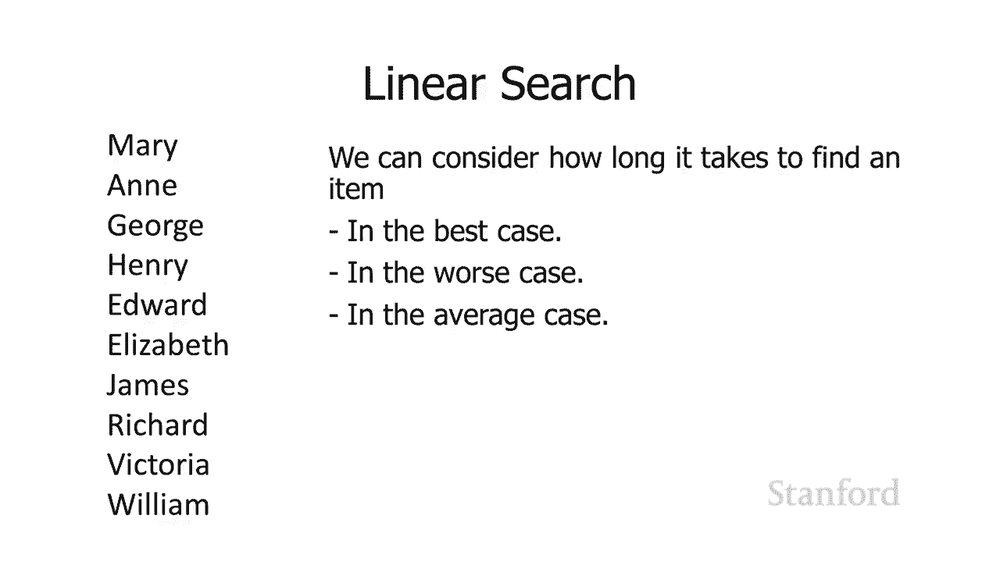

# 【双语字幕+资料下载】斯坦福CS105 ｜ 计算机科学导论(2021最新·完整版) - P68：L27.1- 理论：算法分析 - ShowMeAI - BV1eh411W72E

undefined，欢迎探索计算，欢迎探索计算，今天的视频是，今天的视频是，算法的计算机理论分析，算法的计算机理论分析，因此选择正确的算法可以，因此选择正确的算法可以，在您编程时产生很大的不同。

在您编程时产生很大的不同，实际上它可以使，实际上它可以使，程序在，程序在，合理的时间内运行，合理的时间内运行，和程序之间产生差异 运行，和程序之间产生差异 运行，undefined，undefined。

合理大小的数据集需要很长时间，所以对于小，合理大小的数据集需要很长时间，所以对于小，数据，数据，集，你知道有很多不同的，集，你知道有很多不同的，算法可以工作，但是，算法可以工作，但是，当你开始处理。

当你开始处理，大量呃数据时，undefined，undefined，你正在使用的特定算法是 将，你正在使用的特定算法是 将，在您是否，在您是否，真的能够，真的能够。

在合理的时间内分析数据方面产生巨大的差异，在合理的时间内分析数据方面产生巨大的差异，或者只是需要，或者只是需要，足够长的时间，以至于出于所有实际，足够长的时间，以至于出于所有实际，目的您都无法。

目的您都无法，在本次讲座中做到这一点 将，在本次讲座中做到这一点 将，首先看看如何在集合中查找项目，undefined，undefined，我们将比较一些不同的方法，我们将比较一些不同的方法。

然后在我们完成，然后在我们完成，之后我们将要花，之后我们将要花，一点时间 fa 看看计算机，一点时间 fa 看看计算机，undefined，undefined，科学家如何，科学家如何。

从理论的角度比较，从理论的角度比较，不同的算法，所以这里我有一个，不同的算法，所以这里我有一个，不同，不同，的英国君主列表，以及我可以，undefined，undefined，尝试找出，尝试找出。

特定名称的最简单方法 在列表中正在使用，特定名称的最简单方法 在列表中正在使用，线性搜索中称为线性搜索的东西，线性搜索中称为线性搜索的东西，我们将从，我们将从，第一个项目开始，第一个项目开始。

然后我们将一次一个地遍历每个，然后我们将一次一个地遍历每个，不同的项目，不同的项目，所以嗯假设我们正在寻找 对于 henry 这个名字，所以嗯假设我们正在寻找 对于 henry 这个名字。

undefined，undefined，我们会从 mary 开始说嘿是，我们会从 mary 开始说嘿是，mary henry 不，它不是 uh 然后我们，mary henry 不。

它不是 uh 然后我们，下一次说是 anne，下一次说是 anne，henry 不，这不是我们要找的物品，henry 不，这不是我们要找的物品，undefined，undefined。

是 George henry 这不是物品，是 George henry 这不是物品，我们正在寻找的是 henry henry 哦，是的，我们正在寻找的是 henry henry 哦，是的。

这就是我们正在寻找的项目，这就是我们正在寻找的项目，因此该项目现在在我们的列表中，undefined，undefined，undefined，undefined，与安相比，我们与乔治相比，与安相比。

我们与乔治相比，我们通过，我们通过，列表一直到威廉，我们仍然没有，列表一直到威廉，我们仍然没有，在列表中找到这个名字，因为这个，在列表中找到这个名字，因为这个，名字不在列表中，然后我们，名字不在列表中。

然后我们，意识到我们在列表的末尾，意识到我们在列表的末尾，所以我们得出结论 因为如果我们，所以我们得出结论 因为如果我们，已经遍历了整个列表并且我们还没有，已经遍历了整个列表并且我们还没有。

找到一个特定的项目，找到一个特定的项目，那么这个项目根本不在列表，那么这个项目根本不在列表，中，中，所以这里要考虑的一件事，所以这里要考虑的一件事，是找到一个，是找到一个。

特定的项目需要多长时间 在列表中，特定的项目需要多长时间 在列表中，所以假设我们正在寻找 elizabeth，所以假设我们正在寻找 elizabeth，您可以看到 elizabeth。

您可以看到 elizabeth，位于列表中间的某个位置，位于列表中间的某个位置，假设我们在列表的开头寻找 Mary Mary，假设我们在列表的开头寻找 Mary Mary，因此，因此。

我们可以很快找到她，假设，我们可以很快找到她，假设，我们正在寻找 对于 melanie，我们正在寻找 对于 melanie，melanie 不在列表中，所以我们，melanie 不在列表中，所以我们。

需要遍历整个列表 所以，需要遍历整个列表 所以，基本上我们可以考虑许多，基本上我们可以考虑许多，不同的情况 当我们，不同的情况 当我们，undefined，undefined。

谈论算法的运行速度时 我们可以，谈论算法的运行速度时 我们可以，考虑什么是最好的情况，考虑什么是最好的情况，所以在 线性搜索的情况最好的，所以在 线性搜索的情况最好的，情况，情况。

就是它 第一次出现在列表中时，就是它 第一次出现在列表中时，可以非常快速，可以非常快速，地确定玛丽是否在此列表中，我们，地确定玛丽是否在此列表中，我们，只需查看第一项，它是玛丽，只需查看第一项。

它是玛丽，我们完成，我们完成，了最坏的情况，最坏的，了最坏的情况，最坏的，情况是在此特定算法中，情况是在此特定算法中，该项目不在 列表，该项目不在 列表，这意味着我们需要比较所有。

这意味着我们需要比较所有，不同的项目，然后我们终于，不同的项目，然后我们终于，到了最后，我们，到了最后，我们，就像是的，我们检查了所有不在，就像是的，我们检查了所有不在，此处的内容，此处的内容。

undefined，undefined，我们在谈话时通常会得到平均情况 关于，我们在谈话时通常会得到平均情况 关于，算法分析，我们，算法分析，我们，关心大量项目会发生什么，关心大量项目会发生什么。

正如我之前提到的，正如我之前提到的，如果你有少量项目，如果你有少量项目，你可以有一个经过深思熟虑的，你可以有一个经过深思熟虑的，算法，但仍然，算法，但仍然，可以让它工作，嗯，效率不是很高，可以让它工作。

嗯，效率不是很高，但是 只要数字，但是 只要数字，很小，很小，它仍然可以工作，当您开始，它仍然可以工作，当您开始，获得越来越多的，获得越来越多的，项目时，这确实成为一个问题，项目时，这确实成为一个问题。

所以假设我有一个包含一千个项目的列表，undefined，undefined，平均需要一分钟 找到一个项目，undefined，undefined，undefined。

如果我们将列表大小加倍到 2000 平均需要多长时间才能找到一个项目，undefined，undefined，我的意思是我认为这很清楚，我的意思是我认为这很清楚，呃，呃，如果我们将列表大小从。

如果我们将列表大小从，1000 加倍到 2000，1000 加倍到 2000，我们将加倍时间 平均，undefined，undefined，而言，这将，而言，这将，花费 2 分钟，花费 2 分钟。

而不是平均，undefined，undefined，undefined，undefined，一分钟 一分钟，但事实证明，一分钟 一分钟，但事实证明，我们这里的小，我们这里的小，公式高度依赖于特定的。

公式高度依赖于特定的，计算机，因为，计算机，因为，如果我有一台更快的计算机，我可以，如果我有一台更快的计算机，我可以，平均比，平均比。

一分钟四千项更快地找到一个项目，所以，一分钟四千项更快地找到一个项目，所以，如果我们想要一个更通用的项目 公式，如果我们想要一个更通用的项目 公式，我们，undefined，undefined。

undefined，undefined，undefined，undefined，实际上会这样写 在这个通用，实际上会这样写 在这个通用，公式中，我有，公式中，我有，一些给定的常数，由，一些给定的常数。

由，计算机的速度，计算机的速度，乘以项目的数量决定，因此随着，乘以项目的数量决定，因此随着，项目数量的，项目数量的，增加，它将花费我的时间，增加，它将花费我的时间，也会，也会，以恒定的速度。

以恒定的速度，增加，所以我们可以做一个，增加，所以我们可以做一个，比线性搜索更快的搜索，比线性搜索更快的搜索，是的，如果列表是有序的，我们可以进行，是的，如果列表是有序的，我们可以进行。

所谓的二分搜索二分搜索如何在，所谓的二分搜索二分搜索如何在，二分搜索中工作，二分搜索中工作，我们，我们，要做的是我们将获取列表，要做的是我们将获取列表，然后我们' 将它分成两半。

然后我们' 将它分成两半，我们将，我们将，确定我们要查找的项目是，确定我们要查找的项目是，在列表的上半部分还是在列表的，在列表的上半部分还是在列表的，下半部分，下半部分，这类似于呃，这类似于呃。

这个比喻已经过时了，但我有，这个比喻已经过时了，但我有，之前问过学生，他们，之前问过学生，他们，继续告诉我他们确实理解，继续告诉我他们确实理解，这个类比，所以我会继续使用，这个类比，所以我会继续使用。

它，它，所以这个类比类似于如果，所以这个类比类似于如果，你有一个实体电话簿，你有一个实体电话簿，嗯，你知道你正试图在其中找到，嗯，你知道你正试图在其中找到，一个名字 那个电话簿你拆了。

一个名字 那个电话簿你拆了，电话 把书分成两半，电话 把书分成两半，你说，你说，是电话簿前半部分的名字还是电话簿的，是电话簿前半部分的名字还是电话簿的，后半部分哦，它在电话簿的，后半部分哦。

它在电话簿的，前半部分，好吧，我要把，undefined，undefined，电话簿的那一半分成 一半所以我在，电话簿的那一半分成 一半所以我在，看呃现在看四分之一，看呃现在看四分之一，部分，部分。

是在第一季度还是，是在第一季度还是，在第二季度，在第二季度，哦它在第一季度我，哦它在第一季度我，要把它分成两半然后看看，要把它分成两半然后看看，八分，八分，之一还是八分之一 依此类推。

如果您确实有实体字典，这，之一还是八分之一 依此类推，如果您确实有实体字典，这。

与您在字典中查找单词的方式相同，undefined，undefined，undefined，所以让我们看看这对，所以让我们看看这对，我们，我们，的英格兰君主有何作用我已经重新排序了。

的英格兰君主有何作用我已经重新排序了，列表，因为再次，列表，因为再次，二分搜索需要 项目，二分搜索需要 项目，undefined，undefined，是有序的所以假设我们正在，是有序的所以假设我们正在。

寻找爱德华 我们，寻找爱德华 我们，要做的是我们将把列表分，要做的是我们将把列表分，成两半，成两半，现在事实证明在某些情况下，现在事实证明在某些情况下，我们不能将列表平均分成 一半。

我们不能将列表平均分成 一半，呃，所以在这种情况下，我将把，呃，所以在这种情况下，我将把，列表分成两半，从，列表分成两半，从，亨利我开始 我要把爱德华和亨利进行比较。

亨利我开始 我要把爱德华和亨利进行比较，看看你是否知道我可能，看看你是否知道我可能，把名单分成两半，这就像，把名单分成两半，这就像，我打开电话簿，我打开电话簿，恰好是呃我，恰好是呃我，要找，要找。

的项目实际上就是那个，的项目实际上就是那个，我就在那里分开 把它分成两半，我就在那里分开 把它分成两半，我要找的名字，我要找的名字，正好在那个页面上，正好在那个页面上，所以有可能，所以有可能。

把列表分成两半，把列表分成两半，实际上中间点就是，实际上中间点就是，我们要找的名字，但在这种情况下，我们要找的名字，但在这种情况下，它是 不是，它是 不是，所以我在这里可以做的是，我可以说。

所以我在这里可以做的是，我可以说，是 edward 如果名字，是 edward 如果名字，确实在这个列表，确实在这个列表，中，是在 henry 之前还是在 henry 之后，中。

是在 henry 之前还是在 henry 之后，undefined，undefined，在这种情况下，由于列表是，在这种情况下，由于列表是，按字母顺序排列的，我知道，按字母顺序排列的，我知道。

e 出现在 h 之前，并且 因此，我从亨利开始的，e 出现在 h 之前，并且 因此，我从亨利开始的，所有项目都被扔掉了，所有项目都被扔掉了，我对这些不感兴趣，undefined，undefined。

我知道如果爱德华在名单上，我知道如果爱德华在名单上，它需要，它需要，在名单的前半部分，在名单的前半部分，所以介于安和乔治之间 我继续，所以介于安和乔治之间 我继续，undefined。

undefined，呃扔掉那些项目，然后我，呃扔掉那些项目，然后我，把列表分成 一次，把列表分成 一次，又一次你知道这个列表不会，又一次你知道这个列表不会，平均分配所以你需要有，平均分配所以你需要有。

某种规则，某种规则，呃你知道如果列表，呃你知道如果列表，没有平均分配你会，没有平均分配你会，稍微低一点你会，稍微低一点你会，稍微高一点 所以我要，稍微高一点 所以我要，说得稍微高一点，说。

说得稍微高一点，说，我们要继续看，我们要继续看，elizabeth 是 edward elizabeth 不，elizabeth 是 edward elizabeth 不，undefined。

undefined，如果 edward 在名单上的话，如果 edward 在名单上的话，他会变得高于 elizabeth 或低于，他会变得高于 elizabeth 或低于，elizabeth。

elizabeth，按字母顺序，他们都以，按字母顺序，他们都以，undefined，undefined，ed 开头 来找我，所以这意味着我，ed 开头 来找我，所以这意味着我，会在名单的前半部分。

所以我，会在名单的前半部分，所以我，要继续前进，要继续前进，把伊丽莎白排除在外，把伊丽莎白排除在外，我只会专注于安和爱德华，我只会专注于安和爱德华，当然，当然，呃，爱德华就在那里 所以，呃。

爱德华就在那里 所以，我们完成了，我们完成了，所以呃它看起来很复杂但，所以呃它看起来很复杂但，实际上它会证明，实际上它会证明，这比线性搜索要快得多这，undefined，undefined。

是为什么这看起来，是为什么这看起来，有点复杂而且你可能看不到，有点复杂而且你可能看不到，这里的好处的原因之一是，这里的好处的原因之一是，真正的好处是 o，真正的好处是 o，随着列表大小的增加而出现。

所以，随着列表大小的增加而出现，所以，你知道如果我们有 10 000 个项目，如果我们有 5 个，你知道如果我们有 10 000 个项目，如果我们有 5 个，项目，二分搜索将产生，项目，二分搜索将产生。

巨大的不同，巨大的不同，这看起来有点，这看起来有点，复杂，复杂，你会去 进行所有这些，你会去 进行所有这些，比较，嗯，比较，嗯，你知道这似乎并没有，你知道这似乎并没有，给你带来很大的好处。

如果你有少量的物品，我们，给你带来很大的好处，如果你有少量的物品，我们，实际上稍后会讨论这个问题，undefined，undefined，undefined，undefined，知道你正在使用的算法。

知道你正在使用的算法，有不同的事情需要，有不同的事情需要，考虑，比如启动成本是否，考虑，比如启动成本是否，很高，嗯，所以这些是不同的问题，很高，嗯，所以这些是不同的问题，所以当我们谈论算法分析时。

请记住，所以当我们谈论算法分析时，请记住，我们通常，我们通常，谈论，谈论，会发生什么 当数字变得非常，会发生什么 当数字变得非常，大时 因为当数字变得，大时 因为当数字变得，非常，非常。

大时 我们实际上无法知道您，大时 我们实际上无法知道您，是否选择了错误的算法 我们，是否选择了错误的算法 我们，实际上无法，实际上无法，让程序，让程序，在合理的时间内完成，所以，在合理的时间内完成。

所以，您知道 也许我可以写 安装程序，您知道 也许我可以写 安装程序，并在数据集上运行，并在数据集上运行，三年后它将，三年后它将，运行良好，这，运行良好，这，不是合理的时间该，不是合理的时间该。

程序几乎没用，程序几乎没用，好吧，所以购买您的搜索要，好吧，所以购买您的搜索要，快得多，尤其是当，快得多，尤其是当，项目数量增加时，项目数量增加时，我们需要搜索的次数，我们需要搜索的次数，不会线性增加。

不会线性增加，所以我们看到，通过线性，所以我们看到，通过线性，搜索，如果我们，搜索，如果我们，将线性搜索中的项目数量加倍，那么执行线性，将线性搜索中的项目数量加倍，那么执行线性，搜索所需的时间。

搜索所需的时间，undefined，undefined，就会加倍，就会加倍，如果我们，如果我们，加倍 嗯，你，加倍 嗯，你，知道列表中项目的数量，知道列表中项目的数量，用于线性搜索，用于线性搜索。

它需要花费的时间，它需要花费的时间，是五倍，是五倍，但是二分搜索发生的事情，但是二分搜索发生的事情，是它不会以那个线性速率增加，是它不会以那个线性速率增加，因为，因为，我们继续将列表一分为二 我们。

我们继续将列表一分为二 我们，将列表一分为二 我们将列表一，将列表一分为二 我们将列表一，分为，分为，二 事实证明，呃二分查找，二 事实证明，呃二分查找，实际上增加了日志，实际上增加了日志。

因此您可能还记得日志的工作方式，因此您可能还记得日志的工作方式，是它们 e 基本上是，是它们 e 基本上是，根据幂来确定的，所以如果我有 log 10，根据幂来确定的，所以如果我有 log 10。

那实际上是 1 log of 100 是 2，那实际上是 1 log of 100 是 2，因为 10 的二次幂是 100，因为 10 的二次幂是 100，log of 1000。

log of 1000，是 3 因为 10 的三次幂是，是 3 因为 10 的三次幂是，1000 而，1000 而，log of 10 000 是 4，log of 10 000 是 4。

因为如果我取 10 的四次方，因为如果我取 10 的四次方，它就是 10 000。它就是 10 000。现在在计算机科学中，现在在计算机科学中，特别是对于，特别是对于，计算机科学中的二分搜索，我们通常。

计算机科学中的二分搜索，我们通常，使用 2 的幂，使用 2 的幂，然后二分搜索我们肯定会使用 2 的，然后二分搜索我们肯定会使用 2 的，幂，因为我们反复，幂，因为我们反复，拆分 列出，拆分 列出。

一半一半一半，一半一半一半，所以我已经继续写日志，所以我已经继续写日志，undefined，undefined，了，这里以 2 为基数，呃，了，这里以 2 为基数，呃，我们可以写它是一个日志。

上面有一个，我们可以写它是一个日志，上面有一个，低一点的小下，低一点的小下，标 2，这意味着，标 2，这意味着，我们正在使用，我们正在使用，呃以两个数字为基数而不是以 10 为基数的。

呃以两个数字为基数而不是以 10 为基数的，数字，这有时也被，数字，这有时也被，写成，写成，n of n 但，n of n 但，这里要注意的主要事情是，呃，这里要注意的主要事情是，呃，这要快得多。

这要快得多，好吧，所以我们可以写出，好吧，所以我们可以写出，这样的平均时间需要多长时间的公式，这样的平均时间需要多长时间的公式，find 等于常量 t 乘以，find 等于常量 t 乘以。

项目数的以 2 为底的对数，项目数的以 2 为底的对数，undefined，undefined，如果您实际计算以项目数为基数，如果您实际计算以项目数为基数，的对数与仅计算项目数的对。

的对数与仅计算项目数的对，数，如果您要，数，如果您要，在图表上绘制两个，您会看到以，在图表上绘制两个，您会看到以，2 为基数的对数 好得多，2 为基数的对数 好得多，嗯，再一次，呃，嗯，再一次，呃。

我在那里得到了那个常数，因为，我在那里得到了那个常数，因为，我们担心，我们担心，你知道特定的计算机，你知道特定的计算机，的速度会有所不同，所以，undefined，undefined，如果我想比较这个。

我想知道的是一般情况，如果我想比较这个，我想知道的是一般情况，算法到，算法到，另一种算法，而不管，另一种算法，而不管，我使用的特定计算机以及，我使用的特定计算机以及，该，该，计算机将需要多长时间，嗯。

这就是我们，计算机将需要多长时间，嗯，这就是我们，继续并输入该常量的地方，继续并输入该常量的地方，因此您知道我不知道我是否拥有，因此您知道我不知道我是否拥有，快速计算机或我有 一台慢速计算机。

快速计算机或我有 一台慢速计算机，但我确实知道，但我确实知道，对于呃二分查找，它会根据，undefined，undefined，undefined，undefined，日志增加，undefined。

undefined，undefined，undefined，答案是肯定的，答案是肯定的，当我第一次看到这个的时候 我是一名，当我第一次看到这个的时候 我是一名，大学生，这让我大吃一惊。

undefined，undefined，undefined，undefined，undefined，undefined，一分钟后，一分钟后，对于哈希表，我们要做的，对于哈希表，我们要做的。

是将数据集中的所有，是将数据集中的所有，undefined，undefined，undefined，在一个数组中，并且我们将提供，在一个数组中，并且我们将提供，对数组中任何项目的即时访问。

对数组中任何项目的即时访问，所以，所以，你知道我们必须，你知道我们必须，使用线性，使用线性，搜索，搜索，和二分搜索来遍历每个单独的项目让我们把，和二分搜索来遍历每个单独的项目让我们把。

项目分成两半检查上半部分和，项目分成两半检查上半部分和，下半部，下半部，分将项目分成两半检查下半部分的上，分将项目分成两半检查下半部分的上，半部分，半部分，将项目分开 一半，然后如果，将项目分开 一半。

然后如果，我们有一个很大的列表，我们有一个很大的列表，它将有很多拆分，它将有很多拆分，那么对于哈希表的线性搜索肯定会很多，undefined，undefined，我们将获得，我们将获得，即时访问。

你告诉我什么 你，即时访问，你告诉我什么 你，想要的项目，我会像，想要的项目，我会像，那正是我的地方 tem 是，那正是我的地方 tem 是，我们如何做到这一点 就像魔术一样神奇。

我们如何做到这一点 就像魔术一样神奇，好吧，正如我所提到的，我们，好吧，正如我所提到的，我们，将使用称为散列函数的东西 散列函数，undefined，undefined，将从更复杂的项目中创建一个序数。

将从更复杂的项目中创建一个序数，因此我们的示例是 查看，因此我们的示例是 查看，表格中的单词，但，表格中的单词，但，这种技术可以用于，这种技术可以用于，其他类型的数据，而不仅仅是单词，其他类型的数据。

而不仅仅是单词，好吧，所以我将在这里使用一个简单的哈希，好吧，所以我将在这里使用一个简单的哈希，undefined，undefined，有完整的科学和，有完整的科学和，数学来选择适当的哈希。

数学来选择适当的哈希，我” 我不会进入它，嗯，我” 我不会进入它，嗯，我没有研究过任何这些东西，我没有研究过任何这些东西，因为我是你的年龄，就像字面上的，因为我是你的年龄，就像字面上的，[音乐]。

[音乐]，嗯 35 年前，嗯 35 年前，40 年前已经很长时间了，40 年前已经很长时间了，所以，所以，嗯所以我们要使用，嗯所以我们要使用，每个人都容易理解的简单散列，每个人都容易理解的简单散列。

我们将，我们将，通过将，通过将，单词中字母的所有口头位置添加，单词中字母的所有口头位置添加，到我们的数据，到我们的数据，集中来形成我们的散列，集中来形成我们的散列，好吧假设我们 有单词 cat。

好吧假设我们 有单词 cat，c 是第三个字母 a 是第一个，c 是第三个字母 a 是第一个，let  ter 和 t，let  ter 和 t，是第 20 个字母，所以我将，是第 20 个字母。

所以我将，继续通过将，继续通过将，它们加，它们加，在一起来形成我的哈希 我要说 3 加 1 加，在一起来形成我的哈希 我要说 3 加 1 加，20，20，因为第三个字母加第一个字母。

因为第三个字母加第一个字母，加第 20 个字母，加第 20 个字母，并将这两个加在一起 我，并将这两个加在一起 我，要说我们的散列，要说我们的散列。

函数给了我们 24。函数给了我们 24。现在如果我们真的有超过 24 个插槽，现在如果我们真的有超过 24 个插槽，那么我们很，那么我们很，高兴去嗯但是，高兴去嗯但是。

如果我们没有 24 个插槽呃我们有，如果我们没有 24 个插槽呃我们有，数量有限的，数量有限的，哈希函数可以带有，哈希函数可以带有，比我们拥有的实际位置数量更大的数字的，undefined。

undefined，插槽，这很常见，undefined，undefined，undefined，可以有 26 个，可以有 26 个，字符，所以它会是 26 加 26 加 26，字符。

所以它会是 26 加 26 加 26，但这只有在我们所有的，但这只有在我们所有的，单词都有，单词都有，三个字母时才有效，所以无论如何，三个字母时才有效，所以无论如何，哈希函数，哈希函数。

undefined，undefined，带有比大小大得多的数字是很常见，带有比大小大得多的数字是很常见，的 你，的 你，开始数据的表，开始数据的表，所以我们要做的是我们，所以我们要做的是我们。

要继续 d 执行一个模数，要继续 d 执行一个模数，你可能还记得，模数给了我，你可能还记得，模数给了我，除掉某些东西的整数余数，除掉某些东西的整数余数，undefined，undefined。

所以我要做的是我将，所以我要做的是我将，采用散列函数，采用散列函数，散列函数返回的值，散列函数返回的值，我将对其进行模数，我将对其进行模数，化 我的表中的插槽数，化 我的表中的插槽数。

undefined，undefined，这实际上是我要，这实际上是我要，继续查找项目的地方，继续查找项目的地方，因此在这种特殊情况下，假设，因此在这种特殊情况下，假设，我们将这些项目存储在。

我们将这些项目存储在，具有，具有，10 个插槽的数组中，我们将要做什么，10 个插槽的数组中，我们将要做什么，我要继续拿猫，我要继续拿猫，它给了我 3 加 1 加 20 是 24。

它给了我 3 加 1 加 20 是 24，我需要它适合 0 和 9 之间，我需要它适合 0 和 9 之间，所以我要继续，所以我要继续，拿 24 并做，拿 24 并做，一个模数 10，所以模数。

一个模数 10，所以模数，给了我整数余数所以这，给了我整数余数所以这，基本上是说，基本上是说，取 24 除以 10，取 24 除以 10，undefined，undefined，如果我们在做整数算术。

如果我们在做整数算术，那将给你 2 余数是，那将给你 2 余数是，4，所以模数是 4，4，所以模数是 4。

，所以我会继续 把 cat 放在，所以我会继续 把 cat 放在，我们数组的第四个插槽中，我们数组的第四个插槽中，这样我们就可以做一堆，这样我们就可以做一堆，这些 so dog，这些 so dog。

uh d 是第四个字母 o 是，uh d 是第四个字母 o 是，第十五个字母，g 是第七个，第十五个字母，g 是第七个，字母，字母，所以我继续将它们加，所以我继续将它们加，在一起得到 26。

在一起得到 26。我取模数，得到 6，我取模数，得到 6，所以我会继续，所以我会继续，放置队长槽四和狗槽，放置队长槽四和狗槽，六，六，小费，这些只是三个字母的，小费，这些只是三个字母的，单词。

但您可以使用任何长度的，单词，但您可以使用任何长度的，单词，单词，这可能会使您获得越来越大的，这可能会使您获得越来越大的，数字，数字，但由于我们总是以 10，但由于我们总是以 10，为单位进行调制。

因此它不会 没关系 我们在完成模数之后总是，为单位进行调制，因此它不会 没关系 我们在完成模数之后总是，会得到一个 0 到 9 之间的数字，undefined，undefined，undefined。

undefined，undefined，undefined。

你只有 10。我要继续把，你只有 10。我要继续把，那个插槽 5。现在你可能，那个插槽 5。现在你可能，会，会，想的一件事是，想的一件事是，嘿，嘿，在同一个，在同一个，插槽中绝对不可能最终有两个项目。

如果我是这样的话 有猫，插槽中绝对不可能最终有两个项目，如果我是这样的话 有猫，是 3 加 1 加 20，我有行为，是 3 加 1 加 20，我有行为，是 1 加 3 加 20。

是 1 加 3 加 20。那些都散列 t  o 相同的位置，那些都散列 t  o 相同的位置，所以这被称为碰撞，所以这被称为碰撞，它，它，是可用于处理碰撞的各种不同的技术。

是可用于处理碰撞的各种不同的技术，undefined，undefined，但我们不会，但我们不会，在本课程中讨论它们，呃，如果你有一个精心，在本课程中讨论它们，呃，如果你有一个精心，选择的散列函数。

选择的散列函数，嗯，如果 你有很多插槽，嗯，如果 你有很多插槽，这不是问题，这不是问题，实际上，我没有研究过这个，实际上，我没有研究过这个，但是如果你研究这个，结果证明，但是如果你研究这个，结果证明。

你可以有一个非常小的哈希，你可以有一个非常小的哈希，表并且仍然非常有效，所以，表并且仍然非常有效，所以，你可能会 如果我有，你可能会 如果我有，50 个项目并且我有一个哈希表，这个哈希表。

undefined，undefined，足以存储一千个项目并且，足以存储一千个项目并且，我不会有那么多，我不会有那么多，冲突，这当然是真的，冲突，这当然是真的，但事实证明你没有 实际上需要。

但事实证明你没有 实际上需要，一个那么大的表，一个那么大的表。

以免发生那么多，以免发生那么多，冲突，他们对，冲突，他们对，这个结果有点惊讶，所以，这个结果有点惊讶，所以，我们一直在讨论使用，我们一直在讨论使用，散列将项目放入表中，散列将项目放入表中。

然后当然如果你' 重新，然后当然如果你' 重新，尝试确定一个项目是否在 表而，尝试确定一个项目是否在 表而，不是将一个项目，不是将一个项目，放入表中，你只是做同样的，放入表中，你只是做同样的，事情。

所以假设，事情，所以假设，嗯，我想看看盒子是否，嗯，我想看看盒子是否，在我们的表中，我继续，在我们的表中，我继续，计算哈希，计算哈希，b 是第二个字母 o 是第 15 个。

b 是第二个字母 o 是第 15 个，字母 x 是第 24 个字母，我将，字母 x 是第 24 个字母，我将，它们全部，它们全部，加起来得到 41。41 减 10 是 1，加起来得到 41。

41 减 10 是 1，然后我检查该项目是否在这个，然后我检查该项目是否在这个，给定的位置，所以我说嘿，给定的位置，所以我说嘿，让我们继续检查我们，让我们继续检查我们，表中的第一个项目。

表中的第一个项目，是那个盒子 你知道，如果那里，是那个盒子 你知道，如果那里，什么都没有，什么都没有，嗯，那么我知道那个盒子，嗯，那么我知道那个盒子，不在桌子上，如果，不在桌子上，如果，插槽一，插槽一。

井里还有其他东西，那就是我们，井里还有其他东西，那就是我们，一分钟前刚刚谈到的碰撞问题，一分钟前刚刚谈到的碰撞问题，这肯定有一些，这肯定有一些，相当合理的解决方案，但是呃，相当合理的解决方案，但是呃。

它们有点复杂，所以我们，它们有点复杂，所以我们，不会在本讲座中描述它们，不会在本讲座中描述它们，只是要注意，只是要注意，是的散列函数可能会导致，是的散列函数可能会导致，冲突，其中两个东西散列，冲突。

其中两个东西散列，相同的位置，相同的位置，这是完全的事情，如果你，这是完全的事情，如果你，看看这个，看看这个，嘿不是 有什么我似乎，嘿不是 有什么我似乎，回想一个关于，回想一个关于。

狗和上帝的笑话呃不会创建，狗和上帝的笑话呃不会创建。

一个散列剪辑你知道它有相同的散列值，一个散列剪辑你知道它有相同的散列值，是的它会，是的它会，并且有办法处理它好的，并且有办法处理它好的，嗯那么散列表与，嗯那么散列表与，线性搜索和二分搜索散。

线性搜索和二分搜索散，列表相比如何 好多，列表相比如何 好多，了，就像我说的，这就像魔术一样，这，了，就像我说的，这就像魔术一样，这，东西太神奇了，东西太神奇了，所以对于哈希表，无论我的表是否。

所以对于哈希表，无论我的表是否，包含 20 个项目，包含 20 个项目，200 个项目 200 000 个项目它仍然，200 个项目 200 000 个项目它仍然，需要完全相同的时间来。

需要完全相同的时间来，确定表中的项目，确定表中的项目，我只是继续看，我只是继续看，我正在尝试查找的项目我计算了，我正在尝试查找的项目我计算了，哈希函数，哈希函数，该函数不会根据，该函数不会根据。

表中项目的数量而改变，表中项目的数量而改变，正确的计算，正确的计算，函数 你知道如果，函数 你知道如果，这个词有点长，它会花费更长的时间，这个词有点长，它会花费更长的时间，但就 我有，但就 我有。

多少数据项 我正在处理多少数据项并不重要，undefined，undefined，我可能有 100 万个数据项，我可能有 100 万个数据项，它仍然需要相同，它仍然需要相同，的时间来，的时间来。

确定单个项目的散列，确定单个项目的散列，然后我 只有，然后我 只有，你知道 现在，一旦您拥有，你知道 现在，一旦您拥有，您喜欢的哈希值，就非常容易转到，您喜欢的哈希值，就非常容易转到，数组中的特定项目。

这，数组中的特定项目，这，几乎是即时的，所以，几乎是即时的，所以，这非常有效，嗯，我，这非常有效，嗯，我，又一次，我觉得这太神奇了，又一次，我觉得这太神奇了，当我看到这个时，我感到很惊讶。

当我看到这个时，我感到很惊讶，是一名大学生，是一名大学生，你知道这可能对我说了很多，undefined，undefined，但我认为这真的很酷。

undefined，undefined，undefined，undefined，哈希表就在这里，哈希表就在这里，找到的时间只是一个常数，找到的时间只是一个常数，确切的常数，确切的常数，再次变化取决于。

再次变化取决于。

我们的计算机有多快或多慢，我们的计算机有多快或多慢，所以在计算机科学中我们对，所以在计算机科学中我们对，不同的算法进行分类并使用，不同的算法进行分类并使用，所谓的 o 表示法，所谓的 o 表示法。

所以我们使用 o 表示法 说线性，所以我们使用 o 表示法 说线性，搜索是 n，这本质上，搜索是 n，这本质上，意味着执行线性搜索所需的时间，undefined，undefined，直接随 n 增加。

其中 n 是，直接随 n 增加，其中 n 是，列表，列表，二分搜索中的项目数是 log n，这，二分搜索中的项目数是 log n，这，意味着 amou  nt 执行，意味着 amou  nt 执行。

二分查找的时间随着 n 的对数而增加，undefined，undefined，哈希表为 1，这意味着，哈希表为 1，这意味着。

确定一个，确定一个，项目是否在哈希表中的时间是恒定的，项目是否在哈希表中的时间是恒定的，并且不会随着 n 的变化而变化，并且不会随着 n 的变化而变化，让我们来看看，undefined。

undefined，undefined，如果存在常数 c 和 k 使得，undefined，undefined，零小于或等于 n 的 f，零小于或等于 n 的 f，小于或等于 n 的 g 的 c。

则 x 的 n 的 f 的 uh 的正式定义是 x 的 g，小于或等于 n 的 g 的 c，则 x 的 n 的 f 的 uh 的正式定义是 x 的 g，的 o，其中 n 是 大于 k，的 o。

其中 n 是 大于 k，所以这里 x 的 f，所以这里 x 的 f，是我们算法，是我们算法，的实际性能，例如，undefined，undefined，执行二分搜索实际需要多少时间，因此。

执行二分搜索实际需要多少时间，因此，在二分搜索的情况下 x 的 g，在二分搜索的情况下 x 的 g，将是，将是，log n 所以我会说，log n 所以我会说，二分搜索的性能，二分搜索的性能。

是 log n 的 o 因为，undefined，undefined，二分搜索的实际性能是 fx，二分搜索的实际性能是 fx，小于或等于 n 倍的 log n 的，小于或等于 n 倍的 log n 的。

一些，一些，常数大于或，常数大于或，等于 k 让我们来看看 这个，等于 k 让我们来看看 这个，c 和 k 业务在这里看看那里，c 和 k 业务在这里看看那里，undefined，undefined。

好所以 0 小于或 等于 f of，好所以 0 小于或 等于 f of，undefined，undefined，n 小于或等于 c of g of n，n 小于或等于 c of g of n。

这告诉我们，这告诉我们，我们在这里看到的，我们在这里看到的，是上限，所以 n 的 f 是实际，是上限，所以 n 的 f 是实际，性能，n 的 g，性能，n 的 g，是我们的性能 比较它。

是我们的性能 比较它，所以我们知道 n 中的 f 小于或等于 n 中，所以我们知道 n 中的 f 小于或等于 n 中，的 g，的 g，中的 c，所以如果我们无法，中的 c，所以如果我们无法。

找到确切的性能，但我们可以，找到确切的性能，但我们可以，说，嘿，说，嘿，我知道这比其他的效果更好，我知道这比其他的效果更好，算法我知道，算法我知道。

这比 n 平方好，或者我知道，这比 n 平方好，或者我知道，这比 n，这比 n，立方好，这对于 o 符号来说已经足够好了，立方好，这对于 o 符号来说已经足够好了，那 c 因子呢，为什么它。

那 c 因子呢，为什么它，是 n 的 g 而不是 n 的 g，是 n 的 g 而不是 n 的 g，所以那里的乘数是 c，所以那里的乘数是 c，乘数，乘数，告诉我们，告诉我们，处理单个项目所需的时间。

处理单个项目所需的时间，并不重要，所以，并不重要，所以，你知道可能需要 30 秒，你知道可能需要 30 秒，进行一次二分搜索，undefined，undefined，迭代。

而每次迭代线性搜索需要 1 秒，迭代，而每次迭代线性搜索需要 1 秒，所以，所以，结果是 意味着对于，结果是 意味着对于，少量的 n，线性搜索，少量的 n，线性搜索，会更快，但 对于，会更快，但 对于。

大量的 n，二分搜索，大量的 n，二分搜索。

最终会快得多，最终会快得多，让我们看看它是如何工作的，让我们看看它是如何工作的，所以，所以，再次假设，再次假设，二分搜索迭代 30 秒进行，二分搜索迭代 30 秒进行，线性搜索迭代一秒。

线性搜索迭代一秒，结果证明，如果我们有 1025 个项目，结果证明，如果我们有 1025 个项目，我们将日志记录到 1025 的基数 2，我们将日志记录到 1025 的基数 2。

我得到 10 大约 10。所以这，我得到 10 大约 10。所以这，意味着如果我，意味着如果我，平均有大约 1025 个项目，undefined，undefined，如果需要，如果需要，30 秒。

我将需要进行 10 次二分搜索迭代 我们的，30 秒，我将需要进行 10 次二分搜索迭代 我们的，二分搜索的每次迭代需要 300，二分搜索的每次迭代需要 300，秒，秒，来处理所有 1025 个项目。

或者，来处理所有 1025 个项目，或者，如果我需要去 2025 个，如果我需要去 2025 个，项目，项目，进行搜索，我说你知道线性，进行搜索，我说你知道线性，搜索，搜索，每次迭代只需要一秒钟，但是。

每次迭代只需要一秒钟，但是。

如果 我有 1025 个项目，我将，如果 我有 1025 个项目，我将，平均需要进行 500 次比较，平均需要进行 500 次比较，这将花费，这将花费，500 秒，所以我们在这里看到，500 秒。

所以我们在这里看到，的小n 肯定是每次迭代 30 秒，的小n 肯定是每次迭代 30 秒，对二分搜索，对二分搜索，将产生很大的影响，将产生很大的影响，如果我有五个不同 列表中的项目，如果我只需要进行单次。

如果我有五个不同 列表中的项目，如果我只需要进行单次，迭代，则二进制搜索的迭代需要 30 秒，undefined，undefined，undefined，我已经遇到了麻烦，但是随着 n。

我已经遇到了麻烦，但是随着 n，越来越大，越来越大，单次迭代需要更多时间的事实是，undefined，undefined，比我需要做的迭代总数重要得多，比我需要做的迭代总数重要得多，这就是 c。

这就是 c，因素，他们说我，因素，他们说我，不在乎，undefined，undefined，每次迭代的时间量是否存在恒定差异，我，每次迭代的时间量是否存在恒定差异，我。

undefined，undefined，好吧 那，好吧 那，呃 n 大于等于 k 那么这里，呃 n 大于等于 k 那么这里，谈论的是启动时间，谈论的是启动时间，所以对于，所以对于，少量项目，少量项目。

初始启动时间可能会，初始启动时间可能会，淹没实际时间以进行处理，淹没实际时间以进行处理，每个单独的项目所以，每个单独的项目所以，假设我们的二分搜索开始需要一分钟，undefined，undefined。

而线性搜索会，而线性搜索会，自动开始也许，自动开始也许，我需要为二分搜索做一些设置，我需要为二分搜索做一些设置，我需要设置一些da  ta 结构，我需要设置一些da  ta 结构。

以便对少量 n 进行二分搜索，以便对少量 n 进行二分搜索，这可能意味着二分搜索，这可能意味着二分搜索，不是正确的方法，但是随着我的，不是正确的方法，但是随着我的，数字越来越大，您，数字越来越大，您。

知道我是否正在处理一千个，知道我是否正在处理一千个，项目，那一分钟，项目，那一分钟，如果我正在处理 10 000 个项目，启动时间会有所不同，因为在某个时刻处理 10 万个项目，启动时间会有所不同。

undefined，undefined，undefined，undefined，更好，更好，的算法 具有更好 o 符号的算法将，undefined，undefined，胜过算法 有更，胜过算法 有更。

短的设置时间，但最终，undefined，undefined，需要执行更多的呃处理迭代，需要执行更多的呃处理迭代，所以这是 o 符号背后的基本思想，所以这是 o 符号背后的基本思想。

所以我们首先要说的是，所以我们首先要说的是，这，这，是一个，是一个，上层，上层，以我们的算法的性能，以我们的算法的性能，实际上可能比规定的 o，实际上可能比规定的 o，表示法更好的表现结束。

表示法更好的表现结束，呃我们稍后会讨论这个，呃我们稍后会讨论这个，还有一些其他相关的，还有一些其他相关的，表示法，表示法，加强了这一点，我是说 t，加强了这一点，我是说 t。

一个特定的迭代需要多长时间并不重要，undefined，undefined，我是说有多少启动时间并不重要，undefined，undefined，最终对于大量，最终对于大量，undefined。

undefined，项目，o 表示法将变成，项目，o 表示法将变成，o 表示法的类型 将，o 表示法的类型 将，压倒，压倒，这些其他因素，无论，这些其他因素，无论，启动时间如何，无论，启动时间如何。

无论，每次迭代中的 uh 时间如何，最终，每次迭代中的 uh 时间如何，最终，最大的赢家将是，最大的赢家将是，迭代次数，迭代次数。

，这就是 o 符号所衡量的，这就是 o 符号所衡量的，所以这里有一些常见的，所以这里有一些常见的，身份验证。 他们的，身份验证。 他们的，名字，名字，是一个是我们所说的常量，是一个是我们所说的常量。

所以没有像我们所说的，所以没有像我们所说的，哈希表无关紧要多少次，哈希表无关紧要多少次，呃你知道，呃你知道，我正在处理多少项目并不重要，我正在处理多少项目并不重要，呃它总是会采取 相同。

undefined，undefined，的登录时间是对数的，的登录时间是对数的，我们通过二分搜索看到了，我们通过二分搜索看到了，对数非常棒 呃，对数非常棒 呃，没有符号如果你有一个。

没有符号如果你有一个，适用于登录 o 的算法，这是一个很好，适用于登录 o 的算法，这是一个很好，undefined，undefined，的 n 的算法，那就是 l  inear uh of。

的 n 的算法，那就是 l  inear uh of，and log n um，and log n um，没关系，这将取决于，没关系，这将取决于，我们使用的特定算法，所以，我们使用的特定算法，所以。

如果我们正在执行 n log n 的排序算法，undefined，undefined，n 平方非常好，n 平方很糟糕，n 平方非常好，n 平方很糟糕，2 到 n 是指数级的，2 到 n 是指数级的。

这很像你可能，这很像你可能，会放弃它，会放弃它，无法在任何，无法在任何。

合理的时间内完成任何，合理的时间内完成任何，合理数量的项目，合理数量的项目，所以让我们来看看一些，所以让我们来看看一些，相关的符号，相关的符号，好吧 所以我们正在使用 o 符号，或者我们。

好吧 所以我们正在使用 o 符号，或者我们，一直在谈论 oh 符号，这，一直在谈论 oh 符号，这，实际上是谈论这些算法的最常见方式，undefined，undefined。

正如我们所看到的 oh 符号表示我们的，正如我们所看到的 oh 符号表示我们的，算法等于或优于，算法等于或优于，给定的符号，所以如果我 说它是 n 平方的 o，给定的符号。

所以如果我 说它是 n 平方的 o，这意味着，这意味着，它不比 n 平方差，它不比 n 平方差，实际上可能比 n 平方好一点，实际上可能比 n 平方好一点，undefined，undefined。

还有很大的欧米茄符号，还有很大的欧米茄符号，这意味着我们的算法等于，这意味着我们的算法等于，或比给定的公式差，或比给定的公式差，所以你知道我是否 说  有些东西是大。

所以你知道我是否 说  有些东西是大，omega n，omega n，平方，这意味着我们知道我们并不，平方，这意味着我们知道我们并不，比 n 平方好，但，比 n 平方好，但，实际上我们可能更糟，然后。

实际上我们可能更糟，然后，有大 theta 符号，这意味着，有大 theta 符号，这意味着，我们的算法完全等于给，我们的算法完全等于给，定的形式为什么我们有这些，定的形式为什么我们有这些。

这是因为当我们 ' 试图，这是因为当我们 ' 试图，分析一个特定的算法 并不，分析一个特定的算法 并不，总是，总是，很明显，很明显，大 theta 表示法是什么 但你知道我们。

大 theta 表示法是什么 但你知道我们。

经常可以找到上限或，undefined，undefined，下限 当我们谈论 o 符号时，下限 当我们谈论 o 符号时，通常我们谈论的是，通常我们谈论的是，时间 但我们也可以谈论。

时间 但我们也可以谈论，空间，空间，所以通常我会说随着项目数量的，所以通常我会说随着项目数量的，增加，增加，这将需要多少时间来，这将需要多少时间来，处理，但我实际上可能会说，处理，但我实际上可能会说。

随着项目数量的增加，一些，随着项目数量的增加，一些，算法还需要一些额外的，算法还需要一些额外的，空间 到实际，空间 到实际，用于存储这些项目的空间，用于存储这些项目的空间，那么空间复杂度如何。

那么空间复杂度如何，增加，事实上，我们会发现，增加，事实上，我们会发现，经常存在时间空间权衡，经常存在时间空间权衡，我可以快速处理某些事情，但 它，我可以快速处理某些事情，但 它，需要大量空间。

或者我可以，需要大量空间，或者我可以，在少量空间中处理某些内容，在少量空间中处理某些内容，但会花费更多，但会花费更多，时间，时间，合并排序，合并排序，是时间和空间复杂性，是时间和空间复杂性。

发生变化的一个例子，因此合并排序实际上有，发生变化的一个例子，因此合并排序实际上有，很好的，很好的，时间 对列表中的所有项目进行排序的复杂性，时间 对列表中的所有项目进行排序的复杂性，但实际上。

但实际上，与大多数排序算法形成对比，在大多数排序，与大多数排序算法形成对比，在大多数排序，算法中，我们可以继续，undefined，undefined，在其原始位置对项目进行排序，因此事实。

在其原始位置对项目进行排序，因此事实，证明合并，证明合并，排序将需要一些额外的，排序将需要一些额外的，空间 为了对单个项目进行排序，空间 为了对单个项目进行排序，因此在考虑是否，因此在考虑是否。

使用合并存储时，您需要，使用合并存储时，您需要，考虑它将花费的时间，考虑它将花费的时间，以及它，以及它。

需要一些额外空间的事实，需要一些额外空间的事实，我们还应该关注，我们还应该关注，平均情况，平均情况，与一般最坏情况下的性能，与一般最坏情况下的性能，相比，最重要的事情，相比，最重要的事情，是平均情况。

是平均情况，但是如果您开始担心，但是如果您开始担心，最坏情况下的性能是什么，这，最坏情况下的性能是什么，这，对您都知道很有用 如果您想，对您都知道很有用 如果您想，绝对确保，绝对确保，此性能不会开始。

此性能不会开始，下降，那么，下降，那么，在最坏情况下，在最坏情况下，这将如何执行，结果还表明，分析，这将如何执行，结果还表明，分析，最坏情况性能可能会，最坏情况性能可能会，undefined。

undefined，导致算法中的一些调整，以避免，导致算法中的一些调整，以避免，遇到 最坏的情况，遇到 最坏的情况，所以可能最好的例子，所以可能最好的例子，undefined，undefined。

之一是快速排序所以快速启动，之一是快速排序所以快速启动，平均来说是最好的排序，平均来说是最好的排序，算法，算法，之一，平均来说，它只是让我们，之一，平均来说，它只是让我们，获得 m log n 的性能。

获得 m log n 的性能，但是如果列表已经排序，它，但是如果列表已经排序，它，实际上会变成 发现，实际上会变成 发现，undefined，undefined。

quickstart 的性能实际上要差得多，它，quickstart 的性能实际上要差得多，它，为我们提供了 n 平方性能，为我们提供了 n 平方性能，因此人们玩不同的游戏，因此人们玩不同的游戏，以。

以，确保 quickstart 使用的列表，确保 quickstart 使用的列表，实际上尚未排序，并且，实际上尚未排序，并且，已排序，他们进行了一些调整，已排序，他们进行了一些调整。

稍微整理一下列表以使其不再，稍微整理一下列表以使其不再，完全排序，完全排序，并且可以将快速启动恢复到，并且可以将快速启动恢复到，undefined，undefined，具有关闭和登录性能的状态。

具有关闭和登录性能的状态，就是这样 f 或者我们接下来对算法的分析，就是这样 f 或者我们接下来对算法的分析，undefined，undefined。

我们将，我们将，看看所谓的不可判定问题。

