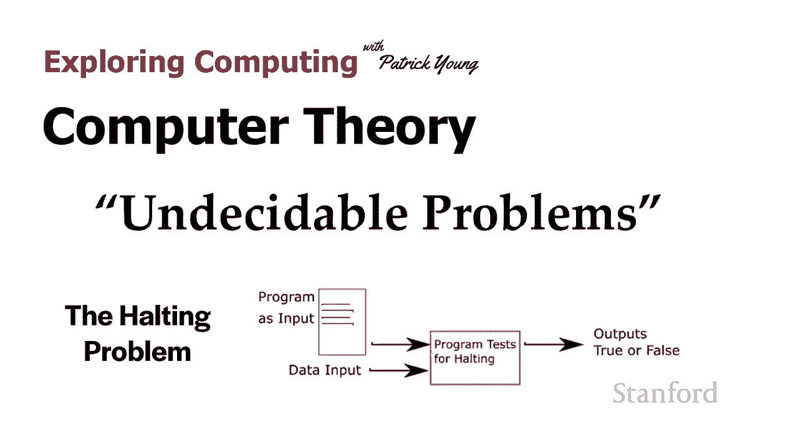
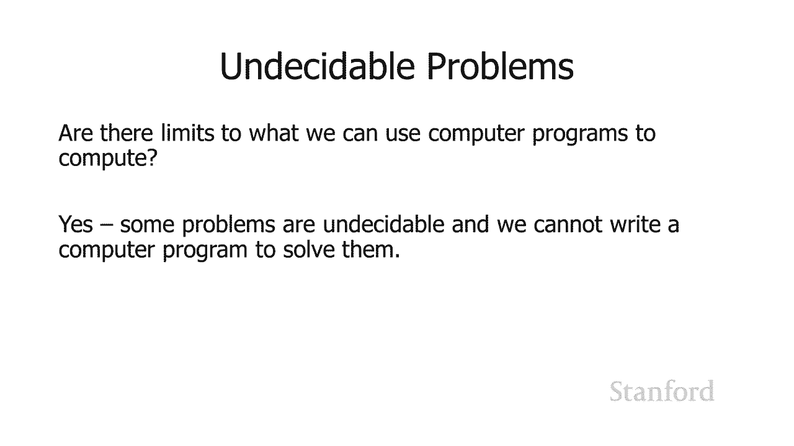
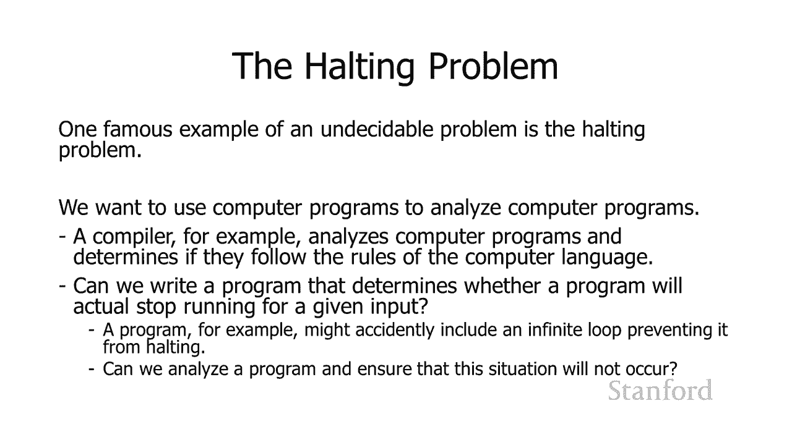
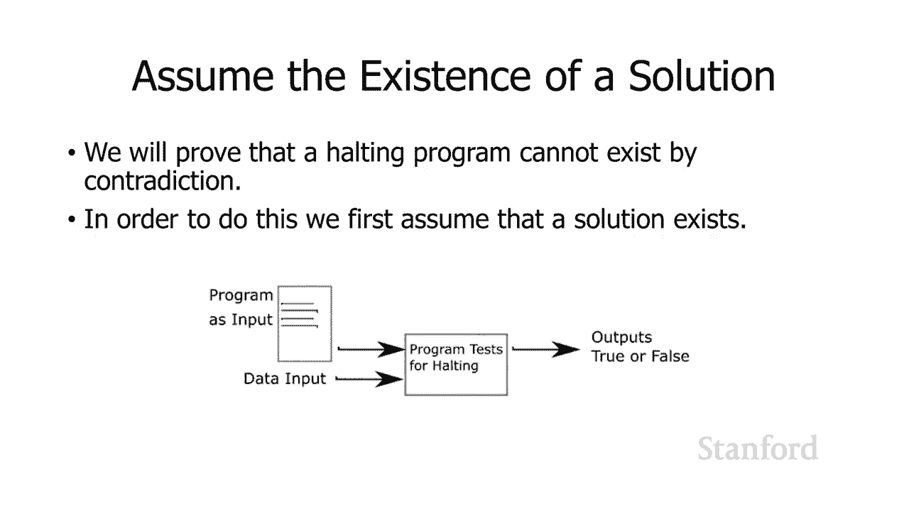
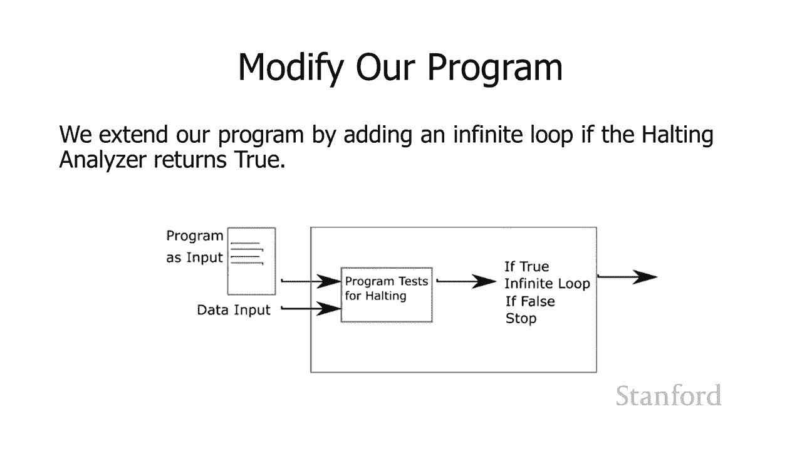
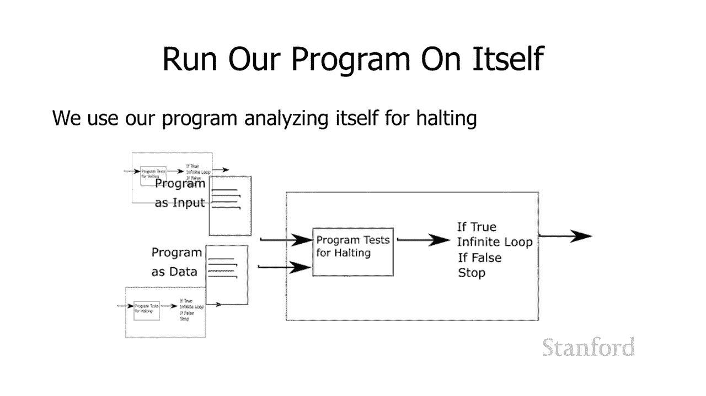
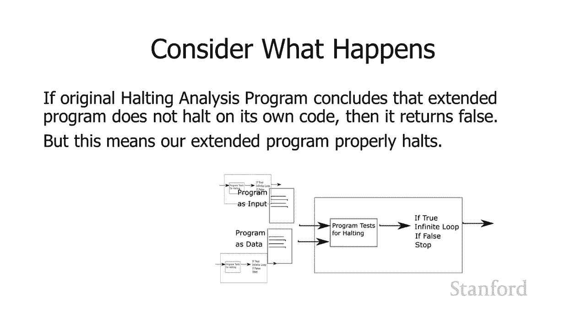
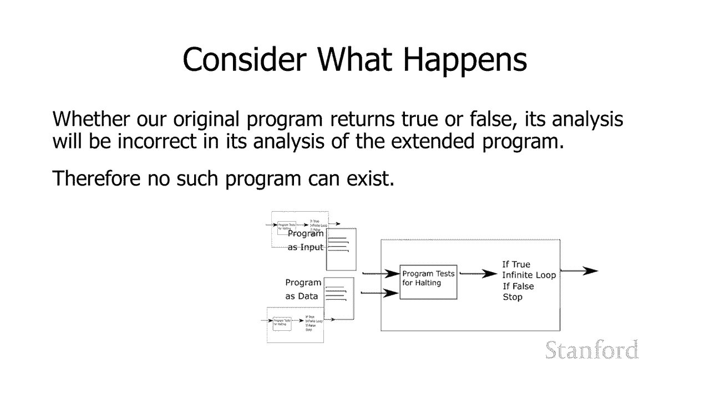

# 【双语字幕+资料下载】斯坦福CS105 ｜ 计算机科学导论(2021最新·完整版) - P69：L27.2- 理论：不可判定的问题 - ShowMeAI - BV1eh411W72E

undefined，欢迎来到今天探索计算，欢迎来到今天探索计算。

的视频是计算机理论，的视频是计算机理论，不可判定的问题，不可判定的问题，所以我们可能会问自己一个问题，所以我们可能会问自己一个问题，是，是，我们可以实际使用计算机，我们可以实际使用计算机。

程序进行计算是否有限制，答案是肯定的，程序进行计算是否有限制，答案是肯定的，有些问题是不可判定的，我们，有些问题是不可判定的，我们。

不能，不能，编写一个计算机程序 可以解决，编写一个计算机程序 可以解决，这些问题，这些问题，不可判定，不可判定，问题的一个著名例子是停机问题，问题的一个著名例子是停机问题。

现在我们在开发计算机程序时经常使用的一件事是，undefined，undefined，我们使用计算机程序来帮助我们，我们使用计算机程序来帮助我们，编写计算机程序 所以，编写计算机程序 所以。

你有点像如果你使用 一个，你有点像如果你使用 一个，带有语法高亮显示的编辑器，带有语法高亮显示的编辑器，我们正在做的是我们正在使用，我们正在做的是我们正在使用，你正在编写的计算机程序。

你正在编写的计算机程序，我们正在使用第二个计算机，我们正在使用第二个计算机，程序来分析该程序，程序来分析该程序，并，并，弄清楚如何在它上面进行语法高亮显示，undefined，undefined。

类似地，编译器分析计算机，类似地，编译器分析计算机，程序，它确定它们遵循，undefined，undefined，该计算机编程语言的规则，所以，该计算机编程语言的规则，所以，一个问题，一个问题。

是你知道我 如果，是你知道我 如果，我们可以编写一个程序来确定程序，我们可以编写一个程序来确定程序，是否会，是否会，undefined，undefined，针对给定的输入实际停止运行。

undefined，undefined，undefined，undefined，那将非常有用 遇到，那将非常有用 遇到，我不小心遇到无限循环的情况，我不小心遇到无限循环的情况，我可以分析程序并确定。

我可以分析程序并确定。

这种情况永远不会发生，这种情况永远不会发生，这就是停机问题，这就是停机问题，所以我们将证明您，所以我们将证明您，实际上无法编写一个，实际上无法编写一个，能够 确定程序是否，能够 确定程序是否。

因给定的输入，因给定的输入，而停止，我们将证明这不，undefined，undefined，存在矛盾所以这些，存在矛盾所以这些，矛盾证明的工作方式是，矛盾证明的工作方式是，我们将假设这个问题的解决方案。

undefined，undefined，确实存在，然后 在某些，确实存在，然后 在某些，时候，我们将看到存在，时候，我们将看到存在，矛盾，矛盾，并且我们认为该，并且我们认为该，程序存在的原始前提。

程序存在的原始前提，实际上肯定是错误的，所以好吧，这里是，实际上肯定是错误的，所以好吧，这里是，我们的小程序，我们的小程序，确实有效，或者我们是 c 让它，确实有效，或者我们是 c 让它，有效。

我们声称它可能存在，有效，我们声称它可能存在，因此您可以看到我们的程序需要，因此您可以看到我们的程序需要，几个输入，其中一个输入是，几个输入，其中一个输入是，我们要分析的程序，我们要分析的程序。

第二个输入是我，第二个输入是我，要，要，在该程序上运行的数据，我们 正在分析，在该程序上运行的数据，我们 正在分析，所以我，所以我，告诉程序正在停止的程序，告诉程序正在停止的程序，嘿。

这是一个我想让你分析的程序，嘿，这是一个我想让你分析的程序，这里有一些，这里有一些，我想提供给该程序的数据，我想提供给该程序的数据，你能看看这个并告诉我，你能看看这个并告诉我，这个程序是否真的要。

这个程序是否真的要，停止 对于这个输入，停止 对于这个输入，所以这应该输出真或假，所以这应该输出真或假。

所以我要声明这个程序，所以我要声明这个程序，确实存在，确实存在，现在我们要做的是，现在我们要做的是，修改这个程序，修改这个程序，你知道添加一些额外的东西，你知道添加一些额外的东西，代码在这里。

所以我要说，代码在这里，所以我要说，如果测试暂停的原始程序，如果测试暂停的原始程序，返回，返回，真，我将把程序发送到，真，我将把程序发送到，一个无限循环中，所以我的意思是这很容易，一个无限循环中。

所以我的意思是这很容易，你知道它就像真正的去，你知道它就像真正的去，什么都不做，这是一个 无限循环，什么都不做，这是一个 无限循环，就在那里，所以，就在那里，所以，你 h 如果测试停止的原始程序。

你 h 如果测试停止的原始程序，返回 true 则进入，返回 true 则进入，无限循环，无限循环，否则如果该程序，否则如果该程序，确定，确定，输入是否将为给定的，输入是否将为给定的。

数据输入停止，那么我将继续，数据输入停止，那么我将继续，并停止，并停止，我们运行时会发生什么，我们运行时会发生什么，程序本身，程序本身，所以我将继续使用我的，所以我将继续使用我的，扩展，扩展。

停止程序和额外的无限，停止程序和额外的无限，循环测试，循环测试，undefined，undefined，输入，这就是我们想要分析的程序，输入，这就是我们想要分析的程序，然后我会，然后我会。

说我要问 该程序进行，说我要问 该程序进行，分析，然后，分析，然后，作为数据，我希望该程序进行，作为数据，我希望该程序进行，分析，我也将使用完全相同的，分析，我也将使用完全相同的，程序，我要说的，程序。

我要说的，是，我将分析这个，是，我将分析这个，停止程序，并将无限循环，停止程序，并将无限循环，添加，添加，为数据 然后我们将，为数据 然后我们将，继续进行这个分析，所以，继续进行这个分析，所以。

让我们看看这里会发生什么，如果，让我们看看这里会发生什么，如果，原始，原始，分析程序得出结论，分析程序得出结论，扩展停止程序在其自己的代码上停止，undefined，undefined，那么原始程序将。

那么原始程序将，返回真，因为它说 oh 这，返回真，因为它说 oh 这，实际上会停止，实际上会停止，但后来我们添加了额外的代码，但后来我们添加了额外的代码，将它扔进无限循环，将它扔进无限循环。

所以这是一个问题，因为，所以这是一个问题，因为，我们刚刚说它应该，我们刚刚说它应该，停止，停止，但实际上它正在进入一个无限，但实际上它正在进入一个无限，循环，循环，如果呃，如果呃，停止程序的原始分析。

停止程序的原始分析，程序得出结论，扩展，程序得出结论，扩展，程序不会在其自己的代码上停止，程序不会在其自己的代码上停止，然后内部原始测试程序，然后内部原始测试程序，返回，返回。

false 并且我们添加的这个额外代码说明，false 并且我们添加的这个额外代码说明，是否返回 true 如果我们循环，是否返回 true 如果我们循环，否则，否则，如果它不返回 true 停止。

所以，如果它不返回 true 停止，所以，实际上程序，实际上程序。

停止了，但我们的分析得出的，停止了，但我们的分析得出的，结论是，结论是，事实上程序并没有停止它进入，事实上程序并没有停止它进入，无限循环，所以，无限循环，所以，你可以看到我们在这里有一个矛盾。

你可以看到我们在这里有一个矛盾，要么，要么，我们错了，因为它进入无限，我们错了，因为它进入无限，循环要么，循环要么，我们错了，因为它以任何一种方式，我们错了，因为它以任何一种方式，停止我们的停止程序。

停止我们的停止程序，分析原始保持程序，分析原始保持程序，分析不起作用，分析不起作用，因此我们可以看到我们，因此我们可以看到我们，实际上无法编写停止程序，实际上无法编写停止程序，所以这只是呃概率 可能。

所以这只是呃概率 可能，是不可判定程序最著名的例子，是不可判定程序最著名的例子，但，但，我想介绍这个的主要原因只是为了让，我想介绍这个的主要原因只是为了让，你知道有点强调我很遗憾。

你知道有点强调我很遗憾，地报告，地报告，说计算机不能做所有事情，说计算机不能做所有事情，这实际上似乎是，这实际上似乎是，结束我们的好地方 讲座，结束我们的好地方 讲座，所以我希望你们都喜欢这堂课。

所以我希望你们都喜欢这堂课。

，你们都学到了很多，祝，你们都学到了很多，祝。

undefined。