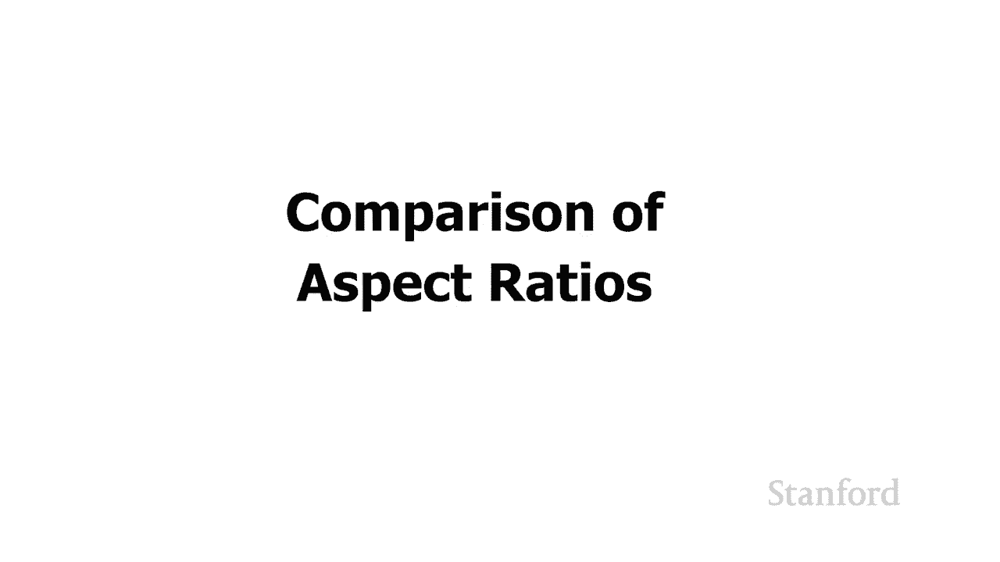

# 【双语字幕+资料下载】斯坦福CS105 ｜ 计算机科学导论(2021最新·完整版) - P6：L2.1- 数字图像：基础 - ShowMeAI - BV1eh411W72E

undefined，欢迎探索计算，欢迎探索计算。

今天的视频是数字图像 第一，今天的视频是数字图像 第一，部分 本视频中的基础知识 我们，部分 本视频中的基础知识 我们，将，将，了解计算机显示器的工作原理 我们，了解计算机显示器的工作原理 我们。

还将了解，还将了解，计算机显示器，计算机显示器，和电视的一些不同方面 所以这些可能，和电视的一些不同方面 所以这些可能，如果您要，如果您要，购买新电脑或新，购买新电脑或新，undefined。

undefined，电视，下一个视频将非常，电视，下一个视频将非常，仔细地研究颜色是如何生成，仔细地研究颜色是如何生成，的，即使，的，即使，我的一些示例，我的一些示例，将使用彩色图像，我们将。

将使用彩色图像，我们将。

推迟，推迟，在下一个视频之前讨论颜色的实际工作原理，在下一个视频之前讨论颜色的实际工作原理，让我们先看看，让我们先看看，典型的计算机屏幕，典型的计算机屏幕，如果我们看一下计算机屏幕。

如果我们看一下计算机屏幕，我们会拿到一个放大镜，以便，undefined，undefined，非常仔细地观察屏幕上的内容。 我会，非常仔细地观察屏幕上的内容。 我会，发现屏幕实际上是，发现屏幕实际上是。

undefined，undefined，由一个巨大的网格组成的，在我们的，由一个巨大的网格组成的，在我们的，黑白情况下，黑白情况下，每个网格元素都可以，每个网格元素都可以，打开或关闭，打开或关闭。

通过打开或关闭单个像素，通过打开或关闭单个像素，undefined，undefined，我们实际上可以生成一个标准 特定的，我们实际上可以生成一个标准 特定的，图像，所以在这种情况下，图像。

所以在这种情况下，我在左上角打开了许多像素，undefined，undefined，您可以看到这是形成，您可以看到这是形成，字母，字母，h，这些单独的网格元素中的每一个，h。

这些单独的网格元素中的每一个，都是我们所说的图片元素，都是我们所说的图片元素，或用于，或用于，undefined，undefined，黑白情况下的短像素每个像素，黑白情况下的短像素每个像素。

都由计算机内存中某处的单个位支持，都由计算机内存中某处的单个位支持，如果该位打开，如果该位打开。

则相应的像素打开，则相应的像素打开，如果该位关闭，则，如果该位关闭，则，相应的像素关闭，相应的像素关闭，您可能想要的一件事，您可能想要的一件事，当您考虑购买，当您考虑购买，计算机，计算机，或电视时。

请注意屏幕，或电视时，请注意屏幕，分辨率 屏幕分辨率，undefined。

undefined，undefined，是特定显示器的宽度和高度 此处是一些，是特定显示器的宽度和高度 此处是一些，示例屏幕，示例屏幕，分辨率 表面书 15 英寸，分辨率 表面书 15 英寸。

像素宽和 1，像素宽和 1，macbook pro 向下 64 像素 15 英寸，macbook pro 向下 64 像素 15 英寸，3072 像素从左到右，3072 像素从左到右。

1920 像素从上到下，1920 像素从上到下，这是一个有趣的例子，我的一个，这是一个有趣的例子，我的一个，朋友购买了这是一个 34，朋友购买了这是一个 34，英寸超宽显示器 它宽 3440。

英寸超宽显示器 它宽 3440，像素，像素，高 1440 像素，高 1440 像素，最后是 55 英寸，最后是 55 英寸，高清电视，高清电视，宽 1920 像素，宽 1920 像素。

高 1080 像素，其中一些不同的，高 1080 像素，其中一些不同的，屏幕分辨率的，屏幕分辨率的，名称您可能偶尔会听到，名称您可能偶尔会听到，例如，例如，较旧的分辨率之一是 640 x。

较旧的分辨率之一是 640 x，480。480。嗯，旧电脑，嗯，旧电脑，和旧电视，undefined，undefined，undefined，undefined，undefined，都。

undefined，undefined，使用它 vga 时代，实际上今天仍在，使用它 vga 时代，实际上今天仍在，使用，使用，斯坦福的许多教室仍然有，斯坦福的许多教室仍然有，vga 连接。

vga 连接，这是一张照片，向您展示，这是一张照片，向您展示，了 vga 电缆，了 vga 电缆，对于电视的外观 相同的分辨率，对于电视的外观 相同的分辨率，640x480 被称为 480i。

640x480 被称为 480i，或 480p，我们将讨论 下一个，或 480p，我们将讨论 下一个，视频是关于 i 和 p，视频是关于 i 和 p，实际上代表什么 3440 x。

实际上代表什么 3440 x，1440 像素的显示器，1440 像素的显示器，它被称为超宽显示器，它被称为超宽显示器，然后是另一个 您，然后是另一个 您，通常会听到，通常会听到。

1920 x 1080 像素的一种称为，undefined，undefined，高清电视的 hdtv 或，高清电视的 hdtv 或，有时称为 1080p，有时称为 1080p。

当我们查看显示器或电视时要考虑的一项重要质量，undefined，undefined，是纵横，是纵横，比纵横比 是，比纵横比 是，显示器的宽度和显示器的高度，显示器的宽度和显示器的高度，之间的比率。

之间的比率，当我们谈论计算机，当我们谈论计算机，显示器或电视时，以像素为单位，这总是，显示器或电视时，以像素为单位，这总是，给我们两个整数的比率，给我们两个整数的比率，所以我们要做的是我们'。

所以我们要做的是我们'，重新计算宽度，重新计算宽度，的像素数和高度的像素数，的像素数和高度的像素数，然后尝试找出最小的，然后尝试找出最小的，一对整数，它们，一对整数，它们。

可以为我们提供完全相同的比率让，可以为我们提供完全相同的比率让，我们看一个例子，我们看一个例子，我们有一个 1024，我们有一个 1024，像素宽的显示器 和 768 像素高。

像素宽的显示器 和 768 像素高，如果我们想得出一个，如果我们想得出一个，尽可能低的整数，undefined，undefined，undefined，那么如果我们取 10 24 并将其除以。

undefined，undefined，256 得到的宽度和高度之间的关系相同 at 将给我们，256 得到的宽度和高度之间的关系相同 at 将给我们，整数 4，我们取 768，整数 4。

我们取 768，然后除以 256，然后除以 256，得到整数 3，得到整数 3，所以我们会说这个特定的，所以我们会说这个特定的，显示器是，显示器是，一个四乘三的，一个四乘三的，显示器。

如果我们采取另一个例子，显示器，如果我们采取另一个例子，看看我们的 1920 x 1080，看看我们的 1920 x 1080，高清电视，并再次，高清电视，并再次，寻找，寻找，最小的一对整数，它们可以。

最小的一对整数，它们可以，为我们提供完全相同的比率，undefined，undefined，undefined，undefined，取 1080 并将，取 1080 并将，其除以相同的 120，这将。

其除以相同的 120，这将，得到整数 9，因此我们会说，得到整数 9，因此我们会说，undefined，undefined，高清电视的纵横比是，高清电视的纵横比是，16 x 9，16 x 9。

现在请注意，而这些纵横比，现在请注意，而这些纵横比，与它们的屏幕分辨率直接相关，undefined，undefined，这里不一样 我们看到三个不同的，这里不一样 我们看到三个不同的，显示器，它们。

显示器，它们，都具有相同的 4 到 3，都具有相同的 4 到 3，宽高比，但我们可以看到它们，宽高比，但我们可以看到它们，的像素数大不相同，的像素数大不相同，最大的盒子代表 27，最大的盒子代表 27。

英寸老式，英寸老式，crt 电视 n 将是 640，crt 电视 n 将是 640，x 480 像素，我们还看到了，x 480 像素，我们还看到了，12。9 英寸 ipad pro，12。

9 英寸 ipad pro，它有更多像素 2732，它有更多像素 2732，x 2048，最后我们有一个 7。9，x 2048，最后我们有一个 7。9，英寸 ipad mini，它是。

英寸 ipad mini，它是，2048 x 1536。2048 x 1536。如果你工作，所有这三个 它们，如果你工作，所有这三个 它们，是四乘三，是四乘三，但像素数却，但像素数却，大不相同。

您实际上可以，大不相同，您实际上可以，看到像素数，看到像素数，与屏幕尺寸没有直接关系，与屏幕尺寸没有直接关系，我们稍后将讨论这一点，我们稍后将讨论这一点，undefined，undefined。

所以什么是最好的 纵横比，所以什么是最好的 纵横比，实际上取决于您，实际上取决于您，打算使用设备的目的，打算使用设备的目的，以及设备有多大让我们首先，undefined，undefined。

看看如果我们尝试完成一些工作，我们可能想要使用哪种设备，undefined，undefined，大型 27 英寸 16x9 显示器您，大型 27 英寸 16x9 显示器您，可以看到，可以看到。

这款显示器非常宽，我们，这款显示器非常宽，我们，可以很舒服地并排查看两个文档，可以很舒服地并排查看两个文档，因此，出于工作目的，宽屏，因此，出于工作目的，宽屏，大型显示器的效果非常好。

大型显示器的效果非常好，另一方面让我们快速，另一方面让我们快速，浏览一下 之间的比较，浏览一下 之间的比较，undefined，undefined，我们左边的平板电脑是三星 Galaxy。

我们左边的平板电脑是三星 Galaxy，Tab s4，Tab s4，这是 16x10，右边，这是 16x10，右边，是 ipad pro，是 ipad pro，您可以使用 ipad pro 看到我们。

您可以使用 ipad pro 看到我们，实际上可以看到更多的，实际上可以看到更多的，文档，实际上，文档，实际上，是三星 Galaxy Tab 是 16 x 10。

是三星 Galaxy Tab 是 16 x 10，而不是 16x9，他们过去用于制作 16x9，而不是 16x9，他们过去用于制作 16x9，平板电脑，但，平板电脑，但，它们太短了，人们，它们太短了。

人们，无法在它们上面完成太多工作，无法在它们上面完成太多工作，因此他们已移至 16x10，但您，因此他们已移至 16x10，但您，可以从此处的这张图片中看到，可以从此处的这张图片中看到，在这里比较一下。

ipad 的四乘，在这里比较一下，ipad 的四乘，三比例，三比例，确实让我们得到了更多的文件，所以我们有，确实让我们得到了更多的文件，所以我们有，兴趣，兴趣，在我们的小屏幕平板电脑上查看文件。

在我们的小屏幕平板电脑上查看文件，你知道，另一方面，如果我们有兴趣，16x9 宽屏，你知道，另一方面，如果我们有兴趣，16x9 宽屏，不一定是最佳选择，不一定是最佳选择，在，在，大多数类型的娱乐。

大多数类型的娱乐，undefined，undefined，中，16 乘 10 或 16 乘 9 的效果，中，16 乘 10 或 16 乘 9 的效果。

非常好，让我们，非常好，让我们，看看接下来，看看接下来，所以我们现在要做的是，所以我们现在要做的是，看看我们的 16 乘 9，看看我们的 16 乘 9，和我们的 4x3 屏幕比例假设。

和我们的 4x3 屏幕比例假设，我们已经 不是一个，我们已经 不是一个，小尺寸的 4x3 ipad，小尺寸的 4x3 ipad，我们现在有一个大屏幕 16x9，我们现在有一个大屏幕 16x9，高清电视。

当我们看，高清电视，当我们看，电影和电视时，它们也有，电影和电视时，它们也有，纵横比，所以理想情况下，我们喜欢，undefined，undefined，屏幕的纵横比以匹配纵横比 现在。

屏幕的纵横比以匹配纵横比 现在，我们的电影或电视，我们的电影或电视，有几件事你需要，有几件事你需要，知道首先，知道首先，undefined，undefined，电影和电视中给出的纵横比不使用。

电影和电视中给出的纵横比不使用，整数而是使用十进制，整数而是使用十进制，数，数，例如，我们可能会使用 4 x 3 或，例如，我们可能会使用 4 x 3 或，16 x 9，16 x 9，得到类似 2。

35 比 1 或，得到类似 2。35 比 1 或，1。85 比 1 的东西，1。85 比 1 的东西，所以他们实际上使用这些小数，所以他们实际上使用这些小数，另一件事是，另一件事是，我们需要知道当。

我们需要知道当，我们的，我们的，设备的纵横比不符合我们媒体的纵横比时，设备的纵横比不符合我们媒体的纵横比时，会发生什么，我们会发生，会发生什么，我们会发生，什么” 要么得到信箱，什么” 要么得到信箱。

这，这，意味着媒体将占据我们屏幕的中心，意味着媒体将占据我们屏幕的中心，然后在该媒体的上方和下方，然后在该媒体的上方和下方，我们将获得黑条，我们将获得黑条，或者我们将获得邮筒，这，或者我们将获得邮筒。

这，意味着媒体将再次，意味着媒体将再次，占据我们的中心 筛选 d，占据我们的中心 筛选 d。

在左边和右边我们会，在左边和右边我们会，得到黑条，得到黑条，所以这就是当事情不匹配时会发生的，所以这就是当事情不匹配时会发生的，事情 让我们，事情 让我们，从动作片开始 美国内战队长。

从动作片开始 美国内战队长，现在动作片，现在动作片，真的很喜欢充分利用，真的很喜欢充分利用，宽屏 所以我们将看到，宽屏 所以我们将看到，undefined，undefined，动作片的纵横比非常宽。

undefined，undefined，顶部和底部会有大量的信箱，undefined，undefined，所以对于我们的高清电视来说，http 已经，所以对于我们的高清电视来说，http 已经，很宽了。

很宽了，所以信箱上方和下方的，所以信箱上方和下方的，黑条 和下面，黑条 和下面，不是那么大，但它们仍然，不是那么大，但它们仍然，undefined，undefined，与 ipad 形成对比，您可以。

与 ipad 形成对比，您可以，看到顶部和底部有更粗的黑，看到顶部和底部有更粗的黑，条，这是，条，这是，因为 ipad 的纵横比，因为 ipad 的纵横比，与，与，美国队长的纵横比几乎不匹配 和。

美国队长的纵横比几乎不匹配 和，undefined，undefined，这是另一部动作片，这，这是另一部动作片，这，是 2001 年的《光环团契》，是 2001 年的《光环团契》。

具有相同的纵横比 美国队长与美国队长的纵横，具有相同的纵横比 美国队长与美国队长的纵横，比大致，比大致，相同 这，相同 这，两个 大多数动作片的比例都，两个 大多数动作片的比例都，在 2。35 比 1。

在 2。35 比 1，左右。如果我们看电视剧的话，它甚至比我们的，左右。如果我们看电视剧的话，它甚至比我们的。

宽屏电视还要宽一些，宽屏电视还要宽一些，这些，这些，实际上非常接近，实际上非常接近，我们的 hdtv 标准这是，我们的 hdtv 标准这是，1996 年的理性和感性 这是 1。85 比 1  。

1996 年的理性和感性 这是 1。85 比 1  。而且这与，而且这与，我们的宽屏电视几乎完美匹配，我们的宽屏电视几乎完美匹配，所以如果你有一台宽屏电视，所以如果你有一台宽屏电视。

并且你正在观看一部类似感性，并且你正在观看一部类似感性，和感性的戏剧，它会，undefined，undefined。

再次与我们的 ipad 形成鲜明对比，我们仍然可以，undefined，undefined，看到黑色 顶部和底部的条形图，看到黑色 顶部和底部的条形图，再次来自皮克斯 2009。

再次来自皮克斯 2009，非常相似的相同纵横比，非常相似的相同纵横比，感觉和感性，感觉和感性，所以这些戏剧，所以这些戏剧，在高清电视上看起来真的很棒 根本，在高清电视上看起来真的很棒 根本。

不会有任何信箱，不会有任何信箱，我们会得到一点 之前在 ipad 上使用信箱，undefined，undefined，我谈到了砂岩，我谈到了砂岩，星系选项卡的，星系选项卡的，工作方式不如 ipad 的。

工作方式不如 ipad 的，4x3 比例那么好，4x3 比例那么好，可以很好地完成阅读，可以很好地完成阅读，文档的，文档的，实际工作 非常适合这些，实际工作 非常适合这些，电影，所以，电影，所以。

如果您购买平板电脑来观看媒体，如果您购买平板电脑来观看媒体，那么如果，那么如果，您购买平板电脑来完成工作，您购买平板电脑来完成工作。

那么 16 x 10 的效果会很好，那么也许 4x3 ipad 的比例会，那么 16 x 10 的效果会很好，那么也许 4x3 ipad 的比例会，更好，更好，最后让我们来看看看看 在。

最后让我们来看看看看 在。

一些较老的媒体上，一些较老的媒体上，这是 1990 年代的朋友电视节目，undefined，undefined，它的比例为 4 x 3，因此非常，它的比例为 4 x 3，因此非常，适合我们的 ipad。

适合我们的 ipad，但是当我们将其放在高清电视上时，它，但是当我们将其放在高清电视上时，它，不适合，不适合，所以我们将要发生的事情，所以我们将要发生的事情。

必须在左侧和右侧放置黑条，undefined，undefined，这有时也被，这有时也被。

称为邮筒，称为邮筒，最后如果我们有一部老，最后如果我们有一部老，派电影，比如，派电影，比如，1939 年的《绿野仙踪》或 1943 年的卡萨布兰卡。

1939 年的《绿野仙踪》或 1943 年的卡萨布兰卡，这些将非常 与朋友类似，这些将非常 与朋友类似，它们的比率为 1。37 比 1，它们的比率为 1。37 比 1，而法国的比率为 1。33 比 1。

但，而法国的比率为 1。33 比 1，但，它几乎相同，它几乎相同，它将完美或，它将完美或，几乎完美地安装在 4x3 ipad 上，几乎完美地安装在 4x3 ipad 上，但再次使用我们的高清电视，我们。

但再次使用我们的高清电视，我们，将不得不，将不得不。

把那些柱子放在 t 上 左右都行，把那些柱子放在 t 上 左右都行，undefined，undefined，我们的下一个视频。

