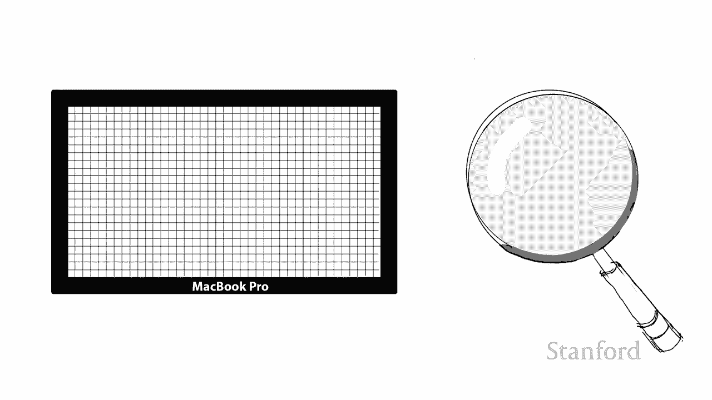
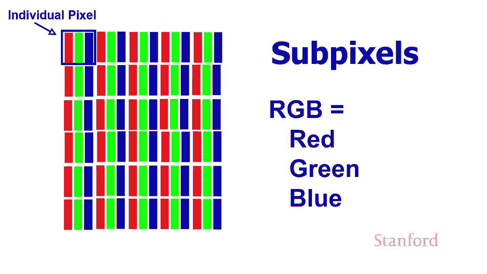
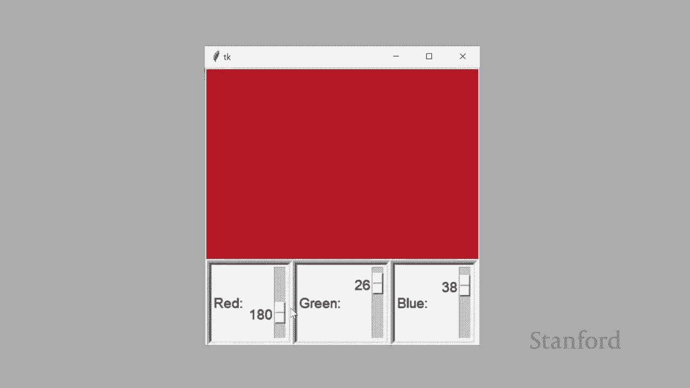
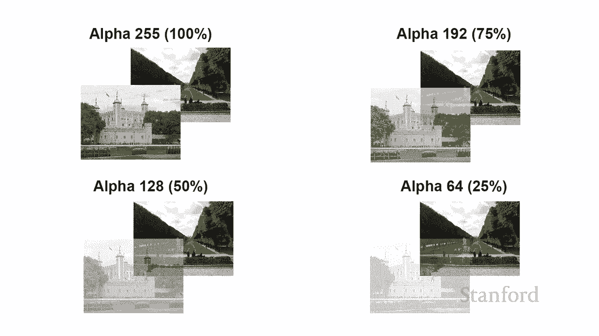
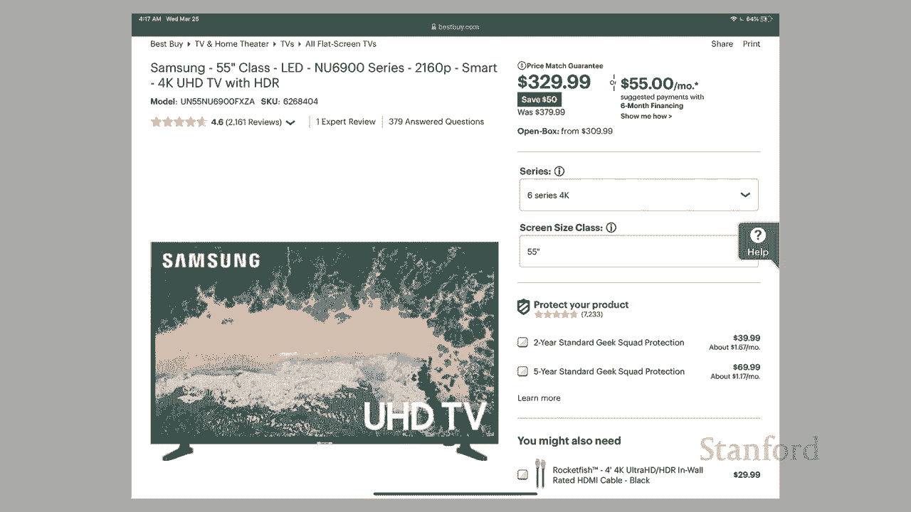
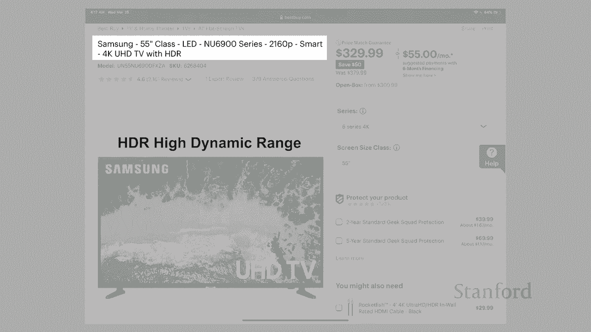
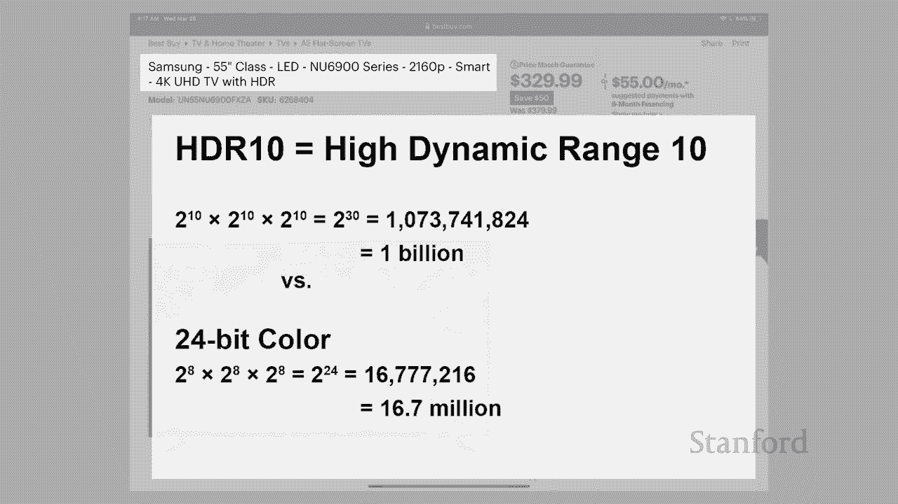

# 【双语字幕+资料下载】斯坦福CS105 ｜ 计算机科学导论(2021最新·完整版) - P7：L2.2- 数字图像：颜色与数据 - ShowMeAI - BV1eh411W72E

undefined，欢迎来探索，欢迎来探索，今天的视频是数字图像第二，今天的视频是数字图像第二，部分让我们变得丰富多彩让我们，部分让我们变得丰富多彩让我们，回到上一堂课我们有笔记本电脑。

回到上一堂课我们有笔记本电脑，和放大镜，和放大镜，我们要做的是以，我们要做的是以，某种方式启动 放大镜的放大能力，undefined，undefined。

仔细观察这个计算机屏幕，仔细观察这个计算机屏幕，当我们，当我们，更仔细地观察计算机屏幕时会发生什么 我们，更仔细地观察计算机屏幕时会发生什么 我们，会发现每个单独的，会发现每个单独的，像素，像素。

都不是由一个正方形，都不是由一个正方形，组成 它实际上，组成 它实际上，由许多所谓的子，由许多所谓的子，像素组成，像素组成，现在这些子像素的确切几何配置，现在这些子像素的确切几何配置，会因计算机而异。

undefined，undefined，主要取决于，undefined，undefined，大多数液晶屏使用的特定计算技术，子，大多数液晶屏使用的特定计算技术，子，像素将 实际上是条形。

像素将 实际上是条形，undefined，undefined，如果我们仔细观察一个，如果我们仔细观察一个，老式阴极射线管或 crt，我们，老式阴极射线管或 crt，我们。

实际上会看到一个红色条、一个绿色条和一个蓝色条，实际上会看到一个红色条、一个绿色条和一个蓝色条，实际上有三个不同的圆圈，但，实际上有三个不同的圆圈，但，同样会有，同样会有。

一个红色圆圈、一个绿色圆圈和一个蓝色，一个红色圆圈、一个绿色圆圈和一个蓝色，圆圈，圆圈，你会听到计算机科学家，你会听到计算机科学家，经常谈论 rgb，经常谈论 rgb，其中 r 代表红色 g 代表。

其中 r 代表红色 g 代表，绿色，b，绿色，b，代表蓝色，所以大多数颜色都在，代表蓝色，所以大多数颜色都在，计算机是使用 rgb 完成的，计算机是使用 rgb 完成的，我们将在几分钟内。

我们将在几分钟内，了解打印机的工作原理，它们，了解打印机的工作原理，它们，实际上有一个名为 cmyk 的不同系统，实际上有一个名为 cmyk 的不同系统，我们稍后再看一下，undefined。

undefined，但让我们再次看，但让我们再次看，一下 我们的红绿蓝，一下 我们的红绿蓝。

这里的想法是，通过混合，这里的想法是，通过混合，红绿蓝的数量，我们，红绿蓝的数量，我们，undefined，undefined，让我们来看看，让我们来看看，我几年前写的一个小计算机程序。

我几年前写的一个小计算机程序，这个特定的程序实际上是，这个特定的程序实际上是，用 python 编写的，它是，用 python 编写的，它是，cs105 学生，cs105 学生。

将在本季度晚些时候学习的编程语言，将在本季度晚些时候学习的编程语言，尽管，尽管，我们不会完全达到，我们不会完全达到，我们将制作，我们将制作，像这样的轻微图形用户界面的地步。

像这样的轻微图形用户界面的地步，他的特定程序显示了，他的特定程序显示了，当我们现在将红绿色和蓝色混合在一起时会发生什么，undefined，undefined，我已经将红绿色和蓝色。

我已经将红绿色和蓝色，都设置为零，都设置为零，所以根本没有灯所以，所以根本没有灯所以，我要在这里做的是我，我要在这里做的是我，继续并在此处调高红色，继续并在此处调高红色，您可以看到我正在慢慢变得。

您可以看到我正在慢慢变得，越来越红，我可以，越来越红，我可以，将其最大程度提高到 255，这是计算机可以发出的最大红色量，undefined，undefined，让我们继续前进，让我们继续前进。

你可以看到我可以用绿色做同样的事情，undefined，undefined，最后是蓝色，最后是蓝色，当然有趣的是当我们，当然有趣的是当我们，继续尝试混合它们时，我，继续尝试混合它们时，我，有一点点。

有一点点，蓝色，大约 30%，蓝色，大约 30%，我可以继续混合一些绿色你，我可以继续混合一些绿色你，可以看到我在这里得到不同深浅的绿色，可以看到我在这里得到不同深浅的绿色，取决于，取决于。

我有多少绿色强度，我有多少绿色强度，我可以开始混合一些红色并通过，我可以开始混合一些红色并通过，混合这些不同的颜色，混合这些不同的颜色，并改变红色的强度，并改变红色的强度，绿色和 蓝色，绿色和 蓝色。

我实际上能够创造出许多，我实际上能够创造出许多，不同的颜色 nd 所以这实际上，不同的颜色 nd 所以这实际上，是计算机本身将如何，是计算机本身将如何，生成颜色，生成颜色，它有红绿色和蓝色条 或者。

它有红绿色和蓝色条 或者，正如我们在 crt 中看到的那样它有那些红，正如我们在 crt 中看到的那样它有那些红，绿色和蓝色，绿色和蓝色，圆圈 通过增加这些单个条的强度，undefined。

undefined，它实际上是混合的 颜色 我们看，它实际上是混合的 颜色 我们看，不到单独的颜色 因为，不到单独的颜色 因为，它们真的很小 所以，它们真的很小 所以，我们的眼睛，我们的眼睛。

看到的只是组合，看到的只是组合，在一起的光 但事实上如果我们，在一起的光 但事实上如果我们，把显微镜放在电脑屏幕上，把显微镜放在电脑屏幕上，我们实际上会看到，我们实际上会看到，undefined。

undefined。

以不同强度点亮的各个条，以不同强度点亮的各个条，让我们来看看一些实际的颜色，让我们来看看一些实际的颜色，示例，因此自然红色，示例，因此自然红色，由红色组成，一直向上，由红色组成，一直向上。

没有绿色和蓝色，尽管我们，没有绿色和蓝色，尽管我们，可以通过增加或减少红色的强度来创建不同的红色阴影，undefined，undefined，从最大，从最大，数量到较少数量的红色或通过。

数量到较少数量的红色或通过，稍微混合一些绿色或一些，稍微混合一些绿色或一些，蓝色，蓝色，蓝色当然是相似的，没有红色，蓝色当然是相似的，没有红色，没有绿色和最大数量的蓝色，没有绿色和最大数量的蓝色。

然后我们可以开始混合，所以，然后我们可以开始混合，所以，如果我们把红色子像素调到，如果我们把红色子像素调到，最大强度的一半，把，最大强度的一半，把，绿色子像素关掉，绿色子像素关掉，把蓝色子像素调到。

把蓝色子像素调到，最大强度的一半，最大强度的一半，如果我们把红色一直调高，我们就会变成紫色，如果我们把红色一直调高，我们就会变成紫色，并且蓝色一直向上，并且蓝色一直向上，让绿色关闭，让绿色关闭。

如果我们将绿色变成，如果我们将绿色变成，蓝色的一半，蓝色的一半，红色的一半关闭红色，我们实际上最终会得到紫红色，而如果，红色的一半关闭红色，我们实际上最终会得到紫红色，而如果，我们将绿色调高。

那么 蓝色，我们将绿色调高，那么 蓝色，一直保持红色仍然关闭，一直保持红色仍然关闭，我们实际上会得到蓝绿色，我们实际上会得到蓝绿色，我们可以获得更多异国情调的颜色所以。

我们可以获得更多异国情调的颜色所以，这里有一些样本来自，这里有一些样本来自，我们将在，我们将在，本季度晚些时候讨论的 html5 规范，本季度晚些时候讨论的 html5 规范，你可以在这里看到绿色组成。

你可以在这里看到绿色组成，绿色但不是绿色在最大，绿色但不是绿色在最大，强度下只有 255 种中的 139 种，然后，强度下只有 255 种中的 139 种，然后，混合了一些红色，混合了一些红色。

和一些蓝色，但大多数都，和一些蓝色，但大多数都，非常低，记住这是一个，非常低，记住这是一个，从 0 到 255 的比例。从 0 到 255 的比例。结实的木头由很多红色组成，结实的木头由很多红色组成。

相当数量 绿色和相当，相当数量 绿色和相当，数量的蓝色，但少于，数量的蓝色，但少于，绿色和红色的数量，绿色和红色的数量，还有一个番茄，你知道，主要是，还有一个番茄，你知道，主要是，红色，红色。

红色在这里几乎是最大值，红色在这里几乎是最大值，但也混合了一些绿色和，但也混合了一些绿色和，一些，一些，蓝色，所以这些是，蓝色，所以这些是，不同的例子 我们可以，不同的例子 我们可以。

使用这个系统创建的颜色类型 事实上，使用这个系统创建的颜色类型 事实上，我们可以使用这个特定的系统创建 1670 万种颜色，undefined，undefined，我是如何达到 1670 万种颜色。

我是如何达到 1670 万种颜色，的 让我们仔细看看，的 让我们仔细看看，这些颜色，这些颜色，在计算机中，在计算机中，是如何实际表示的 这里是颜色的方式 基数红色。

是如何实际表示的 这里是颜色的方式 基数红色，在计算机内部表示，在计算机内部表示，我们可以看到有 24 位或 24 个，我们可以看到有 24 位或 24 个，开关用于表示，开关用于表示，这种特定的颜色。

这 24 位被，这种特定的颜色，这 24 位被，分成，分成，八组，您会记得将，八组，您会记得将，其称为字节，因此我们，其称为字节，因此我们，留出了一个字节 对于红色，在此图中为绿色预留了。

留出了一个字节 对于红色，在此图中为绿色预留了，一个字节，为蓝色预留了一个字节，一个字节，为蓝色预留了一个字节，您可以看到我，您可以看到我，在这里放置了十进制等价物，以便，在这里放置了十进制等价物。

以便，红色的组合在，红色的组合在，远处切换 eft最左边的红色位组合，undefined，undefined，相当于十进制140。undefined，undefined，中间八位的组合对应。

中间八位的组合对应，绿色的数量，绿色的数量，即十进制21，右边的，即十进制21，右边的，组合，组合，再次与开关相同，再次与开关相同，绿色，再次，绿色，再次，代表十进制数 21。所以，代表十进制数 21。

所以，计算机知道它应该，计算机知道它应该，将红色设置为最大强度的一半以上，将红色设置为最大强度的一半以上，然后它应该，然后它应该，添加一点绿色和，添加一点绿色和，一点蓝色，一点蓝色，现在因为 红色的。

现在因为 红色的，数量由，数量由，8 位表示，你会记得在我们，8 位表示，你会记得在我们，之前的讲座中，之前的讲座中，我们可以用 8 位表示 2，我们可以用 8 位表示 2，到 8 个组合，即 256。

到 8 个组合，即 256。我们希望这些组合中的一个，我们希望这些组合中的一个，代表零，代表没有，代表零，代表没有，光，光，出来 那个特定的子像素，所以，出来 那个特定的子像素，所以。

不是从 1 到 256，而是，不是从 1 到 256，而是，从 0 到 255。从 0 到 255。所以我们有红色 0 到 255 绿色 0 到 255。

所以我们有红色 0 到 255 绿色 0 到 255，和蓝色 0 到 255 这就是你，和蓝色 0 到 255 这就是你，在上一个例子中看到的，当我，在上一个例子中看到的，当我。

滑动时 阿鲁 现在在一个小python程序上找到滑块，undefined，undefined，因为我有，因为我有，红色的，红色的，两种到第八种可能的组合，两种到第八种可能的组合，绿色的两种到第八种。

绿色的两种到第八种，可能的组合，以及蓝色的两种到第八种可能的组合，可能的组合，以及蓝色的两种到第八种可能的组合，我实际上总共有两种到 24 种，我实际上总共有两种到 24 种，可能的组合，可能的组合。

事实证明，如果你计算，事实证明，如果你计算，出所有 24 位的所有可能组合，undefined，undefined，我会得到 1670 万多一点，所以我们，我会得到 1670 万多一点，所以我们。

通常说在 24 位颜色中我们，通常说在 24 位颜色中我们，可以表示 1670 万种颜色，可以表示 1670 万种颜色，现在这个 24 位颜色系统是，现在这个 24 位颜色系统是。

其中之一 当今计算机上使用的最常见的颜色系统，其中之一 当今计算机上使用的最常见的颜色系统，但有一个更，但有一个更，高级的变体，高级的变体，它使用一个额外的字节 这是，它使用一个额外的字节 这是。

32 位颜色系统，32 位颜色系统，中的 32 位颜色系统 我们实际上，中的 32 位颜色系统 我们实际上，有一个额外的，有一个额外的，字节，而这个额外的字节，字节，而这个额外的字节。

实际上被搁置了 代表，实际上被搁置了 代表，一个叫做，一个叫做，alpha 的东西 alpha 代表一个特定对象的不透明度或，alpha 的东西 alpha 代表一个特定对象的不透明度或。

undefined，undefined，透明度，透明度，如果我们将一个对象滑动到，如果我们将一个对象滑动到，另一个我们想要显示，另一个我们想要显示，的对象的顶部，我们会使用它 如果它下面的对象。

的对象的顶部，我们会使用它 如果它下面的对象，你通常可以看到，你通常可以看到，当我们在操作系统周围移动窗口时使用的这种技术，undefined，undefined，让我们仔细看看我们的。

让我们仔细看看我们的，alpha 是如何工作的，alpha 是如何工作的，我在这里得到的是我在这里有一对，我在这里得到的是我在这里有一对，图像我，图像我，下面有一张图片，它停，下面有一张图片，它停。

undefined，undefined，在卢浮宫附近，然后我在左上角有一张伦敦塔的图像，undefined，undefined，我将，我将，公园与伦敦塔重叠，公园与伦敦塔重叠。

我将 alpha 设置为更高的，我将 alpha 设置为更高的，百分比 alpha 设置为 100，百分比 alpha 设置为 100，% 伦敦桥图像将，% 伦敦桥图像将，完全不透明，我们将无法。

完全不透明，我们将无法，看透它，看透它，但是当我们降低不透明度时，我们将，但是当我们降低不透明度时，我们将，能够看到，undefined，undefined，它下面越来越多的巴黎公园。

它下面越来越多的巴黎公园，alpha 设置为，alpha 设置为，255 中的 192，即 75%，255 中的 192，即 75%，你可以看到公园，你可以看到公园，开始流血了，undefined。

undefined，undefined，undefined，undefined，看到更多，看到更多，下面的公园，你也可以 o，下面的公园，你也可以 o，看到嗯，看到嗯，我们伦敦塔的那，我们伦敦塔的那。

部分不在，部分不在，uh 在巴黎公园上的部分开始，uh 在巴黎公园上的部分开始，看起来有点褪色，然后最后，看起来有点褪色，然后最后，在我们这里的最后一张图片中，在我们这里的最后一张图片中。

我将 alpha 设置为 25，即 64，undefined，undefined，255 你可以看到，嗯，我们几乎可以，255 你可以看到，嗯，我们几乎可以，完全，完全，看到公园，伦敦塔的图像。

看到公园，伦敦塔的图像，几乎完全褪色，几乎完全褪色，如果我们进一步降低 alpha，如果我们进一步降低 alpha，我们将 alpha 设置为零，我们将 alpha 设置为零。

我们将无法看到塔，我们将无法看到塔，undefined，undefined，让我们把我们新发现的知识，让我们把我们新发现的知识，应用到一些，应用到一些，实际的事情上，例如假设我们有，实际的事情上。

例如假设我们有，兴趣购买一台新电视，兴趣购买一台新电视，这是，这是，百思买网站上三星新电视的网页，所以，百思买网站上三星新电视的网页，所以，如果我们快速浏览一下 在这个网页。

如果我们快速浏览一下 在这个网页，上，对我来说最突出的第一件事是，上，对我来说最突出的第一件事是，你可以以 329。99 的价格购买一台全新的，你可以以 329。99 的价格购买一台全新的，高清电视。

高清电视，为什么我不认真地拥有其中一个，为什么我不认真地拥有其中一个，undefined，undefined，呢？反正这些价格真的很低，所以，呢？反正这些价格真的很低，所以。

让我们来看看，让我们来看看，这个的规格，这个的规格，电视我们 将重点放在标题行上，电视我们 将重点放在标题行上，undefined，undefined，我们可以看到这是三星，我们可以看到这是三星，制造。

制造，商 它是 55 英寸 这是，商 它是 55 英寸 这是，从，从，显示屏的一个角到，显示屏的一个角到，对角的距离 我们可以看到它，对角的距离 我们可以看到它，undefined，undefined。

是 LED 这是在谈论显示器，是 LED 这是在谈论显示器，所使用的技术，所使用的技术，与等离子电视，与等离子电视，或老式阴极射线管，或老式阴极射线管，电视不同，undefined，undefined。

undefined，undefined，undefined，undefined，电视，电视，所以这是 2160p 2160 指的是从上到下，所以这是 2160p 2160 指的是从上到下，的像素数。

的像素数，p 实际上，p 实际上，代表渐进式，代表渐进式，所有现代显示器都是渐进式，所有现代显示器都是渐进式，为了了解渐进式是什么，为了了解渐进式是什么，我们需要看一下使用隔行信号的旧。

我们需要看一下使用隔行信号的旧，技术，技术，所以例如，所以例如，一个老式的录像机磁带是隔行扫描的，一个老式的录像机磁带是隔行扫描的，这里的隔行信号的想法，这里的隔行信号的想法，是，嗯，而不是更新，是。

嗯，而不是更新，每一行 在电视上，我们，每一行 在电视上，我们，会每隔一行更新，会每隔一行更新，电视上的信息，假设，电视上的信息，假设，我们的信号正在输入，我们，我们的信号正在输入，我们，能够，能够。

每秒获取 30 次信息，每秒获取 30 次信息，隔行扫描，隔行扫描，信号会发生，信号会发生，在电视上每奇数行的前 30 秒 将，在电视上每奇数行的前 30 秒 将，被更新，然后在下一个 30，被更新。

然后在下一个 30，秒内，秒内，每条偶数线将被更新，每条偶数线将被更新，然后每条奇数线将被更新，然后每条奇数线将被更新，每条偶数线将被更新并且，每条偶数线将被更新并且，渐进式电视每条，渐进式电视每条。

线都会同时更新，所以这是，线都会同时更新，所以这是，一方面 这是一件非常好的，一方面 这是一件非常好的，事情，事情，这实际上，这实际上，是隔行扫描的 VCR 磁带，是隔行扫描的 VCR 磁带。

和渐进式 DVD 之间的巨大差异，所以你，和渐进式 DVD 之间的巨大差异，所以你，知道如果你曾经玩过，知道如果你曾经玩过，这两种技术，这是一个巨大的，这两种技术，这是一个巨大的，改进，但。

undefined，undefined，作为购买者，我们对它并不是特别感兴趣 一台新，作为购买者，我们对它并不是特别感兴趣 一台新，电视，因为，电视，因为，所有新电视都是渐进式，所有新电视都是渐进式。

智能的，指的是它，智能的，指的是它，可以，可以，直接连接到互联网，直接连接到互联网，而且还有，而且还有，呃 它具有执行显示等操作的内置功能，呃 它具有执行显示等操作的内置功能，例如，例如。

netflix 或 hulu 或迪士尼 plus，netflix 或 hulu 或迪士尼 plus，4k 指的是像素数，4k 指的是像素数，undefined，undefined，在这种情况下。

从左到右有 3840 个像素，在这种情况下，从左到右有 3840 个像素，而 uhd 电视，而 uhd 电视，指的是超高 高清，指的是超高 高清，undefined，undefined。

电视再次指的是它，电视再次指的是它，有很多像素宽和很多，有很多像素宽和很多，像素高，所以这是，像素高，所以这是，超高清电视，超高清电视，而不是，而不是，高清电视，高清电视是 1920，高清电视。

高清电视是 1920，x 1080 像素，所以，x 1080 像素，所以，我们实际上可以容纳四个高清电视 显示，我们实际上可以容纳四个高清电视 显示，在这台电视上，因为，undefined。

undefined，如果我们继续，如果我们继续，乘以从左到右和从上到下的像素数，它的像素数，乘以从左到右和从上到下的像素数，它的像素数，是它的，是它的，四倍，这是高清电视上的四倍，undefined。

undefined，我认为这是最后一部分 hdr，我认为这是最后一部分 hdr，实际上是最有趣的，所以 hdr，实际上是最有趣的，所以 hdr，指的是高动态范围，undefined，undefined。

显示技术已经有了许多重要的改进，显示技术已经有了许多重要的改进，例如 DVD 被，例如 DVD 被，undefined，undefined，定义为差异化之一 推论是我们，定义为差异化之一 推论是我们。

每英寸的像素要高得多，所以，每英寸的像素要高得多，所以，你知道我们刚刚看到它有，你知道我们刚刚看到它有，很多，很多，像素高，很多像素，像素高，很多像素，实际上我们的，实际上我们的，像素是，像素是。

高清电视的四倍，但另一个，高清电视的四倍，但另一个，区别是，区别是，现代电视有 更好的，现代电视有 更好的，对比度，所以，对比度，所以，最暗，最暗，和最亮的灯光之间的差异，和最亮的灯光之间的差异，比。

比，以前大得多，我们现在也有更高的，以前大得多，我们现在也有更高的，整体，整体，亮度，为了利用，亮度，为了利用，最暗和最亮的灯光之间的这种对比，undefined，undefined。

我们需要一个 用于定义颜色的新系统，我们需要一个 用于定义颜色的新系统，我们之前已经讨论过，我们之前已经讨论过，现代计算机技术如何使用 24 位，现代计算机技术如何使用 24 位，颜色，因此，颜色。

因此，8 位代表红色 8 位代表绿色，8 位代表红色 8 位代表绿色，8 位代表蓝色，8 位代表蓝色。

嗯 24 位整体导致总共，嗯 24 位整体导致总共，1670 万种颜色 hdr 的作用是什么，1670 万种颜色 hdr 的作用是什么，实际上，实际上，增加，增加，了每个单独像素的位数 它增加。

了每个单独像素的位数 它增加，了每个颜色通道的位数，了每个颜色通道的位数，undefined，undefined，有许多不同的，有许多不同的，竞争标准 ds 有一种标准，竞争标准 ds 有一种标准。

对颜色通道使用 10 位，另一种标准对颜色通道，对颜色通道使用 10 位，另一种标准对颜色通道，使用 12 位，使用 12 位，我将讨论 10，我将讨论 10，位用于颜色通道的，位用于颜色通道的，示例。

因为这似乎更为，示例，因为这似乎更为，普遍，因此，普遍，因此，每个颜色通道 10 位之一 标准是，每个颜色通道 10 位之一 标准是，这个，这个，hdr 10。对于 hdr 10，我们，hdr 10。

对于 hdr 10，我们，undefined，undefined，将为红色预留 10 位，为绿色预留 10 位，为蓝色预留 10 位，undefined，undefined，这将允许我们为每个。

这将允许我们为每个，设置 0 到 255 之间的强度，设置 0 到 255 之间的强度，在这三个颜色通道中，在这三个颜色通道中，我们将能够存储，undefined，undefined。

0 到 1023 强度之间的强度，因此，0 到 1023 强度之间的强度，因此，我们能够拥有更多的，我们能够拥有更多的，渐变，事实上，如果我们，渐变，事实上，如果我们，继续进行数学计算。

继续进行数学计算，请记住在我们拥有 2 之前 到 24 日，请记住在我们拥有 2 之前 到 24 日，给我们 1670 万种颜色，现在我们，给我们 1670 万种颜色，现在我们，有 2 到 30 日。

这给了我们超过，有 2 到 30 日，这给了我们超过，10 亿种颜色，10 亿种颜色，所以这只会给我们，所以这只会给我们，更多的颜色变化，更能，undefined，undefined，代表实际图像。

所以这实际上是一个，代表实际图像，所以这实际上是一个，漂亮的 整洁的技术，漂亮的 整洁的技术。

应该会极大地改善您在，应该会极大地改善您在，电视机，电视机，上的图像 之前我提到打印机使用，上的图像 之前我提到打印机使用，与显示器不同的颜色技术，与显示器不同的颜色技术，所以让我们快速浏览一下。

所以让我们快速浏览一下，这里的主要思想是打印的，这里的主要思想是打印的，页面和绘画，页面和绘画，以与我们的笔记本电脑显示器不同的方式创建颜色，undefined，undefined，让我们快速浏览一下。

我们的笔记本电脑，让我们快速浏览一下，我们的笔记本电脑，或计算机或，或计算机或，电视使用，电视使用，所谓的加，所谓的加，色来创建颜色这些不同的，色来创建颜色这些不同的，显示技术，显示技术。

产生的颜色会创建颜色并将它们，产生的颜色会创建颜色并将它们，以对比的方式映入我们的眼睛 如果我们考虑，以对比的方式映入我们的眼睛 如果我们考虑，绘画或，绘画或，印刷的方式 页面工作我们想要的是我们。

印刷的方式 页面工作我们想要的是我们，想要明亮的白光，想要明亮的白光，白光会照在我们的，白光会照在我们的，印刷页面或我们的绘画上，印刷页面或我们的绘画上，发生的情况，发生的情况。

是该印刷页面中的不同墨水，是该印刷页面中的不同墨水，或，或，该绘画使用的油漆，该绘画使用的油漆，将吸收其中的一部分 白光，将吸收其中的一部分 白光，undefined，undefined。

因此白光包含色谱中的所有，因此白光包含色谱中的所有，不同，不同，颜色，其中一些，颜色，其中一些，颜色会被印刷品吸收 页面，颜色会被印刷品吸收 页面，或绘画以及剩下的东西被，或绘画以及剩下的东西被。

发送到我们的眼睛或被反射，发送到我们的眼睛或被反射，到我们的眼睛，到我们的眼睛，因此这被称为，因此这被称为，减色法，因此这是一种，undefined，undefined。

与我们在显示器上看到的颜色产生根本不同的方式，与我们在显示器上看到的颜色产生根本不同的方式，undefined，undefined，因此实际上，因此实际上，用于打印技术的一组不同的原色。

用于打印技术的一组不同的原色，正如我们之前，正如我们之前，看到，看到，的，计算机屏幕使用 rgb 红绿色，的，计算机屏幕使用 rgb 红绿色，和蓝色作为我们的原色，和蓝色作为我们的原色。

而事实证明打印机使用，而事实证明打印机使用，cmyk，cmyk，因此它们使用青色洋红色黄色，因此它们使用青色洋红色黄色，和黑色，所以如果您要 购买，和黑色，所以如果您要 购买，打印机墨盒你不会。

打印机墨盒你不会，看到，看到，打印机墨盒有红绿色和，打印机墨盒有红绿色和，蓝色 他们实际上有青色洋红色，蓝色 他们实际上有青色洋红色，黄色和黑色你实际上不需要，黄色和黑色你实际上不需要。

黑色在技术上可以，黑色在技术上可以，创建混合一大堆，创建混合一大堆，青色，青色，洋红色和黄色的黑色 墨水，但事实证明，洋红色和黄色的黑色 墨水，但事实证明，这会使用大量墨水，这会使用大量墨水。

有时会给您带来混乱的，有时会给您带来混乱的，结果 关于 rgb 与 cmyk 的另一件事要注意的，undefined，undefined，是，事实证明存在 c，是，事实证明存在 c，您可以在一种配色。

您可以在一种配色，方案中生成而在另一种配色方案中无法生成的颜色，方案中生成而在另一种配色方案中无法生成的颜色，因此，因此，您真的应该，您真的应该，在创建图像时做出决定，在创建图像时做出决定。

undefined，undefined，该图像是用于，该图像是用于，计算机屏幕还是印刷品 页面，计算机屏幕还是印刷品 页面，所以你可以做的是你可以选择，所以你可以做的是你可以选择，某些颜色，因为。

某些颜色，因为，你知道它们在其中一种，你知道它们在其中一种，配色方案中效果很好，而不是在另一种配色，配色方案中效果很好，而不是在另一种配色，方案中，方案中，你也会发现我们稍后会讨论。

你也会发现我们稍后会讨论，关于如何，关于如何，设计网站和网站配色方案的季度，以及，设计网站和网站配色方案的季度，以及，您可能，您可能，为网站选择颜色的方法之一是您，为网站选择颜色的方法之一是您。

将使用色，将使用色，轮 结果发现，轮 结果发现，艺术家使用了不同的色轮，艺术家使用了不同的色轮，艺术家色轮自然地，艺术家色轮自然地，使用，使用，原色使用减色进行绘画，undefined。

undefined，而网络色轮则，而网络色轮则，基于 rgb 的加色使用，基于 rgb 的加色使用，好吧，我们一直在研究计算机，好吧，我们一直在研究计算机，显示的工作方式以及它们如何生成。

显示的工作方式以及它们如何生成，颜色，颜色，我们正在做什么 接下来要看的是，我们正在做什么 接下来要看的是，程序如何表示，程序如何表示，图像和操作图像，然后，图像和操作图像，然后，我们将看看。

我们将看看，可用于存储，可用于存储，图像信息的不同格式，图像信息的不同格式，我们将讨论，我们将讨论，使用时的不同选择，使用时的不同选择，万维网上的图片以，万维网上的图片以。

合适的格式供您使用。