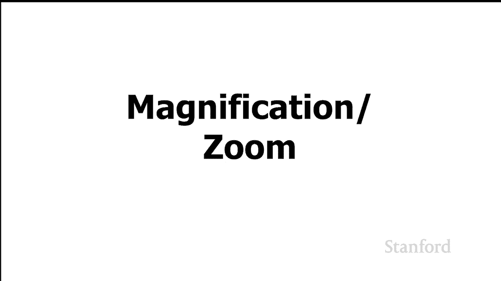
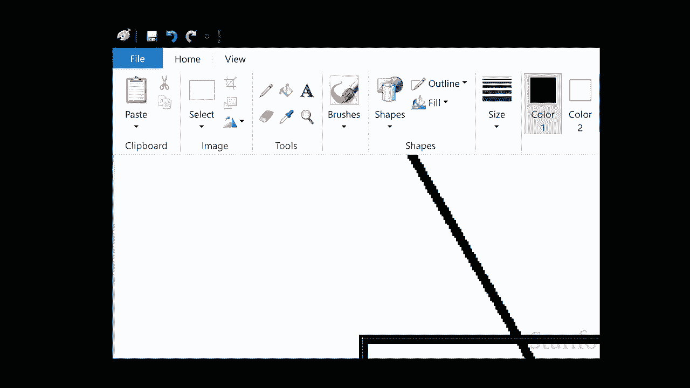
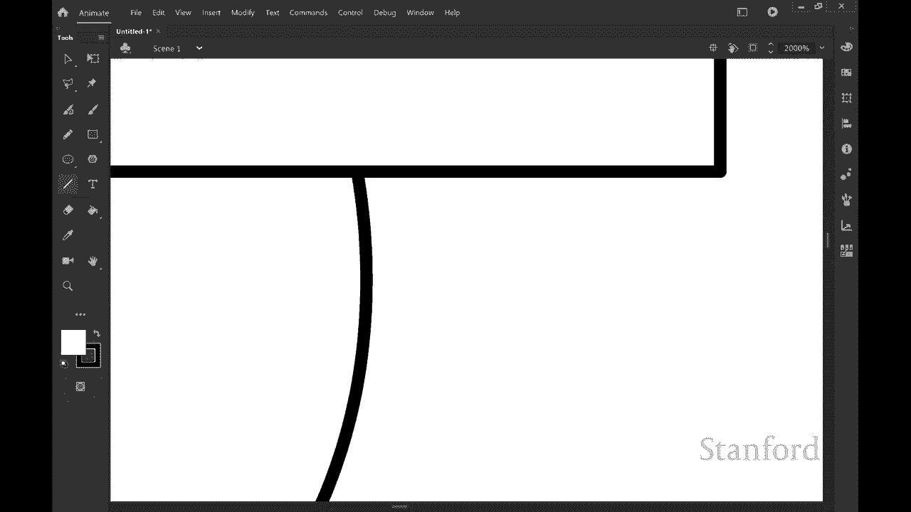
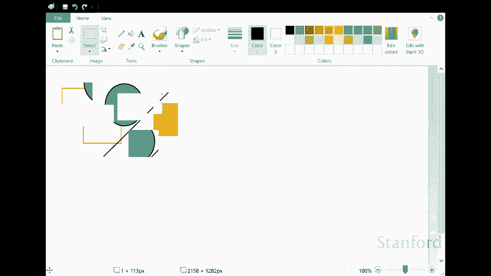
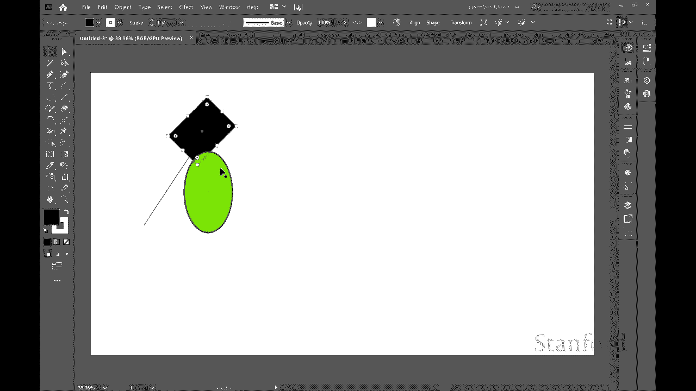

# 【双语字幕+资料下载】斯坦福CS105 ｜ 计算机科学导论(2021最新·完整版) - P8：L2.3- 数字图像：位图与对象 - ShowMeAI - BV1eh411W72E

undefined，欢迎探索计算，欢迎探索计算，今天的视频是数字图像，今天的视频是数字图像，第三部分 位图与对象 所以在，第三部分 位图与对象 所以在，之前的视频中，我们一直关注，之前的视频中。

我们一直关注，的，的，是计算机显示器的实际，是计算机显示器的实际，工作方式，工作方式，我们现在要做的是我们，我们现在要做的是我们，将稍微切换一下 我们，将稍微切换一下 我们，将，将。

看看图像实际上是如何存储在计算机上的，undefined，undefined，所以区别在于，所以区别在于，硬件如何工作与，硬件如何工作与，我们想要使用的文件如何工作，我们想要使用的文件如何工作。

以存储我们的图像，以存储我们的图像，结果证明有两个基本因素，结果证明有两个基本因素，我们可以将图像存储在文件中，我们可以将图像存储在文件中，的方法 第一种方法与，的方法 第一种方法与，我们之前。

我们之前，在计算机显示工作方式方面看到的非常相似，在计算机显示工作方式方面看到的非常相似，因此我们看到计算机显示，因此我们看到计算机显示，每个单独的像素，每个单独的像素，都有一个支持它的位。

如果 如果我们有彩色图像，我们，都有一个支持它的位，如果 如果我们有彩色图像，我们，有一个黑白图像，有一个黑白图像，或一组位或字节，或一组位或字节，所以我们看到，所以我们看到，有 24 位颜色。

有 24 位颜色，其中每个单独的像素后面有 24 位，其中每个单独的像素后面有 24 位，我们看到 32 位颜色，我们看到 32 位颜色，等等 我们什么 可以做的是我们可以只。

等等 我们什么 可以做的是我们可以只，存储，存储，每个单独的像素值，每个单独的像素值，并将它们存储在一个文件中，并将它们存储在一个文件中，所以这里有一个图像，所以这里有一个图像，假设我们想将它存储。

假设我们想将它存储，在一个文件中，我们将从，在一个文件中，我们将从，我们的位图表示开始，它，我们的位图表示开始，它，与 显示工作，你可以，与 显示工作，你可以，看到我们所做的是我们在这里得到了所有。

看到我们所做的是我们在这里得到了所有，单独的像素值，我们，单独的像素值，我们，只是要单独存储每个值，只是要单独存储每个值，所以我可以说，所以我可以说，哦，在左上角我有，哦，在左上角我有。

像素 0 0 那是 rgb 255，像素 0 0 那是 rgb 255，255 255，这意味着红色绿色和，255 255，这意味着红色绿色和，蓝色最大，这意味着我们，蓝色最大，这意味着我们，将有白色。

将有白色，我可以将下一个像素的值存储，我可以将下一个像素的值存储，在，在，像素零上，这也是 rgb 255，像素零上，这也是 rgb 255，255 255 等等，255 255 等等。

我们向下走几行 我们将，我们向下走几行 我们将，存储每一行中的每个单独像素，undefined，undefined，我们向下几行 我们到达，我们向下几行 我们到达，那个圆圈的顶部 你可以看到。

那个圆圈的顶部 你可以看到，哦，像素 9 4 意味着，哦，像素 9 4 意味着，x 等于 9  y 等于 4 9 从左边，x 等于 9  y 等于 4 9 从左边，4 从顶部仍然是白色的 rgb。

4 从顶部仍然是白色的 rgb，255 255 25  5 然后我们转到下，255 255 25  5 然后我们转到下，一个，一个，像素 10 4 这个像素实际上是红色的。

像素 10 4 这个像素实际上是红色的，所以 rgb 是 255，所以 rgb 是 255，0 和 0 等等然后我们可以继续，undefined，undefined，填充所有这些单独的像素。

填充所有这些单独的像素，值迟早我们要，值迟早我们要，到达那里的，到达那里的，矩形，你可以，矩形，你可以，看到你知道的矩形，看到你知道的矩形，就在第 21 行的矩形之前，就在第 21 行的矩形之前。

这是 y 等于 12 x 等于 21，这是 y 等于 12 x 等于 21，那个仍然是白色的 rgb 255 255 255。那个仍然是白色的 rgb 255 255 255。

我们到达下一个像素 在 x 上等于，我们到达下一个像素 在 x 上等于，22，22，y 等于 12。然后这是一种，y 等于 12。然后这是一种，不同的颜色，所以，不同的颜色，所以。

你可以看到这主要是蓝色，你可以看到这主要是蓝色，蓝色 247 但那里有一些红色和绿色，undefined，undefined，红色 87 绿色 84，红色 87 绿色 84。

蓝色 247 然后我将下一个像素存储，蓝色 247 然后我将下一个像素存储，在那个像素上 相同的颜色等等，在那个像素上 相同的颜色等等，我只是，undefined，undefined。

一个接一个地存储所有单独的像素值，一个接一个地存储所有单独的像素值，现在这绝对有效，现在这绝对有效，这与显示器的工作方式完全匹配，这与显示器的工作方式完全匹配，但，但，还有其他方法可以存储相同的。

还有其他方法可以存储相同的，信息，信息，因此这种特定表示再次，因此这种特定表示再次，被称为 位图或光栅，被称为 位图或光栅，g  raphics 我们将看看，g  raphics 我们将看看。

另一种表示，另一种表示，信息的，信息的，方式 下一种表示，方式 下一种表示，信息的方式是我们所说的，信息的方式是我们所说的，对象，对象，或有时称为矢量，或有时称为矢量，图形，你可以在这里看到我们得到。

图形，你可以在这里看到我们得到，了完全相同的图像，了完全相同的图像，但我们将不存储，但我们将不存储，所有单个像素值，而是，所有单个像素值，而是，将它们视为几何，将它们视为几何，形状，所以我可以想，形状。

所以我可以想，哦，我有一个圆，这里是中心的 x 和 y，哦，我有一个圆，这里是中心的 x 和 y，坐标，坐标，半径为 8 个像素 作为，半径为 8 个像素 作为，笔颜色宽度的笔画是一个。

笔颜色宽度的笔画是一个，像素，像素，笔画颜色实际上是红色 rgb，笔画颜色实际上是红色 rgb，255 没有绿色也没有蓝色，255 没有绿色也没有蓝色，然后我有了我的矩形 我，然后我有了我的矩形 我。

继续在左上角开始 xy 位置，undefined，undefined，我继续存储宽度和，我继续存储宽度和，高度，然后我继续存储，高度，然后我继续存储，填充颜色，填充颜色，您可以看到这也存储。

您可以看到这也存储，了完全相同的图像，但它，了完全相同的图像，但它，以不同的方式存储了图像，以不同的方式存储了图像，因此从根本上说，我们有这两个，因此从根本上说，我们有这两个，选择我想要吗 将某物存储。

选择我想要吗 将某物存储，为 bi，为 bi，tmap 也称为光栅，还是我，tmap 也称为光栅，还是我，想将事物存储为对象，想将事物存储为对象，有时也称为矢量，有时也称为矢量，图形，所以我们现在。

图形，所以我们现在，要做的是看看，undefined，undefined，这两种方法的优缺点 好的 所以，这两种方法的优缺点 好的 所以，我们要比较的第一件事是，我们要比较的第一件事是。

这两种方法占用多少空间，这两种方法占用多少空间，所以我们在这里得到的是在我们的左边，所以我们在这里得到的是在我们的左边，我们将，我们将，尝试估计我们的，尝试估计我们的，小图像在这里占用了多少空间。

小图像在这里占用了多少空间，将事物存储为位图，将事物存储为位图，当我们将事物存储为具有 24 位颜色的位图时，当我们将事物存储为具有 24 位颜色的位图时，我们需要为图像，我们需要为图像。

中的每个像素存储三个字节，undefined，undefined，现在这里的图像实际上大约是，现在这里的图像实际上大约是，64 像素乘 48 像素，64 像素乘 48 像素，我知道 它看起来大得多。

但那是，我知道 它看起来大得多，但那是，因为我放大了所有内容，因此，undefined，undefined，当您将 3 个字节乘以 64 x 48 个像素时，我们可以仔细查看所有内容。

当您将 3 个字节乘以 64 x 48 个像素时，我们可以仔细查看所有内容，undefined，undefined，您最终得到的只是 9000 多个，您最终得到的只是 9000 多个，字节，字节。

现在让我们来看看，现在让我们来看看，我们需要多少空间 对于我们的对象，我们需要多少空间 对于我们的对象，它会去，undefined，undefined，取决于我们将为每个对象存储的每个单独的值。

取决于我们将为每个对象存储的每个单独的值，例如，我们正在，例如，我们正在，存储中心，存储中心，我们将开始一个 x 和 y，我们将开始一个 x 和 y，值，这些 xy 值有多大，值，这些 xy 值有多大。

它们每个咬一口，它们每个咬一口，您知道我们可能会为矩形存储更多，您知道我们可能会为矩形存储更多，属性而，属性而，不是，undefined，undefined，undefined，undefined。

undefined，undefined，圆形 这些对象将要，圆形 这些对象将要，占用会有所不同，但，占用会有所不同，但，我估计我们每个对象需要大约 8 到 12 个字节。

我估计我们每个对象需要大约 8 到 12 个字节，假设，假设，我们存储它的图像相对较小，我们存储它的图像相对较小，如果它是一个更大的图像，我们，如果它是一个更大的图像，我们，需要存储，需要存储。

更大的图像 我们的 x 和 y 的值 嗯 所以，更大的图像 我们的 x 和 y 的值 嗯 所以，在这种特殊情况下它确实会有所不同，在这种特殊情况下它确实会有所不同，我是说在这个特定图像中我们。

我是说在这个特定图像中我们，每个对象需要大约 8 到 12 个字节，每个对象需要大约 8 到 12 个字节，我只有两个，我只有两个，对象，所以你可以看到，对象，所以你可以看到。

占用 16 到 24 个字节，占用 16 到 24 个字节，所以它真的不是 mu，所以它真的不是 mu，在一个例子中比较，在一个例子中比较，对象的 ch 我有 16 到 24 个字节。

对象的 ch 我有 16 到 24 个字节，而位图我们有，而位图我们有，9216 个字节，所以你可以看到这里的明显，9216 个字节，所以你可以看到这里的明显，赢家，赢家，是将事物存储为我们的。

是将事物存储为我们的，矢量图或对象，矢量图或对象，图形 我想，undefined，undefined，看看当我们，看看当我们，使用这两种技术中的一种获得图像时会发生什么我们。

使用这两种技术中的一种获得图像时会发生什么我们，继续放大，继续放大，所以我得到的是我们将看看，undefined，undefined，我们正在使用的两个不同的程序 将从我们的位图。

我们正在使用的两个不同的程序 将从我们的位图。

表示开始，所以，表示开始，所以，我们在这里看到的是，我们在这里看到的是，microsoft Paint 它是一个标准的绘画，microsoft Paint 它是一个标准的绘画，程序。

包含在 microsoft，程序，包含在 microsoft，windows 中，windows 中，我在这里绘制几个不同的对象，我在这里绘制几个不同的对象，undefined，undefined。

然后我放大和主要，然后我放大和主要，这里要寻找的是，这里要寻找的是，注意，因为我放大的东西开始看起来，注意，因为我放大的东西开始看起来，有点参差不齐，有点参差不齐，所以这里发生的事情是当我。

所以这里发生的事情是当我，放大时，放大时，我没有得到更多的像素发生的，我没有得到更多的像素发生的，事情是，事情是，位图表示中的像素，位图表示中的像素，只是显示为更大 和越来越，只是显示为更大 和越来越。

大的 s  o 他们变得非常参差不齐，大的 s  o 他们变得非常参差不齐，所以下一个程序是 adobe，所以下一个程序是 adobe，animate，这是，animate，这是，我，我。

在本课程中用于一些简单动画的动画程序，在本课程中用于一些简单动画的动画程序，所以我将再次，所以我将再次，在这里和现在绘制几个不同的对象，在这里和现在绘制几个不同的对象，我要放大，你可以，我要放大。

你可以，undefined，undefined，对不起我在这里笑你可以听到，对不起我在这里笑你可以听到，玛迪玩她的，玛迪玩她的，吱吱作响的玩具对不起，因为我，吱吱作响的玩具对不起，因为我。

在这里放大你可以，在这里放大你可以，看到我可以放大 就我想要，看到我可以放大 就我想要，的而言，没有那些锯齿状边缘的迹象，的而言，没有那些锯齿状边缘的迹象，所以这里发生的事情是，所以这里发生的事情是。

使用对象斜线矢量图形，使用对象斜线矢量图形，方法，方法，我实际上有一个数学公式，我实际上有一个数学公式，我可以重新计算，我可以重新计算，因为我越来越紧，因为我越来越紧，越来越近，越来越近。

我可以 只需使用该公式，我就可以，我可以 只需使用该公式，我就可以，重新计算需要放置的位置，并且可以根据需要进行，重新计算需要放置的位置，并且可以根据需要进行，放大，并且，放大，并且，该，该。

几何形状仍然看起来很，几何形状仍然看起来很。

undefined，undefined，所以我现在想谈论的是，所以我现在想谈论的是，当我们查看这些时 两种可能的，当我们查看这些时 两种可能的，表示是什么 是我们在，表示是什么 是我们在。

创建文档后编辑或操作文档的能力，创建文档后编辑或操作文档的能力，所以我们，所以我们，将一次又一次地从我们的位图，将一次又一次地从我们的位图，表示开始这是，表示开始这是，微软的油漆，微软的油漆。

你可以看到我已经绘制了许多，你可以看到我已经绘制了许多，不同的对象，不同的对象，在我的文档中，如果我尝试，在我的文档中，如果我尝试，编辑此文档，我们将，编辑此文档，我们将，发现我无法在，发现我无法在。

undefined，undefined，此处编辑单个形状，因此您知道我在将，undefined，undefined，这些对象绘制，这些对象绘制，在 屏幕一旦我将它们放入我的。

在 屏幕一旦我将它们放入我的，文档中，文档中，它们就不再被视为单个，它们就不再被视为单个，几何形状，而是，几何形状，而是，程序认为，程序认为，它们只是嘿这里是一堆像素，它们只是嘿这里是一堆像素。

这些像素是特定颜色，undefined，undefined，一旦，一旦，我使用它们就不再是几何形状的一部分 完成绘制它们，因此当我，我使用它们就不再是几何形状的一部分 完成绘制它们，因此当我。

操作此文档时，操作此文档时，我只能操作单个像素，我只能操作单个像素。

或像素组我无法，或像素组我无法，操作原始圆形或线条或正方形，操作原始圆形或线条或正方形，现在下一个应用程序 这是 adobe，现在下一个应用程序 这是 adobe，illustrator。

illustrator，this 是一个为，this 是一个为，对象或矢量图设计的程序，所以你可以，对象或矢量图设计的程序，所以你可以，看到我可以继续抓取这些，看到我可以继续抓取这些，单独的形状。

单独的形状，我可以旋转它们我可以改变它们的，我可以旋转它们我可以改变它们的，颜色我可以，颜色我可以，用对象或矢量图形，用对象或矢量图形，表示改变它们的大小，表示改变它们的大小，这些单独的形状在 屏幕。

这些单独的形状在 屏幕，被认为是几何形状，我，被认为是几何形状，我，可以继续将它们作为，可以继续将它们作为，几何形状进行操作，因此这，几何形状进行操作，因此这，与我们的位图表示形成了非常鲜明的对比。

与我们的位图表示形成了非常鲜明的对比。

undefined，undefined，undefined，undefined，undefined，undefined，表示我为什么要，表示我为什么要，很好地使用位图光栅，很好地使用位图光栅。

这里有一些事情，这里有一些事情，你根本无法用，你根本无法用，数学公式表示 所以这，数学公式表示 所以这，是 maddie 的，undefined，undefined，undefined。

照片 我们也许可以，照片 我们也许可以，想出一些几何形状来，想出一些几何形状来，表示，例如计算机也许我们，表示，例如计算机也许我们，可以表示 t 作为几何，可以表示 t 作为几何，形状，但，形状，但。

你知道 maddie 的皮毛怎么样，这，undefined，undefined，不会发生，所以，不会发生，所以，我们无法想出一个数学，我们无法想出一个数学，公式来代表，公式来代表，她的，她的。

每个单独的毛囊，所以，每个单独的毛囊，所以，当我们看照片时，当我们看照片时，如果，undefined，undefined，undefined，我们在头脑中从头开始生成一些东西，比如。

我们在头脑中从头开始生成一些东西，比如，某种图表或，某种图表或，某种标志或某种，某种标志或某种，图形，图形，那么我们用相机拍摄的将被表示为位图 是，那么我们用相机拍摄的将被表示为位图 是，利用矢量对象。

利用矢量对象，表示的好时机，因此您知道，表示的好时机，因此您知道，何时可以使用矢量对象表示，何时可以使用矢量对象表示，但请注意，在很多，但请注意，在很多，情况，情况，下您只需要使用位图，因此。

下您只需要使用位图，因此，您知道数字绘画照片，您知道数字绘画照片，这些都是可以的 t 真的，这些都是可以的 t 真的，可以，可以。

