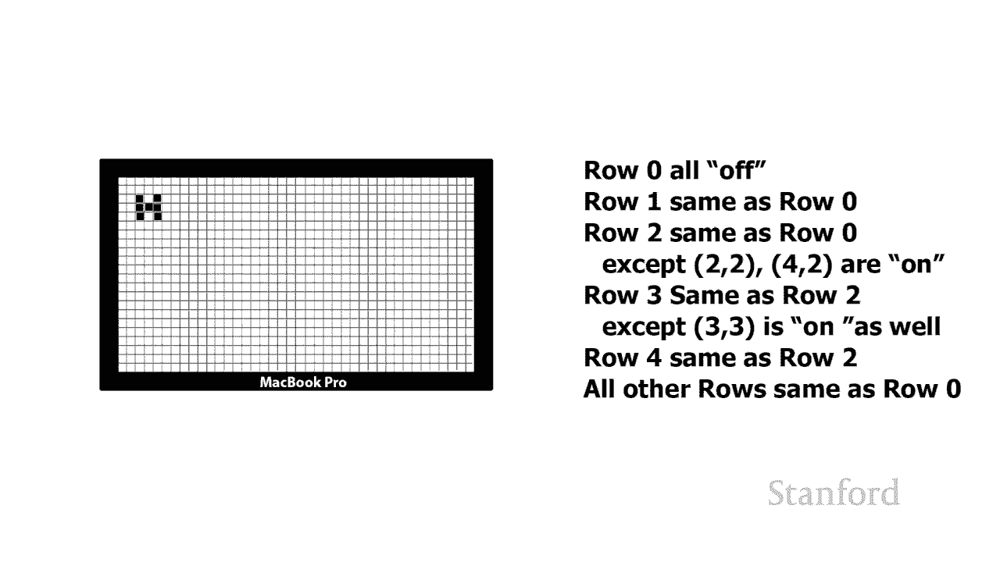
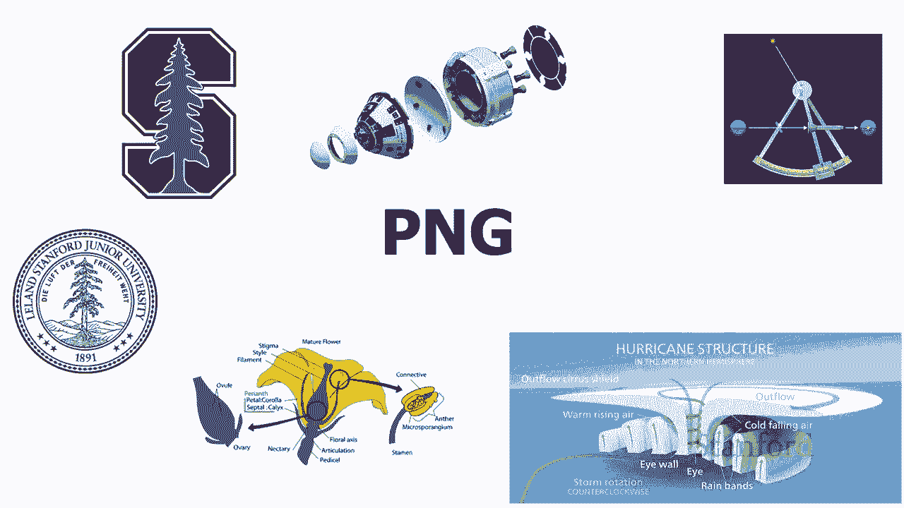

# 【双语字幕+资料下载】斯坦福CS105 ｜ 计算机科学导论(2021最新·完整版) - P9：L2.4- 数字图像：任务与正确的格式 - ShowMeAI - BV1eh411W72E

undefined，欢迎探索，欢迎探索，今天的计算视频是数字图像第，今天的计算视频是数字图像第，4 部分 适合正确工作的正确格式，4 部分 适合正确工作的正确格式，所以我想在这个视频中谈论的。

所以我想在这个视频中谈论的，是，是，您可能使用的不同图像格式，您可能使用的不同图像格式，我将主要关注在计算机上使用的格式，我将主要关注在计算机上使用的格式，web，web，在这个小图中，我们可以看到。

undefined，undefined，web 上使用的主要格式，web 上使用的主要格式，有一种对象格式在 web 上使用，有一种对象格式在 web 上使用，即 svg，即 svg。

它是在 web 上使用的相对较新的格式，它是在 web 上使用的相对较新的格式，尽管它已经存在了一段时间，尽管它已经存在了一段时间，但它有很多 与 html 的相似之处，所以。

但它有很多 与 html 的相似之处，所以，我将推迟讨论它的，我将推迟讨论它的，实际工作原理和它的外观，实际工作原理和它的外观，undefined，undefined。

直到我们在本季度晚些时候讨论 html 之后，直到我们在本季度晚些时候讨论 html 之后，html 是，html 是，undefined，undefined，指定网页内容的主要方式，所以我们。

指定网页内容的主要方式，所以我们，当我们覆盖网页时将覆盖 html，当我们覆盖网页时将覆盖 html，这可能是大约四个星期，这可能是大约四个星期，左右的时间，就 svg 而言，要考虑的主要问题。

左右的时间，就 svg 而言，要考虑的主要问题，是，是，如果您可以使用一堆不同的几何形状来描述您的图像，undefined，undefined，svg 是一个很好的 f  ormat 我们在。

svg 是一个很好的 f  ormat 我们在，上一个视频中谈到了，上一个视频中谈到了，对象（也称为图像的矢量格式）如何，对象（也称为图像的矢量格式）如何，非常紧凑，非常紧凑，它们具有很多不错的属性。

它们具有很多不错的属性，就编辑而言能够，就编辑而言能够，放大图像，放大图像，因此如果特定图像，这是一个很好的选择，undefined，undefined，您正在使用的将适合，您正在使用的将适合。

对象格式，对象格式，我们还讨论了如何在很多，我们还讨论了如何在很多，用途，用途，中位图格式是一个更好的，中位图格式是一个更好的，选择，特别是，选择，特别是，如果我们有像照片这样，如果我们有像照片这样。

的对象，的对象，斜杠矢量格式不会 为了工作，斜杠矢量格式不会 为了工作，所以我们想要使用位图，所以我们想要使用位图，格式，格式，而且位图格式，而且位图格式，传统，传统，上在网络上使用得更广泛。

上在网络上使用得更广泛，有一种称为 flash 的旧对象格式，有一种称为 flash 的旧对象格式，主要用于广告，但也用于一些，主要用于广告，但也用于一些，有趣的小游戏 网络，有趣的小游戏 网络。

但它已经推出了很长一段，但它已经推出了很长一段，时间，时间，我确实希望它会，我确实希望它会，被 svg 完全取代，被 svg 完全取代，所以除了 thre 之外，我们还有许多，所以除了 thre 之外。

我们还有许多，不同的位图，不同的位图，格式 网络上使用的主要格式，格式 网络上使用的主要格式，jpeg png 和 gif，jpeg png 和 gif，还有一些其他格式，还有一些其他格式，您可能对。

您可能对，raw 和 heic 感兴趣 heic 是，raw 和 heic 感兴趣 heic 是，苹果，苹果，使用 iPhone 拍照时使用的格式，使用 iPhone 拍照时使用的格式。

它将以 heic，它将以 heic，undefined，undefined，格式存储 raw 是一种专门，格式存储 raw 是一种专门，用于高端相机的格式，现在这，用于高端相机的格式，现在这，两种。

两种，格式都无法在网络上使用，格式都无法在网络上使用，因此您将不得不，因此您将不得不，从 raw 或 heic 转换为，从 raw 或 heic 转换为，我们将要转换的其他格式之一。

我们将要转换的其他格式之一，今天要讨论，今天要讨论，但我确实认为 raw 和 hcic，undefined，undefined，对你们中的一些人来说可能会很有趣和有用。

对你们中的一些人来说可能会很有趣和有用，所以我们今天将简要介绍它们，所以我们今天将简要介绍它们，undefined，undefined，所以位图格式，所以位图格式，关注，关注，每个人的个体价值是什么。

undefined，undefined，构成图像的每个像素的颜色 现在，构成图像的每个像素的颜色 现在，您可能认为，您可能认为，很好的一件事是不是只有一种位图格式，很好的一件事是不是只有一种位图格式。

您要么将事物作为对象来记忆，您要么将事物作为对象来记忆，并且您，并且您，可以想象我们如何拥有 poss 完全不同的对象，可以想象我们如何拥有 poss 完全不同的对象，格式，格式。

基于我们想要得到的复杂程度是，基于我们想要得到的复杂程度是，我们想要能够支持，我们想要能够支持，你知道椭圆和矩形还是我们，你知道椭圆和矩形还是我们，想要变得超级复杂并做，想要变得超级复杂并做。

一些像样条曲线这样的事情，一些像样条曲线这样的事情，实际上有一个广泛的 svg 专有的，实际上有一个广泛的 svg 专有的，不同对象格式的，不同对象格式的，undefined，undefined。

范围只是实际上，范围只是实际上，广泛支持 Web 使用的对象格式，广泛支持 Web 使用的对象格式，但就位图格式而言，这，但就位图格式而言，这，不仅仅是我们记住，不仅仅是我们记住，所有单个像素值以及。

所有单个像素值以及，这些像素的颜色的问题，这些像素的颜色的问题，好吧，事实证明它实际上，好吧，事实证明它实际上，比这要复杂一些，比这要复杂一些，即使最终我们试图，即使最终我们试图，记住，记住。

所有单个像素的不同值是，所有单个像素的不同值是，什么事实证明有不同的，什么事实证明有不同的，方式来表示相同的，方式来表示相同的，信息 所以我们要做什么 现在要做的，信息 所以我们要做什么 现在要做的。

是，我们将，是，我们将，用我们之前在谈论黑白显示器时看到的 h 来看看这个例子，用我们之前在谈论黑白显示器时看到的 h 来看看这个例子，undefined，undefined，undefined，所以。

所以，我在我的显示器上有一个 h  macbook pro，我在我的显示器上有一个 h  macbook pro，和我想知道如何描述，和我想知道如何描述，屏幕上显示的内容，屏幕上显示的内容，例如假设。

例如假设，我试图，我试图，在我们通过电话交谈时向我的一位 tas 描述这个 h，我，在我们通过电话交谈时向我的一位 tas 描述这个 h，我，如何才能做到这，如何才能做到这，一点标准方法 呃就是把它。

一点标准方法 呃就是把它，想象成，想象成，一个有一大堆像素的直网格，一个有一大堆像素的直网格，我只是继续读取，我只是继续读取，每个像素值，所以我说，每个像素值，所以我说，零零关闭一个零，零零关闭一个零。

关闭两个零，然后我继续阅读，关闭两个零，然后我继续阅读，整个第一行都关闭了，整个第一行都关闭了，我移到第二行 嗯你会，我移到第二行 嗯你会，注意到这些数字实际上是，注意到这些数字实际上是，从零开始的。

这在计算机科学中很常见，undefined，undefined，所以下一行是第一行，所以下一行是第一行，所以我会说哦，零，所以我会说哦，零，一一关闭二一关闭，依此类推，一一关闭二一关闭，依此类推，我会。

我会，到第三行，那是呃第二，到第三行，那是呃第二，因为我们从零零一二开始，因为我们从零零一二开始，undefined，undefined，我说哦零二关闭一二，我说哦零二关闭一二，关闭三二开启。

关闭三二开启，四二关五二开六十二，四二关五二开六十二，关你的派对可能已经生病了，关你的派对可能已经生病了，听到这个，听到这个，相信我，如果我真的，相信我，如果我真的，通过电话向 ta 读取所有这些值。

通过电话向 ta 读取所有这些值，他们会非常厌烦，undefined，undefined，一两个，他们很，一两个，他们很，容易不小心，容易不小心，打开或关闭其中一个错误，所以，打开或关闭其中一个错误。

所以，这种特殊的方法有效，但，这种特殊的方法有效，但，通过电话交谈和描述它，通过电话交谈和描述它，显然非常耗时，显然非常耗时，并且类似地存储所有这些，并且类似地存储所有这些，单独的像素，单独的像素。

值将在计算机上占用大量空间，undefined，undefined，因此这是理想的有没有更好的，因此这是理想的有没有更好的，方法 好吧，是的，实际上它就在，方法 好吧，是的，实际上它就在，那里，那里。

让我们来看看这里的第二种方法，让我们来看看这里的第二种方法，好吧，所以这里有第二种方法，好吧，所以这里有第二种方法，来描述完全相同的屏幕，来描述完全相同的屏幕，我正在通过电话与 ta 交谈。

undefined，undefined，undefined，与第 0 行相同 第 2 行与第 0 行，与第 0 行相同 第 2 行与第 0 行，相同，相同，除了 2 2 和 4 2 都在。

除了 2 2 和 4 2 都在，第 3 行 与第 2 行相同，除了 3，第 3 行 与第 2 行相同，除了 3，3 也打开，3 也打开，并且第 4 行与第 2 行和，并且第 4 行与第 2 行和。

所有其他行，所有其他行，与行完全相同 0。 好的，所以我已经，与行完全相同 0。 好的，所以我已经，描述了完全相同的场景，描述了完全相同的场景，并且 ta 能够获得完全相同的。

并且 ta 能够获得完全相同的，信息量，就像我读取，信息量，就像我读取，了所有单个像素值一样，了所有单个像素值一样，但您可以看到这是一种更，但您可以看到这是一种更，紧凑的描述方式 完全相同的。

紧凑的描述方式 完全相同的，情况，情况，所以事实证明有，所以事实证明有，不同的方式我可以描述，不同的方式我可以描述，所有单个像素是什么，所有单个像素是什么，第一种方法我实际上，第一种方法我实际上。

只是读取所有单个像素，只是读取所有单个像素，值，值，这是一种有时，这是一种有时，称为 bmp 的格式 或位图格式，称为 bmp 的格式 或位图格式，它可以工作，但它非常大，它可以工作，但它非常大。

而且因为它占用了相当多的，而且因为它占用了相当多的，空间才能做到这一点，这意味着如果我们，空间才能做到这一点，这意味着如果我们，将它下载到互联网上，将它下载到互联网上，它将花费相当多的时间。

它将花费相当多的时间，因此我们不使用 这种格式，因此我们不使用 这种格式，事实证明，我们今天要讨论的三种格式中的两种，undefined，undefined，undefined，实际上使用了与。

实际上使用了与，我的紧凑版本非常相似的方法，我说嘿，你，我的紧凑版本非常相似的方法，我说嘿，你，知道这一行，知道这一行，与另一行完全相同 我们，与另一行完全相同 我们，已经看到，已经看到，的行。

通过将我们的行组合在一起并说，的行，通过将我们的行组合在一起并说，嘿，这与您已经看到的相同，undefined，undefined，我们能够大大减少，我们能够大大减少，这需要的空间量，这需要的空间量。

这有时被称为，这有时被称为，压缩，因为我们已经，压缩，因为我们已经，使用我们开始的信息，使用我们开始的信息，我们已经改变，我们已经改变，了我们用来描述该，了我们用来描述该，信息的格式 并且在改变格式时。

信息的格式 并且在改变格式时，我们减少了它占用的空间量，我们减少了它占用的空间量。

所以这被称为，所以这被称为，压缩，undefined，undefined，我们将要查看的文件格式是，我们将要查看的文件格式是，jpeg，jpeg，jpeg 代表联合摄影，jpeg 代表联合摄影，专家组。

专家组，这是提出这种特定，这是提出这种特定，格式的组的名称，但，格式的组的名称，但，我猜使用这种格式的人中有 90 人，我猜使用这种格式的人中有 90 人，没有 想法它，没有 想法它。

代表什么它只是被称为 jpeg，代表什么它只是被称为 jpeg，jpeg 旨在存储照片，所以，jpeg 旨在存储照片，所以，如果你有照片，你，如果你有照片，你，可能应该使用 jpeg 实际上。

可能应该使用 jpeg 实际上，大多数消费者相机和大多数手机，大多数消费者相机和大多数手机，undefined，undefined，在 iphone 之前切换到，在 iphone 之前切换到。

heic 时 你拍了张照片，undefined，undefined，如果你，如果你，想把它放在网上，或者你想把它发送，想把它放在网上，或者你想把它发送，给没有iphone的人，给没有iphone的人。

你就需要立即将它用iphone转换成jpeg，你需要经常将它转换成，你就需要立即将它用iphone转换成jpeg，你需要经常将它转换成，jpeg，jpeg，应用程序将，应用程序将。

立即为您自动将其转换为 jpeg，立即为您自动将其转换为 jpeg，因此如果您，undefined，undefined，要将照片发短信给朋友，而他们，要将照片发短信给朋友，而他们，没有 iphone。

它将，没有 iphone，它将，自动，自动，转换为 jpeg 现在 jpeg 存储 24 位，转换为 jpeg 现在 jpeg 存储 24 位，颜色，因此 这意味着您拥有完整的，颜色。

因此 这意味着您拥有完整的，1670 万色域，1670 万色域，它确实有一个有趣的，它确实有一个有趣的，缺点，我们将看到，缺点，我们将看到，我们将使用的所有技术都没有出现，undefined。

undefined，jpeg 是我们所说的有损，jpeg 是我们所说的有损，压缩格式，那又如何呢？ 这意味着，压缩格式，那又如何呢？ 这意味着，这，这，实际上丢失了信息我在这里有两张。

undefined，undefined，威尼斯的图像，在左侧，威尼斯的图像，在左侧，我有一张 1944 x 2592，我有一张 1944 x 2592，的威尼斯图像，这是 1。39，的威尼斯图像。

这是 1。39，兆字节，在右侧，兆字节，在右侧，我有 1944 x 2592 再次，我有 1944 x 2592 再次，相同 像素分辨率，但 r 上的此图像，相同 像素分辨率，但 r 上的此图像。

ight 只有 215 KB 所以，ight 只有 215 KB 所以，右边的图像现在，右边的图像现在，是左边图像的 1 6 大小，是左边图像的 1 6 大小，如果我们正在看这些，你们中有。

如果我们正在看这些，你们中有，多少人能分辨出这两个图像之间的区别，undefined，undefined，所以我们要做的是 我们将，所以我们要做的是 我们将，继续放大，现在我们，继续放大，现在我们。

undefined，undefined，将仅仔细查看，将仅仔细查看，图像的一部分，undefined，undefined，undefined，undefined，左侧图像，左侧图像。

上的栏杆是大尺寸图像，上的栏杆是大尺寸图像，您实际上可以，您实际上可以，很容易地看到栏杆，而在图像的右侧，undefined，undefined，undefined，如果您查看支撑建筑物的拉线。

则类似这种大的旧烂摊子，如果您查看支撑建筑物的拉线，则类似这种大的旧烂摊子，在右侧，在右侧，它们有点乱，在，它们有点乱，在，左侧，您可以看出它们，左侧，您可以看出它们，实际上是电线，实际上是电线。

您还可以看到，如果，您还可以看到，如果，沿着屋顶的边缘，沿着屋顶的边缘，看，您可以看到左侧看起来很，看，您可以看到左侧看起来很，干净，而在 是的，它有点，干净，而在 是的，它有点，混乱，混乱。

所以我们在这里看到的是这些是 jpeg，所以我们在这里看到的是这些是 jpeg，compressio  n 伪影，compressio  n 伪影，每当您使用 jpeg 时，您都会丢失。

每当您使用 jpeg 时，您都会丢失，信息，信息，因此一旦您拍摄该相机，因此一旦您拍摄该相机，您就会丢失信息，您就会丢失信息，并且您会得到这些 jpeg，并且您会得到这些 jpeg，压缩伪影，但。

压缩伪影，但，关于 jpeg 的事情是我们可以，关于 jpeg 的事情是我们可以，控制实际发生的压缩程度，所以，控制实际发生的压缩程度，所以，我们可以说 哦，我们可以说 哦，我希望我的图像看起来。

我希望我的图像看起来，与相机实际看到的非常接近，与相机实际看到的非常接近，所以我要牺牲一些，所以我要牺牲一些，空间我将拥有一个非常，空间我将拥有一个非常，大的 jpeg 文件，并且几乎没有。

大的 jpeg 文件，并且几乎没有，压缩伪影，或者我可以说，压缩伪影，或者我可以说，你知道 这件事会，你知道 这件事会，在网上流传，我认为没有人会，在网上流传，我认为没有人会，真正注意到那根电线。

真正注意到那根电线，或者，或者，屋顶边缘的栏杆，屋顶边缘的栏杆，有点乱，没人，有点乱，没人，会注意到，我想要一个漂亮的小 图像，会注意到，我想要一个漂亮的小 图像，以便，以便。

它可以轻松地在网络上快速下载，它可以轻松地在网络上快速下载，undefined，undefined，所以嗯，苹果的新 heic 格式，所以嗯，苹果的新 heic 格式，也可以进行压缩 它。

也可以进行压缩 它，比 jpeg 在压缩方面做得更好，undefined，undefined，如果您根本不想进行任何压缩，那么它是较新的格式，如果您根本不想进行任何压缩，那么它是较新的格式，d，d。

用您的相机捕捉该图像，用您的相机捕捉该图像，并在，并在，您的磁盘，您的磁盘，上存储与相机实际看到的完全相同的内容，这，上存储与相机实际看到的完全相同的内容，这，就是原始格式的内容，就是原始格式的内容。

因此高端相机具有原始格式，因此高端相机具有原始格式，可以，可以，存储相机在何时看到的原始图像，存储相机在何时看到的原始图像，你拍了照片，你拍了照片，其他相机和手机会做，其他相机和手机会做。

一些压缩 他们会，一些压缩 他们会，说我可以使用这个数学公式，说我可以使用这个数学公式，它是 jpeg 的一部分，或者是 heic 的一部分，它是 jpeg 的一部分，或者是 heic 的一部分。

undefined，undefined，这将大大减少，这将大大减少，该图像将要占用的空间量，该图像将要占用的空间量，存储，存储，大多数人根本不会注意到，大多数人根本不会注意到，这些压缩工件。

这些压缩工件，undefined，undefined，所以我们的下一个格式是 png png，所以我们的下一个格式是 png png。

代表便携式网络图形，代表便携式网络图形，尽管与 jpeg 一样，尽管与 jpeg 一样，可能很少有人知道 png，可能很少有人知道 png，代表什么，他们只是指代 对他们，代表什么。

他们只是指代 对他们，来说，来说，png png 是一种相对较新的格式，它，png png 是一种相对较新的格式，它，建立在一种称为 gif 的旧格式之上，建立在一种称为 gif 的旧格式之上。

我们将在一，我们将在一，分钟内，分钟内，了解 png 和 gif 都旨在存储，了解 png 和 gif 都旨在存储，图表，图表，和图形，所以我的意思是，和图形，所以我的意思是，它们旨在存储。

它们旨在存储，手动生成的图像，手动生成的图像，或使用计算机图形生成的图像，而不是，或使用计算机图形生成的图像，而不是，照片，照片，png 和 gif 都使用的，png 和 gif 都使用的，技术与我们。

技术与我们，之前用 h 讨论过的技术非常相似，其中 我说，之前用 h 讨论过的技术非常相似，其中 我说，哦，我们要做的是，undefined，undefined。

通过查看完全相同的部分来减少所需的空间量，undefined，undefined，因此如果您考虑一张照片，照片中，因此如果您考虑一张照片，照片中，确实没有，确实没有，您所在的部分 可以说这个像素。

您所在的部分 可以说这个像素，左上角的这组，左上角的这组，像素与右边的像素完全相同，像素与右边的像素完全相同，undefined，undefined，所以你知道也许你可以，所以你知道也许你可以。

说这部分都是海洋，说这部分都是海洋，它或多或少相同，它或多或少相同，但它是 不完全相同，而，但它是 不完全相同，而，在图表上，在图表上，您可以肯定地说图表上的这条线，您可以肯定地说图表上的这条线。

与图表中的，与图表中的，另一条线完全相同，或者，另一条线完全相同，或者，您知道这里的，您知道这里的，这一部分与另一部分完全相同，所以，这一部分与另一部分完全相同，所以。

这就是真正的方式 png 和 gif，这就是真正的方式 png 和 gif，工作，他们正在寻找，工作，他们正在寻找，那些完全相同的部分，那些完全相同的部分，以便您可以拍照，以便您可以拍照。

并将其存储为 png，但，并将其存储为 png，但，undefined，undefined，jpeg 格式和用于 jpeg 压缩的技术效率不是很高，undefined，undefined。

undefined，照片，它旨在，照片，它旨在，有效地存储照片，有效地存储照片，png 技术和 gif，png 技术和 gif，技术专门设计，技术专门设计。

用于允许您以与 jpeg 相比的有效方式存储图表，undefined，undefined，尽管，尽管，png 格式，png 格式，不是有损的，因此您知道就像我们的 h，不是有损的。

因此您知道就像我们的 h，示例一样，示例一样，你知道我改变了我，你知道我改变了我，描述 h 到 ta 的方式，描述 h 到 ta 的方式，即使我，即使我，用不同的方式描述 h，我就像哦。

用不同的方式描述 h，我就像哦，那一行和下一行一样，那一行和下一行一样，这四行他们，这四行他们，完全一样 嗯 这里的这些，undefined，undefined。

像素与那边的其他像素部分相同 你知道我是否，undefined，undefined，以这种方式向 ta 描述图像 我，以这种方式向 ta 描述图像 我，实际上并没有丢失任何信息 我。

实际上并没有丢失任何信息 我，只是在改变，只是在改变，ho 根据描述，他们仍然，ho 根据描述，他们仍然，能够复制，能够复制，我们开始时使用的确切图像，我们开始时使用的确切图像。

这就是 png 和礼物的，这就是 png 和礼物的，工作方式，他们将能够为我们，工作方式，他们将能够为我们，提供，提供，原始图像的精确复制，但他们将，原始图像的精确复制，但他们将，占用 比，占用 比。

实际存储每个单独，实际存储每个单独，像素的空间更少，像素的空间更少，现在 png 和 gif 确实有，现在 png 和 gif 确实有，另一个，另一个，在 jpeg 中不可用的有趣功能，这是。

在 jpeg 中不可用的有趣功能，这是，使某些单独像素透明的能力，undefined，undefined，所以让我向您展示这是如何工作的，所以，所以让我向您展示这是如何工作的，所以。

我们已经做了 到了这里是我们有，我们已经做了 到了这里是我们有，斯坦福海豹，斯坦福海豹，我在白色，我在白色，背景上展示它，你可以，背景上展示它，你可以，看到海豹在这里非常适合，看到海豹在这里非常适合。

看起来它非常匹配，看起来它非常匹配，现在我们要做的是我们，现在我们要做的是我们，将取下压模钢并将，将取下压模钢并将，其放在灰色背景上，您可以看到，其放在灰色背景上，您可以看到，undefined。

undefined，这里发生的事情是我可以，这里发生的事情是我可以，看到印章即使印章是一个，看到印章即使印章是一个，圆圈我可以看到，圆圈我可以看到，我实际上正在将印章与，我实际上正在将印章与。

矩形环绕 g 印章，矩形环绕 g 印章，所以白色背景真的，所以白色背景真的，会出现在这里，会出现在这里，所以我将能够用，所以我将能够用，png 或 gif 做的，png 或 gif 做的，是我将能够将。

是我将能够将，某些像素，某些像素，指定为透明的，这意味着，指定为透明的，这意味着，后面的任何内容 它会出现，后面的任何内容 它会出现，而不是，而不是，担心，担心，图表本身是什么所以嗯，我们开始吧。

图表本身是什么所以嗯，我们开始吧，你可以看到我有一个透明，你可以看到我有一个透明，版本的密封件，版本的密封件，我已经去掉了，我已经去掉了，矩形中不直接的部分，矩形中不直接的部分，undefined。

undefined，在圆圈和印章的内部，你可以看到，在圆圈和印章的内部，你可以看到，我也去掉了印章的内部，undefined，undefined，所以我可以把它放在各种，所以我可以把它放在各种。

不同的背景上，所以它在，不同的背景上，所以它在。

灰色前面，灰色前面，你会记得 上一课呃我们，你会记得 上一课呃我们，谈到了，谈到了。

创造颜色，比如这里看到绿色它，创造颜色，比如这里看到绿色它，在种子绿色，在种子绿色，前面这里是在番茄和结实的，前面这里是在番茄和结实的，木头，木头，前面所以我可以把这个印章放在。

前面所以我可以把这个印章放在，许多不同的背景，许多不同的背景。

和标记为透明的像素前面，和标记为透明的像素前面，将继续展示，将继续展示，它们下面的任何东西，它们下面的任何东西，在大多数编辑程序中，当，在大多数编辑程序中，当，您使用支持透明度的格式时。

您使用支持透明度的格式时，透明，透明，部分将显示为棋盘，部分将显示为棋盘，图案，图案。

因此这就是，因此这就是，没有，没有，透明度的印章的外观，这就是具有透明度的印章的，透明度的印章的外观，这就是具有透明度的印章的，外观，外观，adobe photoshop 好吧，我们有。

adobe photoshop 好吧，我们有，最后一种格式需要覆盖，最后一种格式需要覆盖，那就是 gif gif 之所以有名，是因为，那就是 gif gif 之所以有名，是因为，它允许我们创建小动画。

它允许我们创建小动画，嗯，这本质上是将一系列静止，嗯，这本质上是将一系列静止，图像，图像，打包到同一个文件中，打包到同一个文件中，然后播放一个图像 由，然后播放一个图像 由，下一张图像接着下一张图像。

所以，下一张图像接着下一张图像，所以，这不是真正的，这不是真正的，完整视频 视频格式有点，完整视频 视频格式有点，不同，不同，如果你有，如果你有，一大堆想要拍摄的视频，它们会更有效率。

一大堆想要拍摄的视频，它们会更有效率，” 我真的想将 gif，” 我真的想将 gif，用于任何特别长的东西，用于任何特别长的东西，嗯 gif 实际上现在可以用，嗯 gif 实际上现在可以用。

动画 png 代替，但对动画，动画 png 代替，但对动画，png，png，的支持相对较新，仍然，的支持相对较新，仍然，有很多网络浏览器，有很多网络浏览器，这将无法显示，这将无法显示，您的动画 png。

因此，您的动画 png，因此，如果您希望每个人都能看到，如果您希望每个人都能看到，您的短小动画循环，您，您的短小动画循环，您，应该继续使用 gif，应该继续使用 gif，gif。

因为旧格式仅支持 256，gif，因为旧格式仅支持 256，色，而不是 1670，色，而不是 1670，万色 我们一直在使用的颜色，所以，万色 我们一直在使用的颜色，所以。

你会注意到很多 gif 看起来，你会注意到很多 gif 看起来，有点像素化，那是因为，有点像素化，那是因为，它们并没有像你想要的那样多的，它们并没有像你想要的那样多的，颜色来，颜色来。

提供一个他们支持的非常好的场景，提供一个他们支持的非常好的场景，透明度类似于，透明度类似于，png，但实际上，png，但实际上，它们已经被 png 取代了，它们已经被 png 取代了。

你会遇到它们的主要原因是，你会遇到它们的主要原因是，这些短小的动画循环，这些短小的动画循环，它们实际上确实出现了，因为你可能已经，undefined，undefined，在网上看到了很多。

在网上看到了很多。讲座将是我们，讲座将是我们，关于计算机如何表示，关于计算机如何表示，信息的最后一堂课，在那场讲座中，我们，信息的最后一堂课，在那场讲座中，我们，将看看，将看看。

计算机如何表示声音和音乐，计算机如何表示声音和音乐。

undefined。