# 【中文配音】斯坦福王牌课程 CS 106a Java教程 2017年春季课程 - P1：01_ Intro, Karel - 外影译坊 - BV14U4geNEEq

好吧嘿大家，我们为什么不呢，现在安静下来，我想开始请黑，下午好，欢迎光临，这是计算机科学106位，我市你的教练，我叫马蒂，马蒂步骤，我喜欢被称为马蒂，我不喜欢，真的很喜欢被称为布先生呢。

让我感觉自己老了，我老了，但我不喜欢被提醒，其中我不喜欢被称为教授步骤或医生步骤，意味我实际上没有博士学位，所以那些是技术上的标题不正确，是的，马蒂工作的很好，所以如果你在说话，对我来说，只要称呼我。

我就是今天的班主任何如果您还没有，请获取我们的课程信息副本讲义在前面，他也发布在班级网站上，今天我要谈谈这个课程内容以及课程内容，我们的目标是本季度，希望我们能度过这一切。

我们可以花一点时间做一点点编程，那就是今天的计划，让我开始吧，我这里有一些幻灯片，我想要提到我使用的所有幻灯片，课堂上在讲座之前发布，所以就像你访问我们班级的网站URL，因为该网站在讲义上。

如果您访问您随时可以获得的网站，不在期间或期间使用的幻灯片，讲座结束后，好的。

我要去转到我今天的讲座页面，我点击我的幻灯片，介绍完毕。

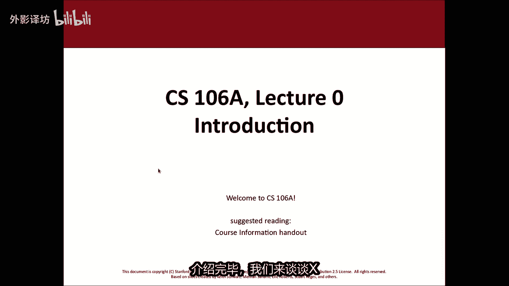

我们来谈谈X106A，首先我是谁，说我叫马蒂，这是一对关于我的事情，我于2013年搬到这里，从那时起我就在这里工作了，呵呵我也爱你，我也爱你，那是我的ta，我想爱是有代价的，我所以我有三只狗。

如果你在INSTAGRAM上加我为好友或者FACEBOOK，你将会被淹没，我的狗的照片，我也有一张很棒的妻子，玛丽安娜在DROPBOX弯曲，他是一个程序那里的经理，我有两只猫，两只猫，三只狗。

一个妻子和我，所以我真的需要投资一些那些剪影人的保险杠，我车后部的贴纸，不同的动物似的，无论如何，那就是这就是我从西雅图搬到这里的原因，曾就职于华盛顿大学，在我搬到这里之前。

我一直在自2004年以来一直从事教学工作，这是我的电子邮件地址，斯蒂芬是STANFORDEDU，我的春假大部分时间都在玩，准备电线，是的，有人在这里打的很好，我以为我更多的考虑你们要去的人。

也对这类事情感兴趣，看大学篮球好吧，那就是我在休息时做了什么，我不教课，仅这堂课我就想跳到其他几个参与其中的人，在这堂课上，我在这门课程中的伙伴，将成为我们的领头混音师，Holy，爱想让我说。

坚强自己或者错了几个，我软化了吗，嗨我是吗，我是13球场上的bennet pa，我想我已经也没有那么奇怪的喜好，所以我的，唱片逐渐了解了我的一些情况，与未受伤害的玛丽莲，所以当你回来时，我们又会这样。

再次我几乎不知道我喜欢什么，我以为我必须继承任何东西，把我拉起来，那只是一般般，所以乔让莫虫就是我没想到的，你关心的是，我已经在这里待了4年了，年年和预算年，黑客等已经随机任意内容下。

我小时候想要打包行李的服务，12或十，我的家人想要改造，你可能会放置的真人秀电视节目，喜欢那些没有真正第一次的事情，行为必须是诚实的表现，和他们都是同性恋演员，所以我发现几乎疯狂。

但实际上确实有有一个周末感觉很奇怪，经验和良好的心理史，就像欧天娜正在制作楼梯，汉娜欧，我的上帝爷爷和，其中之一是学校等设备，感觉你会从诗句中得到很多，他是轻歌剧文学，你用一条病原体鳗鱼。

你就会明白你们中的很多人将能够做很多工作，通过仁I滑块移动去拉斐特学校的路，是问题的解决，最初是关于为什么我没有收到道歉，不同的是冷漠，严格的科学，不是外国的参与，只是常态生活中的办公室。

然后你接近这些问题，将会有一个完整的问题，很酷和不同的方式，谢谢你，都是我的背，如果您需要任何东西，请发送电子邮件，我自己和尼克都包括两者，尼克是我们中的一员，谁来处理大量的物流以及课程问题。

如果你有疑问，关于班级士力架是一个好人，联系是强加与班级的联系网页，并应在讲义上显示为好吧，我们也有这支军队帮助授课的本科生，在较小的单位中，他们被称为部分领导，你们有部门领导吗。

现在在房间里站起来挥手打个招呼，有一些部门领导和大家好，在后期较小的部分，每周他们都会练习的地方问题并回顾概念，他会也在我们的实验室为您提供帮助，给你的作业评分，他们会做一个一大堆东西来帮助实现。

这个班级取得了巨大的成功，所以我很感激他们，我想谈谈花一分钟了解一下这个类是什么，我们要做什么，我也想要提及几个替代方案。

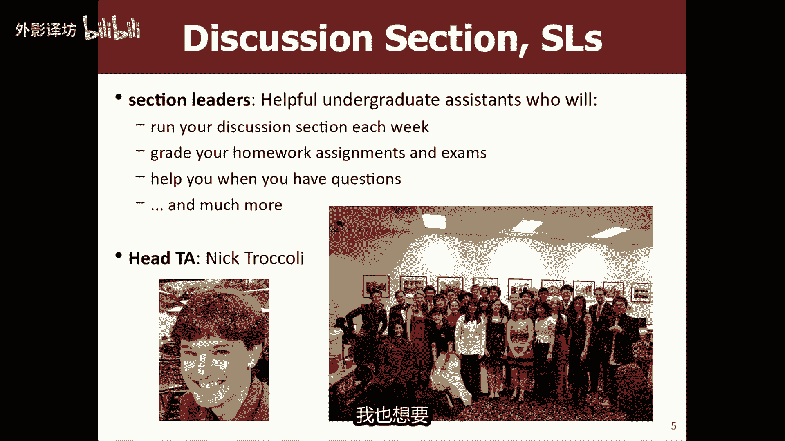

作为一名学生，你可以有多种选择，所以让我来返回这里，几张幻灯片，那又怎样，是X106A景，他被称为编程方法论，是计算机科学导论和编程，我们要做很多，用编程语言编写软件，我将在这门课程中需要java。

假设你从未写过，我只是好奇之前的计算机程序，如果你从未做过，请举手，之前写过一个程序号吧，我想要你记住，几乎每个人都玫瑰玫瑰，再次阅读他们的手牌，所以如果你之前没有编程过，没关系，我没想到你来对地方了。

任何过去的编程经验，如果您知道如何打开计算机，进入网络浏览器并输入角色，你很好，所以我们要学习如何程序如何运行计算机，如何执行指导解决问题的过程，人们用来编写程序和计算机算法，来解决我们的问题。

想要学习数据，你会怎样，基本上你是如何操纵数据的，我的意思是尼克提到了这个想法，关于你如何解决问题以及解决问题，我们有独特的方法，看着看着的世界问题如何解决，所以我认为这会以心态开始游戏，在这门课程中。

正如我所说，我们要去使用编程语言来做到这一点，主题java我想我们没有像我说的先决条件，学生们最常见的问题是我选对课程了吗，所以很多学生会来找我或者尼克，他们会说这是我的背景，这是我所知道的。

我是在正确的地方吗，通常学生要么没有完成之前的任何编程，在这种情况下，是的，你是间接的，或者你已经做了很少，他们不确定是否有足以让他们想跳过这个，当然有很多关于这个的问题，所以我确实想谈谈这个话题。

还有另一门课程106批，这是本课程的后续，部分学生以前做过高中编程的人，学校或其他环境中选择跳过这门课，直接进入106P，当然如果你认为你可以，我们班级网页上就是这样的人，有一个链接，经常说提出的问题。

常见问题解答，第一部分文档是关于哪门课程的，适合我，我们还有一个单独的，我们网页上的讲义也是关于课程的部分，哪些选项可能是正确的，你需要知道的一些事情，在106P中表现出色，这回对你有帮助。

决定你是否准备好，而不是你，实际上我们举了例子，你可以看看的问题，问题看起来像成功，看起来像回顾这一切都成功，也许你想要116，我想一般来说，如果你不确定，那么我会转播，小心谨慎。

今天一旦他是一个相当与其跳跃前进，不如做好准备，做得好，然后超越挑战自己，很高兴我们有一个独特的选择，今年春天这个特定的季度，我们有另一门正在提供的课程作为替代，106A涵盖了相当多的内容。

几乎相同的材料，以新的方式，我想你可能感兴趣，今天我们的特邀嘉宾是想要指示的是，P106G的力量，课程是用不同的语言进行的，在太空中，它对未来来说是一个新的语言，将我们的部门转变为使用。

但是我们正在稍微一点点时间，如果你愿意的话，可以对它进行beta测试，学生的其他部门课程来自你的时代，Commas，你是将被允许自动化，谢谢马蒂，你们中的一些人可能会在书中写下这个故事。

关于这门课程的黑色边框，我们是将继续保留体育运动和JAVASCRIPT较小的课程。

因为我们想挖掘它，我们承诺我们会做出一些错误。

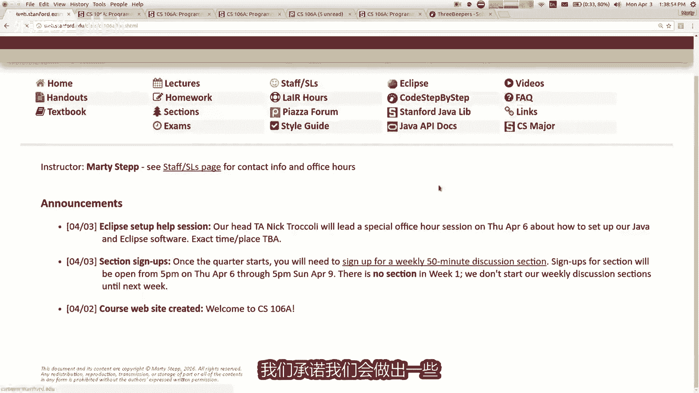

而且有点失点，因为他们就是我们在第37行的全部，在这里的岁月，尽可能集中在为我的读者说出世界的名词，你的变化比任何人都快吗，其他编程接口和，编程语言是适合保留任何工作的事，绝对显示82天河。

大部分pass是我们描述的部门官员，所以我们正在开创这个实验性的好马，周一至周513时，火机已变有空闲时间，并且你有兴趣，较小的语言课程的一部分，这更容易学习，并且更多数字是最流行的网络语言。

如今某些贷方通常表现良好，并且你真的很棒，发生了什么是音乐视频，就在how di，你不想听马蒂的精彩的讲座和素食的心态，那么你检查一下，因为我们有今天早上我们有35名学生，人数众多，我们一致。

再次想要查看列表中的内容，迫使互联网业务发展，但如果你很好，是一天中的一个部分，因此第85条意味着所有国家要求，所以如果这是原因，你决定在这里，你必须写阿特拉斯，我们在这里采取这个斯坦福江。

朝着那个方向前进的人，参加这门课程的人将成为未来几年的专家，所以这真的是不管怎样，希望能见到你们中的一些人那里，谢谢先生，埃里克罗伯特尤金，今年阵中已经存在了一段时间，同时他也是15A的作者。

埃里克长期以来一直在寻找这样做的途径，很长时间了，我很高兴看到新课程的方向等等，如果你有兴趣，你还有更多，如有疑问请联系埃里克和杰瑞凯恩两位教练，106这集有没有快点，现在你想询问有关他的问题。

为我自己解决该地区的任何问题，鲍鱼XJ5的问题，好吧，我有你们中的一些人，这里很大，因为你知道这很难卖，我和你是最亲近的人之一，荣获荣誉的教职员工公寓或大学教学新潮酷，当然更好，编程语言。

然后在这里你让我做同样的老师，但是我会给你看更多的小狗图片，他们会我向你保证，仅此而已，我必须给出，否则他们的班级是可能比我的酷，无论如何，如果您稍后有疑问，请感受免费发送电子邮件或受伤。

他们会很高兴和你谈谈差异，好的，我认为要么想成为一个不错的选择，好吧，我想我会转向其他，我跳过了我谈到的一步的事情，cs106A是什么。

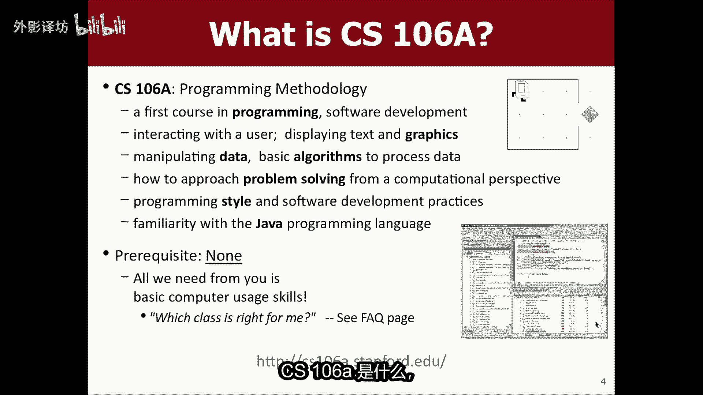

但我真的不知道说说什么是cs，什么是计算机科学，也许是你觉得你知道已经是这样了，但我发现了很多学生只有部分，或者你知道对图形部分的不完全了解，了解我们的领域到底是什么。

关于你知道你可以查很多计算机的不同，定义科学，但基本上是关于研究算法和算法，算法过程和算法是解决问题的顺序，而不是步骤，问题代表问题的解决策略是一系列步骤和指令，通常由电脑，但你知道也许不会。

也许你只是把它们分解，仍然可能是一种算法，所以你知道我们研究计算机及其功能，他们能做什么，他们能做什么，变得有能力，并且有各种各样的计算机科学的子领域，向人工智能和图形科学，计算机器人，数据挖掘。

所有这些有趣的领域，计算机科学从未如此相关或更多，现在世界上最重要的是我很多学生问这个问题，但如果我做计算机科学，我会去吗，我是为了改变世界，很重要，简短的回答是的。

因为我们几乎参与了一切你想要改变的事情，在医学或生物科学领域，你知道拥有良好的计算能力，肯定有助于他们处理大量数据的算法技能，处理和整理信息，这些领域几乎是您认为的任何领域，可以认为我们是其中的一部分。

他们在做什么，我们在做什么，他们做的更好。

所以cs产生了巨大的影响，在世界上无论如何，这就是我们，这就是cs。

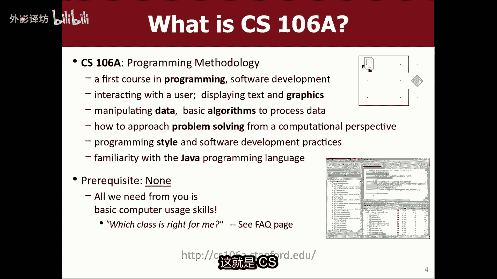

这就是我提到的106A，我们有部门领导和尼克帮助我们，让我告诉你一点关于目前的一些政策。

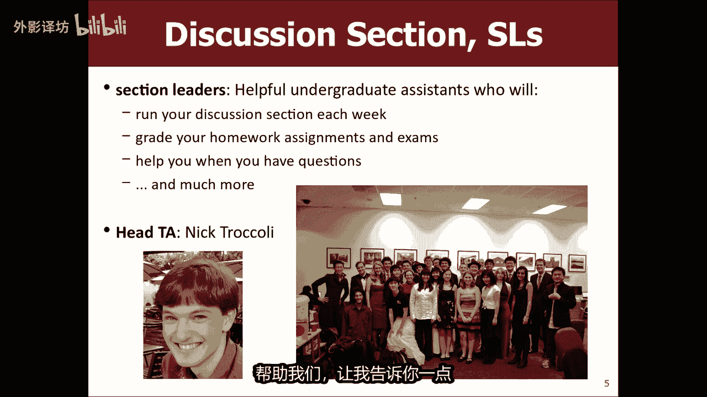

你们拿着的那份文件，我只是尽人们所能付出，这个班，有很多人继续读其他专业，当然不是cs，你如何获得你的成绩之一，你们最重要的问题，您的成绩可能有40%来自家庭作业，家庭作业。

包括您将在您的计算机上运行的程序电脑，并在线返回我们，优秀的部门领导会给他们评分，你会得到你的5%，参加和参与的成绩，在你的每周讨论部分，接下来开始的是你的部门领导，这周你这周没有栏目。

您稍后将在线注册，本周我将在分钟，你的其余分数来自我们的两次考试，请注意日期写在上面的考试，你应该记下这些文件，在你的日历中，你的日程安排，我对化妆考试很严格，我不进行化妆考试。

所以你应该标记那些时候就在那里，有时我对此感到很多阻力，愚蠢的春季学期，学生想要离开并前往阿鲁巴岛，你不能错过考试，我就不会早起取得好成绩测试，因为你想去阿鲁巴岛货你姐姐的婚礼，或者其他什么遗憾的事。

你必须来参加我的测试，或者参加，这是另一个季度，我想我可以变得完美哦，如果你有实习，开始，早点你应该下课后跟我说话，如果可以的话，我通常可以破例与实习人员交谈或类似的东西，但没关系，无论如何。

有几个原因，你可以参加化妆考试，就像你一样，实际上很快，如果他有游戏或某事，或如果您需要特殊夏威夷住宿或类似的地方，但就像你知道的社交场合，而这些东西我不会给予任何化妆考试，脚本都是如此。

你获得了你的成绩，A没有成绩，重要的是到目前为止你还有疑问，关于评分或如何获得课堂成绩，是的什么是C加，你的意思是他是什么样的，偶你怎么样，我适合的分数线是多少，课程结束时的分布。

我按照你的分数百分比对你进行排序，你赚到的我给的大概是最高的，49%的人在或没有，然后我大概了解你接下来的30%，AP ruby失败，然后是最后一种，10%到20%的人取得成绩低于这个。

所以这会倾向于我，你当时才20号左右，您知道接近的百分位数，如果您要在以下方面获得c plus则垫底，该课程通常是分布，我适合他，我有各种承诺，如果你赚了70%，我保证不会让你变得更糟。

我保证比C得到80，不是给你比B更糟糕的，但是在实践中，你通常会变得更好，比那些百分比有效，只是因为我听到了他们的意见分布，所以这就是答案，你的问题，其他与评分相关的问题，现在会有任何疑问。

这是关于我的狗的，他们是什么，名字正确嗯，他们的名字是艾比巴尼和克莱德，巴尼和克莱德是棕色人，克莱德的巴尼吗，黑色的加一点白色的法国斗牛犬，直到巴尼暗示听起来就像邦妮和克莱德，认识这些歹徒。

但他们都是男孩，就像巴尼和克莱德，然后当我们得到B时，我们感觉就像哦我们应该将它们命名为ABC，这样我们就可以找到有了一个名字，我们就带着一个B，所以试的如果你们真的是好学生，也许我会带狗来上课。

也许也许别担心他们很友好嗯，教科书不是这本书列在网页，何名为java的艺术设计，尤其编写刚才发言的ERICROBERTS教授，他们过去和以前，很多学生总是想知道我是否必须购买我的书，知道书很贵。

所以你们必须做出选择，支持或反对购买的论点，预订最优惠的工作和最棒的书上不会出现问题，所以你不需要他们来工作，你的作业，所以从某种意义上来说，是无需购买即可获得一家这本书。

但你可能仍然想要有一个原因有几个，其中之一是我认为对大家有很好的参考意义，当然书上的材料是与课堂材料密切相关，所以如果你被困住了，这是一件好事，看看有很多例子东西，另一个原因是我会让你使用考试的书。

我不会让你用，还有什么没有笔记，没有数字，任何东西，没有其他书，只是那本书，也就是说我将引入一名贷款人复制，这是前面它将如果你想的话，就得等15分钟使用它，因为每个人都会在在你前面排队。

所以这是一个你可能想要预定的原因，我不是试图强迫你购买货，不管他是确定的，可能做的好，你可能会考虑，如果你可能考虑等待，请购买，与购买或离开相比，他会陷入困境，并在预订时看到他工程图书馆。

我们有一些那里有副本，所以有一些方法如果你需要的话，可以拿到这个稍微看一下，我们有一个另一本较短的书叫做机器人，卡罗尔学会了，我们要去第一周使用它只是踏实呃，你知道螺旋式下降的事情。

其中一本大约有30夜长，可在网上以免费PDF形式获取，如果您只是想的话，我们的班级网站下载并看看就可以了，好的，我谈了家庭作业，你的家庭作业包含您提交给我们的程序，有大约七个作业，作业发布大约一周。

或我们每个人都稍微多一点进行结对编程，你可以大部分家庭作业都是两人一组完成，课堂上你的第一个作业必须自己做，因为我想要你们都在你的电脑上，安装你的软件机器，我希望你至少写一个程序，我会给你买东西。

但是然后之后你可以与合作伙伴一起工作，希望这能帮助你伙计们更好的合作，并获得通过与您交谈来回答问题，合作伙伴之类的事情，我会谈谈课程，稍后会详细介绍一次，我们按照评分方式布置作业，你的作业分为两类。

一称为功能，这意味着你的程序函数可以做到这一点，成功的做到了他们所需要的，要做的是另一个是风格，是这样吗，写的好吗，优雅的表达，所以可能不在于立即清除的，你这是什么意思，但我的意思是，你可以打个比方。

英语imagine i，那天要你写一篇有说服力的文章，你知道也许这个功能会，你引用了很多好的资料吗，你提出了很多好的观点吗，风格是因为你写的很很快，你就可以使用良好的措辞，并且措辞使其读起来愉快。

就像那种事情，我们在这里做什么，你的评分，每份作业都用这两种方式，作业规范，试图描述，详细说明我们希望您提供什么，以便您知道我们会做什么，问候有点奇怪，我们不给你分数，例如十分满分十分。

或我们给你这些某总统，我们说您获得支票加分的分数，或者你有一张支票，这些事原意是要N点的，一般类别一点点模糊了，为什么我们这样做，部分是因为最后当然我可以调整什么，那些变成是他们适合的点，良好的分布。

换句话说，就像支票加上很多人认为的，就像A和支票一样，认为就像B和支票认为这就像看到那是对的，但如果有很多检查减号，然后检查减号成为B或类似的东西，所以我可以根据需要调整这些作为支持或继续。

但基本上当你得到你的作业回来，你会得到反馈，你会得到这些标记，如果你是获得知道加分，意味着您完全符合我们的期望，你的作业做的很棒，这基本上就是你主页上的一个页面，你要检查一下，你有小你应该解决的问题。

下次你收到支票时，你你需要解决的相当重要的问题，修复未来的任务，大多数学生都会收到支票和支票忙碌，你会发现你的成绩与您所在部门亲自会面，每个任务创建后的领导者，所以他们会和你一起讨论并讨论。

关于你可以做的更好，以及什么，你做的很好，有任何问题吗，作业和格雷迪，我真的不在乎你的问题，或不是我只是想喝一分钟咖啡哦，我只是觉得那是暂停讲座的好方法，其次你不知道这是否很酷，你没有任何问题。

我们有一个较晚的政策，意味着有事要做，但你不明白，按时完成，你可以晚交，没有处罚，最多四次，这四天来您收到一个迟到的盒子，您可以前往下一个讲座，所以如果程序有周五到期，但你没有完成，您可以在星期一使用。

如果你没有在我的网站上收到它，那就晚了一天，那么你可以在周三之前将其提交，再用一天，晚些时候，然后之后那是好锁，你无法转动迟到两堂以上的事情，对于任何作业，您总共获得晚四天，您最多可以使用其中两天。

他们最多完成任何一项作业作业，这样你就可以四岁了，作业迟到或迟到一堂课，分配完了两堂课，或一些像这样的组合使用，当你交东西时自动，你不必询问或告诉任何人，只是发生了。

所以这些就像我会的看看这些就像内置的，你知道的，为期间发生的事情找借口，如果你真的感冒了，你会在这个季度生病了，你想离开一段时间周末，所以你不太明白作业只完成了那些事情，生活中发生的这些事情有点糟糕。

几天让你解释这一点，但是因为我给你这些我不给的作业，扩展几乎总是最重要的，这些就像如果你生病了，你没有机会完成周末作业，我会说你如果您应该使用您的页面，说我把他们都用完了，因为我去了坎昆。

我会说那是你的船，所以你知道那就是这样，这是如何运作的，希望这会是这样足够的灵活性，让你们获得完成了你需要完成的事情，课程中四个人可以，如果你已经很晚了，那么你就把事情转过来，无论如何迟到。

你都会受到处罚，上课迟到的其中一桶，就像如果你能做到的话，检查加上我们不会只剩下检查，这不是那部分尝试，所以即使如果你已经过了类似的日子，你仍然可以把事情转好，我们要去在这个中使用这个软件课程。

编写我们的作业程序，成为剪辑，你必须安装你的计算机上有java语言，然后你必须安装这个eclipse程序用于写作，在计算机下，这个程序是eclipse程序，是一个标准的专业人士使用的软件行业。

以及您是否要工作，在本课程的课程中，您有要将其安装在您的计算机上，适用于windows和Mac，以及所有您所使用的不同操作系统，可能需要并帮助您进行设置。

我们希望您遵循一些指示，如果你去的话，就在我们班级的网站上，到班级网站，你会看到顶部有一个链接栏，是一个链接，如果您单击则显示eclipse，他给了你一些指示，有关如何在您的计算机上安装eclipse。

你的电脑，所以只需遵循这些，只是是一个非常有用的东西。

如果你想做的话，可以做今天课后有用的东西是什么，你能做的好吗，有一点您在网页上建议阅读的内容，可以读到另一个非常有用的，你可以做的就是尝试按照说明设置eclipse，看看他们是否适合你。

如果不适合你工作，给我和尼克发了同一封邮件留言，我们会尽力帮助您。

本周四将进行一次会议，4月6日星期四，我们还在计算出尼克到达的确切时间，我们的其他一些员工将会在特定时间，在特定房间，你可以带上你的笔记本电脑，会帮助你设置一个非常好的剪辑。

这样做是因为如果这对你不起作用，不能做你的作业，所以我们有点想让它发挥作用，让我尝试做，自行按照说明操作，如果你被困住了，去周四的事情吧，到周三的讲座时，我将得到地点的时间，开始的确切时间是的。

今天下课后就这样做。

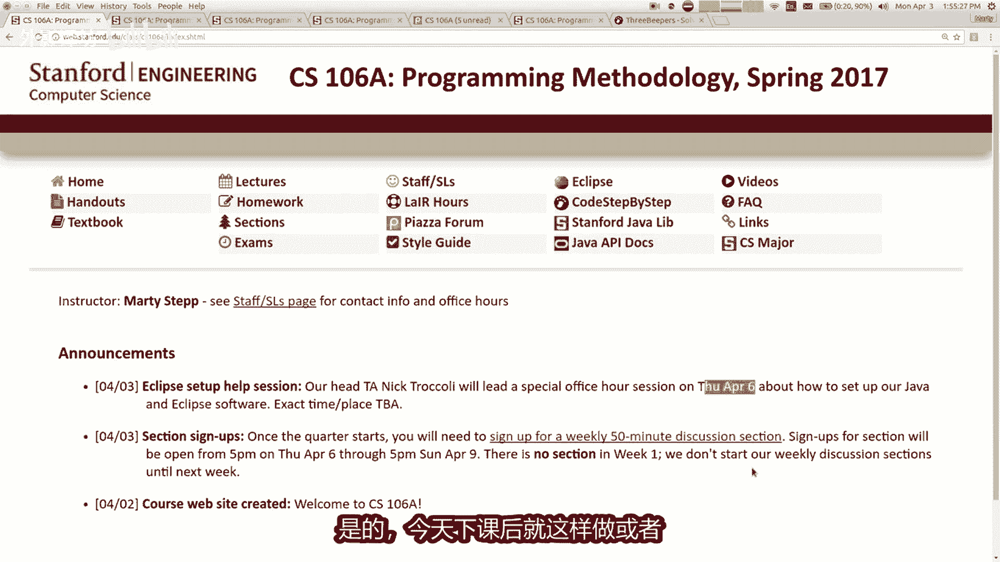

或者在课堂上，如果你有一点无聊时，不要立即这样做，我们希望您能够关注我们的安装eclipse的说明，因为我们有一个特别的斯坦福大学eclipse的版本，所以不要去google。

并在其中搜索eclipse转到我们的网站，如果您获得他们自己的版本，eclipse它不起作用，所以只需使用我们的eclipse的版本，现在可以了，这个类似挑战我不会对你撒谎，这是一个艰难的。

我会尽全力挑战你，以及我们所有的任务和所有我们要解决的问题，但这部分很有趣，当你我们确实想帮助你的东西，我想具有挑战性，但我不希望你这样做，感到陷入困境，所以如果你需要帮助很多资源。

我们有一个特殊的空间，我们第一个的巢穴叫做巢穴tracer，楼层在某些情况下可用，晚上我们有帮助者，例如领导者和员工可以帮助你，如果你家庭作业之类的东西，那这将从下周开始，不是尚可用，但将于下周开始。

这只是一个开放的实验室，你可以进来用你的笔记本电脑，并在这里说我的家庭作业不起作用，我不明白出来我们会帮助你，就是这样，您获得帮助的主要方式，作业，这是一个很棒的资源，部分领导人很棒，还有其他人资源。

我们有课程留言论坛，在PRS上，您可以在那里发布问题，我和尼克以及这样的领导人，将会阅读那里的问题并回答，你可以来我们的办公时间张贴在网站上，我有意见，今天按下后的办公时间。

如果您想来跟我谈谈我的办公室事，讲义上列出了他在盖普斯大楼的地下室倒塌了，并看到汽车留下来闻香气，你也可以给我们发电子邮件，有很多，如果此处显示可以到达的方式，联系你不联系的部门领导知道那是谁。

但你不知道那是什么部分，您的意见我们就会知道下周，但是所有这些其他资源无论如何应该可用，我只是希望你明白，就像课堂上会的那样很难，但我想帮助你，如果您需要帮助，只需联系我们，我们会帮助你笑得开心。

我想提的讲义是我们确实有arm代码，有时我们有有时与那些人有问题，抄这堂课别人的作业，这很容易做到，因为你只是在屏幕上点击复制粘贴，现在你有一份文件的副本，所以一些学生复制他们朋友的解决方案。

或他们从某人那里得到了一份文件之前的课程，或者他们在谷歌上搜索，我会直接看互联网，你们如果用谷歌搜索我们的作业，你完全可以找到的作业，你可以在互联网上找到解决方案，完全可以做到这一点。

或者你可以搜索像种子一样，你可以通过due进行搜索，就像他就在那里，我无法阻止这些，我可以关闭所有这些网站，我们所有作业的解决方案是在互联网上，但我们有一些我们运行的软件非常强大。

检查我们提交的所有内容，曾经收到过，他还检查很多不同的网站，如果您提交的内容是别人的副本，他标记了他，并且他向我们展示了她，所以她很漂亮，所以这是不允许的，你不应该举报某人。

课堂上把别人的作业当做自己的作业，你也不应该给你的工作给别人复制，所以情如果你担心的话，请小心关于你所在位置的虚假举报，匹配时意外处罚别人，我不想让你担心，关于那个我们唯一一次原谅某人。

将是一个我们怀疑的程序类似，如果你的程序有他的名字在上面，你为什么要这么做，如果你知道那是可疑的，碰巧解决了某种问题，同样的方式他不会标记，甚至如果我们不会指责你任何事情，所以我不想让你担心，对于误报。

我们非常小心，关于我们如何实施这些政策，我只是想警告你，我们非常擅长谷歌搜索，我们知道的食物，我们知道种子吗，以及所有这些东西，所以我们可以可能会发现谷歌搜索的东西，你发现这样。

你就知道你是否得到了来自走这条路的人，在我们得到他们的计划之前，然后如果你得到它，就会进入这个软件，离开互联网，我们可能有那个，所以我强烈建议不要这样做，因为这可能会导致一些处罚，以及你不想涉及的东西。

如果你正在做的话，那件事就是对的，你所处的那种行为，寻找别人的解决方案，可能意味着你的东西，如果你是遇到困难，只需询问我们，我们会帮助你，好吧，你也可以与合作伙伴一起工作，这样如果你陷入困境。

为什么不语其他人，也许你们两个可以解决他，所以我真的想鼓励，如果你有任何感觉，请联系我们被困，而不是寻找某人，其他人对这些程序的解决方案还可以，因为他们就在那里，你们呢是否有时间完成所有政策。

以及任何问题的教学大纲内容，关于其中任何一个或关于课程，或到目前为止，我所说的一切，这是您的第一次集成以及如何，我可以获得加分还是加分等级，那些很少见，那些通常意味着你在作业中完成了额外的功能。

有时作业规范会有，你可以做一些额外的功能，如果你做了这些或超出了任务范围，以某种实质性的方式，你可能会得到等级有点高于完美以上，额外学分是非常罕见的，所以是的，这就是你得到另一个的方式。

问题是每周花多少小时，你在这门课上工作哦，已经在工作了，我会把它们全部拿走，不对不起，严肃的回答不会是这样的，每周8~10小时，你会派雷克福德上课吗，得到诚实的答案，一次需要多少小时。

你认为每个追求者都会花费一周的时间，这个经典，所以我认为总的来说凯南如果你什么都有肉，直接相关的确实事实，11剑士，大约一小会儿就可以了，远不止于此，参议员们，我们认为这是一个人的事情，大约一个小时。

是的，大约十小时，悉尼以外的讲座正在进行中，我们是我们的意图，但往往是反应，我认为显然有唯一关键的人员分布，有些人只花钱的工作，有些人声称可以两个小时，当然就像他们做的20个小时一样啊，是的有很多领域。

但那就是好吧，如果需要更长的时间也没关系，情况并非总是如此，你只需快速拿起一些东西，有时你听到的可能会令人沮丧，你周围的人说我解决了一小时内的作业，你就像在为之努力，十个小时，我还没完成，我在做什么。

正在做，但是嘿嘿，那个人可能是低估了他们花了多长时间，他们之前可能有这样的经验，你没有，所以这不公平，看看如果有人解决了就可以了，编程速度很快，没关系，这是否意味着你很糟糕，或者出了什么问题和你一起。

如果你走得快的话，你可能错过了我们的一些小，说，明他们可能不会得到我的满分，看到很多人都没有解决一样快，但他们得到了更高的分数，音乐是的，还有其他问题，是的先生抱歉，如何，如果你爱ESO会发生什么哦。

如果你在早期的起步者那里工作，将任务结合在一起，这样他将不会有单独的提交，为了相似，它们只是一个关节提交另一个问题，我们还可以吗，使用名为canvas的网络软件，画不不我不我不使用它，课程计划。

如果有您希望我们拥有的画布功能，在课堂上让我们知道它是什么，并且我会确保我们有一些大致的东西，相当于希望大会满足以下任何其他问题，太好了，我很乐意回答任何问题，你有，好吧，我有一个问题要问。

你们现在想写一些程序代码哦，哇这真的是你们刚刚度过的一周，从阿鲁巴回来，你可以打个招呼，我知道你不在乎，我忘了，我在乎正在录制这个哦，是的，我忘了回答最重要的问题是，讲座录制成你们想要的视频。

知道你是否需要来课堂正确答案，某种程度上，他们没有被任何人记录，带相机的官方大学人员和类似的东西，但我正在运行，现在我笔记本电脑上的程序是捕获，屏幕和音频已变，看起来真的很糟糕。

YOUTUBE视频在最后我会发布这些警告，说他们的质量不太好，但他们还好，你可以偶尔看我的电脑崩溃了，我丢失了视频，然后那天没有视频，我不能向你保证任何事情，但我会尽力记录他们，我会将他们发布。

但是我当然喜欢看到你美丽的样子面孔，我不认为是这样，有利于学习观看视频，因为他是亲自出现的，我希望你们仍然会出现，无论如何，好吧，你也不必来上课，是为了取得我们从未做过的成绩，课堂测验或这里的任何东西。

这样你来这里应该是为了学习，而不是为了担心积分或者其他什么都好，很好好吧等等，你给了我一个每秒的兴趣，相当不温不火，如果我再给你一次机会，因为我喜欢你们，你们想要吗，写一些程序，从可怕到中等模式。

让我们走好吧。

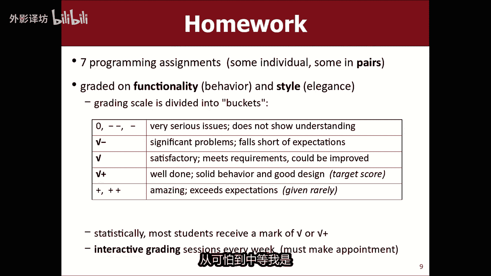

我要跳了，让我们看看我的第二组幻灯片。

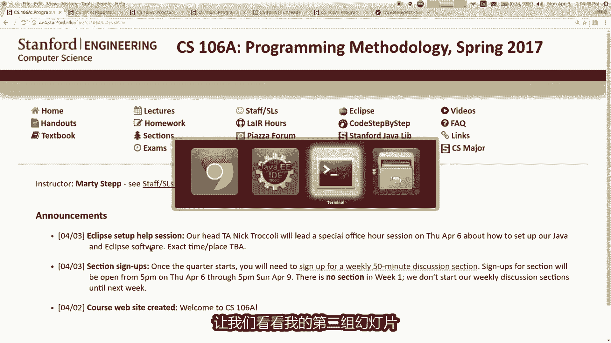

你能在这个职业中得到什么，知道了，让我们来谈谈编程吧，你会减少一些阅读量，今天去打开机器人阅读器，卡罗尔网站或声音形式，以及看看该读物的第一章和第二章，那么什么是编程，是一组计算机指令执行。

我们谈到执行程序或运行一个程序，一旦你写了一些你就会做的事情，您将执行他们的指令，计算机理解二进制语言，你想要的就是电脑执行，我们不理解二进制，所以我们使用所谓的我们所在的编程语言，用英语写一组说明。

或大部分是英语，带有一些符号和，然后计算机将其翻译成二进制命令，以便它可以运行程序，那么程序是什么语言很好，有很多，这些年来你可能已经听说过，其中一些，C和java以及帕斯卡和所有这些不同的语言。

语言已被设计多年来，出于不同目的，有些是为教学而设计的，有些是设计用于编写一个软件与硬件紧密相连，例如操作系统或设备驱动程序，存储或类似的东西，一些软件是为以下事务而编写的。

像JAVASCRIPT一样更贴近用户，罗伯茨教授实用的语言，谈论的目的是为了工作，他们的设计方式是为了在网络上工作，浏览器和网页的语言，我们将在我们的班级中学习，java是一种令人困惑的语言。

其他类称为JAVASCRIPT，它们的名字相似，但没有有任何共同点，它们字面上命名为JAVASCRIPT，JAVASCRIPT意为他们想要迷惑人们，让他们走学习JAVASCRIPT而不是工作。

这就是他们这么称呼他的原因，他们彼此没有任何关系，就像你曾经出国一样，看起来像可乐，可口可乐，他就像他们试图欺骗的假可乐米，然后是同样的标志和东西，像这样就可以了，我们正在做的语言工作已经开始。

1995年，他是为嵌入式而构建的，它实际上应该在的设备，像烤面包机或微波炉，或一点RUA真空吸尘器或类似的东西，但是多年来他的演变，我的意思是，我们讨论了如何，这课程的其他语言更多喜欢未来。

但是黑语言我们今天学习的仍然是其中之一，世界上最流行的语言之一，在工作方面列出最多的发帖，它仍然是一个非常合法的，当今重要的编程语言，在各种不同的设备上运行和平台，所以我们要学习运行在特定的环境。

java语言，它被称为TM机器人环境，有点你可以在其中编写程序的世界那种，有一个二维集合里面的人物，实际上是由一位教授在七天内创建，斯坦福大学，命名为理查德帕迪斯，他是以剧作家卡尔的名字命名。

乔佩克JPG发明了机器人一词，所以这就是以他的名字命名的，卡尔机器人是一个学习的教学环境，关于编程，纳什自从其实年代我们仍然喜欢这里，斯坦福大学和你可能有多少，今天之前听说过机器人卡罗尔，是的。

如果你们有一些极客的话，你宿舍里的朋友谈论卡罗尔，所以如果你看到我，你就开始做某事，愚蠢的标志，在我的某个地方跑来跑去，认识你们，这就是我们要做的，本周这只是一个小小的二维世界，一些四处走动的小家伙。

我们将学习如何编写程序，那个世界是我们的交通工具，了解编程，所以当你跑步时，机器人卡尔给了一点程序，世界看起来像这样，以下是其中的一些要素，发生在卡尔身上的世界，机器人中有行和列，世界是一个不同的网格。

有时我们称之为小地点，街道行或列和大道，坦白说我把他们搞混了，我称之为行和列，但这些是术语，这个世界意味着有一个人，每行列交点处的正方形，因为有时称之为角落为，有时称其为位置或广场或类似的东西。

这些都是地方机器人，卡尔可以走，所以有这个世界上的墙壁有点像吃豆人，是你无法穿越的墙壁，如果你触摸墙壁不好，或者你可以触摸你刚刚的墙壁，无法尝试穿过你的墙，知道卡拉机器人就是那个小家伙，就在那里。

位置依旧是你的小角色，是这样的，在这个世界上，你无法控制它，穿过你必须避免的墙壁，墙上有这些小钻石，世界上那些被称为的事物，蜂鸣器，你可以拿起这些蜂鸣器移动并放下它们，有时有卡尔机器人程序。

包括尝试解决问题，就像哦这里有一些蜂鸣器，我想把它们捡起来，我想把它们移到那里，然后写一个程序，那会做你正在写的机器人的指令，将执行以下任务，机器人来执行，这就是我们的任务，会这样做，你可以选择蜂鸣器。

把他们举起来，你可以把它们放下好吗，有一些命令可以投掷机器人执行，有一个命令保持移动，如果你告诉卡拉移动，卡罗尔移动了一个正方形，在他面对的位置，如果你看到他移动，他就会像那样走，他说再搬家。

他就会搬家，下次好，这是第一次，如果有地话，命令移动非常简单，墙壁挡住了你的路，你试图移动程序停止，因为你不能这样做，这是一个错误，工作顺利，所以这是第一个搬到那里的人，我搬了四次了。

现在还有名为左转的命令，左转将carol的方向旋转90度逆时针，所以如果你说转动佐卡尔会哎呀哇，那个动画看起来不对，但转弯朝上，所以逆时针旋转动画，我不知道我的动画不起作用，但是你知道你左转往那边走。

再次左转，将面朝下左转，再次面向右或向左，或者再次面对，我不知道为什么动画看起来不错，但无论如何，逆时针左转90度，有一件事有点有趣，关于这个世界，如果他注定如此，极简主义所需命令最少没有转动的命令。

是的，我认为这里有一些笑话，就像纳斯卡一样，不是吗，向左转，我不知道，这不是出生下一辆车，那是一项服务，更多的是伯克利的事情，我不知道，但是不管怎样，一开始我只是在开玩笑，很酷嗯，没有右转命令。

所以如果你想右转怎么办，你有什么想法，轮到三四，这相当于右转，不是是的，所以你可能会说，那就是完成了，为什么我要翻三遍，如果我可以右转好吧，我同意，但这是一个有趣的原则，有时在国界中计算，如果是的话。

有限的工具集可以解决所有问题，有一种完全有效的方法可以做到这一点，即使您缺少您希望的工具，还好吧，所以你不能右转，你可以向左转，威胁他已经死了，所以如果我打赌，除了左转命令，移动命令。

另一个命令我会搬家一次，所以现在我会站在有蜂鸣器的地方，没问题，还有一个命令叫pig，如果您执行回来，则发出此命令的蜂鸣声，命令他会听到一个蜂鸣器，位于卡罗尔站立的地方，所以如果我站在那里。

我说黑卡罗尔如果出现以下情况，T风名气将被接替，你尝试发烧，但没有你所在的任何人，一个程序来确定不存在蜂鸣器在那里好吗，如果卡罗尔在现在就开始接人，从技术上讲将其保留在更深处，你在屏幕上看不到他的。

但他拿着那个传呼机，所以你可以去别的地方走走，就可以放下蜂鸣器，这叫放比伯，所以也许我向左转，然后移动，然后我说这是我想放的地方蜂鸣器，所以我要用蜂鸣器命令就在那里，现在蜂鸣器被放在那个地方。

世界上好吧，我们走吧，到目前为止，一切都有意义，关于机器人卡罗尔的问题是到，就这样几个咒语，包括大写小写PUT，首都必不飞，我带你进去，一会儿，这些程序很挑剔，如果你即使稍有错误，也不会工作。

和很多学生说，天打为什么这么挑剔吗，为什么一定要这样，这样我就诚实的告诉他们，如果我们学会如何解决工作保障问题，做所有这些挑剔的废话，没有其他人知道我们将如何致富，我们要打造弯曲。

但是这实际上并不是他如此挑剔的原因，但黑这是他好的一面，您可以发出的命令皮埃罗，所以你可能会说我在哪里输入这些命令，我该怎么做，承诺我要做什么。

如果你在eclipse中，请记住这一点，我们应该做的软件eclipse在eclipse中工作。

你可以输入这些命令，写入文件，我会告诉你现在你如何做到这一点，这就是卡罗尔的实际程序，看起来像这样，让我在幻灯片上澄清很多，有时我会给你看一些，这就像这些是java指令，你可以告诉我的指示。

当我在幻灯片上向您展示java，我将使用这个一种宽打字机字体，字母和你知道的东西，但是如果我想让你填补一部分，在你自己的事情上，我会用它有点倾斜的斜体粗体字体，所以如果他说公共类名扩展了卡罗尔。

你必须如何写那部分已写但未写的部分需要，我实际上希望你写，我要你给我写个名字，那里有东西，所以这是一个占位符，你知道，所以你写一个胡萝卜程序，你基本上复制这个模板。

并将其放入您的eclipse中的一个文件中，其名称以后缀点java结尾，所以让我快点告诉你。

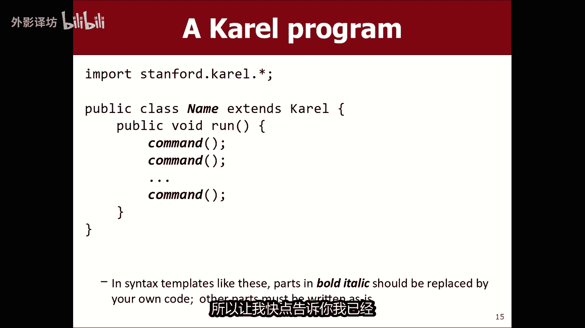

我已经我的悬崖项目中有一个文件，我在这里将向您展示更多有关详细信息，我在周三的讲座中看到了日食，我的eclipse已经准备好了，今天就开始吧，我这里有一个文件名为认识卡罗尔，在那个文件中我有这些内容。

这是模板的一种，对于一个显示名称的程序，我写的遇见卡罗尔足以，基本上这是我的程序名称，我的程序名称，程序遇到卡罗尔，然后你说运行，你说公共无效运行，和其中之一关于计算的不幸的事情。

编程是为了向学生展示事情，就像是很少的一切，这些词的意思是重要的，什么是公开的，我什么是班级聚会，我会教你所有这些事情很严重，但如果你能给我一些，我只是需要向你展示一下，这是一个模板。

然后我们会从那里向外扩展这个想法，不过你总会有一个模板，看起来像这样，在中间该模板就在这里，我的光标在闪烁，那就是我所在的位置，准备写命令给卡罗尔，所以如果你稍等一下，就会发现顶部有一个小按钮。

屏幕上显示运行，所以如果我点击它按钮，它很好地说明了你想要什么节目跑步，所以我会说我想举办比赛，卡罗尔程序当我运行它时，弹出一个与卡罗尔一起的小世界，机器人很酷，我就在那里，如果我说开始。

他说程序已完成运行，因为你没有告诉卡罗尔做任何事，所以他刚刚启动并停止了，程序已经完成了，但是我教的那些命令，一分钟前我可以输入这些命令在这里并执行，他们会让卡罗尔做那些事。

所以我告诉你有一个命令称为move，所以您现在在此处输入move，你会注意到它有红色下划线，因此如果您使用word或google文档，您知道事实就像箭头拼写一样。

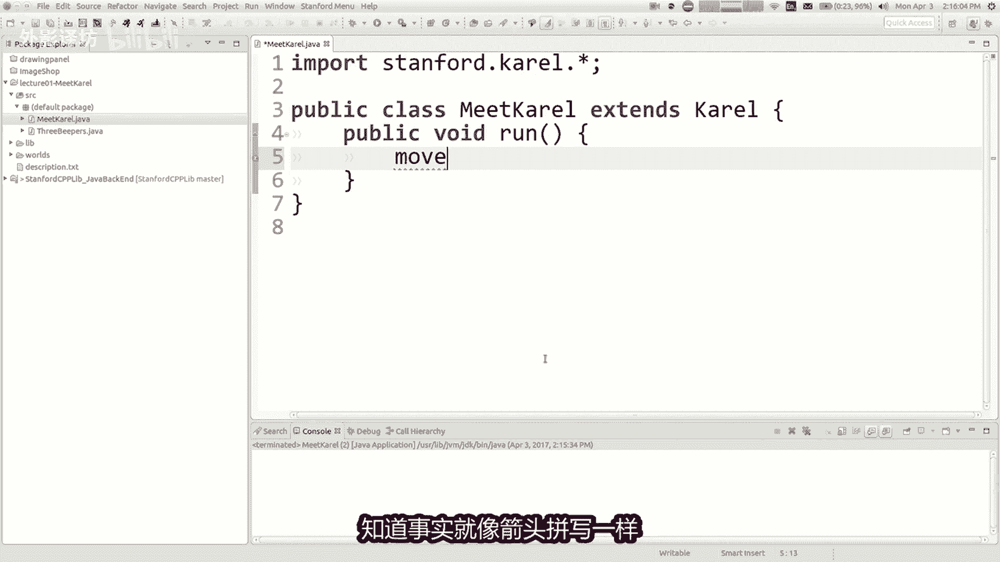

错误是错误的，这样没关系，命令称为移动，但在程序中你写下命令的名称，并，然后你写两个括号和一个之后的分号是必要的，每个人后面的后缀，您向corona机器人发出的命令，我知道你说的很好，我为什么要这样做。

必须做，我告诉过你的工作安全，这就是为什么这足矣，按照java语言的工作方式进行操作。

我会告诉你为什么这些小当我们前进时，符号需要存在，但如果你说移动括号，括号分号你注意到红色了，事情消失了，你可以发出一个序列命令move，我写了两次move，如果我再次运行程序，卡罗尔机器人。

如果我说启动程序将移动则会弹出，然后它完成运行，所以我写下未能执行的一组步骤，然后当我说跑法老就可以了，这些步骤，但我必须把它们全部写下来，基本上提前下来，所以想象一下，我正在运行这个遇见卡罗尔计划。

我想让卡罗尔带着这个家伙把它移到这里，哎呀我的标记没有工作，我想让卡罗尔拿起这个寻呼机到这里，把它放进去，就在那里，你明白吗，告诉我哎呀，我想知道什么，我需要输入命令才能让卡罗尔执行。

所以我已经得到了我想要的移动，自愿给我四个命令，接下来我应该给卡罗尔，艾尔米亚班上的某个人嗯，看到我呼唤你，让我看到我得到，我在后面打电话给其他人，紫色是的好的，移动移动，选择更深的左转好吧。

我们开始吧，移动移动选择B左转，他就走了，有点快，你可以调整速度，如果如果你真的想看的话，你想要以不同的速度好吧，所以我接了起来，报纸和我向左转好吧，有人再给我四个命令，遵循我们已经有四个的。

通常会失去视的移动，然后转身，向左转三圈，将其向右好的，所以你想搬到这里，然后转向那个方向，很好好吧，我们来试试吧，移动向左转，你想做的事向左转，复制粘贴三遍，好的太好了。

所以你我知道我认为写一部分是可以的，一个程序，然后运行它，看看进展如何，我的目标就在那里，我想把蜂鸣器放在这里，有人再给我四个命令，我想也许可以完成这个程序的作业，一分钟式的一动一动一动翻转蜂鸣器。

我们来试试吧，一动一动哎呀，分号移动蜂鸣器。

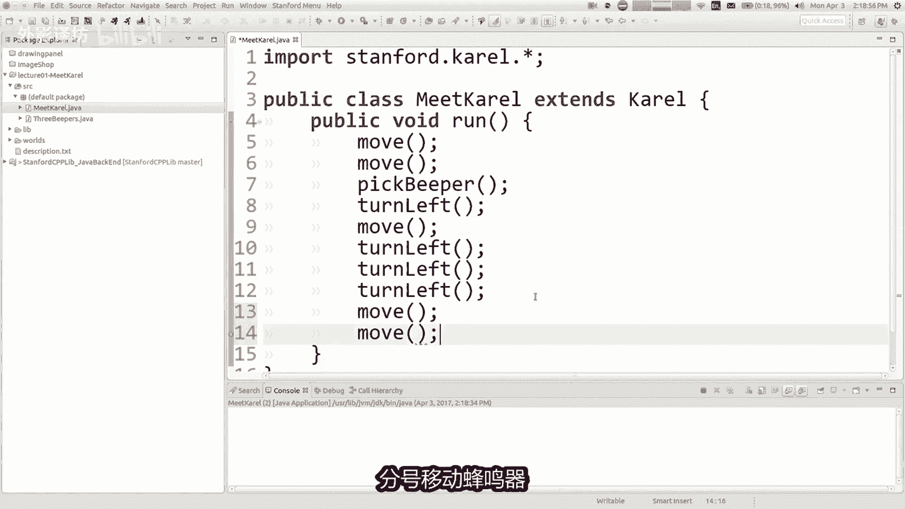

好吧，让我们一起吧，哦不我关上了悬崖哦。

哦我按错了键，请稍等，完全编辑这部分没有人会知道的视频，不要告诉你的朋友，别告诉他们哦，好吧，我，重新加载eclipse，让我们再次尝试运行，会见卡罗尔计划已经准备好，看看我们是否得到了它，我们做到了。

让我们，摆脱手是的，所以我要，这是我的建议，从现在到周三，如果您是很好，你有时间去所有的剪辑安装说明，看看你是否如果可以的话，可以得到一个剪辑设置，eclipse运行，这里是一个练习。

你可能想要解决的问题。

在我们幻灯片的末尾，今天我们讲座的最后一张幻灯片，三个共鸣器，看看你是否可以写一个程序，有问题，很好的挑战，可选的挑战给你。

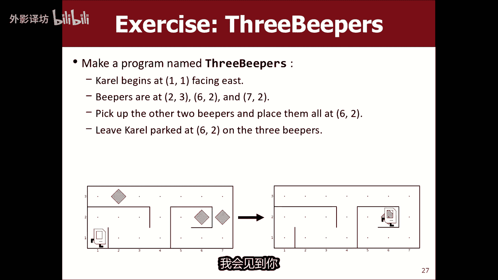