# 课程01：认识Karel与编程基础 🚀

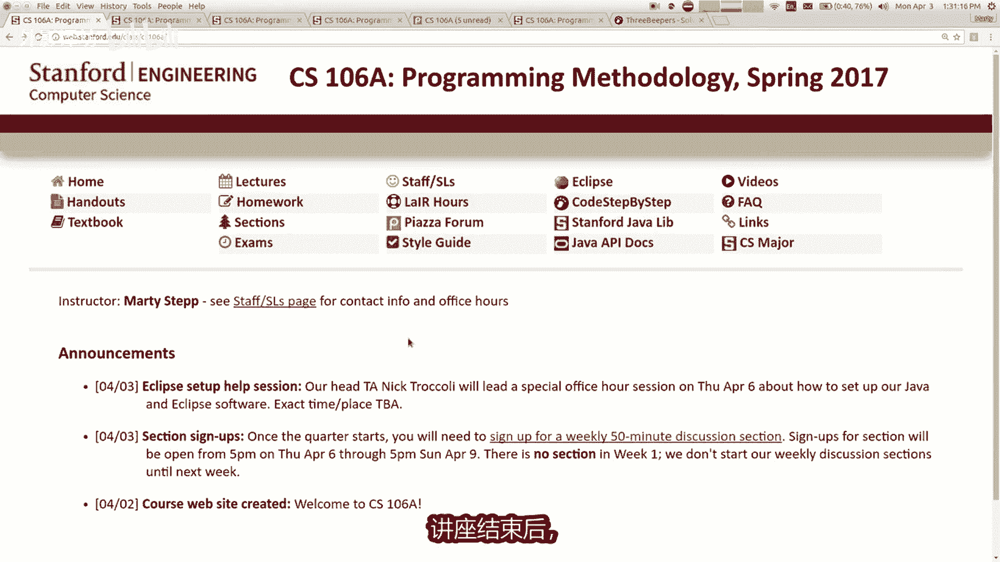


在本节课中，我们将学习计算机科学导论课程CS106A的基本信息、课程结构，并初步接触编程。我们将通过一个名为Karel的机器人环境，学习如何编写简单的指令来控制机器人完成任务。

---

## 课程概述与人员介绍

我是Marty Stepp，这门课的讲师。你可以叫我Marty。我的助教是Nick，他将协助处理课程的后勤与问题。此外，我们还有一组本科生担任“部分负责人”，他们将在每周的小组讨论中带领大家练习，并在实验室提供帮助、批改作业。


这门课是**编程方法论**，是计算机科学与编程的入门课程。我们将使用Java语言编写软件。本课程不要求任何编程经验，如果你知道如何打开电脑并使用浏览器，你就已经准备好了。

---

## 课程选择与替代方案

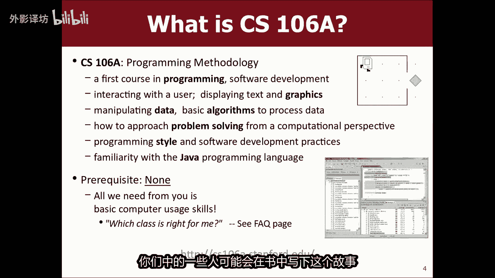

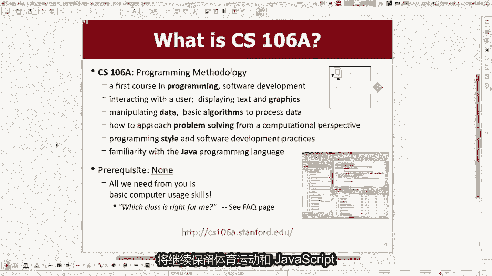


如果你不确定自己是否应该选择CS106A，可以参考课程网页上的常见问题解答。对于已有一些编程经验的学生，可以考虑CS106P课程。此外，本学期还提供了一个实验性的替代课程CS106G，它使用不同的编程语言（JavaScript），专注于网络开发。如果你对这些选项感兴趣，可以联系相关讲师了解更多信息。

---

## 什么是计算机科学？


计算机科学是研究**算法**的学科。算法是解决问题的一系列有序步骤或指令。计算机科学包含许多子领域，如人工智能、图形学、机器人学、数据挖掘等。如今，计算机科学几乎影响着所有领域，从医学到生物科学，强大的计算能力和算法技能都至关重要。

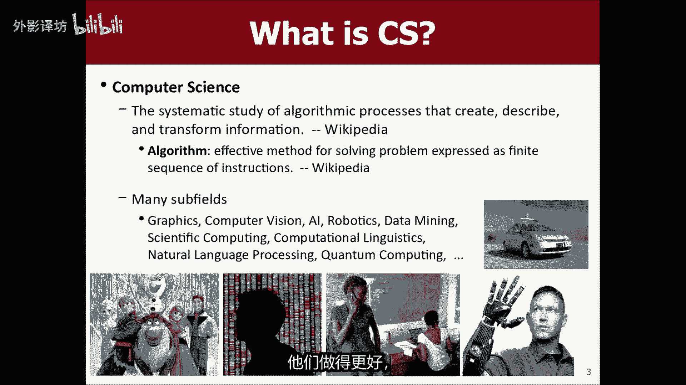


---


## 课程政策与评分

以下是本课程的主要政策与评分构成：

*   **作业 (40%)**：你将编写程序并在电脑上运行，然后在线提交。作业将由部分负责人评分。
*   **参与 (5%)**：这取决于你在每周讨论部分中的参与度。
*   **考试 (55%)**：本学期有两次考试。请务必记下考试日期，补考政策非常严格。

关于评分等级，课程结束后会根据分数百分比进行排序。通常，排名前40-50%的学生可以获得A或A-，接下来的30%左右获得B，其余获得C或更低。在实践中，实际成绩通常比这些百分比更好。

---

## 教材与资源

课程教材是Eric Roberts教授编写的《The Art and Science of Java》。虽然作业不强制要求教材，但它是一个极佳的参考资料，并且考试时允许携带此书。此外，第一周我们将使用一本较短的在线免费书籍《Karel the Robot Learns Java》。

---

## 作业、合作与学术诚信

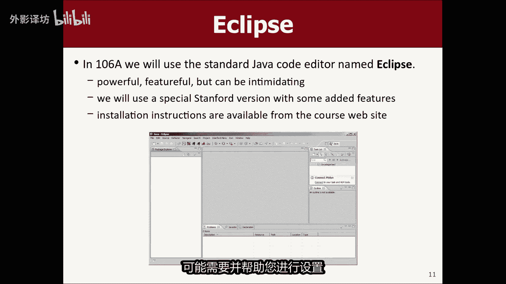

本课程大约有七次作业。第一次作业需要独立完成，之后的作业可以两人合作完成（结对编程）。作业评分分为**功能**（程序是否完成任务）和**风格**（代码是否优雅、易读）。

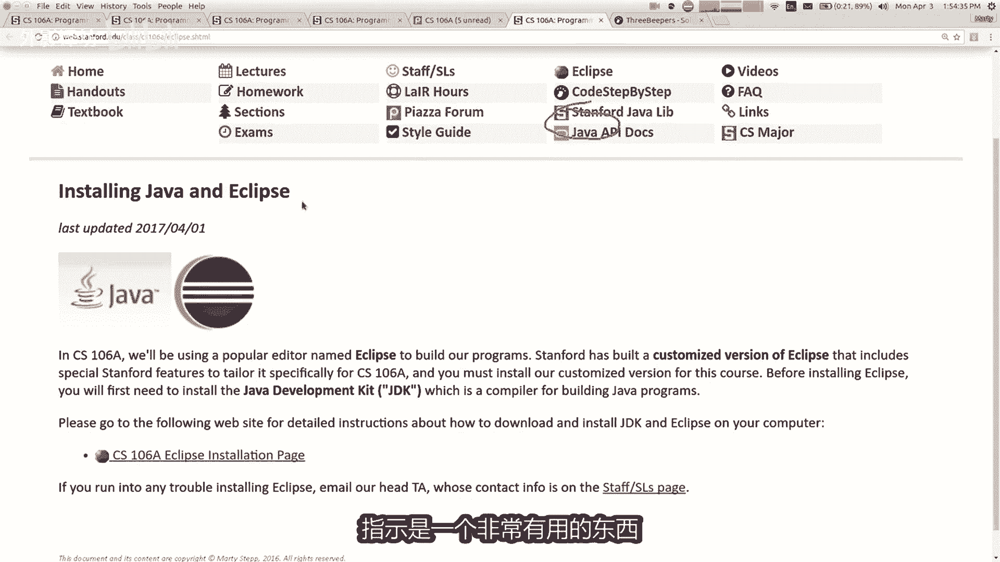

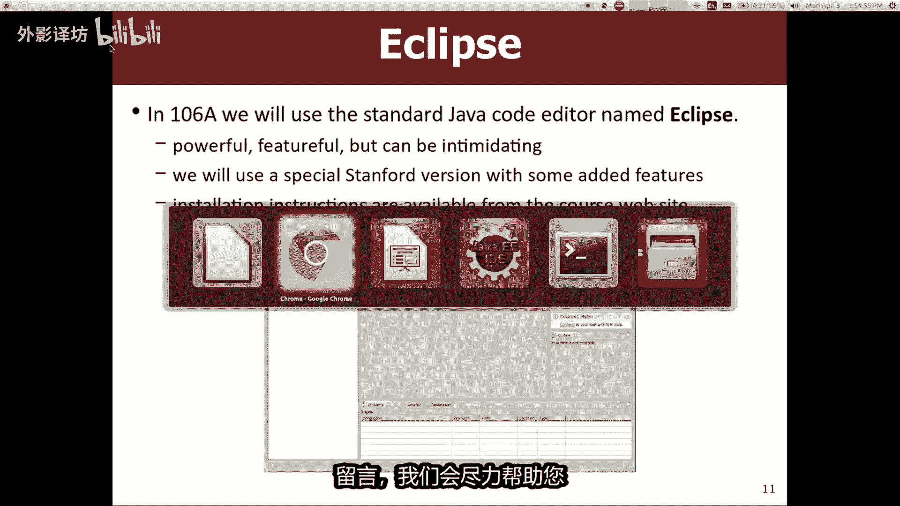

我们使用强大的软件检查提交的作业是否存在抄袭。**严禁**复制他人的代码或从互联网上搜索解决方案。如果你遇到困难，请向助教、部分负责人或我寻求帮助，而不是寻找现成的答案。


---

## 软件安装与获取帮助

我们需要使用**Eclipse**软件来编写Java程序。请务必按照课程网站上的专用说明安装斯坦福定制版本的Eclipse，不要自行从网络下载通用版本。

如果你在安装或学习中遇到困难，我们提供了多种帮助渠道：
*   **LaIR帮助实验室**：晚上开放的实验室，有工作人员提供帮助。
*   **课程论坛**：可以在线提问。
*   **办公时间**：我和Nick会定期安排办公时间。
*   **电子邮件**：随时可以联系我们。

---

## 什么是编程？

编程是给计算机一系列指令让其执行的过程。计算机理解二进制语言，而我们使用**编程语言**（如Java）来编写人类可读的指令，再由计算机翻译成二进制。

Java语言诞生于1995年，至今仍是世界上最流行、最重要的编程语言之一。本课程将在一个名为**Karel the Robot**的教学环境中开始学习Java。这是一个二维网格世界，我们可以编写程序控制一个名为Karel的机器人移动、转向、拾取和放置“蜂鸣器”。

---


## 开始编程：认识Karel

在Karel的世界里，我们可以发出几个基本命令：
*   `move();` - Karel向前移动一格。
*   `turnLeft();` - Karel向左转90度。
*   `pickBeeper();` - Karel拾起当前位置的一个蜂鸣器。
*   `putBeeper();` - Karel放下一个蜂鸣器到当前位置。

注意：没有`turnRight();`命令。如果你想右转，可以通过三次`turnLeft();`来实现。

---

## 编写你的第一个Karel程序

在Eclipse中，一个基本的Karel程序模板如下：

```java
public class MeetKarel extends Karel {
    public void run() {
        // 在这里写下你的命令
        move();
        move();
        pickBeeper();
        turnLeft();
        // ... 更多命令
    }
}
```

你需要将`MeetKarel`替换为你自己的程序名。在`run()`方法的大括号`{}`内，按顺序写下给Karel的命令。每个命令后都必须加上分号`;`。

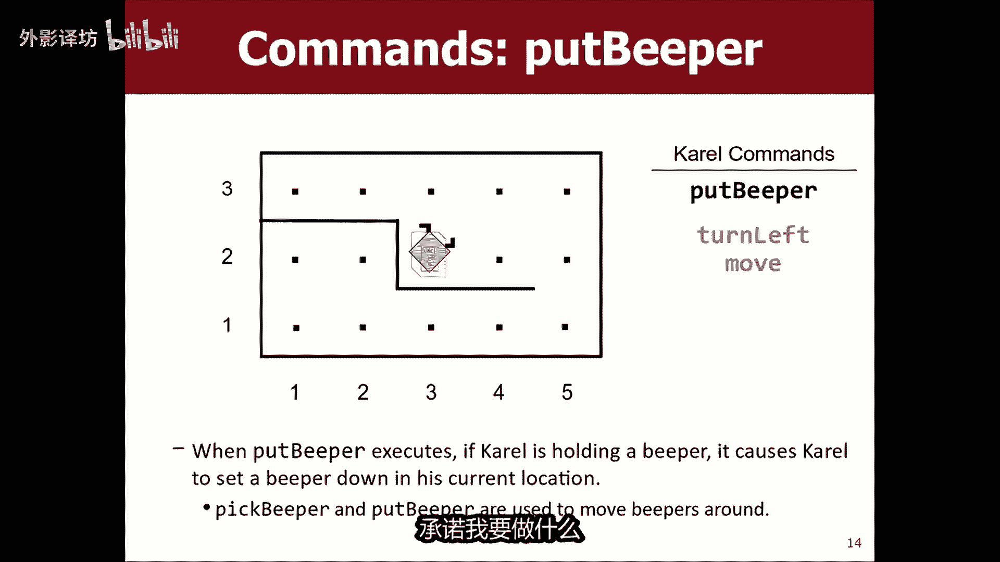


例如，要让Karel移动两次，程序如下：


```java
public class MoveTwice extends Karel {
    public void run() {
        move();
        move();
    }
}
```

编写完成后，点击Eclipse中的“Run”按钮，Karel的世界就会出现并执行你的指令。


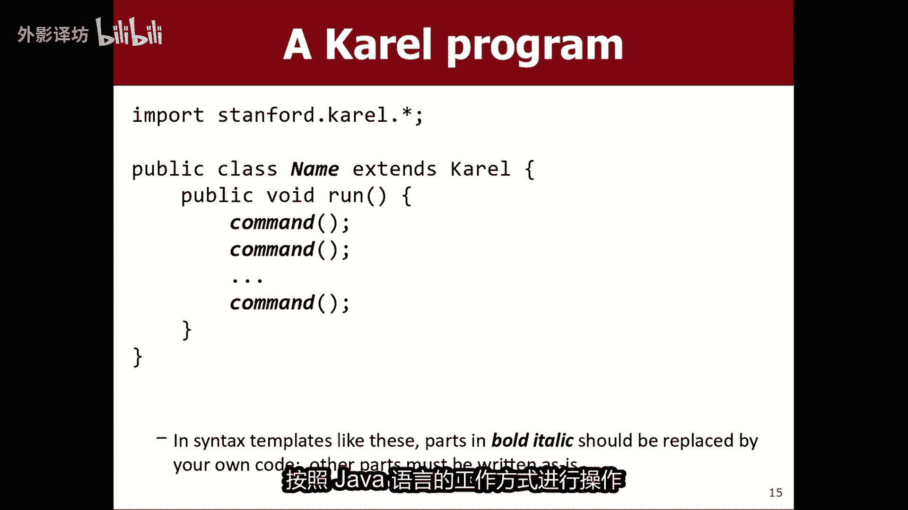

---

## 本节总结


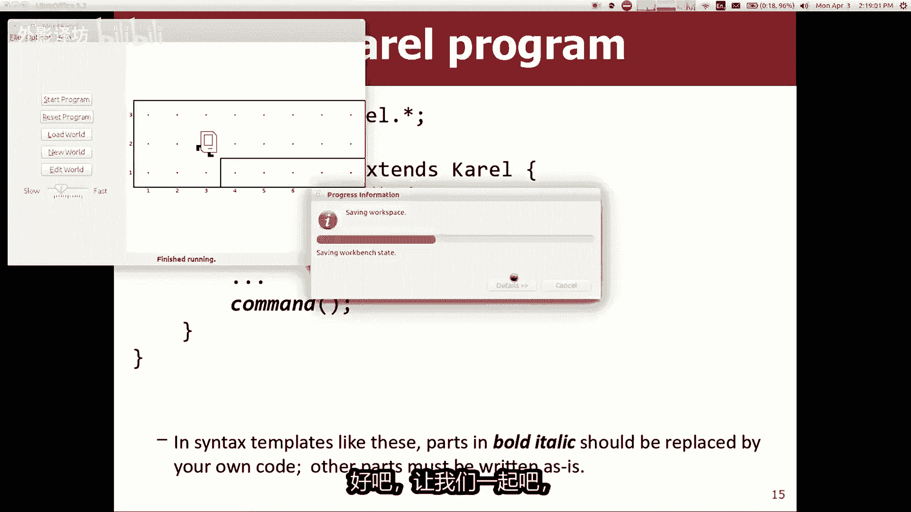

本节课中，我们一起学习了CS106A课程的基本框架、政策与资源。我们探讨了什么是计算机科学和编程，并初次接触了Java编程环境。通过Karel机器人，我们学会了如何发出`move()`、`turnLeft()`等基本命令来控制一个虚拟角色。这是你编程之旅的第一步，重点是理解如何将任务分解为计算机可以执行的一系列简单指令。

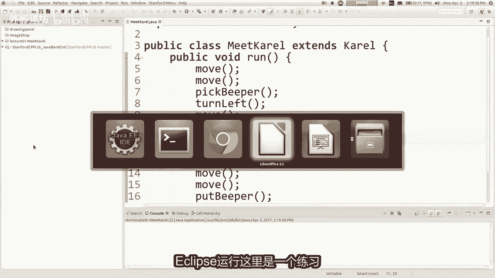


**课后挑战（可选）**：尝试安装Eclipse，并编写一个程序，让Karel机器人完成拾取三个蜂鸣器的任务。