# 课程10：文件处理 📂


在本节课中，我们将学习Java中文件处理的基础知识。我们将了解如何从文件中读取数据，这是编写能够处理真实世界数据的程序的关键一步。课程内容包括字符与字符串的区别、使用`Scanner`对象读取文件、处理文件读取时可能出现的异常，以及通过实际例子（如计算温度变化和分析选举数据）来巩固这些概念。

---


## 字符与字符串 🔤

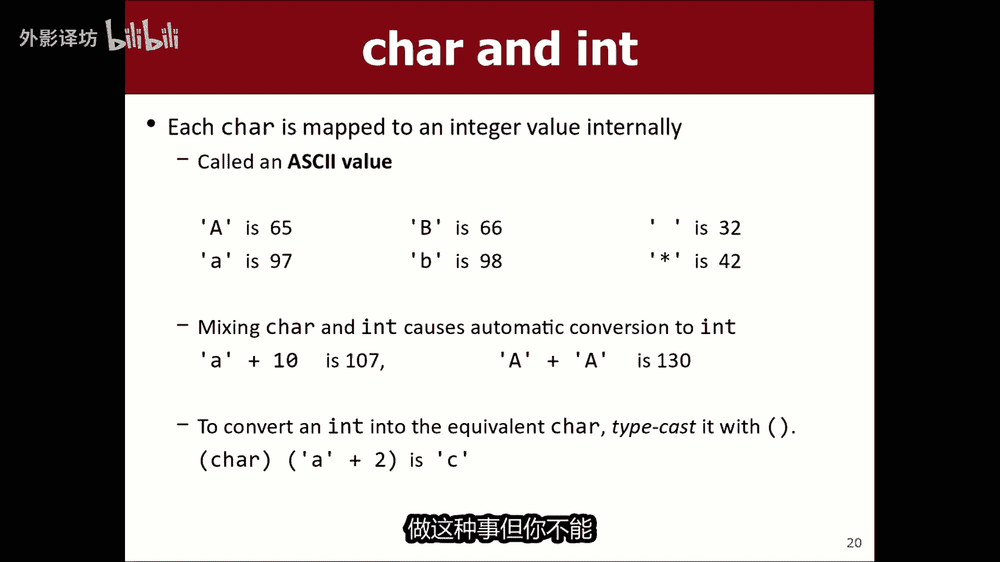

上一节我们介绍了文件处理的重要性，本节中我们来看看处理文本数据时两个核心概念的区别：字符（`char`）和字符串（`String`）。

*   **`char`** 代表单个字符，使用单引号声明，例如：`char letter = 'A';`。
*   **`String`** 代表一系列字符的集合，使用双引号声明，例如：`String word = "Hello";`。

它们之间一个关键区别是，`char`值在内部以整数形式存储，因此你可以对其进行算术运算。例如，将字符`'A'`加1会得到字符`'B'`。

```java
char ch = 'A';
ch++; // 现在 ch 的值是 'B'
```

而字符串的`+`操作是连接（拼接），不是数值加法。

```java
String str = "A";
str = str + 1; // 现在 str 的值是 "A1"，而不是 "B"
```

---

## 凯撒密码示例 🔐

理解了字符的基本操作后，我们可以利用它来构建一个简单的加密程序——凯撒密码。其核心思想是将消息中的每个字母在字母表中移动固定的位数（称为密钥）。

以下是实现凯撒密码编码方法的步骤：

1.  提示用户输入消息和移位密钥。
2.  遍历消息中的每个字符。
3.  判断字符是否为字母（`'A'`到`'Z'`之间）。
4.  如果是字母，则将其移动密钥指定的位数。
5.  如果移动后超出`'Z'`，则绕回字母表开头（例如，`'Y'`移动5位变成`'D'`）。
6.  将处理后的字符拼接成新的编码字符串。
7.  返回编码后的字符串。

```java
public static String encodeCaesarCipher(String message, int shiftKey) {
    String encoded = "";
    for (int i = 0; i < message.length(); i++) {
        char ch = message.charAt(i);
        if (ch >= 'A' && ch <= 'Z') {
            ch = (char)(ch + shiftKey);
            if (ch > 'Z') {
                ch = (char)(ch - 26); // 绕回字母表开头
            }
        }
        encoded += ch;
    }
    return encoded;
}
```


---

## 文件与对象 📁

现在，让我们进入本节课的核心主题：文件处理。文件是存储数据的持久化载体。在Java中，我们通过“对象”来与文件交互。

对象是程序中的一个实体，它封装了**数据**（状态）和能对这些数据进行的**操作**（方法）。例如，一个`String`对象的数据是字符序列，方法有`.length()`、`.toUpperCase()`等。

要读取文件，我们主要会用到两种对象：

1.  **`File`对象**：代表磁盘上的一个文件。你可以用它检查文件是否存在、获取文件名等。
2.  **`Scanner`对象**：一个通用的数据读取器。我们可以让它从一个`File`对象中读取内容。

使用前需要导入相应的包：

```java
import java.io.*;   // 用于File对象
import java.util.*; // 用于Scanner对象
```

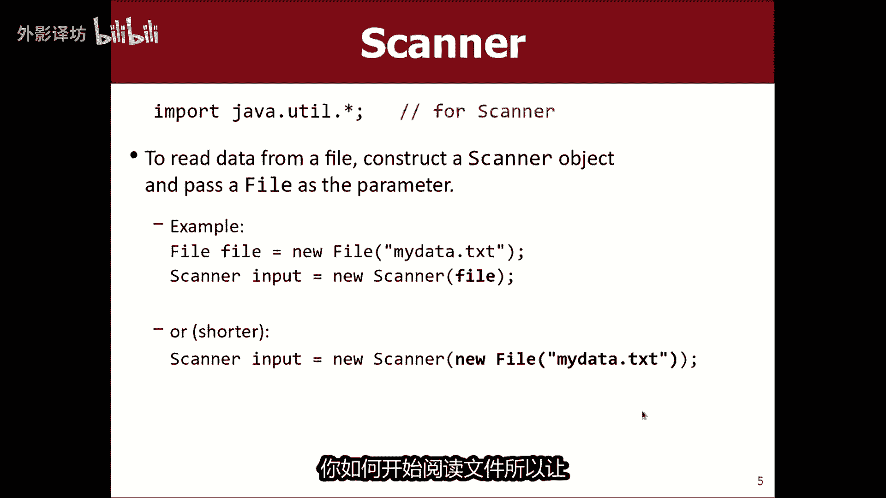

创建并使用它们读取文件的基本模式如下：

```java
File file = new File("res/weather.txt"); // 创建一个指向文件的File对象
Scanner input = new Scanner(file);       // 创建一个从该文件读取数据的Scanner对象
// 现在可以使用 input 来读取文件内容了
```

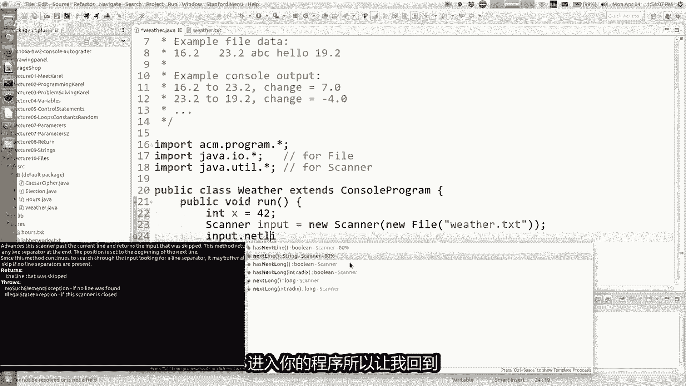

---

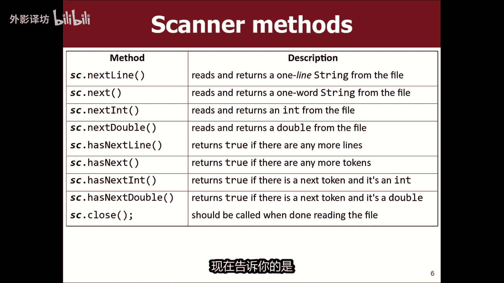

## 读取文件数据 📖

创建了`Scanner`对象后，我们就可以从文件中读取数据了。`Scanner`提供了多种方法来读取不同类型的数据，例如`.nextInt()`、`.nextDouble()`、`.nextLine()`。

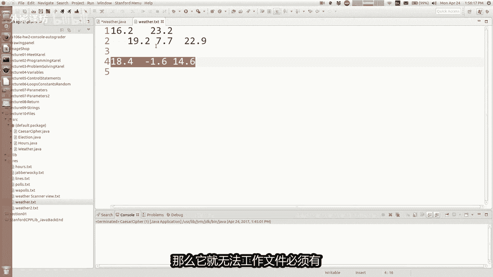

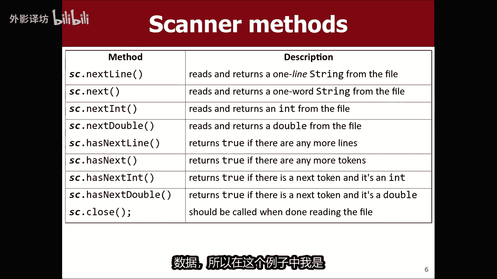

读取文件时，`Scanner`内部有一个“光标”指向当前位置。每次调用读取方法，它都会从光标处读取数据，然后将光标移动到已读取内容之后。

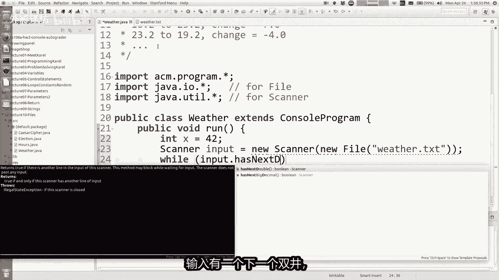

通常，我们不知道文件里有多少数据，所以更常见的做法是使用`while`循环配合`.hasNext...()`方法（如`.hasNextDouble()`）来读取，直到文件末尾。

以下是一个读取文件中所有双精度数字并打印的例子：


```java
while (input.hasNextDouble()) {
    double number = input.nextDouble();
    System.out.println("Number: " + number);
}
```

---

## 处理异常 ⚠️

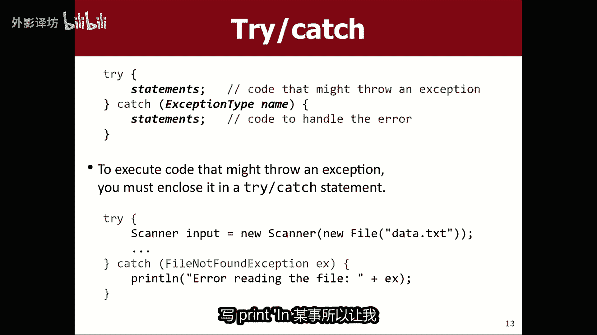

在尝试打开和读取文件时，可能会出错（例如文件不存在）。Java使用“异常”机制来处理这类运行时错误。

当我们编写可能抛出异常的代码时，需要使用`try-catch`语句块。将可能出错的代码放在`try`块中，然后在`catch`块中指定捕获哪种异常并处理它。

对于文件读取，常见的异常是`FileNotFoundException`。

```java
try {
    File file = new File("res/weather.txt");
    Scanner input = new Scanner(file);
    // ... 读取文件的代码
} catch (FileNotFoundException e) {
    System.out.println("文件未找到: " + e.getMessage());
    // 或者进行其他错误处理，如提示用户重新输入文件名
}
```

---

## 实战：分析温度数据 🌡️

让我们应用所学知识，解决一个实际问题：读取一份每日最高温度记录文件，并计算每日的温差。

文件`weather.txt`内容可能如下：
```
16.2
23.2
19.5
...
```


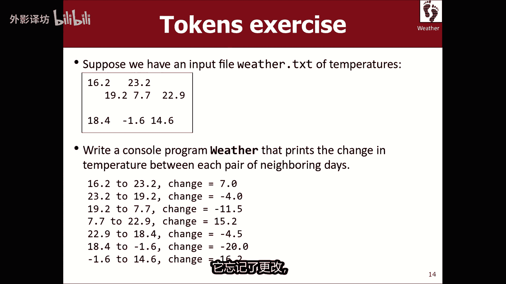

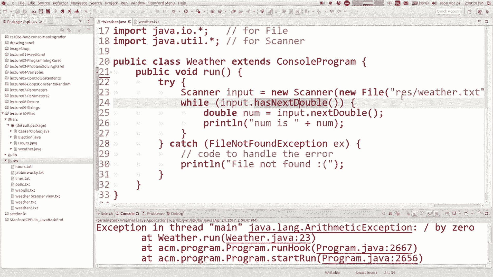

以下是计算温差的程序逻辑要点：

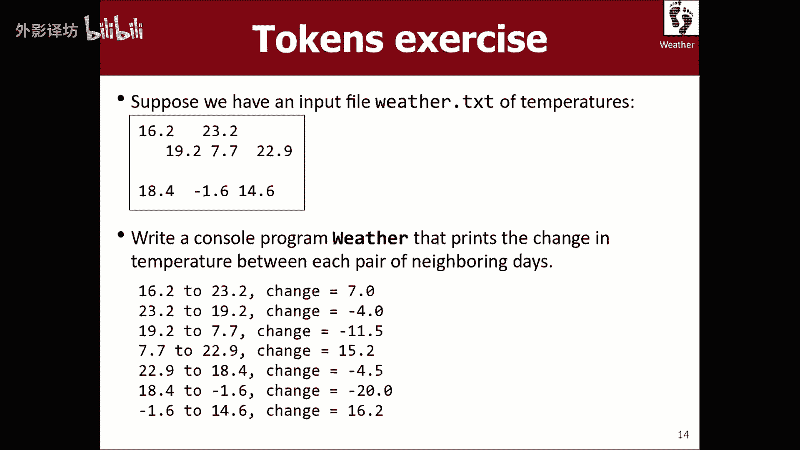

1.  使用`try-catch`打开文件并创建`Scanner`。
2.  首先读取第一个温度值作为基准。
3.  在`while`循环中，读取下一个温度值。
4.  计算当前温度与前一个温度的差值并打印。
5.  将当前温度设为下一个循环的“前一个温度”。


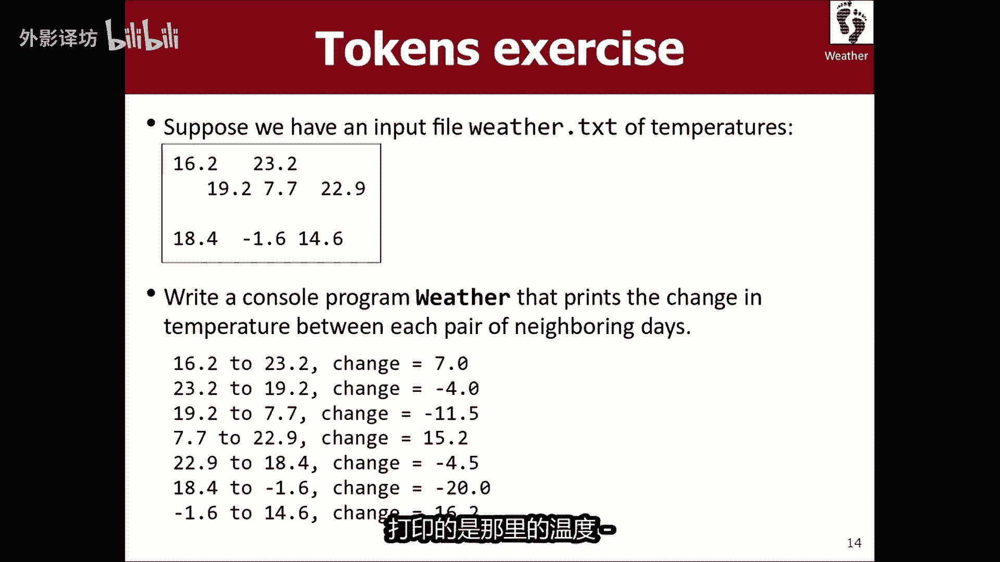

这个模式解决了经典的“栅栏柱”问题，确保我们正确比较连续的数据对。

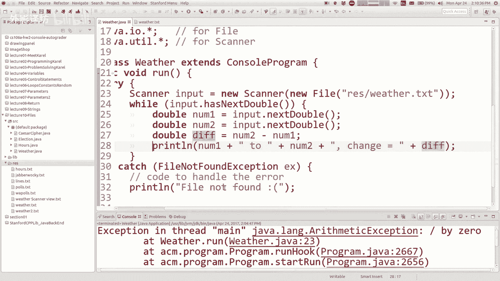


```java
// 假设已成功创建 Scanner input
if (input.hasNextDouble()) {
    double prevTemp = input.nextDouble(); // 读取第一个温度（柱子）
    while (input.hasNextDouble()) {
        double currentTemp = input.nextDouble(); // 读取下一个温度
        double diff = currentTemp - prevTemp;
        System.out.println("温度变化: " + diff);
        prevTemp = currentTemp; // 为下一次比较更新“前一个温度”
    }
}
```

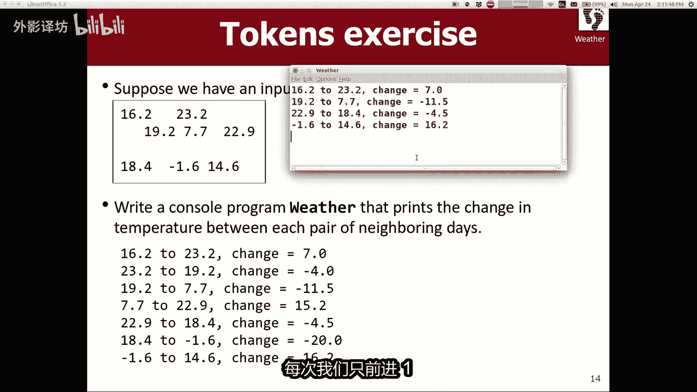

---


## 实战：解析选举数据 🗳️


最后，我们看一个更结构化的数据解析例子。假设有一个选举数据文件`election.txt`，每行格式为：`州代码 候选人1得票率 候选人2得票率 选举人票数`。

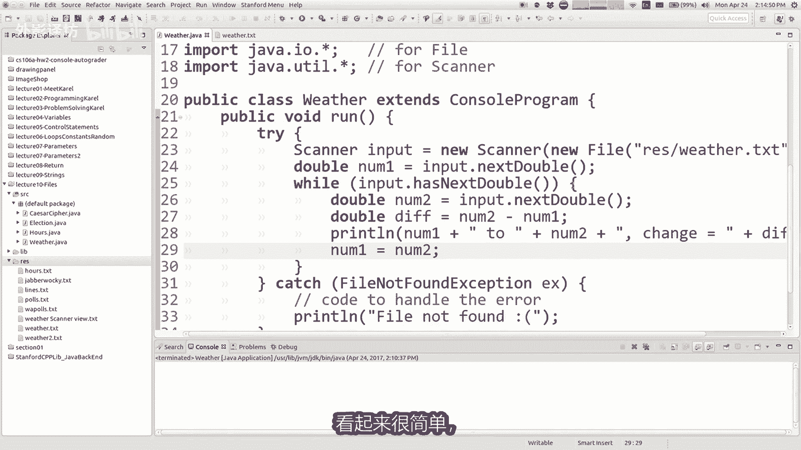

目标：统计两位候选人各自获得的总选举人票数。


处理思路：
1.  使用`while (input.hasNextLine())`逐行读取。
2.  对于每一行，创建一个新的`Scanner`来解析该行内容。
3.  使用`next()`和`nextInt()`方法提取出所需字段。
4.  比较两位候选人的得票率，将本行的选举人票数加到获胜者的总票数中。

```java
int candidate1Votes = 0;
int candidate2Votes = 0;

while (input.hasNextLine()) {
    String line = input.nextLine();
    Scanner lineScanner = new Scanner(line);
    
    String state = lineScanner.next(); // 读取州代码（本例中未使用）
    int votes1 = lineScanner.nextInt();
    int votes2 = lineScanner.nextInt();
    int electoralVotes = lineScanner.nextInt();
    
    if (votes1 > votes2) {
        candidate1Votes += electoralVotes;
    } else {
        candidate2Votes += electoralVotes;
    }
    lineScanner.close(); // 关闭行扫描器
}
// 最后输出 candidate1Votes 和 candidate2Votes
```

---

## 总结 ✨

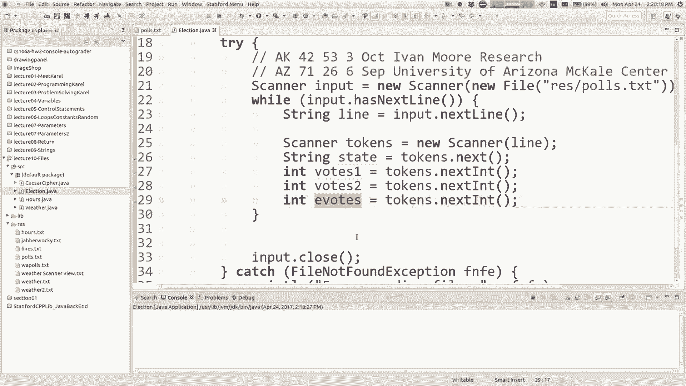

本节课中我们一起学习了Java文件处理的核心知识。我们首先区分了`char`和`String`，并利用字符操作实现了凯撒密码。接着，我们引入了“对象”的概念，并重点学习了如何使用`File`和`Scanner`对象来读取文件中的数据。我们还探讨了如何使用`try-catch`语句处理文件读取中可能出现的异常。最后，通过分析温度变化和解析选举数据两个实战例子，我们巩固了循环读取、数据解析和逻辑处理的能力。掌握文件处理是使程序能够与真实世界数据交互的关键一步。