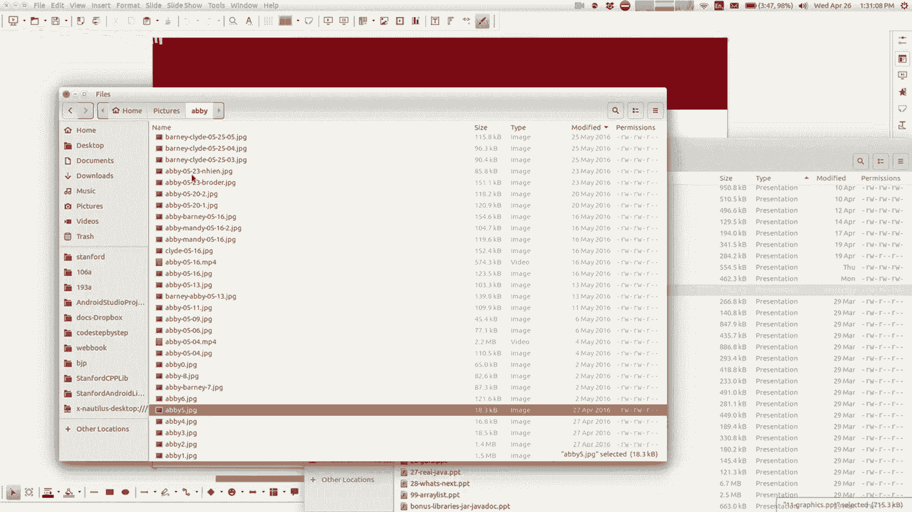

# 课程11：图形入门 🎨

在本节课中，我们将学习如何使用Java进行图形绘制。我们将了解如何创建窗口、绘制基本形状（如矩形、椭圆形和线条）、设置颜色，以及如何通过循环和方法来组织图形代码。课程内容将结合文件处理的知识，并逐步引导你创建自己的图形程序。

---

## 文件处理回顾与图形引入

上一节我们介绍了如何使用`Scanner`处理文件数据。本节中，我们来看看如何将编程的焦点转向图形界面。

在图形编程中，我们不再仅仅在控制台输出文本，而是在一个独立的窗口中绘制形状和颜色。你的第四项作业将是图形化的，这涉及到绘制颜色、形状、线条等元素。

为了在程序中使用图形，你需要扩展一个特定的类并导入必要的库。基本的设置如下：

```java
import acm.graphics.*;
import acm.program.*;
import java.awt.*;

public class MyGraphicsProgram extends GraphicsProgram {
    public void run() {
        // 在这里添加图形绘制代码
    }
}
```

---

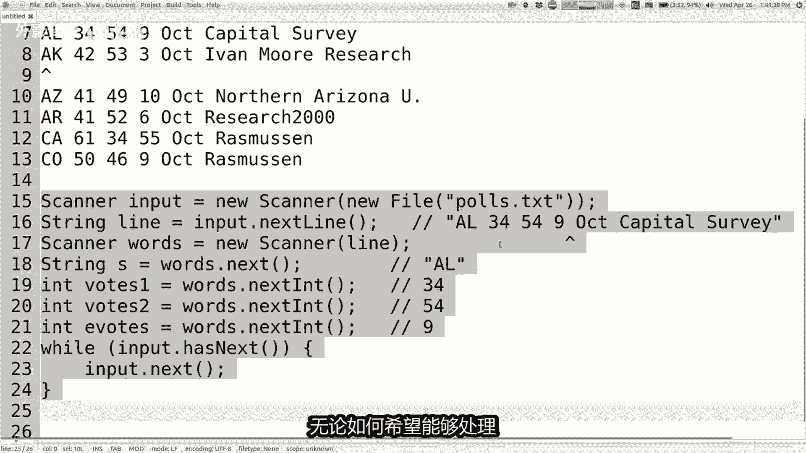

## 理解坐标系统

在屏幕上绘制图形时，我们使用一个基于像素的坐标系统。

*   窗口的左上角是坐标原点 `(0, 0)`。
*   **X坐标**向右移动时增加。
*   **Y坐标**向下移动时增加（这与常见的数学坐标系相反，是因为计算机屏幕的绘制方式是从上到下的）。

窗口的尺寸（宽度和高度）可以自定义，通常设置为数百像素，例如500像素宽，300像素高。

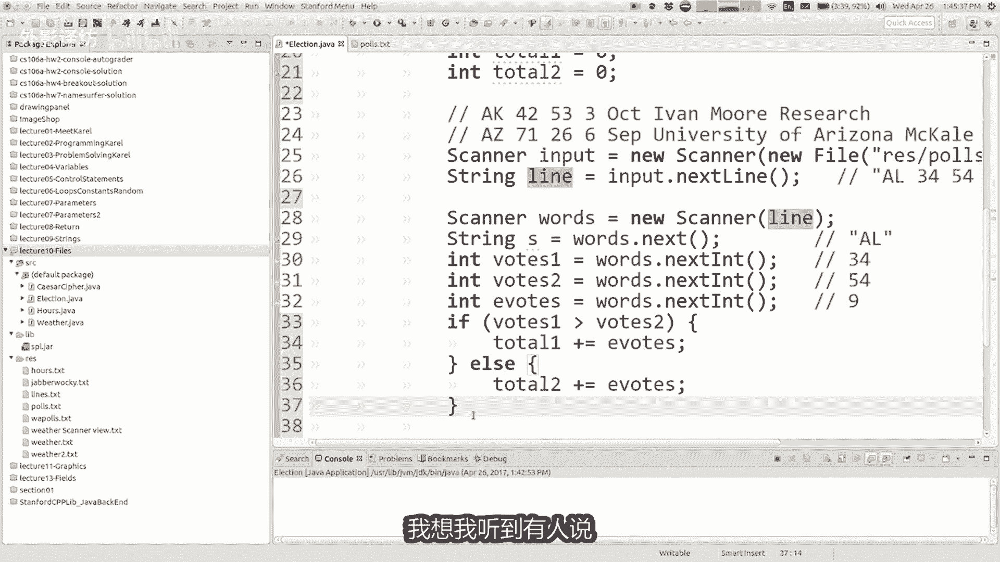


---

## 绘制基本形状

以下是你可以添加到屏幕上的几种基本图形对象：

*   `GRect`：矩形
*   `GOval`：椭圆形（包括圆形）
*   `GLine`：线条
*   `GLabel`：文本标签

创建并添加一个形状到屏幕的语法是类似的。你需要使用 `new` 关键字来创建对象，并指定其位置和尺寸。


例如，绘制一个矩形和一条线的代码如下：

```java
add(new GRect(100, 50, 70, 45)); // 在(100,50)位置，绘制宽70、高45的矩形
add(new GLine(200, 100, 300, 150)); // 从点(200,100)到点(300,150)画一条线
```

**参数含义**：对于`GRect`，参数是**左上角X坐标、左上角Y坐标、宽度、高度**。对于`GLine`，参数是**起点X坐标、起点Y坐标、终点X坐标、终点Y坐标**。

---

## 使用循环绘制图形

你可以结合循环来绘制多个形状。例如，如果你想在一个矩形内绘制10条等间距的水平线（形成阴影效果），可以使用`for`循环。

以下是实现此效果的思路：


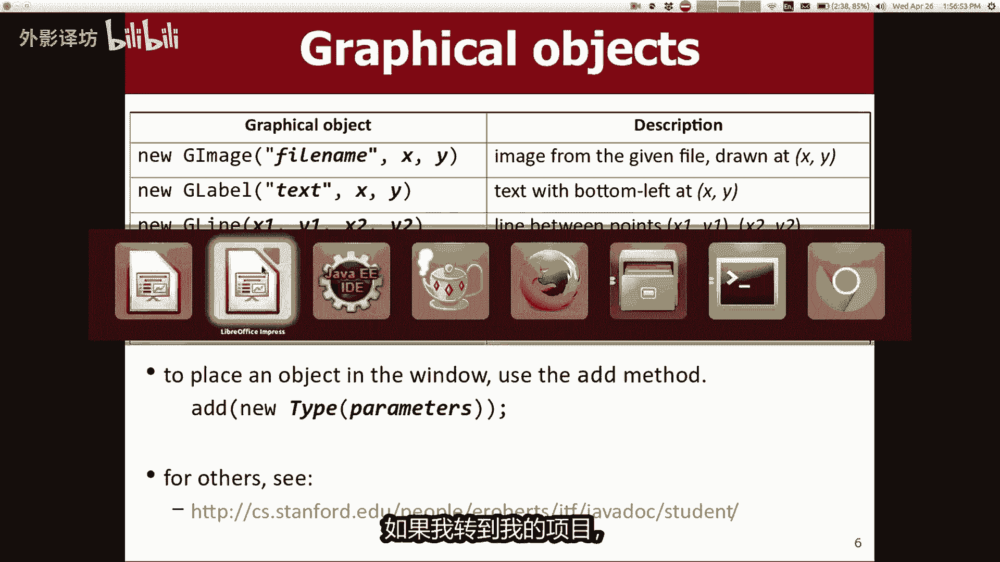

1.  确定矩形的边界（起始Y坐标和高度）。
2.  在循环中，每次计算一条新线的Y坐标。
3.  线的起点和终点的X坐标对应矩形的左右边界。


```java
for (int i = 0; i < 10; i++) {
    int y = 50 + i * 10; // 从Y=50开始，每条线间隔10像素
    add(new GLine(100, y, 170, y)); // 绘制从X=100到X=170的水平线
}
```

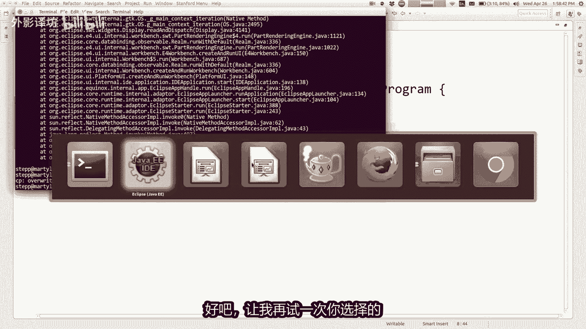

---

## 设置颜色与图形属性

要改变形状的颜色，你不能直接在`add`语句中设置。你需要先创建图形对象，设置其属性，然后再添加它。

设置颜色的基本步骤：

1.  创建一个图形对象（如`GRect`）并赋值给一个变量。
2.  使用该变量调用方法设置颜色（例如`setColor`用于边框色，`setFillColor`用于填充色）。
3.  如果需要填充形状，还需调用`setFilled(true)`。
4.  最后，使用`add`方法将对象添加到窗口。


```java
// 1. 创建矩形对象
GRect myRect = new GRect(100, 50, 70, 45);

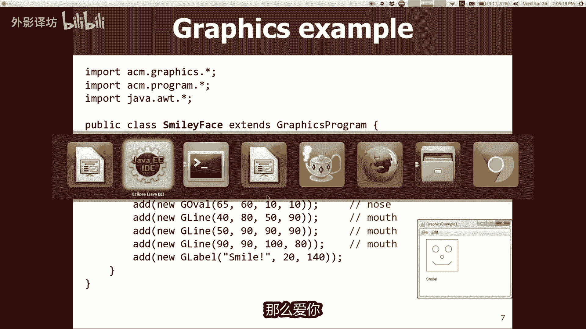


// 2. 设置属性
myRect.setFillColor(Color.RED);
myRect.setFilled(true);
myRect.setColor(Color.GREEN);

// 3. 添加到屏幕
add(myRect);
```

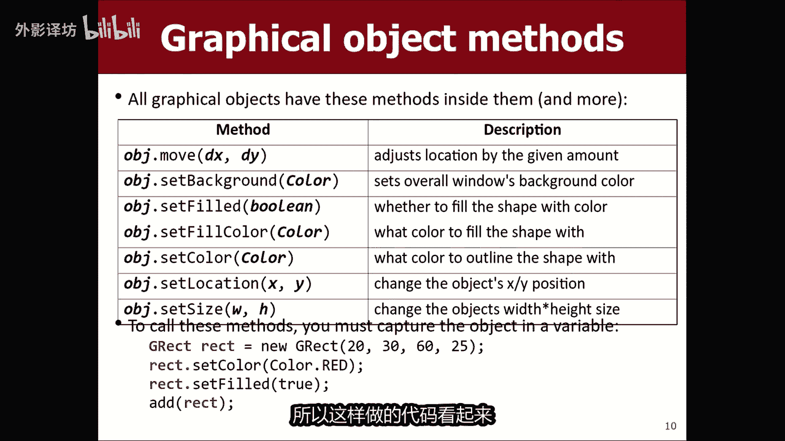

Java提供了一些预定义颜色，如`Color.RED`, `Color.BLUE`等。你也可以通过指定红、绿、蓝（RGB）分量值（每个值范围0-255）来创建自定义颜色。


```java
Color myOrange = new Color(255, 165, 0); // 创建橙色
myRect.setFillColor(myOrange);
```

---


## 创建方法与参数化图形

当你想绘制多个相似但位置或大小不同的图形时，将绘制代码封装到一个方法中是很好的做法。你可以给这个方法添加参数，比如`x`, `y`坐标，来控制图形的绘制位置。

例如，一个绘制汽车的方法：

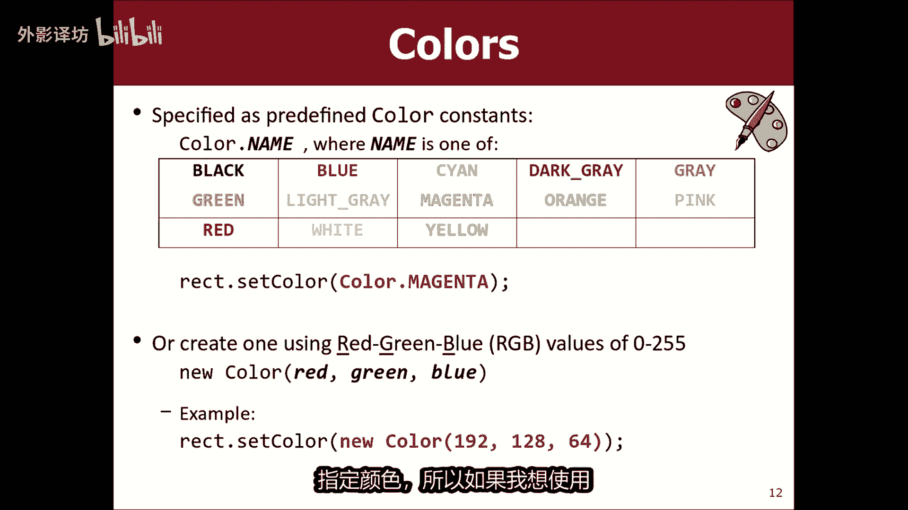

```java
private void drawCar(int x, int y) {
    // 车身：位置基于传入的 (x, y)
    GRect body = new GRect(x, y, 100, 50);
    body.setFillColor(Color.BLUE);
    body.setFilled(true);
    add(body);

    // 轮子：位置相对于车身计算 (x + 偏移量, y + 偏移量)
    GOval wheel1 = new GOval(x + 10, y + 40, 20, 20);
    add(wheel1);
    GOval wheel2 = new GOval(x + 70, y + 40, 20, 20);
    add(wheel2);
}
```

然后，你可以在`run`方法中多次调用`drawCar`，并传入不同的坐标来绘制多辆汽车。


```java
public void run() {
    drawCar(50, 100);
    drawCar(200, 100);
}
```


通过进一步添加参数（如`carWidth`, `carHeight`），你还可以控制所绘制汽车的大小。


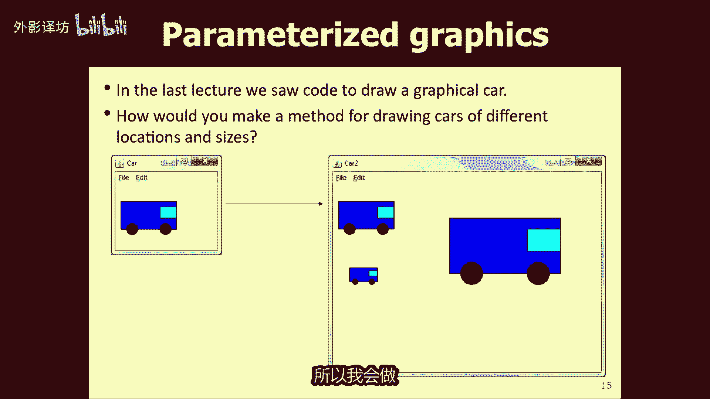

---

## 总结

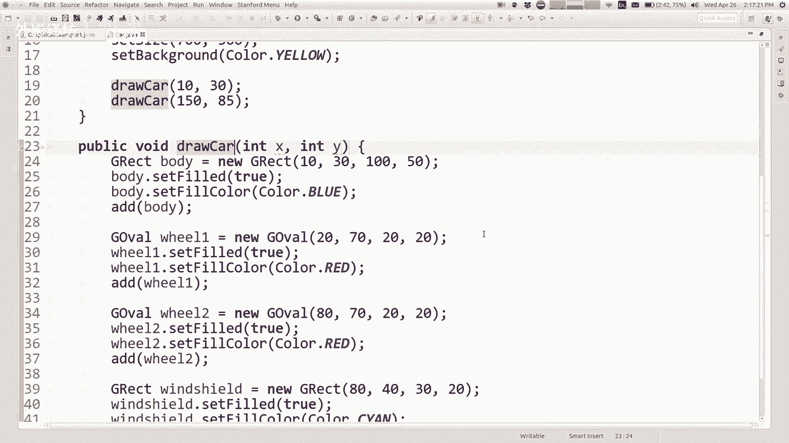


本节课中我们一起学习了Java图形编程的基础。

*   我们了解了图形坐标系统。
*   学习了如何绘制`GRect`、`GOval`、`GLine`等基本形状。
*   掌握了通过先创建对象、设置属性（如颜色）、再添加的方式来绘制更丰富的图形。
*   探索了如何利用循环来生成重复或规律的图形图案。
*   最后，我们运用方法封装绘图逻辑，并通过参数控制图形的位置，这使得绘制复杂场景变得更有条理和高效。

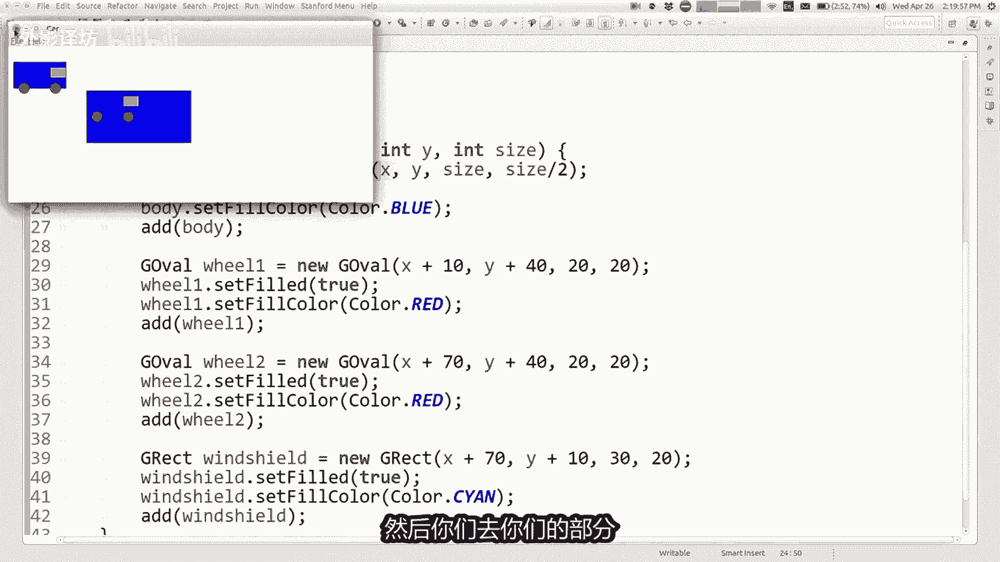

图形编程将我们之前学到的变量、循环、方法等概念与视觉输出结合起来，是创建游戏、模拟和交互式应用的重要第一步。