# 【中文配音】斯坦福王牌课程 CS 106a Java教程 2017年春季课程 - P12：12_ Graphics 16sp - 外影译坊 - BV14U4geNEEq

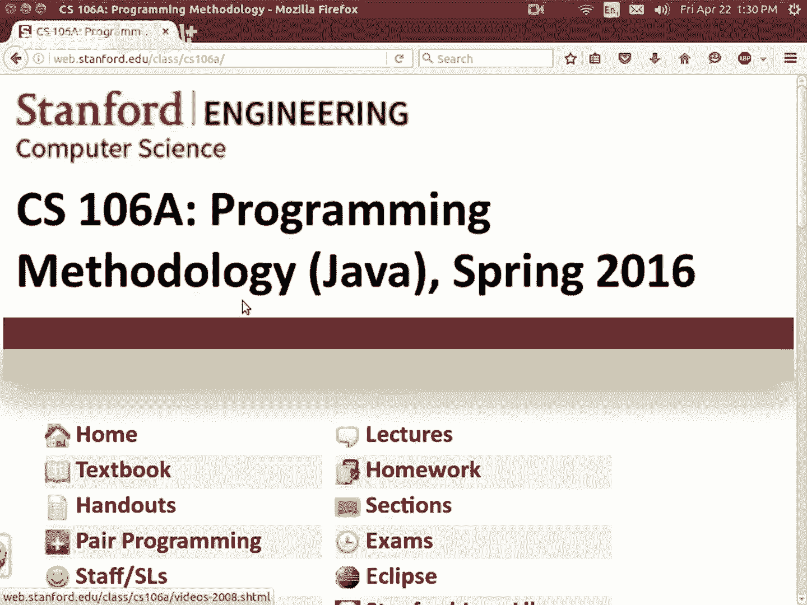

所以黑我们了解到了一个叫做，上次有人可以使用array list吗，提醒我array list是什么样的，它的用途为什么它有用，是，它存储东西的集合适的好吧，也许是因为我们添加了一个有点像。

我为什么想要，诸如为什么我不能之类的东西的集合，只需使用几个变量或字符串变量，例如为什么我想要一个收藏，很多功能可以让你操纵大量数据时的，我想我认为这都是真的，你说的是真的，也许当我添加到。

那就是有时我们有很多数据进入我们的程序，或至少潜在很多，也许我们是将从文件中读取所有单词，我们将从中读取一堆数据，互联网是这样的，我们需要把它放在某个地方，因为我们想要看看我们想要分析的所有内容。

我们想要过滤它，我们想要排序，我们想用它做点什么，所以很难做到这一点，如果你拥有的只是简单的一点变量，如即时字符串和双倍，所以如果你只是想坚持到，你想要的代码中的一堆数据，使用称为A的东西。

集合集合的势力将是一个array list，我们上次学到的，今天多介绍一点现实主义者，然后我将开始一个非常我认为你们的主题不同，喜欢图形。

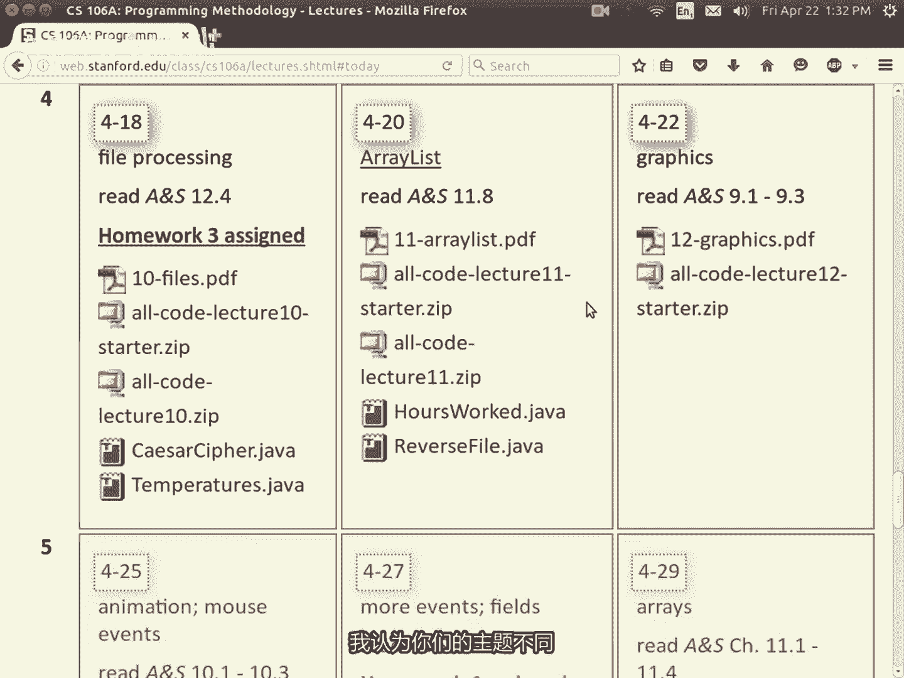

所以让我跳吧，返回到之前的rv list幻灯片，现在记住，当你生命一个array list，你必须使用一种有趣的语法，你不得不说array list括号，然后写入数据类型。

例如像变量类型extreme一样流，那是告诉他什么样的事情将放入array list。

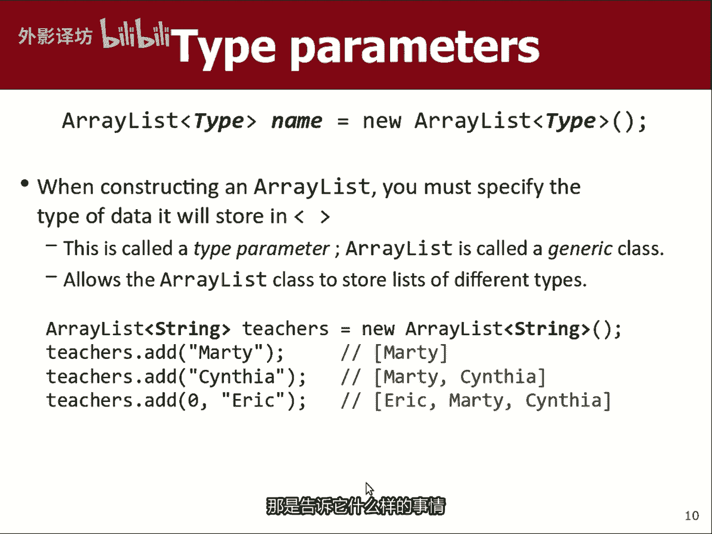

我上次我说的打个比方，array list有点像公寓或其他地址，就像我制作了一张幻灯片来尝试说明，像常规变量一样，就像一个人的地址，房子或者什么的，去这个地址，你会在以下位置找到此人先生X。

你可以在那里存储一个数字或打印，在那里找到的数字，装扮一个array list，有点像公寓，大楼或共管公寓楼或宿舍或其他你会说的地方，我们去那个地址，然后在里面那个地方有我们很多人住在那里。

所以在那个地址里，我公寓我是公寓三公寓，对于那些单独的公寓来说，您添加的列表的元素，然后你可以去检索值，稍后通过说让你输的元素列出get，并传递一个索引，一零开头告诉他哪个元素你想要的。

所以这是重要的想法，我们上次写了一个程序，让我们喜欢逆转到文件或复制或口吃文件的行，这就是我们所在的位置，了解更多有关的内容，array list是它，实际上我在课堂上做的例子。

都是字符串的ARRELEASE，这是一个原因，是因为实际上有点，如果你想列出一个不同的列表，我们所说的原始值不我没有使用过这个词，原始值基本上基本类型是小写名称的数据类型，尤其是对我们来说。

Int double，并关心到目前为止，那就是与以下类型分开，大写名称，例如字符串或扫描仪或文件或随机生成器，那些时，这些称为对象类型，小写字母的名字被称为原始类型。

它并不是真正的是它们与众不同的大写字母，只是有这个约定，将原始事物称为小写，并且调用非原始类型或对象类型大写，但看我猜我是什么，想说的是，如果你想制作一个ARRELEASE。

这样你实际上无法使用我们的语法来做到，这一点，用于周三的讲座，相反你必须编写一个光线列表，整数或大写I和你必须这样做的，原因是基本上是因为java很愚蠢，但事实并非如此，关于编程的任何固有的东西。

都是只是java设计的一部分，必须这样做，就像我真的不这样做，想要给你一个完整的满足，解释为什么这是正确的，现在因为这是我想要的东西，在课程稍后教你蛋挞与之间的差异有关，java中有两种数据类型。

这些是原始数据类型，对象数据类型，事实证明，数组列表只能存储对象数据类型，这意味着几乎每天都在那里打字，除了婴儿霜打和胡萝卜之类的的东西，所以这是不幸的，因为很多时候你确实想存储。

及时加倍和关心而release，所以如果你想这样做，你必须写一个不同的词，说整数，或者还有其他一些你可以在这里使用的词，我会一会儿就给你看，我猜我会做什么，会说这是唯一的改变。

你需要在你的代码中添加适应这个，所以希望他不会成为一个大半小时，但有点奇怪，现在为什么我必须说成像仪大写，而这意味着什么，原来有这些数据，java中的类型称为包装类型，是原始之间的桥梁事物和物体事物。

整数将int转换为对象类型，以便可以在ARRELIST中使用它们。

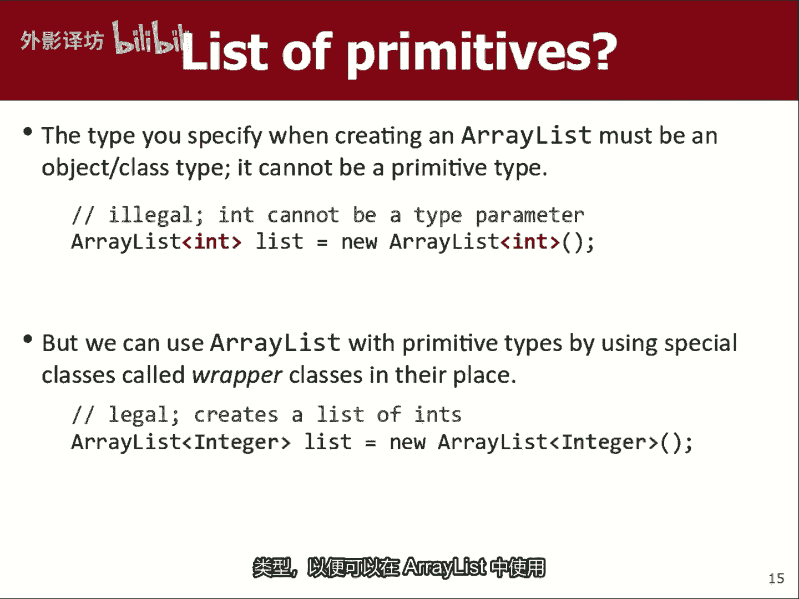

这样称呼这些包装类，当你想到包装纸时，会想到整数和双精度数，以及这种包装器，就是这个小物体在里面存储永久值，所以我的意思是，我猜我想要你做的一切，真正知道的是。

如果你想要一个array list bin，你要说一个真实的，如果你想要一个数组，则为整数列表，你必须说的双打清单，大写D双倍和I的array list，我认为我不需要你考虑。

除此之外还有什么更深层次的事情，只是你需要记住的事实，当我们继续学习课程时，会更多的理解这意味着什么，原始失物是什么意思，物体的事意味着我说过吗，最后一些关于物体的知识讲座中，我提到了一个物体。

就像一个内部有数据的实体，它和它内部的行为，但我们稍后会更深入的了解这个概念，所以我主要向你展示这个，就像你需要做的事情一样，它符合使其正常工作，小姐弟在蓝色部分加倍，幻灯片上的那个对你不起作用。

如果您必须写大写地霜，想要制作一个int列表，然后你写inn，你必须说它不起作用，大写I整数，然后它的工作原理，一旦你完成了其余的代码，如果你想使用仅创建列表list，如果你想将inns添加到列表中。

你想从列表中拉出，你可以只说int intet，当你创建的时候，到处都是列出你必须说的整数，说大写地霜很愚蠢，我想要向您展示，当您有一个列表时，您可以添加和删除内容，我们已经讨论过的列表。

上次讲座我们添加了一堆字符串到列表中，我们添加了以下行，一个文件到一个列表，所以如果你只是说列表点加，然后你写一个值，将该值放在列表末尾，但你不必如果你想放的话，就放在最后，在不同的地方。

你可以通过两个，当你说添加时，你可以传递参数，你想要存储它的索引和你想要存储在那里的值，所以如果你说加二逗号42，你是什么意思，是你想添加值42，你想将它插入到索引二处索引，如果你看这里的图片。

现有列表有这五个整数，如果你说在这些索引里面，你想在索引二处插入42，他说好吧，你想要42就在这里，我在想要让每个人都划过去42的空间，我要滑动它直九到索引三，我要滑动，我将把值七转换为索引四。

将直五滑动到索引五，并现在我有一个空位，我会把你的42放在那里，这样插入，如果你这么说的话，也会引起类似的转变，你想要我的在哪里，我不知道为什么，就像那样眨眼，但如果你说你想删除一些你说的东西。

K删除存储在索引处的值，一删除这个八，如果它存储在这里的话，这样做，但它不只是留下一个间隙，就像洞一样，它会滑动所有的其他元素移至左侧以适应，所以索引中的值是四十二二，现在是索引一指五，它曾经是索引五。

现在是索引四，索引在好的，所以你必须注意这一点，有点像你删除了一些东西，或者如果您记得的话，添加一些内容，该列表正在重塑自身，or就下删除所有出现的值八，所以你可以这样做。

但是列表没有像删除所有这些value方法，如果你想这样做的话，必须编写自己的代码，就像绕着圈走一圈，然后看看每个元素，如果你说的是八，如果是助手，则将其删除，然后将其删除，我们要做一些部分问题。

关于你所在的这类事情，就像过滤列表的内容一样，就像摆脱所有这些价值观，是的，所以你可以做到，但没有，就像简单的一行命令一样，事实上我想你会立即做，发现当我向你展示类似的物体时，当我向你展示光线列表时。

这是java中的或者java中的其他小玩意，你会说好吧，有一定的行为基础，但是如果我想做一些奇特的事情，我可能会必须喜欢自己写在上面，基本上就在这里好吧，有时我会遇到这样的问题，提出这些问题。

我暂停一下，让你看看他，并研究他一段时间，虽然但我想讨论一下，如果你看的话，这个人和你们住在一起，在这段代码中，我做了一个整数的ARRELEASE，是int正确的，我做了一个从1~8的for循环。

我加了14，我这意味着你知道加十，然后20，然后30，然后40，所以当我完成该代码后，列表看起来像这样，索引是0~7，存储值十二十，30，四十五十很棒，这就是现在我有一个for循环的列表。

这表示对于每个int i0到size，删除道I删除预期，所以I然后打印列表，然后我问学生们，你知道什么是什么，该代码之后的列表内容做的对，所以有点，我想我想如果你第一眼看这个，你说好吧。

等待它从零到尺寸与所有尺寸一样，然后删除该所引出的一个，这样它删除所有的权利，所以当你完成后。

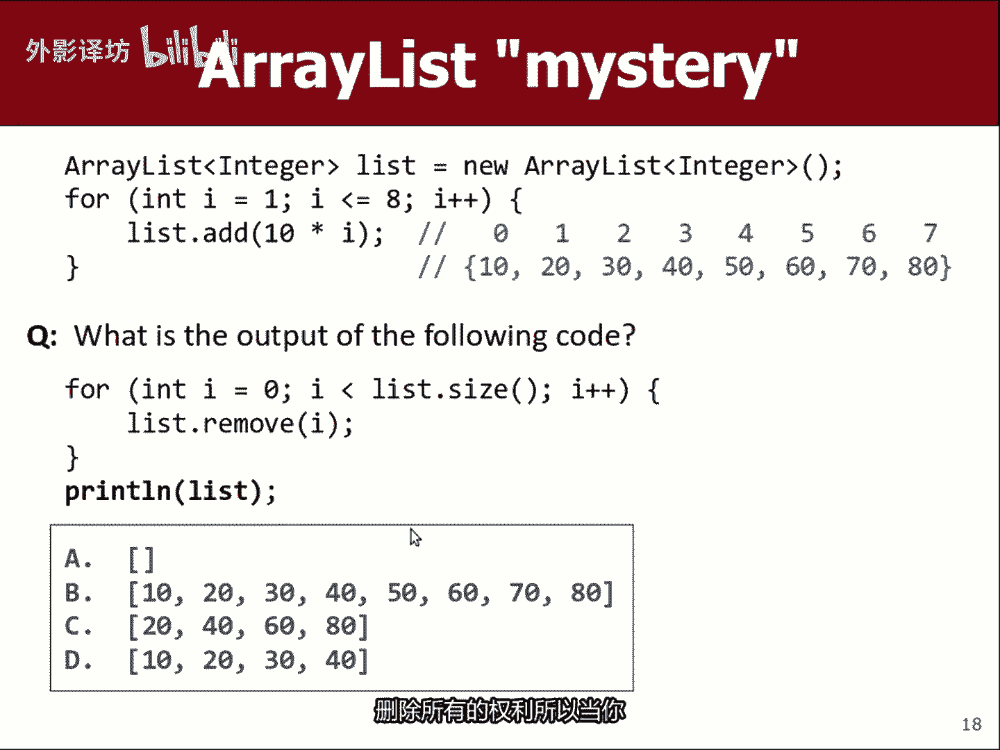

应该不会剩下任何东西，该列表应该是空的，所以我想要了解为什么这不是正确。

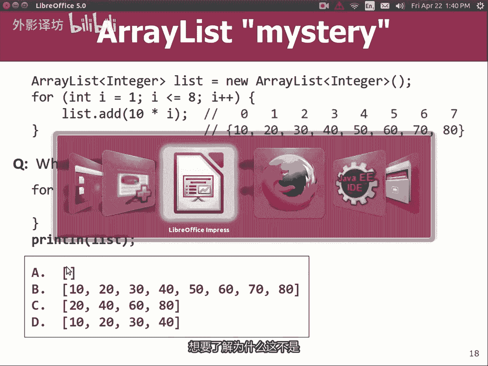

答案，很快，所以让我点击这里，我想要复制这段代码，我想要将其粘贴到编辑器窗口中，使此大，然后让我复制内容列表也粘贴。

删除删除那里好吧，我们走吧，通过这段代码，我想让你看到为什么array list之后不为空，这段代码完成后，我们说ENTIEQUALS0，我会在那里画一点点，我看向0号元素。

所以现在我说删除元素我是对的，所以我会删除这个人，但记住什么，当你删除某些东西时会发生什么，我之后的列表是什么样子的，删除20是这样的吗，图片出了什么问题，我该怎么办，需要改变，我需要转变。

一切都好好吧，我删除列表中的十个都做到了这一点，现在java代码中接下来会发生什么好吧，我把I删除了，我现在是0I加右使I从零开始移动到一，现在循环继续，他现在终止。

一所以让我们删除元素I这样删除了这个权利，所以我删除了这个，当我删除这个列表时，看起来就像现在我这样做，我加上加上，所以所以这样做，你看到发生了什么，就像看起来一样，就像代码会删除每个元素一样。

但他会删除所有其他元素，当我完成后，我认为的内容列表是二十四十六十八十，所以这就是。

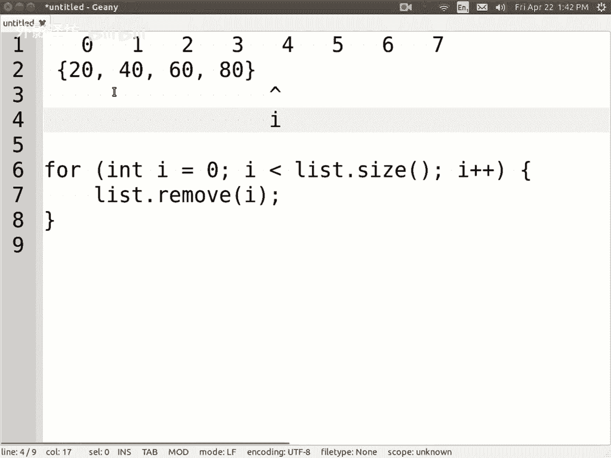

回答这个实际问题，在这里有一个问题。

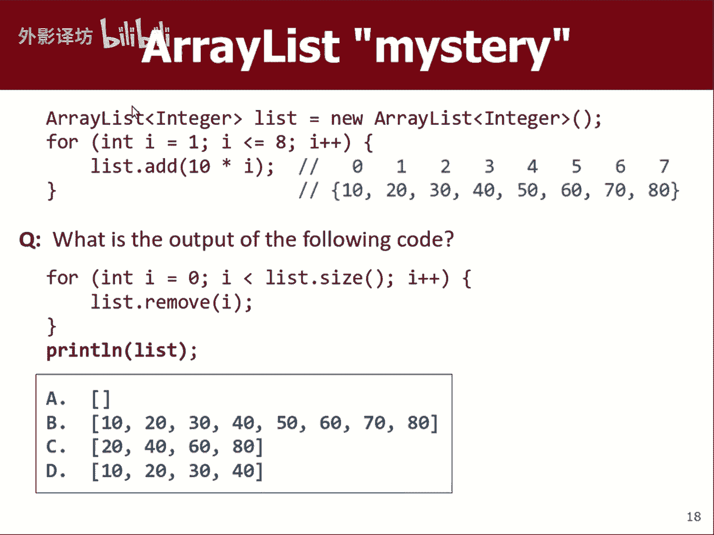

哦列表大小正在改变而。

代码正在运行，这真的很好点，循环确实认识到这一点，循环将在此时停止，并且代码就在这里，我删除了十三十五，十七十com，现在已经取值四，所以如果我问我是否少于清单，size将是此时的列表大小。

列表大小已缩小为四，所以四不小于四，所以此时循环将立即停止，但我猜最主要的是内容，即使在某个位置，列表也不会为空，乍一看可能是这样，如果您确实想要列表现在为true，有办法做到这一点。

清空列表并非不可能，最简单的方法就是说列表点清除，清除意味着清除所有元素，现在是空的，所以你不需要现在甚至需要一个愚蠢的for循环，如果你想要清除，如果没有，比如你可以使用的明确方法，仍然清理清单。

还有很多的方法你可以做到这一点，任何想法我如何修补这段代码，以及仍然使用for循环，但摆脱所有元素的，谁开始叹息，我想也许是尺寸减一，因为如果你有11开始的最后一个元素，是九个或大小合适的东西减一。

然后只要眼睛大于或等于到零，然后我现在你就说如果我倒退，那么就会工作，我认为你是对的，但让我们做确保我们相信这一点，所以我们开始尺寸减去这里的一是的，那么他说我们删除我，所以我把这个去掉吧。

现在我就这么做了，重复删除元素ii，所以是的，只是从右边咀嚼，他回来也同样有效，还有另一种修改吗，我之前的循环，所以这个有效，如果我回到循环呢，在这次对接之前，我会做什么，你能想到的最小的改变。

你可以对此代码进行，我要修改的字符最少，但是暂停代码，现在删除所有元素，你觉得怎么样，改变二为零，这是一个有趣的想法，让我们来看看看看是否会删除所有elements，我喜欢你的建议。

所以让我们从那里开始，用泰语，从那里开始，Mac r o正确，所以我们删除列表中的点零，这样就删除了这个，然后我们我加加，然后循环重复，所以我们做列表删除零就结束了，就在这里，然后我们做加加。

所以好像这样就去掉了十，然后是20个，然后是30个，看起来不错，右边是列表，代码循环完成后为空怎么了，你说不为什么不，所以我，觉得抱歉再说一遍吧，就像，让我们继续追踪这个吧，现在我已经删除了十和20。

我就在这里，所以我确实列出了删除零，这样然后我就这样走了，然后然后我确实列出了删除零，所以然后我就像那样，此时云台不再小于比列表大小，你看到的是关系，并且列表大小是四，所以我有达到列表大小。

因此循环实际上停在那一点，哎呀所以这很微妙，因为列表，循环时大小正在改变循环，并且列表大小是否发生变化，当循环正在循环时，可能会影响循环何时停止，我打赌你伙计们认为我小鱼名单大小。

这只是意味着我不到八对，这是等价的，是的，这是真的，只要列表大小保持为八即可，如果列表大小不保持为八的时间，那么循环不一定实际上去八，这是非常微妙的，我认为很多学生都错过了，首先你可以做的另一个技巧是。

而不是说我小于列表大小，你可以说int原始大小等于列表大小，然后说出原始尺寸，清空整个列表，因为真的会移动八字，去除第一个元素，八字，第八个元素列表将清空列表，无论如何，这有意义吗，棘手的小事。

当然还有，你知道我喜欢问问题，类似这样的测试，只是为了看看你是否可以管理所有这些，添加和删除并移动您知道的列表这类事情。

所以如果你想练习其他几个例子，ARRELEASE的问题，有几个练习，在最后的这里，您可以查看该用途的幻灯片，我想转向类似的概念。

不过图形，所以我想看看是否您对此还有其他疑问吗，代码或关于这些ARRELEASE，循环和在我继续之前的事情，好吧，你们知道我爱所有人，是的，我的意思是，你不知道以任何方式，这会给我带来麻烦或任何事情。

但只是像这样像你们一样学术博拉图式，我爱你们，这是一种很棒的方式，我想给你一点东西，今天很有趣，所以我想教你关于一个非常不同的话题。

只是想去上班，食量五和在这里跳到另一个太阳系，第二我想谈谈一种叫做图形的东西。

非常与array list不同。

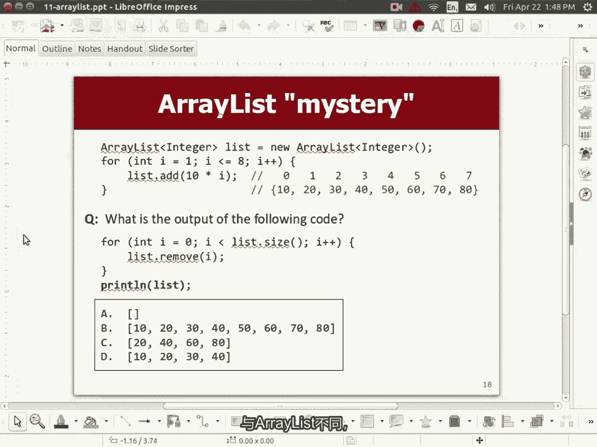

但图形很多学生都很喜欢，很有趣学习图形，所以我会老实说，大多数其他106A教练比我喜欢的更早，教图形，早在一两周前，他们就会开始显示新图形，意为他实他们想尽早获得乐趣，学生们玩它或者其他什么。

但是我想过滤掉所有的弱者，在我开始这个话题之前，比如等待，直到掉落日期，只有坚强的意志去了解一些很酷的东西，这样你不知道我想练习一些那些其他主题，例如参数优先，然后返回我说我考虑那些其他主题更加核心。

从根本上来说，这更像是你知道christy cream是一个很好的话题，所以无论如何，当我说图形时，我的意思是就像画颜色和形状一样，线条和动画之类的，现在我知道，你们真的是享受所有这些性感的控制台程序。

白底纯黑文字背景，我知道那看起来真的很酷，但有些人喜欢画形状，如果你想画画，可以用颜色代替，按照你想要的方式，形状和颜色从你的代码中开始，而不是说我扩展了控制台，你会说我扩展图形程序计划。

这是我们的另一部分，斯坦福java库等等，而不是打印信息发送到控制台，就像当我们从颂歌跳到控制台时，现在我们从控制台跳到图形，当我们从卡罗尔跳到控制台，我们留下了一些我们一直在使用的命令，停止使用移动。

并向左转一次，我们离开了卡罗尔，现在我们离开控制台，你可能会不会说真的int并打印LIN，尽可能多将输出绘制为形状和线条，你仍然可以打印打印的消息，保存打印零，但这不是你的方式，通常会产生现在的行为。

如果你写一个这样的程序，图形程序有一些导入，您必须写下的声明，我不记得你代码的顶部，我已经谈了多少关于进口的事情了，声明，但这些基本上是告诉java你要执行的命令，使用一些库。

并利用你的代码中的那些故事，将是预先存在的代码，其他人这样写的java或者STANFORD自带的项目等等，这些蓝色部分是一些新的部分，你必须确保你有，如果我曾经给你一个讲座演示过家庭作业。

我会尝试包含这些元素，已经为你准备了，但我只是让你知道他们需要在那里，所以现在现在我们将成为一个图形程序，将会有一些新的种类，我们可以在这里写下语句，来绘制颜色的形状和线条。

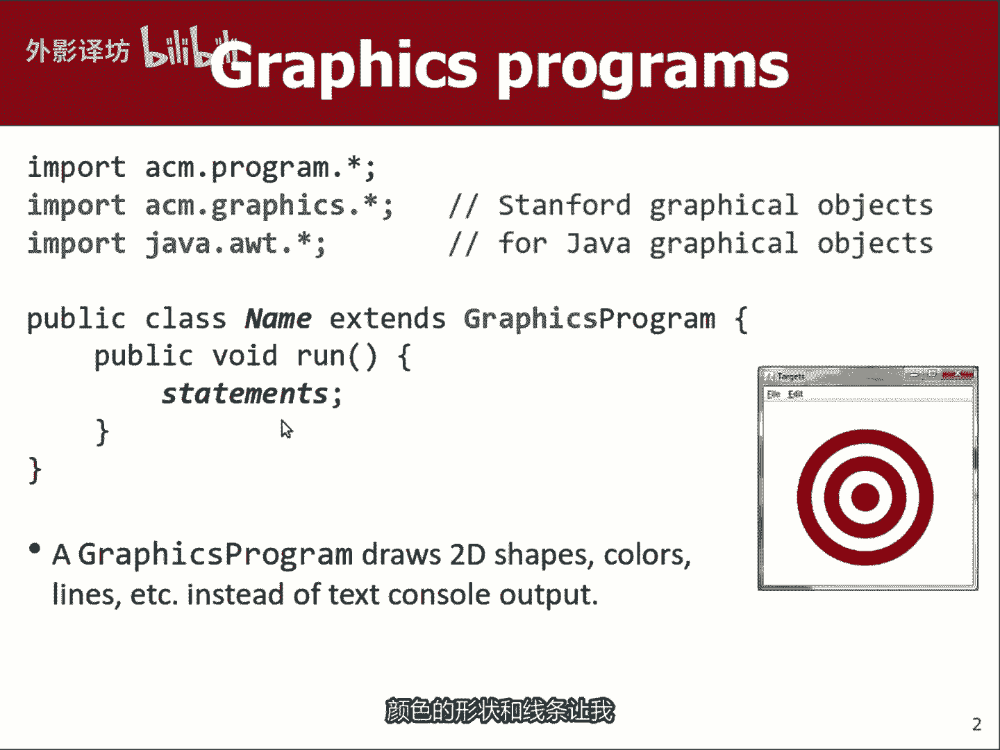

让我首先向您展示它们，图形程序是一个窗口，您可以可以把它想象成一块画布，你可以在画布上画东西，由这些小点组成，我打赌你知道称为像素，像素也许就像你看到的小，如果靠近屏幕上会出现方块。

就好像你有一个不错的新东西一样，那么配备retina显示屏的计算机，这些都是非常非常清晰的显示，所以有时很难看到小东西，像素意味它太清晰了，但我们大多数人你可以看到这些小方块屏幕，如果你靠近的话。

这些是图片元素，是像素和像素，通常具有坐标值，像最初一样与他们联系在一起，左上角D像素屏幕就像位置零零，并且右边的那个是位置10X等于一，Y等于零和奇怪的事情，坐标系我的意思是你们有做了很多笛卡尔坐标。

数学课或其他什么的，通常是你有一个XY轴，其中X指向向右，且Y向上，计算机向上沿Y轴向下，沿X轴向下，仍然会向右移动，所以你必须习惯Y值为零的事实，位于顶部，当你增加Y时，你就会走向下，为什么。

这除了只是为了混淆一些本科生好吧，基本上与以下事实有关，计算机实际上绘制了屏幕，它从上到下绘制它，所以它想到屏幕的第一部分处于顶部，但无论那是什么，它是如何工作的，这不是一个具体的事情。

到java或到斯坦福大学或到这个班级，就像几乎每次做图形时一样，在计算机X上是这样，为什么，那所以只要习惯就好了，这里有一些，现在你可以用图形方式绘制对象，我在我的幻灯片上对对其表示歉意。

这些东西都关闭了，我不知道为什么下课后我得检查一下，所以你可以画一个矩形，你可以画一个椭圆形，你可以画一条线，你可以画一条线，您可以制作类似图像的文本标签，屏幕上的小图像一模，您可以绘制部分圆或圆弧。

可以绘制任意多边形，并且你做这些事情的方式是，写下这些对象的名称，称为就像矩形的G矩形和椭圆形的G矩形，对于椭圆形，我不知道为什么他们都从G开始，我想可能只是图形矩形的ins ins这些来了。

从这个斯坦福图书馆，我们我在这所大学提供第一次，当我学习名字的时候，在我教这个之前，所有这些事情类我认为很好，这些名字它们对矩形A来说有意义吗，一行一行，然后我看到了这个，我很好奇这是什么。

基本上是屏幕上的一些文字，就像你在上面画绳子的方式一样，屏幕我想欧他们为什么不直接称之为G字符串，就好像哦好吧，也许是这样，与我的意思有不同的含义，但无论如何，还是有这些不同的可用于绘制形状的对象。

我将在屏幕上演示它们，第二如果你想做其中之一，然后你做什么，我想我是这里缺少一条信息是什么，你要做的就是写下new wave这个词，在我们看到new这个词之前，就已经看到了扫描仪和其他一些类型。

我们一直在学习的对象，而relist我们在那里看到了你说的心，然后是你想要的形状类型和，然后在括号中，你必须指定关于该形状的一些属性，我们将指定一些有关的参数，多次塑造你需要的形状。

指定以及去哪里把它放多大，让它多大位置和大小，基本上是if它是您指定的椭圆形或矩形，左上角的XY坐标形状，然后是宽度和高度，抱歉您指定的是高度是五和它的边界角，如果你是的话，把它画成合适的尺寸。

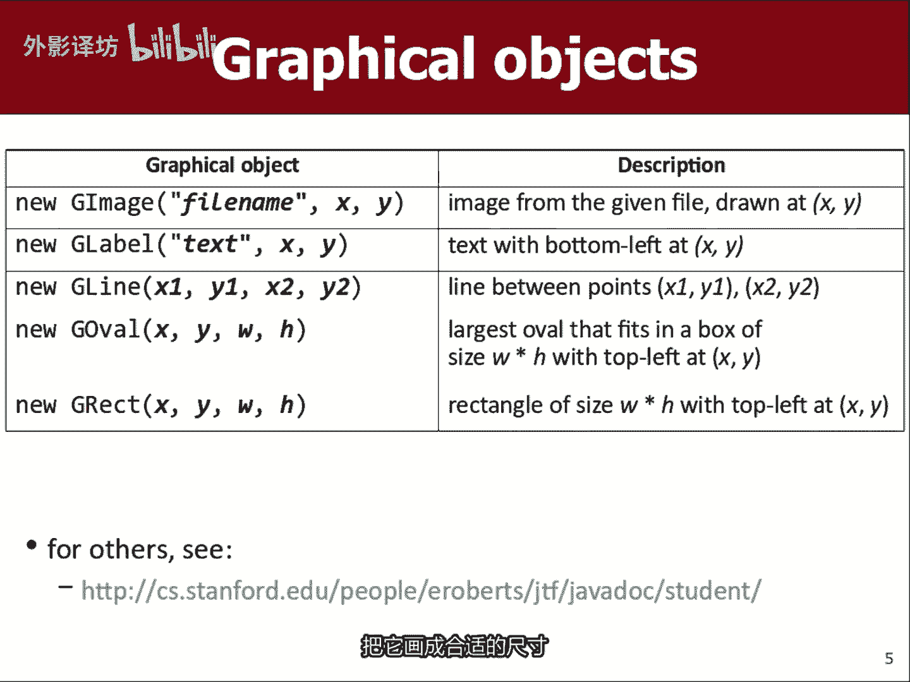

如果你在画画的话，我的编辑在哪里，你正在画一个G矩形，然后你指定X和Y以及宽度，然后是身高，然后是你穿的衣服，屏幕是一个，这是一个矩形，看起来像美国的哪个州，最喜欢的事项，马萨诸塞州或其他什么好的等等。

好吧，我知道了，这周让我试试，让我再试一次，你准备好了，啊是的，我不知道我是否曾经，因某事而获得掌声可怜，但谢谢你，我接受这里，是顶部X逗号Y的位置，当你说XY是左脚，就是这样，你的意思是。

然后等待你的高度，知道这里的长度是W6，然后是这个在这里跑步是身高年龄吧，所以这就是你的G的尺寸矩形，你也可以制作一个G椭圆形，你也是我的意思是你可能会想象，也许如果你正在画一个圆圈或一个椭圆形。

也许你会说一些关于半径或不适的东西，图书馆的运作方式，你仍然说XY宽度和高度以及它的作用，就是它画出最大的适合的椭圆，自然的变成那个大小的矩形，如此前卫的椭圆形尺寸与一个G矩形，看起来天哪。

这事结果会很糟糕，看起来像悲伤的便便什么的，就像升级到表情符号一样，我所需要的就是，旁边有100个表情符号之类的，当你说geo vi时，无论什么表情符号，他绘制您指定的矩形边界，对于G椭圆。

他绘制的椭圆式将适合那些边界类型，如果你想要的话，我在这里画的很糟糕，如果你画一条G线，你指定一个X1Y1X2Y2，你不再说宽度和高度了，你基本上只定了两点，你在这些之间画了一条线。

两点它会把它放在屏幕，还好等等，就在那里，该幻灯片还有其他几个语法，对于每一项以及您所说的每一项之前新的，实际上他比只是你实际上说，这就像在公共空间内运行，这里你会编写这些类型的命令。

这样你就不会只说新G线，但其实你必须用一个词来概括整个事情，你说添加，你说添加一个新的G，你基本上是在告诉将该行添加到屏幕的程序，或者在屏幕上将其排成一行，所以在我的第一个演示中，我会做，你会的。

看我写ADD ADD ADD，然后全部这些形状看起来不错，所以我认为我可以做的第一个演示，你们会画一张笑脸，让我回到这里打开笑脸，Java，所以现在我还没有，提前计划到底是什么，坐标等应该是为此事情。

但我们可以弥补，当我们一起走的时候，我想象着像这样的东西，笑脸是矩形的，然后在脸上，我们有两只眼睛和一只鼻子和嘴巴之类的东西，你知道这有点像我的世界的人，或者一些我不知道的事情，足以让我们。

如果我想要这个外衣，请尝试这样做，矩形作为这家伙的头，也许我会只是说添加一个新的G矩形，如果如果，整体窗口就像这里，我必须指定左上角，对于这个矩形，所以也许就像X等于30，Y等于十。

并且也许头部尺寸约为两百两百，所以也许这就是矩形，对于这个人我已经运行了，这样你就会看到一个嗯矩形。

好的，这是我的矩形，现在如果我想要里面的两个眼球，我只是喜欢玩的矩形与坐标，并找出像坐标是什么，这里和这里的坐标，所以米知道无论如何，如果你如果你只是实验，你会发现坐标，如果您现在添加新的G椭圆形。

怎么样，想要一个圆，而不是椭圆A圆形，而不是你刚刚制作的椭圆形，一定要指定宽度和高度彼此相同，然后你得到一个圆圈没有分开的介入，G圆形，您只需说G椭圆形即可，也许我在这里要做的就是移动它。

写下一点整体头，你知道这就像头，然后这些是眼睛，可能是50，逗号30以及可能的大小，每个眼球是30X30，我不知道，然后那是左眼，然后这是哎呀，我做了什么，这是右眼，也许有区别，左眼和右眼只是X坐标。

但宽度和我认为高度和Y是相同的，所以也许右眼让我们看看在哪里是吗，他需要是他的右边缘，需要是20像素，所以我认为他需要在180处结束，所以我认为需要从150开始，不管做什么都喜欢那样看，我做错了哦。

所以它没有也没有结束于200，宽度为200开始，从30开始，所以我认为他需要结束20距离200像素，所以我想我需要，这就是说180听起来正确吗，哇你太棒了，可以告诉他们，我心中的艺术家。

也许鼻子上还有一个就像在这里，所以你知道什么坐标，那会很好吗，有几椭圆形，而那个鼻子会是让我们试试，介于这个和这个之间，让我们像110一样，也许还有一点再往下看，为什么可能是70，然后我们做二十二十。

这就是鼻子是一块，不是这个吗。

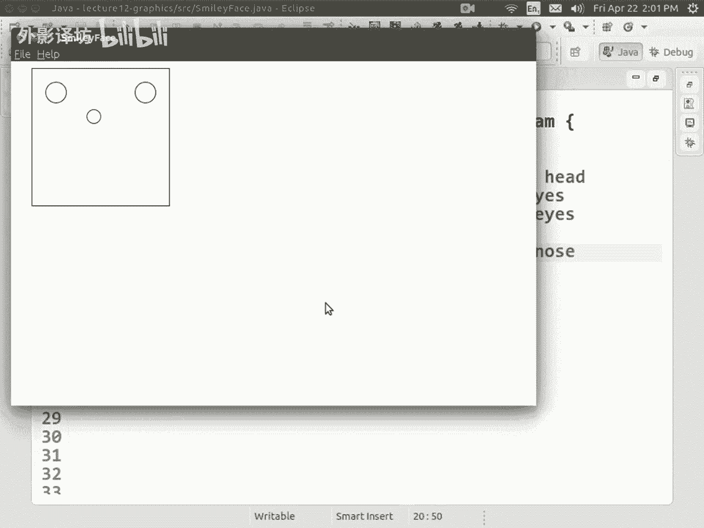

太棒了，等一下，也许十像素向下超过20像素，我可以做到120，然后90好吧，我们现在有鼻子了，让我们做出我想要的微笑，那样的微笑，或者你可以画弧线的东西，如果你真的想要，但是那是复杂，我真的不想这么做。

让我们只做三行嘴还好，所以也许嘴开始鱼一条新的G线从哪里来，所以它会是，鼻子下面一点点让我们做，首先是嘴巴的平坦部分，然后然后我们在上面做小钩子，在那之后我的嘴末端，所以也许X从50开始。

Y坐标再往下大概是160，然后X移动到靠近右边缘的位置，所以也许它会超过210，Y的值也一样，160哇。

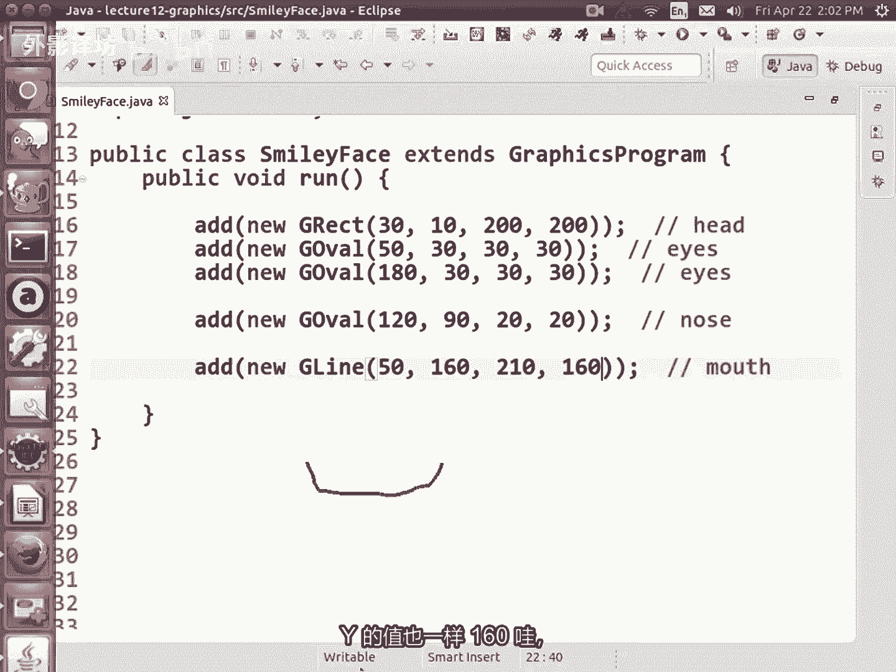

这是就像我期中考试后的你一样哦，这看起来不太高兴，这是。

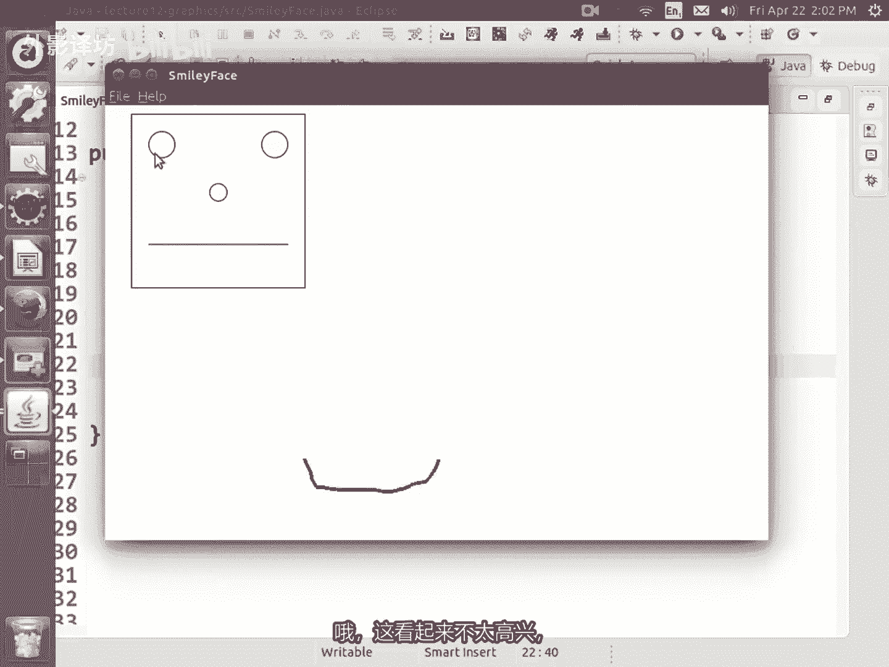

真的很顺利，我可以说70和那么90，让我们对此提出一些类似的提示，所所以让我们再做一个G线，从大约五十一四十到七十一六十，然后我们就开始吧，另一条G线来自一百九十一六十二，210。

是的很高兴很高兴，那是在我释放你的曲线之后。

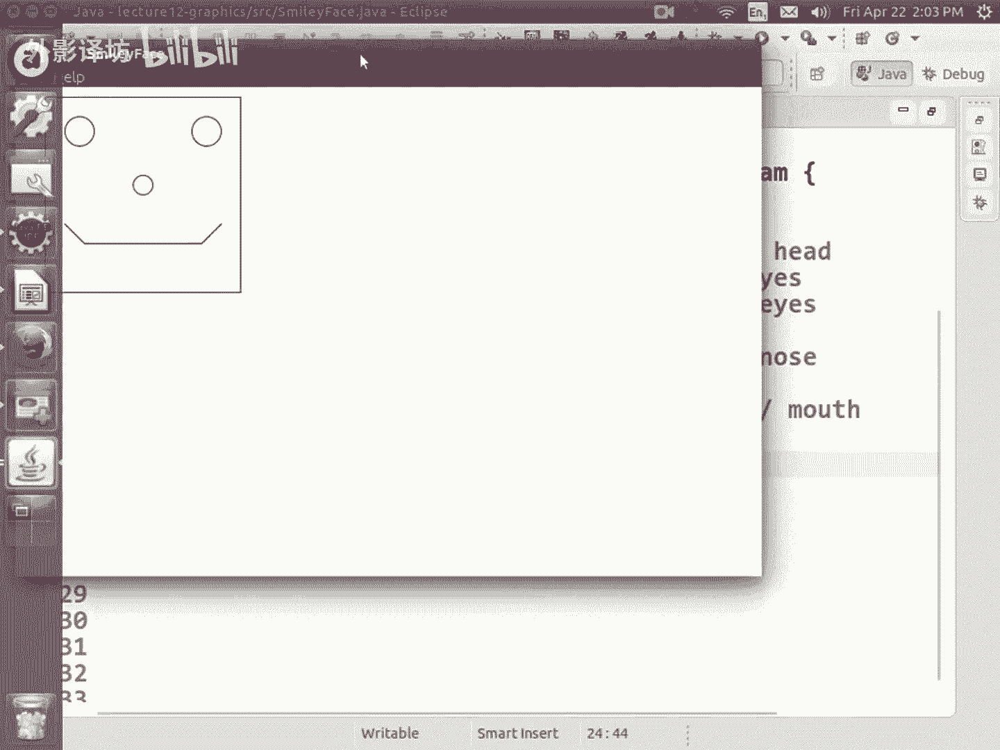

知道是的好吧是的，所以现在我们已经，有一个小笑脸好吧，但是我还没有做任何颜色或任何事情，所以我要向你展示，其次我只是向你展示，这很友善，就像如何让形状出现在屏幕，它不会做任何事情，就像我点击一样。

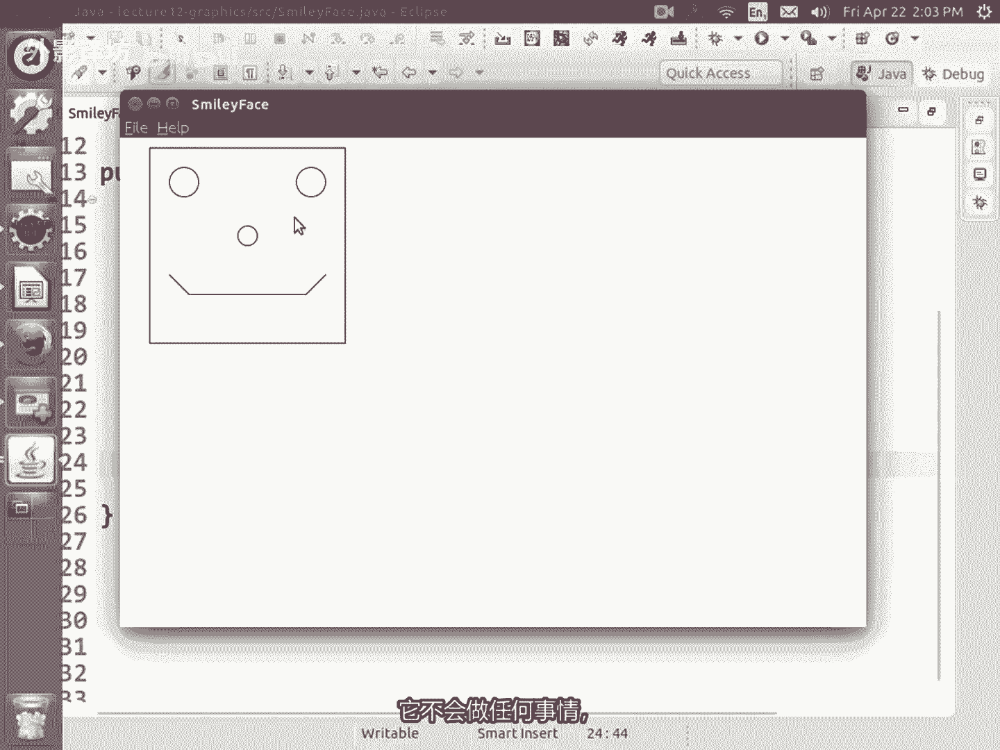

在他们身上，我不喜欢搬进去或拖进去更多颜色，它只是画一幅画，基本上可以，你有什么问题吗，到目前为止这有意义吗，所以他们是刚刚传递的参数，我们希望保留的坐标。

奔波至此。

我刚才说到哪了，让我们回到幻灯片吧，看起来有一张笑脸稍微好一点，让我们画一点消息。

我喜欢画一个G标签，AG屏幕底部的字符串，让我们做一个G标签，添加新的G标签，也许X等于70，Y等于250。

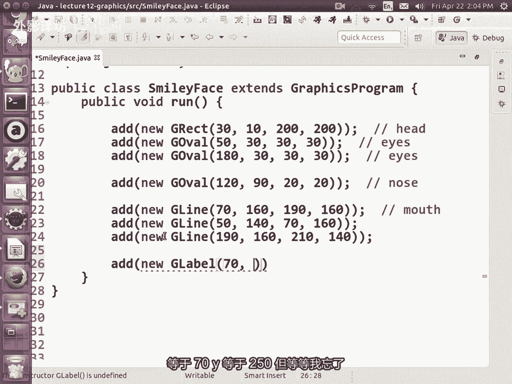

但等等，我忘了你写的参数是什么消息，首先作为字符串。

然后左边缘的XY坐标，你会说我喜欢cs106A，然后你再次运行它，哎呀我有一个错误哦。

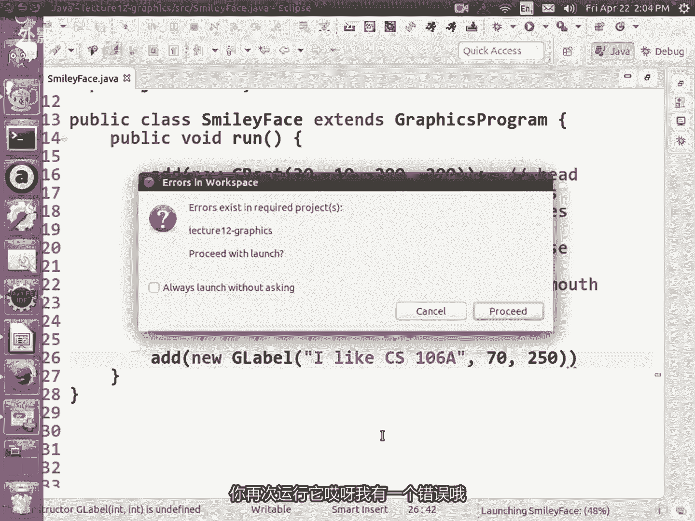

我需要一个分号，所以我们再试一次，上面写着我喜欢106A好吧好吧。

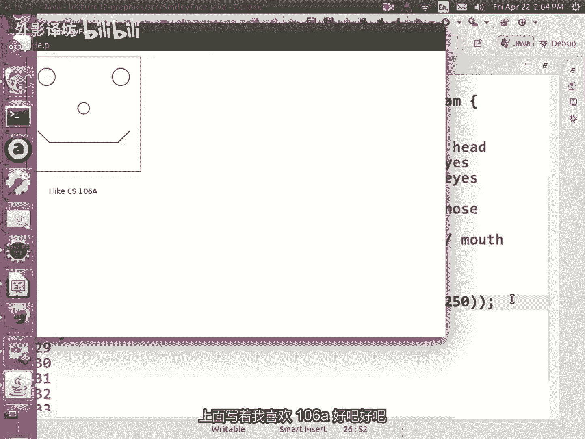

有些事情你可以做，如果我运行它程序的窗口是大。

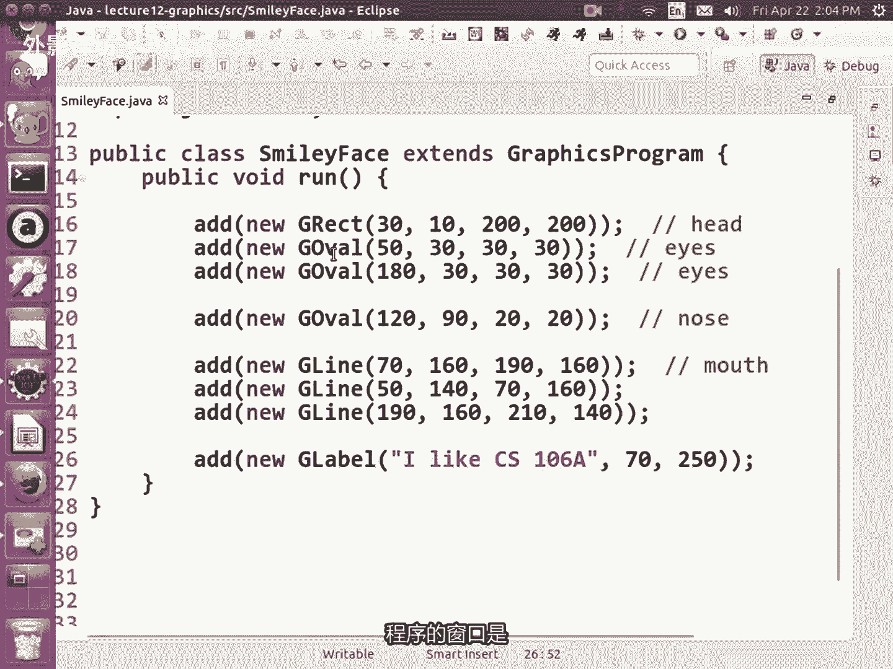

有很多空像素，我认为这里有一些方法，他们正在幻灯片上出现。

你可以使用一些方法，来调整窗户的大小和其他东西，就像我在哪里有那个我在哪里。

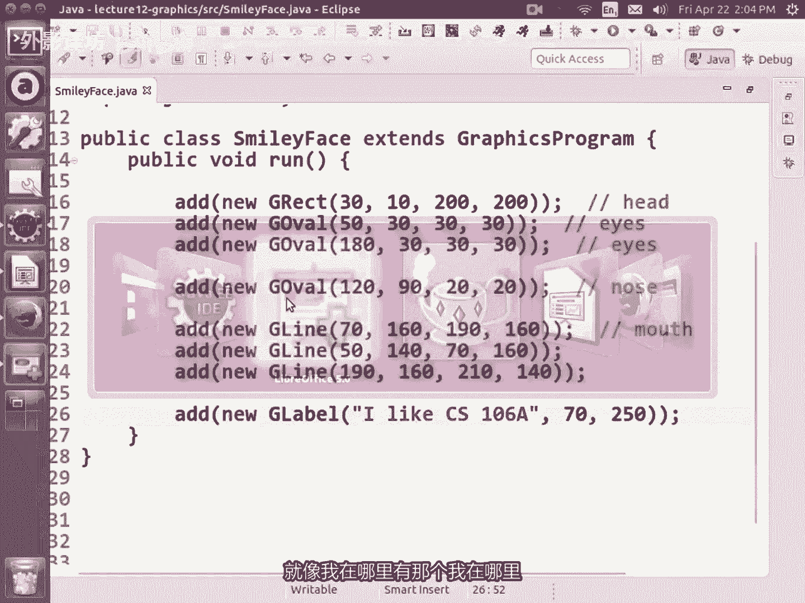

有那个地方，哪里哪里不等我。

我经常跳来跳去，等待在哪里，我在这里抱歉，我会回来的，我会回来的，回到我并不是要跳过所有那东西，我会回去，好东西，但是您可以使用一些方法，例如设置大小，并设置标题，和其他一些可以让你制作窗户的东西。

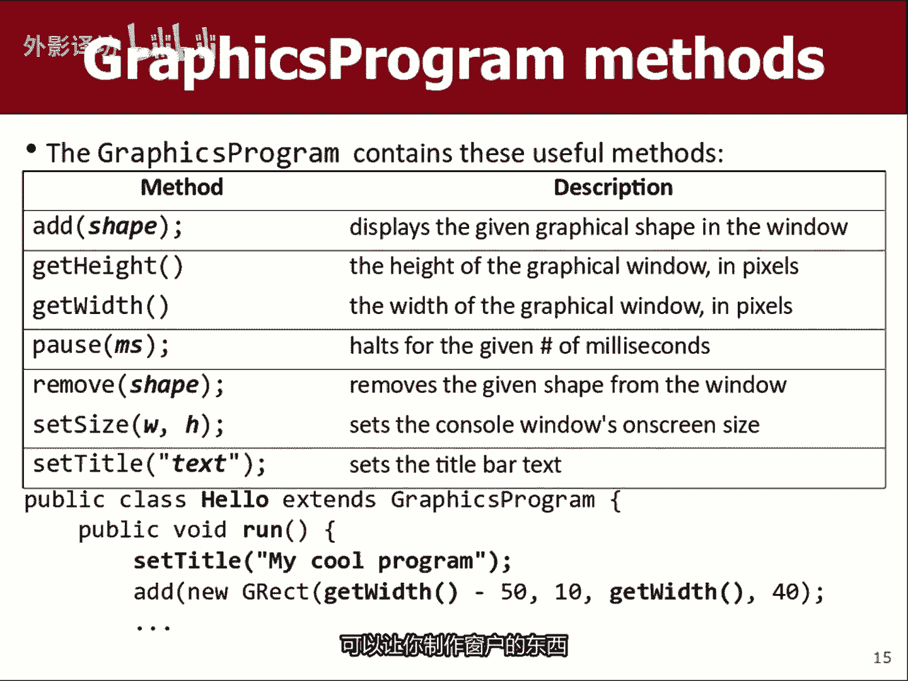

是你想要的尺寸，让我设置大小并设置标题，真实很快，所以我可能一开始就在这里，如果我知道我的跑步次数，我可以设定尺寸，我的伙计们会选230，也许我可以将尺寸设置为是300X300，也许我会设置标题。

就像笑脸家伙一样，然后如果我再次运行该程序，它会弹出上面是一个小一点的窗口。

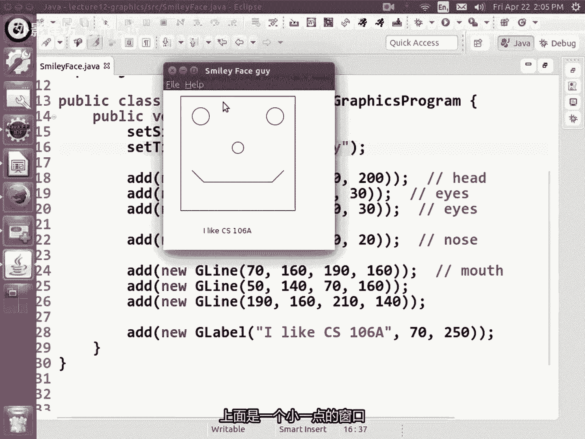

他说笑脸家伙，所以你知道无论如何，这些都是一些基本的东西，可以用图形程序让我做吗。

备份一下，我跳过了一些好吧，我当然提到过将形状绘制为不同的尺寸，我们使用你们已经知道的参数，我认为这张幻灯片的参数是什么，有点暗示参数就像一个新想法，你们已经知道的事情，我们只是传递这些不同的。

当我们创建这些东西时的参数，你可以使用我们提供的所有东西，到目前为止在课堂上学到的图行为，当然像循环之类的东西，方法和参数以及返回之和if语句，所有这些都可以完成，当然如果你画画的话，这里也很喜欢。

如果你想画一堆圆圈，或者你可以用一堆行来做循环，所以你会做什么，我的意思是你们画了一艘火箭，飞船，循环之类的东西，有点就像这里一样，但你必须记住，当你画画的时候，你就知道您在这些坐标中传递的形状和。

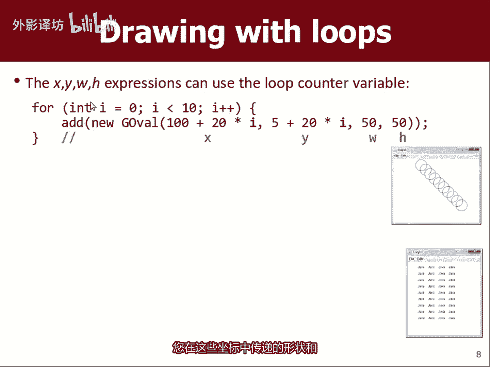

所以如果你想让形状出现在，你必须经过的不同地方，不同的坐标。

就像我回去一样，对于这个节目，我说男孩，我我想要，我想要显示此消息，如果我循环这里十次，I等于零，I小于十，I加加我显示消息，让我把窗户弄大1。400，如果我运行该程序，我不会运行400。

查看十份邮件内容错了，发生了什么事似的，他们是相互叠加，它们就像Z顺序，它们就像叠在一起，你知道我是什么，意味着他们恰好被画在同一个地方，所以你现在看不到，那是一件有趣的事。

当你说print line时，控制台曲线不可能将它们打印两次，隐含的同一个空间，将光标向下或向右移动，两者都是或正确的事情，就像这样，如果你想看的话，这里有一个区别。

其中十个在不同的地方必须通过不同的X或A，不同的Y或两者都有，所以如果我像我一样写在这里，把它推向它，然后你看到这种像涂抹一样奇怪的东西，因为它将每个像素从下一个，所以你可能不想只是说我。

你可能想说14，我喜欢，这意味着每一次应该移开十各像素，从下一个开始，现在你会看到你会看到一些东西，现在他们就这样散开，再多一点，也许你想要像你知道的事情，也许也许你不希望他们重新开始，非常左边缘。

也许你希望他们从70开始，然后你要做的事，你做了类似70+14的事情，所以第一个70多的，下一个是70+10，接下来的70+20，所以他们X从70开始，所以现在他们从这里开始。

所以现在也许我也加入了一些相同的内容，推理到Y我会说250以上，20次，我或者14，也许我会做，这是我的20倍，现在他们走了，像这样你就可以使用X和YI和J，无论循环变量是什么，被调用来移动每个的位置。

你画的可以。

所以现在如果你，看这里的幻灯片，第一个例子得出那些读数，那些圆圈，因为每个圆圈都移动20，X和Y上20，所以它就像他们从X等于100开始，Y等于五，并且它们的宽度和高度50，带有这个字的人。

java java之类的，有两个嵌套for循环，还有一个从1~4的X，这是用于列的，它有一个Y从1~9，这是形，然后它以某种多重方式绘制java x与Y的好吧，心动脉似的好吧。

所以有一个我之前简单提到过的方法，称为暂停，所以你可以画这个标签，然后说暂停500，毫秒，然后如果你运行它绘制的程序，所以是的，我们会做周一动画，内容更多，因为动画真的很有趣，但也很友善，是的。

暂停的第一个想法，然后添加更多的东西，看起来下动画当然开始看起来就像涂抹一样，如果你想做一个吃豆子移动，你有点必须喜欢删除旧的，然后添加新的一个，而不是涂抹每一份屏幕上有他，但还有其他人。

像你这样的东西，实际上可以采取现有形状，将其显示在屏幕上，暂停一会儿移动形状，然后再次暂停，看起来将形状移动到那里，例如我们能做的。

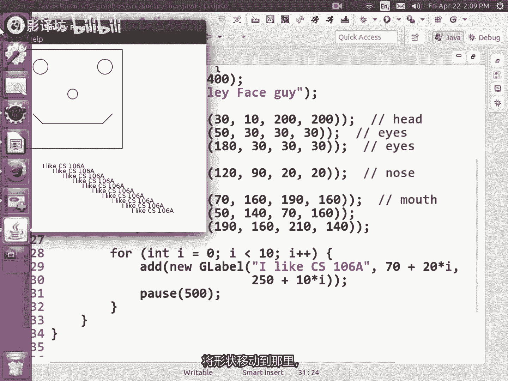

你会明白的，那些正在绘制带有循环的形状，这是我想要的另一个练习，和你们一起讨论，作为一个群体，这是一段包含更多内容的代码循环，我有一些图画可能的输出，可能是这段代码的输出，就是你所需要的。

看看他一秒钟我就会给，你请稍等一下，我会继续努力的，是说我们谈论了，我们同意让我给你一分钟的时间，只看输出，看看不同的图片，你是哪张认为被该代码吸引了，博士莫非，好吧，你认为谁勇敢，有人举手做什么。

你认为还可以，你为什么说是，是的，是的好吧，我完全同意，所以他怎么了，说的是，如果你看看这些参数，记住X是第一个，Y是第二个，然后宽度和高度正确，所以他说X增加了十，记住X坐标表示最左边的X。

如果那么最左边的X坐标会增加，每个类似的矩形应该移动到就其而言有点正确，左边缘应该向右移动，这将排除模式A因为左边缘没有移动到那里，右边缘是那些不同的祝福，你现在第二个参数是Y它正在增加。

所以他们有点下降，它们都有点下降，所以这不一定会消除任何人，但这里的宽度宽度正在减小，所以这里就像这样这样会排除这个吗。

因为在这一个当你往下走时，宽度正在增加，所以基本上这些前两个是篮球圈候选人。

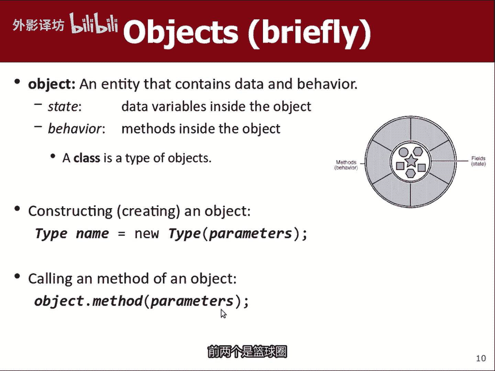

但我们消除了一个，因为X不会在B中增加，所以我想一想以后是否想挑战一下，试着想想我会怎样做对此代码进行调整，以便它可以，而不是你说的B这是正确的，我该如何平局，我怎样才能平局吸你可以通常只需一个。

我认为对这段代码进行了小改动，这是一个很好的练习练习。

无论如何，答案是B好吧，所以我提到这些绘图对象，这些绘画的东西，这些情况是称为对象，我想提醒一下你，是我关于对象的语法，在你实际制作之前向你展示过一个对象，并将其存储到变量中，然后一旦你完成了。

你就可以要用您可以编写的对象上的方法，变量的名称，然后是一个点，然后是您要使用的方法的名称，我想打电话，我已经提到过，简而言之，我们这样做扫描仪，我们用数组列表来做到这一点。

我们将在这里用这些再做一次图形形状，因为我提到过，我们没有画任何颜色，或者我们没有做过任何此类事情，所以如果你想稍微定制一下形状，你必须多使用这种语法。

所以让我告诉你我的意思，如果您将这些形状之一存储为变量中的对象，例如P1椭圆形或T矩形，这些是一些你可以调用的方法，所以让我给你看一个例子，有一个方法称为set fail。

你可以写里面的单词true或false。

C a e s，所以如果你愿意的话，让我给你看一下，如果你看到所有的形状，就会喜欢从这个笑脸来看，他们都是只是概述了，如果我想做什么眼球的颜色，我想要我想要填写他们，所以你可以做的事，对于这些眼睛。

而不是说添加一个新G椭圆形，让我们抓住这个东西吧，在这里剪掉它，我们说G椭圆形I1等于一个新的G椭圆形，所以基本上是什么，我正在做的是我宣布椭圆行为变量，我想制作一个椭圆形那个大小。

我想将其另存为名称为I1的变量，然后是现在我可以把它作为一个变量，只是说添加我赢了，所以我现在基本上是一样的，总体行为和我当时的情况一样，以前喜欢做这样的事情，基本上与做某事相同，像这样。

但关键的区别是，现在对于这个短暂的窗口，我有这个东西，在将其添加到之前，我可以与他交谈，屏幕上，所以这是时间之窗，当我告诉他颜色之类的东西时，自己使用不同的颜色或填充，你自己在这样我就可以说嘿我不会点。

让自己变得真实，现在如果我加上我赢了，那么他看起来就像海盗什么的，但他有一个现在眼球已经充满了，所以我可以做，我可以拉另一只眼睛，同样的东西，这个作为一个变量，我会调用。

哎呀我去哪了，抱歉我得到了，现在要是错了，我会说GOOIR等于一个新的G椭圆形，我将添加I2O抱歉。

如果我想填写的话，我会说我要点击填充，哎呀设置填充为真，所以现在两个，眼睛已经充满了，所以就一点点语法有点不同，如果我想交谈的话，可以采用不同的风格，这些形状并稍微定制一下，在我把它们放到屏幕上之前。

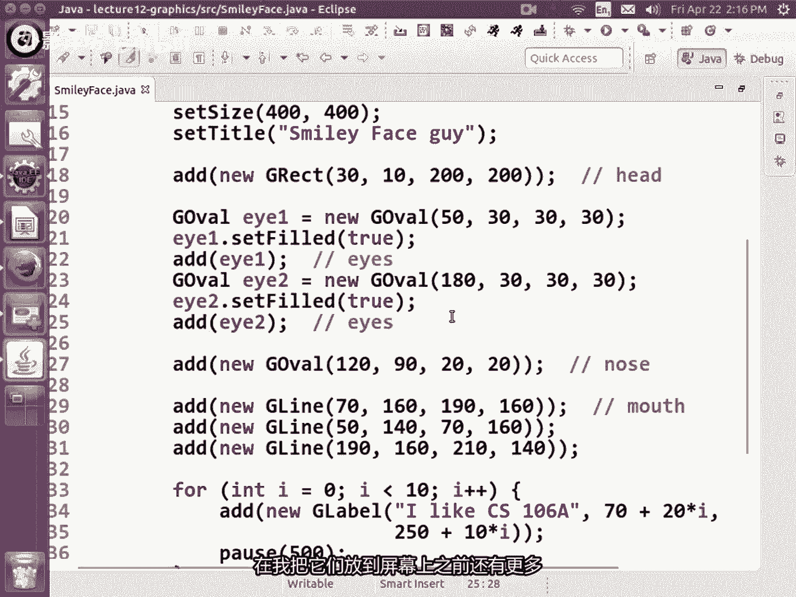

还有更多，我觉得上色最好玩，此时你可以做的事情，他说设置颜色和气味，填充颜色形状有轮廓，颜色和您可以设置室内颜色，如果你想要蓝色的话，分开黑色轮廓的内饰，你可以做，那么让我谈谈如何做颜色。

好奇怪，我有，因为我不知道我必须这样做，如果你想要颜色，请在此处滑动一些，写下单词，颜色大写C然后一个点，然后是颜色的名称，作为大写单词，实际上是一个常数，我认为只有16重颜色或一些接近的数字。

可能是15或16，您可以使用的预定义颜色，java或者如果你想要自定义颜色，可以制作您自己的自定义颜色，例如例如如果我希望这个人有笑脸上的蓝眼睛。

就是这样，我会回到这里，你知道我说设置填充为真，我做我一点击填充颜色为颜色，点蓝色和I可以为另一个做同样的事情，眼睛我可以说黑，我让你满足，颜色也变成了蓝色，现在她有美丽的蓝眼睛，所以你就可以了。

也许我想让她有一个红鼻子，所以下面我要添加鼻子的地方。

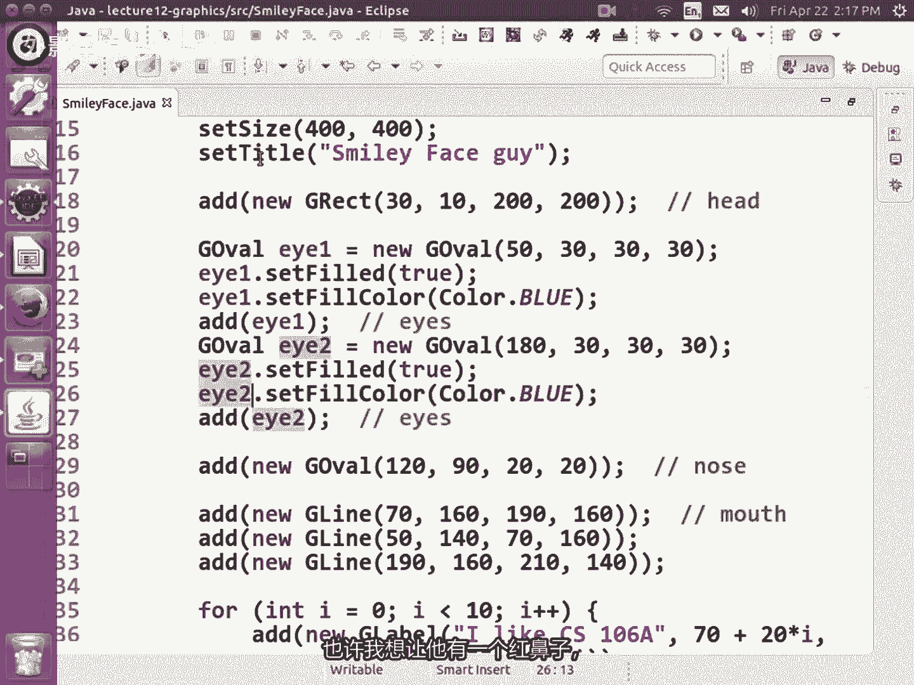

也必须把那个拉出来作为一个变量，所以我会说G椭圆形鼻子等于这个，我会说加鼻子，但是在这里我会说鼻子点击填充真实，我会说鼻子点设置填充颜色为颜色为点红，现在你可以看到他的整体面貌了。

火鸡也通过颜色，在这里我在其中添加了这个人的整体头部，让我把它拿出来，并说头说，我会说GREX头等于，如果我假填写，也许我会给泰尼知道健康的黄色皮肤合适，我会说耳机填充真实。

我会说头点设置填充颜色为是黄色的点。

现在如果我跑他有黄皮肤，所以他很友善。

就像辛普森拒绝什么的，是的，有趣的是，贝尔一旦你开始填写订单，开始变得重要了，我们说它就像拼贴画或其他按顺序排列的东西，您可以在其中制作形状，并添加它们到屏幕上，几乎就像这样绘制在顶部。

所以我是第一个绘制的，就像背景一样，然后你以后画的任何东西都会继续。

最重要的是，我想我的观点是，如果我决定画眼睛，先把鼻子放进嘴里，然后再放进嘴里，经历了这一切之后，我决定画画黄色矩形，代表他的头爱只会看到一个空的黄色矩形，因为我画的是我画的眼睛，我画出它们的鼻子。

然后画出嘴巴哇，哦我在那些我的上面画了黄色，盖住它们，所以有时你必须组织形状，绘图的顺序匹配谁在谁之上。

为了你知道，所以让我关闭它，撤销他，并把他放回去好吧。

所以让我认为还有其他属性吗，我想向你展示这一点。

让我们看看哦，还有另一个类似的if，如果您正在与这样的标签交谈，那么您就是我在屏幕上看到了这个标签，实际上可以设置所谓的字体标签，就像你知道的快递芯泰晤士新罗马字体。

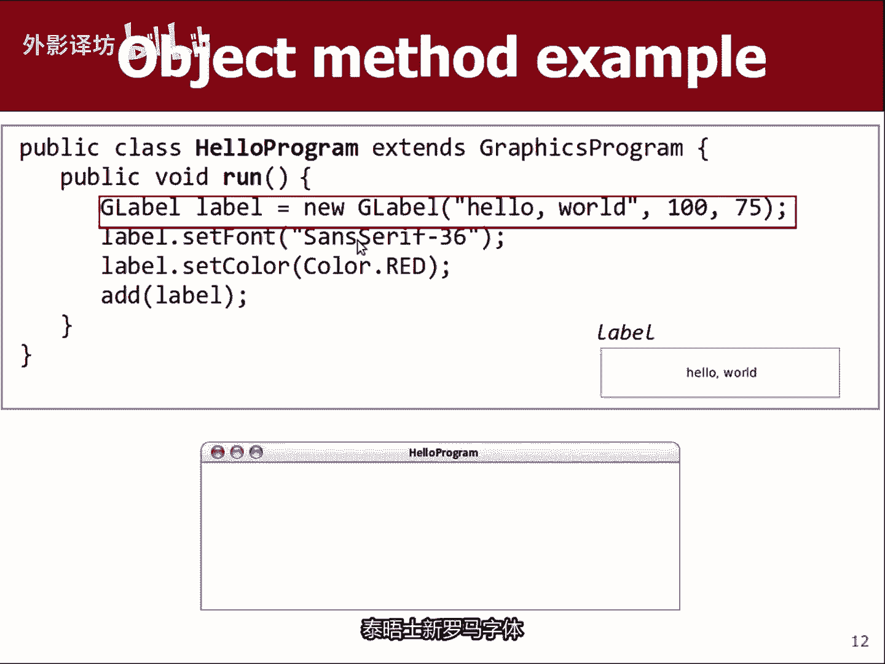

还有VETICA这些字体，你可以设置那些这样，文本就会显示在不同的字体，所以在下面当我有这个标签时，底部写着我喜欢106A，也许我会做的事，把这个拿出来，我会说I牙标签标签等于一个新的G标签。

其中包含所有那个广告标签，但也许在我添加之前，我会将标签点设置为字体，comic sense ms40之类的字体是什么，或者一些大胆的东西，我不知道我是否有我在LINUX上使用这种字体。

但我想我是这样的天哪，我们手中的力量是强大的，我没时间了，祝周末愉快，我们将在周一制作更多图形。

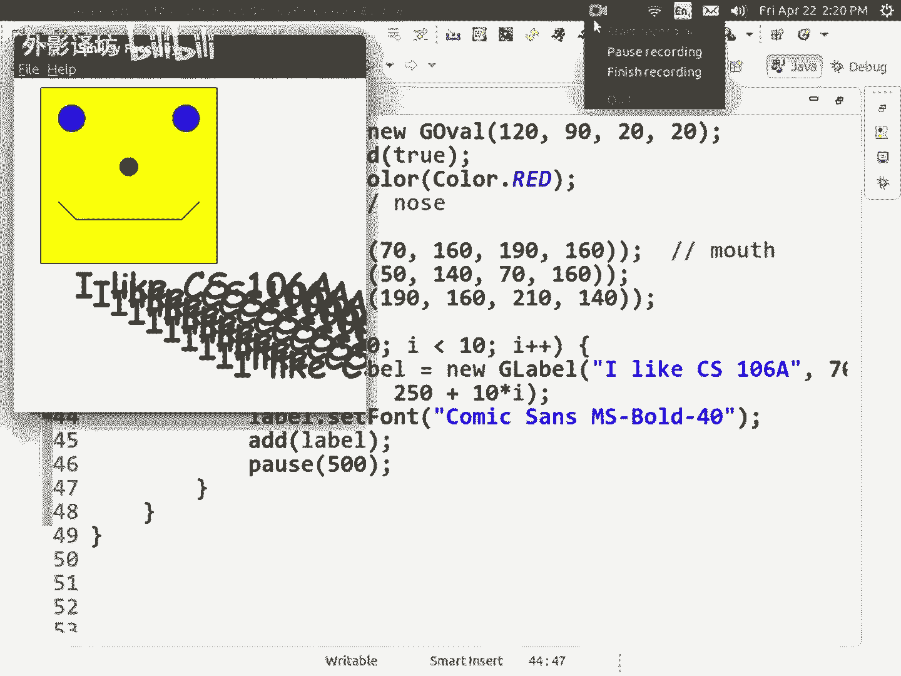