# 【中文配音】斯坦福王牌课程 CS 106a Java教程 2017年春季课程 - P13：13_ Animation - 外影译坊 - BV14U4geNEEq

好吧快点，我们开始之前的公告，第一个公告，我通常有办公室，周一课后几个小时，我有一个我必须错过的重要冲突，我今天的办公时间，抱歉，如果你有一个简单的问题要问我，讲座结束后，你就可以联系我，否则我会化妆。

星期三或星期三下午，当然是用办公时间来弥补，您可以随时通过在线电子邮件联系我，或如果您需要请联系PSA留言板，任何东西图层都会打开，今晚也是如此，我们正在做什么，今天我们要介绍的是，我要拿更多的图形。

上周五尼克离开的地方无法参加下一次讲座，因为我有冲突，但听起来像尼克做的很好，没有做的很好，在你到达之前，我告诉他们，他们全部获得十额外学分，大力鼓掌，不只是开玩笑，是的，听起来我们做的很好。

我是有点生气，因为我告诉他，不要像我说的那样，对我看去有点容易，不要做的那么好，这样当我回来时，他们会想念我的，但他没有听从我的指示，所以我必须严厉，稍后与尼克谈论此事，但我想了解尼克的过去。

掩盖他正在谈论通风口，并让你可以点击和移动，他们出去了，他也做了这种事，谈论了一个叫做领域的东西，我将稍微回顾一下今天的讲座结束后，你将会得到所有将用于的材料，第四个家庭作业是今天起床。

你知道我通常不会谈论了很多，我的作业确实想做作业，第二个，这样你就可以看到哪里，我们正朝这里走，所以不要太害怕，但这就是你需要做的，我总是发布这些可运行的演示吗，您可以为每个作业运行。

你要做一个叫做突破，就是你有一个弹跳球，它会打破这些砖块，在这里你试着移动你的小东西，嘴里，你看到讲台列了吗，用我的鼠标光标，我尝试移动，使得如果我没击中球，球拍就会击中他掉下来，我失去了一盏灯。

但使用了转身，目标是尝试打破一切，尽快积木并获得尽可能多的积分，尽你所能，所以就是这样，作业四即将完成，看起来真的很艰难，而且很可怕，你知道这是一项具有挑战性的任务，但我要指出的是。

他使用了很多我们一直在向你学习的东西，知道图形形状和颜色，就球的移动而言，这是我想教你的动画，今天如何制作动画，那就是我们仍然缺少一些东西，所以这就是我今天要讲的。

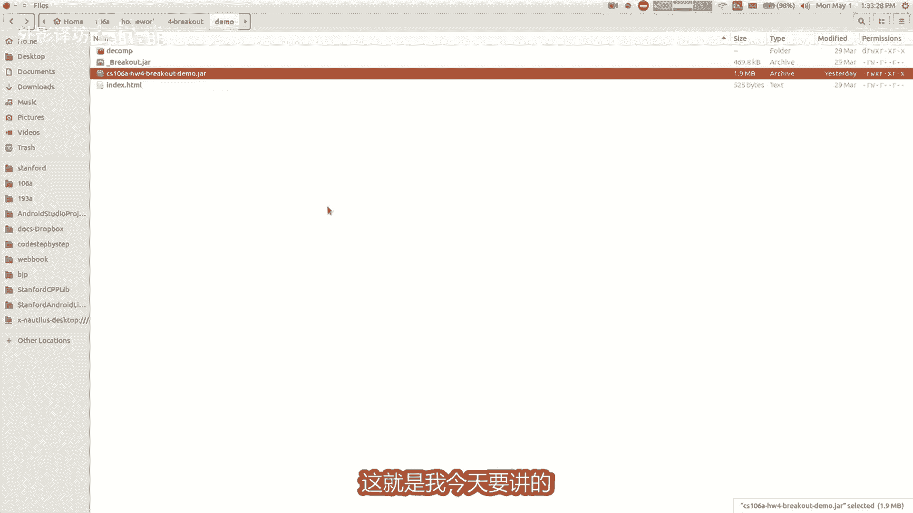

让我先看第一天的幻灯片，我要让你知道回顾一下尼克对事件说了几句话，那又怎样，尼克用了那个词吗，上周五，这是否意味着这是一个事件嗯，事实上发生了什么，好的，这是一个由以下原因引发的操作用户。

它会导致一些代码运行，但是他在run方法中是的，这是一个我认为描述它的有趣方式，这是对事件的良好直觉，事件是发生的事情程序，通常图形程序可以像您所说的那样，经常回复用户发起用户单击鼠标。

我们使用这样的关键类型，这些被称为事件程序，可以居住并等待事件发生发生，然后对这些事件作出反应，以及等待事件的想法回应他们真的很重要，图形的真正核心概念编程你必须使用它，每当你写图形时的想法。

程序并非所有事件都来自用户，还有其他种类的事情，比如也许你正在编写一个网络程序，当消息通过网络到达时，这可能被视为一个事件，您的程序和当前的用户屏幕，除了网络发送了消息或者其他东西，就这样，但无论如何。

现在这样，我很好认为将他们视为就好，您可以响应的用户操作，你知道尼克正在写一个程序，像这样打地鼠这些痣出现的地方，你必须点击它们，然后更多当你点击它时就离开了，有点正确。

所以我想要重新打开我刚刚拿走的文件，你可周五写的，我把它放在我的今天的项目，我想看看文件更多，所以让我们刷新一下，记住这个程序，很快这些事件让你知道一些事情，你知道有一个事件发生发生。

并导致一个方法运行，你的代码就像你点击一个按钮，或者你移动鼠标会引发一个事件，事件导致方法运行，并且通常您的活动中会发生什么，处理方法就是你做某事，更新屏幕上的形状，如果你更新了形状。

屏幕上的窗口看起来会有所不同，所以看起来就像窗户一样，正确响应了该事件，这里的想法和这些方法，屏幕上有哪些方法，对于事件反映良好的尼克向你展示，我相信幻灯片你看起来有点像这样。

必须在A处编写这些事检方法，特殊需求，如果你有这些你的程序中的方法，你的程序现在将响应这些类型事务，所以如果你写一个鼠标移动方法，当鼠标移动时程序会做出反应，如果你写一个鼠标按下方法，当用户按下时。

程序将做出反应，如果你不写，就按鼠标按钮，您的程序将忽略这些方法这些东西。

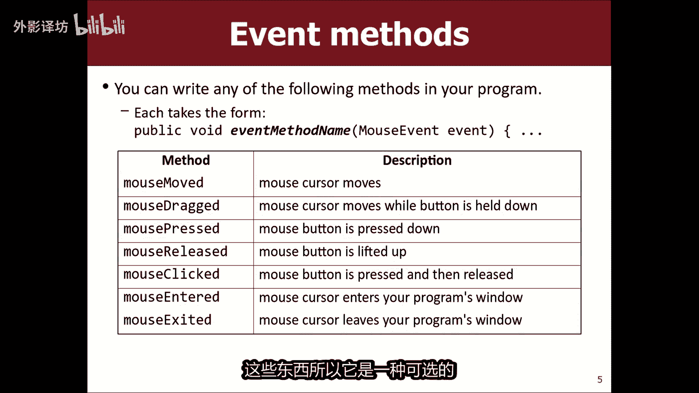

所以它是一种可选的，你可以这样写代码，尼克编写的打地鼠程序，这是他写的程序下载了，所以他写了一个run方法，他在这里有一个方法叫做鼠标单击，因此当用户单击时，鼠标这个方法会运行，保佑你。

我相信尼克也教过你，这个方法有一个特定的标题，拥有这个特定的参数，并且它必须有一个void返回类型，并且这个调用事件的参数有信息，您可以在其中使用程序，所以如果它是一个鼠标事件，你可以hex坐标是多少。

光标所在位置的Y坐标位于，这样你就可以在那里做一些事情，位置如果你想要的话，那么他他有没有说让我问一下这是什么，位于该坐标，我将从屏幕上取下该卷，这样您就可以一个卡麦勒，所以你点击我想要的痣。

删除那颗痣，让它消失，右击地鼠点击，现在我必须承认，你知道我只是我是动物权利倡导者，所以我欢迎对这个例子感到满意，你选择周五做的事，我会如果得到你的允许，我愿意稍微改变一下，你知道我告诉你，没有暴力。

没有偏执，所有这些东西你都没有听，没关系，我们的真正问题是，如果你愿意的话，每周都会开会重命名程序，而不是打地鼠，你知道我是否也想打鼹鼠，或者一些你从未尝试过做的事情，他不允许你改变在这里命名。

因为dog java文件必须与你写的名字相匹配，在代码中你可以做什么，相反你可以右键单击此处，并你可以说重构重命名，重构意味着重塑或重组现有代码，所以我将其重命名为重击阿莫尔，我宁愿让他成为积极的事情。

我喜欢弹出图片，我的狗ABI以及当你点击它们时，就好像你不去ABI敲打一些墙壁，这已经有一段时间了，我打算称它为宠物，爱比死了，所以我不知道你是否注意到了，但他改变了这里的名字，这里似乎是你的文件名。

你的言书礼物，我有一个新文件，这里称为B点ping，我只想看看我的PHOTOSHOP技巧，我在这里所做的是，我下载了一个，我的狗练习其中之一的照片，我刚刚在讲座开始，然后我删除了背景。

所以我用我很棒的Photoshop，将B放在后台的技能状态，所以我要放红色AB对接，我要重新运行这个程序，我们会看看我们得到了什么，所以现在我要去，我有一堆现在出现的ABI，你认识一个人。

谁有很多游戏开发经验，经验，可能表明它更容易正确的触及这个更大的目标，也许我不想要巨大的版本，如果你想调整两个AABI图像的大小，你知道吗，这是如何完成的，你的猜测或你觉得怎么样，如果现在你会做什么。

站在这里你不知道如何，你想让它变小，否则我就筛选你要点击的内容或输入，或你如何找到今天回答，我们认为他的建议是的，所以，是的，他说的好，我称他为摩尔，所以也许我可以说置设置或设置身高。

或者类似的东西似的，我认为这是一个很好的开始方式，所以我只是问你这个问题的原因，问题是，我希望你建立一个心态，和一系列喜欢学习的步骤，新东西对了，因为我没有是时候教我们所拥有的一切了，闲逛几分钟。

彼此之间我无法涵盖一切，所以你知道你能做的一件事就是看看他的生活，我有所有的清单，您可以运行这些方法或者指示。

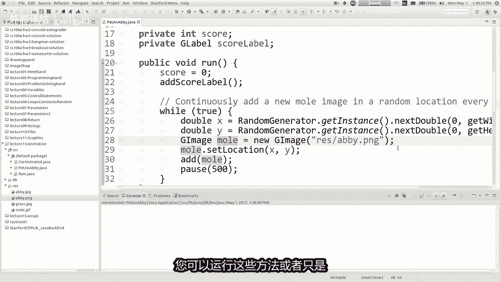

在eclipse中，你可以说，Well more dot what，我能用模具和所有的东西做什么方法会弹出，所以我可以看看他们全部并寻找有用的东西，你说如果我只是输入的话。

设置设置所有以set开头的方法弹出，所以你说确定设置还有设置尺寸宽度和高度，所以那会很有趣。

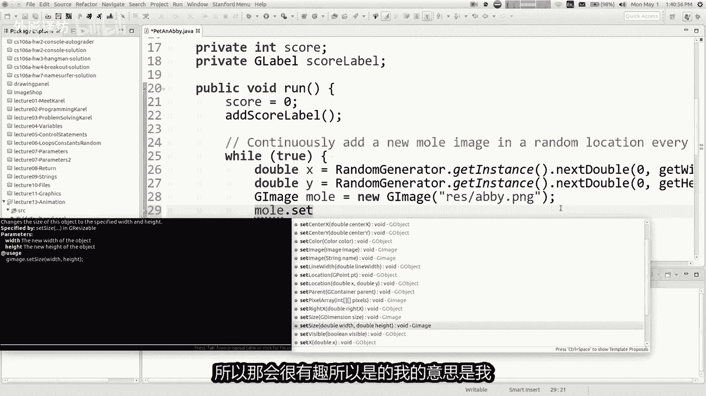

所以是的，我的意思是我我想我只是向你展示，你可以有时会发现这里的东西我们很好，设置尺寸，如果我们每50×50会怎样，像素类似的东西可能会做，现在我们有了小爱，比了更喜欢他，对很有趣好吧。

现在我们有宠物和币好吧，我想重新审视这个的原因，经纪人不只是偶然的放我的法国斗牛犬，在节目中是这样的，也因为我想谈论一个，现在一般情况下的具体特殊情况，如果你点击那只狗，我想它不是明白。

为什么抚摸蜜蜂会产生无檐小便帽消失，但我们会忽略它，当抚摸狗的那一刻，狗就走了，马上就走，但我不确定周五结束时你走了多远，但是如果我抚摸我点击了什么空旷的空间哦，你看到发生了什么了吗。

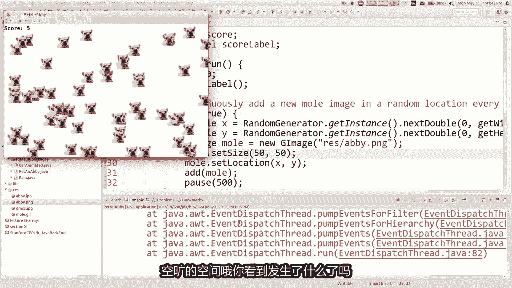

出现一堆愤怒的红色文字，如果我再次点击，看到更多愤怒的红色文字出现在屏幕上，所以我想要我想和你一起看看这个红色的文字，一分钟，如果你向上滚动一点。

他会说一场black black black java正在铺设，No point to exception，这是什么错误，我们的系统出了问题，节目我有一张幻灯片，我想谈谈关于第二个错误在哪里，一个例外。

所以我在我们讨论时提到了这一点，我们正在谈论文件，一个例外是当你的程序运行时，并且出了问题无效，当程序出现错误时发生从中爆发出来，有抛出的，这是异常错误，虽然发生正常，现在我们正在处理图形程序。

还有其他方法，你现在可以看到问题的错误，这就是为什么当我们看到错误时，点击刚才的程序就好了。

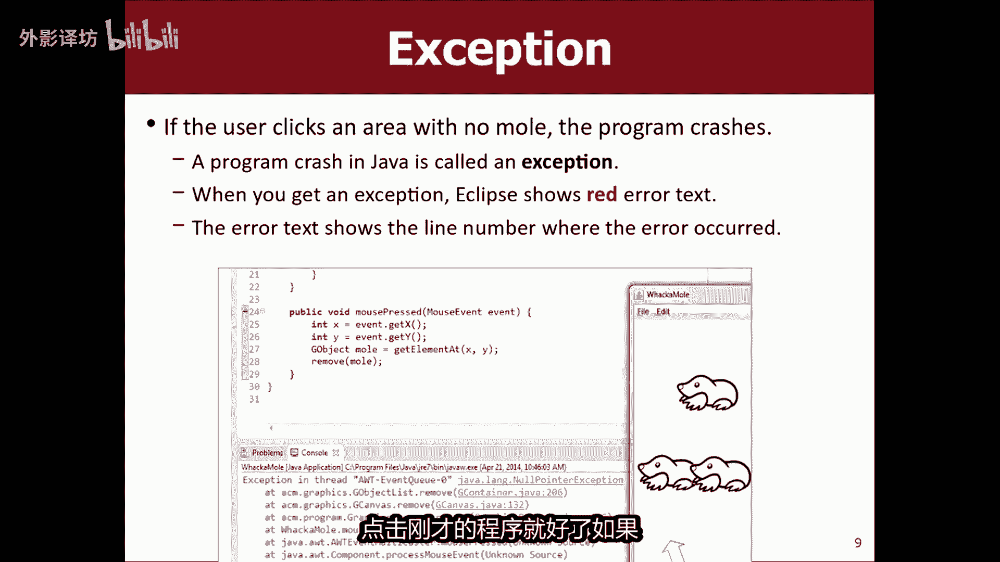

如果你看一下代码，代码是那一刻运行的是代码处理，我们的鼠标右键单击，以便我们单击它，要求鼠标的X和Y，他要求摩尔获得鼠标事件位于那里的AB，然后他试图删除那个B权利，那又怎样。

你认为这是为什么使我的程序崩溃，正是这样的事情，没有图像，没有痣，我所在的地方，没有一个地方，只需点击空白处背景，所以你知道一些东西关于这个程序不喜欢那样，所以他崩溃了，所以真的具体发生的事情是。

当你询问时，对于给定坐标处的元素，那个像素，他会看到所有的，您添加到寡妇的工作表，及其表示哪一个触摸该像素，如果他们仍然没有触及该像素，必须返回一些东西给我的代码，所以如果没有。

它会返回什么物体与该位置很好的匹配。

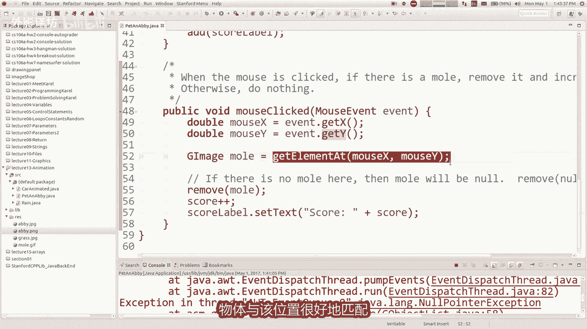

返回一个名为NO NO的特殊值，是一个java上下文，意味着不存在任何物体的缺乏，他有点空虚或虚无state，这是一个奇怪的关键字，我们要做的一些微妙之处，稍后了解更多，但我想我想让你知道的部分。

现在就是这个get element行为，如果存在命令返回该值now，没有物体位于这些位置，坐标和重要的事情，你需要知道知道是now，并不是真正的物体，任何能力去做他不做的事情，有任何方法。

所以如果你尝试使用now执行命令，就像您尝试将颜色设置为低，或添加和从屏幕上删除闹或者其他东西，像这样程序会认为这是错误的，因为你说的是不添加任何内容，屏幕或设置任何颜色，黑色。

他不喜欢那个程序会停下来，所以我想我只是想向您展示解决此错误的方法，解决这个错误的方法是，当我们捕获结果时的内部代码，获取这个元素，我们必须检查是否等于now，只有在没有知识的情况下。

我才应该使用它用于事务，所以它有一个特殊的情况，我们需要处理，所以我会回到这里的程序。

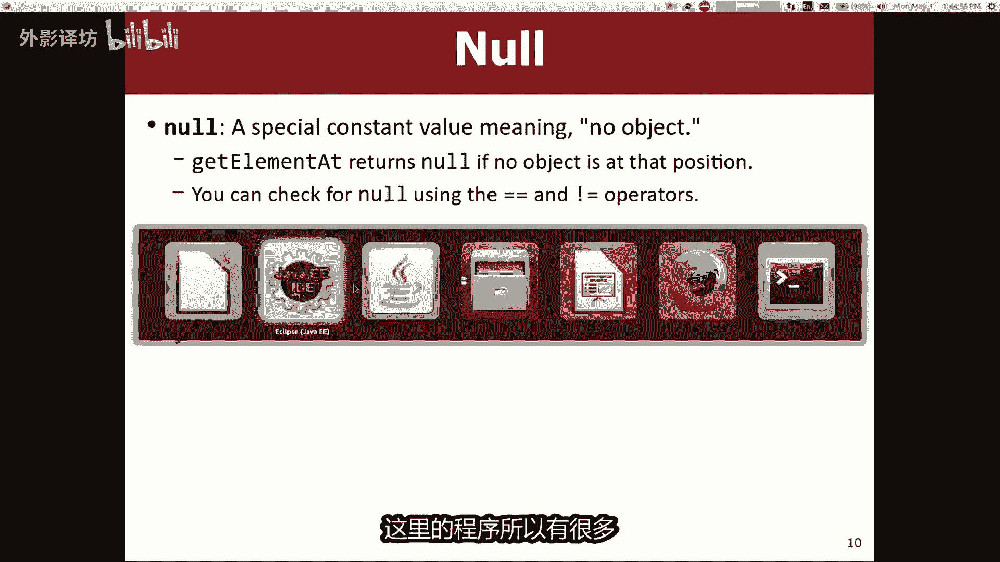

所以有很多插曲，所以在这里而不是仅仅删除和更新分数，我不应该做任何事情，那些东西除非真的有我们点击了阿贝，所以快速修复，只是如果痣不是我会做的，所有这些事情都可以明白了，我的意思是。

你可以你也可以做其他的，你可以这样说，如果志是空的，我不想删除它，否则我会这样做，如果答案是否定的，我想做什么，我不想知道你可以做任何你想做的事情，背景颜色为红色，或我不知道类似的事情。

无论你的眼睛能做什么，你都能做出反应，无论你喜欢什么，但你只是无法添加和删除空值屏幕上。

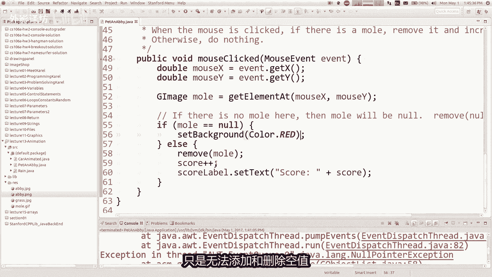

所以如果我重新运行程序，并且我什么也没点击，屏幕就变了红色，但它不再崩溃了，仍然致力于拆除所有修道院，离开屏幕好吧，这不仅仅是想要修补它，上一课结束时提出任何问题，到目前为止，有关事件和点击的信息。

以及已涵盖的空内容，远的。

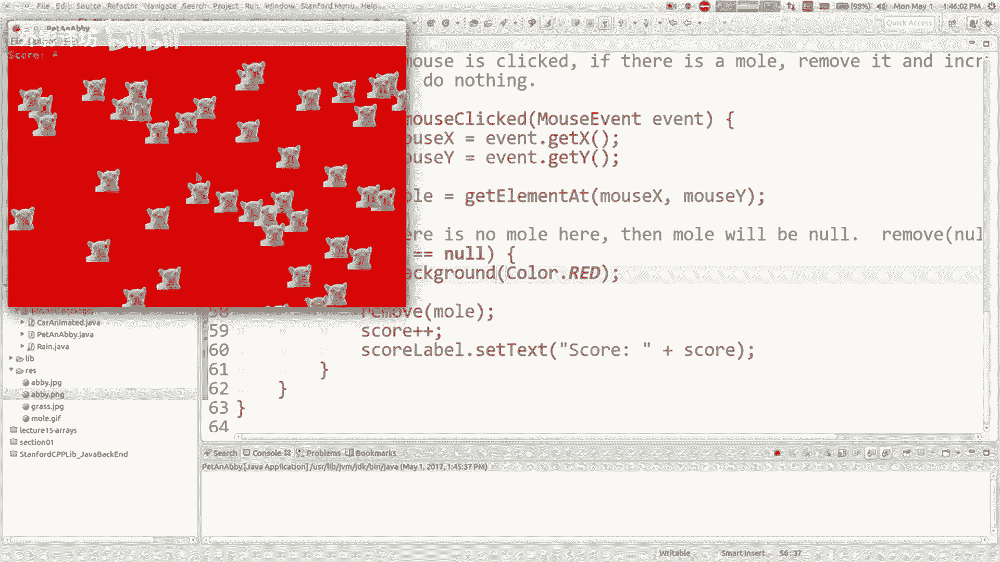

想在这里看到很多滥用行为，20分钟似的，这已经很多了，艾比是我输了，但你知道吗，这意味着我可以放松，我可以得分很多发，不是的，有一天当你，评价我你会到达说喜欢的问题也很好用，上课时间你将会记住，这一刻。

你将会成为旧像，不好吧，尼克还有另一件事，上次使用他的程序就这样了，在这里他有这些变量，他在外面或之前或任何时间声明这些方法，他们说是私有的，评论那些东西是什么，以及什么，想要用它们来做什么。

那些东西的名字似的，但就这么称呼吧，感觉那是对的好吧，感受什么有什么意义，这样做的好处是他发表了演讲，你认为尊重的范围感觉较少，整个文件整个课程，因此你可以在所有课程中使用它不同的方法，是的。

那就是完全正确，基本上就像全局变量，如果可以的话，每个人查看您看到的所有代码，就像一个非常酷的功能，所以尼克可能告诉你，你应该使用该功能始终适用于每个，现在你的代码中只有一个变量，好吧。

实际上不是那里有什么，它不存在过度使用这个功能是件好事，你知道的，为什么要记住，为什么是的，那挺好的是的，我确定你周五说过这句话，就像如果你搞乱了这个变量，如果你做错了什么价值，如果这个变量有上述错误。

现在它可能来自任何地方，你的代码真的很难当出现任何问题时进行调试，你知道的简单的事情之一，计算机科学家发现并修复box就是故障隔离，你说的好，我得到了这时各个不同的文件。

我的意思是我刚刚测试了其中一些东西，所以我知道这个文件或这些文件中的错误，如果你有两个文件，如果你不能制作关于错误所在的任何假设隐藏，它真的很难指出字段，将范围扩展到任何地方，所以总的来说。

我们认为这有点字段太多，正如尼克所说，你知道你只想在这里放一些东西，它必须是顶部的一个字段，并且你怎么知道某件事是否必须是，你有什么想法，我该怎么办，决定我该如何回答某事是否值得的问题。

到或需要是一个字段或，我的意思是你需要做出这个决定，作业四，所以我很好奇你是怎么做的决定，那不可能，如果你想返回两件事，从一种方法，也许你需要一个字段，因为这可能是正确的，也可能是意味着你的方法太大了。

你需要将其分成两个方法或其他方法，就像那样，我认为那是在右边跟踪，但还有其他事情，例如你应该看看你在哪里使用我的价值，在运行中我也在B中使用它，鼠标点击在哪里，我用它，我认为一个好主意是。

就像您在中使用变量一样，您无法添加鼠标事件代码，这些鼠标的任何新参数点击方法，无法添加任何返回鼠标点击的值，它让你拥有这样的方法标题，所以如果有你需要的值，需要超越一键点击的生活。

你正在做的事情可能是需要几个或更多的值，一般来说你谈论的是，我会说，如果你有多次回报，您在多个应用程序中使用的值，所有人都需要的代码方法，这不是一个简单的方法，让其中之一将其作为参数传递出于某种原因。

到另一个一个好的候选人进行审查，和一般来说，这是一种简单的制作方法，不是一个您应该尽量不去的领域。

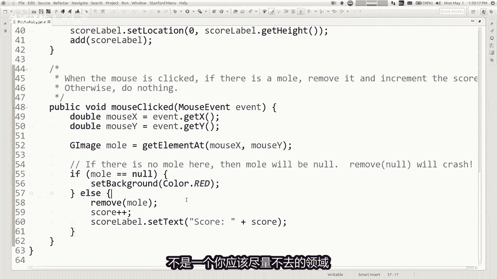

让它看起来如此，无论如何，我们现在所处的位置，我想要返回我的幻灯片，我想谈谈关于一些额外的功能，可以帮我们做动画，所以让我让我现在你们知道了，继续吧，当物体向右移动时的动画。

所以动画是一个非常简单的概念，基本上你所做的就是跑步方法，你有一个循环说我想要更新我想要的一些形状，将它们移动到新位置，或更改它们的颜色或其他东西，然后我想要实际上暂停一会儿。

next程序基本上有一些动画，因为它让一个新的ABI出现，每隔一段时间就会有一些动画，但它是之间如此长的延迟时间更新，它看起来不像平滑的运动，这是相同的想法，移动周围的事物发生变化事，请暂停一下。

短线并重复，我们经常把在while循环中可能是无限，while循环或while循环，直到您单击按钮结束动画或类似的东西，现在可以了，你应该暂停多久，这个程序很好，我的意思是永远不做任何事情。

如果你玩电子游戏，你可能知道就像很多人一样，视频游戏每帧运行60帧秒或每秒30帧，这样您暂停大约1/30或1/60秒，是一个美丽的良好的经验法则和要求的，暂停几毫秒，所以如果你通过四。

如果你过了20ms，你就会每秒有50帧之类的，像这样你就可以玩它，直到它对你来说看起来不错，所以这是一个基本的动画的想法，仅此而已，我们需要开始玩一些东西，这里是你想要使用的方法，更新你的形状。

是这些得到核设置方法，以便您可以询问形状，用于辅助X或Y或宽度或高度，或还有很多其他的事情，你可以还可以选择设置或修改，是额外的谁与你的超级颜色或所有这些，还有其他的事情，还有另外的。

我认为它非常有用的方法，称为move，意思是移动位置，通过一定的偏移量，如果你想要将其设置为更接近以前的位置，只能移动几个像素，这是一个进行运动的好方法，稍微移动一下就可以了，所以有一个一些不同的事情。

我想使用该用途的程序动画，我想做的第一个是雨滴程序，这个很可爱，只是做了一个小圆圈，但出现在顶部，它们只是掉下来，以一定的速率屏幕可以，所以我们要做的就是每隔一段时间。

你想要半秒新的雨滴会出现随机定位的水平，但在窗户顶部是Y坐标，然后作为程序正在运行，它们会跌落到一定程度，每50ms二各像素的速率，好吧，这就是我一直想做的事，就像你知道的，每当我们尝试时。

如果我们必须这样做，请编写这些程序，一件事我喜欢做很多次时间第一，所以也许而不是有很多雨滴让我们写一个程序，这使得一个随机的雨滴出现在顶部。

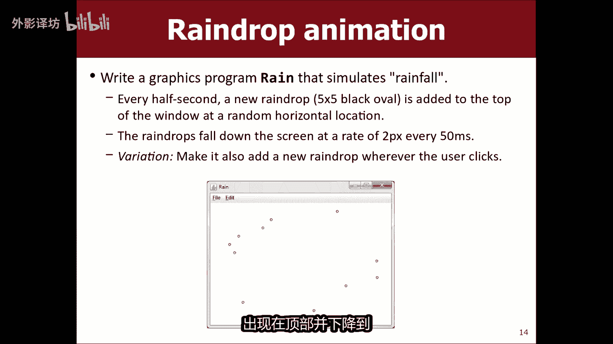

并下降到底部，好的，你可以帮我做，我有一个eclipse中的文件名为vin java，它是空的，所以我只想随机在顶部滴一滴雨，X位置，并使其掉落，所以请帮我告诉我该怎么做。

也许是如何制作一颗雨滴出现在屏幕上，告诉我该怎么做，那工作，他应该是什么类型的图形对象是啊椭圆形好吧，让我们做一个G椭圆形，雨滴，这是一个新的G椭圆形，你在这里输入的坐标，应该传递XAYA宽度和A高度。

所以我不知道X和Y应该是宽度和高度，都应该是这个常量，五五个雨滴大小好吧，你会看到这个很多次做作业的时候，你正在做图形，你做了很多大小和位置恒定不同形状的，以为这样你可以轻松地塑造形状和调整大小。

扩展你的用户界面，做好事就好，X和Y是什么，我们来做吧，更简单的一个是Y坐标是什么，这个东西应该首先出现在屏幕顶部的，Y坐标是多少，右上零的Y坐标0X是什么，他应该只是随机选择一个位置正确。

所以我该如何随机，因为随机生成器是右随机的生成器，获取实例点下一个整数和，那么你应该经过一分钟max，我允许的最小X是多少，零，屏幕的最大宽度是多少，这是屏幕的大小，如果需要的话，现在就调用获取宽度。

对此要迂腐，当然我们从技术上来说，我们是计算机人吗，相处并不是真正正确的界限，因为那时你的游戏就结束了，你可以得到这样的窗口，然后你可能会制作一个雨滴，主要是就在屏幕之外，技术上怎么样。

真的应该是你得到的，最终法庭，雨雨滴大小就在那里，斯坦利，这样我们就可以到达最远的地方，放一颗雨滴，会在这里大，我们所能放置的最右边的那里会有雨滴，好吧太好了，所以我们做了一个随机的X。

我们将构建雨滴形状，就在那里，我们会将其添加到屏幕上，太棒了，我有一个雨滴，所以这就是雨滴部分，然后我们应该做到摔倒了，KIMI知道DECOMM是很好，所以喜欢这个事情，制作一个雨滴。

我为什么不制作一个方法，称为让他下雨，我听到孩子们说，那是你怎么称呼他，所以也许跑步的第一件事是，你说做到下雨就做一个雨滴，然后做突袭恶摔倒了好吧，这是一个动画部分，记住我说的。

你在循环中制作一个循环的动画，你更新形状，然后等待当某些东西更新雨滴重量时，正确的好吧，他及时说了些什么。

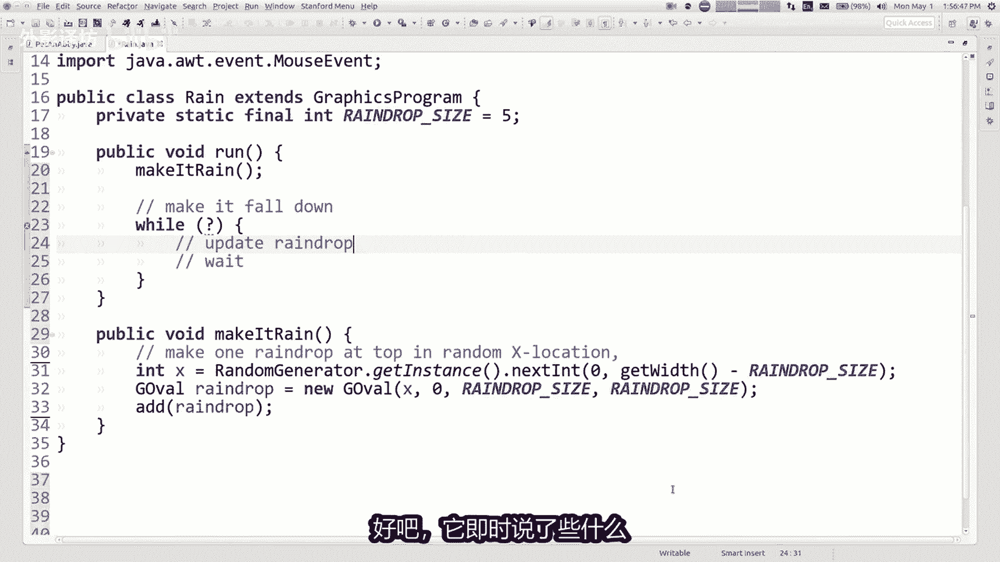

这个问题说的是雨滴落下，每隔两个像素向下移动屏幕50个音符，所以50ms可以。

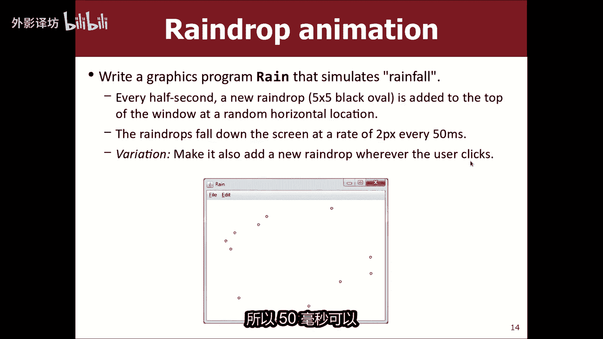

这就是你们要等多久正确，因此等待暂停50ms好吧，更新雨滴，应该掉落两个像素，对了，我让雨滴落下两颗像素，今天对这个词感到抱歉，是的，不要向右移动。

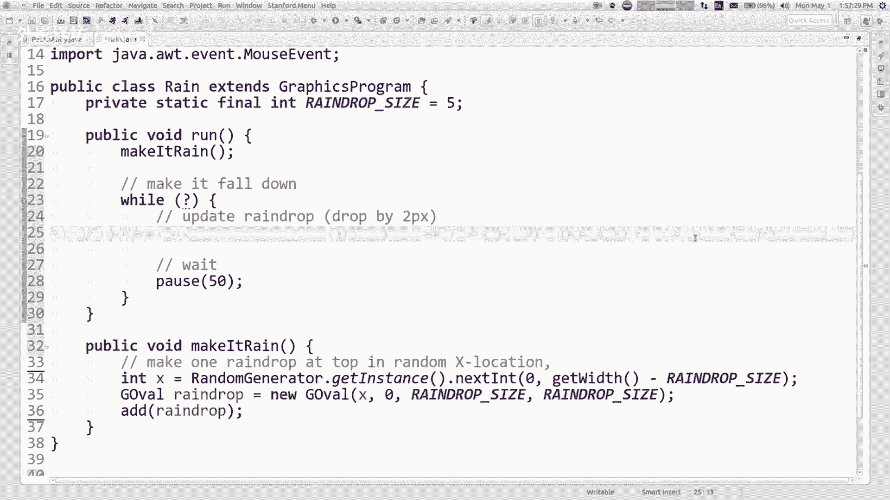

所以如果你看这些方法，在这里是图形对象，有一只狗通过DX移动就可以了。

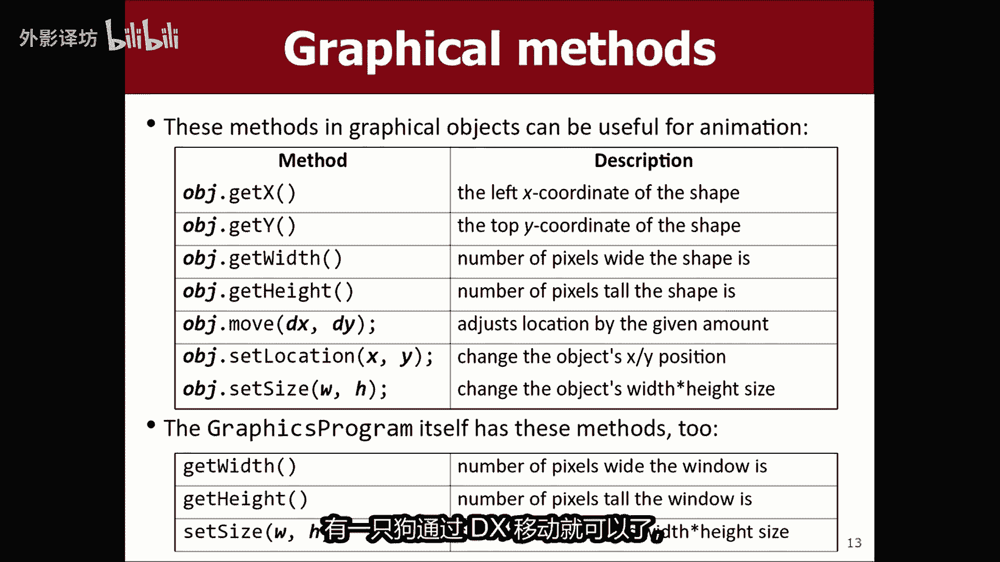

很酷太好了，所以我想移动的对象，这雨滴对吗，所以我会说雨滴在X方向移动零像素方向，并在Y方向上向下，二向右的方向是旗下滑的雨滴，哎呀那是因为雨滴落下来了，好吧，也许我会回来，也许我不知道怎么做，下雨了。

也许我就放这个，我不知道如何分解这个还有问题，但我会把它放回去，现在他让我说雨滴点移动，我要花多长时间，如果你想要一个无限的，那又如何呢，循环但永远不会停止，你可以说while true。

基本上你是在说wow，真实是真实，继续前进，这意味着继续前进，永远如此，无限循环，让它掉落，永远下来，你想看吗，让我们尝试一下哦，就是这样，这是最棒的，有史以来最酷的事情，看看我们看看小雨滴。

我应该在这个程序中添加一个B，感觉就像一个币头，在每个地方都掉了一个B计划，但闭合突破僵尸太棒了好吧，我们是雨滴，是的，我想要很多雨滴，我怎么做很多雨滴好吧，看来我要做这段代码，很多都正确添加。

他们时不时的或做一些正确的事，但移动和更新它们听起来很难，因为现在我不止拥有一个雨滴，我有很多彩虹，那么如何我要搬家吗，如何更新所有这些不同的雨滴，正确理解好吧，让我们考虑一下他说的。

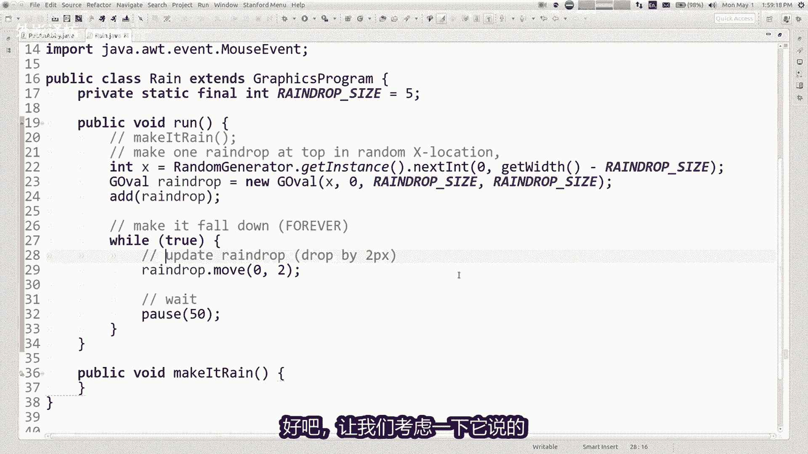

在幻灯片中，我应该有一个新的，每半秒就有雨滴，你会看到，就像我如何实现这个概念。

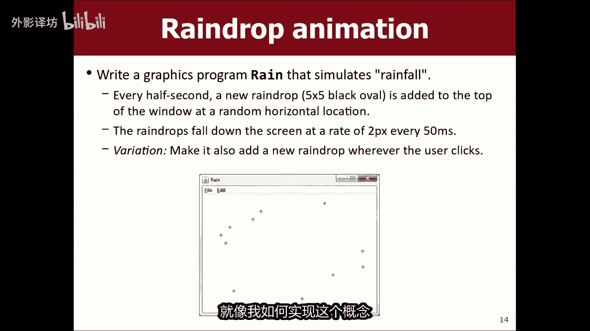

每一个努力积怨，那去哪了，教练在这里，我怎么知道他什么时候发生半秒，哦那么好吧，这与此有关，暂停50，对你说也许可以这样做，在一个循环中，所以我会导致500喜欢，也许是这个的十倍或者其他什么。

我意思是我认为最简单的方法，甚至不一定需要添加任何更多的循环，你可以做的事，你可以说黑，我知道，如果我这样做，50ms后，我每500想做一件事毫秒，所以也许我可以保持类似int的轨迹，经过的时间等于零。

然后每次睡觉时450，我会把经过的时间加上50好吗，类似的东西就很好，如果经过的时间过去了就足够了，到五两百已经半秒了，是的，如果经过的时间是500，那么，我想添加一个新的雨滴，好吧对吧。

实际上这不太正确，因为不只是在500点，而是每500点，500 10001500，我该如何表达我的礼物，磁带每500个，如果我没看到，是的，是的谢谢，如果我还剩500，然后我得到零。

这意味着它是多定位器，这就是我得到的，如果它是多个500，添加一个新的雨滴，所以添加一个新的雨滴，这个代码实际上是对的，让我把它放回去，你已经领先了，我有一个像这样的d com。

制作一个随机Y顶部的雨滴，位于程序开头的so位置，我会让一场雨，然后就在这里，我会每500添加一个新的余地毫秒，现在棘手的部分来了，我想要将雨滴更新为两个像素，但实际上它更像是更新雨滴，更新所有雨滴。

那么我该怎么说，我们需要一个新的，我在trinity的一段代码，如果我想对所有人做点什么。

屏幕上的图形形状有一个这样做的方法，称为forever循环，这是图形中的一种新循环程序，你说的方式，你读的方式，这个代码是你为每个图形所说的，名为HZ的对象，位于这个计划，我会尽一切努力对象。

所以这是一种循环的方式，在这些形状上，所有的形状在你的窗户上，如果你有的话，那就太好了，很多你想做的案例，他们每个人都有一些东西，所以这正是我们想要的这个雨滴程序，这个语法是有点奇怪。

我是说我们已经见过一段时间了，我们见过的循环是这样的，另一个for循环，它对四个进行排序，但是我们没有as，我就像我说的，它被称为AFFORAGE，因为你是基本上是说，对于每个我想要的窗口中的图形对象。

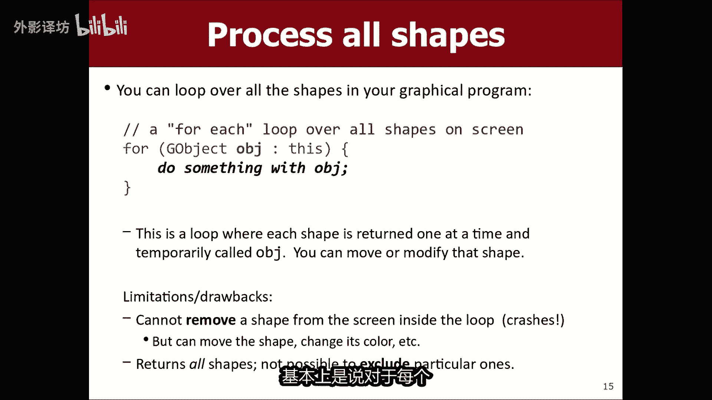

使用该图形对象执行此操作，所以你回到这里，而不是说你对每个图形说你知道的对象哦，我想，告诉那个物体自行移动，这样你说类似godot move或更之类的话，木那个语法有点拟知道有时会让学生感到困惑。

首先但基本上如果有十个雨滴，这个循环将重复十次，在这十个中的每一个中，雨滴将寺庙空气暂时简称为走走去去去，你会告诉每个人，他们将自己移动两个像素，看看我们正在下雨，你的狗或者，不管你知道现在正在下雨。

很酷，记得我们是如何度过的，我们可以添加那些很酷的常量，我们说的更多常数像雨滴大小的东西，我们希望它们更大一点，想要雨滴的速度最多次，所以我们不是移动二，按雨滴速度移动，诸如此类事情是对的。

所以现在我们也做这些雨滴，充满了雨滴，填充为真实雨滴设置填充，颜色为青色，有点像水汪汪的颜色，好了，现在我们有一点了，更大的雨滴移动一点，更快的向下滑动屏幕后面，是的，构成X坐标的部分。

这一部分是随机的，在那里我们随机挑选一个，所以你知道他是怎么说的，每500每次我们都在几毫秒内下雨运行，该方法它会选择一个新位置，并在该位置添加一个雨滴在屏幕顶部，然后同时整个代码有这个循环。

这仍在继续，所以它是制作新的雨滴物体，就像所有其他的都在下降一样，如果他想要同样的职位，下一个或最后一个，所以如果你是这样做，你可能需要一个你想要的私有字段，记住你之前选择过X，然后当下一个出现时。

你会做到的，这也许是可能的，即使没有私人景观，但是这就是那种方法，你可能会用这个好吧，让我们，纳入一些事件的内容，尼克在他们这样做之前谈到问题，是的，像其他人一样，是的，所以有一个缺点。

就像如果上面有其他形状怎么办，屏幕就像有一座修道院一样，如果要开始，则在后台移动或其他东西，然后是的，它会移动，每个形状都正确，所以这是一个问题，我们要做的事情之一，稍后学习。

就像我如何获得更多具体选择，李娜又是什么，只是椭圆形或只是这些，现在这个工具只会形状适用于每一个形状，屏幕有点有限，不是你想要的，而是在哪里，我们很快就要开始课程了。

我们将学习如何存储组这个游标中的东西，称为数组以及其他一些有帮助的结构，如果我们想聚集在一起，彼此相关，且紧处理这些形状，但现在这是一种处理一切的方法，在屏幕上，我是否错过了举手的机会，到目前为止。

我想要的任何其他问题，只是循环尼克所做的事情事件，所以我想做这样档，当您单击时，按下鼠标，鼠标点击新的雨滴会出现在哪里，你点击鼠标，那么有哪些我需要对代码进行更改，为了实现这一点。

你点击鼠标就会出现雨滴，你点击并开始下落的地方，像所有元素一样，我该怎么办，是的，我需要感谢你，我需要添加一个鼠标点击方法到这里，所以是的，我会说public void，鼠标点击，你知道。

如果你没有这些名字，并且参数记住，你看他们就在幻灯片中，这样你就可以了，鼠标右键事件事件，所以我想做一个雨滴，出现在用户单击确定的位置，因此我们，有一种方法可以添加雨滴，我可以让屏幕下雨，但这不太正确。

是这样吗，我怎样才能让他真正把用户点击什么的余地，如果你这样做的话，你会在这段代码旁边做什么吗，明白如果我打电话让天下雨，这只会随机产生一个雨滴出现在某个地方，而不是人点击，这就是问题所在。

我们的修复方法是，哦这是一个很好的建议，我真的就像你说的，让我们介绍一个参数，让下雨意为正确，现在我们假设你想要随机地点下雨，但似乎就像我们想做雨滴一样，现在有不同类型的地方，所以让我们让对方告诉我们。

他们想要去哪里，听起来很棒，所以范围如果你告诉我X和Y，我会的在那里放一个雨滴好吧，那会怎样呢，当鼠标移动时，我将X和Y设置为点击了，是的事件，获取X是X坐标事件，get why是Y。

所以基本上让那里下雨就太好了好吧，这对我来说已经足够了，但是向上现在这里说下雨吧，没有传递参数，所以我可能想像这样随机通过东西或任何东西，所以你实际上可以，如果你愿意的话，还有另一种方法。

可能有一个公共空间随机雨滴或者类似的东西，以及它的作用，它会随机选择一个X并调用make下雨了，X和Y都为零，好吧，现在你告诉我让这里下雨，我告诉你你想要什么，X和Y我会用，所以如果它是随机的雨滴。

在这里它将随机使用为X生成一为Y生成零，但如果是鼠标单击，它将使用X的鼠标事件位置和你也在这里奔跑，想起来我在这里也让那里下雨了，所以让我们尝试一下，这样我就能得到雨滴，但如果我点击，我也会得到雨滴。

query轻弹，这样我就能下雨，等待我们酷起来，今晚稻草应变，放下一些陈词滥调，我，单机速度不够快，来绘制无论如何倒下的笑脸，人动画加事件，你会注意到我实际上没有任何私人皮肤，这个节目很有趣吧。

无需私人领域即可做很多事情，有时你需要他们，有时你对这个程序没有任何疑问，这个动画有意义吗，暂停事件，我想要的一切，走吧天哪或者不是的，我可以吗，返回一个有趣的雨滴问题。

你的意思是就像我在这里做一个雨滴，是的，你可以说我想要返回一个按压椭圆形，然后你可以说如果你愿意的话，返回雨滴和喜欢那样就可以了，所以你做什么，我猜你能做的就是在这里，如果那个返回G也会做椭圆形。

你也可以做这个返回一个G椭圆，然后你会说返回make it brain，返回的内容，所以他们都把掉落的东西还回来了，现在你可能会说我为什么要想要那个好吧，也许在这里你会说，像G土原型D1D就等于这个。

也许我会说第一个D设置要着色的填充颜色，红色酸雨或其他什么，首先雨滴是红色的，所以那个也是红色的，但其余的人是我们的团队或类似的事情，你知道吗，你厌倦了青涩，你可以使用相同的随机生成器，对于电次。

你也可以说随机生成器点下一个颜色，让我们制作雨滴大一点，这样20，现在我们有随机颜色的雨滴，凉了吧，大儿子，窗口背景的颜色可以也有一个颜色，就像这里一样，也许当我们添加一个新的随机雨滴时。

我可以说将背景设置为随机生成器，点获取实力点下一个颜色，所以背景颜色也是变化，我希望我有一个声音文件，并且一切顺利，非常接近，但实际上。

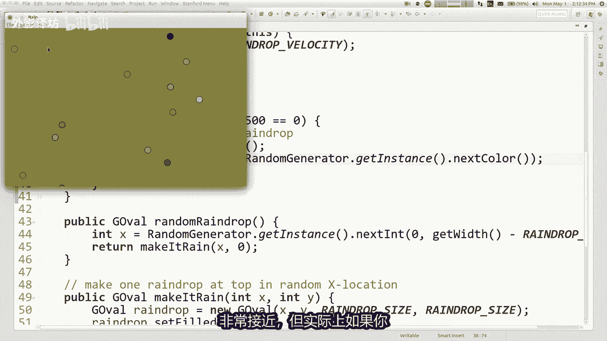

如果你真的希望你能搬家这条线到这里，然后他会只是真的有点疯狂，如果你有以下问题，请移开视线，华丽的衣服N所以无论如何，无论你可以设置随机颜色，以及随机输入动画加图形，很多很有趣。

这就是我想做的一个和你们一起，更多希望我有足够的，我想做一辆动画汽车，所以我通过汽车进行编程。

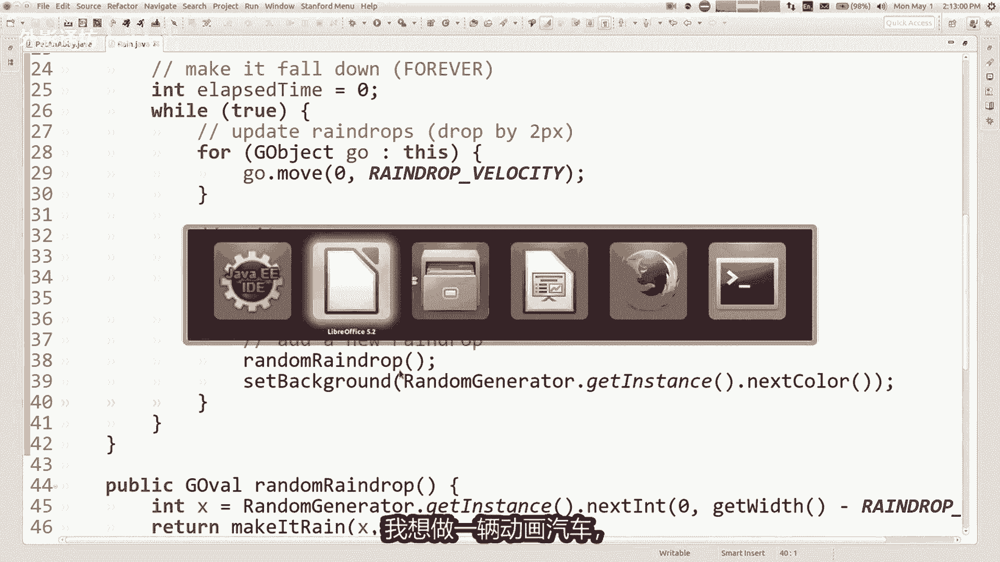

看起来真的很蹩脚的车少一些，几年前你也许想做车开走，一直到一辆汽车沿着屏幕移动，是的，那么我该如何做好呢，这里的幻灯片说的好，也许我可以做汽车撞到边缘时掉头，也许我可以让它加速。

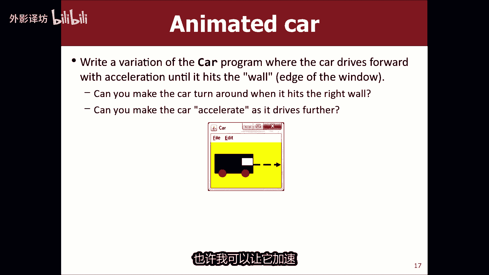

我们不用担心，我会让汽车正常移动，这样汽车程序将关闭这辆车程序看起来像这样，它有一个名为绘制汽车的方法和绘制汽车，制作这些形状和颜色，并添加，将它们显示到屏幕上，就是这样，如果如果你运行那个程序。

它不是动画，但它只是我想，我想本来我加了两三个不同的汽车，这就是我们拥有的原因，X和Y的参数车，但就一分钟我脱光了那些出去的人，就像他们当时那样，当你15岁的时候，你在停车场独自一人。

我只想要一辆车玩一下，以防我在这里撞坏东西，那么我该如何让我们的行动顺利，我我认为我们也会陷入同样的境地，雨滴的情况，我有点想把所有的东西都搬到哪里形状，因为汽车刚刚移动了汽车车身，汽车将开始到来。

除了你知道，就像你可能的那样，想说好吧，你知道我不能放这里，有一个移动汽车的命令，必然是因为我没有这些，我用来制造汽车的变量，祝福你，也许在我画出一张之后，车也许在这里我会写下我的小事。

动画同时真实你知道汽车的车身，我会说车身，这就是这个既为蓝色身体而毁坏，也许我会说汽车的身体移动过去向右时，各像素其中没有任何内容Y方向，然后我会暂停50ms，所以是的，也许我会，然后我运行程序欧不。

我们可能是美国人制造的，不丹的起欧固定或修理到一个领导，是的，所以他并没有移动所有车子的部件很好，所以我可以说身体移动，我可以说轮子移动，轮子移动和挡风玻璃升起，我可以告诉他移除所有汽车的那些部件。

单独好的，没关系，或者我可以将它用于我的每个链接，一分钟前刚刚了解到也可以，但我有点想象，也许有几辆车我不想移动，所有的人，只想移动其中一些，所以我进入我想要的这种情况，移动一组形状。

我会把他们当做一个群体，有时但我不想这样做，屏幕上的每一个形状，也许也许例如我画了一个车，我还有另一辆车，位于40和150左右，我有，另一辆车的电话号码为九十一百三十或任何，我这里有几辆不同的车。

让我们把这个窗口弄大一点，700X500好吧，我们试试吧，哎呀等等，第一个问题，我在哪里，其他车，我以为我告诉你话的三辆车，这实际上有点有趣，但我没有看到一辆车和代码，绘制汽车确实包含XY。

你为什么不这样做，这表明是的先生，我被困在了循环，完全正确，所以在运行中程序从这里开始，并开始跑跑跑，然后就得到了到这里，他跳到绘图车内，并华车一路跑到绘制汽车的底部，以及当它到达时，花车底部卡住了。

永远在这里，它永远不会真正回来运行，它永远不会结束，对划车方法，这意味着我从来没有接到这两个电话，永远无法联系到他们，程序员被困住了，在第一个哎呀，所以这是一个好兆头，我们可能我们应该这样构造代码吗。

可能应该将此代码放入运行中，方法就像幻灯片上所说的那样，如果我把它向上移动一分钟，然后我把当然现在就在这里，问题是我无权访问这个，现在身体变了，他有一个人一个好的建议，你可以退货一个形状。

这样我也许可以还车身体，但其实并没有那么多更好，因为我想要整个汽车不仅仅是车身，你不能将车身和挡风玻璃放回，无论如何，也许我会使用私人的所有这些东西的领域，但我已经大概有三辆车，我可能有十辆车。

我有一个30私人领域，44人，听起来不对的领域，我可能会检查一下是否有相应的风格，是的，所以没办法不谢谢，那么小伙子该做什么呢，允许您将一小部分分组的功能。

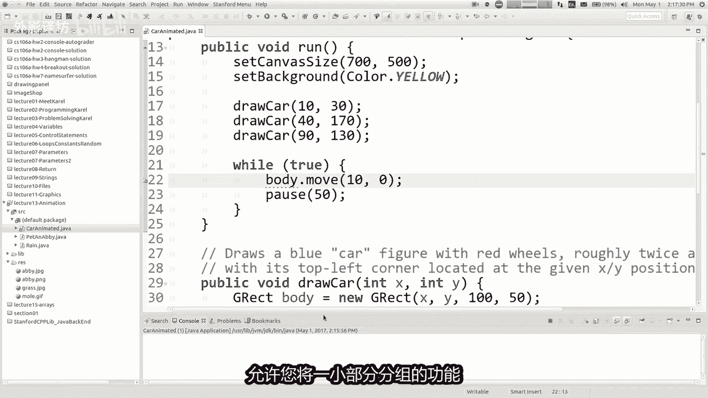

形状的数量在一起，它是称为G化合物，但你将其复合就像一个容器，如果你可以放置形状，它的内部在屏幕上可见，所以它是逻辑分组，所以你做一个G复合，你添加形状，然后您将其添加到屏幕和用户，谁在玩观看游戏。

他们看不到的程序，他们发现了它的形状，无论如何都是不可见的，里面有什么有用的，我们得到的G化合物，将所有这些形状组合成一个变量，更容易坚持和操纵，比如果他们是分开，所以我只有几分钟的时间，总让我告诉你。

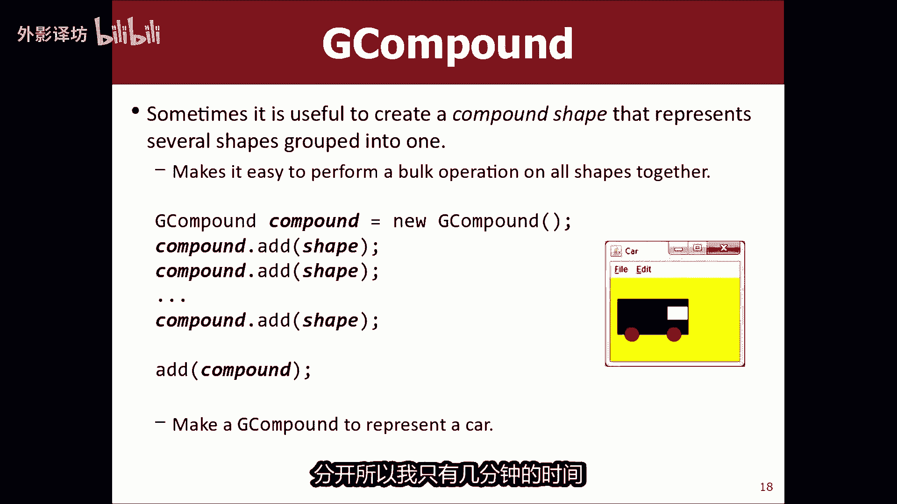

那会是什么，就像车里的碳一样，你要做的就是做一个G复合，为全色新G复合和所有这些调用在这里，你说将主体添加到屏幕上，相反你会在body处说卡车点加轮，易车点加轮挡风玻璃上，现在有两张卡在屏幕上结束。

我将添加整辆车，所以加上克拉克，我不说，如果你只是说添加的话，请点添加，意思是添加到图形程序中添加，现在我已经有一辆车了，而且我我想我会采纳这个好建议，有人想让我们归还这个G复合是我的回报。

所以现在在这个方法结束时，我将还车，希望你保留了收到收据嗯，这样你就可以退回汽车，所以这意味着什么，在这里，当你打电话抽卡时，你可以这样说，G复合车一等于绘制车G，复合车二等于平车。

G复合车三等于绘制车，现在如果我想要其中一辆车移动，我只能说曾经想要的车停止移动，他取其他的，别看他做了什么，我没有完成的事情，问题的描述，当你撞到他们时，他们会停下来或转身屏幕边缘。

但你知道怎么做正确执行此处的操作，当他撞上车时，我该让车停下来吗，我们可以在屏幕边缘执行此操作，稍等一下，然后我们就出去，我怎么知道车是否撞了屏幕右边缘，好吧，你考虑一下，我们周三会再去看看。

网站上有一点作业是的，开始做作业需要几个小时。

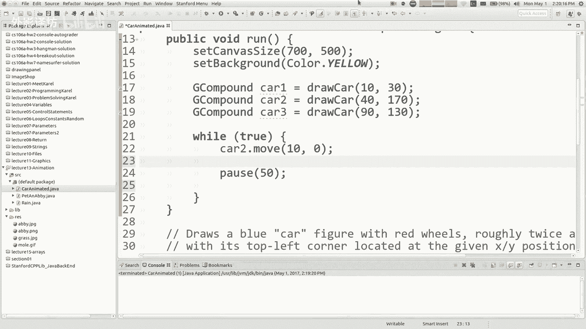