# 课程13：动画 🎬

在本节课中，我们将学习如何为图形程序添加动画效果。我们将从回顾事件处理开始，然后深入探讨动画的核心概念，即通过循环不断更新图形对象的位置并短暂暂停，从而创造出运动的效果。我们还将学习如何使用 `GCompound` 来分组管理多个图形对象。

---

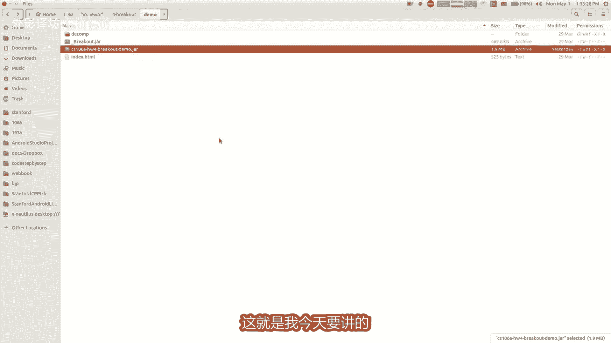

## 公告与回顾

首先是一些课程公告。我通常会在周一课后安排办公时间，但本周一我有一个重要冲突，因此今天的办公时间取消。如果有简单问题，可以在讲座后找我。我会在周三下午安排补上的办公时间。你也可以随时通过电子邮件或课程留言板联系我。

现在，让我们回顾一下上节课的内容。上周五，尼克讲解了事件处理。


事件是程序中发生的事情，通常由用户触发，例如点击鼠标或按下键盘。程序可以等待事件发生，然后运行相应的代码来响应。在图形编程中，这是一个核心概念。

尼克展示了一个“打地鼠”程序。当用户点击鼠标时，程序会运行一个特定的方法（如 `mouseClicked`），该方法可以获取点击的坐标，并对该位置的图形对象进行操作。

为了演示，我修改了尼克的程序，将地鼠图片换成了我的狗ABI的图片，并将程序重命名为“PetABI”。我还调整了图片的大小。

```java
// 示例：设置图片尺寸
GOval abiImage = new GOval(x, y, width, height);
abiImage.setSize(50, 50); // 设置宽度和高度为50像素
```

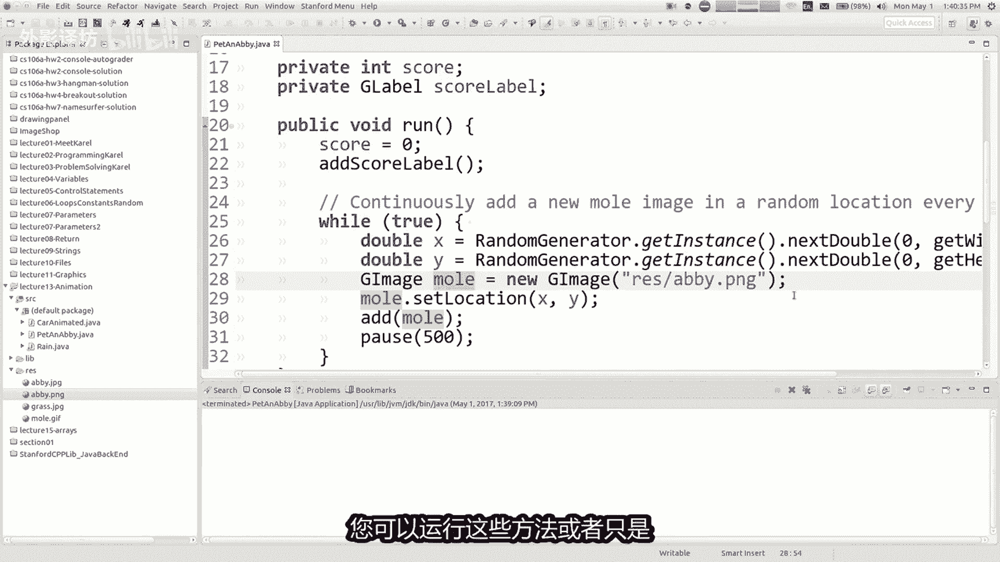

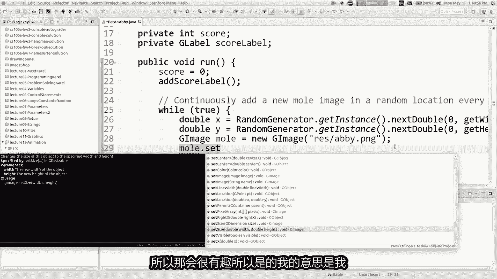

然而，这个程序有一个问题：如果点击空白区域（没有ABI图片的地方），程序会崩溃并抛出 `NullPointerException` 错误。

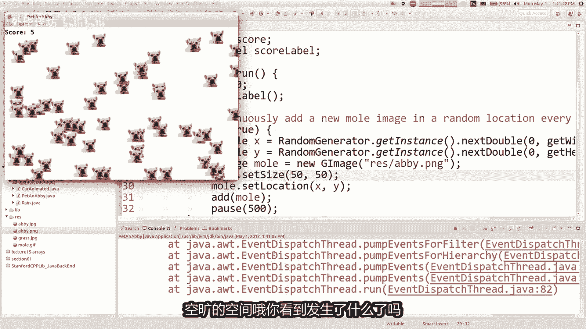

这是因为代码尝试获取点击位置的图形对象，如果该位置没有对象，方法会返回 `null`。尝试对 `null` 执行操作（如删除或修改）就会导致程序出错。


解决方法是在操作前检查对象是否为 `null`：

```java
public void mouseClicked(MouseEvent e) {
    GObject obj = getElementAt(e.getX(), e.getY());
    if (obj != null) {
        // 执行操作，例如移除对象
        remove(obj);
    } else {
        // 点击了空白区域，可以执行其他操作，例如改变背景色
        setBackground(Color.RED);
    }
}
```

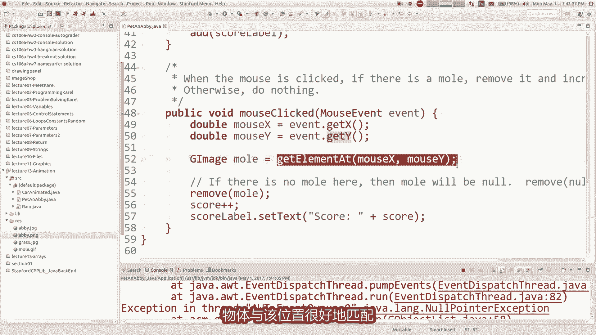

---


## 动画的核心概念 🌀


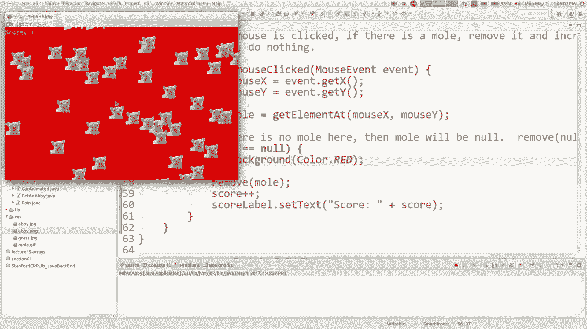

上一节我们介绍了事件，本节中我们来看看如何创建动画。

动画的基本思想很简单：在循环中不断更新图形对象（例如位置、颜色），然后短暂暂停，如此反复。这种快速的连续更新在人眼中就形成了平滑的运动。

例如，许多电子游戏以每秒30帧或60帧的速度运行，这意味着每帧之间暂停约33毫秒或16毫秒。

以下是实现动画所需的关键方法：
*   **更新形状**：使用 `getX()`, `getY()`, `setLocation(x, y)`, `setColor(color)` 等方法。
*   **移动形状**：`move(dx, dy)` 方法可以将对象在X和Y方向上移动指定的像素数。
*   **暂停程序**：`pause(milliseconds)` 方法可以让程序暂停指定的毫秒数。

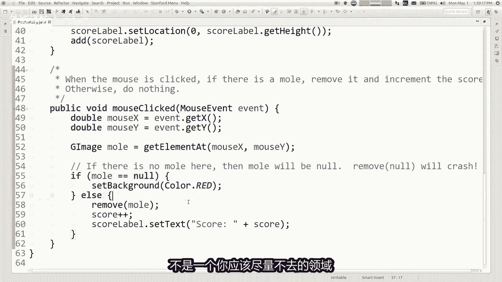

一个典型的动画循环结构如下：

```java
while (true) { // 无限循环，或设置终止条件
    // 更新所有图形对象的状态
    updateAllShapes();
    // 暂停一小段时间
    pause(FRAME_DELAY); // 例如 pause(50) 表示暂停50毫秒
}
```

---

## 案例一：下雨动画 🌧️

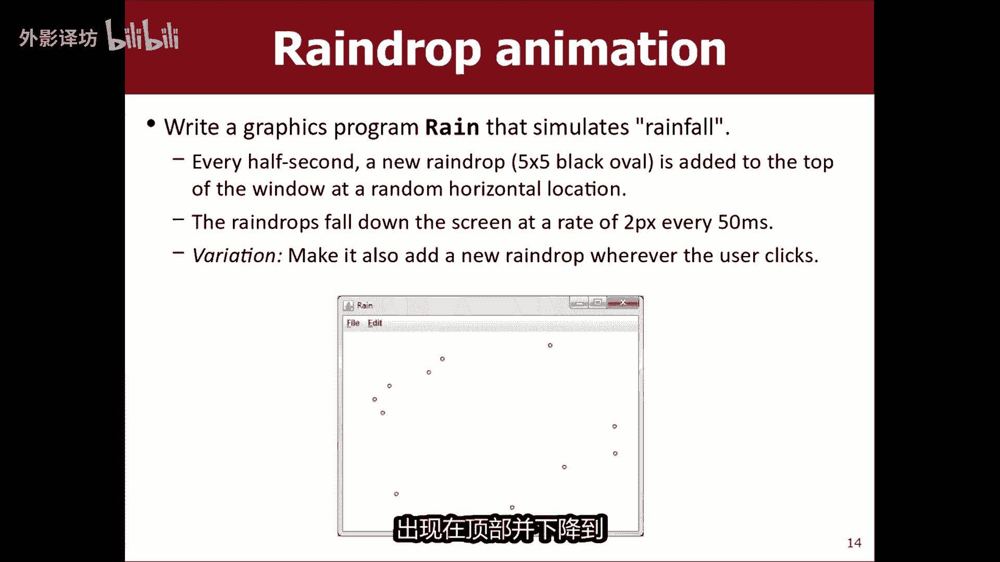

让我们通过一个“下雨”程序来实践动画。目标是让雨滴（圆形）从屏幕顶部随机位置出现，并以恒定速度下落。

首先，我们创建一个雨滴并让它下落。

```java
// 创建雨滴
GOval raindrop = new GOval(x, 0, RAINDROP_SIZE, RAINDROP_SIZE);
raindrop.setFilled(true);
raindrop.setColor(Color.CYAN);
add(raindrop);


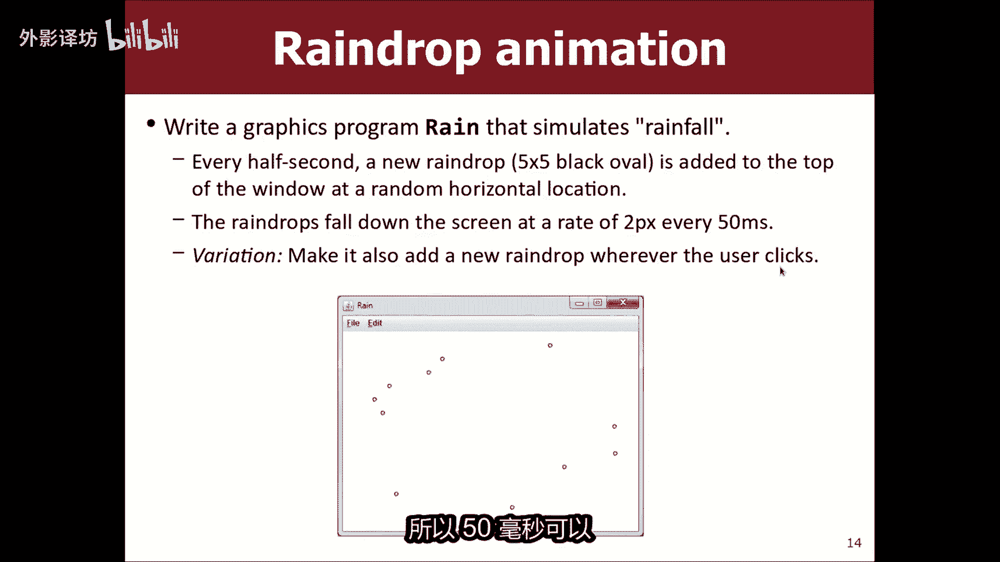

// 动画循环：让雨滴下落
while (true) {
    raindrop.move(0, RAINDROP_SPEED); // 在Y方向移动
    pause(FRAME_DELAY);
}
```

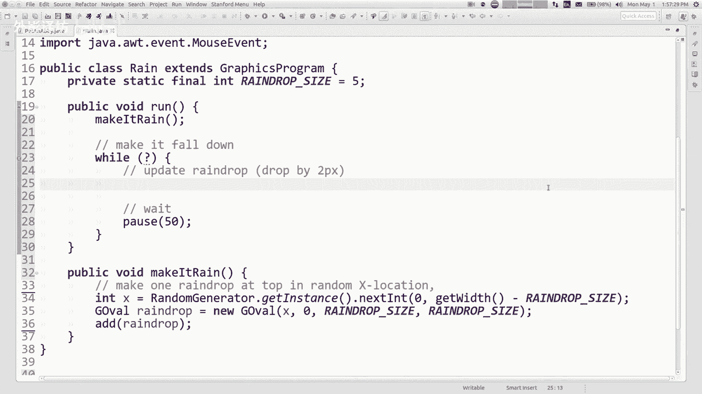


但是，我们想要多个雨滴。我们需要一种方法来管理屏幕上的所有图形对象。

这时，我们可以使用 `for-each` 循环来遍历窗口中的每个图形对象：


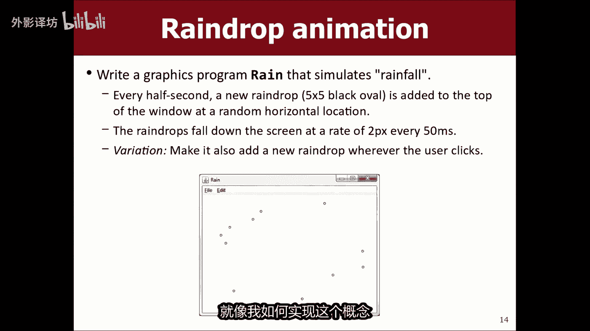

```java
// 遍历窗口中的每个图形对象并移动它们
for (GObject obj : this) {
    obj.move(0, RAINDROP_SPEED);
}
```

为了定期生成新雨滴，我们可以在循环中跟踪时间。每过500毫秒（半秒），就在顶部随机位置创建一个新雨滴。

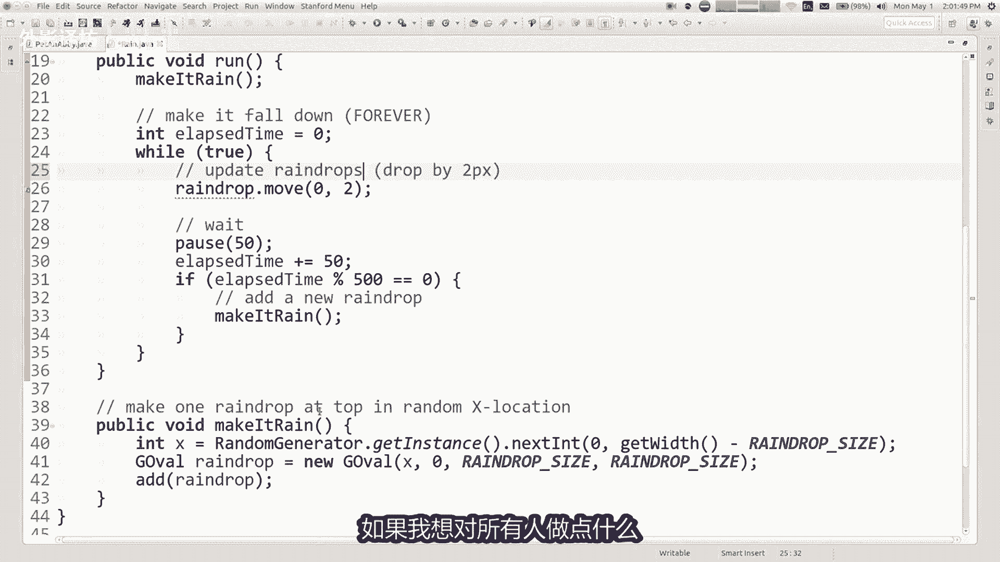

```java
int elapsedTime = 0;
while (true) {
    // 移动所有现有雨滴
    for (GObject obj : this) {
        obj.move(0, RAINDROP_SPEED);
    }
    pause(FRAME_DELAY);
    elapsedTime += FRAME_DELAY;

    // 每500毫秒添加一个新雨滴
    if (elapsedTime % 500 == 0) {
        int randomX = rgen.nextInt(0, getWidth() - RAINDROP_SIZE);
        GOval newDrop = new GOval(randomX, 0, RAINDROP_SIZE, RAINDROP_SIZE);
        // ... 设置颜色等
        add(newDrop);
    }
}
```


我们还可以结合事件处理。例如，让用户点击鼠标时，在点击位置生成一个雨滴。这需要编写 `mouseClicked` 方法，并在其中调用创建雨滴的函数。

---

## 案例二：移动的汽车 🚗

现在，我们尝试制作一个更复杂的动画：让一辆汽车在屏幕上移动。一辆汽车由多个图形部件（车身、车轮、车窗）组成。

如果我们分别移动每个部件，代码会变得冗长且难以管理，尤其是当有多辆汽车时。

这时，`GCompound` 就派上用场了。`GCompound` 是一个容器，可以将多个图形对象组合成一个逻辑整体。你可以将整个复合体作为一个对象来添加、移动或操作。

以下是使用 `GCompound` 创建汽车的示例：

```java
private GCompound drawCar(int x, int y) {
    GCompound car = new GCompound();

    GRect body = new GRect(x, y, 60, 20);
    body.setFilled(true);
    body.setColor(Color.BLUE);
    car.add(body); // 将车身添加到复合体中

    GOval frontWheel = new GOval(x+10, y+15, 10, 10);
    frontWheel.setFilled(true);
    car.add(frontWheel);
    // ... 添加其他部件（后轮、车窗等）

    return car; // 返回整辆汽车（复合体）
}
```

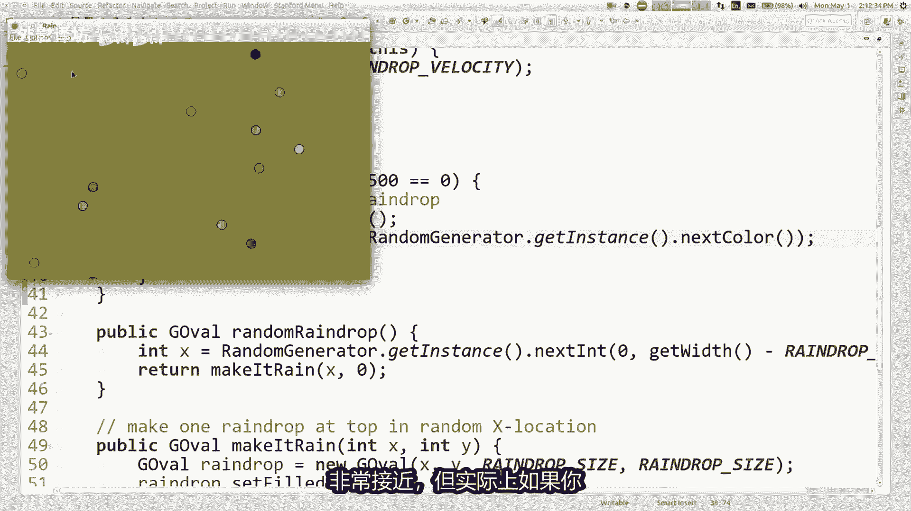

在主程序中，我们可以创建多辆汽车，并轻松地移动其中任何一辆：


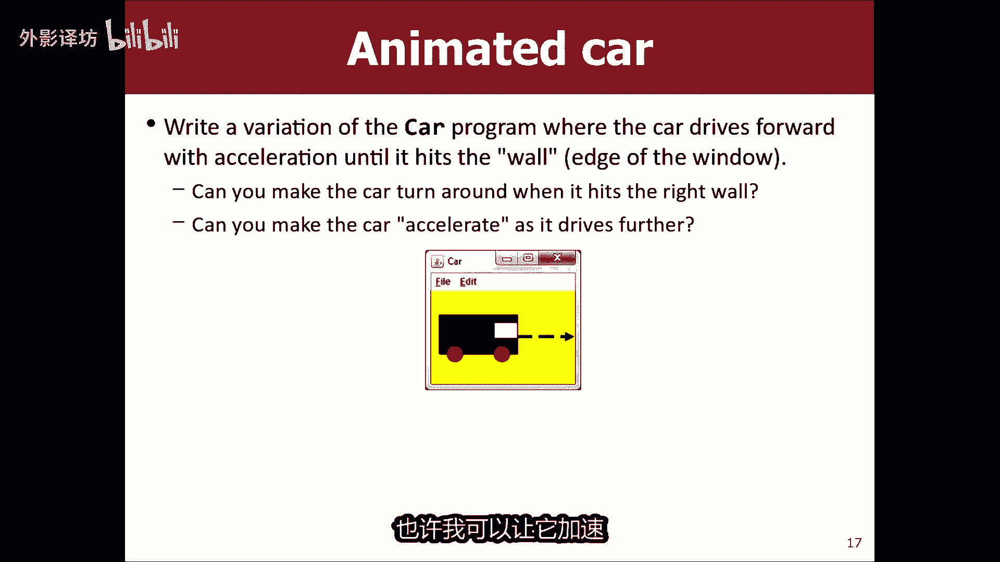

```java
// 创建汽车
GCompound car1 = drawCar(50, 100);
GCompound car2 = drawCar(150, 200);
add(car1);
add(car2);

// 在动画循环中只移动 car1
while (true) {
    car1.move(CAR_SPEED, 0);
    pause(FRAME_DELAY);
}
```

你还可以扩展这个程序，让汽车在碰到屏幕边缘时反弹或掉头，这需要通过 `getX()`、`getWidth()` 等方法检测汽车的位置。

---

## 总结 📝

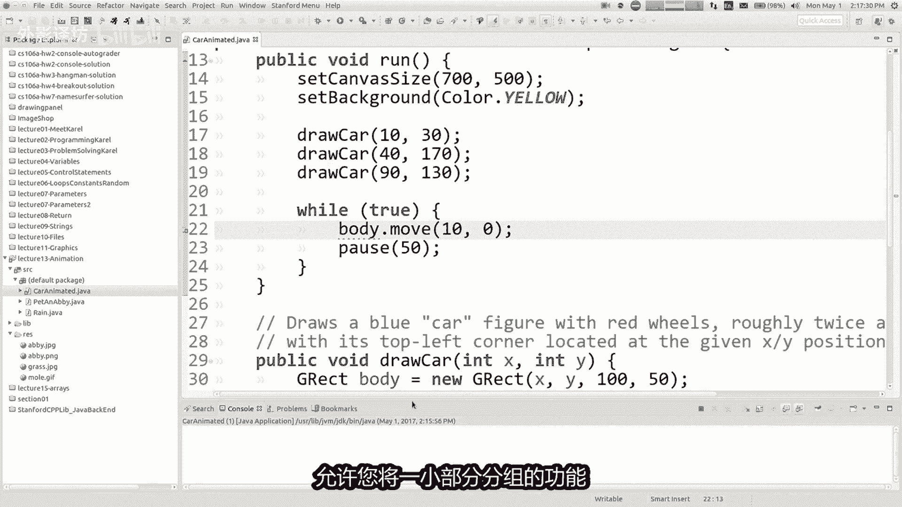

本节课中我们一起学习了图形编程中的动画技术。

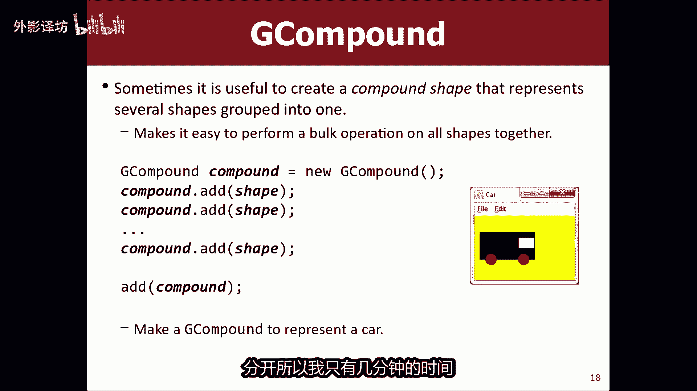

我们首先回顾了事件处理，并修复了因处理 `null` 对象而导致的程序崩溃问题。接着，我们深入探讨了动画的原理：在循环中更新图形状态并短暂暂停。我们通过“下雨”程序实践了基础动画和多对象管理。最后，我们引入了 `GCompound` 这个强大工具，它能将多个图形对象分组，从而简化复杂图形（如汽车）的动画控制。


记住动画的核心公式：**`更新 -> 暂停 -> 循环`**。结合事件处理和 `GCompound`，你就能创造出丰富交互的图形应用程序。