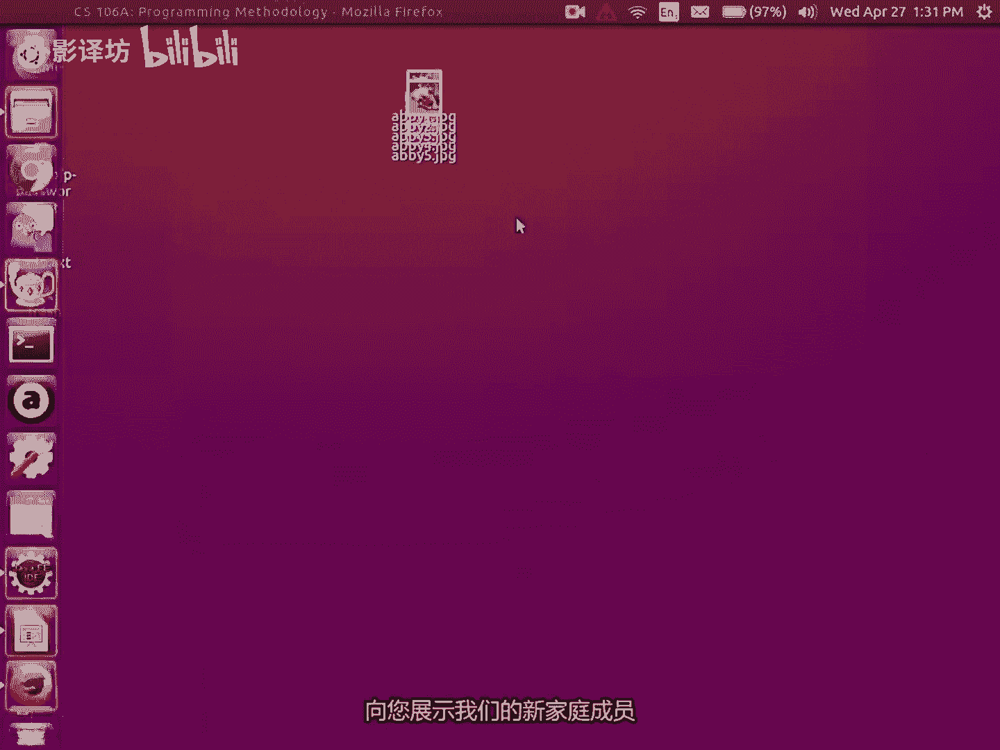
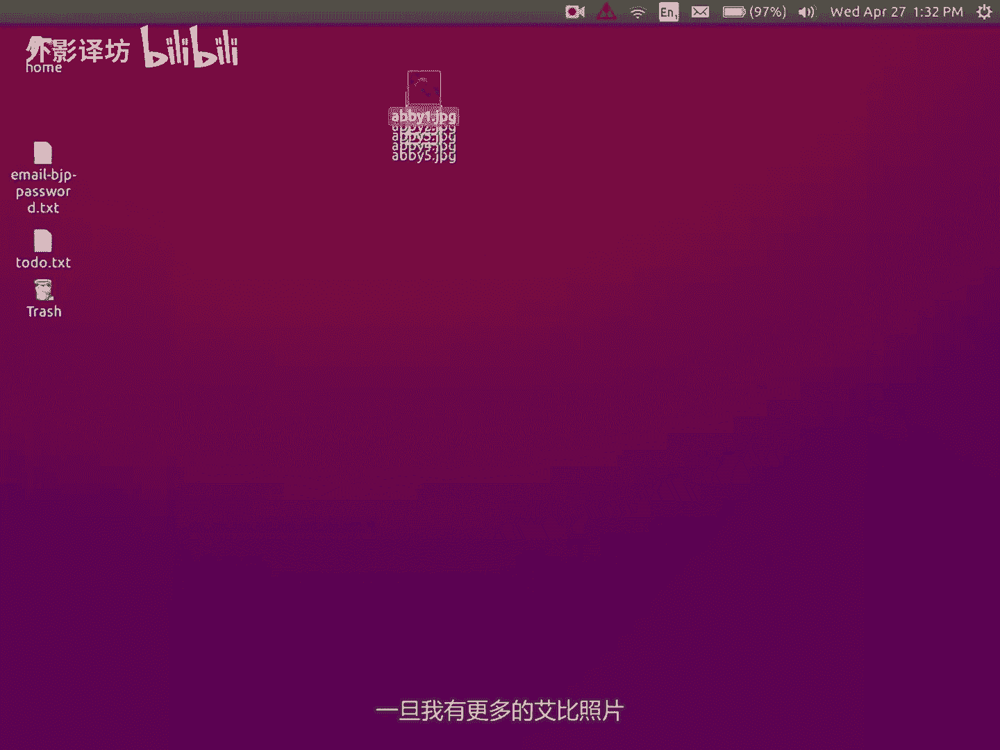

# 课程14：事件与字段 🖱️📝





在本节课中，我们将学习Java图形编程中的两个核心概念：**事件**和**字段**。我们将了解如何让程序响应用户的交互（如鼠标点击），以及如何在程序的不同部分之间共享数据。



---

## 概述

上一节我们介绍了基本的图形绘制。本节中，我们来看看如何让图形程序变得“交互式”。我们将学习如何监听和响应**事件**（例如鼠标点击），以及如何使用**字段**在不同方法之间共享信息。

---

## 事件驱动编程

在图形程序中，大部分代码通常用于等待和响应用户的操作，比如点击按钮或移动鼠标。这种编程模式称为**事件驱动编程**。

一个**事件**是程序中发生的、需要代码去响应的事情。常见的例子包括鼠标点击、按键或定时器触发。

要处理事件，你需要做两件事：
1.  告诉程序你希望监听哪种类型的事件。
2.  编写当事件发生时需要执行的代码。

### 监听鼠标事件

以下是一个简单的例子，展示了如何让程序在鼠标点击的位置绘制一个矩形。

首先，你需要在代码顶部导入事件库：
```java
import java.awt.event.*;
```

在你的 `run` 方法中，添加一行代码来启用鼠标监听：
```java
addMouseListeners();
```

这行代码来自斯坦福库，它的作用是“打开”鼠标事件的监听功能。

接下来，你需要编写一个具有特定名称的方法。Java会在相应事件发生时自动调用这个方法。例如，要响应鼠标按下事件，你需要编写一个名为 `mousePressed` 的方法。

```java
public void mousePressed(MouseEvent e) {
    // 当鼠标按下时，这里的代码会被执行
    // e.getX() 和 e.getY() 可以获取鼠标点击的坐标
    int x = e.getX();
    int y = e.getY();
    GRect rect = new GRect(x, y, 50, 50);
    add(rect);
}
```

**关键点**：在事件驱动程序中，`run` 方法通常只做一些初始化工作（如设置窗口大小、开启事件监听），然后就结束了。程序并不会退出，而是进入“等待”状态。当事件（如鼠标点击）发生时，Java会自动跳转到你编写的对应方法（如 `mousePressed`）中执行代码，执行完毕后再回到等待状态。这与我们之前编写的顺序执行程序有很大不同。

### 不同类型的事件

除了 `mousePressed`，你还可以监听其他类型的鼠标事件：

*   `mouseReleased`：鼠标按钮释放时触发。
*   `mouseClicked`：鼠标完成一次点击（按下并释放）时触发。
*   `mouseMoved`：鼠标移动时触发（不按按钮）。
*   `mouseDragged`：鼠标按下按钮并移动时触发。

以下是使用 `mouseDragged` 实现一个简单涂鸦程序的例子：

```java
public void mouseDragged(MouseEvent e) {
    int x = e.getX();
    int y = e.getY();
    GRect rect = new GRect(x-10, y-10, 20, 20); // 让矩形在鼠标位置居中
    rect.setFilled(true);
    add(rect);
}
```

---

## 与已绘制的图形交互

有时，你不仅想绘制新图形，还想与屏幕上已经存在的图形进行交互，例如点击一个图形将其删除。

你可以使用 `getElementAt(x, y)` 方法。它接收一个坐标 `(x, y)`，并返回屏幕上位于该坐标最顶层的图形对象。如果没有图形，则返回一个特殊值 `null`。

`null` 在Java中表示“没有对象”或“空引用”。如果你尝试对一个 `null` 值进行操作，程序会崩溃并抛出 `NullPointerException` 异常。

因此，在操作返回的对象前，必须检查它是否为 `null`。

```java
public void mousePressed(MouseEvent e) {
    int x = e.getX();
    int y = e.getY();
    GObject obj = getElementAt(x, y); // 获取点击位置的图形

    if (obj != null) { // 关键：检查是否真的点击到了一个图形
        remove(obj);   // 如果点击到了，就删除它
    }
}
```

---

## 字段：在方法间共享数据

现在，我们面临一个新的问题：如何在不同的方法之间共享信息？例如，在 `mousePressed` 方法中创建了一个图形，如何在 `mouseDragged` 方法中修改它？

方法内部声明的变量（局部变量）只能在该方法内部使用。为了让多个方法都能访问同一个变量，我们需要将它声明为**字段**（Field），也称为实例变量。

字段声明在类内部，但在所有方法的外部。这样，该类中的所有方法就都能看到并使用这个变量。

```java
public class Doodler extends GraphicsProgram {
    // 声明一个字段（实例变量）
    private GRect currentRect;

    public void mousePressed(MouseEvent e) {
        int x = e.getX();
        int y = e.getY();
        currentRect = new GRect(x-25, y-25, 50, 50); // 创建矩形并赋值给字段
        add(currentRect);
    }

    public void mouseDragged(MouseEvent e) {
        if (currentRect != null) {
            // 可以在这里根据鼠标位置更新 currentRect 的位置或大小
            // 所有方法都能访问 currentRect 这个字段
        }
    }
}
```

**注意**：虽然字段非常有用，但应谨慎使用。如果过多地使用字段（全局数据），会导致程序状态难以追踪，容易引入难以发现的错误。通常，只在确实需要多个方法共享数据时才使用字段。

---

## 总结

本节课中我们一起学习了：
1.  **事件驱动编程**：程序通过监听和响应**事件**（如鼠标点击）来与用户交互。
2.  **鼠标事件**：如何使用 `mousePressed`, `mouseDragged` 等方法，并通过 `MouseEvent` 参数获取事件详情（如坐标）。
3.  **图形交互**：使用 `getElementAt()` 方法获取屏幕上特定位置的图形，并理解 `null` 值的含义及检查的重要性。
4.  **字段**：通过将变量声明为类的**字段**，实现在不同方法之间共享数据。


掌握事件和字段是构建复杂、交互式图形应用程序的基础。接下来，你可以尝试组合这些概念，创建更有趣的程序，比如简单的绘图软件或交互式游戏。