# 【中文配音】斯坦福王牌课程 CS 106a Java教程 2017年春季课程 - P16：16_ Multi-dimensional Arrays - 外影译坊 - BV14U4geNEEq

上周出乎意料的，我有一些英雄帮助报道来自实际上的意图，如果你是，如果你是好奇，我为什么走了，原因是我妻子有一些健康问题，并不得不被送往医院，这很奇怪，这意味着他很好，他很好，做得更好。

但他碰巧有周一周三周五的问题，这周我就想，亲爱的，你就不能像星期二那样做吗，周四的房子，整件事给了我们时间，但他没听清到底是什么值得他不舒服的原因是，因为她和我目前正在尝试，为了生孩子，我们经历了似的。

我们经历了一个涉及的程序，涉及到这一点，他有一些该手术引起的并发症等，这实际上让他有很多疼痛和许多健康问题，但是现在他好多了，好消息是，其他婴儿用品，看起来好像一切进展顺利，但她不是尚未怀孕。

但我们正在努力，这是一项艰巨的工作，但有人这么说，是的，对此感到不安，但尼克想要我给孩子起名叫尼克，因为他对我进行的演讲，相信这个人听着我们会有一个女孩自作聪明，所以贾里德尼科丽娜什么的，是的。

实际上也许我给这个孩子起了名字，事实上嗯他很棒，一切都很好很酷，他今天感觉好多了，所以我支持几个简短的公告，在我们开始新材料之前，你知道你们这周四有期中考试，我相信你可能还记得，但是我知道你会想到这个。

你将会为此而学习，相信阿什利上周五告诉你，该考试的学习材料是关于，所以你应该看看我们有很多练习，考试发布了实践中的问题，考试在那里有答案，当然如果你想看答案，总是有不止一种方法。

解决了很多这样的代码编写问题，所以如果你写一个不同的回答，你的答案也可能是对的，所以你可以检查你的答案，如果你想要通过下载他们的zip文件，在那里，你可以下载一个eclipse投影，并输入您的答案。

然后查看，如果有效，或者您可以转到我们的代码，您可以在分布网站上输入您的在那里回答，他会测试它，你所以我们这里有很多资源供你练习和学习，你知道学生总是问我，我该怎么办，在测试中，我认为排名第一。

到目前为止你可以做些什么来做得更好，测试只是做一堆练习，阅读书籍章节，你知道的问题东西也很有用，但就像练习练习练习练习这些问题，你做的越多，你将为周四的考试做好准备，检查一下。

你也知道你得到了测试附带的语法参考，如果你想的话，那已经发布了，看看那张纸上有什么准备好，你可以看看那里，无论如何，有一堆东西等着你，从管理的角度来看待你的时间，和你应该关注的事情。

以及你们知道你们刚刚拥有的东西，你的突破计划今天到期了吗，是的，所以我期待接下来的事情，你会专注于我们正在为考试而学习，剩下的这周，但是因为我是个混蛋，有一个新的家庭作业，今天作业上午限载。

你可能会说你太可怕了，马蒂你为什么要这样做好吧，我的意思是是的，我很可怕，但是我的意思是，这个季度的问题是一年中最短的一个季度，只有大约九周半的时间，所以作业已经完成，但我会一般建议暂时不要做这件事。

我会说专注于考试，一切都完成了，然后就在这里，在本周末和开始时，下周以及整个下周年，如果你也可以看看作业，知道这对你来说是否还不够，意味着我们有这些迟到的日期，下周三才到期的东西。

所以你们这个周末可以做这件事，或者下周就可以了，无论如何，我知道拥有一个很糟糕，当你在的时候给我分配一个喜欢的任务，为考试而学习，但我忘记了，我事只是发布，以防有人想要早点开始吧，是的。

这些是主要的盎司薄荷糖考试，还有一些事情，明天就是期中复习会议，由我们的一些部门领导负责，那是明天晚上七和九，下午在428房间哦，40，所以去那里，我认为一般格式是他们将会进行一些练习问题。

他们会采取问题和类似的事情，所以如果你你想要关注的特定主题，现在也许会提出一些问题，他们会想问类似的问题，有点受什么驱动，你想专注于其他事情，指导做业务，今天上去会有的帮助您开始这方面的时间。

但因为我有点期待你等到测试决定因素之后，是的时间是这个星期五，而不是你本周早些时候知道的，请记住我要做的最后一件事，说一下期中考试有几个获得住宿的人，有一份电子论文或类似的东西，考试安排，你知道的。

每个想要这些的人，应该收到电子邮件的月份，如果你有这样的要求事情，但你还没有收到回复，请今天联系我们，与我们交谈，但我们会回到你们身边，粉红色过滤器金钱公告，关于考试，如果你没有的话。

考试相关问题很快就会出现，我教你经历了太多该死的事情，有问题问我是的，如果你有的话，关于期中考试的问题哦，我明白了，你问我是否应该去对于这些问题或不好的层，他是什么，NCAA认为他是一个人。

今天应该在这里做事的，我们通常会得到，广场论坛上的评论，我正在关注人们去的一周练习考试第二题，编号四，我不明白为什么这样回答，就是这个，然后我们回复一周回答，我们解释一下，所以诗的祝你好运。

随着你的学习，我会开始很快实际学生的任何其他问题，关于臀部，你是一名学生，这不是我的学生，好吧，你知道的，如果你有疑问，如何找到我，关于它，所以我要教你一些今天的事情，有些学生会问什么时候切割什么材料。

期中考试是公平的游戏，我会的可能包括数组，期中考试是上周五，今天我市将涵盖称为多重的内容，多维数组，二维数组不会出现在期中考试中，所以基本上上周五是这样的测试的截止时间。

所以我认为是以此开始讲座的形式不好，你知道没有参加测试，但他已经开始了作业，是期末考试，所以你仍然需要学习它，所以好吧，让我们开始我们的讲座吧。

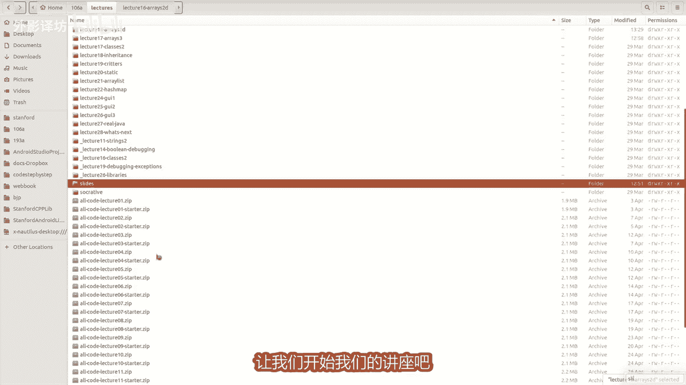

城市足够了，这个序言反而好的。

所以今天的主题叫做，多维数组以及那是什么，means是一个2D或3D数组或类似的事情，我要去专注于二维数组，这样你就知道了，一个数组只是有某种A，您可以使用的索引框的集合存储值的二维数组。

有对行和列进行排序，二维插槽及可以存储数据，但你实际上并没有上次稍微聊了一下数组，我希望你能清楚的明白为什么想要加薪，也许我可以问问你，很快就间觉性检查，就像什么事那么整洁，有一个数组为什么我想要它。

我们认为ED或qt的程序，然而我实际上周五对女性进行了教训，她就像她们很棒一样，确实参与了很多发言，就我的问题而言，他可以去，我去同一个房间，我在做什么，错误的，他告诉我的另一件事是我如何。

你认为他告诉我的另一件事是我，我觉得很有趣的是，你知道我必须这么做，讲座结束后给她打电话，我可以他去，然后我说哦，你的学生呢，他们认为在你的部分吗，很高兴你做了演讲，并且他走了，他们都没有去上课。

所以他们不知道如何能够如此讲课，这是非常斯坦福式的回应，好的，所以你举手了，这很酷，关于我们为什么要参加比赛的费率，好的，可以让你不必创建一个像这样的一大堆变量，滑动，并在阵列的七点钟位置。

这其实年代我不想要这样，所以只是制作一个七种数组，将这些数据整合在一起，很棒，您在其他地方添加的任何其他内容，有一个数组很酷吗，是的，你可以订购它，你可以排序它，搜索历史学家似的。

他就出现了会议上有很多数据呢，也我想补充一点，这里可能很微妙，就是有时候你不知道如何，您将看到很多信息，直到程序运行起来，如果你的温度是多少，想要存储多少场足球比赛，你玩过。

然后你就知道什么时候用户输入20，表示有20个游戏，现在你需要20个来存储，你不知道的分数有多少，里面需要直到程序背正在运行，所以数组可以让你有你要处理的动态数据量，在您的程序中分配和管理，这非常强大。

所以我有一个今天讲座的激励例子，当我谈论二维数组时，是我们可以查看图像和像素，图像中的小彩色点，二维数组，所以我会在几个小时内介绍它，我想谈谈二D1般首先是数组，所以二维数组是像这样声明。

你只需写两个一对方括号，而不是一个，所以在幻灯片上我做了一个数组和一个，它是一个三型五的int数组列，所以这就是这样的方式，当你看的时候，你就读到了，所以第一个索引有点像你有多少行，第二行。

所以是你有多少列，所以如果你想参考个人访问它们的数组元素，你必须写出数组的名称，接下来是两组支架二里面的索引，就像括号零，括号零是左上元素，左边，是的是的，谢谢他的提问，就在一分钟前。

我说你知道具有动态的数组，允许您处理不同数量的数据，但是正如你在周五的讲座中所说，阿什利说，一旦你做了一个数组，尺寸有点固定，不能很容易地调整数组的大小，所以这两个陈述似乎在互相冲突，所以我想我要小心。

也许我的一分钟措辞不是很精确，当我这么说，之前的数据量数组是动态的，我的意思是，当程序启动时，你可能会发现哦，我们班有20个学生，我需要一个大小为20的数组，这样我就可以创造那个。

然后也许是明天的我们的计划中，可能有35班上的学生，我可以做一个大小为35的数组，这样的创作时刻，我可以动态调整我需要的数量，但一旦我把它锁定了，程序继续运行并加注这个数字，所以它有一定的数量。

充满活力，但事实上我们并不完全，稍后要学习一些称为一两周内的数组列表，调整大小有很多很酷的功能，主题数组将更好像你这样想的事情，无论如何，是的有点动态行为或不完全，因此转向具有行和列的数组。

你可以有不同的信念用于访问数组的关键部分，这里的语法是你有两对方括号，但一般来说概念语译维数组相同，索引从零开始直到长度减一，这种事没错好吧，如果你愿意的话，这是一个二维数组循环遍历二维数组，你看到了。

实际上谈论的是循环您排序的常规一维数组，制作一个从零到link的for循环正确，对于二维数组，你必须在两个维度上循环，并且基本上我们是通过嵌套循环来实现的，最常见的处理方法是我们会调用行主要顺序。

你在哪里说每一行，然后在里面并对每一列说，如果你真的考虑一下你访问的顺序，索引看起来像这些箭头从左上角开始，然后穿过你从这里开始，然后穿过一开始听到跨行专业命令，看起来就像你如何阅读页面。

或类似的freitas gift，你想要垂直进行处理，按照顺序排列的元素，你颠倒了四个的顺序，因为每个列所说的循环行，现在做某事的一件，这里看起来有点奇怪的语法是我说一个点链接，然后我说一个二点链接。

这是一种有趣的语法，当我说点链接时，这就是数字，如果我想要的话，数组中的行数，我必须得数组中的列数，询问给定型AR的长度，点链接，二是这一行和点它的长度是四，所以语法是我本来可以写的有点奇怪，R小于三。

C小于4I，我猜但你知道实际上可能告诉你写起来很好，链接到某种告诉他只需转到结束，如果你这样穿，如果你更改您的代码大小，稍后开始该程序的其余部分，该程序将相应更新，是的，所以这些是你可以采取的一些方法。

循环遍历或循环到数组，并不总是不管你选择哪两个，但是有时确实如此，这取决于你是什么这样做，如果你是这么看的话，可以排列，你会注意到我已经嵌套了循环，所以这是我制作2D的练习数组。

让我们假设dot它有幻灯片右上角的内容，然后我运行它编写的代码，那里的胡子是什么状态，就在那之后，你为什么要看看一秒钟，然后高兴哪一个你认为需要大约一分钟。

好的我想帮助他，所以我要将我的幻灯片切换到此视图，因为我可以在很多屏幕上做到这一点，我想是的，所以我想帮忙帮我解决这个问题，所以也许问第一个问题是这样吗，代码是否水平转到to侧面，像这样还是这样。

像这样垂直的解决你的垂直向下，我问他是这样的吗，这是这样还是这样，是的，垂直方向也可以，有人有一个猜测或答案，他们认为这四个选项中的哪一个，它位于后面代码的末尾，你认为是这个好吗，看看我同意你的观点吧。

我们正在做的是循环在列上，然后对于给定的列，我们循环遍历行，所以我们就像我们想要的那样，出于某种原因，我的愚蠢的东西不会偶为什么，看看我摆脱了所有的我们在行上循环的屏幕，所以我们就这样下去正确。

你正在设置你的每一行，添加右上方的行，这样你就可以，说我把这个设置为1+1=2，然后当我经常去这个的时候，这些答案中有两个在这里，所以它变成二，为什么不变成二，为什么你想做三件事吗，是的，是的。

这一行得到了修改，会影响发生的情况，之后的下一行也是如此，你可能见过类似的例子，语义维数组实际上星期五有报道，所以无论如何。

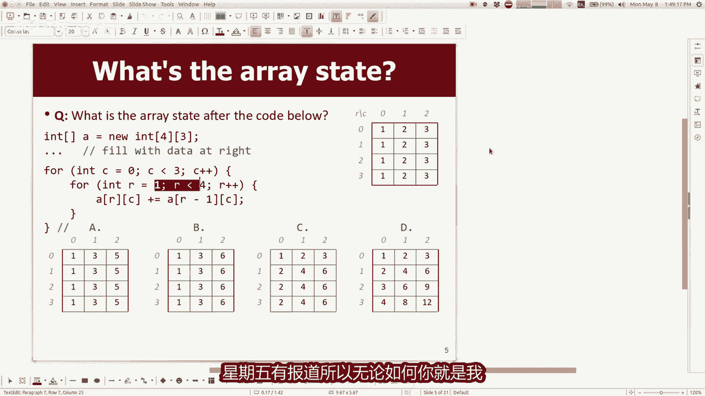

你就是我认为你是对的，这里的输出是答案D，所以他累积起来之前还好好吧，让我们继续寻找，我想去是像素，我想这就是它的意义，如果你想打印出来真的很有趣，二维数组的内容，你知道实际上可能已经向你展示了。

这在数组中是令人难以置信的，因为数组它只是打印一些屏幕上乱码，如果你想查看数组的内容，通常要写打印行数组点数组的两个字符串，但实际上该命令甚至不适用于2D数组，因为从技术上讲是一个数组数组。

所以它不太工作，所以如果你必须写深两个字符串，你会说打一行数组深到字符串，然后你会看到一个更具可读性的，您不一定需要使用的输出，现在就是这样，但这对调试就像你喜欢什么一样，我的数组有问题没有。

里面有正确的数字，你可以打印他们出去看看好吧，所以另一种方式想想我一直在画的二维数组，我的照片喜欢长方形数据专，但从技术上讲，内存实际上是一个数组的数组，如果我说结束，这应该实际上有第二双早餐。

抱歉这是一个错字，但第一行是从技术上讲，一个数组是一个一维数组，然后从技术上讲，第二行是一维数组，所以即使我通常这样画一块元素，就像技术上的rose是小的，单独的形，就这样搁置在那里。

你知道这通常不是什么事情，你需要考虑或担心的，关于但是可以派上用场的地方，或者有趣的是，如果你想做的话，一种叫做锯齿状数组的东西，你可以使得每一行都是不同的碗，最常见的是尼布需要这样做。

但有一些有趣的例子，比如语法很奇怪，但基本上你在这里说的是，我想要一个2D名称为锯齿状的数组，及其内容是三行，但我不是将指定列数，但我只是说有三个行，然后我说银行有两个列，第一行有四个，第二行有三列。

然后我在这里得到这种结构很奇怪，这不是立即发生的，很明显，为什么他会想要这个锯齿状的，看起来很数组，但有时它是东西，好吧，这些行都是你们学生，每列都是您的作业，也许你会把我变成你交了三份作业作业。

所以有时你想要可变数量的数据，每行取决于数据代表，这里只是一个简单的小，例如您可以制作帕斯卡三角形二项式系数，有点很难在简短的幻灯片中阅读，但是基本上如果你创建一个数组，然后你使每行的长度为与行数相关。

你会得到这种三角形形状数组，然后你可以存储，无论你想在里面存储什么，帕斯卡中的不同元素三角形，这是一种关系，在你上方的元素和下面的元素，你喜欢这里的十个是六和四的总和，这里的六是三和你的三之和。

了解这类东西，这样你就可以使用表示这样的关系，你可以使用的锯齿状数组方阵，但还有很多这样的其他索引本来就是无用的。

浪费内存，所以不要真的，无论如何，我都需要它使用二维数组来表示，图像和像素和你的作业，我会请你做一点图像和像素，也让你知道我们绘制的图像和图形，屏幕是由这些小东西组成的，如果放大屏幕点就在右边。

你可以看到单个的小点，我已经够老了，我玩过这些老游戏，像素确实很高的视频游戏大，所以你可以真正看到他们，才知道现在的游戏这么多，越漂亮就越难看到屏幕上的单个像素，但是我们还在那里。

电脑绘制了使用红绿蓝颜色的像素，以及红色和绿色以及蓝色是单独的整数，从零到255，我们聊了一点好吧，这样你就可以选择使用A来表示这些像素。

二维数组，我们有一个我们斯坦福大学图书馆中，名为G的类15G椭圆形G反映所有这类东西，图像在上绘制图像文件，屏幕以及当您构建T图像时，您将屏幕上的文件名作为参数，来创建G图像对象。

然后您可以添加它到屏幕上，并且由于图像有我们可以使用的一堆方法，与像素有关，所以我要去向您展示这些方法是如何工作的。

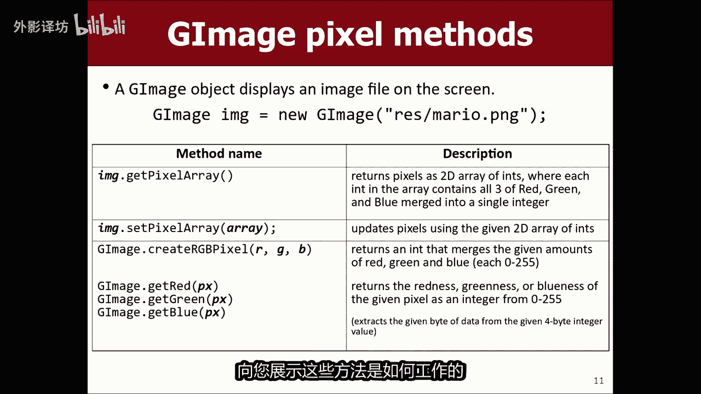

作为上下文，我将有这个eclipse项目在这里等待吧。

我的eclipse在那里好吧，我已经今天这里有这个eclipse项目，我添加了一些图像到屏幕上，我刚刚指定了一些XY坐标来添加它们等等，当我运行这个东西时，它会弹出它，那里有一些我无法抗拒的图片。

在屏幕上放一个币，这样就可以用乐高积木积木，乐高STAGGLE和狗，我想这就是我在这里的情况，这些都是G图像对象，好吧，我想做的是能够操纵他们，也许就想修改像素或改变它们的外观。

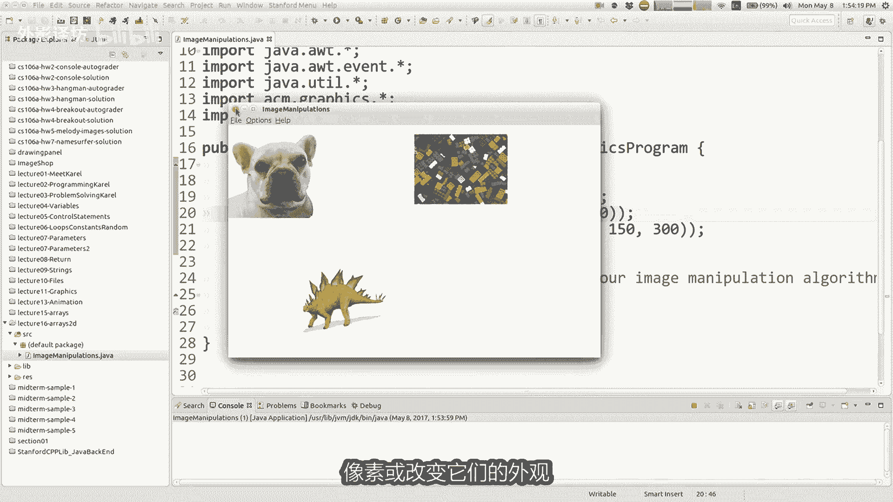

在屏幕上，如果你想这样做，G1图像对象有这些方法。

所以有一种方法叫做获取像素数组，它返回一个二维数组，代表所有颜色的整数图像的像素，还有一些模拟一些方法，例如设置像素数组，还有其他一些，所以基本上你得到了你改变的像素它们的值，然后你设置像素。

然后图像看起来会有所不同屏幕，所以这里还有一点关于图像的表示方式，一个二维数组，你可以通过调用它来获取它，像素阵列和单个像素，你更有可能说玲玲吗，顶部留下了很多人等等，110，右边有一个见小像素。

如果你想知道如何从图像中许多像素，您可以说点链接或像素零文档，类似于图像的行和列，我发现所以有点多，这里令人困惑，因为当我看到这些时，两个坐标我觉得XY你知道，因为通常当你写的时候，你说的是XY坐标。

但从技术上讲，这些坐标是行列，所以确实他们是YX有点与你想要的方式相反，想一想，但我就是不写Y，我写的代码中的X增长调用I，只是把它当做逻辑的问题，然后我就不再思考X和Y，这有助于我避免混淆，就这样。

无论如何，这是两个降速的维数组，那么什么可以我用像素做的很好，让我展示一下。

你是一个简单的例子，如果我回到eclipse这里，我点击了鼠标方法，这样我就可以点击不同的图像正确，所以你们一直在做突破，所以如果我点击某个地方，我怎么知道用户单击屏幕上的什么对象，我用什么方法来找出。

获取元素，谢谢这样我就可以说就像I压图像，图像等于获取元素，在事件得到X并且事件得到Y正确。

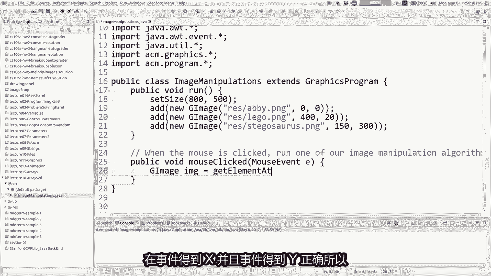

所以。

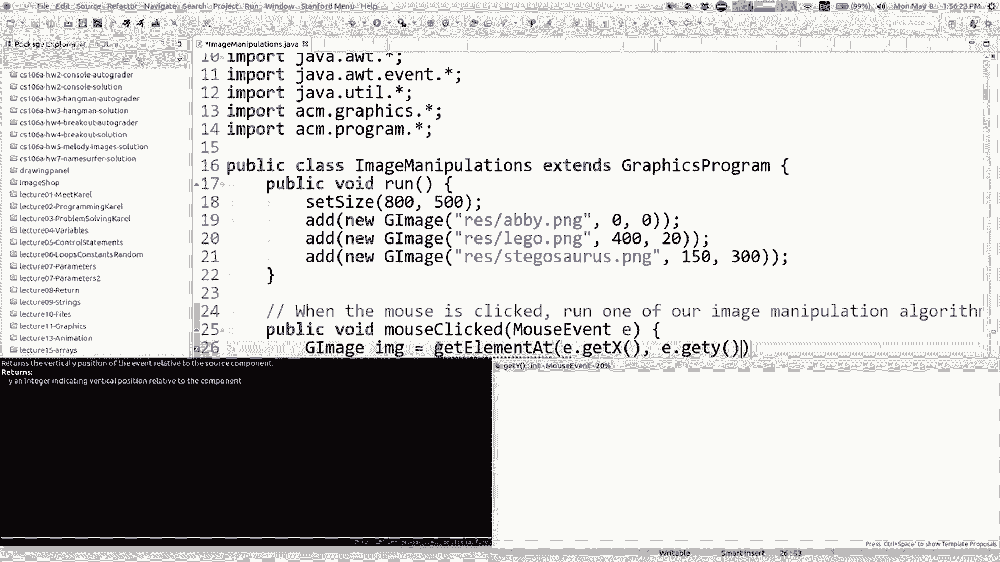

无论他们现在点击什么，他们都可能没有点击任何正确的内容，那么该怎么办，我测试看看他们是否点击九不正确，所以如果图像不为空，然后让我们对图像做一些事情，我们可以对图像做些什么。

让我喜欢把这些变成你知道的方法，好的方法和分解，所以也许我们要做什么，现在的图像是我们去找你知道让它更亮，所以让我们做一个方法，称为topic boy brighten盒，如果你给我一张G图像。

我会做到的更亮，我会让它看起来更亮屏幕，所以也许如果它不为空的话，你点击了某个东西，然后请使用户单击的图像变亮，好的，那么你如何破坏图像，如何对图像进行良好处理，我刚刚给你看了幻灯片。

你说我想要一个像素的二维int数组，来自图像获取像素数组好吧，现在你做点什么像素，一旦你完成了，不管是什么，你都可以说黑图片，现在我要你设置你的像素阵列成为像素，所以有点像我得到的，我改变它。

我把它放回那里好吧，我要对大家做什么像素好吧，通常你想要做一件事，循环便利右侧的像素，所以很多这些图像处理类型，算法涉及嵌套的for循环，因此如果我对形进行for循环会怎样，行上声道是你吗。

我如何找出行数图像，这是图像的点长度对吧，数组的长度，所以像素点链接好的行加加，然后如果我想要列，而不是行，列调用等于零，调用是列表，那就是将小于长度，我所在的行，因此小于像素。

在这一行点长度处调用plus plus好吧，这和你一样非常标准，我知道你们会写一些，你可能是图像处理代码，将有这两个嵌套循环，看起来像这样，所以现在就想这样做，现在让我们对每个像素进行一些处理。

做一些愚蠢的事情，如果我设置像素括号型，括号列归零，现在我还没有谈论这些，真正的意思是它对应什么，但如果他说为零的话，基本上意味着我想要最少的颜色，可能这意味着黑底黑字颜色，所以如果我说所有像素零。

然后我把它放回现在屏幕上，我说我要去使图像变亮，但这还不够，现在我点击bionnow you，可能会说我以为会是这样黑色，但从技术上讲，它正在把它变成黑色，变成我们将要讨论的透明颜色，大约一分钟。

但基本上我修改图像，我改变像素，我们来谈谈如何制作图像，像素更多一点，有趣的是。

你会设置他们什么倒而不是零，所以让我们来谈谈，现在就等我们走，每个像素都按原样表示，但这有点奇怪，从技术上讲，它被压缩成一个单一的，这有点奇怪，来自这里发生的事情的攻击是从技术上讲。

一英寸是由四个字节的数据，字节或八个位数据和个人int代表一个像素，实际上存储了四个它里面的东西，它储存着一些东西，称为alpha值，它是opacity透明度值，它存储在问候区完成的结果。

和它可以存放十几辆四辆自行车一起记录它，所以真的如果你，想要红绿蓝227的颜色，14和139，你真正要做的事，你必须把它混合成一个single int说好，我想要完整，不透明度完全可见。

所以255是最大乘以256，X 256x256，这意味着走，直到下一个字节，如果我想要27为红色，我必须移动它乘以二个字节，但这是一个一堆我们不想要的胡言乱语，你们基本上必须做我的，我想要表达的是。

这些像素有四英寸包装在一起，并且我们希望能够将它们打开并放回去在一起，你这样做的方式是有这些方法称为get read，变绿变蓝，你可以分辨出来你要拉红的G图，像素中的绿色和蓝色坚果。

所以这是很常见的事情，你可能会这样想做这个例子，这里说像素回到零零，但你可能想做它在你的循环中，所以也许我会重做一遍，在这里我会说像素零零。

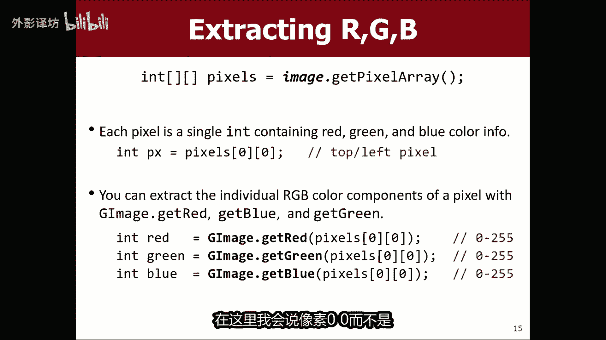

而不是我会每行调用二各像素好吧，我会说像素型并调用，所以现在我，要求红色绿色和像素呈蓝色，哎呀我该怎么办，抱歉好吧，现在如果你，想要操纵那个像素，你可以修改这些东西，所以如果你说的好。

我想让这个更亮一点，你可以说你知道红色加等于十，你可以让它更红一点，可以说绿色减去等于，所以如果你可以修改它们，然后你必须打包它们重新组合成一个链接。

进入一个像素，所以你这样做的方式，还有另一种方法叫做create，传递红色和红色的RGB像素，绿色和蓝色，它推动它们一起回到一个单一的末端，它如果您可以将其存储回，则返回逮捕。

我知道这一切看起来有点奇怪，但这就是我们图书馆的方式，存储和访问像素一次。

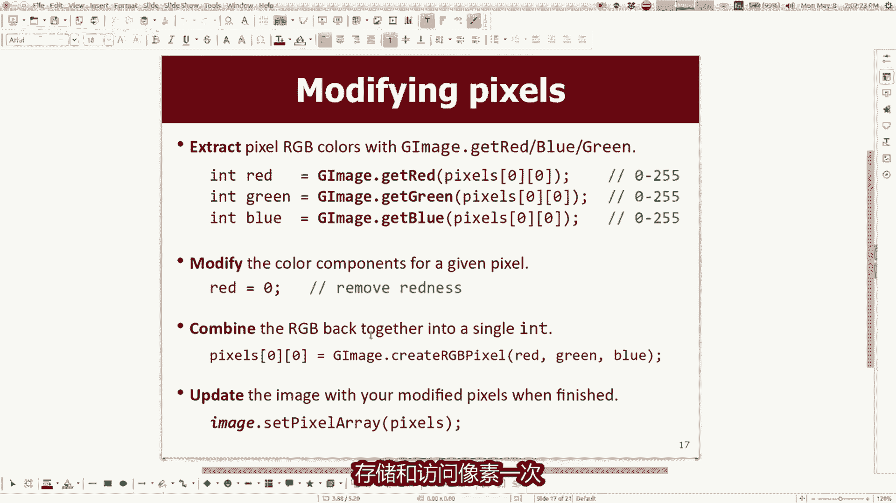

你已经完成了可以修改的像素，说像素型调用等于G图像点，从红绿创建RGB像素，我们声明正确的蓝色变量好吧，实际上如果你想的话，让图像变得非常明亮，你可以说你知道红加识律加十，蓝色加上十类似的东西。

记住它是255中的，所以这是稍微提高亮度，让我们快速运行一下，看看会发生什么错误存在，我认为我认为我失去了那里有一个花括号，抱歉让我们再试一次好吧，所以我点击艾比挖，艾比没有爱比娃娃看起来像。

他正在增强超级萨彦的力量，有趣好吧，所以这是一个你看到的总体想法，我可以修改这些像素，我想很多命令是一种mono jumble e和A，很多学生都做了，当我第一次展示什么绿色时，臭脸，这到底是什么东西。

但我认为很多这些图像算法都有一个，一旦你看到类似的图案，这样几次你就会习惯的，他开始看到这里的魔神，好的，如果我想看一下啊。

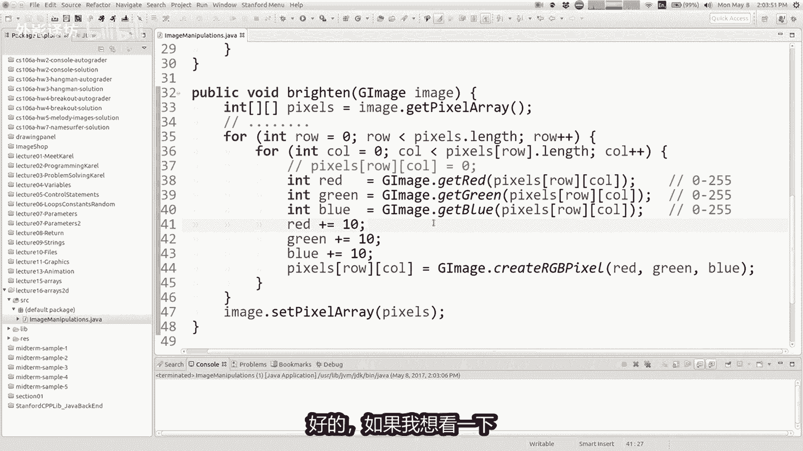

一些特定的图像处理，我们可能想要这样做。

我谈到过照亮我们实际上让我们尝试做，那现在为什么你看到它是如何有点循环回来，你知道如何让我当我这样做的时候，让我再跑一次吧，循环回到原来的颜色，在我认为那里发生的事情之前。

想法我怎样才能回到我们开始的地方，回答，立即结束，也许如果你超过255，就会回到零，或者那里有什么，如果我不想这样，我们就不要超过255，让我们到此为止，我该如何修改这段代码，表示我们可以解决这个问题。

正确的，我的意思是在这里增加阅读，喜欢增加阅读，但不超过两个人，是的一个循环一个循环，我想我们只是需要一个比这更简单的解决方案，如果你要去的话，就想一个循环反复修改红色。

我想我们已经已经有四个循环来查看，每个循环pixel，我想我们使用的一些东西比那更简单，是的确定红色是否为245或更少，让我们做类似的事，情，或者你知道他是否高于255，把它恢复到255左右。

大自然我觉得很短，很甜蜜，最简单的方法是，而不是仅仅说红色等于红色加十，假设他是以下较小者，255和红加十，看看就好，选择这两个数字中的一个较小的一个，所以不要超过255，这是一个很常见的技巧。

所以让我们假设green等于255的最小值，绿色加十，蓝色等于最小值255和蓝色加十好吧，让我们试试，那好的，准备好，点击ab回来，然后你，可能会说等等，为什么这些像素在毕业后面，做一些奇怪的事情吧。

让我们再看一遍，当我点击时，在这些像素上它们会变黑，那是因为D后面的像素是这些奇怪的透明像素，我不知道，真的太想谈论这个了，所以这里的这张图片没有任何透明像素，如果我点击它，我认为你得到了你更期望的。

每次我都会变得更亮一点，最终点击所有像素完全变白，然后就消失了，太好了，现在我们有了布莱顿司令部，到目前为止像你一样的问题，知道排序，掌握了这个二维的窍门，数组代码有点推东西，这是方法，是的。

哦像素的一英寸，这将有类似的表示像素点名它的意义是什么，我的意思是我得到的问题有点像，为什么是这里，他们为什么不干脆给我三个，而不是一个提示是什么，在这里我认为问题是，如果你把它变成三英寸。

就像现在你有一个数组数组的三重数组三个，所以我认为这才刚刚开始变得太复杂，会占用更多时间，记忆和他造就了这件事有点笨重，所以对，所以，就像如果我只是这样好吧，如果我说int px怎么样，等于我这么说。

所以那就是只需将其放入变量中，然后我只是说print lpx就像什么PX的值，让我仔细看看，它是就像这些奇怪的大整数价值观和，我的意思是，这些价值观是对于模型或人来说，不是很容易理解，正常人。

因为就像那些人一样，就像奇怪的一点混在一起一个数字，所以它几乎就像一个编码的数字，并不是非常多，容易阅读，会稍微容易一些，如果我们使用打印它来阅读16进制基数，16表示法，但我不这样做。

想要深入那个兔子动态园，但无论如何，是的个别墨水像素有点难以解读，我认为你应该主要考虑，他们作为红绿的三个组成部分，蓝色好的其他问题。

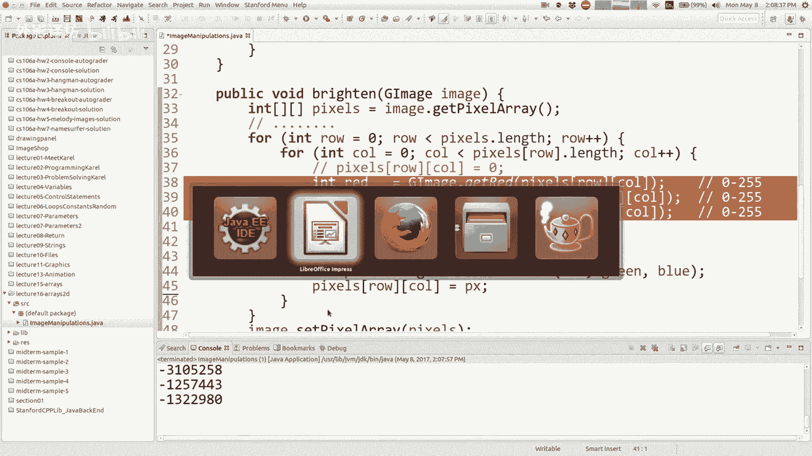

好吧让我们来谈谈修改颜色，所以这是我得到的一个例子，红绿蓝，但我告诉红色消失了，所以现在我们知道图像是相比之下，红色较少或根本不红色，到我离开之前，我们的情况也许会这么写，但我有一个有点不同的想法。

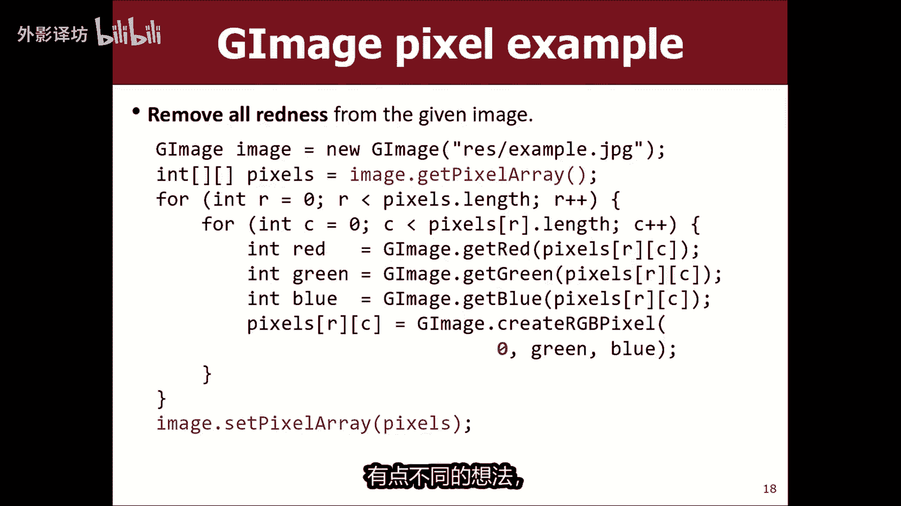

所以也许我这里没有B而是有几个其他图片，我有这个名字，P o t u s doj p g，所以post stj pg等等一个看起来像这样，所以我想到了什么，如果我们想让图像更加橙子，当你点击它时。

可悲的是只是为了好玩，而不是仕途，发表政治声明，但还好，如果我们不是布莱顿怎么办，橙色如果我没猜错的话，那就是我刚刚完成，所以让我们创建一个新方法，我只是要拯救我的，就布莱顿方法，我将调用这个方法。

橙色，如果我现在这样，我的意思是你会发现有时代码是这样的，类似于方法的方法是好的，对于每个像素，我们都会得到红色，蓝色中的绿色，但看起来像什么，我们要对像素做的事，这里略有不同，那么怎么样。

我可以让图像更成色吗，想法，为什么你怎么把红色变成橙色，绿色和蓝色，任何都知道怎么做，那，是的，增加阅读并减少其他喜欢蓝色的，是的，所以我想如果你曾经好奇如何混合颜色一台。

你可以用谷歌搜索颜色的电脑表格，或如何获得某种颜色，我相信橙色是多种红色的，混合各种绿色的东西不多，但有一些，所以我认为你所说的是增加红色，也许减少蓝色，保持绿色不变，但我们可以稍微摆弄一下。

也许我们增加一点红色，让我们上去，好像20真的是橙色的出来，然后变绿，我不知道，不让我们改变绿色的，你说蓝色时或其他我们不说的，想要低于零，这可能会很糟糕，那么零和蓝色的最大值怎么样，是的。

我要限制下限，最大颜色为零，让我们尝试一下，让我们看看我们是否可以成色，如果我那是真实的，那是原来的，我在那里改变他之前的图像，是的，看起来不错，10分钟后就到了摊位，摊位或他去的任何地方，无论如何。

你可以修改颜色，这些图像做起来很简单，正确使用这些红绿盒来色纸好吧，我开个玩笑，我，应该叫这个布莱巴特新闻吗，如果您正在关注。

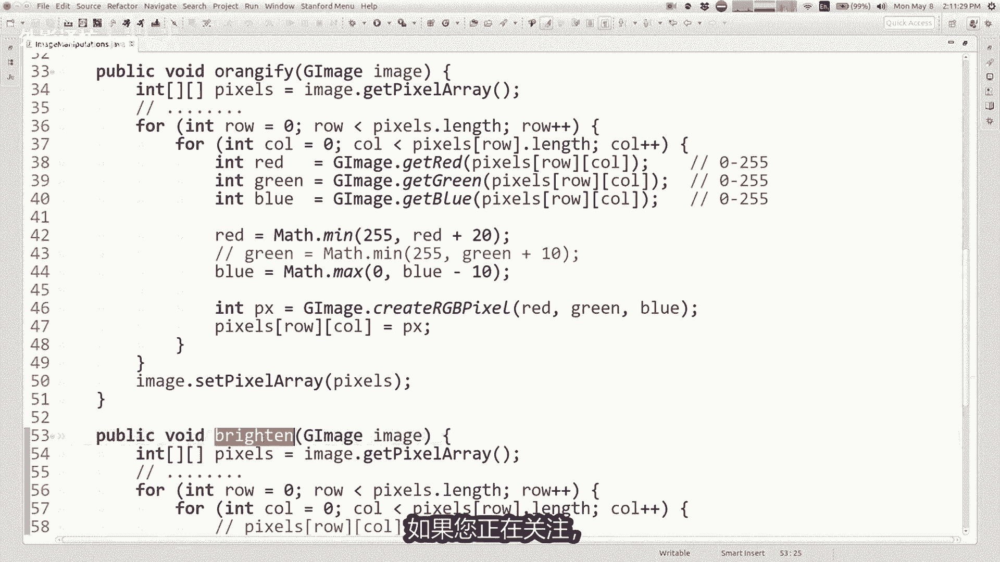

而不是写作新闻，也许就是这些嗯好的，什么是这样，你可以修改每个像素的颜色。

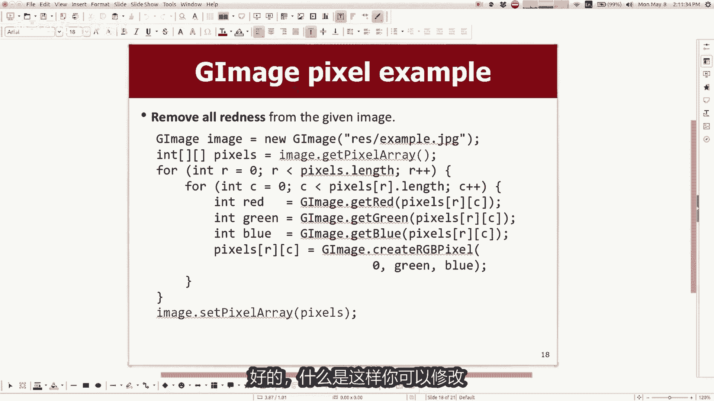

很有趣，另一件事是，有时你想要更改此图像的大小，以便大部分到目前为止我们一直在编写的算法，你只需移动像素阵列，并然后你将其中的值设置为一些不同的东西，这很好，很多情况，但如果你想怎么办，让一点原子变大。

B你其实是想拍一个更大的形象，具有不同数量的像素，在每个维度中你都会看到，并且记住你问的是什么，如果你不能直接调整数组的大小，但你能做的是，你可以做一个不同的数组，除此之外你可以以不同的方式使用它。

无论你想要什么，所以嗯这是一种就像如果你建造一座房子，你知道我更喜欢在房子上添加东西，有点被你的房子困住了，但是你可以买另一栋房子，你可以移动，这就是这里的想法，所以嗯我们从一个数组开始。

如果我们想做一个特定的尺寸怎么办，新图像是新图像的两倍，大数组将生成第二个数组，所以这个就像我们这里有像素数组，我们将创建一个两倍的新数，组，长和两倍宽，现在我们可以操纵该数组。

然后当我们说设置像素阵列，我们将使用它作为目标，然后希望如果我们我们的代码正确吗，我们得到了更大的图像，是的，让我们尝试编写一个算法，使图像的大小加倍。

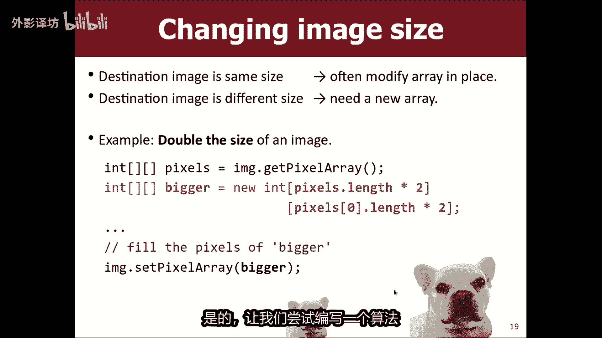

你点击图片好的，如果我回去到剪辑，如果我让的话，我们就用橙色代替吧，让它们变大，这就是这个词做更大的事情，我很漂亮，当然让我们复制一点，这个再次我们喜欢复制和粘贴好吧，如果我这是在比格姆，就不是橙色的。

放大二倍好吧，所以我说我，想要一个两倍大的数组，所以你所做的事，你说我想要两倍很多型，我想要两倍的形列，所以在苏莱更大等于新，具有像素点长度的int数组，乘以行数和像素数I，不知道0。

9×2个数哪一列并不重要，我问形的长度，因为它们彼此的长度相同，所以现在是两倍大了，目标是记住当你制作新的东西时，如何数组的内容只是空的，它们都是零或类似的东西，所以我们需要循环原来的像素数组。

并用它来设置新像素数组的，只有如果就数组，你知道在西班牙和新的跑步，每个都会有两倍大方面，所以这是完美的，我如何映射这个一个到这个，就想这个有一个W的宽度或其他什么，这个有宽度为2W如何实现相同图像。

基本上是这样的，这里有一个小像素，我会打电话给why，我该怎么处理他，这里，是的你没错，你放回人家，当然像素差了，目的地，您在该目的地复印四份像这样的像素，并看到另一部分研究他们喜欢一点。

但然后如果我这里有另一个名为number的像素，2IRA也制作四分get副本，我做了两个两个，如果我做了的话，下面的另一个像素是数字三点，他四点钟会到这里复制在U333内三，所以就这样做。

然后当你完成后做你想要的基础图像，你可以使用我循环遍历所有相同的嵌套for循环，这些像素基本上对于每个像素，我需要对该像素执行此操作，所以我该怎么做，我在里面放什么，这四个循环来实现这一点。

你们知道我喜欢帮助你们，所以我会做你提出的最难的部分，一些东西进入更大的数组，它来自像素中的某个地方，好吧好吧，类似的事情隐约好像我们就是这样尝试做，但问题是什么，原始红色对应的索引到更大数组的索引。

既然你想做，row乘以二，列乘以二，所以让我们看看，如果我想在这里计算，就像老式的road0out of1和01N，在这里我将有0123和0123，所以就像我看这个下一个中的家伙。

他成为这四个人的索引者，二和三红色，所以我想我认为你的表达有点不对劲，但我认为这是正确的想法，也是如此，行和列索引是谁的，索引的倍数，气味正确，我的意思是，如果你愿意的话，我可以尝试一下运行它。

我的意思是，当我完成后，我会假设图像点击像素阵列为数组越大，我们来尝试一下，好吧，所以我切掉愤怒的红色东西，如果你向上滚动，他说数组索引超出边界异常，所以我出界了，我的数组在第41行就在这里。

我看到那个开关很接近他们周围，就像二次元一样，有点像这里，当然让我们尝试一下，我认为这是一个很好的想法，所以让我们点击这个乐高，hi的东西看起来有点褪色了，我们越来越近了对吧，出了什么问题，现在有了它。

为什么看起来都褪色，你这么认为是的，所以我们做了什么，是我们没有告诉你这三个人吗，看我们没有告诉我们，这三个没有填写这三个和框架，轻松完成这个小棋盘，对于那里的放大版本，他会理解卡塔琳娜。

所以在这里很好，你怎么解决它好吧，有几个不同的地方，你可以解决这个问题的，方法之一是你可以说我想设置所有四个像素，这就是我这样的事情，需要X2和X21，我需要乘以2+1，再加一和加一，你明白。

就想在这里设置它，还有这里，这里和这里以前没有，如果我这样做，我想我将会模棱两可的，或GOGO看起来像点击，太多了，就像是一个巨大的东西，停止数组停止好吧，这是一种方法，这样做，最后就像我们一样。

留下这个摔在地上，最后以另一种方式记忆，这样做，而不是专注于原始的行和列数组，你可以专注于行和周围较大的列和if，你这样做数学会更容易一些，因为不管怎样，你只要除以二，你的设置是什么像素，我会让你想想。

当我们回家的时候，关于这个，但是家庭作业五已发布，其中的主要部分任务就是做一堆这样的事情，精确的图像处理类型算法，所以我会让你们走。

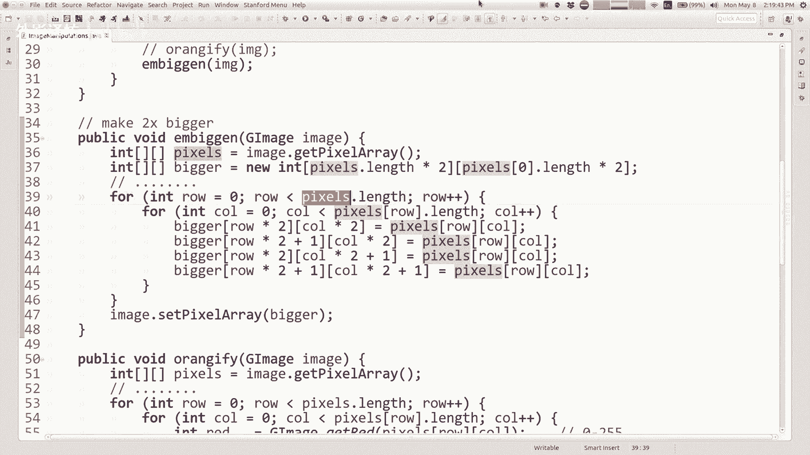