# 课程 17：数组（三）引用语义与计数 📊

在本节课中，我们将深入学习数组的两个重要概念：**引用语义**和**使用数组进行数据计数**。理解引用语义对于掌握数组和对象在Java中的行为至关重要，而计数技巧则是解决许多实际问题的强大工具。

## 概述

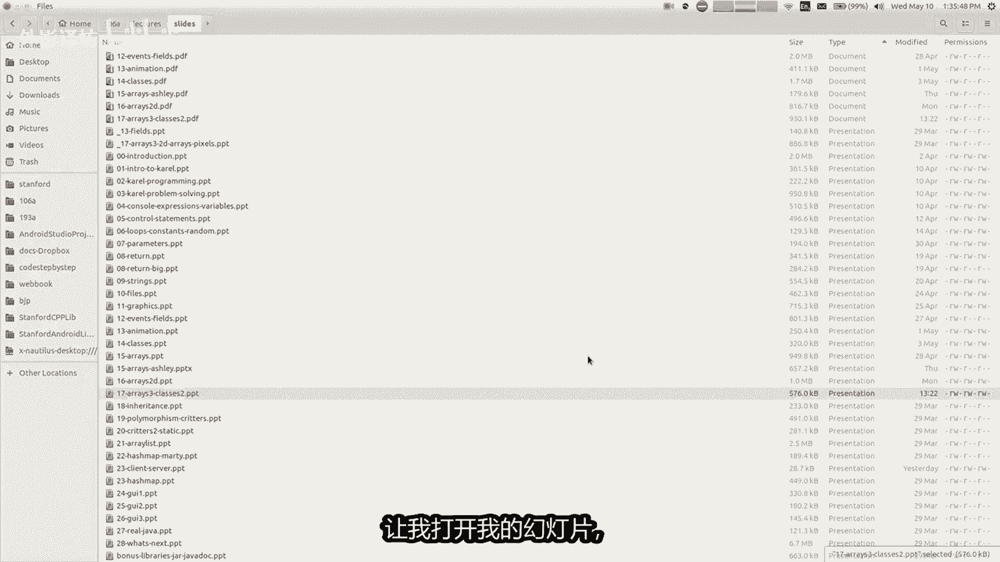

上一节我们介绍了数组的基础和多维数组。本节中，我们来看看数组作为参数传递时的独特行为——引用语义，并学习如何利用数组来高效地统计数据（例如，统计数字出现的频率）。

---

## 数组作为参数与返回值

在编写方法时，可以将数组作为参数传递，也可以让方法返回一个数组。这增加了代码的灵活性。

**例如，一个对数组所有元素求和的方法：**
```java
public int sumArray(int[] arr) {
    int total = 0;
    for (int i = 0; i < arr.length; i++) {
        total += arr[i];
    }
    return total;
}
```
注意，方法参数 `int[] arr` 没有指定长度。这是因为调用者会传入一个具体长度的数组，方法内部使用 `arr.length` 来获取其大小，这使得代码能处理任意长度的数组。

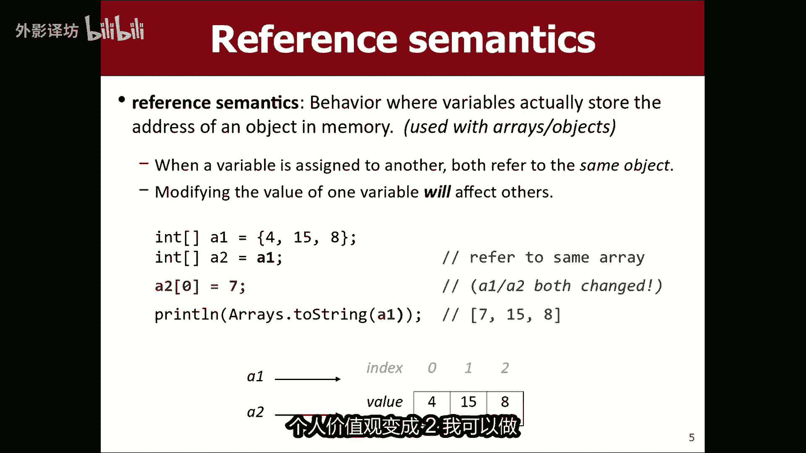

同样，方法也可以返回一个数组：
```java
public int[] createArrayOfSize(int size) {
    return new int[size];
}
```

---

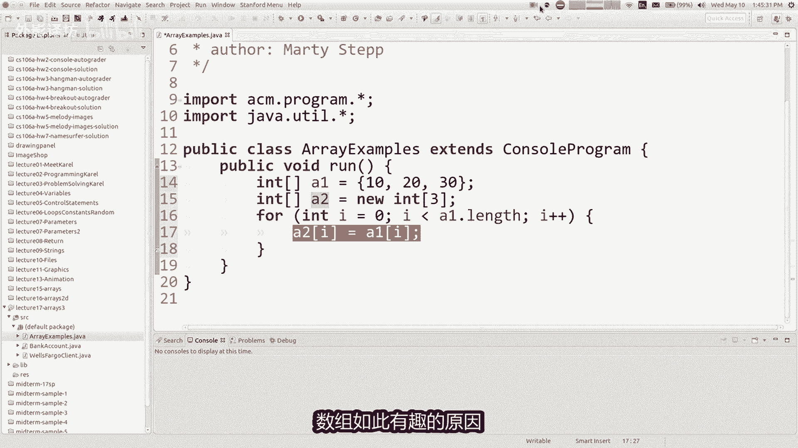

## 引用语义

这是本节课的核心概念。在Java中，基本数据类型（如 `int`, `double`）使用**值语义**，而数组和对象使用**引用语义**。

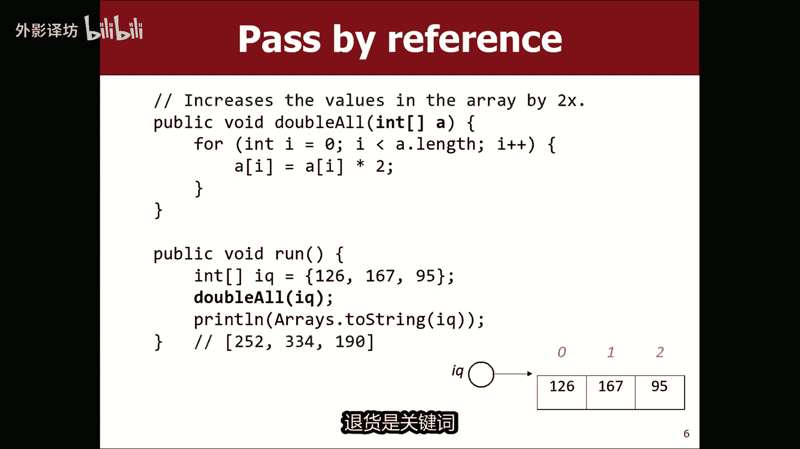

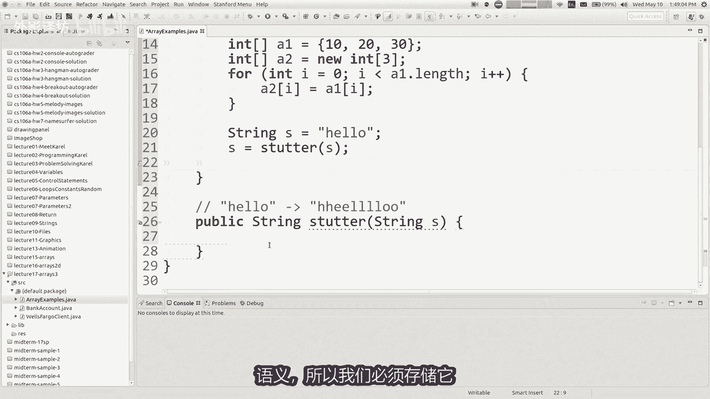

**值语义示例：**
```java
int x = 5;
int y = x; // 将x的值5复制给y
y = 17;    // 修改y
// 此时 x 仍然是5，y是17。两者独立。
```

**引用语义示例（数组）：**
```java
int[] a1 = {4, 5, 8};
int[] a2 = a1; // a2 现在与 a1 引用同一个数组对象
a2[0] = 7;     // 修改a2的第一个元素
// 此时 a1[0] 也变成了7，因为a1和a2指向同一块内存。
```
当我们将一个数组变量赋值给另一个时，并没有创建新的数组副本，而是创建了一个新的引用（或别名），指向**同一个**数组对象。因此，通过任何一个引用修改数组，另一个引用看到的数组也会改变。

**为什么Java要这样设计？**
主要有两个原因：
1.  **效率**：复制大型数组（尤其是包含大量元素或对象时）开销很大。引用赋值非常快速。
2.  **共享**：有时我们确实希望方法能修改传入的数组，让调用者看到变化。

---

## 引用语义的应用：输出参数

利用引用语义，我们可以将数组参数作为“输出参数”使用。方法的目的是填充或修改这个数组，而不是从中读取信息。

**例如，一个用随机数填充数组的方法：**
```java
public void fillWithRandomNumbers(int[] arr) {
    Random rand = new Random();
    for (int i = 0; i < arr.length; i++) {
        arr[i] = rand.nextInt(100);
    }
}
// 调用
int[] myArray = new int[10];
fillWithRandomNumbers(myArray);
// myArray 现在充满了随机数
```
调用者提供一个“空”数组，方法负责填充它。由于引用语义，`myArray` 在方法调用后被修改。

---

## 对象数组与 `null`

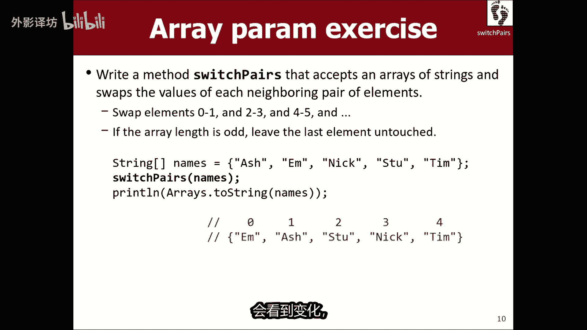

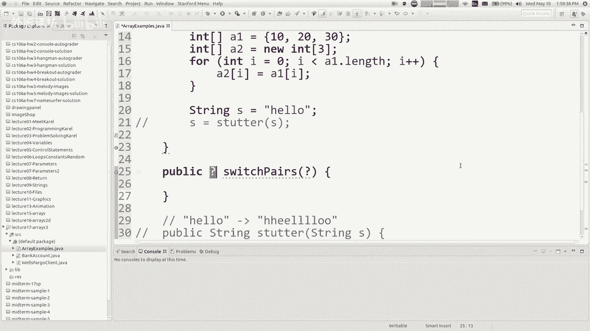

对象数组也遵循引用语义，但有一个关键点：新创建的对象数组，每个元素默认值是 `null`，表示“没有对象”。

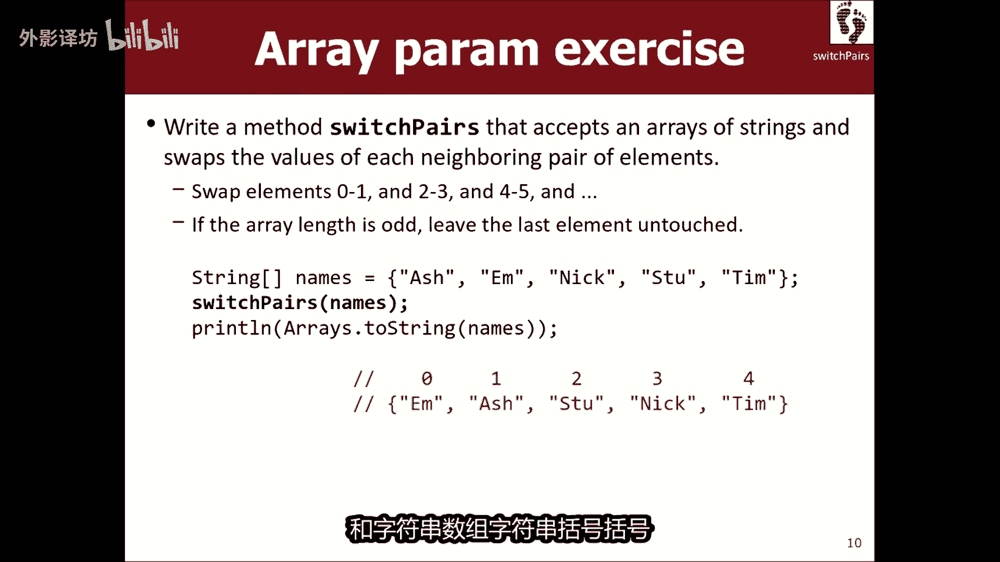

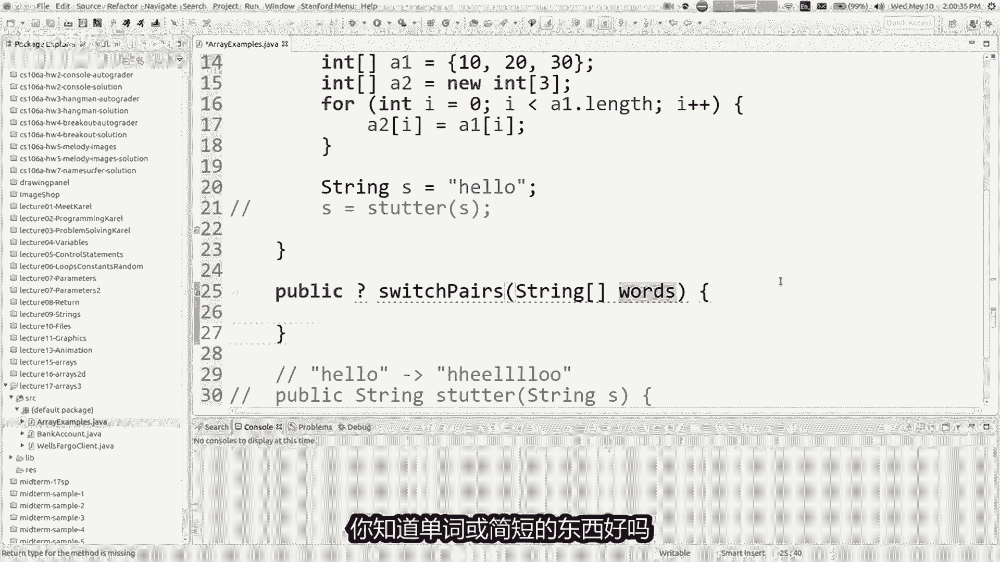

**示例：**
```java
BankAccount[] accounts = new BankAccount[3]; // 创建可存放3个BankAccount引用的数组
// 此时 accounts[0], accounts[1], accounts[2] 都是 null
accounts[0] = new BankAccount(); // 现在第一个位置有了一个实际的对象
```
在使用数组元素（如调用 `accounts[0].deposit(100)`）之前，必须确保该位置不是 `null`，否则程序会抛出 `NullPointerException` 异常。

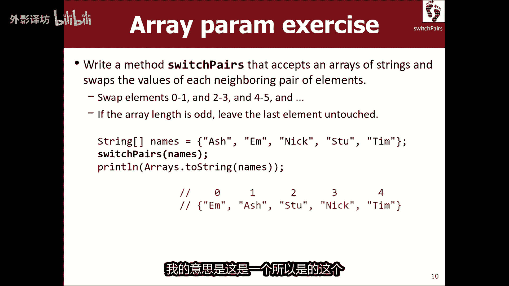

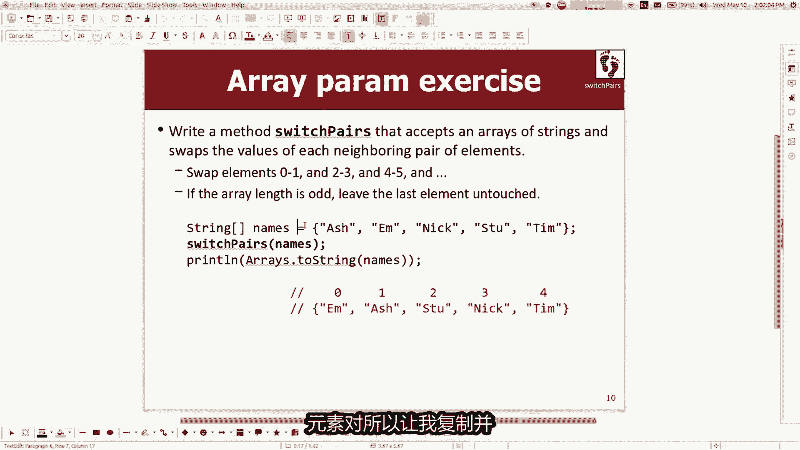

---

## 实践：编写数组处理方法

让我们编写一个方法，交换数组中相邻元素的位置。

**以下是实现 `switchPairs` 方法的步骤：**
1.  方法接收一个字符串数组。
2.  遍历数组，每次步进2个索引（`i += 2`）。
3.  交换索引 `i` 和 `i+1` 位置的元素。
4.  注意处理数组长度为奇数的情况，最后一个元素保持不变。

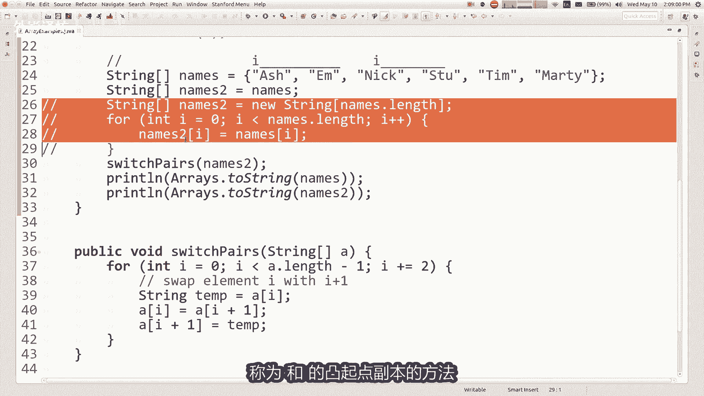

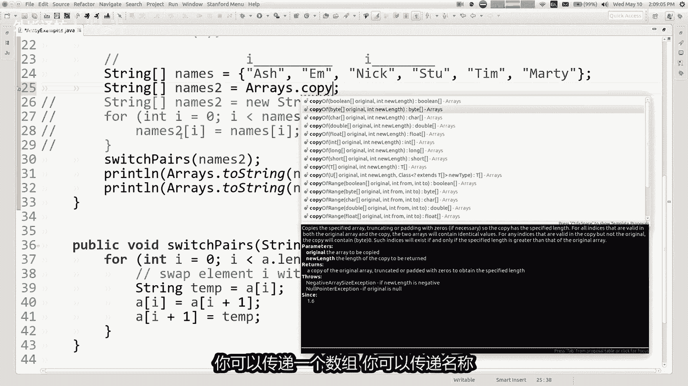

```java
public void switchPairs(String[] arr) {
    for (int i = 0; i < arr.length - 1; i += 2) {
        // 交换 arr[i] 和 arr[i+1]
        String temp = arr[i];
        arr[i] = arr[i+1];
        arr[i+1] = temp;
    }
}
```
这个方法返回类型为 `void`，因为它直接修改了传入的数组（引用语义）。

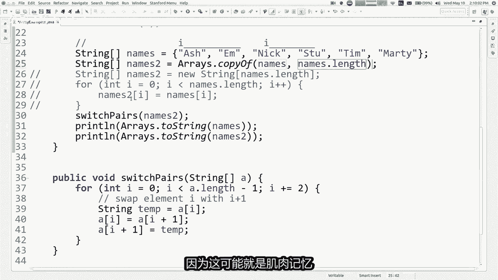

---

## 使用数组进行计数

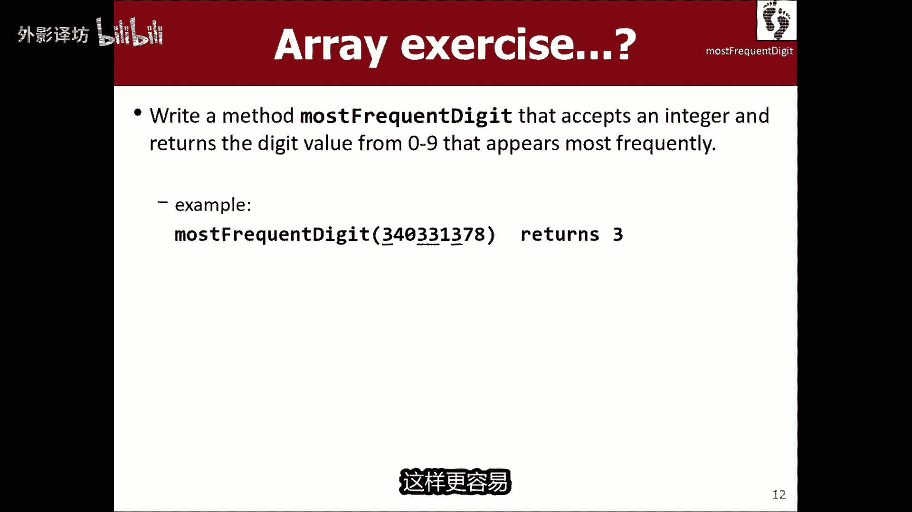

一个常见的编程技巧是使用数组作为计数器。例如，统计一个整数中各个数字（0-9）出现的次数。

**解决思路如下：**
1.  创建一个长度为10的数组 `counts`，索引0-9分别对应数字0-9。
2.  初始时所有计数器为0。
3.  使用循环和 `% 10`、`/ 10` 操作逐个提取整数中的数字。
4.  每提取一个数字 `d`，就执行 `counts[d]++`。
5.  最后，遍历 `counts` 数组，找到值最大的那个索引，即为出现最频繁的数字。

**核心代码片段：**
```java
public int mostFrequentDigit(int n) {
    int[] counts = new int[10]; // 步骤1&2
    // 步骤3&4：提取并计数数字
    while (n > 0) {
        int digit = n % 10; // 获取最后一位数字
        counts[digit]++;    // 对应计数器加1
        n = n / 10;         // 去掉最后一位
    }
    // 步骤5：寻找最大计数
    int maxIndex = 0;
    for (int i = 1; i < counts.length; i++) {
        if (counts[i] > counts[maxIndex]) {
            maxIndex = i;
        }
    }
    return maxIndex; // 返回出现最频繁的数字
}
```

---

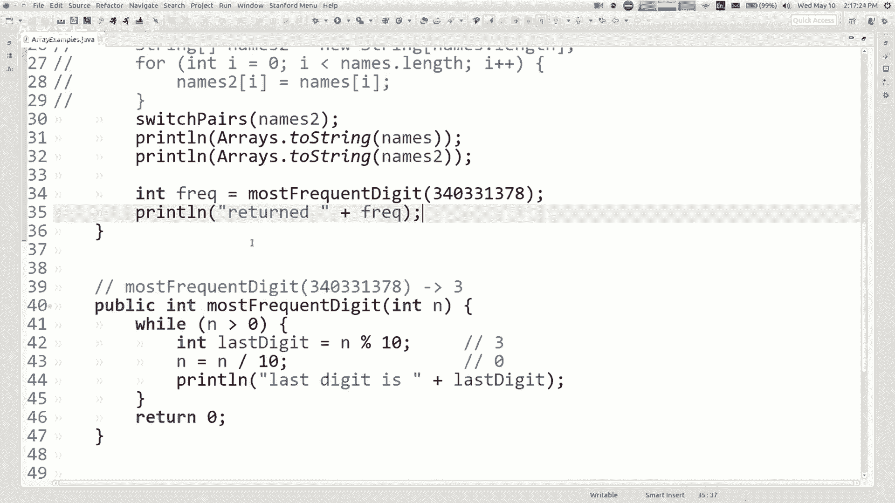

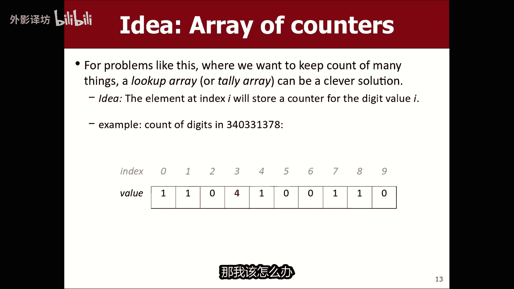

## 总结

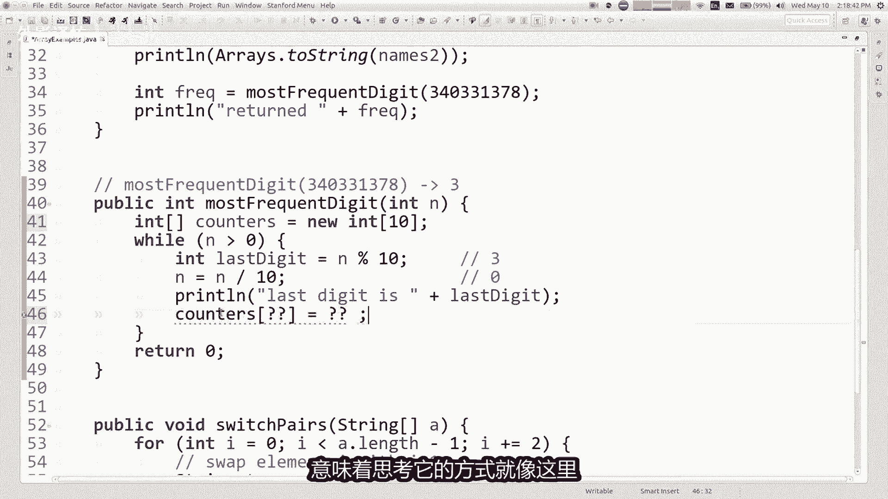

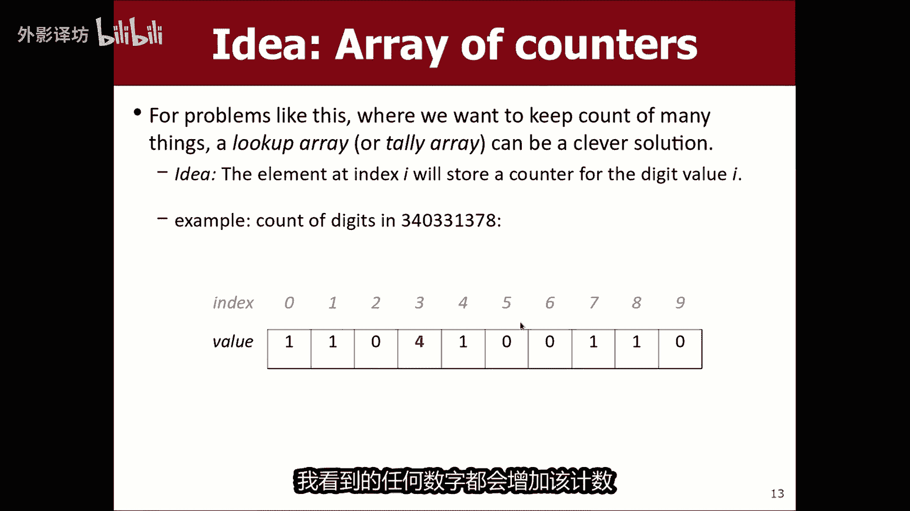

本节课中我们一起学习了：
1.  **引用语义**：数组和对象变量存储的是对内存中对象的引用，而非对象本身。赋值操作是复制引用，导致多个变量共享同一对象。
2.  利用引用语义，可以将数组作为**输出参数**，让方法填充或修改其内容。
3.  新创建的**对象数组**元素初始为 `null`，使用前需初始化。
4.  数组的经典应用之一——**计数**：通过将数据值映射到数组索引，可以高效地统计频率、出现次数等问题。

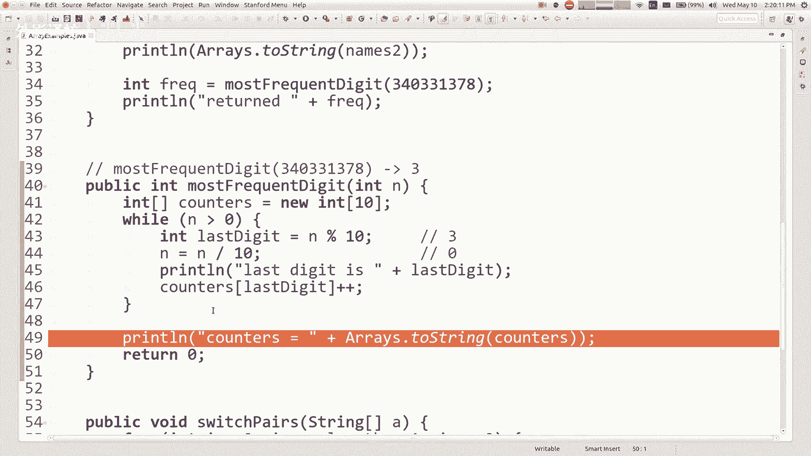

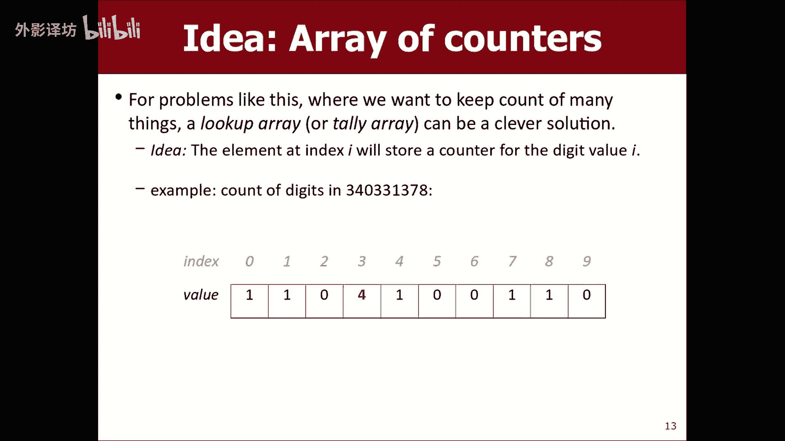

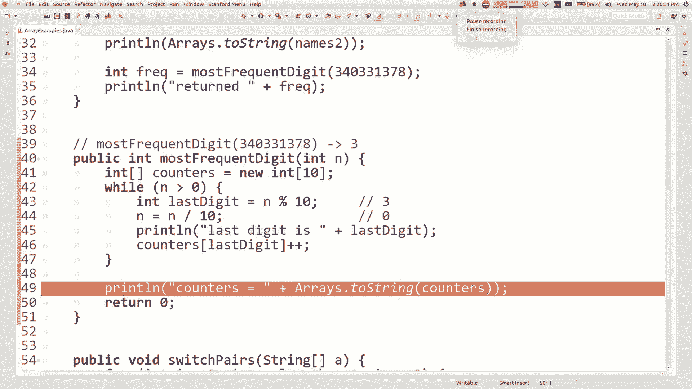

理解引用语义是掌握Java中数组和对象操作的关键。计数数组的技巧则是一种非常实用的算法思想，在后续编程中会经常用到。