# 课程18：更多关于类与继承 🧩

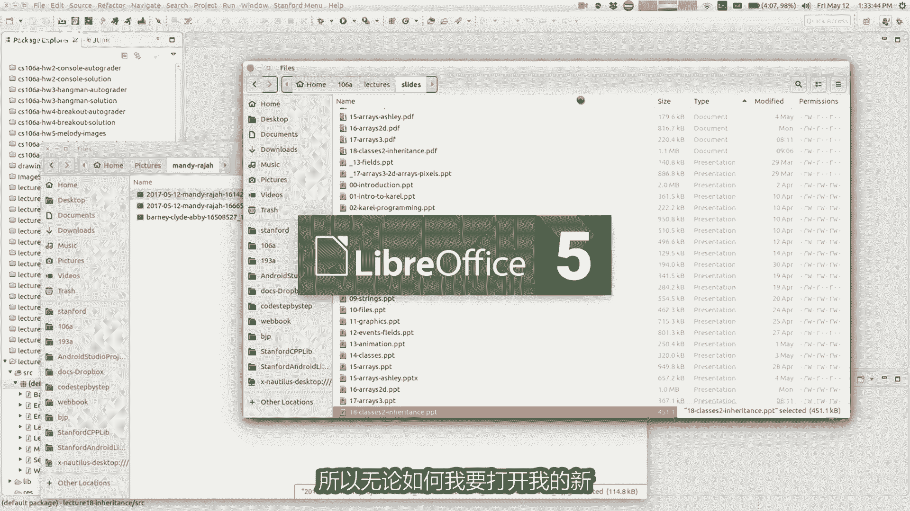

在本节课中，我们将深入学习Java中类和对象的更多细节，并引入一个重要的新概念——继承。我们将探讨如何通过类来构建更模块化、更易维护的程序，以及如何通过继承来建立类之间的关系，从而复用和扩展代码。

---

## 回顾：类与对象

上一节我们介绍了类和对象的基本概念。本节中，我们将更详细地回顾它们，并探讨一些关键细节。

类就像一个蓝图或模板，它描述了某种类型的事物应该具有的数据（字段）和行为（方法）。例如，一个“银行账户”类定义了账户应有的属性（如户主姓名、余额）和操作（如存款、取款）。

对象则是根据这个蓝图创建的具体实例。每个对象都拥有类中定义的字段的独立副本，并可以执行类中定义的方法。

以下是一个简单的“银行账户”类示例：

```java
public class BankAccount {
    private String name;
    private double balance;

    public BankAccount(String accountName, double initialBalance) {
        name = accountName;
        balance = initialBalance;
    }

    public void deposit(double amount) {
        balance += amount;
    }

    public void withdraw(double amount) {
        balance -= amount;
    }

    public double getBalance() {
        return balance;
    }
}
```

在这个类中：
*   `name`和`balance`是**私有字段**，用于存储对象的状态。
*   `BankAccount`是**构造函数**，用于在创建新对象时初始化这些字段。
*   `deposit`、`withdraw`和`getBalance`是**方法**，定义了对象的行为。

当我们创建对象时，例如 `BankAccount ba1 = new BankAccount(“Marty”, 1.0);`，就会在内存中生成一个独立的`BankAccount`实例，拥有自己的`name`和`balance`。

---

## 关键字 `this`

有时，在类的方法或构造函数中，我们需要明确指代“当前这个对象”。这时就可以使用关键字 **`this`**。

最常见的用法是区分同名的参数和字段。例如，在构造函数中：

```java
public BankAccount(String name, double balance) {
    this.name = name; // `this.name` 指当前对象的字段
    this.balance = balance; // 参数`balance`赋值给当前对象的字段`balance`
}
```

这里，`this.name` 明确表示要设置当前对象的 `name` 字段，而不是指构造函数参数 `name`。

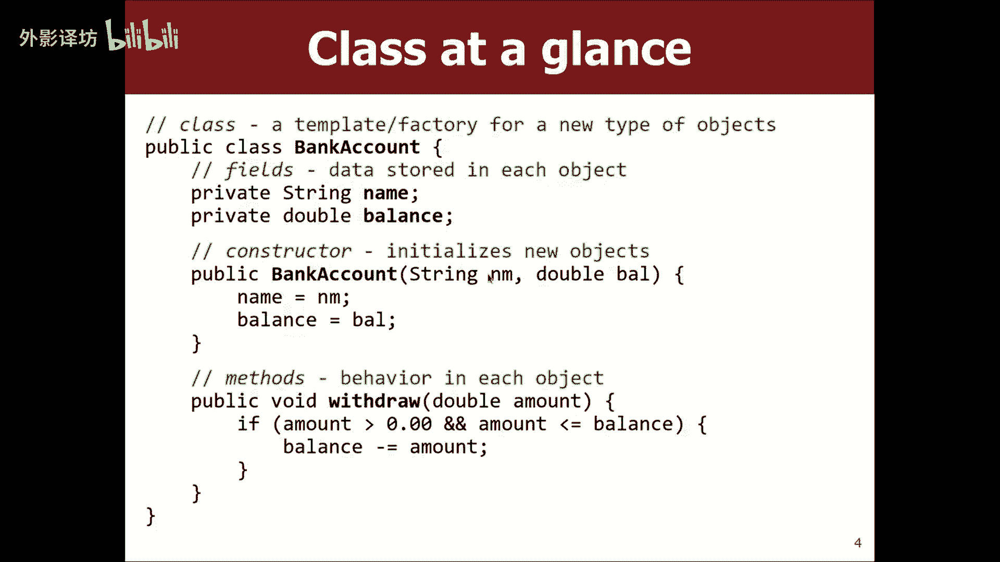

---

## 封装：`public` 与 `private`

封装是面向对象编程的核心原则之一，它通过访问修饰符来控制对类内部细节的访问。

*   **`private`（私有）**：标记为`private`的字段或方法只能在**定义它的类内部**被访问。这是默认的、推荐的做法，可以保护对象的数据不被外部代码随意修改。
*   **`public`（公共）**：标记为`public`的字段或方法可以被**任何其他类**访问。

在之前的`BankAccount`类中，`balance`字段是`private`的。这意味着在另一个类（客户端程序）中，你不能直接写 `ba1.balance = 1000;` 来修改余额。这就像现实世界中，你不能随意走进银行更改自己账户的余额一样。

如果你需要让外部代码**读取**但不**修改**某个值，标准的做法是提供一个公共的“getter”方法：

```java
public double getBalance() {
    return balance;
}
```

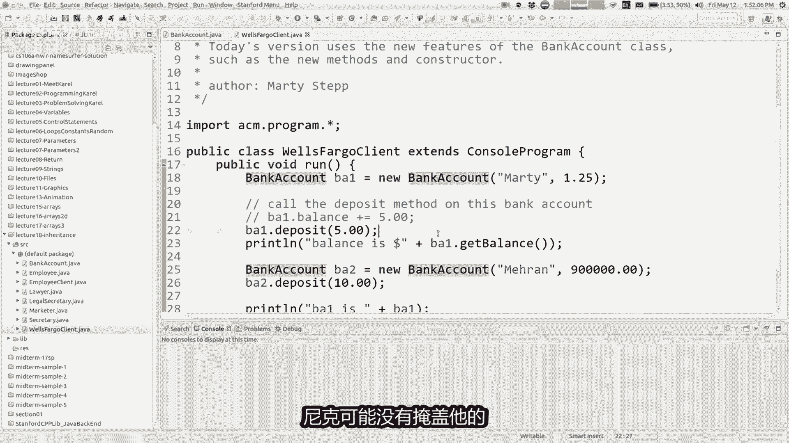

这样，客户端代码可以通过 `ba1.getBalance()` 来查询余额，但无法直接修改它，从而保证了数据的安全性和一致性。

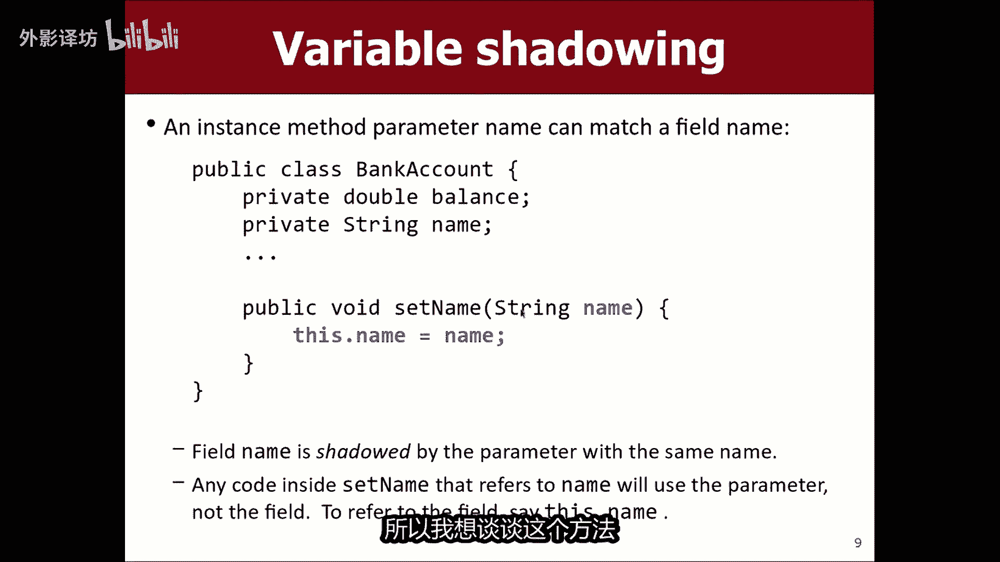

---

## 方法 `toString`

当我们尝试直接使用 `println` 打印一个对象时，例如 `System.out.println(ba1);`，Java默认会输出一个看似无意义的字符串（如 `BankAccount@3d1cf84`），这实际上是对象的内存地址。

为了让对象能以更友好、更有意义的方式打印出来，我们可以在类中定义一个特殊的 **`toString`** 方法。当打印对象时，Java会自动调用这个方法。

以下是`toString`方法的示例：

```java
public String toString() {
    return “Account: name=” + name + “, balance=$” + balance;
}
```

定义了这个方法后，再次打印 `ba1` 就会输出：`Account: name=Marty, balance=$1.0`。


`toString`方法应该**返回**一个描述对象的字符串，而不是直接在方法内部打印它。这样其他代码可以灵活使用这个字符串（例如打印、显示在图形界面或发送到网络）。


---

## 引入继承


随着程序规模扩大，你可能会创建许多相似的类。继承允许我们表达类之间的“是一种（is-a）”关系，并实现代码的复用。

**继承**意味着一个类（称为**子类**或**派生类**）可以基于另一个类（称为**父类**、**超类**或**基类**）来构建。子类会自动获得父类的所有字段和方法，并可以添加自己特有的字段和方法，或修改（覆盖）父类的方法。

你其实已经在使用继承了！例如，我们写的每个程序 `public class MyProgram extends ConsoleProgram`，其中的 `MyProgram` 就是 `ConsoleProgram` 的子类，因此自动获得了显示窗口、处理输入输出等方法。

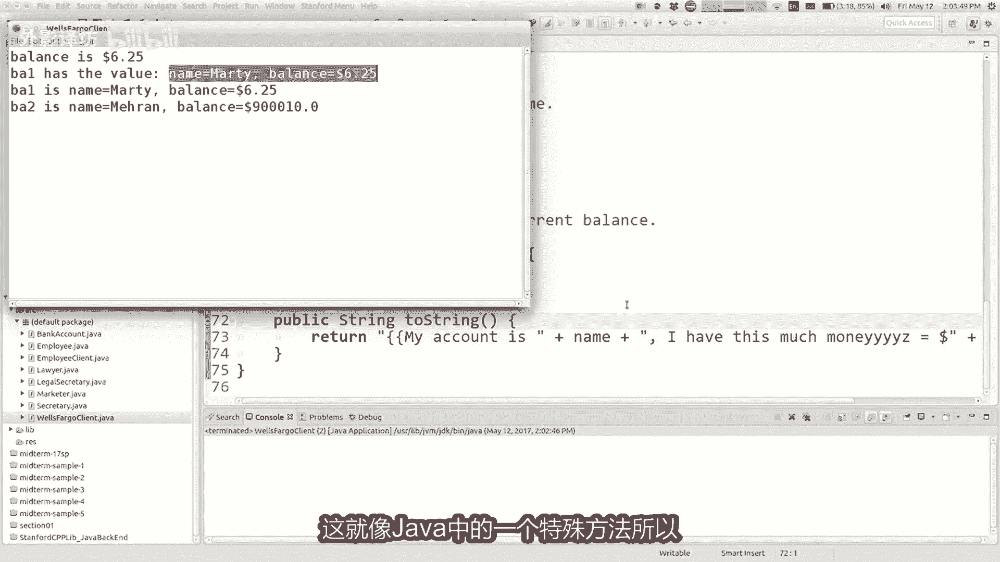

---

### 继承的语法与示例

使用关键字 **`extends`** 来声明继承关系。

假设我们有一个律师事务所的员工管理系统。所有员工都有一些共同属性：

```java
public class Employee {
    private int hoursWorked = 40;
    private double salary = 40000.0;
    private int vacationDays = 10;
    private String vacationForm = “Yellow”;

    public int getHours() { return hoursWorked; }
    public double getSalary() { return salary; }
    public int getVacationDays() { return vacationDays; }
    public String getVacationForm() { return vacationForm; }
}
```


现在，我们需要表示“秘书”这种员工。秘书具有员工的所有共性，但可能还有一个额外技能（比如“打字”）。我们可以通过继承来避免重复编写代码：


```java
public class Secretary extends Employee { // Secretary 继承自 Employee
    public void takeDictation() {
        System.out.println(“I can take dictation.”);
    }
}
```

`Secretary` 类通过 `extends Employee` 自动获得了 `Employee` 的所有方法（`getHours`, `getSalary`等）。我们只需在 `Secretary` 类中添加其特有的 `takeDictation` 方法即可。

---


### 方法覆盖 (`Override`)

有时，子类可能想改变从父类继承来的某些行为。例如，“律师”也是员工，但他们可能有更长的假期，或者使用不同的假期申请表。

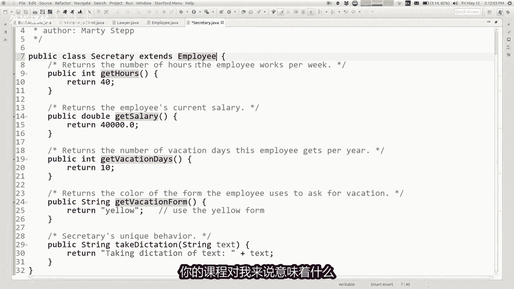

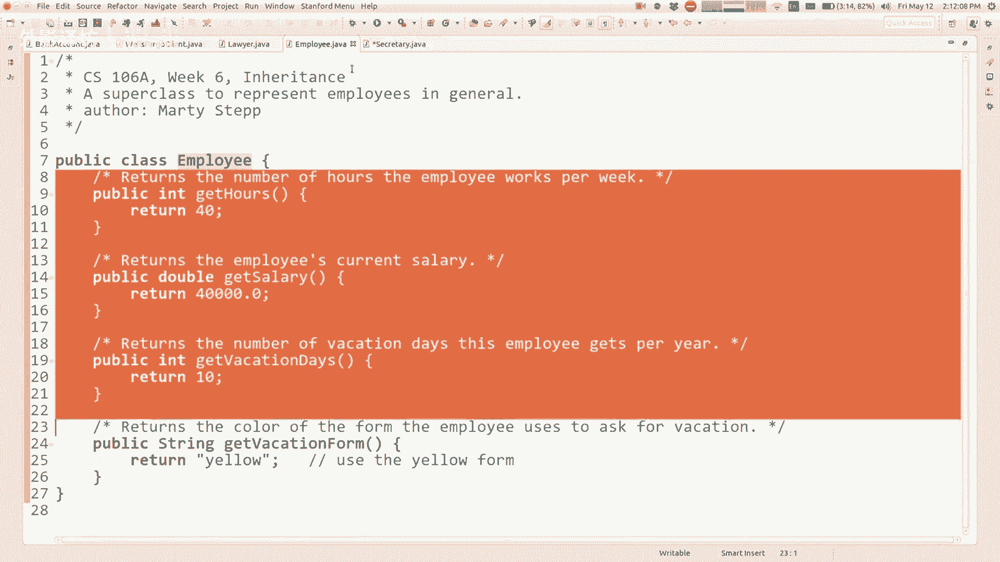

这时，子类可以**覆盖**父类的方法。只需在子类中重新定义一个与父类方法**名称、返回类型、参数列表完全相同**的方法。


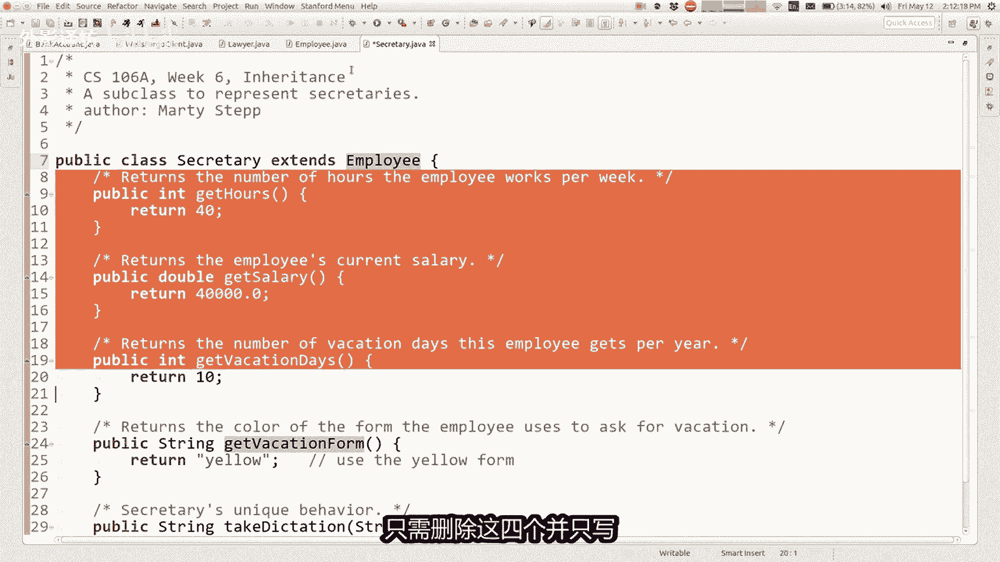

```java
public class Lawyer extends Employee {
    // 覆盖：律师有15天假期，而不是10天
    public int getVacationDays() {
        return 15;
    }

    // 覆盖：律师使用粉色假期申请表
    public String getVacationForm() {
        return “Pink”;
    }

    // 律师特有的行为
    public void sue() {
        System.out.println(“I’ll see you in court!”);
    }
}
```

现在，当我们调用 `Lawyer` 对象的 `getVacationDays()` 方法时，将执行子类中覆盖后的版本，返回15。

---


### 使用 `super` 调用父类方法

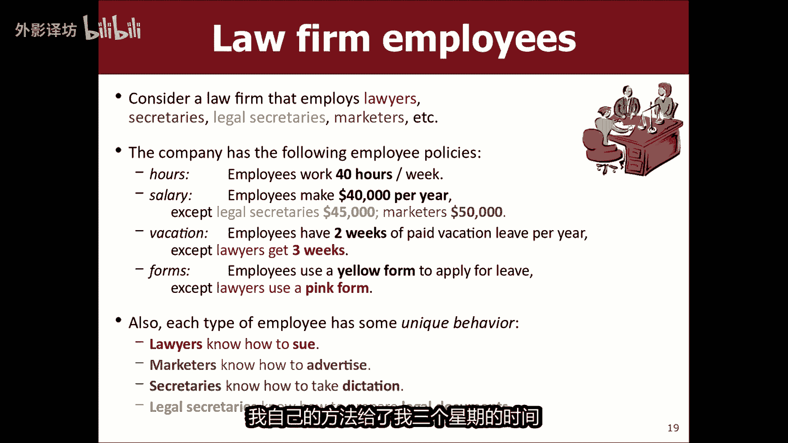

在覆盖方法时，我们有时希望基于父类的行为进行扩展，而不是完全替换。关键字 **`super`** 允许我们调用父类中被覆盖的方法或访问父类的字段。

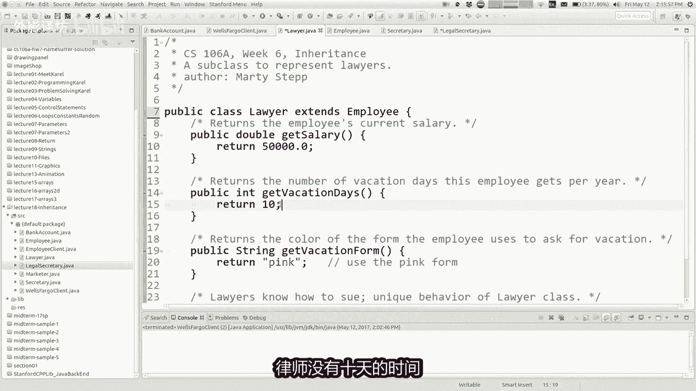


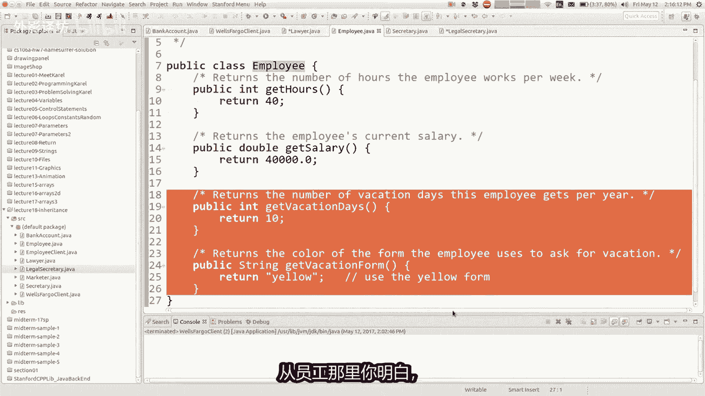

例如，假设公司政策改变，所有员工的基准假期增加了。我们希望律师的假期总是在员工基准假期上再加5天，而不是写死一个固定数字15。


```java
public class Lawyer extends Employee {
    public int getVacationDays() {
        // 先获取父类（Employee）的假期天数，然后加5
        return super.getVacationDays() + 5;
    }
}
```

这样，无论 `Employee` 类的 `getVacationDays()` 方法如何变化（比如从10天改为20天），`Lawyer` 的假期天数都会自动调整为（父类假期 + 5）天，代码更易维护。

---

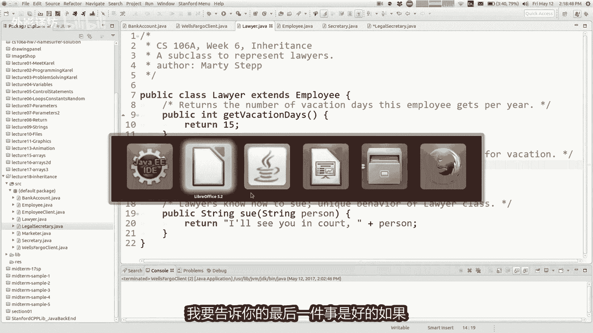

## 总结


本节课中我们一起学习了：
1.  **类与对象的深入理解**：类作为蓝图，对象作为实例，每个对象拥有独立的字段副本。
2.  **关键字 `this`**：用于在类内部指代当前对象，常用于区分同名参数和字段。
3.  **封装与访问控制**：使用 `private` 保护数据，通过公共的 `getter` 方法提供受控的访问。
4.  **`toString` 方法**：用于返回对象的字符串表示，便于调试和输出。
5.  **继承的概念与语法**：使用 `extends` 建立类之间的父子关系，实现代码复用。
6.  **方法覆盖**：子类可以重新定义父类的方法以改变其行为。
7.  **关键字 `super`**：用于在子类中调用父类的方法或构造函数，以便在扩展功能时复用父类逻辑。


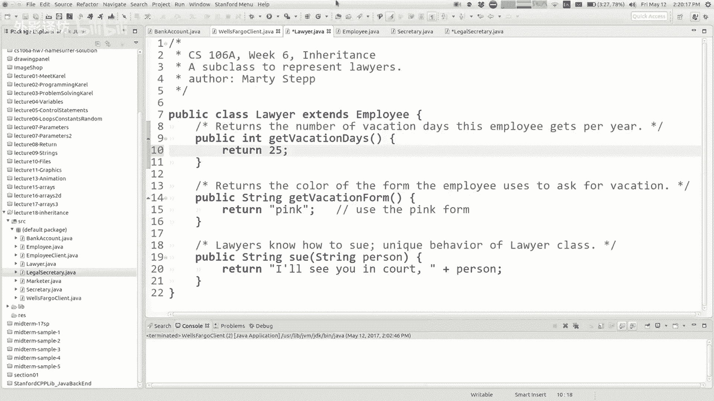

掌握这些概念是构建复杂、模块化Java程序的基础。通过合理地使用类和继承，你可以创建出结构清晰、易于理解和维护的代码。